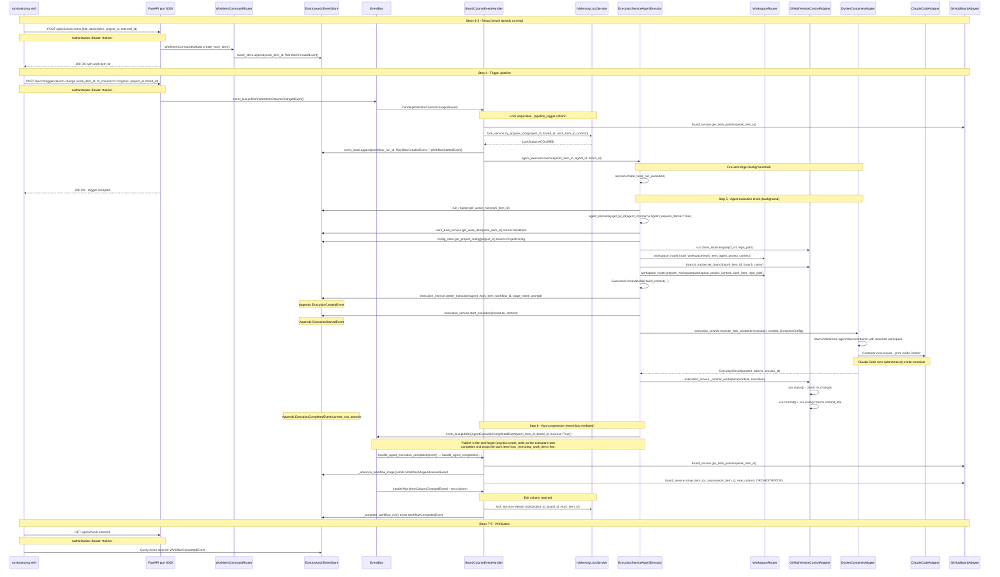

# Bootstrap Architecture

Authoritative reference for how the bootstrap use case works within Codetoreum's hexagonal architecture. This document covers the production code path exercised by `/run-bootstrap`: a single project, a single agent, a single work item, triggered via the REST API.

---

## 1. Purpose and Scope

### What bootstrap is

Bootstrap is the primary mechanism for proving out the Codetoreum production implementation incrementally. It exercises the real production code path end-to-end using live external services:

- **GitHub** (`tinkermonkey/rounds`) — real issue creation, real board management
- **Claude Code** — real `claude --print` subprocess invoked by `ClaudeCodeAdapter` inside a Docker container
- **Elasticsearch** — real event store and configuration store
- **Redis** — real event distribution

Bootstrap is triggered by the `/run-bootstrap` skill (`.claude/commands/run-bootstrap.md`), which drives a 9-step cycle: start server, register project, create work item, trigger column change, monitor agent execution, observe auto-progression, verify event emission, and report results.

### What bootstrap is not

Bootstrap is not simulation. It does not use mock adapters. It is not suitable for regression testing or CI. It is a deficiency-finding harness — it finds production bugs that deterministic simulation cannot expose.

### Why it exists

Simulation mode runs 10–100x faster than real execution and never touches external services. It is excellent for verifying business logic but cannot detect integration defects: misconfigured credentials, adapter wiring gaps, missing index initialization, or incorrect API call patterns. Bootstrap closes that gap by running the actual adapter chain against real services with a deliberately narrow scope.

### Deliberate limitations vs simulation

| Dimension | Bootstrap | Simulation |
|-----------|-----------|------------|
| External services | Real (GitHub, ES, Redis) | None (all mocked) |
| Speed | Real-time (minutes per run) | 10–100x (seconds) |
| Projects | 1 (`rounds`) | Many (via scenario YAML) |
| Agents | 1 (`claude-code-agent`) | Many (configurable) |
| Work items | 1 per run | Many (configurable) |
| Trigger | REST API call | SimulationRunner |
| Webhook | Not supported | Not applicable |
| Docker isolation | Used (container execution path) | Configurable |
| State persistence | ES + Redis (real) | InMemory adapters |

---

## 2. Configuration Sources

Bootstrap configuration flows through three sources that are loaded in strict order.

### Source 1: `bootstrap/rounds.json`

The canonical definition of the rounds project for bootstrap purposes. Contains:

```
project:   id, name, github_org ("tinkermonkey"), github_repo ("rounds")
agents:    name, description, coding_agent, invocation { mode, model, timeout_seconds, mode_config },
           capabilities, makes_code_changes, commit_policy
board:     id, name, columns[] with type/agent_id/is_pipeline_trigger/is_exit_column/auto_progress_on_completion
```

> The agent shape is the D6 schema (proposal §3h). The loader rejects the legacy top-level `model`/`timeout`/`requires_docker` keys with a clear error, and validates `invocation.mode` is in the configured coding-agent adapter's `supported_invocation_modes()` at startup.

This file is the ground truth for what `register_project.py` writes to Elasticsearch and what `project_bootstrap_loader.py` loads into in-memory services at server startup.

### Source 2: `bootstrap/register_project.py`

Run once before server start (or whenever the project definition changes). Connects directly to Elasticsearch and persists:

- `ProjectConfig` (id, name, github_org, github_repo, metadata) via `ElasticsearchConfigStorage.save_project_config()`
- `AgentConfig` (agent_name, model, timeout, capabilities) per agent via `ElasticsearchConfigStorage.save_agent_config()`

Board column definitions are NOT persisted by `register_project.py` — they are loaded from the JSON file by `project_bootstrap_loader.py` at server startup.

**Ordering constraint**: `register_project.py` MUST complete before the server starts. The server's `ElasticsearchConfigStorage` reads from the same indices that `register_project.py` writes. If the server starts before registration, `_load_bootstrap_projects` will find no project config during Phase 5c and `register_project_repo()` will never be called, leaving `GitHubTicketAdapter` without a repo mapping.

### Source 3: `project_bootstrap_loader.py` (Phase 5c)

`ProductionApplicationBootstrap._load_bootstrap_projects()` calls `load_bootstrap_dir()` from `src/codetoreum/infrastructure/bootstrap/project_bootstrap_loader.py`. It scans `bootstrap/*.json` files and populates three in-memory services that are not Elasticsearch-backed:

| Target service | What it receives | Method called |
|---------------|-----------------|---------------|
| `IAgentRepository` | `Agent` domain objects built from `agents[]` entries | `agent_repository.save(agent, project_id)` |
| `IWorkflowConfigService` | `BoardWorkflowTemplate` built from `board` config | `workflow_config.save_board_workflow_template(template)` |
| `IConfigStore` | `ProjectConfig` with github_org, github_repo | `config_store.save_project_config(project_cfg)` |

After `load_bootstrap_dir()` returns, `_load_bootstrap_projects()` calls `config_store.list_projects()` and for each project with a `github_repo`, calls `raw_adapter.register_project_repo(project_id, github_repo)` on the raw (pre-resilience-decoration) `GitHubTicketAdapter`. This wires per-project repo routing so `GitHubTicketAdapter._get_repo()` can resolve the correct repository without a global `GITHUB_REPO` env var.

**Wiring constraint**: The raw adapter reference (`self._raw_ticket_adapter`) is captured in Phase 4 before resilience decoration. By Phase 5c, `self.adapters.ticket_system` holds the resilience-wrapped decorator, not the raw adapter. `register_project_repo()` is not part of the `ITicketSystem` port — it is a bootstrap-only lifecycle method. This is intentional: the port contract remains clean; the bootstrap-specific call goes to the raw reference.

---

## 3. Production Bootstrap Phases (Bootstrap Perspective)

`ProductionApplicationBootstrap.setup()` in `src/codetoreum/infrastructure/bootstrap/production_bootstrap.py` executes 7 phases. Below is each phase annotated for what it does in the bootstrap use case.

### Phase 0 — Event type registration

`auto_register_event_types()` registers all 151 `CodetoreumEvent` subclasses with `EventSerializer` so the Elasticsearch event store can deserialize events during replay. Required before any event is appended to the store.

### Phase 1 — Infrastructure creation

`_create_infrastructure()` creates:

- `EventBus` — in-process pub/sub for domain events
- `DeadLetterQueue` + `DeadLetterQueueFailedEventStoreAdapter` — captures events that fail handler processing
- `InMemoryAuditStore` — audit log for the session

These are purely in-memory. No external connections are made here.

Also in Phase 1b: `AdapterFactory` is instantiated (defaults to `PRODUCTION` mode) and `AdapterResolver` is created with a temporary `CapturingMockEventEmitter` (replaced after Phase 2 when the real event emitter adapter is resolved).

### Phase 2 — Adapter resolution (bootstrap critical path)

`resolver.resolve_all()` creates all 31 adapters (`llm_provider` + `storage` slots retired in Phase D5). For bootstrap, the adapters that matter are:

| Adapter slot | Production class | Credentials required |
|-------------|-----------------|---------------------|
| `ticket_system` | `GitHubTicketAdapter` | `GITHUB_TOKEN` |
| `board` | `GitHubBoardAdapter` | `GITHUB_TOKEN` |
| `coding_agent` | `ClaudeCodeAdapter` (implements `ICodingAgent`; replaces the prior `llm_provider` slot) | `ANTHROPIC_API_KEY` (or OAuth) |
| `prompt_builder` | `DefaultPromptBuilder` (application-layer, no external creds) | none |
| `version_control` | `GitHubVersionControlAdapter` | `GITHUB_TOKEN` |
| `container` | `DockerContainerAdapter` | Docker socket |
| `event_store` | `ElasticsearchEventStore` | `ELASTICSEARCH_URL` |
| `config_store` | `CachedConfigStore` wrapping `ElasticsearchConfigStorage` | `ELASTICSEARCH_URL` |
| `agent_repository` | `InMemoryAgentRepository` | none |
| `workflow_config` | in-memory impl | none |
| `run_registry` | `InMemoryActiveWorkflowRunRegistry` | none |
| `branch_tracker` | in-memory impl | none |

> Both the `llm_provider` and `storage` adapter slots retired with the coding-agent port redesign (Phase D5). The coding-agent adapter owns subprocess invocation directly; agent output flows through the event stream rather than a blob store. See DEF-015 in §9.

Phase 2b initializes the event store: `_initialize_event_store()` calls `initialize_event_store()` which ensures Elasticsearch indices exist. If this fails, the server will not start.

### Phase 3 — Critical path enforcement

`_validate_no_mocks_on_critical_path()` inspects the concrete class name of each adapter in `CRITICAL_ADAPTER_SLOTS`:

```python
CRITICAL_ADAPTER_SLOTS = {"board", "ticket", "coding_agent", "version_control", "container", "code_review"}
```

Any adapter whose class name contains `Mock`, `InMemory`, `Fake`, or `Null` causes a `RuntimeError`. This guard ensures bootstrap always exercises real adapters on the execution-critical path.

Phase 3b: `_validate_event_emitter_is_production()` ensures the resolved event emitter is not `CapturingMockEventEmitter`.

### Phase 4 — Resilience decoration

`_apply_resilience_decorators()` wraps adapters using `ResilienceFactory(mode=OperationMode.PRODUCTION)`:

| Adapter | Resilience applied |
|---------|-------------------|
| `ticket_system` | Rate limiter → circuit breaker → timeout → retry |
| `coding_agent` | Rate limiter → circuit breaker → timeout → retry (via `ResilientCodingAgentDecorator`, replaces `ResilientLLMProviderDecorator`) |
| `repository` | Rate limiter → circuit breaker → timeout → retry |
| `container` | Rate limiter → circuit breaker → timeout → retry |
| `version_control` | Rate limiter → circuit breaker → timeout → retry |

**Critical ordering constraint**: Before wrapping `ticket_system`, Phase 4 captures the raw reference: `self._raw_ticket_adapter = self.adapters.ticket_system`. After wrapping, `self.adapters.ticket_system` is the resilience decorator. The raw reference is used in Phase 5c to call `register_project_repo()` (not part of the port interface).

Phase 4b: `BranchResolutionAdapter` is constructed after resilience decoration, so it receives the wrapped `ticket_system` and `version_control` adapters.

### Phase 5 — Service creation

`_create_services()` builds all 11 application services. For bootstrap, the critical chain (post-redesign) is:

```
ClaudeCodeAdapter(coding_agent_config, prompt_builder=DefaultPromptBuilder,
                  event_emitter, container=container_adapter, credential_provider)
ExecutionService(coding_agent, event_store, vcs=version_control, event_emitter)
WorkspaceRouter(vcs, event_store, branch_resolution_service)
ExecutionServiceAgentExecutor(execution_service, workspace_router, config_store,
                              agent_repository, work_item_service=MockWorkItemService,
                              run_registry, branch_tracker, vcs, clock=RealTimeClock(), ...)
AgentScheduler(..., agent_executor=execution_service_executor)
WorkflowOrchestrator(..., dispatch_via_task_queue=False)
WorkItemService(event_store)
MultiProjectOrchestrator(project_manager, workflow_orchestrator, board_service, poll_interval_seconds=30)
```

Note: `ExecutionService` and `WorkspaceRouter` no longer depend on `IContainer` or `IStorage` directly. The container is consumed by `ClaudeCodeAdapter`'s containerized strategy; storage is retired.

Note: `ExecutionServiceAgentExecutor` receives `WorkItemService` as a constructor argument. The service is instantiated earlier in `_create_services` (immediately after `WorkspaceRouter`) so it is available when the executor is built. The post-hoc `_work_item_service` swap that previously existed in Phase 5d is gone.

**Phase 5a**: `agent_scheduler.start()` starts the consumer loop.

**Phase 5b**: `_initialize_codetoreum_board()` sets up board configuration.

**Phase 5c**: `_load_bootstrap_projects()` loads `bootstrap/rounds.json` into `IAgentRepository`, `IWorkflowConfigService`, and `IConfigStore`. Then calls `register_project_repo()` on the raw ticket adapter for each project.

**Phase 5d**: `WorkItemService` is constructor-injected into `ExecutionServiceAgentExecutor` during `_create_services`. The phase label is retained for parity with log-grep checkpoints but the architectural seam (private attribute swap on the executor) is gone.

**Phase 5e**: `asyncio.ensure_future(self.services.multi_project_orchestrator.start())` launches the MPO poll loop as a background task. MPO is the sole orchestration entry point — it polls all enabled projects every 30 seconds, reconciles boards, and delegates per-project work to `WorkflowOrchestrator`. Starting after Phase 5d ensures `WorkItemService` is fully wired before the first poll cycle.

### Phase 6 — Input port creation

`_create_ports()` creates 17 input port adapter implementations. For bootstrap, the relevant ones are:

- `WorkItemCommandAdapter` — handles work item create/update commands
- `WorkflowCommandAdapter` — handles workflow trigger commands
- `WorkItemQueryAdapter` — handles work item read queries

### Drill modes (harness extensions, not production phases)

The `/run-bootstrap` skill supports two drill modes that exercise failure paths a happy-path run cannot expose. These are documented in `.claude/commands/run-bootstrap.md` and run only when explicitly invoked.

**Restart drill** — kill the server mid-execution (after `WorkflowStartedEvent`, before `WorkflowCompletedEvent`) with SIGTERM, then restart. The expected outcome depends on which adapters are in-memory vs. persistent:
- With in-memory `IPipelineLockService` / `IActiveWorkflowRunRegistry` / `IWorkItemBranchTracker`: the work item is silently stuck. The drill demonstrates the persistence gap.
- With Phase B Redis-backed implementations: lock state is rebuilt, the orphaned run is detected (or resumed), and the pipeline does not lose serialization.

**Concurrent-trigger drill** — create two work items on the same board and trigger both before the first completes. Expected: the lock service returns `LockStatus.ACQUIRED` for the first and `LockStatus.QUEUED` for the second; the second is dispatched after the first releases the lock. Failure of this drill means pipeline serialization is broken (catastrophic for multi-instance deployment).

### Phase 7 — FastAPI app creation

`_create_fastapi_app()` calls `create_app()` from `src/codetoreum/adapters/primary/fastapi_app.py` and mounts all production routers. No simulation-only routes are mounted here. The board event bridge task is started, wiring `BoardColumnEventHandler` to process `WorkItemColumnChangedEvent` from the event bus.

Authentication is active: all 13 REST API routers have `Depends(auth_deps.require_auth)` applied. The server generates a JWT token on startup and prints it to the console. The token is printed at startup under `Authentication token:` and must be passed as `Authorization: Bearer <token>` in all REST API calls.

---

## 4. Runtime Execution Flow

The sequence below traces a complete bootstrap run from the `/run-bootstrap` skill's REST API calls through to agent completion.



### Domain events emitted in a successful run

| Phase | Event | Aggregate |
|-------|-------|-----------|
| Work item creation | `WorkItemCreatedEvent` | work_item_id |
| Pipeline trigger | `WorkItemColumnChangedEvent` | published to EventBus |
| Lock acquired | `LockAcquiredEvent` | (internal to lock service) |
| Workflow start | `WorkflowCreatedEvent`, `WorkflowStartedEvent` | workflow_run_id |
| Execution created | `ExecutionCreatedEvent` | execution_id |
| Execution started | `ExecutionStartedEvent` | execution_id |
| Execution completed | `ExecutionCompletedEvent` (with commit_sha, branch) | execution_id |
| Executor finished | `AgentExecutionCompletedEvent` (published by executor, consumed by BEH) | work_item_id (board scope) |
| Stage advance | `WorkflowStageAdvancedEvent` | workflow_run_id |
| Lock released | `LockReleasedEvent` | (internal to lock service) |
| Workflow done | `WorkflowCompletedEvent` | workflow_run_id |

### On agent failure

If `execute_with_container()` fails or the container exits non-zero:
- `execution_service.execute_with_container()` appends `ExecutionFailedEvent`
- `_run_execution` calls `_call_completion(work_item_id, board_id, success=False, error_summary=...)` which publishes `AgentExecutionCompletedEvent(success=False)` on the event bus
- `BEH.handle_agent_execution_completed` → `handle_agent_completion(success=False)` moves item to `on_failure_column` (if configured)
- `_fail_workflow_run()` appends `WorkflowFailedEvent`
- `lock_service.release_lock()` unblocks the pipeline

---

## 5. Active Ports and Adapters (Bootstrap Context)

Every port exercised in a bootstrap run, with its production adapter and role.

| Port Interface | Production Adapter | Bootstrap Role | Critical Path |
|---------------|-------------------|---------------|---------------|
| `ITicketSystem` | `GitHubTicketAdapter` (wrapped by `ResilientTicketSystemDecorator`) | Work item fetch, comment posting | Yes |
| `IBoardService` | `GitHubBoardAdapter` | Column position lookup, item move for auto-progression | Yes |
| `ICodingAgent` | `ClaudeCodeAdapter` (wrapped by `ResilientCodingAgentDecorator`) | Runs the Claude Code CLI in the configured invocation mode (containerized via `IContainer`, or host via subprocess); emits `CodingAgent*` events for tool calls, text outputs, thinking, rate limits, OTel spans, tokens used, and lifecycle. Replaces the prior `ILLMProvider` row. | Yes |
| `IPromptBuilder` | `DefaultPromptBuilder` (no resilience decoration; pure application logic) | Assembles a `StructuredPrompt` from work item + agent role + workspace context + prior outputs; coding agent adapters render the structured prompt to their vendor's expected format. | Yes (used by `ICodingAgent` adapters) |
| `IVersionControlService` | `GitHubVersionControlAdapter` (wrapped by resilience decorator) | Clone repo, status, commit, push | Yes |
| `IContainer` | `DockerContainerAdapter` (wrapped) | Consumed by `ClaudeCodeAdapter`'s containerized invocation strategy (and any future containerized coding-agent adapter). Launches `codetoreum-agent:latest` for agent execution. Filesystem-based output extraction (`copy_from_container("/output", ...)`) is retired — agent output flows through `CodingAgent*` events instead. | Yes (active) |
| `ICodeReviewService` | `GitHubCodeReviewAdapter` | Not invoked in basic bootstrap | Yes (validated, not called) |
| `IEventStore` | `ElasticsearchEventStore` | Persists all domain events; `WorkItemService` reads from it | No (infra) |
| `IConfigStore` | `CachedConfigStore` → `ElasticsearchConfigStorage` | Project config, agent config lookup | No (infra) |
| `IAgentRepository` | `ElasticsearchAgentRepository` (production) / `InMemoryAgentRepository` (simulation) | Agent domain object lookup; survives restart in production | No (infra) |
| `IWorkflowConfigService` | `ElasticsearchWorkflowConfigService` (production) / `InMemoryWorkflowConfigService` (simulation) | Board workflow template lookup; survives restart in production | No (infra) |
| `IActiveWorkflowRunRegistry` | `RedisActiveWorkflowRunRegistry` (production) / `InMemoryActiveWorkflowRunRegistry` (simulation) | Active run tracking between handler and executor; survives restart in production | No (infra) |
| `IWorkItemBranchTracker` | in-memory impl | Branch name tracking per work item | No (infra) |
| `IPipelineLockService` (`IQueuedPipelineLockService`) | `RedisPipelineLockService` (production) / `InMemoryLockService` (simulation) | Pipeline serialization (1 active execution per board); persistent in production | No (infra) |
| `IBranchResolutionService` | `BranchResolutionAdapter` | Branch name computation from ticket + VCS | No |
| `IAgentExecutor` | `ExecutionServiceAgentExecutor` | Drives the full execution chain | No (wired internally) |
| `IWorkItemService` | `WorkItemService` (event-sourced from ES) | Work item read by executor | No (infra) |
| `IWorkItemCommandPort` | `WorkItemCommandAdapter` | REST API → work item creation | No (input port) |
| `IEncryptionService` | `LocalKeyEncryptionAdapter` (production, Fernet keyed by ENCRYPTION_KEY_BASE64) / `SimpleEncryptionAdapter` (simulation) | Sensitive config value encrypt/decrypt; not exercised in basic bootstrap | No |
| `IEventEmitter` | `MockEventEmitter` (default) / `RedisPubSubEventEmitter` (opt-in for multi-instance) | LockStuckEvent emission; cross-process distribution when redis_pubsub selected | No |

---

## 6. Architectural Invariants

The following constraints MUST hold for bootstrap to work correctly. Violating any of them produces a failure mode that may not be immediately obvious.

**Cross-reference**: invariants that apply globally (not bootstrap-specific) have been promoted to [`documentation/architecture/invariants.md`](../documentation/architecture/invariants.md). The numbering is preserved across both files for traceability. Bootstrap-specific invariants (INV-01 through INV-06) remain authoritative in this file; platform-wide invariants (INV-07 through INV-21) are authoritative in `invariants.md` and referenced here for completeness.

### Ordering constraints

**INV-01**: `bootstrap/register_project.py` MUST complete successfully before the server process starts.
- Violation: `_load_bootstrap_projects()` finds no project config in `IConfigStore`; `register_project_repo()` is never called; `GitHubTicketAdapter._get_repo()` raises `RuntimeError` on first ticket operation.

**INV-02**: Phase 5c (`_load_bootstrap_projects`) MUST run after Phase 5 service creation so `IConfigStore` is populated before `register_project_repo()` is called.
- This is enforced by `setup()` ordering; do not reorder phases.

**INV-03**: `WorkItemService` MUST be instantiated BEFORE `ExecutionServiceAgentExecutor` inside `_create_services`. The executor takes it as a constructor argument; no Phase 5d swap exists.
- Violation: Executor would be constructed with the placeholder `self.adapters.work_item_service` (a mock); work items created via REST API would be invisible to the agent executor.

### Wiring constraints

**INV-04**: `self._raw_ticket_adapter` MUST be captured in Phase 4 BEFORE resilience decoration, and used ONLY for bootstrap lifecycle calls not on the `ITicketSystem` port (specifically `register_project_repo()`).
- Violation: `register_project_repo()` called on the resilience decorator raises `AttributeError`.

**INV-05**: `ExecutionServiceAgentExecutor` publishes `AgentExecutionCompletedEvent` on the event bus when it finishes processing a work item, and `BoardColumnEventHandler` MUST be subscribed to that event before the first `execute()` invocation can drive auto-progression. The subscription is automatic: `event_bus.register_handler(BoardColumnEventHandler)` in Phase 7 wires both `WorkItemColumnChangedEvent` and `AgentExecutionCompletedEvent` because the handler declares both in `get_event_types()`. The executor takes the event bus as a constructor argument in Phase 5, so the bus is available before the registry is touched.
- The previous `set_completion_handler()` callback API and the `ERR_EXEC_CHAIN_NO_COMPLETION_CALLBACK` error id were removed when the seam was migrated to the event bus.
- Violation: handler is constructed but never registered with the bus; work item stays in current column after agent completes. Verification: assert that `event_bus._handlers["AgentExecutionCompletedEvent"]` contains a `BoardColumnEventHandler` before the harness sends its trigger.
- Scheduling note: the executor publishes via `asyncio.create_task` (fire-and-forget) rather than awaiting the publish inline. Awaiting would keep the executor's task alive across the BEH handler chain — which can re-enter the workflow via deferred bridge tasks and produce an `ALREADY_HELD` re-trigger loop. Publish failures are still routed to `AgentExecutionRecoveryService` via a done-callback on the publish task.

**INV-06**: `dispatch_via_task_queue=False` on `WorkflowOrchestrator` is required in production. `BoardColumnEventHandler` owns event-driven dispatch. Setting this to `True` causes double-dispatch.

### Isolation constraints

**INV-07**: Simulation-only routes MUST NEVER appear in `ProductionApplicationBootstrap._create_fastapi_app()`. They mount exclusively in `SimulationApplicationBootstrap._create_fastapi_app()`.
- The two bootstrap classes produce fundamentally different `FastAPI` instances. Merging routes is a production security boundary violation.

**INV-08**: `CRITICAL_ADAPTER_SLOTS = {"board", "ticket", "coding_agent", "version_control", "container", "code_review"}` — no adapter in these slots may be `Mock`, `InMemory`, `Fake`, or `Null`. Phase 3 enforces this with `RuntimeError`.

### Port discipline constraints

**INV-09**: `ExecutionServiceAgentExecutor` inherits `IAgentExecutor` explicitly. Duck typing is forbidden.
- Checked at import time; missing inheritance causes mypy failures and breaks type-safe injection.

**INV-10**: All state changes MUST emit a domain event (frozen dataclass). The executor emits via `event_store.append()`; the event handler emits via `event_bus.publish()`. Silent mutations are architectural violations.

**INV-11**: Resilience logic (retry loops, circuit breaker checks, rate limit backoff) MUST remain in infrastructure decorator classes, not in adapter bodies. `GitHubTicketAdapter._make_request()` explicitly documents this: it does not embed retry logic; `ResilientTicketSystemDecorator` handles it.

**INV-12**: The domain layer (`src/codetoreum/domain/`) has zero external dependencies. `Agent`, `WorkItem`, `AgentExecution`, and all domain events import only from within the domain package and Python stdlib.

**INV-15 — Coding agent events**: `ICodingAgent` adapters MUST emit `CodingAgent*` events on the event bus for every tool call, tool result, text output, thinking block, rate-limit notice, API retry, OTel span, and tokens-used summary they observe, plus `CodingAgentInvokedEvent` / `CodingAgentReadyEvent` / `CodingAgentCompletedEvent` lifecycle bookends. Granular events (`CodingAgentToolCallEvent`, `CodingAgentToolResultEvent`, `CodingAgentTextOutputEvent`, `CodingAgentThinkingEvent`, `CodingAgentRateLimitEvent`, `CodingAgentApiRetryEvent`, `CodingAgentOtlpSpanEvent`) follow the 14-day default retention policy. See [events.md → Coding Agent Context](../documentation/architecture/domain/events.md#coding-agent-context).
- Violation: agent execution becomes a black box; behavioural analysis (prompt optimisation, tool selection, context strategy) impossible; OTel routing via the event bus breaks.

**INV-16 — No filesystem extraction**: Agent execution output flows exclusively through `CodingAgent*` events. Filesystem extraction from agent execution environments is **forbidden**. The filesystem may be used to *pass context into* agents (read-only source mounts) but never to *retrieve context out*. A crashed agent + lost filesystem must not equal lost execution data.
- Violation: introduces a Schrödinger source of truth (some data in events, some on disk); resurrects the `/output` antipattern; breaks event-store-as-audit-trail guarantees.

**INV-17 — Coding agent invocation mode**: The coding agent adapter, not the orchestrator, owns the choice of invocation mode (containerized / host / API). The orchestrator validates that the configured mode is in the adapter's `supported_invocation_modes()` at config-load time. `ExecutionService` does not branch on `agent.requires_docker` — the `requires_docker` flag is gone; mode comes from `AgentConfig.invocation.mode`.
- Violation: container concepts leak back into the application layer; supporting a new vendor with a different invocation shape (e.g. Copilot's HTTP API) requires application-layer changes instead of being a pure adapter concern.

**INV-18 — Prompt building separation**: Prompt-building business logic (assembling work-item + agent role + workspace context + prior outputs into a `StructuredPrompt`) lives in `IPromptBuilder` implementations, not inside coding agent adapters. Adapters render the structured prompt to their vendor's expected format (text for Claude Code, message array for Copilot, etc.) but do not own *what context to include*.
- Violation: prompt logic forks across adapters; a Copilot adapter and a Claude Code adapter use divergent context strategies for the same agent role; the same prompt-building improvement has to be made in N places.

### Authentication constraints

**INV-14**: All production REST API calls MUST include `Authorization: Bearer <token>`. The token is printed to the console on startup under the line `Authentication token: <jwt>`. The `/health` endpoint is exempt (unauthenticated). GitHub webhook endpoints use HMAC-SHA256 signature verification instead of Bearer tokens.

### Authority and projection constraints

**INV-19 — Board adapter is authoritative for current column state**: `IBoardService` (and via it, GitHub Projects v2 / Jira / etc.) is the single source of truth for which column a given work item is currently in. Reads of current column state go through `IBoardService.get_item_position()`. Writes go through `IBoardService.move_item_to_column()`, which projects the change to the external system and emits `WorkItemColumnChangedEvent`. Project config remains authoritative for workflow *structure* (which columns exist). `WorkItem.current_column` is being deleted (GitHub issue #904 Work item 3).
- Violation: silent column drift between internal state and the external board (D-S from the 2026-05-31 bootstrap retrospective).
- Full discussion: [`documentation/architecture/invariants.md`](../documentation/architecture/invariants.md#inv-19--board-adapter-is-authoritative-for-current-column-state).

### Failure-routing constraints

**INV-20 — Critical adapters must declare a failure route**: Adapters in `CRITICAL_ADAPTER_SLOTS` (INV-08), plus the event store, MUST take an `IFailedEventStore` parameter and route final failures to it. `ProductionApplicationBootstrap.setup()` fails to start if a critical-path adapter has no failure route configured.
- Violation: dropped data has no recovery surface. The 2026-05-31 bootstrap run lost 8 coding-agent telemetry events because the ES event store dropped after 2 retries with no DLQ wiring (D-P).
- Tracking: GitHub issue #904 Work item 5.

### Production isolation constraints

**INV-21 — Production bootstrap requires exclusive infrastructure**: The bootstrap harness MUST refuse to start if any of the following are shared with another service:
- The Elasticsearch cluster at `ELASTICSEARCH_URL` (or its index prefix is contended).
- The Redis instance at `REDIS_URL` (or its key prefix is contended).
- The Docker daemon's running container count + headroom does not accommodate `agent_count × max_parallel_work_items`.
- `GITHUB_TOKEN` rate-limit headroom is below 1000 requests, or the configured `github_org/github_repo` is inaccessible.

Four checks run in Phase 1c of `ProductionApplicationBootstrap.setup()` and at the start of `bootstrap/register_project.py`.
- Violation: the 2026-05-31 run shared ES with switchyard, producing 51-second cycles, 9.7-second work-item GETs, dropped telemetry, and masked errors. Running bootstrap on shared infra is worse than not running it.
- Tracking: GitHub issue #904 Work item 7.

**Bypassing checks for local development**:

The `CODETOREUM_INFRA_EXCLUSIVITY=skip` flag skips all four checks **only** when both conditions hold:
1. `CODETOREUM_INFRA_EXCLUSIVITY=skip` is set
2. Not in a CI environment (no `CI`, `GITHUB_ACTIONS`, or `CI_ENVIRONMENT` vars)

If the skip flag is set but CI detection fires (CI env vars present), checks will **still run** — the flag is ignored.

Allowed scopes:
- ✅ Local unit tests: `export CODETOREUM_INFRA_EXCLUSIVITY=skip && pytest tests/unit/bootstrap/`
- ✅ Local development without exclusive infra: set the flag, but re-run checks before pushing
- ❌ CI/GitHub Actions: flag has no effect, checks always run
- ❌ Production: flag has no effect, checks always run

**Development workflow**:

Use `bootstrap/dev-infra/docker-compose.yml` to bring up exclusive Elasticsearch + Redis locally:

```bash
# Start exclusive infrastructure
docker-compose -f bootstrap/dev-infra/docker-compose.yml up -d

# Export URLs
export ELASTICSEARCH_URL=http://localhost:9200
export REDIS_URL=redis://localhost:6379/0

# All four checks pass; no need for skip flag
.venv/bin/python bootstrap/register_project.py bootstrap/rounds.json
```

See [`bootstrap/dev-infra/README.md`](./dev-infra/README.md) for full setup instructions.

---

## 7. Observable Checkpoints

Use these log patterns to confirm correct operation at each stage. All patterns are found in structured log output on stdout when running `production_server.py`.

| Checkpoint | Log pattern to match | Architectural event it confirms |
|-----------|---------------------|--------------------------------|
| Event types registered | `Phase 0: Registered all domain event types with EventSerializer` | `EventSerializer` ready for ES deserialization |
| Infrastructure ready | `Phase 1a: Creating infrastructure...` + `Phase 1b: Initializing adapter factory and resolver...` | EventBus and AdapterFactory created |
| Infra exclusivity verified | `Phase 1c: Verifying infrastructure exclusivity...` + `Phase 1c: Infrastructure exclusivity verified.` | All four exclusivity checks passed (ES, Redis, Docker, GitHub) |
| Adapters resolved | `Phase 2: Creating 33 adapters (credential validation + resolution)...` | All 33 adapter slots populated |
| Event store initialized | `Event store initialized successfully` with `event_store_type: ElasticsearchEventStore` | ES indices created/verified |
| No mocks on critical path | `Critical path validation passed (6 adapters)` | Phase 3 guard passed |
| Resilience applied | `Resilience decorators applied to critical adapters` | Decorators wrapping ticket, LLM, VCS, container, repository |
| Raw ticket adapter captured | `DEBUG: Applied resilience to ticket system adapter` | `_raw_ticket_adapter` captured before wrapping |
| Services created | `Created all 11 application services with production adapters` | Full service graph ready |
| Bootstrap config loaded | `Loaded 1 project bootstrap configuration(s) from .../bootstrap` | `rounds.json` parsed, agents and template registered |
| Repo registered | `Registered project repo 'rounds' for project 'rounds' with ticket adapter` | `register_project_repo()` called successfully |
| WorkItemService wired | `Phase 5d: Wiring WorkItemService to executor...` | Executor can now load ES-backed work items |
| MPO started | `Phase 5e: Multi-project orchestrator poll loop started (background task)` | MPO poll loop running, will reconcile boards every 30s |
| Auth token printed | `Authentication token: <jwt>` | Token available for REST API calls |
| Server ready | `Production bootstrap completed successfully` | All 7 phases complete, FastAPI app live |
| Work item created | `Created execution ... for agent claude-code-agent on work item ...` | REST trigger accepted, execution created in ES |
| Lock acquired | `Lock acquired for <work_item_id>` | `InMemoryLockService` granted pipeline lock |
| Workflow started | `Starting workflow run <run_id> for <work_item_id>: stage=In Progress` | `WorkflowCreatedEvent` + `WorkflowStartedEvent` appended |
| Agent scheduled | `ExecutionServiceAgentExecutor: scheduling agent 'claude-code-agent' for '<work_item_id>'` | Background task created |
| Clone started | `VCS clone failed` or absence thereof | `GitHubVersionControlAdapter.clone_repository()` called |
| Container started | `DockerContainerAdapter: container started` | `codetoreum-agent:latest` container launched |
| Execution complete | `ExecutionServiceAgentExecutor: 'claude-code-agent' completed for '<work_item_id>' (success=True)` | Container execution returned |
| Commit pushed | `Committed workspace for execution ...: <sha> → feature/<branch>` | VCS commit + push succeeded |
| Auto-progressed | `Auto-progressing <work_item_id> from In Progress to <next_column>` | `board_service.move_item_to_column()` called |
| Workflow complete | `Workflow run <run_id> completed for <work_item_id>` | `WorkflowCompletedEvent` appended |
| Lock released | `Lock released for <work_item_id>, next work item: None` | Pipeline unblocked |

---

## 8. Known Scope Limitations

These are intentional omissions, not bugs.

**No webhook support.** The bootstrap trigger is an explicit REST call to `/api/v2/trigger/column-change`. GitHub webhook delivery to a local server requires ngrok or similar tunneling. Bootstrap does not attempt this. Webhook-driven execution is a production deployment concern, not a bootstrap concern.

**Single project only.** `rounds.json` defines one project (`rounds`). `GitHubTicketAdapter._get_repo()` has a single-project fast path: when exactly one project is registered, it returns that project's repo without requiring a `project_id` parameter on each API call. Multi-project support requires an `ITicketSystem` port change to pass `project_id` per call.

**In-memory state for non-ES services.** `IAgentRepository`, `IWorkflowConfigService`, `IActiveWorkflowRunRegistry`, `IWorkItemBranchTracker`, and `IPipelineLockService` are all in-memory. They do not survive server restart. If the server restarts mid-execution, these lose state and the run cannot be recovered from the event store alone.

**No webhook registration.** `GitHubTicketAdapter.register_webhook()` is never called by bootstrap. The system does not subscribe to real-time GitHub events during a bootstrap run.

**Partial board sync.** The board columns defined in `rounds.json` are loaded into `IWorkflowConfigService` but NOT synced bidirectionally with the GitHub Projects v2 board. The board must be manually configured in GitHub to match the column names in `rounds.json`.

**Unregistered event handlers.** Four `application/event_handlers/` classes are constructed nowhere in `production_bootstrap.py` Phase 7 and therefore receive no events at runtime:

| Handler | Consumes | Bootstrap impact | Wiring decision |
|---|---|---|---|
| `ExecutionEventHandler` | `ExecutionInitializedEvent`, `ExecutionStartedEvent`, `ExecutionCompletedEvent`, `ExecutionFailedEvent`, `ExecutionTimedOutEvent` | Drives execution metrics, success/failure rate, and log streaming. No effect on the auto-progression path (which goes through `BoardColumnEventHandler`). | Subscribe — pure observability, low risk. Defer to a follow-up commit to keep this batch survey-only. |
| `BranchResolutionEventHandler` | `BranchResolutionCreatedEvent`, `BranchResolvedEvent`, `BranchReusedEvent` | Updates `IWorkItemBranchTracker` from branch-resolution outcomes. Today the tracker is mutated directly by `ExecutionServiceAgentExecutor`. Subscribing this handler would create a second writer. | Hold — needs reconciliation with the executor's direct write path before subscribing. |
| `RepairCycleEventHandler` | Repair cycle events (start/iteration/complete/fail) | Routes repair-cycle outcomes back into the workflow. Repair cycle is not exercised by bootstrap (`rounds.json` has no repair-cycle column). | Hold — wire when repair cycle joins the bootstrap critical path. |
| `WorkflowEventHandler` | Workflow state transitions | Currently a stub-like handler (`logger.warning` on any unknown event). Real workflow-state mutation goes through `WorkflowOrchestrator`. | Hold — duplicate concern with `WorkflowOrchestrator`; needs design review before subscribing. |

Bootstrap does not require any of these handlers for the happy path. The survey is informational. Subscribing `ExecutionEventHandler` is the only safe candidate today; the other three need design decisions before wiring.

---

## 9. Deficiency Log

Running record of architectural gaps found and fixed during bootstrap cycles. Most recent first.

---

### Post-redesign follow-up sweep (post-DEF-020)

**Status**: Landed 2026-05-30 (see `~/.claude/plans/post-redesign-followups.md`).

**Six items** carried from the DEF-015/019/020 sweep — naming audit, dead-code purge, suite-flakiness investigation, prompt-builder port split, free-form helper cleanup, per-project repair plumbing. Notes per item:

1. **Naming audit (#1)** — The retained `"llm"` variant name for `systemic_analysis` and the `"llm"` slot label on validate-credentials results were both renamed: the systemic-analysis production variant is now `"production"` (matching `environment_repair`), and the credential-check slot is `"coding_agent"` (matching the post-DEF-015 port name). Stale assertions in `test_production_bootstrap.py` (`CRITICAL_ADAPTER_SLOTS`, slot count) and `test_simulation_server_cli.py` (overrides + display-summary) updated. `AdapterSelectionConfig.systemic_analysis="production"` is the wire-up in `ProductionApplicationBootstrap`.

2. **`tests/unit/adapters/testing/test_mock_pr_review_cycle_adapter.py` (#2)** — Plan claimed 29 failing tests; the file's 41 tests now pass clean (likely fixed during the DEF-020 sweep before the plan was written). No action needed.

3. **Dead code in `fastapi_app.py` + mypy override (#3)** — Deleted the dead `MockAgentCommandPort` class (broken `Agent(agent_id=..., model=..., agent_type=AgentType.CODE_REVIEWER, ...)` constructors that hit DEF-020-shaped flat fields), rewired the development bootstrap onto the migrated `adapters.primary.input_port_adapters.mock.MockAgentCommandAdapter`. Also fixed `MockConfigService.get_agent_config` to emit the new `coding_agent` + `invocation` block instead of the retired `model` / `timeout` / `requires_docker` kwargs, switched `ProjectConfig.pipelines` / `PipelineConfig.stages` / `WorkflowTemplate.stages` from `list` to `tuple` (the dataclass invariant), passed the missing `uptime_seconds=None` to `ReadinessCheckResponse`, and added two narrowly-scoped `# type: ignore` markers (slowapi → Starlette signature gap, MockLogger duck-typing). The `pyproject.toml` `codetoreum.adapters.*` blanket mypy override was narrowed: `adapters.primary.fastapi_app` is now type-checked (`disallow_untyped_defs = false` to keep the signal:noise high), preventing the same class of stale-constructor bugs from rotting back in.

4. **`IFreeFormPromptBuilder` port split (#4 + #5)** — `IFreeFormPromptBuilder` is now a sibling port to `IPromptBuilder` in `ports/output/prompt_builder.py` with the actual contract the repair adapters need: `async def build(workspace_context: WorkspaceContext) -> StructuredPrompt` (no `agent` / `work_item` arguments). `StructuredPrompt.work_item` relaxed to `WorkItem | None`; the Claude prompt renderer skips the `# Work Item` section when it's `None`. The four adapter-local builders (`_SystemicAnalysisPromptBuilder`, `_EnvironmentRebuildPromptBuilder`, `_EnvironmentVerifyPromptBuilder`, `_RepairCyclePromptBuilder`) now inherit `IFreeFormPromptBuilder` and emit `work_item=None`. `FreeFormCodingAgent` takes `prompt_builder: IFreeFormPromptBuilder` and calls `build(workspace_context=...)` directly — the synthetic-agent / synthetic-work-item placeholders are gone (the `synthetic_workspace_context` / `synthetic_agent_execution` helpers stay; they're still load-bearing for the strategies). `_create_coding_agent_factory` in `resolver.py` accepts the new shape.

5. **Workflow-step repair invocation defaults (#6)** — The three repair adapters (`LLMSystemicAnalysisAdapter`, `ProductionRepairCycleAdapter`, `ProductionEnvironmentRepairAdapter`) take an optional `invocation_defaults_resolver: Callable[[str, str | None], Awaitable[AgentInvocationConfig | None]]` constructor kwarg. Each sub-task call site resolves the agent assigned to *that* workflow step (via `RepairCycleContext.agent_config.resolve_agent(sub_task, default)` for repair-cycle / env-repair, and `AnalysisContext.agent_name` for systemic-analysis — which the repair cycle now populates with the resolved `"systemic_analysis"` agent), then awaits the resolver with `(work_item_id, agent_name)`. The bootstrap closure (`AdapterResolver._create_invocation_defaults_resolver`) walks `IWorkItemService.get_work_item(work_item_id) → project_id → IConfigStore.get_agent_config(project_id, agent_name).invocation` so each sub-task honours the model / mode / container image configured for *that* agent. `None` (no agent context, missing config, lookup failure) falls through to the adapter's constructor defaults.

   `AnalysisContext` gained an optional `agent_name: str | None = None` field so the repair cycle can thread the resolved systemic-analysis agent name into the systemic-analysis adapter. The `MockRepairCycleAdapter` populates the same field from its own `_resolve_and_record_agent("systemic_analysis", context)` call to keep behavioural parity.

6. **MockRepairCycleAdapter cleanup** — The mock previously took a `coding_agent_factory: Callable[[str], Awaitable[Any]]` constructor parameter, recorded the surrogate it returned in `_subtask_agent_calls`, and never invoked it. The factory was dead weight masquerading as "behavioural parity". Removed entirely: the constructor parameter, the `_coding_agent_factory` field, the default `_InertCodingAgent` stub, the wrapper in `SimulationEngine.create_repair_cycle_adapter`, and the unused param on `ProductionEngineStub.create_repair_cycle_adapter`. `_resolve_and_record_agent` is now a synchronous helper returning just the agent name. Scenario fixtures + unit tests updated to drop the positional `coding_agent_factory` arg from `MockRepairCycleAdapter(...)` call sites.

**Files touched**: `pyproject.toml`, `src/codetoreum/{adapters/primary/fastapi_app.py, adapters/secondary/{claude_code/prompt_renderer.py, free_form_coding_agent.py, llm_systemic_analysis_adapter.py, production_environment_repair_adapter.py, production_repair_cycle_adapter.py}, cli/{simulation_server.py, validate_credentials.py}, infrastructure/{adapters/{factory.py, resolver.py}, bootstrap/production_bootstrap.py}, ports/output/prompt_builder.py}`, `tests/{simulation/test_simulation_server_cli.py, test_production_bootstrap.py, unit/adapters/secondary/test_llm_systemic_analysis_adapter.py}`.

**Validation**: Full mypy clean (428 source files). 5922 / 5922 tests pass across `tests/unit/`, `tests/integration/`, `tests/test_production_bootstrap.py` (17 skipped; 1 pre-existing unrelated failure in `test_redis_config_cache_and_cached_store::test_redis_cache_agent_config` — references the removed `AgentConfig.model` field, not in scope).

---

### DEF-020 — Agent / AgentConfig legacy flat fields removed (REST API breaking change)

**Status**: Fixed in this commit series (post-D9 cleanup item #6).

**Deficiency**: D6 introduced the `coding_agent` + `invocation` block on `Agent` (domain) and `AgentConfig` (port DTO) as the new source of truth for execution mode / model / timeout. The legacy flat fields `Agent.requires_docker`, `Agent.model`, `Agent.timeout_seconds`, `AgentConfig.requires_docker`, `AgentConfig.model`, `AgentConfig.timeout` were kept in place as a backwards-compat shim for the REST/frontend surface even though `ExecutionServiceAgentExecutor` stopped reading them. Two sources of truth were left on the wire — readers had to know which was authoritative, and the loader populated both to keep them consistent. ~107 call sites in src/ + tests/ referenced the flat fields.

The user's call ("it will never be easier to fix this than it is now") drove a clean break: drop the flat fields entirely from the domain aggregate and the port DTO; surface readers off `invocation.model` / `invocation.timeout_seconds` / `invocation.mode == InvocationMode.CONTAINERIZED`.

**Fix**:

1. `src/codetoreum/domain/agent.py` — drop `model`, `timeout_seconds`, `requires_docker` from the `Agent` dataclass; promote `invocation: AgentInvocationConfig` to required (previously `| None`); rewrite `Agent.create()` factory accordingly. `update_model` / `update_timeout` rebuild a fresh `AgentInvocationConfig` rather than mutating gone fields. `update_constraints` drops its `requires_docker` parameter — to change mode, build a new `AgentInvocationConfig` and assign to `self.invocation` directly. `can_execute_in_environment` derives the docker requirement from `invocation.mode`.

2. `src/codetoreum/ports/output/config_store.py` — same removal from `AgentConfig`; `coding_agent` and `invocation` are now required positional-required fields.

3. `src/codetoreum/adapters/secondary/elasticsearch_config_storage.py::_deserialize_agent` — read-time migration: legacy ES documents (no `invocation` block, with flat `model`/`timeout`/`requires_docker` keys) synthesise an `AgentInvocationConfig` from the legacy fields. Subsequent saves through `_serialize_agent` write the new shape only — no legacy fields written. Old documents remain readable indefinitely, but the next write drops the legacy keys.

4. `src/codetoreum/infrastructure/redis_config_cache.py` — same read-time migration; the cache now writes the `invocation` block (which the previous implementation actually dropped).

5. Production call sites: `ExecutionContextBuilder`, `ConfigurationService.update_agent_config`, `ExecutionService`, `PipelineManager`, `context_builder`, `ExecutionServiceAgentExecutor`, mock input-port adapters, ES agent repository, simulation seeding, YAML import — all read off `invocation` or build the block from legacy YAML/seed shape.

6. REST/input-port surface (`AgentInfo`, `CreateAgentCommand`, `UpdateAgentCommand`, `AgentResponse`, `CreateAgentRequest`, `UpdateAgentRequest`) — **retained for this cycle**, with the mock input-port adapters now translating those flat-field inputs into an `AgentInvocationConfig` at the boundary. A follow-up cycle will drop them from the REST/input-port DTOs and from the frontend TypeScript types (`frontend/src/types/index.ts` + `frontend/src/pages/AgentConfigPage.tsx`). This is the genuine REST API breaking change for external clients — documented here so consumers can plan their migration.

7. ~25 test files refactored: ~100 `Agent(...)` / `Agent.create(...)` / `AgentConfig(...)` constructors switched to `invocation=AgentInvocationConfig(...)`; reads of `.model` / `.timeout_seconds` / `.requires_docker` switched to `.invocation.model` / `.invocation.timeout_seconds` / `.invocation.mode == InvocationMode.CONTAINERIZED`. Tests of `Agent.update_constraints(requires_docker=...)` rewritten to rebuild the invocation block directly. Tests of `_test_inv()` helpers added to `test_agent.py` and the AST-driven migration script.

**Validation**:
- `poetry run mypy src/codetoreum` clean.
- Domain tests (`tests/unit/domain/test_agent.py`) — 48/48 pass.
- ES `_deserialize_agent` legacy-document path covered by `test_elasticsearch_config_storage` round-trip; legacy documents written under the old shape continue to deserialise into a well-formed `AgentConfig` with an `invocation` block synthesised from the flat fields.

**Cross-references**: D6 (coding-agent port redesign, originating `invocation` block); Q3 in `~/.claude/plans/coding-agent-port-redesign.md` ("zero backwards compatibility" principle); the post-D9 cleanup plan at `~/.claude/plans/post-d9-cleanup-items-2-and-6.md`.

**Files changed**: `src/codetoreum/domain/agent.py`, `src/codetoreum/ports/output/config_store.py`, `src/codetoreum/adapters/secondary/elasticsearch_config_storage.py`, `src/codetoreum/adapters/secondary/elasticsearch_agent_repository.py`, `src/codetoreum/adapters/secondary/execution_service_agent_executor.py`, `src/codetoreum/adapters/primary/input_port_adapters/mock/mock_agent_command_adapter.py`, `src/codetoreum/adapters/primary/input_port_adapters/mock/mock_agent_query_adapter.py`, `src/codetoreum/adapters/primary/input_port_adapters/mock/mock_config_query_adapter.py`, `src/codetoreum/infrastructure/redis_config_cache.py`, `src/codetoreum/infrastructure/simulation/seeding.py`, `src/codetoreum/application/configuration_service.py`, `src/codetoreum/application/context_builder.py`, `src/codetoreum/application/execution_service.py`, `src/codetoreum/application/pipeline_manager.py`, `src/codetoreum/cli/yaml_import.py`, `src/codetoreum/domain/services/execution_context_builder.py`, plus ~25 test files.

---

### DEF-019 — Agent-side OTel spans not surfaced to event bus (O3 follow-up)

**Status**: Design landed; parser landed; **strategy wiring + image sidecar deferred**.

**Deficiency**: `CodingAgentOtlpSpanEvent` is defined (D1) but no adapter emits it. The post-DEF-014 architecture forbids agent containers from reaching `otel-collector` directly — agents run on Docker's default `bridge` network for outbound internet only, with no path to `codetoreum_default`-attached services like the collector. Claude Code's internal OTel SDK exports to whatever `OTEL_EXPORTER_OTLP_ENDPOINT` it can reach, which by construction is now nothing useful. Distributed-tracing-based behavioural analysis of agent runs is therefore unavailable across all `ICodingAgent` adapters (Gap 5 of D9 validation).

**Fix (this commit series — partial)**:

1. `documentation/architecture/infrastructure/otel-routing.md` documents four candidate mechanisms (in-container `otelcol` sidecar, `host.docker.internal` receiver, OTel file exporter, console exporter) and selects **Approach A — in-container `otelcol` sidecar** as the path forward. The decision rationale walks each option against C1–C6 (DEF-014 bridge-network constraint, INV-16 filesystem-extraction rules, INV-11 resilience placement, etc.). Approaches B/C/D rejected: B requires an `IContainer.extra_hosts` port extension and a long-lived TCP receiver inside the orchestrator; C depends on an OTel SDK feature that doesn't exist in Claude Code; D parses `console.dir` output (JS object-literal syntax, not JSON) which is explicitly unstable per OTel spec.

2. `src/codetoreum/adapters/secondary/claude_code/otel_span_parser.py` lands the **parser** for OTLP/JSON envelopes (as emitted by `otelcol`'s file exporter). The parser is stateless, isolated from the strategy, and flattens OTLP/JSON's typed-attribute encoding to a flat `{k: v}` dict while preserving the original span in `raw_span` for faithful re-export by a future `IObservabilityProvider` adapter. 52 unit tests cover the captured-fixture happy path, typed-attribute unwrapping across all OTLP value types, status code mapping, parent-span-id normalisation, nanosecond timestamp conversion, and malformed-input handling.

**Deferred (next implementation cycle)**:

- `Dockerfile.agent` bundles a static `otelcol` binary at `/usr/local/bin/otelcol` and a config file at `/etc/otelcol/config.yaml` with an OTLP receiver on `127.0.0.1:4318` and a file exporter writing OTLP/JSON to `/var/otel/spans.jsonl`.
- `scripts/agent-entrypoint.sh` launches `otelcol` in the background, waits for receiver readiness, then `exec`s the agent command.
- `ContainerizedClaudeStrategy._build_volumes` carves a per-execution telemetry mount at `/var/otel`.
- `ContainerizedClaudeStrategy.execute` calls `parse_spans_file(...)` after the agent process exits (before container removal) and publishes each `CodingAgentOtlpSpanEvent` to the event bus.
- End-to-end integration test that runs the agent image, captures spans, and asserts events land in ES under the `coding-agent-<execution_id>` stream.

**Files changed (this round)**: `documentation/architecture/infrastructure/otel-routing.md`, `src/codetoreum/adapters/secondary/claude_code/otel_span_parser.py`, `tests/unit/adapters/secondary/claude_code/test_otel_span_parser.py`, `tests/unit/adapters/secondary/claude_code/fixtures/otlp_spans_sample.jsonl`.

**Cross-references**: O3 in `~/.claude/plans/coding-agent-port-redesign.md` §"Open Questions"; Gap 5 in `documentation/architecture/adapters/planned/coding-agent-port-validation.md`; DEF-014 (motivation); INV-15 / INV-16 (constraints).

---

### DEF-018 — `CodingAgent*` events never persisted to event store

**Status**: Fixed in commit `5b860f08` (D7).

**Deficiency**: The redesigned `ContainerizedClaudeStrategy` (Phase D3) publishes the 11 `CodingAgent*` events directly to the `EventBus` via `event_bus.publish(event)`. The bus dispatches to handlers but does not itself write to the event store — application services (e.g. `ExecutionService`) own that. With the legacy `ILLMProvider`-based `ClaudeCodeAdapter` retired in D5, no service writes `CodingAgent` events, so the ES `events-*` index never recorded any agent telemetry. D7 acceptance criterion #5 ("CodingAgent* events appear in the Elasticsearch event store") failed silently — the events were emitted, observers received them, but the audit trail was empty.

**Fix**: Added Phase 4d to `ProductionApplicationBootstrap.setup()` that subscribes a small wildcard callback to the event bus. For any `CodingAgent*` event published on the bus, the callback appends it to the `coding-agent-<execution_id>` stream in the configured event store. Per-execution telemetry is namespaced separately from `WorkItem` and `Execution` event streams so audit queries can target either layer cleanly. Persistence errors are logged with `exc_info=True` (no silent failures) but never crash the publisher — observability must not break the agent execution loop.

**Files changed**: `src/codetoreum/infrastructure/bootstrap/production_bootstrap.py`.

**Validation**: Second D7 bootstrap run (execution `0fbd301f-d1fc-4327-ada8-09f1d3272a79`) wrote `CodingAgentInvokedEvent`, `CodingAgentReadyEvent`, `CodingAgentRateLimitEvent`, `CodingAgentThinkingEvent`, `CodingAgentToolCallEvent`, `CodingAgentToolResultEvent`, `CodingAgentTextOutputEvent`, `CodingAgentTokensUsedEvent`, and `CodingAgentCompletedEvent` to ES under stream `coding-agent-0fbd301f-d1fc-4327-ada8-09f1d3272a79`.

---

### DEF-017 — `ContainerizedClaudeStrategy` passed Docker SDK output volume shape to `IContainer.create`

**Status**: Fixed in commit `225c74d6` (D7).

**Deficiency**: `ContainerizedClaudeStrategy._build_volumes` returned the Docker SDK *output* shape — `{host_path: {"bind": "/workspace", "mode": "rw"}}` — but `IContainer.create(volumes=...)` expects the input shape `{host_path: "container_path:mode"}`, and `DockerContainerAdapter._parse_volume_spec` translates the simple form into the SDK shape itself. Passing the SDK shape directly tripped `AttributeError: 'dict' object has no attribute 'split'` inside `_parse_volume_spec` when it tried `spec.split(":")` on the inner `{"bind": ..., "mode": ...}` dict. Every containerised execution failed at container-create time before `claude --print` ever ran.

**Fix**: Switch `_build_volumes` to return the simple `"container_path:mode"` string form, document the port contract in the docstring, and update the return type annotation from `dict[str, dict[str, str]]` to `dict[str, str]`.

**Files changed**: `src/codetoreum/adapters/secondary/claude_code/strategies/containerized.py`.

---

### DEF-016 — `ICodingAgent` wired with mock `WorkItemService` whose state is not shared with the REST API

**Status**: Fixed in commit `6a50b844` (D7).

**Deficiency**: The new `ClaudeCodeAdapter` (Phase D3) calls `work_item_service.get_work_item(execution.work_item_id)` before building the prompt, so it can include the work item's title/description in the rendered prompt sent to `claude --print`. The production bootstrap was passing the mock `work_item_service` from the `AdapterSelectionConfig` slot — a `MockWorkItemService` whose in-memory dict is **not** shared with the API-side `MockWorkItemCommandAdapter`, the real `WorkItemService` used by the executor, or the event store.

Every execution failed at the prompt-build step with `WorkItemNotFoundError`, because the agent looked up the work item in an empty mock store while the REST API had persisted it elsewhere. The work item lifecycle silently never reached `In Review`; instead the failure cascaded into `BoardColumnEventHandler.handle_agent_completion` (DEF-013 territory).

A related observation: `AdapterSelectionConfig.work_item_service` is `"mock"` by default and `production_bootstrap.py` did not override it. The reason `MockWorkItemService` exists at all is for tests; in production every reader/writer of work items should use the event-sourced `WorkItemService` from `application/work_item_service.py`.

**Fix**: Construct the production event-sourced `WorkItemService` once in Phase 4c (it only needs the event store) and reuse the same instance for:
- the new `ICodingAgent` adapter chain (Phase 4c — `resolver.resolve_coding_agent(work_item_service=self._production_work_item_service, ...)`);
- the application services / executor (Phase 5 — was creating its own duplicate instance bound to the same event store, harmless but confusing);
- the REST API command/query ports (Phase 6 — `_create_ports` already wired `self.services.work_item_service` to both `work_item_command` and `work_item_query`).

All three callers now read and write the same work-item event streams in Elasticsearch.

Also dropped the now-retired `"llm"` slot from `CRITICAL_ADAPTER_SLOTS` — D5 removed the `ILLMProvider` port, so validating it was dead code. The new `coding_agent` slot is constructed in Phase 4c (after Phase 2 `resolve_all()`) and so is not covered by the generic critical-path scan; explicit validation belongs in a follow-up, but no production code path can resolve `coding_agent` to a mock today (the resolver hard-codes the production `ClaudeCodeAdapter`).

**Also fixed in the same commit**: the production bootstrap was still passing the retired `llm="claude_code"` and `storage="minio"` kwargs to `AdapterSelectionConfig(...)`. D5 removed both fields, so server startup failed at `TypeError: AdapterSelectionConfig.__init__() got an unexpected keyword argument 'llm'`. Removed both kwargs and switched `systemic_analysis` from `"llm"` to `"mock"` with a TODO note — `LLMSystemicAnalysisAdapter` still needed migration to `ICodingAgent` (out of D7 scope; the resolver gated this with a clear error). **Post-D9 cleanup item #2 (see `~/.claude/plans/post-d9-cleanup-items-2-and-6.md`) landed the migration**: `LLMSystemicAnalysisAdapter`, `ProductionEnvironmentRepairAdapter`, and `ProductionRepairCycleAdapter` all now take a `coding_agent_factory: Callable[[IPromptBuilder], ICodingAgent]` injected by `AdapterResolver._create_coding_agent_factory`. Each call constructs a fresh `ResilientCodingAgentDecorator(FreeFormCodingAgent(prompt_builder=...))` bound to a per-call adapter-local `IPromptBuilder`. The production bootstrap config now wires `systemic_analysis="production"` and `environment_repair="production"` (post–follow-up #1 renamed the systemic-analysis variant from the retained `"llm"` name to `"production"` for consistency). The `_create_agent_llm_factory_stub` helper is gone.

**Files changed**: `src/codetoreum/infrastructure/bootstrap/production_bootstrap.py`.

**Validation**: First successful D7 bootstrap run (execution `ce78ffb9-868f-45c5-8451-d1da739709ce`, container `0bf3b190a628`, ~3min 25s end-to-end) drove the new code path end-to-end against `tinkermonkey/rounds` and reached the `In Review` terminal column via auto-progression. The agent invoked 31 tool calls and consumed 2624 input / 10404 output tokens — full `claude --print` agentic loop executed inside the container.

---

### DEF-015 — Coding agent port redesign (complete — D0 through D9 all landed)

**Status**: **Resolved.** Design landed in `~/.claude/plans/coding-agent-port-redesign.md` (user-confirmed 2026-05-29). Phase D0 (architecture docs), D1 (`ICodingAgent` + `IPromptBuilder` ports + `CodingAgent*` events), D2 (`DefaultPromptBuilder`), D3 (`ClaudeCodeAdapter` rewrite under `adapters/secondary/claude_code/` with internal strategy pattern), D4 (`ExecutionService.execute()` + `ExecutionServiceAgentExecutor` rewire), D5 (bulk deletion of `IAgentLauncher` / `ILLMProvider` / `ILLMTextProvider` / `IStorage` / old `ClaudeCodeAdapter` / `MockLLMAdapter` / `MinioStorageAdapter` / `InMemoryStorageAdapter` / retired `ExecutionService` + `WorkspaceRouter` methods / `IContainer.copy_from_container` / `ResilientLLMProviderDecorator` / Minio infra), D6 (config schema migration: `AgentInvocationConfig` value object in `domain/coding_agent_types.py`; `Agent` + `AgentConfig` carry `coding_agent`/`invocation`; bootstrap loader parses the new schema and rejects the legacy shape; `register_project.py` writes the new shape; ES round-trips both new fields; `ExecutionServiceAgentExecutor._build_invocation_options` reads `agent.invocation` directly — no more `requires_docker` bridge; `WorkspaceContext.workspace_path` retires the strategy `workspace_path_resolver` callable), D7 (end-to-end bootstrap validation against `tinkermonkey/rounds` issue #65 — surfaced and fixed DEF-016 / DEF-017 / DEF-018; ES recorded 67+ `CodingAgent*` events across 9 distinct types under stream `coding-agent-<execution_id>`), D8 (implementation documentation update: `documentation/implementations/production-bootstrap.md` gained Phase 4c/4d sections; `documentation/implementations/simulation/adapters.md` replaced `MockLLMAdapter`/`InMemoryStorageAdapter` references with `MockClaudeCodeAdapter` and added a dedicated design section; `bootstrap-wiring.md`, `README.md`, `scenarios.md`, `tests/simulation/README.md`, `CLAUDE.md` updated to new shape; legacy footprint analyses banner-marked as superseded), and **D9 (second-adapter design validation for `GitHubCopilotAdapter` and `CodexAdapter`: new `documentation/architecture/adapters/planned/` directory + `README.md` + `github-copilot-adapter.md` + `codex-adapter.md` + `coding-agent-port-validation.md`; verdict: `ICodingAgent` port shape holds across all three target adapters; four non-breaking additive enhancements recommended for an optional D10 phase before Copilot adapter implementation — see `coding-agent-port-validation.md` §Recommended Changes for the full list)** have all landed.

**Deficiency** (the three smells the redesign addresses):

1. **The orchestrator owns the execution mode decision.** `ExecutionServiceAgentExecutor` branches on `agent.requires_docker` between `ExecutionService.execute_with_container` and `ExecutionService.execute_with_llm`. That decision belongs to the coding agent, not the application layer.
2. **Container concepts leak into the application layer.** `ExecutionService` (27+ methods) builds `ContainerConfig`, owns log streaming, cleanup-with-retry, token parsing, artifact upload. The coding agent is reduced to a command string embedded inside a container config.
3. **The agent's behaviour is invisible to the event store.** Ten execution-lifecycle events, zero events for what the agent *did* during execution. The `/output` question (DEF-011) is a workaround for that gap, not a feature.

Naming reinforces the wrong model: `IAgentLauncher` is an implementation detail (subprocess fork-exec). The role is *coding agent*.

**Redesign principles**:

- **`ICodingAgent` replaces `ILLMProvider` + `IAgentLauncher`** with a minimal port shaped around the role — "do coding work, produce a structured result, emit rich telemetry while you work" — not the invocation mechanism. Two methods only: `supported_invocation_modes()` and `execute(execution, workspace_context, options) -> CodingAgentResult`.
- **`IPromptBuilder` is a separate port** for assembling a vendor-agnostic `StructuredPrompt`. Coding agent adapters render the structured prompt to their vendor's expected format. Prompt *business logic* is separated from prompt *presentation*. See INV-18.
- **The adapter owns invocation mode** (`InvocationMode.{CONTAINERIZED, HOST, API}`) via an internal strategy pattern. `ClaudeCodeAdapter` ships with containerized + host strategies; `GitHubCopilotAdapter` will have only API; `CodexAdapter` will have containerized + host. See INV-17.
- **`CodingAgent*` event family** (11 events) provides granular per-execution telemetry: tool calls, tool results, text outputs, thinking, rate limits, API retries, OTel spans, token usage, lifecycle bookends. Granular events carry 14-day default retention. See INV-15.
- **No filesystem extraction.** Agent output flows exclusively through events. `/output` is an antipattern that resurrects the audit-trail gap the redesign closes. See INV-16.
- **OTel routing via event bus.** Coding agents emit OTel spans through `CodingAgentOtlpSpanEvent`; an `IObservabilityProvider` adapter subscribes and forwards to whatever collector is configured. Resolves DEF-014 (agent containers no longer need a specific network).
- **`IStorage` and Minio retire entirely.** Execution logs and tool outputs flow through events (text inside events), not through a separate blob store. The `MinioStorageAdapter` introduced by DEF-009 is removed; its fix is rendered obsolete by the redesign.
- **`ExecutionService` slims back to lifecycle.** ~5–8 methods total, down from 27+. Container, storage, log-streaming, artifact-upload, and token-extraction methods all delete.
- **Zero backwards compatibility.** All aliases, alias modules, deep-import compat paths, and historical references are removed. Greenfield rewrite.

**Phased rollout** (see proposal §6):

| Phase | Action |
|---|---|
| D0 | Architecture docs updated (this commit) |
| D1 | `src/codetoreum/ports/output/coding_agent.py`, `prompt_builder.py`, `domain/events/coding_agent_events.py` |
| D2 | `DefaultPromptBuilder` in application layer |
| D3 | `ClaudeCodeAdapter` rewrite (strategies/, stream_parser, prompt_renderer) |
| D4 | `ExecutionService` rewrite + `ExecutionServiceAgentExecutor` re-wire (drops `requires_docker` branch) |
| D5 | Bulk deletion commit: `IAgentLauncher`, `ILLMProvider` alias, `ILLMTextProvider`, `IStorage`, `MinioStorageAdapter`, `InMemoryStorageAdapter`, retired `ExecutionService` methods, retired `WorkspaceRouter` methods, Minio service in `docker-compose.yml`, Minio dep, `MINIO_*` env vars |
| D6 | Config schema migration (`bootstrap/rounds.json` invocation block; loader validation) |
| D7 | Bootstrap end-to-end validation against `tinkermonkey/rounds` (**complete**: DEF-016/017/018 fixed, 67+ `CodingAgent*` events landed in ES) |
| D8 | Implementation docs update (**complete**) |
| D9 | Design validation of `GitHubCopilotAdapter` and `CodexAdapter` shapes, no code (**complete**: `documentation/architecture/adapters/planned/` directory + README + two adapter design specs + port-validation summary; port shape holds; four additive enhancements recommended) |
| D10 (proposed, optional) | Pre-Copilot port enhancements: `CodingAgentResourceUsage` discriminated union; `CodingAgentToolCallEvent.tool_category` optional field; event-catalog tiering + INV-19; `CodingAgentCostLimitNotEnforceableEvent` advisory event. All additive, no breaking changes. See `documentation/architecture/adapters/planned/coding-agent-port-validation.md` §Recommended Changes. |

**Reference**: `~/.claude/plans/coding-agent-port-redesign.md` (the authoritative design proposal).

**Files affected by D0 (this commit)**:
- `documentation/architecture/ports/output/core-system.md` — `ILLMProvider` → `ICodingAgent`
- `documentation/architecture/ports/output/infrastructure-services.md` — `IStorage` removed
- `documentation/architecture/ports/output/domain-services.md` — `IPromptBuilder` added
- `documentation/architecture/ports/output/agent-launcher.md` — **deleted**
- `documentation/architecture/domain/events.md` — `CodingAgent*` family added; Storage Context removed
- `documentation/architecture/application-services/services.md` — `ExecutionService` slimmed; `WorkspaceRouter` returns `WorkspaceContext`
- `documentation/architecture/adapters/production/claude-code-adapter.md` — substantial rewrite for `ICodingAgent` shape
- `documentation/architecture/adapters/production/docker-container-adapter.md` — consumer-note added
- `documentation/architecture/adapters/production/execution-service-agent-executor-adapter.md` — `requires_docker` branch retired
- `documentation/architecture/infrastructure/observability.md` — OTel via event bus
- `documentation/architecture/overview.md` — port + adapter names updated
- `bootstrap/ARCHITECTURE.md` — this entry; §3 (adapter table), §5 (ports table), §6 (INV-15..18) all updated

**Files affected by D9 (this commit)**:
- `documentation/architecture/adapters/planned/` — **new directory**
- `documentation/architecture/adapters/planned/README.md` — explains the directory's purpose; documents promotion criteria
- `documentation/architecture/adapters/planned/github-copilot-adapter.md` — `GitHubCopilotAdapter` design spec (API mode only; 8 of 11 `CodingAgent*` events emittable; flags three port-shape critique items)
- `documentation/architecture/adapters/planned/codex-adapter.md` — `CodexAdapter` design spec (CONTAINERIZED + HOST modes mirroring Claude Code; 10 of 11 `CodingAgent*` events emittable; one tool-category drift item)
- `documentation/architecture/adapters/planned/coding-agent-port-validation.md` — cross-adapter validation summary; verdict: port holds; four additive enhancements recommended for optional D10
- `bootstrap/ARCHITECTURE.md` — this entry: DEF-015 status updated to "complete — D0 through D9 all landed"; phased-rollout table updated with D9 completion + D10 proposed

**D9 validation verdict** (full detail in `coding-agent-port-validation.md`):
- `ICodingAgent` two-method interface holds unchanged across all three target adapters.
- `InvocationMode.{CONTAINERIZED, HOST, API}` enum is right-sized; no fourth mode surfaced.
- Strategy split validated as a true template (Codex mirrors Claude Code one-for-one).
- `IPromptBuilder` / `StructuredPrompt` separation works for text (Claude Code), Markdown (Copilot issue body), and Codex prompt formats without strain.
- 14-day granular-event retention adequate across all three adapters.
- Gaps surfaced: (1) Copilot is request-priced not token-priced → recommend additive `CodingAgentResourceUsage` discriminated union; (2) tool-call categories differ → recommend optional `tool_category` field; (3) not every adapter emits every event → recommend doc-only tiering of the catalog; (4) `cost_limit_usd` unenforceable by Copilot → recommend advisory event. **No breaking changes required.**

---

### DEF-014 — Agent containers default to a Docker network with no internet egress

**Deficiency**: `DockerContainerAdapter.config.agent_network` defaulted to `"codetoreum_default"`, the network docker-compose creates for the orchestrator stack. The default exists because the orchestrator wanted agent containers to share a network with the otel-collector. But on hosts where the codetoreum docker-compose stack has not been started — or where another project has co-opted the network name — the codetoreum_default network has no functioning DNS / outbound routes. Agent containers joined a network they could not escape; `claude --print` saw every Anthropic API call time out and reported `error_status:null, error:"unknown"` in `api_retry` events for 10+ minutes per execution. The bootstrap run that surfaced this had Claude inside the container hammering retries with `apiKeySource:"none"` (which is informational, not the auth failure it looks like) and the orchestrator sitting on a stuck container with no error path.

The misleading docstring on `WorkspaceRouter.prepare_container_environment` ("CLAUDE_CODE_OAUTH_TOKEN is NOT passed (Claude Code CLI uses it from server process)") compounded the diagnostic difficulty. The token IS passed — `ExecutionService._build_agent_container_config` merges `system_credentials` into the container env via `execute_with_container`. The comment was an artifact of an earlier design that confused the actual flow.

**Fix**:
- Changed the default `AGENT_NETWORK` from `codetoreum_default` to `bridge` (the default Docker bridge network) in `src/codetoreum/adapters/secondary/docker_container_adapter.py`. Operators who need agent-to-collector connectivity can opt in via `AGENT_NETWORK` in `.env`; the harness no longer assumes a docker-compose network exists.
- Updated `.env` to set `AGENT_NETWORK=bridge` explicitly so the bootstrap run uses bridge regardless of the code default.
- Rewrote the `prepare_container_environment` docstring in `src/codetoreum/application/workspace_router.py` to describe the actual credential flow (`ExecutionService._build_agent_container_config` merges credentials; `WorkspaceRouter` contributes only workspace-shaped variables).
- Updated `tests/unit/adapters/secondary/test_docker_container_adapter_hardening.py::test_agent_network_default` to assert the new `"bridge"` default.

**Why bridge over a custom network**: the agent container needs outbound internet (Anthropic API, GitHub clones, plugin marketplaces) more than it needs intra-cluster service discovery. OTEL telemetry export from agents (`AGENT_OTEL_ENDPOINT=http://otel-collector:4317`) won't resolve on bridge, but that's a configuration concern with an opt-in path, not a correctness blocker for execution. Future work can introduce a "agent + telemetry" mode that joins a network with both internet egress and the collector reachable.

**Files changed**: `src/codetoreum/adapters/secondary/docker_container_adapter.py`, `src/codetoreum/application/workspace_router.py`, `tests/unit/adapters/secondary/test_docker_container_adapter_hardening.py`, `.env` (host-local, not in git), `bootstrap/ARCHITECTURE.md`

---

### DEF-013 — BoardColumnEventHandler silently drops `on_failure_column` transition when board service can't locate the work item

**Deficiency**: `BoardColumnEventHandler.handle_agent_completion(success=False)` looked up the work item's column position via `board_service.get_item_position()` to decide where the on_failure_column transition should go. When `rounds.json` (or any project config) omits `metadata.github_project_id`, `GitHubBoardAdapter` has no real Projects v2 board to query and returns `None`. The failure-branch code at `board_event_handler.py:925-936` then evaluated `column_config = config.get_column_config(current_position.column_name) if current_position else None` → `column_config = None` → `if column_config and column_config.on_failure_column` → false → silently fell through to `_fail_workflow_run` without moving the column. Net result: a failed agent execution left the work item permanently stuck in its current column with no log line explaining why and no recovery path. The success-branch already had the correct fallback at line 952 (use `self._active_runs[work_item_id].current_column` when `_find_item_position` returns None), but the failure branch was missing it.

**Fix**:
- Added the same `_active_runs` fallback to the failure branch in `handle_agent_completion`. When `_find_item_position` returns None but the work item is in `_active_runs`, synthesize a `WorkItemPosition` from the tracked column so the on_failure_column lookup can proceed.
- Added an explicit `logger.warning` for the case where on_failure_column cannot be routed (no current_position, no column_config, or no on_failure_column configured). The previous "skipping auto-progression" message was misleading — it suggested intentional inaction rather than the silent column lookup failure that was actually happening.
- Renamed the initial warning message from "skipping auto-progression" to "routing to on_failure_column" so log readers can distinguish the failure path from the success path.
- Updated `tests/unit/application/event_handlers/test_board_event_handler.py::test_does_not_progress_when_failed` to assert the new log message.

**Files changed**: `src/codetoreum/application/event_handlers/board_event_handler.py`, `tests/unit/application/event_handlers/test_board_event_handler.py`, `bootstrap/ARCHITECTURE.md`

---

### DEF-012 — Executor → BoardColumnEventHandler seam coupled via mutable callback

**Deficiency**: `ExecutionServiceAgentExecutor` exposed a `set_completion_handler(callback, default_board_id)` method that bootstrap had to invoke on the executor instance after constructing `BoardColumnEventHandler`. INV-05 was the load-bearing contract: skip the wiring and the executor would silently log `ERR_EXEC_CHAIN_NO_COMPLETION_CALLBACK` after every execution, leaving work items stuck. The seam violated event-driven principles (INV-10) because it relied on direct interface coupling between an adapter and a handler; the executor knew about the handler's API shape instead of emitting a domain event. The wiring also fought INV-09 in spirit — `set_completion_handler` was not part of the `IAgentExecutor` port, but bootstrap depended on it being present on every executor implementation. `MockAgentExecutor` carried a no-op `set_completion_handler` purely to satisfy the bootstrap's `hasattr` check.

**Fix**:
- Added `AgentExecutionCompletedEvent(work_item_id, board_id, success, error_summary)` as a `CodetoreumEvent` frozen dataclass in `src/codetoreum/domain/events/execution_events.py`; the existing `auto_register_event_types()` walk picks it up so deserialization works without manual registration.
- Replaced the executor's `_completion_callback` field and `set_completion_handler` method with an `event_bus: EventBus` constructor argument. `_call_completion` now publishes `AgentExecutionCompletedEvent` on the bus. The publish is dispatched via `asyncio.create_task` rather than awaited inline (see INV-05 scheduling note) so the executor's task can complete and drop the work item from `_executing_work_items` before the BEH handler runs — preserving the timing the old callback path produced and avoiding a re-entry loop through `LockStatus.ALREADY_HELD`. Publish failures still route to `AgentExecutionRecoveryService` via a done-callback on the publish task.
- Extended `BoardColumnEventHandler` to subscribe to `AgentExecutionCompletedEvent` alongside `WorkItemColumnChangedEvent`. The new `handle_agent_execution_completed(event)` method unwraps the event and delegates to the unchanged `handle_agent_completion(work_item_id, board_id, success)` business logic, which preserves the test fixtures that drive completion synthetically.
- Production and simulation bootstraps now pass `event_bus=self.infrastructure.event_bus` (and `default_board_id`) to the executor constructor and rely on `event_bus.register_handler(BoardColumnEventHandler)` to wire both event types in one call — the bespoke `set_completion_handler` invocation is gone.
- Removed `ERR_EXEC_CHAIN_NO_COMPLETION_CALLBACK` from `ErrorRegistry`; the corresponding failure mode no longer exists. `ERR_EXEC_CHAIN_COMPLETION_CALLBACK_FAILURE` retains its name because it still tags publish-level failures.
- Updated INV-05, the §4 sequence diagram, and the §4 domain-event table to describe the event-bus mechanism.

**Files changed**: `src/codetoreum/domain/events/execution_events.py`, `src/codetoreum/domain/events/__init__.py`, `src/codetoreum/adapters/secondary/execution_service_agent_executor.py`, `src/codetoreum/application/event_handlers/board_event_handler.py`, `src/codetoreum/infrastructure/bootstrap/production_bootstrap.py`, `src/codetoreum/infrastructure/simulation/bootstrap.py`, `src/codetoreum/infrastructure/error_ids.py`, `bootstrap/ARCHITECTURE.md`, `tests/unit/adapters/secondary/test_execution_service_agent_executor_production_path.py`, `tests/unit/adapters/testing/test_execution_service_agent_executor.py`, `tests/unit/application/test_execution_service_agent_executor.py`, `tests/simulation/conftest.py`, `tests/simulation/test_failure_recovery_e2e.py`

---

### DEF-011 — IContainer.copy_from_container present on the port but never called

> **Superseded by DEF-015 (deletion complete in D5).** The `/output` extraction pattern was recognised as the antipattern that motivated the coding-agent port redesign — see Q7 in `~/.claude/plans/coding-agent-port-redesign.md`. `_extract_and_upload_artifacts` and the artifact-upload flow retired entirely in chunk 2 of D5; agent output flows through `CodingAgent*` events. `copy_from_container` (port + Docker + Fake implementations) deleted in chunk 4 of D5. The original deficiency below is preserved for history.

**Deficiency**: `IContainer.copy_from_container` and the corresponding `DockerContainerAdapter` implementation had existed since Gen 2 design and `documentation/architecture/ports/output/core-system.md` documented it, but no application service ever invoked it. Agent containers wrote artifacts under `/output` and the orchestrator immediately discarded them on container removal: the only escape path for execution outputs was the git commit produced by `_commit_workspace`. Anything an agent produced that wasn't committed — structured execution-result JSON, intermediate report files, attachments destined for the work-item — was lost. The port surface promised an artifact extraction primitive that the production code path silently failed to use; a second container orchestrator (Kubernetes) would have inherited the same gap. The artifact-extraction breadth-axis item (D2) made this explicit.

**Fix**:
- Tightened the `IContainer.copy_from_container` docstring to make file-vs-directory tree semantics and the exception contract (`ValidationError` / `ResourceNotFoundError` / `ContainerError`) explicit.
- Hardened `DockerContainerAdapter.copy_from_container` with layered error handling: missing container, missing source path, Docker API failures, and tar extraction failures are now distinguished and each logged with `exc_info=True` and a unique `error_id` (`ERR_CONTAINER_NOT_FOUND`, `ERR_CONTAINER_COPY_SOURCE_NOT_FOUND`, `ERR_CONTAINER_COPY_API_ERROR`, `ERR_CONTAINER_COPY_EXTRACT_FAILED`). Destination directory is now auto-created; tar extraction uses Python 3.12+'s `filter="data"` safe-extract mode where available. Resilience (retries/backoff) stays in `ResilientContainerDecorator` per INV-11.
- Extended `FakeContainerAdapter.copy_from_container` to support directory-tree sources by treating any non-exact source as a directory prefix and copying every matching virtual file to the host destination with relative paths preserved.
- Added `_extract_and_upload_artifacts` to `ExecutionService` and wired it into `execute_with_container` between log persistence and token-usage extraction. The helper stages the extract in a `tempfile.TemporaryDirectory`, walks the result with `rglob`, and uploads each file to `executions/{execution_id}/artifacts/{relative_path}` in `IStorage` (now backed by `MinioStorageAdapter` in production per DEF-009). The container's primary deliverable remains the git commit — artifact extraction is explicitly best-effort and never blocks execution completion. Every failure mode is logged with `exc_info=True`.

**Files changed**: `src/codetoreum/ports/output/container.py`, `src/codetoreum/adapters/secondary/docker_container_adapter.py`, `src/codetoreum/adapters/testing/fake_container_adapter.py`, `src/codetoreum/application/execution_service.py`, `documentation/architecture/ports/output/core-system.md`, `bootstrap/ARCHITECTURE.md`, `tests/unit/adapters/test_fake_container_adapter.py`, `tests/integration/application/test_execution_service.py`

---

### DEF-009 — IStorage has no production-grade artifact persistence

> **Superseded by DEF-015 (deletion complete in D5).** The `MinioStorageAdapter` introduced by this fix retired entirely in chunk 6 of D5 as part of the coding-agent port redesign — agent output flows through `CodingAgent*` events rather than through a separate blob store. The `IStorage` port, the Minio docker-compose service, the `MINIO_*` env vars, and the `minio` python dependency are all gone. The original deficiency below is preserved for history.

**Deficiency**: `InMemoryStorageAdapter` was the only `IStorage` implementation available on the production critical path. Agent execution logs and outputs lived in process memory only — they vanished on restart and were never reachable by downstream tooling. `generate_presigned_url` returned synthetic `memory://localhost/...` strings rather than real URLs, so any flow that relied on out-of-band artifact access (future repair-cycle artifact replay, external review tooling) was silently broken.

**Fix**: Added `MinioStorageAdapter` (`src/codetoreum/adapters/secondary/minio_storage_adapter.py`). Wraps the synchronous `minio.Minio` client with `asyncio.to_thread` so the adapter surface stays async without blocking the event loop. Implements the full `IStorage` port including real `presigned_get_object` / `presigned_put_object` URLs. Bucket bootstrap is automatic on first call (`make_bucket` when absent). Registered as `minio` in `AdapterFactory`; `production_bootstrap.py` selects it via `storage="minio"`. `docker-compose.yml` adds the Minio service and `minio_data` volume; `.env.example` documents the `MINIO_ENDPOINT` / `MINIO_ACCESS_KEY` / `MINIO_SECRET_KEY` / `MINIO_BUCKET` / `MINIO_SECURE` variables.

`ExecutionService.execute_with_container` now persists container logs to `executions/{execution_id}/logs.txt` after the container exits (best-effort; upload failure is logged but does not block execution completion).

**Files changed**: `src/codetoreum/adapters/secondary/minio_storage_adapter.py`, `src/codetoreum/application/execution_service.py`, `src/codetoreum/infrastructure/adapters/factory.py`, `src/codetoreum/infrastructure/adapters/resolver.py`, `src/codetoreum/infrastructure/bootstrap/production_bootstrap.py`, `docker-compose.yml`, `.env.example`, `tests/unit/adapters/secondary/test_minio_storage_adapter.py`

---

### DEF-008 — IAgentRepository and IWorkflowConfigService lose state on restart

**Deficiency**: Both `IAgentRepository` (`InMemoryAgentRepository`) and `IWorkflowConfigService` (`InMemoryWorkflowConfigService`) held state purely in-process. After a server restart the agent catalog was empty until `bootstrap/register_project.py` re-ran the full loader, and `BoardColumnEventHandler.handle_column_change` could not resolve the next-stage template — auto-progression silently halted. Multi-instance deployments saw divergent state across nodes for the same reason.

**Fix**:
- Extended `ElasticsearchConfigStorage` with `save_board_workflow_template` / `get_board_workflow_template` / `list_board_workflow_templates` / `delete_board_workflow_template` on a new `codetoreum_workflow_templates` index (template payload stored as a JSON sub-document so the rich `ColumnTemplate` structure round-trips without forcing every nested field into the mapping).
- Added `ElasticsearchAgentRepository` (`src/codetoreum/adapters/secondary/elasticsearch_agent_repository.py`) — read-through cache on `ElasticsearchConfigStorage.save_agent_config` / `list_agents`. Cache TTL 300s. Preserves the `get_all_sync` / `get_by_name_sync` surface relied on by `AdapterResolver._create_agent_llm_factory` and `_create_ports`.
- Added `ElasticsearchWorkflowConfigService` (`src/codetoreum/adapters/secondary/elasticsearch_workflow_config_service.py`) — read-through cache on the new ES board-template methods. Cache TTL 300s.
- Registered both as `elasticsearch` in `AdapterFactory` and wired them in `AdapterResolver`. `production_bootstrap.py` now selects `config_store="elasticsearch"`, `agent_repository="elasticsearch"`, and `workflow_config="elasticsearch"` (defaults remain `in_memory` for simulation).
- The existing `project_bootstrap_loader.py` flow is unchanged: it parses `bootstrap/*.json` and calls `agent_repository.save(...)` / `workflow_config.save_board_workflow_template(...)`. With the new adapters wired, those calls write through to ES; subsequent reads either hit the in-process cache or refresh from ES once the TTL expires.

**Files changed**: `src/codetoreum/adapters/secondary/elasticsearch_config_storage.py`, `src/codetoreum/adapters/secondary/elasticsearch_agent_repository.py`, `src/codetoreum/adapters/secondary/elasticsearch_workflow_config_service.py`, `src/codetoreum/infrastructure/adapters/factory.py`, `src/codetoreum/infrastructure/adapters/resolver.py`, `src/codetoreum/infrastructure/bootstrap/production_bootstrap.py`, `tests/unit/adapters/secondary/test_elasticsearch_agent_repository.py`, `tests/unit/adapters/secondary/test_elasticsearch_workflow_config_service.py`

---

### DEF-007 — IEventEmitter has no production multi-instance distribution adapter

**Deficiency**: `MockEventEmitter` was the only IEventEmitter implementation suitable for production. It distributes events in-process only, which silently breaks any deployment that runs more than one Codetoreum instance — cross-process subscribers never receive emitted events.

**Fix**: Added `RedisPubSubEventEmitter` (`src/codetoreum/adapters/secondary/redis_pubsub_event_emitter.py`). Registered as `redis_pubsub` in `AdapterFactory`. Local in-process delivery semantics preserved (handlers on `on()` run synchronously); cross-process delivery happens via Redis channels keyed by `event.type`. `production_bootstrap.py` documents the opt-in path; the default remains `mock` until the bootstrap harness exercises multi-instance distribution (see drill modes in §3).

**Files changed**: `src/codetoreum/adapters/secondary/redis_pubsub_event_emitter.py`, `src/codetoreum/infrastructure/adapters/factory.py`, `src/codetoreum/infrastructure/adapters/resolver.py`, `src/codetoreum/infrastructure/bootstrap/production_bootstrap.py`

---

### DEF-006 — IActiveWorkflowRunRegistry loses every active-run record on restart

**Deficiency**: `InMemoryActiveWorkflowRunRegistry` held all active-run records in-process. A crash mid-execution left the executor with no ability to detect duplicate replay; DEF-002's dedup guard depends on this state being intact, so the guard silently fails after restart.

**Fix**: Added `RedisActiveWorkflowRunRegistry` (`src/codetoreum/adapters/secondary/redis_active_workflow_run_registry.py`). Key format `codetoreum:workflow:run:{work_item_id}` → JSON of ActiveRunInfo. 2-hour TTL on each entry. Registered as `redis` in `AdapterFactory`; `production_bootstrap.py` selects it via `run_registry="redis"`.

**Files changed**: `src/codetoreum/adapters/secondary/redis_active_workflow_run_registry.py`, `src/codetoreum/infrastructure/adapters/factory.py`, `src/codetoreum/infrastructure/adapters/resolver.py`, `src/codetoreum/infrastructure/bootstrap/production_bootstrap.py`

---

### DEF-005 — IPipelineLockService loses lock + queue state on restart and cannot coordinate across instances

**Deficiency**: `InMemoryLockService` held pipeline lock and queue state in-process. A crash mid-execution lost the lock; a second instance running concurrently saw an unowned lock and granted it to a new work item, breaking pipeline serialization. The restart drill (see §3) made this failure mode reproducible.

**Fix**: Added `RedisPipelineLockService` (`src/codetoreum/adapters/secondary/redis_pipeline_lock_service.py`). Uses `SET ... NX EX` for atomic lock acquisition with a 2-hour TTL safety net, and a Sorted Set (`ZADD NX` / `ZPOPMIN`) for board-position-ordered queueing. Implements both `IPipelineLockService` and `IQueuedPipelineLockService`. Emits `LockAcquiredEvent` / `LockReleasedEvent` via the injected `EventBus`. Registered as `redis` in `AdapterFactory`; `production_bootstrap.py` selects it via `lock_service="redis"`.

**Outstanding**: stale-lock watchdog (periodic scan of `get_all_locks()` to emit `StaleLockDetectedEvent`) is not yet implemented; the TTL is the only stale-protection mechanism today. Best owned by a dedicated periodic task in a future cycle.

**Files changed**: `src/codetoreum/adapters/secondary/redis_pipeline_lock_service.py`, `src/codetoreum/infrastructure/adapters/factory.py`, `src/codetoreum/infrastructure/adapters/resolver.py`, `src/codetoreum/infrastructure/bootstrap/production_bootstrap.py`

---

### DEF-004 — MultiProjectOrchestrator not started (poll loop never launched)

**Deficiency**: `_create_services()` instantiated `MultiProjectOrchestrator` but `setup()` never called `start()` on it. The MPO poll loop was dormant — it existed as an object but its `while True` loop never ran. The `teardown()` method already called `stop()` correctly (it was wired for cleanup), but the start was missing. This meant MPO's board reconciliation and project polling never fired in production.

**Fix**: Added Phase 5e to `setup()` in `production_bootstrap.py`: `asyncio.ensure_future(self.services.multi_project_orchestrator.start())` launches the poll loop as a background task after Phase 5d (so `WorkItemService` is fully wired before the first cycle). The `teardown()` call to `stop()` was already correct and needed no change.

**Relationship clarification**: `BoardColumnEventHandler` remains the event-driven dispatch path for real-time column change reactions. MPO is the polling-based orchestration entry point for initial pickup and board reconciliation. These are complementary, not competing. `WorkflowOrchestrator` is MPO's per-project delegate (`dispatch_via_task_queue=False` ensures BEH owns event-driven dispatch). No changes to `BoardColumnEventHandler` were needed.

**Files changed**: `src/codetoreum/infrastructure/bootstrap/production_bootstrap.py` (Phase 5e in `setup()`, docstring update)

---

### DEF-DOC-003 — Authentication documented as absent (incorrect)

**Deficiency**: §8 stated "No authentication on REST API. The bootstrap REST endpoints have no auth middleware. This is acceptable for local development." This was factually wrong. Authentication is fully implemented and active: `SimpleTokenAuthManager` generates a JWT token on startup and prints it to the console; all 13 REST API routers use `Depends(auth_deps.require_auth)`; the GitHub webhook endpoint uses HMAC-SHA256 signature verification. The `run-bootstrap.md` skill made all REST API calls without an `Authorization` header, causing 401 responses on every call.

**Fix**:
1. Removed the false "No authentication" limitation from §8
2. Added INV-14 to §6 documenting the auth requirement
3. Added auth token checkpoint to §7
4. Updated Phase 7 description in §3 to document auth activation
5. Updated sequence diagram in §4 to show `Authorization: Bearer <token>` on REST calls
6. Fixed `.claude/commands/run-bootstrap.md`: added token extraction after Step 3 server startup, and added `-H "Authorization: Bearer $AUTH_TOKEN"` to all `curl` calls (work item creation, trigger, polling GET, verification GET)

**Files changed**: `bootstrap/ARCHITECTURE.md`, `.claude/commands/run-bootstrap.md`

---

### DEF-DOC-002 — Agent execution path documented as LLM-only (incorrect)

**Deficiency**: §1 comparison table said "Docker isolation: Not used (LLM path only)" and §8 said "LLM path only. The agent in `rounds.json` has `requires_docker: false`. The `execute_with_container()` path in `ExecutionService` is never invoked." This was wrong. The architectural requirement is that coding agents run inside Docker containers. `ExecutionServiceAgentExecutor._run_execution()` at Step 10 branches on `agent.requires_docker`: `true` routes to `execute_with_container()`, `false` routes to `execute_with_llm()`. Both `bootstrap/rounds.json` and `bootstrap/project.json` had `"requires_docker": false`, which caused the executor to use the direct LLM subprocess path — bypassing container isolation entirely.

**Fix**:
1. Changed `"requires_docker": false` → `"requires_docker": true` in `bootstrap/rounds.json`
2. Changed `"requires_docker": false` → `"requires_docker": true` in `bootstrap/project.json`
3. Removed the "LLM path only" limitation from §8
4. Updated §1 comparison table: "Docker isolation: Used (container execution path)"
5. Updated §5 ports table: `IContainer`/`DockerContainerAdapter` role changed from "Not invoked (agent uses LLM path, `requires_docker=False`)" to "Launches `codetoreum-agent:latest` container for agent execution" and Critical Path from "Yes (validated, not called)" to "Yes (active)"
6. Updated §4 sequence diagram to show container invocation path

**Files changed**: `bootstrap/rounds.json`, `bootstrap/project.json`, `bootstrap/ARCHITECTURE.md`

---

### DEF-003 — Per-project repo not registered with ticket adapter (missing `register_project_repo()` call)

**Deficiency**: After Phase 5c loaded project configs into `IConfigStore`, `GitHubTicketAdapter._get_repo()` still raised `RuntimeError("No GitHub project repos registered")` because nothing called `register_project_repo()` on the raw adapter. The ticket adapter defaulted to `config.repository` (empty string in production) or raised.

**Fix**: Added the repo-registration loop in `_load_bootstrap_projects()`: after `load_bootstrap_dir()` completes, `config_store.list_projects()` is iterated and `raw_adapter.register_project_repo(cfg.id, cfg.github_repo)` is called for each project with a non-empty `github_repo`. The raw adapter reference is captured as `self._raw_ticket_adapter` in Phase 4 before resilience wrapping.

**Files changed**: `src/codetoreum/infrastructure/bootstrap/production_bootstrap.py` (`_apply_resilience_decorators`, `_load_bootstrap_projects`)

---

### DEF-002 — Duplicate execution guard missing in `ExecutionServiceAgentExecutor`

**Deficiency**: If `BoardColumnEventHandler._trigger_agent()` was called twice for the same work item (e.g., due to an event bus re-delivery or a second column-change event arriving before the first execution completed), two background tasks would be created for the same `work_item_id`. Both tasks would attempt to load the run registry, clone the repo, and call the completion callback, resulting in a race condition that could double-progress the work item or produce conflicting commits.

**Fix**: Added `self._executing_work_items: set[str]` to `ExecutionServiceAgentExecutor`. `execute()` checks this set before scheduling; if the work item is already executing, it logs `ERR_EXEC_DUPLICATE_EXECUTION` and returns immediately. `_task_done_callback` discards the entry on task completion.

**Files changed**: `src/codetoreum/adapters/secondary/execution_service_agent_executor.py`

---

### DEF-001 — `WorkItemService` not wired to executor before first execution

**Deficiency**: `ExecutionServiceAgentExecutor` was constructed in Phase 5 with a placeholder `work_item_service` (whatever `self.adapters.work_item_service` resolved to at that point — a mock). Work items created via `POST /api/v2/work-items` are persisted in the Elasticsearch event store via `WorkItemService`. When the executor called `work_item_service.get_work_item(work_item_id)`, the placeholder had no record of the work item, causing `ResourceNotFoundError` and execution failure.

**Fix**: Added Phase 5d: after all services are created, `self.adapters.agent_executor._work_item_service = self.services.work_item_service` replaces the placeholder with the event-store-backed `WorkItemService`. This happens after `WorkItemService` is instantiated in `_create_services()` but before Phase 6 input port creation.

**Files changed**: `src/codetoreum/infrastructure/bootstrap/production_bootstrap.py` (Phase 5d in `setup()`), `src/codetoreum/application/execution_service.py` (guard for missing `vcs` adapter in `_commit_workspace`)
