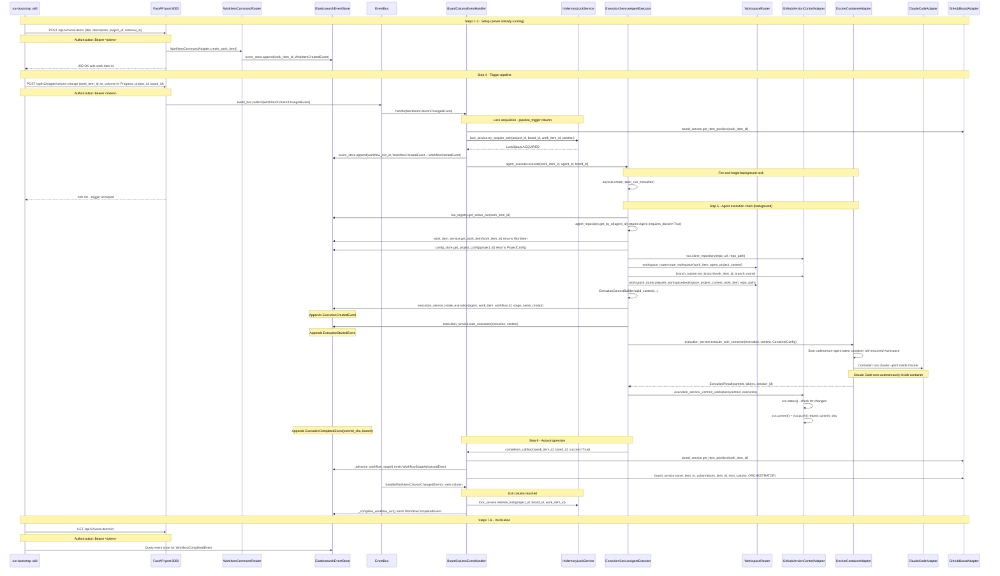

# Bootstrap Architecture

Authoritative reference for how the bootstrap use case works within Codetoreum's hexagonal architecture. This document covers the production code path exercised by `/run-bootstrap`: a single project, a single agent, a single work item, triggered via the REST API.

---

## 1. Purpose and Scope

### What bootstrap is

Bootstrap is the primary mechanism for proving out the Codetoreum production implementation incrementally. It exercises the real production code path end-to-end using live external services:

- **GitHub** (`tinkermonkey/rounds`) — real issue creation, real board management
- **Claude Code** — real `claude --print` subprocess invoked by `ClaudeCodeAdapter` inside a Docker container
- **Elasticsearch** — real event store and configuration store
- **Redis** — real event distribution

Bootstrap is triggered by the `/run-bootstrap` skill (`.claude/commands/run-bootstrap.md`), which drives a 9-step cycle: start server, register project, create work item, trigger column change, monitor agent execution, observe auto-progression, verify event emission, and report results.

### What bootstrap is not

Bootstrap is not simulation. It does not use mock adapters. It is not suitable for regression testing or CI. It is a deficiency-finding harness — it finds production bugs that deterministic simulation cannot expose.

### Why it exists

Simulation mode runs 10–100x faster than real execution and never touches external services. It is excellent for verifying business logic but cannot detect integration defects: misconfigured credentials, adapter wiring gaps, missing index initialization, or incorrect API call patterns. Bootstrap closes that gap by running the actual adapter chain against real services with a deliberately narrow scope.

### Deliberate limitations vs simulation

| Dimension | Bootstrap | Simulation |
|-----------|-----------|------------|
| External services | Real (GitHub, ES, Redis) | None (all mocked) |
| Speed | Real-time (minutes per run) | 10–100x (seconds) |
| Projects | 1 (`rounds`) | Many (via scenario YAML) |
| Agents | 1 (`claude-code-agent`) | Many (configurable) |
| Work items | 1 per run | Many (configurable) |
| Trigger | REST API call | SimulationRunner |
| Webhook | Not supported | Not applicable |
| Docker isolation | Used (container execution path) | Configurable |
| State persistence | ES + Redis (real) | InMemory adapters |

---

## 2. Configuration Sources

Bootstrap configuration flows through three sources that are loaded in strict order.

### Source 1: `bootstrap/rounds.json`

The canonical definition of the rounds project for bootstrap purposes. Contains:

```
project:   id, name, github_org ("tinkermonkey"), github_repo ("rounds")
agents:    name, model, timeout, capabilities, commit_policy, requires_docker
board:     id, name, columns[] with type/agent_id/is_pipeline_trigger/is_exit_column/auto_progress_on_completion
```

This file is the ground truth for what `register_project.py` writes to Elasticsearch and what `project_bootstrap_loader.py` loads into in-memory services at server startup.

### Source 2: `bootstrap/register_project.py`

Run once before server start (or whenever the project definition changes). Connects directly to Elasticsearch and persists:

- `ProjectConfig` (id, name, github_org, github_repo, metadata) via `ElasticsearchConfigStorage.save_project_config()`
- `AgentConfig` (agent_name, model, timeout, capabilities) per agent via `ElasticsearchConfigStorage.save_agent_config()`

Board column definitions are NOT persisted by `register_project.py` — they are loaded from the JSON file by `project_bootstrap_loader.py` at server startup.

**Ordering constraint**: `register_project.py` MUST complete before the server starts. The server's `ElasticsearchConfigStorage` reads from the same indices that `register_project.py` writes. If the server starts before registration, `_load_bootstrap_projects` will find no project config during Phase 5c and `register_project_repo()` will never be called, leaving `GitHubTicketAdapter` without a repo mapping.

### Source 3: `project_bootstrap_loader.py` (Phase 5c)

`ProductionApplicationBootstrap._load_bootstrap_projects()` calls `load_bootstrap_dir()` from `src/codetoreum/infrastructure/bootstrap/project_bootstrap_loader.py`. It scans `bootstrap/*.json` files and populates three in-memory services that are not Elasticsearch-backed:

| Target service | What it receives | Method called |
|---------------|-----------------|---------------|
| `IAgentRepository` | `Agent` domain objects built from `agents[]` entries | `agent_repository.save(agent, project_id)` |
| `IWorkflowConfigService` | `BoardWorkflowTemplate` built from `board` config | `workflow_config.save_board_workflow_template(template)` |
| `IConfigStore` | `ProjectConfig` with github_org, github_repo | `config_store.save_project_config(project_cfg)` |

After `load_bootstrap_dir()` returns, `_load_bootstrap_projects()` calls `config_store.list_projects()` and for each project with a `github_repo`, calls `raw_adapter.register_project_repo(project_id, github_repo)` on the raw (pre-resilience-decoration) `GitHubTicketAdapter`. This wires per-project repo routing so `GitHubTicketAdapter._get_repo()` can resolve the correct repository without a global `GITHUB_REPO` env var.

**Wiring constraint**: The raw adapter reference (`self._raw_ticket_adapter`) is captured in Phase 4 before resilience decoration. By Phase 5c, `self.adapters.ticket_system` holds the resilience-wrapped decorator, not the raw adapter. `register_project_repo()` is not part of the `ITicketSystem` port — it is a bootstrap-only lifecycle method. This is intentional: the port contract remains clean; the bootstrap-specific call goes to the raw reference.

---

## 3. Production Bootstrap Phases (Bootstrap Perspective)

`ProductionApplicationBootstrap.setup()` in `src/codetoreum/infrastructure/bootstrap/production_bootstrap.py` executes 7 phases. Below is each phase annotated for what it does in the bootstrap use case.

### Phase 0 — Event type registration

`auto_register_event_types()` registers all 151 `CodetoreumEvent` subclasses with `EventSerializer` so the Elasticsearch event store can deserialize events during replay. Required before any event is appended to the store.

### Phase 1 — Infrastructure creation

`_create_infrastructure()` creates:

- `EventBus` — in-process pub/sub for domain events
- `DeadLetterQueue` + `DeadLetterQueueFailedEventStoreAdapter` — captures events that fail handler processing
- `InMemoryAuditStore` — audit log for the session

These are purely in-memory. No external connections are made here.

Also in Phase 1b: `AdapterFactory` is instantiated (defaults to `PRODUCTION` mode) and `AdapterResolver` is created with a temporary `CapturingMockEventEmitter` (replaced after Phase 2 when the real event emitter adapter is resolved).

### Phase 2 — Adapter resolution (bootstrap critical path)

`resolver.resolve_all()` creates all 33 adapters. For bootstrap, the adapters that matter are:

| Adapter slot | Production class | Credentials required |
|-------------|-----------------|---------------------|
| `ticket_system` | `GitHubTicketAdapter` | `GITHUB_TOKEN` |
| `board` | `GitHubBoardAdapter` | `GITHUB_TOKEN` |
| `llm_provider` | `ClaudeCodeAdapter` | `ANTHROPIC_API_KEY` (or OAuth) |
| `version_control` | `GitHubVersionControlAdapter` | `GITHUB_TOKEN` |
| `container` | `DockerContainerAdapter` | Docker socket |
| `event_store` | `ElasticsearchEventStore` | `ELASTICSEARCH_URL` |
| `config_store` | `CachedConfigStore` wrapping `ElasticsearchConfigStorage` | `ELASTICSEARCH_URL` |
| `agent_repository` | `InMemoryAgentRepository` | none |
| `workflow_config` | in-memory impl | none |
| `run_registry` | `InMemoryActiveWorkflowRunRegistry` | none |
| `branch_tracker` | in-memory impl | none |

Phase 2b initializes the event store: `_initialize_event_store()` calls `initialize_event_store()` which ensures Elasticsearch indices exist. If this fails, the server will not start.

### Phase 3 — Critical path enforcement

`_validate_no_mocks_on_critical_path()` inspects the concrete class name of each adapter in `CRITICAL_ADAPTER_SLOTS`:

```python
CRITICAL_ADAPTER_SLOTS = {"board", "ticket", "llm", "version_control", "container", "code_review"}
```

Any adapter whose class name contains `Mock`, `InMemory`, `Fake`, or `Null` causes a `RuntimeError`. This guard ensures bootstrap always exercises real adapters on the execution-critical path.

Phase 3b: `_validate_event_emitter_is_production()` ensures the resolved event emitter is not `CapturingMockEventEmitter`.

### Phase 4 — Resilience decoration

`_apply_resilience_decorators()` wraps adapters using `ResilienceFactory(mode=OperationMode.PRODUCTION)`:

| Adapter | Resilience applied |
|---------|-------------------|
| `ticket_system` | Rate limiter → circuit breaker → timeout → retry |
| `llm_provider` | Rate limiter → circuit breaker → timeout → retry |
| `repository` | Rate limiter → circuit breaker → timeout → retry |
| `container` | Rate limiter → circuit breaker → timeout → retry |
| `version_control` | Rate limiter → circuit breaker → timeout → retry |

**Critical ordering constraint**: Before wrapping `ticket_system`, Phase 4 captures the raw reference: `self._raw_ticket_adapter = self.adapters.ticket_system`. After wrapping, `self.adapters.ticket_system` is the resilience decorator. The raw reference is used in Phase 5c to call `register_project_repo()` (not part of the port interface).

Phase 4b: `BranchResolutionAdapter` is constructed after resilience decoration, so it receives the wrapped `ticket_system` and `version_control` adapters.

### Phase 5 — Service creation

`_create_services()` builds all 11 application services. For bootstrap, the critical chain is:

```
ExecutionService(llm_provider, container, event_store, storage, vcs=version_control)
WorkspaceRouter(vcs, container, event_store, branch_resolution_service)
ExecutionServiceAgentExecutor(execution_service, workspace_router, config_store,
                              agent_repository, work_item_service=MockWorkItemService,
                              run_registry, branch_tracker, vcs, clock=RealTimeClock(), ...)
AgentScheduler(..., agent_executor=execution_service_executor)
WorkflowOrchestrator(..., dispatch_via_task_queue=False)
WorkItemService(event_store)
MultiProjectOrchestrator(project_manager, workflow_orchestrator, board_service, poll_interval_seconds=30)
```

Note: `ExecutionServiceAgentExecutor` receives `WorkItemService` as a constructor argument. The service is instantiated earlier in `_create_services` (immediately after `WorkspaceRouter`) so it is available when the executor is built. The post-hoc `_work_item_service` swap that previously existed in Phase 5d is gone.

**Phase 5a**: `agent_scheduler.start()` starts the consumer loop.

**Phase 5b**: `_initialize_codetoreum_board()` sets up board configuration.

**Phase 5c**: `_load_bootstrap_projects()` loads `bootstrap/rounds.json` into `IAgentRepository`, `IWorkflowConfigService`, and `IConfigStore`. Then calls `register_project_repo()` on the raw ticket adapter for each project.

**Phase 5d**: `WorkItemService` is constructor-injected into `ExecutionServiceAgentExecutor` during `_create_services`. The phase label is retained for parity with log-grep checkpoints but the architectural seam (private attribute swap on the executor) is gone.

**Phase 5e**: `asyncio.ensure_future(self.services.multi_project_orchestrator.start())` launches the MPO poll loop as a background task. MPO is the sole orchestration entry point — it polls all enabled projects every 30 seconds, reconciles boards, and delegates per-project work to `WorkflowOrchestrator`. Starting after Phase 5d ensures `WorkItemService` is fully wired before the first poll cycle.

### Phase 6 — Input port creation

`_create_ports()` creates 17 input port adapter implementations. For bootstrap, the relevant ones are:

- `WorkItemCommandAdapter` — handles work item create/update commands
- `WorkflowCommandAdapter` — handles workflow trigger commands
- `WorkItemQueryAdapter` — handles work item read queries

### Drill modes (harness extensions, not production phases)

The `/run-bootstrap` skill supports two drill modes that exercise failure paths a happy-path run cannot expose. These are documented in `.claude/commands/run-bootstrap.md` and run only when explicitly invoked.

**Restart drill** — kill the server mid-execution (after `WorkflowStartedEvent`, before `WorkflowCompletedEvent`) with SIGTERM, then restart. The expected outcome depends on which adapters are in-memory vs. persistent:
- With in-memory `IPipelineLockService` / `IActiveWorkflowRunRegistry` / `IWorkItemBranchTracker`: the work item is silently stuck. The drill demonstrates the persistence gap.
- With Phase B Redis-backed implementations: lock state is rebuilt, the orphaned run is detected (or resumed), and the pipeline does not lose serialization.

**Concurrent-trigger drill** — create two work items on the same board and trigger both before the first completes. Expected: the lock service returns `LockStatus.ACQUIRED` for the first and `LockStatus.QUEUED` for the second; the second is dispatched after the first releases the lock. Failure of this drill means pipeline serialization is broken (catastrophic for multi-instance deployment).

### Phase 7 — FastAPI app creation

`_create_fastapi_app()` calls `create_app()` from `src/codetoreum/adapters/primary/fastapi_app.py` and mounts all production routers. No simulation-only routes are mounted here. The board event bridge task is started, wiring `BoardColumnEventHandler` to process `WorkItemColumnChangedEvent` from the event bus.

Authentication is active: all 13 REST API routers have `Depends(auth_deps.require_auth)` applied. The server generates a JWT token on startup and prints it to the console. The token is printed at startup under `Authentication token:` and must be passed as `Authorization: Bearer <token>` in all REST API calls.

---

## 4. Runtime Execution Flow

The sequence below traces a complete bootstrap run from the `/run-bootstrap` skill's REST API calls through to agent completion.



### Domain events emitted in a successful run

| Phase | Event | Aggregate |
|-------|-------|-----------|
| Work item creation | `WorkItemCreatedEvent` | work_item_id |
| Pipeline trigger | `WorkItemColumnChangedEvent` | published to EventBus |
| Lock acquired | `LockAcquiredEvent` | (internal to lock service) |
| Workflow start | `WorkflowCreatedEvent`, `WorkflowStartedEvent` | workflow_run_id |
| Execution created | `ExecutionCreatedEvent` | execution_id |
| Execution started | `ExecutionStartedEvent` | execution_id |
| Execution completed | `ExecutionCompletedEvent` (with commit_sha, branch) | execution_id |
| Stage advance | `WorkflowStageAdvancedEvent` | workflow_run_id |
| Lock released | `LockReleasedEvent` | (internal to lock service) |
| Workflow done | `WorkflowCompletedEvent` | workflow_run_id |

### On agent failure

If `execute_with_container()` fails or the container exits non-zero:
- `execution_service.execute_with_container()` appends `ExecutionFailedEvent`
- `_run_execution` calls `_call_completion(work_item_id, board_id, success=False)`
- `BEH.handle_agent_completion(success=False)` moves item to `on_failure_column` (if configured)
- `_fail_workflow_run()` appends `WorkflowFailedEvent`
- `lock_service.release_lock()` unblocks the pipeline

---

## 5. Active Ports and Adapters (Bootstrap Context)

Every port exercised in a bootstrap run, with its production adapter and role.

| Port Interface | Production Adapter | Bootstrap Role | Critical Path |
|---------------|-------------------|---------------|---------------|
| `ITicketSystem` | `GitHubTicketAdapter` (wrapped by `ResilientTicketSystemDecorator`) | Work item fetch, comment posting | Yes |
| `IBoardService` | `GitHubBoardAdapter` | Column position lookup, item move for auto-progression | Yes |
| `ILLMProvider` | `ClaudeCodeAdapter` (wrapped by resilience decorator) | Runs `claude --print` inside Docker container | Yes |
| `IVersionControlService` | `GitHubVersionControlAdapter` (wrapped by resilience decorator) | Clone repo, status, commit, push | Yes |
| `IContainer` | `DockerContainerAdapter` (wrapped) | Launches `codetoreum-agent:latest` container for agent execution | Yes (active) |
| `ICodeReviewService` | `GitHubCodeReviewAdapter` | Not invoked in basic bootstrap | Yes (validated, not called) |
| `IEventStore` | `ElasticsearchEventStore` | Persists all domain events; `WorkItemService` reads from it | No (infra) |
| `IConfigStore` | `CachedConfigStore` → `ElasticsearchConfigStorage` | Project config, agent config lookup | No (infra) |
| `IAgentRepository` | `InMemoryAgentRepository` | Agent domain object lookup by ID | No (infra) |
| `IWorkflowConfigService` | in-memory impl | Board workflow template lookup | No (infra) |
| `IActiveWorkflowRunRegistry` | `InMemoryActiveWorkflowRunRegistry` | Active run tracking between handler and executor | No (infra) |
| `IWorkItemBranchTracker` | in-memory impl | Branch name tracking per work item | No (infra) |
| `IPipelineLockService` (`IQueuedPipelineLockService`) | `InMemoryLockService` | Pipeline serialization (1 active execution per board) | No (infra) |
| `IStorage` | `InMemoryStorageAdapter` | Artifact storage (not meaningfully used in bootstrap) | No (infra) |
| `IBranchResolutionService` | `BranchResolutionAdapter` | Branch name computation from ticket + VCS | No |
| `IAgentExecutor` | `ExecutionServiceAgentExecutor` | Drives the full execution chain | No (wired internally) |
| `IWorkItemService` | `WorkItemService` (event-sourced from ES) | Work item read by executor | No (infra) |
| `IWorkItemCommandPort` | `WorkItemCommandAdapter` | REST API → work item creation | No (input port) |
| `IEventEmitter` | `MockEventEmitter` (production-safe) | LockStuckEvent emission | No |

---

## 6. Architectural Invariants

The following constraints MUST hold for bootstrap to work correctly. Violating any of them produces a failure mode that may not be immediately obvious.

### Ordering constraints

**INV-01**: `bootstrap/register_project.py` MUST complete successfully before the server process starts.
- Violation: `_load_bootstrap_projects()` finds no project config in `IConfigStore`; `register_project_repo()` is never called; `GitHubTicketAdapter._get_repo()` raises `RuntimeError` on first ticket operation.

**INV-02**: Phase 5c (`_load_bootstrap_projects`) MUST run after Phase 5 service creation so `IConfigStore` is populated before `register_project_repo()` is called.
- This is enforced by `setup()` ordering; do not reorder phases.

**INV-03**: `WorkItemService` MUST be instantiated BEFORE `ExecutionServiceAgentExecutor` inside `_create_services`. The executor takes it as a constructor argument; no Phase 5d swap exists.
- Violation: Executor would be constructed with the placeholder `self.adapters.work_item_service` (a mock); work items created via REST API would be invisible to the agent executor.

### Wiring constraints

**INV-04**: `self._raw_ticket_adapter` MUST be captured in Phase 4 BEFORE resilience decoration, and used ONLY for bootstrap lifecycle calls not on the `ITicketSystem` port (specifically `register_project_repo()`).
- Violation: `register_project_repo()` called on the resilience decorator raises `AttributeError`.

**INV-05**: `ExecutionServiceAgentExecutor.set_completion_handler()` MUST be called before the first `execute()` invocation to wire the auto-progression callback to `BoardColumnEventHandler.handle_agent_completion`.
- Violation: Executor logs `ERR_EXEC_CHAIN_NO_COMPLETION_CALLBACK`; work item stays in current column after agent completes.

**INV-06**: `dispatch_via_task_queue=False` on `WorkflowOrchestrator` is required in production. `BoardColumnEventHandler` owns event-driven dispatch. Setting this to `True` causes double-dispatch.

**INV-13**: `MultiProjectOrchestrator` is the sole orchestration entry point. It is started in Phase 5e and polls all enabled projects every 30 seconds. Direct execution dispatch from non-event-handler paths is forbidden. `BoardColumnEventHandler` is the event-driven complement — it reacts to column changes in real time. These two mechanisms are cooperative, not competing: MPO handles initial pickup and board reconciliation; BEH handles real-time reactions to column movements.

### Isolation constraints

**INV-07**: Simulation-only routes MUST NEVER appear in `ProductionApplicationBootstrap._create_fastapi_app()`. They mount exclusively in `SimulationApplicationBootstrap._create_fastapi_app()`.
- The two bootstrap classes produce fundamentally different `FastAPI` instances. Merging routes is a production security boundary violation.

**INV-08**: `CRITICAL_ADAPTER_SLOTS = {"board", "ticket", "llm", "version_control", "container", "code_review"}` — no adapter in these slots may be `Mock`, `InMemory`, `Fake`, or `Null`. Phase 3 enforces this with `RuntimeError`.

### Port discipline constraints

**INV-09**: `ExecutionServiceAgentExecutor` inherits `IAgentExecutor` explicitly. Duck typing is forbidden.
- Checked at import time; missing inheritance causes mypy failures and breaks type-safe injection.

**INV-10**: All state changes MUST emit a domain event (frozen dataclass). The executor emits via `event_store.append()`; the event handler emits via `event_bus.publish()`. Silent mutations are architectural violations.

**INV-11**: Resilience logic (retry loops, circuit breaker checks, rate limit backoff) MUST remain in infrastructure decorator classes, not in adapter bodies. `GitHubTicketAdapter._make_request()` explicitly documents this: it does not embed retry logic; `ResilientTicketSystemDecorator` handles it.

**INV-12**: The domain layer (`src/codetoreum/domain/`) has zero external dependencies. `Agent`, `WorkItem`, `AgentExecution`, and all domain events import only from within the domain package and Python stdlib.

### Authentication constraints

**INV-14**: All production REST API calls MUST include `Authorization: Bearer <token>`. The token is printed to the console on startup under the line `Authentication token: <jwt>`. The `/health` endpoint is exempt (unauthenticated). GitHub webhook endpoints use HMAC-SHA256 signature verification instead of Bearer tokens.

---

## 7. Observable Checkpoints

Use these log patterns to confirm correct operation at each stage. All patterns are found in structured log output on stdout when running `production_server.py`.

| Checkpoint | Log pattern to match | Architectural event it confirms |
|-----------|---------------------|--------------------------------|
| Event types registered | `Phase 0: Registered all domain event types with EventSerializer` | `EventSerializer` ready for ES deserialization |
| Infrastructure ready | `Phase 1a: Creating infrastructure...` + `Phase 1b: Initializing adapter factory and resolver...` | EventBus and AdapterFactory created |
| Adapters resolved | `Phase 2: Creating 33 adapters (credential validation + resolution)...` | All 33 adapter slots populated |
| Event store initialized | `Event store initialized successfully` with `event_store_type: ElasticsearchEventStore` | ES indices created/verified |
| No mocks on critical path | `Critical path validation passed (6 adapters)` | Phase 3 guard passed |
| Resilience applied | `Resilience decorators applied to critical adapters` | Decorators wrapping ticket, LLM, VCS, container, repository |
| Raw ticket adapter captured | `DEBUG: Applied resilience to ticket system adapter` | `_raw_ticket_adapter` captured before wrapping |
| Services created | `Created all 11 application services with production adapters` | Full service graph ready |
| Bootstrap config loaded | `Loaded 1 project bootstrap configuration(s) from .../bootstrap` | `rounds.json` parsed, agents and template registered |
| Repo registered | `Registered project repo 'rounds' for project 'rounds' with ticket adapter` | `register_project_repo()` called successfully |
| WorkItemService wired | `Phase 5d: Wiring WorkItemService to executor...` | Executor can now load ES-backed work items |
| MPO started | `Phase 5e: Multi-project orchestrator poll loop started (background task)` | MPO poll loop running, will reconcile boards every 30s |
| Auth token printed | `Authentication token: <jwt>` | Token available for REST API calls |
| Server ready | `Production bootstrap completed successfully` | All 7 phases complete, FastAPI app live |
| Work item created | `Created execution ... for agent claude-code-agent on work item ...` | REST trigger accepted, execution created in ES |
| Lock acquired | `Lock acquired for <work_item_id>` | `InMemoryLockService` granted pipeline lock |
| Workflow started | `Starting workflow run <run_id> for <work_item_id>: stage=In Progress` | `WorkflowCreatedEvent` + `WorkflowStartedEvent` appended |
| Agent scheduled | `ExecutionServiceAgentExecutor: scheduling agent 'claude-code-agent' for '<work_item_id>'` | Background task created |
| Clone started | `VCS clone failed` or absence thereof | `GitHubVersionControlAdapter.clone_repository()` called |
| Container started | `DockerContainerAdapter: container started` | `codetoreum-agent:latest` container launched |
| Execution complete | `ExecutionServiceAgentExecutor: 'claude-code-agent' completed for '<work_item_id>' (success=True)` | Container execution returned |
| Commit pushed | `Committed workspace for execution ...: <sha> → feature/<branch>` | VCS commit + push succeeded |
| Auto-progressed | `Auto-progressing <work_item_id> from In Progress to <next_column>` | `board_service.move_item_to_column()` called |
| Workflow complete | `Workflow run <run_id> completed for <work_item_id>` | `WorkflowCompletedEvent` appended |
| Lock released | `Lock released for <work_item_id>, next work item: None` | Pipeline unblocked |

---

## 8. Known Scope Limitations

These are intentional omissions, not bugs.

**No webhook support.** The bootstrap trigger is an explicit REST call to `/api/v2/trigger/column-change`. GitHub webhook delivery to a local server requires ngrok or similar tunneling. Bootstrap does not attempt this. Webhook-driven execution is a production deployment concern, not a bootstrap concern.

**Single project only.** `rounds.json` defines one project (`rounds`). `GitHubTicketAdapter._get_repo()` has a single-project fast path: when exactly one project is registered, it returns that project's repo without requiring a `project_id` parameter on each API call. Multi-project support requires an `ITicketSystem` port change to pass `project_id` per call.

**In-memory state for non-ES services.** `IAgentRepository`, `IWorkflowConfigService`, `IActiveWorkflowRunRegistry`, `IWorkItemBranchTracker`, and `IPipelineLockService` are all in-memory. They do not survive server restart. If the server restarts mid-execution, these lose state and the run cannot be recovered from the event store alone.

**No webhook registration.** `GitHubTicketAdapter.register_webhook()` is never called by bootstrap. The system does not subscribe to real-time GitHub events during a bootstrap run.

**Partial board sync.** The board columns defined in `rounds.json` are loaded into `IWorkflowConfigService` but NOT synced bidirectionally with the GitHub Projects v2 board. The board must be manually configured in GitHub to match the column names in `rounds.json`.

**Unregistered event handlers.** Four `application/event_handlers/` classes are constructed nowhere in `production_bootstrap.py` Phase 7 and therefore receive no events at runtime:

| Handler | Consumes | Bootstrap impact | Wiring decision |
|---|---|---|---|
| `ExecutionEventHandler` | `ExecutionInitializedEvent`, `ExecutionStartedEvent`, `ExecutionCompletedEvent`, `ExecutionFailedEvent`, `ExecutionTimedOutEvent` | Drives execution metrics, success/failure rate, and log streaming. No effect on the auto-progression path (which goes through `BoardColumnEventHandler`). | Subscribe — pure observability, low risk. Defer to a follow-up commit to keep this batch survey-only. |
| `BranchResolutionEventHandler` | `BranchResolutionCreatedEvent`, `BranchResolvedEvent`, `BranchReusedEvent` | Updates `IWorkItemBranchTracker` from branch-resolution outcomes. Today the tracker is mutated directly by `ExecutionServiceAgentExecutor`. Subscribing this handler would create a second writer. | Hold — needs reconciliation with the executor's direct write path before subscribing. |
| `RepairCycleEventHandler` | Repair cycle events (start/iteration/complete/fail) | Routes repair-cycle outcomes back into the workflow. Repair cycle is not exercised by bootstrap (`rounds.json` has no repair-cycle column). | Hold — wire when repair cycle joins the bootstrap critical path. |
| `WorkflowEventHandler` | Workflow state transitions | Currently a stub-like handler (`logger.warning` on any unknown event). Real workflow-state mutation goes through `WorkflowOrchestrator`. | Hold — duplicate concern with `WorkflowOrchestrator`; needs design review before subscribing. |

Bootstrap does not require any of these handlers for the happy path. The survey is informational. Subscribing `ExecutionEventHandler` is the only safe candidate today; the other three need design decisions before wiring.

---

## 9. Deficiency Log

Running record of architectural gaps found and fixed during bootstrap cycles. Most recent first.

---

### DEF-004 — MultiProjectOrchestrator not started (poll loop never launched)

**Deficiency**: `_create_services()` instantiated `MultiProjectOrchestrator` but `setup()` never called `start()` on it. The MPO poll loop was dormant — it existed as an object but its `while True` loop never ran. The `teardown()` method already called `stop()` correctly (it was wired for cleanup), but the start was missing. This meant MPO's board reconciliation and project polling never fired in production.

**Fix**: Added Phase 5e to `setup()` in `production_bootstrap.py`: `asyncio.ensure_future(self.services.multi_project_orchestrator.start())` launches the poll loop as a background task after Phase 5d (so `WorkItemService` is fully wired before the first cycle). The `teardown()` call to `stop()` was already correct and needed no change.

**Relationship clarification**: `BoardColumnEventHandler` remains the event-driven dispatch path for real-time column change reactions. MPO is the polling-based orchestration entry point for initial pickup and board reconciliation. These are complementary, not competing. `WorkflowOrchestrator` is MPO's per-project delegate (`dispatch_via_task_queue=False` ensures BEH owns event-driven dispatch). No changes to `BoardColumnEventHandler` were needed.

**Files changed**: `src/codetoreum/infrastructure/bootstrap/production_bootstrap.py` (Phase 5e in `setup()`, docstring update)

---

### DEF-DOC-003 — Authentication documented as absent (incorrect)

**Deficiency**: §8 stated "No authentication on REST API. The bootstrap REST endpoints have no auth middleware. This is acceptable for local development." This was factually wrong. Authentication is fully implemented and active: `SimpleTokenAuthManager` generates a JWT token on startup and prints it to the console; all 13 REST API routers use `Depends(auth_deps.require_auth)`; the GitHub webhook endpoint uses HMAC-SHA256 signature verification. The `run-bootstrap.md` skill made all REST API calls without an `Authorization` header, causing 401 responses on every call.

**Fix**:
1. Removed the false "No authentication" limitation from §8
2. Added INV-14 to §6 documenting the auth requirement
3. Added auth token checkpoint to §7
4. Updated Phase 7 description in §3 to document auth activation
5. Updated sequence diagram in §4 to show `Authorization: Bearer <token>` on REST calls
6. Fixed `.claude/commands/run-bootstrap.md`: added token extraction after Step 3 server startup, and added `-H "Authorization: Bearer $AUTH_TOKEN"` to all `curl` calls (work item creation, trigger, polling GET, verification GET)

**Files changed**: `bootstrap/ARCHITECTURE.md`, `.claude/commands/run-bootstrap.md`

---

### DEF-DOC-002 — Agent execution path documented as LLM-only (incorrect)

**Deficiency**: §1 comparison table said "Docker isolation: Not used (LLM path only)" and §8 said "LLM path only. The agent in `rounds.json` has `requires_docker: false`. The `execute_with_container()` path in `ExecutionService` is never invoked." This was wrong. The architectural requirement is that coding agents run inside Docker containers. `ExecutionServiceAgentExecutor._run_execution()` at Step 10 branches on `agent.requires_docker`: `true` routes to `execute_with_container()`, `false` routes to `execute_with_llm()`. Both `bootstrap/rounds.json` and `bootstrap/project.json` had `"requires_docker": false`, which caused the executor to use the direct LLM subprocess path — bypassing container isolation entirely.

**Fix**:
1. Changed `"requires_docker": false` → `"requires_docker": true` in `bootstrap/rounds.json`
2. Changed `"requires_docker": false` → `"requires_docker": true` in `bootstrap/project.json`
3. Removed the "LLM path only" limitation from §8
4. Updated §1 comparison table: "Docker isolation: Used (container execution path)"
5. Updated §5 ports table: `IContainer`/`DockerContainerAdapter` role changed from "Not invoked (agent uses LLM path, `requires_docker=False`)" to "Launches `codetoreum-agent:latest` container for agent execution" and Critical Path from "Yes (validated, not called)" to "Yes (active)"
6. Updated §4 sequence diagram to show container invocation path

**Files changed**: `bootstrap/rounds.json`, `bootstrap/project.json`, `bootstrap/ARCHITECTURE.md`

---

### DEF-003 — Per-project repo not registered with ticket adapter (missing `register_project_repo()` call)

**Deficiency**: After Phase 5c loaded project configs into `IConfigStore`, `GitHubTicketAdapter._get_repo()` still raised `RuntimeError("No GitHub project repos registered")` because nothing called `register_project_repo()` on the raw adapter. The ticket adapter defaulted to `config.repository` (empty string in production) or raised.

**Fix**: Added the repo-registration loop in `_load_bootstrap_projects()`: after `load_bootstrap_dir()` completes, `config_store.list_projects()` is iterated and `raw_adapter.register_project_repo(cfg.id, cfg.github_repo)` is called for each project with a non-empty `github_repo`. The raw adapter reference is captured as `self._raw_ticket_adapter` in Phase 4 before resilience wrapping.

**Files changed**: `src/codetoreum/infrastructure/bootstrap/production_bootstrap.py` (`_apply_resilience_decorators`, `_load_bootstrap_projects`)

---

### DEF-002 — Duplicate execution guard missing in `ExecutionServiceAgentExecutor`

**Deficiency**: If `BoardColumnEventHandler._trigger_agent()` was called twice for the same work item (e.g., due to an event bus re-delivery or a second column-change event arriving before the first execution completed), two background tasks would be created for the same `work_item_id`. Both tasks would attempt to load the run registry, clone the repo, and call the completion callback, resulting in a race condition that could double-progress the work item or produce conflicting commits.

**Fix**: Added `self._executing_work_items: set[str]` to `ExecutionServiceAgentExecutor`. `execute()` checks this set before scheduling; if the work item is already executing, it logs `ERR_EXEC_DUPLICATE_EXECUTION` and returns immediately. `_task_done_callback` discards the entry on task completion.

**Files changed**: `src/codetoreum/adapters/secondary/execution_service_agent_executor.py`

---

### DEF-001 — `WorkItemService` not wired to executor before first execution

**Deficiency**: `ExecutionServiceAgentExecutor` was constructed in Phase 5 with a placeholder `work_item_service` (whatever `self.adapters.work_item_service` resolved to at that point — a mock). Work items created via `POST /api/v2/work-items` are persisted in the Elasticsearch event store via `WorkItemService`. When the executor called `work_item_service.get_work_item(work_item_id)`, the placeholder had no record of the work item, causing `ResourceNotFoundError` and execution failure.

**Fix**: Added Phase 5d: after all services are created, `self.adapters.agent_executor._work_item_service = self.services.work_item_service` replaces the placeholder with the event-store-backed `WorkItemService`. This happens after `WorkItemService` is instantiated in `_create_services()` but before Phase 6 input port creation.

**Files changed**: `src/codetoreum/infrastructure/bootstrap/production_bootstrap.py` (Phase 5d in `setup()`), `src/codetoreum/application/execution_service.py` (guard for missing `vcs` adapter in `_commit_workspace`)
