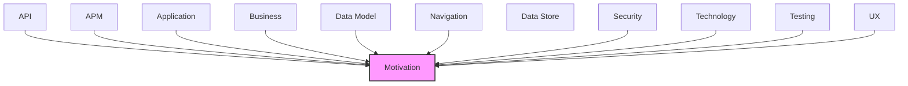

# Motivation

Goals, requirements, drivers, and strategic outcomes of the architecture.

## Report Index

- [Layer Introduction](#layer-introduction)
- [Intra-Layer Relationships](#intra-layer-relationships)
- [Inter-Layer Dependencies](#inter-layer-dependencies)
- [Inter-Layer Relationships Table](#inter-layer-relationships-table)
- [Element Reference](#element-reference)

## Layer Introduction

| Metric                    | Count |
| ------------------------- | ----- |
| Elements                  | 20    |
| Intra-Layer Relationships | 31    |
| Inter-Layer Relationships | 63    |
| Inbound Relationships     | 63    |
| Outbound Relationships    | 0     |

**Cross-Layer References**:

- **Upstream layers**: [API](./06-api-layer-report.md), [APM](./11-apm-layer-report.md), [Application](./04-application-layer-report.md), [Business](./02-business-layer-report.md), [Data Model](./07-data-model-layer-report.md), [Navigation](./10-navigation-layer-report.md), [Security](./03-security-layer-report.md), [Technology](./05-technology-layer-report.md), [Testing](./12-testing-layer-report.md), [UX](./09-ux-layer-report.md)

## Intra-Layer Relationships

```mermaid
flowchart LR
  subgraph motivation
    motivation_assessment_hexagonal_architecture_adapter_coupling["Hexagonal Architecture Adapter Coupling"]
    motivation_assessment_simulation_framework_test_execution_speed["Simulation Framework Test Execution Speed"]
    motivation_constraint_all_external_interactions_via_port_interfaces["All External Interactions via Port Interfaces"]
    motivation_constraint_configuration_must_be_database_backed["Configuration Must Be Database-Backed"]
    motivation_constraint_domain_events_must_be_immutable["Domain Events Must Be Immutable"]
    motivation_constraint_domain_layer_zero_external_dependencies["Domain Layer Zero External Dependencies"]
    motivation_driver_accelerate_software_delivery_throughput["Accelerate Software Delivery Throughput"]
    motivation_driver_maintain_code_quality_through_automated_review_cycles["Maintain Code Quality Through Automated Review Cycles"]
    motivation_driver_reduce_developer_toil_on_repetitive_coding_tasks["Reduce Developer Toil on Repetitive Coding Tasks"]
    motivation_goal_automate_software_development_workflows["Automate Software Development Workflows"]
    motivation_goal_complete_observability_via_event_sourcing["Complete Observability via Event Sourcing"]
    motivation_goal_full_testability_without_external_services["Full Testability Without External Services"]
    motivation_goal_plugin_extensibility["Plugin Extensibility"]
    motivation_principle_domain_purity["Domain Purity"]
    motivation_principle_hexagonal_architecture["Hexagonal Architecture"]
    motivation_principle_immutability_of_events["Immutability of Events"]
    motivation_principle_vendor_agnosticism["Vendor Agnosticism"]
    motivation_requirement_complete_audit_trail_for_all_state_changes["Complete Audit Trail for All State Changes"]
    motivation_requirement_full_end_to_end_testability_without_external_services["Full End-to-End Testability Without External Services"]
    motivation_requirement_vendor_agnostic_llm_provider_support["Vendor-Agnostic LLM Provider Support"]
    motivation_assessment_hexagonal_architecture_adapter_coupling -->|influence| motivation_principle_hexagonal_architecture
    motivation_assessment_simulation_framework_test_execution_speed -->|influence| motivation_goal_full_testability_without_external_services
    motivation_constraint_all_external_interactions_via_port_interfaces -->|constrains| motivation_requirement_vendor_agnostic_llm_provider_support
    motivation_constraint_all_external_interactions_via_port_interfaces -->|influence| motivation_principle_hexagonal_architecture
    motivation_constraint_configuration_must_be_database_backed -->|constrains| motivation_requirement_full_end_to_end_testability_without_external_services
    motivation_constraint_configuration_must_be_database_backed -->|influence| motivation_goal_plugin_extensibility
    motivation_constraint_domain_events_must_be_immutable -->|constrains| motivation_requirement_complete_audit_trail_for_all_state_changes
    motivation_constraint_domain_events_must_be_immutable -->|influence| motivation_principle_immutability_of_events
    motivation_constraint_domain_layer_zero_external_dependencies -->|constrains| motivation_requirement_full_end_to_end_testability_without_external_services
    motivation_constraint_domain_layer_zero_external_dependencies -->|influence| motivation_principle_domain_purity
    motivation_driver_accelerate_software_delivery_throughput -->|influence| motivation_goal_automate_software_development_workflows
    motivation_driver_maintain_code_quality_through_automated_review_cycles -->|influence| motivation_goal_automate_software_development_workflows
    motivation_driver_reduce_developer_toil_on_repetitive_coding_tasks -->|influence| motivation_goal_automate_software_development_workflows
    motivation_goal_complete_observability_via_event_sourcing -->|influence| motivation_goal_automate_software_development_workflows
    motivation_goal_full_testability_without_external_services -->|influence| motivation_goal_automate_software_development_workflows
    motivation_goal_plugin_extensibility -->|influence| motivation_goal_automate_software_development_workflows
    motivation_principle_domain_purity -->|influence| motivation_goal_full_testability_without_external_services
    motivation_principle_domain_purity -->|influence| motivation_goal_plugin_extensibility
    motivation_principle_hexagonal_architecture -->|influence| motivation_goal_full_testability_without_external_services
    motivation_principle_hexagonal_architecture -->|influence| motivation_goal_plugin_extensibility
    motivation_principle_hexagonal_architecture -->|realizes| motivation_goal_automate_software_development_workflows
    motivation_principle_immutability_of_events -->|influence| motivation_goal_automate_software_development_workflows
    motivation_principle_immutability_of_events -->|influence| motivation_goal_complete_observability_via_event_sourcing
    motivation_principle_vendor_agnosticism -->|influence| motivation_goal_automate_software_development_workflows
    motivation_principle_vendor_agnosticism -->|influence| motivation_goal_plugin_extensibility
    motivation_requirement_complete_audit_trail_for_all_state_changes -->|associated-with| motivation_constraint_domain_events_must_be_immutable
    motivation_requirement_complete_audit_trail_for_all_state_changes -->|realizes| motivation_goal_complete_observability_via_event_sourcing
    motivation_requirement_full_end_to_end_testability_without_external_services -->|associated-with| motivation_constraint_domain_layer_zero_external_dependencies
    motivation_requirement_full_end_to_end_testability_without_external_services -->|realizes| motivation_goal_full_testability_without_external_services
    motivation_requirement_vendor_agnostic_llm_provider_support -->|associated-with| motivation_constraint_all_external_interactions_via_port_interfaces
    motivation_requirement_vendor_agnostic_llm_provider_support -->|realizes| motivation_goal_plugin_extensibility
  end
```

## Inter-Layer Dependencies

## Inter-Layer Relationships Table

| Relationship ID                                                         | Source Node                                                 | Dest Node                                                                      | Dest Layer   | Predicate                | Cardinality  | Strength |
| ----------------------------------------------------------------------- | ----------------------------------------------------------- | ------------------------------------------------------------------------------ | ------------ | ------------------------ | ------------ | -------- |
| `api.operation.realizes.motivation.goal`                                | `api.operation.get-domain-events`                           | `motivation.goal.complete-observability-via-event-sourcing`                    | `motivation` | `realizes`               | many-to-many | medium   |
| `api.operation.realizes.motivation.goal`                                | `api.operation.get-simulation-board-state`                  | `motivation.goal.full-testability-without-external-services`                   | `motivation` | `realizes`               | many-to-many | medium   |
| `api.operation.realizes.motivation.goal`                                | `api.operation.get-workflow-run-audit`                      | `motivation.goal.complete-observability-via-event-sourcing`                    | `motivation` | `realizes`               | many-to-many | medium   |
| `api.operation.realizes.motivation.goal`                                | `api.operation.get-workflow-run`                            | `motivation.goal.complete-observability-via-event-sourcing`                    | `motivation` | `realizes`               | many-to-many | medium   |
| `api.operation.realizes.motivation.goal`                                | `api.operation.list-agents`                                 | `motivation.goal.plugin-extensibility`                                         | `motivation` | `realizes`               | many-to-many | medium   |
| `api.operation.realizes.motivation.goal`                                | `api.operation.replay-events`                               | `motivation.goal.complete-observability-via-event-sourcing`                    | `motivation` | `realizes`               | many-to-many | medium   |
| `api.operation.realizes.motivation.goal`                                | `api.operation.start-workflow-execution`                    | `motivation.goal.automate-software-development-workflows`                      | `motivation` | `realizes`               | many-to-many | medium   |
| `apm.metricinstrument.realizes.motivation.goal`                         | `apm.metricinstrument.agent-execution-duration`             | `motivation.goal.complete-observability-via-event-sourcing`                    | `motivation` | `realizes`               | many-to-many | medium   |
| `apm.metricinstrument.realizes.motivation.goal`                         | `apm.metricinstrument.event-bus-stats`                      | `motivation.goal.complete-observability-via-event-sourcing`                    | `motivation` | `realizes`               | many-to-many | medium   |
| `application.applicationservice.realizes.motivation.goal`               | `application.applicationservice.board-polling-service`      | `motivation.goal.automate-software-development-workflows`                      | `motivation` | `realizes`               | many-to-many | medium   |
| `application.applicationservice.realizes.motivation.goal`               | `application.applicationservice.configuration-service`      | `motivation.goal.plugin-extensibility`                                         | `motivation` | `realizes`               | many-to-many | medium   |
| `application.applicationservice.realizes.motivation.goal`               | `application.applicationservice.event-sequence-validator`   | `motivation.goal.complete-observability-via-event-sourcing`                    | `motivation` | `realizes`               | many-to-many | medium   |
| `application.applicationservice.realizes.motivation.goal`               | `application.applicationservice.execution-service`          | `motivation.goal.automate-software-development-workflows`                      | `motivation` | `realizes`               | many-to-many | medium   |
| `application.applicationservice.realizes.motivation.goal`               | `application.applicationservice.metrics-service`            | `motivation.goal.complete-observability-via-event-sourcing`                    | `motivation` | `realizes`               | many-to-many | medium   |
| `application.applicationservice.realizes.motivation.goal`               | `application.applicationservice.multi-project-orchestrator` | `motivation.goal.automate-software-development-workflows`                      | `motivation` | `realizes`               | many-to-many | medium   |
| `application.applicationservice.realizes.motivation.goal`               | `application.applicationservice.pipeline-lock-service`      | `motivation.goal.automate-software-development-workflows`                      | `motivation` | `realizes`               | many-to-many | medium   |
| `application.applicationservice.realizes.motivation.goal`               | `application.applicationservice.review-service`             | `motivation.goal.automate-software-development-workflows`                      | `motivation` | `realizes`               | many-to-many | medium   |
| `application.applicationservice.realizes.motivation.goal`               | `application.applicationservice.simulation-service`         | `motivation.goal.full-testability-without-external-services`                   | `motivation` | `realizes`               | many-to-many | medium   |
| `application.applicationservice.realizes.motivation.goal`               | `application.applicationservice.workflow-orchestrator`      | `motivation.goal.automate-software-development-workflows`                      | `motivation` | `realizes`               | many-to-many | medium   |
| `business.businessfunction.realizes.motivation.goal`                    | `business.businessfunction.event-sourced-audit-trail`       | `motivation.goal.complete-observability-via-event-sourcing`                    | `motivation` | `realizes`               | many-to-many | medium   |
| `business.businessservice.realizes.motivation.goal`                     | `business.businessservice.agent-execution-management`       | `motivation.goal.automate-software-development-workflows`                      | `motivation` | `realizes`               | many-to-many | medium   |
| `business.businessservice.realizes.motivation.goal`                     | `business.businessservice.code-review-orchestration`        | `motivation.goal.automate-software-development-workflows`                      | `motivation` | `realizes`               | many-to-many | medium   |
| `business.businessservice.realizes.motivation.goal`                     | `business.businessservice.configuration-management`         | `motivation.goal.plugin-extensibility`                                         | `motivation` | `realizes`               | many-to-many | medium   |
| `business.businessservice.realizes.motivation.goal`                     | `business.businessservice.multi-project-coordination`       | `motivation.goal.automate-software-development-workflows`                      | `motivation` | `realizes`               | many-to-many | medium   |
| `business.businessservice.realizes.motivation.goal`                     | `business.businessservice.workflow-automation`              | `motivation.goal.automate-software-development-workflows`                      | `motivation` | `realizes`               | many-to-many | medium   |
| `business.businessservice.realizes.motivation.goal`                     | `business.businessservice.workspace-management`             | `motivation.goal.full-testability-without-external-services`                   | `motivation` | `realizes`               | many-to-many | medium   |
| `data-model.objectschema.realizes.motivation.goal`                      | `data-model.objectschema.agent-execution`                   | `motivation.goal.complete-observability-via-event-sourcing`                    | `motivation` | `realizes`               | many-to-many | medium   |
| `data-model.objectschema.realizes.motivation.goal`                      | `data-model.objectschema.work-item`                         | `motivation.goal.automate-software-development-workflows`                      | `motivation` | `realizes`               | many-to-many | medium   |
| `navigation.navigationflow.realizes.motivation.goal`                    | `navigation.navigationflow.main-application-flow`           | `motivation.goal.automate-software-development-workflows`                      | `motivation` | `realizes`               | many-to-many | medium   |
| `security.securitypolicy.realizes.motivation.principle`                 | `security.securitypolicy.api-key-authentication`            | `motivation.principle.domain-purity`                                           | `motivation` | `realizes`               | many-to-many | medium   |
| `security.securitypolicy.realizes.motivation.principle`                 | `security.securitypolicy.container-isolation`               | `motivation.principle.domain-purity`                                           | `motivation` | `realizes`               | many-to-many | medium   |
| `security.securitypolicy.realizes.motivation.principle`                 | `security.securitypolicy.container-isolation`               | `motivation.principle.hexagonal-architecture`                                  | `motivation` | `realizes`               | many-to-many | medium   |
| `security.securitypolicy.satisfies.motivation.requirement`              | `security.securitypolicy.git-hub-webhook-hmac-signature`    | `motivation.requirement.complete-audit-trail-for-all-state-changes`            | `motivation` | `satisfies`              | many-to-many | medium   |
| `security.securitypolicy.realizes.motivation.principle`                 | `security.securitypolicy.jwt-bearer-authentication`         | `motivation.principle.domain-purity`                                           | `motivation` | `realizes`               | many-to-many | medium   |
| `security.securitypolicy.realizes.motivation.principle`                 | `security.securitypolicy.role-based-access-control`         | `motivation.principle.hexagonal-architecture`                                  | `motivation` | `realizes`               | many-to-many | medium   |
| `security.securitypolicy.realizes.motivation.principle`                 | `security.securitypolicy.security-headers-middleware`       | `motivation.principle.vendor-agnosticism`                                      | `motivation` | `realizes`               | many-to-many | medium   |
| `technology.systemsoftware.realizes.motivation.goal`                    | `technology.systemsoftware.docker`                          | `motivation.goal.automate-software-development-workflows`                      | `motivation` | `realizes`               | many-to-many | medium   |
| `technology.systemsoftware.realizes.motivation.goal`                    | `technology.systemsoftware.elasticsearch`                   | `motivation.goal.complete-observability-via-event-sourcing`                    | `motivation` | `realizes`               | many-to-many | medium   |
| `technology.systemsoftware.realizes.motivation.goal`                    | `technology.systemsoftware.fast-api`                        | `motivation.goal.automate-software-development-workflows`                      | `motivation` | `realizes`               | many-to-many | medium   |
| `technology.systemsoftware.realizes.motivation.goal`                    | `technology.systemsoftware.git-hub-actions`                 | `motivation.goal.automate-software-development-workflows`                      | `motivation` | `realizes`               | many-to-many | medium   |
| `technology.systemsoftware.satisfies.motivation.requirement`            | `technology.systemsoftware.git-hub-actions`                 | `motivation.requirement.full-end-to-end-testability-without-external-services` | `motivation` | `satisfies`              | many-to-many | medium   |
| `technology.systemsoftware.realizes.motivation.goal`                    | `technology.systemsoftware.git-hub`                         | `motivation.goal.automate-software-development-workflows`                      | `motivation` | `realizes`               | many-to-many | medium   |
| `technology.systemsoftware.realizes.motivation.goal`                    | `technology.systemsoftware.open-telemetry`                  | `motivation.goal.complete-observability-via-event-sourcing`                    | `motivation` | `realizes`               | many-to-many | medium   |
| `technology.systemsoftware.realizes.motivation.goal`                    | `technology.systemsoftware.pytest`                          | `motivation.goal.full-testability-without-external-services`                   | `motivation` | `realizes`               | many-to-many | medium   |
| `technology.systemsoftware.realizes.motivation.goal`                    | `technology.systemsoftware.python-311`                      | `motivation.goal.automate-software-development-workflows`                      | `motivation` | `realizes`               | many-to-many | medium   |
| `technology.systemsoftware.realizes.motivation.goal`                    | `technology.systemsoftware.react`                           | `motivation.goal.plugin-extensibility`                                         | `motivation` | `realizes`               | many-to-many | medium   |
| `technology.systemsoftware.realizes.motivation.goal`                    | `technology.systemsoftware.redis`                           | `motivation.goal.complete-observability-via-event-sourcing`                    | `motivation` | `realizes`               | many-to-many | medium   |
| `technology.systemsoftware.realizes.motivation.goal`                    | `technology.systemsoftware.sig-noz`                         | `motivation.goal.complete-observability-via-event-sourcing`                    | `motivation` | `realizes`               | many-to-many | medium   |
| `testing.testcoveragemodel.governed-by-principles.motivation.principle` | `testing.testcoveragemodel.adapter-unit-tests`              | `motivation.principle.hexagonal-architecture`                                  | `motivation` | `governed-by-principles` | many-to-many | high     |
| `testing.testcoveragemodel.governed-by-principles.motivation.principle` | `testing.testcoveragemodel.domain-model-unit-tests`         | `motivation.principle.domain-purity`                                           | `motivation` | `governed-by-principles` | many-to-many | high     |
| `testing.testcoveragemodel.supports-goals.motivation.goal`              | `testing.testcoveragemodel.domain-model-unit-tests`         | `motivation.goal.full-testability-without-external-services`                   | `motivation` | `supports-goals`         | many-to-many | high     |
| `testing.testcoveragemodel.supports-goals.motivation.goal`              | `testing.testcoveragemodel.failure-recovery-tests`          | `motivation.goal.automate-software-development-workflows`                      | `motivation` | `supports-goals`         | many-to-many | high     |
| `testing.testcoveragemodel.supports-goals.motivation.goal`              | `testing.testcoveragemodel.multi-project-isolation-tests`   | `motivation.goal.automate-software-development-workflows`                      | `motivation` | `supports-goals`         | many-to-many | high     |
| `testing.testcoveragemodel.supports-goals.motivation.goal`              | `testing.testcoveragemodel.observability-integration-tests` | `motivation.goal.complete-observability-via-event-sourcing`                    | `motivation` | `supports-goals`         | many-to-many | high     |
| `testing.testcoveragemodel.governed-by-principles.motivation.principle` | `testing.testcoveragemodel.port-adapter-contract-tests`     | `motivation.principle.hexagonal-architecture`                                  | `motivation` | `governed-by-principles` | many-to-many | high     |
| `testing.testcoveragemodel.supports-goals.motivation.goal`              | `testing.testcoveragemodel.simulation-scenario-tests`       | `motivation.goal.full-testability-without-external-services`                   | `motivation` | `supports-goals`         | many-to-many | high     |
| `ux.librarycomponent.satisfies.motivation.principle`                    | `ux.librarycomponent.system-status-header`                  | `motivation.principle.hexagonal-architecture`                                  | `motivation` | `satisfies`              | many-to-many | medium   |
| `ux.librarycomponent.satisfies.motivation.principle`                    | `ux.librarycomponent.workflow-run-list`                     | `motivation.principle.hexagonal-architecture`                                  | `motivation` | `satisfies`              | many-to-many | medium   |
| `ux.librarycomponent.satisfies.motivation.principle`                    | `ux.librarycomponent.workflow-stage-editor`                 | `motivation.principle.hexagonal-architecture`                                  | `motivation` | `satisfies`              | many-to-many | medium   |
| `ux.view.realizes.motivation.goal`                                      | `ux.view.dashboard`                                         | `motivation.goal.automate-software-development-workflows`                      | `motivation` | `realizes`               | many-to-many | medium   |
| `ux.view.realizes.motivation.goal`                                      | `ux.view.pipeline-flow`                                     | `motivation.goal.complete-observability-via-event-sourcing`                    | `motivation` | `realizes`               | many-to-many | medium   |
| `ux.view.realizes.motivation.goal`                                      | `ux.view.pipeline-run-details`                              | `motivation.goal.complete-observability-via-event-sourcing`                    | `motivation` | `realizes`               | many-to-many | medium   |
| `ux.view.realizes.motivation.goal`                                      | `ux.view.workflow-config`                                   | `motivation.goal.plugin-extensibility`                                         | `motivation` | `realizes`               | many-to-many | medium   |

## Element Reference

### Hexagonal Architecture Adapter Coupling {#hexagonal-architecture-adapter-coupling}

**ID**: `motivation.assessment.hexagonal-architecture-adapter-coupling`

**Type**: `assessment`

The hexagonal architecture design results in low coupling between adapter implementations: fewer than 5% of code is shared between production adapters (GitHub, Docker, Claude) and mock adapters. Port interfaces provide the only shared contract, enabling independent adapter evolution.

#### Attributes

| Name           | Value                                                                                                                                                                   |
| -------------- | ----------------------------------------------------------------------------------------------------------------------------------------------------------------------- |
| assessmentType | impact                                                                                                                                                                  |
| documentation  | 54 total adapters (35 in testing/, 19 input port mocks) share no implementation code with the 5 production adapters. All coupling flows through 59 port interface ABCs. |

#### Relationships

| Type        | Related Element                               | Predicate   | Direction |
| ----------- | --------------------------------------------- | ----------- | --------- |
| intra-layer | `motivation.principle.hexagonal-architecture` | `influence` | outbound  |

### Simulation Framework Test Execution Speed {#simulation-framework-test-execution-speed}

**ID**: `motivation.assessment.simulation-framework-test-execution-speed`

**Type**: `assessment`

The simulation framework enables 10-100x faster test execution compared to real end-to-end execution against live services. A typical scenario that would take 30+ minutes in production completes in under 30 seconds via SimulationClock time manipulation and deterministic mock adapters.

#### Attributes

| Name           | Value                                                                                                                                                                                   |
| -------------- | --------------------------------------------------------------------------------------------------------------------------------------------------------------------------------------- |
| assessmentType | feasibility                                                                                                                                                                             |
| documentation  | Validated by SimulationConfig.create_fast_config() with speed_multiplier=100.0 and SimulationClock.advance(). 13+ predefined scenarios run in CI without external service dependencies. |

#### Relationships

| Type        | Related Element                                              | Predicate   | Direction |
| ----------- | ------------------------------------------------------------ | ----------- | --------- |
| intra-layer | `motivation.goal.full-testability-without-external-services` | `influence` | outbound  |

### All External Interactions via Port Interfaces {#all-external-interactions-via-port-interfaces}

**ID**: `motivation.constraint.all-external-interactions-via-port-interfaces`

**Type**: `constraint`

Every external system interaction (GitHub, Docker, LLM, Redis, PostgreSQL, Elasticsearch) must flow through a named port interface (59 total: 19 input + 40 output). Direct adapter-to-adapter calls or domain-to-infrastructure calls are prohibited.

#### Attributes

| Name           | Value                                                                                                                                                                            |
| -------------- | -------------------------------------------------------------------------------------------------------------------------------------------------------------------------------- |
| constraintType | technical                                                                                                                                                                        |
| documentation  | 59 port interfaces defined in ports/input/ (19) and ports/output/ (40). Adapters are swappable behind these contracts. No direct coupling allowed across the hexagonal boundary. |

#### Relationships

| Type        | Related Element                                               | Predicate         | Direction |
| ----------- | ------------------------------------------------------------- | ----------------- | --------- |
| intra-layer | `motivation.requirement.vendor-agnostic-llm-provider-support` | `constrains`      | outbound  |
| intra-layer | `motivation.principle.hexagonal-architecture`                 | `influence`       | outbound  |
| intra-layer | `motivation.requirement.vendor-agnostic-llm-provider-support` | `associated-with` | inbound   |

### Configuration Must Be Database-Backed {#configuration-must-be-database-backed}

**ID**: `motivation.constraint.configuration-must-be-database-backed`

**Type**: `constraint`

All runtime configuration (project settings, workflow definitions, agent configurations, environment variables) must be stored in PostgreSQL and managed via a web UI. YAML-based configuration files are prohibited in production. Only simulation testing uses YAML scenario definitions.

#### Attributes

| Name           | Value                                                                                                                                                                                  |
| -------------- | -------------------------------------------------------------------------------------------------------------------------------------------------------------------------------------- |
| constraintType | technical                                                                                                                                                                              |
| documentation  | Production config backed by PostgreSQL via SQLAlchemy. Web dashboard provides UI management. Simulation-only YAML scenario definitions in scenarios/ directory are the sole exception. |

#### Relationships

| Type        | Related Element                                                                | Predicate    | Direction |
| ----------- | ------------------------------------------------------------------------------ | ------------ | --------- |
| intra-layer | `motivation.requirement.full-end-to-end-testability-without-external-services` | `constrains` | outbound  |
| intra-layer | `motivation.goal.plugin-extensibility`                                         | `influence`  | outbound  |

### Domain Events Must Be Immutable {#domain-events-must-be-immutable}

**ID**: `motivation.constraint.domain-events-must-be-immutable`

**Type**: `constraint`

All domain event classes must be immutable frozen dataclasses. No field may be mutated after construction. This guarantees audit integrity: an event in the store is always the exact record of the state change that occurred.

#### Attributes

| Name           | Value                                                                                                                                |
| -------------- | ------------------------------------------------------------------------------------------------------------------------------------ |
| constraintType | technical                                                                                                                            |
| documentation  | Enforced via @dataclass(frozen=True) on all 165 event classes in domain/events/. Serialization support is provided without mutation. |

#### Relationships

| Type        | Related Element                                                     | Predicate         | Direction |
| ----------- | ------------------------------------------------------------------- | ----------------- | --------- |
| intra-layer | `motivation.requirement.complete-audit-trail-for-all-state-changes` | `constrains`      | outbound  |
| intra-layer | `motivation.principle.immutability-of-events`                       | `influence`       | outbound  |
| intra-layer | `motivation.requirement.complete-audit-trail-for-all-state-changes` | `associated-with` | inbound   |

### Domain Layer Zero External Dependencies {#domain-layer-zero-external-dependencies}

**ID**: `motivation.constraint.domain-layer-zero-external-dependencies`

**Type**: `constraint`

The domain layer (src/codetoreum/domain/) must have zero external library or service dependencies. It contains only pure Python business logic: domain models, domain events, and domain services. Any violation of this boundary breaks the hexagonal architecture guarantee.

#### Attributes

| Name           | Value                                                                                                                                                                         |
| -------------- | ----------------------------------------------------------------------------------------------------------------------------------------------------------------------------- |
| constraintType | technical                                                                                                                                                                     |
| documentation  | Enforced by architecture review. ~95 domain model classes and 165 event classes must remain dependency-free. External interactions only via port interfaces in ports/output/. |

#### Relationships

| Type        | Related Element                                                                | Predicate         | Direction |
| ----------- | ------------------------------------------------------------------------------ | ----------------- | --------- |
| intra-layer | `motivation.requirement.full-end-to-end-testability-without-external-services` | `constrains`      | outbound  |
| intra-layer | `motivation.principle.domain-purity`                                           | `influence`       | outbound  |
| intra-layer | `motivation.requirement.full-end-to-end-testability-without-external-services` | `associated-with` | inbound   |

### Accelerate Software Delivery Throughput {#accelerate-software-delivery-throughput}

**ID**: `motivation.driver.accelerate-software-delivery-throughput`

**Type**: `driver`

Engineering organizations face pressure to ship features faster while maintaining quality. AI agent orchestration enables parallel execution of coding, review, and repair workflows, compressing cycle times and increasing throughput without proportional headcount growth.

#### Attributes

| Name          | Value                                                                                                                                                |
| ------------- | ---------------------------------------------------------------------------------------------------------------------------------------------------- |
| category      | business                                                                                                                                             |
| documentation | Drives the multi-agent parallel execution model, pipeline stage design, and the full SDLC scenario (scenario 06) covering planning through PR merge. |

#### Relationships

| Type        | Related Element                                           | Predicate   | Direction |
| ----------- | --------------------------------------------------------- | ----------- | --------- |
| intra-layer | `motivation.goal.automate-software-development-workflows` | `influence` | outbound  |

### Maintain Code Quality Through Automated Review Cycles {#maintain-code-quality-through-automated-review-cycles}

**ID**: `motivation.driver.maintain-code-quality-through-automated-review-cycles`

**Type**: `driver`

Automated review feedback and test-fix-validate repair loops (maker-checker ReviewCycle pattern) ensure that AI-generated code meets quality standards before human review, reducing the burden on human reviewers and catching regressions earlier in the pipeline.

#### Attributes

| Name          | Value                                                                                                                                                                   |
| ------------- | ----------------------------------------------------------------------------------------------------------------------------------------------------------------------- |
| category      | operational                                                                                                                                                             |
| documentation | Drives the ReviewService, RepairCycleAdapter, and review cycle scenarios (scenarios 03, 07). The ReviewCycle domain model implements maker-checker with feedback loops. |

#### Relationships

| Type        | Related Element                                           | Predicate   | Direction |
| ----------- | --------------------------------------------------------- | ----------- | --------- |
| intra-layer | `motivation.goal.automate-software-development-workflows` | `influence` | outbound  |

### Reduce Developer Toil on Repetitive Coding Tasks {#reduce-developer-toil-on-repetitive-coding-tasks}

**ID**: `motivation.driver.reduce-developer-toil-on-repetitive-coding-tasks`

**Type**: `driver`

Software developers spend significant time on repetitive, automatable tasks: writing boilerplate, triaging issues, responding to review comments, and running test-fix cycles. Automating these via specialized AI agents frees developers for higher-value creative and design work.

#### Attributes

| Name          | Value                                                                                                                                                   |
| ------------- | ------------------------------------------------------------------------------------------------------------------------------------------------------- |
| category      | operational                                                                                                                                             |
| documentation | Primary motivation for the agent orchestration platform. Agents handle issue triage, code generation, review responses, and repair cycles autonomously. |

#### Relationships

| Type        | Related Element                                           | Predicate   | Direction |
| ----------- | --------------------------------------------------------- | ----------- | --------- |
| intra-layer | `motivation.goal.automate-software-development-workflows` | `influence` | outbound  |

### Automate Software Development Workflows {#automate-software-development-workflows}

**ID**: `motivation.goal.automate-software-development-workflows`

**Type**: `goal`

Enable end-to-end automation of software development tasks using specialized AI agents integrated with GitHub

#### Relationships

| Type        | Related Element                                                           | Predicate        | Direction |
| ----------- | ------------------------------------------------------------------------- | ---------------- | --------- |
| inter-layer | `api.operation.start-workflow-execution`                                  | `realizes`       | inbound   |
| inter-layer | `application.applicationservice.board-polling-service`                    | `realizes`       | inbound   |
| inter-layer | `application.applicationservice.execution-service`                        | `realizes`       | inbound   |
| inter-layer | `application.applicationservice.multi-project-orchestrator`               | `realizes`       | inbound   |
| inter-layer | `application.applicationservice.pipeline-lock-service`                    | `realizes`       | inbound   |
| inter-layer | `application.applicationservice.review-service`                           | `realizes`       | inbound   |
| inter-layer | `application.applicationservice.workflow-orchestrator`                    | `realizes`       | inbound   |
| inter-layer | `business.businessservice.agent-execution-management`                     | `realizes`       | inbound   |
| inter-layer | `business.businessservice.code-review-orchestration`                      | `realizes`       | inbound   |
| inter-layer | `business.businessservice.multi-project-coordination`                     | `realizes`       | inbound   |
| inter-layer | `business.businessservice.workflow-automation`                            | `realizes`       | inbound   |
| inter-layer | `data-model.objectschema.work-item`                                       | `realizes`       | inbound   |
| inter-layer | `navigation.navigationflow.main-application-flow`                         | `realizes`       | inbound   |
| inter-layer | `technology.systemsoftware.docker`                                        | `realizes`       | inbound   |
| inter-layer | `technology.systemsoftware.fast-api`                                      | `realizes`       | inbound   |
| inter-layer | `technology.systemsoftware.git-hub-actions`                               | `realizes`       | inbound   |
| inter-layer | `technology.systemsoftware.git-hub`                                       | `realizes`       | inbound   |
| inter-layer | `technology.systemsoftware.python-311`                                    | `realizes`       | inbound   |
| inter-layer | `testing.testcoveragemodel.failure-recovery-tests`                        | `supports-goals` | inbound   |
| inter-layer | `testing.testcoveragemodel.multi-project-isolation-tests`                 | `supports-goals` | inbound   |
| inter-layer | `ux.view.dashboard`                                                       | `realizes`       | inbound   |
| intra-layer | `motivation.driver.accelerate-software-delivery-throughput`               | `influence`      | inbound   |
| intra-layer | `motivation.driver.maintain-code-quality-through-automated-review-cycles` | `influence`      | inbound   |
| intra-layer | `motivation.driver.reduce-developer-toil-on-repetitive-coding-tasks`      | `influence`      | inbound   |
| intra-layer | `motivation.goal.complete-observability-via-event-sourcing`               | `influence`      | inbound   |
| intra-layer | `motivation.goal.full-testability-without-external-services`              | `influence`      | inbound   |
| intra-layer | `motivation.goal.plugin-extensibility`                                    | `influence`      | inbound   |
| intra-layer | `motivation.principle.hexagonal-architecture`                             | `realizes`       | inbound   |
| intra-layer | `motivation.principle.immutability-of-events`                             | `influence`      | inbound   |
| intra-layer | `motivation.principle.vendor-agnosticism`                                 | `influence`      | inbound   |

### Complete Observability via Event Sourcing {#complete-observability-via-event-sourcing}

**ID**: `motivation.goal.complete-observability-via-event-sourcing`

**Type**: `goal`

Provide immutable audit trail of all system state changes with event replay capability for debugging and compliance

#### Relationships

| Type        | Related Element                                                     | Predicate        | Direction |
| ----------- | ------------------------------------------------------------------- | ---------------- | --------- |
| inter-layer | `api.operation.get-domain-events`                                   | `realizes`       | inbound   |
| inter-layer | `api.operation.get-workflow-run-audit`                              | `realizes`       | inbound   |
| inter-layer | `api.operation.get-workflow-run`                                    | `realizes`       | inbound   |
| inter-layer | `api.operation.replay-events`                                       | `realizes`       | inbound   |
| inter-layer | `apm.metricinstrument.agent-execution-duration`                     | `realizes`       | inbound   |
| inter-layer | `apm.metricinstrument.event-bus-stats`                              | `realizes`       | inbound   |
| inter-layer | `application.applicationservice.event-sequence-validator`           | `realizes`       | inbound   |
| inter-layer | `application.applicationservice.metrics-service`                    | `realizes`       | inbound   |
| inter-layer | `business.businessfunction.event-sourced-audit-trail`               | `realizes`       | inbound   |
| inter-layer | `data-model.objectschema.agent-execution`                           | `realizes`       | inbound   |
| inter-layer | `technology.systemsoftware.elasticsearch`                           | `realizes`       | inbound   |
| inter-layer | `technology.systemsoftware.open-telemetry`                          | `realizes`       | inbound   |
| inter-layer | `technology.systemsoftware.redis`                                   | `realizes`       | inbound   |
| inter-layer | `technology.systemsoftware.sig-noz`                                 | `realizes`       | inbound   |
| inter-layer | `testing.testcoveragemodel.observability-integration-tests`         | `supports-goals` | inbound   |
| inter-layer | `ux.view.pipeline-flow`                                             | `realizes`       | inbound   |
| inter-layer | `ux.view.pipeline-run-details`                                      | `realizes`       | inbound   |
| intra-layer | `motivation.goal.automate-software-development-workflows`           | `influence`      | outbound  |
| intra-layer | `motivation.principle.immutability-of-events`                       | `influence`      | inbound   |
| intra-layer | `motivation.requirement.complete-audit-trail-for-all-state-changes` | `realizes`       | inbound   |

### Full Testability Without External Services {#full-testability-without-external-services}

**ID**: `motivation.goal.full-testability-without-external-services`

**Type**: `goal`

Support complete end-to-end testing in simulation mode with deterministic mock adapters and no external service dependencies

#### Relationships

| Type        | Related Element                                                                | Predicate        | Direction |
| ----------- | ------------------------------------------------------------------------------ | ---------------- | --------- |
| inter-layer | `api.operation.get-simulation-board-state`                                     | `realizes`       | inbound   |
| inter-layer | `application.applicationservice.simulation-service`                            | `realizes`       | inbound   |
| inter-layer | `business.businessservice.workspace-management`                                | `realizes`       | inbound   |
| inter-layer | `technology.systemsoftware.pytest`                                             | `realizes`       | inbound   |
| inter-layer | `testing.testcoveragemodel.domain-model-unit-tests`                            | `supports-goals` | inbound   |
| inter-layer | `testing.testcoveragemodel.simulation-scenario-tests`                          | `supports-goals` | inbound   |
| intra-layer | `motivation.assessment.simulation-framework-test-execution-speed`              | `influence`      | inbound   |
| intra-layer | `motivation.goal.automate-software-development-workflows`                      | `influence`      | outbound  |
| intra-layer | `motivation.principle.domain-purity`                                           | `influence`      | inbound   |
| intra-layer | `motivation.principle.hexagonal-architecture`                                  | `influence`      | inbound   |
| intra-layer | `motivation.requirement.full-end-to-end-testability-without-external-services` | `realizes`       | inbound   |

### Plugin Extensibility {#plugin-extensibility}

**ID**: `motivation.goal.plugin-extensibility`

**Type**: `goal`

Allow swappable implementations for ticket systems, LLM providers, and external integrations via port interfaces

#### Relationships

| Type        | Related Element                                               | Predicate   | Direction |
| ----------- | ------------------------------------------------------------- | ----------- | --------- |
| inter-layer | `api.operation.list-agents`                                   | `realizes`  | inbound   |
| inter-layer | `application.applicationservice.configuration-service`        | `realizes`  | inbound   |
| inter-layer | `business.businessservice.configuration-management`           | `realizes`  | inbound   |
| inter-layer | `technology.systemsoftware.react`                             | `realizes`  | inbound   |
| inter-layer | `ux.view.workflow-config`                                     | `realizes`  | inbound   |
| intra-layer | `motivation.constraint.configuration-must-be-database-backed` | `influence` | inbound   |
| intra-layer | `motivation.goal.automate-software-development-workflows`     | `influence` | outbound  |
| intra-layer | `motivation.principle.domain-purity`                          | `influence` | inbound   |
| intra-layer | `motivation.principle.hexagonal-architecture`                 | `influence` | inbound   |
| intra-layer | `motivation.principle.vendor-agnosticism`                     | `influence` | inbound   |
| intra-layer | `motivation.requirement.vendor-agnostic-llm-provider-support` | `realizes`  | inbound   |

### Domain Purity {#domain-purity}

**ID**: `motivation.principle.domain-purity`

**Type**: `principle`

Domain layer must have zero external dependencies — pure business logic only, all external interactions via output ports

#### Relationships

| Type        | Related Element                                                 | Predicate                | Direction |
| ----------- | --------------------------------------------------------------- | ------------------------ | --------- |
| inter-layer | `security.securitypolicy.api-key-authentication`                | `realizes`               | inbound   |
| inter-layer | `security.securitypolicy.container-isolation`                   | `realizes`               | inbound   |
| inter-layer | `security.securitypolicy.jwt-bearer-authentication`             | `realizes`               | inbound   |
| inter-layer | `testing.testcoveragemodel.domain-model-unit-tests`             | `governed-by-principles` | inbound   |
| intra-layer | `motivation.constraint.domain-layer-zero-external-dependencies` | `influence`              | inbound   |
| intra-layer | `motivation.goal.full-testability-without-external-services`    | `influence`              | outbound  |
| intra-layer | `motivation.goal.plugin-extensibility`                          | `influence`              | outbound  |

### Hexagonal Architecture {#hexagonal-architecture}

**ID**: `motivation.principle.hexagonal-architecture`

**Type**: `principle`

Strict separation between domain business logic and external adapters via port interfaces prevents coupling

#### Relationships

| Type        | Related Element                                                       | Predicate                | Direction |
| ----------- | --------------------------------------------------------------------- | ------------------------ | --------- |
| inter-layer | `security.securitypolicy.container-isolation`                         | `realizes`               | inbound   |
| inter-layer | `security.securitypolicy.role-based-access-control`                   | `realizes`               | inbound   |
| inter-layer | `testing.testcoveragemodel.adapter-unit-tests`                        | `governed-by-principles` | inbound   |
| inter-layer | `testing.testcoveragemodel.port-adapter-contract-tests`               | `governed-by-principles` | inbound   |
| inter-layer | `ux.librarycomponent.system-status-header`                            | `satisfies`              | inbound   |
| inter-layer | `ux.librarycomponent.workflow-run-list`                               | `satisfies`              | inbound   |
| inter-layer | `ux.librarycomponent.workflow-stage-editor`                           | `satisfies`              | inbound   |
| intra-layer | `motivation.assessment.hexagonal-architecture-adapter-coupling`       | `influence`              | inbound   |
| intra-layer | `motivation.constraint.all-external-interactions-via-port-interfaces` | `influence`              | inbound   |
| intra-layer | `motivation.goal.full-testability-without-external-services`          | `influence`              | outbound  |
| intra-layer | `motivation.goal.plugin-extensibility`                                | `influence`              | outbound  |
| intra-layer | `motivation.goal.automate-software-development-workflows`             | `realizes`               | outbound  |

### Immutability of Events {#immutability-of-events}

**ID**: `motivation.principle.immutability-of-events`

**Type**: `principle`

Domain events are frozen dataclasses — immutable and append-only — guaranteeing audit integrity and enabling reliable event replay

#### Relationships

| Type        | Related Element                                             | Predicate   | Direction |
| ----------- | ----------------------------------------------------------- | ----------- | --------- |
| intra-layer | `motivation.constraint.domain-events-must-be-immutable`     | `influence` | inbound   |
| intra-layer | `motivation.goal.automate-software-development-workflows`   | `influence` | outbound  |
| intra-layer | `motivation.goal.complete-observability-via-event-sourcing` | `influence` | outbound  |

### Vendor Agnosticism {#vendor-agnosticism}

**ID**: `motivation.principle.vendor-agnosticism`

**Type**: `principle`

All external system interactions through abstract port interfaces to avoid vendor lock-in for LLM providers and ticket systems

#### Relationships

| Type        | Related Element                                           | Predicate   | Direction |
| ----------- | --------------------------------------------------------- | ----------- | --------- |
| inter-layer | `security.securitypolicy.security-headers-middleware`     | `realizes`  | inbound   |
| intra-layer | `motivation.goal.automate-software-development-workflows` | `influence` | outbound  |
| intra-layer | `motivation.goal.plugin-extensibility`                    | `influence` | outbound  |

### Complete Audit Trail for All State Changes {#complete-audit-trail-for-all-state-changes}

**ID**: `motivation.requirement.complete-audit-trail-for-all-state-changes`

**Type**: `requirement`

Every state change in the system must be captured as an immutable domain event persisted to the event store (Redis-backed InMemoryEventStore in simulation). The system must support event replay for debugging. 165 total domain event classes cover the full state lifecycle.

#### Attributes

| Name            | Value                                                                                                                                                           |
| --------------- | --------------------------------------------------------------------------------------------------------------------------------------------------------------- |
| documentation   | Realized by 165 domain events (91 modern + 74 legacy) in domain/events/, Redis-backed event store, and IEventStore output port. Supports full replay and audit. |
| priority        | critical                                                                                                                                                        |
| requirementType | non-functional                                                                                                                                                  |

#### Relationships

| Type        | Related Element                                             | Predicate         | Direction |
| ----------- | ----------------------------------------------------------- | ----------------- | --------- |
| inter-layer | `security.securitypolicy.git-hub-webhook-hmac-signature`    | `satisfies`       | inbound   |
| intra-layer | `motivation.constraint.domain-events-must-be-immutable`     | `constrains`      | inbound   |
| intra-layer | `motivation.constraint.domain-events-must-be-immutable`     | `associated-with` | outbound  |
| intra-layer | `motivation.goal.complete-observability-via-event-sourcing` | `realizes`        | outbound  |

### Full End-to-End Testability Without External Services {#full-end-to-end-testability-without-external-services}

**ID**: `motivation.requirement.full-end-to-end-testability-without-external-services`

**Type**: `requirement`

The system must support complete end-to-end workflow testing without any external service dependencies (GitHub, Docker, Claude API). Achieved via the simulation framework with 54 mock/in-memory adapters, deterministic LLM responses, and time manipulation (10-100x faster than real execution).

#### Attributes

| Name            | Value                                                                                                                                                        |
| --------------- | ------------------------------------------------------------------------------------------------------------------------------------------------------------ |
| documentation   | Realized by SimulationBootstrap, SimulationRunner, SimulationClock, and 54 mock adapters in adapters/testing/ and adapters/primary/input_port_adapters/mock/ |
| priority        | critical                                                                                                                                                     |
| requirementType | non-functional                                                                                                                                               |

#### Relationships

| Type        | Related Element                                                 | Predicate         | Direction |
| ----------- | --------------------------------------------------------------- | ----------------- | --------- |
| inter-layer | `technology.systemsoftware.git-hub-actions`                     | `satisfies`       | inbound   |
| intra-layer | `motivation.constraint.configuration-must-be-database-backed`   | `constrains`      | inbound   |
| intra-layer | `motivation.constraint.domain-layer-zero-external-dependencies` | `constrains`      | inbound   |
| intra-layer | `motivation.constraint.domain-layer-zero-external-dependencies` | `associated-with` | outbound  |
| intra-layer | `motivation.goal.full-testability-without-external-services`    | `realizes`        | outbound  |

### Vendor-Agnostic LLM Provider Support {#vendor-agnostic-llm-provider-support}

**ID**: `motivation.requirement.vendor-agnostic-llm-provider-support`

**Type**: `requirement`

The system must not couple to any single LLM provider. All LLM interactions must flow through the ILLMProvider output port interface, enabling swappable implementations. Claude Code is the primary provider but the architecture must accommodate alternatives.

#### Attributes

| Name            | Value                                                                                                                                                |
| --------------- | ---------------------------------------------------------------------------------------------------------------------------------------------------- |
| documentation   | Enforced by the ILLMProvider output port in ports/output/. ClaudeCodeAdapter is the production implementation; MockLLMAdapter is used in simulation. |
| priority        | high                                                                                                                                                 |
| requirementType | non-functional                                                                                                                                       |

#### Relationships

| Type        | Related Element                                                       | Predicate         | Direction |
| ----------- | --------------------------------------------------------------------- | ----------------- | --------- |
| intra-layer | `motivation.constraint.all-external-interactions-via-port-interfaces` | `constrains`      | inbound   |
| intra-layer | `motivation.constraint.all-external-interactions-via-port-interfaces` | `associated-with` | outbound  |
| intra-layer | `motivation.goal.plugin-extensibility`                                | `realizes`        | outbound  |

---

Generated: 2026-05-09T09:28:54.064Z | Model Version: 0.1.0
