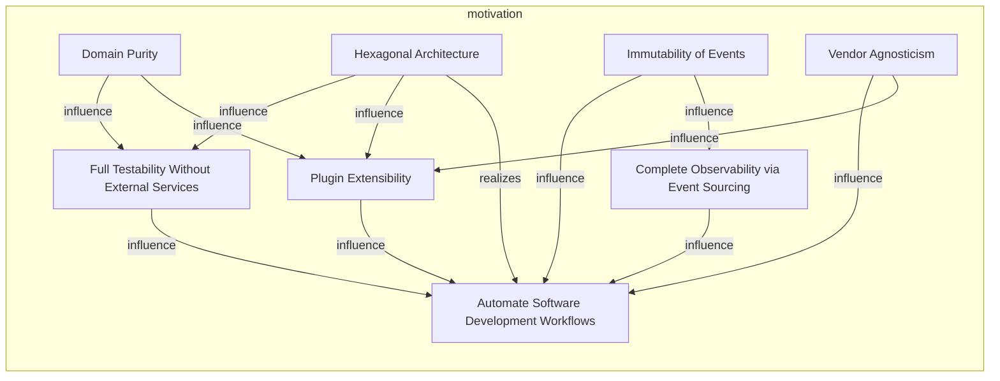
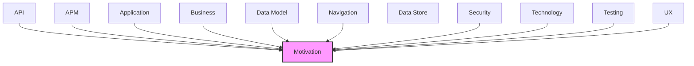

# Motivation

Goals, requirements, drivers, and strategic outcomes of the architecture.

## Report Index

- [Layer Introduction](#layer-introduction)
- [Intra-Layer Relationships](#intra-layer-relationships)
- [Inter-Layer Dependencies](#inter-layer-dependencies)
- [Inter-Layer Relationships Table](#inter-layer-relationships-table)
- [Element Reference](#element-reference)

## Layer Introduction

| Metric                    | Count |
| ------------------------- | ----- |
| Elements                  | 8     |
| Intra-Layer Relationships | 12    |
| Inter-Layer Relationships | 57    |
| Inbound Relationships     | 57    |
| Outbound Relationships    | 0     |

**Cross-Layer References**:

- **Upstream layers**: [API](./06-api-layer-report.md), [APM](./11-apm-layer-report.md), [Application](./04-application-layer-report.md), [Business](./02-business-layer-report.md), [Data Model](./07-data-model-layer-report.md), [Navigation](./10-navigation-layer-report.md), [Security](./03-security-layer-report.md), [Technology](./05-technology-layer-report.md), [Testing](./12-testing-layer-report.md), [UX](./09-ux-layer-report.md)

## Intra-Layer Relationships

## Inter-Layer Dependencies

## Inter-Layer Relationships Table

| Relationship ID                                                         | Source Node                                                 | Dest Node                                                    | Dest Layer   | Predicate                | Cardinality  | Strength |
| ----------------------------------------------------------------------- | ----------------------------------------------------------- | ------------------------------------------------------------ | ------------ | ------------------------ | ------------ | -------- |
| `api.operation.realizes.motivation.goal`                                | `api.operation.get-domain-events`                           | `motivation.goal.complete-observability-via-event-sourcing`  | `motivation` | `realizes`               | many-to-many | medium   |
| `api.operation.realizes.motivation.goal`                                | `api.operation.get-simulation-board-state`                  | `motivation.goal.full-testability-without-external-services` | `motivation` | `realizes`               | many-to-many | medium   |
| `api.operation.realizes.motivation.goal`                                | `api.operation.get-workflow-run-audit`                      | `motivation.goal.complete-observability-via-event-sourcing`  | `motivation` | `realizes`               | many-to-many | medium   |
| `api.operation.realizes.motivation.goal`                                | `api.operation.get-workflow-run`                            | `motivation.goal.complete-observability-via-event-sourcing`  | `motivation` | `realizes`               | many-to-many | medium   |
| `api.operation.realizes.motivation.goal`                                | `api.operation.list-agents`                                 | `motivation.goal.plugin-extensibility`                       | `motivation` | `realizes`               | many-to-many | medium   |
| `api.operation.realizes.motivation.goal`                                | `api.operation.replay-events`                               | `motivation.goal.complete-observability-via-event-sourcing`  | `motivation` | `realizes`               | many-to-many | medium   |
| `api.operation.realizes.motivation.goal`                                | `api.operation.start-workflow-execution`                    | `motivation.goal.automate-software-development-workflows`    | `motivation` | `realizes`               | many-to-many | medium   |
| `apm.metricinstrument.realizes.motivation.goal`                         | `apm.metricinstrument.agent-execution-duration`             | `motivation.goal.complete-observability-via-event-sourcing`  | `motivation` | `realizes`               | many-to-many | medium   |
| `apm.metricinstrument.realizes.motivation.goal`                         | `apm.metricinstrument.event-bus-stats`                      | `motivation.goal.complete-observability-via-event-sourcing`  | `motivation` | `realizes`               | many-to-many | medium   |
| `application.applicationservice.realizes.motivation.goal`               | `application.applicationservice.board-polling-service`      | `motivation.goal.automate-software-development-workflows`    | `motivation` | `realizes`               | many-to-many | medium   |
| `application.applicationservice.realizes.motivation.goal`               | `application.applicationservice.configuration-service`      | `motivation.goal.plugin-extensibility`                       | `motivation` | `realizes`               | many-to-many | medium   |
| `application.applicationservice.realizes.motivation.goal`               | `application.applicationservice.event-sequence-validator`   | `motivation.goal.complete-observability-via-event-sourcing`  | `motivation` | `realizes`               | many-to-many | medium   |
| `application.applicationservice.realizes.motivation.goal`               | `application.applicationservice.execution-service`          | `motivation.goal.automate-software-development-workflows`    | `motivation` | `realizes`               | many-to-many | medium   |
| `application.applicationservice.realizes.motivation.goal`               | `application.applicationservice.metrics-service`            | `motivation.goal.complete-observability-via-event-sourcing`  | `motivation` | `realizes`               | many-to-many | medium   |
| `application.applicationservice.realizes.motivation.goal`               | `application.applicationservice.multi-project-orchestrator` | `motivation.goal.automate-software-development-workflows`    | `motivation` | `realizes`               | many-to-many | medium   |
| `application.applicationservice.realizes.motivation.goal`               | `application.applicationservice.pipeline-lock-service`      | `motivation.goal.automate-software-development-workflows`    | `motivation` | `realizes`               | many-to-many | medium   |
| `application.applicationservice.realizes.motivation.goal`               | `application.applicationservice.review-service`             | `motivation.goal.automate-software-development-workflows`    | `motivation` | `realizes`               | many-to-many | medium   |
| `application.applicationservice.realizes.motivation.goal`               | `application.applicationservice.simulation-service`         | `motivation.goal.full-testability-without-external-services` | `motivation` | `realizes`               | many-to-many | medium   |
| `application.applicationservice.realizes.motivation.goal`               | `application.applicationservice.workflow-orchestrator`      | `motivation.goal.automate-software-development-workflows`    | `motivation` | `realizes`               | many-to-many | medium   |
| `business.businessfunction.realizes.motivation.goal`                    | `business.businessfunction.event-sourced-audit-trail`       | `motivation.goal.complete-observability-via-event-sourcing`  | `motivation` | `realizes`               | many-to-many | medium   |
| `business.businessservice.realizes.motivation.goal`                     | `business.businessservice.agent-execution-management`       | `motivation.goal.automate-software-development-workflows`    | `motivation` | `realizes`               | many-to-many | medium   |
| `business.businessservice.realizes.motivation.goal`                     | `business.businessservice.code-review-orchestration`        | `motivation.goal.automate-software-development-workflows`    | `motivation` | `realizes`               | many-to-many | medium   |
| `business.businessservice.realizes.motivation.goal`                     | `business.businessservice.configuration-management`         | `motivation.goal.plugin-extensibility`                       | `motivation` | `realizes`               | many-to-many | medium   |
| `business.businessservice.realizes.motivation.goal`                     | `business.businessservice.multi-project-coordination`       | `motivation.goal.automate-software-development-workflows`    | `motivation` | `realizes`               | many-to-many | medium   |
| `business.businessservice.realizes.motivation.goal`                     | `business.businessservice.workflow-automation`              | `motivation.goal.automate-software-development-workflows`    | `motivation` | `realizes`               | many-to-many | medium   |
| `business.businessservice.realizes.motivation.goal`                     | `business.businessservice.workspace-management`             | `motivation.goal.full-testability-without-external-services` | `motivation` | `realizes`               | many-to-many | medium   |
| `data-model.objectschema.realizes.motivation.goal`                      | `data-model.objectschema.agent-execution`                   | `motivation.goal.complete-observability-via-event-sourcing`  | `motivation` | `realizes`               | many-to-many | medium   |
| `data-model.objectschema.realizes.motivation.goal`                      | `data-model.objectschema.work-item`                         | `motivation.goal.automate-software-development-workflows`    | `motivation` | `realizes`               | many-to-many | medium   |
| `navigation.navigationflow.realizes.motivation.goal`                    | `navigation.navigationflow.main-application-flow`           | `motivation.goal.automate-software-development-workflows`    | `motivation` | `realizes`               | many-to-many | medium   |
| `security.securitypolicy.realizes.motivation.principle`                 | `security.securitypolicy.api-key-authentication`            | `motivation.principle.domain-purity`                         | `motivation` | `realizes`               | many-to-many | medium   |
| `security.securitypolicy.realizes.motivation.principle`                 | `security.securitypolicy.container-isolation`               | `motivation.principle.domain-purity`                         | `motivation` | `realizes`               | many-to-many | medium   |
| `security.securitypolicy.realizes.motivation.principle`                 | `security.securitypolicy.container-isolation`               | `motivation.principle.hexagonal-architecture`                | `motivation` | `realizes`               | many-to-many | medium   |
| `security.securitypolicy.realizes.motivation.principle`                 | `security.securitypolicy.jwt-bearer-authentication`         | `motivation.principle.domain-purity`                         | `motivation` | `realizes`               | many-to-many | medium   |
| `security.securitypolicy.realizes.motivation.principle`                 | `security.securitypolicy.role-based-access-control`         | `motivation.principle.hexagonal-architecture`                | `motivation` | `realizes`               | many-to-many | medium   |
| `security.securitypolicy.realizes.motivation.principle`                 | `security.securitypolicy.security-headers-middleware`       | `motivation.principle.vendor-agnosticism`                    | `motivation` | `realizes`               | many-to-many | medium   |
| `technology.systemsoftware.realizes.motivation.goal`                    | `technology.systemsoftware.docker`                          | `motivation.goal.automate-software-development-workflows`    | `motivation` | `realizes`               | many-to-many | medium   |
| `technology.systemsoftware.realizes.motivation.goal`                    | `technology.systemsoftware.elasticsearch`                   | `motivation.goal.complete-observability-via-event-sourcing`  | `motivation` | `realizes`               | many-to-many | medium   |
| `technology.systemsoftware.realizes.motivation.goal`                    | `technology.systemsoftware.fast-api`                        | `motivation.goal.automate-software-development-workflows`    | `motivation` | `realizes`               | many-to-many | medium   |
| `technology.systemsoftware.realizes.motivation.goal`                    | `technology.systemsoftware.open-telemetry`                  | `motivation.goal.complete-observability-via-event-sourcing`  | `motivation` | `realizes`               | many-to-many | medium   |
| `technology.systemsoftware.realizes.motivation.goal`                    | `technology.systemsoftware.pytest`                          | `motivation.goal.full-testability-without-external-services` | `motivation` | `realizes`               | many-to-many | medium   |
| `technology.systemsoftware.realizes.motivation.goal`                    | `technology.systemsoftware.python-311`                      | `motivation.goal.automate-software-development-workflows`    | `motivation` | `realizes`               | many-to-many | medium   |
| `technology.systemsoftware.realizes.motivation.goal`                    | `technology.systemsoftware.redis`                           | `motivation.goal.complete-observability-via-event-sourcing`  | `motivation` | `realizes`               | many-to-many | medium   |
| `testing.testcoveragemodel.governed-by-principles.motivation.principle` | `testing.testcoveragemodel.adapter-unit-tests`              | `motivation.principle.hexagonal-architecture`                | `motivation` | `governed-by-principles` | many-to-many | high     |
| `testing.testcoveragemodel.governed-by-principles.motivation.principle` | `testing.testcoveragemodel.domain-model-unit-tests`         | `motivation.principle.domain-purity`                         | `motivation` | `governed-by-principles` | many-to-many | high     |
| `testing.testcoveragemodel.supports-goals.motivation.goal`              | `testing.testcoveragemodel.domain-model-unit-tests`         | `motivation.goal.full-testability-without-external-services` | `motivation` | `supports-goals`         | many-to-many | high     |
| `testing.testcoveragemodel.supports-goals.motivation.goal`              | `testing.testcoveragemodel.failure-recovery-tests`          | `motivation.goal.automate-software-development-workflows`    | `motivation` | `supports-goals`         | many-to-many | high     |
| `testing.testcoveragemodel.supports-goals.motivation.goal`              | `testing.testcoveragemodel.multi-project-isolation-tests`   | `motivation.goal.automate-software-development-workflows`    | `motivation` | `supports-goals`         | many-to-many | high     |
| `testing.testcoveragemodel.supports-goals.motivation.goal`              | `testing.testcoveragemodel.observability-integration-tests` | `motivation.goal.complete-observability-via-event-sourcing`  | `motivation` | `supports-goals`         | many-to-many | high     |
| `testing.testcoveragemodel.governed-by-principles.motivation.principle` | `testing.testcoveragemodel.port-adapter-contract-tests`     | `motivation.principle.hexagonal-architecture`                | `motivation` | `governed-by-principles` | many-to-many | high     |
| `testing.testcoveragemodel.supports-goals.motivation.goal`              | `testing.testcoveragemodel.simulation-scenario-tests`       | `motivation.goal.full-testability-without-external-services` | `motivation` | `supports-goals`         | many-to-many | high     |
| `ux.librarycomponent.satisfies.motivation.principle`                    | `ux.librarycomponent.system-status-header`                  | `motivation.principle.hexagonal-architecture`                | `motivation` | `satisfies`              | many-to-many | medium   |
| `ux.librarycomponent.satisfies.motivation.principle`                    | `ux.librarycomponent.workflow-run-list`                     | `motivation.principle.hexagonal-architecture`                | `motivation` | `satisfies`              | many-to-many | medium   |
| `ux.librarycomponent.satisfies.motivation.principle`                    | `ux.librarycomponent.workflow-stage-editor`                 | `motivation.principle.hexagonal-architecture`                | `motivation` | `satisfies`              | many-to-many | medium   |
| `ux.view.realizes.motivation.goal`                                      | `ux.view.dashboard`                                         | `motivation.goal.automate-software-development-workflows`    | `motivation` | `realizes`               | many-to-many | medium   |
| `ux.view.realizes.motivation.goal`                                      | `ux.view.pipeline-flow`                                     | `motivation.goal.complete-observability-via-event-sourcing`  | `motivation` | `realizes`               | many-to-many | medium   |
| `ux.view.realizes.motivation.goal`                                      | `ux.view.pipeline-run-details`                              | `motivation.goal.complete-observability-via-event-sourcing`  | `motivation` | `realizes`               | many-to-many | medium   |
| `ux.view.realizes.motivation.goal`                                      | `ux.view.workflow-config`                                   | `motivation.goal.plugin-extensibility`                       | `motivation` | `realizes`               | many-to-many | medium   |

## Element Reference

### Automate Software Development Workflows {#automate-software-development-workflows}

**ID**: `motivation.goal.automate-software-development-workflows`

**Type**: `goal`

Enable end-to-end automation of software development tasks using specialized AI agents integrated with GitHub

#### Relationships

| Type        | Related Element                                              | Predicate        | Direction |
| ----------- | ------------------------------------------------------------ | ---------------- | --------- |
| inter-layer | `api.operation.start-workflow-execution`                     | `realizes`       | inbound   |
| inter-layer | `application.applicationservice.board-polling-service`       | `realizes`       | inbound   |
| inter-layer | `application.applicationservice.execution-service`           | `realizes`       | inbound   |
| inter-layer | `application.applicationservice.multi-project-orchestrator`  | `realizes`       | inbound   |
| inter-layer | `application.applicationservice.pipeline-lock-service`       | `realizes`       | inbound   |
| inter-layer | `application.applicationservice.review-service`              | `realizes`       | inbound   |
| inter-layer | `application.applicationservice.workflow-orchestrator`       | `realizes`       | inbound   |
| inter-layer | `business.businessservice.agent-execution-management`        | `realizes`       | inbound   |
| inter-layer | `business.businessservice.code-review-orchestration`         | `realizes`       | inbound   |
| inter-layer | `business.businessservice.multi-project-coordination`        | `realizes`       | inbound   |
| inter-layer | `business.businessservice.workflow-automation`               | `realizes`       | inbound   |
| inter-layer | `data-model.objectschema.work-item`                          | `realizes`       | inbound   |
| inter-layer | `navigation.navigationflow.main-application-flow`            | `realizes`       | inbound   |
| inter-layer | `technology.systemsoftware.docker`                           | `realizes`       | inbound   |
| inter-layer | `technology.systemsoftware.fast-api`                         | `realizes`       | inbound   |
| inter-layer | `technology.systemsoftware.python-311`                       | `realizes`       | inbound   |
| inter-layer | `testing.testcoveragemodel.failure-recovery-tests`           | `supports-goals` | inbound   |
| inter-layer | `testing.testcoveragemodel.multi-project-isolation-tests`    | `supports-goals` | inbound   |
| inter-layer | `ux.view.dashboard`                                          | `realizes`       | inbound   |
| intra-layer | `motivation.goal.complete-observability-via-event-sourcing`  | `influence`      | inbound   |
| intra-layer | `motivation.goal.full-testability-without-external-services` | `influence`      | inbound   |
| intra-layer | `motivation.goal.plugin-extensibility`                       | `influence`      | inbound   |
| intra-layer | `motivation.principle.hexagonal-architecture`                | `realizes`       | inbound   |
| intra-layer | `motivation.principle.immutability-of-events`                | `influence`      | inbound   |
| intra-layer | `motivation.principle.vendor-agnosticism`                    | `influence`      | inbound   |

### Complete Observability via Event Sourcing {#complete-observability-via-event-sourcing}

**ID**: `motivation.goal.complete-observability-via-event-sourcing`

**Type**: `goal`

Provide immutable audit trail of all system state changes with event replay capability for debugging and compliance

#### Relationships

| Type        | Related Element                                             | Predicate        | Direction |
| ----------- | ----------------------------------------------------------- | ---------------- | --------- |
| inter-layer | `api.operation.get-domain-events`                           | `realizes`       | inbound   |
| inter-layer | `api.operation.get-workflow-run-audit`                      | `realizes`       | inbound   |
| inter-layer | `api.operation.get-workflow-run`                            | `realizes`       | inbound   |
| inter-layer | `api.operation.replay-events`                               | `realizes`       | inbound   |
| inter-layer | `apm.metricinstrument.agent-execution-duration`             | `realizes`       | inbound   |
| inter-layer | `apm.metricinstrument.event-bus-stats`                      | `realizes`       | inbound   |
| inter-layer | `application.applicationservice.event-sequence-validator`   | `realizes`       | inbound   |
| inter-layer | `application.applicationservice.metrics-service`            | `realizes`       | inbound   |
| inter-layer | `business.businessfunction.event-sourced-audit-trail`       | `realizes`       | inbound   |
| inter-layer | `data-model.objectschema.agent-execution`                   | `realizes`       | inbound   |
| inter-layer | `technology.systemsoftware.elasticsearch`                   | `realizes`       | inbound   |
| inter-layer | `technology.systemsoftware.open-telemetry`                  | `realizes`       | inbound   |
| inter-layer | `technology.systemsoftware.redis`                           | `realizes`       | inbound   |
| inter-layer | `testing.testcoveragemodel.observability-integration-tests` | `supports-goals` | inbound   |
| inter-layer | `ux.view.pipeline-flow`                                     | `realizes`       | inbound   |
| inter-layer | `ux.view.pipeline-run-details`                              | `realizes`       | inbound   |
| intra-layer | `motivation.goal.automate-software-development-workflows`   | `influence`      | outbound  |
| intra-layer | `motivation.principle.immutability-of-events`               | `influence`      | inbound   |

### Full Testability Without External Services {#full-testability-without-external-services}

**ID**: `motivation.goal.full-testability-without-external-services`

**Type**: `goal`

Support complete end-to-end testing in simulation mode with deterministic mock adapters and no external service dependencies

#### Relationships

| Type        | Related Element                                           | Predicate        | Direction |
| ----------- | --------------------------------------------------------- | ---------------- | --------- |
| inter-layer | `api.operation.get-simulation-board-state`                | `realizes`       | inbound   |
| inter-layer | `application.applicationservice.simulation-service`       | `realizes`       | inbound   |
| inter-layer | `business.businessservice.workspace-management`           | `realizes`       | inbound   |
| inter-layer | `technology.systemsoftware.pytest`                        | `realizes`       | inbound   |
| inter-layer | `testing.testcoveragemodel.domain-model-unit-tests`       | `supports-goals` | inbound   |
| inter-layer | `testing.testcoveragemodel.simulation-scenario-tests`     | `supports-goals` | inbound   |
| intra-layer | `motivation.goal.automate-software-development-workflows` | `influence`      | outbound  |
| intra-layer | `motivation.principle.domain-purity`                      | `influence`      | inbound   |
| intra-layer | `motivation.principle.hexagonal-architecture`             | `influence`      | inbound   |

### Plugin Extensibility {#plugin-extensibility}

**ID**: `motivation.goal.plugin-extensibility`

**Type**: `goal`

Allow swappable implementations for ticket systems, LLM providers, and external integrations via port interfaces

#### Relationships

| Type        | Related Element                                           | Predicate   | Direction |
| ----------- | --------------------------------------------------------- | ----------- | --------- |
| inter-layer | `api.operation.list-agents`                               | `realizes`  | inbound   |
| inter-layer | `application.applicationservice.configuration-service`    | `realizes`  | inbound   |
| inter-layer | `business.businessservice.configuration-management`       | `realizes`  | inbound   |
| inter-layer | `ux.view.workflow-config`                                 | `realizes`  | inbound   |
| intra-layer | `motivation.goal.automate-software-development-workflows` | `influence` | outbound  |
| intra-layer | `motivation.principle.domain-purity`                      | `influence` | inbound   |
| intra-layer | `motivation.principle.hexagonal-architecture`             | `influence` | inbound   |
| intra-layer | `motivation.principle.vendor-agnosticism`                 | `influence` | inbound   |

### Domain Purity {#domain-purity}

**ID**: `motivation.principle.domain-purity`

**Type**: `principle`

Domain layer must have zero external dependencies — pure business logic only, all external interactions via output ports

#### Relationships

| Type        | Related Element                                              | Predicate                | Direction |
| ----------- | ------------------------------------------------------------ | ------------------------ | --------- |
| inter-layer | `security.securitypolicy.api-key-authentication`             | `realizes`               | inbound   |
| inter-layer | `security.securitypolicy.container-isolation`                | `realizes`               | inbound   |
| inter-layer | `security.securitypolicy.jwt-bearer-authentication`          | `realizes`               | inbound   |
| inter-layer | `testing.testcoveragemodel.domain-model-unit-tests`          | `governed-by-principles` | inbound   |
| intra-layer | `motivation.goal.full-testability-without-external-services` | `influence`              | outbound  |
| intra-layer | `motivation.goal.plugin-extensibility`                       | `influence`              | outbound  |

### Hexagonal Architecture {#hexagonal-architecture}

**ID**: `motivation.principle.hexagonal-architecture`

**Type**: `principle`

Strict separation between domain business logic and external adapters via port interfaces prevents coupling

#### Relationships

| Type        | Related Element                                              | Predicate                | Direction |
| ----------- | ------------------------------------------------------------ | ------------------------ | --------- |
| inter-layer | `security.securitypolicy.container-isolation`                | `realizes`               | inbound   |
| inter-layer | `security.securitypolicy.role-based-access-control`          | `realizes`               | inbound   |
| inter-layer | `testing.testcoveragemodel.adapter-unit-tests`               | `governed-by-principles` | inbound   |
| inter-layer | `testing.testcoveragemodel.port-adapter-contract-tests`      | `governed-by-principles` | inbound   |
| inter-layer | `ux.librarycomponent.system-status-header`                   | `satisfies`              | inbound   |
| inter-layer | `ux.librarycomponent.workflow-run-list`                      | `satisfies`              | inbound   |
| inter-layer | `ux.librarycomponent.workflow-stage-editor`                  | `satisfies`              | inbound   |
| intra-layer | `motivation.goal.full-testability-without-external-services` | `influence`              | outbound  |
| intra-layer | `motivation.goal.plugin-extensibility`                       | `influence`              | outbound  |
| intra-layer | `motivation.goal.automate-software-development-workflows`    | `realizes`               | outbound  |

### Immutability of Events {#immutability-of-events}

**ID**: `motivation.principle.immutability-of-events`

**Type**: `principle`

Domain events are frozen dataclasses — immutable and append-only — guaranteeing audit integrity and enabling reliable event replay

#### Relationships

| Type        | Related Element                                             | Predicate   | Direction |
| ----------- | ----------------------------------------------------------- | ----------- | --------- |
| intra-layer | `motivation.goal.automate-software-development-workflows`   | `influence` | outbound  |
| intra-layer | `motivation.goal.complete-observability-via-event-sourcing` | `influence` | outbound  |

### Vendor Agnosticism {#vendor-agnosticism}

**ID**: `motivation.principle.vendor-agnosticism`

**Type**: `principle`

All external system interactions through abstract port interfaces to avoid vendor lock-in for LLM providers and ticket systems

#### Relationships

| Type        | Related Element                                           | Predicate   | Direction |
| ----------- | --------------------------------------------------------- | ----------- | --------- |
| inter-layer | `security.securitypolicy.security-headers-middleware`     | `realizes`  | inbound   |
| intra-layer | `motivation.goal.automate-software-development-workflows` | `influence` | outbound  |
| intra-layer | `motivation.goal.plugin-extensibility`                    | `influence` | outbound  |

---

Generated: 2026-05-08T12:30:44.964Z | Model Version: 0.1.0
