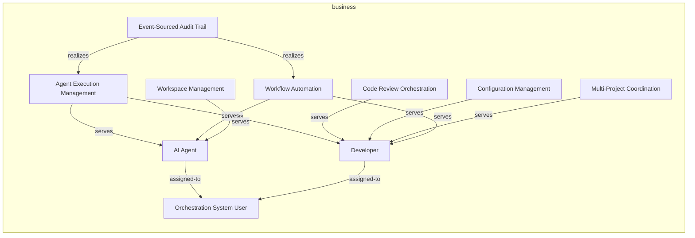
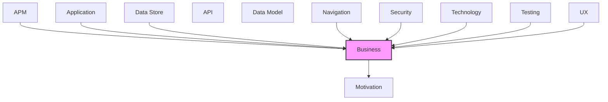

# Business

Business processes, functions, roles, and services.

## Report Index

- [Layer Introduction](#layer-introduction)
- [Intra-Layer Relationships](#intra-layer-relationships)
- [Inter-Layer Dependencies](#inter-layer-dependencies)
- [Inter-Layer Relationships Table](#inter-layer-relationships-table)
- [Element Reference](#element-reference)

## Layer Introduction

| Metric                    | Count |
| ------------------------- | ----- |
| Elements                  | 10    |
| Intra-Layer Relationships | 12    |
| Inter-Layer Relationships | 46    |
| Inbound Relationships     | 39    |
| Outbound Relationships    | 7     |

**Cross-Layer References**:

- **Upstream layers**: [APM](./11-apm-layer-report.md), [Application](./04-application-layer-report.md), [Data Store](./08-data-store-layer-report.md), [Navigation](./10-navigation-layer-report.md), [Security](./03-security-layer-report.md), [Technology](./05-technology-layer-report.md), [Testing](./12-testing-layer-report.md), [UX](./09-ux-layer-report.md)
- **Downstream layers**: [Motivation](./01-motivation-layer-report.md)

## Intra-Layer Relationships

## Inter-Layer Dependencies

## Inter-Layer Relationships Table

| Relationship ID                                                    | Source Node                                                  | Dest Node                                                    | Dest Layer   | Predicate  | Cardinality  | Strength |
| ------------------------------------------------------------------ | ------------------------------------------------------------ | ------------------------------------------------------------ | ------------ | ---------- | ------------ | -------- |
| `apm.logconfiguration.monitors.business.businessservice`           | `apm.logconfiguration.structured-logging-with-trace-context` | `business.businessservice.agent-execution-management`        | `business`   | `monitors` | many-to-many | medium   |
| `apm.logconfiguration.monitors.business.businessservice`           | `apm.logconfiguration.structured-logging-with-trace-context` | `business.businessservice.workflow-automation`               | `business`   | `monitors` | many-to-many | medium   |
| `application.applicationservice.realizes.business.businessservice` | `application.applicationservice.agent-scheduler`             | `business.businessservice.agent-execution-management`        | `business`   | `realizes` | many-to-many | medium   |
| `application.applicationservice.realizes.business.businessservice` | `application.applicationservice.configuration-service`       | `business.businessservice.configuration-management`          | `business`   | `realizes` | many-to-many | medium   |
| `application.applicationservice.realizes.business.businessservice` | `application.applicationservice.execution-service`           | `business.businessservice.agent-execution-management`        | `business`   | `realizes` | many-to-many | medium   |
| `application.applicationservice.realizes.business.businessservice` | `application.applicationservice.multi-project-orchestrator`  | `business.businessservice.multi-project-coordination`        | `business`   | `realizes` | many-to-many | medium   |
| `application.applicationservice.realizes.business.businessservice` | `application.applicationservice.review-service`              | `business.businessservice.code-review-orchestration`         | `business`   | `realizes` | many-to-many | medium   |
| `application.applicationservice.realizes.business.businessservice` | `application.applicationservice.workflow-orchestrator`       | `business.businessservice.workflow-automation`               | `business`   | `realizes` | many-to-many | medium   |
| `application.applicationservice.realizes.business.businessservice` | `application.applicationservice.workspace-router`            | `business.businessservice.workspace-management`              | `business`   | `realizes` | many-to-many | medium   |
| `business.businessfunction.realizes.motivation.goal`               | `business.businessfunction.event-sourced-audit-trail`        | `motivation.goal.complete-observability-via-event-sourcing`  | `motivation` | `realizes` | many-to-many | medium   |
| `business.businessservice.realizes.motivation.goal`                | `business.businessservice.agent-execution-management`        | `motivation.goal.automate-software-development-workflows`    | `motivation` | `realizes` | many-to-many | medium   |
| `business.businessservice.realizes.motivation.goal`                | `business.businessservice.code-review-orchestration`         | `motivation.goal.automate-software-development-workflows`    | `motivation` | `realizes` | many-to-many | medium   |
| `business.businessservice.realizes.motivation.goal`                | `business.businessservice.configuration-management`          | `motivation.goal.plugin-extensibility`                       | `motivation` | `realizes` | many-to-many | medium   |
| `business.businessservice.realizes.motivation.goal`                | `business.businessservice.multi-project-coordination`        | `motivation.goal.automate-software-development-workflows`    | `motivation` | `realizes` | many-to-many | medium   |
| `business.businessservice.realizes.motivation.goal`                | `business.businessservice.workflow-automation`               | `motivation.goal.automate-software-development-workflows`    | `motivation` | `realizes` | many-to-many | medium   |
| `business.businessservice.realizes.motivation.goal`                | `business.businessservice.workspace-management`              | `motivation.goal.full-testability-without-external-services` | `motivation` | `realizes` | many-to-many | medium   |
| `data-store.database.realizes.business.businessservice`            | `data-store.database.elasticsearch-config-storage`           | `business.businessservice.configuration-management`          | `business`   | `realizes` | many-to-many | medium   |
| `data-store.database.realizes.business.businessservice`            | `data-store.database.elasticsearch-event-store`              | `business.businessservice.workflow-automation`               | `business`   | `realizes` | many-to-many | medium   |
| `data-store.database.realizes.business.businessservice`            | `data-store.database.elasticsearch-workflow-config`          | `business.businessservice.configuration-management`          | `business`   | `realizes` | many-to-many | medium   |
| `data-store.database.realizes.business.businessservice`            | `data-store.database.redis-config-cache`                     | `business.businessservice.configuration-management`          | `business`   | `realizes` | many-to-many | medium   |
| `data-store.database.realizes.business.businessservice`            | `data-store.database.redis-event-store`                      | `business.businessservice.workflow-automation`               | `business`   | `realizes` | many-to-many | medium   |
| `navigation.route.serves.business.businessrole`                    | `navigation.route.agent-config-route`                        | `business.businessrole.orchestration-system-user`            | `business`   | `serves`   | many-to-many | medium   |
| `navigation.route.maps-to.business.businessfunction`               | `navigation.route.dashboard-route`                           | `business.businessfunction.event-sourced-audit-trail`        | `business`   | `maps-to`  | many-to-many | medium   |
| `navigation.route.serves.business.businessrole`                    | `navigation.route.dashboard-route`                           | `business.businessrole.orchestration-system-user`            | `business`   | `serves`   | many-to-many | medium   |
| `navigation.route.serves.business.businessrole`                    | `navigation.route.pipeline-flow-route`                       | `business.businessrole.orchestration-system-user`            | `business`   | `serves`   | many-to-many | medium   |
| `navigation.route.serves.business.businessrole`                    | `navigation.route.workflow-config-route`                     | `business.businessrole.orchestration-system-user`            | `business`   | `serves`   | many-to-many | medium   |
| `security.securitypolicy.governs.business.businessservice`         | `security.securitypolicy.api-key-authentication`             | `business.businessservice.workflow-automation`               | `business`   | `governs`  | many-to-many | medium   |
| `security.securitypolicy.governs.business.businessservice`         | `security.securitypolicy.container-isolation`                | `business.businessservice.agent-execution-management`        | `business`   | `governs`  | many-to-many | medium   |
| `security.securitypolicy.governs.business.businessservice`         | `security.securitypolicy.container-isolation`                | `business.businessservice.workspace-management`              | `business`   | `governs`  | many-to-many | medium   |
| `security.securitypolicy.governs.business.businessservice`         | `security.securitypolicy.jwt-bearer-authentication`          | `business.businessservice.workflow-automation`               | `business`   | `governs`  | many-to-many | medium   |
| `security.securitypolicy.governs.business.businessservice`         | `security.securitypolicy.role-based-access-control`          | `business.businessservice.agent-execution-management`        | `business`   | `governs`  | many-to-many | medium   |
| `security.securitypolicy.governs.business.businessservice`         | `security.securitypolicy.role-based-access-control`          | `business.businessservice.configuration-management`          | `business`   | `governs`  | many-to-many | medium   |
| `security.securitypolicy.governs.business.businessservice`         | `security.securitypolicy.security-headers-middleware`        | `business.businessservice.workflow-automation`               | `business`   | `governs`  | many-to-many | medium   |
| `technology.systemsoftware.realizes.business.businessservice`      | `technology.systemsoftware.docker`                           | `business.businessservice.agent-execution-management`        | `business`   | `realizes` | many-to-many | medium   |
| `technology.systemsoftware.realizes.business.businessservice`      | `technology.systemsoftware.docker`                           | `business.businessservice.workspace-management`              | `business`   | `realizes` | many-to-many | medium   |
| `technology.systemsoftware.realizes.business.businessservice`      | `technology.systemsoftware.elasticsearch`                    | `business.businessservice.workflow-automation`               | `business`   | `realizes` | many-to-many | medium   |
| `technology.systemsoftware.realizes.business.businessservice`      | `technology.systemsoftware.fast-api`                         | `business.businessservice.workflow-automation`               | `business`   | `realizes` | many-to-many | medium   |
| `testing.testcoveragemodel.covers.business.businessservice`        | `testing.testcoveragemodel.board-automation-tests`           | `business.businessservice.workflow-automation`               | `business`   | `covers`   | many-to-many | medium   |
| `testing.testcoveragemodel.covers.business.businessservice`        | `testing.testcoveragemodel.integration-tests`                | `business.businessservice.agent-execution-management`        | `business`   | `covers`   | many-to-many | medium   |
| `testing.testcoveragemodel.covers.business.businessfunction`       | `testing.testcoveragemodel.observability-integration-tests`  | `business.businessfunction.event-sourced-audit-trail`        | `business`   | `covers`   | many-to-many | medium   |
| `testing.testcoveragemodel.covers.business.businessservice`        | `testing.testcoveragemodel.simulation-scenario-tests`        | `business.businessservice.workflow-automation`               | `business`   | `covers`   | many-to-many | medium   |
| `ux.view.serves.business.businessservice`                          | `ux.view.agent-config`                                       | `business.businessservice.configuration-management`          | `business`   | `serves`   | many-to-many | medium   |
| `ux.view.serves.business.businessservice`                          | `ux.view.dashboard`                                          | `business.businessservice.workflow-automation`               | `business`   | `serves`   | many-to-many | medium   |
| `ux.view.serves.business.businessservice`                          | `ux.view.pipeline-flow`                                      | `business.businessservice.workflow-automation`               | `business`   | `serves`   | many-to-many | medium   |
| `ux.view.serves.business.businessservice`                          | `ux.view.project-config`                                     | `business.businessservice.configuration-management`          | `business`   | `serves`   | many-to-many | medium   |
| `ux.view.serves.business.businessservice`                          | `ux.view.workflow-config`                                    | `business.businessservice.configuration-management`          | `business`   | `serves`   | many-to-many | medium   |

## Element Reference

### AI Agent {#ai-agent}

**ID**: `business.businessactor.ai-agent`

**Type**: `businessactor`

Specialized AI agent that autonomously executes software development tasks within isolated containers

#### Relationships

| Type        | Related Element                                       | Predicate     | Direction |
| ----------- | ----------------------------------------------------- | ------------- | --------- |
| intra-layer | `business.businessrole.orchestration-system-user`     | `assigned-to` | outbound  |
| intra-layer | `business.businessservice.agent-execution-management` | `serves`      | inbound   |
| intra-layer | `business.businessservice.workflow-automation`        | `serves`      | inbound   |
| intra-layer | `business.businessservice.workspace-management`       | `serves`      | inbound   |

### Developer {#developer}

**ID**: `business.businessactor.developer`

**Type**: `businessactor`

Software developer who creates work items, reviews AI agent outputs, and configures workflows

#### Relationships

| Type        | Related Element                                       | Predicate     | Direction |
| ----------- | ----------------------------------------------------- | ------------- | --------- |
| intra-layer | `business.businessrole.orchestration-system-user`     | `assigned-to` | outbound  |
| intra-layer | `business.businessservice.agent-execution-management` | `serves`      | inbound   |
| intra-layer | `business.businessservice.code-review-orchestration`  | `serves`      | inbound   |
| intra-layer | `business.businessservice.configuration-management`   | `serves`      | inbound   |
| intra-layer | `business.businessservice.multi-project-coordination` | `serves`      | inbound   |
| intra-layer | `business.businessservice.workflow-automation`        | `serves`      | inbound   |

### Event-Sourced Audit Trail {#event-sourced-audit-trail}

**ID**: `business.businessfunction.event-sourced-audit-trail`

**Type**: `businessfunction`

Immutable record of all system state changes enabling audit, replay, and debugging

#### Relationships

| Type        | Related Element                                             | Predicate  | Direction |
| ----------- | ----------------------------------------------------------- | ---------- | --------- |
| inter-layer | `motivation.goal.complete-observability-via-event-sourcing` | `realizes` | outbound  |
| inter-layer | `navigation.route.dashboard-route`                          | `maps-to`  | inbound   |
| inter-layer | `testing.testcoveragemodel.observability-integration-tests` | `covers`   | inbound   |
| intra-layer | `business.businessservice.agent-execution-management`       | `realizes` | outbound  |
| intra-layer | `business.businessservice.workflow-automation`              | `realizes` | outbound  |

### Orchestration System User {#orchestration-system-user}

**ID**: `business.businessrole.orchestration-system-user`

**Type**: `businessrole`

Role for users and agents interacting with the workflow automation system

#### Relationships

| Type        | Related Element                          | Predicate     | Direction |
| ----------- | ---------------------------------------- | ------------- | --------- |
| inter-layer | `navigation.route.agent-config-route`    | `serves`      | inbound   |
| inter-layer | `navigation.route.dashboard-route`       | `serves`      | inbound   |
| inter-layer | `navigation.route.pipeline-flow-route`   | `serves`      | inbound   |
| inter-layer | `navigation.route.workflow-config-route` | `serves`      | inbound   |
| intra-layer | `business.businessactor.ai-agent`        | `assigned-to` | inbound   |
| intra-layer | `business.businessactor.developer`       | `assigned-to` | inbound   |

### Agent Execution Management {#agent-execution-management}

**ID**: `business.businessservice.agent-execution-management`

**Type**: `businessservice`

Manages the lifecycle of AI agent executions including scheduling, monitoring, and recovery

#### Relationships

| Type        | Related Element                                              | Predicate  | Direction |
| ----------- | ------------------------------------------------------------ | ---------- | --------- |
| inter-layer | `apm.logconfiguration.structured-logging-with-trace-context` | `monitors` | inbound   |
| inter-layer | `application.applicationservice.agent-scheduler`             | `realizes` | inbound   |
| inter-layer | `application.applicationservice.execution-service`           | `realizes` | inbound   |
| inter-layer | `motivation.goal.automate-software-development-workflows`    | `realizes` | outbound  |
| inter-layer | `security.securitypolicy.container-isolation`                | `governs`  | inbound   |
| inter-layer | `security.securitypolicy.role-based-access-control`          | `governs`  | inbound   |
| inter-layer | `technology.systemsoftware.docker`                           | `realizes` | inbound   |
| inter-layer | `testing.testcoveragemodel.integration-tests`                | `covers`   | inbound   |
| intra-layer | `business.businessfunction.event-sourced-audit-trail`        | `realizes` | inbound   |
| intra-layer | `business.businessactor.ai-agent`                            | `serves`   | outbound  |
| intra-layer | `business.businessactor.developer`                           | `serves`   | outbound  |

### Code Review Orchestration {#code-review-orchestration}

**ID**: `business.businessservice.code-review-orchestration`

**Type**: `businessservice`

Coordinates maker-checker review cycles with AI feedback loops

#### Relationships

| Type        | Related Element                                           | Predicate  | Direction |
| ----------- | --------------------------------------------------------- | ---------- | --------- |
| inter-layer | `application.applicationservice.review-service`           | `realizes` | inbound   |
| inter-layer | `motivation.goal.automate-software-development-workflows` | `realizes` | outbound  |
| intra-layer | `business.businessactor.developer`                        | `serves`   | outbound  |

### Configuration Management {#configuration-management}

**ID**: `business.businessservice.configuration-management`

**Type**: `businessservice`

Manages project, agent, pipeline, and environment configuration via database-backed storage

#### Relationships

| Type        | Related Element                                        | Predicate  | Direction |
| ----------- | ------------------------------------------------------ | ---------- | --------- |
| inter-layer | `application.applicationservice.configuration-service` | `realizes` | inbound   |
| inter-layer | `motivation.goal.plugin-extensibility`                 | `realizes` | outbound  |
| inter-layer | `data-store.database.elasticsearch-config-storage`     | `realizes` | inbound   |
| inter-layer | `data-store.database.elasticsearch-workflow-config`    | `realizes` | inbound   |
| inter-layer | `data-store.database.redis-config-cache`               | `realizes` | inbound   |
| inter-layer | `security.securitypolicy.role-based-access-control`    | `governs`  | inbound   |
| inter-layer | `ux.view.agent-config`                                 | `serves`   | inbound   |
| inter-layer | `ux.view.project-config`                               | `serves`   | inbound   |
| inter-layer | `ux.view.workflow-config`                              | `serves`   | inbound   |
| intra-layer | `business.businessactor.developer`                     | `serves`   | outbound  |

### Multi-Project Coordination {#multi-project-coordination}

**ID**: `business.businessservice.multi-project-coordination`

**Type**: `businessservice`

Orchestrates work items and agents across multiple GitHub projects simultaneously

#### Relationships

| Type        | Related Element                                             | Predicate  | Direction |
| ----------- | ----------------------------------------------------------- | ---------- | --------- |
| inter-layer | `application.applicationservice.multi-project-orchestrator` | `realizes` | inbound   |
| inter-layer | `motivation.goal.automate-software-development-workflows`   | `realizes` | outbound  |
| intra-layer | `business.businessactor.developer`                          | `serves`   | outbound  |

### Workflow Automation {#workflow-automation}

**ID**: `business.businessservice.workflow-automation`

**Type**: `businessservice`

Automates software development workflows end-to-end using specialized AI agents

#### Relationships

| Type        | Related Element                                              | Predicate  | Direction |
| ----------- | ------------------------------------------------------------ | ---------- | --------- |
| inter-layer | `apm.logconfiguration.structured-logging-with-trace-context` | `monitors` | inbound   |
| inter-layer | `application.applicationservice.workflow-orchestrator`       | `realizes` | inbound   |
| inter-layer | `motivation.goal.automate-software-development-workflows`    | `realizes` | outbound  |
| inter-layer | `data-store.database.elasticsearch-event-store`              | `realizes` | inbound   |
| inter-layer | `data-store.database.redis-event-store`                      | `realizes` | inbound   |
| inter-layer | `security.securitypolicy.api-key-authentication`             | `governs`  | inbound   |
| inter-layer | `security.securitypolicy.jwt-bearer-authentication`          | `governs`  | inbound   |
| inter-layer | `security.securitypolicy.security-headers-middleware`        | `governs`  | inbound   |
| inter-layer | `technology.systemsoftware.elasticsearch`                    | `realizes` | inbound   |
| inter-layer | `technology.systemsoftware.fast-api`                         | `realizes` | inbound   |
| inter-layer | `testing.testcoveragemodel.board-automation-tests`           | `covers`   | inbound   |
| inter-layer | `testing.testcoveragemodel.simulation-scenario-tests`        | `covers`   | inbound   |
| inter-layer | `ux.view.dashboard`                                          | `serves`   | inbound   |
| inter-layer | `ux.view.pipeline-flow`                                      | `serves`   | inbound   |
| intra-layer | `business.businessfunction.event-sourced-audit-trail`        | `realizes` | inbound   |
| intra-layer | `business.businessactor.ai-agent`                            | `serves`   | outbound  |
| intra-layer | `business.businessactor.developer`                           | `serves`   | outbound  |

### Workspace Management {#workspace-management}

**ID**: `business.businessservice.workspace-management`

**Type**: `businessservice`

Manages containerized workspaces for isolated agent execution with file mounting and context injection

#### Relationships

| Type        | Related Element                                              | Predicate  | Direction |
| ----------- | ------------------------------------------------------------ | ---------- | --------- |
| inter-layer | `application.applicationservice.workspace-router`            | `realizes` | inbound   |
| inter-layer | `motivation.goal.full-testability-without-external-services` | `realizes` | outbound  |
| inter-layer | `security.securitypolicy.container-isolation`                | `governs`  | inbound   |
| inter-layer | `technology.systemsoftware.docker`                           | `realizes` | inbound   |
| intra-layer | `business.businessactor.ai-agent`                            | `serves`   | outbound  |

---

Generated: 2026-05-11T22:23:25.353Z | Model Version: 0.1.0
