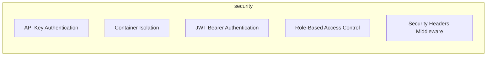
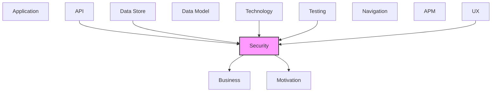

# Security

Authentication, authorization, security threats, and controls.

## Report Index

- [Layer Introduction](#layer-introduction)
- [Intra-Layer Relationships](#intra-layer-relationships)
- [Inter-Layer Dependencies](#inter-layer-dependencies)
- [Inter-Layer Relationships Table](#inter-layer-relationships-table)
- [Element Reference](#element-reference)

## Layer Introduction

| Metric                    | Count |
| ------------------------- | ----- |
| Elements                  | 5     |
| Intra-Layer Relationships | 0     |
| Inter-Layer Relationships | 36    |
| Inbound Relationships     | 23    |
| Outbound Relationships    | 13    |

**Cross-Layer References**:

- **Upstream layers**: [API](./06-api-layer-report.md), [Data Store](./08-data-store-layer-report.md), [Technology](./05-technology-layer-report.md), [Testing](./12-testing-layer-report.md), [UX](./09-ux-layer-report.md)
- **Downstream layers**: [Business](./02-business-layer-report.md), [Motivation](./01-motivation-layer-report.md)

## Intra-Layer Relationships

## Inter-Layer Dependencies

## Inter-Layer Relationships Table

| Relationship ID                                              | Source Node                                             | Dest Node                                             | Dest Layer   | Predicate   | Cardinality  | Strength |
| ------------------------------------------------------------ | ------------------------------------------------------- | ----------------------------------------------------- | ------------ | ----------- | ------------ | -------- |
| `api.operation.requires.security.securitypolicy`             | `api.operation.cancel-workflow-execution`               | `security.securitypolicy.role-based-access-control`   | `security`   | `requires`  | many-to-many | medium   |
| `api.operation.requires.security.securitypolicy`             | `api.operation.create-api-key`                          | `security.securitypolicy.api-key-authentication`      | `security`   | `requires`  | many-to-many | medium   |
| `api.operation.requires.security.securitypolicy`             | `api.operation.get-current-user`                        | `security.securitypolicy.jwt-bearer-authentication`   | `security`   | `requires`  | many-to-many | medium   |
| `api.operation.requires.security.securitypolicy`             | `api.operation.login`                                   | `security.securitypolicy.jwt-bearer-authentication`   | `security`   | `requires`  | many-to-many | medium   |
| `api.operation.requires.security.securitypolicy`             | `api.operation.refresh-token`                           | `security.securitypolicy.jwt-bearer-authentication`   | `security`   | `requires`  | many-to-many | medium   |
| `api.operation.requires.security.securitypolicy`             | `api.operation.revoke-api-key`                          | `security.securitypolicy.api-key-authentication`      | `security`   | `requires`  | many-to-many | medium   |
| `api.operation.requires.security.securitypolicy`             | `api.operation.start-workflow-execution`                | `security.securitypolicy.role-based-access-control`   | `security`   | `requires`  | many-to-many | medium   |
| `api.operation.requires.security.securitypolicy`             | `api.operation.terminate-execution`                     | `security.securitypolicy.role-based-access-control`   | `security`   | `requires`  | many-to-many | medium   |
| `api.operation.requires.security.securitypolicy`             | `api.operation.update-agent-config`                     | `security.securitypolicy.role-based-access-control`   | `security`   | `requires`  | many-to-many | medium   |
| `api.operation.requires.security.securitypolicy`             | `api.operation.update-project-config`                   | `security.securitypolicy.role-based-access-control`   | `security`   | `requires`  | many-to-many | medium   |
| `data-store.database.satisfies.security.securitypolicy`      | `data-store.database.elasticsearch-event-store`         | `security.securitypolicy.role-based-access-control`   | `security`   | `satisfies` | many-to-many | medium   |
| `data-store.database.satisfies.security.securitypolicy`      | `data-store.database.redis-event-store`                 | `security.securitypolicy.container-isolation`         | `security`   | `satisfies` | many-to-many | medium   |
| `security.securitypolicy.governs.business.businessservice`   | `security.securitypolicy.api-key-authentication`        | `business.businessservice.workflow-automation`        | `business`   | `governs`   | many-to-many | medium   |
| `security.securitypolicy.realizes.motivation.principle`      | `security.securitypolicy.api-key-authentication`        | `motivation.principle.domain-purity`                  | `motivation` | `realizes`  | many-to-many | medium   |
| `security.securitypolicy.governs.business.businessservice`   | `security.securitypolicy.container-isolation`           | `business.businessservice.agent-execution-management` | `business`   | `governs`   | many-to-many | medium   |
| `security.securitypolicy.governs.business.businessservice`   | `security.securitypolicy.container-isolation`           | `business.businessservice.workspace-management`       | `business`   | `governs`   | many-to-many | medium   |
| `security.securitypolicy.realizes.motivation.principle`      | `security.securitypolicy.container-isolation`           | `motivation.principle.domain-purity`                  | `motivation` | `realizes`  | many-to-many | medium   |
| `security.securitypolicy.realizes.motivation.principle`      | `security.securitypolicy.container-isolation`           | `motivation.principle.hexagonal-architecture`         | `motivation` | `realizes`  | many-to-many | medium   |
| `security.securitypolicy.governs.business.businessservice`   | `security.securitypolicy.jwt-bearer-authentication`     | `business.businessservice.workflow-automation`        | `business`   | `governs`   | many-to-many | medium   |
| `security.securitypolicy.realizes.motivation.principle`      | `security.securitypolicy.jwt-bearer-authentication`     | `motivation.principle.domain-purity`                  | `motivation` | `realizes`  | many-to-many | medium   |
| `security.securitypolicy.governs.business.businessservice`   | `security.securitypolicy.role-based-access-control`     | `business.businessservice.agent-execution-management` | `business`   | `governs`   | many-to-many | medium   |
| `security.securitypolicy.governs.business.businessservice`   | `security.securitypolicy.role-based-access-control`     | `business.businessservice.configuration-management`   | `business`   | `governs`   | many-to-many | medium   |
| `security.securitypolicy.realizes.motivation.principle`      | `security.securitypolicy.role-based-access-control`     | `motivation.principle.hexagonal-architecture`         | `motivation` | `realizes`  | many-to-many | medium   |
| `security.securitypolicy.governs.business.businessservice`   | `security.securitypolicy.security-headers-middleware`   | `business.businessservice.workflow-automation`        | `business`   | `governs`   | many-to-many | medium   |
| `security.securitypolicy.realizes.motivation.principle`      | `security.securitypolicy.security-headers-middleware`   | `motivation.principle.vendor-agnosticism`             | `motivation` | `realizes`  | many-to-many | medium   |
| `technology.systemsoftware.realizes.security.securitypolicy` | `technology.systemsoftware.docker`                      | `security.securitypolicy.container-isolation`         | `security`   | `realizes`  | many-to-many | medium   |
| `technology.systemsoftware.realizes.security.securitypolicy` | `technology.systemsoftware.fast-api`                    | `security.securitypolicy.security-headers-middleware` | `security`   | `realizes`  | many-to-many | medium   |
| `technology.systemsoftware.realizes.security.securitypolicy` | `technology.systemsoftware.redis-client`                | `security.securitypolicy.jwt-bearer-authentication`   | `security`   | `realizes`  | many-to-many | medium   |
| `testing.testcoveragemodel.covers.security.securitypolicy`   | `testing.testcoveragemodel.port-adapter-contract-tests` | `security.securitypolicy.container-isolation`         | `security`   | `covers`    | many-to-many | medium   |
| `testing.testcoveragemodel.covers.security.securitypolicy`   | `testing.testcoveragemodel.rest-api-adapter-tests`      | `security.securitypolicy.jwt-bearer-authentication`   | `security`   | `covers`    | many-to-many | medium   |
| `testing.testcoveragemodel.covers.security.securitypolicy`   | `testing.testcoveragemodel.rest-api-adapter-tests`      | `security.securitypolicy.role-based-access-control`   | `security`   | `covers`    | many-to-many | medium   |
| `ux.view.satisfies.security.securitypolicy`                  | `ux.view.agent-config`                                  | `security.securitypolicy.role-based-access-control`   | `security`   | `satisfies` | many-to-many | medium   |
| `ux.view.satisfies.security.securitypolicy`                  | `ux.view.auth-required`                                 | `security.securitypolicy.jwt-bearer-authentication`   | `security`   | `satisfies` | many-to-many | medium   |
| `ux.view.satisfies.security.securitypolicy`                  | `ux.view.auth-required`                                 | `security.securitypolicy.role-based-access-control`   | `security`   | `satisfies` | many-to-many | medium   |
| `ux.view.satisfies.security.securitypolicy`                  | `ux.view.dashboard`                                     | `security.securitypolicy.jwt-bearer-authentication`   | `security`   | `satisfies` | many-to-many | medium   |
| `ux.view.satisfies.security.securitypolicy`                  | `ux.view.workflow-config`                               | `security.securitypolicy.role-based-access-control`   | `security`   | `satisfies` | many-to-many | medium   |

## Element Reference

### API Key Authentication {#api-key-authentication}

**ID**: `security.securitypolicy.api-key-authentication`

**Type**: `securitypolicy`

Long-lived API key authentication for programmatic access and integrations

#### Relationships

| Type        | Related Element                                | Predicate  | Direction |
| ----------- | ---------------------------------------------- | ---------- | --------- |
| inter-layer | `api.operation.create-api-key`                 | `requires` | inbound   |
| inter-layer | `api.operation.revoke-api-key`                 | `requires` | inbound   |
| inter-layer | `business.businessservice.workflow-automation` | `governs`  | outbound  |
| inter-layer | `motivation.principle.domain-purity`           | `realizes` | outbound  |

### Container Isolation {#container-isolation}

**ID**: `security.securitypolicy.container-isolation`

**Type**: `securitypolicy`

AI agents execute in isolated Docker containers with restricted access — no git credentials, no Docker socket, no GitHub app keys

#### Relationships

| Type        | Related Element                                         | Predicate   | Direction |
| ----------- | ------------------------------------------------------- | ----------- | --------- |
| inter-layer | `data-store.database.redis-event-store`                 | `satisfies` | inbound   |
| inter-layer | `business.businessservice.agent-execution-management`   | `governs`   | outbound  |
| inter-layer | `business.businessservice.workspace-management`         | `governs`   | outbound  |
| inter-layer | `motivation.principle.domain-purity`                    | `realizes`  | outbound  |
| inter-layer | `motivation.principle.hexagonal-architecture`           | `realizes`  | outbound  |
| inter-layer | `technology.systemsoftware.docker`                      | `realizes`  | inbound   |
| inter-layer | `testing.testcoveragemodel.port-adapter-contract-tests` | `covers`    | inbound   |

### JWT Bearer Authentication {#jwt-bearer-authentication}

**ID**: `security.securitypolicy.jwt-bearer-authentication`

**Type**: `securitypolicy`

Token-based authentication for REST API access using signed JWT tokens with configurable expiry

#### Relationships

| Type        | Related Element                                    | Predicate   | Direction |
| ----------- | -------------------------------------------------- | ----------- | --------- |
| inter-layer | `api.operation.get-current-user`                   | `requires`  | inbound   |
| inter-layer | `api.operation.login`                              | `requires`  | inbound   |
| inter-layer | `api.operation.refresh-token`                      | `requires`  | inbound   |
| inter-layer | `business.businessservice.workflow-automation`     | `governs`   | outbound  |
| inter-layer | `motivation.principle.domain-purity`               | `realizes`  | outbound  |
| inter-layer | `technology.systemsoftware.redis-client`           | `realizes`  | inbound   |
| inter-layer | `testing.testcoveragemodel.rest-api-adapter-tests` | `covers`    | inbound   |
| inter-layer | `ux.view.auth-required`                            | `satisfies` | inbound   |
| inter-layer | `ux.view.dashboard`                                | `satisfies` | inbound   |

### Role-Based Access Control {#role-based-access-control}

**ID**: `security.securitypolicy.role-based-access-control`

**Type**: `securitypolicy`

Permission-based access control with User, Admin, and System roles enforced via FastAPI dependencies

#### Relationships

| Type        | Related Element                                       | Predicate   | Direction |
| ----------- | ----------------------------------------------------- | ----------- | --------- |
| inter-layer | `api.operation.cancel-workflow-execution`             | `requires`  | inbound   |
| inter-layer | `api.operation.start-workflow-execution`              | `requires`  | inbound   |
| inter-layer | `api.operation.terminate-execution`                   | `requires`  | inbound   |
| inter-layer | `api.operation.update-agent-config`                   | `requires`  | inbound   |
| inter-layer | `api.operation.update-project-config`                 | `requires`  | inbound   |
| inter-layer | `data-store.database.elasticsearch-event-store`       | `satisfies` | inbound   |
| inter-layer | `business.businessservice.agent-execution-management` | `governs`   | outbound  |
| inter-layer | `business.businessservice.configuration-management`   | `governs`   | outbound  |
| inter-layer | `motivation.principle.hexagonal-architecture`         | `realizes`  | outbound  |
| inter-layer | `testing.testcoveragemodel.rest-api-adapter-tests`    | `covers`    | inbound   |
| inter-layer | `ux.view.agent-config`                                | `satisfies` | inbound   |
| inter-layer | `ux.view.auth-required`                               | `satisfies` | inbound   |
| inter-layer | `ux.view.workflow-config`                             | `satisfies` | inbound   |

### Security Headers Middleware {#security-headers-middleware}

**ID**: `security.securitypolicy.security-headers-middleware`

**Type**: `securitypolicy`

HTTP security headers middleware enforcing CSP, HSTS, X-Frame-Options, and other browser security policies

#### Relationships

| Type        | Related Element                                | Predicate  | Direction |
| ----------- | ---------------------------------------------- | ---------- | --------- |
| inter-layer | `business.businessservice.workflow-automation` | `governs`  | outbound  |
| inter-layer | `motivation.principle.vendor-agnosticism`      | `realizes` | outbound  |
| inter-layer | `technology.systemsoftware.fast-api`           | `realizes` | inbound   |

---

Generated: 2026-05-08T12:30:44.964Z | Model Version: 0.1.0
