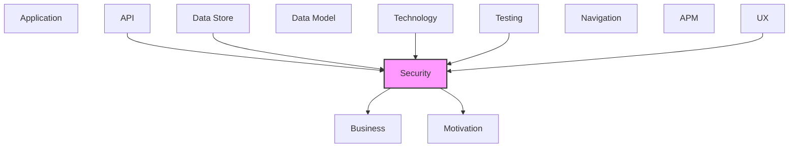

# Security

Authentication, authorization, security threats, and controls.

## Report Index

- [Layer Introduction](#layer-introduction)
- [Intra-Layer Relationships](#intra-layer-relationships)
- [Inter-Layer Dependencies](#inter-layer-dependencies)
- [Inter-Layer Relationships Table](#inter-layer-relationships-table)
- [Element Reference](#element-reference)

## Layer Introduction

| Metric                    | Count |
| ------------------------- | ----- |
| Elements                  | 18    |
| Intra-Layer Relationships | 14    |
| Inter-Layer Relationships | 37    |
| Inbound Relationships     | 23    |
| Outbound Relationships    | 14    |

**Cross-Layer References**:

- **Upstream layers**: [API](./06-api-layer-report.md), [Data Store](./08-data-store-layer-report.md), [Technology](./05-technology-layer-report.md), [Testing](./12-testing-layer-report.md), [UX](./09-ux-layer-report.md)
- **Downstream layers**: [Business](./02-business-layer-report.md), [Motivation](./01-motivation-layer-report.md)

## Intra-Layer Relationships

```mermaid
flowchart LR
  subgraph security
    security_actor_ai_agent["AI Agent"]
    security_actor_developer["Developer"]
    security_actor_git_hub_webhook["GitHub Webhook"]
    security_actor_system_orchestrator["System Orchestrator"]
    security_role_admin["Admin"]
    security_role_developer["Developer"]
    security_role_service_account["Service Account"]
    security_role_viewer["Viewer"]
    security_securitypolicy_api_key_authentication["API Key Authentication"]
    security_securitypolicy_container_isolation["Container Isolation"]
    security_securitypolicy_git_hub_webhook_hmac_signature["GitHub Webhook HMAC Signature"]
    security_securitypolicy_jwt_bearer_authentication["JWT Bearer Authentication"]
    security_securitypolicy_role_based_access_control["Role-Based Access Control"]
    security_securitypolicy_security_headers_middleware["Security Headers Middleware"]
    security_threat_container_escape["Container Escape"]
    security_threat_credential_exfiltration_via_mounted_files["Credential Exfiltration via Mounted Files"]
    security_threat_unauthorized_agent_privilege_escalation["Unauthorized Agent Privilege Escalation"]
    security_threat_webhook_replay_attack["Webhook Replay Attack"]
    security_actor_ai_agent -->|associated-with| security_threat_container_escape
    security_actor_ai_agent -->|associated-with| security_threat_credential_exfiltration_via_mounted_files
    security_actor_ai_agent -->|associated-with| security_threat_unauthorized_agent_privilege_escalation
    security_actor_developer -->|assigned-to| security_role_admin
    security_actor_developer -->|assigned-to| security_role_developer
    security_actor_developer -->|assigned-to| security_role_viewer
    security_actor_git_hub_webhook -->|associated-with| security_threat_webhook_replay_attack
    security_actor_system_orchestrator -->|assigned-to| security_role_service_account
    security_role_admin -->|specializes| security_role_developer
    security_role_developer -->|specializes| security_role_viewer
    security_threat_container_escape -->|influence| security_securitypolicy_container_isolation
    security_threat_credential_exfiltration_via_mounted_files -->|influence| security_securitypolicy_container_isolation
    security_threat_unauthorized_agent_privilege_escalation -->|influence| security_securitypolicy_container_isolation
    security_threat_webhook_replay_attack -->|influence| security_securitypolicy_git_hub_webhook_hmac_signature
  end
```

## Inter-Layer Dependencies

## Inter-Layer Relationships Table

| Relationship ID                                              | Source Node                                              | Dest Node                                                           | Dest Layer   | Predicate   | Cardinality  | Strength |
| ------------------------------------------------------------ | -------------------------------------------------------- | ------------------------------------------------------------------- | ------------ | ----------- | ------------ | -------- |
| `api.operation.requires.security.securitypolicy`             | `api.operation.cancel-workflow-execution`                | `security.securitypolicy.role-based-access-control`                 | `security`   | `requires`  | many-to-many | medium   |
| `api.operation.requires.security.securitypolicy`             | `api.operation.create-api-key`                           | `security.securitypolicy.api-key-authentication`                    | `security`   | `requires`  | many-to-many | medium   |
| `api.operation.requires.security.securitypolicy`             | `api.operation.get-current-user`                         | `security.securitypolicy.jwt-bearer-authentication`                 | `security`   | `requires`  | many-to-many | medium   |
| `api.operation.requires.security.securitypolicy`             | `api.operation.login`                                    | `security.securitypolicy.jwt-bearer-authentication`                 | `security`   | `requires`  | many-to-many | medium   |
| `api.operation.requires.security.securitypolicy`             | `api.operation.refresh-token`                            | `security.securitypolicy.jwt-bearer-authentication`                 | `security`   | `requires`  | many-to-many | medium   |
| `api.operation.requires.security.securitypolicy`             | `api.operation.revoke-api-key`                           | `security.securitypolicy.api-key-authentication`                    | `security`   | `requires`  | many-to-many | medium   |
| `api.operation.requires.security.securitypolicy`             | `api.operation.start-workflow-execution`                 | `security.securitypolicy.role-based-access-control`                 | `security`   | `requires`  | many-to-many | medium   |
| `api.operation.requires.security.securitypolicy`             | `api.operation.terminate-execution`                      | `security.securitypolicy.role-based-access-control`                 | `security`   | `requires`  | many-to-many | medium   |
| `api.operation.requires.security.securitypolicy`             | `api.operation.update-agent-config`                      | `security.securitypolicy.role-based-access-control`                 | `security`   | `requires`  | many-to-many | medium   |
| `api.operation.requires.security.securitypolicy`             | `api.operation.update-project-config`                    | `security.securitypolicy.role-based-access-control`                 | `security`   | `requires`  | many-to-many | medium   |
| `data-store.database.satisfies.security.securitypolicy`      | `data-store.database.elasticsearch-event-store`          | `security.securitypolicy.role-based-access-control`                 | `security`   | `satisfies` | many-to-many | medium   |
| `data-store.database.satisfies.security.securitypolicy`      | `data-store.database.redis-event-store`                  | `security.securitypolicy.container-isolation`                       | `security`   | `satisfies` | many-to-many | medium   |
| `security.securitypolicy.governs.business.businessservice`   | `security.securitypolicy.api-key-authentication`         | `business.businessservice.workflow-automation`                      | `business`   | `governs`   | many-to-many | medium   |
| `security.securitypolicy.realizes.motivation.principle`      | `security.securitypolicy.api-key-authentication`         | `motivation.principle.domain-purity`                                | `motivation` | `realizes`  | many-to-many | medium   |
| `security.securitypolicy.governs.business.businessservice`   | `security.securitypolicy.container-isolation`            | `business.businessservice.agent-execution-management`               | `business`   | `governs`   | many-to-many | medium   |
| `security.securitypolicy.governs.business.businessservice`   | `security.securitypolicy.container-isolation`            | `business.businessservice.workspace-management`                     | `business`   | `governs`   | many-to-many | medium   |
| `security.securitypolicy.realizes.motivation.principle`      | `security.securitypolicy.container-isolation`            | `motivation.principle.domain-purity`                                | `motivation` | `realizes`  | many-to-many | medium   |
| `security.securitypolicy.realizes.motivation.principle`      | `security.securitypolicy.container-isolation`            | `motivation.principle.hexagonal-architecture`                       | `motivation` | `realizes`  | many-to-many | medium   |
| `security.securitypolicy.satisfies.motivation.requirement`   | `security.securitypolicy.git-hub-webhook-hmac-signature` | `motivation.requirement.complete-audit-trail-for-all-state-changes` | `motivation` | `satisfies` | many-to-many | medium   |
| `security.securitypolicy.governs.business.businessservice`   | `security.securitypolicy.jwt-bearer-authentication`      | `business.businessservice.workflow-automation`                      | `business`   | `governs`   | many-to-many | medium   |
| `security.securitypolicy.realizes.motivation.principle`      | `security.securitypolicy.jwt-bearer-authentication`      | `motivation.principle.domain-purity`                                | `motivation` | `realizes`  | many-to-many | medium   |
| `security.securitypolicy.governs.business.businessservice`   | `security.securitypolicy.role-based-access-control`      | `business.businessservice.agent-execution-management`               | `business`   | `governs`   | many-to-many | medium   |
| `security.securitypolicy.governs.business.businessservice`   | `security.securitypolicy.role-based-access-control`      | `business.businessservice.configuration-management`                 | `business`   | `governs`   | many-to-many | medium   |
| `security.securitypolicy.realizes.motivation.principle`      | `security.securitypolicy.role-based-access-control`      | `motivation.principle.hexagonal-architecture`                       | `motivation` | `realizes`  | many-to-many | medium   |
| `security.securitypolicy.governs.business.businessservice`   | `security.securitypolicy.security-headers-middleware`    | `business.businessservice.workflow-automation`                      | `business`   | `governs`   | many-to-many | medium   |
| `security.securitypolicy.realizes.motivation.principle`      | `security.securitypolicy.security-headers-middleware`    | `motivation.principle.vendor-agnosticism`                           | `motivation` | `realizes`  | many-to-many | medium   |
| `technology.systemsoftware.realizes.security.securitypolicy` | `technology.systemsoftware.docker`                       | `security.securitypolicy.container-isolation`                       | `security`   | `realizes`  | many-to-many | medium   |
| `technology.systemsoftware.realizes.security.securitypolicy` | `technology.systemsoftware.fast-api`                     | `security.securitypolicy.security-headers-middleware`               | `security`   | `realizes`  | many-to-many | medium   |
| `technology.systemsoftware.realizes.security.securitypolicy` | `technology.systemsoftware.redis-client`                 | `security.securitypolicy.jwt-bearer-authentication`                 | `security`   | `realizes`  | many-to-many | medium   |
| `testing.testcoveragemodel.covers.security.securitypolicy`   | `testing.testcoveragemodel.port-adapter-contract-tests`  | `security.securitypolicy.container-isolation`                       | `security`   | `covers`    | many-to-many | medium   |
| `testing.testcoveragemodel.covers.security.securitypolicy`   | `testing.testcoveragemodel.rest-api-adapter-tests`       | `security.securitypolicy.jwt-bearer-authentication`                 | `security`   | `covers`    | many-to-many | medium   |
| `testing.testcoveragemodel.covers.security.securitypolicy`   | `testing.testcoveragemodel.rest-api-adapter-tests`       | `security.securitypolicy.role-based-access-control`                 | `security`   | `covers`    | many-to-many | medium   |
| `ux.view.satisfies.security.securitypolicy`                  | `ux.view.agent-config`                                   | `security.securitypolicy.role-based-access-control`                 | `security`   | `satisfies` | many-to-many | medium   |
| `ux.view.satisfies.security.securitypolicy`                  | `ux.view.auth-required`                                  | `security.securitypolicy.jwt-bearer-authentication`                 | `security`   | `satisfies` | many-to-many | medium   |
| `ux.view.satisfies.security.securitypolicy`                  | `ux.view.auth-required`                                  | `security.securitypolicy.role-based-access-control`                 | `security`   | `satisfies` | many-to-many | medium   |
| `ux.view.satisfies.security.securitypolicy`                  | `ux.view.dashboard`                                      | `security.securitypolicy.jwt-bearer-authentication`                 | `security`   | `satisfies` | many-to-many | medium   |
| `ux.view.satisfies.security.securitypolicy`                  | `ux.view.workflow-config`                                | `security.securitypolicy.role-based-access-control`                 | `security`   | `satisfies` | many-to-many | medium   |

## Element Reference

### AI Agent {#ai-agent}

**ID**: `security.actor.ai-agent`

**Type**: `actor`

Containerized AI agent executing inside Docker with strictly limited privileges: internet access and mounted project files only. No git credentials, SSH keys, GitHub credentials, or Docker socket access.

#### Attributes

| Name         | Value                                                                                           |
| ------------ | ----------------------------------------------------------------------------------------------- |
| dependencies | [Docker container runtime, Mounted project files]                                               |
| objectives   | [Execute assigned coding tasks, Read project context files, Write outputs to mounted workspace] |
| trustLevel   | low                                                                                             |
| type         | system                                                                                          |

#### Relationships

| Type        | Related Element                                             | Predicate         | Direction |
| ----------- | ----------------------------------------------------------- | ----------------- | --------- |
| intra-layer | `security.threat.container-escape`                          | `associated-with` | outbound  |
| intra-layer | `security.threat.credential-exfiltration-via-mounted-files` | `associated-with` | outbound  |
| intra-layer | `security.threat.unauthorized-agent-privilege-escalation`   | `associated-with` | outbound  |

### Developer {#developer}

**ID**: `security.actor.developer`

**Type**: `actor`

Human user accessing the REST API and configuration dashboard to manage workflows, view executions, and configure projects.

#### Attributes

| Name       | Value                                                                                     |
| ---------- | ----------------------------------------------------------------------------------------- |
| objectives | [Trigger and monitor workflows, Configure project settings, View agent execution results] |
| trustLevel | medium                                                                                    |
| type       | human                                                                                     |

#### Relationships

| Type        | Related Element           | Predicate     | Direction |
| ----------- | ------------------------- | ------------- | --------- |
| intra-layer | `security.role.admin`     | `assigned-to` | outbound  |
| intra-layer | `security.role.developer` | `assigned-to` | outbound  |
| intra-layer | `security.role.viewer`    | `assigned-to` | outbound  |

### GitHub Webhook {#github-webhook}

**ID**: `security.actor.git-hub-webhook`

**Type**: `actor`

External system (GitHub) sending signed webhook payloads via HMAC-SHA256 to the /webhooks/github endpoint. Authenticated by X-Hub-Signature-256 header verification.

#### Attributes

| Name         | Value                                                                                     |
| ------------ | ----------------------------------------------------------------------------------------- |
| dependencies | [GitHub HMAC secret for signing]                                                          |
| objectives   | [Notify Codetoreum of repository events, Trigger workflow automation on issue/PR changes] |
| trustLevel   | medium                                                                                    |
| type         | external-entity                                                                           |

#### Relationships

| Type        | Related Element                         | Predicate         | Direction |
| ----------- | --------------------------------------- | ----------------- | --------- |
| intra-layer | `security.threat.webhook-replay-attack` | `associated-with` | outbound  |

### System Orchestrator {#system-orchestrator}

**ID**: `security.actor.system-orchestrator`

**Type**: `actor`

The Codetoreum service itself, acting on behalf of workflows. Holds git credentials, performs all git operations (clone, commit, push), and manages container lifecycle. The sole principal with elevated system privileges.

#### Attributes

| Name         | Value                                                                                                                                                       |
| ------------ | ----------------------------------------------------------------------------------------------------------------------------------------------------------- |
| dependencies | [GitHub App credentials, Docker daemon, PostgreSQL, Redis]                                                                                                  |
| objectives   | [Orchestrate multi-agent workflows, Execute all git operations on behalf of agents, Manage Docker container lifecycle, Distribute work items across agents] |
| trustLevel   | high                                                                                                                                                        |
| type         | service                                                                                                                                                     |

#### Relationships

| Type        | Related Element                 | Predicate     | Direction |
| ----------- | ------------------------------- | ------------- | --------- |
| intra-layer | `security.role.service-account` | `assigned-to` | outbound  |

### Admin {#admin}

**ID**: `security.role.admin`

**Type**: `role`

Full system access role. Holds all permissions including user management, project CRUD, configuration updates, and workflow management. Maps to UserRole.ADMIN in the domain model.

#### Attributes

| Name         | Value                                   |
| ------------ | --------------------------------------- |
| description  | Full system access with all permissions |
| displayName  | Administrator                           |
| inheritsFrom | developer                               |
| level        | 100                                     |

#### Relationships

| Type        | Related Element            | Predicate     | Direction |
| ----------- | -------------------------- | ------------- | --------- |
| intra-layer | `security.actor.developer` | `assigned-to` | inbound   |
| intra-layer | `security.role.developer`  | `specializes` | outbound  |

### Developer {#developer}

**ID**: `security.role.developer`

**Type**: `role`

Can trigger workflows, view and cancel executions, manage projects (create/view/update/delete), view and update configuration, and view/manage work items. Maps to UserRole.DEVELOPER in the domain model.

#### Attributes

| Name         | Value                                                       |
| ------------ | ----------------------------------------------------------- |
| description  | Can trigger workflows, view executions, and manage projects |
| displayName  | Developer                                                   |
| inheritsFrom | viewer                                                      |
| level        | 50                                                          |

#### Relationships

| Type        | Related Element            | Predicate     | Direction |
| ----------- | -------------------------- | ------------- | --------- |
| intra-layer | `security.actor.developer` | `assigned-to` | inbound   |
| intra-layer | `security.role.admin`      | `specializes` | inbound   |
| intra-layer | `security.role.viewer`     | `specializes` | outbound  |

### Service Account {#service-account}

**ID**: `security.role.service-account`

**Type**: `role`

API access only role for programmatic integrations. Has workflow view/create/cancel/retry, execution view/cancel, config view, project view, and work item management permissions. Maps to UserRole.SERVICE_ACCOUNT in the domain model.

#### Attributes

| Name         | Value                                                   |
| ------------ | ------------------------------------------------------- |
| description  | Programmatic API access for integrations and automation |
| displayName  | Service Account                                         |
| inheritsFrom | viewer                                                  |
| level        | 30                                                      |

#### Relationships

| Type        | Related Element                      | Predicate     | Direction |
| ----------- | ------------------------------------ | ------------- | --------- |
| intra-layer | `security.actor.system-orchestrator` | `assigned-to` | inbound   |

### Viewer {#viewer}

**ID**: `security.role.viewer`

**Type**: `role`

Read-only access role. Can view workflows, executions, configuration, projects, users, and work items but cannot modify anything. Maps to UserRole.VIEWER in the domain model.

#### Attributes

| Name         | Value                                 |
| ------------ | ------------------------------------- |
| description  | Read-only access across all resources |
| displayName  | Viewer                                |
| inheritsFrom |                                       |
| level        | 10                                    |

#### Relationships

| Type        | Related Element            | Predicate     | Direction |
| ----------- | -------------------------- | ------------- | --------- |
| intra-layer | `security.actor.developer` | `assigned-to` | inbound   |
| intra-layer | `security.role.developer`  | `specializes` | inbound   |

### API Key Authentication {#api-key-authentication}

**ID**: `security.securitypolicy.api-key-authentication`

**Type**: `securitypolicy`

Long-lived API key authentication for programmatic access and integrations

#### Relationships

| Type        | Related Element                                | Predicate  | Direction |
| ----------- | ---------------------------------------------- | ---------- | --------- |
| inter-layer | `api.operation.create-api-key`                 | `requires` | inbound   |
| inter-layer | `api.operation.revoke-api-key`                 | `requires` | inbound   |
| inter-layer | `business.businessservice.workflow-automation` | `governs`  | outbound  |
| inter-layer | `motivation.principle.domain-purity`           | `realizes` | outbound  |

### Container Isolation {#container-isolation}

**ID**: `security.securitypolicy.container-isolation`

**Type**: `securitypolicy`

AI agents execute in isolated Docker containers with restricted access — no git credentials, no Docker socket, no GitHub app keys

#### Relationships

| Type        | Related Element                                             | Predicate   | Direction |
| ----------- | ----------------------------------------------------------- | ----------- | --------- |
| inter-layer | `data-store.database.redis-event-store`                     | `satisfies` | inbound   |
| inter-layer | `business.businessservice.agent-execution-management`       | `governs`   | outbound  |
| inter-layer | `business.businessservice.workspace-management`             | `governs`   | outbound  |
| inter-layer | `motivation.principle.domain-purity`                        | `realizes`  | outbound  |
| inter-layer | `motivation.principle.hexagonal-architecture`               | `realizes`  | outbound  |
| inter-layer | `technology.systemsoftware.docker`                          | `realizes`  | inbound   |
| inter-layer | `testing.testcoveragemodel.port-adapter-contract-tests`     | `covers`    | inbound   |
| intra-layer | `security.threat.container-escape`                          | `influence` | inbound   |
| intra-layer | `security.threat.credential-exfiltration-via-mounted-files` | `influence` | inbound   |
| intra-layer | `security.threat.unauthorized-agent-privilege-escalation`   | `influence` | inbound   |

### GitHub Webhook HMAC Signature {#github-webhook-hmac-signature}

**ID**: `security.securitypolicy.git-hub-webhook-hmac-signature`

**Type**: `securitypolicy`

All incoming GitHub webhook payloads must include a valid X-Hub-Signature-256 HMAC-SHA256 header. The /webhooks/github endpoint rejects any request with a missing or invalid signature with 401 Unauthorized. The shared secret is configured per project.

#### Attributes

| Name             | Value     |
| ---------------- | --------- |
| enabled          | true      |
| priority         | 1         |
| requirementLevel | mandatory |
| target           | endpoint  |

#### Relationships

| Type        | Related Element                                                     | Predicate   | Direction |
| ----------- | ------------------------------------------------------------------- | ----------- | --------- |
| inter-layer | `motivation.requirement.complete-audit-trail-for-all-state-changes` | `satisfies` | outbound  |
| intra-layer | `security.threat.webhook-replay-attack`                             | `influence` | inbound   |

### JWT Bearer Authentication {#jwt-bearer-authentication}

**ID**: `security.securitypolicy.jwt-bearer-authentication`

**Type**: `securitypolicy`

Token-based authentication for REST API access using signed JWT tokens with configurable expiry

#### Relationships

| Type        | Related Element                                    | Predicate   | Direction |
| ----------- | -------------------------------------------------- | ----------- | --------- |
| inter-layer | `api.operation.get-current-user`                   | `requires`  | inbound   |
| inter-layer | `api.operation.login`                              | `requires`  | inbound   |
| inter-layer | `api.operation.refresh-token`                      | `requires`  | inbound   |
| inter-layer | `business.businessservice.workflow-automation`     | `governs`   | outbound  |
| inter-layer | `motivation.principle.domain-purity`               | `realizes`  | outbound  |
| inter-layer | `technology.systemsoftware.redis-client`           | `realizes`  | inbound   |
| inter-layer | `testing.testcoveragemodel.rest-api-adapter-tests` | `covers`    | inbound   |
| inter-layer | `ux.view.auth-required`                            | `satisfies` | inbound   |
| inter-layer | `ux.view.dashboard`                                | `satisfies` | inbound   |

### Role-Based Access Control {#role-based-access-control}

**ID**: `security.securitypolicy.role-based-access-control`

**Type**: `securitypolicy`

Permission-based access control with User, Admin, and System roles enforced via FastAPI dependencies

#### Relationships

| Type        | Related Element                                       | Predicate   | Direction |
| ----------- | ----------------------------------------------------- | ----------- | --------- |
| inter-layer | `api.operation.cancel-workflow-execution`             | `requires`  | inbound   |
| inter-layer | `api.operation.start-workflow-execution`              | `requires`  | inbound   |
| inter-layer | `api.operation.terminate-execution`                   | `requires`  | inbound   |
| inter-layer | `api.operation.update-agent-config`                   | `requires`  | inbound   |
| inter-layer | `api.operation.update-project-config`                 | `requires`  | inbound   |
| inter-layer | `data-store.database.elasticsearch-event-store`       | `satisfies` | inbound   |
| inter-layer | `business.businessservice.agent-execution-management` | `governs`   | outbound  |
| inter-layer | `business.businessservice.configuration-management`   | `governs`   | outbound  |
| inter-layer | `motivation.principle.hexagonal-architecture`         | `realizes`  | outbound  |
| inter-layer | `testing.testcoveragemodel.rest-api-adapter-tests`    | `covers`    | inbound   |
| inter-layer | `ux.view.agent-config`                                | `satisfies` | inbound   |
| inter-layer | `ux.view.auth-required`                               | `satisfies` | inbound   |
| inter-layer | `ux.view.workflow-config`                             | `satisfies` | inbound   |

### Security Headers Middleware {#security-headers-middleware}

**ID**: `security.securitypolicy.security-headers-middleware`

**Type**: `securitypolicy`

HTTP security headers middleware enforcing CSP, HSTS, X-Frame-Options, and other browser security policies

#### Relationships

| Type        | Related Element                                | Predicate  | Direction |
| ----------- | ---------------------------------------------- | ---------- | --------- |
| inter-layer | `business.businessservice.workflow-automation` | `governs`  | outbound  |
| inter-layer | `motivation.principle.vendor-agnosticism`      | `realizes` | outbound  |
| inter-layer | `technology.systemsoftware.fast-api`           | `realizes` | inbound   |

### Container Escape {#container-escape}

**ID**: `security.threat.container-escape`

**Type**: `threat`

A compromised or malicious AI agent exploits a Docker vulnerability or misconfiguration to break out of its container and access the host system, other containers, or orchestrator credentials. Mitigated by container isolation policy, no privileged mode, and no host network access.

#### Attributes

| Name        | Value               |
| ----------- | ------------------- |
| criticality | critical            |
| impact      | high                |
| likelihood  | low                 |
| threatens   | Container Isolation |

#### Relationships

| Type        | Related Element                               | Predicate         | Direction |
| ----------- | --------------------------------------------- | ----------------- | --------- |
| intra-layer | `security.actor.ai-agent`                     | `associated-with` | inbound   |
| intra-layer | `security.securitypolicy.container-isolation` | `influence`       | outbound  |

### Credential Exfiltration via Mounted Files {#credential-exfiltration-via-mounted-files}

**ID**: `security.threat.credential-exfiltration-via-mounted-files`

**Type**: `threat`

A malicious agent reads sensitive credentials (git tokens, GitHub App keys, SSH keys) from files accidentally mounted into the container workspace. Mitigated by the agent security model: orchestrator holds all credentials and never mounts credential files into agent containers; agents only receive project context files.

#### Attributes

| Name        | Value               |
| ----------- | ------------------- |
| criticality | high                |
| impact      | high                |
| likelihood  | moderate            |
| threatens   | Container Isolation |

#### Relationships

| Type        | Related Element                               | Predicate         | Direction |
| ----------- | --------------------------------------------- | ----------------- | --------- |
| intra-layer | `security.actor.ai-agent`                     | `associated-with` | inbound   |
| intra-layer | `security.securitypolicy.container-isolation` | `influence`       | outbound  |

### Unauthorized Agent Privilege Escalation {#unauthorized-agent-privilege-escalation}

**ID**: `security.threat.unauthorized-agent-privilege-escalation`

**Type**: `threat`

A containerized AI agent attempts to access the host Docker socket (e.g., via a mounted /var/run/docker.sock) to spawn new containers or escape isolation. Mitigated by the container isolation policy: Docker socket is explicitly not mounted into agent containers.

#### Attributes

| Name        | Value               |
| ----------- | ------------------- |
| criticality | high                |
| impact      | high                |
| likelihood  | low                 |
| threatens   | Container Isolation |

#### Relationships

| Type        | Related Element                               | Predicate         | Direction |
| ----------- | --------------------------------------------- | ----------------- | --------- |
| intra-layer | `security.actor.ai-agent`                     | `associated-with` | inbound   |
| intra-layer | `security.securitypolicy.container-isolation` | `influence`       | outbound  |

### Webhook Replay Attack {#webhook-replay-attack}

**ID**: `security.threat.webhook-replay-attack`

**Type**: `threat`

An attacker captures a valid GitHub webhook payload and replays it at a later time to trigger duplicate or unauthorized workflow executions. Mitigated by HMAC signature verification and timestamp validation on incoming webhook events.

#### Attributes

| Name        | Value                         |
| ----------- | ----------------------------- |
| criticality | medium                        |
| impact      | moderate                      |
| likelihood  | moderate                      |
| threatens   | GitHub Webhook HMAC Signature |

#### Relationships

| Type        | Related Element                                          | Predicate         | Direction |
| ----------- | -------------------------------------------------------- | ----------------- | --------- |
| intra-layer | `security.actor.git-hub-webhook`                         | `associated-with` | inbound   |
| intra-layer | `security.securitypolicy.git-hub-webhook-hmac-signature` | `influence`       | outbound  |

---

Generated: 2026-05-11T22:23:25.353Z | Model Version: 0.1.0
