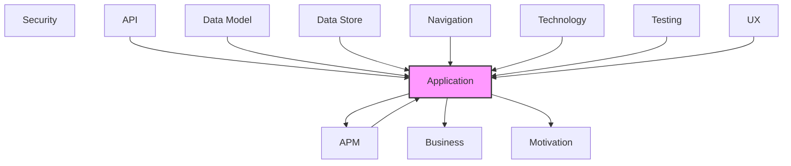

# Application

Application components, services, and interactions.

## Report Index

- [Layer Introduction](#layer-introduction)
- [Intra-Layer Relationships](#intra-layer-relationships)
- [Inter-Layer Dependencies](#inter-layer-dependencies)
- [Inter-Layer Relationships Table](#inter-layer-relationships-table)
- [Element Reference](#element-reference)

## Layer Introduction

| Metric                    | Count |
| ------------------------- | ----- |
| Elements                  | 93    |
| Intra-Layer Relationships | 96    |
| Inter-Layer Relationships | 256   |
| Inbound Relationships     | 233   |
| Outbound Relationships    | 23    |

**Cross-Layer References**:

- **Upstream layers**: [API](./06-api-layer-report.md), [APM](./11-apm-layer-report.md), [Data Model](./07-data-model-layer-report.md), [Data Store](./08-data-store-layer-report.md), [Navigation](./10-navigation-layer-report.md), [Technology](./05-technology-layer-report.md), [Testing](./12-testing-layer-report.md), [UX](./09-ux-layer-report.md)
- **Downstream layers**: [APM](./11-apm-layer-report.md), [Business](./02-business-layer-report.md), [Motivation](./01-motivation-layer-report.md)

## Intra-Layer Relationships

*This layer has >30 elements. Summary table shown instead of diagram.*

| Element                                                              | Type                   | Relationships |
| -------------------------------------------------------------------- | ---------------------- | ------------- |
| `application.applicationcomponent.board-column-event-handler`        | `applicationcomponent` | 1             |
| `application.applicationcomponent.branch-resolution-event-handler`   | `applicationcomponent` | 1             |
| `application.applicationcomponent.event-bus-wiring`                  | `applicationcomponent` | 9             |
| `application.applicationcomponent.execution-event-handler`           | `applicationcomponent` | 1             |
| `application.applicationcomponent.expected-sequence-registry`        | `applicationcomponent` | 1             |
| `application.applicationcomponent.prreview-cycle-dispatch-handler`   | `applicationcomponent` | 2             |
| `application.applicationcomponent.prreview-cycle-event-handler`      | `applicationcomponent` | 2             |
| `application.applicationcomponent.repair-cycle-event-handler`        | `applicationcomponent` | 1             |
| `application.applicationcomponent.review-event-handler`              | `applicationcomponent` | 1             |
| `application.applicationcomponent.simulation-engine`                 | `applicationcomponent` | 2             |
| `application.applicationcomponent.workflow-event-handler`            | `applicationcomponent` | 1             |
| `application.applicationfunction.ci-result-conversion`               | `applicationfunction`  | 0             |
| `application.applicationinterface.iactive-workflow-run-registry`     | `applicationinterface` | 1             |
| `application.applicationinterface.iagent-command-port`               | `applicationinterface` | 1             |
| `application.applicationinterface.iagent-container-recovery-service` | `applicationinterface` | 1             |
| `application.applicationinterface.iagent-executor`                   | `applicationinterface` | 2             |
| `application.applicationinterface.iagent-query-port`                 | `applicationinterface` | 1             |
| `application.applicationinterface.iagent-repository`                 | `applicationinterface` | 1             |
| `application.applicationinterface.iaudit-query-port`                 | `applicationinterface` | 1             |
| `application.applicationinterface.iauthentication-port`              | `applicationinterface` | 1             |
| `application.applicationinterface.iboard-service`                    | `applicationinterface` | 2             |
| `application.applicationinterface.ibranch-resolution-service`        | `applicationinterface` | 1             |
| `application.applicationinterface.icipipeline-service`               | `applicationinterface` | 1             |
| `application.applicationinterface.icode-review-service`              | `applicationinterface` | 1             |
| `application.applicationinterface.iconfig-store`                     | `applicationinterface` | 1             |
| `application.applicationinterface.iconfiguration-command-port`       | `applicationinterface` | 1             |
| `application.applicationinterface.iconfiguration-query-port`         | `applicationinterface` | 1             |
| `application.applicationinterface.icontainer`                        | `applicationinterface` | 2             |
| `application.applicationinterface.iconversational-loop-service`      | `applicationinterface` | 1             |
| `application.applicationinterface.idiscussion-adapter`               | `applicationinterface` | 1             |
| `application.applicationinterface.iencryption-service`               | `applicationinterface` | 1             |
| `application.applicationinterface.ienvironment-repair-service`       | `applicationinterface` | 1             |
| `application.applicationinterface.ievent-emitter`                    | `applicationinterface` | 2             |
| `application.applicationinterface.ievent-store`                      | `applicationinterface` | 2             |
| `application.applicationinterface.iexecution-command-port`           | `applicationinterface` | 1             |
| `application.applicationinterface.iexecution-query-port`             | `applicationinterface` | 1             |
| `application.applicationinterface.ifailed-event-store`               | `applicationinterface` | 1             |
| `application.applicationinterface.iidentity-service`                 | `applicationinterface` | 1             |
| `application.applicationinterface.illmprovider`                      | `applicationinterface` | 1             |
| `application.applicationinterface.imessage-broker`                   | `applicationinterface` | 1             |
| `application.applicationinterface.imetrics`                          | `applicationinterface` | 1             |
| `application.applicationinterface.imetrics-query-port`               | `applicationinterface` | 1             |
| `application.applicationinterface.imonitored-service`                | `applicationinterface` | 1             |
| `application.applicationinterface.imulti-project-orchestrator`       | `applicationinterface` | 1             |
| `application.applicationinterface.inotifier`                         | `applicationinterface` | 1             |
| `application.applicationinterface.iorchestration-command-port`       | `applicationinterface` | 1             |
| `application.applicationinterface.ipipeline-lock-service`            | `applicationinterface` | 1             |
| `application.applicationinterface.ipipeline-queue-service`           | `applicationinterface` | 1             |
| `application.applicationinterface.iproject-manager-service`          | `applicationinterface` | 1             |
| `application.applicationinterface.iprreview-cycle`                   | `applicationinterface` | 1             |
| `application.applicationinterface.irepair-cycle`                     | `applicationinterface` | 1             |
| `application.applicationinterface.irepair-cycle-checkpoint-store`    | `applicationinterface` | 1             |
| `application.applicationinterface.irepository`                       | `applicationinterface` | 1             |
| `application.applicationinterface.ireview-cycle`                     | `applicationinterface` | 1             |
| `application.applicationinterface.istorage`                          | `applicationinterface` | 2             |
| `application.applicationinterface.isystemic-analysis-service`        | `applicationinterface` | 1             |
| `application.applicationinterface.itask-query-port`                  | `applicationinterface` | 1             |
| `application.applicationinterface.iticket-system`                    | `applicationinterface` | 2             |
| `application.applicationinterface.itracer`                           | `applicationinterface` | 1             |
| `application.applicationinterface.iversion-control-service`          | `applicationinterface` | 2             |
| `application.applicationinterface.iwork-item-branch-tracker`         | `applicationinterface` | 1             |
| `application.applicationinterface.iwork-item-command-port`           | `applicationinterface` | 1             |
| `application.applicationinterface.iwork-item-query-port`             | `applicationinterface` | 1             |
| `application.applicationinterface.iwork-item-service`                | `applicationinterface` | 1             |
| `application.applicationinterface.iworkflow-command-port`            | `applicationinterface` | 1             |
| `application.applicationinterface.iworkflow-config-service`          | `applicationinterface` | 1             |
| `application.applicationinterface.iworkflow-definition-command-port` | `applicationinterface` | 1             |
| `application.applicationinterface.iworkflow-orchestrator`            | `applicationinterface` | 1             |
| `application.applicationinterface.iworkflow-query-port`              | `applicationinterface` | 1             |
| `application.applicationinterface.iworkflow-run-query-port`          | `applicationinterface` | 1             |
| `application.applicationinterface.iworkspace-query-port`             | `applicationinterface` | 1             |
| `application.applicationservice.agent-execution-recovery-service`    | `applicationservice`   | 4             |
| `application.applicationservice.agent-scheduler`                     | `applicationservice`   | 6             |
| `application.applicationservice.authentication-service`              | `applicationservice`   | 2             |
| `application.applicationservice.board-polling-service`               | `applicationservice`   | 3             |
| `application.applicationservice.configuration-service`               | `applicationservice`   | 4             |
| `application.applicationservice.container-recovery-service`          | `applicationservice`   | 4             |
| `application.applicationservice.context-builder`                     | `applicationservice`   | 2             |
| `application.applicationservice.conversational-loop-orchestrator`    | `applicationservice`   | 2             |
| `application.applicationservice.event-bus-registry`                  | `applicationservice`   | 3             |
| `application.applicationservice.event-sequence-validator`            | `applicationservice`   | 1             |
| `application.applicationservice.execution-service`                   | `applicationservice`   | 18            |
| `application.applicationservice.feedback-processor`                  | `applicationservice`   | 1             |
| `application.applicationservice.metrics-service`                     | `applicationservice`   | 5             |
| `application.applicationservice.multi-project-orchestrator`          | `applicationservice`   | 4             |
| `application.applicationservice.pipeline-lock-service`               | `applicationservice`   | 3             |
| `application.applicationservice.pipeline-manager`                    | `applicationservice`   | 2             |
| `application.applicationservice.review-service`                      | `applicationservice`   | 7             |
| `application.applicationservice.simulation-service`                  | `applicationservice`   | 1             |
| `application.applicationservice.work-item-service`                   | `applicationservice`   | 3             |
| `application.applicationservice.workflow-orchestrator`               | `applicationservice`   | 23            |
| `application.applicationservice.workflow-run-query-service`          | `applicationservice`   | 2             |
| `application.applicationservice.workspace-router`                    | `applicationservice`   | 3             |

## Inter-Layer Dependencies

## Inter-Layer Relationships Table

| Relationship ID                                                       | Source Node                                                                | Dest Node                                                         | Dest Layer    | Predicate       | Cardinality  | Strength |
| --------------------------------------------------------------------- | -------------------------------------------------------------------------- | ----------------------------------------------------------------- | ------------- | --------------- | ------------ | -------- |
| `api.operation.references.application.applicationservice`             | `api.operation.add-agent-capability`                                       | `application.applicationservice.configuration-service`            | `application` | `references`    | many-to-many | medium   |
| `api.operation.references.application.applicationservice`             | `api.operation.add-agent-mcp-server`                                       | `application.applicationservice.configuration-service`            | `application` | `references`    | many-to-many | medium   |
| `api.operation.references.application.applicationservice`             | `api.operation.add-environment-variable`                                   | `application.applicationservice.configuration-service`            | `application` | `references`    | many-to-many | medium   |
| `api.operation.references.application.applicationservice`             | `api.operation.add-simulation-comment`                                     | `application.applicationservice.work-item-service`                | `application` | `references`    | many-to-many | medium   |
| `api.operation.references.application.applicationservice`             | `api.operation.advance-simulation-clock`                                   | `application.applicationservice.simulation-service`               | `application` | `references`    | many-to-many | medium   |
| `api.operation.references.application.applicationservice`             | `api.operation.cancel-workflow-execution`                                  | `application.applicationservice.workflow-orchestrator`            | `application` | `references`    | many-to-many | medium   |
| `api.operation.references.application.applicationservice`             | `api.operation.create-agent`                                               | `application.applicationservice.authentication-service`           | `application` | `references`    | many-to-many | medium   |
| `api.operation.references.application.applicationservice`             | `api.operation.create-api-key`                                             | `application.applicationservice.authentication-service`           | `application` | `references`    | many-to-many | medium   |
| `api.operation.references.application.applicationservice`             | `api.operation.create-board-workflow-template`                             | `application.applicationservice.configuration-service`            | `application` | `references`    | many-to-many | medium   |
| `api.operation.references.application.applicationservice`             | `api.operation.create-simulation-issue`                                    | `application.applicationservice.simulation-service`               | `application` | `references`    | many-to-many | medium   |
| `api.operation.references.application.applicationservice`             | `api.operation.create-user`                                                | `application.applicationservice.authentication-service`           | `application` | `references`    | many-to-many | medium   |
| `api.operation.references.application.applicationservice`             | `api.operation.create-work-item`                                           | `application.applicationservice.work-item-service`                | `application` | `references`    | many-to-many | medium   |
| `api.operation.references.application.applicationservice`             | `api.operation.create-workflow`                                            | `application.applicationservice.configuration-service`            | `application` | `references`    | many-to-many | medium   |
| `api.operation.references.application.applicationservice`             | `api.operation.delete-agent`                                               | `application.applicationservice.configuration-service`            | `application` | `references`    | many-to-many | medium   |
| `api.operation.references.application.applicationservice`             | `api.operation.delete-board-workflow-template`                             | `application.applicationservice.configuration-service`            | `application` | `references`    | many-to-many | medium   |
| `api.operation.references.application.applicationservice`             | `api.operation.delete-user`                                                | `application.applicationservice.authentication-service`           | `application` | `references`    | many-to-many | medium   |
| `api.operation.references.application.applicationservice`             | `api.operation.delete-work-item`                                           | `application.applicationservice.work-item-service`                | `application` | `references`    | many-to-many | medium   |
| `api.operation.references.application.applicationservice`             | `api.operation.delete-workflow`                                            | `application.applicationservice.configuration-service`            | `application` | `references`    | many-to-many | medium   |
| `api.operation.references.application.applicationservice`             | `api.operation.get-active-agents`                                          | `application.applicationservice.metrics-service`                  | `application` | `references`    | many-to-many | medium   |
| `api.operation.references.application.applicationservice`             | `api.operation.get-agent-config`                                           | `application.applicationservice.configuration-service`            | `application` | `references`    | many-to-many | medium   |
| `api.operation.references.application.applicationservice`             | `api.operation.get-agent-execution-metrics`                                | `application.applicationservice.metrics-service`                  | `application` | `references`    | many-to-many | medium   |
| `api.operation.references.application.applicationservice`             | `api.operation.get-agent`                                                  | `application.applicationservice.configuration-service`            | `application` | `references`    | many-to-many | medium   |
| `api.operation.references.application.applicationservice`             | `api.operation.get-api-usage`                                              | `application.applicationservice.metrics-service`                  | `application` | `references`    | many-to-many | medium   |
| `api.operation.references.application.applicationservice`             | `api.operation.get-board-workflow-template`                                | `application.applicationservice.configuration-service`            | `application` | `references`    | many-to-many | medium   |
| `api.operation.references.application.applicationservice`             | `api.operation.get-causal-chain`                                           | `application.applicationservice.event-sequence-validator`         | `application` | `references`    | many-to-many | medium   |
| `api.operation.references.application.applicationservice`             | `api.operation.get-current-user`                                           | `application.applicationservice.authentication-service`           | `application` | `references`    | many-to-many | medium   |
| `api.operation.references.application.applicationservice`             | `api.operation.get-domain-events`                                          | `application.applicationservice.workflow-run-query-service`       | `application` | `references`    | many-to-many | medium   |
| `api.operation.references.application.applicationservice`             | `api.operation.get-endpoint-metrics`                                       | `application.applicationservice.metrics-service`                  | `application` | `references`    | many-to-many | medium   |
| `api.operation.references.application.applicationservice`             | `api.operation.get-event-statistics`                                       | `application.applicationservice.event-sequence-validator`         | `application` | `references`    | many-to-many | medium   |
| `api.operation.references.application.applicationservice`             | `api.operation.get-execution-history`                                      | `application.applicationservice.execution-service`                | `application` | `references`    | many-to-many | medium   |
| `api.operation.references.application.applicationservice`             | `api.operation.get-execution-logs`                                         | `application.applicationservice.execution-service`                | `application` | `references`    | many-to-many | medium   |
| `api.operation.references.application.applicationservice`             | `api.operation.get-execution-queue`                                        | `application.applicationservice.agent-scheduler`                  | `application` | `references`    | many-to-many | medium   |
| `api.operation.references.application.applicationservice`             | `api.operation.get-execution`                                              | `application.applicationservice.execution-service`                | `application` | `references`    | many-to-many | medium   |
| `api.operation.references.application.applicationservice`             | `api.operation.get-integration-status`                                     | `application.applicationservice.metrics-service`                  | `application` | `references`    | many-to-many | medium   |
| `api.operation.references.application.applicationservice`             | `api.operation.get-performance-metrics`                                    | `application.applicationservice.metrics-service`                  | `application` | `references`    | many-to-many | medium   |
| `api.operation.references.application.applicationservice`             | `api.operation.get-pipeline-config`                                        | `application.applicationservice.configuration-service`            | `application` | `references`    | many-to-many | medium   |
| `api.operation.references.application.applicationservice`             | `api.operation.get-project-config-history`                                 | `application.applicationservice.configuration-service`            | `application` | `references`    | many-to-many | medium   |
| `api.operation.references.application.applicationservice`             | `api.operation.get-project-config`                                         | `application.applicationservice.configuration-service`            | `application` | `references`    | many-to-many | medium   |
| `api.operation.references.application.applicationservice`             | `api.operation.get-queue-statistics`                                       | `application.applicationservice.agent-scheduler`                  | `application` | `references`    | many-to-many | medium   |
| `api.operation.references.application.applicationservice`             | `api.operation.get-repair-cycle-metrics`                                   | `application.applicationservice.metrics-service`                  | `application` | `references`    | many-to-many | medium   |
| `api.operation.references.application.applicationservice`             | `api.operation.get-resilience-metrics`                                     | `application.applicationservice.metrics-service`                  | `application` | `references`    | many-to-many | medium   |
| `api.operation.references.application.applicationservice`             | `api.operation.get-resource-usage-summary`                                 | `application.applicationservice.workspace-router`                 | `application` | `references`    | many-to-many | medium   |
| `api.operation.references.application.applicationservice`             | `api.operation.get-simulation-board-history`                               | `application.applicationservice.board-polling-service`            | `application` | `references`    | many-to-many | medium   |
| `api.operation.references.application.applicationservice`             | `api.operation.get-simulation-board-state`                                 | `application.applicationservice.simulation-service`               | `application` | `references`    | many-to-many | medium   |
| `api.operation.references.application.applicationservice`             | `api.operation.get-simulation-clock-state`                                 | `application.applicationservice.simulation-service`               | `application` | `references`    | many-to-many | medium   |
| `api.operation.references.application.applicationservice`             | `api.operation.get-simulation-execution-status`                            | `application.applicationservice.simulation-service`               | `application` | `references`    | many-to-many | medium   |
| `api.operation.references.application.applicationservice`             | `api.operation.get-simulation-issue`                                       | `application.applicationservice.simulation-service`               | `application` | `references`    | many-to-many | medium   |
| `api.operation.references.application.applicationservice`             | `api.operation.get-simulation-mode-info`                                   | `application.applicationservice.metrics-service`                  | `application` | `references`    | many-to-many | medium   |
| `api.operation.references.application.applicationservice`             | `api.operation.get-system-health`                                          | `application.applicationservice.metrics-service`                  | `application` | `references`    | many-to-many | medium   |
| `api.operation.references.application.applicationservice`             | `api.operation.get-token-info`                                             | `application.applicationservice.authentication-service`           | `application` | `references`    | many-to-many | medium   |
| `api.operation.references.application.applicationservice`             | `api.operation.get-user`                                                   | `application.applicationservice.authentication-service`           | `application` | `references`    | many-to-many | medium   |
| `api.operation.references.application.applicationservice`             | `api.operation.get-work-item`                                              | `application.applicationservice.work-item-service`                | `application` | `references`    | many-to-many | medium   |
| `api.operation.references.application.applicationservice`             | `api.operation.get-workflow`                                               | `application.applicationservice.configuration-service`            | `application` | `references`    | many-to-many | medium   |
| `api.operation.references.application.applicationservice`             | `api.operation.get-workflow-run-audit`                                     | `application.applicationservice.workflow-run-query-service`       | `application` | `references`    | many-to-many | medium   |
| `api.operation.references.application.applicationservice`             | `api.operation.get-workflow-run-events`                                    | `application.applicationservice.workflow-run-query-service`       | `application` | `references`    | many-to-many | medium   |
| `api.operation.references.application.applicationservice`             | `api.operation.get-workflow-run`                                           | `application.applicationservice.workflow-run-query-service`       | `application` | `references`    | many-to-many | medium   |
| `api.operation.references.application.applicationservice`             | `api.operation.get-workflow-versions`                                      | `application.applicationservice.workflow-run-query-service`       | `application` | `references`    | many-to-many | medium   |
| `api.operation.references.application.applicationservice`             | `api.operation.get-workspace-logs`                                         | `application.applicationservice.workspace-router`                 | `application` | `references`    | many-to-many | medium   |
| `api.operation.references.application.applicationservice`             | `api.operation.get-workspace`                                              | `application.applicationservice.workspace-router`                 | `application` | `references`    | many-to-many | medium   |
| `api.operation.references.application.applicationservice`             | `api.operation.health-check`                                               | `application.applicationservice.metrics-service`                  | `application` | `references`    | many-to-many | medium   |
| `api.operation.references.application.applicationservice`             | `api.operation.list-active-workspaces`                                     | `application.applicationservice.workspace-router`                 | `application` | `references`    | many-to-many | medium   |
| `api.operation.references.application.applicationservice`             | `api.operation.list-agents`                                                | `application.applicationservice.configuration-service`            | `application` | `references`    | many-to-many | medium   |
| `api.operation.references.application.applicationservice`             | `api.operation.list-api-keys`                                              | `application.applicationservice.authentication-service`           | `application` | `references`    | many-to-many | medium   |
| `api.operation.references.application.applicationservice`             | `api.operation.list-audit-events`                                          | `application.applicationservice.event-sequence-validator`         | `application` | `references`    | many-to-many | medium   |
| `api.operation.references.application.applicationservice`             | `api.operation.list-board-workflow-templates`                              | `application.applicationservice.configuration-service`            | `application` | `references`    | many-to-many | medium   |
| `api.operation.references.application.applicationservice`             | `api.operation.list-config-agents-for-project`                             | `application.applicationservice.configuration-service`            | `application` | `references`    | many-to-many | medium   |
| `api.operation.references.application.applicationservice`             | `api.operation.list-config-agents`                                         | `application.applicationservice.configuration-service`            | `application` | `references`    | many-to-many | medium   |
| `api.operation.references.application.applicationservice`             | `api.operation.list-config-pipelines-for-project`                          | `application.applicationservice.configuration-service`            | `application` | `references`    | many-to-many | medium   |
| `api.operation.references.application.applicationservice`             | `api.operation.list-executions`                                            | `application.applicationservice.execution-service`                | `application` | `references`    | many-to-many | medium   |
| `api.operation.references.application.applicationservice`             | `api.operation.list-metric-names`                                          | `application.applicationservice.metrics-service`                  | `application` | `references`    | many-to-many | medium   |
| `api.operation.references.application.applicationservice`             | `api.operation.list-pipeline-configs`                                      | `application.applicationservice.configuration-service`            | `application` | `references`    | many-to-many | medium   |
| `api.operation.references.application.applicationservice`             | `api.operation.list-projects`                                              | `application.applicationservice.configuration-service`            | `application` | `references`    | many-to-many | medium   |
| `api.operation.references.application.applicationservice`             | `api.operation.list-simulation-issues`                                     | `application.applicationservice.simulation-service`               | `application` | `references`    | many-to-many | medium   |
| `api.operation.references.application.applicationservice`             | `api.operation.list-work-items`                                            | `application.applicationservice.work-item-service`                | `application` | `references`    | many-to-many | medium   |
| `api.operation.references.application.applicationservice`             | `api.operation.list-workflow-runs`                                         | `application.applicationservice.workflow-run-query-service`       | `application` | `references`    | many-to-many | medium   |
| `api.operation.references.application.applicationservice`             | `api.operation.list-workflows`                                             | `application.applicationservice.configuration-service`            | `application` | `references`    | many-to-many | medium   |
| `api.operation.references.application.applicationservice`             | `api.operation.list-workspaces`                                            | `application.applicationservice.workspace-router`                 | `application` | `references`    | many-to-many | medium   |
| `api.operation.references.application.applicationservice`             | `api.operation.login`                                                      | `application.applicationservice.authentication-service`           | `application` | `references`    | many-to-many | medium   |
| `api.operation.references.application.applicationservice`             | `api.operation.logout`                                                     | `application.applicationservice.authentication-service`           | `application` | `references`    | many-to-many | medium   |
| `api.operation.references.application.applicationservice`             | `api.operation.move-simulation-issue`                                      | `application.applicationservice.simulation-service`               | `application` | `references`    | many-to-many | medium   |
| `api.operation.references.application.applicationservice`             | `api.operation.pause-simulation-clock`                                     | `application.applicationservice.simulation-service`               | `application` | `references`    | many-to-many | medium   |
| `api.operation.references.application.applicationservice`             | `api.operation.pause-workflow-execution`                                   | `application.applicationservice.workflow-orchestrator`            | `application` | `references`    | many-to-many | medium   |
| `api.operation.references.application.applicationservice`             | `api.operation.readiness-check`                                            | `application.applicationservice.metrics-service`                  | `application` | `references`    | many-to-many | medium   |
| `api.operation.references.application.applicationservice`             | `api.operation.receive-git-hub-webhook`                                    | `application.applicationservice.board-polling-service`            | `application` | `references`    | many-to-many | medium   |
| `api.operation.references.application.applicationservice`             | `api.operation.refresh-token`                                              | `application.applicationservice.authentication-service`           | `application` | `references`    | many-to-many | medium   |
| `api.operation.references.application.applicationservice`             | `api.operation.remove-agent-capability`                                    | `application.applicationservice.configuration-service`            | `application` | `references`    | many-to-many | medium   |
| `api.operation.references.application.applicationservice`             | `api.operation.remove-agent-mcp-server`                                    | `application.applicationservice.configuration-service`            | `application` | `references`    | many-to-many | medium   |
| `api.operation.references.application.applicationservice`             | `api.operation.remove-environment-variable`                                | `application.applicationservice.configuration-service`            | `application` | `references`    | many-to-many | medium   |
| `api.operation.references.application.applicationservice`             | `api.operation.replay-events`                                              | `application.applicationservice.event-sequence-validator`         | `application` | `references`    | many-to-many | medium   |
| `api.operation.references.application.applicationservice`             | `api.operation.resume-simulation-clock`                                    | `application.applicationservice.simulation-service`               | `application` | `references`    | many-to-many | medium   |
| `api.operation.references.application.applicationservice`             | `api.operation.resume-workflow-execution`                                  | `application.applicationservice.workflow-orchestrator`            | `application` | `references`    | many-to-many | medium   |
| `api.operation.references.application.applicationservice`             | `api.operation.revoke-api-key`                                             | `application.applicationservice.authentication-service`           | `application` | `references`    | many-to-many | medium   |
| `api.operation.references.application.applicationservice`             | `api.operation.search-configurations`                                      | `application.applicationservice.configuration-service`            | `application` | `references`    | many-to-many | medium   |
| `api.operation.references.application.applicationservice`             | `api.operation.start-workflow-execution`                                   | `application.applicationservice.workflow-orchestrator`            | `application` | `references`    | many-to-many | medium   |
| `api.operation.references.application.applicationservice`             | `api.operation.stream-simulation-events`                                   | `application.applicationservice.simulation-service`               | `application` | `references`    | many-to-many | medium   |
| `api.operation.references.application.applicationservice`             | `api.operation.terminate-execution`                                        | `application.applicationservice.execution-service`                | `application` | `references`    | many-to-many | medium   |
| `api.operation.references.application.applicationservice`             | `api.operation.update-agent-capability`                                    | `application.applicationservice.configuration-service`            | `application` | `references`    | many-to-many | medium   |
| `api.operation.references.application.applicationservice`             | `api.operation.update-agent-config`                                        | `application.applicationservice.configuration-service`            | `application` | `references`    | many-to-many | medium   |
| `api.operation.references.application.applicationservice`             | `api.operation.update-agent`                                               | `application.applicationservice.configuration-service`            | `application` | `references`    | many-to-many | medium   |
| `api.operation.references.application.applicationservice`             | `api.operation.update-board-workflow-template`                             | `application.applicationservice.configuration-service`            | `application` | `references`    | many-to-many | medium   |
| `api.operation.references.application.applicationservice`             | `api.operation.update-pipeline-config`                                     | `application.applicationservice.configuration-service`            | `application` | `references`    | many-to-many | medium   |
| `api.operation.references.application.applicationservice`             | `api.operation.update-project-config`                                      | `application.applicationservice.configuration-service`            | `application` | `references`    | many-to-many | medium   |
| `api.operation.references.application.applicationservice`             | `api.operation.update-user`                                                | `application.applicationservice.authentication-service`           | `application` | `references`    | many-to-many | medium   |
| `api.operation.references.application.applicationservice`             | `api.operation.update-work-item`                                           | `application.applicationservice.work-item-service`                | `application` | `references`    | many-to-many | medium   |
| `api.operation.references.application.applicationservice`             | `api.operation.update-workflow`                                            | `application.applicationservice.configuration-service`            | `application` | `references`    | many-to-many | medium   |
| `api.operation.references.application.applicationservice`             | `api.operation.upload-configuration-file`                                  | `application.applicationservice.configuration-service`            | `application` | `references`    | many-to-many | medium   |
| `api.operation.references.application.applicationservice`             | `api.operation.validate-entry-conditions`                                  | `application.applicationservice.workflow-orchestrator`            | `application` | `references`    | many-to-many | medium   |
| `api.operation.references.application.applicationservice`             | `api.operation.validate-workflow-definition`                               | `application.applicationservice.workflow-orchestrator`            | `application` | `references`    | many-to-many | medium   |
| `api.operation.references.application.applicationservice`             | `api.operation.web-socket-event-stream-legacy`                             | `application.applicationservice.metrics-service`                  | `application` | `references`    | many-to-many | medium   |
| `api.operation.references.application.applicationservice`             | `api.operation.web-socket-event-stream`                                    | `application.applicationservice.metrics-service`                  | `application` | `references`    | many-to-many | medium   |
| `apm.instrumentationconfig.monitors.application.applicationcomponent` | `apm.instrumentationconfig.auto-instrumentation-setup`                     | `application.applicationcomponent.board-column-event-handler`     | `application` | `monitors`      | many-to-many | medium   |
| `apm.instrumentationconfig.monitors.application.applicationcomponent` | `apm.instrumentationconfig.auto-instrumentation-setup`                     | `application.applicationcomponent.event-bus-wiring`               | `application` | `monitors`      | many-to-many | medium   |
| `apm.metricinstrument.monitors.application.applicationservice`        | `apm.metricinstrument.agent-execution-duration`                            | `application.applicationservice.execution-service`                | `application` | `monitors`      | many-to-many | medium   |
| `apm.metricinstrument.monitors.application.applicationcomponent`      | `apm.metricinstrument.board-reconciliation-metrics`                        | `application.applicationcomponent.board-column-event-handler`     | `application` | `monitors`      | many-to-many | medium   |
| `apm.metricinstrument.monitors.application.applicationservice`        | `apm.metricinstrument.circuit-breaker-state-metrics`                       | `application.applicationservice.workflow-orchestrator`            | `application` | `monitors`      | many-to-many | medium   |
| `apm.metricinstrument.monitors.application.applicationservice`        | `apm.metricinstrument.event-bus-stats`                                     | `application.applicationservice.workflow-orchestrator`            | `application` | `monitors`      | many-to-many | medium   |
| `apm.metricinstrument.monitors.application.applicationservice`        | `apm.metricinstrument.repair-cycle-metrics`                                | `application.applicationservice.metrics-service`                  | `application` | `monitors`      | many-to-many | medium   |
| `apm.span.monitors.application.applicationservice`                    | `apm.span.agent-execution-trace`                                           | `application.applicationservice.execution-service`                | `application` | `monitors`      | many-to-many | medium   |
| `apm.span.monitors.application.applicationcomponent`                  | `apm.span.event-handler-trace`                                             | `application.applicationcomponent.execution-event-handler`        | `application` | `monitors`      | many-to-many | medium   |
| `apm.span.monitors.application.applicationcomponent`                  | `apm.span.repair-cycle-profiling-span`                                     | `application.applicationcomponent.repair-cycle-event-handler`     | `application` | `monitors`      | many-to-many | medium   |
| `apm.span.monitors.application.applicationcomponent`                  | `apm.span.web-socket-session-trace`                                        | `application.applicationcomponent.event-bus-wiring`               | `application` | `monitors`      | many-to-many | medium   |
| `apm.traceconfiguration.monitors.application.applicationservice`      | `apm.traceconfiguration.open-telemetry-setup`                              | `application.applicationservice.board-polling-service`            | `application` | `monitors`      | many-to-many | medium   |
| `apm.traceconfiguration.monitors.application.applicationservice`      | `apm.traceconfiguration.open-telemetry-setup`                              | `application.applicationservice.execution-service`                | `application` | `monitors`      | many-to-many | medium   |
| `apm.traceconfiguration.monitors.application.applicationservice`      | `apm.traceconfiguration.open-telemetry-setup`                              | `application.applicationservice.workflow-orchestrator`            | `application` | `monitors`      | many-to-many | medium   |
| `application.applicationservice.realizes.business.businessservice`    | `application.applicationservice.agent-scheduler`                           | `business.businessservice.agent-execution-management`             | `business`    | `realizes`      | many-to-many | medium   |
| `application.applicationservice.references.apm.traceconfiguration`    | `application.applicationservice.agent-scheduler`                           | `apm.traceconfiguration.open-telemetry-setup`                     | `apm`         | `references`    | many-to-many | medium   |
| `application.applicationservice.realizes.motivation.goal`             | `application.applicationservice.board-polling-service`                     | `motivation.goal.automate-software-development-workflows`         | `motivation`  | `realizes`      | many-to-many | medium   |
| `application.applicationservice.references.apm.traceconfiguration`    | `application.applicationservice.board-polling-service`                     | `apm.traceconfiguration.open-telemetry-setup`                     | `apm`         | `references`    | many-to-many | medium   |
| `application.applicationservice.realizes.business.businessservice`    | `application.applicationservice.configuration-service`                     | `business.businessservice.configuration-management`               | `business`    | `realizes`      | many-to-many | medium   |
| `application.applicationservice.realizes.motivation.goal`             | `application.applicationservice.configuration-service`                     | `motivation.goal.plugin-extensibility`                            | `motivation`  | `realizes`      | many-to-many | medium   |
| `application.applicationservice.realizes.motivation.goal`             | `application.applicationservice.event-sequence-validator`                  | `motivation.goal.complete-observability-via-event-sourcing`       | `motivation`  | `realizes`      | many-to-many | medium   |
| `application.applicationservice.realizes.business.businessservice`    | `application.applicationservice.execution-service`                         | `business.businessservice.agent-execution-management`             | `business`    | `realizes`      | many-to-many | medium   |
| `application.applicationservice.realizes.motivation.goal`             | `application.applicationservice.execution-service`                         | `motivation.goal.automate-software-development-workflows`         | `motivation`  | `realizes`      | many-to-many | medium   |
| `application.applicationservice.references.apm.traceconfiguration`    | `application.applicationservice.execution-service`                         | `apm.traceconfiguration.open-telemetry-setup`                     | `apm`         | `references`    | many-to-many | medium   |
| `application.applicationservice.realizes.motivation.goal`             | `application.applicationservice.metrics-service`                           | `motivation.goal.complete-observability-via-event-sourcing`       | `motivation`  | `realizes`      | many-to-many | medium   |
| `application.applicationservice.realizes.business.businessservice`    | `application.applicationservice.multi-project-orchestrator`                | `business.businessservice.multi-project-coordination`             | `business`    | `realizes`      | many-to-many | medium   |
| `application.applicationservice.realizes.motivation.goal`             | `application.applicationservice.multi-project-orchestrator`                | `motivation.goal.automate-software-development-workflows`         | `motivation`  | `realizes`      | many-to-many | medium   |
| `application.applicationservice.references.apm.traceconfiguration`    | `application.applicationservice.multi-project-orchestrator`                | `apm.traceconfiguration.open-telemetry-setup`                     | `apm`         | `references`    | many-to-many | medium   |
| `application.applicationservice.realizes.motivation.goal`             | `application.applicationservice.pipeline-lock-service`                     | `motivation.goal.automate-software-development-workflows`         | `motivation`  | `realizes`      | many-to-many | medium   |
| `application.applicationservice.realizes.business.businessservice`    | `application.applicationservice.review-service`                            | `business.businessservice.code-review-orchestration`              | `business`    | `realizes`      | many-to-many | medium   |
| `application.applicationservice.realizes.motivation.goal`             | `application.applicationservice.review-service`                            | `motivation.goal.automate-software-development-workflows`         | `motivation`  | `realizes`      | many-to-many | medium   |
| `application.applicationservice.references.apm.traceconfiguration`    | `application.applicationservice.review-service`                            | `apm.traceconfiguration.open-telemetry-setup`                     | `apm`         | `references`    | many-to-many | medium   |
| `application.applicationservice.realizes.motivation.goal`             | `application.applicationservice.simulation-service`                        | `motivation.goal.full-testability-without-external-services`      | `motivation`  | `realizes`      | many-to-many | medium   |
| `application.applicationservice.realizes.business.businessservice`    | `application.applicationservice.workflow-orchestrator`                     | `business.businessservice.workflow-automation`                    | `business`    | `realizes`      | many-to-many | medium   |
| `application.applicationservice.realizes.motivation.goal`             | `application.applicationservice.workflow-orchestrator`                     | `motivation.goal.automate-software-development-workflows`         | `motivation`  | `realizes`      | many-to-many | medium   |
| `application.applicationservice.references.apm.traceconfiguration`    | `application.applicationservice.workflow-orchestrator`                     | `apm.traceconfiguration.open-telemetry-setup`                     | `apm`         | `references`    | many-to-many | medium   |
| `application.applicationservice.realizes.business.businessservice`    | `application.applicationservice.workspace-router`                          | `business.businessservice.workspace-management`                   | `business`    | `realizes`      | many-to-many | medium   |
| `data-model.schemadefinition.serves.application.applicationcomponent` | `data-model.schemadefinition.column-type`                                  | `application.applicationcomponent.board-column-event-handler`     | `application` | `serves`        | many-to-many | medium   |
| `data-model.schemadefinition.serves.application.applicationcomponent` | `data-model.schemadefinition.failure-classification`                       | `application.applicationcomponent.repair-cycle-event-handler`     | `application` | `serves`        | many-to-many | medium   |
| `data-model.schemadefinition.serves.application.applicationcomponent` | `data-model.schemadefinition.permission`                                   | `application.applicationcomponent.board-column-event-handler`     | `application` | `serves`        | many-to-many | medium   |
| `data-model.schemadefinition.serves.application.applicationcomponent` | `data-model.schemadefinition.prreview-outcome`                             | `application.applicationcomponent.prreview-cycle-event-handler`   | `application` | `serves`        | many-to-many | medium   |
| `data-model.schemadefinition.serves.application.applicationcomponent` | `data-model.schemadefinition.prreview-status`                              | `application.applicationcomponent.prreview-cycle-event-handler`   | `application` | `serves`        | many-to-many | medium   |
| `data-model.schemadefinition.serves.application.applicationcomponent` | `data-model.schemadefinition.repair-test-type`                             | `application.applicationcomponent.repair-cycle-event-handler`     | `application` | `serves`        | many-to-many | medium   |
| `data-model.schemadefinition.serves.application.applicationcomponent` | `data-model.schemadefinition.review-decision`                              | `application.applicationcomponent.review-event-handler`           | `application` | `serves`        | many-to-many | medium   |
| `data-model.schemadefinition.serves.application.applicationcomponent` | `data-model.schemadefinition.review-status`                                | `application.applicationcomponent.review-event-handler`           | `application` | `serves`        | many-to-many | medium   |
| `data-model.schemadefinition.serves.application.applicationcomponent` | `data-model.schemadefinition.stage-status`                                 | `application.applicationcomponent.workflow-event-handler`         | `application` | `serves`        | many-to-many | medium   |
| `data-model.schemadefinition.serves.application.applicationcomponent` | `data-model.schemadefinition.stage-type`                                   | `application.applicationcomponent.workflow-event-handler`         | `application` | `serves`        | many-to-many | medium   |
| `data-model.schemadefinition.serves.application.applicationcomponent` | `data-model.schemadefinition.user-role`                                    | `application.applicationcomponent.board-column-event-handler`     | `application` | `serves`        | many-to-many | medium   |
| `data-model.schemadefinition.serves.application.applicationcomponent` | `data-model.schemadefinition.workspace-type`                               | `application.applicationcomponent.execution-event-handler`        | `application` | `serves`        | many-to-many | medium   |
| `data-store.collection.serves.application.applicationcomponent`       | `data-store.collection.agent-events-index`                                 | `application.applicationcomponent.simulation-engine`              | `application` | `serves`        | many-to-many | medium   |
| `data-store.collection.serves.application.applicationcomponent`       | `data-store.collection.decision-events-index`                              | `application.applicationcomponent.board-column-event-handler`     | `application` | `serves`        | many-to-many | medium   |
| `data-store.collection.serves.application.applicationcomponent`       | `data-store.collection.pipeline-runs-index`                                | `application.applicationcomponent.execution-event-handler`        | `application` | `serves`        | many-to-many | medium   |
| `data-store.database.serves.application.applicationservice`           | `data-store.database.elasticsearch-config-storage`                         | `application.applicationservice.configuration-service`            | `application` | `serves`        | many-to-many | medium   |
| `data-store.database.serves.application.applicationservice`           | `data-store.database.elasticsearch-event-store`                            | `application.applicationservice.event-sequence-validator`         | `application` | `serves`        | many-to-many | medium   |
| `data-store.database.serves.application.applicationservice`           | `data-store.database.elasticsearch-event-store`                            | `application.applicationservice.workflow-orchestrator`            | `application` | `serves`        | many-to-many | medium   |
| `data-store.database.serves.application.applicationservice`           | `data-store.database.elasticsearch-event-store`                            | `application.applicationservice.workflow-run-query-service`       | `application` | `serves`        | many-to-many | medium   |
| `data-store.database.serves.application.applicationservice`           | `data-store.database.elasticsearch-workflow-config`                        | `application.applicationservice.configuration-service`            | `application` | `serves`        | many-to-many | medium   |
| `data-store.database.serves.application.applicationservice`           | `data-store.database.elasticsearch-workflow-config`                        | `application.applicationservice.workflow-orchestrator`            | `application` | `serves`        | many-to-many | medium   |
| `data-store.database.serves.application.applicationservice`           | `data-store.database.local-file-storage`                                   | `application.applicationservice.workspace-router`                 | `application` | `serves`        | many-to-many | medium   |
| `data-store.database.serves.application.applicationservice`           | `data-store.database.postgre-sql-config-database`                          | `application.applicationservice.configuration-service`            | `application` | `serves`        | many-to-many | medium   |
| `data-store.database.serves.application.applicationservice`           | `data-store.database.redis-config-cache`                                   | `application.applicationservice.configuration-service`            | `application` | `serves`        | many-to-many | medium   |
| `data-store.database.serves.application.applicationservice`           | `data-store.database.redis-dead-letter-queue`                              | `application.applicationservice.event-sequence-validator`         | `application` | `serves`        | many-to-many | medium   |
| `data-store.database.serves.application.applicationservice`           | `data-store.database.redis-event-store`                                    | `application.applicationservice.board-polling-service`            | `application` | `serves`        | many-to-many | medium   |
| `data-store.database.serves.application.applicationservice`           | `data-store.database.redis-event-store`                                    | `application.applicationservice.workflow-orchestrator`            | `application` | `serves`        | many-to-many | medium   |
| `data-store.database.serves.application.applicationservice`           | `data-store.database.redis-pipeline-queue`                                 | `application.applicationservice.agent-scheduler`                  | `application` | `serves`        | many-to-many | medium   |
| `navigation.route.resolves-with.application.applicationservice`       | `navigation.route.agent-config-route`                                      | `application.applicationservice.configuration-service`            | `application` | `resolves-with` | many-to-many | medium   |
| `navigation.route.resolves-with.application.applicationservice`       | `navigation.route.config-history-route`                                    | `application.applicationservice.configuration-service`            | `application` | `resolves-with` | many-to-many | medium   |
| `navigation.route.resolves-with.application.applicationservice`       | `navigation.route.dashboard-route`                                         | `application.applicationservice.workflow-run-query-service`       | `application` | `resolves-with` | many-to-many | medium   |
| `navigation.route.resolves-with.application.applicationservice`       | `navigation.route.pipeline-flow-route`                                     | `application.applicationservice.workflow-run-query-service`       | `application` | `resolves-with` | many-to-many | medium   |
| `navigation.route.resolves-with.application.applicationservice`       | `navigation.route.pipeline-run-details-route`                              | `application.applicationservice.workflow-run-query-service`       | `application` | `resolves-with` | many-to-many | medium   |
| `navigation.route.resolves-with.application.applicationservice`       | `navigation.route.project-config-route`                                    | `application.applicationservice.configuration-service`            | `application` | `resolves-with` | many-to-many | medium   |
| `navigation.route.resolves-with.application.applicationservice`       | `navigation.route.workflow-config-route`                                   | `application.applicationservice.configuration-service`            | `application` | `resolves-with` | many-to-many | medium   |
| `technology.systemsoftware.realizes.application.applicationservice`   | `technology.systemsoftware.docker`                                         | `application.applicationservice.execution-service`                | `application` | `realizes`      | many-to-many | medium   |
| `technology.systemsoftware.realizes.application.applicationservice`   | `technology.systemsoftware.docker`                                         | `application.applicationservice.workspace-router`                 | `application` | `realizes`      | many-to-many | medium   |
| `technology.systemsoftware.realizes.application.applicationservice`   | `technology.systemsoftware.fast-api`                                       | `application.applicationservice.authentication-service`           | `application` | `realizes`      | many-to-many | medium   |
| `technology.systemsoftware.realizes.application.applicationservice`   | `technology.systemsoftware.fast-api`                                       | `application.applicationservice.work-item-service`                | `application` | `realizes`      | many-to-many | medium   |
| `technology.systemsoftware.realizes.application.applicationservice`   | `technology.systemsoftware.fast-api`                                       | `application.applicationservice.workflow-orchestrator`            | `application` | `realizes`      | many-to-many | medium   |
| `technology.systemsoftware.serves.application.applicationcomponent`   | `technology.systemsoftware.fast-api`                                       | `application.applicationcomponent.event-bus-wiring`               | `application` | `serves`        | many-to-many | medium   |
| `technology.systemsoftware.realizes.application.applicationservice`   | `technology.systemsoftware.git-hub`                                        | `application.applicationservice.board-polling-service`            | `application` | `realizes`      | many-to-many | medium   |
| `technology.systemsoftware.realizes.application.applicationservice`   | `technology.systemsoftware.git-hub`                                        | `application.applicationservice.work-item-service`                | `application` | `realizes`      | many-to-many | medium   |
| `technology.systemsoftware.realizes.application.applicationservice`   | `technology.systemsoftware.open-telemetry`                                 | `application.applicationservice.metrics-service`                  | `application` | `realizes`      | many-to-many | medium   |
| `technology.systemsoftware.realizes.application.applicationservice`   | `technology.systemsoftware.prometheus`                                     | `application.applicationservice.metrics-service`                  | `application` | `realizes`      | many-to-many | medium   |
| `technology.systemsoftware.realizes.application.applicationservice`   | `technology.systemsoftware.redis-client`                                   | `application.applicationservice.pipeline-lock-service`            | `application` | `realizes`      | many-to-many | medium   |
| `technology.systemsoftware.serves.application.applicationcomponent`   | `technology.systemsoftware.redis-client`                                   | `application.applicationcomponent.expected-sequence-registry`     | `application` | `serves`        | many-to-many | medium   |
| `technology.systemsoftware.realizes.application.applicationservice`   | `technology.systemsoftware.sqlalchemy`                                     | `application.applicationservice.configuration-service`            | `application` | `realizes`      | many-to-many | medium   |
| `testing.testcasesketch.tests.application.applicationservice`         | `testing.testcasesketch.board-automation-scenario-a-e2e-cascade`           | `application.applicationservice.board-polling-service`            | `application` | `tests`         | many-to-many | medium   |
| `testing.testcasesketch.tests.application.applicationservice`         | `testing.testcasesketch.board-automation-scenario-b-lock-contention`       | `application.applicationservice.pipeline-lock-service`            | `application` | `tests`         | many-to-many | medium   |
| `testing.testcasesketch.tests.application.applicationservice`         | `testing.testcasesketch.board-automation-scenario-c-review-rejection-loop` | `application.applicationservice.review-service`                   | `application` | `tests`         | many-to-many | medium   |
| `testing.testcasesketch.tests.application.applicationservice`         | `testing.testcasesketch.board-automation-scenario-d-edge-cases`            | `application.applicationservice.workflow-orchestrator`            | `application` | `tests`         | many-to-many | medium   |
| `testing.testcasesketch.tests.application.applicationservice`         | `testing.testcasesketch.scenario-01-simple-workflow`                       | `application.applicationservice.workflow-orchestrator`            | `application` | `tests`         | many-to-many | medium   |
| `testing.testcasesketch.tests.application.applicationservice`         | `testing.testcasesketch.scenario-02-parallel-executions`                   | `application.applicationservice.agent-scheduler`                  | `application` | `tests`         | many-to-many | medium   |
| `testing.testcasesketch.tests.application.applicationservice`         | `testing.testcasesketch.scenario-03-review-cycle`                          | `application.applicationservice.review-service`                   | `application` | `tests`         | many-to-many | medium   |
| `testing.testcasesketch.tests.application.applicationservice`         | `testing.testcasesketch.scenario-04-execution-failure`                     | `application.applicationservice.execution-service`                | `application` | `tests`         | many-to-many | medium   |
| `testing.testcasesketch.tests.application.applicationservice`         | `testing.testcasesketch.scenario-05-complex-workflow`                      | `application.applicationservice.workflow-orchestrator`            | `application` | `tests`         | many-to-many | medium   |
| `testing.testcasesketch.tests.application.applicationservice`         | `testing.testcasesketch.scenario-06-sdlc-pipeline`                         | `application.applicationservice.pipeline-manager`                 | `application` | `tests`         | many-to-many | medium   |
| `testing.testcasesketch.tests.application.applicationservice`         | `testing.testcasesketch.scenario-06b-sdlc-pipeline-with-repair`            | `application.applicationservice.pipeline-manager`                 | `application` | `tests`         | many-to-many | medium   |
| `testing.testcasesketch.tests.application.applicationservice`         | `testing.testcasesketch.scenario-07-repair-cycle-test-fix-validate`        | `application.applicationservice.agent-execution-recovery-service` | `application` | `tests`         | many-to-many | medium   |
| `testing.testcasesketch.tests.application.applicationservice`         | `testing.testcasesketch.scenario-09-queue-position-ordering`               | `application.applicationservice.pipeline-lock-service`            | `application` | `tests`         | many-to-many | medium   |
| `testing.testcasesketch.tests.application.applicationservice`         | `testing.testcasesketch.scenario-10-agent-execution`                       | `application.applicationservice.execution-service`                | `application` | `tests`         | many-to-many | medium   |
| `testing.testcasesketch.tests.application.applicationservice`         | `testing.testcasesketch.scenario-10b-multi-turn-dialogue`                  | `application.applicationservice.conversational-loop-orchestrator` | `application` | `tests`         | many-to-many | medium   |
| `testing.testcasesketch.tests.application.applicationservice`         | `testing.testcasesketch.scenario-12-container-failure-recovery`            | `application.applicationservice.container-recovery-service`       | `application` | `tests`         | many-to-many | medium   |
| `testing.testcasesketch.tests.application.applicationservice`         | `testing.testcasesketch.scenario-13-multi-project-orchestration`           | `application.applicationservice.multi-project-orchestrator`       | `application` | `tests`         | many-to-many | medium   |
| `testing.testcasesketch.tests.application.applicationservice`         | `testing.testcasesketch.scenario-environment-repair`                       | `application.applicationservice.agent-execution-recovery-service` | `application` | `tests`         | many-to-many | medium   |
| `testing.testcasesketch.tests.application.applicationservice`         | `testing.testcasesketch.yaml-scenario-dev-environment-repair`              | `application.applicationservice.agent-execution-recovery-service` | `application` | `tests`         | many-to-many | medium   |
| `testing.testcasesketch.tests.application.applicationservice`         | `testing.testcasesketch.yaml-scenario-failure-recovery`                    | `application.applicationservice.container-recovery-service`       | `application` | `tests`         | many-to-many | medium   |
| `testing.testcasesketch.tests.application.applicationservice`         | `testing.testcasesketch.yaml-scenario-planning-design-pipeline`            | `application.applicationservice.pipeline-manager`                 | `application` | `tests`         | many-to-many | medium   |
| `testing.testcasesketch.tests.application.applicationservice`         | `testing.testcasesketch.yaml-scenario-planning-design-review-cycle`        | `application.applicationservice.review-service`                   | `application` | `tests`         | many-to-many | medium   |
| `testing.testcasesketch.tests.application.applicationservice`         | `testing.testcasesketch.yaml-scenario-pr-feedback-child-issue`             | `application.applicationservice.feedback-processor`               | `application` | `tests`         | many-to-many | medium   |
| `testing.testcasesketch.tests.application.applicationservice`         | `testing.testcasesketch.yaml-scenario-repair-cycle`                        | `application.applicationservice.agent-execution-recovery-service` | `application` | `tests`         | many-to-many | medium   |
| `testing.testcasesketch.tests.application.applicationservice`         | `testing.testcasesketch.yaml-scenario-review-cycle`                        | `application.applicationservice.review-service`                   | `application` | `tests`         | many-to-many | medium   |
| `testing.testcasesketch.tests.application.applicationservice`         | `testing.testcasesketch.yaml-scenario-sdlc-pipeline`                       | `application.applicationservice.pipeline-manager`                 | `application` | `tests`         | many-to-many | medium   |
| `testing.testcasesketch.tests.application.applicationservice`         | `testing.testcasesketch.yaml-scenario-smoke`                               | `application.applicationservice.workflow-orchestrator`            | `application` | `tests`         | many-to-many | medium   |
| `testing.testcasesketch.tests.application.applicationservice`         | `testing.testcasesketch.yaml-scenario-stress-test`                         | `application.applicationservice.agent-scheduler`                  | `application` | `tests`         | many-to-many | medium   |
| `testing.testcoveragemodel.covers.application.applicationcomponent`   | `testing.testcoveragemodel.adapter-unit-tests`                             | `application.applicationcomponent.board-column-event-handler`     | `application` | `covers`        | many-to-many | medium   |
| `testing.testcoveragemodel.covers.application.applicationservice`     | `testing.testcoveragemodel.application-service-integration-tests`          | `application.applicationservice.agent-scheduler`                  | `application` | `covers`        | many-to-many | medium   |
| `testing.testcoveragemodel.covers.application.applicationservice`     | `testing.testcoveragemodel.application-service-integration-tests`          | `application.applicationservice.execution-service`                | `application` | `covers`        | many-to-many | medium   |
| `testing.testcoveragemodel.covers.application.applicationservice`     | `testing.testcoveragemodel.application-service-integration-tests`          | `application.applicationservice.workflow-orchestrator`            | `application` | `covers`        | many-to-many | medium   |
| `testing.testcoveragemodel.covers.application.applicationservice`     | `testing.testcoveragemodel.application-service-unit-tests`                 | `application.applicationservice.agent-scheduler`                  | `application` | `covers`        | many-to-many | medium   |
| `testing.testcoveragemodel.covers.application.applicationservice`     | `testing.testcoveragemodel.application-service-unit-tests`                 | `application.applicationservice.execution-service`                | `application` | `covers`        | many-to-many | medium   |
| `testing.testcoveragemodel.covers.application.applicationservice`     | `testing.testcoveragemodel.application-service-unit-tests`                 | `application.applicationservice.multi-project-orchestrator`       | `application` | `covers`        | many-to-many | medium   |
| `testing.testcoveragemodel.covers.application.applicationservice`     | `testing.testcoveragemodel.application-service-unit-tests`                 | `application.applicationservice.review-service`                   | `application` | `covers`        | many-to-many | medium   |
| `testing.testcoveragemodel.covers.application.applicationservice`     | `testing.testcoveragemodel.application-service-unit-tests`                 | `application.applicationservice.workflow-orchestrator`            | `application` | `covers`        | many-to-many | medium   |
| `testing.testcoveragemodel.covers.application.applicationservice`     | `testing.testcoveragemodel.board-automation-tests`                         | `application.applicationservice.board-polling-service`            | `application` | `covers`        | many-to-many | medium   |
| `testing.testcoveragemodel.covers.application.applicationservice`     | `testing.testcoveragemodel.failure-recovery-tests`                         | `application.applicationservice.container-recovery-service`       | `application` | `covers`        | many-to-many | medium   |
| `testing.testcoveragemodel.covers.application.applicationcomponent`   | `testing.testcoveragemodel.integration-tests`                              | `application.applicationcomponent.event-bus-wiring`               | `application` | `covers`        | many-to-many | medium   |
| `testing.testcoveragemodel.covers.application.applicationservice`     | `testing.testcoveragemodel.integration-tests`                              | `application.applicationservice.board-polling-service`            | `application` | `covers`        | many-to-many | medium   |
| `testing.testcoveragemodel.covers.application.applicationservice`     | `testing.testcoveragemodel.integration-tests`                              | `application.applicationservice.workflow-orchestrator`            | `application` | `covers`        | many-to-many | medium   |
| `testing.testcoveragemodel.covers.application.applicationservice`     | `testing.testcoveragemodel.multi-project-isolation-tests`                  | `application.applicationservice.multi-project-orchestrator`       | `application` | `covers`        | many-to-many | medium   |
| `testing.testcoveragemodel.covers.application.applicationcomponent`   | `testing.testcoveragemodel.observability-integration-tests`                | `application.applicationcomponent.event-bus-wiring`               | `application` | `covers`        | many-to-many | medium   |
| `testing.testcoveragemodel.covers.application.applicationservice`     | `testing.testcoveragemodel.observability-integration-tests`                | `application.applicationservice.metrics-service`                  | `application` | `covers`        | many-to-many | medium   |
| `testing.testcoveragemodel.covers.application.applicationservice`     | `testing.testcoveragemodel.rest-api-adapter-tests`                         | `application.applicationservice.authentication-service`           | `application` | `covers`        | many-to-many | medium   |
| `testing.testcoveragemodel.covers.application.applicationcomponent`   | `testing.testcoveragemodel.simulation-framework`                           | `application.applicationcomponent.simulation-engine`              | `application` | `covers`        | many-to-many | medium   |
| `testing.testcoveragemodel.covers.application.applicationservice`     | `testing.testcoveragemodel.simulation-framework`                           | `application.applicationservice.simulation-service`               | `application` | `covers`        | many-to-many | medium   |
| `testing.testcoveragemodel.covers.application.applicationservice`     | `testing.testcoveragemodel.simulation-scenario-tests`                      | `application.applicationservice.simulation-service`               | `application` | `covers`        | many-to-many | medium   |
| `testing.testcoveragemodel.covers.application.applicationservice`     | `testing.testcoveragemodel.simulation-scenario-tests`                      | `application.applicationservice.workflow-orchestrator`            | `application` | `covers`        | many-to-many | medium   |
| `ux.view.serves.application.applicationservice`                       | `ux.view.agent-config`                                                     | `application.applicationservice.configuration-service`            | `application` | `serves`        | many-to-many | medium   |
| `ux.view.serves.application.applicationservice`                       | `ux.view.config-history`                                                   | `application.applicationservice.configuration-service`            | `application` | `serves`        | many-to-many | medium   |
| `ux.view.accesses.application.applicationcomponent`                   | `ux.view.dashboard`                                                        | `application.applicationcomponent.execution-event-handler`        | `application` | `accesses`      | many-to-many | medium   |
| `ux.view.serves.application.applicationservice`                       | `ux.view.dashboard`                                                        | `application.applicationservice.metrics-service`                  | `application` | `serves`        | many-to-many | medium   |
| `ux.view.serves.application.applicationservice`                       | `ux.view.dashboard`                                                        | `application.applicationservice.workflow-run-query-service`       | `application` | `serves`        | many-to-many | medium   |
| `ux.view.accesses.application.applicationcomponent`                   | `ux.view.pipeline-flow`                                                    | `application.applicationcomponent.workflow-event-handler`         | `application` | `accesses`      | many-to-many | medium   |
| `ux.view.serves.application.applicationservice`                       | `ux.view.pipeline-flow`                                                    | `application.applicationservice.workflow-run-query-service`       | `application` | `serves`        | many-to-many | medium   |
| `ux.view.accesses.application.applicationcomponent`                   | `ux.view.pipeline-run-details`                                             | `application.applicationcomponent.execution-event-handler`        | `application` | `accesses`      | many-to-many | medium   |
| `ux.view.serves.application.applicationservice`                       | `ux.view.pipeline-run-details`                                             | `application.applicationservice.workflow-run-query-service`       | `application` | `serves`        | many-to-many | medium   |
| `ux.view.serves.application.applicationservice`                       | `ux.view.project-config`                                                   | `application.applicationservice.configuration-service`            | `application` | `serves`        | many-to-many | medium   |
| `ux.view.serves.application.applicationservice`                       | `ux.view.workflow-config`                                                  | `application.applicationservice.configuration-service`            | `application` | `serves`        | many-to-many | medium   |

## Element Reference

### BoardColumnEventHandler {#boardcolumneventhandler}

**ID**: `application.applicationcomponent.board-column-event-handler`

**Type**: `applicationcomponent`

Event handler that reacts to board column change events to trigger workflow orchestration and run metadata recording

#### Relationships

| Type        | Related Element                                        | Predicate  | Direction |
| ----------- | ------------------------------------------------------ | ---------- | --------- |
| inter-layer | `apm.instrumentationconfig.auto-instrumentation-setup` | `monitors` | inbound   |
| inter-layer | `apm.metricinstrument.board-reconciliation-metrics`    | `monitors` | inbound   |
| inter-layer | `data-model.schemadefinition.column-type`              | `serves`   | inbound   |
| inter-layer | `data-model.schemadefinition.permission`               | `serves`   | inbound   |
| inter-layer | `data-model.schemadefinition.user-role`                | `serves`   | inbound   |
| inter-layer | `data-store.collection.decision-events-index`          | `serves`   | inbound   |
| inter-layer | `testing.testcoveragemodel.adapter-unit-tests`         | `covers`   | inbound   |
| intra-layer | `application.applicationcomponent.event-bus-wiring`    | `uses`     | inbound   |

### BranchResolutionEventHandler {#branchresolutioneventhandler}

**ID**: `application.applicationcomponent.branch-resolution-event-handler`

**Type**: `applicationcomponent`

Event handler that processes branch resolution events to finalize git branch lifecycle after workflow completion

#### Relationships

| Type        | Related Element                                     | Predicate | Direction |
| ----------- | --------------------------------------------------- | --------- | --------- |
| intra-layer | `application.applicationcomponent.event-bus-wiring` | `uses`    | inbound   |

### EventBusWiring {#eventbuswiring}

**ID**: `application.applicationcomponent.event-bus-wiring`

**Type**: `applicationcomponent`

Infrastructure component that registers all event handlers with the event bus during application bootstrap

#### Relationships

| Type        | Related Element                                                    | Predicate  | Direction |
| ----------- | ------------------------------------------------------------------ | ---------- | --------- |
| inter-layer | `apm.instrumentationconfig.auto-instrumentation-setup`             | `monitors` | inbound   |
| inter-layer | `apm.span.web-socket-session-trace`                                | `monitors` | inbound   |
| inter-layer | `technology.systemsoftware.fast-api`                               | `serves`   | inbound   |
| inter-layer | `testing.testcoveragemodel.integration-tests`                      | `covers`   | inbound   |
| inter-layer | `testing.testcoveragemodel.observability-integration-tests`        | `covers`   | inbound   |
| intra-layer | `application.applicationcomponent.board-column-event-handler`      | `uses`     | outbound  |
| intra-layer | `application.applicationcomponent.branch-resolution-event-handler` | `uses`     | outbound  |
| intra-layer | `application.applicationcomponent.execution-event-handler`         | `uses`     | outbound  |
| intra-layer | `application.applicationcomponent.prreview-cycle-dispatch-handler` | `uses`     | outbound  |
| intra-layer | `application.applicationcomponent.prreview-cycle-event-handler`    | `uses`     | outbound  |
| intra-layer | `application.applicationcomponent.repair-cycle-event-handler`      | `uses`     | outbound  |
| intra-layer | `application.applicationcomponent.review-event-handler`            | `uses`     | outbound  |
| intra-layer | `application.applicationcomponent.workflow-event-handler`          | `uses`     | outbound  |
| intra-layer | `application.applicationcomponent.expected-sequence-registry`      | `uses`     | inbound   |

### ExecutionEventHandler {#executioneventhandler}

**ID**: `application.applicationcomponent.execution-event-handler`

**Type**: `applicationcomponent`

Event handler that responds to agent execution lifecycle events for state transitions and notifications

#### Relationships

| Type        | Related Element                                     | Predicate  | Direction |
| ----------- | --------------------------------------------------- | ---------- | --------- |
| inter-layer | `apm.span.event-handler-trace`                      | `monitors` | inbound   |
| inter-layer | `data-model.schemadefinition.workspace-type`        | `serves`   | inbound   |
| inter-layer | `data-store.collection.pipeline-runs-index`         | `serves`   | inbound   |
| inter-layer | `ux.view.dashboard`                                 | `accesses` | inbound   |
| inter-layer | `ux.view.pipeline-run-details`                      | `accesses` | inbound   |
| intra-layer | `application.applicationcomponent.event-bus-wiring` | `uses`     | inbound   |

### ExpectedSequenceRegistry {#expectedsequenceregistry}

**ID**: `application.applicationcomponent.expected-sequence-registry`

**Type**: `applicationcomponent`

Registry of expected event sequence patterns used by EventSequenceValidator for anomaly detection

#### Relationships

| Type        | Related Element                                     | Predicate | Direction |
| ----------- | --------------------------------------------------- | --------- | --------- |
| inter-layer | `technology.systemsoftware.redis-client`            | `serves`  | inbound   |
| intra-layer | `application.applicationcomponent.event-bus-wiring` | `uses`    | outbound  |

### PRReviewCycleDispatchHandler {#prreviewcycledispatchhandler}

**ID**: `application.applicationcomponent.prreview-cycle-dispatch-handler`

**Type**: `applicationcomponent`

Dispatch handler that routes PR review cycle events to the appropriate downstream services

#### Relationships

| Type        | Related Element                                                 | Predicate | Direction |
| ----------- | --------------------------------------------------------------- | --------- | --------- |
| intra-layer | `application.applicationcomponent.event-bus-wiring`             | `uses`    | inbound   |
| intra-layer | `application.applicationcomponent.prreview-cycle-event-handler` | `uses`    | outbound  |

### PRReviewCycleEventHandler {#prreviewcycleeventhandler}

**ID**: `application.applicationcomponent.prreview-cycle-event-handler`

**Type**: `applicationcomponent`

Event handler that processes PR review cycle events for code review workflow automation

#### Relationships

| Type        | Related Element                                                    | Predicate | Direction |
| ----------- | ------------------------------------------------------------------ | --------- | --------- |
| inter-layer | `data-model.schemadefinition.prreview-outcome`                     | `serves`  | inbound   |
| inter-layer | `data-model.schemadefinition.prreview-status`                      | `serves`  | inbound   |
| intra-layer | `application.applicationcomponent.event-bus-wiring`                | `uses`    | inbound   |
| intra-layer | `application.applicationcomponent.prreview-cycle-dispatch-handler` | `uses`    | inbound   |

### RepairCycleEventHandler {#repaircycleeventhandler}

**ID**: `application.applicationcomponent.repair-cycle-event-handler`

**Type**: `applicationcomponent`

Event handler that responds to repair cycle events including test failures and fix iterations

#### Relationships

| Type        | Related Element                                      | Predicate  | Direction |
| ----------- | ---------------------------------------------------- | ---------- | --------- |
| inter-layer | `apm.span.repair-cycle-profiling-span`               | `monitors` | inbound   |
| inter-layer | `data-model.schemadefinition.failure-classification` | `serves`   | inbound   |
| inter-layer | `data-model.schemadefinition.repair-test-type`       | `serves`   | inbound   |
| intra-layer | `application.applicationcomponent.event-bus-wiring`  | `uses`     | inbound   |

### ReviewEventHandler {#revieweventhandler}

**ID**: `application.applicationcomponent.review-event-handler`

**Type**: `applicationcomponent`

Event handler that processes review cycle events and triggers review workflow transitions

#### Relationships

| Type        | Related Element                                     | Predicate | Direction |
| ----------- | --------------------------------------------------- | --------- | --------- |
| inter-layer | `data-model.schemadefinition.review-decision`       | `serves`  | inbound   |
| inter-layer | `data-model.schemadefinition.review-status`         | `serves`  | inbound   |
| intra-layer | `application.applicationcomponent.event-bus-wiring` | `uses`    | inbound   |

### Simulation Engine {#simulation-engine}

**ID**: `application.applicationcomponent.simulation-engine`

**Type**: `applicationcomponent`

Manages simulation time, state, and lifecycle for deterministic test execution

#### Relationships

| Type        | Related Element                                        | Predicate  | Direction |
| ----------- | ------------------------------------------------------ | ---------- | --------- |
| inter-layer | `data-store.collection.agent-events-index`             | `serves`   | inbound   |
| inter-layer | `testing.testcoveragemodel.simulation-framework`       | `covers`   | inbound   |
| intra-layer | `application.applicationservice.simulation-service`    | `realizes` | outbound  |
| intra-layer | `application.applicationservice.workflow-orchestrator` | `realizes` | outbound  |

### WorkflowEventHandler {#workfloweventhandler}

**ID**: `application.applicationcomponent.workflow-event-handler`

**Type**: `applicationcomponent`

Event handler that processes workflow state change events and coordinates downstream actions

#### Relationships

| Type        | Related Element                                     | Predicate  | Direction |
| ----------- | --------------------------------------------------- | ---------- | --------- |
| inter-layer | `data-model.schemadefinition.stage-status`          | `serves`   | inbound   |
| inter-layer | `data-model.schemadefinition.stage-type`            | `serves`   | inbound   |
| inter-layer | `ux.view.pipeline-flow`                             | `accesses` | inbound   |
| intra-layer | `application.applicationcomponent.event-bus-wiring` | `uses`     | inbound   |

### CI Result Conversion {#ci-result-conversion}

**ID**: `application.applicationfunction.ci-result-conversion`

**Type**: `applicationfunction`

Pure conversion function that transforms ICIPipelineService CIRunResult objects into RepairTestResult domain objects for repair cycle aggregation. Maps CI check failures to RepairTestFailure with file='ci' to enable systemic analysis integration. Supports optional SimulationClock injection for deterministic time in tests.

### IActiveWorkflowRunRegistry {#iactiveworkflowrunregistry}

**ID**: `application.applicationinterface.iactive-workflow-run-registry`

**Type**: `applicationinterface`

Output port for tracking active workflow runs per work item, preventing duplicate concurrent executions

#### Attributes

| Name     | Value |
| -------- | ----- |
| protocol | REST  |

#### Relationships

| Type        | Related Element                                        | Predicate | Direction |
| ----------- | ------------------------------------------------------ | --------- | --------- |
| intra-layer | `application.applicationservice.workflow-orchestrator` | `serves`  | outbound  |

### IAgentCommandPort {#iagentcommandport}

**ID**: `application.applicationinterface.iagent-command-port`

**Type**: `applicationinterface`

Input port for agent command operations including registering, updating, and deactivating AI agents

#### Attributes

| Name     | Value |
| -------- | ----- |
| protocol | REST  |

#### Relationships

| Type        | Related Element                                  | Predicate    | Direction |
| ----------- | ------------------------------------------------ | ------------ | --------- |
| intra-layer | `application.applicationservice.agent-scheduler` | `depends-on` | outbound  |

### IAgentContainerRecoveryService {#iagentcontainerrecoveryservice}

**ID**: `application.applicationinterface.iagent-container-recovery-service`

**Type**: `applicationinterface`

Output port for container recovery operations including detecting and recovering from failed agent containers

#### Attributes

| Name     | Value |
| -------- | ----- |
| protocol | REST  |

#### Relationships

| Type        | Related Element                                             | Predicate | Direction |
| ----------- | ----------------------------------------------------------- | --------- | --------- |
| intra-layer | `application.applicationservice.container-recovery-service` | `serves`  | outbound  |

### IAgentExecutor {#iagentexecutor}

**ID**: `application.applicationinterface.iagent-executor`

**Type**: `applicationinterface`

Output port for triggering and managing agent execution within containerized environments

#### Attributes

| Name     | Value |
| -------- | ----- |
| protocol | REST  |

#### Relationships

| Type        | Related Element                                    | Predicate | Direction |
| ----------- | -------------------------------------------------- | --------- | --------- |
| intra-layer | `application.applicationservice.agent-scheduler`   | `serves`  | outbound  |
| intra-layer | `application.applicationservice.execution-service` | `serves`  | outbound  |

### IAgentQueryPort {#iagentqueryport}

**ID**: `application.applicationinterface.iagent-query-port`

**Type**: `applicationinterface`

Input port for agent query operations including retrieving agent details and capabilities

#### Attributes

| Name     | Value |
| -------- | ----- |
| protocol | REST  |

#### Relationships

| Type        | Related Element                                  | Predicate    | Direction |
| ----------- | ------------------------------------------------ | ------------ | --------- |
| intra-layer | `application.applicationservice.agent-scheduler` | `depends-on` | outbound  |

### IAgentRepository {#iagentrepository}

**ID**: `application.applicationinterface.iagent-repository`

**Type**: `applicationinterface`

Output port repository interface for Agent domain objects, providing CRUD access to agent definitions

#### Attributes

| Name     | Value |
| -------- | ----- |
| protocol | REST  |

#### Relationships

| Type        | Related Element                                  | Predicate | Direction |
| ----------- | ------------------------------------------------ | --------- | --------- |
| intra-layer | `application.applicationservice.agent-scheduler` | `serves`  | outbound  |

### IAuditQueryPort {#iauditqueryport}

**ID**: `application.applicationinterface.iaudit-query-port`

**Type**: `applicationinterface`

Input port for querying audit events and accessing the audit trail

#### Attributes

| Name     | Value |
| -------- | ----- |
| protocol | REST  |

#### Relationships

| Type        | Related Element                                  | Predicate | Direction |
| ----------- | ------------------------------------------------ | --------- | --------- |
| intra-layer | `application.applicationservice.metrics-service` | `serves`  | outbound  |

### IAuthenticationPort {#iauthenticationport}

**ID**: `application.applicationinterface.iauthentication-port`

**Type**: `applicationinterface`

Input port for authentication operations including token validation and user identity resolution

#### Attributes

| Name     | Value |
| -------- | ----- |
| protocol | HTTPS |

#### Relationships

| Type        | Related Element                                         | Predicate    | Direction |
| ----------- | ------------------------------------------------------- | ------------ | --------- |
| intra-layer | `application.applicationservice.authentication-service` | `depends-on` | outbound  |

### IBoardService {#iboardservice}

**ID**: `application.applicationinterface.iboard-service`

**Type**: `applicationinterface`

Output port for board management with event emission and monitoring, abstracting GitHub project board operations

#### Attributes

| Name     | Value |
| -------- | ----- |
| protocol | REST  |

#### Relationships

| Type        | Related Element                                        | Predicate | Direction |
| ----------- | ------------------------------------------------------ | --------- | --------- |
| intra-layer | `application.applicationservice.board-polling-service` | `serves`  | outbound  |
| intra-layer | `application.applicationservice.workflow-orchestrator` | `serves`  | outbound  |

### IBranchResolutionService {#ibranchresolutionservice}

**ID**: `application.applicationinterface.ibranch-resolution-service`

**Type**: `applicationinterface`

Output port for resolving VCS branch names for work items with event emission capability

#### Attributes

| Name     | Value |
| -------- | ----- |
| protocol | REST  |

#### Relationships

| Type        | Related Element                                    | Predicate | Direction |
| ----------- | -------------------------------------------------- | --------- | --------- |
| intra-layer | `application.applicationservice.execution-service` | `serves`  | outbound  |

### ICIPipelineService {#icipipelineservice}

**ID**: `application.applicationinterface.icipipeline-service`

**Type**: `applicationinterface`

Output port for CI pipeline management with event emission and monitoring, abstracting CI/CD system interactions

#### Attributes

| Name     | Value |
| -------- | ----- |
| protocol | REST  |

#### Relationships

| Type        | Related Element                                    | Predicate | Direction |
| ----------- | -------------------------------------------------- | --------- | --------- |
| intra-layer | `application.applicationservice.execution-service` | `serves`  | outbound  |

### ICodeReviewService {#icodereviewservice}

**ID**: `application.applicationinterface.icode-review-service`

**Type**: `applicationinterface`

Output port for code review management with event emission, abstracting GitHub pull request review operations

#### Attributes

| Name     | Value |
| -------- | ----- |
| protocol | REST  |

#### Relationships

| Type        | Related Element                                 | Predicate | Direction |
| ----------- | ----------------------------------------------- | --------- | --------- |
| intra-layer | `application.applicationservice.review-service` | `serves`  | outbound  |

### IConfigStore {#iconfigstore}

**ID**: `application.applicationinterface.iconfig-store`

**Type**: `applicationinterface`

Output port interface for configuration storage, providing read/write access to project and system configuration

#### Attributes

| Name     | Value |
| -------- | ----- |
| protocol | REST  |

#### Relationships

| Type        | Related Element                                        | Predicate | Direction |
| ----------- | ------------------------------------------------------ | --------- | --------- |
| intra-layer | `application.applicationservice.configuration-service` | `serves`  | outbound  |

### IConfigurationCommandPort {#iconfigurationcommandport}

**ID**: `application.applicationinterface.iconfiguration-command-port`

**Type**: `applicationinterface`

Input port for configuration commands including creating, updating, and deleting configuration entries

#### Attributes

| Name     | Value |
| -------- | ----- |
| protocol | REST  |

#### Relationships

| Type        | Related Element                                        | Predicate    | Direction |
| ----------- | ------------------------------------------------------ | ------------ | --------- |
| intra-layer | `application.applicationservice.configuration-service` | `depends-on` | outbound  |

### IConfigurationQueryPort {#iconfigurationqueryport}

**ID**: `application.applicationinterface.iconfiguration-query-port`

**Type**: `applicationinterface`

Input port for configuration queries including retrieving project and workflow configuration

#### Attributes

| Name     | Value |
| -------- | ----- |
| protocol | REST  |

#### Relationships

| Type        | Related Element                                        | Predicate    | Direction |
| ----------- | ------------------------------------------------------ | ------------ | --------- |
| intra-layer | `application.applicationservice.configuration-service` | `depends-on` | outbound  |

### IContainer {#icontainer}

**ID**: `application.applicationinterface.icontainer`

**Type**: `applicationinterface`

Output port for container orchestration including starting, stopping, and executing commands in agent containers

#### Attributes

| Name     | Value |
| -------- | ----- |
| protocol | REST  |

#### Relationships

| Type        | Related Element                                             | Predicate | Direction |
| ----------- | ----------------------------------------------------------- | --------- | --------- |
| intra-layer | `application.applicationservice.container-recovery-service` | `serves`  | outbound  |
| intra-layer | `application.applicationservice.execution-service`          | `serves`  | outbound  |

### IConversationalLoopService {#iconversationalloopservice}

**ID**: `application.applicationinterface.iconversational-loop-service`

**Type**: `applicationinterface`

Application service port for orchestrating conversational feedback loops between agents and reviewers

#### Attributes

| Name     | Value |
| -------- | ----- |
| protocol | REST  |

#### Relationships

| Type        | Related Element                                                   | Predicate    | Direction |
| ----------- | ----------------------------------------------------------------- | ------------ | --------- |
| intra-layer | `application.applicationservice.conversational-loop-orchestrator` | `depends-on` | outbound  |

### IDiscussionAdapter {#idiscussionadapter}

**ID**: `application.applicationinterface.idiscussion-adapter`

**Type**: `applicationinterface`

Output port for discussion and comment management with event emission, abstracting GitHub comment operations

#### Attributes

| Name     | Value |
| -------- | ----- |
| protocol | REST  |

#### Relationships

| Type        | Related Element                                 | Predicate | Direction |
| ----------- | ----------------------------------------------- | --------- | --------- |
| intra-layer | `application.applicationservice.review-service` | `serves`  | outbound  |

### IEncryptionService {#iencryptionservice}

**ID**: `application.applicationinterface.iencryption-service`

**Type**: `applicationinterface`

Output port for encryption operations including encrypting and decrypting sensitive configuration values

#### Attributes

| Name     | Value |
| -------- | ----- |
| protocol | REST  |

#### Relationships

| Type        | Related Element                                         | Predicate | Direction |
| ----------- | ------------------------------------------------------- | --------- | --------- |
| intra-layer | `application.applicationservice.authentication-service` | `serves`  | outbound  |

### IEnvironmentRepairService {#ienvironmentrepairservice}

**ID**: `application.applicationinterface.ienvironment-repair-service`

**Type**: `applicationinterface`

Output port for environment repair operations including diagnosing and repairing broken agent execution environments

#### Attributes

| Name     | Value |
| -------- | ----- |
| protocol | REST  |

#### Relationships

| Type        | Related Element                                                   | Predicate | Direction |
| ----------- | ----------------------------------------------------------------- | --------- | --------- |
| intra-layer | `application.applicationservice.agent-execution-recovery-service` | `serves`  | outbound  |

### IEventEmitter {#ieventemitter}

**ID**: `application.applicationinterface.ievent-emitter`

**Type**: `applicationinterface`

Output port for event emission capability, allowing adapters to publish domain events to the event bus

#### Attributes

| Name     | Value |
| -------- | ----- |
| protocol | AMQP  |

#### Relationships

| Type        | Related Element                                        | Predicate | Direction |
| ----------- | ------------------------------------------------------ | --------- | --------- |
| intra-layer | `application.applicationservice.execution-service`     | `serves`  | outbound  |
| intra-layer | `application.applicationservice.workflow-orchestrator` | `serves`  | outbound  |

### IEventStore {#ieventstore}

**ID**: `application.applicationinterface.ievent-store`

**Type**: `applicationinterface`

Output port for event sourcing and persistence, storing and retrieving immutable domain events in Redis

#### Attributes

| Name     | Value |
| -------- | ----- |
| protocol | REST  |

#### Relationships

| Type        | Related Element                                        | Predicate | Direction |
| ----------- | ------------------------------------------------------ | --------- | --------- |
| intra-layer | `application.applicationservice.execution-service`     | `serves`  | outbound  |
| intra-layer | `application.applicationservice.workflow-orchestrator` | `serves`  | outbound  |

### IExecutionCommandPort {#iexecutioncommandport}

**ID**: `application.applicationinterface.iexecution-command-port`

**Type**: `applicationinterface`

Input port for execution commands including starting, stopping, and managing agent executions

#### Attributes

| Name     | Value |
| -------- | ----- |
| protocol | REST  |

#### Relationships

| Type        | Related Element                                    | Predicate    | Direction |
| ----------- | -------------------------------------------------- | ------------ | --------- |
| intra-layer | `application.applicationservice.execution-service` | `depends-on` | outbound  |

### IExecutionQueryPort {#iexecutionqueryport}

**ID**: `application.applicationinterface.iexecution-query-port`

**Type**: `applicationinterface`

Input port for execution queries including retrieving execution status and history

#### Attributes

| Name     | Value |
| -------- | ----- |
| protocol | REST  |

#### Relationships

| Type        | Related Element                                    | Predicate    | Direction |
| ----------- | -------------------------------------------------- | ------------ | --------- |
| intra-layer | `application.applicationservice.execution-service` | `depends-on` | outbound  |

### IFailedEventStore {#ifailedeventstore}

**ID**: `application.applicationinterface.ifailed-event-store`

**Type**: `applicationinterface`

Output port for storing and managing failed events (dead letter queue) for retry and debugging

#### Attributes

| Name     | Value |
| -------- | ----- |
| protocol | REST  |

#### Relationships

| Type        | Related Element                                           | Predicate | Direction |
| ----------- | --------------------------------------------------------- | --------- | --------- |
| intra-layer | `application.applicationservice.event-sequence-validator` | `serves`  | outbound  |

### IIdentityService {#iidentityservice}

**ID**: `application.applicationinterface.iidentity-service`

**Type**: `applicationinterface`

Output port for bot identity queries, resolving the bot user ID for filtering self-triggered events

#### Attributes

| Name     | Value |
| -------- | ----- |
| protocol | REST  |

#### Relationships

| Type        | Related Element                                        | Predicate | Direction |
| ----------- | ------------------------------------------------------ | --------- | --------- |
| intra-layer | `application.applicationservice.board-polling-service` | `serves`  | outbound  |

### ILLMProvider {#illmprovider}

**ID**: `application.applicationinterface.illmprovider`

**Type**: `applicationinterface`

Output port for Large Language Model providers, abstracting Claude Code API and other LLM integrations

#### Attributes

| Name     | Value |
| -------- | ----- |
| protocol | HTTPS |

#### Relationships

| Type        | Related Element                                    | Predicate | Direction |
| ----------- | -------------------------------------------------- | --------- | --------- |
| intra-layer | `application.applicationservice.execution-service` | `serves`  | outbound  |

### IMessageBroker {#imessagebroker}

**ID**: `application.applicationinterface.imessage-broker`

**Type**: `applicationinterface`

Output port for pub/sub message broker for distributed event distribution across services

#### Attributes

| Name     | Value |
| -------- | ----- |
| protocol | AMQP  |

#### Relationships

| Type        | Related Element                                        | Predicate | Direction |
| ----------- | ------------------------------------------------------ | --------- | --------- |
| intra-layer | `application.applicationservice.workflow-orchestrator` | `serves`  | outbound  |

### IMetrics {#imetrics}

**ID**: `application.applicationinterface.imetrics`

**Type**: `applicationinterface`

Output port for metrics collection including recording counters, gauges, and histograms for Prometheus

#### Attributes

| Name     | Value |
| -------- | ----- |
| protocol | HTTP  |

#### Relationships

| Type        | Related Element                                  | Predicate | Direction |
| ----------- | ------------------------------------------------ | --------- | --------- |
| intra-layer | `application.applicationservice.metrics-service` | `serves`  | outbound  |

### IMetricsQueryPort {#imetricsqueryport}

**ID**: `application.applicationinterface.imetrics-query-port`

**Type**: `applicationinterface`

Input port for metrics queries including system performance and integration status metrics

#### Attributes

| Name     | Value |
| -------- | ----- |
| protocol | REST  |

#### Relationships

| Type        | Related Element                                  | Predicate    | Direction |
| ----------- | ------------------------------------------------ | ------------ | --------- |
| intra-layer | `application.applicationservice.metrics-service` | `depends-on` | outbound  |

### IMonitoredService {#imonitoredservice}

**ID**: `application.applicationinterface.imonitored-service`

**Type**: `applicationinterface`

Output port for standard monitoring lifecycle for event-emitting services including health and metrics

#### Attributes

| Name     | Value |
| -------- | ----- |
| protocol | REST  |

#### Relationships

| Type        | Related Element                                  | Predicate | Direction |
| ----------- | ------------------------------------------------ | --------- | --------- |
| intra-layer | `application.applicationservice.metrics-service` | `serves`  | outbound  |

### IMultiProjectOrchestrator {#imultiprojectorchestrator}

**ID**: `application.applicationinterface.imulti-project-orchestrator`

**Type**: `applicationinterface`

Output port for orchestrating workflows across multiple GitHub projects simultaneously

#### Attributes

| Name     | Value |
| -------- | ----- |
| protocol | REST  |

#### Relationships

| Type        | Related Element                                             | Predicate | Direction |
| ----------- | ----------------------------------------------------------- | --------- | --------- |
| intra-layer | `application.applicationservice.multi-project-orchestrator` | `serves`  | outbound  |

### INotifier {#inotifier}

**ID**: `application.applicationinterface.inotifier`

**Type**: `applicationinterface`

Output port for sending notifications to external channels including Slack and email

#### Attributes

| Name     | Value |
| -------- | ----- |
| protocol | HTTPS |

#### Relationships

| Type        | Related Element                                        | Predicate | Direction |
| ----------- | ------------------------------------------------------ | --------- | --------- |
| intra-layer | `application.applicationservice.workflow-orchestrator` | `serves`  | outbound  |

### IOrchestrationCommandPort {#iorchestrationcommandport}

**ID**: `application.applicationinterface.iorchestration-command-port`

**Type**: `applicationinterface`

Input port for orchestration commands including triggering workflow executions and board reconciliation

#### Attributes

| Name     | Value |
| -------- | ----- |
| protocol | REST  |

#### Relationships

| Type        | Related Element                                        | Predicate    | Direction |
| ----------- | ------------------------------------------------------ | ------------ | --------- |
| intra-layer | `application.applicationservice.workflow-orchestrator` | `depends-on` | outbound  |

### IPipelineLockService {#ipipelinelockservice}

**ID**: `application.applicationinterface.ipipeline-lock-service`

**Type**: `applicationinterface`

Output port for pipeline lock management with event emission, preventing concurrent execution on the same work item

#### Attributes

| Name     | Value |
| -------- | ----- |
| protocol | REST  |

#### Relationships

| Type        | Related Element                                        | Predicate | Direction |
| ----------- | ------------------------------------------------------ | --------- | --------- |
| intra-layer | `application.applicationservice.pipeline-lock-service` | `serves`  | outbound  |

### IPipelineQueueService {#ipipelinequeueservice}

**ID**: `application.applicationinterface.ipipeline-queue-service`

**Type**: `applicationinterface`

Output port for pipeline queue management, ordering and scheduling work items for agent execution

#### Attributes

| Name     | Value |
| -------- | ----- |
| protocol | REST  |

#### Relationships

| Type        | Related Element                                   | Predicate | Direction |
| ----------- | ------------------------------------------------- | --------- | --------- |
| intra-layer | `application.applicationservice.pipeline-manager` | `serves`  | outbound  |

### IProjectManagerService {#iprojectmanagerservice}

**ID**: `application.applicationinterface.iproject-manager-service`

**Type**: `applicationinterface`

Output port for managing multiple project configurations including registration and lifecycle management

#### Attributes

| Name     | Value |
| -------- | ----- |
| protocol | REST  |

#### Relationships

| Type        | Related Element                                             | Predicate | Direction |
| ----------- | ----------------------------------------------------------- | --------- | --------- |
| intra-layer | `application.applicationservice.multi-project-orchestrator` | `serves`  | outbound  |

### IPRReviewCycle {#iprreviewcycle}

**ID**: `application.applicationinterface.iprreview-cycle`

**Type**: `applicationinterface`

Output port for PR review cycle operations including maker-checker review workflows on pull requests

#### Attributes

| Name     | Value |
| -------- | ----- |
| protocol | REST  |

#### Relationships

| Type        | Related Element                                 | Predicate | Direction |
| ----------- | ----------------------------------------------- | --------- | --------- |
| intra-layer | `application.applicationservice.review-service` | `serves`  | outbound  |

### IRepairCycle {#irepaircycle}

**ID**: `application.applicationinterface.irepair-cycle`

**Type**: `applicationinterface`

Output port for repair cycle operations including running test-fix-validate iteration loops

#### Attributes

| Name     | Value |
| -------- | ----- |
| protocol | REST  |

#### Relationships

| Type        | Related Element                                             | Predicate | Direction |
| ----------- | ----------------------------------------------------------- | --------- | --------- |
| intra-layer | `application.applicationservice.container-recovery-service` | `serves`  | outbound  |

### IRepairCycleCheckpointStore {#irepaircyclecheckpointstore}

**ID**: `application.applicationinterface.irepair-cycle-checkpoint-store`

**Type**: `applicationinterface`

Output port for checkpoint storage and retrieval during repair cycles to enable resumable test-fix loops

#### Attributes

| Name     | Value |
| -------- | ----- |
| protocol | REST  |

#### Relationships

| Type        | Related Element                                                   | Predicate | Direction |
| ----------- | ----------------------------------------------------------------- | --------- | --------- |
| intra-layer | `application.applicationservice.agent-execution-recovery-service` | `serves`  | outbound  |

### IRepository {#irepository}

**ID**: `application.applicationinterface.irepository`

**Type**: `applicationinterface`

Output port for source code repository operations including cloning, committing, and pushing changes

#### Attributes

| Name     | Value |
| -------- | ----- |
| protocol | HTTPS |

#### Relationships

| Type        | Related Element                                    | Predicate | Direction |
| ----------- | -------------------------------------------------- | --------- | --------- |
| intra-layer | `application.applicationservice.work-item-service` | `serves`  | outbound  |

### IReviewCycle {#ireviewcycle}

**ID**: `application.applicationinterface.ireview-cycle`

**Type**: `applicationinterface`

Output port for review cycle operations including maker-checker iteration loops with feedback processing

#### Attributes

| Name     | Value |
| -------- | ----- |
| protocol | REST  |

#### Relationships

| Type        | Related Element                                 | Predicate | Direction |
| ----------- | ----------------------------------------------- | --------- | --------- |
| intra-layer | `application.applicationservice.review-service` | `serves`  | outbound  |

### IStorage {#istorage}

**ID**: `application.applicationinterface.istorage`

**Type**: `applicationinterface`

Output port for file and object storage including reading, writing, and managing artifact files

#### Attributes

| Name     | Value |
| -------- | ----- |
| protocol | REST  |

#### Relationships

| Type        | Related Element                                   | Predicate | Direction |
| ----------- | ------------------------------------------------- | --------- | --------- |
| intra-layer | `application.applicationservice.context-builder`  | `serves`  | outbound  |
| intra-layer | `application.applicationservice.workspace-router` | `serves`  | outbound  |

### ISystemicAnalysisService {#isystemicanalysisservice}

**ID**: `application.applicationinterface.isystemic-analysis-service`

**Type**: `applicationinterface`

Output port for systemic analysis of test failures to determine root cause classification for repair routing

#### Attributes

| Name     | Value |
| -------- | ----- |
| protocol | REST  |

#### Relationships

| Type        | Related Element                                                   | Predicate | Direction |
| ----------- | ----------------------------------------------------------------- | --------- | --------- |
| intra-layer | `application.applicationservice.agent-execution-recovery-service` | `serves`  | outbound  |

### ITaskQueryPort {#itaskqueryport}

**ID**: `application.applicationinterface.itask-query-port`

**Type**: `applicationinterface`

Input port for task and execution queries including agent task status and queue position

#### Attributes

| Name     | Value |
| -------- | ----- |
| protocol | REST  |

#### Relationships

| Type        | Related Element                                             | Predicate | Direction |
| ----------- | ----------------------------------------------------------- | --------- | --------- |
| intra-layer | `application.applicationservice.workflow-run-query-service` | `serves`  | outbound  |

### ITicketSystem {#iticketsystem}

**ID**: `application.applicationinterface.iticket-system`

**Type**: `applicationinterface`

Output port for ticket/issue management systems, abstracting GitHub Issues and other ticketing platforms

#### Attributes

| Name     | Value |
| -------- | ----- |
| protocol | REST  |

#### Relationships

| Type        | Related Element                                        | Predicate | Direction |
| ----------- | ------------------------------------------------------ | --------- | --------- |
| intra-layer | `application.applicationservice.execution-service`     | `serves`  | outbound  |
| intra-layer | `application.applicationservice.workflow-orchestrator` | `serves`  | outbound  |

### ITracer {#itracer}

**ID**: `application.applicationinterface.itracer`

**Type**: `applicationinterface`

Output port for distributed tracing providing OpenTelemetry-compatible span creation and context propagation

#### Attributes

| Name     | Value |
| -------- | ----- |
| protocol | HTTP  |

#### Relationships

| Type        | Related Element                                  | Predicate | Direction |
| ----------- | ------------------------------------------------ | --------- | --------- |
| intra-layer | `application.applicationservice.metrics-service` | `serves`  | outbound  |

### IVersionControlService {#iversioncontrolservice}

**ID**: `application.applicationinterface.iversion-control-service`

**Type**: `applicationinterface`

Output port for version control operations including creating branches, committing changes, and managing PRs

#### Attributes

| Name     | Value |
| -------- | ----- |
| protocol | HTTPS |

#### Relationships

| Type        | Related Element                                        | Predicate | Direction |
| ----------- | ------------------------------------------------------ | --------- | --------- |
| intra-layer | `application.applicationservice.execution-service`     | `serves`  | outbound  |
| intra-layer | `application.applicationservice.workflow-orchestrator` | `serves`  | outbound  |

### IWorkItemBranchTracker {#iworkitembranchtracker}

**ID**: `application.applicationinterface.iwork-item-branch-tracker`

**Type**: `applicationinterface`

Output port for tracking the VCS branch associated with each work item during processing

#### Attributes

| Name     | Value |
| -------- | ----- |
| protocol | REST  |

#### Relationships

| Type        | Related Element                                    | Predicate | Direction |
| ----------- | -------------------------------------------------- | --------- | --------- |
| intra-layer | `application.applicationservice.execution-service` | `serves`  | outbound  |

### IWorkItemCommandPort {#iworkitemcommandport}

**ID**: `application.applicationinterface.iwork-item-command-port`

**Type**: `applicationinterface`

Input port for work item commands including creating, updating, and transitioning work items

#### Attributes

| Name     | Value |
| -------- | ----- |
| protocol | REST  |

#### Relationships

| Type        | Related Element                                    | Predicate    | Direction |
| ----------- | -------------------------------------------------- | ------------ | --------- |
| intra-layer | `application.applicationservice.work-item-service` | `depends-on` | outbound  |

### IWorkItemQueryPort {#iworkitemqueryport}

**ID**: `application.applicationinterface.iwork-item-query-port`

**Type**: `applicationinterface`

Input port for work item queries including retrieving work item details and status

#### Attributes

| Name     | Value |
| -------- | ----- |
| protocol | REST  |

#### Relationships

| Type        | Related Element                                    | Predicate    | Direction |
| ----------- | -------------------------------------------------- | ------------ | --------- |
| intra-layer | `application.applicationservice.work-item-service` | `depends-on` | outbound  |

### IWorkItemService {#iworkitemservice}

**ID**: `application.applicationinterface.iwork-item-service`

**Type**: `applicationinterface`

Output port for work item management with event emission, abstracting work item CRUD and state transitions

#### Attributes

| Name     | Value |
| -------- | ----- |
| protocol | REST  |

#### Relationships

| Type        | Related Element                                        | Predicate | Direction |
| ----------- | ------------------------------------------------------ | --------- | --------- |
| intra-layer | `application.applicationservice.workflow-orchestrator` | `serves`  | outbound  |

### IWorkflowCommandPort {#iworkflowcommandport}

**ID**: `application.applicationinterface.iworkflow-command-port`

**Type**: `applicationinterface`

Input port for workflow commands including creating, starting, and transitioning workflow instances

#### Attributes

| Name     | Value |
| -------- | ----- |
| protocol | REST  |

#### Relationships

| Type        | Related Element                                        | Predicate    | Direction |
| ----------- | ------------------------------------------------------ | ------------ | --------- |
| intra-layer | `application.applicationservice.workflow-orchestrator` | `depends-on` | outbound  |

### IWorkflowConfigService {#iworkflowconfigservice}

**ID**: `application.applicationinterface.iworkflow-config-service`

**Type**: `applicationinterface`

Output port for storing and retrieving board workflow templates defining stage transitions and agent assignments

#### Attributes

| Name     | Value |
| -------- | ----- |
| protocol | REST  |

#### Relationships

| Type        | Related Element                                        | Predicate | Direction |
| ----------- | ------------------------------------------------------ | --------- | --------- |
| intra-layer | `application.applicationservice.configuration-service` | `serves`  | outbound  |

### IWorkflowDefinitionCommandPort {#iworkflowdefinitioncommandport}

**ID**: `application.applicationinterface.iworkflow-definition-command-port`

**Type**: `applicationinterface`

Input port for workflow definition commands including creating and updating workflow templates

#### Attributes

| Name     | Value |
| -------- | ----- |
| protocol | REST  |

#### Relationships

| Type        | Related Element                                        | Predicate    | Direction |
| ----------- | ------------------------------------------------------ | ------------ | --------- |
| intra-layer | `application.applicationservice.workflow-orchestrator` | `depends-on` | outbound  |

### IWorkflowOrchestrator {#iworkfloworchestrator}

**ID**: `application.applicationinterface.iworkflow-orchestrator`

**Type**: `applicationinterface`

Output port for orchestrating workflows within a project including triggering stage transitions and agent scheduling

#### Attributes

| Name     | Value |
| -------- | ----- |
| protocol | REST  |

#### Relationships

| Type        | Related Element                                        | Predicate | Direction |
| ----------- | ------------------------------------------------------ | --------- | --------- |
| intra-layer | `application.applicationservice.workflow-orchestrator` | `serves`  | outbound  |

### IWorkflowQueryPort {#iworkflowqueryport}

**ID**: `application.applicationinterface.iworkflow-query-port`

**Type**: `applicationinterface`

Input port for workflow queries including retrieving workflow definitions and active instances

#### Attributes

| Name     | Value |
| -------- | ----- |
| protocol | REST  |

#### Relationships

| Type        | Related Element                                        | Predicate    | Direction |
| ----------- | ------------------------------------------------------ | ------------ | --------- |
| intra-layer | `application.applicationservice.workflow-orchestrator` | `depends-on` | outbound  |

### IWorkflowRunQueryPort {#iworkflowrunqueryport}

**ID**: `application.applicationinterface.iworkflow-run-query-port`

**Type**: `applicationinterface`

Input port for workflow run queries including retrieving run history and execution details

#### Attributes

| Name     | Value |
| -------- | ----- |
| protocol | REST  |

#### Relationships

| Type        | Related Element                                             | Predicate    | Direction |
| ----------- | ----------------------------------------------------------- | ------------ | --------- |
| intra-layer | `application.applicationservice.workflow-run-query-service` | `depends-on` | outbound  |

### IWorkspaceQueryPort {#iworkspacequeryport}

**ID**: `application.applicationinterface.iworkspace-query-port`

**Type**: `applicationinterface`

Input port for workspace queries including retrieving container workspace status and assignments

#### Attributes

| Name     | Value |
| -------- | ----- |
| protocol | REST  |

#### Relationships

| Type        | Related Element                                   | Predicate    | Direction |
| ----------- | ------------------------------------------------- | ------------ | --------- |
| intra-layer | `application.applicationservice.workspace-router` | `depends-on` | outbound  |

### AgentExecutionRecoveryService {#agentexecutionrecoveryservice}

**ID**: `application.applicationservice.agent-execution-recovery-service`

**Type**: `applicationservice`

Detects and recovers stalled or failed agent executions to maintain workflow progress

#### Relationships

| Type        | Related Element                                                     | Predicate    | Direction |
| ----------- | ------------------------------------------------------------------- | ------------ | --------- |
| inter-layer | `testing.testcasesketch.scenario-07-repair-cycle-test-fix-validate` | `tests`      | inbound   |
| inter-layer | `testing.testcasesketch.scenario-environment-repair`                | `tests`      | inbound   |
| inter-layer | `testing.testcasesketch.yaml-scenario-dev-environment-repair`       | `tests`      | inbound   |
| inter-layer | `testing.testcasesketch.yaml-scenario-repair-cycle`                 | `tests`      | inbound   |
| intra-layer | `application.applicationinterface.ienvironment-repair-service`      | `serves`     | inbound   |
| intra-layer | `application.applicationinterface.irepair-cycle-checkpoint-store`   | `serves`     | inbound   |
| intra-layer | `application.applicationinterface.isystemic-analysis-service`       | `serves`     | inbound   |
| intra-layer | `application.applicationservice.execution-service`                  | `depends-on` | outbound  |

### AgentScheduler {#agentscheduler}

**ID**: `application.applicationservice.agent-scheduler`

**Type**: `applicationservice`

Queues and schedules agent executions with resource monitoring, rate limiting, and priority-based dispatching

#### Relationships

| Type        | Related Element                                                   | Predicate    | Direction |
| ----------- | ----------------------------------------------------------------- | ------------ | --------- |
| inter-layer | `api.operation.get-execution-queue`                               | `references` | inbound   |
| inter-layer | `api.operation.get-queue-statistics`                              | `references` | inbound   |
| inter-layer | `business.businessservice.agent-execution-management`             | `realizes`   | outbound  |
| inter-layer | `apm.traceconfiguration.open-telemetry-setup`                     | `references` | outbound  |
| inter-layer | `data-store.database.redis-pipeline-queue`                        | `serves`     | inbound   |
| inter-layer | `testing.testcasesketch.scenario-02-parallel-executions`          | `tests`      | inbound   |
| inter-layer | `testing.testcasesketch.yaml-scenario-stress-test`                | `tests`      | inbound   |
| inter-layer | `testing.testcoveragemodel.application-service-integration-tests` | `covers`     | inbound   |
| inter-layer | `testing.testcoveragemodel.application-service-unit-tests`        | `covers`     | inbound   |
| intra-layer | `application.applicationinterface.iagent-command-port`            | `depends-on` | inbound   |
| intra-layer | `application.applicationinterface.iagent-executor`                | `serves`     | inbound   |
| intra-layer | `application.applicationinterface.iagent-query-port`              | `depends-on` | inbound   |
| intra-layer | `application.applicationinterface.iagent-repository`              | `serves`     | inbound   |
| intra-layer | `application.applicationservice.pipeline-lock-service`            | `depends-on` | outbound  |
| intra-layer | `application.applicationservice.workflow-orchestrator`            | `depends-on` | inbound   |

### AuthenticationService {#authenticationservice}

**ID**: `application.applicationservice.authentication-service`

**Type**: `applicationservice`

Handles user authentication, JWT token lifecycle, API key management, and authorization context

#### Relationships

| Type        | Related Element                                         | Predicate    | Direction |
| ----------- | ------------------------------------------------------- | ------------ | --------- |
| inter-layer | `api.operation.create-agent`                            | `references` | inbound   |
| inter-layer | `api.operation.create-api-key`                          | `references` | inbound   |
| inter-layer | `api.operation.create-user`                             | `references` | inbound   |
| inter-layer | `api.operation.delete-user`                             | `references` | inbound   |
| inter-layer | `api.operation.get-current-user`                        | `references` | inbound   |
| inter-layer | `api.operation.get-token-info`                          | `references` | inbound   |
| inter-layer | `api.operation.get-user`                                | `references` | inbound   |
| inter-layer | `api.operation.list-api-keys`                           | `references` | inbound   |
| inter-layer | `api.operation.login`                                   | `references` | inbound   |
| inter-layer | `api.operation.logout`                                  | `references` | inbound   |
| inter-layer | `api.operation.refresh-token`                           | `references` | inbound   |
| inter-layer | `api.operation.revoke-api-key`                          | `references` | inbound   |
| inter-layer | `api.operation.update-user`                             | `references` | inbound   |
| inter-layer | `technology.systemsoftware.fast-api`                    | `realizes`   | inbound   |
| inter-layer | `testing.testcoveragemodel.rest-api-adapter-tests`      | `covers`     | inbound   |
| intra-layer | `application.applicationinterface.iauthentication-port` | `depends-on` | inbound   |
| intra-layer | `application.applicationinterface.iencryption-service`  | `serves`     | inbound   |

### BoardPollingService {#boardpollingservice}

**ID**: `application.applicationservice.board-polling-service`

**Type**: `applicationservice`

Polls external board systems for state changes and triggers workflow reactions to column movements

#### Relationships

| Type        | Related Element                                                  | Predicate    | Direction |
| ----------- | ---------------------------------------------------------------- | ------------ | --------- |
| inter-layer | `api.operation.get-simulation-board-history`                     | `references` | inbound   |
| inter-layer | `api.operation.receive-git-hub-webhook`                          | `references` | inbound   |
| inter-layer | `apm.traceconfiguration.open-telemetry-setup`                    | `monitors`   | inbound   |
| inter-layer | `motivation.goal.automate-software-development-workflows`        | `realizes`   | outbound  |
| inter-layer | `apm.traceconfiguration.open-telemetry-setup`                    | `references` | outbound  |
| inter-layer | `data-store.database.redis-event-store`                          | `serves`     | inbound   |
| inter-layer | `technology.systemsoftware.git-hub`                              | `realizes`   | inbound   |
| inter-layer | `testing.testcasesketch.board-automation-scenario-a-e2e-cascade` | `tests`      | inbound   |
| inter-layer | `testing.testcoveragemodel.board-automation-tests`               | `covers`     | inbound   |
| inter-layer | `testing.testcoveragemodel.integration-tests`                    | `covers`     | inbound   |
| intra-layer | `application.applicationinterface.iboard-service`                | `serves`     | inbound   |
| intra-layer | `application.applicationinterface.iidentity-service`             | `serves`     | inbound   |
| intra-layer | `application.applicationservice.multi-project-orchestrator`      | `depends-on` | inbound   |

### ConfigurationService {#configurationservice}

**ID**: `application.applicationservice.configuration-service`

**Type**: `applicationservice`

Manages platform configuration CRUD operations including projects, agents, pipelines, and workflow templates with validation

#### Relationships

| Type        | Related Element                                                | Predicate       | Direction |
| ----------- | -------------------------------------------------------------- | --------------- | --------- |
| inter-layer | `api.operation.add-agent-capability`                           | `references`    | inbound   |
| inter-layer | `api.operation.add-agent-mcp-server`                           | `references`    | inbound   |
| inter-layer | `api.operation.add-environment-variable`                       | `references`    | inbound   |
| inter-layer | `api.operation.create-board-workflow-template`                 | `references`    | inbound   |
| inter-layer | `api.operation.create-workflow`                                | `references`    | inbound   |
| inter-layer | `api.operation.delete-agent`                                   | `references`    | inbound   |
| inter-layer | `api.operation.delete-board-workflow-template`                 | `references`    | inbound   |
| inter-layer | `api.operation.delete-workflow`                                | `references`    | inbound   |
| inter-layer | `api.operation.get-agent-config`                               | `references`    | inbound   |
| inter-layer | `api.operation.get-agent`                                      | `references`    | inbound   |
| inter-layer | `api.operation.get-board-workflow-template`                    | `references`    | inbound   |
| inter-layer | `api.operation.get-pipeline-config`                            | `references`    | inbound   |
| inter-layer | `api.operation.get-project-config-history`                     | `references`    | inbound   |
| inter-layer | `api.operation.get-project-config`                             | `references`    | inbound   |
| inter-layer | `api.operation.get-workflow`                                   | `references`    | inbound   |
| inter-layer | `api.operation.list-agents`                                    | `references`    | inbound   |
| inter-layer | `api.operation.list-board-workflow-templates`                  | `references`    | inbound   |
| inter-layer | `api.operation.list-config-agents-for-project`                 | `references`    | inbound   |
| inter-layer | `api.operation.list-config-agents`                             | `references`    | inbound   |
| inter-layer | `api.operation.list-config-pipelines-for-project`              | `references`    | inbound   |
| inter-layer | `api.operation.list-pipeline-configs`                          | `references`    | inbound   |
| inter-layer | `api.operation.list-projects`                                  | `references`    | inbound   |
| inter-layer | `api.operation.list-workflows`                                 | `references`    | inbound   |
| inter-layer | `api.operation.remove-agent-capability`                        | `references`    | inbound   |
| inter-layer | `api.operation.remove-agent-mcp-server`                        | `references`    | inbound   |
| inter-layer | `api.operation.remove-environment-variable`                    | `references`    | inbound   |
| inter-layer | `api.operation.search-configurations`                          | `references`    | inbound   |
| inter-layer | `api.operation.update-agent-capability`                        | `references`    | inbound   |
| inter-layer | `api.operation.update-agent-config`                            | `references`    | inbound   |
| inter-layer | `api.operation.update-agent`                                   | `references`    | inbound   |
| inter-layer | `api.operation.update-board-workflow-template`                 | `references`    | inbound   |
| inter-layer | `api.operation.update-pipeline-config`                         | `references`    | inbound   |
| inter-layer | `api.operation.update-project-config`                          | `references`    | inbound   |
| inter-layer | `api.operation.update-workflow`                                | `references`    | inbound   |
| inter-layer | `api.operation.upload-configuration-file`                      | `references`    | inbound   |
| inter-layer | `business.businessservice.configuration-management`            | `realizes`      | outbound  |
| inter-layer | `motivation.goal.plugin-extensibility`                         | `realizes`      | outbound  |
| inter-layer | `data-store.database.elasticsearch-config-storage`             | `serves`        | inbound   |
| inter-layer | `data-store.database.elasticsearch-workflow-config`            | `serves`        | inbound   |
| inter-layer | `data-store.database.postgre-sql-config-database`              | `serves`        | inbound   |
| inter-layer | `data-store.database.redis-config-cache`                       | `serves`        | inbound   |
| inter-layer | `navigation.route.agent-config-route`                          | `resolves-with` | inbound   |
| inter-layer | `navigation.route.config-history-route`                        | `resolves-with` | inbound   |
| inter-layer | `navigation.route.project-config-route`                        | `resolves-with` | inbound   |
| inter-layer | `navigation.route.workflow-config-route`                       | `resolves-with` | inbound   |
| inter-layer | `technology.systemsoftware.sqlalchemy`                         | `realizes`      | inbound   |
| inter-layer | `ux.view.agent-config`                                         | `serves`        | inbound   |
| inter-layer | `ux.view.config-history`                                       | `serves`        | inbound   |
| inter-layer | `ux.view.project-config`                                       | `serves`        | inbound   |
| inter-layer | `ux.view.workflow-config`                                      | `serves`        | inbound   |
| intra-layer | `application.applicationinterface.iconfig-store`               | `serves`        | inbound   |
| intra-layer | `application.applicationinterface.iconfiguration-command-port` | `depends-on`    | inbound   |
| intra-layer | `application.applicationinterface.iconfiguration-query-port`   | `depends-on`    | inbound   |
| intra-layer | `application.applicationinterface.iworkflow-config-service`    | `serves`        | inbound   |

### ContainerRecoveryService {#containerrecoveryservice}

**ID**: `application.applicationservice.container-recovery-service`

**Type**: `applicationservice`

Handles container failure detection and recovery to restore agent execution continuity

#### Relationships

| Type        | Related Element                                                      | Predicate    | Direction |
| ----------- | -------------------------------------------------------------------- | ------------ | --------- |
| inter-layer | `testing.testcasesketch.scenario-12-container-failure-recovery`      | `tests`      | inbound   |
| inter-layer | `testing.testcasesketch.yaml-scenario-failure-recovery`              | `tests`      | inbound   |
| inter-layer | `testing.testcoveragemodel.failure-recovery-tests`                   | `covers`     | inbound   |
| intra-layer | `application.applicationinterface.iagent-container-recovery-service` | `serves`     | inbound   |
| intra-layer | `application.applicationinterface.icontainer`                        | `serves`     | inbound   |
| intra-layer | `application.applicationinterface.irepair-cycle`                     | `serves`     | inbound   |
| intra-layer | `application.applicationservice.execution-service`                   | `depends-on` | outbound  |

### ContextBuilder {#contextbuilder}

**ID**: `application.applicationservice.context-builder`

**Type**: `applicationservice`

Builds agent execution context by assembling issue details, code snippets, and previous stage outputs into workspace files

#### Relationships

| Type        | Related Element                                    | Predicate    | Direction |
| ----------- | -------------------------------------------------- | ------------ | --------- |
| intra-layer | `application.applicationinterface.istorage`        | `serves`     | inbound   |
| intra-layer | `application.applicationservice.execution-service` | `depends-on` | inbound   |

### ConversationalLoopOrchestrator {#conversationallooporchestrator}

**ID**: `application.applicationservice.conversational-loop-orchestrator`

**Type**: `applicationservice`

Orchestrates multi-turn conversational agent dialogue sessions with state management

#### Relationships

| Type        | Related Element                                                 | Predicate    | Direction |
| ----------- | --------------------------------------------------------------- | ------------ | --------- |
| inter-layer | `testing.testcasesketch.scenario-10b-multi-turn-dialogue`       | `tests`      | inbound   |
| intra-layer | `application.applicationinterface.iconversational-loop-service` | `depends-on` | inbound   |
| intra-layer | `application.applicationservice.workflow-orchestrator`          | `depends-on` | inbound   |

### EventBusRegistry {#eventbusregistry}

**ID**: `application.applicationservice.event-bus-registry`

**Type**: `applicationservice`

Application service that wires the event bus to all domain event handlers (WorkflowEventHandler, ExecutionEventHandler, ReviewEventHandler, RepairCycleEventHandler, BranchResolutionEventHandler). Manages handler registration lifecycle, service dependency injection, and event bus statistics. Acts as the integration seam between the infrastructure event bus and application-layer event handlers.

#### Attributes

| Name        | Value        |
| ----------- | ------------ |
| serviceType | event-driven |

#### Relationships

| Type        | Related Element                                        | Predicate    | Direction |
| ----------- | ------------------------------------------------------ | ------------ | --------- |
| intra-layer | `application.applicationservice.execution-service`     | `depends-on` | outbound  |
| intra-layer | `application.applicationservice.review-service`        | `depends-on` | outbound  |
| intra-layer | `application.applicationservice.workflow-orchestrator` | `depends-on` | outbound  |

### EventSequenceValidator {#eventsequencevalidator}

**ID**: `application.applicationservice.event-sequence-validator`

**Type**: `applicationservice`

Validates domain event sequences against expected patterns to detect workflow anomalies

#### Relationships

| Type        | Related Element                                             | Predicate    | Direction |
| ----------- | ----------------------------------------------------------- | ------------ | --------- |
| inter-layer | `api.operation.get-causal-chain`                            | `references` | inbound   |
| inter-layer | `api.operation.get-event-statistics`                        | `references` | inbound   |
| inter-layer | `api.operation.list-audit-events`                           | `references` | inbound   |
| inter-layer | `api.operation.replay-events`                               | `references` | inbound   |
| inter-layer | `motivation.goal.complete-observability-via-event-sourcing` | `realizes`   | outbound  |
| inter-layer | `data-store.database.elasticsearch-event-store`             | `serves`     | inbound   |
| inter-layer | `data-store.database.redis-dead-letter-queue`               | `serves`     | inbound   |
| intra-layer | `application.applicationinterface.ifailed-event-store`      | `serves`     | inbound   |

### ExecutionService {#executionservice}

**ID**: `application.applicationservice.execution-service`

**Type**: `applicationservice`

Manages the full agent execution lifecycle including container coordination, log streaming, and result handling

#### Relationships

| Type        | Related Element                                                   | Predicate    | Direction |
| ----------- | ----------------------------------------------------------------- | ------------ | --------- |
| inter-layer | `api.operation.get-execution-history`                             | `references` | inbound   |
| inter-layer | `api.operation.get-execution-logs`                                | `references` | inbound   |
| inter-layer | `api.operation.get-execution`                                     | `references` | inbound   |
| inter-layer | `api.operation.list-executions`                                   | `references` | inbound   |
| inter-layer | `api.operation.terminate-execution`                               | `references` | inbound   |
| inter-layer | `apm.metricinstrument.agent-execution-duration`                   | `monitors`   | inbound   |
| inter-layer | `apm.span.agent-execution-trace`                                  | `monitors`   | inbound   |
| inter-layer | `apm.traceconfiguration.open-telemetry-setup`                     | `monitors`   | inbound   |
| inter-layer | `business.businessservice.agent-execution-management`             | `realizes`   | outbound  |
| inter-layer | `motivation.goal.automate-software-development-workflows`         | `realizes`   | outbound  |
| inter-layer | `apm.traceconfiguration.open-telemetry-setup`                     | `references` | outbound  |
| inter-layer | `technology.systemsoftware.docker`                                | `realizes`   | inbound   |
| inter-layer | `testing.testcasesketch.scenario-04-execution-failure`            | `tests`      | inbound   |
| inter-layer | `testing.testcasesketch.scenario-10-agent-execution`              | `tests`      | inbound   |
| inter-layer | `testing.testcoveragemodel.application-service-integration-tests` | `covers`     | inbound   |
| inter-layer | `testing.testcoveragemodel.application-service-unit-tests`        | `covers`     | inbound   |
| intra-layer | `application.applicationinterface.iagent-executor`                | `serves`     | inbound   |
| intra-layer | `application.applicationinterface.ibranch-resolution-service`     | `serves`     | inbound   |
| intra-layer | `application.applicationinterface.icipipeline-service`            | `serves`     | inbound   |
| intra-layer | `application.applicationinterface.icontainer`                     | `serves`     | inbound   |
| intra-layer | `application.applicationinterface.ievent-emitter`                 | `serves`     | inbound   |
| intra-layer | `application.applicationinterface.ievent-store`                   | `serves`     | inbound   |
| intra-layer | `application.applicationinterface.iexecution-command-port`        | `depends-on` | inbound   |
| intra-layer | `application.applicationinterface.iexecution-query-port`          | `depends-on` | inbound   |
| intra-layer | `application.applicationinterface.illmprovider`                   | `serves`     | inbound   |
| intra-layer | `application.applicationinterface.iticket-system`                 | `serves`     | inbound   |
| intra-layer | `application.applicationinterface.iversion-control-service`       | `serves`     | inbound   |
| intra-layer | `application.applicationinterface.iwork-item-branch-tracker`      | `serves`     | inbound   |
| intra-layer | `application.applicationservice.agent-execution-recovery-service` | `depends-on` | inbound   |
| intra-layer | `application.applicationservice.container-recovery-service`       | `depends-on` | inbound   |
| intra-layer | `application.applicationservice.event-bus-registry`               | `depends-on` | inbound   |
| intra-layer | `application.applicationservice.context-builder`                  | `depends-on` | outbound  |
| intra-layer | `application.applicationservice.workspace-router`                 | `depends-on` | outbound  |
| intra-layer | `application.applicationservice.workflow-orchestrator`            | `depends-on` | inbound   |

### FeedbackProcessor {#feedbackprocessor}

**ID**: `application.applicationservice.feedback-processor`

**Type**: `applicationservice`

Parses and structures reviewer feedback into actionable items for agent remediation

#### Relationships

| Type        | Related Element                                                | Predicate    | Direction |
| ----------- | -------------------------------------------------------------- | ------------ | --------- |
| inter-layer | `testing.testcasesketch.yaml-scenario-pr-feedback-child-issue` | `tests`      | inbound   |
| intra-layer | `application.applicationservice.review-service`                | `depends-on` | inbound   |

### MetricsService {#metricsservice}

**ID**: `application.applicationservice.metrics-service`

**Type**: `applicationservice`

Implements metrics query port to collect and expose system performance, resilience, and integration health metrics

#### Relationships

| Type        | Related Element                                             | Predicate    | Direction |
| ----------- | ----------------------------------------------------------- | ------------ | --------- |
| inter-layer | `api.operation.get-active-agents`                           | `references` | inbound   |
| inter-layer | `api.operation.get-agent-execution-metrics`                 | `references` | inbound   |
| inter-layer | `api.operation.get-api-usage`                               | `references` | inbound   |
| inter-layer | `api.operation.get-endpoint-metrics`                        | `references` | inbound   |
| inter-layer | `api.operation.get-integration-status`                      | `references` | inbound   |
| inter-layer | `api.operation.get-performance-metrics`                     | `references` | inbound   |
| inter-layer | `api.operation.get-repair-cycle-metrics`                    | `references` | inbound   |
| inter-layer | `api.operation.get-resilience-metrics`                      | `references` | inbound   |
| inter-layer | `api.operation.get-simulation-mode-info`                    | `references` | inbound   |
| inter-layer | `api.operation.get-system-health`                           | `references` | inbound   |
| inter-layer | `api.operation.health-check`                                | `references` | inbound   |
| inter-layer | `api.operation.list-metric-names`                           | `references` | inbound   |
| inter-layer | `api.operation.readiness-check`                             | `references` | inbound   |
| inter-layer | `api.operation.web-socket-event-stream-legacy`              | `references` | inbound   |
| inter-layer | `api.operation.web-socket-event-stream`                     | `references` | inbound   |
| inter-layer | `apm.metricinstrument.repair-cycle-metrics`                 | `monitors`   | inbound   |
| inter-layer | `motivation.goal.complete-observability-via-event-sourcing` | `realizes`   | outbound  |
| inter-layer | `technology.systemsoftware.open-telemetry`                  | `realizes`   | inbound   |
| inter-layer | `technology.systemsoftware.prometheus`                      | `realizes`   | inbound   |
| inter-layer | `testing.testcoveragemodel.observability-integration-tests` | `covers`     | inbound   |
| inter-layer | `ux.view.dashboard`                                         | `serves`     | inbound   |
| intra-layer | `application.applicationinterface.iaudit-query-port`        | `serves`     | inbound   |
| intra-layer | `application.applicationinterface.imetrics-query-port`      | `depends-on` | inbound   |
| intra-layer | `application.applicationinterface.imetrics`                 | `serves`     | inbound   |
| intra-layer | `application.applicationinterface.imonitored-service`       | `serves`     | inbound   |
| intra-layer | `application.applicationinterface.itracer`                  | `serves`     | inbound   |

### MultiProjectOrchestrator {#multiprojectorchestrator}

**ID**: `application.applicationservice.multi-project-orchestrator`

**Type**: `applicationservice`

Coordinates workflow execution and resource management across multiple projects simultaneously

#### Relationships

| Type        | Related Element                                                  | Predicate    | Direction |
| ----------- | ---------------------------------------------------------------- | ------------ | --------- |
| inter-layer | `business.businessservice.multi-project-coordination`            | `realizes`   | outbound  |
| inter-layer | `motivation.goal.automate-software-development-workflows`        | `realizes`   | outbound  |
| inter-layer | `apm.traceconfiguration.open-telemetry-setup`                    | `references` | outbound  |
| inter-layer | `testing.testcasesketch.scenario-13-multi-project-orchestration` | `tests`      | inbound   |
| inter-layer | `testing.testcoveragemodel.application-service-unit-tests`       | `covers`     | inbound   |
| inter-layer | `testing.testcoveragemodel.multi-project-isolation-tests`        | `covers`     | inbound   |
| intra-layer | `application.applicationinterface.imulti-project-orchestrator`   | `serves`     | inbound   |
| intra-layer | `application.applicationinterface.iproject-manager-service`      | `serves`     | inbound   |
| intra-layer | `application.applicationservice.board-polling-service`           | `depends-on` | outbound  |
| intra-layer | `application.applicationservice.workflow-orchestrator`           | `depends-on` | outbound  |

### PipelineLockService {#pipelinelockservice}

**ID**: `application.applicationservice.pipeline-lock-service`

**Type**: `applicationservice`

Manages queued pipeline locks to prevent concurrent execution conflicts on the same work item

#### Relationships

| Type        | Related Element                                                      | Predicate    | Direction |
| ----------- | -------------------------------------------------------------------- | ------------ | --------- |
| inter-layer | `motivation.goal.automate-software-development-workflows`            | `realizes`   | outbound  |
| inter-layer | `technology.systemsoftware.redis-client`                             | `realizes`   | inbound   |
| inter-layer | `testing.testcasesketch.board-automation-scenario-b-lock-contention` | `tests`      | inbound   |
| inter-layer | `testing.testcasesketch.scenario-09-queue-position-ordering`         | `tests`      | inbound   |
| intra-layer | `application.applicationinterface.ipipeline-lock-service`            | `serves`     | inbound   |
| intra-layer | `application.applicationservice.agent-scheduler`                     | `depends-on` | inbound   |
| intra-layer | `application.applicationservice.workflow-orchestrator`               | `depends-on` | inbound   |

### PipelineManager {#pipelinemanager}

**ID**: `application.applicationservice.pipeline-manager`

**Type**: `applicationservice`

Manages multi-stage pipeline execution with checkpoint support, stage result tracking, and rollback

#### Relationships

| Type        | Related Element                                                 | Predicate    | Direction |
| ----------- | --------------------------------------------------------------- | ------------ | --------- |
| inter-layer | `testing.testcasesketch.scenario-06-sdlc-pipeline`              | `tests`      | inbound   |
| inter-layer | `testing.testcasesketch.scenario-06b-sdlc-pipeline-with-repair` | `tests`      | inbound   |
| inter-layer | `testing.testcasesketch.yaml-scenario-planning-design-pipeline` | `tests`      | inbound   |
| inter-layer | `testing.testcasesketch.yaml-scenario-sdlc-pipeline`            | `tests`      | inbound   |
| intra-layer | `application.applicationinterface.ipipeline-queue-service`      | `serves`     | inbound   |
| intra-layer | `application.applicationservice.workflow-orchestrator`          | `depends-on` | inbound   |

### ReviewService {#reviewservice}

**ID**: `application.applicationservice.review-service`

**Type**: `applicationservice`

Orchestrates maker-checker review cycles with feedback loops, iteration tracking, and escalation handling

#### Relationships

| Type        | Related Element                                                            | Predicate    | Direction |
| ----------- | -------------------------------------------------------------------------- | ------------ | --------- |
| inter-layer | `business.businessservice.code-review-orchestration`                       | `realizes`   | outbound  |
| inter-layer | `motivation.goal.automate-software-development-workflows`                  | `realizes`   | outbound  |
| inter-layer | `apm.traceconfiguration.open-telemetry-setup`                              | `references` | outbound  |
| inter-layer | `testing.testcasesketch.board-automation-scenario-c-review-rejection-loop` | `tests`      | inbound   |
| inter-layer | `testing.testcasesketch.scenario-03-review-cycle`                          | `tests`      | inbound   |
| inter-layer | `testing.testcasesketch.yaml-scenario-planning-design-review-cycle`        | `tests`      | inbound   |
| inter-layer | `testing.testcasesketch.yaml-scenario-review-cycle`                        | `tests`      | inbound   |
| inter-layer | `testing.testcoveragemodel.application-service-unit-tests`                 | `covers`     | inbound   |
| intra-layer | `application.applicationinterface.icode-review-service`                    | `serves`     | inbound   |
| intra-layer | `application.applicationinterface.idiscussion-adapter`                     | `serves`     | inbound   |
| intra-layer | `application.applicationinterface.iprreview-cycle`                         | `serves`     | inbound   |
| intra-layer | `application.applicationinterface.ireview-cycle`                           | `serves`     | inbound   |
| intra-layer | `application.applicationservice.event-bus-registry`                        | `depends-on` | inbound   |
| intra-layer | `application.applicationservice.feedback-processor`                        | `depends-on` | outbound  |
| intra-layer | `application.applicationservice.workflow-orchestrator`                     | `depends-on` | inbound   |

### Simulation Service {#simulation-service}

**ID**: `application.applicationservice.simulation-service`

**Type**: `applicationservice`

Application service managing simulation lifecycle, time control, and state inspection for deterministic test execution

#### Relationships

| Type        | Related Element                                              | Predicate    | Direction |
| ----------- | ------------------------------------------------------------ | ------------ | --------- |
| inter-layer | `api.operation.advance-simulation-clock`                     | `references` | inbound   |
| inter-layer | `api.operation.create-simulation-issue`                      | `references` | inbound   |
| inter-layer | `api.operation.get-simulation-board-state`                   | `references` | inbound   |
| inter-layer | `api.operation.get-simulation-clock-state`                   | `references` | inbound   |
| inter-layer | `api.operation.get-simulation-execution-status`              | `references` | inbound   |
| inter-layer | `api.operation.get-simulation-issue`                         | `references` | inbound   |
| inter-layer | `api.operation.list-simulation-issues`                       | `references` | inbound   |
| inter-layer | `api.operation.move-simulation-issue`                        | `references` | inbound   |
| inter-layer | `api.operation.pause-simulation-clock`                       | `references` | inbound   |
| inter-layer | `api.operation.resume-simulation-clock`                      | `references` | inbound   |
| inter-layer | `api.operation.stream-simulation-events`                     | `references` | inbound   |
| inter-layer | `motivation.goal.full-testability-without-external-services` | `realizes`   | outbound  |
| inter-layer | `testing.testcoveragemodel.simulation-framework`             | `covers`     | inbound   |
| inter-layer | `testing.testcoveragemodel.simulation-scenario-tests`        | `covers`     | inbound   |
| intra-layer | `application.applicationcomponent.simulation-engine`         | `realizes`   | inbound   |

### WorkItemService {#workitemservice}

**ID**: `application.applicationservice.work-item-service`

**Type**: `applicationservice`

Implements both command and query ports for work item CRUD operations, status management, and retrieval

#### Relationships

| Type        | Related Element                                            | Predicate    | Direction |
| ----------- | ---------------------------------------------------------- | ------------ | --------- |
| inter-layer | `api.operation.add-simulation-comment`                     | `references` | inbound   |
| inter-layer | `api.operation.create-work-item`                           | `references` | inbound   |
| inter-layer | `api.operation.delete-work-item`                           | `references` | inbound   |
| inter-layer | `api.operation.get-work-item`                              | `references` | inbound   |
| inter-layer | `api.operation.list-work-items`                            | `references` | inbound   |
| inter-layer | `api.operation.update-work-item`                           | `references` | inbound   |
| inter-layer | `technology.systemsoftware.fast-api`                       | `realizes`   | inbound   |
| inter-layer | `technology.systemsoftware.git-hub`                        | `realizes`   | inbound   |
| intra-layer | `application.applicationinterface.irepository`             | `serves`     | inbound   |
| intra-layer | `application.applicationinterface.iwork-item-command-port` | `depends-on` | inbound   |
| intra-layer | `application.applicationinterface.iwork-item-query-port`   | `depends-on` | inbound   |

### WorkflowOrchestrator {#workfloworchestrator}

**ID**: `application.applicationservice.workflow-orchestrator`

**Type**: `applicationservice`

Core orchestration service that coordinates workflow execution, routing decisions, and stage transitions for work items

#### Relationships

| Type        | Related Element                                                      | Predicate    | Direction |
| ----------- | -------------------------------------------------------------------- | ------------ | --------- |
| inter-layer | `api.operation.cancel-workflow-execution`                            | `references` | inbound   |
| inter-layer | `api.operation.pause-workflow-execution`                             | `references` | inbound   |
| inter-layer | `api.operation.resume-workflow-execution`                            | `references` | inbound   |
| inter-layer | `api.operation.start-workflow-execution`                             | `references` | inbound   |
| inter-layer | `api.operation.validate-entry-conditions`                            | `references` | inbound   |
| inter-layer | `api.operation.validate-workflow-definition`                         | `references` | inbound   |
| inter-layer | `apm.metricinstrument.circuit-breaker-state-metrics`                 | `monitors`   | inbound   |
| inter-layer | `apm.metricinstrument.event-bus-stats`                               | `monitors`   | inbound   |
| inter-layer | `apm.traceconfiguration.open-telemetry-setup`                        | `monitors`   | inbound   |
| inter-layer | `business.businessservice.workflow-automation`                       | `realizes`   | outbound  |
| inter-layer | `motivation.goal.automate-software-development-workflows`            | `realizes`   | outbound  |
| inter-layer | `apm.traceconfiguration.open-telemetry-setup`                        | `references` | outbound  |
| inter-layer | `data-store.database.elasticsearch-event-store`                      | `serves`     | inbound   |
| inter-layer | `data-store.database.elasticsearch-workflow-config`                  | `serves`     | inbound   |
| inter-layer | `data-store.database.redis-event-store`                              | `serves`     | inbound   |
| inter-layer | `technology.systemsoftware.fast-api`                                 | `realizes`   | inbound   |
| inter-layer | `testing.testcasesketch.board-automation-scenario-d-edge-cases`      | `tests`      | inbound   |
| inter-layer | `testing.testcasesketch.scenario-01-simple-workflow`                 | `tests`      | inbound   |
| inter-layer | `testing.testcasesketch.scenario-05-complex-workflow`                | `tests`      | inbound   |
| inter-layer | `testing.testcasesketch.yaml-scenario-smoke`                         | `tests`      | inbound   |
| inter-layer | `testing.testcoveragemodel.application-service-integration-tests`    | `covers`     | inbound   |
| inter-layer | `testing.testcoveragemodel.application-service-unit-tests`           | `covers`     | inbound   |
| inter-layer | `testing.testcoveragemodel.integration-tests`                        | `covers`     | inbound   |
| inter-layer | `testing.testcoveragemodel.simulation-scenario-tests`                | `covers`     | inbound   |
| intra-layer | `application.applicationcomponent.simulation-engine`                 | `realizes`   | inbound   |
| intra-layer | `application.applicationinterface.iactive-workflow-run-registry`     | `serves`     | inbound   |
| intra-layer | `application.applicationinterface.iboard-service`                    | `serves`     | inbound   |
| intra-layer | `application.applicationinterface.ievent-emitter`                    | `serves`     | inbound   |
| intra-layer | `application.applicationinterface.ievent-store`                      | `serves`     | inbound   |
| intra-layer | `application.applicationinterface.imessage-broker`                   | `serves`     | inbound   |
| intra-layer | `application.applicationinterface.inotifier`                         | `serves`     | inbound   |
| intra-layer | `application.applicationinterface.iorchestration-command-port`       | `depends-on` | inbound   |
| intra-layer | `application.applicationinterface.iticket-system`                    | `serves`     | inbound   |
| intra-layer | `application.applicationinterface.iversion-control-service`          | `serves`     | inbound   |
| intra-layer | `application.applicationinterface.iwork-item-service`                | `serves`     | inbound   |
| intra-layer | `application.applicationinterface.iworkflow-command-port`            | `depends-on` | inbound   |
| intra-layer | `application.applicationinterface.iworkflow-definition-command-port` | `depends-on` | inbound   |
| intra-layer | `application.applicationinterface.iworkflow-orchestrator`            | `serves`     | inbound   |
| intra-layer | `application.applicationinterface.iworkflow-query-port`              | `depends-on` | inbound   |
| intra-layer | `application.applicationservice.event-bus-registry`                  | `depends-on` | inbound   |
| intra-layer | `application.applicationservice.multi-project-orchestrator`          | `depends-on` | inbound   |
| intra-layer | `application.applicationservice.agent-scheduler`                     | `depends-on` | outbound  |
| intra-layer | `application.applicationservice.conversational-loop-orchestrator`    | `depends-on` | outbound  |
| intra-layer | `application.applicationservice.execution-service`                   | `depends-on` | outbound  |
| intra-layer | `application.applicationservice.pipeline-lock-service`               | `depends-on` | outbound  |
| intra-layer | `application.applicationservice.pipeline-manager`                    | `depends-on` | outbound  |
| intra-layer | `application.applicationservice.review-service`                      | `depends-on` | outbound  |

### WorkflowRunQueryService {#workflowrunqueryservice}

**ID**: `application.applicationservice.workflow-run-query-service`

**Type**: `applicationservice`

Implements workflow run query port with LRU caching for efficient workflow run and event history retrieval

#### Relationships

| Type        | Related Element                                             | Predicate       | Direction |
| ----------- | ----------------------------------------------------------- | --------------- | --------- |
| inter-layer | `api.operation.get-domain-events`                           | `references`    | inbound   |
| inter-layer | `api.operation.get-workflow-run-audit`                      | `references`    | inbound   |
| inter-layer | `api.operation.get-workflow-run-events`                     | `references`    | inbound   |
| inter-layer | `api.operation.get-workflow-run`                            | `references`    | inbound   |
| inter-layer | `api.operation.get-workflow-versions`                       | `references`    | inbound   |
| inter-layer | `api.operation.list-workflow-runs`                          | `references`    | inbound   |
| inter-layer | `data-store.database.elasticsearch-event-store`             | `serves`        | inbound   |
| inter-layer | `navigation.route.dashboard-route`                          | `resolves-with` | inbound   |
| inter-layer | `navigation.route.pipeline-flow-route`                      | `resolves-with` | inbound   |
| inter-layer | `navigation.route.pipeline-run-details-route`               | `resolves-with` | inbound   |
| inter-layer | `ux.view.dashboard`                                         | `serves`        | inbound   |
| inter-layer | `ux.view.pipeline-flow`                                     | `serves`        | inbound   |
| inter-layer | `ux.view.pipeline-run-details`                              | `serves`        | inbound   |
| intra-layer | `application.applicationinterface.itask-query-port`         | `serves`        | inbound   |
| intra-layer | `application.applicationinterface.iworkflow-run-query-port` | `depends-on`    | inbound   |

### WorkspaceRouter {#workspacerouter}

**ID**: `application.applicationservice.workspace-router`

**Type**: `applicationservice`

Manages container workspace preparation, file mounting, and finalization for agent execution contexts

#### Relationships

| Type        | Related Element                                          | Predicate    | Direction |
| ----------- | -------------------------------------------------------- | ------------ | --------- |
| inter-layer | `api.operation.get-resource-usage-summary`               | `references` | inbound   |
| inter-layer | `api.operation.get-workspace-logs`                       | `references` | inbound   |
| inter-layer | `api.operation.get-workspace`                            | `references` | inbound   |
| inter-layer | `api.operation.list-active-workspaces`                   | `references` | inbound   |
| inter-layer | `api.operation.list-workspaces`                          | `references` | inbound   |
| inter-layer | `business.businessservice.workspace-management`          | `realizes`   | outbound  |
| inter-layer | `data-store.database.local-file-storage`                 | `serves`     | inbound   |
| inter-layer | `technology.systemsoftware.docker`                       | `realizes`   | inbound   |
| intra-layer | `application.applicationinterface.istorage`              | `serves`     | inbound   |
| intra-layer | `application.applicationinterface.iworkspace-query-port` | `depends-on` | inbound   |
| intra-layer | `application.applicationservice.execution-service`       | `depends-on` | inbound   |

---

Generated: 2026-05-11T22:23:25.353Z | Model Version: 0.1.0
