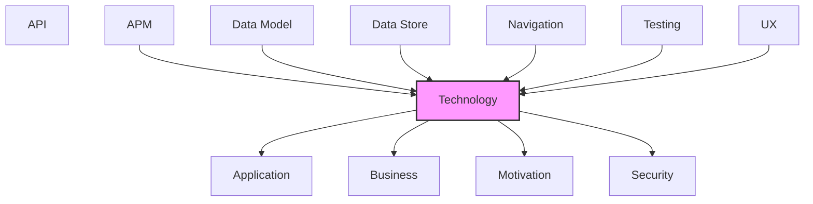

# Technology

Infrastructure, platforms, systems, and technology components.

## Report Index

- [Layer Introduction](#layer-introduction)
- [Intra-Layer Relationships](#intra-layer-relationships)
- [Inter-Layer Dependencies](#inter-layer-dependencies)
- [Inter-Layer Relationships Table](#inter-layer-relationships-table)
- [Element Reference](#element-reference)

## Layer Introduction

| Metric                    | Count |
| ------------------------- | ----- |
| Elements                  | 24    |
| Intra-Layer Relationships | 21    |
| Inter-Layer Relationships | 80    |
| Inbound Relationships     | 48    |
| Outbound Relationships    | 32    |

**Cross-Layer References**:

- **Upstream layers**: [APM](./11-apm-layer-report.md), [Data Model](./07-data-model-layer-report.md), [Data Store](./08-data-store-layer-report.md), [Navigation](./10-navigation-layer-report.md), [Testing](./12-testing-layer-report.md), [UX](./09-ux-layer-report.md)
- **Downstream layers**: [Application](./04-application-layer-report.md), [Business](./02-business-layer-report.md), [Motivation](./01-motivation-layer-report.md), [Security](./03-security-layer-report.md)

## Intra-Layer Relationships

```mermaid
flowchart LR
  subgraph technology
    technology_systemsoftware_docker["Docker"]
    technology_systemsoftware_elasticsearch["Elasticsearch"]
    technology_systemsoftware_elasticsearch_client["Elasticsearch Client"]
    technology_systemsoftware_fast_api["FastAPI"]
    technology_systemsoftware_git_hub["GitHub"]
    technology_systemsoftware_git_hub_actions["GitHub Actions"]
    technology_systemsoftware_open_telemetry["OpenTelemetry"]
    technology_systemsoftware_postgre_sql["PostgreSQL"]
    technology_systemsoftware_prometheus["Prometheus"]
    technology_systemsoftware_pytest["pytest"]
    technology_systemsoftware_python_311["Python 3.11"]
    technology_systemsoftware_react["React"]
    technology_systemsoftware_react_router["React Router"]
    technology_systemsoftware_redis["Redis"]
    technology_systemsoftware_redis_client["Redis Client"]
    technology_systemsoftware_sig_noz["SigNoz"]
    technology_systemsoftware_sqlalchemy["SQLAlchemy"]
    technology_systemsoftware_tailwind_css["TailwindCSS"]
    technology_systemsoftware_tan_stack_query["TanStack Query"]
    technology_systemsoftware_type_script["TypeScript"]
    technology_systemsoftware_vite["Vite"]
    technology_systemsoftware_vitest["Vitest"]
    technology_systemsoftware_xyflow["XYFlow"]
    technology_systemsoftware_zustand["Zustand"]
    technology_systemsoftware_docker -->|depends-on| technology_systemsoftware_python_311
    technology_systemsoftware_elasticsearch_client -->|depends-on| technology_systemsoftware_elasticsearch
    technology_systemsoftware_elasticsearch_client -->|depends-on| technology_systemsoftware_python_311
    technology_systemsoftware_fast_api -->|depends-on| technology_systemsoftware_python_311
    technology_systemsoftware_open_telemetry -->|depends-on| technology_systemsoftware_fast_api
    technology_systemsoftware_open_telemetry -->|depends-on| technology_systemsoftware_python_311
    technology_systemsoftware_prometheus -->|depends-on| technology_systemsoftware_python_311
    technology_systemsoftware_pytest -->|depends-on| technology_systemsoftware_python_311
    technology_systemsoftware_react_router -->|depends-on| technology_systemsoftware_react
    technology_systemsoftware_redis_client -->|depends-on| technology_systemsoftware_python_311
    technology_systemsoftware_redis_client -->|depends-on| technology_systemsoftware_redis
    technology_systemsoftware_sig_noz -->|depends-on| technology_systemsoftware_open_telemetry
    technology_systemsoftware_sqlalchemy -->|depends-on| technology_systemsoftware_postgre_sql
    technology_systemsoftware_sqlalchemy -->|depends-on| technology_systemsoftware_python_311
    technology_systemsoftware_tailwind_css -->|depends-on| technology_systemsoftware_react
    technology_systemsoftware_tan_stack_query -->|depends-on| technology_systemsoftware_react
    technology_systemsoftware_type_script -->|depends-on| technology_systemsoftware_react
    technology_systemsoftware_vite -->|depends-on| technology_systemsoftware_react
    technology_systemsoftware_vitest -->|depends-on| technology_systemsoftware_type_script
    technology_systemsoftware_xyflow -->|depends-on| technology_systemsoftware_react
    technology_systemsoftware_zustand -->|depends-on| technology_systemsoftware_react
  end
```

## Inter-Layer Dependencies

## Inter-Layer Relationships Table

| Relationship ID                                                     | Source Node                                                 | Dest Node                                                                      | Dest Layer    | Predicate    | Cardinality  | Strength |
| ------------------------------------------------------------------- | ----------------------------------------------------------- | ------------------------------------------------------------------------------ | ------------- | ------------ | ------------ | -------- |
| `apm.instrumentationconfig.monitors.technology.systemsoftware`      | `apm.instrumentationconfig.auto-instrumentation-setup`      | `technology.systemsoftware.fast-api`                                           | `technology`  | `monitors`   | many-to-many | medium   |
| `apm.instrumentationconfig.monitors.technology.systemsoftware`      | `apm.instrumentationconfig.auto-instrumentation-setup`      | `technology.systemsoftware.open-telemetry`                                     | `technology`  | `monitors`   | many-to-many | medium   |
| `apm.instrumentationconfig.monitors.technology.systemsoftware`      | `apm.instrumentationconfig.auto-instrumentation-setup`      | `technology.systemsoftware.prometheus`                                         | `technology`  | `monitors`   | many-to-many | medium   |
| `apm.instrumentationconfig.monitors.technology.systemsoftware`      | `apm.instrumentationconfig.auto-instrumentation-setup`      | `technology.systemsoftware.redis-client`                                       | `technology`  | `monitors`   | many-to-many | medium   |
| `apm.instrumentationconfig.monitors.technology.systemsoftware`      | `apm.instrumentationconfig.auto-instrumentation-setup`      | `technology.systemsoftware.sqlalchemy`                                         | `technology`  | `monitors`   | many-to-many | medium   |
| `data-model.objectschema.depends-on.technology.systemsoftware`      | `data-model.objectschema.agent-execution`                   | `technology.systemsoftware.python-311`                                         | `technology`  | `depends-on` | many-to-many | medium   |
| `data-model.objectschema.depends-on.technology.systemsoftware`      | `data-model.objectschema.work-item`                         | `technology.systemsoftware.python-311`                                         | `technology`  | `depends-on` | many-to-many | medium   |
| `data-store.database.depends-on.technology.systemsoftware`          | `data-store.database.elasticsearch-config-storage`          | `technology.systemsoftware.elasticsearch-client`                               | `technology`  | `depends-on` | many-to-many | medium   |
| `data-store.database.depends-on.technology.systemsoftware`          | `data-store.database.elasticsearch-event-store`             | `technology.systemsoftware.elasticsearch`                                      | `technology`  | `depends-on` | many-to-many | medium   |
| `data-store.database.depends-on.technology.systemsoftware`          | `data-store.database.elasticsearch-event-store`             | `technology.systemsoftware.elasticsearch-client`                               | `technology`  | `depends-on` | many-to-many | medium   |
| `data-store.database.depends-on.technology.systemsoftware`          | `data-store.database.elasticsearch-workflow-config`         | `technology.systemsoftware.elasticsearch-client`                               | `technology`  | `depends-on` | many-to-many | medium   |
| `data-store.database.depends-on.technology.systemsoftware`          | `data-store.database.redis-config-cache`                    | `technology.systemsoftware.redis-client`                                       | `technology`  | `depends-on` | many-to-many | medium   |
| `data-store.database.depends-on.technology.systemsoftware`          | `data-store.database.redis-event-store`                     | `technology.systemsoftware.redis`                                              | `technology`  | `depends-on` | many-to-many | medium   |
| `data-store.database.depends-on.technology.systemsoftware`          | `data-store.database.redis-event-store`                     | `technology.systemsoftware.redis-client`                                       | `technology`  | `depends-on` | many-to-many | medium   |
| `navigation.route.uses.technology.systemsoftware`                   | `navigation.route.dashboard-route`                          | `technology.systemsoftware.fast-api`                                           | `technology`  | `uses`       | many-to-many | medium   |
| `navigation.route.uses.technology.systemsoftware`                   | `navigation.route.pipeline-flow-route`                      | `technology.systemsoftware.fast-api`                                           | `technology`  | `uses`       | many-to-many | medium   |
| `navigation.route.uses.technology.systemsoftware`                   | `navigation.route.workflow-config-route`                    | `technology.systemsoftware.fast-api`                                           | `technology`  | `uses`       | many-to-many | medium   |
| `technology.systemsoftware.realizes.application.applicationservice` | `technology.systemsoftware.docker`                          | `application.applicationservice.execution-service`                             | `application` | `realizes`   | many-to-many | medium   |
| `technology.systemsoftware.realizes.application.applicationservice` | `technology.systemsoftware.docker`                          | `application.applicationservice.workspace-router`                              | `application` | `realizes`   | many-to-many | medium   |
| `technology.systemsoftware.realizes.business.businessservice`       | `technology.systemsoftware.docker`                          | `business.businessservice.agent-execution-management`                          | `business`    | `realizes`   | many-to-many | medium   |
| `technology.systemsoftware.realizes.business.businessservice`       | `technology.systemsoftware.docker`                          | `business.businessservice.workspace-management`                                | `business`    | `realizes`   | many-to-many | medium   |
| `technology.systemsoftware.realizes.motivation.goal`                | `technology.systemsoftware.docker`                          | `motivation.goal.automate-software-development-workflows`                      | `motivation`  | `realizes`   | many-to-many | medium   |
| `technology.systemsoftware.realizes.security.securitypolicy`        | `technology.systemsoftware.docker`                          | `security.securitypolicy.container-isolation`                                  | `security`    | `realizes`   | many-to-many | medium   |
| `technology.systemsoftware.realizes.business.businessservice`       | `technology.systemsoftware.elasticsearch`                   | `business.businessservice.workflow-automation`                                 | `business`    | `realizes`   | many-to-many | medium   |
| `technology.systemsoftware.realizes.motivation.goal`                | `technology.systemsoftware.elasticsearch`                   | `motivation.goal.complete-observability-via-event-sourcing`                    | `motivation`  | `realizes`   | many-to-many | medium   |
| `technology.systemsoftware.realizes.application.applicationservice` | `technology.systemsoftware.fast-api`                        | `application.applicationservice.authentication-service`                        | `application` | `realizes`   | many-to-many | medium   |
| `technology.systemsoftware.realizes.application.applicationservice` | `technology.systemsoftware.fast-api`                        | `application.applicationservice.work-item-service`                             | `application` | `realizes`   | many-to-many | medium   |
| `technology.systemsoftware.realizes.application.applicationservice` | `technology.systemsoftware.fast-api`                        | `application.applicationservice.workflow-orchestrator`                         | `application` | `realizes`   | many-to-many | medium   |
| `technology.systemsoftware.realizes.business.businessservice`       | `technology.systemsoftware.fast-api`                        | `business.businessservice.workflow-automation`                                 | `business`    | `realizes`   | many-to-many | medium   |
| `technology.systemsoftware.realizes.motivation.goal`                | `technology.systemsoftware.fast-api`                        | `motivation.goal.automate-software-development-workflows`                      | `motivation`  | `realizes`   | many-to-many | medium   |
| `technology.systemsoftware.realizes.security.securitypolicy`        | `technology.systemsoftware.fast-api`                        | `security.securitypolicy.security-headers-middleware`                          | `security`    | `realizes`   | many-to-many | medium   |
| `technology.systemsoftware.serves.application.applicationcomponent` | `technology.systemsoftware.fast-api`                        | `application.applicationcomponent.event-bus-wiring`                            | `application` | `serves`     | many-to-many | medium   |
| `technology.systemsoftware.realizes.motivation.goal`                | `technology.systemsoftware.git-hub-actions`                 | `motivation.goal.automate-software-development-workflows`                      | `motivation`  | `realizes`   | many-to-many | medium   |
| `technology.systemsoftware.satisfies.motivation.requirement`        | `technology.systemsoftware.git-hub-actions`                 | `motivation.requirement.full-end-to-end-testability-without-external-services` | `motivation`  | `satisfies`  | many-to-many | medium   |
| `technology.systemsoftware.realizes.application.applicationservice` | `technology.systemsoftware.git-hub`                         | `application.applicationservice.board-polling-service`                         | `application` | `realizes`   | many-to-many | medium   |
| `technology.systemsoftware.realizes.application.applicationservice` | `technology.systemsoftware.git-hub`                         | `application.applicationservice.work-item-service`                             | `application` | `realizes`   | many-to-many | medium   |
| `technology.systemsoftware.realizes.motivation.goal`                | `technology.systemsoftware.git-hub`                         | `motivation.goal.automate-software-development-workflows`                      | `motivation`  | `realizes`   | many-to-many | medium   |
| `technology.systemsoftware.realizes.application.applicationservice` | `technology.systemsoftware.open-telemetry`                  | `application.applicationservice.metrics-service`                               | `application` | `realizes`   | many-to-many | medium   |
| `technology.systemsoftware.realizes.motivation.goal`                | `technology.systemsoftware.open-telemetry`                  | `motivation.goal.complete-observability-via-event-sourcing`                    | `motivation`  | `realizes`   | many-to-many | medium   |
| `technology.systemsoftware.realizes.application.applicationservice` | `technology.systemsoftware.prometheus`                      | `application.applicationservice.metrics-service`                               | `application` | `realizes`   | many-to-many | medium   |
| `technology.systemsoftware.realizes.motivation.goal`                | `technology.systemsoftware.pytest`                          | `motivation.goal.full-testability-without-external-services`                   | `motivation`  | `realizes`   | many-to-many | medium   |
| `technology.systemsoftware.realizes.motivation.goal`                | `technology.systemsoftware.python-311`                      | `motivation.goal.automate-software-development-workflows`                      | `motivation`  | `realizes`   | many-to-many | medium   |
| `technology.systemsoftware.realizes.motivation.goal`                | `technology.systemsoftware.react`                           | `motivation.goal.plugin-extensibility`                                         | `motivation`  | `realizes`   | many-to-many | medium   |
| `technology.systemsoftware.realizes.application.applicationservice` | `technology.systemsoftware.redis-client`                    | `application.applicationservice.pipeline-lock-service`                         | `application` | `realizes`   | many-to-many | medium   |
| `technology.systemsoftware.realizes.security.securitypolicy`        | `technology.systemsoftware.redis-client`                    | `security.securitypolicy.jwt-bearer-authentication`                            | `security`    | `realizes`   | many-to-many | medium   |
| `technology.systemsoftware.serves.application.applicationcomponent` | `technology.systemsoftware.redis-client`                    | `application.applicationcomponent.expected-sequence-registry`                  | `application` | `serves`     | many-to-many | medium   |
| `technology.systemsoftware.realizes.motivation.goal`                | `technology.systemsoftware.redis`                           | `motivation.goal.complete-observability-via-event-sourcing`                    | `motivation`  | `realizes`   | many-to-many | medium   |
| `technology.systemsoftware.realizes.motivation.goal`                | `technology.systemsoftware.sig-noz`                         | `motivation.goal.complete-observability-via-event-sourcing`                    | `motivation`  | `realizes`   | many-to-many | medium   |
| `technology.systemsoftware.realizes.application.applicationservice` | `technology.systemsoftware.sqlalchemy`                      | `application.applicationservice.configuration-service`                         | `application` | `realizes`   | many-to-many | medium   |
| `testing.testcoveragemodel.tests.technology.systemsoftware`         | `testing.testcoveragemodel.adapter-unit-tests`              | `technology.systemsoftware.pytest`                                             | `technology`  | `tests`      | many-to-many | medium   |
| `testing.testcoveragemodel.tests.technology.systemsoftware`         | `testing.testcoveragemodel.application-service-unit-tests`  | `technology.systemsoftware.pytest`                                             | `technology`  | `tests`      | many-to-many | medium   |
| `testing.testcoveragemodel.tests.technology.systemsoftware`         | `testing.testcoveragemodel.board-automation-tests`          | `technology.systemsoftware.pytest`                                             | `technology`  | `tests`      | many-to-many | medium   |
| `testing.testcoveragemodel.tests.technology.systemsoftware`         | `testing.testcoveragemodel.domain-model-unit-tests`         | `technology.systemsoftware.pytest`                                             | `technology`  | `tests`      | many-to-many | medium   |
| `testing.testcoveragemodel.tests.technology.systemsoftware`         | `testing.testcoveragemodel.event-domain-unit-tests`         | `technology.systemsoftware.pytest`                                             | `technology`  | `tests`      | many-to-many | medium   |
| `testing.testcoveragemodel.tests.technology.systemsoftware`         | `testing.testcoveragemodel.failure-recovery-tests`          | `technology.systemsoftware.pytest`                                             | `technology`  | `tests`      | many-to-many | medium   |
| `testing.testcoveragemodel.tests.technology.systemsoftware`         | `testing.testcoveragemodel.integration-tests`               | `technology.systemsoftware.pytest`                                             | `technology`  | `tests`      | many-to-many | medium   |
| `testing.testcoveragemodel.tests.technology.systemsoftware`         | `testing.testcoveragemodel.multi-project-isolation-tests`   | `technology.systemsoftware.pytest`                                             | `technology`  | `tests`      | many-to-many | medium   |
| `testing.testcoveragemodel.tests.technology.systemsoftware`         | `testing.testcoveragemodel.observability-integration-tests` | `technology.systemsoftware.pytest`                                             | `technology`  | `tests`      | many-to-many | medium   |
| `testing.testcoveragemodel.tests.technology.systemsoftware`         | `testing.testcoveragemodel.port-adapter-contract-tests`     | `technology.systemsoftware.pytest`                                             | `technology`  | `tests`      | many-to-many | medium   |
| `testing.testcoveragemodel.tests.technology.systemsoftware`         | `testing.testcoveragemodel.rest-api-adapter-tests`          | `technology.systemsoftware.pytest`                                             | `technology`  | `tests`      | many-to-many | medium   |
| `testing.testcoveragemodel.tests.technology.systemsoftware`         | `testing.testcoveragemodel.simulation-scenario-tests`       | `technology.systemsoftware.pytest`                                             | `technology`  | `tests`      | many-to-many | medium   |
| `ux.librarycomponent.depends-on.technology.systemsoftware`          | `ux.librarycomponent.flow-canvas`                           | `technology.systemsoftware.fast-api`                                           | `technology`  | `depends-on` | many-to-many | medium   |
| `ux.librarycomponent.depends-on.technology.systemsoftware`          | `ux.librarycomponent.flow-canvas`                           | `technology.systemsoftware.xyflow`                                             | `technology`  | `depends-on` | many-to-many | medium   |
| `ux.librarycomponent.depends-on.technology.systemsoftware`          | `ux.librarycomponent.system-status-header`                  | `technology.systemsoftware.tan-stack-query`                                    | `technology`  | `depends-on` | many-to-many | medium   |
| `ux.librarycomponent.depends-on.technology.systemsoftware`          | `ux.librarycomponent.workflow-flow-nodes`                   | `technology.systemsoftware.python-311`                                         | `technology`  | `depends-on` | many-to-many | medium   |
| `ux.librarycomponent.depends-on.technology.systemsoftware`          | `ux.librarycomponent.workflow-flow-nodes`                   | `technology.systemsoftware.xyflow`                                             | `technology`  | `depends-on` | many-to-many | medium   |
| `ux.librarycomponent.depends-on.technology.systemsoftware`          | `ux.librarycomponent.workflow-run-list`                     | `technology.systemsoftware.tan-stack-query`                                    | `technology`  | `depends-on` | many-to-many | medium   |
| `ux.librarycomponent.depends-on.technology.systemsoftware`          | `ux.librarycomponent.workflow-stage-editor`                 | `technology.systemsoftware.zustand`                                            | `technology`  | `depends-on` | many-to-many | medium   |
| `ux.view.depends-on.technology.systemsoftware`                      | `ux.view.agent-config`                                      | `technology.systemsoftware.react`                                              | `technology`  | `depends-on` | many-to-many | medium   |
| `ux.view.depends-on.technology.systemsoftware`                      | `ux.view.auth-required`                                     | `technology.systemsoftware.react`                                              | `technology`  | `depends-on` | many-to-many | medium   |
| `ux.view.depends-on.technology.systemsoftware`                      | `ux.view.config-history`                                    | `technology.systemsoftware.react`                                              | `technology`  | `depends-on` | many-to-many | medium   |
| `ux.view.depends-on.technology.systemsoftware`                      | `ux.view.dashboard`                                         | `technology.systemsoftware.fast-api`                                           | `technology`  | `depends-on` | many-to-many | medium   |
| `ux.view.depends-on.technology.systemsoftware`                      | `ux.view.dashboard`                                         | `technology.systemsoftware.react`                                              | `technology`  | `depends-on` | many-to-many | medium   |
| `ux.view.depends-on.technology.systemsoftware`                      | `ux.view.pipeline-flow`                                     | `technology.systemsoftware.fast-api`                                           | `technology`  | `depends-on` | many-to-many | medium   |
| `ux.view.depends-on.technology.systemsoftware`                      | `ux.view.pipeline-flow`                                     | `technology.systemsoftware.react`                                              | `technology`  | `depends-on` | many-to-many | medium   |
| `ux.view.depends-on.technology.systemsoftware`                      | `ux.view.pipeline-flow`                                     | `technology.systemsoftware.react-router`                                       | `technology`  | `depends-on` | many-to-many | medium   |
| `ux.view.depends-on.technology.systemsoftware`                      | `ux.view.pipeline-flow`                                     | `technology.systemsoftware.xyflow`                                             | `technology`  | `depends-on` | many-to-many | medium   |
| `ux.view.depends-on.technology.systemsoftware`                      | `ux.view.pipeline-run-details`                              | `technology.systemsoftware.react`                                              | `technology`  | `depends-on` | many-to-many | medium   |
| `ux.view.depends-on.technology.systemsoftware`                      | `ux.view.project-config`                                    | `technology.systemsoftware.react`                                              | `technology`  | `depends-on` | many-to-many | medium   |
| `ux.view.depends-on.technology.systemsoftware`                      | `ux.view.workflow-config`                                   | `technology.systemsoftware.react`                                              | `technology`  | `depends-on` | many-to-many | medium   |

## Element Reference

### Docker {#docker}

**ID**: `technology.systemsoftware.docker`

**Type**: `systemsoftware`

Container runtime for agent isolation and deployment

#### Relationships

| Type        | Related Element                                           | Predicate    | Direction |
| ----------- | --------------------------------------------------------- | ------------ | --------- |
| inter-layer | `application.applicationservice.execution-service`        | `realizes`   | outbound  |
| inter-layer | `application.applicationservice.workspace-router`         | `realizes`   | outbound  |
| inter-layer | `business.businessservice.agent-execution-management`     | `realizes`   | outbound  |
| inter-layer | `business.businessservice.workspace-management`           | `realizes`   | outbound  |
| inter-layer | `motivation.goal.automate-software-development-workflows` | `realizes`   | outbound  |
| inter-layer | `security.securitypolicy.container-isolation`             | `realizes`   | outbound  |
| intra-layer | `technology.systemsoftware.python-311`                    | `depends-on` | outbound  |

### Elasticsearch {#elasticsearch}

**ID**: `technology.systemsoftware.elasticsearch`

**Type**: `systemsoftware`

Search and analytics engine used for event store and workflow configuration storage

#### Relationships

| Type        | Related Element                                             | Predicate    | Direction |
| ----------- | ----------------------------------------------------------- | ------------ | --------- |
| inter-layer | `data-store.database.elasticsearch-event-store`             | `depends-on` | inbound   |
| inter-layer | `business.businessservice.workflow-automation`              | `realizes`   | outbound  |
| inter-layer | `motivation.goal.complete-observability-via-event-sourcing` | `realizes`   | outbound  |
| intra-layer | `technology.systemsoftware.elasticsearch-client`            | `depends-on` | inbound   |

### Elasticsearch Client {#elasticsearch-client}

**ID**: `technology.systemsoftware.elasticsearch-client`

**Type**: `systemsoftware`

Elasticsearch SDK for event store, config storage, and workflow config

#### Relationships

| Type        | Related Element                                     | Predicate    | Direction |
| ----------- | --------------------------------------------------- | ------------ | --------- |
| inter-layer | `data-store.database.elasticsearch-config-storage`  | `depends-on` | inbound   |
| inter-layer | `data-store.database.elasticsearch-event-store`     | `depends-on` | inbound   |
| inter-layer | `data-store.database.elasticsearch-workflow-config` | `depends-on` | inbound   |
| intra-layer | `technology.systemsoftware.elasticsearch`           | `depends-on` | outbound  |
| intra-layer | `technology.systemsoftware.python-311`              | `depends-on` | outbound  |

### FastAPI {#fastapi}

**ID**: `technology.systemsoftware.fast-api`

**Type**: `systemsoftware`

Async REST API framework used for all HTTP endpoints and WebSocket support

#### Relationships

| Type        | Related Element                                           | Predicate    | Direction |
| ----------- | --------------------------------------------------------- | ------------ | --------- |
| inter-layer | `apm.instrumentationconfig.auto-instrumentation-setup`    | `monitors`   | inbound   |
| inter-layer | `navigation.route.dashboard-route`                        | `uses`       | inbound   |
| inter-layer | `navigation.route.pipeline-flow-route`                    | `uses`       | inbound   |
| inter-layer | `navigation.route.workflow-config-route`                  | `uses`       | inbound   |
| inter-layer | `application.applicationservice.authentication-service`   | `realizes`   | outbound  |
| inter-layer | `application.applicationservice.work-item-service`        | `realizes`   | outbound  |
| inter-layer | `application.applicationservice.workflow-orchestrator`    | `realizes`   | outbound  |
| inter-layer | `business.businessservice.workflow-automation`            | `realizes`   | outbound  |
| inter-layer | `motivation.goal.automate-software-development-workflows` | `realizes`   | outbound  |
| inter-layer | `security.securitypolicy.security-headers-middleware`     | `realizes`   | outbound  |
| inter-layer | `application.applicationcomponent.event-bus-wiring`       | `serves`     | outbound  |
| inter-layer | `ux.librarycomponent.flow-canvas`                         | `depends-on` | inbound   |
| inter-layer | `ux.view.dashboard`                                       | `depends-on` | inbound   |
| inter-layer | `ux.view.pipeline-flow`                                   | `depends-on` | inbound   |
| intra-layer | `technology.systemsoftware.python-311`                    | `depends-on` | outbound  |
| intra-layer | `technology.systemsoftware.open-telemetry`                | `depends-on` | inbound   |

### GitHub {#github}

**ID**: `technology.systemsoftware.git-hub`

**Type**: `systemsoftware`

External platform providing ticket tracking, board management, code review, and webhook events — integrated via 5 production secondary adapters

#### Relationships

| Type        | Related Element                                           | Predicate  | Direction |
| ----------- | --------------------------------------------------------- | ---------- | --------- |
| inter-layer | `application.applicationservice.board-polling-service`    | `realizes` | outbound  |
| inter-layer | `application.applicationservice.work-item-service`        | `realizes` | outbound  |
| inter-layer | `motivation.goal.automate-software-development-workflows` | `realizes` | outbound  |

### GitHub Actions {#github-actions}

**ID**: `technology.systemsoftware.git-hub-actions`

**Type**: `systemsoftware`

CI/CD pipeline platform for automated testing and deployment workflows

#### Relationships

| Type        | Related Element                                                                | Predicate   | Direction |
| ----------- | ------------------------------------------------------------------------------ | ----------- | --------- |
| inter-layer | `motivation.goal.automate-software-development-workflows`                      | `realizes`  | outbound  |
| inter-layer | `motivation.requirement.full-end-to-end-testability-without-external-services` | `satisfies` | outbound  |

### OpenTelemetry {#opentelemetry}

**ID**: `technology.systemsoftware.open-telemetry`

**Type**: `systemsoftware`

Distributed tracing SDK with OTLP exporter for Jaeger integration

#### Relationships

| Type        | Related Element                                             | Predicate    | Direction |
| ----------- | ----------------------------------------------------------- | ------------ | --------- |
| inter-layer | `apm.instrumentationconfig.auto-instrumentation-setup`      | `monitors`   | inbound   |
| inter-layer | `application.applicationservice.metrics-service`            | `realizes`   | outbound  |
| inter-layer | `motivation.goal.complete-observability-via-event-sourcing` | `realizes`   | outbound  |
| intra-layer | `technology.systemsoftware.fast-api`                        | `depends-on` | outbound  |
| intra-layer | `technology.systemsoftware.python-311`                      | `depends-on` | outbound  |
| intra-layer | `technology.systemsoftware.sig-noz`                         | `depends-on` | inbound   |

### PostgreSQL {#postgresql}

**ID**: `technology.systemsoftware.postgre-sql`

**Type**: `systemsoftware`

Relational database for configuration, agent definitions, and workflow storage

#### Relationships

| Type        | Related Element                        | Predicate    | Direction |
| ----------- | -------------------------------------- | ------------ | --------- |
| intra-layer | `technology.systemsoftware.sqlalchemy` | `depends-on` | inbound   |

### Prometheus {#prometheus}

**ID**: `technology.systemsoftware.prometheus`

**Type**: `systemsoftware`

Prometheus metrics library for application performance monitoring

#### Relationships

| Type        | Related Element                                        | Predicate    | Direction |
| ----------- | ------------------------------------------------------ | ------------ | --------- |
| inter-layer | `apm.instrumentationconfig.auto-instrumentation-setup` | `monitors`   | inbound   |
| inter-layer | `application.applicationservice.metrics-service`       | `realizes`   | outbound  |
| intra-layer | `technology.systemsoftware.python-311`                 | `depends-on` | outbound  |

### pytest {#pytest}

**ID**: `technology.systemsoftware.pytest`

**Type**: `systemsoftware`

Test runner for unit, integration, simulation, and e2e test suites

#### Relationships

| Type        | Related Element                                              | Predicate    | Direction |
| ----------- | ------------------------------------------------------------ | ------------ | --------- |
| inter-layer | `motivation.goal.full-testability-without-external-services` | `realizes`   | outbound  |
| inter-layer | `testing.testcoveragemodel.adapter-unit-tests`               | `tests`      | inbound   |
| inter-layer | `testing.testcoveragemodel.application-service-unit-tests`   | `tests`      | inbound   |
| inter-layer | `testing.testcoveragemodel.board-automation-tests`           | `tests`      | inbound   |
| inter-layer | `testing.testcoveragemodel.domain-model-unit-tests`          | `tests`      | inbound   |
| inter-layer | `testing.testcoveragemodel.event-domain-unit-tests`          | `tests`      | inbound   |
| inter-layer | `testing.testcoveragemodel.failure-recovery-tests`           | `tests`      | inbound   |
| inter-layer | `testing.testcoveragemodel.integration-tests`                | `tests`      | inbound   |
| inter-layer | `testing.testcoveragemodel.multi-project-isolation-tests`    | `tests`      | inbound   |
| inter-layer | `testing.testcoveragemodel.observability-integration-tests`  | `tests`      | inbound   |
| inter-layer | `testing.testcoveragemodel.port-adapter-contract-tests`      | `tests`      | inbound   |
| inter-layer | `testing.testcoveragemodel.rest-api-adapter-tests`           | `tests`      | inbound   |
| inter-layer | `testing.testcoveragemodel.simulation-scenario-tests`        | `tests`      | inbound   |
| intra-layer | `technology.systemsoftware.python-311`                       | `depends-on` | outbound  |

### Python 3.11 {#python-3-11}

**ID**: `technology.systemsoftware.python-311`

**Type**: `systemsoftware`

Primary runtime language and version for all application code

#### Relationships

| Type        | Related Element                                           | Predicate    | Direction |
| ----------- | --------------------------------------------------------- | ------------ | --------- |
| inter-layer | `data-model.objectschema.agent-execution`                 | `depends-on` | inbound   |
| inter-layer | `data-model.objectschema.work-item`                       | `depends-on` | inbound   |
| inter-layer | `motivation.goal.automate-software-development-workflows` | `realizes`   | outbound  |
| inter-layer | `ux.librarycomponent.workflow-flow-nodes`                 | `depends-on` | inbound   |
| intra-layer | `technology.systemsoftware.docker`                        | `depends-on` | inbound   |
| intra-layer | `technology.systemsoftware.elasticsearch-client`          | `depends-on` | inbound   |
| intra-layer | `technology.systemsoftware.fast-api`                      | `depends-on` | inbound   |
| intra-layer | `technology.systemsoftware.open-telemetry`                | `depends-on` | inbound   |
| intra-layer | `technology.systemsoftware.prometheus`                    | `depends-on` | inbound   |
| intra-layer | `technology.systemsoftware.pytest`                        | `depends-on` | inbound   |
| intra-layer | `technology.systemsoftware.redis-client`                  | `depends-on` | inbound   |
| intra-layer | `technology.systemsoftware.sqlalchemy`                    | `depends-on` | inbound   |

### React {#react}

**ID**: `technology.systemsoftware.react`

**Type**: `systemsoftware`

Frontend UI library (v18) for building the configuration dashboard and workflow visualization

#### Relationships

| Type        | Related Element                             | Predicate    | Direction |
| ----------- | ------------------------------------------- | ------------ | --------- |
| inter-layer | `motivation.goal.plugin-extensibility`      | `realizes`   | outbound  |
| inter-layer | `ux.view.agent-config`                      | `depends-on` | inbound   |
| inter-layer | `ux.view.auth-required`                     | `depends-on` | inbound   |
| inter-layer | `ux.view.config-history`                    | `depends-on` | inbound   |
| inter-layer | `ux.view.dashboard`                         | `depends-on` | inbound   |
| inter-layer | `ux.view.pipeline-flow`                     | `depends-on` | inbound   |
| inter-layer | `ux.view.pipeline-run-details`              | `depends-on` | inbound   |
| inter-layer | `ux.view.project-config`                    | `depends-on` | inbound   |
| inter-layer | `ux.view.workflow-config`                   | `depends-on` | inbound   |
| intra-layer | `technology.systemsoftware.react-router`    | `depends-on` | inbound   |
| intra-layer | `technology.systemsoftware.tailwind-css`    | `depends-on` | inbound   |
| intra-layer | `technology.systemsoftware.tan-stack-query` | `depends-on` | inbound   |
| intra-layer | `technology.systemsoftware.type-script`     | `depends-on` | inbound   |
| intra-layer | `technology.systemsoftware.vite`            | `depends-on` | inbound   |
| intra-layer | `technology.systemsoftware.xyflow`          | `depends-on` | inbound   |
| intra-layer | `technology.systemsoftware.zustand`         | `depends-on` | inbound   |

### React Router {#react-router}

**ID**: `technology.systemsoftware.react-router`

**Type**: `systemsoftware`

Client-side routing library (react-router-dom v6) for frontend SPA page navigation

#### Relationships

| Type        | Related Element                   | Predicate    | Direction |
| ----------- | --------------------------------- | ------------ | --------- |
| inter-layer | `ux.view.pipeline-flow`           | `depends-on` | inbound   |
| intra-layer | `technology.systemsoftware.react` | `depends-on` | outbound  |

### Redis {#redis}

**ID**: `technology.systemsoftware.redis`

**Type**: `systemsoftware`

In-memory data store used as event store, pub/sub broker, and distributed cache

#### Relationships

| Type        | Related Element                                             | Predicate    | Direction |
| ----------- | ----------------------------------------------------------- | ------------ | --------- |
| inter-layer | `data-store.database.redis-event-store`                     | `depends-on` | inbound   |
| inter-layer | `motivation.goal.complete-observability-via-event-sourcing` | `realizes`   | outbound  |
| intra-layer | `technology.systemsoftware.redis-client`                    | `depends-on` | inbound   |

### Redis Client {#redis-client}

**ID**: `technology.systemsoftware.redis-client`

**Type**: `systemsoftware`

Redis SDK for event store, pub/sub, and config cache

#### Relationships

| Type        | Related Element                                               | Predicate    | Direction |
| ----------- | ------------------------------------------------------------- | ------------ | --------- |
| inter-layer | `apm.instrumentationconfig.auto-instrumentation-setup`        | `monitors`   | inbound   |
| inter-layer | `data-store.database.redis-config-cache`                      | `depends-on` | inbound   |
| inter-layer | `data-store.database.redis-event-store`                       | `depends-on` | inbound   |
| inter-layer | `application.applicationservice.pipeline-lock-service`        | `realizes`   | outbound  |
| inter-layer | `security.securitypolicy.jwt-bearer-authentication`           | `realizes`   | outbound  |
| inter-layer | `application.applicationcomponent.expected-sequence-registry` | `serves`     | outbound  |
| intra-layer | `technology.systemsoftware.python-311`                        | `depends-on` | outbound  |
| intra-layer | `technology.systemsoftware.redis`                             | `depends-on` | outbound  |

### SigNoz {#signoz}

**ID**: `technology.systemsoftware.sig-noz`

**Type**: `systemsoftware`

OpenTelemetry-compatible observability backend (OTLP target) for traces, metrics, and logs

#### Relationships

| Type        | Related Element                                             | Predicate    | Direction |
| ----------- | ----------------------------------------------------------- | ------------ | --------- |
| inter-layer | `motivation.goal.complete-observability-via-event-sourcing` | `realizes`   | outbound  |
| intra-layer | `technology.systemsoftware.open-telemetry`                  | `depends-on` | outbound  |

### SQLAlchemy {#sqlalchemy}

**ID**: `technology.systemsoftware.sqlalchemy`

**Type**: `systemsoftware`

ORM for PostgreSQL configuration database access

#### Relationships

| Type        | Related Element                                        | Predicate    | Direction |
| ----------- | ------------------------------------------------------ | ------------ | --------- |
| inter-layer | `apm.instrumentationconfig.auto-instrumentation-setup` | `monitors`   | inbound   |
| inter-layer | `application.applicationservice.configuration-service` | `realizes`   | outbound  |
| intra-layer | `technology.systemsoftware.postgre-sql`                | `depends-on` | outbound  |
| intra-layer | `technology.systemsoftware.python-311`                 | `depends-on` | outbound  |

### TailwindCSS {#tailwindcss}

**ID**: `technology.systemsoftware.tailwind-css`

**Type**: `systemsoftware`

Utility-first CSS framework used for styling the frontend dashboard

#### Relationships

| Type        | Related Element                   | Predicate    | Direction |
| ----------- | --------------------------------- | ------------ | --------- |
| intra-layer | `technology.systemsoftware.react` | `depends-on` | outbound  |

### TanStack Query {#tanstack-query}

**ID**: `technology.systemsoftware.tan-stack-query`

**Type**: `systemsoftware`

Async data-fetching and server state library (@tanstack/react-query v5) for API calls in the frontend

#### Relationships

| Type        | Related Element                            | Predicate    | Direction |
| ----------- | ------------------------------------------ | ------------ | --------- |
| inter-layer | `ux.librarycomponent.system-status-header` | `depends-on` | inbound   |
| inter-layer | `ux.librarycomponent.workflow-run-list`    | `depends-on` | inbound   |
| intra-layer | `technology.systemsoftware.react`          | `depends-on` | outbound  |

### TypeScript {#typescript}

**ID**: `technology.systemsoftware.type-script`

**Type**: `systemsoftware`

Statically-typed superset of JavaScript used for the entire frontend codebase

#### Relationships

| Type        | Related Element                    | Predicate    | Direction |
| ----------- | ---------------------------------- | ------------ | --------- |
| intra-layer | `technology.systemsoftware.react`  | `depends-on` | outbound  |
| intra-layer | `technology.systemsoftware.vitest` | `depends-on` | inbound   |

### Vite {#vite}

**ID**: `technology.systemsoftware.vite`

**Type**: `systemsoftware`

Frontend build tool and dev server for the React configuration dashboard

#### Relationships

| Type        | Related Element                   | Predicate    | Direction |
| ----------- | --------------------------------- | ------------ | --------- |
| intra-layer | `technology.systemsoftware.react` | `depends-on` | outbound  |

### Vitest {#vitest}

**ID**: `technology.systemsoftware.vitest`

**Type**: `systemsoftware`

Fast unit test framework for the frontend TypeScript codebase

#### Relationships

| Type        | Related Element                         | Predicate    | Direction |
| ----------- | --------------------------------------- | ------------ | --------- |
| intra-layer | `technology.systemsoftware.type-script` | `depends-on` | outbound  |

### XYFlow {#xyflow}

**ID**: `technology.systemsoftware.xyflow`

**Type**: `systemsoftware`

React node-graph library (@xyflow/react v12) powering the interactive workflow canvas

#### Relationships

| Type        | Related Element                           | Predicate    | Direction |
| ----------- | ----------------------------------------- | ------------ | --------- |
| inter-layer | `ux.librarycomponent.flow-canvas`         | `depends-on` | inbound   |
| inter-layer | `ux.librarycomponent.workflow-flow-nodes` | `depends-on` | inbound   |
| inter-layer | `ux.view.pipeline-flow`                   | `depends-on` | inbound   |
| intra-layer | `technology.systemsoftware.react`         | `depends-on` | outbound  |

### Zustand {#zustand}

**ID**: `technology.systemsoftware.zustand`

**Type**: `systemsoftware`

Lightweight client-side state management library for the configuration dashboard

#### Relationships

| Type        | Related Element                             | Predicate    | Direction |
| ----------- | ------------------------------------------- | ------------ | --------- |
| inter-layer | `ux.librarycomponent.workflow-stage-editor` | `depends-on` | inbound   |
| intra-layer | `technology.systemsoftware.react`           | `depends-on` | outbound  |

---

Generated: 2026-05-11T22:23:25.353Z | Model Version: 0.1.0
