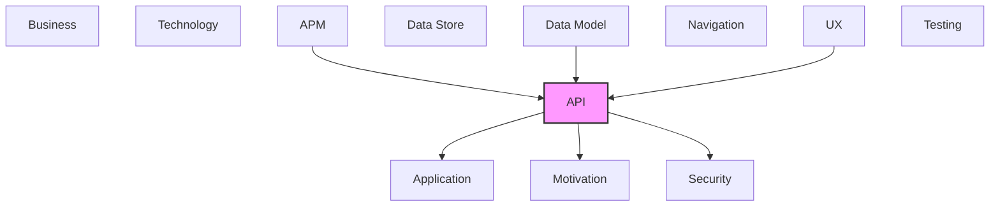

# API

REST APIs, operations, endpoints, and API integrations.

## Report Index

- [Layer Introduction](#layer-introduction)
- [Intra-Layer Relationships](#intra-layer-relationships)
- [Inter-Layer Dependencies](#inter-layer-dependencies)
- [Inter-Layer Relationships Table](#inter-layer-relationships-table)
- [Element Reference](#element-reference)

## Layer Introduction

| Metric                    | Count |
| ------------------------- | ----- |
| Elements                  | 110   |
| Intra-Layer Relationships | 0     |
| Inter-Layer Relationships | 146   |
| Inbound Relationships     | 19    |
| Outbound Relationships    | 127   |

**Cross-Layer References**:

- **Upstream layers**: [APM](./11-apm-layer-report.md), [Data Model](./07-data-model-layer-report.md), [UX](./09-ux-layer-report.md)
- **Downstream layers**: [Application](./04-application-layer-report.md), [Motivation](./01-motivation-layer-report.md), [Security](./03-security-layer-report.md)

## Intra-Layer Relationships

*This layer has >30 elements. Summary table shown instead of diagram.*

| Element                                           | Type        | Relationships |
| ------------------------------------------------- | ----------- | ------------- |
| `api.operation.add-agent-capability`              | `operation` | 0             |
| `api.operation.add-agent-mcp-server`              | `operation` | 0             |
| `api.operation.add-environment-variable`          | `operation` | 0             |
| `api.operation.add-simulation-comment`            | `operation` | 0             |
| `api.operation.advance-simulation-clock`          | `operation` | 0             |
| `api.operation.cancel-workflow-execution`         | `operation` | 0             |
| `api.operation.create-agent`                      | `operation` | 0             |
| `api.operation.create-api-key`                    | `operation` | 0             |
| `api.operation.create-board-workflow-template`    | `operation` | 0             |
| `api.operation.create-simulation-issue`           | `operation` | 0             |
| `api.operation.create-user`                       | `operation` | 0             |
| `api.operation.create-work-item`                  | `operation` | 0             |
| `api.operation.create-workflow`                   | `operation` | 0             |
| `api.operation.delete-agent`                      | `operation` | 0             |
| `api.operation.delete-board-workflow-template`    | `operation` | 0             |
| `api.operation.delete-user`                       | `operation` | 0             |
| `api.operation.delete-work-item`                  | `operation` | 0             |
| `api.operation.delete-workflow`                   | `operation` | 0             |
| `api.operation.get-active-agents`                 | `operation` | 0             |
| `api.operation.get-agent`                         | `operation` | 0             |
| `api.operation.get-agent-config`                  | `operation` | 0             |
| `api.operation.get-agent-execution-metrics`       | `operation` | 0             |
| `api.operation.get-api-usage`                     | `operation` | 0             |
| `api.operation.get-board-workflow-template`       | `operation` | 0             |
| `api.operation.get-causal-chain`                  | `operation` | 0             |
| `api.operation.get-current-user`                  | `operation` | 0             |
| `api.operation.get-domain-events`                 | `operation` | 0             |
| `api.operation.get-endpoint-metrics`              | `operation` | 0             |
| `api.operation.get-event-statistics`              | `operation` | 0             |
| `api.operation.get-execution`                     | `operation` | 0             |
| `api.operation.get-execution-history`             | `operation` | 0             |
| `api.operation.get-execution-logs`                | `operation` | 0             |
| `api.operation.get-execution-queue`               | `operation` | 0             |
| `api.operation.get-integration-status`            | `operation` | 0             |
| `api.operation.get-performance-metrics`           | `operation` | 0             |
| `api.operation.get-pipeline-config`               | `operation` | 0             |
| `api.operation.get-project-config`                | `operation` | 0             |
| `api.operation.get-project-config-history`        | `operation` | 0             |
| `api.operation.get-queue-statistics`              | `operation` | 0             |
| `api.operation.get-repair-cycle-metrics`          | `operation` | 0             |
| `api.operation.get-resilience-metrics`            | `operation` | 0             |
| `api.operation.get-resource-usage-summary`        | `operation` | 0             |
| `api.operation.get-simulation-board-history`      | `operation` | 0             |
| `api.operation.get-simulation-board-state`        | `operation` | 0             |
| `api.operation.get-simulation-clock-state`        | `operation` | 0             |
| `api.operation.get-simulation-execution-status`   | `operation` | 0             |
| `api.operation.get-simulation-issue`              | `operation` | 0             |
| `api.operation.get-simulation-mode-info`          | `operation` | 0             |
| `api.operation.get-system-health`                 | `operation` | 0             |
| `api.operation.get-token-info`                    | `operation` | 0             |
| `api.operation.get-user`                          | `operation` | 0             |
| `api.operation.get-work-item`                     | `operation` | 0             |
| `api.operation.get-workflow`                      | `operation` | 0             |
| `api.operation.get-workflow-run`                  | `operation` | 0             |
| `api.operation.get-workflow-run-audit`            | `operation` | 0             |
| `api.operation.get-workflow-run-events`           | `operation` | 0             |
| `api.operation.get-workflow-versions`             | `operation` | 0             |
| `api.operation.get-workspace`                     | `operation` | 0             |
| `api.operation.get-workspace-logs`                | `operation` | 0             |
| `api.operation.health-check`                      | `operation` | 0             |
| `api.operation.list-active-workspaces`            | `operation` | 0             |
| `api.operation.list-agents`                       | `operation` | 0             |
| `api.operation.list-api-keys`                     | `operation` | 0             |
| `api.operation.list-audit-events`                 | `operation` | 0             |
| `api.operation.list-board-workflow-templates`     | `operation` | 0             |
| `api.operation.list-config-agents`                | `operation` | 0             |
| `api.operation.list-config-agents-for-project`    | `operation` | 0             |
| `api.operation.list-config-pipelines-for-project` | `operation` | 0             |
| `api.operation.list-executions`                   | `operation` | 0             |
| `api.operation.list-metric-names`                 | `operation` | 0             |
| `api.operation.list-pipeline-configs`             | `operation` | 0             |
| `api.operation.list-projects`                     | `operation` | 0             |
| `api.operation.list-simulation-issues`            | `operation` | 0             |
| `api.operation.list-work-items`                   | `operation` | 0             |
| `api.operation.list-workflow-runs`                | `operation` | 0             |
| `api.operation.list-workflows`                    | `operation` | 0             |
| `api.operation.list-workspaces`                   | `operation` | 0             |
| `api.operation.login`                             | `operation` | 0             |
| `api.operation.logout`                            | `operation` | 0             |
| `api.operation.move-simulation-issue`             | `operation` | 0             |
| `api.operation.pause-simulation-clock`            | `operation` | 0             |
| `api.operation.pause-workflow-execution`          | `operation` | 0             |
| `api.operation.readiness-check`                   | `operation` | 0             |
| `api.operation.receive-git-hub-webhook`           | `operation` | 0             |
| `api.operation.refresh-token`                     | `operation` | 0             |
| `api.operation.remove-agent-capability`           | `operation` | 0             |
| `api.operation.remove-agent-mcp-server`           | `operation` | 0             |
| `api.operation.remove-environment-variable`       | `operation` | 0             |
| `api.operation.replay-events`                     | `operation` | 0             |
| `api.operation.resume-simulation-clock`           | `operation` | 0             |
| `api.operation.resume-workflow-execution`         | `operation` | 0             |
| `api.operation.revoke-api-key`                    | `operation` | 0             |
| `api.operation.search-configurations`             | `operation` | 0             |
| `api.operation.start-workflow-execution`          | `operation` | 0             |
| `api.operation.stream-simulation-events`          | `operation` | 0             |
| `api.operation.terminate-execution`               | `operation` | 0             |
| `api.operation.update-agent`                      | `operation` | 0             |
| `api.operation.update-agent-capability`           | `operation` | 0             |
| `api.operation.update-agent-config`               | `operation` | 0             |
| `api.operation.update-board-workflow-template`    | `operation` | 0             |
| `api.operation.update-pipeline-config`            | `operation` | 0             |
| `api.operation.update-project-config`             | `operation` | 0             |
| `api.operation.update-user`                       | `operation` | 0             |
| `api.operation.update-work-item`                  | `operation` | 0             |
| `api.operation.update-workflow`                   | `operation` | 0             |
| `api.operation.upload-configuration-file`         | `operation` | 0             |
| `api.operation.validate-entry-conditions`         | `operation` | 0             |
| `api.operation.validate-workflow-definition`      | `operation` | 0             |
| `api.operation.web-socket-event-stream`           | `operation` | 0             |
| `api.operation.web-socket-event-stream-legacy`    | `operation` | 0             |

## Inter-Layer Dependencies

## Inter-Layer Relationships Table

| Relationship ID                                           | Source Node                                         | Dest Node                                                    | Dest Layer    | Predicate    | Cardinality  | Strength |
| --------------------------------------------------------- | --------------------------------------------------- | ------------------------------------------------------------ | ------------- | ------------ | ------------ | -------- |
| `api.operation.references.application.applicationservice` | `api.operation.add-agent-capability`                | `application.applicationservice.configuration-service`       | `application` | `references` | many-to-many | medium   |
| `api.operation.references.application.applicationservice` | `api.operation.add-agent-mcp-server`                | `application.applicationservice.configuration-service`       | `application` | `references` | many-to-many | medium   |
| `api.operation.references.application.applicationservice` | `api.operation.add-environment-variable`            | `application.applicationservice.configuration-service`       | `application` | `references` | many-to-many | medium   |
| `api.operation.references.application.applicationservice` | `api.operation.add-simulation-comment`              | `application.applicationservice.work-item-service`           | `application` | `references` | many-to-many | medium   |
| `api.operation.references.application.applicationservice` | `api.operation.advance-simulation-clock`            | `application.applicationservice.simulation-service`          | `application` | `references` | many-to-many | medium   |
| `api.operation.references.application.applicationservice` | `api.operation.cancel-workflow-execution`           | `application.applicationservice.workflow-orchestrator`       | `application` | `references` | many-to-many | medium   |
| `api.operation.requires.security.securitypolicy`          | `api.operation.cancel-workflow-execution`           | `security.securitypolicy.role-based-access-control`          | `security`    | `requires`   | many-to-many | medium   |
| `api.operation.references.application.applicationservice` | `api.operation.create-agent`                        | `application.applicationservice.authentication-service`      | `application` | `references` | many-to-many | medium   |
| `api.operation.references.application.applicationservice` | `api.operation.create-api-key`                      | `application.applicationservice.authentication-service`      | `application` | `references` | many-to-many | medium   |
| `api.operation.requires.security.securitypolicy`          | `api.operation.create-api-key`                      | `security.securitypolicy.api-key-authentication`             | `security`    | `requires`   | many-to-many | medium   |
| `api.operation.references.application.applicationservice` | `api.operation.create-board-workflow-template`      | `application.applicationservice.configuration-service`       | `application` | `references` | many-to-many | medium   |
| `api.operation.references.application.applicationservice` | `api.operation.create-simulation-issue`             | `application.applicationservice.simulation-service`          | `application` | `references` | many-to-many | medium   |
| `api.operation.references.application.applicationservice` | `api.operation.create-user`                         | `application.applicationservice.authentication-service`      | `application` | `references` | many-to-many | medium   |
| `api.operation.references.application.applicationservice` | `api.operation.create-work-item`                    | `application.applicationservice.work-item-service`           | `application` | `references` | many-to-many | medium   |
| `api.operation.references.application.applicationservice` | `api.operation.create-workflow`                     | `application.applicationservice.configuration-service`       | `application` | `references` | many-to-many | medium   |
| `api.operation.references.application.applicationservice` | `api.operation.delete-agent`                        | `application.applicationservice.configuration-service`       | `application` | `references` | many-to-many | medium   |
| `api.operation.references.application.applicationservice` | `api.operation.delete-board-workflow-template`      | `application.applicationservice.configuration-service`       | `application` | `references` | many-to-many | medium   |
| `api.operation.references.application.applicationservice` | `api.operation.delete-user`                         | `application.applicationservice.authentication-service`      | `application` | `references` | many-to-many | medium   |
| `api.operation.references.application.applicationservice` | `api.operation.delete-work-item`                    | `application.applicationservice.work-item-service`           | `application` | `references` | many-to-many | medium   |
| `api.operation.references.application.applicationservice` | `api.operation.delete-workflow`                     | `application.applicationservice.configuration-service`       | `application` | `references` | many-to-many | medium   |
| `api.operation.references.application.applicationservice` | `api.operation.get-active-agents`                   | `application.applicationservice.metrics-service`             | `application` | `references` | many-to-many | medium   |
| `api.operation.references.application.applicationservice` | `api.operation.get-agent-config`                    | `application.applicationservice.configuration-service`       | `application` | `references` | many-to-many | medium   |
| `api.operation.references.application.applicationservice` | `api.operation.get-agent-execution-metrics`         | `application.applicationservice.metrics-service`             | `application` | `references` | many-to-many | medium   |
| `api.operation.references.application.applicationservice` | `api.operation.get-agent`                           | `application.applicationservice.configuration-service`       | `application` | `references` | many-to-many | medium   |
| `api.operation.references.application.applicationservice` | `api.operation.get-api-usage`                       | `application.applicationservice.metrics-service`             | `application` | `references` | many-to-many | medium   |
| `api.operation.references.application.applicationservice` | `api.operation.get-board-workflow-template`         | `application.applicationservice.configuration-service`       | `application` | `references` | many-to-many | medium   |
| `api.operation.references.application.applicationservice` | `api.operation.get-causal-chain`                    | `application.applicationservice.event-sequence-validator`    | `application` | `references` | many-to-many | medium   |
| `api.operation.references.application.applicationservice` | `api.operation.get-current-user`                    | `application.applicationservice.authentication-service`      | `application` | `references` | many-to-many | medium   |
| `api.operation.requires.security.securitypolicy`          | `api.operation.get-current-user`                    | `security.securitypolicy.jwt-bearer-authentication`          | `security`    | `requires`   | many-to-many | medium   |
| `api.operation.realizes.motivation.goal`                  | `api.operation.get-domain-events`                   | `motivation.goal.complete-observability-via-event-sourcing`  | `motivation`  | `realizes`   | many-to-many | medium   |
| `api.operation.references.application.applicationservice` | `api.operation.get-domain-events`                   | `application.applicationservice.workflow-run-query-service`  | `application` | `references` | many-to-many | medium   |
| `api.operation.references.application.applicationservice` | `api.operation.get-endpoint-metrics`                | `application.applicationservice.metrics-service`             | `application` | `references` | many-to-many | medium   |
| `api.operation.references.application.applicationservice` | `api.operation.get-event-statistics`                | `application.applicationservice.event-sequence-validator`    | `application` | `references` | many-to-many | medium   |
| `api.operation.references.application.applicationservice` | `api.operation.get-execution-history`               | `application.applicationservice.execution-service`           | `application` | `references` | many-to-many | medium   |
| `api.operation.references.application.applicationservice` | `api.operation.get-execution-logs`                  | `application.applicationservice.execution-service`           | `application` | `references` | many-to-many | medium   |
| `api.operation.references.application.applicationservice` | `api.operation.get-execution-queue`                 | `application.applicationservice.agent-scheduler`             | `application` | `references` | many-to-many | medium   |
| `api.operation.references.application.applicationservice` | `api.operation.get-execution`                       | `application.applicationservice.execution-service`           | `application` | `references` | many-to-many | medium   |
| `api.operation.references.application.applicationservice` | `api.operation.get-integration-status`              | `application.applicationservice.metrics-service`             | `application` | `references` | many-to-many | medium   |
| `api.operation.references.application.applicationservice` | `api.operation.get-performance-metrics`             | `application.applicationservice.metrics-service`             | `application` | `references` | many-to-many | medium   |
| `api.operation.references.application.applicationservice` | `api.operation.get-pipeline-config`                 | `application.applicationservice.configuration-service`       | `application` | `references` | many-to-many | medium   |
| `api.operation.references.application.applicationservice` | `api.operation.get-project-config-history`          | `application.applicationservice.configuration-service`       | `application` | `references` | many-to-many | medium   |
| `api.operation.references.application.applicationservice` | `api.operation.get-project-config`                  | `application.applicationservice.configuration-service`       | `application` | `references` | many-to-many | medium   |
| `api.operation.references.application.applicationservice` | `api.operation.get-queue-statistics`                | `application.applicationservice.agent-scheduler`             | `application` | `references` | many-to-many | medium   |
| `api.operation.references.application.applicationservice` | `api.operation.get-repair-cycle-metrics`            | `application.applicationservice.metrics-service`             | `application` | `references` | many-to-many | medium   |
| `api.operation.references.application.applicationservice` | `api.operation.get-resilience-metrics`              | `application.applicationservice.metrics-service`             | `application` | `references` | many-to-many | medium   |
| `api.operation.references.application.applicationservice` | `api.operation.get-resource-usage-summary`          | `application.applicationservice.workspace-router`            | `application` | `references` | many-to-many | medium   |
| `api.operation.references.application.applicationservice` | `api.operation.get-simulation-board-history`        | `application.applicationservice.board-polling-service`       | `application` | `references` | many-to-many | medium   |
| `api.operation.realizes.motivation.goal`                  | `api.operation.get-simulation-board-state`          | `motivation.goal.full-testability-without-external-services` | `motivation`  | `realizes`   | many-to-many | medium   |
| `api.operation.references.application.applicationservice` | `api.operation.get-simulation-board-state`          | `application.applicationservice.simulation-service`          | `application` | `references` | many-to-many | medium   |
| `api.operation.references.application.applicationservice` | `api.operation.get-simulation-clock-state`          | `application.applicationservice.simulation-service`          | `application` | `references` | many-to-many | medium   |
| `api.operation.references.application.applicationservice` | `api.operation.get-simulation-execution-status`     | `application.applicationservice.simulation-service`          | `application` | `references` | many-to-many | medium   |
| `api.operation.references.application.applicationservice` | `api.operation.get-simulation-issue`                | `application.applicationservice.simulation-service`          | `application` | `references` | many-to-many | medium   |
| `api.operation.references.application.applicationservice` | `api.operation.get-simulation-mode-info`            | `application.applicationservice.metrics-service`             | `application` | `references` | many-to-many | medium   |
| `api.operation.references.application.applicationservice` | `api.operation.get-system-health`                   | `application.applicationservice.metrics-service`             | `application` | `references` | many-to-many | medium   |
| `api.operation.references.application.applicationservice` | `api.operation.get-token-info`                      | `application.applicationservice.authentication-service`      | `application` | `references` | many-to-many | medium   |
| `api.operation.references.application.applicationservice` | `api.operation.get-user`                            | `application.applicationservice.authentication-service`      | `application` | `references` | many-to-many | medium   |
| `api.operation.references.application.applicationservice` | `api.operation.get-work-item`                       | `application.applicationservice.work-item-service`           | `application` | `references` | many-to-many | medium   |
| `api.operation.references.application.applicationservice` | `api.operation.get-workflow`                        | `application.applicationservice.configuration-service`       | `application` | `references` | many-to-many | medium   |
| `api.operation.realizes.motivation.goal`                  | `api.operation.get-workflow-run-audit`              | `motivation.goal.complete-observability-via-event-sourcing`  | `motivation`  | `realizes`   | many-to-many | medium   |
| `api.operation.references.application.applicationservice` | `api.operation.get-workflow-run-audit`              | `application.applicationservice.workflow-run-query-service`  | `application` | `references` | many-to-many | medium   |
| `api.operation.references.application.applicationservice` | `api.operation.get-workflow-run-events`             | `application.applicationservice.workflow-run-query-service`  | `application` | `references` | many-to-many | medium   |
| `api.operation.realizes.motivation.goal`                  | `api.operation.get-workflow-run`                    | `motivation.goal.complete-observability-via-event-sourcing`  | `motivation`  | `realizes`   | many-to-many | medium   |
| `api.operation.references.application.applicationservice` | `api.operation.get-workflow-run`                    | `application.applicationservice.workflow-run-query-service`  | `application` | `references` | many-to-many | medium   |
| `api.operation.references.application.applicationservice` | `api.operation.get-workflow-versions`               | `application.applicationservice.workflow-run-query-service`  | `application` | `references` | many-to-many | medium   |
| `api.operation.references.application.applicationservice` | `api.operation.get-workspace-logs`                  | `application.applicationservice.workspace-router`            | `application` | `references` | many-to-many | medium   |
| `api.operation.references.application.applicationservice` | `api.operation.get-workspace`                       | `application.applicationservice.workspace-router`            | `application` | `references` | many-to-many | medium   |
| `api.operation.references.application.applicationservice` | `api.operation.health-check`                        | `application.applicationservice.metrics-service`             | `application` | `references` | many-to-many | medium   |
| `api.operation.references.application.applicationservice` | `api.operation.list-active-workspaces`              | `application.applicationservice.workspace-router`            | `application` | `references` | many-to-many | medium   |
| `api.operation.realizes.motivation.goal`                  | `api.operation.list-agents`                         | `motivation.goal.plugin-extensibility`                       | `motivation`  | `realizes`   | many-to-many | medium   |
| `api.operation.references.application.applicationservice` | `api.operation.list-agents`                         | `application.applicationservice.configuration-service`       | `application` | `references` | many-to-many | medium   |
| `api.operation.references.application.applicationservice` | `api.operation.list-api-keys`                       | `application.applicationservice.authentication-service`      | `application` | `references` | many-to-many | medium   |
| `api.operation.references.application.applicationservice` | `api.operation.list-audit-events`                   | `application.applicationservice.event-sequence-validator`    | `application` | `references` | many-to-many | medium   |
| `api.operation.references.application.applicationservice` | `api.operation.list-board-workflow-templates`       | `application.applicationservice.configuration-service`       | `application` | `references` | many-to-many | medium   |
| `api.operation.references.application.applicationservice` | `api.operation.list-config-agents-for-project`      | `application.applicationservice.configuration-service`       | `application` | `references` | many-to-many | medium   |
| `api.operation.references.application.applicationservice` | `api.operation.list-config-agents`                  | `application.applicationservice.configuration-service`       | `application` | `references` | many-to-many | medium   |
| `api.operation.references.application.applicationservice` | `api.operation.list-config-pipelines-for-project`   | `application.applicationservice.configuration-service`       | `application` | `references` | many-to-many | medium   |
| `api.operation.references.application.applicationservice` | `api.operation.list-executions`                     | `application.applicationservice.execution-service`           | `application` | `references` | many-to-many | medium   |
| `api.operation.references.application.applicationservice` | `api.operation.list-metric-names`                   | `application.applicationservice.metrics-service`             | `application` | `references` | many-to-many | medium   |
| `api.operation.references.application.applicationservice` | `api.operation.list-pipeline-configs`               | `application.applicationservice.configuration-service`       | `application` | `references` | many-to-many | medium   |
| `api.operation.references.application.applicationservice` | `api.operation.list-projects`                       | `application.applicationservice.configuration-service`       | `application` | `references` | many-to-many | medium   |
| `api.operation.references.application.applicationservice` | `api.operation.list-simulation-issues`              | `application.applicationservice.simulation-service`          | `application` | `references` | many-to-many | medium   |
| `api.operation.references.application.applicationservice` | `api.operation.list-work-items`                     | `application.applicationservice.work-item-service`           | `application` | `references` | many-to-many | medium   |
| `api.operation.references.application.applicationservice` | `api.operation.list-workflow-runs`                  | `application.applicationservice.workflow-run-query-service`  | `application` | `references` | many-to-many | medium   |
| `api.operation.references.application.applicationservice` | `api.operation.list-workflows`                      | `application.applicationservice.configuration-service`       | `application` | `references` | many-to-many | medium   |
| `api.operation.references.application.applicationservice` | `api.operation.list-workspaces`                     | `application.applicationservice.workspace-router`            | `application` | `references` | many-to-many | medium   |
| `api.operation.references.application.applicationservice` | `api.operation.login`                               | `application.applicationservice.authentication-service`      | `application` | `references` | many-to-many | medium   |
| `api.operation.requires.security.securitypolicy`          | `api.operation.login`                               | `security.securitypolicy.jwt-bearer-authentication`          | `security`    | `requires`   | many-to-many | medium   |
| `api.operation.references.application.applicationservice` | `api.operation.logout`                              | `application.applicationservice.authentication-service`      | `application` | `references` | many-to-many | medium   |
| `api.operation.references.application.applicationservice` | `api.operation.move-simulation-issue`               | `application.applicationservice.simulation-service`          | `application` | `references` | many-to-many | medium   |
| `api.operation.references.application.applicationservice` | `api.operation.pause-simulation-clock`              | `application.applicationservice.simulation-service`          | `application` | `references` | many-to-many | medium   |
| `api.operation.references.application.applicationservice` | `api.operation.pause-workflow-execution`            | `application.applicationservice.workflow-orchestrator`       | `application` | `references` | many-to-many | medium   |
| `api.operation.references.application.applicationservice` | `api.operation.readiness-check`                     | `application.applicationservice.metrics-service`             | `application` | `references` | many-to-many | medium   |
| `api.operation.references.application.applicationservice` | `api.operation.receive-git-hub-webhook`             | `application.applicationservice.board-polling-service`       | `application` | `references` | many-to-many | medium   |
| `api.operation.references.application.applicationservice` | `api.operation.refresh-token`                       | `application.applicationservice.authentication-service`      | `application` | `references` | many-to-many | medium   |
| `api.operation.requires.security.securitypolicy`          | `api.operation.refresh-token`                       | `security.securitypolicy.jwt-bearer-authentication`          | `security`    | `requires`   | many-to-many | medium   |
| `api.operation.references.application.applicationservice` | `api.operation.remove-agent-capability`             | `application.applicationservice.configuration-service`       | `application` | `references` | many-to-many | medium   |
| `api.operation.references.application.applicationservice` | `api.operation.remove-agent-mcp-server`             | `application.applicationservice.configuration-service`       | `application` | `references` | many-to-many | medium   |
| `api.operation.references.application.applicationservice` | `api.operation.remove-environment-variable`         | `application.applicationservice.configuration-service`       | `application` | `references` | many-to-many | medium   |
| `api.operation.realizes.motivation.goal`                  | `api.operation.replay-events`                       | `motivation.goal.complete-observability-via-event-sourcing`  | `motivation`  | `realizes`   | many-to-many | medium   |
| `api.operation.references.application.applicationservice` | `api.operation.replay-events`                       | `application.applicationservice.event-sequence-validator`    | `application` | `references` | many-to-many | medium   |
| `api.operation.references.application.applicationservice` | `api.operation.resume-simulation-clock`             | `application.applicationservice.simulation-service`          | `application` | `references` | many-to-many | medium   |
| `api.operation.references.application.applicationservice` | `api.operation.resume-workflow-execution`           | `application.applicationservice.workflow-orchestrator`       | `application` | `references` | many-to-many | medium   |
| `api.operation.references.application.applicationservice` | `api.operation.revoke-api-key`                      | `application.applicationservice.authentication-service`      | `application` | `references` | many-to-many | medium   |
| `api.operation.requires.security.securitypolicy`          | `api.operation.revoke-api-key`                      | `security.securitypolicy.api-key-authentication`             | `security`    | `requires`   | many-to-many | medium   |
| `api.operation.references.application.applicationservice` | `api.operation.search-configurations`               | `application.applicationservice.configuration-service`       | `application` | `references` | many-to-many | medium   |
| `api.operation.realizes.motivation.goal`                  | `api.operation.start-workflow-execution`            | `motivation.goal.automate-software-development-workflows`    | `motivation`  | `realizes`   | many-to-many | medium   |
| `api.operation.references.application.applicationservice` | `api.operation.start-workflow-execution`            | `application.applicationservice.workflow-orchestrator`       | `application` | `references` | many-to-many | medium   |
| `api.operation.requires.security.securitypolicy`          | `api.operation.start-workflow-execution`            | `security.securitypolicy.role-based-access-control`          | `security`    | `requires`   | many-to-many | medium   |
| `api.operation.references.application.applicationservice` | `api.operation.stream-simulation-events`            | `application.applicationservice.simulation-service`          | `application` | `references` | many-to-many | medium   |
| `api.operation.references.application.applicationservice` | `api.operation.terminate-execution`                 | `application.applicationservice.execution-service`           | `application` | `references` | many-to-many | medium   |
| `api.operation.requires.security.securitypolicy`          | `api.operation.terminate-execution`                 | `security.securitypolicy.role-based-access-control`          | `security`    | `requires`   | many-to-many | medium   |
| `api.operation.references.application.applicationservice` | `api.operation.update-agent-capability`             | `application.applicationservice.configuration-service`       | `application` | `references` | many-to-many | medium   |
| `api.operation.references.application.applicationservice` | `api.operation.update-agent-config`                 | `application.applicationservice.configuration-service`       | `application` | `references` | many-to-many | medium   |
| `api.operation.requires.security.securitypolicy`          | `api.operation.update-agent-config`                 | `security.securitypolicy.role-based-access-control`          | `security`    | `requires`   | many-to-many | medium   |
| `api.operation.references.application.applicationservice` | `api.operation.update-agent`                        | `application.applicationservice.configuration-service`       | `application` | `references` | many-to-many | medium   |
| `api.operation.references.application.applicationservice` | `api.operation.update-board-workflow-template`      | `application.applicationservice.configuration-service`       | `application` | `references` | many-to-many | medium   |
| `api.operation.references.application.applicationservice` | `api.operation.update-pipeline-config`              | `application.applicationservice.configuration-service`       | `application` | `references` | many-to-many | medium   |
| `api.operation.references.application.applicationservice` | `api.operation.update-project-config`               | `application.applicationservice.configuration-service`       | `application` | `references` | many-to-many | medium   |
| `api.operation.requires.security.securitypolicy`          | `api.operation.update-project-config`               | `security.securitypolicy.role-based-access-control`          | `security`    | `requires`   | many-to-many | medium   |
| `api.operation.references.application.applicationservice` | `api.operation.update-user`                         | `application.applicationservice.authentication-service`      | `application` | `references` | many-to-many | medium   |
| `api.operation.references.application.applicationservice` | `api.operation.update-work-item`                    | `application.applicationservice.work-item-service`           | `application` | `references` | many-to-many | medium   |
| `api.operation.references.application.applicationservice` | `api.operation.update-workflow`                     | `application.applicationservice.configuration-service`       | `application` | `references` | many-to-many | medium   |
| `api.operation.references.application.applicationservice` | `api.operation.upload-configuration-file`           | `application.applicationservice.configuration-service`       | `application` | `references` | many-to-many | medium   |
| `api.operation.references.application.applicationservice` | `api.operation.validate-entry-conditions`           | `application.applicationservice.workflow-orchestrator`       | `application` | `references` | many-to-many | medium   |
| `api.operation.references.application.applicationservice` | `api.operation.validate-workflow-definition`        | `application.applicationservice.workflow-orchestrator`       | `application` | `references` | many-to-many | medium   |
| `api.operation.references.application.applicationservice` | `api.operation.web-socket-event-stream-legacy`      | `application.applicationservice.metrics-service`             | `application` | `references` | many-to-many | medium   |
| `api.operation.references.application.applicationservice` | `api.operation.web-socket-event-stream`             | `application.applicationservice.metrics-service`             | `application` | `references` | many-to-many | medium   |
| `apm.metricinstrument.monitors.api.operation`             | `apm.metricinstrument.agent-execution-duration`     | `api.operation.start-workflow-execution`                     | `api`         | `monitors`   | many-to-many | medium   |
| `apm.metricinstrument.monitors.api.operation`             | `apm.metricinstrument.board-reconciliation-metrics` | `api.operation.get-workflow-run`                             | `api`         | `monitors`   | many-to-many | medium   |
| `apm.span.monitors.api.operation`                         | `apm.span.agent-execution-trace`                    | `api.operation.get-execution`                                | `api`         | `monitors`   | many-to-many | medium   |
| `apm.span.monitors.api.operation`                         | `apm.span.agent-execution-trace`                    | `api.operation.start-workflow-execution`                     | `api`         | `monitors`   | many-to-many | medium   |
| `apm.span.monitors.api.operation`                         | `apm.span.event-handler-trace`                      | `api.operation.get-domain-events`                            | `api`         | `monitors`   | many-to-many | medium   |
| `apm.span.monitors.api.operation`                         | `apm.span.web-socket-session-trace`                 | `api.operation.stream-simulation-events`                     | `api`         | `monitors`   | many-to-many | medium   |
| `data-model.schemadefinition.serves.api.operation`        | `data-model.schemadefinition.agent-type`            | `api.operation.create-agent`                                 | `api`         | `serves`     | many-to-many | medium   |
| `data-model.schemadefinition.serves.api.operation`        | `data-model.schemadefinition.execution-status`      | `api.operation.get-execution`                                | `api`         | `serves`     | many-to-many | medium   |
| `data-model.schemadefinition.serves.api.operation`        | `data-model.schemadefinition.work-item-priority`    | `api.operation.create-work-item`                             | `api`         | `serves`     | many-to-many | medium   |
| `data-model.schemadefinition.serves.api.operation`        | `data-model.schemadefinition.work-item-status`      | `api.operation.update-work-item`                             | `api`         | `serves`     | many-to-many | medium   |
| `data-model.schemadefinition.serves.api.operation`        | `data-model.schemadefinition.workflow-status`       | `api.operation.get-workflow-run`                             | `api`         | `serves`     | many-to-many | medium   |
| `ux.view.accesses.api.operation`                          | `ux.view.agent-config`                              | `api.operation.list-agents`                                  | `api`         | `accesses`   | many-to-many | medium   |
| `ux.view.accesses.api.operation`                          | `ux.view.dashboard`                                 | `api.operation.get-system-health`                            | `api`         | `accesses`   | many-to-many | medium   |
| `ux.view.accesses.api.operation`                          | `ux.view.dashboard`                                 | `api.operation.list-executions`                              | `api`         | `accesses`   | many-to-many | medium   |
| `ux.view.accesses.api.operation`                          | `ux.view.pipeline-flow`                             | `api.operation.list-workflow-runs`                           | `api`         | `accesses`   | many-to-many | medium   |
| `ux.view.accesses.api.operation`                          | `ux.view.pipeline-run-details`                      | `api.operation.get-workflow-run`                             | `api`         | `accesses`   | many-to-many | medium   |
| `ux.view.accesses.api.operation`                          | `ux.view.pipeline-run-details`                      | `api.operation.get-workflow-run-events`                      | `api`         | `accesses`   | many-to-many | medium   |
| `ux.view.accesses.api.operation`                          | `ux.view.project-config`                            | `api.operation.list-config-agents`                           | `api`         | `accesses`   | many-to-many | medium   |
| `ux.view.accesses.api.operation`                          | `ux.view.workflow-config`                           | `api.operation.list-workflows`                               | `api`         | `accesses`   | many-to-many | medium   |

## Element Reference

### Add Agent Capability {#add-agent-capability}

**ID**: `api.operation.add-agent-capability`

**Type**: `operation`

Adds a new capability with proficiency level to an existing agent

#### Relationships

| Type        | Related Element                                        | Predicate    | Direction |
| ----------- | ------------------------------------------------------ | ------------ | --------- |
| inter-layer | `application.applicationservice.configuration-service` | `references` | outbound  |

### Add Agent MCP Server {#add-agent-mcp-server}

**ID**: `api.operation.add-agent-mcp-server`

**Type**: `operation`

Associates an MCP server with an agent for extended tool capabilities

#### Relationships

| Type        | Related Element                                        | Predicate    | Direction |
| ----------- | ------------------------------------------------------ | ------------ | --------- |
| inter-layer | `application.applicationservice.configuration-service` | `references` | outbound  |

### Add Environment Variable {#add-environment-variable}

**ID**: `api.operation.add-environment-variable`

**Type**: `operation`

Adds or updates an environment variable for a project configuration

#### Relationships

| Type        | Related Element                                        | Predicate    | Direction |
| ----------- | ------------------------------------------------------ | ------------ | --------- |
| inter-layer | `application.applicationservice.configuration-service` | `references` | outbound  |

### Add Simulation Comment {#add-simulation-comment}

**ID**: `api.operation.add-simulation-comment`

**Type**: `operation`

#### Attributes

| Name        | Value                               |
| ----------- | ----------------------------------- |
| operationId | addSimulationComment                |
| summary     | Add a comment to a simulation issue |
| tags        | simulation-ticketing                |

#### Relationships

| Type        | Related Element                                    | Predicate    | Direction |
| ----------- | -------------------------------------------------- | ------------ | --------- |
| inter-layer | `application.applicationservice.work-item-service` | `references` | outbound  |

### Advance Simulation Clock {#advance-simulation-clock}

**ID**: `api.operation.advance-simulation-clock`

**Type**: `operation`

Fast-forwards the simulation clock by a specified duration (simulation-only)

#### Relationships

| Type        | Related Element                                     | Predicate    | Direction |
| ----------- | --------------------------------------------------- | ------------ | --------- |
| inter-layer | `application.applicationservice.simulation-service` | `references` | outbound  |

### Cancel Workflow Execution {#cancel-workflow-execution}

**ID**: `api.operation.cancel-workflow-execution`

**Type**: `operation`

Cancels an in-progress workflow execution

#### Relationships

| Type        | Related Element                                        | Predicate    | Direction |
| ----------- | ------------------------------------------------------ | ------------ | --------- |
| inter-layer | `application.applicationservice.workflow-orchestrator` | `references` | outbound  |
| inter-layer | `security.securitypolicy.role-based-access-control`    | `requires`   | outbound  |

### Create Agent {#create-agent}

**ID**: `api.operation.create-agent`

**Type**: `operation`

Creates a new agent definition with capabilities, model configuration, and execution settings

#### Relationships

| Type        | Related Element                                         | Predicate    | Direction |
| ----------- | ------------------------------------------------------- | ------------ | --------- |
| inter-layer | `application.applicationservice.authentication-service` | `references` | outbound  |
| inter-layer | `data-model.schemadefinition.agent-type`                | `serves`     | inbound   |

### Create API Key {#create-api-key}

**ID**: `api.operation.create-api-key`

**Type**: `operation`

Creates a new API key for programmatic authentication

#### Relationships

| Type        | Related Element                                         | Predicate    | Direction |
| ----------- | ------------------------------------------------------- | ------------ | --------- |
| inter-layer | `application.applicationservice.authentication-service` | `references` | outbound  |
| inter-layer | `security.securitypolicy.api-key-authentication`        | `requires`   | outbound  |

### Create Board Workflow Template {#create-board-workflow-template}

**ID**: `api.operation.create-board-workflow-template`

**Type**: `operation`

Creates a new board workflow template mapping columns to pipeline stages

#### Relationships

| Type        | Related Element                                        | Predicate    | Direction |
| ----------- | ------------------------------------------------------ | ------------ | --------- |
| inter-layer | `application.applicationservice.configuration-service` | `references` | outbound  |

### Create Simulation Issue {#create-simulation-issue}

**ID**: `api.operation.create-simulation-issue`

**Type**: `operation`

Creates a simulated work item (issue) in the in-memory ticket system (simulation-only)

#### Relationships

| Type        | Related Element                                     | Predicate    | Direction |
| ----------- | --------------------------------------------------- | ------------ | --------- |
| inter-layer | `application.applicationservice.simulation-service` | `references` | outbound  |

### Create User {#create-user}

**ID**: `api.operation.create-user`

**Type**: `operation`

Creates a new user account with role assignment

#### Relationships

| Type        | Related Element                                         | Predicate    | Direction |
| ----------- | ------------------------------------------------------- | ------------ | --------- |
| inter-layer | `application.applicationservice.authentication-service` | `references` | outbound  |

### Create Work Item {#create-work-item}

**ID**: `api.operation.create-work-item`

**Type**: `operation`

Creates a new work item in the system with title, description, and priority

#### Relationships

| Type        | Related Element                                    | Predicate    | Direction |
| ----------- | -------------------------------------------------- | ------------ | --------- |
| inter-layer | `application.applicationservice.work-item-service` | `references` | outbound  |
| inter-layer | `data-model.schemadefinition.work-item-priority`   | `serves`     | inbound   |

### Create Workflow {#create-workflow}

**ID**: `api.operation.create-workflow`

**Type**: `operation`

Creates a new workflow definition with stages and transition rules

#### Relationships

| Type        | Related Element                                        | Predicate    | Direction |
| ----------- | ------------------------------------------------------ | ------------ | --------- |
| inter-layer | `application.applicationservice.configuration-service` | `references` | outbound  |

### Delete Agent {#delete-agent}

**ID**: `api.operation.delete-agent`

**Type**: `operation`

Soft-deletes an agent, preserving event history while removing from active queries

#### Relationships

| Type        | Related Element                                        | Predicate    | Direction |
| ----------- | ------------------------------------------------------ | ------------ | --------- |
| inter-layer | `application.applicationservice.configuration-service` | `references` | outbound  |

### Delete Board Workflow Template {#delete-board-workflow-template}

**ID**: `api.operation.delete-board-workflow-template`

**Type**: `operation`

Deletes a board workflow template

#### Relationships

| Type        | Related Element                                        | Predicate    | Direction |
| ----------- | ------------------------------------------------------ | ------------ | --------- |
| inter-layer | `application.applicationservice.configuration-service` | `references` | outbound  |

### Delete User {#delete-user}

**ID**: `api.operation.delete-user`

**Type**: `operation`

Deletes a user account from the system

#### Relationships

| Type        | Related Element                                         | Predicate    | Direction |
| ----------- | ------------------------------------------------------- | ------------ | --------- |
| inter-layer | `application.applicationservice.authentication-service` | `references` | outbound  |

### Delete Work Item {#delete-work-item}

**ID**: `api.operation.delete-work-item`

**Type**: `operation`

Deletes a work item from the system

#### Relationships

| Type        | Related Element                                    | Predicate    | Direction |
| ----------- | -------------------------------------------------- | ------------ | --------- |
| inter-layer | `application.applicationservice.work-item-service` | `references` | outbound  |

### Delete Workflow {#delete-workflow}

**ID**: `api.operation.delete-workflow`

**Type**: `operation`

Deletes a workflow definition from the system

#### Relationships

| Type        | Related Element                                        | Predicate    | Direction |
| ----------- | ------------------------------------------------------ | ------------ | --------- |
| inter-layer | `application.applicationservice.configuration-service` | `references` | outbound  |

### Get Active Agents {#get-active-agents}

**ID**: `api.operation.get-active-agents`

**Type**: `operation`

#### Attributes

| Name        | Value                       |
| ----------- | --------------------------- |
| operationId | getActiveAgents             |
| summary     | Get currently active agents |
| tags        | metrics                     |

#### Relationships

| Type        | Related Element                                  | Predicate    | Direction |
| ----------- | ------------------------------------------------ | ------------ | --------- |
| inter-layer | `application.applicationservice.metrics-service` | `references` | outbound  |

### Get Agent {#get-agent}

**ID**: `api.operation.get-agent`

**Type**: `operation`

Returns a single agent by ID including optional execution statistics

#### Relationships

| Type        | Related Element                                        | Predicate    | Direction |
| ----------- | ------------------------------------------------------ | ------------ | --------- |
| inter-layer | `application.applicationservice.configuration-service` | `references` | outbound  |

### Get Agent Config {#get-agent-config}

**ID**: `api.operation.get-agent-config`

**Type**: `operation`

Returns the stored configuration for a specific agent

#### Relationships

| Type        | Related Element                                        | Predicate    | Direction |
| ----------- | ------------------------------------------------------ | ------------ | --------- |
| inter-layer | `application.applicationservice.configuration-service` | `references` | outbound  |

### Get Agent Execution Metrics {#get-agent-execution-metrics}

**ID**: `api.operation.get-agent-execution-metrics`

**Type**: `operation`

#### Attributes

| Name        | Value                       |
| ----------- | --------------------------- |
| operationId | getAgentExecutionMetrics    |
| summary     | Get agent execution metrics |
| tags        | metrics                     |

#### Relationships

| Type        | Related Element                                  | Predicate    | Direction |
| ----------- | ------------------------------------------------ | ------------ | --------- |
| inter-layer | `application.applicationservice.metrics-service` | `references` | outbound  |

### Get API Usage {#get-api-usage}

**ID**: `api.operation.get-api-usage`

**Type**: `operation`

#### Attributes

| Name        | Value                    |
| ----------- | ------------------------ |
| operationId | getApiUsage              |
| summary     | Get API usage and quotas |
| tags        | metrics                  |

#### Relationships

| Type        | Related Element                                  | Predicate    | Direction |
| ----------- | ------------------------------------------------ | ------------ | --------- |
| inter-layer | `application.applicationservice.metrics-service` | `references` | outbound  |

### Get Board Workflow Template {#get-board-workflow-template}

**ID**: `api.operation.get-board-workflow-template`

**Type**: `operation`

Returns a specific board workflow template by ID

#### Relationships

| Type        | Related Element                                        | Predicate    | Direction |
| ----------- | ------------------------------------------------------ | ------------ | --------- |
| inter-layer | `application.applicationservice.configuration-service` | `references` | outbound  |

### Get Causal Chain {#get-causal-chain}

**ID**: `api.operation.get-causal-chain`

**Type**: `operation`

Returns the causal event chain for a specific audit event showing cause-and-effect relationships

#### Relationships

| Type        | Related Element                                           | Predicate    | Direction |
| ----------- | --------------------------------------------------------- | ------------ | --------- |
| inter-layer | `application.applicationservice.event-sequence-validator` | `references` | outbound  |

### Get Current User {#get-current-user}

**ID**: `api.operation.get-current-user`

**Type**: `operation`

Returns information about the currently authenticated user

#### Relationships

| Type        | Related Element                                         | Predicate    | Direction |
| ----------- | ------------------------------------------------------- | ------------ | --------- |
| inter-layer | `application.applicationservice.authentication-service` | `references` | outbound  |
| inter-layer | `security.securitypolicy.jwt-bearer-authentication`     | `requires`   | outbound  |

### Get Domain Events {#get-domain-events}

**ID**: `api.operation.get-domain-events`

**Type**: `operation`

Queries and returns domain events from the event store with filtering options

#### Relationships

| Type        | Related Element                                             | Predicate    | Direction |
| ----------- | ----------------------------------------------------------- | ------------ | --------- |
| inter-layer | `motivation.goal.complete-observability-via-event-sourcing` | `realizes`   | outbound  |
| inter-layer | `application.applicationservice.workflow-run-query-service` | `references` | outbound  |
| inter-layer | `apm.span.event-handler-trace`                              | `monitors`   | inbound   |

### Get Endpoint Metrics {#get-endpoint-metrics}

**ID**: `api.operation.get-endpoint-metrics`

**Type**: `operation`

#### Attributes

| Name        | Value                        |
| ----------- | ---------------------------- |
| operationId | getEndpointMetrics           |
| summary     | Get per-endpoint API metrics |
| tags        | metrics                      |

#### Relationships

| Type        | Related Element                                  | Predicate    | Direction |
| ----------- | ------------------------------------------------ | ------------ | --------- |
| inter-layer | `application.applicationservice.metrics-service` | `references` | outbound  |

### Get Event Statistics {#get-event-statistics}

**ID**: `api.operation.get-event-statistics`

**Type**: `operation`

Returns event bus statistics including emitted event counts and handler error rates

#### Relationships

| Type        | Related Element                                           | Predicate    | Direction |
| ----------- | --------------------------------------------------------- | ------------ | --------- |
| inter-layer | `application.applicationservice.event-sequence-validator` | `references` | outbound  |

### Get Execution {#get-execution}

**ID**: `api.operation.get-execution`

**Type**: `operation`

Returns detailed information about a specific agent execution including container status

#### Relationships

| Type        | Related Element                                    | Predicate    | Direction |
| ----------- | -------------------------------------------------- | ------------ | --------- |
| inter-layer | `application.applicationservice.execution-service` | `references` | outbound  |
| inter-layer | `apm.span.agent-execution-trace`                   | `monitors`   | inbound   |
| inter-layer | `data-model.schemadefinition.execution-status`     | `serves`     | inbound   |

### Get Execution History {#get-execution-history}

**ID**: `api.operation.get-execution-history`

**Type**: `operation`

Returns the execution history for a work item showing all past agent executions

#### Relationships

| Type        | Related Element                                    | Predicate    | Direction |
| ----------- | -------------------------------------------------- | ------------ | --------- |
| inter-layer | `application.applicationservice.execution-service` | `references` | outbound  |

### Get Execution Logs {#get-execution-logs}

**ID**: `api.operation.get-execution-logs`

**Type**: `operation`

Retrieves streaming execution logs from the agent container

#### Relationships

| Type        | Related Element                                    | Predicate    | Direction |
| ----------- | -------------------------------------------------- | ------------ | --------- |
| inter-layer | `application.applicationservice.execution-service` | `references` | outbound  |

### Get Execution Queue {#get-execution-queue}

**ID**: `api.operation.get-execution-queue`

**Type**: `operation`

Returns the current agent execution queue with position and status information

#### Relationships

| Type        | Related Element                                  | Predicate    | Direction |
| ----------- | ------------------------------------------------ | ------------ | --------- |
| inter-layer | `application.applicationservice.agent-scheduler` | `references` | outbound  |

### Get Integration Status {#get-integration-status}

**ID**: `api.operation.get-integration-status`

**Type**: `operation`

Returns the connectivity status of all external service integrations

#### Relationships

| Type        | Related Element                                  | Predicate    | Direction |
| ----------- | ------------------------------------------------ | ------------ | --------- |
| inter-layer | `application.applicationservice.metrics-service` | `references` | outbound  |

### Get Performance Metrics {#get-performance-metrics}

**ID**: `api.operation.get-performance-metrics`

**Type**: `operation`

Returns performance metrics including execution throughput and latency statistics

#### Relationships

| Type        | Related Element                                  | Predicate    | Direction |
| ----------- | ------------------------------------------------ | ------------ | --------- |
| inter-layer | `application.applicationservice.metrics-service` | `references` | outbound  |

### Get Pipeline Config {#get-pipeline-config}

**ID**: `api.operation.get-pipeline-config`

**Type**: `operation`

Returns the configuration for a specific pipeline

#### Relationships

| Type        | Related Element                                        | Predicate    | Direction |
| ----------- | ------------------------------------------------------ | ------------ | --------- |
| inter-layer | `application.applicationservice.configuration-service` | `references` | outbound  |

### Get Project Config {#get-project-config}

**ID**: `api.operation.get-project-config`

**Type**: `operation`

Returns the configuration for a specific project

#### Relationships

| Type        | Related Element                                        | Predicate    | Direction |
| ----------- | ------------------------------------------------------ | ------------ | --------- |
| inter-layer | `application.applicationservice.configuration-service` | `references` | outbound  |

### Get Project Config History {#get-project-config-history}

**ID**: `api.operation.get-project-config-history`

**Type**: `operation`

Returns the change history for a project configuration

#### Relationships

| Type        | Related Element                                        | Predicate    | Direction |
| ----------- | ------------------------------------------------------ | ------------ | --------- |
| inter-layer | `application.applicationservice.configuration-service` | `references` | outbound  |

### Get Queue Statistics {#get-queue-statistics}

**ID**: `api.operation.get-queue-statistics`

**Type**: `operation`

Returns statistics about the execution queue including throughput and wait times

#### Relationships

| Type        | Related Element                                  | Predicate    | Direction |
| ----------- | ------------------------------------------------ | ------------ | --------- |
| inter-layer | `application.applicationservice.agent-scheduler` | `references` | outbound  |

### Get Repair Cycle Metrics {#get-repair-cycle-metrics}

**ID**: `api.operation.get-repair-cycle-metrics`

**Type**: `operation`

#### Attributes

| Name        | Value                    |
| ----------- | ------------------------ |
| operationId | getRepairCycleMetrics    |
| summary     | Get repair cycle metrics |
| tags        | metrics                  |

#### Relationships

| Type        | Related Element                                  | Predicate    | Direction |
| ----------- | ------------------------------------------------ | ------------ | --------- |
| inter-layer | `application.applicationservice.metrics-service` | `references` | outbound  |

### Get Resilience Metrics {#get-resilience-metrics}

**ID**: `api.operation.get-resilience-metrics`

**Type**: `operation`

Returns resilience metrics including circuit breaker states and retry statistics

#### Relationships

| Type        | Related Element                                  | Predicate    | Direction |
| ----------- | ------------------------------------------------ | ------------ | --------- |
| inter-layer | `application.applicationservice.metrics-service` | `references` | outbound  |

### Get Resource Usage Summary {#get-resource-usage-summary}

**ID**: `api.operation.get-resource-usage-summary`

**Type**: `operation`

Returns aggregate resource usage across all active workspaces

#### Relationships

| Type        | Related Element                                   | Predicate    | Direction |
| ----------- | ------------------------------------------------- | ------------ | --------- |
| inter-layer | `application.applicationservice.workspace-router` | `references` | outbound  |

### Get Simulation Board History {#get-simulation-board-history}

**ID**: `api.operation.get-simulation-board-history`

**Type**: `operation`

#### Attributes

| Name        | Value                                     |
| ----------- | ----------------------------------------- |
| operationId | getSimulationBoardHistory                 |
| summary     | Get board movement history for simulation |
| tags        | simulation-ticketing                      |

#### Relationships

| Type        | Related Element                                        | Predicate    | Direction |
| ----------- | ------------------------------------------------------ | ------------ | --------- |
| inter-layer | `application.applicationservice.board-polling-service` | `references` | outbound  |

### Get Simulation Board State {#get-simulation-board-state}

**ID**: `api.operation.get-simulation-board-state`

**Type**: `operation`

Returns the current board state for a simulation run including columns and work items (simulation-only)

#### Relationships

| Type        | Related Element                                              | Predicate    | Direction |
| ----------- | ------------------------------------------------------------ | ------------ | --------- |
| inter-layer | `motivation.goal.full-testability-without-external-services` | `realizes`   | outbound  |
| inter-layer | `application.applicationservice.simulation-service`          | `references` | outbound  |

### Get Simulation Clock State {#get-simulation-clock-state}

**ID**: `api.operation.get-simulation-clock-state`

**Type**: `operation`

Returns the current simulation clock state including time and speed multiplier (simulation-only)

#### Relationships

| Type        | Related Element                                     | Predicate    | Direction |
| ----------- | --------------------------------------------------- | ------------ | --------- |
| inter-layer | `application.applicationservice.simulation-service` | `references` | outbound  |

### Get Simulation Execution Status {#get-simulation-execution-status}

**ID**: `api.operation.get-simulation-execution-status`

**Type**: `operation`

Returns execution status for a simulation run (simulation-only)

#### Relationships

| Type        | Related Element                                     | Predicate    | Direction |
| ----------- | --------------------------------------------------- | ------------ | --------- |
| inter-layer | `application.applicationservice.simulation-service` | `references` | outbound  |

### Get Simulation Issue {#get-simulation-issue}

**ID**: `api.operation.get-simulation-issue`

**Type**: `operation`

Returns a specific simulated issue by ID (simulation-only)

#### Relationships

| Type        | Related Element                                     | Predicate    | Direction |
| ----------- | --------------------------------------------------- | ------------ | --------- |
| inter-layer | `application.applicationservice.simulation-service` | `references` | outbound  |

### Get Simulation Mode Info {#get-simulation-mode-info}

**ID**: `api.operation.get-simulation-mode-info`

**Type**: `operation`

#### Attributes

| Name        | Value                                        |
| ----------- | -------------------------------------------- |
| operationId | getSimulationModeInfo                        |
| summary     | Get simulation mode status and configuration |
| tags        | metrics                                      |

#### Relationships

| Type        | Related Element                                  | Predicate    | Direction |
| ----------- | ------------------------------------------------ | ------------ | --------- |
| inter-layer | `application.applicationservice.metrics-service` | `references` | outbound  |

### Get System Health {#get-system-health}

**ID**: `api.operation.get-system-health`

**Type**: `operation`

Returns system health status including component availability and error rates

#### Relationships

| Type        | Related Element                                  | Predicate    | Direction |
| ----------- | ------------------------------------------------ | ------------ | --------- |
| inter-layer | `application.applicationservice.metrics-service` | `references` | outbound  |
| inter-layer | `ux.view.dashboard`                              | `accesses`   | inbound   |

### Get Token Info {#get-token-info}

**ID**: `api.operation.get-token-info`

**Type**: `operation`

#### Attributes

| Name        | Value                                                  |
| ----------- | ------------------------------------------------------ |
| operationId | getTokenInfo                                           |
| summary     | Get information about the current authentication token |
| tags        | authentication                                         |

#### Relationships

| Type        | Related Element                                         | Predicate    | Direction |
| ----------- | ------------------------------------------------------- | ------------ | --------- |
| inter-layer | `application.applicationservice.authentication-service` | `references` | outbound  |

### Get User {#get-user}

**ID**: `api.operation.get-user`

**Type**: `operation`

Returns details of a specific user account

#### Relationships

| Type        | Related Element                                         | Predicate    | Direction |
| ----------- | ------------------------------------------------------- | ------------ | --------- |
| inter-layer | `application.applicationservice.authentication-service` | `references` | outbound  |

### Get Work Item {#get-work-item}

**ID**: `api.operation.get-work-item`

**Type**: `operation`

Returns detailed information about a specific work item including execution history

#### Relationships

| Type        | Related Element                                    | Predicate    | Direction |
| ----------- | -------------------------------------------------- | ------------ | --------- |
| inter-layer | `application.applicationservice.work-item-service` | `references` | outbound  |

### Get Workflow {#get-workflow}

**ID**: `api.operation.get-workflow`

**Type**: `operation`

Returns details of a specific workflow definition including all stages

#### Relationships

| Type        | Related Element                                        | Predicate    | Direction |
| ----------- | ------------------------------------------------------ | ------------ | --------- |
| inter-layer | `application.applicationservice.configuration-service` | `references` | outbound  |

### Get Workflow Run {#get-workflow-run}

**ID**: `api.operation.get-workflow-run`

**Type**: `operation`

Returns detailed information about a specific workflow run

#### Relationships

| Type        | Related Element                                             | Predicate    | Direction |
| ----------- | ----------------------------------------------------------- | ------------ | --------- |
| inter-layer | `motivation.goal.complete-observability-via-event-sourcing` | `realizes`   | outbound  |
| inter-layer | `application.applicationservice.workflow-run-query-service` | `references` | outbound  |
| inter-layer | `apm.metricinstrument.board-reconciliation-metrics`         | `monitors`   | inbound   |
| inter-layer | `data-model.schemadefinition.workflow-status`               | `serves`     | inbound   |
| inter-layer | `ux.view.pipeline-run-details`                              | `accesses`   | inbound   |

### Get Workflow Run Audit {#get-workflow-run-audit}

**ID**: `api.operation.get-workflow-run-audit`

**Type**: `operation`

Returns the audit log for a specific workflow run

#### Relationships

| Type        | Related Element                                             | Predicate    | Direction |
| ----------- | ----------------------------------------------------------- | ------------ | --------- |
| inter-layer | `motivation.goal.complete-observability-via-event-sourcing` | `realizes`   | outbound  |
| inter-layer | `application.applicationservice.workflow-run-query-service` | `references` | outbound  |

### Get Workflow Run Events {#get-workflow-run-events}

**ID**: `api.operation.get-workflow-run-events`

**Type**: `operation`

Returns the domain event stream for a specific workflow run

#### Relationships

| Type        | Related Element                                             | Predicate    | Direction |
| ----------- | ----------------------------------------------------------- | ------------ | --------- |
| inter-layer | `application.applicationservice.workflow-run-query-service` | `references` | outbound  |
| inter-layer | `ux.view.pipeline-run-details`                              | `accesses`   | inbound   |

### Get Workflow Versions {#get-workflow-versions}

**ID**: `api.operation.get-workflow-versions`

**Type**: `operation`

#### Attributes

| Name        | Value                        |
| ----------- | ---------------------------- |
| operationId | getWorkflowVersions          |
| summary     | Get workflow version history |
| tags        | workflows                    |

#### Relationships

| Type        | Related Element                                             | Predicate    | Direction |
| ----------- | ----------------------------------------------------------- | ------------ | --------- |
| inter-layer | `application.applicationservice.workflow-run-query-service` | `references` | outbound  |

### Get Workspace {#get-workspace}

**ID**: `api.operation.get-workspace`

**Type**: `operation`

Returns details of a specific workspace including resource usage

#### Relationships

| Type        | Related Element                                   | Predicate    | Direction |
| ----------- | ------------------------------------------------- | ------------ | --------- |
| inter-layer | `application.applicationservice.workspace-router` | `references` | outbound  |

### Get Workspace Logs {#get-workspace-logs}

**ID**: `api.operation.get-workspace-logs`

**Type**: `operation`

Returns execution logs from a specific workspace container

#### Relationships

| Type        | Related Element                                   | Predicate    | Direction |
| ----------- | ------------------------------------------------- | ------------ | --------- |
| inter-layer | `application.applicationservice.workspace-router` | `references` | outbound  |

### Health Check {#health-check}

**ID**: `api.operation.health-check`

**Type**: `operation`

#### Attributes

| Name        | Value                                 |
| ----------- | ------------------------------------- |
| operationId | healthCheck                           |
| summary     | Basic health check - no auth required |
| tags        | health                                |

#### Relationships

| Type        | Related Element                                  | Predicate    | Direction |
| ----------- | ------------------------------------------------ | ------------ | --------- |
| inter-layer | `application.applicationservice.metrics-service` | `references` | outbound  |

### List Active Workspaces {#list-active-workspaces}

**ID**: `api.operation.list-active-workspaces`

**Type**: `operation`

Returns only the currently active agent workspaces

#### Relationships

| Type        | Related Element                                   | Predicate    | Direction |
| ----------- | ------------------------------------------------- | ------------ | --------- |
| inter-layer | `application.applicationservice.workspace-router` | `references` | outbound  |

### List Agents {#list-agents}

**ID**: `api.operation.list-agents`

**Type**: `operation`

Returns a paginated list of all agents with optional filtering

#### Relationships

| Type        | Related Element                                        | Predicate    | Direction |
| ----------- | ------------------------------------------------------ | ------------ | --------- |
| inter-layer | `motivation.goal.plugin-extensibility`                 | `realizes`   | outbound  |
| inter-layer | `application.applicationservice.configuration-service` | `references` | outbound  |
| inter-layer | `ux.view.agent-config`                                 | `accesses`   | inbound   |

### List API Keys {#list-api-keys}

**ID**: `api.operation.list-api-keys`

**Type**: `operation`

Returns all active API keys for the current user

#### Relationships

| Type        | Related Element                                         | Predicate    | Direction |
| ----------- | ------------------------------------------------------- | ------------ | --------- |
| inter-layer | `application.applicationservice.authentication-service` | `references` | outbound  |

### List Audit Events {#list-audit-events}

**ID**: `api.operation.list-audit-events`

**Type**: `operation`

Returns a paginated audit event log with filtering by resource type, action, and time range

#### Relationships

| Type        | Related Element                                           | Predicate    | Direction |
| ----------- | --------------------------------------------------------- | ------------ | --------- |
| inter-layer | `application.applicationservice.event-sequence-validator` | `references` | outbound  |

### List Board Workflow Templates {#list-board-workflow-templates}

**ID**: `api.operation.list-board-workflow-templates`

**Type**: `operation`

Returns all board workflow templates for board-level pipeline configuration

#### Relationships

| Type        | Related Element                                        | Predicate    | Direction |
| ----------- | ------------------------------------------------------ | ------------ | --------- |
| inter-layer | `application.applicationservice.configuration-service` | `references` | outbound  |

### List Config Agents {#list-config-agents}

**ID**: `api.operation.list-config-agents`

**Type**: `operation`

Returns all agent configurations from the configuration store

#### Relationships

| Type        | Related Element                                        | Predicate    | Direction |
| ----------- | ------------------------------------------------------ | ------------ | --------- |
| inter-layer | `application.applicationservice.configuration-service` | `references` | outbound  |
| inter-layer | `ux.view.project-config`                               | `accesses`   | inbound   |

### List Config Agents For Project {#list-config-agents-for-project}

**ID**: `api.operation.list-config-agents-for-project`

**Type**: `operation`

#### Attributes

| Name        | Value                              |
| ----------- | ---------------------------------- |
| operationId | listConfigAgentsForProject         |
| summary     | List agents for a specific project |
| tags        | configuration                      |

#### Relationships

| Type        | Related Element                                        | Predicate    | Direction |
| ----------- | ------------------------------------------------------ | ------------ | --------- |
| inter-layer | `application.applicationservice.configuration-service` | `references` | outbound  |

### List Config Pipelines For Project {#list-config-pipelines-for-project}

**ID**: `api.operation.list-config-pipelines-for-project`

**Type**: `operation`

#### Attributes

| Name        | Value                                 |
| ----------- | ------------------------------------- |
| operationId | listConfigPipelinesForProject         |
| summary     | List pipelines for a specific project |
| tags        | configuration                         |

#### Relationships

| Type        | Related Element                                        | Predicate    | Direction |
| ----------- | ------------------------------------------------------ | ------------ | --------- |
| inter-layer | `application.applicationservice.configuration-service` | `references` | outbound  |

### List Executions {#list-executions}

**ID**: `api.operation.list-executions`

**Type**: `operation`

Returns a paginated list of agent executions with optional filtering by status or work item

#### Relationships

| Type        | Related Element                                    | Predicate    | Direction |
| ----------- | -------------------------------------------------- | ------------ | --------- |
| inter-layer | `application.applicationservice.execution-service` | `references` | outbound  |
| inter-layer | `ux.view.dashboard`                                | `accesses`   | inbound   |

### List Metric Names {#list-metric-names}

**ID**: `api.operation.list-metric-names`

**Type**: `operation`

#### Attributes

| Name        | Value                       |
| ----------- | --------------------------- |
| operationId | listMetricNames             |
| summary     | List available metric names |
| tags        | metrics                     |

#### Relationships

| Type        | Related Element                                  | Predicate    | Direction |
| ----------- | ------------------------------------------------ | ------------ | --------- |
| inter-layer | `application.applicationservice.metrics-service` | `references` | outbound  |

### List Pipeline Configs {#list-pipeline-configs}

**ID**: `api.operation.list-pipeline-configs`

**Type**: `operation`

Returns all pipeline configurations from the configuration store

#### Relationships

| Type        | Related Element                                        | Predicate    | Direction |
| ----------- | ------------------------------------------------------ | ------------ | --------- |
| inter-layer | `application.applicationservice.configuration-service` | `references` | outbound  |

### List Projects {#list-projects}

**ID**: `api.operation.list-projects`

**Type**: `operation`

Returns a list of all configured projects

#### Relationships

| Type        | Related Element                                        | Predicate    | Direction |
| ----------- | ------------------------------------------------------ | ------------ | --------- |
| inter-layer | `application.applicationservice.configuration-service` | `references` | outbound  |

### List Simulation Issues {#list-simulation-issues}

**ID**: `api.operation.list-simulation-issues`

**Type**: `operation`

Returns all simulated issues from the in-memory ticket system (simulation-only)

#### Relationships

| Type        | Related Element                                     | Predicate    | Direction |
| ----------- | --------------------------------------------------- | ------------ | --------- |
| inter-layer | `application.applicationservice.simulation-service` | `references` | outbound  |

### List Work Items {#list-work-items}

**ID**: `api.operation.list-work-items`

**Type**: `operation`

Returns a paginated list of work items with optional status and priority filters

#### Relationships

| Type        | Related Element                                    | Predicate    | Direction |
| ----------- | -------------------------------------------------- | ------------ | --------- |
| inter-layer | `application.applicationservice.work-item-service` | `references` | outbound  |

### List Workflow Runs {#list-workflow-runs}

**ID**: `api.operation.list-workflow-runs`

**Type**: `operation`

Returns a list of workflow run records with filtering by project or status

#### Relationships

| Type        | Related Element                                             | Predicate    | Direction |
| ----------- | ----------------------------------------------------------- | ------------ | --------- |
| inter-layer | `application.applicationservice.workflow-run-query-service` | `references` | outbound  |
| inter-layer | `ux.view.pipeline-flow`                                     | `accesses`   | inbound   |

### List Workflows {#list-workflows}

**ID**: `api.operation.list-workflows`

**Type**: `operation`

Returns a paginated list of workflow definitions

#### Relationships

| Type        | Related Element                                        | Predicate    | Direction |
| ----------- | ------------------------------------------------------ | ------------ | --------- |
| inter-layer | `application.applicationservice.configuration-service` | `references` | outbound  |
| inter-layer | `ux.view.workflow-config`                              | `accesses`   | inbound   |

### List Workspaces {#list-workspaces}

**ID**: `api.operation.list-workspaces`

**Type**: `operation`

Returns all registered agent workspaces and their container bindings

#### Relationships

| Type        | Related Element                                   | Predicate    | Direction |
| ----------- | ------------------------------------------------- | ------------ | --------- |
| inter-layer | `application.applicationservice.workspace-router` | `references` | outbound  |

### Login {#login}

**ID**: `api.operation.login`

**Type**: `operation`

Authenticates a user with credentials and returns a JWT access token

#### Relationships

| Type        | Related Element                                         | Predicate    | Direction |
| ----------- | ------------------------------------------------------- | ------------ | --------- |
| inter-layer | `application.applicationservice.authentication-service` | `references` | outbound  |
| inter-layer | `security.securitypolicy.jwt-bearer-authentication`     | `requires`   | outbound  |

### Logout {#logout}

**ID**: `api.operation.logout`

**Type**: `operation`

#### Attributes

| Name        | Value                                                 |
| ----------- | ----------------------------------------------------- |
| operationId | logout                                                |
| summary     | Logout by clearing the httpOnly authentication cookie |
| tags        | authentication                                        |

#### Relationships

| Type        | Related Element                                         | Predicate    | Direction |
| ----------- | ------------------------------------------------------- | ------------ | --------- |
| inter-layer | `application.applicationservice.authentication-service` | `references` | outbound  |

### Move Simulation Issue {#move-simulation-issue}

**ID**: `api.operation.move-simulation-issue`

**Type**: `operation`

Moves a simulated issue to a different board column (simulation-only)

#### Relationships

| Type        | Related Element                                     | Predicate    | Direction |
| ----------- | --------------------------------------------------- | ------------ | --------- |
| inter-layer | `application.applicationservice.simulation-service` | `references` | outbound  |

### Pause Simulation Clock {#pause-simulation-clock}

**ID**: `api.operation.pause-simulation-clock`

**Type**: `operation`

Pauses the simulation clock to freeze time during testing (simulation-only)

#### Relationships

| Type        | Related Element                                     | Predicate    | Direction |
| ----------- | --------------------------------------------------- | ------------ | --------- |
| inter-layer | `application.applicationservice.simulation-service` | `references` | outbound  |

### Pause Workflow Execution {#pause-workflow-execution}

**ID**: `api.operation.pause-workflow-execution`

**Type**: `operation`

Pauses a running workflow execution

#### Relationships

| Type        | Related Element                                        | Predicate    | Direction |
| ----------- | ------------------------------------------------------ | ------------ | --------- |
| inter-layer | `application.applicationservice.workflow-orchestrator` | `references` | outbound  |

### Readiness Check {#readiness-check}

**ID**: `api.operation.readiness-check`

**Type**: `operation`

#### Attributes

| Name        | Value                                          |
| ----------- | ---------------------------------------------- |
| operationId | readinessCheck                                 |
| summary     | Readiness check with dependency health details |
| tags        | health                                         |

#### Relationships

| Type        | Related Element                                  | Predicate    | Direction |
| ----------- | ------------------------------------------------ | ------------ | --------- |
| inter-layer | `application.applicationservice.metrics-service` | `references` | outbound  |

### Receive GitHub Webhook {#receive-github-webhook}

**ID**: `api.operation.receive-git-hub-webhook`

**Type**: `operation`

#### Attributes

| Name        | Value                                     |
| ----------- | ----------------------------------------- |
| operationId | receiveGitHubWebhook                      |
| summary     | Receive and process GitHub webhook events |
| tags        | webhooks                                  |

#### Relationships

| Type        | Related Element                                        | Predicate    | Direction |
| ----------- | ------------------------------------------------------ | ------------ | --------- |
| inter-layer | `application.applicationservice.board-polling-service` | `references` | outbound  |

### Refresh Token {#refresh-token}

**ID**: `api.operation.refresh-token`

**Type**: `operation`

Refreshes an expired JWT access token using a valid refresh token

#### Relationships

| Type        | Related Element                                         | Predicate    | Direction |
| ----------- | ------------------------------------------------------- | ------------ | --------- |
| inter-layer | `application.applicationservice.authentication-service` | `references` | outbound  |
| inter-layer | `security.securitypolicy.jwt-bearer-authentication`     | `requires`   | outbound  |

### Remove Agent Capability {#remove-agent-capability}

**ID**: `api.operation.remove-agent-capability`

**Type**: `operation`

Removes a capability from an agent definition

#### Relationships

| Type        | Related Element                                        | Predicate    | Direction |
| ----------- | ------------------------------------------------------ | ------------ | --------- |
| inter-layer | `application.applicationservice.configuration-service` | `references` | outbound  |

### Remove Agent MCP Server {#remove-agent-mcp-server}

**ID**: `api.operation.remove-agent-mcp-server`

**Type**: `operation`

Removes an MCP server association from an agent

#### Relationships

| Type        | Related Element                                        | Predicate    | Direction |
| ----------- | ------------------------------------------------------ | ------------ | --------- |
| inter-layer | `application.applicationservice.configuration-service` | `references` | outbound  |

### Remove Environment Variable {#remove-environment-variable}

**ID**: `api.operation.remove-environment-variable`

**Type**: `operation`

Removes an environment variable from a project configuration

#### Relationships

| Type        | Related Element                                        | Predicate    | Direction |
| ----------- | ------------------------------------------------------ | ------------ | --------- |
| inter-layer | `application.applicationservice.configuration-service` | `references` | outbound  |

### Replay Events {#replay-events}

**ID**: `api.operation.replay-events`

**Type**: `operation`

Replays a set of domain events for debugging and state reconstruction

#### Relationships

| Type        | Related Element                                             | Predicate    | Direction |
| ----------- | ----------------------------------------------------------- | ------------ | --------- |
| inter-layer | `motivation.goal.complete-observability-via-event-sourcing` | `realizes`   | outbound  |
| inter-layer | `application.applicationservice.event-sequence-validator`   | `references` | outbound  |

### Resume Simulation Clock {#resume-simulation-clock}

**ID**: `api.operation.resume-simulation-clock`

**Type**: `operation`

Resumes the simulation clock after a pause (simulation-only)

#### Relationships

| Type        | Related Element                                     | Predicate    | Direction |
| ----------- | --------------------------------------------------- | ------------ | --------- |
| inter-layer | `application.applicationservice.simulation-service` | `references` | outbound  |

### Resume Workflow Execution {#resume-workflow-execution}

**ID**: `api.operation.resume-workflow-execution`

**Type**: `operation`

Resumes a paused workflow execution

#### Relationships

| Type        | Related Element                                        | Predicate    | Direction |
| ----------- | ------------------------------------------------------ | ------------ | --------- |
| inter-layer | `application.applicationservice.workflow-orchestrator` | `references` | outbound  |

### Revoke API Key {#revoke-api-key}

**ID**: `api.operation.revoke-api-key`

**Type**: `operation`

Revokes and invalidates an API key

#### Relationships

| Type        | Related Element                                         | Predicate    | Direction |
| ----------- | ------------------------------------------------------- | ------------ | --------- |
| inter-layer | `application.applicationservice.authentication-service` | `references` | outbound  |
| inter-layer | `security.securitypolicy.api-key-authentication`        | `requires`   | outbound  |

### Search Configurations {#search-configurations}

**ID**: `api.operation.search-configurations`

**Type**: `operation`

Full-text search across all configuration entities

#### Relationships

| Type        | Related Element                                        | Predicate    | Direction |
| ----------- | ------------------------------------------------------ | ------------ | --------- |
| inter-layer | `application.applicationservice.configuration-service` | `references` | outbound  |

### Start Workflow Execution {#start-workflow-execution}

**ID**: `api.operation.start-workflow-execution`

**Type**: `operation`

Triggers workflow execution for a work item via the orchestrator

#### Relationships

| Type        | Related Element                                           | Predicate    | Direction |
| ----------- | --------------------------------------------------------- | ------------ | --------- |
| inter-layer | `motivation.goal.automate-software-development-workflows` | `realizes`   | outbound  |
| inter-layer | `application.applicationservice.workflow-orchestrator`    | `references` | outbound  |
| inter-layer | `security.securitypolicy.role-based-access-control`       | `requires`   | outbound  |
| inter-layer | `apm.metricinstrument.agent-execution-duration`           | `monitors`   | inbound   |
| inter-layer | `apm.span.agent-execution-trace`                          | `monitors`   | inbound   |

### Stream Simulation Events {#stream-simulation-events}

**ID**: `api.operation.stream-simulation-events`

**Type**: `operation`

SSE endpoint that streams domain events from the simulation in real-time (simulation-only)

#### Relationships

| Type        | Related Element                                     | Predicate    | Direction |
| ----------- | --------------------------------------------------- | ------------ | --------- |
| inter-layer | `application.applicationservice.simulation-service` | `references` | outbound  |
| inter-layer | `apm.span.web-socket-session-trace`                 | `monitors`   | inbound   |

### Terminate Execution {#terminate-execution}

**ID**: `api.operation.terminate-execution`

**Type**: `operation`

Terminates a running agent execution with an optional reason

#### Relationships

| Type        | Related Element                                     | Predicate    | Direction |
| ----------- | --------------------------------------------------- | ------------ | --------- |
| inter-layer | `application.applicationservice.execution-service`  | `references` | outbound  |
| inter-layer | `security.securitypolicy.role-based-access-control` | `requires`   | outbound  |

### Update Agent {#update-agent}

**ID**: `api.operation.update-agent`

**Type**: `operation`

Updates an existing agent configuration including model, timeouts, and execution flags

#### Relationships

| Type        | Related Element                                        | Predicate    | Direction |
| ----------- | ------------------------------------------------------ | ------------ | --------- |
| inter-layer | `application.applicationservice.configuration-service` | `references` | outbound  |

### Update Agent Capability {#update-agent-capability}

**ID**: `api.operation.update-agent-capability`

**Type**: `operation`

Updates the proficiency level for an existing agent capability

#### Relationships

| Type        | Related Element                                        | Predicate    | Direction |
| ----------- | ------------------------------------------------------ | ------------ | --------- |
| inter-layer | `application.applicationservice.configuration-service` | `references` | outbound  |

### Update Agent Config {#update-agent-config}

**ID**: `api.operation.update-agent-config`

**Type**: `operation`

Updates the stored configuration for a specific agent

#### Relationships

| Type        | Related Element                                        | Predicate    | Direction |
| ----------- | ------------------------------------------------------ | ------------ | --------- |
| inter-layer | `application.applicationservice.configuration-service` | `references` | outbound  |
| inter-layer | `security.securitypolicy.role-based-access-control`    | `requires`   | outbound  |

### Update Board Workflow Template {#update-board-workflow-template}

**ID**: `api.operation.update-board-workflow-template`

**Type**: `operation`

Updates an existing board workflow template configuration

#### Relationships

| Type        | Related Element                                        | Predicate    | Direction |
| ----------- | ------------------------------------------------------ | ------------ | --------- |
| inter-layer | `application.applicationservice.configuration-service` | `references` | outbound  |

### Update Pipeline Config {#update-pipeline-config}

**ID**: `api.operation.update-pipeline-config`

**Type**: `operation`

Updates the configuration for a specific pipeline

#### Relationships

| Type        | Related Element                                        | Predicate    | Direction |
| ----------- | ------------------------------------------------------ | ------------ | --------- |
| inter-layer | `application.applicationservice.configuration-service` | `references` | outbound  |

### Update Project Config {#update-project-config}

**ID**: `api.operation.update-project-config`

**Type**: `operation`

Updates the configuration for a specific project

#### Relationships

| Type        | Related Element                                        | Predicate    | Direction |
| ----------- | ------------------------------------------------------ | ------------ | --------- |
| inter-layer | `application.applicationservice.configuration-service` | `references` | outbound  |
| inter-layer | `security.securitypolicy.role-based-access-control`    | `requires`   | outbound  |

### Update User {#update-user}

**ID**: `api.operation.update-user`

**Type**: `operation`

Updates a user account including role and permission changes

#### Relationships

| Type        | Related Element                                         | Predicate    | Direction |
| ----------- | ------------------------------------------------------- | ------------ | --------- |
| inter-layer | `application.applicationservice.authentication-service` | `references` | outbound  |

### Update Work Item {#update-work-item}

**ID**: `api.operation.update-work-item`

**Type**: `operation`

Updates work item attributes including title, description, status, and priority

#### Relationships

| Type        | Related Element                                    | Predicate    | Direction |
| ----------- | -------------------------------------------------- | ------------ | --------- |
| inter-layer | `application.applicationservice.work-item-service` | `references` | outbound  |
| inter-layer | `data-model.schemadefinition.work-item-status`     | `serves`     | inbound   |

### Update Workflow {#update-workflow}

**ID**: `api.operation.update-workflow`

**Type**: `operation`

Updates a workflow definition including stage configurations and transitions

#### Relationships

| Type        | Related Element                                        | Predicate    | Direction |
| ----------- | ------------------------------------------------------ | ------------ | --------- |
| inter-layer | `application.applicationservice.configuration-service` | `references` | outbound  |

### Upload Configuration File {#upload-configuration-file}

**ID**: `api.operation.upload-configuration-file`

**Type**: `operation`

Imports a YAML configuration file for bulk project/pipeline/agent configuration

#### Relationships

| Type        | Related Element                                        | Predicate    | Direction |
| ----------- | ------------------------------------------------------ | ------------ | --------- |
| inter-layer | `application.applicationservice.configuration-service` | `references` | outbound  |

### Validate Entry Conditions {#validate-entry-conditions}

**ID**: `api.operation.validate-entry-conditions`

**Type**: `operation`

Validates whether entry conditions are met for a workflow stage transition

#### Relationships

| Type        | Related Element                                        | Predicate    | Direction |
| ----------- | ------------------------------------------------------ | ------------ | --------- |
| inter-layer | `application.applicationservice.workflow-orchestrator` | `references` | outbound  |

### Validate Workflow Definition {#validate-workflow-definition}

**ID**: `api.operation.validate-workflow-definition`

**Type**: `operation`

#### Attributes

| Name        | Value                                                         |
| ----------- | ------------------------------------------------------------- |
| operationId | validateWorkflowDefinition                                    |
| summary     | Validate workflow definition correctness and entry conditions |
| tags        | workflows                                                     |

#### Relationships

| Type        | Related Element                                        | Predicate    | Direction |
| ----------- | ------------------------------------------------------ | ------------ | --------- |
| inter-layer | `application.applicationservice.workflow-orchestrator` | `references` | outbound  |

### WebSocket Event Stream {#websocket-event-stream}

**ID**: `api.operation.web-socket-event-stream`

**Type**: `operation`

#### Attributes

| Name        | Value                                                                        |
| ----------- | ---------------------------------------------------------------------------- |
| operationId | websocketEventStream                                                         |
| summary     | WebSocket endpoint for real-time event streaming with subscription filtering |
| tags        | events                                                                       |

#### Relationships

| Type        | Related Element                                  | Predicate    | Direction |
| ----------- | ------------------------------------------------ | ------------ | --------- |
| inter-layer | `application.applicationservice.metrics-service` | `references` | outbound  |

### WebSocket Event Stream Legacy {#websocket-event-stream-legacy}

**ID**: `api.operation.web-socket-event-stream-legacy`

**Type**: `operation`

#### Attributes

| Name        | Value                                                |
| ----------- | ---------------------------------------------------- |
| deprecated  | true                                                 |
| operationId | websocketEventStreamLegacy                           |
| summary     | Legacy WebSocket endpoint for backward compatibility |
| tags        | events                                               |

#### Relationships

| Type        | Related Element                                  | Predicate    | Direction |
| ----------- | ------------------------------------------------ | ------------ | --------- |
| inter-layer | `application.applicationservice.metrics-service` | `references` | outbound  |

---

Generated: 2026-05-11T22:29:46.171Z | Model Version: 0.1.0
