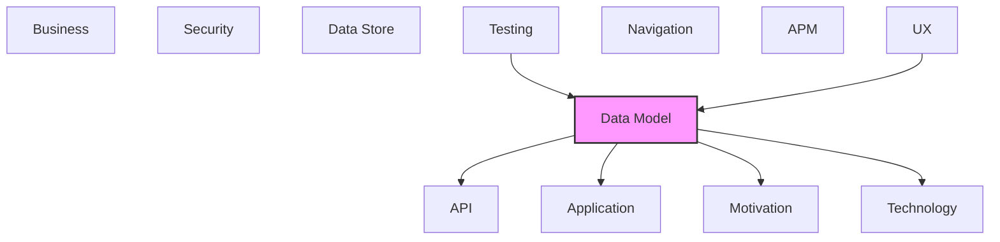

# Data Model

Data entities, relationships, and data structure definitions.

## Report Index

- [Layer Introduction](#layer-introduction)
- [Intra-Layer Relationships](#intra-layer-relationships)
- [Inter-Layer Dependencies](#inter-layer-dependencies)
- [Inter-Layer Relationships Table](#inter-layer-relationships-table)
- [Element Reference](#element-reference)

## Layer Introduction

| Metric                    | Count |
| ------------------------- | ----- |
| Elements                  | 75    |
| Intra-Layer Relationships | 55    |
| Inter-Layer Relationships | 42    |
| Inbound Relationships     | 21    |
| Outbound Relationships    | 21    |

**Cross-Layer References**:

- **Upstream layers**: [Testing](./12-testing-layer-report.md), [UX](./09-ux-layer-report.md)
- **Downstream layers**: [API](./06-api-layer-report.md), [Application](./04-application-layer-report.md), [Motivation](./01-motivation-layer-report.md), [Technology](./05-technology-layer-report.md)

## Intra-Layer Relationships

*This layer has >30 elements. Summary table shown instead of diagram.*

| Element                                              | Type               | Relationships |
| ---------------------------------------------------- | ------------------ | ------------- |
| `data-model.objectschema.agent`                      | `objectschema`     | 5             |
| `data-model.objectschema.agent-api-dtos`             | `objectschema`     | 1             |
| `data-model.objectschema.agent-capability`           | `objectschema`     | 1             |
| `data-model.objectschema.agent-execution`            | `objectschema`     | 10            |
| `data-model.objectschema.board-events`               | `objectschema`     | 1             |
| `data-model.objectschema.board-workflow-template`    | `objectschema`     | 1             |
| `data-model.objectschema.branch-events`              | `objectschema`     | 1             |
| `data-model.objectschema.ci-pipeline-events`         | `objectschema`     | 1             |
| `data-model.objectschema.comment`                    | `objectschema`     | 2             |
| `data-model.objectschema.config-api-dtos`            | `objectschema`     | 1             |
| `data-model.objectschema.container-config`           | `objectschema`     | 1             |
| `data-model.objectschema.container-events`           | `objectschema`     | 1             |
| `data-model.objectschema.container-recovery-events`  | `objectschema`     | 1             |
| `data-model.objectschema.conversational-session`     | `objectschema`     | 1             |
| `data-model.objectschema.cycle-result`               | `objectschema`     | 2             |
| `data-model.objectschema.discussion-events`          | `objectschema`     | 1             |
| `data-model.objectschema.execution-api-dtos`         | `objectschema`     | 1             |
| `data-model.objectschema.execution-context`          | `objectschema`     | 4             |
| `data-model.objectschema.execution-events`           | `objectschema`     | 1             |
| `data-model.objectschema.execution-result`           | `objectschema`     | 1             |
| `data-model.objectschema.lock-events`                | `objectschema`     | 1             |
| `data-model.objectschema.pipeline-stage`             | `objectschema`     | 4             |
| `data-model.objectschema.pr-review-cycle-events`     | `objectschema`     | 1             |
| `data-model.objectschema.project-config`             | `objectschema`     | 3             |
| `data-model.objectschema.project-context`            | `objectschema`     | 2             |
| `data-model.objectschema.project-events`             | `objectschema`     | 1             |
| `data-model.objectschema.prreview-cycle-result`      | `objectschema`     | 1             |
| `data-model.objectschema.prreview-cycle-state`       | `objectschema`     | 3             |
| `data-model.objectschema.queue-events`               | `objectschema`     | 1             |
| `data-model.objectschema.repair-cycle-checkpoint`    | `objectschema`     | 1             |
| `data-model.objectschema.repair-cycle-events`        | `objectschema`     | 1             |
| `data-model.objectschema.repair-cycle-result`        | `objectschema`     | 5             |
| `data-model.objectschema.repair-cycle-stage-config`  | `objectschema`     | 0             |
| `data-model.objectschema.repair-test-result`         | `objectschema`     | 2             |
| `data-model.objectschema.repository-events`          | `objectschema`     | 1             |
| `data-model.objectschema.review-cycle`               | `objectschema`     | 4             |
| `data-model.objectschema.review-cycle-events`        | `objectschema`     | 1             |
| `data-model.objectschema.review-events`              | `objectschema`     | 1             |
| `data-model.objectschema.storage-events`             | `objectschema`     | 1             |
| `data-model.objectschema.systemic-analysis-result`   | `objectschema`     | 1             |
| `data-model.objectschema.token-usage`                | `objectschema`     | 1             |
| `data-model.objectschema.user`                       | `objectschema`     | 1             |
| `data-model.objectschema.verification-result`        | `objectschema`     | 0             |
| `data-model.objectschema.work-item`                  | `objectschema`     | 7             |
| `data-model.objectschema.work-item-api-dtos`         | `objectschema`     | 1             |
| `data-model.objectschema.work-item-events`           | `objectschema`     | 1             |
| `data-model.objectschema.workflow`                   | `objectschema`     | 4             |
| `data-model.objectschema.workflow-api-dtos`          | `objectschema`     | 1             |
| `data-model.objectschema.workflow-template`          | `objectschema`     | 3             |
| `data-model.objectschema.workspace-context`          | `objectschema`     | 2             |
| `data-model.schemadefinition.agent-id`               | `schemadefinition` | 1             |
| `data-model.schemadefinition.agent-type`             | `schemadefinition` | 1             |
| `data-model.schemadefinition.branch-resolution`      | `schemadefinition` | 0             |
| `data-model.schemadefinition.column-type`            | `schemadefinition` | 0             |
| `data-model.schemadefinition.commit-policy`          | `schemadefinition` | 0             |
| `data-model.schemadefinition.execution-id`           | `schemadefinition` | 1             |
| `data-model.schemadefinition.execution-status`       | `schemadefinition` | 1             |
| `data-model.schemadefinition.failure-classification` | `schemadefinition` | 0             |
| `data-model.schemadefinition.permission`             | `schemadefinition` | 0             |
| `data-model.schemadefinition.prreview-outcome`       | `schemadefinition` | 0             |
| `data-model.schemadefinition.prreview-status`        | `schemadefinition` | 0             |
| `data-model.schemadefinition.repair-test-type`       | `schemadefinition` | 0             |
| `data-model.schemadefinition.review-decision`        | `schemadefinition` | 0             |
| `data-model.schemadefinition.review-status`          | `schemadefinition` | 0             |
| `data-model.schemadefinition.stage-status`           | `schemadefinition` | 0             |
| `data-model.schemadefinition.stage-type`             | `schemadefinition` | 0             |
| `data-model.schemadefinition.time-range`             | `schemadefinition` | 0             |
| `data-model.schemadefinition.type-safe-id`           | `schemadefinition` | 4             |
| `data-model.schemadefinition.user-role`              | `schemadefinition` | 0             |
| `data-model.schemadefinition.work-item-id`           | `schemadefinition` | 1             |
| `data-model.schemadefinition.work-item-priority`     | `schemadefinition` | 1             |
| `data-model.schemadefinition.work-item-status`       | `schemadefinition` | 4             |
| `data-model.schemadefinition.workflow-id`            | `schemadefinition` | 1             |
| `data-model.schemadefinition.workflow-status`        | `schemadefinition` | 1             |
| `data-model.schemadefinition.workspace-type`         | `schemadefinition` | 0             |

## Inter-Layer Dependencies

## Inter-Layer Relationships Table

| Relationship ID                                                       | Source Node                                          | Dest Node                                                       | Dest Layer    | Predicate    | Cardinality  | Strength |
| --------------------------------------------------------------------- | ---------------------------------------------------- | --------------------------------------------------------------- | ------------- | ------------ | ------------ | -------- |
| `data-model.objectschema.depends-on.technology.systemsoftware`        | `data-model.objectschema.agent-execution`            | `technology.systemsoftware.python-311`                          | `technology`  | `depends-on` | many-to-many | medium   |
| `data-model.objectschema.realizes.motivation.goal`                    | `data-model.objectschema.agent-execution`            | `motivation.goal.complete-observability-via-event-sourcing`     | `motivation`  | `realizes`   | many-to-many | medium   |
| `data-model.objectschema.depends-on.technology.systemsoftware`        | `data-model.objectschema.work-item`                  | `technology.systemsoftware.python-311`                          | `technology`  | `depends-on` | many-to-many | medium   |
| `data-model.objectschema.realizes.motivation.goal`                    | `data-model.objectschema.work-item`                  | `motivation.goal.automate-software-development-workflows`       | `motivation`  | `realizes`   | many-to-many | medium   |
| `data-model.schemadefinition.serves.api.operation`                    | `data-model.schemadefinition.agent-type`             | `api.operation.create-agent`                                    | `api`         | `serves`     | many-to-many | medium   |
| `data-model.schemadefinition.serves.application.applicationcomponent` | `data-model.schemadefinition.column-type`            | `application.applicationcomponent.board-column-event-handler`   | `application` | `serves`     | many-to-many | medium   |
| `data-model.schemadefinition.serves.api.operation`                    | `data-model.schemadefinition.execution-status`       | `api.operation.get-execution`                                   | `api`         | `serves`     | many-to-many | medium   |
| `data-model.schemadefinition.serves.application.applicationcomponent` | `data-model.schemadefinition.failure-classification` | `application.applicationcomponent.repair-cycle-event-handler`   | `application` | `serves`     | many-to-many | medium   |
| `data-model.schemadefinition.serves.application.applicationcomponent` | `data-model.schemadefinition.permission`             | `application.applicationcomponent.board-column-event-handler`   | `application` | `serves`     | many-to-many | medium   |
| `data-model.schemadefinition.serves.application.applicationcomponent` | `data-model.schemadefinition.prreview-outcome`       | `application.applicationcomponent.prreview-cycle-event-handler` | `application` | `serves`     | many-to-many | medium   |
| `data-model.schemadefinition.serves.application.applicationcomponent` | `data-model.schemadefinition.prreview-status`        | `application.applicationcomponent.prreview-cycle-event-handler` | `application` | `serves`     | many-to-many | medium   |
| `data-model.schemadefinition.serves.application.applicationcomponent` | `data-model.schemadefinition.repair-test-type`       | `application.applicationcomponent.repair-cycle-event-handler`   | `application` | `serves`     | many-to-many | medium   |
| `data-model.schemadefinition.serves.application.applicationcomponent` | `data-model.schemadefinition.review-decision`        | `application.applicationcomponent.review-event-handler`         | `application` | `serves`     | many-to-many | medium   |
| `data-model.schemadefinition.serves.application.applicationcomponent` | `data-model.schemadefinition.review-status`          | `application.applicationcomponent.review-event-handler`         | `application` | `serves`     | many-to-many | medium   |
| `data-model.schemadefinition.serves.application.applicationcomponent` | `data-model.schemadefinition.stage-status`           | `application.applicationcomponent.workflow-event-handler`       | `application` | `serves`     | many-to-many | medium   |
| `data-model.schemadefinition.serves.application.applicationcomponent` | `data-model.schemadefinition.stage-type`             | `application.applicationcomponent.workflow-event-handler`       | `application` | `serves`     | many-to-many | medium   |
| `data-model.schemadefinition.serves.application.applicationcomponent` | `data-model.schemadefinition.user-role`              | `application.applicationcomponent.board-column-event-handler`   | `application` | `serves`     | many-to-many | medium   |
| `data-model.schemadefinition.serves.api.operation`                    | `data-model.schemadefinition.work-item-priority`     | `api.operation.create-work-item`                                | `api`         | `serves`     | many-to-many | medium   |
| `data-model.schemadefinition.serves.api.operation`                    | `data-model.schemadefinition.work-item-status`       | `api.operation.update-work-item`                                | `api`         | `serves`     | many-to-many | medium   |
| `data-model.schemadefinition.serves.api.operation`                    | `data-model.schemadefinition.workflow-status`        | `api.operation.get-workflow-run`                                | `api`         | `serves`     | many-to-many | medium   |
| `data-model.schemadefinition.serves.application.applicationcomponent` | `data-model.schemadefinition.workspace-type`         | `application.applicationcomponent.execution-event-handler`      | `application` | `serves`     | many-to-many | medium   |
| `testing.testcoveragemodel.covers.data-model.objectschema`            | `testing.testcoveragemodel.domain-model-unit-tests`  | `data-model.objectschema.agent-execution`                       | `data-model`  | `covers`     | many-to-many | medium   |
| `testing.testcoveragemodel.covers.data-model.objectschema`            | `testing.testcoveragemodel.domain-model-unit-tests`  | `data-model.objectschema.review-cycle`                          | `data-model`  | `covers`     | many-to-many | medium   |
| `testing.testcoveragemodel.covers.data-model.objectschema`            | `testing.testcoveragemodel.domain-model-unit-tests`  | `data-model.objectschema.work-item`                             | `data-model`  | `covers`     | many-to-many | medium   |
| `testing.testcoveragemodel.covers.data-model.objectschema`            | `testing.testcoveragemodel.domain-model-unit-tests`  | `data-model.objectschema.workflow`                              | `data-model`  | `covers`     | many-to-many | medium   |
| `testing.testcoveragemodel.covers.data-model.objectschema`            | `testing.testcoveragemodel.event-domain-unit-tests`  | `data-model.objectschema.agent-execution`                       | `data-model`  | `covers`     | many-to-many | medium   |
| `testing.testcoveragemodel.covers.data-model.objectschema`            | `testing.testcoveragemodel.event-domain-unit-tests`  | `data-model.objectschema.review-cycle`                          | `data-model`  | `covers`     | many-to-many | medium   |
| `testing.testcoveragemodel.covers.data-model.objectschema`            | `testing.testcoveragemodel.event-domain-unit-tests`  | `data-model.objectschema.work-item`                             | `data-model`  | `covers`     | many-to-many | medium   |
| `testing.testcoveragemodel.covers.data-model.objectschema`            | `testing.testcoveragemodel.event-domain-unit-tests`  | `data-model.objectschema.workflow`                              | `data-model`  | `covers`     | many-to-many | medium   |
| `testing.testcoveragemodel.covers.data-model.objectschema`            | `testing.testcoveragemodel.integration-tests`        | `data-model.objectschema.agent-execution`                       | `data-model`  | `covers`     | many-to-many | medium   |
| `ux.view.references.data-model.objectschema`                          | `ux.view.agent-config`                               | `data-model.objectschema.agent`                                 | `data-model`  | `references` | many-to-many | medium   |
| `ux.view.references.data-model.objectschema`                          | `ux.view.agent-config`                               | `data-model.objectschema.agent-capability`                      | `data-model`  | `references` | many-to-many | medium   |
| `ux.view.references.data-model.objectschema`                          | `ux.view.config-history`                             | `data-model.objectschema.project-config`                        | `data-model`  | `references` | many-to-many | medium   |
| `ux.view.references.data-model.objectschema`                          | `ux.view.dashboard`                                  | `data-model.objectschema.agent-execution`                       | `data-model`  | `references` | many-to-many | medium   |
| `ux.view.references.data-model.objectschema`                          | `ux.view.dashboard`                                  | `data-model.objectschema.work-item`                             | `data-model`  | `references` | many-to-many | medium   |
| `ux.view.references.data-model.objectschema`                          | `ux.view.pipeline-flow`                              | `data-model.objectschema.agent-execution`                       | `data-model`  | `references` | many-to-many | medium   |
| `ux.view.references.data-model.objectschema`                          | `ux.view.pipeline-flow`                              | `data-model.objectschema.workflow`                              | `data-model`  | `references` | many-to-many | medium   |
| `ux.view.references.data-model.objectschema`                          | `ux.view.pipeline-run-details`                       | `data-model.objectschema.agent-execution`                       | `data-model`  | `references` | many-to-many | medium   |
| `ux.view.references.data-model.objectschema`                          | `ux.view.pipeline-run-details`                       | `data-model.objectschema.work-item`                             | `data-model`  | `references` | many-to-many | medium   |
| `ux.view.references.data-model.objectschema`                          | `ux.view.project-config`                             | `data-model.objectschema.project-config`                        | `data-model`  | `references` | many-to-many | medium   |
| `ux.view.references.data-model.objectschema`                          | `ux.view.workflow-config`                            | `data-model.objectschema.workflow`                              | `data-model`  | `references` | many-to-many | medium   |
| `ux.view.references.data-model.objectschema`                          | `ux.view.workflow-config`                            | `data-model.objectschema.workflow-template`                     | `data-model`  | `references` | many-to-many | medium   |

## Element Reference

### Agent {#agent}

**ID**: `data-model.objectschema.agent`

**Type**: `objectschema`

AI agent definition with capabilities, type, and execution configuration

#### Relationships

| Type        | Related Element                            | Predicate    | Direction |
| ----------- | ------------------------------------------ | ------------ | --------- |
| inter-layer | `ux.view.agent-config`                     | `references` | inbound   |
| intra-layer | `data-model.objectschema.agent-api-dtos`   | `extends`    | inbound   |
| intra-layer | `data-model.objectschema.agent-capability` | `extends`    | inbound   |
| intra-layer | `data-model.objectschema.agent-execution`  | `extends`    | inbound   |
| intra-layer | `data-model.objectschema.work-item`        | `extends`    | outbound  |
| intra-layer | `data-model.objectschema.user`             | `extends`    | inbound   |

### Agent API DTOs {#agent-api-dtos}

**ID**: `data-model.objectschema.agent-api-dtos`

**Type**: `objectschema`

Pydantic request/response schemas for Agent REST API: CreateAgentRequest, UpdateAgentRequest, AgentResponse, AgentListResponse

#### Relationships

| Type        | Related Element                 | Predicate | Direction |
| ----------- | ------------------------------- | --------- | --------- |
| intra-layer | `data-model.objectschema.agent` | `extends` | outbound  |

### AgentCapability {#agentcapability}

**ID**: `data-model.objectschema.agent-capability`

**Type**: `objectschema`

Represents a specific skill or capability of an agent with proficiency level

#### Relationships

| Type        | Related Element                 | Predicate    | Direction |
| ----------- | ------------------------------- | ------------ | --------- |
| inter-layer | `ux.view.agent-config`          | `references` | inbound   |
| intra-layer | `data-model.objectschema.agent` | `extends`    | outbound  |

### AgentExecution {#agentexecution}

**ID**: `data-model.objectschema.agent-execution`

**Type**: `objectschema`

Instance of an agent working on a work item, tracking execution lifecycle, logs, and results

#### Relationships

| Type        | Related Element                                             | Predicate    | Direction |
| ----------- | ----------------------------------------------------------- | ------------ | --------- |
| inter-layer | `technology.systemsoftware.python-311`                      | `depends-on` | outbound  |
| inter-layer | `motivation.goal.complete-observability-via-event-sourcing` | `realizes`   | outbound  |
| inter-layer | `testing.testcoveragemodel.domain-model-unit-tests`         | `covers`     | inbound   |
| inter-layer | `testing.testcoveragemodel.event-domain-unit-tests`         | `covers`     | inbound   |
| inter-layer | `testing.testcoveragemodel.integration-tests`               | `covers`     | inbound   |
| inter-layer | `ux.view.dashboard`                                         | `references` | inbound   |
| inter-layer | `ux.view.pipeline-flow`                                     | `references` | inbound   |
| inter-layer | `ux.view.pipeline-run-details`                              | `references` | inbound   |
| intra-layer | `data-model.objectschema.agent`                             | `extends`    | outbound  |
| intra-layer | `data-model.objectschema.branch-events`                     | `extends`    | inbound   |
| intra-layer | `data-model.objectschema.execution-api-dtos`                | `extends`    | inbound   |
| intra-layer | `data-model.objectschema.execution-context`                 | `extends`    | inbound   |
| intra-layer | `data-model.objectschema.execution-events`                  | `extends`    | inbound   |
| intra-layer | `data-model.objectschema.execution-result`                  | `extends`    | inbound   |
| intra-layer | `data-model.objectschema.pipeline-stage`                    | `extends`    | inbound   |
| intra-layer | `data-model.objectschema.repository-events`                 | `extends`    | inbound   |
| intra-layer | `data-model.objectschema.review-cycle`                      | `extends`    | inbound   |
| intra-layer | `data-model.objectschema.token-usage`                       | `extends`    | inbound   |

### Board Events {#board-events}

**ID**: `data-model.objectschema.board-events`

**Type**: `objectschema`

Domain events for board and work item column transitions: WorkItemColumnChangedEvent (work_item_id, project_id, board_id, from_column, to_column, moved_by), WorkItemPositionChangedEvent (column_name, old_position, new_position), BoardReconciledEvent (columns_added, columns_removed, items_moved), ColumnSLAExceededEvent (column_name, elapsed_seconds, sla_threshold_seconds, entered_at). All extend BaseDomainEvent with event_id and occurred_at.

#### Attributes

| Name       | Value                                                                                                                                                                                                                                                                                                                                                                                       |
| ---------- | ------------------------------------------------------------------------------------------------------------------------------------------------------------------------------------------------------------------------------------------------------------------------------------------------------------------------------------------------------------------------------------------- |
| properties | `{"event_id":{"type":"string"},"occurred_at":{"type":"string","format":"date-time"},"project_id":{"type":"string"},"board_id":{"type":"string"},"work_item_id":{"type":"string"},"from_column":{"type":"string"},"to_column":{"type":"string"},"moved_by":{"type":"string"},"column_name":{"type":"string"},"elapsed_seconds":{"type":"number"},"sla_threshold_seconds":{"type":"number"}}` |
| type       | object                                                                                                                                                                                                                                                                                                                                                                                      |

#### Relationships

| Type        | Related Element                    | Predicate | Direction |
| ----------- | ---------------------------------- | --------- | --------- |
| intra-layer | `data-model.objectschema.workflow` | `extends` | outbound  |

### BoardWorkflowTemplate {#boardworkflowtemplate}

**ID**: `data-model.objectschema.board-workflow-template`

**Type**: `objectschema`

Board-level workflow template associating columns to pipeline stages with reconciliation configuration

#### Relationships

| Type        | Related Element                             | Predicate | Direction |
| ----------- | ------------------------------------------- | --------- | --------- |
| intra-layer | `data-model.objectschema.workflow-template` | `extends` | outbound  |

### Branch Events {#branch-events}

**ID**: `data-model.objectschema.branch-events`

**Type**: `objectschema`

Domain events for branch resolution lifecycle: BranchResolvedEvent (project_id, issue_id, action, branch_name, confidence, reason, parent_issue_id, resolution_strategy), BranchReusedEvent (same fields for branch reuse decisions), BranchResolutionCreatedEvent (branch creation confirmation). All frozen dataclasses extending BaseDomainEvent.

#### Attributes

| Name       | Value                                                                                                                                                                                                                                                                                                                                              |
| ---------- | -------------------------------------------------------------------------------------------------------------------------------------------------------------------------------------------------------------------------------------------------------------------------------------------------------------------------------------------------- |
| properties | `{"event_id":{"type":"string"},"occurred_at":{"type":"string","format":"date-time"},"project_id":{"type":"string"},"issue_id":{"type":"string"},"action":{"type":"string"},"branch_name":{"type":"string"},"confidence":{"type":"number"},"reason":{"type":"string"},"parent_issue_id":{"type":"string"},"resolution_strategy":{"type":"string"}}` |
| type       | object                                                                                                                                                                                                                                                                                                                                             |

#### Relationships

| Type        | Related Element                           | Predicate | Direction |
| ----------- | ----------------------------------------- | --------- | --------- |
| intra-layer | `data-model.objectschema.agent-execution` | `extends` | outbound  |

### CI Pipeline Events {#ci-pipeline-events}

**ID**: `data-model.objectschema.ci-pipeline-events`

**Type**: `objectschema`

Domain events for CI/CD pipeline runs: CIPipelineStatusCheckedEvent (pr_id, project_id, status, check_count, passed_count, failed_count, pending_count), CIRunStartedEvent (workflow_run_id, working_directory, timeout_seconds, checks_planned), CIRunCompletedEvent (workflow_run_id, passed_count, failure_count, warning_count, output). Emitted by CIRunnerAdapter on GitHub Actions workflow runs.

#### Attributes

| Name       | Value                                                                                                                                                                                                                                                                                                                                                                            |
| ---------- | -------------------------------------------------------------------------------------------------------------------------------------------------------------------------------------------------------------------------------------------------------------------------------------------------------------------------------------------------------------------------------- |
| properties | `{"event_id":{"type":"string"},"occurred_at":{"type":"string","format":"date-time"},"project_id":{"type":"string"},"pr_id":{"type":"string"},"workflow_run_id":{"type":"string"},"status":{"type":"string"},"check_count":{"type":"integer"},"passed_count":{"type":"integer"},"failed_count":{"type":"integer"},"pending_count":{"type":"integer"},"output":{"type":"string"}}` |
| type       | object                                                                                                                                                                                                                                                                                                                                                                           |

#### Relationships

| Type        | Related Element                             | Predicate | Direction |
| ----------- | ------------------------------------------- | --------- | --------- |
| intra-layer | `data-model.objectschema.execution-context` | `extends` | outbound  |

### Comment {#comment}

**ID**: `data-model.objectschema.comment`

**Type**: `objectschema`

Comment on a work item with author identity and content

#### Relationships

| Type        | Related Element                             | Predicate | Direction |
| ----------- | ------------------------------------------- | --------- | --------- |
| intra-layer | `data-model.objectschema.work-item`         | `extends` | outbound  |
| intra-layer | `data-model.objectschema.discussion-events` | `extends` | inbound   |

### Config API DTOs {#config-api-dtos}

**ID**: `data-model.objectschema.config-api-dtos`

**Type**: `objectschema`

Pydantic request/response schemas for configuration management: project config, agent config, pipeline config DTOs

#### Relationships

| Type        | Related Element                          | Predicate | Direction |
| ----------- | ---------------------------------------- | --------- | --------- |
| intra-layer | `data-model.objectschema.project-config` | `extends` | outbound  |

### ContainerConfig {#containerconfig}

**ID**: `data-model.objectschema.container-config`

**Type**: `objectschema`

Value object for Docker container configuration: image (Docker image reference), name, command, entrypoint, working_dir, user (UID), environment (env vars map), volumes (host:container mount map), network, auto_remove (cleanup on exit), detached (run in background), stdin_open. Used by IContainer implementations when launching agent execution containers.

#### Attributes

| Name       | Value                                                                                                                                                                                                                                                                                                                                                       |
| ---------- | ----------------------------------------------------------------------------------------------------------------------------------------------------------------------------------------------------------------------------------------------------------------------------------------------------------------------------------------------------------- |
| properties | `{"image":{"type":"string"},"name":{"type":"string"},"command":{"type":"array","items":{"type":"string"}},"working_dir":{"type":"string"},"user":{"type":"string"},"environment":{"type":"object"},"volumes":{"type":"object"},"network":{"type":"string"},"auto_remove":{"type":"boolean"},"detached":{"type":"boolean"},"stdin_open":{"type":"boolean"}}` |
| type       | object                                                                                                                                                                                                                                                                                                                                                      |

#### Relationships

| Type        | Related Element                             | Predicate | Direction |
| ----------- | ------------------------------------------- | --------- | --------- |
| intra-layer | `data-model.objectschema.execution-context` | `extends` | outbound  |

### Container Events {#container-events}

**ID**: `data-model.objectschema.container-events`

**Type**: `objectschema`

Domain events for container execution lifecycle: ContainerExecutionCompletedEvent (container_id, command, exit_code, output_files, project_id). Emitted when agent container finishes execution; output_files lists paths written during the run.

#### Attributes

| Name       | Value                                                                                                                                                                                                                                                                      |
| ---------- | -------------------------------------------------------------------------------------------------------------------------------------------------------------------------------------------------------------------------------------------------------------------------- |
| properties | `{"event_id":{"type":"string"},"occurred_at":{"type":"string","format":"date-time"},"container_id":{"type":"string"},"project_id":{"type":"string"},"command":{"type":"string"},"exit_code":{"type":"integer"},"output_files":{"type":"array","items":{"type":"string"}}}` |
| type       | object                                                                                                                                                                                                                                                                     |

#### Relationships

| Type        | Related Element                             | Predicate | Direction |
| ----------- | ------------------------------------------- | --------- | --------- |
| intra-layer | `data-model.objectschema.execution-context` | `extends` | outbound  |

### Container Recovery Events {#container-recovery-events}

**ID**: `data-model.objectschema.container-recovery-events`

**Type**: `objectschema`

Domain events for container failure recovery: ContainerRecoveredEvent (container_id, container_name, project_id, agent_id, work_item_id, execution_id, uptime_seconds, recovery_action), ContainerKilledEvent (kill_reason, execution_marked_failed), ContainerRecoveryCompletedEvent (containers_recovered, containers_killed, errors_encountered, repair_cycles_processed, duration_seconds). Emitted by ContainerRecoveryService.

#### Attributes

| Name       | Value                                                                                                                                                                                                                                                                                                                                                                                                                                       |
| ---------- | ------------------------------------------------------------------------------------------------------------------------------------------------------------------------------------------------------------------------------------------------------------------------------------------------------------------------------------------------------------------------------------------------------------------------------------------- |
| properties | `{"event_id":{"type":"string"},"occurred_at":{"type":"string","format":"date-time"},"container_id":{"type":"string"},"container_name":{"type":"string"},"project_id":{"type":"string"},"agent_id":{"type":"string"},"work_item_id":{"type":"string"},"execution_id":{"type":"string"},"uptime_seconds":{"type":"number"},"recovery_action":{"type":"string"},"kill_reason":{"type":"string"},"execution_marked_failed":{"type":"boolean"}}` |
| type       | object                                                                                                                                                                                                                                                                                                                                                                                                                                      |

#### Relationships

| Type        | Related Element                               | Predicate | Direction |
| ----------- | --------------------------------------------- | --------- | --------- |
| intra-layer | `data-model.objectschema.repair-cycle-result` | `extends` | outbound  |

### ConversationalSession {#conversationalsession}

**ID**: `data-model.objectschema.conversational-session`

**Type**: `objectschema`

Multi-turn conversational session state for agent dialogue management

#### Relationships

| Type        | Related Element                     | Predicate | Direction |
| ----------- | ----------------------------------- | --------- | --------- |
| intra-layer | `data-model.objectschema.work-item` | `extends` | outbound  |

### CycleResult {#cycleresult}

**ID**: `data-model.objectschema.cycle-result`

**Type**: `objectschema`

Immutable result of a single repair iteration cycle (test + fix attempt). Captures the RepairTestResult before fixing, whether a fix was attempted, repair agent output, and the RepairTestResult after fixing. Enables per-iteration analysis of repair effectiveness.

#### Attributes

| Name | Value  |
| ---- | ------ |
| type | object |

#### Relationships

| Type        | Related Element                                    | Predicate | Direction |
| ----------- | -------------------------------------------------- | --------- | --------- |
| intra-layer | `data-model.objectschema.repair-test-result`       | `extends` | outbound  |
| intra-layer | `data-model.objectschema.systemic-analysis-result` | `extends` | inbound   |

### Discussion Events {#discussion-events}

**ID**: `data-model.objectschema.discussion-events`

**Type**: `objectschema`

Domain events for conversational loop and comment handling: CommentNeedsResponseEvent (work_item_id, project_id, comment: Comment, context: CommentContext), CommentPostedEvent, AgentResponsePostedEvent (comment_id, response_comment_id, agent_name, conversation_id), ConversationalLoopStartedEvent (session_id, agent_assignment, column_name), FeedbackListeningStartedEvent, FeedbackListeningStoppedEvent (feedback_type). Used by ConversationalLoopOrchestrator.

#### Attributes

| Name       | Value                                                                                                                                                                                                                                                                                                                                                    |
| ---------- | -------------------------------------------------------------------------------------------------------------------------------------------------------------------------------------------------------------------------------------------------------------------------------------------------------------------------------------------------------- |
| properties | `{"event_id":{"type":"string"},"occurred_at":{"type":"string","format":"date-time"},"work_item_id":{"type":"string"},"project_id":{"type":"string"},"session_id":{"type":"string"},"agent_name":{"type":"string"},"conversation_id":{"type":"string"},"comment_id":{"type":"string"},"column_name":{"type":"string"},"feedback_type":{"type":"string"}}` |
| type       | object                                                                                                                                                                                                                                                                                                                                                   |

#### Relationships

| Type        | Related Element                   | Predicate | Direction |
| ----------- | --------------------------------- | --------- | --------- |
| intra-layer | `data-model.objectschema.comment` | `extends` | outbound  |

### Execution API DTOs {#execution-api-dtos}

**ID**: `data-model.objectschema.execution-api-dtos`

**Type**: `objectschema`

Pydantic request/response schemas for Execution REST API: ExecutionResponse, ExecutionLogsResponse, ExecutionHistoryResponse

#### Relationships

| Type        | Related Element                           | Predicate | Direction |
| ----------- | ----------------------------------------- | --------- | --------- |
| intra-layer | `data-model.objectschema.agent-execution` | `extends` | outbound  |

### ExecutionContext {#executioncontext}

**ID**: `data-model.objectschema.execution-context`

**Type**: `objectschema`

Value object carrying agent execution context into a pipeline stage: work_item_id, workflow_id, stage_name, agent_id, model (LLM model name), timeout_seconds, workspace_type (WorkspaceType enum), branch_name, discussion_id (for conversational loops), project_id, repository_url, tech_stack list. Passed from WorkflowOrchestrator to agent executor.

#### Attributes

| Name       | Value                                                                                                                                                                                                                                                                                                                                                                                                                          |
| ---------- | ------------------------------------------------------------------------------------------------------------------------------------------------------------------------------------------------------------------------------------------------------------------------------------------------------------------------------------------------------------------------------------------------------------------------------ |
| properties | `{"work_item_id":{"type":"string"},"workflow_id":{"type":"string"},"stage_name":{"type":"string"},"agent_id":{"type":"string"},"model":{"type":"string"},"timeout_seconds":{"type":"integer"},"workspace_type":{"type":"string"},"branch_name":{"type":"string"},"discussion_id":{"type":"string"},"project_id":{"type":"string"},"repository_url":{"type":"string"},"tech_stack":{"type":"array","items":{"type":"string"}}}` |
| type       | object                                                                                                                                                                                                                                                                                                                                                                                                                         |

#### Relationships

| Type        | Related Element                              | Predicate | Direction |
| ----------- | -------------------------------------------- | --------- | --------- |
| intra-layer | `data-model.objectschema.ci-pipeline-events` | `extends` | inbound   |
| intra-layer | `data-model.objectschema.container-config`   | `extends` | inbound   |
| intra-layer | `data-model.objectschema.container-events`   | `extends` | inbound   |
| intra-layer | `data-model.objectschema.agent-execution`    | `extends` | outbound  |

### Execution Events {#execution-events}

**ID**: `data-model.objectschema.execution-events`

**Type**: `objectschema`

Domain events for agent execution lifecycle: ExecutionTimedOutEvent (execution_id, work_item_id, timeout_seconds, started_at). Emitted when an agent execution exceeds its configured timeout; triggers recovery or failure handling in ExecutionService.

#### Attributes

| Name       | Value                                                                                                                                                                                                                                            |
| ---------- | ------------------------------------------------------------------------------------------------------------------------------------------------------------------------------------------------------------------------------------------------ |
| properties | `{"event_id":{"type":"string"},"occurred_at":{"type":"string","format":"date-time"},"execution_id":{"type":"string"},"work_item_id":{"type":"string"},"timeout_seconds":{"type":"integer"},"started_at":{"type":"string","format":"date-time"}}` |
| type       | object                                                                                                                                                                                                                                           |

#### Relationships

| Type        | Related Element                           | Predicate | Direction |
| ----------- | ----------------------------------------- | --------- | --------- |
| intra-layer | `data-model.objectschema.agent-execution` | `extends` | outbound  |

### ExecutionResult {#executionresult}

**ID**: `data-model.objectschema.execution-result`

**Type**: `objectschema`

Value object for agent execution output: success (bool), exit_code, output (stdout), error_message (stderr or exception), input_tokens, output_tokens, duration_seconds, timestamp, modified_files, added_files, deleted_files (git-tracked changes), session_id (Claude conversation session). Returned by ILLMProvider and stored on AgentExecution.

#### Attributes

| Name       | Value                                                                                                                                                                                                                                                                                                                                                                                                                                                                                                    |
| ---------- | -------------------------------------------------------------------------------------------------------------------------------------------------------------------------------------------------------------------------------------------------------------------------------------------------------------------------------------------------------------------------------------------------------------------------------------------------------------------------------------------------------- |
| properties | `{"success":{"type":"boolean"},"exit_code":{"type":"integer"},"output":{"type":"string"},"error_message":{"type":"string"},"input_tokens":{"type":"integer"},"output_tokens":{"type":"integer"},"duration_seconds":{"type":"number"},"timestamp":{"type":"string","format":"date-time"},"modified_files":{"type":"array","items":{"type":"string"}},"added_files":{"type":"array","items":{"type":"string"}},"deleted_files":{"type":"array","items":{"type":"string"}},"session_id":{"type":"string"}}` |
| type       | object                                                                                                                                                                                                                                                                                                                                                                                                                                                                                                   |

#### Relationships

| Type        | Related Element                           | Predicate | Direction |
| ----------- | ----------------------------------------- | --------- | --------- |
| intra-layer | `data-model.objectschema.agent-execution` | `extends` | outbound  |

### Lock Events {#lock-events}

**ID**: `data-model.objectschema.lock-events`

**Type**: `objectschema`

Domain events for pipeline lock and queue management: LockAcquiredEvent (project_id, board_id, work_item_id, acquisition_method), LockReleasedEvent (reason, next_in_queue), StaleLockDetectedEvent (lock_acquired_at), PipelineLockAcquiredEvent (queue_length_at_acquire), PipelineLockReleasedEvent (next_work_item_id), LockStuckEvent (reason), WorkItemQueuedEvent (queue_position). Emitted by IPipelineLockService to coordinate single-pipeline execution.

#### Attributes

| Name       | Value                                                                                                                                                                                                                                                                                                                                                                                                         |
| ---------- | ------------------------------------------------------------------------------------------------------------------------------------------------------------------------------------------------------------------------------------------------------------------------------------------------------------------------------------------------------------------------------------------------------------- |
| properties | `{"event_id":{"type":"string"},"occurred_at":{"type":"string","format":"date-time"},"project_id":{"type":"string"},"board_id":{"type":"string"},"work_item_id":{"type":"string"},"acquisition_method":{"type":"string"},"reason":{"type":"string"},"next_in_queue":{"type":"string"},"queue_length_at_acquire":{"type":"integer"},"next_work_item_id":{"type":"string"},"queue_position":{"type":"integer"}}` |
| type       | object                                                                                                                                                                                                                                                                                                                                                                                                        |

#### Relationships

| Type        | Related Element                          | Predicate | Direction |
| ----------- | ---------------------------------------- | --------- | --------- |
| intra-layer | `data-model.objectschema.pipeline-stage` | `extends` | outbound  |

### PipelineStage {#pipelinestage}

**ID**: `data-model.objectschema.pipeline-stage`

**Type**: `objectschema`

Individual stage in a workflow pipeline with entry conditions, agent config, and status tracking

#### Relationships

| Type        | Related Element                           | Predicate | Direction |
| ----------- | ----------------------------------------- | --------- | --------- |
| intra-layer | `data-model.objectschema.lock-events`     | `extends` | inbound   |
| intra-layer | `data-model.objectschema.agent-execution` | `extends` | outbound  |
| intra-layer | `data-model.objectschema.queue-events`    | `extends` | inbound   |
| intra-layer | `data-model.objectschema.workflow`        | `extends` | inbound   |

### PR Review Cycle Events {#pr-review-cycle-events}

**ID**: `data-model.objectschema.pr-review-cycle-events`

**Type**: `objectschema`

Domain events for PR automated review cycles: PRReviewCycleStartedEvent (pr_id, work_item_id, cycle_number, max_outer_cycles, verifier_context_sources, phases_planned, workflow_run_id), PRReviewCyclePhaseStartedEvent, PRReviewCycleCICheckCompletedEvent, PRReviewCycleApprovedEvent (cycle_duration_seconds, next_column), PRReviewCycleIssuesFoundEvent (total/critical/high/medium/low findings, sub_issue_count), PRReviewCycleMaxCyclesReachedEvent, PRReviewCycleEscalatedEvent, PRReviewCycleSubIssuesCreatedEvent, PRReviewCycleConsolidationCompletedEvent. 13 event classes covering all PR review lifecycle phases.

#### Attributes

| Name       | Value                                                                                                                                                                                                                                                                                                                                                                                                                                                                                                     |
| ---------- | --------------------------------------------------------------------------------------------------------------------------------------------------------------------------------------------------------------------------------------------------------------------------------------------------------------------------------------------------------------------------------------------------------------------------------------------------------------------------------------------------------- |
| properties | `{"event_id":{"type":"string"},"occurred_at":{"type":"string","format":"date-time"},"pr_id":{"type":"string"},"work_item_id":{"type":"string"},"workflow_run_id":{"type":"string"},"cycle_number":{"type":"integer"},"max_outer_cycles":{"type":"integer"},"phases_planned":{"type":"array","items":{"type":"string"}},"next_column":{"type":"string"},"total_findings":{"type":"integer"},"critical":{"type":"integer"},"high":{"type":"integer"},"medium":{"type":"integer"},"low":{"type":"integer"}}` |
| type       | object                                                                                                                                                                                                                                                                                                                                                                                                                                                                                                    |

#### Relationships

| Type        | Related Element                                | Predicate | Direction |
| ----------- | ---------------------------------------------- | --------- | --------- |
| intra-layer | `data-model.objectschema.prreview-cycle-state` | `extends` | outbound  |

### ProjectConfig {#projectconfig}

**ID**: `data-model.objectschema.project-config`

**Type**: `objectschema`

Value object containing project configuration including commit policy and project identifiers

#### Relationships

| Type        | Related Element                             | Predicate    | Direction |
| ----------- | ------------------------------------------- | ------------ | --------- |
| inter-layer | `ux.view.config-history`                    | `references` | inbound   |
| inter-layer | `ux.view.project-config`                    | `references` | inbound   |
| intra-layer | `data-model.objectschema.config-api-dtos`   | `extends`    | inbound   |
| intra-layer | `data-model.objectschema.workflow-template` | `extends`    | outbound  |
| intra-layer | `data-model.objectschema.project-context`   | `extends`    | inbound   |

### ProjectContext {#projectcontext}

**ID**: `data-model.objectschema.project-context`

**Type**: `objectschema`

Project-level configuration and context including workflow mappings, docker config, and test configuration

#### Relationships

| Type        | Related Element                          | Predicate | Direction |
| ----------- | ---------------------------------------- | --------- | --------- |
| intra-layer | `data-model.objectschema.project-config` | `extends` | outbound  |
| intra-layer | `data-model.objectschema.project-events` | `extends` | inbound   |

### Project Events {#project-events}

**ID**: `data-model.objectschema.project-events`

**Type**: `objectschema`

Domain events for project lifecycle and orchestration cycles: ProjectClonedEvent (project_name, repo_url, workspace_path, branch), ProjectCloneFailedEvent (error_message, will_retry), ProjectEnabledEvent, ProjectDisabledEvent, OrchestrationCycleCompletedEvent (projects_processed, boards_processed, total_actions, cycle_duration_ms). Emitted by MultiProjectOrchestrator and project management services.

#### Attributes

| Name       | Value                                                                                                                                                                                                                                                                                                                                                                                                                                      |
| ---------- | ------------------------------------------------------------------------------------------------------------------------------------------------------------------------------------------------------------------------------------------------------------------------------------------------------------------------------------------------------------------------------------------------------------------------------------------ |
| properties | `{"event_id":{"type":"string"},"occurred_at":{"type":"string","format":"date-time"},"project_name":{"type":"string"},"repo_url":{"type":"string"},"workspace_path":{"type":"string"},"branch":{"type":"string"},"error_message":{"type":"string"},"will_retry":{"type":"boolean"},"projects_processed":{"type":"integer"},"boards_processed":{"type":"integer"},"total_actions":{"type":"integer"},"cycle_duration_ms":{"type":"number"}}` |
| type       | object                                                                                                                                                                                                                                                                                                                                                                                                                                     |

#### Relationships

| Type        | Related Element                           | Predicate | Direction |
| ----------- | ----------------------------------------- | --------- | --------- |
| intra-layer | `data-model.objectschema.project-context` | `extends` | outbound  |

### PRReviewCycleResult {#prreviewcycleresult}

**ID**: `data-model.objectschema.prreview-cycle-result`

**Type**: `objectschema`

Value object for completed PR review cycle outcome: cycle_number, workflow_run_id, outcome (PRReviewOutcome: ISSUES_FOUND/APPROVED/MAX_CYCLES_REACHED), phase_outputs, all_findings (list of PRReviewFinding), sub_issues_created (count), ci_passed (bool), total_findings, critical_count, high_count, medium_count, low_count. Returned by PR review cycle service after all phases complete.

#### Attributes

| Name       | Value                                                                                                                                                                                                                                                                                                                                                                                                                                                                      |
| ---------- | -------------------------------------------------------------------------------------------------------------------------------------------------------------------------------------------------------------------------------------------------------------------------------------------------------------------------------------------------------------------------------------------------------------------------------------------------------------------------- |
| properties | `{"cycle_number":{"type":"integer"},"workflow_run_id":{"type":"string"},"outcome":{"type":"string"},"phase_outputs":{"type":"array","items":{"type":"object"}},"all_findings":{"type":"array","items":{"type":"object"}},"sub_issues_created":{"type":"integer"},"ci_passed":{"type":"boolean"},"total_findings":{"type":"integer"},"critical_count":{"type":"integer"},"high_count":{"type":"integer"},"medium_count":{"type":"integer"},"low_count":{"type":"integer"}}` |
| type       | object                                                                                                                                                                                                                                                                                                                                                                                                                                                                     |

#### Relationships

| Type        | Related Element                                | Predicate | Direction |
| ----------- | ---------------------------------------------- | --------- | --------- |
| intra-layer | `data-model.objectschema.prreview-cycle-state` | `extends` | outbound  |

### PRReviewCycleState {#prreviewcyclestate}

**ID**: `data-model.objectschema.prreview-cycle-state`

**Type**: `objectschema`

State object tracking a PR review cycle including phases, findings, and outcomes

#### Relationships

| Type        | Related Element                                  | Predicate | Direction |
| ----------- | ------------------------------------------------ | --------- | --------- |
| intra-layer | `data-model.objectschema.pr-review-cycle-events` | `extends` | inbound   |
| intra-layer | `data-model.objectschema.prreview-cycle-result`  | `extends` | inbound   |
| intra-layer | `data-model.objectschema.review-cycle`           | `extends` | outbound  |

### Queue Events {#queue-events}

**ID**: `data-model.objectschema.queue-events`

**Type**: `objectschema`

Domain events for work item queue management: QueueItemAddedEvent (queue_name, item_id, position, project_id), QueueItemRemovedEvent, QueuePositionChangedEvent (old_position, new_position), WorkItemDeadLetterQueuedEvent (work_item_id, board_id, from_column, to_column, reason, failure_details). WorkItemDeadLetterQueuedEvent signals unrecoverable failure routing to dead-letter queue.

#### Attributes

| Name       | Value                                                                                                                                                                                                                                                                                                                                                                                                                                                                        |
| ---------- | ---------------------------------------------------------------------------------------------------------------------------------------------------------------------------------------------------------------------------------------------------------------------------------------------------------------------------------------------------------------------------------------------------------------------------------------------------------------------------- |
| properties | `{"event_id":{"type":"string"},"occurred_at":{"type":"string","format":"date-time"},"queue_name":{"type":"string"},"item_id":{"type":"string"},"position":{"type":"integer"},"project_id":{"type":"string"},"old_position":{"type":"integer"},"new_position":{"type":"integer"},"work_item_id":{"type":"string"},"board_id":{"type":"string"},"from_column":{"type":"string"},"to_column":{"type":"string"},"reason":{"type":"string"},"failure_details":{"type":"string"}}` |
| type       | object                                                                                                                                                                                                                                                                                                                                                                                                                                                                       |

#### Relationships

| Type        | Related Element                          | Predicate | Direction |
| ----------- | ---------------------------------------- | --------- | --------- |
| intra-layer | `data-model.objectschema.pipeline-stage` | `extends` | outbound  |

### RepairCycleCheckpoint {#repaircyclecheckpoint}

**ID**: `data-model.objectschema.repair-cycle-checkpoint`

**Type**: `objectschema`

Value object for repair cycle resumption checkpoint: workflow_run_id, test_type, iteration, total_agent_calls, files_fixed, warnings_reviewed, elapsed_seconds, test_results (list of RepairTestResult), timestamp, expires_at. Persisted to checkpoint store (Redis) at configurable intervals; enables repair cycle recovery after container or process failure.

#### Attributes

| Name       | Value                                                                                                                                                                                                                                                                                                                                                                                                                    |
| ---------- | ------------------------------------------------------------------------------------------------------------------------------------------------------------------------------------------------------------------------------------------------------------------------------------------------------------------------------------------------------------------------------------------------------------------------ |
| properties | `{"workflow_run_id":{"type":"string"},"test_type":{"type":"string"},"iteration":{"type":"integer"},"total_agent_calls":{"type":"integer"},"files_fixed":{"type":"integer"},"warnings_reviewed":{"type":"integer"},"elapsed_seconds":{"type":"number"},"test_results":{"type":"array","items":{"type":"object"}},"timestamp":{"type":"string","format":"date-time"},"expires_at":{"type":"string","format":"date-time"}}` |
| type       | object                                                                                                                                                                                                                                                                                                                                                                                                                   |

#### Relationships

| Type        | Related Element                               | Predicate | Direction |
| ----------- | --------------------------------------------- | --------- | --------- |
| intra-layer | `data-model.objectschema.repair-cycle-result` | `extends` | outbound  |

### Repair Cycle Events {#repair-cycle-events}

**ID**: `data-model.objectschema.repair-cycle-events`

**Type**: `objectschema`

Domain events for test-fix repair cycle orchestration (25 event classes): RepairCycleStartedEvent (stage_name, test_types, workflow_run_id), RepairCycleTestExecutionStartedEvent (test_type, test_cycle_iteration, max_test_cycle_iterations, timeout), RepairCycleTestExecutionCompletedEvent (passed/failed/warnings, has_failures, agent_name), RepairCycleFileFixStartedEvent/CompletedEvent, RepairCycleWarningReviewStartedEvent/CompletedEvent, RepairCycleTestCycleCompletedEvent (files_fixed, warnings_reviewed, duration_seconds), RepairCycleFastFailEvent, RepairCycleCompletedEvent (overall_success, test_results, total_agent_calls), SystemicAnalysisStartedEvent/CompletedEvent (classification, confidence, reasoning, recommended_action), SystemicFixStartedEvent/CompletedEvent, EnvironmentRebuildStartedEvent/CompletedEvent/ExhaustedEvent, EnvironmentVerificationStartedEvent/CompletedEvent.

#### Attributes

| Name       | Value                                                                                                                                                                                                                                                                                                                                                                                                                                                                                                                                                                     |
| ---------- | ------------------------------------------------------------------------------------------------------------------------------------------------------------------------------------------------------------------------------------------------------------------------------------------------------------------------------------------------------------------------------------------------------------------------------------------------------------------------------------------------------------------------------------------------------------------------- |
| properties | `{"event_id":{"type":"string"},"occurred_at":{"type":"string","format":"date-time"},"workflow_run_id":{"type":"string"},"stage_name":{"type":"string"},"test_type":{"type":"string"},"test_cycle_iteration":{"type":"integer"},"passed":{"type":"integer"},"failed":{"type":"integer"},"warnings":{"type":"integer"},"has_failures":{"type":"boolean"},"overall_success":{"type":"boolean"},"total_agent_calls":{"type":"integer"},"duration_seconds":{"type":"number"},"classification":{"type":"string"},"confidence":{"type":"number"},"reasoning":{"type":"string"}}` |
| type       | object                                                                                                                                                                                                                                                                                                                                                                                                                                                                                                                                                                    |

#### Relationships

| Type        | Related Element                               | Predicate | Direction |
| ----------- | --------------------------------------------- | --------- | --------- |
| intra-layer | `data-model.objectschema.repair-cycle-result` | `extends` | outbound  |

### RepairCycleResult {#repaircycleresult}

**ID**: `data-model.objectschema.repair-cycle-result`

**Type**: `objectschema`

Result aggregate from a repair cycle including test results, failure classifications, and cycle outcome

#### Relationships

| Type        | Related Element                                     | Predicate | Direction |
| ----------- | --------------------------------------------------- | --------- | --------- |
| intra-layer | `data-model.objectschema.container-recovery-events` | `extends` | inbound   |
| intra-layer | `data-model.objectschema.repair-cycle-checkpoint`   | `extends` | inbound   |
| intra-layer | `data-model.objectschema.repair-cycle-events`       | `extends` | inbound   |
| intra-layer | `data-model.objectschema.repair-test-result`        | `extends` | outbound  |
| intra-layer | `data-model.objectschema.work-item`                 | `extends` | outbound  |

### RepairCycleStageConfig {#repaircyclestageconfig}

**ID**: `data-model.objectschema.repair-cycle-stage-config`

**Type**: `objectschema`

Immutable configuration for a single repair cycle stage (UNIT/INTEGRATION/CI/E2E). Declares max_iterations, whether to review warnings, timeout_seconds, and circuit breaker thresholds. Controls per-stage repair behavior without coupling stage logic to orchestration policy.

#### Attributes

| Name | Value  |
| ---- | ------ |
| type | object |

### RepairTestResult {#repairtestresult}

**ID**: `data-model.objectschema.repair-test-result`

**Type**: `objectschema`

Immutable aggregated result of a single repair test execution (UNIT/INTEGRATION/CI/E2E). Carries test_type, iteration number, passed/failed/warnings counts, a tuple of RepairTestFailure objects, a tuple of RepairTestWarning objects, raw output string, and timestamp. Input to systemic analysis and repair cycle aggregation.

#### Attributes

| Name | Value  |
| ---- | ------ |
| type | object |

#### Relationships

| Type        | Related Element                               | Predicate | Direction |
| ----------- | --------------------------------------------- | --------- | --------- |
| intra-layer | `data-model.objectschema.cycle-result`        | `extends` | inbound   |
| intra-layer | `data-model.objectschema.repair-cycle-result` | `extends` | inbound   |

### Repository Events {#repository-events}

**ID**: `data-model.objectschema.repository-events`

**Type**: `objectschema`

Domain events for version control operations: FilesStagedEvent (repository_id, file_paths, project_id), CommitCreatedEvent (repository_id, commit_sha, message, author, changed_files, project_id), BranchCreatedEvent (repository_id, branch_name, base_commit, project_id), BranchPushedEvent (repository_id, branch_name, project_id). Emitted by IVersionControlService implementations; orchestrator performs all git operations on behalf of agents.

#### Attributes

| Name       | Value                                                                                                                                                                                                                                                                                                                                                                                                                           |
| ---------- | ------------------------------------------------------------------------------------------------------------------------------------------------------------------------------------------------------------------------------------------------------------------------------------------------------------------------------------------------------------------------------------------------------------------------------- |
| properties | `{"event_id":{"type":"string"},"occurred_at":{"type":"string","format":"date-time"},"repository_id":{"type":"string"},"project_id":{"type":"string"},"file_paths":{"type":"array","items":{"type":"string"}},"commit_sha":{"type":"string"},"message":{"type":"string"},"author":{"type":"string"},"changed_files":{"type":"array","items":{"type":"string"}},"branch_name":{"type":"string"},"base_commit":{"type":"string"}}` |
| type       | object                                                                                                                                                                                                                                                                                                                                                                                                                          |

#### Relationships

| Type        | Related Element                           | Predicate | Direction |
| ----------- | ----------------------------------------- | --------- | --------- |
| intra-layer | `data-model.objectschema.agent-execution` | `extends` | outbound  |

### ReviewCycle {#reviewcycle}

**ID**: `data-model.objectschema.review-cycle`

**Type**: `objectschema`

Maker-checker review process with feedback loops, tracking review iterations and decisions

#### Relationships

| Type        | Related Element                                     | Predicate | Direction |
| ----------- | --------------------------------------------------- | --------- | --------- |
| inter-layer | `testing.testcoveragemodel.domain-model-unit-tests` | `covers`  | inbound   |
| inter-layer | `testing.testcoveragemodel.event-domain-unit-tests` | `covers`  | inbound   |
| intra-layer | `data-model.objectschema.prreview-cycle-state`      | `extends` | inbound   |
| intra-layer | `data-model.objectschema.review-cycle-events`       | `extends` | inbound   |
| intra-layer | `data-model.objectschema.agent-execution`           | `extends` | outbound  |
| intra-layer | `data-model.objectschema.review-events`             | `extends` | inbound   |

### Review Cycle Events {#review-cycle-events}

**ID**: `data-model.objectschema.review-cycle-events`

**Type**: `objectschema`

Domain events for maker-checker review cycle lifecycle: ReviewCycleStartedEvent (review_cycle_id, work_item_id, project_id, maker_agent, reviewer_agent, max_iterations), ReviewCycleIterationCompletedEvent (iteration, status, blocking_count), ReviewCycleMakerRevisionEvent, ReviewCycleEscalatedToHumanEvent (blocking_count, escalation_reason), ReviewCycleHumanFeedbackReceivedEvent (feedback), ReviewCycleMaxIterationsReachedEvent, ReviewCycleApprovedEvent (total_iterations). 7 event classes; emitted by ReviewService.

#### Attributes

| Name       | Value                                                                                                                                                                                                                                                                                                                                                                                                                                                                                                   |
| ---------- | ------------------------------------------------------------------------------------------------------------------------------------------------------------------------------------------------------------------------------------------------------------------------------------------------------------------------------------------------------------------------------------------------------------------------------------------------------------------------------------------------------- |
| properties | `{"event_id":{"type":"string"},"occurred_at":{"type":"string","format":"date-time"},"review_cycle_id":{"type":"string"},"work_item_id":{"type":"string"},"project_id":{"type":"string"},"maker_agent":{"type":"string"},"reviewer_agent":{"type":"string"},"max_iterations":{"type":"integer"},"iteration":{"type":"integer"},"status":{"type":"string"},"blocking_count":{"type":"integer"},"escalation_reason":{"type":"string"},"feedback":{"type":"string"},"total_iterations":{"type":"integer"}}` |
| type       | object                                                                                                                                                                                                                                                                                                                                                                                                                                                                                                  |

#### Relationships

| Type        | Related Element                        | Predicate | Direction |
| ----------- | -------------------------------------- | --------- | --------- |
| intra-layer | `data-model.objectschema.review-cycle` | `extends` | outbound  |

### Review Events {#review-events}

**ID**: `data-model.objectschema.review-events`

**Type**: `objectschema`

Domain events for code review status updates: ReviewStatusChangedEvent (review_id, work_item_id, project_id, previous_status, new_status, reviewer), ReviewCommentAddedEvent (review_id, work_item_id, project_id, comment). Emitted by ICodeReviewService when GitHub PR review state changes; drives column transitions in board automation.

#### Attributes

| Name       | Value                                                                                                                                                                                                                                                                                                           |
| ---------- | --------------------------------------------------------------------------------------------------------------------------------------------------------------------------------------------------------------------------------------------------------------------------------------------------------------- |
| properties | `{"event_id":{"type":"string"},"occurred_at":{"type":"string","format":"date-time"},"review_id":{"type":"string"},"work_item_id":{"type":"string"},"project_id":{"type":"string"},"previous_status":{"type":"string"},"new_status":{"type":"string"},"reviewer":{"type":"string"},"comment":{"type":"string"}}` |
| type       | object                                                                                                                                                                                                                                                                                                          |

#### Relationships

| Type        | Related Element                        | Predicate | Direction |
| ----------- | -------------------------------------- | --------- | --------- |
| intra-layer | `data-model.objectschema.review-cycle` | `extends` | outbound  |

### Storage Events {#storage-events}

**ID**: `data-model.objectschema.storage-events`

**Type**: `objectschema`

Domain events for artifact storage operations: ArtifactUploadedEvent (key, size_bytes, content_type, project_id), ArtifactDeletedEvent (key, project_id). Emitted by IStorage implementations (e.g., S3StorageAdapter) when agent output artifacts are persisted or removed from object storage.

#### Attributes

| Name       | Value                                                                                                                                                                                                         |
| ---------- | ------------------------------------------------------------------------------------------------------------------------------------------------------------------------------------------------------------- |
| properties | `{"event_id":{"type":"string"},"occurred_at":{"type":"string","format":"date-time"},"key":{"type":"string"},"size_bytes":{"type":"integer"},"content_type":{"type":"string"},"project_id":{"type":"string"}}` |
| type       | object                                                                                                                                                                                                        |

#### Relationships

| Type        | Related Element                             | Predicate | Direction |
| ----------- | ------------------------------------------- | --------- | --------- |
| intra-layer | `data-model.objectschema.workspace-context` | `extends` | outbound  |

### SystemicAnalysisResult {#systemicanalysisresult}

**ID**: `data-model.objectschema.systemic-analysis-result`

**Type**: `objectschema`

Immutable result of systemic failure analysis across multiple RepairTestResult inputs. Carries FailureClassification (CODE_DEFECT/ENVIRONMENT_ISSUE/TRANSIENT/DEPENDENCY/CONFIGURATION), recommended fix strategy, confidence score, and affected file list. Used to dispatch repair to the correct handler path.

#### Attributes

| Name | Value  |
| ---- | ------ |
| type | object |

#### Relationships

| Type        | Related Element                        | Predicate | Direction |
| ----------- | -------------------------------------- | --------- | --------- |
| intra-layer | `data-model.objectschema.cycle-result` | `extends` | outbound  |

### TokenUsage {#tokenusage}

**ID**: `data-model.objectschema.token-usage`

**Type**: `objectschema`

Value object for LLM token consumption tracking: input_tokens (prompt tokens), output_tokens (completion tokens). Embedded in ExecutionResult; aggregated by metrics infrastructure for cost monitoring and rate limit management per agent execution.

#### Attributes

| Name       | Value                                                                    |
| ---------- | ------------------------------------------------------------------------ |
| properties | `{"input_tokens":{"type":"integer"},"output_tokens":{"type":"integer"}}` |
| type       | object                                                                   |

#### Relationships

| Type        | Related Element                           | Predicate | Direction |
| ----------- | ----------------------------------------- | --------- | --------- |
| intra-layer | `data-model.objectschema.agent-execution` | `extends` | outbound  |

### User {#user}

**ID**: `data-model.objectschema.user`

**Type**: `objectschema`

User identity with role-based permissions and API key support for authentication

#### Relationships

| Type        | Related Element                 | Predicate | Direction |
| ----------- | ------------------------------- | --------- | --------- |
| intra-layer | `data-model.objectschema.agent` | `extends` | outbound  |

### VerificationResult {#verificationresult}

**ID**: `data-model.objectschema.verification-result`

**Type**: `objectschema`

Immutable result of a post-fix verification run. Captures whether the fix was verified successfully, the RepairTestResult from the verification run, and any remaining failures. Used to decide whether the repair cycle should continue or terminate.

#### Attributes

| Name | Value  |
| ---- | ------ |
| type | object |

### WorkItem {#workitem}

**ID**: `data-model.objectschema.work-item`

**Type**: `objectschema`

Core unit of work representing an issue or task with identity, lifecycle state, and priority

#### Relationships

| Type        | Related Element                                           | Predicate    | Direction |
| ----------- | --------------------------------------------------------- | ------------ | --------- |
| inter-layer | `technology.systemsoftware.python-311`                    | `depends-on` | outbound  |
| inter-layer | `motivation.goal.automate-software-development-workflows` | `realizes`   | outbound  |
| inter-layer | `testing.testcoveragemodel.domain-model-unit-tests`       | `covers`     | inbound   |
| inter-layer | `testing.testcoveragemodel.event-domain-unit-tests`       | `covers`     | inbound   |
| inter-layer | `ux.view.dashboard`                                       | `references` | inbound   |
| inter-layer | `ux.view.pipeline-run-details`                            | `references` | inbound   |
| intra-layer | `data-model.objectschema.agent`                           | `extends`    | inbound   |
| intra-layer | `data-model.objectschema.comment`                         | `extends`    | inbound   |
| intra-layer | `data-model.objectschema.conversational-session`          | `extends`    | inbound   |
| intra-layer | `data-model.objectschema.repair-cycle-result`             | `extends`    | inbound   |
| intra-layer | `data-model.objectschema.work-item-api-dtos`              | `extends`    | inbound   |
| intra-layer | `data-model.objectschema.work-item-events`                | `extends`    | inbound   |
| intra-layer | `data-model.objectschema.workspace-context`               | `extends`    | inbound   |

### WorkItem API DTOs {#workitem-api-dtos}

**ID**: `data-model.objectschema.work-item-api-dtos`

**Type**: `objectschema`

Pydantic request/response schemas for WorkItem REST API: CreateWorkItemRequest, UpdateWorkItemRequest, WorkItemResponse, WorkItemDetailResponse

#### Relationships

| Type        | Related Element                     | Predicate | Direction |
| ----------- | ----------------------------------- | --------- | --------- |
| intra-layer | `data-model.objectschema.work-item` | `extends` | outbound  |

### Work Item Events {#work-item-events}

**ID**: `data-model.objectschema.work-item-events`

**Type**: `objectschema`

Domain events for work item lifecycle: WorkItemCreatedEvent (work_item_id, project_id, title, initial_column, parent_issue_id), WorkItemUpdatedEvent (work_item_id, project_id, changes). Core events that drive board reconciliation and workflow triggering; WorkItemColumnChangedEvent (in board_events.py) is the primary event driving pipeline activation.

#### Attributes

| Name       | Value                                                                                                                                                                                                                                                                              |
| ---------- | ---------------------------------------------------------------------------------------------------------------------------------------------------------------------------------------------------------------------------------------------------------------------------------- |
| properties | `{"event_id":{"type":"string"},"occurred_at":{"type":"string","format":"date-time"},"work_item_id":{"type":"string"},"project_id":{"type":"string"},"title":{"type":"string"},"initial_column":{"type":"string"},"parent_issue_id":{"type":"string"},"changes":{"type":"object"}}` |
| type       | object                                                                                                                                                                                                                                                                             |

#### Relationships

| Type        | Related Element                     | Predicate | Direction |
| ----------- | ----------------------------------- | --------- | --------- |
| intra-layer | `data-model.objectschema.work-item` | `extends` | outbound  |

### Workflow {#workflow}

**ID**: `data-model.objectschema.workflow`

**Type**: `objectschema`

Multi-stage pipeline definition coordinating agent execution across workflow stages

#### Relationships

| Type        | Related Element                                     | Predicate    | Direction |
| ----------- | --------------------------------------------------- | ------------ | --------- |
| inter-layer | `testing.testcoveragemodel.domain-model-unit-tests` | `covers`     | inbound   |
| inter-layer | `testing.testcoveragemodel.event-domain-unit-tests` | `covers`     | inbound   |
| inter-layer | `ux.view.pipeline-flow`                             | `references` | inbound   |
| inter-layer | `ux.view.workflow-config`                           | `references` | inbound   |
| intra-layer | `data-model.objectschema.board-events`              | `extends`    | inbound   |
| intra-layer | `data-model.objectschema.workflow-api-dtos`         | `extends`    | inbound   |
| intra-layer | `data-model.objectschema.pipeline-stage`            | `extends`    | outbound  |
| intra-layer | `data-model.objectschema.workflow-template`         | `extends`    | inbound   |

### Workflow API DTOs {#workflow-api-dtos}

**ID**: `data-model.objectschema.workflow-api-dtos`

**Type**: `objectschema`

Pydantic request/response schemas for Workflow REST API: CreateWorkflowRequest, WorkflowResponse, WorkflowStageResponse

#### Relationships

| Type        | Related Element                    | Predicate | Direction |
| ----------- | ---------------------------------- | --------- | --------- |
| intra-layer | `data-model.objectschema.workflow` | `extends` | outbound  |

### WorkflowTemplate {#workflowtemplate}

**ID**: `data-model.objectschema.workflow-template`

**Type**: `objectschema`

Reusable workflow stage template definition with stage configurations

#### Relationships

| Type        | Related Element                                   | Predicate    | Direction |
| ----------- | ------------------------------------------------- | ------------ | --------- |
| inter-layer | `ux.view.workflow-config`                         | `references` | inbound   |
| intra-layer | `data-model.objectschema.board-workflow-template` | `extends`    | inbound   |
| intra-layer | `data-model.objectschema.project-config`          | `extends`    | inbound   |
| intra-layer | `data-model.objectschema.workflow`                | `extends`    | outbound  |

### WorkspaceContext {#workspacecontext}

**ID**: `data-model.objectschema.workspace-context`

**Type**: `objectschema`

Workspace context for agent container execution including volume mounts and filesystem configuration

#### Relationships

| Type        | Related Element                          | Predicate | Direction |
| ----------- | ---------------------------------------- | --------- | --------- |
| intra-layer | `data-model.objectschema.storage-events` | `extends` | inbound   |
| intra-layer | `data-model.objectschema.work-item`      | `extends` | outbound  |

### AgentId {#agentid}

**ID**: `data-model.schemadefinition.agent-id`

**Type**: `schemadefinition`

Type-safe identifier for Agent domain objects. Frozen dataclass inheriting TypeSafeId. Used in agent configuration, execution assignment, and capability negotiation to ensure agent references cannot be confused with work item or execution IDs.

#### Attributes

| Name  | Value   |
| ----- | ------- |
| title | AgentId |
| type  | string  |

#### Relationships

| Type        | Related Element                            | Predicate     | Direction |
| ----------- | ------------------------------------------ | ------------- | --------- |
| intra-layer | `data-model.schemadefinition.type-safe-id` | `specializes` | outbound  |

### AgentType {#agenttype}

**ID**: `data-model.schemadefinition.agent-type`

**Type**: `schemadefinition`

Enumeration of agent types including maker, reviewer, and specialized roles

#### Relationships

| Type        | Related Element                                | Predicate    | Direction |
| ----------- | ---------------------------------------------- | ------------ | --------- |
| inter-layer | `api.operation.create-agent`                   | `serves`     | outbound  |
| intra-layer | `data-model.schemadefinition.work-item-status` | `references` | outbound  |

### BranchResolution {#branchresolution}

**ID**: `data-model.schemadefinition.branch-resolution`

**Type**: `schemadefinition`

Immutable value object representing a resolved branch assignment decision. Carries strategy (exact_match/parent_issue/sibling/fuzzy/new), the resolved branch name, and confidence score. Used by WorkspaceRouter and IBranchResolutionService to communicate branch selection outcomes across service boundaries.

#### Attributes

| Name  | Value            |
| ----- | ---------------- |
| title | BranchResolution |
| type  | object           |

### ColumnType {#columntype}

**ID**: `data-model.schemadefinition.column-type`

**Type**: `schemadefinition`

Enum for board column automation mode: MANUAL (human-driven column, no agent auto-assignment), AUTOMATED (agent-driven column that triggers pipeline execution when a work item enters). Defined on ColumnTemplate in BoardWorkflowTemplate; controls whether WorkflowOrchestrator activates on column entry.

#### Attributes

| Name  | Value               |
| ----- | ------------------- |
| enum  | [MANUAL, AUTOMATED] |
| title | ColumnType          |
| type  | string              |

#### Relationships

| Type        | Related Element                                               | Predicate | Direction |
| ----------- | ------------------------------------------------------------- | --------- | --------- |
| inter-layer | `application.applicationcomponent.board-column-event-handler` | `serves`  | outbound  |

### CommitPolicy {#commitpolicy}

**ID**: `data-model.schemadefinition.commit-policy`

**Type**: `schemadefinition`

Enum declaring what an agent does with file changes it produces. NONE = analysis/comment-only agents that skip commit entirely. ON_SUCCESS = code-producing agents that commit and push only on container exit 0. ALWAYS = partial-progress agents that checkpoint even on failure. Controls ExecutionService commit behavior.

#### Attributes

| Name  | Value                      |
| ----- | -------------------------- |
| enum  | [none, on_success, always] |
| title | CommitPolicy               |
| type  | string                     |

### ExecutionId {#executionid}

**ID**: `data-model.schemadefinition.execution-id`

**Type**: `schemadefinition`

Type-safe identifier for AgentExecution domain objects. Frozen dataclass inheriting TypeSafeId. Used as primary key in all execution lifecycle events (started, completed, failed) and cross-service execution state references.

#### Attributes

| Name  | Value       |
| ----- | ----------- |
| title | ExecutionId |
| type  | string      |

#### Relationships

| Type        | Related Element                            | Predicate     | Direction |
| ----------- | ------------------------------------------ | ------------- | --------- |
| intra-layer | `data-model.schemadefinition.type-safe-id` | `specializes` | outbound  |

### ExecutionStatus {#executionstatus}

**ID**: `data-model.schemadefinition.execution-status`

**Type**: `schemadefinition`

Enumeration of agent execution lifecycle states

#### Relationships

| Type        | Related Element                                | Predicate    | Direction |
| ----------- | ---------------------------------------------- | ------------ | --------- |
| inter-layer | `api.operation.get-execution`                  | `serves`     | outbound  |
| intra-layer | `data-model.schemadefinition.work-item-status` | `references` | outbound  |

### FailureClassification {#failureclassification}

**ID**: `data-model.schemadefinition.failure-classification`

**Type**: `schemadefinition`

Enum for systemic failure root cause classification in repair cycles: CODE_DEFECT (logic error in source code), ENVIRONMENT_ISSUE (broken dependency or runtime environment), TRANSIENT_FAILURE (intermittent, retry-recoverable), DEPENDENCY_ISSUE (external package or service failure), CONFIGURATION_ISSUE (misconfigured settings or environment variables). Used by SystemicAnalysisResult.

#### Attributes

| Name  | Value                                                                                      |
| ----- | ------------------------------------------------------------------------------------------ |
| enum  | [CODE_DEFECT, ENVIRONMENT_ISSUE, TRANSIENT_FAILURE, DEPENDENCY_ISSUE, CONFIGURATION_ISSUE] |
| title | FailureClassification                                                                      |
| type  | string                                                                                     |

#### Relationships

| Type        | Related Element                                               | Predicate | Direction |
| ----------- | ------------------------------------------------------------- | --------- | --------- |
| inter-layer | `application.applicationcomponent.repair-cycle-event-handler` | `serves`  | outbound  |

### Permission {#permission}

**ID**: `data-model.schemadefinition.permission`

**Type**: `schemadefinition`

Enum for granular authorization permissions: WORKFLOW_CREATE/VIEW/CANCEL/RETRY, EXECUTION_VIEW/CANCEL, CONFIG_VIEW/UPDATE, PROJECT_CREATE/VIEW/UPDATE/DELETE. Checked by auth middleware; derived from UserRole assignments. Enables fine-grained access control per API operation.

#### Attributes

| Name  | Value                                                                                                                                                                                         |
| ----- | --------------------------------------------------------------------------------------------------------------------------------------------------------------------------------------------- |
| enum  | [WORKFLOW_CREATE, WORKFLOW_VIEW, WORKFLOW_CANCEL, WORKFLOW_RETRY, EXECUTION_VIEW, EXECUTION_CANCEL, CONFIG_VIEW, CONFIG_UPDATE, PROJECT_CREATE, PROJECT_VIEW, PROJECT_UPDATE, PROJECT_DELETE] |
| title | Permission                                                                                                                                                                                    |
| type  | string                                                                                                                                                                                        |

#### Relationships

| Type        | Related Element                                               | Predicate | Direction |
| ----------- | ------------------------------------------------------------- | --------- | --------- |
| inter-layer | `application.applicationcomponent.board-column-event-handler` | `serves`  | outbound  |

### PRReviewOutcome {#prreviewoutcome}

**ID**: `data-model.schemadefinition.prreview-outcome`

**Type**: `schemadefinition`

Enum for PR automated review cycle final outcome: ISSUES_FOUND (review found problems, sub-issues may be created), APPROVED (all phases passed, PR can advance), MAX_CYCLES_REACHED (exceeded outer cycle limit without approval, escalation triggered). Determines which board column the work item moves to after the cycle.

#### Attributes

| Name  | Value                                        |
| ----- | -------------------------------------------- |
| enum  | [ISSUES_FOUND, APPROVED, MAX_CYCLES_REACHED] |
| title | PRReviewOutcome                              |
| type  | string                                       |

#### Relationships

| Type        | Related Element                                                 | Predicate | Direction |
| ----------- | --------------------------------------------------------------- | --------- | --------- |
| inter-layer | `application.applicationcomponent.prreview-cycle-event-handler` | `serves`  | outbound  |

### PRReviewStatus {#prreviewstatus}

**ID**: `data-model.schemadefinition.prreview-status`

**Type**: `schemadefinition`

Enum for PR review cycle phase status: PENDING, PHASE_1_CODE_REVIEW, PHASE_2_VERIFICATION, PHASE_3_CI_CHECK, PHASE_4_CONSOLIDATION, COMPLETED, ESCALATED. Tracks which phase is currently executing in PRReviewCycleState; emitted in PR review cycle events.

#### Attributes

| Name  | Value                                                                                                               |
| ----- | ------------------------------------------------------------------------------------------------------------------- |
| enum  | [PENDING, PHASE_1_CODE_REVIEW, PHASE_2_VERIFICATION, PHASE_3_CI_CHECK, PHASE_4_CONSOLIDATION, COMPLETED, ESCALATED] |
| title | PRReviewStatus                                                                                                      |
| type  | string                                                                                                              |

#### Relationships

| Type        | Related Element                                                 | Predicate | Direction |
| ----------- | --------------------------------------------------------------- | --------- | --------- |
| inter-layer | `application.applicationcomponent.prreview-cycle-event-handler` | `serves`  | outbound  |

### RepairTestType {#repairtesttype}

**ID**: `data-model.schemadefinition.repair-test-type`

**Type**: `schemadefinition`

Enum for repair cycle test categories in order of execution: COMPILATION (build and type-check), UNIT (unit tests), INTEGRATION (integration tests), CI (GitHub Actions CI run), E2E (end-to-end tests). Determines which test runner and agent configuration is used in each repair iteration.

#### Attributes

| Name  | Value                                     |
| ----- | ----------------------------------------- |
| enum  | [COMPILATION, UNIT, INTEGRATION, CI, E2E] |
| title | RepairTestType                            |
| type  | string                                    |

#### Relationships

| Type        | Related Element                                               | Predicate | Direction |
| ----------- | ------------------------------------------------------------- | --------- | --------- |
| inter-layer | `application.applicationcomponent.repair-cycle-event-handler` | `serves`  | outbound  |

### ReviewDecision {#reviewdecision}

**ID**: `data-model.schemadefinition.review-decision`

**Type**: `schemadefinition`

Enum for reviewer agent decision in maker-checker cycle: APPROVE (work accepted, advance to next stage), REQUEST_CHANGES (feedback provided, maker must revise and resubmit), ESCALATE (route to human reviewer, mark cycle as escalated). Set on ReviewFeedback value object submitted by reviewer agent.

#### Attributes

| Name  | Value                                |
| ----- | ------------------------------------ |
| enum  | [APPROVE, REQUEST_CHANGES, ESCALATE] |
| title | ReviewDecision                       |
| type  | string                               |

#### Relationships

| Type        | Related Element                                         | Predicate | Direction |
| ----------- | ------------------------------------------------------- | --------- | --------- |
| inter-layer | `application.applicationcomponent.review-event-handler` | `serves`  | outbound  |

### ReviewStatus {#reviewstatus}

**ID**: `data-model.schemadefinition.review-status`

**Type**: `schemadefinition`

Enum for maker-checker review cycle state: PENDING (awaiting start), IN_PROGRESS (reviewer evaluating), APPROVED (reviewer accepted), CHANGES_REQUESTED (reviewer rejected, maker must revise), ESCALATED (routed to human review due to max iterations or explicit escalation). Defined on ReviewCycle domain object.

#### Attributes

| Name  | Value                                                          |
| ----- | -------------------------------------------------------------- |
| enum  | [PENDING, IN_PROGRESS, APPROVED, CHANGES_REQUESTED, ESCALATED] |
| title | ReviewStatus                                                   |
| type  | string                                                         |

#### Relationships

| Type        | Related Element                                         | Predicate | Direction |
| ----------- | ------------------------------------------------------- | --------- | --------- |
| inter-layer | `application.applicationcomponent.review-event-handler` | `serves`  | outbound  |

### StageStatus {#stagestatus}

**ID**: `data-model.schemadefinition.stage-status`

**Type**: `schemadefinition`

Enum for pipeline stage execution state: PENDING (not yet started), READY (prerequisites met), RUNNING (agent executing), COMPLETED (success), FAILED (execution error), SKIPPED (bypassed due to conditions). Tracked on PipelineStage domain object.

#### Attributes

| Name  | Value                                                 |
| ----- | ----------------------------------------------------- |
| enum  | [PENDING, READY, RUNNING, COMPLETED, FAILED, SKIPPED] |
| title | StageStatus                                           |
| type  | string                                                |

#### Relationships

| Type        | Related Element                                           | Predicate | Direction |
| ----------- | --------------------------------------------------------- | --------- | --------- |
| inter-layer | `application.applicationcomponent.workflow-event-handler` | `serves`  | outbound  |

### StageType {#stagetype}

**ID**: `data-model.schemadefinition.stage-type`

**Type**: `schemadefinition`

Enum for pipeline stage execution pattern: SEQUENTIAL (stages run one after another), PARALLEL (stages run concurrently), REVIEW (maker-checker review loop with approval/rejection). Defined on PipelineStage; influences how WorkflowOrchestrator dispatches agent executions.

#### Attributes

| Name  | Value                          |
| ----- | ------------------------------ |
| enum  | [SEQUENTIAL, PARALLEL, REVIEW] |
| title | StageType                      |
| type  | string                         |

#### Relationships

| Type        | Related Element                                           | Predicate | Direction |
| ----------- | --------------------------------------------------------- | --------- | --------- |
| inter-layer | `application.applicationcomponent.workflow-event-handler` | `serves`  | outbound  |

### TimeRange {#timerange}

**ID**: `data-model.schemadefinition.time-range`

**Type**: `schemadefinition`

Immutable temporal range value object with start and end datetime. Provides duration_seconds property, contains(timestamp) membership test, and overlaps(other) intersection check. Used for scheduling windows, execution time bounds, and audit queries.

#### Attributes

| Name  | Value     |
| ----- | --------- |
| title | TimeRange |
| type  | object    |

### TypeSafeId {#typesafeid}

**ID**: `data-model.schemadefinition.type-safe-id`

**Type**: `schemadefinition`

Generic base class for type-safe domain identifiers. Wraps a non-empty string value with type-level discrimination to prevent passing wrong ID types (e.g., WorkItemId where AgentId is expected). Provides generate() and from_string() factory methods. All typed ID subclasses inherit from this base.

#### Attributes

| Name  | Value      |
| ----- | ---------- |
| title | TypeSafeId |
| type  | object     |

#### Relationships

| Type        | Related Element                            | Predicate     | Direction |
| ----------- | ------------------------------------------ | ------------- | --------- |
| intra-layer | `data-model.schemadefinition.agent-id`     | `specializes` | inbound   |
| intra-layer | `data-model.schemadefinition.execution-id` | `specializes` | inbound   |
| intra-layer | `data-model.schemadefinition.work-item-id` | `specializes` | inbound   |
| intra-layer | `data-model.schemadefinition.workflow-id`  | `specializes` | inbound   |

### UserRole {#userrole}

**ID**: `data-model.schemadefinition.user-role`

**Type**: `schemadefinition`

Enum for user authorization roles: ADMIN (full system access), DEVELOPER (workflow and execution management), VIEWER (read-only access), SERVICE_ACCOUNT (API-key-only machine identity for adapter integrations). Multiple roles can be assigned; permissions are derived from role union.

#### Attributes

| Name  | Value                                       |
| ----- | ------------------------------------------- |
| enum  | [ADMIN, DEVELOPER, VIEWER, SERVICE_ACCOUNT] |
| title | UserRole                                    |
| type  | string                                      |

#### Relationships

| Type        | Related Element                                               | Predicate | Direction |
| ----------- | ------------------------------------------------------------- | --------- | --------- |
| inter-layer | `application.applicationcomponent.board-column-event-handler` | `serves`  | outbound  |

### WorkItemId {#workitemid}

**ID**: `data-model.schemadefinition.work-item-id`

**Type**: `schemadefinition`

Type-safe identifier for WorkItem domain objects. Frozen dataclass inheriting TypeSafeId, ensuring WorkItem IDs cannot be accidentally substituted for other ID types. Used as the primary key in all work item operations, events, and cross-service references.

#### Attributes

| Name  | Value      |
| ----- | ---------- |
| title | WorkItemId |
| type  | string     |

#### Relationships

| Type        | Related Element                            | Predicate     | Direction |
| ----------- | ------------------------------------------ | ------------- | --------- |
| intra-layer | `data-model.schemadefinition.type-safe-id` | `specializes` | outbound  |

### WorkItemPriority {#workitempriority}

**ID**: `data-model.schemadefinition.work-item-priority`

**Type**: `schemadefinition`

Enumeration of work item priority levels using integer values 1-4

#### Relationships

| Type        | Related Element                                | Predicate    | Direction |
| ----------- | ---------------------------------------------- | ------------ | --------- |
| inter-layer | `api.operation.create-work-item`               | `serves`     | outbound  |
| intra-layer | `data-model.schemadefinition.work-item-status` | `references` | inbound   |

### WorkItemStatus {#workitemstatus}

**ID**: `data-model.schemadefinition.work-item-status`

**Type**: `schemadefinition`

Enumeration of possible work item lifecycle states

#### Relationships

| Type        | Related Element                                  | Predicate    | Direction |
| ----------- | ------------------------------------------------ | ------------ | --------- |
| inter-layer | `api.operation.update-work-item`                 | `serves`     | outbound  |
| intra-layer | `data-model.schemadefinition.agent-type`         | `references` | inbound   |
| intra-layer | `data-model.schemadefinition.execution-status`   | `references` | inbound   |
| intra-layer | `data-model.schemadefinition.work-item-priority` | `references` | outbound  |
| intra-layer | `data-model.schemadefinition.workflow-status`    | `references` | inbound   |

### WorkflowId {#workflowid}

**ID**: `data-model.schemadefinition.workflow-id`

**Type**: `schemadefinition`

Type-safe identifier for Workflow domain objects. Frozen dataclass inheriting TypeSafeId, ensuring Workflow IDs cannot be accidentally substituted for WorkItem or Agent IDs. Used as the primary key in all workflow operations and events.

#### Attributes

| Name  | Value      |
| ----- | ---------- |
| title | WorkflowId |
| type  | string     |

#### Relationships

| Type        | Related Element                            | Predicate     | Direction |
| ----------- | ------------------------------------------ | ------------- | --------- |
| intra-layer | `data-model.schemadefinition.type-safe-id` | `specializes` | outbound  |

### WorkflowStatus {#workflowstatus}

**ID**: `data-model.schemadefinition.workflow-status`

**Type**: `schemadefinition`

Enumeration of workflow lifecycle states

#### Relationships

| Type        | Related Element                                | Predicate    | Direction |
| ----------- | ---------------------------------------------- | ------------ | --------- |
| inter-layer | `api.operation.get-workflow-run`               | `serves`     | outbound  |
| intra-layer | `data-model.schemadefinition.work-item-status` | `references` | outbound  |

### WorkspaceType {#workspacetype}

**ID**: `data-model.schemadefinition.workspace-type`

**Type**: `schemadefinition`

Enum for agent workspace context type: ISSUE (issue-only context, no code changes), HYBRID (full project workspace with branch, PR creation, code read/write access). Controls what files and permissions are mounted into the agent container.

#### Attributes

| Name  | Value           |
| ----- | --------------- |
| enum  | [ISSUE, HYBRID] |
| title | WorkspaceType   |
| type  | string          |

#### Relationships

| Type        | Related Element                                            | Predicate | Direction |
| ----------- | ---------------------------------------------------------- | --------- | --------- |
| inter-layer | `application.applicationcomponent.execution-event-handler` | `serves`  | outbound  |

---

Generated: 2026-05-11T22:23:25.353Z | Model Version: 0.1.0
