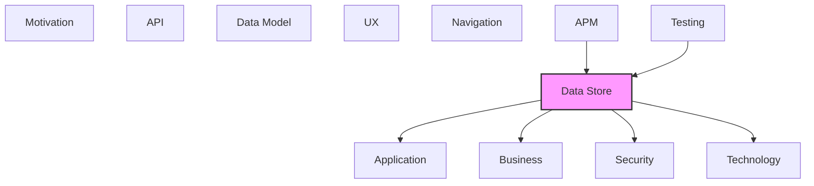

# Data Store

Databases, data stores, and persistence mechanisms.

## Report Index

- [Layer Introduction](#layer-introduction)
- [Intra-Layer Relationships](#intra-layer-relationships)
- [Inter-Layer Dependencies](#inter-layer-dependencies)
- [Inter-Layer Relationships Table](#inter-layer-relationships-table)
- [Element Reference](#element-reference)

## Layer Introduction

| Metric                    | Count |
| ------------------------- | ----- |
| Elements                  | 16    |
| Intra-Layer Relationships | 4     |
| Inter-Layer Relationships | 39    |
| Inbound Relationships     | 9     |
| Outbound Relationships    | 30    |

**Cross-Layer References**:

- **Upstream layers**: [APM](./11-apm-layer-report.md), [Testing](./12-testing-layer-report.md)
- **Downstream layers**: [Application](./04-application-layer-report.md), [Business](./02-business-layer-report.md), [Security](./03-security-layer-report.md), [Technology](./05-technology-layer-report.md)

## Intra-Layer Relationships

```mermaid
flowchart LR
  subgraph data_store
    data_store_collection_agent_events_index["agent-events-* Index"]
    data_store_collection_decision_events_index["decision-events-* Index"]
    data_store_collection_pipeline_runs_index["pipeline-runs-* Index"]
    data_store_database_elasticsearch_config_storage["Elasticsearch Config Storage"]
    data_store_database_elasticsearch_event_store["Elasticsearch Event Store"]
    data_store_database_elasticsearch_workflow_config["Elasticsearch Workflow Config"]
    data_store_database_local_file_storage["Local File Storage"]
    data_store_database_postgre_sql_config_database["PostgreSQL Config Database"]
    data_store_database_redis_config_cache["Redis Config Cache"]
    data_store_database_redis_dead_letter_queue["Redis Dead Letter Queue"]
    data_store_database_redis_event_store["Redis Event Store"]
    data_store_database_redis_pipeline_queue["Redis Pipeline Queue"]
    data_store_namespace_redis_config_key_namespace["Redis config: Key Namespace"]
    data_store_namespace_redis_events_key_namespace["Redis events: Key Namespace"]
    data_store_namespace_redis_locks_key_namespace["Redis Locks Key Namespace"]
    data_store_namespace_redis_rate_limit_key_namespace["Redis Rate Limit Key Namespace"]
    data_store_database_redis_config_cache -->|composes| data_store_namespace_redis_config_key_namespace
    data_store_database_redis_config_cache -->|composes| data_store_namespace_redis_rate_limit_key_namespace
    data_store_database_redis_event_store -->|composes| data_store_namespace_redis_events_key_namespace
    data_store_database_redis_pipeline_queue -->|composes| data_store_namespace_redis_locks_key_namespace
  end
```

## Inter-Layer Dependencies

## Inter-Layer Relationships Table

| Relationship ID                                                 | Source Node                                                  | Dest Node                                                     | Dest Layer    | Predicate    | Cardinality  | Strength |
| --------------------------------------------------------------- | ------------------------------------------------------------ | ------------------------------------------------------------- | ------------- | ------------ | ------------ | -------- |
| `apm.logconfiguration.depends-on.data-store.database`           | `apm.logconfiguration.structured-logging-with-trace-context` | `data-store.database.elasticsearch-event-store`               | `data-store`  | `depends-on` | many-to-many | medium   |
| `apm.metricinstrument.monitors.data-store.database`             | `apm.metricinstrument.board-reconciliation-metrics`          | `data-store.database.elasticsearch-event-store`               | `data-store`  | `monitors`   | many-to-many | medium   |
| `apm.metricinstrument.monitors.data-store.database`             | `apm.metricinstrument.event-bus-stats`                       | `data-store.database.redis-event-store`                       | `data-store`  | `monitors`   | many-to-many | medium   |
| `apm.span.monitors.data-store.database`                         | `apm.span.agent-execution-trace`                             | `data-store.database.redis-event-store`                       | `data-store`  | `monitors`   | many-to-many | medium   |
| `apm.span.monitors.data-store.database`                         | `apm.span.event-handler-trace`                               | `data-store.database.elasticsearch-event-store`               | `data-store`  | `monitors`   | many-to-many | medium   |
| `data-store.collection.serves.application.applicationcomponent` | `data-store.collection.agent-events-index`                   | `application.applicationcomponent.simulation-engine`          | `application` | `serves`     | many-to-many | medium   |
| `data-store.collection.serves.application.applicationcomponent` | `data-store.collection.decision-events-index`                | `application.applicationcomponent.board-column-event-handler` | `application` | `serves`     | many-to-many | medium   |
| `data-store.collection.serves.application.applicationcomponent` | `data-store.collection.pipeline-runs-index`                  | `application.applicationcomponent.execution-event-handler`    | `application` | `serves`     | many-to-many | medium   |
| `data-store.database.depends-on.technology.systemsoftware`      | `data-store.database.elasticsearch-config-storage`           | `technology.systemsoftware.elasticsearch-client`              | `technology`  | `depends-on` | many-to-many | medium   |
| `data-store.database.realizes.business.businessservice`         | `data-store.database.elasticsearch-config-storage`           | `business.businessservice.configuration-management`           | `business`    | `realizes`   | many-to-many | medium   |
| `data-store.database.serves.application.applicationservice`     | `data-store.database.elasticsearch-config-storage`           | `application.applicationservice.configuration-service`        | `application` | `serves`     | many-to-many | medium   |
| `data-store.database.depends-on.technology.systemsoftware`      | `data-store.database.elasticsearch-event-store`              | `technology.systemsoftware.elasticsearch`                     | `technology`  | `depends-on` | many-to-many | medium   |
| `data-store.database.depends-on.technology.systemsoftware`      | `data-store.database.elasticsearch-event-store`              | `technology.systemsoftware.elasticsearch-client`              | `technology`  | `depends-on` | many-to-many | medium   |
| `data-store.database.realizes.business.businessservice`         | `data-store.database.elasticsearch-event-store`              | `business.businessservice.workflow-automation`                | `business`    | `realizes`   | many-to-many | medium   |
| `data-store.database.satisfies.security.securitypolicy`         | `data-store.database.elasticsearch-event-store`              | `security.securitypolicy.role-based-access-control`           | `security`    | `satisfies`  | many-to-many | medium   |
| `data-store.database.serves.application.applicationservice`     | `data-store.database.elasticsearch-event-store`              | `application.applicationservice.event-sequence-validator`     | `application` | `serves`     | many-to-many | medium   |
| `data-store.database.serves.application.applicationservice`     | `data-store.database.elasticsearch-event-store`              | `application.applicationservice.workflow-orchestrator`        | `application` | `serves`     | many-to-many | medium   |
| `data-store.database.serves.application.applicationservice`     | `data-store.database.elasticsearch-event-store`              | `application.applicationservice.workflow-run-query-service`   | `application` | `serves`     | many-to-many | medium   |
| `data-store.database.depends-on.technology.systemsoftware`      | `data-store.database.elasticsearch-workflow-config`          | `technology.systemsoftware.elasticsearch-client`              | `technology`  | `depends-on` | many-to-many | medium   |
| `data-store.database.realizes.business.businessservice`         | `data-store.database.elasticsearch-workflow-config`          | `business.businessservice.configuration-management`           | `business`    | `realizes`   | many-to-many | medium   |
| `data-store.database.serves.application.applicationservice`     | `data-store.database.elasticsearch-workflow-config`          | `application.applicationservice.configuration-service`        | `application` | `serves`     | many-to-many | medium   |
| `data-store.database.serves.application.applicationservice`     | `data-store.database.elasticsearch-workflow-config`          | `application.applicationservice.workflow-orchestrator`        | `application` | `serves`     | many-to-many | medium   |
| `data-store.database.serves.application.applicationservice`     | `data-store.database.local-file-storage`                     | `application.applicationservice.workspace-router`             | `application` | `serves`     | many-to-many | medium   |
| `data-store.database.serves.application.applicationservice`     | `data-store.database.postgre-sql-config-database`            | `application.applicationservice.configuration-service`        | `application` | `serves`     | many-to-many | medium   |
| `data-store.database.depends-on.technology.systemsoftware`      | `data-store.database.redis-config-cache`                     | `technology.systemsoftware.redis-client`                      | `technology`  | `depends-on` | many-to-many | medium   |
| `data-store.database.realizes.business.businessservice`         | `data-store.database.redis-config-cache`                     | `business.businessservice.configuration-management`           | `business`    | `realizes`   | many-to-many | medium   |
| `data-store.database.serves.application.applicationservice`     | `data-store.database.redis-config-cache`                     | `application.applicationservice.configuration-service`        | `application` | `serves`     | many-to-many | medium   |
| `data-store.database.serves.application.applicationservice`     | `data-store.database.redis-dead-letter-queue`                | `application.applicationservice.event-sequence-validator`     | `application` | `serves`     | many-to-many | medium   |
| `data-store.database.depends-on.technology.systemsoftware`      | `data-store.database.redis-event-store`                      | `technology.systemsoftware.redis`                             | `technology`  | `depends-on` | many-to-many | medium   |
| `data-store.database.depends-on.technology.systemsoftware`      | `data-store.database.redis-event-store`                      | `technology.systemsoftware.redis-client`                      | `technology`  | `depends-on` | many-to-many | medium   |
| `data-store.database.realizes.business.businessservice`         | `data-store.database.redis-event-store`                      | `business.businessservice.workflow-automation`                | `business`    | `realizes`   | many-to-many | medium   |
| `data-store.database.satisfies.security.securitypolicy`         | `data-store.database.redis-event-store`                      | `security.securitypolicy.container-isolation`                 | `security`    | `satisfies`  | many-to-many | medium   |
| `data-store.database.serves.application.applicationservice`     | `data-store.database.redis-event-store`                      | `application.applicationservice.board-polling-service`        | `application` | `serves`     | many-to-many | medium   |
| `data-store.database.serves.application.applicationservice`     | `data-store.database.redis-event-store`                      | `application.applicationservice.workflow-orchestrator`        | `application` | `serves`     | many-to-many | medium   |
| `data-store.database.serves.application.applicationservice`     | `data-store.database.redis-pipeline-queue`                   | `application.applicationservice.agent-scheduler`              | `application` | `serves`     | many-to-many | medium   |
| `testing.testcoveragemodel.references.data-store.database`      | `testing.testcoveragemodel.failure-recovery-tests`           | `data-store.database.redis-event-store`                       | `data-store`  | `references` | many-to-many | medium   |
| `testing.testcoveragemodel.references.data-store.database`      | `testing.testcoveragemodel.integration-tests`                | `data-store.database.redis-event-store`                       | `data-store`  | `references` | many-to-many | medium   |
| `testing.testcoveragemodel.references.data-store.database`      | `testing.testcoveragemodel.observability-integration-tests`  | `data-store.database.elasticsearch-event-store`               | `data-store`  | `references` | many-to-many | medium   |
| `testing.testcoveragemodel.references.data-store.database`      | `testing.testcoveragemodel.simulation-scenario-tests`        | `data-store.database.redis-event-store`                       | `data-store`  | `references` | many-to-many | medium   |

## Element Reference

### agent-events-\* Index {#agent-events-index}

**ID**: `data-store.collection.agent-events-index`

**Type**: `collection`

Elasticsearch index pattern for agent lifecycle event records. Named agent-events-YYYY.MM (monthly rollover). Stores AgentExecution state changes, container start/stop events, and agent output artifacts. Queryable via Switchyard ES at localhost:9200.

#### Attributes

| Name           | Value        |
| -------------- | ------------ |
| collectionType | SEARCH_INDEX |

#### Relationships

| Type        | Related Element                                      | Predicate | Direction |
| ----------- | ---------------------------------------------------- | --------- | --------- |
| inter-layer | `application.applicationcomponent.simulation-engine` | `serves`  | outbound  |

### decision-events-\* Index {#decision-events-index}

**ID**: `data-store.collection.decision-events-index`

**Type**: `collection`

Elasticsearch index pattern for agent decision event records. Named decision-events-YYYY.MM (monthly rollover). Stores agent reasoning steps, decision points, and LLM interactions for audit and replay. Queryable via Switchyard ES at localhost:9200.

#### Attributes

| Name           | Value        |
| -------------- | ------------ |
| collectionType | SEARCH_INDEX |

#### Relationships

| Type        | Related Element                                               | Predicate | Direction |
| ----------- | ------------------------------------------------------------- | --------- | --------- |
| inter-layer | `application.applicationcomponent.board-column-event-handler` | `serves`  | outbound  |

### pipeline-runs-\* Index {#pipeline-runs-index}

**ID**: `data-store.collection.pipeline-runs-index`

**Type**: `collection`

Elasticsearch index pattern for pipeline execution run records. Named pipeline-runs-YYYY.MM (monthly rollover). Stores workflow execution state, stage transitions, and pipeline run history. Queryable via Switchyard ES at localhost:9200.

#### Attributes

| Name           | Value        |
| -------------- | ------------ |
| collectionType | SEARCH_INDEX |

#### Relationships

| Type        | Related Element                                            | Predicate | Direction |
| ----------- | ---------------------------------------------------------- | --------- | --------- |
| inter-layer | `application.applicationcomponent.execution-event-handler` | `serves`  | outbound  |

### Elasticsearch Config Storage {#elasticsearch-config-storage}

**ID**: `data-store.database.elasticsearch-config-storage`

**Type**: `database`

Elasticsearch-backed configuration persistence for projects, agents, pipelines, and workflows with full-text search

#### Relationships

| Type        | Related Element                                        | Predicate    | Direction |
| ----------- | ------------------------------------------------------ | ------------ | --------- |
| inter-layer | `technology.systemsoftware.elasticsearch-client`       | `depends-on` | outbound  |
| inter-layer | `business.businessservice.configuration-management`    | `realizes`   | outbound  |
| inter-layer | `application.applicationservice.configuration-service` | `serves`     | outbound  |

### Elasticsearch Event Store {#elasticsearch-event-store}

**ID**: `data-store.database.elasticsearch-event-store`

**Type**: `database`

Elasticsearch-backed event store for domain event persistence with monthly index rollover and optimistic concurrency control

#### Relationships

| Type        | Related Element                                              | Predicate    | Direction |
| ----------- | ------------------------------------------------------------ | ------------ | --------- |
| inter-layer | `apm.logconfiguration.structured-logging-with-trace-context` | `depends-on` | inbound   |
| inter-layer | `apm.metricinstrument.board-reconciliation-metrics`          | `monitors`   | inbound   |
| inter-layer | `apm.span.event-handler-trace`                               | `monitors`   | inbound   |
| inter-layer | `technology.systemsoftware.elasticsearch`                    | `depends-on` | outbound  |
| inter-layer | `technology.systemsoftware.elasticsearch-client`             | `depends-on` | outbound  |
| inter-layer | `business.businessservice.workflow-automation`               | `realizes`   | outbound  |
| inter-layer | `security.securitypolicy.role-based-access-control`          | `satisfies`  | outbound  |
| inter-layer | `application.applicationservice.event-sequence-validator`    | `serves`     | outbound  |
| inter-layer | `application.applicationservice.workflow-orchestrator`       | `serves`     | outbound  |
| inter-layer | `application.applicationservice.workflow-run-query-service`  | `serves`     | outbound  |
| inter-layer | `testing.testcoveragemodel.observability-integration-tests`  | `references` | inbound   |

### Elasticsearch Workflow Config {#elasticsearch-workflow-config}

**ID**: `data-store.database.elasticsearch-workflow-config`

**Type**: `database`

Elasticsearch-backed workflow configuration storage for BoardWorkflowTemplate persistence

#### Relationships

| Type        | Related Element                                        | Predicate    | Direction |
| ----------- | ------------------------------------------------------ | ------------ | --------- |
| inter-layer | `technology.systemsoftware.elasticsearch-client`       | `depends-on` | outbound  |
| inter-layer | `business.businessservice.configuration-management`    | `realizes`   | outbound  |
| inter-layer | `application.applicationservice.configuration-service` | `serves`     | outbound  |
| inter-layer | `application.applicationservice.workflow-orchestrator` | `serves`     | outbound  |

### Local File Storage {#local-file-storage}

**ID**: `data-store.database.local-file-storage`

**Type**: `database`

Local filesystem storage implementing the IStorage port. Stores agent execution artifacts, context files (issue.txt, code snippets, previous_stage.txt) mounted into containers. Dev environment uses local disk; production may use S3-compatible object storage.

#### Attributes

| Name            | Value      |
| --------------- | ---------- |
| deploymentModel | STANDALONE |
| engine          | Filesystem |
| paradigm        | DOCUMENT   |

#### Relationships

| Type        | Related Element                                   | Predicate | Direction |
| ----------- | ------------------------------------------------- | --------- | --------- |
| inter-layer | `application.applicationservice.workspace-router` | `serves`  | outbound  |

### PostgreSQL Config Database {#postgresql-config-database}

**ID**: `data-store.database.postgre-sql-config-database`

**Type**: `database`

Primary relational database for users, API keys, project configuration, workflow definitions, and audit logs. Managed via SQLAlchemy ORM with Alembic migrations.

#### Attributes

| Name            | Value      |
| --------------- | ---------- |
| deploymentModel | STANDALONE |
| engine          | PostgreSQL |
| paradigm        | RELATIONAL |
| version         | 14+        |

#### Relationships

| Type        | Related Element                                        | Predicate | Direction |
| ----------- | ------------------------------------------------------ | --------- | --------- |
| inter-layer | `application.applicationservice.configuration-service` | `serves`  | outbound  |

### Redis Config Cache {#redis-config-cache}

**ID**: `data-store.database.redis-config-cache`

**Type**: `database`

Redis-backed configuration cache with TTL-based invalidation for fast config reads

#### Relationships

| Type        | Related Element                                        | Predicate    | Direction |
| ----------- | ------------------------------------------------------ | ------------ | --------- |
| inter-layer | `technology.systemsoftware.redis-client`               | `depends-on` | outbound  |
| inter-layer | `business.businessservice.configuration-management`    | `realizes`   | outbound  |
| inter-layer | `application.applicationservice.configuration-service` | `serves`     | outbound  |
| intra-layer | `data-store.namespace.redis-config-key-namespace`      | `composes`   | outbound  |
| intra-layer | `data-store.namespace.redis-rate-limit-key-namespace`  | `composes`   | outbound  |

### Redis Dead Letter Queue {#redis-dead-letter-queue}

**ID**: `data-store.database.redis-dead-letter-queue`

**Type**: `database`

Redis stream for failed events that could not be processed (events:dead-letter stream key). Stores FailedEvent records with retry metadata, failure reason, and retry count. Backed by RedisEventBuffer with configurable max stream length.

#### Attributes

| Name            | Value      |
| --------------- | ---------- |
| deploymentModel | STANDALONE |
| engine          | Redis      |
| paradigm        | KEY_VALUE  |

#### Relationships

| Type        | Related Element                                           | Predicate | Direction |
| ----------- | --------------------------------------------------------- | --------- | --------- |
| inter-layer | `application.applicationservice.event-sequence-validator` | `serves`  | outbound  |

### Redis Event Store {#redis-event-store}

**ID**: `data-store.database.redis-event-store`

**Type**: `database`

Redis-backed event store and pub/sub bus for distributed event distribution and caching

#### Relationships

| Type        | Related Element                                        | Predicate    | Direction |
| ----------- | ------------------------------------------------------ | ------------ | --------- |
| inter-layer | `apm.metricinstrument.event-bus-stats`                 | `monitors`   | inbound   |
| inter-layer | `apm.span.agent-execution-trace`                       | `monitors`   | inbound   |
| inter-layer | `technology.systemsoftware.redis`                      | `depends-on` | outbound  |
| inter-layer | `technology.systemsoftware.redis-client`               | `depends-on` | outbound  |
| inter-layer | `business.businessservice.workflow-automation`         | `realizes`   | outbound  |
| inter-layer | `security.securitypolicy.container-isolation`          | `satisfies`  | outbound  |
| inter-layer | `application.applicationservice.board-polling-service` | `serves`     | outbound  |
| inter-layer | `application.applicationservice.workflow-orchestrator` | `serves`     | outbound  |
| inter-layer | `testing.testcoveragemodel.failure-recovery-tests`     | `references` | inbound   |
| inter-layer | `testing.testcoveragemodel.integration-tests`          | `references` | inbound   |
| inter-layer | `testing.testcoveragemodel.simulation-scenario-tests`  | `references` | inbound   |
| intra-layer | `data-store.namespace.redis-events-key-namespace`      | `composes`   | outbound  |

### Redis Pipeline Queue {#redis-pipeline-queue}

**ID**: `data-store.database.redis-pipeline-queue`

**Type**: `database`

Redis-backed pipeline queue providing FIFO ordering of work items for the AgentScheduler. Supports queue position inspection, peek (lock-without-dequeue), and stale entry detection. Also has an in-memory variant for testing (InMemoryQueueLockService).

#### Attributes

| Name            | Value      |
| --------------- | ---------- |
| deploymentModel | STANDALONE |
| engine          | Redis      |
| paradigm        | KEY_VALUE  |

#### Relationships

| Type        | Related Element                                  | Predicate  | Direction |
| ----------- | ------------------------------------------------ | ---------- | --------- |
| inter-layer | `application.applicationservice.agent-scheduler` | `serves`   | outbound  |
| intra-layer | `data-store.namespace.redis-locks-key-namespace` | `composes` | outbound  |

### Redis config: Key Namespace {#redis-config-key-namespace}

**ID**: `data-store.namespace.redis-config-key-namespace`

**Type**: `namespace`

Redis key namespace prefix 'config:' for configuration cache entries. Key pattern: config:\{project\|agent\|pipeline\|workflow\}:\{id\}. TTL: 3600s. Managed by RedisConfigCache with pub/sub invalidation channel.

#### Attributes

| Name  | Value            |
| ----- | ---------------- |
| owner | RedisConfigCache |

#### Relationships

| Type        | Related Element                          | Predicate  | Direction |
| ----------- | ---------------------------------------- | ---------- | --------- |
| intra-layer | `data-store.database.redis-config-cache` | `composes` | inbound   |

### Redis events: Key Namespace {#redis-events-key-namespace}

**ID**: `data-store.namespace.redis-events-key-namespace`

**Type**: `namespace`

Redis key namespace prefix 'events:' for domain event streams. Contains events:buffer (main event buffer stream), events:dead-letter (failed event stream), and events:\{EventType\} per-event-type streams (e.g., events:WorkItemCreated). Managed by RedisEventBuffer and EventBus.

#### Relationships

| Type        | Related Element                         | Predicate  | Direction |
| ----------- | --------------------------------------- | ---------- | --------- |
| intra-layer | `data-store.database.redis-event-store` | `composes` | inbound   |

### Redis Locks Key Namespace {#redis-locks-key-namespace}

**ID**: `data-store.namespace.redis-locks-key-namespace`

**Type**: `namespace`

Redis key namespace for pipeline lock state. Key pattern: \{project_id\}:\{board_id\} for active locks. Used by IQueuedPipelineLockService to coordinate single-pipeline-execution-at-a-time semantics across the AgentScheduler and WorkflowOrchestrator.

#### Attributes

| Name  | Value                      |
| ----- | -------------------------- |
| owner | IQueuedPipelineLockService |

#### Relationships

| Type        | Related Element                            | Predicate  | Direction |
| ----------- | ------------------------------------------ | ---------- | --------- |
| intra-layer | `data-store.database.redis-pipeline-queue` | `composes` | inbound   |

### Redis Rate Limit Key Namespace {#redis-rate-limit-key-namespace}

**ID**: `data-store.namespace.redis-rate-limit-key-namespace`

**Type**: `namespace`

Redis key namespace for HTTP rate limiter sliding window state. Tracks request counts per IP and per API key within configurable time windows (default: 100 req/min). Used by FastAPI middleware and WebSocket adapter rate limiting.

#### Attributes

| Name  | Value               |
| ----- | ------------------- |
| owner | RateLimitMiddleware |

#### Relationships

| Type        | Related Element                          | Predicate  | Direction |
| ----------- | ---------------------------------------- | ---------- | --------- |
| intra-layer | `data-store.database.redis-config-cache` | `composes` | inbound   |

---

Generated: 2026-05-11T22:23:25.353Z | Model Version: 0.1.0
