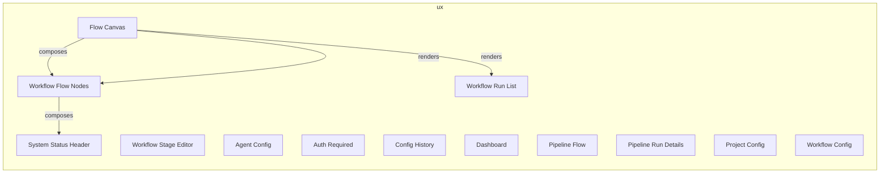
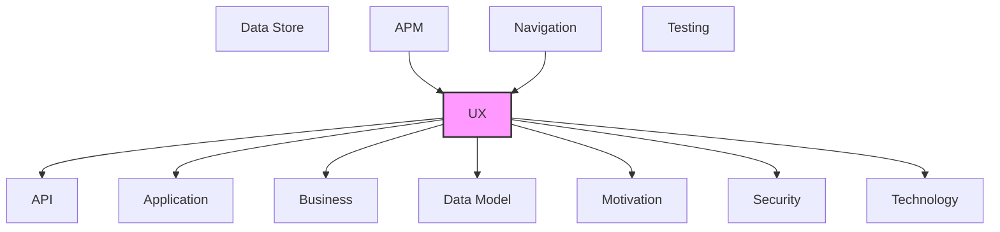

# UX

User interface components, screens, and user experience elements.

## Report Index

- [Layer Introduction](#layer-introduction)
- [Intra-Layer Relationships](#intra-layer-relationships)
- [Inter-Layer Dependencies](#inter-layer-dependencies)
- [Inter-Layer Relationships Table](#inter-layer-relationships-table)
- [Element Reference](#element-reference)

## Layer Introduction

| Metric                    | Count |
| ------------------------- | ----- |
| Elements                  | 13    |
| Intra-Layer Relationships | 4     |
| Inter-Layer Relationships | 76    |
| Inbound Relationships     | 9     |
| Outbound Relationships    | 67    |

**Cross-Layer References**:

- **Upstream layers**: [APM](./11-apm-layer-report.md), [Navigation](./10-navigation-layer-report.md)
- **Downstream layers**: [API](./06-api-layer-report.md), [Application](./04-application-layer-report.md), [Business](./02-business-layer-report.md), [Data Model](./07-data-model-layer-report.md), [Motivation](./01-motivation-layer-report.md), [Security](./03-security-layer-report.md), [Technology](./05-technology-layer-report.md)

## Intra-Layer Relationships

## Inter-Layer Dependencies

## Inter-Layer Relationships Table

| Relationship ID                                            | Source Node                                         | Dest Node                                                   | Dest Layer    | Predicate    | Cardinality  | Strength |
| ---------------------------------------------------------- | --------------------------------------------------- | ----------------------------------------------------------- | ------------- | ------------ | ------------ | -------- |
| `apm.metricinstrument.monitors.ux.view`                    | `apm.metricinstrument.agent-execution-duration`     | `ux.view.pipeline-flow`                                     | `ux`          | `monitors`   | many-to-many | medium   |
| `apm.metricinstrument.monitors.ux.view`                    | `apm.metricinstrument.board-reconciliation-metrics` | `ux.view.dashboard`                                         | `ux`          | `monitors`   | many-to-many | medium   |
| `navigation.route.maps-to.ux.view`                         | `navigation.route.agent-config-route`               | `ux.view.agent-config`                                      | `ux`          | `maps-to`    | many-to-many | medium   |
| `navigation.route.maps-to.ux.view`                         | `navigation.route.config-history-route`             | `ux.view.config-history`                                    | `ux`          | `maps-to`    | many-to-many | medium   |
| `navigation.route.maps-to.ux.view`                         | `navigation.route.dashboard-route`                  | `ux.view.dashboard`                                         | `ux`          | `maps-to`    | many-to-many | medium   |
| `navigation.route.maps-to.ux.view`                         | `navigation.route.pipeline-flow-route`              | `ux.view.pipeline-flow`                                     | `ux`          | `maps-to`    | many-to-many | medium   |
| `navigation.route.maps-to.ux.view`                         | `navigation.route.pipeline-run-details-route`       | `ux.view.pipeline-run-details`                              | `ux`          | `maps-to`    | many-to-many | medium   |
| `navigation.route.maps-to.ux.view`                         | `navigation.route.project-config-route`             | `ux.view.project-config`                                    | `ux`          | `maps-to`    | many-to-many | medium   |
| `navigation.route.maps-to.ux.view`                         | `navigation.route.workflow-config-route`            | `ux.view.workflow-config`                                   | `ux`          | `maps-to`    | many-to-many | medium   |
| `ux.librarycomponent.depends-on.technology.systemsoftware` | `ux.librarycomponent.flow-canvas`                   | `technology.systemsoftware.fast-api`                        | `technology`  | `depends-on` | many-to-many | medium   |
| `ux.librarycomponent.depends-on.technology.systemsoftware` | `ux.librarycomponent.flow-canvas`                   | `technology.systemsoftware.xyflow`                          | `technology`  | `depends-on` | many-to-many | medium   |
| `ux.librarycomponent.depends-on.technology.systemsoftware` | `ux.librarycomponent.system-status-header`          | `technology.systemsoftware.tan-stack-query`                 | `technology`  | `depends-on` | many-to-many | medium   |
| `ux.librarycomponent.satisfies.motivation.principle`       | `ux.librarycomponent.system-status-header`          | `motivation.principle.hexagonal-architecture`               | `motivation`  | `satisfies`  | many-to-many | medium   |
| `ux.librarycomponent.depends-on.technology.systemsoftware` | `ux.librarycomponent.workflow-flow-nodes`           | `technology.systemsoftware.python-311`                      | `technology`  | `depends-on` | many-to-many | medium   |
| `ux.librarycomponent.depends-on.technology.systemsoftware` | `ux.librarycomponent.workflow-flow-nodes`           | `technology.systemsoftware.xyflow`                          | `technology`  | `depends-on` | many-to-many | medium   |
| `ux.librarycomponent.depends-on.technology.systemsoftware` | `ux.librarycomponent.workflow-run-list`             | `technology.systemsoftware.tan-stack-query`                 | `technology`  | `depends-on` | many-to-many | medium   |
| `ux.librarycomponent.satisfies.motivation.principle`       | `ux.librarycomponent.workflow-run-list`             | `motivation.principle.hexagonal-architecture`               | `motivation`  | `satisfies`  | many-to-many | medium   |
| `ux.librarycomponent.depends-on.technology.systemsoftware` | `ux.librarycomponent.workflow-stage-editor`         | `technology.systemsoftware.zustand`                         | `technology`  | `depends-on` | many-to-many | medium   |
| `ux.librarycomponent.satisfies.motivation.principle`       | `ux.librarycomponent.workflow-stage-editor`         | `motivation.principle.hexagonal-architecture`               | `motivation`  | `satisfies`  | many-to-many | medium   |
| `ux.view.accesses.api.operation`                           | `ux.view.agent-config`                              | `api.operation.list-agents`                                 | `api`         | `accesses`   | many-to-many | medium   |
| `ux.view.depends-on.technology.systemsoftware`             | `ux.view.agent-config`                              | `technology.systemsoftware.react`                           | `technology`  | `depends-on` | many-to-many | medium   |
| `ux.view.references.data-model.objectschema`               | `ux.view.agent-config`                              | `data-model.objectschema.agent`                             | `data-model`  | `references` | many-to-many | medium   |
| `ux.view.references.data-model.objectschema`               | `ux.view.agent-config`                              | `data-model.objectschema.agent-capability`                  | `data-model`  | `references` | many-to-many | medium   |
| `ux.view.satisfies.security.securitypolicy`                | `ux.view.agent-config`                              | `security.securitypolicy.role-based-access-control`         | `security`    | `satisfies`  | many-to-many | medium   |
| `ux.view.serves.application.applicationservice`            | `ux.view.agent-config`                              | `application.applicationservice.configuration-service`      | `application` | `serves`     | many-to-many | medium   |
| `ux.view.serves.business.businessservice`                  | `ux.view.agent-config`                              | `business.businessservice.configuration-management`         | `business`    | `serves`     | many-to-many | medium   |
| `ux.view.depends-on.technology.systemsoftware`             | `ux.view.auth-required`                             | `technology.systemsoftware.react`                           | `technology`  | `depends-on` | many-to-many | medium   |
| `ux.view.satisfies.security.securitypolicy`                | `ux.view.auth-required`                             | `security.securitypolicy.jwt-bearer-authentication`         | `security`    | `satisfies`  | many-to-many | medium   |
| `ux.view.satisfies.security.securitypolicy`                | `ux.view.auth-required`                             | `security.securitypolicy.role-based-access-control`         | `security`    | `satisfies`  | many-to-many | medium   |
| `ux.view.depends-on.technology.systemsoftware`             | `ux.view.config-history`                            | `technology.systemsoftware.react`                           | `technology`  | `depends-on` | many-to-many | medium   |
| `ux.view.references.data-model.objectschema`               | `ux.view.config-history`                            | `data-model.objectschema.project-config`                    | `data-model`  | `references` | many-to-many | medium   |
| `ux.view.serves.application.applicationservice`            | `ux.view.config-history`                            | `application.applicationservice.configuration-service`      | `application` | `serves`     | many-to-many | medium   |
| `ux.view.accesses.api.operation`                           | `ux.view.dashboard`                                 | `api.operation.get-system-health`                           | `api`         | `accesses`   | many-to-many | medium   |
| `ux.view.accesses.api.operation`                           | `ux.view.dashboard`                                 | `api.operation.list-executions`                             | `api`         | `accesses`   | many-to-many | medium   |
| `ux.view.accesses.application.applicationcomponent`        | `ux.view.dashboard`                                 | `application.applicationcomponent.execution-event-handler`  | `application` | `accesses`   | many-to-many | medium   |
| `ux.view.depends-on.technology.systemsoftware`             | `ux.view.dashboard`                                 | `technology.systemsoftware.fast-api`                        | `technology`  | `depends-on` | many-to-many | medium   |
| `ux.view.depends-on.technology.systemsoftware`             | `ux.view.dashboard`                                 | `technology.systemsoftware.react`                           | `technology`  | `depends-on` | many-to-many | medium   |
| `ux.view.realizes.motivation.goal`                         | `ux.view.dashboard`                                 | `motivation.goal.automate-software-development-workflows`   | `motivation`  | `realizes`   | many-to-many | medium   |
| `ux.view.references.data-model.objectschema`               | `ux.view.dashboard`                                 | `data-model.objectschema.agent-execution`                   | `data-model`  | `references` | many-to-many | medium   |
| `ux.view.references.data-model.objectschema`               | `ux.view.dashboard`                                 | `data-model.objectschema.work-item`                         | `data-model`  | `references` | many-to-many | medium   |
| `ux.view.satisfies.security.securitypolicy`                | `ux.view.dashboard`                                 | `security.securitypolicy.jwt-bearer-authentication`         | `security`    | `satisfies`  | many-to-many | medium   |
| `ux.view.serves.application.applicationservice`            | `ux.view.dashboard`                                 | `application.applicationservice.metrics-service`            | `application` | `serves`     | many-to-many | medium   |
| `ux.view.serves.application.applicationservice`            | `ux.view.dashboard`                                 | `application.applicationservice.workflow-run-query-service` | `application` | `serves`     | many-to-many | medium   |
| `ux.view.serves.business.businessservice`                  | `ux.view.dashboard`                                 | `business.businessservice.workflow-automation`              | `business`    | `serves`     | many-to-many | medium   |
| `ux.view.accesses.api.operation`                           | `ux.view.pipeline-flow`                             | `api.operation.list-workflow-runs`                          | `api`         | `accesses`   | many-to-many | medium   |
| `ux.view.accesses.application.applicationcomponent`        | `ux.view.pipeline-flow`                             | `application.applicationcomponent.workflow-event-handler`   | `application` | `accesses`   | many-to-many | medium   |
| `ux.view.depends-on.technology.systemsoftware`             | `ux.view.pipeline-flow`                             | `technology.systemsoftware.fast-api`                        | `technology`  | `depends-on` | many-to-many | medium   |
| `ux.view.depends-on.technology.systemsoftware`             | `ux.view.pipeline-flow`                             | `technology.systemsoftware.react`                           | `technology`  | `depends-on` | many-to-many | medium   |
| `ux.view.depends-on.technology.systemsoftware`             | `ux.view.pipeline-flow`                             | `technology.systemsoftware.react-router`                    | `technology`  | `depends-on` | many-to-many | medium   |
| `ux.view.depends-on.technology.systemsoftware`             | `ux.view.pipeline-flow`                             | `technology.systemsoftware.xyflow`                          | `technology`  | `depends-on` | many-to-many | medium   |
| `ux.view.realizes.motivation.goal`                         | `ux.view.pipeline-flow`                             | `motivation.goal.complete-observability-via-event-sourcing` | `motivation`  | `realizes`   | many-to-many | medium   |
| `ux.view.references.data-model.objectschema`               | `ux.view.pipeline-flow`                             | `data-model.objectschema.agent-execution`                   | `data-model`  | `references` | many-to-many | medium   |
| `ux.view.references.data-model.objectschema`               | `ux.view.pipeline-flow`                             | `data-model.objectschema.workflow`                          | `data-model`  | `references` | many-to-many | medium   |
| `ux.view.serves.application.applicationservice`            | `ux.view.pipeline-flow`                             | `application.applicationservice.workflow-run-query-service` | `application` | `serves`     | many-to-many | medium   |
| `ux.view.serves.business.businessservice`                  | `ux.view.pipeline-flow`                             | `business.businessservice.workflow-automation`              | `business`    | `serves`     | many-to-many | medium   |
| `ux.view.accesses.api.operation`                           | `ux.view.pipeline-run-details`                      | `api.operation.get-workflow-run`                            | `api`         | `accesses`   | many-to-many | medium   |
| `ux.view.accesses.api.operation`                           | `ux.view.pipeline-run-details`                      | `api.operation.get-workflow-run-events`                     | `api`         | `accesses`   | many-to-many | medium   |
| `ux.view.accesses.application.applicationcomponent`        | `ux.view.pipeline-run-details`                      | `application.applicationcomponent.execution-event-handler`  | `application` | `accesses`   | many-to-many | medium   |
| `ux.view.depends-on.technology.systemsoftware`             | `ux.view.pipeline-run-details`                      | `technology.systemsoftware.react`                           | `technology`  | `depends-on` | many-to-many | medium   |
| `ux.view.realizes.motivation.goal`                         | `ux.view.pipeline-run-details`                      | `motivation.goal.complete-observability-via-event-sourcing` | `motivation`  | `realizes`   | many-to-many | medium   |
| `ux.view.references.data-model.objectschema`               | `ux.view.pipeline-run-details`                      | `data-model.objectschema.agent-execution`                   | `data-model`  | `references` | many-to-many | medium   |
| `ux.view.references.data-model.objectschema`               | `ux.view.pipeline-run-details`                      | `data-model.objectschema.work-item`                         | `data-model`  | `references` | many-to-many | medium   |
| `ux.view.serves.application.applicationservice`            | `ux.view.pipeline-run-details`                      | `application.applicationservice.workflow-run-query-service` | `application` | `serves`     | many-to-many | medium   |
| `ux.view.accesses.api.operation`                           | `ux.view.project-config`                            | `api.operation.list-config-agents`                          | `api`         | `accesses`   | many-to-many | medium   |
| `ux.view.depends-on.technology.systemsoftware`             | `ux.view.project-config`                            | `technology.systemsoftware.react`                           | `technology`  | `depends-on` | many-to-many | medium   |
| `ux.view.references.data-model.objectschema`               | `ux.view.project-config`                            | `data-model.objectschema.project-config`                    | `data-model`  | `references` | many-to-many | medium   |
| `ux.view.serves.application.applicationservice`            | `ux.view.project-config`                            | `application.applicationservice.configuration-service`      | `application` | `serves`     | many-to-many | medium   |
| `ux.view.serves.business.businessservice`                  | `ux.view.project-config`                            | `business.businessservice.configuration-management`         | `business`    | `serves`     | many-to-many | medium   |
| `ux.view.accesses.api.operation`                           | `ux.view.workflow-config`                           | `api.operation.list-workflows`                              | `api`         | `accesses`   | many-to-many | medium   |
| `ux.view.depends-on.technology.systemsoftware`             | `ux.view.workflow-config`                           | `technology.systemsoftware.react`                           | `technology`  | `depends-on` | many-to-many | medium   |
| `ux.view.realizes.motivation.goal`                         | `ux.view.workflow-config`                           | `motivation.goal.plugin-extensibility`                      | `motivation`  | `realizes`   | many-to-many | medium   |
| `ux.view.references.data-model.objectschema`               | `ux.view.workflow-config`                           | `data-model.objectschema.workflow`                          | `data-model`  | `references` | many-to-many | medium   |
| `ux.view.references.data-model.objectschema`               | `ux.view.workflow-config`                           | `data-model.objectschema.workflow-template`                 | `data-model`  | `references` | many-to-many | medium   |
| `ux.view.satisfies.security.securitypolicy`                | `ux.view.workflow-config`                           | `security.securitypolicy.role-based-access-control`         | `security`    | `satisfies`  | many-to-many | medium   |
| `ux.view.serves.application.applicationservice`            | `ux.view.workflow-config`                           | `application.applicationservice.configuration-service`      | `application` | `serves`     | many-to-many | medium   |
| `ux.view.serves.business.businessservice`                  | `ux.view.workflow-config`                           | `business.businessservice.configuration-management`         | `business`    | `serves`     | many-to-many | medium   |

## Element Reference

### Flow Canvas {#flow-canvas}

**ID**: `ux.librarycomponent.flow-canvas`

**Type**: `librarycomponent`

React Flow canvas component for rendering workflow graph with draggable nodes and animated edges

#### Relationships

| Type        | Related Element                           | Predicate    | Direction |
| ----------- | ----------------------------------------- | ------------ | --------- |
| inter-layer | `technology.systemsoftware.fast-api`      | `depends-on` | outbound  |
| inter-layer | `technology.systemsoftware.xyflow`        | `depends-on` | outbound  |
| intra-layer | `ux.librarycomponent.workflow-flow-nodes` | `composes`   | outbound  |
| intra-layer | `ux.librarycomponent.workflow-flow-nodes` | `renders`    | outbound  |
| intra-layer | `ux.librarycomponent.workflow-run-list`   | `renders`    | outbound  |

### System Status Header {#system-status-header}

**ID**: `ux.librarycomponent.system-status-header`

**Type**: `librarycomponent`

Persistent system health monitoring component showing active agents, circuit breakers, and API usage cards

#### Relationships

| Type        | Related Element                               | Predicate    | Direction |
| ----------- | --------------------------------------------- | ------------ | --------- |
| inter-layer | `technology.systemsoftware.tan-stack-query`   | `depends-on` | outbound  |
| inter-layer | `motivation.principle.hexagonal-architecture` | `satisfies`  | outbound  |
| intra-layer | `ux.librarycomponent.workflow-flow-nodes`     | `composes`   | inbound   |

### Workflow Flow Nodes {#workflow-flow-nodes}

**ID**: `ux.librarycomponent.workflow-flow-nodes`

**Type**: `librarycomponent`

Custom React Flow node components for agent execution, cycle bounding, decision, and workflow event visualization

#### Relationships

| Type        | Related Element                            | Predicate    | Direction |
| ----------- | ------------------------------------------ | ------------ | --------- |
| inter-layer | `technology.systemsoftware.python-311`     | `depends-on` | outbound  |
| inter-layer | `technology.systemsoftware.xyflow`         | `depends-on` | outbound  |
| intra-layer | `ux.librarycomponent.flow-canvas`          | `composes`   | inbound   |
| intra-layer | `ux.librarycomponent.flow-canvas`          | `renders`    | inbound   |
| intra-layer | `ux.librarycomponent.system-status-header` | `composes`   | outbound  |

### Workflow Run List {#workflow-run-list}

**ID**: `ux.librarycomponent.workflow-run-list`

**Type**: `librarycomponent`

Component displaying paginated list of pipeline workflow runs with status and timeline

#### Relationships

| Type        | Related Element                               | Predicate    | Direction |
| ----------- | --------------------------------------------- | ------------ | --------- |
| inter-layer | `technology.systemsoftware.tan-stack-query`   | `depends-on` | outbound  |
| inter-layer | `motivation.principle.hexagonal-architecture` | `satisfies`  | outbound  |
| intra-layer | `ux.librarycomponent.flow-canvas`             | `renders`    | inbound   |

### Workflow Stage Editor {#workflow-stage-editor}

**ID**: `ux.librarycomponent.workflow-stage-editor`

**Type**: `librarycomponent`

Drag-and-drop stage editor component for defining pipeline stages and their configuration

#### Relationships

| Type        | Related Element                               | Predicate    | Direction |
| ----------- | --------------------------------------------- | ------------ | --------- |
| inter-layer | `technology.systemsoftware.zustand`           | `depends-on` | outbound  |
| inter-layer | `motivation.principle.hexagonal-architecture` | `satisfies`  | outbound  |

### Agent Config {#agent-config}

**ID**: `ux.view.agent-config`

**Type**: `view`

Agent definition management interface for configuring AI agents, capabilities, and execution parameters

#### Relationships

| Type        | Related Element                                        | Predicate    | Direction |
| ----------- | ------------------------------------------------------ | ------------ | --------- |
| inter-layer | `navigation.route.agent-config-route`                  | `maps-to`    | inbound   |
| inter-layer | `api.operation.list-agents`                            | `accesses`   | outbound  |
| inter-layer | `technology.systemsoftware.react`                      | `depends-on` | outbound  |
| inter-layer | `data-model.objectschema.agent`                        | `references` | outbound  |
| inter-layer | `data-model.objectschema.agent-capability`             | `references` | outbound  |
| inter-layer | `security.securitypolicy.role-based-access-control`    | `satisfies`  | outbound  |
| inter-layer | `application.applicationservice.configuration-service` | `serves`     | outbound  |
| inter-layer | `business.businessservice.configuration-management`    | `serves`     | outbound  |

### Auth Required {#auth-required}

**ID**: `ux.view.auth-required`

**Type**: `view`

Authentication gate page shown to unauthenticated users requiring JWT token entry

#### Relationships

| Type        | Related Element                                     | Predicate    | Direction |
| ----------- | --------------------------------------------------- | ------------ | --------- |
| inter-layer | `technology.systemsoftware.react`                   | `depends-on` | outbound  |
| inter-layer | `security.securitypolicy.jwt-bearer-authentication` | `satisfies`  | outbound  |
| inter-layer | `security.securitypolicy.role-based-access-control` | `satisfies`  | outbound  |

### Config History {#config-history}

**ID**: `ux.view.config-history`

**Type**: `view`

Configuration change history view showing audit log of all project, agent, and workflow configuration changes

#### Relationships

| Type        | Related Element                                        | Predicate    | Direction |
| ----------- | ------------------------------------------------------ | ------------ | --------- |
| inter-layer | `navigation.route.config-history-route`                | `maps-to`    | inbound   |
| inter-layer | `technology.systemsoftware.react`                      | `depends-on` | outbound  |
| inter-layer | `data-model.objectschema.project-config`               | `references` | outbound  |
| inter-layer | `application.applicationservice.configuration-service` | `serves`     | outbound  |

### Dashboard {#dashboard}

**ID**: `ux.view.dashboard`

**Type**: `view`

Main monitoring dashboard showing active agents, system health, circuit breaker states, and API usage

#### Relationships

| Type        | Related Element                                             | Predicate    | Direction |
| ----------- | ----------------------------------------------------------- | ------------ | --------- |
| inter-layer | `apm.metricinstrument.board-reconciliation-metrics`         | `monitors`   | inbound   |
| inter-layer | `navigation.route.dashboard-route`                          | `maps-to`    | inbound   |
| inter-layer | `api.operation.get-system-health`                           | `accesses`   | outbound  |
| inter-layer | `api.operation.list-executions`                             | `accesses`   | outbound  |
| inter-layer | `application.applicationcomponent.execution-event-handler`  | `accesses`   | outbound  |
| inter-layer | `technology.systemsoftware.fast-api`                        | `depends-on` | outbound  |
| inter-layer | `technology.systemsoftware.react`                           | `depends-on` | outbound  |
| inter-layer | `motivation.goal.automate-software-development-workflows`   | `realizes`   | outbound  |
| inter-layer | `data-model.objectschema.agent-execution`                   | `references` | outbound  |
| inter-layer | `data-model.objectschema.work-item`                         | `references` | outbound  |
| inter-layer | `security.securitypolicy.jwt-bearer-authentication`         | `satisfies`  | outbound  |
| inter-layer | `application.applicationservice.metrics-service`            | `serves`     | outbound  |
| inter-layer | `application.applicationservice.workflow-run-query-service` | `serves`     | outbound  |
| inter-layer | `business.businessservice.workflow-automation`              | `serves`     | outbound  |

### Pipeline Flow {#pipeline-flow}

**ID**: `ux.view.pipeline-flow`

**Type**: `view`

Full-screen React Flow-based visualization of pipeline execution graph with nodes and edges

#### Relationships

| Type        | Related Element                                             | Predicate    | Direction |
| ----------- | ----------------------------------------------------------- | ------------ | --------- |
| inter-layer | `apm.metricinstrument.agent-execution-duration`             | `monitors`   | inbound   |
| inter-layer | `navigation.route.pipeline-flow-route`                      | `maps-to`    | inbound   |
| inter-layer | `api.operation.list-workflow-runs`                          | `accesses`   | outbound  |
| inter-layer | `application.applicationcomponent.workflow-event-handler`   | `accesses`   | outbound  |
| inter-layer | `technology.systemsoftware.fast-api`                        | `depends-on` | outbound  |
| inter-layer | `technology.systemsoftware.react`                           | `depends-on` | outbound  |
| inter-layer | `technology.systemsoftware.react-router`                    | `depends-on` | outbound  |
| inter-layer | `technology.systemsoftware.xyflow`                          | `depends-on` | outbound  |
| inter-layer | `motivation.goal.complete-observability-via-event-sourcing` | `realizes`   | outbound  |
| inter-layer | `data-model.objectschema.agent-execution`                   | `references` | outbound  |
| inter-layer | `data-model.objectschema.workflow`                          | `references` | outbound  |
| inter-layer | `application.applicationservice.workflow-run-query-service` | `serves`     | outbound  |
| inter-layer | `business.businessservice.workflow-automation`              | `serves`     | outbound  |

### Pipeline Run Details {#pipeline-run-details}

**ID**: `ux.view.pipeline-run-details`

**Type**: `view`

Full-screen detailed view of a pipeline run with event timeline, audit log, and execution status

#### Relationships

| Type        | Related Element                                             | Predicate    | Direction |
| ----------- | ----------------------------------------------------------- | ------------ | --------- |
| inter-layer | `navigation.route.pipeline-run-details-route`               | `maps-to`    | inbound   |
| inter-layer | `api.operation.get-workflow-run`                            | `accesses`   | outbound  |
| inter-layer | `api.operation.get-workflow-run-events`                     | `accesses`   | outbound  |
| inter-layer | `application.applicationcomponent.execution-event-handler`  | `accesses`   | outbound  |
| inter-layer | `technology.systemsoftware.react`                           | `depends-on` | outbound  |
| inter-layer | `motivation.goal.complete-observability-via-event-sourcing` | `realizes`   | outbound  |
| inter-layer | `data-model.objectschema.agent-execution`                   | `references` | outbound  |
| inter-layer | `data-model.objectschema.work-item`                         | `references` | outbound  |
| inter-layer | `application.applicationservice.workflow-run-query-service` | `serves`     | outbound  |

### Project Config {#project-config}

**ID**: `ux.view.project-config`

**Type**: `view`

Project settings and environment configuration interface for GitHub integration and pipeline setup

#### Relationships

| Type        | Related Element                                        | Predicate    | Direction |
| ----------- | ------------------------------------------------------ | ------------ | --------- |
| inter-layer | `navigation.route.project-config-route`                | `maps-to`    | inbound   |
| inter-layer | `api.operation.list-config-agents`                     | `accesses`   | outbound  |
| inter-layer | `technology.systemsoftware.react`                      | `depends-on` | outbound  |
| inter-layer | `data-model.objectschema.project-config`               | `references` | outbound  |
| inter-layer | `application.applicationservice.configuration-service` | `serves`     | outbound  |
| inter-layer | `business.businessservice.configuration-management`    | `serves`     | outbound  |

### Workflow Config {#workflow-config}

**ID**: `ux.view.workflow-config`

**Type**: `view`

Workflow configuration editor for creating and managing pipeline stages and their entry conditions

#### Relationships

| Type        | Related Element                                        | Predicate    | Direction |
| ----------- | ------------------------------------------------------ | ------------ | --------- |
| inter-layer | `navigation.route.workflow-config-route`               | `maps-to`    | inbound   |
| inter-layer | `api.operation.list-workflows`                         | `accesses`   | outbound  |
| inter-layer | `technology.systemsoftware.react`                      | `depends-on` | outbound  |
| inter-layer | `motivation.goal.plugin-extensibility`                 | `realizes`   | outbound  |
| inter-layer | `data-model.objectschema.workflow`                     | `references` | outbound  |
| inter-layer | `data-model.objectschema.workflow-template`            | `references` | outbound  |
| inter-layer | `security.securitypolicy.role-based-access-control`    | `satisfies`  | outbound  |
| inter-layer | `application.applicationservice.configuration-service` | `serves`     | outbound  |
| inter-layer | `business.businessservice.configuration-management`    | `serves`     | outbound  |

---

Generated: 2026-05-11T22:23:25.353Z | Model Version: 0.1.0
