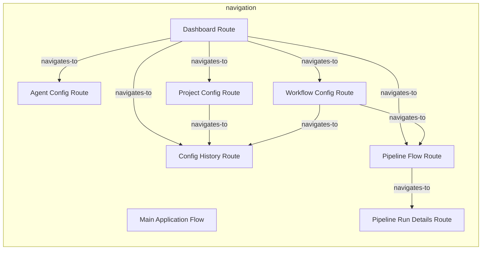
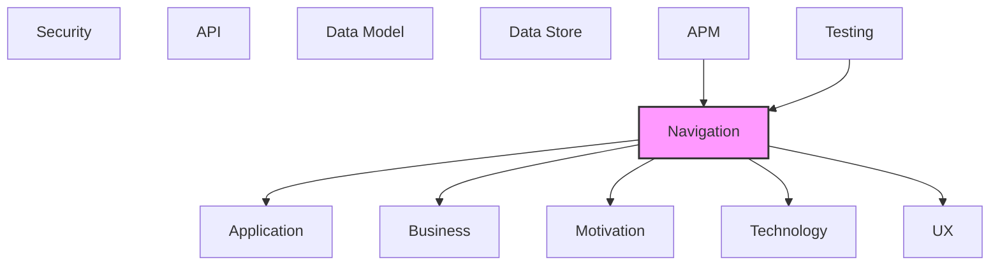

# Navigation

Application routing, navigation flows, and page structures.

## Report Index

- [Layer Introduction](#layer-introduction)
- [Intra-Layer Relationships](#intra-layer-relationships)
- [Inter-Layer Dependencies](#inter-layer-dependencies)
- [Inter-Layer Relationships Table](#inter-layer-relationships-table)
- [Element Reference](#element-reference)

## Layer Introduction

| Metric                    | Count |
| ------------------------- | ----- |
| Elements                  | 8     |
| Intra-Layer Relationships | 9     |
| Inter-Layer Relationships | 26    |
| Inbound Relationships     | 3     |
| Outbound Relationships    | 23    |

**Cross-Layer References**:

- **Upstream layers**: [APM](./11-apm-layer-report.md), [Testing](./12-testing-layer-report.md)
- **Downstream layers**: [Application](./04-application-layer-report.md), [Business](./02-business-layer-report.md), [Motivation](./01-motivation-layer-report.md), [Technology](./05-technology-layer-report.md), [UX](./09-ux-layer-report.md)

## Intra-Layer Relationships

## Inter-Layer Dependencies

## Inter-Layer Relationships Table

| Relationship ID                                                 | Source Node                                        | Dest Node                                                   | Dest Layer    | Predicate       | Cardinality  | Strength |
| --------------------------------------------------------------- | -------------------------------------------------- | ----------------------------------------------------------- | ------------- | --------------- | ------------ | -------- |
| `apm.metricinstrument.monitors.navigation.route`                | `apm.metricinstrument.agent-execution-duration`    | `navigation.route.pipeline-flow-route`                      | `navigation`  | `monitors`      | many-to-many | medium   |
| `navigation.navigationflow.realizes.motivation.goal`            | `navigation.navigationflow.main-application-flow`  | `motivation.goal.automate-software-development-workflows`   | `motivation`  | `realizes`      | many-to-many | medium   |
| `navigation.route.maps-to.ux.view`                              | `navigation.route.agent-config-route`              | `ux.view.agent-config`                                      | `ux`          | `maps-to`       | many-to-many | medium   |
| `navigation.route.resolves-with.application.applicationservice` | `navigation.route.agent-config-route`              | `application.applicationservice.configuration-service`      | `application` | `resolves-with` | many-to-many | medium   |
| `navigation.route.serves.business.businessrole`                 | `navigation.route.agent-config-route`              | `business.businessrole.orchestration-system-user`           | `business`    | `serves`        | many-to-many | medium   |
| `navigation.route.maps-to.ux.view`                              | `navigation.route.config-history-route`            | `ux.view.config-history`                                    | `ux`          | `maps-to`       | many-to-many | medium   |
| `navigation.route.resolves-with.application.applicationservice` | `navigation.route.config-history-route`            | `application.applicationservice.configuration-service`      | `application` | `resolves-with` | many-to-many | medium   |
| `navigation.route.maps-to.business.businessfunction`            | `navigation.route.dashboard-route`                 | `business.businessfunction.event-sourced-audit-trail`       | `business`    | `maps-to`       | many-to-many | medium   |
| `navigation.route.maps-to.ux.view`                              | `navigation.route.dashboard-route`                 | `ux.view.dashboard`                                         | `ux`          | `maps-to`       | many-to-many | medium   |
| `navigation.route.resolves-with.application.applicationservice` | `navigation.route.dashboard-route`                 | `application.applicationservice.workflow-run-query-service` | `application` | `resolves-with` | many-to-many | medium   |
| `navigation.route.serves.business.businessrole`                 | `navigation.route.dashboard-route`                 | `business.businessrole.orchestration-system-user`           | `business`    | `serves`        | many-to-many | medium   |
| `navigation.route.uses.technology.systemsoftware`               | `navigation.route.dashboard-route`                 | `technology.systemsoftware.fast-api`                        | `technology`  | `uses`          | many-to-many | medium   |
| `navigation.route.maps-to.ux.view`                              | `navigation.route.pipeline-flow-route`             | `ux.view.pipeline-flow`                                     | `ux`          | `maps-to`       | many-to-many | medium   |
| `navigation.route.resolves-with.application.applicationservice` | `navigation.route.pipeline-flow-route`             | `application.applicationservice.workflow-run-query-service` | `application` | `resolves-with` | many-to-many | medium   |
| `navigation.route.serves.business.businessrole`                 | `navigation.route.pipeline-flow-route`             | `business.businessrole.orchestration-system-user`           | `business`    | `serves`        | many-to-many | medium   |
| `navigation.route.uses.technology.systemsoftware`               | `navigation.route.pipeline-flow-route`             | `technology.systemsoftware.fast-api`                        | `technology`  | `uses`          | many-to-many | medium   |
| `navigation.route.maps-to.ux.view`                              | `navigation.route.pipeline-run-details-route`      | `ux.view.pipeline-run-details`                              | `ux`          | `maps-to`       | many-to-many | medium   |
| `navigation.route.resolves-with.application.applicationservice` | `navigation.route.pipeline-run-details-route`      | `application.applicationservice.workflow-run-query-service` | `application` | `resolves-with` | many-to-many | medium   |
| `navigation.route.maps-to.ux.view`                              | `navigation.route.project-config-route`            | `ux.view.project-config`                                    | `ux`          | `maps-to`       | many-to-many | medium   |
| `navigation.route.resolves-with.application.applicationservice` | `navigation.route.project-config-route`            | `application.applicationservice.configuration-service`      | `application` | `resolves-with` | many-to-many | medium   |
| `navigation.route.maps-to.ux.view`                              | `navigation.route.workflow-config-route`           | `ux.view.workflow-config`                                   | `ux`          | `maps-to`       | many-to-many | medium   |
| `navigation.route.resolves-with.application.applicationservice` | `navigation.route.workflow-config-route`           | `application.applicationservice.configuration-service`      | `application` | `resolves-with` | many-to-many | medium   |
| `navigation.route.serves.business.businessrole`                 | `navigation.route.workflow-config-route`           | `business.businessrole.orchestration-system-user`           | `business`    | `serves`        | many-to-many | medium   |
| `navigation.route.uses.technology.systemsoftware`               | `navigation.route.workflow-config-route`           | `technology.systemsoftware.fast-api`                        | `technology`  | `uses`          | many-to-many | medium   |
| `testing.testcoveragemodel.covers.navigation.route`             | `testing.testcoveragemodel.integration-tests`      | `navigation.route.pipeline-flow-route`                      | `navigation`  | `covers`        | many-to-many | medium   |
| `testing.testcoveragemodel.covers.navigation.route`             | `testing.testcoveragemodel.rest-api-adapter-tests` | `navigation.route.dashboard-route`                          | `navigation`  | `covers`        | many-to-many | medium   |

## Element Reference

### Main Application Flow {#main-application-flow}

**ID**: `navigation.navigationflow.main-application-flow`

**Type**: `navigationflow`

Primary navigation between Dashboard, Pipeline Flow, Workflow Config, Agent Config, Project Config, and History

#### Relationships

| Type        | Related Element                                           | Predicate  | Direction |
| ----------- | --------------------------------------------------------- | ---------- | --------- |
| inter-layer | `motivation.goal.automate-software-development-workflows` | `realizes` | outbound  |

### Agent Config Route {#agent-config-route}

**ID**: `navigation.route.agent-config-route`

**Type**: `route`

Route '/agents' to agent definition management and configuration

#### Relationships

| Type        | Related Element                                        | Predicate       | Direction |
| ----------- | ------------------------------------------------------ | --------------- | --------- |
| inter-layer | `ux.view.agent-config`                                 | `maps-to`       | outbound  |
| inter-layer | `application.applicationservice.configuration-service` | `resolves-with` | outbound  |
| inter-layer | `business.businessrole.orchestration-system-user`      | `serves`        | outbound  |
| intra-layer | `navigation.route.dashboard-route`                     | `navigates-to`  | inbound   |

### Config History Route {#config-history-route}

**ID**: `navigation.route.config-history-route`

**Type**: `route`

Route '/history' to configuration change history and audit log

#### Relationships

| Type        | Related Element                                        | Predicate       | Direction |
| ----------- | ------------------------------------------------------ | --------------- | --------- |
| inter-layer | `ux.view.config-history`                               | `maps-to`       | outbound  |
| inter-layer | `application.applicationservice.configuration-service` | `resolves-with` | outbound  |
| intra-layer | `navigation.route.dashboard-route`                     | `navigates-to`  | inbound   |
| intra-layer | `navigation.route.project-config-route`                | `navigates-to`  | inbound   |
| intra-layer | `navigation.route.workflow-config-route`               | `navigates-to`  | inbound   |

### Dashboard Route {#dashboard-route}

**ID**: `navigation.route.dashboard-route`

**Type**: `route`

Root route '/' leading to the main monitoring dashboard

#### Relationships

| Type        | Related Element                                             | Predicate       | Direction |
| ----------- | ----------------------------------------------------------- | --------------- | --------- |
| inter-layer | `business.businessfunction.event-sourced-audit-trail`       | `maps-to`       | outbound  |
| inter-layer | `ux.view.dashboard`                                         | `maps-to`       | outbound  |
| inter-layer | `application.applicationservice.workflow-run-query-service` | `resolves-with` | outbound  |
| inter-layer | `business.businessrole.orchestration-system-user`           | `serves`        | outbound  |
| inter-layer | `technology.systemsoftware.fast-api`                        | `uses`          | outbound  |
| inter-layer | `testing.testcoveragemodel.rest-api-adapter-tests`          | `covers`        | inbound   |
| intra-layer | `navigation.route.agent-config-route`                       | `navigates-to`  | outbound  |
| intra-layer | `navigation.route.config-history-route`                     | `navigates-to`  | outbound  |
| intra-layer | `navigation.route.pipeline-flow-route`                      | `navigates-to`  | outbound  |
| intra-layer | `navigation.route.project-config-route`                     | `navigates-to`  | outbound  |
| intra-layer | `navigation.route.workflow-config-route`                    | `navigates-to`  | outbound  |

### Pipeline Flow Route {#pipeline-flow-route}

**ID**: `navigation.route.pipeline-flow-route`

**Type**: `route`

Route '/workflows/flow/:id?' to pipeline visualization with React Flow graph

#### Relationships

| Type        | Related Element                                             | Predicate       | Direction |
| ----------- | ----------------------------------------------------------- | --------------- | --------- |
| inter-layer | `apm.metricinstrument.agent-execution-duration`             | `monitors`      | inbound   |
| inter-layer | `ux.view.pipeline-flow`                                     | `maps-to`       | outbound  |
| inter-layer | `application.applicationservice.workflow-run-query-service` | `resolves-with` | outbound  |
| inter-layer | `business.businessrole.orchestration-system-user`           | `serves`        | outbound  |
| inter-layer | `technology.systemsoftware.fast-api`                        | `uses`          | outbound  |
| inter-layer | `testing.testcoveragemodel.integration-tests`               | `covers`        | inbound   |
| intra-layer | `navigation.route.dashboard-route`                          | `navigates-to`  | inbound   |
| intra-layer | `navigation.route.pipeline-run-details-route`               | `navigates-to`  | outbound  |
| intra-layer | `navigation.route.workflow-config-route`                    | `navigates-to`  | inbound   |

### Pipeline Run Details Route {#pipeline-run-details-route}

**ID**: `navigation.route.pipeline-run-details-route`

**Type**: `route`

Route '/workflows/runs/:id?' to individual pipeline run detail with events and audit log

#### Relationships

| Type        | Related Element                                             | Predicate       | Direction |
| ----------- | ----------------------------------------------------------- | --------------- | --------- |
| inter-layer | `ux.view.pipeline-run-details`                              | `maps-to`       | outbound  |
| inter-layer | `application.applicationservice.workflow-run-query-service` | `resolves-with` | outbound  |
| intra-layer | `navigation.route.pipeline-flow-route`                      | `navigates-to`  | inbound   |

### Project Config Route {#project-config-route}

**ID**: `navigation.route.project-config-route`

**Type**: `route`

Route '/config' to project settings and environment configuration

#### Relationships

| Type        | Related Element                                        | Predicate       | Direction |
| ----------- | ------------------------------------------------------ | --------------- | --------- |
| inter-layer | `ux.view.project-config`                               | `maps-to`       | outbound  |
| inter-layer | `application.applicationservice.configuration-service` | `resolves-with` | outbound  |
| intra-layer | `navigation.route.dashboard-route`                     | `navigates-to`  | inbound   |
| intra-layer | `navigation.route.config-history-route`                | `navigates-to`  | outbound  |

### Workflow Config Route {#workflow-config-route}

**ID**: `navigation.route.workflow-config-route`

**Type**: `route`

Route '/workflows' to workflow configuration editor

#### Relationships

| Type        | Related Element                                        | Predicate       | Direction |
| ----------- | ------------------------------------------------------ | --------------- | --------- |
| inter-layer | `ux.view.workflow-config`                              | `maps-to`       | outbound  |
| inter-layer | `application.applicationservice.configuration-service` | `resolves-with` | outbound  |
| inter-layer | `business.businessrole.orchestration-system-user`      | `serves`        | outbound  |
| inter-layer | `technology.systemsoftware.fast-api`                   | `uses`          | outbound  |
| intra-layer | `navigation.route.dashboard-route`                     | `navigates-to`  | inbound   |
| intra-layer | `navigation.route.config-history-route`                | `navigates-to`  | outbound  |
| intra-layer | `navigation.route.pipeline-flow-route`                 | `navigates-to`  | outbound  |

---

Generated: 2026-05-11T22:29:46.171Z | Model Version: 0.1.0
