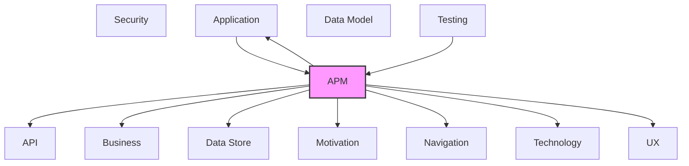

# APM

Observability, monitoring, metrics, logging, and tracing.

## Report Index

- [Layer Introduction](#layer-introduction)
- [Intra-Layer Relationships](#intra-layer-relationships)
- [Inter-Layer Dependencies](#inter-layer-dependencies)
- [Inter-Layer Relationships Table](#inter-layer-relationships-table)
- [Element Reference](#element-reference)

## Layer Introduction

| Metric                    | Count |
| ------------------------- | ----- |
| Elements                  | 17    |
| Intra-Layer Relationships | 17    |
| Inter-Layer Relationships | 44    |
| Inbound Relationships     | 7     |
| Outbound Relationships    | 37    |

**Cross-Layer References**:

- **Upstream layers**: [Application](./04-application-layer-report.md), [Testing](./12-testing-layer-report.md)
- **Downstream layers**: [API](./06-api-layer-report.md), [Application](./04-application-layer-report.md), [Business](./02-business-layer-report.md), [Data Store](./08-data-store-layer-report.md), [Motivation](./01-motivation-layer-report.md), [Navigation](./10-navigation-layer-report.md), [Technology](./05-technology-layer-report.md), [UX](./09-ux-layer-report.md)

## Intra-Layer Relationships

```mermaid
flowchart LR
  subgraph apm
    apm_dashboard_pipeline_performance_dashboard["Pipeline Performance Dashboard"]
    apm_dashboard_system_health_dashboard["System Health Dashboard"]
    apm_instrumentationconfig_auto_instrumentation_setup["Auto-Instrumentation Setup"]
    apm_logconfiguration_structured_logging_with_trace_context["Structured Logging with Trace Context"]
    apm_metricinstrument_agent_execution_duration["Agent Execution Duration"]
    apm_metricinstrument_board_reconciliation_metrics["Board Reconciliation Metrics"]
    apm_metricinstrument_circuit_breaker_state_metrics["CircuitBreaker State Metrics"]
    apm_metricinstrument_event_bus_stats["Event Bus Stats"]
    apm_metricinstrument_performance_threshold_metrics["Performance Threshold Metrics"]
    apm_metricinstrument_repair_cycle_metrics["Repair Cycle Metrics"]
    apm_span_agent_execution_trace["Agent Execution Trace"]
    apm_span_dead_letter_queue_processing_span["Dead Letter Queue Processing Span"]
    apm_span_event_handler_trace["Event Handler Trace"]
    apm_span_event_replay_span["Event Replay Span"]
    apm_span_repair_cycle_profiling_span["Repair Cycle Profiling Span"]
    apm_span_web_socket_session_trace["WebSocket Session Trace"]
    apm_traceconfiguration_open_telemetry_setup["OpenTelemetry Setup"]
    apm_dashboard_pipeline_performance_dashboard -->|monitors| apm_metricinstrument_agent_execution_duration
    apm_dashboard_pipeline_performance_dashboard -->|monitors| apm_metricinstrument_repair_cycle_metrics
    apm_dashboard_pipeline_performance_dashboard -->|monitors| apm_span_agent_execution_trace
    apm_dashboard_system_health_dashboard -->|monitors| apm_metricinstrument_agent_execution_duration
    apm_dashboard_system_health_dashboard -->|monitors| apm_metricinstrument_board_reconciliation_metrics
    apm_dashboard_system_health_dashboard -->|monitors| apm_metricinstrument_event_bus_stats
    apm_dashboard_system_health_dashboard -->|monitors| apm_span_agent_execution_trace
    apm_dashboard_system_health_dashboard -->|monitors| apm_span_event_handler_trace
    apm_dashboard_system_health_dashboard -->|monitors| apm_span_web_socket_session_trace
    apm_logconfiguration_structured_logging_with_trace_context -->|references| apm_traceconfiguration_open_telemetry_setup
    apm_metricinstrument_agent_execution_duration -->|flows-to| apm_span_agent_execution_trace
    apm_metricinstrument_agent_execution_duration -->|references| apm_span_agent_execution_trace
    apm_metricinstrument_event_bus_stats -->|references| apm_span_event_handler_trace
    apm_metricinstrument_repair_cycle_metrics -->|references| apm_span_agent_execution_trace
    apm_traceconfiguration_open_telemetry_setup -->|aggregates| apm_metricinstrument_agent_execution_duration
    apm_traceconfiguration_open_telemetry_setup -->|aggregates| apm_span_agent_execution_trace
    apm_traceconfiguration_open_telemetry_setup -->|aggregates| apm_span_event_handler_trace
  end
```

## Inter-Layer Dependencies

## Inter-Layer Relationships Table

| Relationship ID                                                       | Source Node                                                  | Dest Node                                                     | Dest Layer    | Predicate    | Cardinality  | Strength |
| --------------------------------------------------------------------- | ------------------------------------------------------------ | ------------------------------------------------------------- | ------------- | ------------ | ------------ | -------- |
| `apm.instrumentationconfig.monitors.application.applicationcomponent` | `apm.instrumentationconfig.auto-instrumentation-setup`       | `application.applicationcomponent.board-column-event-handler` | `application` | `monitors`   | many-to-many | medium   |
| `apm.instrumentationconfig.monitors.application.applicationcomponent` | `apm.instrumentationconfig.auto-instrumentation-setup`       | `application.applicationcomponent.event-bus-wiring`           | `application` | `monitors`   | many-to-many | medium   |
| `apm.instrumentationconfig.monitors.technology.systemsoftware`        | `apm.instrumentationconfig.auto-instrumentation-setup`       | `technology.systemsoftware.fast-api`                          | `technology`  | `monitors`   | many-to-many | medium   |
| `apm.instrumentationconfig.monitors.technology.systemsoftware`        | `apm.instrumentationconfig.auto-instrumentation-setup`       | `technology.systemsoftware.open-telemetry`                    | `technology`  | `monitors`   | many-to-many | medium   |
| `apm.instrumentationconfig.monitors.technology.systemsoftware`        | `apm.instrumentationconfig.auto-instrumentation-setup`       | `technology.systemsoftware.prometheus`                        | `technology`  | `monitors`   | many-to-many | medium   |
| `apm.instrumentationconfig.monitors.technology.systemsoftware`        | `apm.instrumentationconfig.auto-instrumentation-setup`       | `technology.systemsoftware.redis-client`                      | `technology`  | `monitors`   | many-to-many | medium   |
| `apm.instrumentationconfig.monitors.technology.systemsoftware`        | `apm.instrumentationconfig.auto-instrumentation-setup`       | `technology.systemsoftware.sqlalchemy`                        | `technology`  | `monitors`   | many-to-many | medium   |
| `apm.logconfiguration.depends-on.data-store.database`                 | `apm.logconfiguration.structured-logging-with-trace-context` | `data-store.database.elasticsearch-event-store`               | `data-store`  | `depends-on` | many-to-many | medium   |
| `apm.logconfiguration.monitors.business.businessservice`              | `apm.logconfiguration.structured-logging-with-trace-context` | `business.businessservice.agent-execution-management`         | `business`    | `monitors`   | many-to-many | medium   |
| `apm.logconfiguration.monitors.business.businessservice`              | `apm.logconfiguration.structured-logging-with-trace-context` | `business.businessservice.workflow-automation`                | `business`    | `monitors`   | many-to-many | medium   |
| `apm.metricinstrument.monitors.api.operation`                         | `apm.metricinstrument.agent-execution-duration`              | `api.operation.start-workflow-execution`                      | `api`         | `monitors`   | many-to-many | medium   |
| `apm.metricinstrument.monitors.application.applicationservice`        | `apm.metricinstrument.agent-execution-duration`              | `application.applicationservice.execution-service`            | `application` | `monitors`   | many-to-many | medium   |
| `apm.metricinstrument.monitors.navigation.route`                      | `apm.metricinstrument.agent-execution-duration`              | `navigation.route.pipeline-flow-route`                        | `navigation`  | `monitors`   | many-to-many | medium   |
| `apm.metricinstrument.monitors.ux.view`                               | `apm.metricinstrument.agent-execution-duration`              | `ux.view.pipeline-flow`                                       | `ux`          | `monitors`   | many-to-many | medium   |
| `apm.metricinstrument.realizes.motivation.goal`                       | `apm.metricinstrument.agent-execution-duration`              | `motivation.goal.complete-observability-via-event-sourcing`   | `motivation`  | `realizes`   | many-to-many | medium   |
| `apm.metricinstrument.monitors.api.operation`                         | `apm.metricinstrument.board-reconciliation-metrics`          | `api.operation.get-workflow-run`                              | `api`         | `monitors`   | many-to-many | medium   |
| `apm.metricinstrument.monitors.application.applicationcomponent`      | `apm.metricinstrument.board-reconciliation-metrics`          | `application.applicationcomponent.board-column-event-handler` | `application` | `monitors`   | many-to-many | medium   |
| `apm.metricinstrument.monitors.data-store.database`                   | `apm.metricinstrument.board-reconciliation-metrics`          | `data-store.database.elasticsearch-event-store`               | `data-store`  | `monitors`   | many-to-many | medium   |
| `apm.metricinstrument.monitors.ux.view`                               | `apm.metricinstrument.board-reconciliation-metrics`          | `ux.view.dashboard`                                           | `ux`          | `monitors`   | many-to-many | medium   |
| `apm.metricinstrument.monitors.application.applicationservice`        | `apm.metricinstrument.circuit-breaker-state-metrics`         | `application.applicationservice.workflow-orchestrator`        | `application` | `monitors`   | many-to-many | medium   |
| `apm.metricinstrument.monitors.application.applicationservice`        | `apm.metricinstrument.event-bus-stats`                       | `application.applicationservice.workflow-orchestrator`        | `application` | `monitors`   | many-to-many | medium   |
| `apm.metricinstrument.monitors.data-store.database`                   | `apm.metricinstrument.event-bus-stats`                       | `data-store.database.redis-event-store`                       | `data-store`  | `monitors`   | many-to-many | medium   |
| `apm.metricinstrument.realizes.motivation.goal`                       | `apm.metricinstrument.event-bus-stats`                       | `motivation.goal.complete-observability-via-event-sourcing`   | `motivation`  | `realizes`   | many-to-many | medium   |
| `apm.metricinstrument.monitors.application.applicationservice`        | `apm.metricinstrument.repair-cycle-metrics`                  | `application.applicationservice.metrics-service`              | `application` | `monitors`   | many-to-many | medium   |
| `apm.span.monitors.api.operation`                                     | `apm.span.agent-execution-trace`                             | `api.operation.get-execution`                                 | `api`         | `monitors`   | many-to-many | medium   |
| `apm.span.monitors.api.operation`                                     | `apm.span.agent-execution-trace`                             | `api.operation.start-workflow-execution`                      | `api`         | `monitors`   | many-to-many | medium   |
| `apm.span.monitors.application.applicationservice`                    | `apm.span.agent-execution-trace`                             | `application.applicationservice.execution-service`            | `application` | `monitors`   | many-to-many | medium   |
| `apm.span.monitors.data-store.database`                               | `apm.span.agent-execution-trace`                             | `data-store.database.redis-event-store`                       | `data-store`  | `monitors`   | many-to-many | medium   |
| `apm.span.monitors.api.operation`                                     | `apm.span.event-handler-trace`                               | `api.operation.get-domain-events`                             | `api`         | `monitors`   | many-to-many | medium   |
| `apm.span.monitors.application.applicationcomponent`                  | `apm.span.event-handler-trace`                               | `application.applicationcomponent.execution-event-handler`    | `application` | `monitors`   | many-to-many | medium   |
| `apm.span.monitors.data-store.database`                               | `apm.span.event-handler-trace`                               | `data-store.database.elasticsearch-event-store`               | `data-store`  | `monitors`   | many-to-many | medium   |
| `apm.span.monitors.application.applicationcomponent`                  | `apm.span.repair-cycle-profiling-span`                       | `application.applicationcomponent.repair-cycle-event-handler` | `application` | `monitors`   | many-to-many | medium   |
| `apm.span.monitors.api.operation`                                     | `apm.span.web-socket-session-trace`                          | `api.operation.stream-simulation-events`                      | `api`         | `monitors`   | many-to-many | medium   |
| `apm.span.monitors.application.applicationcomponent`                  | `apm.span.web-socket-session-trace`                          | `application.applicationcomponent.event-bus-wiring`           | `application` | `monitors`   | many-to-many | medium   |
| `apm.traceconfiguration.monitors.application.applicationservice`      | `apm.traceconfiguration.open-telemetry-setup`                | `application.applicationservice.board-polling-service`        | `application` | `monitors`   | many-to-many | medium   |
| `apm.traceconfiguration.monitors.application.applicationservice`      | `apm.traceconfiguration.open-telemetry-setup`                | `application.applicationservice.execution-service`            | `application` | `monitors`   | many-to-many | medium   |
| `apm.traceconfiguration.monitors.application.applicationservice`      | `apm.traceconfiguration.open-telemetry-setup`                | `application.applicationservice.workflow-orchestrator`        | `application` | `monitors`   | many-to-many | medium   |
| `application.applicationservice.references.apm.traceconfiguration`    | `application.applicationservice.agent-scheduler`             | `apm.traceconfiguration.open-telemetry-setup`                 | `apm`         | `references` | many-to-many | medium   |
| `application.applicationservice.references.apm.traceconfiguration`    | `application.applicationservice.board-polling-service`       | `apm.traceconfiguration.open-telemetry-setup`                 | `apm`         | `references` | many-to-many | medium   |
| `application.applicationservice.references.apm.traceconfiguration`    | `application.applicationservice.execution-service`           | `apm.traceconfiguration.open-telemetry-setup`                 | `apm`         | `references` | many-to-many | medium   |
| `application.applicationservice.references.apm.traceconfiguration`    | `application.applicationservice.multi-project-orchestrator`  | `apm.traceconfiguration.open-telemetry-setup`                 | `apm`         | `references` | many-to-many | medium   |
| `application.applicationservice.references.apm.traceconfiguration`    | `application.applicationservice.review-service`              | `apm.traceconfiguration.open-telemetry-setup`                 | `apm`         | `references` | many-to-many | medium   |
| `application.applicationservice.references.apm.traceconfiguration`    | `application.applicationservice.workflow-orchestrator`       | `apm.traceconfiguration.open-telemetry-setup`                 | `apm`         | `references` | many-to-many | medium   |
| `testing.testcoveragemodel.references.apm.traceconfiguration`         | `testing.testcoveragemodel.observability-integration-tests`  | `apm.traceconfiguration.open-telemetry-setup`                 | `apm`         | `references` | many-to-many | medium   |

## Element Reference

### Pipeline Performance Dashboard {#pipeline-performance-dashboard}

**ID**: `apm.dashboard.pipeline-performance-dashboard`

**Type**: `dashboard`

Dashboard for pipeline run metrics, execution timelines, and event audit trails

#### Relationships

| Type        | Related Element                                 | Predicate  | Direction |
| ----------- | ----------------------------------------------- | ---------- | --------- |
| intra-layer | `apm.metricinstrument.agent-execution-duration` | `monitors` | outbound  |
| intra-layer | `apm.metricinstrument.repair-cycle-metrics`     | `monitors` | outbound  |
| intra-layer | `apm.span.agent-execution-trace`                | `monitors` | outbound  |

### System Health Dashboard {#system-health-dashboard}

**ID**: `apm.dashboard.system-health-dashboard`

**Type**: `dashboard`

Operational dashboard showing active agents, circuit breaker states, API usage, and system status

#### Relationships

| Type        | Related Element                                     | Predicate  | Direction |
| ----------- | --------------------------------------------------- | ---------- | --------- |
| intra-layer | `apm.metricinstrument.agent-execution-duration`     | `monitors` | outbound  |
| intra-layer | `apm.metricinstrument.board-reconciliation-metrics` | `monitors` | outbound  |
| intra-layer | `apm.metricinstrument.event-bus-stats`              | `monitors` | outbound  |
| intra-layer | `apm.span.agent-execution-trace`                    | `monitors` | outbound  |
| intra-layer | `apm.span.event-handler-trace`                      | `monitors` | outbound  |
| intra-layer | `apm.span.web-socket-session-trace`                 | `monitors` | outbound  |

### Auto-Instrumentation Setup {#auto-instrumentation-setup}

**ID**: `apm.instrumentationconfig.auto-instrumentation-setup`

**Type**: `instrumentationconfig`

Automatic instrumentation for SQLAlchemy, Redis, and HTTP clients via OpenTelemetry hooks

#### Relationships

| Type        | Related Element                                               | Predicate  | Direction |
| ----------- | ------------------------------------------------------------- | ---------- | --------- |
| inter-layer | `application.applicationcomponent.board-column-event-handler` | `monitors` | outbound  |
| inter-layer | `application.applicationcomponent.event-bus-wiring`           | `monitors` | outbound  |
| inter-layer | `technology.systemsoftware.fast-api`                          | `monitors` | outbound  |
| inter-layer | `technology.systemsoftware.open-telemetry`                    | `monitors` | outbound  |
| inter-layer | `technology.systemsoftware.prometheus`                        | `monitors` | outbound  |
| inter-layer | `technology.systemsoftware.redis-client`                      | `monitors` | outbound  |
| inter-layer | `technology.systemsoftware.sqlalchemy`                        | `monitors` | outbound  |

### Structured Logging with Trace Context {#structured-logging-with-trace-context}

**ID**: `apm.logconfiguration.structured-logging-with-trace-context`

**Type**: `logconfiguration`

Log configuration that injects trace and span IDs into structured log records for correlation

#### Relationships

| Type        | Related Element                                       | Predicate    | Direction |
| ----------- | ----------------------------------------------------- | ------------ | --------- |
| inter-layer | `data-store.database.elasticsearch-event-store`       | `depends-on` | outbound  |
| inter-layer | `business.businessservice.agent-execution-management` | `monitors`   | outbound  |
| inter-layer | `business.businessservice.workflow-automation`        | `monitors`   | outbound  |
| intra-layer | `apm.traceconfiguration.open-telemetry-setup`         | `references` | outbound  |

### Agent Execution Duration {#agent-execution-duration}

**ID**: `apm.metricinstrument.agent-execution-duration`

**Type**: `metricinstrument`

Histogram tracking agent execution duration and latency for pipeline performance monitoring

#### Relationships

| Type        | Related Element                                             | Predicate    | Direction |
| ----------- | ----------------------------------------------------------- | ------------ | --------- |
| inter-layer | `api.operation.start-workflow-execution`                    | `monitors`   | outbound  |
| inter-layer | `application.applicationservice.execution-service`          | `monitors`   | outbound  |
| inter-layer | `navigation.route.pipeline-flow-route`                      | `monitors`   | outbound  |
| inter-layer | `ux.view.pipeline-flow`                                     | `monitors`   | outbound  |
| inter-layer | `motivation.goal.complete-observability-via-event-sourcing` | `realizes`   | outbound  |
| intra-layer | `apm.dashboard.pipeline-performance-dashboard`              | `monitors`   | inbound   |
| intra-layer | `apm.dashboard.system-health-dashboard`                     | `monitors`   | inbound   |
| intra-layer | `apm.span.agent-execution-trace`                            | `flows-to`   | outbound  |
| intra-layer | `apm.span.agent-execution-trace`                            | `references` | outbound  |
| intra-layer | `apm.traceconfiguration.open-telemetry-setup`               | `aggregates` | inbound   |

### Board Reconciliation Metrics {#board-reconciliation-metrics}

**ID**: `apm.metricinstrument.board-reconciliation-metrics`

**Type**: `metricinstrument`

Counter metrics for board reconciliation cycles, drift detections, and sync operations

#### Relationships

| Type        | Related Element                                               | Predicate  | Direction |
| ----------- | ------------------------------------------------------------- | ---------- | --------- |
| inter-layer | `api.operation.get-workflow-run`                              | `monitors` | outbound  |
| inter-layer | `application.applicationcomponent.board-column-event-handler` | `monitors` | outbound  |
| inter-layer | `data-store.database.elasticsearch-event-store`               | `monitors` | outbound  |
| inter-layer | `ux.view.dashboard`                                           | `monitors` | outbound  |
| intra-layer | `apm.dashboard.system-health-dashboard`                       | `monitors` | inbound   |

### CircuitBreaker State Metrics {#circuitbreaker-state-metrics}

**ID**: `apm.metricinstrument.circuit-breaker-state-metrics`

**Type**: `metricinstrument`

Metric instrument tracking circuit breaker state transitions (CLOSED/OPEN/HALF_OPEN) and failure counts for external service calls. Records total_calls, total_failures, total_successes, and current state per service. Used for resilience observability and detecting cascading failures.

#### Attributes

| Name | Value           |
| ---- | --------------- |
| type | ObservableGauge |
| unit | state           |

#### Relationships

| Type        | Related Element                                        | Predicate  | Direction |
| ----------- | ------------------------------------------------------ | ---------- | --------- |
| inter-layer | `application.applicationservice.workflow-orchestrator` | `monitors` | outbound  |

### Event Bus Stats {#event-bus-stats}

**ID**: `apm.metricinstrument.event-bus-stats`

**Type**: `metricinstrument`

Gauge and counter metrics for event bus throughput, handler errors, and queue depth

#### Relationships

| Type        | Related Element                                             | Predicate    | Direction |
| ----------- | ----------------------------------------------------------- | ------------ | --------- |
| inter-layer | `application.applicationservice.workflow-orchestrator`      | `monitors`   | outbound  |
| inter-layer | `data-store.database.redis-event-store`                     | `monitors`   | outbound  |
| inter-layer | `motivation.goal.complete-observability-via-event-sourcing` | `realizes`   | outbound  |
| intra-layer | `apm.dashboard.system-health-dashboard`                     | `monitors`   | inbound   |
| intra-layer | `apm.span.event-handler-trace`                              | `references` | outbound  |

### Performance Threshold Metrics {#performance-threshold-metrics}

**ID**: `apm.metricinstrument.performance-threshold-metrics`

**Type**: `metricinstrument`

Metric instrument for PerformanceThresholdMonitor tracking violations of configured performance thresholds (duration, memory, CPU) across repair cycle operations. Emits threshold violation counts per operation type enabling SLO enforcement and alerting on regression.

#### Attributes

| Name | Value      |
| ---- | ---------- |
| type | Counter    |
| unit | violations |

### Repair Cycle Metrics {#repair-cycle-metrics}

**ID**: `apm.metricinstrument.repair-cycle-metrics`

**Type**: `metricinstrument`

Counter and histogram metrics for repair cycle attempts, successes, and failures

#### Relationships

| Type        | Related Element                                  | Predicate    | Direction |
| ----------- | ------------------------------------------------ | ------------ | --------- |
| inter-layer | `application.applicationservice.metrics-service` | `monitors`   | outbound  |
| intra-layer | `apm.dashboard.pipeline-performance-dashboard`   | `monitors`   | inbound   |
| intra-layer | `apm.span.agent-execution-trace`                 | `references` | outbound  |

### Agent Execution Trace {#agent-execution-trace}

**ID**: `apm.span.agent-execution-trace`

**Type**: `span`

OpenTelemetry distributed trace span covering the full lifecycle of an agent execution

#### Relationships

| Type        | Related Element                                    | Predicate    | Direction |
| ----------- | -------------------------------------------------- | ------------ | --------- |
| inter-layer | `api.operation.get-execution`                      | `monitors`   | outbound  |
| inter-layer | `api.operation.start-workflow-execution`           | `monitors`   | outbound  |
| inter-layer | `application.applicationservice.execution-service` | `monitors`   | outbound  |
| inter-layer | `data-store.database.redis-event-store`            | `monitors`   | outbound  |
| intra-layer | `apm.dashboard.pipeline-performance-dashboard`     | `monitors`   | inbound   |
| intra-layer | `apm.dashboard.system-health-dashboard`            | `monitors`   | inbound   |
| intra-layer | `apm.metricinstrument.agent-execution-duration`    | `flows-to`   | inbound   |
| intra-layer | `apm.metricinstrument.agent-execution-duration`    | `references` | inbound   |
| intra-layer | `apm.metricinstrument.repair-cycle-metrics`        | `references` | inbound   |
| intra-layer | `apm.traceconfiguration.open-telemetry-setup`      | `aggregates` | inbound   |

### Dead Letter Queue Processing Span {#dead-letter-queue-processing-span}

**ID**: `apm.span.dead-letter-queue-processing-span`

**Type**: `span`

Distributed trace span covering the full lifecycle of failed event processing through the DeadLetterQueue. Tracks retry attempts, delay intervals, and final disposition (requeued, permanently failed, or recovered). Enables debugging of event processing failures and retry storms.

#### Attributes

| Name                   | Value     |
| ---------------------- | --------- |
| droppedAttributesCount | 0         |
| droppedEventsCount     | 0         |
| droppedLinksCount      | 0         |
| endTimeUnixNano        | 0         |
| parentSpanId           |           |
| spanId                 | dlq-span  |
| spanKind               | INTERNAL  |
| startTimeUnixNano      | 0         |
| traceId                | dlq-trace |
| traceState             |           |

### Event Handler Trace {#event-handler-trace}

**ID**: `apm.span.event-handler-trace`

**Type**: `span`

Distributed trace span for domain event handler invocations with causal linking

#### Relationships

| Type        | Related Element                                            | Predicate    | Direction |
| ----------- | ---------------------------------------------------------- | ------------ | --------- |
| inter-layer | `api.operation.get-domain-events`                          | `monitors`   | outbound  |
| inter-layer | `application.applicationcomponent.execution-event-handler` | `monitors`   | outbound  |
| inter-layer | `data-store.database.elasticsearch-event-store`            | `monitors`   | outbound  |
| intra-layer | `apm.dashboard.system-health-dashboard`                    | `monitors`   | inbound   |
| intra-layer | `apm.metricinstrument.event-bus-stats`                     | `references` | inbound   |
| intra-layer | `apm.traceconfiguration.open-telemetry-setup`              | `aggregates` | inbound   |

### Event Replay Span {#event-replay-span}

**ID**: `apm.span.event-replay-span`

**Type**: `span`

Distributed trace span for EventReplayer operations. Covers replay-from-timestamp and replay-for-aggregate workflows including event filtering, time manipulation, dry-run mode, and progress tracking. Tracks events_replayed count, error count, and replay duration for debugging and recovery use cases.

#### Attributes

| Name                   | Value        |
| ---------------------- | ------------ |
| droppedAttributesCount | 0            |
| droppedEventsCount     | 0            |
| droppedLinksCount      | 0            |
| endTimeUnixNano        | 0            |
| parentSpanId           |              |
| spanId                 | replay-span  |
| spanKind               | INTERNAL     |
| startTimeUnixNano      | 0            |
| traceId                | replay-trace |
| traceState             |              |

### Repair Cycle Profiling Span {#repair-cycle-profiling-span}

**ID**: `apm.span.repair-cycle-profiling-span`

**Type**: `span`

Distributed trace span for repair cycle operation profiling. Captures memory usage (via tracemalloc), CPU percent, operation duration, and peak resource consumption. Produced by RepairCycleProfiler and RepairCycleProfilerContext for bottleneck identification across repair iterations.

#### Attributes

| Name                   | Value          |
| ---------------------- | -------------- |
| droppedAttributesCount | 0              |
| droppedEventsCount     | 0              |
| droppedLinksCount      | 0              |
| endTimeUnixNano        | 0              |
| parentSpanId           |                |
| spanId                 | profiler-span  |
| spanKind               | INTERNAL       |
| startTimeUnixNano      | 0              |
| traceId                | profiler-trace |
| traceState             |                |

#### Relationships

| Type        | Related Element                                               | Predicate  | Direction |
| ----------- | ------------------------------------------------------------- | ---------- | --------- |
| inter-layer | `application.applicationcomponent.repair-cycle-event-handler` | `monitors` | outbound  |

### WebSocket Session Trace {#websocket-session-trace}

**ID**: `apm.span.web-socket-session-trace`

**Type**: `span`

Trace span for WebSocket session lifecycle including subscription and event delivery

#### Relationships

| Type        | Related Element                                     | Predicate  | Direction |
| ----------- | --------------------------------------------------- | ---------- | --------- |
| inter-layer | `api.operation.stream-simulation-events`            | `monitors` | outbound  |
| inter-layer | `application.applicationcomponent.event-bus-wiring` | `monitors` | outbound  |
| intra-layer | `apm.dashboard.system-health-dashboard`             | `monitors` | inbound   |

### OpenTelemetry Setup {#opentelemetry-setup}

**ID**: `apm.traceconfiguration.open-telemetry-setup`

**Type**: `traceconfiguration`

OTLP exporter configuration for Jaeger integration with sampling and resource attribution

#### Relationships

| Type        | Related Element                                              | Predicate    | Direction |
| ----------- | ------------------------------------------------------------ | ------------ | --------- |
| inter-layer | `application.applicationservice.board-polling-service`       | `monitors`   | outbound  |
| inter-layer | `application.applicationservice.execution-service`           | `monitors`   | outbound  |
| inter-layer | `application.applicationservice.workflow-orchestrator`       | `monitors`   | outbound  |
| inter-layer | `application.applicationservice.agent-scheduler`             | `references` | inbound   |
| inter-layer | `application.applicationservice.board-polling-service`       | `references` | inbound   |
| inter-layer | `application.applicationservice.execution-service`           | `references` | inbound   |
| inter-layer | `application.applicationservice.multi-project-orchestrator`  | `references` | inbound   |
| inter-layer | `application.applicationservice.review-service`              | `references` | inbound   |
| inter-layer | `application.applicationservice.workflow-orchestrator`       | `references` | inbound   |
| inter-layer | `testing.testcoveragemodel.observability-integration-tests`  | `references` | inbound   |
| intra-layer | `apm.logconfiguration.structured-logging-with-trace-context` | `references` | inbound   |
| intra-layer | `apm.metricinstrument.agent-execution-duration`              | `aggregates` | outbound  |
| intra-layer | `apm.span.agent-execution-trace`                             | `aggregates` | outbound  |
| intra-layer | `apm.span.event-handler-trace`                               | `aggregates` | outbound  |

---

Generated: 2026-05-09T09:27:22.725Z | Model Version: 0.1.0
