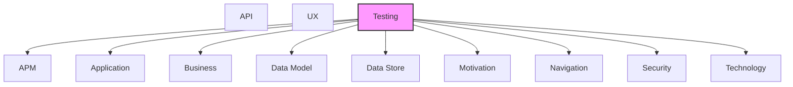

# Testing

Test strategies, test cases, test data, and test coverage.

## Report Index

- [Layer Introduction](#layer-introduction)
- [Intra-Layer Relationships](#intra-layer-relationships)
- [Inter-Layer Dependencies](#inter-layer-dependencies)
- [Inter-Layer Relationships Table](#inter-layer-relationships-table)
- [Element Reference](#element-reference)

## Layer Introduction

| Metric                    | Count |
| ------------------------- | ----- |
| Elements                  | 87    |
| Intra-Layer Relationships | 82    |
| Inter-Layer Relationships | 93    |
| Inbound Relationships     | 0     |
| Outbound Relationships    | 93    |

**Cross-Layer References**:

- **Downstream layers**: [APM](./11-apm-layer-report.md), [Application](./04-application-layer-report.md), [Business](./02-business-layer-report.md), [Data Model](./07-data-model-layer-report.md), [Data Store](./08-data-store-layer-report.md), [Motivation](./01-motivation-layer-report.md), [Navigation](./10-navigation-layer-report.md), [Security](./03-security-layer-report.md), [Technology](./05-technology-layer-report.md)

## Intra-Layer Relationships

*This layer has >30 elements. Summary table shown instead of diagram.*

| Element                                                                    | Type                  | Relationships |
| -------------------------------------------------------------------------- | --------------------- | ------------- |
| `testing.coveragerequirement.application-service-90-coverage`              | `coveragerequirement` | 55            |
| `testing.coveragerequirement.domain-layer-100-coverage`                    | `coveragerequirement` | 1             |
| `testing.testcasesketch.board-automation-scenario-a-e2e-cascade`           | `testcasesketch`      | 1             |
| `testing.testcasesketch.board-automation-scenario-b-lock-contention`       | `testcasesketch`      | 1             |
| `testing.testcasesketch.board-automation-scenario-c-review-rejection-loop` | `testcasesketch`      | 1             |
| `testing.testcasesketch.board-automation-scenario-d-edge-cases`            | `testcasesketch`      | 1             |
| `testing.testcasesketch.scenario-01-simple-workflow`                       | `testcasesketch`      | 1             |
| `testing.testcasesketch.scenario-02-parallel-executions`                   | `testcasesketch`      | 1             |
| `testing.testcasesketch.scenario-03-review-cycle`                          | `testcasesketch`      | 1             |
| `testing.testcasesketch.scenario-04-execution-failure`                     | `testcasesketch`      | 1             |
| `testing.testcasesketch.scenario-05-complex-workflow`                      | `testcasesketch`      | 1             |
| `testing.testcasesketch.scenario-06-sdlc-pipeline`                         | `testcasesketch`      | 1             |
| `testing.testcasesketch.scenario-06b-sdlc-pipeline-with-repair`            | `testcasesketch`      | 1             |
| `testing.testcasesketch.scenario-07-repair-cycle-test-fix-validate`        | `testcasesketch`      | 1             |
| `testing.testcasesketch.scenario-09-queue-position-ordering`               | `testcasesketch`      | 1             |
| `testing.testcasesketch.scenario-10-agent-execution`                       | `testcasesketch`      | 1             |
| `testing.testcasesketch.scenario-10b-multi-turn-dialogue`                  | `testcasesketch`      | 1             |
| `testing.testcasesketch.scenario-12-container-failure-recovery`            | `testcasesketch`      | 1             |
| `testing.testcasesketch.scenario-13-multi-project-orchestration`           | `testcasesketch`      | 1             |
| `testing.testcasesketch.scenario-environment-repair`                       | `testcasesketch`      | 1             |
| `testing.testcasesketch.yaml-scenario-dev-environment-repair`              | `testcasesketch`      | 1             |
| `testing.testcasesketch.yaml-scenario-failure-recovery`                    | `testcasesketch`      | 1             |
| `testing.testcasesketch.yaml-scenario-planning-design-pipeline`            | `testcasesketch`      | 1             |
| `testing.testcasesketch.yaml-scenario-planning-design-review-cycle`        | `testcasesketch`      | 1             |
| `testing.testcasesketch.yaml-scenario-pr-feedback-child-issue`             | `testcasesketch`      | 1             |
| `testing.testcasesketch.yaml-scenario-repair-cycle`                        | `testcasesketch`      | 1             |
| `testing.testcasesketch.yaml-scenario-review-cycle`                        | `testcasesketch`      | 1             |
| `testing.testcasesketch.yaml-scenario-sdlc-pipeline`                       | `testcasesketch`      | 1             |
| `testing.testcasesketch.yaml-scenario-smoke`                               | `testcasesketch`      | 1             |
| `testing.testcasesketch.yaml-scenario-stress-test`                         | `testcasesketch`      | 1             |
| `testing.testcoveragemodel.adapter-unit-tests`                             | `testcoveragemodel`   | 17            |
| `testing.testcoveragemodel.application-service-integration-tests`          | `testcoveragemodel`   | 6             |
| `testing.testcoveragemodel.application-service-unit-tests`                 | `testcoveragemodel`   | 0             |
| `testing.testcoveragemodel.board-automation-tests`                         | `testcoveragemodel`   | 0             |
| `testing.testcoveragemodel.domain-layer-unit-tests`                        | `testcoveragemodel`   | 1             |
| `testing.testcoveragemodel.domain-model-unit-tests`                        | `testcoveragemodel`   | 0             |
| `testing.testcoveragemodel.event-domain-unit-tests`                        | `testcoveragemodel`   | 0             |
| `testing.testcoveragemodel.failure-recovery-tests`                         | `testcoveragemodel`   | 0             |
| `testing.testcoveragemodel.integration-tests`                              | `testcoveragemodel`   | 0             |
| `testing.testcoveragemodel.multi-project-isolation-tests`                  | `testcoveragemodel`   | 0             |
| `testing.testcoveragemodel.observability-integration-tests`                | `testcoveragemodel`   | 0             |
| `testing.testcoveragemodel.port-adapter-contract-tests`                    | `testcoveragemodel`   | 0             |
| `testing.testcoveragemodel.rest-api-adapter-tests`                         | `testcoveragemodel`   | 0             |
| `testing.testcoveragemodel.simulation-framework`                           | `testcoveragemodel`   | 4             |
| `testing.testcoveragemodel.simulation-scenario-tests`                      | `testcoveragemodel`   | 0             |
| `testing.testcoveragetarget.capturing-mock-event-emitter`                  | `testcoveragetarget`  | 0             |
| `testing.testcoveragetarget.execution-service-agent-executor`              | `testcoveragetarget`  | 0             |
| `testing.testcoveragetarget.fake-container-adapter`                        | `testcoveragetarget`  | 2             |
| `testing.testcoveragetarget.in-memory-active-workflow-run-registry`        | `testcoveragetarget`  | 0             |
| `testing.testcoveragetarget.in-memory-agent-repository`                    | `testcoveragetarget`  | 2             |
| `testing.testcoveragetarget.in-memory-checkpoint-store`                    | `testcoveragetarget`  | 0             |
| `testing.testcoveragetarget.in-memory-code-review-adapter`                 | `testcoveragetarget`  | 2             |
| `testing.testcoveragetarget.in-memory-config-store`                        | `testcoveragetarget`  | 2             |
| `testing.testcoveragetarget.in-memory-event-store`                         | `testcoveragetarget`  | 2             |
| `testing.testcoveragetarget.in-memory-failed-event-store`                  | `testcoveragetarget`  | 0             |
| `testing.testcoveragetarget.in-memory-message-broker`                      | `testcoveragetarget`  | 0             |
| `testing.testcoveragetarget.in-memory-metrics-adapter`                     | `testcoveragetarget`  | 2             |
| `testing.testcoveragetarget.in-memory-queue-service`                       | `testcoveragetarget`  | 2             |
| `testing.testcoveragetarget.in-memory-repository-adapter`                  | `testcoveragetarget`  | 0             |
| `testing.testcoveragetarget.in-memory-storage-adapter`                     | `testcoveragetarget`  | 2             |
| `testing.testcoveragetarget.in-memory-ticket-adapter`                      | `testcoveragetarget`  | 2             |
| `testing.testcoveragetarget.in-memory-tracer`                              | `testcoveragetarget`  | 0             |
| `testing.testcoveragetarget.in-memory-version-control-service`             | `testcoveragetarget`  | 2             |
| `testing.testcoveragetarget.in-memory-work-item-branch-tracker`            | `testcoveragetarget`  | 0             |
| `testing.testcoveragetarget.in-memory-workflow-config-service`             | `testcoveragetarget`  | 2             |
| `testing.testcoveragetarget.input-port-mock-adapters`                      | `testcoveragetarget`  | 2             |
| `testing.testcoveragetarget.mock-agent-executor`                           | `testcoveragetarget`  | 2             |
| `testing.testcoveragetarget.mock-board-adapter`                            | `testcoveragetarget`  | 2             |
| `testing.testcoveragetarget.mock-branch-resolution-adapter`                | `testcoveragetarget`  | 0             |
| `testing.testcoveragetarget.mock-cipipeline-adapter`                       | `testcoveragetarget`  | 0             |
| `testing.testcoveragetarget.mock-container-recovery-adapter`               | `testcoveragetarget`  | 2             |
| `testing.testcoveragetarget.mock-discussion-adapter`                       | `testcoveragetarget`  | 0             |
| `testing.testcoveragetarget.mock-environment-repair-adapter`               | `testcoveragetarget`  | 2             |
| `testing.testcoveragetarget.mock-event-emitter`                            | `testcoveragetarget`  | 2             |
| `testing.testcoveragetarget.mock-llmadapter`                               | `testcoveragetarget`  | 2             |
| `testing.testcoveragetarget.mock-notifier-adapter`                         | `testcoveragetarget`  | 2             |
| `testing.testcoveragetarget.mock-project-manager-adapter`                  | `testcoveragetarget`  | 0             |
| `testing.testcoveragetarget.mock-prreview-cycle-adapter`                   | `testcoveragetarget`  | 2             |
| `testing.testcoveragetarget.mock-repair-cycle-adapter`                     | `testcoveragetarget`  | 2             |
| `testing.testcoveragetarget.mock-review-cycle-adapter`                     | `testcoveragetarget`  | 2             |
| `testing.testcoveragetarget.mock-systemic-analysis-adapter`                | `testcoveragetarget`  | 0             |
| `testing.testcoveragetarget.mock-work-item-service`                        | `testcoveragetarget`  | 0             |
| `testing.testcoveragetarget.simple-encryption-adapter`                     | `testcoveragetarget`  | 0             |
| `testing.testcoveragetarget.simulation-application-bootstrap`              | `testcoveragetarget`  | 2             |
| `testing.testcoveragetarget.simulation-clock`                              | `testcoveragetarget`  | 2             |
| `testing.testcoveragetarget.simulation-config`                             | `testcoveragetarget`  | 2             |
| `testing.testcoveragetarget.simulation-runner`                             | `testcoveragetarget`  | 2             |

## Inter-Layer Dependencies

## Inter-Layer Relationships Table

| Relationship ID                                                         | Source Node                                                                | Dest Node                                                         | Dest Layer    | Predicate                | Cardinality  | Strength |
| ----------------------------------------------------------------------- | -------------------------------------------------------------------------- | ----------------------------------------------------------------- | ------------- | ------------------------ | ------------ | -------- |
| `testing.testcasesketch.tests.application.applicationservice`           | `testing.testcasesketch.board-automation-scenario-a-e2e-cascade`           | `application.applicationservice.board-polling-service`            | `application` | `tests`                  | many-to-many | medium   |
| `testing.testcasesketch.tests.application.applicationservice`           | `testing.testcasesketch.board-automation-scenario-b-lock-contention`       | `application.applicationservice.pipeline-lock-service`            | `application` | `tests`                  | many-to-many | medium   |
| `testing.testcasesketch.tests.application.applicationservice`           | `testing.testcasesketch.board-automation-scenario-c-review-rejection-loop` | `application.applicationservice.review-service`                   | `application` | `tests`                  | many-to-many | medium   |
| `testing.testcasesketch.tests.application.applicationservice`           | `testing.testcasesketch.board-automation-scenario-d-edge-cases`            | `application.applicationservice.workflow-orchestrator`            | `application` | `tests`                  | many-to-many | medium   |
| `testing.testcasesketch.tests.application.applicationservice`           | `testing.testcasesketch.scenario-01-simple-workflow`                       | `application.applicationservice.workflow-orchestrator`            | `application` | `tests`                  | many-to-many | medium   |
| `testing.testcasesketch.tests.application.applicationservice`           | `testing.testcasesketch.scenario-02-parallel-executions`                   | `application.applicationservice.agent-scheduler`                  | `application` | `tests`                  | many-to-many | medium   |
| `testing.testcasesketch.tests.application.applicationservice`           | `testing.testcasesketch.scenario-03-review-cycle`                          | `application.applicationservice.review-service`                   | `application` | `tests`                  | many-to-many | medium   |
| `testing.testcasesketch.tests.application.applicationservice`           | `testing.testcasesketch.scenario-04-execution-failure`                     | `application.applicationservice.execution-service`                | `application` | `tests`                  | many-to-many | medium   |
| `testing.testcasesketch.tests.application.applicationservice`           | `testing.testcasesketch.scenario-05-complex-workflow`                      | `application.applicationservice.workflow-orchestrator`            | `application` | `tests`                  | many-to-many | medium   |
| `testing.testcasesketch.tests.application.applicationservice`           | `testing.testcasesketch.scenario-06-sdlc-pipeline`                         | `application.applicationservice.pipeline-manager`                 | `application` | `tests`                  | many-to-many | medium   |
| `testing.testcasesketch.tests.application.applicationservice`           | `testing.testcasesketch.scenario-06b-sdlc-pipeline-with-repair`            | `application.applicationservice.pipeline-manager`                 | `application` | `tests`                  | many-to-many | medium   |
| `testing.testcasesketch.tests.application.applicationservice`           | `testing.testcasesketch.scenario-07-repair-cycle-test-fix-validate`        | `application.applicationservice.agent-execution-recovery-service` | `application` | `tests`                  | many-to-many | medium   |
| `testing.testcasesketch.tests.application.applicationservice`           | `testing.testcasesketch.scenario-09-queue-position-ordering`               | `application.applicationservice.pipeline-lock-service`            | `application` | `tests`                  | many-to-many | medium   |
| `testing.testcasesketch.tests.application.applicationservice`           | `testing.testcasesketch.scenario-10-agent-execution`                       | `application.applicationservice.execution-service`                | `application` | `tests`                  | many-to-many | medium   |
| `testing.testcasesketch.tests.application.applicationservice`           | `testing.testcasesketch.scenario-10b-multi-turn-dialogue`                  | `application.applicationservice.conversational-loop-orchestrator` | `application` | `tests`                  | many-to-many | medium   |
| `testing.testcasesketch.tests.application.applicationservice`           | `testing.testcasesketch.scenario-12-container-failure-recovery`            | `application.applicationservice.container-recovery-service`       | `application` | `tests`                  | many-to-many | medium   |
| `testing.testcasesketch.tests.application.applicationservice`           | `testing.testcasesketch.scenario-13-multi-project-orchestration`           | `application.applicationservice.multi-project-orchestrator`       | `application` | `tests`                  | many-to-many | medium   |
| `testing.testcasesketch.tests.application.applicationservice`           | `testing.testcasesketch.scenario-environment-repair`                       | `application.applicationservice.agent-execution-recovery-service` | `application` | `tests`                  | many-to-many | medium   |
| `testing.testcasesketch.tests.application.applicationservice`           | `testing.testcasesketch.yaml-scenario-dev-environment-repair`              | `application.applicationservice.agent-execution-recovery-service` | `application` | `tests`                  | many-to-many | medium   |
| `testing.testcasesketch.tests.application.applicationservice`           | `testing.testcasesketch.yaml-scenario-failure-recovery`                    | `application.applicationservice.container-recovery-service`       | `application` | `tests`                  | many-to-many | medium   |
| `testing.testcasesketch.tests.application.applicationservice`           | `testing.testcasesketch.yaml-scenario-planning-design-pipeline`            | `application.applicationservice.pipeline-manager`                 | `application` | `tests`                  | many-to-many | medium   |
| `testing.testcasesketch.tests.application.applicationservice`           | `testing.testcasesketch.yaml-scenario-planning-design-review-cycle`        | `application.applicationservice.review-service`                   | `application` | `tests`                  | many-to-many | medium   |
| `testing.testcasesketch.tests.application.applicationservice`           | `testing.testcasesketch.yaml-scenario-pr-feedback-child-issue`             | `application.applicationservice.feedback-processor`               | `application` | `tests`                  | many-to-many | medium   |
| `testing.testcasesketch.tests.application.applicationservice`           | `testing.testcasesketch.yaml-scenario-repair-cycle`                        | `application.applicationservice.agent-execution-recovery-service` | `application` | `tests`                  | many-to-many | medium   |
| `testing.testcasesketch.tests.application.applicationservice`           | `testing.testcasesketch.yaml-scenario-review-cycle`                        | `application.applicationservice.review-service`                   | `application` | `tests`                  | many-to-many | medium   |
| `testing.testcasesketch.tests.application.applicationservice`           | `testing.testcasesketch.yaml-scenario-sdlc-pipeline`                       | `application.applicationservice.pipeline-manager`                 | `application` | `tests`                  | many-to-many | medium   |
| `testing.testcasesketch.tests.application.applicationservice`           | `testing.testcasesketch.yaml-scenario-smoke`                               | `application.applicationservice.workflow-orchestrator`            | `application` | `tests`                  | many-to-many | medium   |
| `testing.testcasesketch.tests.application.applicationservice`           | `testing.testcasesketch.yaml-scenario-stress-test`                         | `application.applicationservice.agent-scheduler`                  | `application` | `tests`                  | many-to-many | medium   |
| `testing.testcoveragemodel.covers.application.applicationcomponent`     | `testing.testcoveragemodel.adapter-unit-tests`                             | `application.applicationcomponent.board-column-event-handler`     | `application` | `covers`                 | many-to-many | medium   |
| `testing.testcoveragemodel.governed-by-principles.motivation.principle` | `testing.testcoveragemodel.adapter-unit-tests`                             | `motivation.principle.hexagonal-architecture`                     | `motivation`  | `governed-by-principles` | many-to-many | high     |
| `testing.testcoveragemodel.tests.technology.systemsoftware`             | `testing.testcoveragemodel.adapter-unit-tests`                             | `technology.systemsoftware.pytest`                                | `technology`  | `tests`                  | many-to-many | medium   |
| `testing.testcoveragemodel.covers.application.applicationservice`       | `testing.testcoveragemodel.application-service-integration-tests`          | `application.applicationservice.agent-scheduler`                  | `application` | `covers`                 | many-to-many | medium   |
| `testing.testcoveragemodel.covers.application.applicationservice`       | `testing.testcoveragemodel.application-service-integration-tests`          | `application.applicationservice.execution-service`                | `application` | `covers`                 | many-to-many | medium   |
| `testing.testcoveragemodel.covers.application.applicationservice`       | `testing.testcoveragemodel.application-service-integration-tests`          | `application.applicationservice.workflow-orchestrator`            | `application` | `covers`                 | many-to-many | medium   |
| `testing.testcoveragemodel.covers.application.applicationservice`       | `testing.testcoveragemodel.application-service-unit-tests`                 | `application.applicationservice.agent-scheduler`                  | `application` | `covers`                 | many-to-many | medium   |
| `testing.testcoveragemodel.covers.application.applicationservice`       | `testing.testcoveragemodel.application-service-unit-tests`                 | `application.applicationservice.execution-service`                | `application` | `covers`                 | many-to-many | medium   |
| `testing.testcoveragemodel.covers.application.applicationservice`       | `testing.testcoveragemodel.application-service-unit-tests`                 | `application.applicationservice.multi-project-orchestrator`       | `application` | `covers`                 | many-to-many | medium   |
| `testing.testcoveragemodel.covers.application.applicationservice`       | `testing.testcoveragemodel.application-service-unit-tests`                 | `application.applicationservice.review-service`                   | `application` | `covers`                 | many-to-many | medium   |
| `testing.testcoveragemodel.covers.application.applicationservice`       | `testing.testcoveragemodel.application-service-unit-tests`                 | `application.applicationservice.workflow-orchestrator`            | `application` | `covers`                 | many-to-many | medium   |
| `testing.testcoveragemodel.tests.technology.systemsoftware`             | `testing.testcoveragemodel.application-service-unit-tests`                 | `technology.systemsoftware.pytest`                                | `technology`  | `tests`                  | many-to-many | medium   |
| `testing.testcoveragemodel.covers.application.applicationservice`       | `testing.testcoveragemodel.board-automation-tests`                         | `application.applicationservice.board-polling-service`            | `application` | `covers`                 | many-to-many | medium   |
| `testing.testcoveragemodel.covers.business.businessservice`             | `testing.testcoveragemodel.board-automation-tests`                         | `business.businessservice.workflow-automation`                    | `business`    | `covers`                 | many-to-many | medium   |
| `testing.testcoveragemodel.tests.technology.systemsoftware`             | `testing.testcoveragemodel.board-automation-tests`                         | `technology.systemsoftware.pytest`                                | `technology`  | `tests`                  | many-to-many | medium   |
| `testing.testcoveragemodel.covers.data-model.objectschema`              | `testing.testcoveragemodel.domain-model-unit-tests`                        | `data-model.objectschema.agent-execution`                         | `data-model`  | `covers`                 | many-to-many | medium   |
| `testing.testcoveragemodel.covers.data-model.objectschema`              | `testing.testcoveragemodel.domain-model-unit-tests`                        | `data-model.objectschema.review-cycle`                            | `data-model`  | `covers`                 | many-to-many | medium   |
| `testing.testcoveragemodel.covers.data-model.objectschema`              | `testing.testcoveragemodel.domain-model-unit-tests`                        | `data-model.objectschema.work-item`                               | `data-model`  | `covers`                 | many-to-many | medium   |
| `testing.testcoveragemodel.covers.data-model.objectschema`              | `testing.testcoveragemodel.domain-model-unit-tests`                        | `data-model.objectschema.workflow`                                | `data-model`  | `covers`                 | many-to-many | medium   |
| `testing.testcoveragemodel.governed-by-principles.motivation.principle` | `testing.testcoveragemodel.domain-model-unit-tests`                        | `motivation.principle.domain-purity`                              | `motivation`  | `governed-by-principles` | many-to-many | high     |
| `testing.testcoveragemodel.supports-goals.motivation.goal`              | `testing.testcoveragemodel.domain-model-unit-tests`                        | `motivation.goal.full-testability-without-external-services`      | `motivation`  | `supports-goals`         | many-to-many | high     |
| `testing.testcoveragemodel.tests.technology.systemsoftware`             | `testing.testcoveragemodel.domain-model-unit-tests`                        | `technology.systemsoftware.pytest`                                | `technology`  | `tests`                  | many-to-many | medium   |
| `testing.testcoveragemodel.covers.data-model.objectschema`              | `testing.testcoveragemodel.event-domain-unit-tests`                        | `data-model.objectschema.agent-execution`                         | `data-model`  | `covers`                 | many-to-many | medium   |
| `testing.testcoveragemodel.covers.data-model.objectschema`              | `testing.testcoveragemodel.event-domain-unit-tests`                        | `data-model.objectschema.review-cycle`                            | `data-model`  | `covers`                 | many-to-many | medium   |
| `testing.testcoveragemodel.covers.data-model.objectschema`              | `testing.testcoveragemodel.event-domain-unit-tests`                        | `data-model.objectschema.work-item`                               | `data-model`  | `covers`                 | many-to-many | medium   |
| `testing.testcoveragemodel.covers.data-model.objectschema`              | `testing.testcoveragemodel.event-domain-unit-tests`                        | `data-model.objectschema.workflow`                                | `data-model`  | `covers`                 | many-to-many | medium   |
| `testing.testcoveragemodel.tests.technology.systemsoftware`             | `testing.testcoveragemodel.event-domain-unit-tests`                        | `technology.systemsoftware.pytest`                                | `technology`  | `tests`                  | many-to-many | medium   |
| `testing.testcoveragemodel.covers.application.applicationservice`       | `testing.testcoveragemodel.failure-recovery-tests`                         | `application.applicationservice.container-recovery-service`       | `application` | `covers`                 | many-to-many | medium   |
| `testing.testcoveragemodel.references.data-store.database`              | `testing.testcoveragemodel.failure-recovery-tests`                         | `data-store.database.redis-event-store`                           | `data-store`  | `references`             | many-to-many | medium   |
| `testing.testcoveragemodel.supports-goals.motivation.goal`              | `testing.testcoveragemodel.failure-recovery-tests`                         | `motivation.goal.automate-software-development-workflows`         | `motivation`  | `supports-goals`         | many-to-many | high     |
| `testing.testcoveragemodel.tests.technology.systemsoftware`             | `testing.testcoveragemodel.failure-recovery-tests`                         | `technology.systemsoftware.pytest`                                | `technology`  | `tests`                  | many-to-many | medium   |
| `testing.testcoveragemodel.covers.application.applicationcomponent`     | `testing.testcoveragemodel.integration-tests`                              | `application.applicationcomponent.event-bus-wiring`               | `application` | `covers`                 | many-to-many | medium   |
| `testing.testcoveragemodel.covers.application.applicationservice`       | `testing.testcoveragemodel.integration-tests`                              | `application.applicationservice.board-polling-service`            | `application` | `covers`                 | many-to-many | medium   |
| `testing.testcoveragemodel.covers.application.applicationservice`       | `testing.testcoveragemodel.integration-tests`                              | `application.applicationservice.workflow-orchestrator`            | `application` | `covers`                 | many-to-many | medium   |
| `testing.testcoveragemodel.covers.business.businessservice`             | `testing.testcoveragemodel.integration-tests`                              | `business.businessservice.agent-execution-management`             | `business`    | `covers`                 | many-to-many | medium   |
| `testing.testcoveragemodel.covers.data-model.objectschema`              | `testing.testcoveragemodel.integration-tests`                              | `data-model.objectschema.agent-execution`                         | `data-model`  | `covers`                 | many-to-many | medium   |
| `testing.testcoveragemodel.covers.navigation.route`                     | `testing.testcoveragemodel.integration-tests`                              | `navigation.route.pipeline-flow-route`                            | `navigation`  | `covers`                 | many-to-many | medium   |
| `testing.testcoveragemodel.references.data-store.database`              | `testing.testcoveragemodel.integration-tests`                              | `data-store.database.redis-event-store`                           | `data-store`  | `references`             | many-to-many | medium   |
| `testing.testcoveragemodel.tests.technology.systemsoftware`             | `testing.testcoveragemodel.integration-tests`                              | `technology.systemsoftware.pytest`                                | `technology`  | `tests`                  | many-to-many | medium   |
| `testing.testcoveragemodel.covers.application.applicationservice`       | `testing.testcoveragemodel.multi-project-isolation-tests`                  | `application.applicationservice.multi-project-orchestrator`       | `application` | `covers`                 | many-to-many | medium   |
| `testing.testcoveragemodel.supports-goals.motivation.goal`              | `testing.testcoveragemodel.multi-project-isolation-tests`                  | `motivation.goal.automate-software-development-workflows`         | `motivation`  | `supports-goals`         | many-to-many | high     |
| `testing.testcoveragemodel.tests.technology.systemsoftware`             | `testing.testcoveragemodel.multi-project-isolation-tests`                  | `technology.systemsoftware.pytest`                                | `technology`  | `tests`                  | many-to-many | medium   |
| `testing.testcoveragemodel.covers.application.applicationcomponent`     | `testing.testcoveragemodel.observability-integration-tests`                | `application.applicationcomponent.event-bus-wiring`               | `application` | `covers`                 | many-to-many | medium   |
| `testing.testcoveragemodel.covers.application.applicationservice`       | `testing.testcoveragemodel.observability-integration-tests`                | `application.applicationservice.metrics-service`                  | `application` | `covers`                 | many-to-many | medium   |
| `testing.testcoveragemodel.covers.business.businessfunction`            | `testing.testcoveragemodel.observability-integration-tests`                | `business.businessfunction.event-sourced-audit-trail`             | `business`    | `covers`                 | many-to-many | medium   |
| `testing.testcoveragemodel.references.apm.traceconfiguration`           | `testing.testcoveragemodel.observability-integration-tests`                | `apm.traceconfiguration.open-telemetry-setup`                     | `apm`         | `references`             | many-to-many | medium   |
| `testing.testcoveragemodel.references.data-store.database`              | `testing.testcoveragemodel.observability-integration-tests`                | `data-store.database.elasticsearch-event-store`                   | `data-store`  | `references`             | many-to-many | medium   |
| `testing.testcoveragemodel.supports-goals.motivation.goal`              | `testing.testcoveragemodel.observability-integration-tests`                | `motivation.goal.complete-observability-via-event-sourcing`       | `motivation`  | `supports-goals`         | many-to-many | high     |
| `testing.testcoveragemodel.tests.technology.systemsoftware`             | `testing.testcoveragemodel.observability-integration-tests`                | `technology.systemsoftware.pytest`                                | `technology`  | `tests`                  | many-to-many | medium   |
| `testing.testcoveragemodel.covers.security.securitypolicy`              | `testing.testcoveragemodel.port-adapter-contract-tests`                    | `security.securitypolicy.container-isolation`                     | `security`    | `covers`                 | many-to-many | medium   |
| `testing.testcoveragemodel.governed-by-principles.motivation.principle` | `testing.testcoveragemodel.port-adapter-contract-tests`                    | `motivation.principle.hexagonal-architecture`                     | `motivation`  | `governed-by-principles` | many-to-many | high     |
| `testing.testcoveragemodel.tests.technology.systemsoftware`             | `testing.testcoveragemodel.port-adapter-contract-tests`                    | `technology.systemsoftware.pytest`                                | `technology`  | `tests`                  | many-to-many | medium   |
| `testing.testcoveragemodel.covers.application.applicationservice`       | `testing.testcoveragemodel.rest-api-adapter-tests`                         | `application.applicationservice.authentication-service`           | `application` | `covers`                 | many-to-many | medium   |
| `testing.testcoveragemodel.covers.navigation.route`                     | `testing.testcoveragemodel.rest-api-adapter-tests`                         | `navigation.route.dashboard-route`                                | `navigation`  | `covers`                 | many-to-many | medium   |
| `testing.testcoveragemodel.covers.security.securitypolicy`              | `testing.testcoveragemodel.rest-api-adapter-tests`                         | `security.securitypolicy.jwt-bearer-authentication`               | `security`    | `covers`                 | many-to-many | medium   |
| `testing.testcoveragemodel.covers.security.securitypolicy`              | `testing.testcoveragemodel.rest-api-adapter-tests`                         | `security.securitypolicy.role-based-access-control`               | `security`    | `covers`                 | many-to-many | medium   |
| `testing.testcoveragemodel.tests.technology.systemsoftware`             | `testing.testcoveragemodel.rest-api-adapter-tests`                         | `technology.systemsoftware.pytest`                                | `technology`  | `tests`                  | many-to-many | medium   |
| `testing.testcoveragemodel.covers.application.applicationcomponent`     | `testing.testcoveragemodel.simulation-framework`                           | `application.applicationcomponent.simulation-engine`              | `application` | `covers`                 | many-to-many | medium   |
| `testing.testcoveragemodel.covers.application.applicationservice`       | `testing.testcoveragemodel.simulation-framework`                           | `application.applicationservice.simulation-service`               | `application` | `covers`                 | many-to-many | medium   |
| `testing.testcoveragemodel.covers.application.applicationservice`       | `testing.testcoveragemodel.simulation-scenario-tests`                      | `application.applicationservice.simulation-service`               | `application` | `covers`                 | many-to-many | medium   |
| `testing.testcoveragemodel.covers.application.applicationservice`       | `testing.testcoveragemodel.simulation-scenario-tests`                      | `application.applicationservice.workflow-orchestrator`            | `application` | `covers`                 | many-to-many | medium   |
| `testing.testcoveragemodel.covers.business.businessservice`             | `testing.testcoveragemodel.simulation-scenario-tests`                      | `business.businessservice.workflow-automation`                    | `business`    | `covers`                 | many-to-many | medium   |
| `testing.testcoveragemodel.references.data-store.database`              | `testing.testcoveragemodel.simulation-scenario-tests`                      | `data-store.database.redis-event-store`                           | `data-store`  | `references`             | many-to-many | medium   |
| `testing.testcoveragemodel.supports-goals.motivation.goal`              | `testing.testcoveragemodel.simulation-scenario-tests`                      | `motivation.goal.full-testability-without-external-services`      | `motivation`  | `supports-goals`         | many-to-many | high     |
| `testing.testcoveragemodel.tests.technology.systemsoftware`             | `testing.testcoveragemodel.simulation-scenario-tests`                      | `technology.systemsoftware.pytest`                                | `technology`  | `tests`                  | many-to-many | medium   |

## Element Reference

### Application Service 90% Coverage {#application-service-90-coverage}

**ID**: `testing.coveragerequirement.application-service-90-coverage`

**Type**: `coveragerequirement`

All 23 application services and event handlers must achieve 90% code coverage using mock adapters in simulation mode; covers WorkflowOrchestrator, AgentScheduler, ExecutionService, ReviewService and related services

#### Attributes

| Name             | Value          |
| ---------------- | -------------- |
| coverageCriteria | all-partitions |
| priority         | high           |

#### Relationships

| Type        | Related Element                                                            | Predicate    | Direction |
| ----------- | -------------------------------------------------------------------------- | ------------ | --------- |
| intra-layer | `testing.testcasesketch.board-automation-scenario-a-e2e-cascade`           | `references` | inbound   |
| intra-layer | `testing.testcasesketch.board-automation-scenario-b-lock-contention`       | `references` | inbound   |
| intra-layer | `testing.testcasesketch.board-automation-scenario-c-review-rejection-loop` | `references` | inbound   |
| intra-layer | `testing.testcasesketch.board-automation-scenario-d-edge-cases`            | `references` | inbound   |
| intra-layer | `testing.testcasesketch.scenario-01-simple-workflow`                       | `references` | inbound   |
| intra-layer | `testing.testcasesketch.scenario-02-parallel-executions`                   | `references` | inbound   |
| intra-layer | `testing.testcasesketch.scenario-03-review-cycle`                          | `references` | inbound   |
| intra-layer | `testing.testcasesketch.scenario-04-execution-failure`                     | `references` | inbound   |
| intra-layer | `testing.testcasesketch.scenario-05-complex-workflow`                      | `references` | inbound   |
| intra-layer | `testing.testcasesketch.scenario-06-sdlc-pipeline`                         | `references` | inbound   |
| intra-layer | `testing.testcasesketch.scenario-06b-sdlc-pipeline-with-repair`            | `references` | inbound   |
| intra-layer | `testing.testcasesketch.scenario-07-repair-cycle-test-fix-validate`        | `references` | inbound   |
| intra-layer | `testing.testcasesketch.scenario-09-queue-position-ordering`               | `references` | inbound   |
| intra-layer | `testing.testcasesketch.scenario-10-agent-execution`                       | `references` | inbound   |
| intra-layer | `testing.testcasesketch.scenario-10b-multi-turn-dialogue`                  | `references` | inbound   |
| intra-layer | `testing.testcasesketch.scenario-12-container-failure-recovery`            | `references` | inbound   |
| intra-layer | `testing.testcasesketch.scenario-13-multi-project-orchestration`           | `references` | inbound   |
| intra-layer | `testing.testcasesketch.scenario-environment-repair`                       | `references` | inbound   |
| intra-layer | `testing.testcasesketch.yaml-scenario-dev-environment-repair`              | `references` | inbound   |
| intra-layer | `testing.testcasesketch.yaml-scenario-failure-recovery`                    | `references` | inbound   |
| intra-layer | `testing.testcasesketch.yaml-scenario-planning-design-pipeline`            | `references` | inbound   |
| intra-layer | `testing.testcasesketch.yaml-scenario-planning-design-review-cycle`        | `references` | inbound   |
| intra-layer | `testing.testcasesketch.yaml-scenario-pr-feedback-child-issue`             | `references` | inbound   |
| intra-layer | `testing.testcasesketch.yaml-scenario-repair-cycle`                        | `references` | inbound   |
| intra-layer | `testing.testcasesketch.yaml-scenario-review-cycle`                        | `references` | inbound   |
| intra-layer | `testing.testcasesketch.yaml-scenario-sdlc-pipeline`                       | `references` | inbound   |
| intra-layer | `testing.testcasesketch.yaml-scenario-smoke`                               | `references` | inbound   |
| intra-layer | `testing.testcasesketch.yaml-scenario-stress-test`                         | `references` | inbound   |
| intra-layer | `testing.testcoveragemodel.application-service-integration-tests`          | `composes`   | inbound   |
| intra-layer | `testing.testcoveragetarget.fake-container-adapter`                        | `flows-to`   | inbound   |
| intra-layer | `testing.testcoveragetarget.in-memory-agent-repository`                    | `flows-to`   | inbound   |
| intra-layer | `testing.testcoveragetarget.in-memory-code-review-adapter`                 | `flows-to`   | inbound   |
| intra-layer | `testing.testcoveragetarget.in-memory-config-store`                        | `flows-to`   | inbound   |
| intra-layer | `testing.testcoveragetarget.in-memory-event-store`                         | `flows-to`   | inbound   |
| intra-layer | `testing.testcoveragetarget.in-memory-metrics-adapter`                     | `flows-to`   | inbound   |
| intra-layer | `testing.testcoveragetarget.in-memory-queue-service`                       | `flows-to`   | inbound   |
| intra-layer | `testing.testcoveragetarget.in-memory-storage-adapter`                     | `flows-to`   | inbound   |
| intra-layer | `testing.testcoveragetarget.in-memory-ticket-adapter`                      | `flows-to`   | inbound   |
| intra-layer | `testing.testcoveragetarget.in-memory-version-control-service`             | `flows-to`   | inbound   |
| intra-layer | `testing.testcoveragetarget.in-memory-workflow-config-service`             | `flows-to`   | inbound   |
| intra-layer | `testing.testcoveragetarget.input-port-mock-adapters`                      | `flows-to`   | inbound   |
| intra-layer | `testing.testcoveragetarget.mock-agent-executor`                           | `flows-to`   | inbound   |
| intra-layer | `testing.testcoveragetarget.mock-board-adapter`                            | `flows-to`   | inbound   |
| intra-layer | `testing.testcoveragetarget.mock-container-recovery-adapter`               | `flows-to`   | inbound   |
| intra-layer | `testing.testcoveragetarget.mock-environment-repair-adapter`               | `flows-to`   | inbound   |
| intra-layer | `testing.testcoveragetarget.mock-event-emitter`                            | `flows-to`   | inbound   |
| intra-layer | `testing.testcoveragetarget.mock-llmadapter`                               | `flows-to`   | inbound   |
| intra-layer | `testing.testcoveragetarget.mock-notifier-adapter`                         | `flows-to`   | inbound   |
| intra-layer | `testing.testcoveragetarget.mock-prreview-cycle-adapter`                   | `flows-to`   | inbound   |
| intra-layer | `testing.testcoveragetarget.mock-repair-cycle-adapter`                     | `flows-to`   | inbound   |
| intra-layer | `testing.testcoveragetarget.mock-review-cycle-adapter`                     | `flows-to`   | inbound   |
| intra-layer | `testing.testcoveragetarget.simulation-application-bootstrap`              | `flows-to`   | inbound   |
| intra-layer | `testing.testcoveragetarget.simulation-clock`                              | `flows-to`   | inbound   |
| intra-layer | `testing.testcoveragetarget.simulation-config`                             | `flows-to`   | inbound   |
| intra-layer | `testing.testcoveragetarget.simulation-runner`                             | `flows-to`   | inbound   |

### Domain Layer 100% Coverage {#domain-layer-100-coverage}

**ID**: `testing.coveragerequirement.domain-layer-100-coverage`

**Type**: `coveragerequirement`

All domain model classes (95+), domain events (151 CodetoreumEvent subclasses), and domain services must achieve 100% code coverage; no external dependencies allowed in domain layer

#### Attributes

| Name             | Value          |
| ---------------- | -------------- |
| coverageCriteria | all-partitions |
| priority         | critical       |

#### Relationships

| Type        | Related Element                                     | Predicate  | Direction |
| ----------- | --------------------------------------------------- | ---------- | --------- |
| intra-layer | `testing.testcoveragemodel.domain-layer-unit-tests` | `composes` | inbound   |

### Board Automation Scenario A: E2E Cascade {#board-automation-scenario-a-e2e-cascade}

**ID**: `testing.testcasesketch.board-automation-scenario-a-e2e-cascade`

**Type**: `testcasesketch`

Board automation end-to-end: work item triggers cascade from trigger column through intermediate stages to exit column; tests item cascade, lock-release-after-cascade, cascade-stop-on-agent-failure, and autonomous progression via API or clock tick

#### Attributes

| Name                 | Value     |
| -------------------- | --------- |
| implementationFormat | automated |
| status               | automated |

#### Relationships

| Type        | Related Element                                               | Predicate    | Direction |
| ----------- | ------------------------------------------------------------- | ------------ | --------- |
| inter-layer | `application.applicationservice.board-polling-service`        | `tests`      | outbound  |
| intra-layer | `testing.coveragerequirement.application-service-90-coverage` | `references` | outbound  |

### Board Automation Scenario B: Lock Contention {#board-automation-scenario-b-lock-contention}

**ID**: `testing.testcasesketch.board-automation-scenario-b-lock-contention`

**Type**: `testcasesketch`

Pipeline lock contention with queue ordering: multiple items compete for exclusive lock, validates lock_contention_queue_ordering and queue_reordering_by_position; tests fair scheduling under concurrent board automation

#### Attributes

| Name                 | Value     |
| -------------------- | --------- |
| implementationFormat | automated |
| status               | automated |

#### Relationships

| Type        | Related Element                                               | Predicate    | Direction |
| ----------- | ------------------------------------------------------------- | ------------ | --------- |
| inter-layer | `application.applicationservice.pipeline-lock-service`        | `tests`      | outbound  |
| intra-layer | `testing.coveragerequirement.application-service-90-coverage` | `references` | outbound  |

### Board Automation Scenario C: Review Rejection Loop {#board-automation-scenario-c-review-rejection-loop}

**ID**: `testing.testcasesketch.board-automation-scenario-c-review-rejection-loop`

**Type**: `testcasesketch`

Board automation with review rejection cycles: item enters review column, reviewer rejects, item loops back to implementation column for rework; tests multi-rejection cycles and review-blocked-outcome edge cases

#### Attributes

| Name                 | Value     |
| -------------------- | --------- |
| implementationFormat | automated |
| status               | automated |

#### Relationships

| Type        | Related Element                                               | Predicate    | Direction |
| ----------- | ------------------------------------------------------------- | ------------ | --------- |
| inter-layer | `application.applicationservice.review-service`               | `tests`      | outbound  |
| intra-layer | `testing.coveragerequirement.application-service-90-coverage` | `references` | outbound  |

### Board Automation Scenario D: Edge Cases {#board-automation-scenario-d-edge-cases}

**ID**: `testing.testcasesketch.board-automation-scenario-d-edge-cases`

**Type**: `testcasesketch`

Edge cases in board automation: boundary conditions for column transitions, invalid state transitions, concurrent column moves, and agent execution edge cases not covered by scenarios A-C

#### Attributes

| Name                 | Value     |
| -------------------- | --------- |
| implementationFormat | automated |
| status               | automated |

#### Relationships

| Type        | Related Element                                               | Predicate    | Direction |
| ----------- | ------------------------------------------------------------- | ------------ | --------- |
| inter-layer | `application.applicationservice.workflow-orchestrator`        | `tests`      | outbound  |
| intra-layer | `testing.coveragerequirement.application-service-90-coverage` | `references` | outbound  |

### Scenario 01: Simple Workflow {#scenario-01-simple-workflow}

**ID**: `testing.testcasesketch.scenario-01-simple-workflow`

**Type**: `testcasesketch`

Basic single-agent workflow: work item enters trigger column, agent executes, item advances to exit column; validates fundamental WorkflowOrchestrator and AgentScheduler coordination

#### Attributes

| Name                 | Value     |
| -------------------- | --------- |
| implementationFormat | automated |
| status               | automated |

#### Relationships

| Type        | Related Element                                               | Predicate    | Direction |
| ----------- | ------------------------------------------------------------- | ------------ | --------- |
| inter-layer | `application.applicationservice.workflow-orchestrator`        | `tests`      | outbound  |
| intra-layer | `testing.coveragerequirement.application-service-90-coverage` | `references` | outbound  |

### Scenario 02: Parallel Executions {#scenario-02-parallel-executions}

**ID**: `testing.testcasesketch.scenario-02-parallel-executions`

**Type**: `testcasesketch`

Multiple work items processed concurrently by parallel agent executions; validates AgentScheduler concurrency controls, pipeline lock management, and queue ordering

#### Attributes

| Name                 | Value     |
| -------------------- | --------- |
| implementationFormat | automated |
| status               | automated |

#### Relationships

| Type        | Related Element                                               | Predicate    | Direction |
| ----------- | ------------------------------------------------------------- | ------------ | --------- |
| inter-layer | `application.applicationservice.agent-scheduler`              | `tests`      | outbound  |
| intra-layer | `testing.coveragerequirement.application-service-90-coverage` | `references` | outbound  |

### Scenario 03: Review Cycle {#scenario-03-review-cycle}

**ID**: `testing.testcasesketch.scenario-03-review-cycle`

**Type**: `testcasesketch`

Maker-checker review cycle: agent completes work, reviewer approves or rejects, feedback loop triggers re-work; validates ReviewService and ReviewCycle domain model

#### Attributes

| Name                 | Value     |
| -------------------- | --------- |
| implementationFormat | automated |
| status               | automated |

#### Relationships

| Type        | Related Element                                               | Predicate    | Direction |
| ----------- | ------------------------------------------------------------- | ------------ | --------- |
| inter-layer | `application.applicationservice.review-service`               | `tests`      | outbound  |
| intra-layer | `testing.coveragerequirement.application-service-90-coverage` | `references` | outbound  |

### Scenario 04: Execution Failure {#scenario-04-execution-failure}

**ID**: `testing.testcasesketch.scenario-04-execution-failure`

**Type**: `testcasesketch`

Agent execution fails mid-workflow; validates error handling, circuit breaker activation, dead letter queue, and retry/recovery mechanisms in ExecutionService

#### Attributes

| Name                 | Value     |
| -------------------- | --------- |
| implementationFormat | automated |
| status               | automated |

#### Relationships

| Type        | Related Element                                               | Predicate    | Direction |
| ----------- | ------------------------------------------------------------- | ------------ | --------- |
| inter-layer | `application.applicationservice.execution-service`            | `tests`      | outbound  |
| intra-layer | `testing.coveragerequirement.application-service-90-coverage` | `references` | outbound  |

### Scenario 05: Complex Workflow {#scenario-05-complex-workflow}

**ID**: `testing.testcasesketch.scenario-05-complex-workflow`

**Type**: `testcasesketch`

Multi-stage pipeline with conditional branching, parallel stages, and inter-stage dependencies; validates WorkflowOrchestrator stage transition logic and PipelineStage entry conditions

#### Attributes

| Name                 | Value     |
| -------------------- | --------- |
| implementationFormat | automated |
| status               | automated |

#### Relationships

| Type        | Related Element                                               | Predicate    | Direction |
| ----------- | ------------------------------------------------------------- | ------------ | --------- |
| inter-layer | `application.applicationservice.workflow-orchestrator`        | `tests`      | outbound  |
| intra-layer | `testing.coveragerequirement.application-service-90-coverage` | `references` | outbound  |

### Scenario 06: SDLC Pipeline {#scenario-06-sdlc-pipeline}

**ID**: `testing.testcasesketch.scenario-06-sdlc-pipeline`

**Type**: `testcasesketch`

Full 7-stage SDLC pipeline (canonical workflow): planning, design, implementation, review, testing, deployment, release; validates end-to-end orchestration of the complete software development lifecycle

#### Attributes

| Name                 | Value     |
| -------------------- | --------- |
| implementationFormat | automated |
| status               | automated |

#### Relationships

| Type        | Related Element                                               | Predicate    | Direction |
| ----------- | ------------------------------------------------------------- | ------------ | --------- |
| inter-layer | `application.applicationservice.pipeline-manager`             | `tests`      | outbound  |
| intra-layer | `testing.coveragerequirement.application-service-90-coverage` | `references` | outbound  |

### Scenario 06b: SDLC Pipeline With Repair {#scenario-06b-sdlc-pipeline-with-repair}

**ID**: `testing.testcasesketch.scenario-06b-sdlc-pipeline-with-repair`

**Type**: `testcasesketch`

Full 7-stage SDLC pipeline with integrated repair cycle: agent execution failure triggers automated test-fix-validate loop before pipeline continues; validates RepairCycleAdapter integration within SDLC orchestration

#### Attributes

| Name                 | Value     |
| -------------------- | --------- |
| implementationFormat | automated |
| status               | automated |

#### Relationships

| Type        | Related Element                                               | Predicate    | Direction |
| ----------- | ------------------------------------------------------------- | ------------ | --------- |
| inter-layer | `application.applicationservice.pipeline-manager`             | `tests`      | outbound  |
| intra-layer | `testing.coveragerequirement.application-service-90-coverage` | `references` | outbound  |

### Scenario 07: Repair Cycle Test-Fix-Validate {#scenario-07-repair-cycle-test-fix-validate}

**ID**: `testing.testcasesketch.scenario-07-repair-cycle-test-fix-validate`

**Type**: `testcasesketch`

Repair cycle with iterative test-fix-validate loops; agent identifies failure, applies fix, re-runs tests, iterates until passing or max attempts reached; validates ContainerRecoveryService and RepairCycle domain model

#### Attributes

| Name                 | Value     |
| -------------------- | --------- |
| implementationFormat | automated |
| status               | automated |

#### Relationships

| Type        | Related Element                                                   | Predicate    | Direction |
| ----------- | ----------------------------------------------------------------- | ------------ | --------- |
| inter-layer | `application.applicationservice.agent-execution-recovery-service` | `tests`      | outbound  |
| intra-layer | `testing.coveragerequirement.application-service-90-coverage`     | `references` | outbound  |

### Scenario 09: Queue Position Ordering {#scenario-09-queue-position-ordering}

**ID**: `testing.testcasesketch.scenario-09-queue-position-ordering`

**Type**: `testcasesketch`

Pipeline lock queue ordering: multiple work items compete for the same pipeline lock; validates IPipelineLockService queue position assignment and fair ordering via InMemoryQueueService

#### Attributes

| Name                 | Value     |
| -------------------- | --------- |
| implementationFormat | automated |
| status               | automated |

#### Relationships

| Type        | Related Element                                               | Predicate    | Direction |
| ----------- | ------------------------------------------------------------- | ------------ | --------- |
| inter-layer | `application.applicationservice.pipeline-lock-service`        | `tests`      | outbound  |
| intra-layer | `testing.coveragerequirement.application-service-90-coverage` | `references` | outbound  |

### Scenario 10: Agent Execution {#scenario-10-agent-execution}

**ID**: `testing.testcasesketch.scenario-10-agent-execution`

**Type**: `testcasesketch`

Agent execution lifecycle: container creation, context file mounting (issue.txt, code/, previous_stage.txt), LLM invocation, output capture, container teardown; validates ExecutionService and WorkspaceRouter

#### Attributes

| Name                 | Value     |
| -------------------- | --------- |
| implementationFormat | automated |
| status               | automated |

#### Relationships

| Type        | Related Element                                               | Predicate    | Direction |
| ----------- | ------------------------------------------------------------- | ------------ | --------- |
| inter-layer | `application.applicationservice.execution-service`            | `tests`      | outbound  |
| intra-layer | `testing.coveragerequirement.application-service-90-coverage` | `references` | outbound  |

### Scenario 10b: Multi-Turn Dialogue {#scenario-10b-multi-turn-dialogue}

**ID**: `testing.testcasesketch.scenario-10b-multi-turn-dialogue`

**Type**: `testcasesketch`

Conversational loop with multi-turn agent dialogue: comment triggers response, agent engages in back-and-forth conversation, loop terminates on resolution; validates ConversationalLoopOrchestrator

#### Attributes

| Name                 | Value     |
| -------------------- | --------- |
| implementationFormat | automated |
| status               | automated |

#### Relationships

| Type        | Related Element                                                   | Predicate    | Direction |
| ----------- | ----------------------------------------------------------------- | ------------ | --------- |
| inter-layer | `application.applicationservice.conversational-loop-orchestrator` | `tests`      | outbound  |
| intra-layer | `testing.coveragerequirement.application-service-90-coverage`     | `references` | outbound  |

### Scenario 12: Container Failure Recovery {#scenario-12-container-failure-recovery}

**ID**: `testing.testcasesketch.scenario-12-container-failure-recovery`

**Type**: `testcasesketch`

Container fails mid-execution; ContainerRecoveryService detects failure, cleans up dead container, re-creates with same context, resumes execution from last checkpoint; validates recovery and resilience patterns

#### Attributes

| Name                 | Value     |
| -------------------- | --------- |
| implementationFormat | automated |
| status               | automated |

#### Relationships

| Type        | Related Element                                               | Predicate    | Direction |
| ----------- | ------------------------------------------------------------- | ------------ | --------- |
| inter-layer | `application.applicationservice.container-recovery-service`   | `tests`      | outbound  |
| intra-layer | `testing.coveragerequirement.application-service-90-coverage` | `references` | outbound  |

### Scenario 13: Multi-Project Orchestration {#scenario-13-multi-project-orchestration}

**ID**: `testing.testcasesketch.scenario-13-multi-project-orchestration`

**Type**: `testcasesketch`

MultiProjectOrchestrator coordinates work items across multiple projects simultaneously; validates cross-project isolation, resource allocation, and per-project workflow configuration

#### Attributes

| Name                 | Value     |
| -------------------- | --------- |
| implementationFormat | automated |
| status               | automated |

#### Relationships

| Type        | Related Element                                               | Predicate    | Direction |
| ----------- | ------------------------------------------------------------- | ------------ | --------- |
| inter-layer | `application.applicationservice.multi-project-orchestrator`   | `tests`      | outbound  |
| intra-layer | `testing.coveragerequirement.application-service-90-coverage` | `references` | outbound  |

### Scenario: Environment Repair {#scenario-environment-repair}

**ID**: `testing.testcasesketch.scenario-environment-repair`

**Type**: `testcasesketch`

Dev environment repair automation: broken environment detected, repair agent applies fixes, validates environment is healthy; uses MockEnvironmentRepairAdapter; maps to scenarios/dev_environment_repair YAML

#### Attributes

| Name                 | Value     |
| -------------------- | --------- |
| implementationFormat | automated |
| status               | automated |

#### Relationships

| Type        | Related Element                                                   | Predicate    | Direction |
| ----------- | ----------------------------------------------------------------- | ------------ | --------- |
| inter-layer | `application.applicationservice.agent-execution-recovery-service` | `tests`      | outbound  |
| intra-layer | `testing.coveragerequirement.application-service-90-coverage`     | `references` | outbound  |

### YAML Scenario: Dev Environment Repair {#yaml-scenario-dev-environment-repair}

**ID**: `testing.testcasesketch.yaml-scenario-dev-environment-repair`

**Type**: `testcasesketch`

Automated dev environment repair (scenarios/dev_environment_repair/); agent detects broken dev environment, applies repairs, validates health; maps to scenario_environment_repair.py in tests

#### Attributes

| Name                 | Value     |
| -------------------- | --------- |
| implementationFormat | automated |
| status               | automated |

#### Relationships

| Type        | Related Element                                                   | Predicate    | Direction |
| ----------- | ----------------------------------------------------------------- | ------------ | --------- |
| inter-layer | `application.applicationservice.agent-execution-recovery-service` | `tests`      | outbound  |
| intra-layer | `testing.coveragerequirement.application-service-90-coverage`     | `references` | outbound  |

### YAML Scenario: Failure Recovery {#yaml-scenario-failure-recovery}

**ID**: `testing.testcasesketch.yaml-scenario-failure-recovery`

**Type**: `testcasesketch`

Error handling and recovery mechanisms (scenarios/failure_recovery/); tests circuit breaker activation, retry logic, and graceful degradation when external services fail

#### Attributes

| Name                 | Value     |
| -------------------- | --------- |
| implementationFormat | automated |
| status               | automated |

#### Relationships

| Type        | Related Element                                               | Predicate    | Direction |
| ----------- | ------------------------------------------------------------- | ------------ | --------- |
| inter-layer | `application.applicationservice.container-recovery-service`   | `tests`      | outbound  |
| intra-layer | `testing.coveragerequirement.application-service-90-coverage` | `references` | outbound  |

### YAML Scenario: Planning Design Pipeline {#yaml-scenario-planning-design-pipeline}

**ID**: `testing.testcasesketch.yaml-scenario-planning-design-pipeline`

**Type**: `testcasesketch`

Planning and design stage pipeline (scenarios/planning_design_pipeline/); multi-stage workflow covering requirements analysis, system design, and architecture review stages

#### Attributes

| Name                 | Value     |
| -------------------- | --------- |
| implementationFormat | automated |
| status               | automated |

#### Relationships

| Type        | Related Element                                               | Predicate    | Direction |
| ----------- | ------------------------------------------------------------- | ------------ | --------- |
| inter-layer | `application.applicationservice.pipeline-manager`             | `tests`      | outbound  |
| intra-layer | `testing.coveragerequirement.application-service-90-coverage` | `references` | outbound  |

### YAML Scenario: Planning Design Review Cycle {#yaml-scenario-planning-design-review-cycle}

**ID**: `testing.testcasesketch.yaml-scenario-planning-design-review-cycle`

**Type**: `testcasesketch`

Planning and design with review cycle (scenarios/planning_design_review_cycle/); combines multi-stage planning pipeline with maker-checker review for design artifacts

#### Attributes

| Name                 | Value     |
| -------------------- | --------- |
| implementationFormat | automated |
| status               | automated |

#### Relationships

| Type        | Related Element                                               | Predicate    | Direction |
| ----------- | ------------------------------------------------------------- | ------------ | --------- |
| inter-layer | `application.applicationservice.review-service`               | `tests`      | outbound  |
| intra-layer | `testing.coveragerequirement.application-service-90-coverage` | `references` | outbound  |

### YAML Scenario: PR Feedback Child Issue {#yaml-scenario-pr-feedback-child-issue}

**ID**: `testing.testcasesketch.yaml-scenario-pr-feedback-child-issue`

**Type**: `testcasesketch`

PR feedback triggers child issue creation (scenarios/pr_feedback_child_issue/); reviewer comments on PR create linked child work items that are automatically routed to appropriate workflow columns

#### Attributes

| Name                 | Value     |
| -------------------- | --------- |
| implementationFormat | automated |
| status               | automated |

#### Relationships

| Type        | Related Element                                               | Predicate    | Direction |
| ----------- | ------------------------------------------------------------- | ------------ | --------- |
| inter-layer | `application.applicationservice.feedback-processor`           | `tests`      | outbound  |
| intra-layer | `testing.coveragerequirement.application-service-90-coverage` | `references` | outbound  |

### YAML Scenario: Repair Cycle {#yaml-scenario-repair-cycle}

**ID**: `testing.testcasesketch.yaml-scenario-repair-cycle`

**Type**: `testcasesketch`

Repair cycle agents feature test (scenarios/repair_cycle_test/); YAML-defined test-fix-validate loop for automated repair workflow validation

#### Attributes

| Name                 | Value     |
| -------------------- | --------- |
| implementationFormat | automated |
| status               | automated |

#### Relationships

| Type        | Related Element                                                   | Predicate    | Direction |
| ----------- | ----------------------------------------------------------------- | ------------ | --------- |
| inter-layer | `application.applicationservice.agent-execution-recovery-service` | `tests`      | outbound  |
| intra-layer | `testing.coveragerequirement.application-service-90-coverage`     | `references` | outbound  |

### YAML Scenario: Review Cycle {#yaml-scenario-review-cycle}

**ID**: `testing.testcasesketch.yaml-scenario-review-cycle`

**Type**: `testcasesketch`

Maker-checker review board with human gate before automated review (scenarios/review_cycle/); YAML-defined workflow with reviewer approval column and automated review integration

#### Attributes

| Name                 | Value     |
| -------------------- | --------- |
| implementationFormat | automated |
| status               | automated |

#### Relationships

| Type        | Related Element                                               | Predicate    | Direction |
| ----------- | ------------------------------------------------------------- | ------------ | --------- |
| inter-layer | `application.applicationservice.review-service`               | `tests`      | outbound  |
| intra-layer | `testing.coveragerequirement.application-service-90-coverage` | `references` | outbound  |

### YAML Scenario: SDLC Pipeline {#yaml-scenario-sdlc-pipeline}

**ID**: `testing.testcasesketch.yaml-scenario-sdlc-pipeline`

**Type**: `testcasesketch`

Full 7-stage SDLC pipeline YAML definition (scenarios/sdlc_pipeline/); canonical workflow for simulation testing used as reference for integration verification; description: Full 7-stage SDLC pipeline

#### Attributes

| Name                 | Value     |
| -------------------- | --------- |
| implementationFormat | automated |
| status               | automated |

#### Relationships

| Type        | Related Element                                               | Predicate    | Direction |
| ----------- | ------------------------------------------------------------- | ------------ | --------- |
| inter-layer | `application.applicationservice.pipeline-manager`             | `tests`      | outbound  |
| intra-layer | `testing.coveragerequirement.application-service-90-coverage` | `references` | outbound  |

### YAML Scenario: Smoke {#yaml-scenario-smoke}

**ID**: `testing.testcasesketch.yaml-scenario-smoke`

**Type**: `testcasesketch`

Minimal smoke test scenario (scenarios/smoke/); basic configuration with minimal agents and work items to verify the simulation framework boots and runs without errors; fast feedback gate before full scenario suite

#### Attributes

| Name                 | Value     |
| -------------------- | --------- |
| implementationFormat | automated |
| status               | automated |

#### Relationships

| Type        | Related Element                                               | Predicate    | Direction |
| ----------- | ------------------------------------------------------------- | ------------ | --------- |
| inter-layer | `application.applicationservice.workflow-orchestrator`        | `tests`      | outbound  |
| intra-layer | `testing.coveragerequirement.application-service-90-coverage` | `references` | outbound  |

### YAML Scenario: Stress Test {#yaml-scenario-stress-test}

**ID**: `testing.testcasesketch.yaml-scenario-stress-test`

**Type**: `testcasesketch`

High-volume stress test (scenarios/stress_test/); large number of concurrent work items and agent executions to test scalability, resource limits, and performance under load; verifies no memory leaks or deadlocks

#### Attributes

| Name                 | Value     |
| -------------------- | --------- |
| implementationFormat | automated |
| status               | automated |

#### Relationships

| Type        | Related Element                                               | Predicate    | Direction |
| ----------- | ------------------------------------------------------------- | ------------ | --------- |
| inter-layer | `application.applicationservice.agent-scheduler`              | `tests`      | outbound  |
| intra-layer | `testing.coveragerequirement.application-service-90-coverage` | `references` | outbound  |

### Adapter Unit Tests {#adapter-unit-tests}

**ID**: `testing.testcoveragemodel.adapter-unit-tests`

**Type**: `testcoveragemodel`

Unit tests for secondary adapters including mock and in-memory implementations

#### Relationships

| Type        | Related Element                                                | Predicate                | Direction |
| ----------- | -------------------------------------------------------------- | ------------------------ | --------- |
| inter-layer | `application.applicationcomponent.board-column-event-handler`  | `covers`                 | outbound  |
| inter-layer | `motivation.principle.hexagonal-architecture`                  | `governed-by-principles` | outbound  |
| inter-layer | `technology.systemsoftware.pytest`                             | `tests`                  | outbound  |
| intra-layer | `testing.testcoveragetarget.in-memory-agent-repository`        | `aggregates`             | outbound  |
| intra-layer | `testing.testcoveragetarget.in-memory-code-review-adapter`     | `aggregates`             | outbound  |
| intra-layer | `testing.testcoveragetarget.in-memory-config-store`            | `aggregates`             | outbound  |
| intra-layer | `testing.testcoveragetarget.in-memory-metrics-adapter`         | `aggregates`             | outbound  |
| intra-layer | `testing.testcoveragetarget.in-memory-queue-service`           | `aggregates`             | outbound  |
| intra-layer | `testing.testcoveragetarget.in-memory-storage-adapter`         | `aggregates`             | outbound  |
| intra-layer | `testing.testcoveragetarget.in-memory-ticket-adapter`          | `aggregates`             | outbound  |
| intra-layer | `testing.testcoveragetarget.in-memory-version-control-service` | `aggregates`             | outbound  |
| intra-layer | `testing.testcoveragetarget.in-memory-workflow-config-service` | `aggregates`             | outbound  |
| intra-layer | `testing.testcoveragetarget.input-port-mock-adapters`          | `aggregates`             | outbound  |
| intra-layer | `testing.testcoveragetarget.mock-container-recovery-adapter`   | `aggregates`             | outbound  |
| intra-layer | `testing.testcoveragetarget.mock-environment-repair-adapter`   | `aggregates`             | outbound  |
| intra-layer | `testing.testcoveragetarget.mock-event-emitter`                | `aggregates`             | outbound  |
| intra-layer | `testing.testcoveragetarget.mock-notifier-adapter`             | `aggregates`             | outbound  |
| intra-layer | `testing.testcoveragetarget.mock-prreview-cycle-adapter`       | `aggregates`             | outbound  |
| intra-layer | `testing.testcoveragetarget.mock-repair-cycle-adapter`         | `aggregates`             | outbound  |
| intra-layer | `testing.testcoveragetarget.mock-review-cycle-adapter`         | `aggregates`             | outbound  |

### Application Service Integration Tests {#application-service-integration-tests}

**ID**: `testing.testcoveragemodel.application-service-integration-tests`

**Type**: `testcoveragemodel`

Coverage model for 23 application services with mock adapters; WorkflowOrchestrator, AgentScheduler, ExecutionService, ReviewService, WorkspaceRouter, ConversationalLoopOrchestrator, ContainerRecoveryService, MultiProjectOrchestrator, and event handlers; targets 90% code coverage

#### Attributes

| Name        | Value      |
| ----------- | ---------- |
| application | codetoreum |
| version     | 1.0        |

#### Relationships

| Type        | Related Element                                               | Predicate    | Direction |
| ----------- | ------------------------------------------------------------- | ------------ | --------- |
| inter-layer | `application.applicationservice.agent-scheduler`              | `covers`     | outbound  |
| inter-layer | `application.applicationservice.execution-service`            | `covers`     | outbound  |
| inter-layer | `application.applicationservice.workflow-orchestrator`        | `covers`     | outbound  |
| intra-layer | `testing.testcoveragetarget.fake-container-adapter`           | `aggregates` | outbound  |
| intra-layer | `testing.testcoveragetarget.in-memory-event-store`            | `aggregates` | outbound  |
| intra-layer | `testing.testcoveragetarget.mock-agent-executor`              | `aggregates` | outbound  |
| intra-layer | `testing.testcoveragetarget.mock-board-adapter`               | `aggregates` | outbound  |
| intra-layer | `testing.testcoveragetarget.mock-llmadapter`                  | `aggregates` | outbound  |
| intra-layer | `testing.coveragerequirement.application-service-90-coverage` | `composes`   | outbound  |

### Application Service Unit Tests {#application-service-unit-tests}

**ID**: `testing.testcoveragemodel.application-service-unit-tests`

**Type**: `testcoveragemodel`

Unit tests for application services including WorkflowOrchestrator, ExecutionService, and AgentScheduler

#### Relationships

| Type        | Related Element                                             | Predicate | Direction |
| ----------- | ----------------------------------------------------------- | --------- | --------- |
| inter-layer | `application.applicationservice.agent-scheduler`            | `covers`  | outbound  |
| inter-layer | `application.applicationservice.execution-service`          | `covers`  | outbound  |
| inter-layer | `application.applicationservice.multi-project-orchestrator` | `covers`  | outbound  |
| inter-layer | `application.applicationservice.review-service`             | `covers`  | outbound  |
| inter-layer | `application.applicationservice.workflow-orchestrator`      | `covers`  | outbound  |
| inter-layer | `technology.systemsoftware.pytest`                          | `tests`   | outbound  |

### Board Automation Tests {#board-automation-tests}

**ID**: `testing.testcoveragemodel.board-automation-tests`

**Type**: `testcoveragemodel`

Simulation tests for board-driven workflow automation scenarios A, B, C, and D

#### Relationships

| Type        | Related Element                                        | Predicate | Direction |
| ----------- | ------------------------------------------------------ | --------- | --------- |
| inter-layer | `application.applicationservice.board-polling-service` | `covers`  | outbound  |
| inter-layer | `business.businessservice.workflow-automation`         | `covers`  | outbound  |
| inter-layer | `technology.systemsoftware.pytest`                     | `tests`   | outbound  |

### Domain Layer Unit Tests {#domain-layer-unit-tests}

**ID**: `testing.testcoveragemodel.domain-layer-unit-tests`

**Type**: `testcoveragemodel`

Coverage model for domain layer: pure business logic (WorkItem, Agent, AgentExecution, Workflow, PipelineStage, ReviewCycle), domain events (151 CodetoreumEvent subclasses), and domain services; targets 100% code coverage

#### Attributes

| Name        | Value      |
| ----------- | ---------- |
| application | codetoreum |
| version     | 1.0        |

#### Relationships

| Type        | Related Element                                         | Predicate  | Direction |
| ----------- | ------------------------------------------------------- | ---------- | --------- |
| intra-layer | `testing.coveragerequirement.domain-layer-100-coverage` | `composes` | outbound  |

### Domain Model Unit Tests {#domain-model-unit-tests}

**ID**: `testing.testcoveragemodel.domain-model-unit-tests`

**Type**: `testcoveragemodel`

Unit tests for core domain models including WorkItem, Agent, Workflow, PipelineStage, and ReviewCycle

#### Relationships

| Type        | Related Element                                              | Predicate                | Direction |
| ----------- | ------------------------------------------------------------ | ------------------------ | --------- |
| inter-layer | `data-model.objectschema.agent-execution`                    | `covers`                 | outbound  |
| inter-layer | `data-model.objectschema.review-cycle`                       | `covers`                 | outbound  |
| inter-layer | `data-model.objectschema.work-item`                          | `covers`                 | outbound  |
| inter-layer | `data-model.objectschema.workflow`                           | `covers`                 | outbound  |
| inter-layer | `motivation.principle.domain-purity`                         | `governed-by-principles` | outbound  |
| inter-layer | `motivation.goal.full-testability-without-external-services` | `supports-goals`         | outbound  |
| inter-layer | `technology.systemsoftware.pytest`                           | `tests`                  | outbound  |

### Event Domain Unit Tests {#event-domain-unit-tests}

**ID**: `testing.testcoveragemodel.event-domain-unit-tests`

**Type**: `testcoveragemodel`

Unit tests for domain events covering serialization, immutability, and event type correctness

#### Relationships

| Type        | Related Element                           | Predicate | Direction |
| ----------- | ----------------------------------------- | --------- | --------- |
| inter-layer | `data-model.objectschema.agent-execution` | `covers`  | outbound  |
| inter-layer | `data-model.objectschema.review-cycle`    | `covers`  | outbound  |
| inter-layer | `data-model.objectschema.work-item`       | `covers`  | outbound  |
| inter-layer | `data-model.objectschema.workflow`        | `covers`  | outbound  |
| inter-layer | `technology.systemsoftware.pytest`        | `tests`   | outbound  |

### Failure Recovery Tests {#failure-recovery-tests}

**ID**: `testing.testcoveragemodel.failure-recovery-tests`

**Type**: `testcoveragemodel`

Simulation tests for container failure recovery and repair cycle test-fix-validate loops

#### Relationships

| Type        | Related Element                                             | Predicate        | Direction |
| ----------- | ----------------------------------------------------------- | ---------------- | --------- |
| inter-layer | `application.applicationservice.container-recovery-service` | `covers`         | outbound  |
| inter-layer | `data-store.database.redis-event-store`                     | `references`     | outbound  |
| inter-layer | `motivation.goal.automate-software-development-workflows`   | `supports-goals` | outbound  |
| inter-layer | `technology.systemsoftware.pytest`                          | `tests`          | outbound  |

### Integration Tests {#integration-tests}

**ID**: `testing.testcoveragemodel.integration-tests`

**Type**: `testcoveragemodel`

Integration tests for adapter contracts, application service integration, and event handler wiring

#### Relationships

| Type        | Related Element                                        | Predicate    | Direction |
| ----------- | ------------------------------------------------------ | ------------ | --------- |
| inter-layer | `application.applicationcomponent.event-bus-wiring`    | `covers`     | outbound  |
| inter-layer | `application.applicationservice.board-polling-service` | `covers`     | outbound  |
| inter-layer | `application.applicationservice.workflow-orchestrator` | `covers`     | outbound  |
| inter-layer | `business.businessservice.agent-execution-management`  | `covers`     | outbound  |
| inter-layer | `data-model.objectschema.agent-execution`              | `covers`     | outbound  |
| inter-layer | `navigation.route.pipeline-flow-route`                 | `covers`     | outbound  |
| inter-layer | `data-store.database.redis-event-store`                | `references` | outbound  |
| inter-layer | `technology.systemsoftware.pytest`                     | `tests`      | outbound  |

### Multi-Project Isolation Tests {#multi-project-isolation-tests}

**ID**: `testing.testcoveragemodel.multi-project-isolation-tests`

**Type**: `testcoveragemodel`

Integration tests verifying project isolation and cross-project orchestration correctness

#### Relationships

| Type        | Related Element                                             | Predicate        | Direction |
| ----------- | ----------------------------------------------------------- | ---------------- | --------- |
| inter-layer | `application.applicationservice.multi-project-orchestrator` | `covers`         | outbound  |
| inter-layer | `motivation.goal.automate-software-development-workflows`   | `supports-goals` | outbound  |
| inter-layer | `technology.systemsoftware.pytest`                          | `tests`          | outbound  |

### Observability Integration Tests {#observability-integration-tests}

**ID**: `testing.testcoveragemodel.observability-integration-tests`

**Type**: `testcoveragemodel`

Tests for trace propagation, OpenTelemetry instrumentation, and structured logging across services

#### Relationships

| Type        | Related Element                                             | Predicate        | Direction |
| ----------- | ----------------------------------------------------------- | ---------------- | --------- |
| inter-layer | `application.applicationcomponent.event-bus-wiring`         | `covers`         | outbound  |
| inter-layer | `application.applicationservice.metrics-service`            | `covers`         | outbound  |
| inter-layer | `business.businessfunction.event-sourced-audit-trail`       | `covers`         | outbound  |
| inter-layer | `apm.traceconfiguration.open-telemetry-setup`               | `references`     | outbound  |
| inter-layer | `data-store.database.elasticsearch-event-store`             | `references`     | outbound  |
| inter-layer | `motivation.goal.complete-observability-via-event-sourcing` | `supports-goals` | outbound  |
| inter-layer | `technology.systemsoftware.pytest`                          | `tests`          | outbound  |

### Port Adapter Contract Tests {#port-adapter-contract-tests}

**ID**: `testing.testcoveragemodel.port-adapter-contract-tests`

**Type**: `testcoveragemodel`

Tests verifying all 54 mock and in-memory adapters conform to their port interface contracts

#### Relationships

| Type        | Related Element                               | Predicate                | Direction |
| ----------- | --------------------------------------------- | ------------------------ | --------- |
| inter-layer | `security.securitypolicy.container-isolation` | `covers`                 | outbound  |
| inter-layer | `motivation.principle.hexagonal-architecture` | `governed-by-principles` | outbound  |
| inter-layer | `technology.systemsoftware.pytest`            | `tests`                  | outbound  |

### REST API Adapter Tests {#rest-api-adapter-tests}

**ID**: `testing.testcoveragemodel.rest-api-adapter-tests`

**Type**: `testcoveragemodel`

Integration tests for FastAPI REST adapter endpoints, auth dependencies, and WebSocket connections

#### Relationships

| Type        | Related Element                                         | Predicate | Direction |
| ----------- | ------------------------------------------------------- | --------- | --------- |
| inter-layer | `application.applicationservice.authentication-service` | `covers`  | outbound  |
| inter-layer | `navigation.route.dashboard-route`                      | `covers`  | outbound  |
| inter-layer | `security.securitypolicy.jwt-bearer-authentication`     | `covers`  | outbound  |
| inter-layer | `security.securitypolicy.role-based-access-control`     | `covers`  | outbound  |
| inter-layer | `technology.systemsoftware.pytest`                      | `tests`   | outbound  |

### Simulation Framework {#simulation-framework}

**ID**: `testing.testcoveragemodel.simulation-framework`

**Type**: `testcoveragemodel`

Top-level test coverage model for the simulation-based end-to-end testing framework; wires all mock adapters, controls time, orchestrates scenarios, and provides assertion helpers without external service dependencies

#### Attributes

| Name        | Value      |
| ----------- | ---------- |
| application | codetoreum |
| version     | 1.0        |

#### Relationships

| Type        | Related Element                                               | Predicate    | Direction |
| ----------- | ------------------------------------------------------------- | ------------ | --------- |
| inter-layer | `application.applicationcomponent.simulation-engine`          | `covers`     | outbound  |
| inter-layer | `application.applicationservice.simulation-service`           | `covers`     | outbound  |
| intra-layer | `testing.testcoveragetarget.simulation-application-bootstrap` | `aggregates` | outbound  |
| intra-layer | `testing.testcoveragetarget.simulation-clock`                 | `aggregates` | outbound  |
| intra-layer | `testing.testcoveragetarget.simulation-config`                | `aggregates` | outbound  |
| intra-layer | `testing.testcoveragetarget.simulation-runner`                | `aggregates` | outbound  |

### Simulation Scenario Tests {#simulation-scenario-tests}

**ID**: `testing.testcoveragemodel.simulation-scenario-tests`

**Type**: `testcoveragemodel`

Full end-to-end simulation tests using deterministic mock adapters for workflow scenarios without external services

#### Relationships

| Type        | Related Element                                              | Predicate        | Direction |
| ----------- | ------------------------------------------------------------ | ---------------- | --------- |
| inter-layer | `application.applicationservice.simulation-service`          | `covers`         | outbound  |
| inter-layer | `application.applicationservice.workflow-orchestrator`       | `covers`         | outbound  |
| inter-layer | `business.businessservice.workflow-automation`               | `covers`         | outbound  |
| inter-layer | `data-store.database.redis-event-store`                      | `references`     | outbound  |
| inter-layer | `motivation.goal.full-testability-without-external-services` | `supports-goals` | outbound  |
| inter-layer | `technology.systemsoftware.pytest`                           | `tests`          | outbound  |

### CapturingMockEventEmitter {#capturingmockeventemitter}

**ID**: `testing.testcoveragetarget.capturing-mock-event-emitter`

**Type**: `testcoveragetarget`

Mock event emitter that captures all emitted events for assertion in integration tests. Extends the basic mock with an ordered event capture list, enabling tests to verify which domain events were emitted and in what sequence.

#### Attributes

| Name       | Value            |
| ---------- | ---------------- |
| targetType | integration-flow |

### ExecutionServiceAgentExecutor {#executionserviceagentexecutor}

**ID**: `testing.testcoveragetarget.execution-service-agent-executor`

**Type**: `testcoveragetarget`

Mock agent executor wired directly to ExecutionService for integration tests. Provides deterministic execution results and completion callbacks without spawning real containers, enabling fast pipeline integration testing.

#### Attributes

| Name       | Value            |
| ---------- | ---------------- |
| targetType | integration-flow |

### FakeContainerAdapter {#fakecontaineradapter}

**ID**: `testing.testcoveragetarget.fake-container-adapter`

**Type**: `testcoveragetarget`

Fake container adapter replacing DockerContainerAdapter; simulates container lifecycle (create, start, exec, stop) without Docker daemon; used to test ContainerRecoveryService and WorkspaceRouter

#### Attributes

| Name       | Value            |
| ---------- | ---------------- |
| priority   | critical         |
| targetType | integration-flow |

#### Relationships

| Type        | Related Element                                                   | Predicate    | Direction |
| ----------- | ----------------------------------------------------------------- | ------------ | --------- |
| intra-layer | `testing.testcoveragemodel.application-service-integration-tests` | `aggregates` | inbound   |
| intra-layer | `testing.coveragerequirement.application-service-90-coverage`     | `flows-to`   | outbound  |

### InMemoryActiveWorkflowRunRegistry {#inmemoryactiveworkflowrunregistry}

**ID**: `testing.testcoveragetarget.in-memory-active-workflow-run-registry`

**Type**: `testcoveragetarget`

In-memory implementation of the active workflow run registry. Tracks currently executing workflow runs without Redis, enabling fast isolation of workflow state management in integration tests.

#### Attributes

| Name       | Value            |
| ---------- | ---------------- |
| targetType | integration-flow |

### InMemoryAgentRepository {#inmemoryagentrepository}

**ID**: `testing.testcoveragetarget.in-memory-agent-repository`

**Type**: `testcoveragetarget`

In-memory agent repository adapter; stores and retrieves Agent domain objects without PostgreSQL dependency for application service integration tests

#### Attributes

| Name       | Value            |
| ---------- | ---------------- |
| priority   | medium           |
| targetType | integration-flow |

#### Relationships

| Type        | Related Element                                               | Predicate    | Direction |
| ----------- | ------------------------------------------------------------- | ------------ | --------- |
| intra-layer | `testing.testcoveragemodel.adapter-unit-tests`                | `aggregates` | inbound   |
| intra-layer | `testing.coveragerequirement.application-service-90-coverage` | `flows-to`   | outbound  |

### InMemoryCheckpointStore {#inmemorycheckpointstore}

**ID**: `testing.testcoveragetarget.in-memory-checkpoint-store`

**Type**: `testcoveragetarget`

In-memory implementation of the repair cycle checkpoint store. Persists checkpoint data between repair iterations without a real database, enabling deterministic repair cycle integration tests with checkpoint verification.

#### Attributes

| Name       | Value            |
| ---------- | ---------------- |
| targetType | integration-flow |

### InMemoryCodeReviewAdapter {#inmemorycodereviewadapter}

**ID**: `testing.testcoveragetarget.in-memory-code-review-adapter`

**Type**: `testcoveragetarget`

In-memory code review adapter replacing GitHubCodeReviewAdapter; simulates PR creation, review submission, approval/rejection for ReviewService and review cycle scenario tests

#### Attributes

| Name       | Value            |
| ---------- | ---------------- |
| priority   | high             |
| targetType | integration-flow |

#### Relationships

| Type        | Related Element                                               | Predicate    | Direction |
| ----------- | ------------------------------------------------------------- | ------------ | --------- |
| intra-layer | `testing.testcoveragemodel.adapter-unit-tests`                | `aggregates` | inbound   |
| intra-layer | `testing.coveragerequirement.application-service-90-coverage` | `flows-to`   | outbound  |

### InMemoryConfigStore {#inmemoryconfigstore}

**ID**: `testing.testcoveragetarget.in-memory-config-store`

**Type**: `testcoveragetarget`

In-memory configuration store replacing PostgreSQL-backed config; holds project settings, workflow definitions, agent configurations, and environment variables for simulation tests

#### Attributes

| Name       | Value            |
| ---------- | ---------------- |
| priority   | high             |
| targetType | integration-flow |

#### Relationships

| Type        | Related Element                                               | Predicate    | Direction |
| ----------- | ------------------------------------------------------------- | ------------ | --------- |
| intra-layer | `testing.testcoveragemodel.adapter-unit-tests`                | `aggregates` | inbound   |
| intra-layer | `testing.coveragerequirement.application-service-90-coverage` | `flows-to`   | outbound  |

### InMemoryEventStore {#inmemoryeventstore}

**ID**: `testing.testcoveragetarget.in-memory-event-store`

**Type**: `testcoveragetarget`

In-memory Redis-backed event store replacement; stores all domain events for audit trail inspection; supports event replay and debugging in simulation scenarios without Redis dependency

#### Attributes

| Name       | Value            |
| ---------- | ---------------- |
| priority   | critical         |
| targetType | integration-flow |

#### Relationships

| Type        | Related Element                                                   | Predicate    | Direction |
| ----------- | ----------------------------------------------------------------- | ------------ | --------- |
| intra-layer | `testing.testcoveragemodel.application-service-integration-tests` | `aggregates` | inbound   |
| intra-layer | `testing.coveragerequirement.application-service-90-coverage`     | `flows-to`   | outbound  |

### InMemoryFailedEventStore {#inmemoryfailedeventstore}

**ID**: `testing.testcoveragetarget.in-memory-failed-event-store`

**Type**: `testcoveragetarget`

In-memory store for failed events that could not be processed. Replaces the Redis-backed dead letter storage in tests, enabling verification of dead letter queue behavior and failed event recovery scenarios.

#### Attributes

| Name       | Value            |
| ---------- | ---------------- |
| targetType | integration-flow |

### InMemoryMessageBroker {#inmemorymessagebroker}

**ID**: `testing.testcoveragetarget.in-memory-message-broker`

**Type**: `testcoveragetarget`

In-memory message broker for integration tests. Provides pub/sub semantics without an external message queue (e.g. Redis Streams), enabling testing of event-driven workflows in isolation.

#### Attributes

| Name       | Value            |
| ---------- | ---------------- |
| targetType | integration-flow |

### InMemoryMetricsAdapter {#inmemorymetricsadapter}

**ID**: `testing.testcoveragetarget.in-memory-metrics-adapter`

**Type**: `testcoveragetarget`

In-memory Prometheus metrics adapter; captures metric recordings for assertion in simulation tests (assert_metric_recorded); replaces Prometheus push gateway in test environments

#### Attributes

| Name       | Value            |
| ---------- | ---------------- |
| priority   | high             |
| targetType | integration-flow |

#### Relationships

| Type        | Related Element                                               | Predicate    | Direction |
| ----------- | ------------------------------------------------------------- | ------------ | --------- |
| intra-layer | `testing.testcoveragemodel.adapter-unit-tests`                | `aggregates` | inbound   |
| intra-layer | `testing.coveragerequirement.application-service-90-coverage` | `flows-to`   | outbound  |

### InMemoryQueueService {#inmemoryqueueservice}

**ID**: `testing.testcoveragetarget.in-memory-queue-service`

**Type**: `testcoveragetarget`

In-memory queue service adapter; simulates pipeline lock queue ordering for scenario 09 (queue_position_ordering) and concurrency tests

#### Attributes

| Name       | Value            |
| ---------- | ---------------- |
| priority   | medium           |
| targetType | integration-flow |

#### Relationships

| Type        | Related Element                                               | Predicate    | Direction |
| ----------- | ------------------------------------------------------------- | ------------ | --------- |
| intra-layer | `testing.testcoveragemodel.adapter-unit-tests`                | `aggregates` | inbound   |
| intra-layer | `testing.coveragerequirement.application-service-90-coverage` | `flows-to`   | outbound  |

### InMemoryRepositoryAdapter {#inmemoryrepositoryadapter}

**ID**: `testing.testcoveragetarget.in-memory-repository-adapter`

**Type**: `testcoveragetarget`

In-memory repository adapter replacing the GitHub repository adapter in tests. Provides deterministic version control operations (clone, commit, push, branch) without network calls.

#### Attributes

| Name       | Value            |
| ---------- | ---------------- |
| targetType | integration-flow |

### InMemoryStorageAdapter {#inmemorystorageadapter}

**ID**: `testing.testcoveragetarget.in-memory-storage-adapter`

**Type**: `testcoveragetarget`

In-memory file storage adapter; simulates container workspace file mounting (issue.txt, code/, previous_stage.txt contexts) without filesystem access in tests

#### Attributes

| Name       | Value            |
| ---------- | ---------------- |
| priority   | medium           |
| targetType | integration-flow |

#### Relationships

| Type        | Related Element                                               | Predicate    | Direction |
| ----------- | ------------------------------------------------------------- | ------------ | --------- |
| intra-layer | `testing.testcoveragemodel.adapter-unit-tests`                | `aggregates` | inbound   |
| intra-layer | `testing.coveragerequirement.application-service-90-coverage` | `flows-to`   | outbound  |

### InMemoryTicketAdapter {#inmemoryticketadapter}

**ID**: `testing.testcoveragetarget.in-memory-ticket-adapter`

**Type**: `testcoveragetarget`

In-memory GitHub ticket adapter; simulates issue creation, updates, and comment operations for WorkItemService tests without GitHub API dependency

#### Attributes

| Name       | Value            |
| ---------- | ---------------- |
| priority   | high             |
| targetType | integration-flow |

#### Relationships

| Type        | Related Element                                               | Predicate    | Direction |
| ----------- | ------------------------------------------------------------- | ------------ | --------- |
| intra-layer | `testing.testcoveragemodel.adapter-unit-tests`                | `aggregates` | inbound   |
| intra-layer | `testing.coveragerequirement.application-service-90-coverage` | `flows-to`   | outbound  |

### InMemoryTracer {#inmemorytracer}

**ID**: `testing.testcoveragetarget.in-memory-tracer`

**Type**: `testcoveragetarget`

In-memory OpenTelemetry tracer replacing the production Jaeger exporter in tests. Captures all spans in memory for assertion, enabling verification of distributed tracing instrumentation without a real tracing backend.

#### Attributes

| Name       | Value            |
| ---------- | ---------------- |
| targetType | integration-flow |

### InMemoryVersionControlService {#inmemoryversioncontrolservice}

**ID**: `testing.testcoveragetarget.in-memory-version-control-service`

**Type**: `testcoveragetarget`

In-memory version control adapter; simulates git clone, commit, push operations that the orchestrator performs on behalf of containerized agents (no git credentials in containers)

#### Attributes

| Name       | Value            |
| ---------- | ---------------- |
| priority   | high             |
| targetType | integration-flow |

#### Relationships

| Type        | Related Element                                               | Predicate    | Direction |
| ----------- | ------------------------------------------------------------- | ------------ | --------- |
| intra-layer | `testing.testcoveragemodel.adapter-unit-tests`                | `aggregates` | inbound   |
| intra-layer | `testing.coveragerequirement.application-service-90-coverage` | `flows-to`   | outbound  |

### InMemoryWorkItemBranchTracker {#inmemoryworkitembranchtracker}

**ID**: `testing.testcoveragetarget.in-memory-work-item-branch-tracker`

**Type**: `testcoveragetarget`

In-memory work item to branch mapping tracker. Replaces Redis-backed branch tracking in tests, enabling verification of branch assignment and resolution logic across work item lifecycle events.

#### Attributes

| Name       | Value            |
| ---------- | ---------------- |
| targetType | integration-flow |

### InMemoryWorkflowConfigService {#inmemoryworkflowconfigservice}

**ID**: `testing.testcoveragetarget.in-memory-workflow-config-service`

**Type**: `testcoveragetarget`

In-memory workflow configuration service; provides workflow definition lookups, stage transition rules, and agent assignment configs without database dependency

#### Attributes

| Name       | Value            |
| ---------- | ---------------- |
| priority   | high             |
| targetType | integration-flow |

#### Relationships

| Type        | Related Element                                               | Predicate    | Direction |
| ----------- | ------------------------------------------------------------- | ------------ | --------- |
| intra-layer | `testing.testcoveragemodel.adapter-unit-tests`                | `aggregates` | inbound   |
| intra-layer | `testing.coveragerequirement.application-service-90-coverage` | `flows-to`   | outbound  |

### Input Port Mock Adapters {#input-port-mock-adapters}

**ID**: `testing.testcoveragetarget.input-port-mock-adapters`

**Type**: `testcoveragetarget`

19 mock implementations of all input port interfaces in adapters/primary/input_port_adapters/mock/: agent command/query, audit query, config command/query/service, execution command/query, logger, metrics query, orchestration command, task query, workflow command/definition-command/query/run-query, work item command/query, workspace query; enable isolated input port testing without application service wiring

#### Attributes

| Name       | Value            |
| ---------- | ---------------- |
| priority   | high             |
| targetType | integration-flow |

#### Relationships

| Type        | Related Element                                               | Predicate    | Direction |
| ----------- | ------------------------------------------------------------- | ------------ | --------- |
| intra-layer | `testing.testcoveragemodel.adapter-unit-tests`                | `aggregates` | inbound   |
| intra-layer | `testing.coveragerequirement.application-service-90-coverage` | `flows-to`   | outbound  |

### MockAgentExecutor {#mockagentexecutor}

**ID**: `testing.testcoveragetarget.mock-agent-executor`

**Type**: `testcoveragetarget`

Mock agent executor using set_completion_handler(callback, board_id) pattern to wire completion callback after construction, avoiding circular dependencies; simulates agent execution lifecycle for ExecutionService tests

#### Attributes

| Name       | Value            |
| ---------- | ---------------- |
| priority   | critical         |
| targetType | integration-flow |

#### Relationships

| Type        | Related Element                                                   | Predicate    | Direction |
| ----------- | ----------------------------------------------------------------- | ------------ | --------- |
| intra-layer | `testing.testcoveragemodel.application-service-integration-tests` | `aggregates` | inbound   |
| intra-layer | `testing.coveragerequirement.application-service-90-coverage`     | `flows-to`   | outbound  |

### MockBoardAdapter {#mockboardadapter}

**ID**: `testing.testcoveragetarget.mock-board-adapter`

**Type**: `testcoveragetarget`

In-memory board adapter replacing GitHubBoardAdapter; supports create_board, add_item_to_column sync helpers; requires current_project to be set before most operations; used by workflow orchestration tests

#### Attributes

| Name       | Value            |
| ---------- | ---------------- |
| priority   | critical         |
| targetType | integration-flow |

#### Relationships

| Type        | Related Element                                                   | Predicate    | Direction |
| ----------- | ----------------------------------------------------------------- | ------------ | --------- |
| intra-layer | `testing.testcoveragemodel.application-service-integration-tests` | `aggregates` | inbound   |
| intra-layer | `testing.coveragerequirement.application-service-90-coverage`     | `flows-to`   | outbound  |

### MockBranchResolutionAdapter {#mockbranchresolutionadapter}

**ID**: `testing.testcoveragetarget.mock-branch-resolution-adapter`

**Type**: `testcoveragetarget`

Mock branch resolution adapter for integration tests. Returns configurable BranchResolution outcomes (exact_match, parent_issue, sibling, fuzzy, new) enabling verification of branch selection logic across all strategy paths.

#### Attributes

| Name       | Value            |
| ---------- | ---------------- |
| targetType | integration-flow |

### MockCIPipelineAdapter {#mockcipipelineadapter}

**ID**: `testing.testcoveragetarget.mock-cipipeline-adapter`

**Type**: `testcoveragetarget`

Mock CI pipeline adapter for integration tests. Provides configurable CIRunResult responses (pass/fail/skip per check), enabling repair cycle and CI integration testing without triggering real CI pipelines.

#### Attributes

| Name       | Value            |
| ---------- | ---------------- |
| targetType | integration-flow |

### MockContainerRecoveryAdapter {#mockcontainerrecoveryadapter}

**ID**: `testing.testcoveragetarget.mock-container-recovery-adapter`

**Type**: `testcoveragetarget`

Mock adapter for container recovery port; simulates container failure and recovery sequences for ContainerRecoveryService scenario testing (scenario 12)

#### Attributes

| Name       | Value            |
| ---------- | ---------------- |
| priority   | high             |
| targetType | integration-flow |

#### Relationships

| Type        | Related Element                                               | Predicate    | Direction |
| ----------- | ------------------------------------------------------------- | ------------ | --------- |
| intra-layer | `testing.testcoveragemodel.adapter-unit-tests`                | `aggregates` | inbound   |
| intra-layer | `testing.coveragerequirement.application-service-90-coverage` | `flows-to`   | outbound  |

### MockDiscussionAdapter {#mockdiscussionadapter}

**ID**: `testing.testcoveragetarget.mock-discussion-adapter`

**Type**: `testcoveragetarget`

Mock discussion adapter for integration tests. Simulates discussion thread creation and comment operations (used in code review and PR feedback flows) without real GitHub API calls.

#### Attributes

| Name       | Value            |
| ---------- | ---------------- |
| targetType | integration-flow |

### MockEnvironmentRepairAdapter {#mockenvironmentrepairadapter}

**ID**: `testing.testcoveragetarget.mock-environment-repair-adapter`

**Type**: `testcoveragetarget`

Mock adapter for environment repair port; simulates dev environment repair scenarios (scenario: dev_environment_repair); used to test automated remediation workflows

#### Attributes

| Name       | Value            |
| ---------- | ---------------- |
| priority   | medium           |
| targetType | integration-flow |

#### Relationships

| Type        | Related Element                                               | Predicate    | Direction |
| ----------- | ------------------------------------------------------------- | ------------ | --------- |
| intra-layer | `testing.testcoveragemodel.adapter-unit-tests`                | `aggregates` | inbound   |
| intra-layer | `testing.coveragerequirement.application-service-90-coverage` | `flows-to`   | outbound  |

### MockEventEmitter {#mockeventemitter}

**ID**: `testing.testcoveragetarget.mock-event-emitter`

**Type**: `testcoveragetarget`

Mock event emitter for testing event publication; captures emitted domain events for inspection; used by board reconciliation and workflow state change tests

#### Attributes

| Name       | Value            |
| ---------- | ---------------- |
| priority   | high             |
| targetType | integration-flow |

#### Relationships

| Type        | Related Element                                               | Predicate    | Direction |
| ----------- | ------------------------------------------------------------- | ------------ | --------- |
| intra-layer | `testing.testcoveragemodel.adapter-unit-tests`                | `aggregates` | inbound   |
| intra-layer | `testing.coveragerequirement.application-service-90-coverage` | `flows-to`   | outbound  |

### MockLLMAdapter {#mockllmadapter}

**ID**: `testing.testcoveragetarget.mock-llmadapter`

**Type**: `testcoveragetarget`

Mock LLM provider adapter replacing ClaudeCodeAdapter; returns deterministic responses via configurable patterns; used by all simulation scenarios to avoid real LLM API calls

#### Attributes

| Name       | Value            |
| ---------- | ---------------- |
| priority   | critical         |
| targetType | integration-flow |

#### Relationships

| Type        | Related Element                                                   | Predicate    | Direction |
| ----------- | ----------------------------------------------------------------- | ------------ | --------- |
| intra-layer | `testing.testcoveragemodel.application-service-integration-tests` | `aggregates` | inbound   |
| intra-layer | `testing.coveragerequirement.application-service-90-coverage`     | `flows-to`   | outbound  |

### MockNotifierAdapter {#mocknotifieradapter}

**ID**: `testing.testcoveragetarget.mock-notifier-adapter`

**Type**: `testcoveragetarget`

Mock notification adapter; captures sent notifications for assert_notification_sent assertions in SimulationRunner; simulates Slack, email, or webhook notification delivery

#### Attributes

| Name       | Value            |
| ---------- | ---------------- |
| priority   | medium           |
| targetType | integration-flow |

#### Relationships

| Type        | Related Element                                               | Predicate    | Direction |
| ----------- | ------------------------------------------------------------- | ------------ | --------- |
| intra-layer | `testing.testcoveragemodel.adapter-unit-tests`                | `aggregates` | inbound   |
| intra-layer | `testing.coveragerequirement.application-service-90-coverage` | `flows-to`   | outbound  |

### MockProjectManagerAdapter {#mockprojectmanageradapter}

**ID**: `testing.testcoveragetarget.mock-project-manager-adapter`

**Type**: `testcoveragetarget`

Mock project manager adapter for integration tests. Provides configurable project listing, configuration lookup, and project state responses without database or configuration file access.

#### Attributes

| Name       | Value            |
| ---------- | ---------------- |
| targetType | integration-flow |

### MockPRReviewCycleAdapter {#mockprreviewcycleadapter}

**ID**: `testing.testcoveragetarget.mock-prreview-cycle-adapter`

**Type**: `testcoveragetarget`

Mock adapter for PR review cycle port; simulates pull request review lifecycle including approval chains, rejection loops, and status change events

#### Attributes

| Name       | Value            |
| ---------- | ---------------- |
| priority   | high             |
| targetType | integration-flow |

#### Relationships

| Type        | Related Element                                               | Predicate    | Direction |
| ----------- | ------------------------------------------------------------- | ------------ | --------- |
| intra-layer | `testing.testcoveragemodel.adapter-unit-tests`                | `aggregates` | inbound   |
| intra-layer | `testing.coveragerequirement.application-service-90-coverage` | `flows-to`   | outbound  |

### MockRepairCycleAdapter {#mockrepaircycleadapter}

**ID**: `testing.testcoveragetarget.mock-repair-cycle-adapter`

**Type**: `testcoveragetarget`

Mock adapter for repair cycle port; simulates test-fix-validate repair loops for ContainerRecoveryService and repair workflow scenario testing

#### Attributes

| Name       | Value            |
| ---------- | ---------------- |
| priority   | high             |
| targetType | integration-flow |

#### Relationships

| Type        | Related Element                                               | Predicate    | Direction |
| ----------- | ------------------------------------------------------------- | ------------ | --------- |
| intra-layer | `testing.testcoveragemodel.adapter-unit-tests`                | `aggregates` | inbound   |
| intra-layer | `testing.coveragerequirement.application-service-90-coverage` | `flows-to`   | outbound  |

### MockReviewCycleAdapter {#mockreviewcycleadapter}

**ID**: `testing.testcoveragetarget.mock-review-cycle-adapter`

**Type**: `testcoveragetarget`

Mock adapter for review cycle port; simulates maker-checker review process with configurable approval/rejection outcomes for ReviewService integration tests

#### Attributes

| Name       | Value            |
| ---------- | ---------------- |
| priority   | high             |
| targetType | integration-flow |

#### Relationships

| Type        | Related Element                                               | Predicate    | Direction |
| ----------- | ------------------------------------------------------------- | ------------ | --------- |
| intra-layer | `testing.testcoveragemodel.adapter-unit-tests`                | `aggregates` | inbound   |
| intra-layer | `testing.coveragerequirement.application-service-90-coverage` | `flows-to`   | outbound  |

### MockSystemicAnalysisAdapter {#mocksystemicanalysisadapter}

**ID**: `testing.testcoveragetarget.mock-systemic-analysis-adapter`

**Type**: `testcoveragetarget`

Mock systemic analysis adapter for integration tests. Returns configurable SystemicAnalysisResult with failure classifications and recommended fix strategies, enabling repair cycle systemic analysis branch testing without agent calls.

#### Attributes

| Name       | Value            |
| ---------- | ---------------- |
| targetType | integration-flow |

### MockWorkItemService {#mockworkitemservice}

**ID**: `testing.testcoveragetarget.mock-work-item-service`

**Type**: `testcoveragetarget`

Mock work item service for integration tests. Provides in-memory work item CRUD, state transitions, and assignment operations without database or ticket system access. Used in application service tests that depend on work item state.

#### Attributes

| Name       | Value            |
| ---------- | ---------------- |
| targetType | integration-flow |

### SimpleEncryptionAdapter {#simpleencryptionadapter}

**ID**: `testing.testcoveragetarget.simple-encryption-adapter`

**Type**: `testcoveragetarget`

Simple reversible encryption adapter for integration tests. Provides encrypt/decrypt operations with a deterministic algorithm (not production-strength), enabling testing of encrypted data flows and secret management paths without real key management infrastructure.

#### Attributes

| Name       | Value            |
| ---------- | ---------------- |
| targetType | integration-flow |

### SimulationApplicationBootstrap {#simulationapplicationbootstrap}

**ID**: `testing.testcoveragetarget.simulation-application-bootstrap`

**Type**: `testcoveragetarget`

Wires all 54 mock adapters, input port adapters, and simulation-only routes; entry point for all simulation and test environments; mounts SimulationWorkflowStateManager, SimulationDecisionEvents, SimulationProjectsAPI routes

#### Attributes

| Name       | Value            |
| ---------- | ---------------- |
| priority   | critical         |
| targetType | integration-flow |

#### Relationships

| Type        | Related Element                                               | Predicate    | Direction |
| ----------- | ------------------------------------------------------------- | ------------ | --------- |
| intra-layer | `testing.testcoveragemodel.simulation-framework`              | `aggregates` | inbound   |
| intra-layer | `testing.coveragerequirement.application-service-90-coverage` | `flows-to`   | outbound  |

### SimulationClock {#simulationclock}

**ID**: `testing.testcoveragetarget.simulation-clock`

**Type**: `testcoveragetarget`

Time control with configurable speed multipliers; supports advance(delta), advance_to(time), schedule_callback, auto-advance loop, and start_at for deterministic time-based testing; 10-100x faster than real execution

#### Attributes

| Name       | Value            |
| ---------- | ---------------- |
| priority   | high             |
| targetType | integration-flow |

#### Relationships

| Type        | Related Element                                               | Predicate    | Direction |
| ----------- | ------------------------------------------------------------- | ------------ | --------- |
| intra-layer | `testing.testcoveragemodel.simulation-framework`              | `aggregates` | inbound   |
| intra-layer | `testing.coveragerequirement.application-service-90-coverage` | `flows-to`   | outbound  |

### SimulationConfig {#simulationconfig}

**ID**: `testing.testcoveragetarget.simulation-config`

**Type**: `testcoveragetarget`

Configuration for simulation behavior with three factory modes: create_fast_config (100x speed multiplier for tests), create_realistic_config (1x speed for behavior testing), create_high_fidelity_config; supports per-agent behavior config, container command results, YAML file loading

#### Attributes

| Name       | Value            |
| ---------- | ---------------- |
| priority   | high             |
| targetType | integration-flow |

#### Relationships

| Type        | Related Element                                               | Predicate    | Direction |
| ----------- | ------------------------------------------------------------- | ------------ | --------- |
| intra-layer | `testing.testcoveragemodel.simulation-framework`              | `aggregates` | inbound   |
| intra-layer | `testing.coveragerequirement.application-service-90-coverage` | `flows-to`   | outbound  |

### SimulationRunner {#simulationrunner}

**ID**: `testing.testcoveragetarget.simulation-runner`

**Type**: `testcoveragetarget`

Orchestrates test scenarios with assertion helpers (assert_event_occurred, assert_metric_recorded, assert_notification_sent, assert_span_exists); provides advance_time/advance_to for time control; captures domain events for inspection

#### Attributes

| Name       | Value            |
| ---------- | ---------------- |
| priority   | critical         |
| targetType | integration-flow |

#### Relationships

| Type        | Related Element                                               | Predicate    | Direction |
| ----------- | ------------------------------------------------------------- | ------------ | --------- |
| intra-layer | `testing.testcoveragemodel.simulation-framework`              | `aggregates` | inbound   |
| intra-layer | `testing.coveragerequirement.application-service-90-coverage` | `flows-to`   | outbound  |

---

Generated: 2026-05-11T22:29:46.171Z | Model Version: 0.1.0
