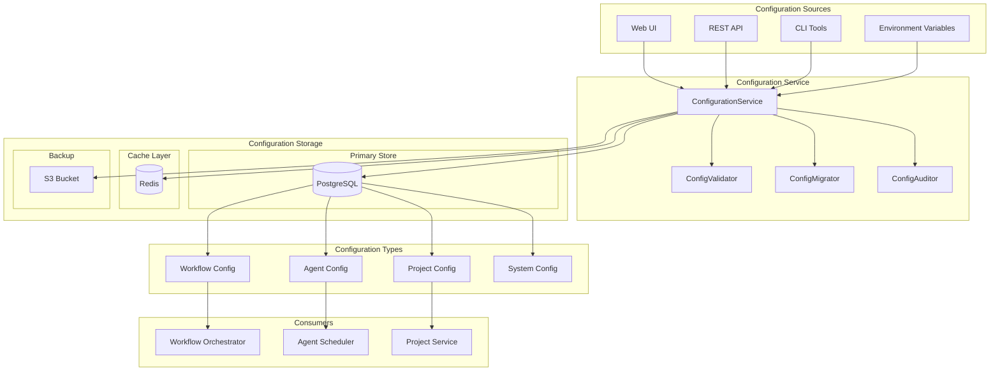

# Configuration Management

## Overview

Codetroeum's configuration management system provides a flexible, database-driven approach to system configuration, replacing traditional YAML files with a web-based interface and centralized storage.

## Configuration Architecture



## Configuration Schema

### Database Schema

```sql
-- Configuration tables
CREATE TABLE configurations (
    id UUID PRIMARY KEY DEFAULT gen_random_uuid(),
    key VARCHAR(255) UNIQUE NOT NULL,
    value JSONB NOT NULL,
    type VARCHAR(50) NOT NULL,
    version INTEGER NOT NULL DEFAULT 1,
    created_at TIMESTAMP NOT NULL DEFAULT NOW(),
    updated_at TIMESTAMP NOT NULL DEFAULT NOW(),
    created_by VARCHAR(255),
    updated_by VARCHAR(255),
    is_active BOOLEAN DEFAULT true,
    metadata JSONB DEFAULT '{}'
);

CREATE INDEX idx_config_key ON configurations(key);
CREATE INDEX idx_config_type ON configurations(type);
CREATE INDEX idx_config_active ON configurations(is_active);

-- Configuration history
CREATE TABLE configuration_history (
    id UUID PRIMARY KEY DEFAULT gen_random_uuid(),
    configuration_id UUID REFERENCES configurations(id),
    key VARCHAR(255) NOT NULL,
    old_value JSONB,
    new_value JSONB NOT NULL,
    version INTEGER NOT NULL,
    changed_at TIMESTAMP NOT NULL DEFAULT NOW(),
    changed_by VARCHAR(255),
    change_reason TEXT,
    rollback_id UUID REFERENCES configuration_history(id)
);

-- Configuration templates
CREATE TABLE configuration_templates (
    id UUID PRIMARY KEY DEFAULT gen_random_uuid(),
    name VARCHAR(255) UNIQUE NOT NULL,
    type VARCHAR(50) NOT NULL,
    schema JSONB NOT NULL,
    default_values JSONB,
    validation_rules JSONB,
    description TEXT,
    created_at TIMESTAMP NOT NULL DEFAULT NOW(),
    is_active BOOLEAN DEFAULT true
);

-- Environment-specific overrides
CREATE TABLE configuration_overrides (
    id UUID PRIMARY KEY DEFAULT gen_random_uuid(),
    configuration_id UUID REFERENCES configurations(id),
    environment VARCHAR(50) NOT NULL,
    override_value JSONB NOT NULL,
    priority INTEGER DEFAULT 0,
    is_active BOOLEAN DEFAULT true,
    UNIQUE(configuration_id, environment)
);
```

## Configuration Types

### 1. Workflow Configuration

```python
@dataclass
class WorkflowConfig:
    """Workflow configuration model."""
    
    id: str
    name: str
    description: str
    template_id: str
    
    # Stages configuration
    stages: List[StageConfig]
    
    # Execution settings
    max_parallel_stages: int = 3
    timeout_seconds: int = 3600
    retry_policy: RetryPolicy = None
    
    # Review settings
    require_review: bool = True
    review_stages: List[str] = field(default_factory=list)
    max_review_iterations: int = 3
    
    # Notification settings
    notify_on_start: bool = True
    notify_on_complete: bool = True
    notify_on_failure: bool = True
    notification_channels: List[str] = field(default_factory=list)
    
    # Advanced settings
    checkpoint_enabled: bool = True
    checkpoint_interval: int = 300
    rollback_enabled: bool = False
    
    # Metadata
    created_at: datetime = field(default_factory=datetime.utcnow)
    updated_at: datetime = field(default_factory=datetime.utcnow)
    version: int = 1

@dataclass
class StageConfig:
    """Pipeline stage configuration."""
    
    name: str
    agent_name: str
    
    # Dependencies
    depends_on: List[str] = field(default_factory=list)
    
    # Execution settings
    timeout_seconds: int = 600
    retry_count: int = 3
    parallel: bool = False
    
    # Agent parameters
    agent_parameters: Dict[str, Any] = field(default_factory=dict)
    
    # Conditions
    skip_condition: Optional[str] = None
    success_condition: Optional[str] = None
```

### 2. Agent Configuration

```python
@dataclass
class AgentConfig:
    """Agent configuration model."""
    
    id: str
    name: str
    type: str  # maker, reviewer, analyzer
    
    # LLM settings
    model: str = "claude-3-opus-20240229"
    temperature: float = 0.7
    max_tokens: int = 4096
    
    # Prompt configuration
    system_prompt: str = ""
    prompt_template: str = ""
    output_format: str = "markdown"
    
    # Capabilities
    capabilities: List[str] = field(default_factory=list)
    supported_languages: List[str] = field(default_factory=list)
    
    # Execution settings
    timeout_seconds: int = 300
    max_retries: int = 3
    requires_human_approval: bool = False
    
    # Resource requirements
    requires_docker: bool = True
    docker_image: Optional[str] = None
    memory_limit_mb: int = 2048
    cpu_limit: float = 1.0
    
    # Tool access
    allowed_tools: List[str] = field(default_factory=list)
    tool_permissions: Dict[str, List[str]] = field(default_factory=dict)
    
    # Quality settings
    confidence_threshold: float = 0.8
    require_review: bool = False
    reviewer_agent: Optional[str] = None
```

### 3. Project Configuration

```python
@dataclass
class ProjectConfig:
    """Project configuration model."""
    
    id: str
    name: str
    description: str
    
    # Repository settings
    repository_url: str
    default_branch: str = "main"
    
    # Ticket system
    ticket_system: str  # github, jira, linear
    ticket_system_config: Dict[str, Any] = field(default_factory=dict)
    
    # Workflow settings
    default_workflow: str
    available_workflows: List[str] = field(default_factory=list)
    
    # Agent assignments
    default_agents: Dict[str, str] = field(default_factory=dict)
    agent_overrides: Dict[str, str] = field(default_factory=dict)
    
    # Environment settings
    environments: List[EnvironmentConfig] = field(default_factory=list)
    
    # Security settings
    secrets: Dict[str, str] = field(default_factory=dict)
    allowed_users: List[str] = field(default_factory=list)
    required_approvals: int = 1
    
    # Notification settings
    notification_channels: List[NotificationChannel] = field(default_factory=list)
    
    # Resource limits
    max_concurrent_workflows: int = 5
    max_agents_per_workflow: int = 10
    storage_limit_gb: int = 100

@dataclass
class EnvironmentConfig:
    """Environment-specific configuration."""
    
    name: str  # dev, staging, prod
    variables: Dict[str, str] = field(default_factory=dict)
    secrets: Dict[str, str] = field(default_factory=dict)
    deployment_config: Dict[str, Any] = field(default_factory=dict)
```

### 4. System Configuration

```python
@dataclass
class SystemConfig:
    """System-wide configuration."""
    
    # Infrastructure
    database_url: str
    redis_url: str
    elasticsearch_url: str
    
    # LLM providers
    llm_providers: Dict[str, LLMProviderConfig]
    default_llm_provider: str
    
    # Security
    auth_enabled: bool = True
    auth_provider: str = "oauth2"
    auth_config: Dict[str, Any] = field(default_factory=dict)
    
    # Rate limiting
    rate_limit_enabled: bool = True
    rate_limits: Dict[str, RateLimit] = field(default_factory=dict)
    
    # Monitoring
    metrics_enabled: bool = True
    metrics_provider: str = "prometheus"
    tracing_enabled: bool = True
    tracing_provider: str = "jaeger"
    
    # Feature flags
    feature_flags: Dict[str, bool] = field(default_factory=dict)
    
    # Maintenance
    maintenance_mode: bool = False
    maintenance_message: str = ""
```

## Configuration Service

### Core Service Implementation

```python
class ConfigurationService:
    """Central configuration management service."""
    
    def __init__(self,
                 storage: IConfigStorage,
                 cache: ICache,
                 validator: ConfigValidator,
                 auditor: ConfigAuditor):
        self.storage = storage
        self.cache = cache
        self.validator = validator
        self.auditor = auditor
    
    async def get_config(self,
                        key: str,
                        environment: Optional[str] = None) -> Any:
        """Get configuration value."""
        # Check cache
        cache_key = f"config:{key}:{environment or 'default'}"
        cached = await self.cache.get(cache_key)
        if cached:
            return cached
        
        # Load from storage
        config = await self.storage.get(key)
        if not config:
            raise ConfigNotFoundError(key)
        
        # Apply environment overrides
        if environment:
            overrides = await self.storage.get_overrides(key, environment)
            config = self._apply_overrides(config, overrides)
        
        # Cache result
        await self.cache.set(cache_key, config, ttl=300)
        
        return config
    
    async def set_config(self,
                        key: str,
                        value: Any,
                        user_id: str,
                        reason: Optional[str] = None) -> None:
        """Set configuration value."""
        # Validate
        await self.validator.validate(key, value)
        
        # Get current value for history
        current = await self.storage.get(key)
        
        # Save new value
        await self.storage.set(key, value, user_id)
        
        # Record history
        await self.auditor.record_change(
            key=key,
            old_value=current,
            new_value=value,
            user_id=user_id,
            reason=reason
        )
        
        # Invalidate cache
        await self.cache.delete(f"config:{key}:*")
        
        # Emit event
        await self.event_bus.publish(
            ConfigurationChangedEvent(
                key=key,
                old_value=current,
                new_value=value,
                user_id=user_id
            )
        )
    
    async def rollback_config(self,
                            key: str,
                            version: int,
                            user_id: str,
                            reason: str) -> None:
        """Rollback configuration to previous version."""
        # Get historical version
        historical = await self.storage.get_version(key, version)
        if not historical:
            raise ConfigVersionNotFoundError(key, version)
        
        # Set as current
        await self.set_config(
            key=key,
            value=historical.value,
            user_id=user_id,
            reason=f"Rollback to version {version}: {reason}"
        )
```

### Configuration Validation

```python
class ConfigValidator:
    """Configuration validation service."""
    
    def __init__(self, schema_registry: SchemaRegistry):
        self.schema_registry = schema_registry
    
    async def validate(self, key: str, value: Any) -> None:
        """Validate configuration value."""
        # Get schema
        schema = await self.schema_registry.get_schema(key)
        if not schema:
            return  # No schema, allow any value
        
        # Validate against schema
        try:
            jsonschema.validate(value, schema)
        except jsonschema.ValidationError as e:
            raise ConfigValidationError(key, str(e))
        
        # Custom validations
        await self._validate_custom_rules(key, value)
    
    async def _validate_custom_rules(self, key: str, value: Any) -> None:
        """Apply custom validation rules."""
        if key.startswith("workflow."):
            await self._validate_workflow_config(value)
        elif key.startswith("agent."):
            await self._validate_agent_config(value)
```

## Web UI for Configuration

### REST API

```python
from fastapi import FastAPI, HTTPException, Depends
from typing import List

app = FastAPI(title="Codetroeum Configuration API")

@app.get("/api/configurations")
async def list_configurations(
    type: Optional[str] = None,
    environment: Optional[str] = None,
    service: ConfigurationService = Depends(get_config_service)
) -> List[ConfigSummary]:
    """List all configurations."""
    configs = await service.list_configs(type=type)
    return [ConfigSummary.from_config(c) for c in configs]

@app.get("/api/configurations/{key}")
async def get_configuration(
    key: str,
    environment: Optional[str] = None,
    service: ConfigurationService = Depends(get_config_service)
) -> ConfigResponse:
    """Get specific configuration."""
    try:
        config = await service.get_config(key, environment)
        return ConfigResponse(key=key, value=config)
    except ConfigNotFoundError:
        raise HTTPException(404, f"Configuration not found: {key}")

@app.put("/api/configurations/{key}")
async def update_configuration(
    key: str,
    request: UpdateConfigRequest,
    user: User = Depends(get_current_user),
    service: ConfigurationService = Depends(get_config_service)
) -> ConfigResponse:
    """Update configuration."""
    try:
        await service.set_config(
            key=key,
            value=request.value,
            user_id=user.id,
            reason=request.reason
        )
        return ConfigResponse(key=key, value=request.value)
    except ConfigValidationError as e:
        raise HTTPException(400, str(e))

@app.post("/api/configurations/{key}/rollback")
async def rollback_configuration(
    key: str,
    request: RollbackRequest,
    user: User = Depends(get_current_user),
    service: ConfigurationService = Depends(get_config_service)
) -> ConfigResponse:
    """Rollback configuration to previous version."""
    await service.rollback_config(
        key=key,
        version=request.version,
        user_id=user.id,
        reason=request.reason
    )
    config = await service.get_config(key)
    return ConfigResponse(key=key, value=config)

@app.get("/api/configurations/{key}/history")
async def get_configuration_history(
    key: str,
    limit: int = 50,
    service: ConfigurationService = Depends(get_config_service)
) -> List[ConfigHistory]:
    """Get configuration change history."""
    history = await service.get_history(key, limit=limit)
    return history

@app.post("/api/configurations/validate")
async def validate_configuration(
    request: ValidateConfigRequest,
    service: ConfigurationService = Depends(get_config_service)
) -> ValidationResponse:
    """Validate configuration without saving."""
    try:
        await service.validator.validate(request.key, request.value)
        return ValidationResponse(valid=True)
    except ConfigValidationError as e:
        return ValidationResponse(valid=False, errors=[str(e)])
```

### React UI Components

```jsx
// ConfigurationEditor.jsx
import React, { useState, useEffect } from 'react';
import { JsonEditor } from './JsonEditor';
import { ValidationErrors } from './ValidationErrors';

export function ConfigurationEditor({ configKey }) {
    const [config, setConfig] = useState(null);
    const [errors, setErrors] = useState([]);
    const [saving, setSaving] = useState(false);
    
    useEffect(() => {
        loadConfiguration();
    }, [configKey]);
    
    const loadConfiguration = async () => {
        const response = await fetch(`/api/configurations/${configKey}`);
        const data = await response.json();
        setConfig(data.value);
    };
    
    const validateConfig = async (value) => {
        const response = await fetch('/api/configurations/validate', {
            method: 'POST',
            headers: { 'Content-Type': 'application/json' },
            body: JSON.stringify({ key: configKey, value })
        });
        const result = await response.json();
        setErrors(result.errors || []);
        return result.valid;
    };
    
    const saveConfiguration = async () => {
        if (!await validateConfig(config)) {
            return;
        }
        
        setSaving(true);
        try {
            await fetch(`/api/configurations/${configKey}`, {
                method: 'PUT',
                headers: { 'Content-Type': 'application/json' },
                body: JSON.stringify({ 
                    value: config,
                    reason: 'Updated via UI'
                })
            });
            alert('Configuration saved successfully');
        } catch (error) {
            alert('Failed to save configuration');
        } finally {
            setSaving(false);
        }
    };
    
    return (
        <div className="config-editor">
            <h2>Edit Configuration: {configKey}</h2>
            <JsonEditor 
                value={config}
                onChange={setConfig}
                onValidate={validateConfig}
            />
            <ValidationErrors errors={errors} />
            <button 
                onClick={saveConfiguration}
                disabled={saving || errors.length > 0}
            >
                {saving ? 'Saving...' : 'Save Configuration'}
            </button>
        </div>
    );
}
```

## Migration from YAML

### Migration Service

```python
class ConfigMigrator:
    """Service to migrate from YAML to database configuration."""
    
    def __init__(self,
                 config_service: ConfigurationService,
                 yaml_loader: YamlConfigLoader):
        self.config_service = config_service
        self.yaml_loader = yaml_loader
    
    async def migrate_from_yaml(self, 
                               yaml_dir: Path,
                               dry_run: bool = False) -> MigrationResult:
        """Migrate YAML configurations to database."""
        result = MigrationResult()
        
        # Load all YAML files
        yaml_files = yaml_dir.glob("**/*.yaml")
        
        for yaml_file in yaml_files:
            try:
                # Load YAML content
                config = self.yaml_loader.load(yaml_file)
                
                # Determine key from file path
                key = self._yaml_path_to_key(yaml_file, yaml_dir)
                
                # Validate
                await self.config_service.validator.validate(key, config)
                
                if not dry_run:
                    # Save to database
                    await self.config_service.set_config(
                        key=key,
                        value=config,
                        user_id="migration",
                        reason=f"Migrated from {yaml_file}"
                    )
                
                result.migrated.append(key)
                
            except Exception as e:
                result.errors.append(f"{yaml_file}: {e}")
        
        return result
```

## Environment Management

### Environment-Specific Overrides

```python
class EnvironmentManager:
    """Manage environment-specific configurations."""
    
    async def get_environment_config(self,
                                    environment: str) -> Dict[str, Any]:
        """Get all configurations for an environment."""
        # Base configurations
        base_configs = await self.storage.get_all()
        
        # Apply environment overrides
        overrides = await self.storage.get_environment_overrides(environment)
        
        result = {}
        for key, base_value in base_configs.items():
            if key in overrides:
                result[key] = self._merge_configs(base_value, overrides[key])
            else:
                result[key] = base_value
        
        return result
    
    async def promote_configuration(self,
                                  key: str,
                                  from_env: str,
                                  to_env: str,
                                  user_id: str) -> None:
        """Promote configuration between environments."""
        # Get source configuration
        source_config = await self.get_config(key, from_env)
        
        # Create override for target environment
        await self.storage.create_override(
            key=key,
            environment=to_env,
            value=source_config,
            user_id=user_id
        )
        
        # Audit
        await self.auditor.record_promotion(
            key=key,
            from_env=from_env,
            to_env=to_env,
            user_id=user_id
        )
```

## Best Practices

1. **Version all changes** - Keep complete history
2. **Validate before save** - Prevent invalid configurations
3. **Use environment overrides** - Don't duplicate configs
4. **Implement gradual rollout** - Test changes safely
5. **Monitor configuration changes** - Alert on critical changes
6. **Backup regularly** - Ensure recovery capability
7. **Encrypt secrets** - Never store plaintext secrets

## Next Steps

- Explore [Deployment Guide](../deployment/00-deployment-guide.md)
- Review [Migration Strategy](../migration/00-migration-strategy.md)
- See [API Documentation](../api/00-api-overview.md)
