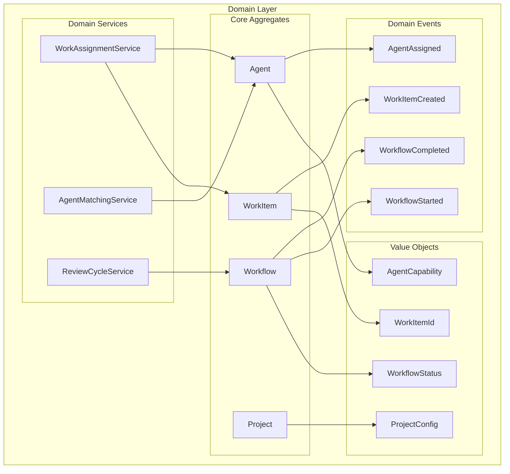
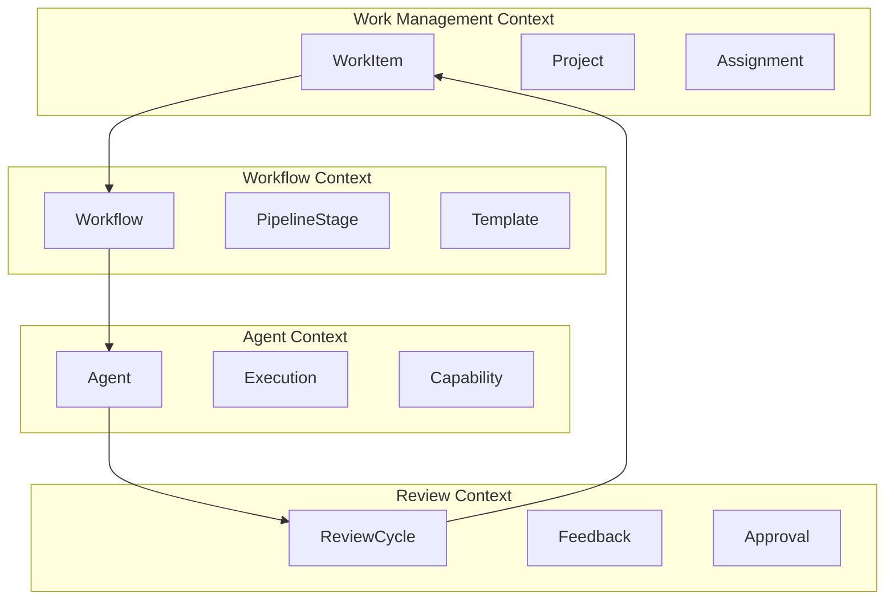

# Domain Models Overview

## Introduction

The domain layer contains the core business logic of Codetroeum, independent of any infrastructure or external concerns. This layer defines the essential concepts, rules, and behaviors that make up the AI-powered software development orchestration system.

## Domain Model Architecture



## Core Domain Concepts

### 1. Aggregates

Aggregates are clusters of domain objects that are treated as a single unit for data changes.

| Aggregate | Purpose | Documentation |
|-----------|---------|---------------|
| [WorkItem](work-item.md) | Represents a unit of work (issue, task, feature) | Core work tracking |
| [Workflow](workflow.md) | Orchestrates execution of work through stages | Pipeline execution |
| [Agent](agent.md) | Represents an AI agent with specific capabilities | Agent management |
| [Project](project.md) | Project context and configuration | Project settings |
| [ReviewCycle](review-cycle.md) | Manages iterative review processes | Quality assurance |

### 2. Entities

Entities have a distinct identity that runs through time and different states.

| Entity | Purpose | Documentation |
|--------|---------|---------------|
| [PipelineStage](pipeline-stage.md) | A stage within a workflow | Stage execution |
| [Execution](execution.md) | Single agent execution instance | Execution tracking |
| [Template](template.md) | Reusable workflow template | Template management |

### 3. Value Objects

Value objects are immutable and defined by their attributes rather than identity.

| Value Object | Purpose | Documentation |
|--------------|---------|---------------|
| [WorkItemId](value-objects.md#workitemid) | Unique identifier for work items | Type-safe IDs |
| [WorkflowStatus](value-objects.md#workflowstatus) | Workflow state enumeration | Status tracking |
| [AgentCapability](value-objects.md#agentcapability) | Agent skill definition | Capability matching |
| [ExecutionResult](value-objects.md#executionresult) | Agent execution outcome | Result handling |
| [ReviewFeedback](value-objects.md#reviewfeedback) | Review cycle feedback | Feedback tracking |

### 4. Domain Events

Events represent something that happened in the domain.

| Event | Trigger | Documentation |
|-------|---------|---------------|
| [WorkItemCreated](events.md#workitemcreated) | New work item created | Item lifecycle |
| [WorkflowStarted](events.md#workflowstarted) | Workflow begins execution | Workflow lifecycle |
| [AgentAssigned](events.md#agentassigned) | Agent assigned to work | Assignment tracking |
| [ExecutionCompleted](events.md#executioncompleted) | Agent finishes execution | Execution tracking |
| [ReviewRequested](events.md#reviewrequested) | Review cycle initiated | Review process |

### 5. Domain Services

Services encapsulate domain logic that doesn't naturally fit within a single aggregate.

| Service | Purpose | Documentation |
|---------|---------|---------------|
| [WorkAssignmentService](services.md#workassignmentservice) | Assigns work to agents | Work distribution |
| [AgentMatchingService](services.md#agentmatchingservice) | Matches agents to requirements | Capability matching |
| [ReviewCycleService](services.md#reviewcycleservice) | Manages review iterations | Review orchestration |
| [WorkflowValidationService](services.md#workflowvalidationservice) | Validates workflow configurations | Workflow validation |

## Domain Design Principles

### 1. Ubiquitous Language

We use consistent terminology throughout the domain:

```python
# ✅ GOOD: Uses domain language
class WorkItem:
    def assign_to_agent(self, agent: Agent) -> AgentAssigned:
        """Assign this work item to an agent."""
        pass

# ❌ BAD: Uses technical language
class Task:
    def set_processor(self, processor: Processor) -> ProcessorSet:
        """Set the processor for this task."""
        pass
```

### 2. Rich Domain Models

Domain models contain business logic, not just data:

```python
# ✅ GOOD: Rich domain model
class WorkItem:
    def __init__(self, id: str, title: str, requirements: List[Requirement]):
        self.id = id
        self.title = title
        self.requirements = requirements
        self.status = WorkItemStatus.NEW
    
    def can_start(self) -> bool:
        """Check if work item can be started."""
        return (
            self.status == WorkItemStatus.NEW and
            all(req.is_satisfied() for req in self.requirements)
        )
    
    def start(self) -> WorkItemStarted:
        """Start working on this item."""
        if not self.can_start():
            raise DomainError("Cannot start work item")
        
        self.status = WorkItemStatus.IN_PROGRESS
        return WorkItemStarted(self.id)

# ❌ BAD: Anemic domain model
class WorkItem:
    def __init__(self, id: str, title: str):
        self.id = id
        self.title = title
        self.status = "new"
        # No behavior, just data
```

### 3. Aggregate Boundaries

Aggregates maintain consistency boundaries:

```python
class Workflow:
    """Workflow aggregate root."""
    
    def __init__(self, id: WorkflowId, template: Template):
        self.id = id
        self.template = template
        self.stages: List[PipelineStage] = []
        self._build_stages_from_template()
    
    def add_stage(self, stage: PipelineStage) -> None:
        """Add stage maintains consistency."""
        if self._would_create_cycle(stage):
            raise DomainError("Stage would create cycle")
        
        if not self._dependencies_satisfied(stage):
            raise DomainError("Stage dependencies not satisfied")
        
        self.stages.append(stage)
    
    def _would_create_cycle(self, stage: PipelineStage) -> bool:
        """Check for circular dependencies."""
        # Domain logic to detect cycles
        pass
```

### 4. Side-Effect Free Functions

Pure functions for complex calculations:

```python
class AgentMatchingService:
    """Domain service for agent matching."""
    
    @staticmethod
    def calculate_match_score(agent: Agent, 
                            requirements: List[Requirement]) -> float:
        """
        Calculate match score between agent and requirements.
        
        This is a pure function with no side effects.
        """
        if not requirements:
            return 1.0
        
        scores = []
        for requirement in requirements:
            if requirement.skill in agent.capabilities:
                capability = agent.capabilities[requirement.skill]
                scores.append(
                    min(capability.proficiency / requirement.min_proficiency, 1.0)
                )
            else:
                scores.append(0.0)
        
        return sum(scores) / len(scores) if scores else 0.0
```

## Bounded Contexts

The domain is organized into bounded contexts:



## Domain Invariants

### Work Item Invariants

```python
class WorkItem:
    """Work item with invariants."""
    
    def __init__(self, id: str, title: str, project_id: str):
        # Invariant: Work item must have non-empty title
        if not title or not title.strip():
            raise DomainError("Work item must have a title")
        
        # Invariant: Work item must belong to a project
        if not project_id:
            raise DomainError("Work item must belong to a project")
        
        self.id = id
        self.title = title
        self.project_id = project_id
        self.status = WorkItemStatus.NEW
    
    def complete(self) -> None:
        """Complete work item."""
        # Invariant: Can only complete if in progress
        if self.status != WorkItemStatus.IN_PROGRESS:
            raise DomainError("Can only complete work in progress")
        
        self.status = WorkItemStatus.COMPLETED
```

### Workflow Invariants

```python
class Workflow:
    """Workflow with invariants."""
    
    # Invariant: Workflow must have at least one stage
    MIN_STAGES = 1
    
    # Invariant: Maximum parallel executions
    MAX_PARALLEL = 10
    
    def validate_invariants(self) -> None:
        """Validate all invariants."""
        if len(self.stages) < self.MIN_STAGES:
            raise DomainError(f"Workflow must have at least {self.MIN_STAGES} stages")
        
        parallel_count = sum(1 for s in self.stages if s.is_parallel)
        if parallel_count > self.MAX_PARALLEL:
            raise DomainError(f"Cannot exceed {self.MAX_PARALLEL} parallel stages")
```

## Testing Domain Models

### Unit Testing

```python
class TestWorkItem:
    """Test WorkItem domain model."""
    
    def test_create_work_item(self):
        """Test work item creation."""
        work_item = WorkItem(
            id="123",
            title="Implement feature",
            project_id="proj-1"
        )
        
        assert work_item.id == "123"
        assert work_item.title == "Implement feature"
        assert work_item.status == WorkItemStatus.NEW
    
    def test_cannot_create_without_title(self):
        """Test invariant: must have title."""
        with pytest.raises(DomainError) as exc:
            WorkItem(id="123", title="", project_id="proj-1")
        
        assert "must have a title" in str(exc.value)
    
    def test_state_transitions(self):
        """Test valid state transitions."""
        work_item = WorkItem("123", "Test", "proj-1")
        
        # NEW -> IN_PROGRESS
        work_item.start()
        assert work_item.status == WorkItemStatus.IN_PROGRESS
        
        # IN_PROGRESS -> COMPLETED
        work_item.complete()
        assert work_item.status == WorkItemStatus.COMPLETED
    
    def test_invalid_state_transition(self):
        """Test invalid state transition."""
        work_item = WorkItem("123", "Test", "proj-1")
        
        # Cannot complete from NEW
        with pytest.raises(DomainError):
            work_item.complete()
```

### Property-Based Testing

```python
from hypothesis import given, strategies as st

class TestAgentMatching:
    """Property-based tests for agent matching."""
    
    @given(
        capabilities=st.lists(
            st.floats(min_value=0.0, max_value=1.0),
            min_size=1,
            max_size=10
        )
    )
    def test_match_score_range(self, capabilities):
        """Test that match scores are always in valid range."""
        agent = Agent(
            id="agent-1",
            name="Test Agent",
            capabilities={f"skill-{i}": c for i, c in enumerate(capabilities)}
        )
        
        requirements = [
            Requirement(f"skill-{i}", 0.5) 
            for i in range(len(capabilities))
        ]
        
        score = AgentMatchingService.calculate_match_score(agent, requirements)
        
        assert 0.0 <= score <= 1.0
```

## Domain Model Guidelines

### 1. Keep Models Pure
No infrastructure dependencies in domain models:

```python
# ✅ GOOD: Pure domain model
class WorkItem:
    def assign_to_agent(self, agent: Agent) -> AgentAssigned:
        # Pure domain logic
        pass

# ❌ BAD: Infrastructure dependency
class WorkItem:
    def save_to_database(self):  # ❌ Infrastructure concern
        pass
```

### 2. Express Intent
Method names should express business intent:

```python
# ✅ GOOD: Expresses business intent
class ReviewCycle:
    def request_changes(self, feedback: str) -> ChangesRequested:
        pass
    
    def approve(self) -> Approved:
        pass

# ❌ BAD: Technical naming
class ReviewCycle:
    def set_status(self, status: int) -> None:
        pass
```

### 3. Fail Fast
Validate invariants immediately:

```python
class WorkItem:
    def __init__(self, id: str, title: str):
        # Validate immediately in constructor
        if not title:
            raise DomainError("Title is required")
        
        self.id = id
        self.title = title
```

## Next Steps

- Review specific domain models:
  - [WorkItem Aggregate](work-item.md)
  - [Workflow Aggregate](workflow.md)
  - [Agent Aggregate](agent.md)
- Explore [Domain Events](events.md)
- See [Domain Services](services.md)
