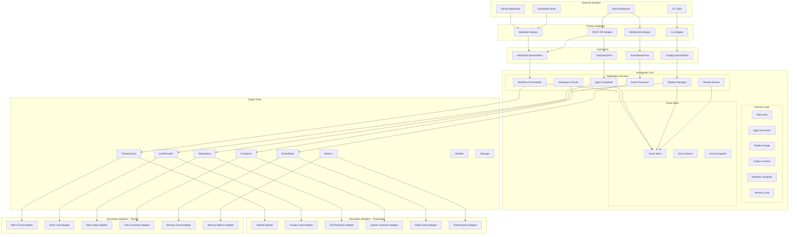
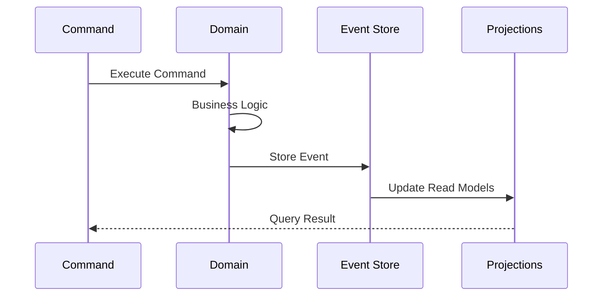
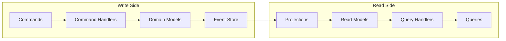
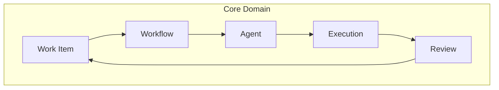
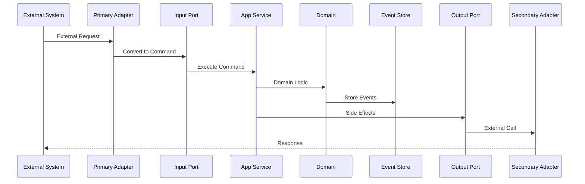
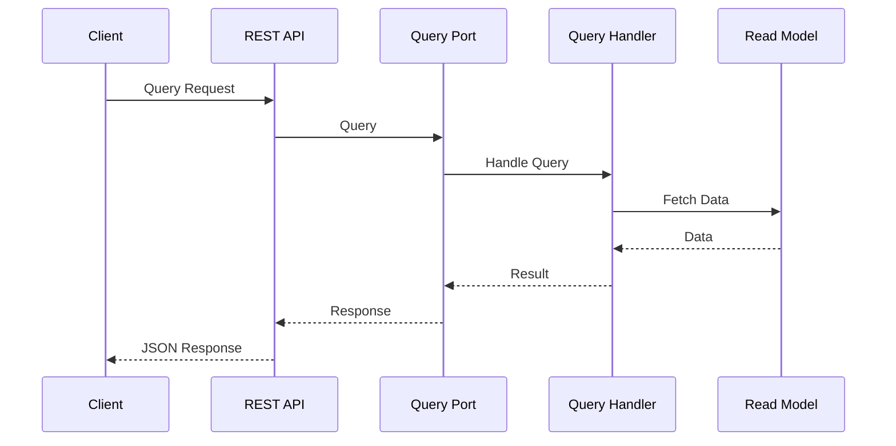
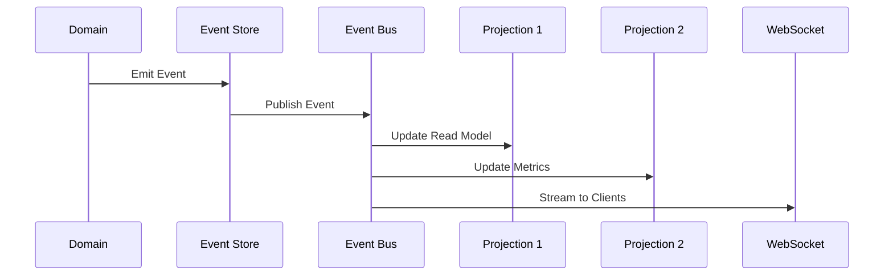
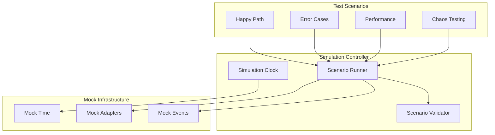
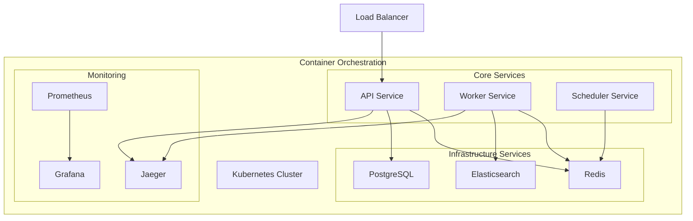
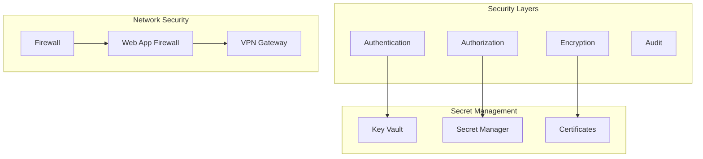

# System Architecture Overview

## Executive Summary

Codetroeum is a next-generation AI-powered software development orchestration system designed with testability, extensibility, and reliability at its core. The system follows a **Hexagonal Architecture** pattern (Ports & Adapters) combined with **Event Sourcing** and **CQRS** to enable complete simulation testing, plugin-based extensibility, and comprehensive observability.

## Core Architecture Diagram

## Architectural Patterns

### 1. Hexagonal Architecture (Ports & Adapters)

The system is organized into three main zones:

- **Core Domain**: Pure business logic with no external dependencies
- **Ports**: Interfaces that define contracts between core and external world
- **Adapters**: Implementations that connect to external systems

This separation enables:
- Complete isolation of business logic
- Easy testing with mock adapters
- Plugin-based extensibility
- Technology-agnostic core

### 2. Event Sourcing

All state changes are captured as immutable events:

Benefits:
- Complete audit trail
- Time-travel debugging
- Event replay for testing
- Eventual consistency

### 3. CQRS (Command Query Responsibility Segregation)

Commands and queries follow separate paths:

### 4. Domain-Driven Design

The core domain is modeled around business concepts:

## System Layers

### 1. External Systems Layer
- GitHub (webhooks, API)
- Web Dashboard (UI)
- CLI Tools
- Scheduled Tasks (cron)

### 2. Primary Adapters Layer
Converts external requests into domain commands:
- **Webhook Adapter**: Processes GitHub webhooks
- **REST API Adapter**: Handles HTTP requests
- **WebSocket Adapter**: Real-time event streaming
- **CLI Adapter**: Command-line interface

### 3. Input Ports Layer
Defines interfaces for incoming operations:
- **WorkflowCommandPort**: Workflow management commands
- **TaskQueryPort**: Task status queries
- **EventStreamPort**: Event subscription
- **ConfigCommandPort**: Configuration management

### 4. Application Services Layer
Orchestrates domain logic:
- **Workflow Orchestrator**: Manages workflow execution
- **Agent Scheduler**: Schedules agent executions
- **Pipeline Manager**: Controls pipeline flow
- **Review Service**: Handles review cycles
- **Workspace Router**: Routes work to appropriate workspace
- **Event Processor**: Processes domain events

### 5. Domain Layer
Pure business logic:
- **Work Item**: Core work unit (issue, task)
- **Agent Execution**: Agent run context
- **Pipeline Stage**: Pipeline step definition
- **Project Context**: Project configuration
- **Workflow Template**: Workflow definition
- **Review Cycle**: Review iteration logic

### 6. Event Store Layer
Persistence and event management:
- **Event Store**: Append-only event storage
- **Event Stream**: Real-time event distribution
- **Event Snapshot**: Point-in-time state capture

### 7. Output Ports Layer
Interfaces for external dependencies:
- **ITicketSystem**: Issue/ticket management
- **ILLMProvider**: LLM integration
- **IRepository**: Source control
- **IContainer**: Container orchestration
- **IEventStore**: Event persistence
- **IMetrics**: Metrics collection
- **INotifier**: Notification dispatch
- **IStorage**: File/configuration storage

### 8. Secondary Adapters Layer
Implements output port interfaces:

**Production Adapters**:
- GitHub Adapter
- Claude Code Adapter
- Git Repository Adapter
- Docker Container Adapter
- Redis Event Adapter
- Elasticsearch Adapter

**Testing Adapters**:
- Mock Ticket Adapter
- Mock LLM Adapter
- Mock Repository Adapter
- Fake Container Adapter
- Memory Event Adapter
- Memory Metrics Adapter

## Data Flow

### 1. Command Flow

### 2. Query Flow

### 3. Event Flow

## Simulation Mode Architecture

The system supports full simulation mode for testing:

## Key Design Decisions

### 1. Hexagonal Architecture
**Decision**: Use Ports & Adapters pattern
**Rationale**: 
- Enables complete testing without external dependencies
- Allows easy swapping of implementations
- Keeps business logic pure and testable

### 2. Event Sourcing
**Decision**: Store all state changes as events
**Rationale**:
- Provides complete audit trail
- Enables replay for debugging
- Supports time-travel testing
- Natural fit for distributed systems

### 3. CQRS
**Decision**: Separate command and query paths
**Rationale**:
- Optimizes read and write operations independently
- Enables different models for queries
- Simplifies caching strategies

### 4. Plugin Architecture
**Decision**: Support pluggable adapters
**Rationale**:
- Easy addition of new ticket systems
- Support for multiple LLM providers
- Enables gradual migration

### 5. Database Configuration
**Decision**: Store configuration in database
**Rationale**:
- Web UI for configuration
- Version control for configs
- Dynamic updates without restart

## Deployment Architecture

## Security Architecture

## Next Steps

1. Review [Hexagonal Architecture Details](01-hexagonal-architecture.md)
2. Explore [Event Sourcing & CQRS](02-event-sourcing-cqrs.md)
3. Understand [Testing Strategy](03-testing-strategy.md)
4. Dive into component specifications in the [Components Directory](../components/)
