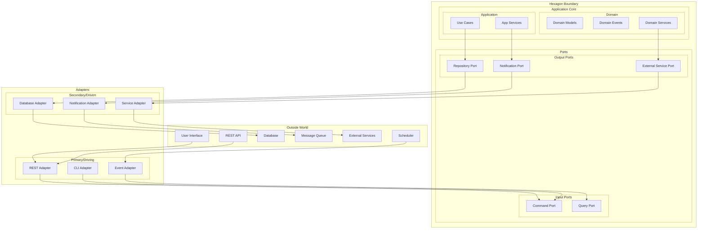

# Hexagonal Architecture Guide

## Introduction

Hexagonal Architecture, also known as Ports and Adapters pattern, is the foundational architectural pattern for Codetroeum. This document provides detailed guidance on how we implement this pattern to achieve maximum testability, flexibility, and maintainability.

## Core Concepts

### The Hexagon



## Key Principles

### 1. Dependency Rule

Dependencies only point inward. The core domain has no dependencies on external concerns.

```python
# ✅ CORRECT - Domain depends on nothing
class WorkItem:
    def __init__(self, id: str, title: str):
        self.id = id
        self.title = title
        self.status = WorkItemStatus.NEW
    
    def start_work(self) -> WorkItemStarted:
        self.status = WorkItemStatus.IN_PROGRESS
        return WorkItemStarted(self.id)

# ❌ WRONG - Domain depends on external service
class WorkItem:
    def __init__(self, id: str, github_client: GitHubClient):  # ❌
        self.id = id
        self.github_client = github_client  # ❌
```

### 2. Port Interfaces

Ports define contracts without implementation details.

```python
from abc import ABC, abstractmethod
from typing import List, Optional

# Input Port
class WorkflowCommandPort(ABC):
    @abstractmethod
    async def start_workflow(self, work_item_id: str) -> None:
        """Start a workflow for the given work item."""
        pass
    
    @abstractmethod
    async def cancel_workflow(self, workflow_id: str) -> None:
        """Cancel an active workflow."""
        pass

# Output Port
class ITicketSystem(ABC):
    @abstractmethod
    async def get_work_item(self, item_id: str) -> WorkItem:
        """Retrieve a work item by ID."""
        pass
    
    @abstractmethod
    async def update_status(self, item_id: str, status: str) -> None:
        """Update the status of a work item."""
        pass
```

### 3. Adapter Implementation

Adapters implement port interfaces and handle external concerns.

```python
# Primary Adapter (Driving)
class RESTAdapter:
    def __init__(self, workflow_port: WorkflowCommandPort):
        self.workflow_port = workflow_port
        self.app = FastAPI()
        self._setup_routes()
    
    def _setup_routes(self):
        @self.app.post("/workflows/start")
        async def start_workflow(request: StartWorkflowRequest):
            # Convert HTTP request to domain command
            await self.workflow_port.start_workflow(request.work_item_id)
            return {"status": "started"}

# Secondary Adapter (Driven)
class GitHubTicketAdapter(ITicketSystem):
    def __init__(self, github_client: GitHubClient):
        self.client = github_client
    
    async def get_work_item(self, item_id: str) -> WorkItem:
        # Convert GitHub issue to domain model
        issue = await self.client.get_issue(item_id)
        return WorkItem(
            id=str(issue.number),
            title=issue.title,
            description=issue.body
        )
    
    async def update_status(self, item_id: str, status: str) -> None:
        # Convert domain status to GitHub labels
        await self.client.update_labels(item_id, [status])
```

## Layer Structure

### 1. Domain Layer (Center)

The heart of the hexagon containing pure business logic.

```python
# domain/models/work_item.py
@dataclass
class WorkItem:
    id: str
    title: str
    description: str
    status: WorkItemStatus
    assigned_agent: Optional[Agent] = None
    
    def can_assign_agent(self) -> bool:
        return self.status in [WorkItemStatus.NEW, WorkItemStatus.READY]
    
    def assign_agent(self, agent: Agent) -> WorkItemAssigned:
        if not self.can_assign_agent():
            raise DomainError(f"Cannot assign agent in status {self.status}")
        
        self.assigned_agent = agent
        self.status = WorkItemStatus.ASSIGNED
        
        return WorkItemAssigned(
            work_item_id=self.id,
            agent_id=agent.id,
            timestamp=datetime.utcnow()
        )

# domain/events/work_item_events.py
@dataclass
class WorkItemAssigned(DomainEvent):
    work_item_id: str
    agent_id: str
    timestamp: datetime
```

### 2. Application Layer

Use cases and application services that orchestrate domain objects.

```python
# application/use_cases/assign_agent_use_case.py
class AssignAgentUseCase:
    def __init__(self,
                 work_item_repo: IWorkItemRepository,
                 agent_repo: IAgentRepository,
                 event_bus: IEventBus):
        self.work_item_repo = work_item_repo
        self.agent_repo = agent_repo
        self.event_bus = event_bus
    
    async def execute(self, work_item_id: str, agent_id: str) -> None:
        # Load aggregates
        work_item = await self.work_item_repo.get(work_item_id)
        agent = await self.agent_repo.get(agent_id)
        
        # Execute domain logic
        event = work_item.assign_agent(agent)
        
        # Persist changes
        await self.work_item_repo.save(work_item)
        
        # Publish domain events
        await self.event_bus.publish(event)
```

### 3. Port Layer

Interfaces that define boundaries between core and external world.

```python
# ports/input/workflow_commands.py
class WorkflowCommands(ABC):
    @abstractmethod
    async def start_workflow(self, command: StartWorkflowCommand) -> WorkflowId:
        pass
    
    @abstractmethod
    async def pause_workflow(self, workflow_id: WorkflowId) -> None:
        pass
    
    @abstractmethod
    async def resume_workflow(self, workflow_id: WorkflowId) -> None:
        pass

# ports/output/repositories.py
class IWorkItemRepository(ABC):
    @abstractmethod
    async def get(self, item_id: str) -> WorkItem:
        pass
    
    @abstractmethod
    async def save(self, item: WorkItem) -> None:
        pass
    
    @abstractmethod
    async def find_by_status(self, status: WorkItemStatus) -> List[WorkItem]:
        pass
```

### 4. Adapter Layer

Concrete implementations that connect to external systems.

```python
# adapters/primary/graphql_adapter.py
class GraphQLAdapter:
    def __init__(self, workflow_commands: WorkflowCommands):
        self.workflow_commands = workflow_commands
        self.schema = self._build_schema()
    
    def _build_schema(self):
        @strawberry.type
        class Mutation:
            @strawberry.mutation
            async def start_workflow(self, work_item_id: str) -> str:
                command = StartWorkflowCommand(work_item_id=work_item_id)
                workflow_id = await self.workflow_commands.start_workflow(command)
                return str(workflow_id)
        
        return strawberry.Schema(mutation=Mutation)

# adapters/secondary/postgresql_repository.py
class PostgreSQLWorkItemRepository(IWorkItemRepository):
    def __init__(self, connection_pool: AsyncConnectionPool):
        self.pool = connection_pool
    
    async def get(self, item_id: str) -> WorkItem:
        async with self.pool.connection() as conn:
            row = await conn.fetchone(
                "SELECT * FROM work_items WHERE id = %s", 
                (item_id,)
            )
            return self._row_to_domain(row)
    
    async def save(self, item: WorkItem) -> None:
        async with self.pool.connection() as conn:
            await conn.execute(
                """
                INSERT INTO work_items (id, title, description, status, assigned_agent_id)
                VALUES (%s, %s, %s, %s, %s)
                ON CONFLICT (id) DO UPDATE SET
                    title = EXCLUDED.title,
                    description = EXCLUDED.description,
                    status = EXCLUDED.status,
                    assigned_agent_id = EXCLUDED.assigned_agent_id
                """,
                (item.id, item.title, item.description, 
                 item.status.value, item.assigned_agent?.id)
            )
```

## Testing Strategy

### 1. Unit Testing the Domain

Domain models can be tested without any dependencies:

```python
def test_work_item_assignment():
    # Arrange
    work_item = WorkItem(
        id="123",
        title="Test Item",
        description="Description",
        status=WorkItemStatus.NEW
    )
    agent = Agent(id="agent-1", name="Test Agent")
    
    # Act
    event = work_item.assign_agent(agent)
    
    # Assert
    assert work_item.status == WorkItemStatus.ASSIGNED
    assert work_item.assigned_agent == agent
    assert isinstance(event, WorkItemAssigned)
    assert event.work_item_id == "123"
    assert event.agent_id == "agent-1"

def test_cannot_assign_agent_when_in_progress():
    # Arrange
    work_item = WorkItem(
        id="123",
        title="Test Item",
        description="Description",
        status=WorkItemStatus.IN_PROGRESS
    )
    agent = Agent(id="agent-1", name="Test Agent")
    
    # Act & Assert
    with pytest.raises(DomainError):
        work_item.assign_agent(agent)
```

### 2. Integration Testing with Mock Adapters

```python
class TestAssignAgentUseCase:
    @pytest.fixture
    def mock_repos(self):
        return {
            'work_item_repo': MockWorkItemRepository(),
            'agent_repo': MockAgentRepository(),
            'event_bus': MockEventBus()
        }
    
    async def test_assign_agent_success(self, mock_repos):
        # Arrange
        work_item = WorkItem("123", "Test", "Desc", WorkItemStatus.NEW)
        agent = Agent("agent-1", "Test Agent")
        
        mock_repos['work_item_repo'].add(work_item)
        mock_repos['agent_repo'].add(agent)
        
        use_case = AssignAgentUseCase(**mock_repos)
        
        # Act
        await use_case.execute("123", "agent-1")
        
        # Assert
        saved_item = mock_repos['work_item_repo'].get_saved("123")
        assert saved_item.status == WorkItemStatus.ASSIGNED
        assert saved_item.assigned_agent.id == "agent-1"
        
        events = mock_repos['event_bus'].get_published_events()
        assert len(events) == 1
        assert isinstance(events[0], WorkItemAssigned)
```

### 3. Contract Testing for Ports

```python
class TicketSystemContractTest(ABC):
    """Base contract test for all ITicketSystem implementations."""
    
    @abstractmethod
    def create_adapter(self) -> ITicketSystem:
        pass
    
    async def test_get_work_item(self):
        # This test runs for all implementations
        adapter = self.create_adapter()
        work_item = await adapter.get_work_item("123")
        
        assert work_item.id == "123"
        assert isinstance(work_item.title, str)
        assert isinstance(work_item.description, str)
    
    async def test_update_status(self):
        adapter = self.create_adapter()
        await adapter.update_status("123", "in_progress")
        
        work_item = await adapter.get_work_item("123")
        assert work_item.status == "in_progress"

class TestGitHubAdapter(TicketSystemContractTest):
    def create_adapter(self) -> ITicketSystem:
        return GitHubTicketAdapter(MockGitHubClient())

class TestJiraAdapter(TicketSystemContractTest):
    def create_adapter(self) -> ITicketSystem:
        return JiraTicketAdapter(MockJiraClient())
```

## Dependency Injection

### 1. Constructor Injection

```python
class WorkflowOrchestrator:
    def __init__(self,
                 ticket_system: ITicketSystem,
                 llm_provider: ILLMProvider,
                 repository: IRepository,
                 event_store: IEventStore):
        self.ticket_system = ticket_system
        self.llm_provider = llm_provider
        self.repository = repository
        self.event_store = event_store
```

### 2. Factory Pattern

```python
class AdapterFactory:
    def __init__(self, config: Config):
        self.config = config
    
    def create_ticket_system(self) -> ITicketSystem:
        adapter_type = self.config.get("ticket_system.type")
        
        if adapter_type == "github":
            return GitHubTicketAdapter(
                token=self.config.get("github.token"),
                org=self.config.get("github.org")
            )
        elif adapter_type == "jira":
            return JiraTicketAdapter(
                url=self.config.get("jira.url"),
                token=self.config.get("jira.token")
            )
        elif adapter_type == "mock":
            return MockTicketAdapter()
        else:
            raise ValueError(f"Unknown ticket system: {adapter_type}")
```

### 3. Dependency Container

```python
from dependency_injector import containers, providers

class Container(containers.DeclarativeContainer):
    config = providers.Configuration()
    
    # Infrastructure
    database = providers.Singleton(
        create_database_connection,
        url=config.database.url
    )
    
    event_bus = providers.Singleton(
        EventBus
    )
    
    # Repositories
    work_item_repository = providers.Factory(
        PostgreSQLWorkItemRepository,
        connection_pool=database
    )
    
    agent_repository = providers.Factory(
        PostgreSQLAgentRepository,
        connection_pool=database
    )
    
    # Use Cases
    assign_agent_use_case = providers.Factory(
        AssignAgentUseCase,
        work_item_repo=work_item_repository,
        agent_repo=agent_repository,
        event_bus=event_bus
    )
    
    # Adapters
    ticket_system = providers.Selector(
        config.ticket_system.type,
        github=providers.Factory(GitHubTicketAdapter),
        jira=providers.Factory(JiraTicketAdapter),
        mock=providers.Factory(MockTicketAdapter)
    )
```

## Configuration Management

### 1. Environment-Based Configuration

```python
# config/base.py
class BaseConfig:
    """Base configuration."""
    TICKET_SYSTEM = "mock"
    EVENT_STORE = "memory"
    
# config/production.py
class ProductionConfig(BaseConfig):
    """Production configuration."""
    TICKET_SYSTEM = "github"
    EVENT_STORE = "redis"
    GITHUB_TOKEN = os.environ["GITHUB_TOKEN"]
    REDIS_URL = os.environ["REDIS_URL"]
    
# config/testing.py
class TestingConfig(BaseConfig):
    """Testing configuration."""
    TICKET_SYSTEM = "mock"
    EVENT_STORE = "memory"
    ENABLE_SIMULATION = True
```

### 2. Dynamic Adapter Selection

```python
class ApplicationBootstrap:
    def __init__(self, config: Config):
        self.config = config
        self.container = self._build_container()
    
    def _build_container(self) -> Container:
        container = Container()
        container.config.from_dict(self.config.to_dict())
        
        # Conditionally wire adapters based on environment
        if self.config.ENVIRONMENT == "production":
            container.ticket_system.override(
                providers.Factory(GitHubTicketAdapter)
            )
        elif self.config.ENVIRONMENT == "testing":
            container.ticket_system.override(
                providers.Factory(MockTicketAdapter)
            )
        
        return container
    
    def create_application(self) -> Application:
        return Application(
            workflow_orchestrator=self.container.workflow_orchestrator(),
            agent_scheduler=self.container.agent_scheduler(),
            event_processor=self.container.event_processor()
        )
```

## Benefits of Hexagonal Architecture

### 1. Testability
- Domain logic can be tested without any infrastructure
- Use cases can be tested with mock adapters
- Contract tests ensure adapter compatibility

### 2. Flexibility
- Easy to swap implementations (GitHub → Jira)
- Support multiple adapters simultaneously
- Gradual migration paths

### 3. Maintainability
- Clear separation of concerns
- Business logic isolated from technical details
- Easy to understand and modify

### 4. Scalability
- Can scale different components independently
- Easy to add new adapters
- Support for microservices migration

## Common Pitfalls and Solutions

### 1. Leaking Domain Logic
**Problem**: Business logic in adapters
**Solution**: Keep adapters thin, move logic to domain

### 2. Anemic Domain Models
**Problem**: Domain models with only data, no behavior
**Solution**: Rich domain models with business logic

### 3. Too Many Ports
**Problem**: Creating ports for every small operation
**Solution**: Group related operations into cohesive interfaces

### 4. Adapter Complexity
**Problem**: Complex mapping logic in adapters
**Solution**: Use dedicated mapper classes or libraries

## Next Steps

- Review [Event Sourcing & CQRS](02-event-sourcing-cqrs.md)
- Explore [Testing Strategy](03-testing-strategy.md)
- See [Component Specifications](../components/)
