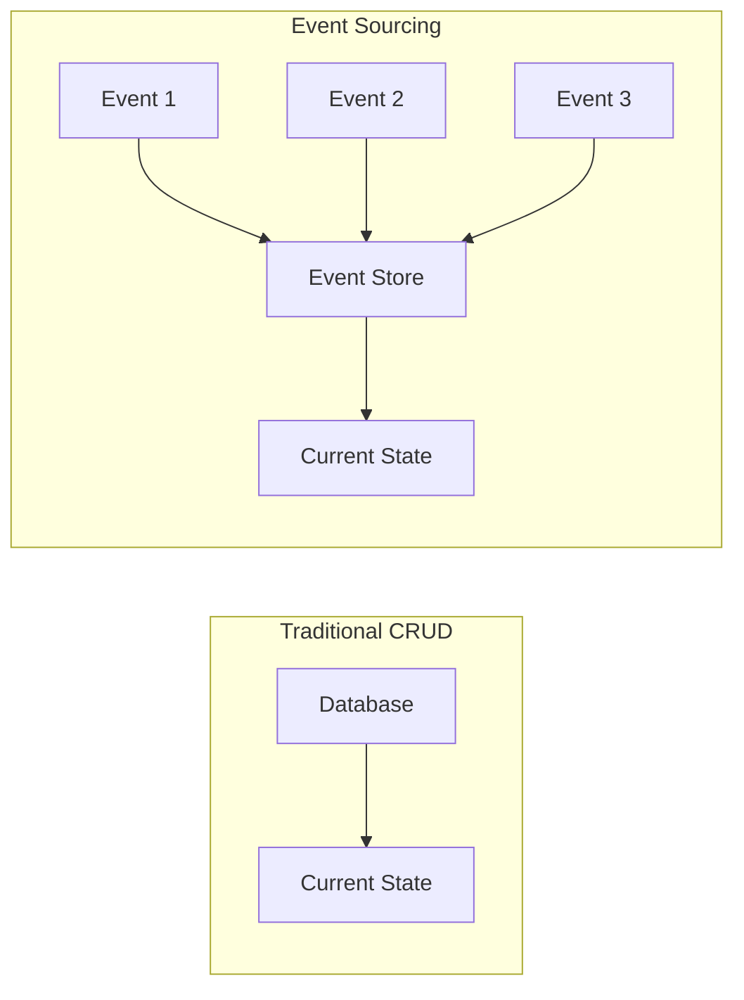
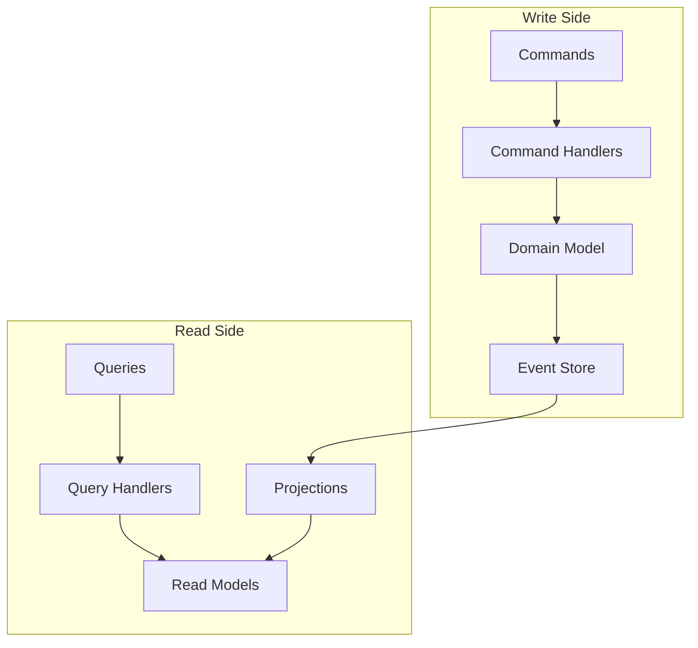

# Event Sourcing & CQRS

## Overview

Event Sourcing and Command Query Responsibility Segregation (CQRS) are complementary patterns that provide Codetroeum with a robust foundation for audit trails, debugging, testing, and scalability.

## Event Sourcing

### Core Concept

Instead of storing current state, we store all events that led to the current state.



### Event Structure

```python
from dataclasses import dataclass
from datetime import datetime
from typing import Dict, Any, Optional
from uuid import UUID, uuid4

@dataclass
class DomainEvent:
    """Base class for all domain events."""
    
    event_id: UUID
    event_type: str
    aggregate_id: str
    aggregate_type: str
    event_version: int
    occurred_at: datetime
    user_id: Optional[str]
    correlation_id: Optional[UUID]
    causation_id: Optional[UUID]
    metadata: Dict[str, Any]
    payload: Dict[str, Any]
    
    @classmethod
    def create(cls,
               aggregate_id: str,
               aggregate_type: str,
               payload: Dict[str, Any],
               user_id: Optional[str] = None,
               correlation_id: Optional[UUID] = None,
               causation_id: Optional[UUID] = None) -> 'DomainEvent':
        """Factory method to create a domain event."""
        return cls(
            event_id=uuid4(),
            event_type=cls.__name__,
            aggregate_id=aggregate_id,
            aggregate_type=aggregate_type,
            event_version=1,
            occurred_at=datetime.utcnow(),
            user_id=user_id,
            correlation_id=correlation_id or uuid4(),
            causation_id=causation_id,
            metadata={},
            payload=payload
        )
```

### Concrete Events

```python
@dataclass
class WorkItemCreated(DomainEvent):
    """Event emitted when a work item is created."""
    
    @classmethod
    def from_work_item(cls, work_item: WorkItem, user_id: str) -> 'WorkItemCreated':
        return cls.create(
            aggregate_id=work_item.id,
            aggregate_type="WorkItem",
            payload={
                "title": work_item.title,
                "description": work_item.description,
                "project_id": work_item.project_id,
                "labels": work_item.labels,
            },
            user_id=user_id
        )

@dataclass
class AgentAssigned(DomainEvent):
    """Event emitted when an agent is assigned to a work item."""
    
    @classmethod
    def from_assignment(cls, 
                       work_item_id: str,
                       agent_id: str,
                       reason: str,
                       user_id: Optional[str] = None) -> 'AgentAssigned':
        return cls.create(
            aggregate_id=work_item_id,
            aggregate_type="WorkItem",
            payload={
                "agent_id": agent_id,
                "reason": reason,
                "assigned_at": datetime.utcnow().isoformat()
            },
            user_id=user_id
        )

@dataclass
class WorkflowStarted(DomainEvent):
    """Event emitted when a workflow begins execution."""
    
    @classmethod
    def from_workflow(cls,
                     workflow_id: str,
                     work_item_id: str,
                     template_id: str) -> 'WorkflowStarted':
        return cls.create(
            aggregate_id=workflow_id,
            aggregate_type="Workflow",
            payload={
                "work_item_id": work_item_id,
                "template_id": template_id,
                "started_at": datetime.utcnow().isoformat()
            }
        )
```

### Event Store Interface

```python
from abc import ABC, abstractmethod
from typing import List, Optional, AsyncIterator

class IEventStore(ABC):
    """Interface for event persistence."""
    
    @abstractmethod
    async def append(self, event: DomainEvent) -> None:
        """Append an event to the store."""
        pass
    
    @abstractmethod
    async def get_events(self,
                        aggregate_id: str,
                        from_version: Optional[int] = None,
                        to_version: Optional[int] = None) -> List[DomainEvent]:
        """Get events for an aggregate."""
        pass
    
    @abstractmethod
    async def get_all_events(self,
                            from_timestamp: Optional[datetime] = None,
                            to_timestamp: Optional[datetime] = None) -> List[DomainEvent]:
        """Get all events in a time range."""
        pass
    
    @abstractmethod
    async def get_event_stream(self) -> AsyncIterator[DomainEvent]:
        """Get a real-time stream of events."""
        pass
    
    @abstractmethod
    async def create_snapshot(self,
                            aggregate_id: str,
                            version: int,
                            state: Dict[str, Any]) -> None:
        """Create a snapshot of aggregate state."""
        pass
    
    @abstractmethod
    async def get_latest_snapshot(self,
                                 aggregate_id: str) -> Optional[Dict[str, Any]]:
        """Get the latest snapshot for an aggregate."""
        pass
```

### Event Store Implementations

```python
# Production Implementation
class RedisEventStore(IEventStore):
    """Redis-based event store for production."""
    
    def __init__(self, redis_client: Redis):
        self.redis = redis_client
        self.stream_key = "events:stream"
        self.aggregate_key = "events:aggregate:{}"
    
    async def append(self, event: DomainEvent) -> None:
        # Serialize event
        event_data = self._serialize_event(event)
        
        # Add to global stream
        await self.redis.xadd(self.stream_key, event_data)
        
        # Add to aggregate stream
        aggregate_key = self.aggregate_key.format(event.aggregate_id)
        await self.redis.xadd(aggregate_key, event_data)
        
        # Publish for real-time subscribers
        await self.redis.publish("events:realtime", json.dumps(event_data))
    
    async def get_events(self,
                        aggregate_id: str,
                        from_version: Optional[int] = None,
                        to_version: Optional[int] = None) -> List[DomainEvent]:
        aggregate_key = self.aggregate_key.format(aggregate_id)
        
        # Read from aggregate stream
        events_data = await self.redis.xrange(aggregate_key)
        
        # Deserialize and filter by version
        events = []
        for event_id, data in events_data:
            event = self._deserialize_event(data)
            if from_version and event.event_version < from_version:
                continue
            if to_version and event.event_version > to_version:
                break
            events.append(event)
        
        return events

# Testing Implementation
class InMemoryEventStore(IEventStore):
    """In-memory event store for testing."""
    
    def __init__(self):
        self.events: List[DomainEvent] = []
        self.snapshots: Dict[str, Dict[str, Any]] = {}
        self.subscribers: List[Callable] = []
    
    async def append(self, event: DomainEvent) -> None:
        self.events.append(event)
        
        # Notify subscribers
        for subscriber in self.subscribers:
            await subscriber(event)
    
    async def get_events(self,
                        aggregate_id: str,
                        from_version: Optional[int] = None,
                        to_version: Optional[int] = None) -> List[DomainEvent]:
        return [
            e for e in self.events
            if e.aggregate_id == aggregate_id
            and (not from_version or e.event_version >= from_version)
            and (not to_version or e.event_version <= to_version)
        ]
```

## CQRS (Command Query Responsibility Segregation)

### Core Concept

Separate the write model (commands) from the read model (queries).



### Command Side

#### Command Structure

```python
from dataclasses import dataclass
from typing import Optional

@dataclass
class Command:
    """Base class for commands."""
    command_id: UUID
    correlation_id: UUID
    user_id: Optional[str]
    timestamp: datetime

@dataclass
class CreateWorkItemCommand(Command):
    """Command to create a new work item."""
    title: str
    description: str
    project_id: str
    labels: List[str]

@dataclass
class AssignAgentCommand(Command):
    """Command to assign an agent to a work item."""
    work_item_id: str
    agent_id: str
    reason: str

@dataclass
class StartWorkflowCommand(Command):
    """Command to start a workflow."""
    work_item_id: str
    workflow_template_id: str
```

#### Command Handlers

```python
class CommandHandler(ABC):
    """Base class for command handlers."""
    
    @abstractmethod
    async def handle(self, command: Command) -> None:
        pass

class CreateWorkItemHandler(CommandHandler):
    """Handles work item creation commands."""
    
    def __init__(self,
                 repository: IWorkItemRepository,
                 event_store: IEventStore):
        self.repository = repository
        self.event_store = event_store
    
    async def handle(self, command: CreateWorkItemCommand) -> None:
        # Create domain object
        work_item = WorkItem(
            id=str(uuid4()),
            title=command.title,
            description=command.description,
            project_id=command.project_id,
            labels=command.labels
        )
        
        # Save to repository
        await self.repository.save(work_item)
        
        # Emit event
        event = WorkItemCreated.from_work_item(work_item, command.user_id)
        await self.event_store.append(event)

class AssignAgentHandler(CommandHandler):
    """Handles agent assignment commands."""
    
    def __init__(self,
                 work_item_repo: IWorkItemRepository,
                 agent_repo: IAgentRepository,
                 event_store: IEventStore):
        self.work_item_repo = work_item_repo
        self.agent_repo = agent_repo
        self.event_store = event_store
    
    async def handle(self, command: AssignAgentCommand) -> None:
        # Load aggregates
        work_item = await self.work_item_repo.get(command.work_item_id)
        agent = await self.agent_repo.get(command.agent_id)
        
        # Domain logic
        work_item.assign_agent(agent)
        
        # Persist
        await self.work_item_repo.save(work_item)
        
        # Emit event
        event = AgentAssigned.from_assignment(
            command.work_item_id,
            command.agent_id,
            command.reason,
            command.user_id
        )
        await self.event_store.append(event)
```

#### Command Bus

```python
class CommandBus:
    """Routes commands to appropriate handlers."""
    
    def __init__(self):
        self.handlers: Dict[Type[Command], CommandHandler] = {}
    
    def register(self,
                command_type: Type[Command],
                handler: CommandHandler) -> None:
        """Register a handler for a command type."""
        self.handlers[command_type] = handler
    
    async def dispatch(self, command: Command) -> None:
        """Dispatch a command to its handler."""
        handler = self.handlers.get(type(command))
        if not handler:
            raise ValueError(f"No handler for command {type(command).__name__}")
        
        await handler.handle(command)
```

### Query Side

#### Query Structure

```python
@dataclass
class Query:
    """Base class for queries."""
    query_id: UUID
    user_id: Optional[str]

@dataclass
class GetWorkItemQuery(Query):
    """Query to get a work item by ID."""
    work_item_id: str

@dataclass
class ListWorkItemsQuery(Query):
    """Query to list work items with filters."""
    project_id: Optional[str] = None
    status: Optional[str] = None
    assigned_agent: Optional[str] = None
    limit: int = 50
    offset: int = 0

@dataclass
class GetWorkflowStatusQuery(Query):
    """Query to get workflow execution status."""
    workflow_id: str
```

#### Read Models

```python
@dataclass
class WorkItemReadModel:
    """Optimized read model for work items."""
    id: str
    title: str
    description: str
    status: str
    assigned_agent_id: Optional[str]
    assigned_agent_name: Optional[str]
    created_at: datetime
    updated_at: datetime
    labels: List[str]
    metrics: Dict[str, Any]

@dataclass
class WorkflowStatusReadModel:
    """Read model for workflow status."""
    workflow_id: str
    work_item_id: str
    status: str
    current_stage: str
    completed_stages: List[str]
    started_at: datetime
    updated_at: datetime
    duration_seconds: int
    error_message: Optional[str]
```

#### Query Handlers

```python
class QueryHandler(ABC):
    """Base class for query handlers."""
    
    @abstractmethod
    async def handle(self, query: Query) -> Any:
        pass

class GetWorkItemQueryHandler(QueryHandler):
    """Handles work item retrieval queries."""
    
    def __init__(self, read_store: IReadStore):
        self.read_store = read_store
    
    async def handle(self, query: GetWorkItemQuery) -> WorkItemReadModel:
        return await self.read_store.get_work_item(query.work_item_id)

class ListWorkItemsQueryHandler(QueryHandler):
    """Handles work item listing queries."""
    
    def __init__(self, read_store: IReadStore):
        self.read_store = read_store
    
    async def handle(self, query: ListWorkItemsQuery) -> List[WorkItemReadModel]:
        filters = {}
        if query.project_id:
            filters["project_id"] = query.project_id
        if query.status:
            filters["status"] = query.status
        if query.assigned_agent:
            filters["assigned_agent_id"] = query.assigned_agent
        
        return await self.read_store.list_work_items(
            filters=filters,
            limit=query.limit,
            offset=query.offset
        )
```

### Projections

Projections build read models from events.

```python
class Projection(ABC):
    """Base class for projections."""
    
    @abstractmethod
    async def handle(self, event: DomainEvent) -> None:
        pass

class WorkItemProjection(Projection):
    """Projects work item events to read models."""
    
    def __init__(self, read_store: IReadStore):
        self.read_store = read_store
    
    async def handle(self, event: DomainEvent) -> None:
        if isinstance(event, WorkItemCreated):
            await self._handle_created(event)
        elif isinstance(event, AgentAssigned):
            await self._handle_assigned(event)
        elif isinstance(event, WorkItemCompleted):
            await self._handle_completed(event)
    
    async def _handle_created(self, event: WorkItemCreated) -> None:
        read_model = WorkItemReadModel(
            id=event.aggregate_id,
            title=event.payload["title"],
            description=event.payload["description"],
            status="new",
            assigned_agent_id=None,
            assigned_agent_name=None,
            created_at=event.occurred_at,
            updated_at=event.occurred_at,
            labels=event.payload["labels"],
            metrics={}
        )
        await self.read_store.save_work_item(read_model)
    
    async def _handle_assigned(self, event: AgentAssigned) -> None:
        work_item = await self.read_store.get_work_item(event.aggregate_id)
        work_item.assigned_agent_id = event.payload["agent_id"]
        work_item.status = "assigned"
        work_item.updated_at = event.occurred_at
        await self.read_store.save_work_item(work_item)
```

### Projection Manager

```python
class ProjectionManager:
    """Manages projection subscriptions and replay."""
    
    def __init__(self, event_store: IEventStore):
        self.event_store = event_store
        self.projections: List[Projection] = []
    
    def register(self, projection: Projection) -> None:
        """Register a projection."""
        self.projections.append(projection)
    
    async def start(self) -> None:
        """Start processing events."""
        async for event in self.event_store.get_event_stream():
            await self._process_event(event)
    
    async def replay(self,
                    from_timestamp: Optional[datetime] = None,
                    to_timestamp: Optional[datetime] = None) -> None:
        """Replay events to rebuild projections."""
        events = await self.event_store.get_all_events(
            from_timestamp, 
            to_timestamp
        )
        
        for event in events:
            await self._process_event(event)
    
    async def _process_event(self, event: DomainEvent) -> None:
        """Process an event through all projections."""
        for projection in self.projections:
            try:
                await projection.handle(event)
            except Exception as e:
                # Log error but don't stop processing
                logger.error(f"Projection error: {e}")
```

## Event Sourcing Benefits

### 1. Complete Audit Trail

```python
async def get_work_item_history(work_item_id: str) -> List[Dict[str, Any]]:
    """Get complete history of a work item."""
    events = await event_store.get_events(work_item_id)
    
    history = []
    for event in events:
        history.append({
            "timestamp": event.occurred_at,
            "action": event.event_type,
            "user": event.user_id,
            "details": event.payload
        })
    
    return history
```

### 2. Time Travel Debugging

```python
async def get_state_at_time(aggregate_id: str, 
                           timestamp: datetime) -> Any:
    """Reconstruct state at a specific point in time."""
    events = await event_store.get_events(aggregate_id)
    
    aggregate = None
    for event in events:
        if event.occurred_at > timestamp:
            break
        
        # Apply event to aggregate
        if aggregate is None:
            aggregate = create_aggregate(event)
        else:
            aggregate.apply(event)
    
    return aggregate
```

### 3. Event Replay for Testing

```python
class EventReplayTest:
    """Test by replaying production events."""
    
    async def test_workflow_execution(self):
        # Load production events
        events = await load_production_events(
            "2024-01-01", 
            "2024-01-02"
        )
        
        # Create test environment
        test_store = InMemoryEventStore()
        test_orchestrator = WorkflowOrchestrator(
            event_store=test_store,
            ticket_system=MockTicketAdapter(),
            llm_provider=MockLLMAdapter()
        )
        
        # Replay events
        for event in events:
            await test_orchestrator.handle_event(event)
        
        # Verify outcomes
        assert test_store.count_events_of_type(WorkflowCompleted) == 10
```

### 4. Compensating Transactions

```python
async def compensate_failed_workflow(workflow_id: str) -> None:
    """Compensate for a failed workflow."""
    events = await event_store.get_events(workflow_id)
    
    # Find compensating actions
    compensations = []
    for event in reversed(events):
        if isinstance(event, ResourceAllocated):
            compensations.append(
                ReleaseResourceCommand(event.payload["resource_id"])
            )
        elif isinstance(event, TaskStarted):
            compensations.append(
                CancelTaskCommand(event.payload["task_id"])
            )
    
    # Execute compensations
    for command in compensations:
        await command_bus.dispatch(command)
```

## CQRS Benefits

### 1. Optimized Read Models

```python
# Write model optimized for consistency
class WorkItem:
    def assign_agent(self, agent: Agent) -> None:
        # Complex business logic
        if not self.can_assign():
            raise DomainError("Cannot assign")
        self.validate_agent_availability(agent)
        self.check_skill_requirements(agent)
        self.assigned_agent = agent

# Read model optimized for queries
class WorkItemSummary:
    # Denormalized for fast reads
    id: str
    title: str
    agent_name: str  # Denormalized
    project_name: str  # Denormalized
    days_in_progress: int  # Pre-calculated
```

### 2. Independent Scaling

```yaml
# Kubernetes deployment
apiVersion: apps/v1
kind: Deployment
metadata:
  name: command-service
spec:
  replicas: 2  # Less replicas for writes
  
---
apiVersion: apps/v1
kind: Deployment
metadata:
  name: query-service
spec:
  replicas: 10  # More replicas for reads
```

### 3. Different Storage Technologies

```python
# Commands use transactional database
command_repository = PostgreSQLRepository()

# Queries use different stores optimized for their needs
search_store = ElasticsearchStore()  # Full-text search
analytics_store = ClickHouseStore()  # Analytics
cache_store = RedisStore()  # Hot data
```

## Testing with Event Sourcing & CQRS

### 1. Unit Testing Events

```python
def test_work_item_created_event():
    event = WorkItemCreated.from_work_item(
        WorkItem("123", "Test", "Description"),
        user_id="user-1"
    )
    
    assert event.aggregate_id == "123"
    assert event.aggregate_type == "WorkItem"
    assert event.payload["title"] == "Test"
    assert event.user_id == "user-1"
```

### 2. Testing Projections

```python
async def test_work_item_projection():
    # Arrange
    read_store = InMemoryReadStore()
    projection = WorkItemProjection(read_store)
    
    event = WorkItemCreated.create(
        aggregate_id="123",
        aggregate_type="WorkItem",
        payload={"title": "Test", "description": "Desc"}
    )
    
    # Act
    await projection.handle(event)
    
    # Assert
    work_item = await read_store.get_work_item("123")
    assert work_item.title == "Test"
    assert work_item.status == "new"
```

### 3. Integration Testing with Events

```python
async def test_complete_workflow():
    # Setup
    event_store = InMemoryEventStore()
    command_bus = CommandBus()
    
    # Register handlers
    command_bus.register(
        CreateWorkItemCommand,
        CreateWorkItemHandler(repository, event_store)
    )
    
    # Execute commands
    await command_bus.dispatch(
        CreateWorkItemCommand(
            title="Test",
            description="Description",
            project_id="proj-1"
        )
    )
    
    # Verify events
    events = await event_store.get_all_events()
    assert len(events) == 1
    assert isinstance(events[0], WorkItemCreated)
```

## Implementation Considerations

### 1. Event Schema Evolution

```python
class EventMigration:
    """Handle event schema changes."""
    
    def migrate_v1_to_v2(self, event: Dict) -> Dict:
        """Migrate event from v1 to v2 schema."""
        if event["version"] == 1:
            # Add new required field with default
            event["new_field"] = "default_value"
            event["version"] = 2
        return event
```

### 2. Eventual Consistency

```python
class EventualConsistencyHandler:
    """Handle eventual consistency between write and read sides."""
    
    async def wait_for_consistency(self, 
                                  aggregate_id: str,
                                  max_wait: float = 5.0) -> None:
        """Wait for read model to be consistent."""
        start = time.time()
        
        while time.time() - start < max_wait:
            # Check if projection is up to date
            read_model = await self.read_store.get(aggregate_id)
            if read_model and read_model.version >= expected_version:
                return
            
            await asyncio.sleep(0.1)
        
        raise TimeoutError("Read model not consistent")
```

### 3. Snapshot Strategy

```python
class SnapshotStrategy:
    """Determine when to create snapshots."""
    
    def should_snapshot(self, event_count: int) -> bool:
        """Create snapshot every 100 events."""
        return event_count % 100 == 0
    
    async def load_aggregate(self, aggregate_id: str) -> Aggregate:
        """Load aggregate from snapshot + events."""
        # Try to load from snapshot
        snapshot = await self.event_store.get_latest_snapshot(aggregate_id)
        
        if snapshot:
            aggregate = Aggregate.from_snapshot(snapshot)
            from_version = snapshot["version"] + 1
        else:
            aggregate = Aggregate()
            from_version = 0
        
        # Apply events since snapshot
        events = await self.event_store.get_events(
            aggregate_id,
            from_version=from_version
        )
        
        for event in events:
            aggregate.apply(event)
        
        return aggregate
```

## Next Steps

- Review [Testing Strategy](03-testing-strategy.md)
- Explore [Component Specifications](../components/)
- See [Input Ports](../components/input-ports/00-overview.md)
