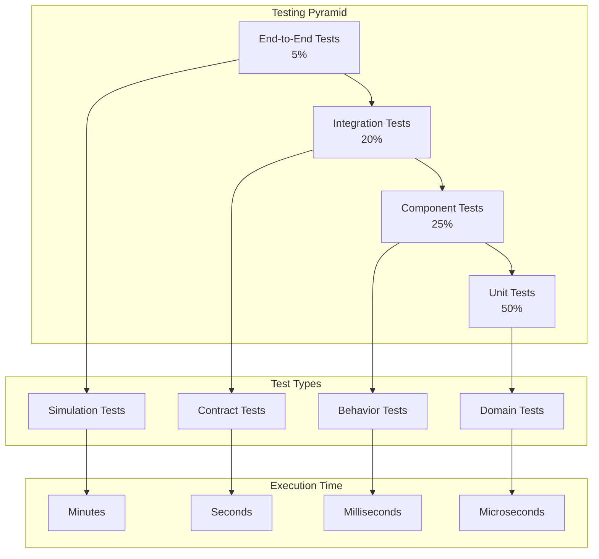

# Testing Strategy

## Overview

Codetroeum's testing strategy is built on the principle of **comprehensive testability at every level**. By leveraging hexagonal architecture, event sourcing, and dependency injection, we achieve complete test coverage without requiring external dependencies.

## Testing Pyramid



## Test Levels

### 1. Unit Tests (50%)

Focus on testing individual components in isolation.

#### Domain Model Tests

```python
import pytest
from datetime import datetime
from codetroeum.domain.models import WorkItem, WorkItemStatus, Agent
from codetroeum.domain.exceptions import DomainError

class TestWorkItem:
    """Test WorkItem domain model."""
    
    def test_create_work_item(self):
        """Test work item creation."""
        work_item = WorkItem(
            id="123",
            title="Implement feature X",
            description="Description of feature X",
            project_id="proj-1"
        )
        
        assert work_item.id == "123"
        assert work_item.title == "Implement feature X"
        assert work_item.status == WorkItemStatus.NEW
        assert work_item.assigned_agent is None
    
    def test_assign_agent_when_new(self):
        """Test assigning agent to new work item."""
        work_item = WorkItem(
            id="123",
            title="Test",
            description="Test",
            project_id="proj-1"
        )
        agent = Agent(id="agent-1", name="Test Agent")
        
        event = work_item.assign_agent(agent)
        
        assert work_item.assigned_agent == agent
        assert work_item.status == WorkItemStatus.ASSIGNED
        assert event.work_item_id == "123"
        assert event.agent_id == "agent-1"
    
    def test_cannot_assign_agent_when_completed(self):
        """Test that agent cannot be assigned to completed item."""
        work_item = WorkItem(
            id="123",
            title="Test",
            description="Test",
            project_id="proj-1",
            status=WorkItemStatus.COMPLETED
        )
        agent = Agent(id="agent-1", name="Test Agent")
        
        with pytest.raises(DomainError) as exc:
            work_item.assign_agent(agent)
        
        assert "Cannot assign agent" in str(exc.value)
    
    def test_state_transitions(self):
        """Test valid state transitions."""
        work_item = WorkItem("123", "Test", "Test", "proj-1")
        
        # NEW -> IN_PROGRESS
        work_item.start()
        assert work_item.status == WorkItemStatus.IN_PROGRESS
        
        # IN_PROGRESS -> REVIEW
        work_item.submit_for_review()
        assert work_item.status == WorkItemStatus.REVIEW
        
        # REVIEW -> COMPLETED
        work_item.complete()
        assert work_item.status == WorkItemStatus.COMPLETED
```

#### Event Tests

```python
from codetroeum.domain.events import WorkItemCreated, AgentAssigned

class TestDomainEvents:
    """Test domain events."""
    
    def test_work_item_created_event(self):
        """Test WorkItemCreated event creation."""
        work_item = WorkItem("123", "Test", "Description", "proj-1")
        
        event = WorkItemCreated.from_work_item(work_item, user_id="user-1")
        
        assert event.aggregate_id == "123"
        assert event.aggregate_type == "WorkItem"
        assert event.payload["title"] == "Test"
        assert event.user_id == "user-1"
        assert event.correlation_id is not None
    
    def test_event_causation_chain(self):
        """Test event causation chain."""
        # First event in chain
        event1 = WorkItemCreated.create(
            aggregate_id="123",
            aggregate_type="WorkItem",
            payload={"title": "Test"}
        )
        
        # Second event caused by first
        event2 = AgentAssigned.create(
            aggregate_id="123",
            aggregate_type="WorkItem",
            payload={"agent_id": "agent-1"},
            causation_id=event1.event_id,
            correlation_id=event1.correlation_id
        )
        
        assert event2.causation_id == event1.event_id
        assert event2.correlation_id == event1.correlation_id
```

### 2. Component Tests (25%)

Test components with their immediate dependencies mocked.

#### Use Case Tests

```python
from unittest.mock import Mock, AsyncMock
from codetroeum.application.use_cases import AssignAgentUseCase

class TestAssignAgentUseCase:
    """Test AssignAgentUseCase."""
    
    @pytest.fixture
    def mock_repos(self):
        """Create mock repositories."""
        return {
            'work_item_repo': AsyncMock(),
            'agent_repo': AsyncMock(),
            'event_store': AsyncMock()
        }
    
    async def test_assign_agent_success(self, mock_repos):
        """Test successful agent assignment."""
        # Arrange
        work_item = WorkItem("123", "Test", "Desc", "proj-1")
        agent = Agent("agent-1", "Test Agent")
        
        mock_repos['work_item_repo'].get.return_value = work_item
        mock_repos['agent_repo'].get.return_value = agent
        
        use_case = AssignAgentUseCase(**mock_repos)
        
        # Act
        await use_case.execute("123", "agent-1")
        
        # Assert
        mock_repos['work_item_repo'].get.assert_called_once_with("123")
        mock_repos['agent_repo'].get.assert_called_once_with("agent-1")
        mock_repos['work_item_repo'].save.assert_called_once()
        mock_repos['event_store'].append.assert_called_once()
        
        # Verify the saved work item
        saved_work_item = mock_repos['work_item_repo'].save.call_args[0][0]
        assert saved_work_item.assigned_agent == agent
        assert saved_work_item.status == WorkItemStatus.ASSIGNED
    
    async def test_assign_agent_work_item_not_found(self, mock_repos):
        """Test assignment when work item doesn't exist."""
        mock_repos['work_item_repo'].get.side_effect = WorkItemNotFound("123")
        
        use_case = AssignAgentUseCase(**mock_repos)
        
        with pytest.raises(WorkItemNotFound):
            await use_case.execute("123", "agent-1")
        
        mock_repos['work_item_repo'].save.assert_not_called()
        mock_repos['event_store'].append.assert_not_called()
```

#### Service Tests

```python
from codetroeum.application.services import WorkflowOrchestrator

class TestWorkflowOrchestrator:
    """Test WorkflowOrchestrator service."""
    
    @pytest.fixture
    def orchestrator(self):
        """Create orchestrator with mocks."""
        return WorkflowOrchestrator(
            ticket_system=Mock(),
            agent_scheduler=AsyncMock(),
            event_store=AsyncMock(),
            metrics=Mock()
        )
    
    async def test_start_workflow(self, orchestrator):
        """Test starting a workflow."""
        # Arrange
        work_item = WorkItem("123", "Test", "Desc", "proj-1")
        orchestrator.ticket_system.get_work_item.return_value = work_item
        
        # Act
        workflow_id = await orchestrator.start_workflow("123", "template-1")
        
        # Assert
        assert workflow_id is not None
        orchestrator.agent_scheduler.schedule_initial_agent.assert_called_once()
        orchestrator.event_store.append.assert_called()
        
        # Verify event
        event = orchestrator.event_store.append.call_args[0][0]
        assert event.__class__.__name__ == "WorkflowStarted"
    
    async def test_workflow_with_review_cycle(self, orchestrator):
        """Test workflow with review cycles."""
        # Arrange
        work_item = WorkItem("123", "Test", "Desc", "proj-1")
        orchestrator.ticket_system.get_work_item.return_value = work_item
        
        # Simulate review cycle
        orchestrator.agent_scheduler.execute.side_effect = [
            {"status": "success", "output": "Initial work"},
            {"status": "review", "feedback": "Needs improvement"},
            {"status": "success", "output": "Revised work"}
        ]
        
        # Act
        result = await orchestrator.execute_with_review(
            "123",
            "maker-agent",
            "reviewer-agent"
        )
        
        # Assert
        assert result["iterations"] == 2
        assert orchestrator.agent_scheduler.execute.call_count == 3
```

### 3. Integration Tests (20%)

Test integration between components with real implementations where possible.

#### Contract Tests

```python
from abc import ABC, abstractmethod

class TicketSystemContract(ABC):
    """Contract test for ITicketSystem implementations."""
    
    @abstractmethod
    def create_adapter(self) -> ITicketSystem:
        """Create the adapter to test."""
        pass
    
    async def test_create_and_retrieve_work_item(self):
        """Test creating and retrieving a work item."""
        adapter = self.create_adapter()
        
        # Create
        work_item = WorkItem("123", "Test", "Description", "proj-1")
        await adapter.create_work_item(work_item)
        
        # Retrieve
        retrieved = await adapter.get_work_item("123")
        
        assert retrieved.id == "123"
        assert retrieved.title == "Test"
        assert retrieved.description == "Description"
    
    async def test_update_work_item_status(self):
        """Test updating work item status."""
        adapter = self.create_adapter()
        
        # Create
        work_item = WorkItem("123", "Test", "Description", "proj-1")
        await adapter.create_work_item(work_item)
        
        # Update
        await adapter.update_status("123", "in_progress")
        
        # Verify
        updated = await adapter.get_work_item("123")
        assert updated.status == "in_progress"
    
    async def test_list_work_items_with_filters(self):
        """Test listing work items with filters."""
        adapter = self.create_adapter()
        
        # Create multiple items
        await adapter.create_work_item(
            WorkItem("1", "Test 1", "Desc", "proj-1", status="new")
        )
        await adapter.create_work_item(
            WorkItem("2", "Test 2", "Desc", "proj-1", status="in_progress")
        )
        await adapter.create_work_item(
            WorkItem("3", "Test 3", "Desc", "proj-2", status="new")
        )
        
        # Filter by project
        proj1_items = await adapter.list_work_items(project_id="proj-1")
        assert len(proj1_items) == 2
        
        # Filter by status
        new_items = await adapter.list_work_items(status="new")
        assert len(new_items) == 2

# Concrete implementations
class TestGitHubAdapter(TicketSystemContract):
    """Test GitHub adapter against contract."""
    
    def create_adapter(self) -> ITicketSystem:
        return GitHubTicketAdapter(mock_github_client())

class TestJiraAdapter(TicketSystemContract):
    """Test Jira adapter against contract."""
    
    def create_adapter(self) -> ITicketSystem:
        return JiraTicketAdapter(mock_jira_client())

class TestInMemoryAdapter(TicketSystemContract):
    """Test in-memory adapter against contract."""
    
    def create_adapter(self) -> ITicketSystem:
        return InMemoryTicketAdapter()
```

#### Database Integration Tests

```python
import pytest
from testcontainers.postgres import PostgresContainer

class TestPostgreSQLRepository:
    """Test PostgreSQL repository integration."""
    
    @pytest.fixture(scope="class")
    async def database(self):
        """Setup test database."""
        with PostgresContainer("postgres:15") as postgres:
            connection = await asyncpg.connect(postgres.get_connection_url())
            
            # Run migrations
            await run_migrations(connection)
            
            yield connection
            
            await connection.close()
    
    async def test_save_and_retrieve_work_item(self, database):
        """Test saving and retrieving from real database."""
        repo = PostgreSQLWorkItemRepository(database)
        
        # Save
        work_item = WorkItem("123", "Test", "Description", "proj-1")
        await repo.save(work_item)
        
        # Retrieve
        retrieved = await repo.get("123")
        
        assert retrieved.id == "123"
        assert retrieved.title == "Test"
    
    async def test_concurrent_updates(self, database):
        """Test handling concurrent updates."""
        repo = PostgreSQLWorkItemRepository(database)
        
        # Create item
        work_item = WorkItem("123", "Test", "Description", "proj-1")
        await repo.save(work_item)
        
        # Simulate concurrent updates
        async def update_1():
            item = await repo.get("123")
            item.title = "Updated 1"
            await repo.save(item)
        
        async def update_2():
            item = await repo.get("123")
            item.title = "Updated 2"
            await repo.save(item)
        
        # Execute concurrently
        await asyncio.gather(update_1(), update_2())
        
        # One should win
        final = await repo.get("123")
        assert final.title in ["Updated 1", "Updated 2"]
```

### 4. End-to-End Tests (5%)

Test complete workflows in simulation mode.

#### Simulation Tests

```python
from codetroeum.testing.simulation import SimulationRunner, Scenario

class TestEndToEndWorkflows:
    """Test complete workflows in simulation."""
    
    @pytest.fixture
    def simulation(self):
        """Create simulation environment."""
        return SimulationRunner(
            mock_llm_responses={
                "requirements_analysis": "Analyzed requirements...",
                "design": "Created design...",
                "implementation": "Implemented feature..."
            },
            time_acceleration=100  # 100x speed
        )
    
    async def test_complete_feature_workflow(self, simulation):
        """Test complete feature development workflow."""
        # Define scenario
        scenario = Scenario(
            name="Feature Development",
            initial_state={
                "work_item": WorkItem("123", "Add login", "Add user login", "proj-1")
            },
            expected_events=[
                WorkflowStarted,
                AgentAssigned,
                AgentExecutionStarted,
                AgentExecutionCompleted,
                ReviewStarted,
                ReviewCompleted,
                WorkItemCompleted
            ]
        )
        
        # Run simulation
        result = await simulation.run_scenario(scenario)
        
        # Verify
        assert result.success
        assert result.duration < 5  # Should complete in 5 seconds
        assert len(result.events) == 7
        
        # Verify final state
        final_item = result.final_state["work_item"]
        assert final_item.status == WorkItemStatus.COMPLETED
    
    async def test_error_recovery_workflow(self, simulation):
        """Test error handling and recovery."""
        # Configure failures
        simulation.inject_failure(
            at_event=3,
            error=AgentExecutionError("LLM timeout")
        )
        
        scenario = Scenario(
            name="Error Recovery",
            initial_state={
                "work_item": WorkItem("124", "Test", "Test", "proj-1")
            },
            expected_recovery=True
        )
        
        result = await simulation.run_scenario(scenario)
        
        assert result.success
        assert result.retries == 1
        assert "Recovered from error" in result.logs
```

## Testing Patterns

### 1. Test Data Builders

```python
class WorkItemBuilder:
    """Builder for test work items."""
    
    def __init__(self):
        self.id = str(uuid4())
        self.title = "Test Item"
        self.description = "Test Description"
        self.project_id = "proj-1"
        self.status = WorkItemStatus.NEW
    
    def with_id(self, id: str) -> 'WorkItemBuilder':
        self.id = id
        return self
    
    def with_title(self, title: str) -> 'WorkItemBuilder':
        self.title = title
        return self
    
    def with_status(self, status: WorkItemStatus) -> 'WorkItemBuilder':
        self.status = status
        return self
    
    def assigned_to(self, agent: Agent) -> 'WorkItemBuilder':
        self.assigned_agent = agent
        return self
    
    def build(self) -> WorkItem:
        item = WorkItem(
            self.id,
            self.title,
            self.description,
            self.project_id
        )
        item.status = self.status
        if hasattr(self, 'assigned_agent'):
            item.assigned_agent = self.assigned_agent
        return item

# Usage
work_item = (WorkItemBuilder()
    .with_title("Important Task")
    .with_status(WorkItemStatus.IN_PROGRESS)
    .assigned_to(Agent("agent-1", "Bot"))
    .build())
```

### 2. Mock Factories

```python
class MockFactory:
    """Factory for creating mock objects."""
    
    @staticmethod
    def ticket_system(work_items: List[WorkItem] = None) -> ITicketSystem:
        """Create mock ticket system."""
        mock = Mock(spec=ITicketSystem)
        mock.work_items = work_items or []
        
        async def get_work_item(id: str):
            for item in mock.work_items:
                if item.id == id:
                    return item
            raise WorkItemNotFound(id)
        
        mock.get_work_item = get_work_item
        return mock
    
    @staticmethod
    def llm_provider(responses: Dict[str, str] = None) -> ILLMProvider:
        """Create mock LLM provider."""
        mock = Mock(spec=ILLMProvider)
        mock.responses = responses or {"default": "Mock response"}
        
        async def execute(prompt: str, context: Dict):
            # Match response based on prompt content
            for key, response in mock.responses.items():
                if key in prompt:
                    return ExecutionResult(response)
            return ExecutionResult(mock.responses["default"])
        
        mock.execute = execute
        return mock
```

### 3. Assertion Helpers

```python
class EventAssertions:
    """Helper assertions for events."""
    
    @staticmethod
    def assert_event_sequence(events: List[DomainEvent], 
                            expected_types: List[Type]) -> None:
        """Assert events match expected sequence."""
        assert len(events) == len(expected_types), \
            f"Expected {len(expected_types)} events, got {len(events)}"
        
        for event, expected_type in zip(events, expected_types):
            assert isinstance(event, expected_type), \
                f"Expected {expected_type.__name__}, got {type(event).__name__}"
    
    @staticmethod
    def assert_event_contains(event: DomainEvent, **kwargs) -> None:
        """Assert event contains expected values."""
        for key, expected_value in kwargs.items():
            actual_value = event.payload.get(key)
            assert actual_value == expected_value, \
                f"Expected {key}={expected_value}, got {actual_value}"
```

## Test Infrastructure

### 1. Test Fixtures

```python
# conftest.py
import pytest
from codetroeum.testing import TestEnvironment

@pytest.fixture(scope="session")
async def test_env():
    """Create test environment for session."""
    env = TestEnvironment()
    await env.setup()
    yield env
    await env.teardown()

@pytest.fixture
async def clean_database(test_env):
    """Provide clean database for each test."""
    await test_env.reset_database()
    return test_env.database

@pytest.fixture
def event_store():
    """Provide in-memory event store."""
    return InMemoryEventStore()

@pytest.fixture
def mock_adapters():
    """Provide set of mock adapters."""
    return {
        'ticket_system': MockTicketAdapter(),
        'llm_provider': MockLLMAdapter(),
        'repository': MockRepositoryAdapter(),
        'container': FakeContainerAdapter()
    }
```

### 2. Test Utilities

```python
class TestClock:
    """Controllable clock for testing."""
    
    def __init__(self, initial_time: datetime = None):
        self.current_time = initial_time or datetime.utcnow()
    
    def now(self) -> datetime:
        return self.current_time
    
    def advance(self, seconds: int) -> None:
        self.current_time += timedelta(seconds=seconds)
    
    def set_time(self, time: datetime) -> None:
        self.current_time = time

class EventCapture:
    """Capture events for testing."""
    
    def __init__(self):
        self.events: List[DomainEvent] = []
    
    async def capture(self, event: DomainEvent) -> None:
        self.events.append(event)
    
    def get_events_of_type(self, event_type: Type) -> List[DomainEvent]:
        return [e for e in self.events if isinstance(e, event_type)]
    
    def clear(self) -> None:
        self.events = []
```

### 3. Performance Testing

```python
import pytest
from codetroeum.testing.performance import measure_performance

class TestPerformance:
    """Performance tests."""
    
    @pytest.mark.performance
    async def test_workflow_throughput(self, simulation):
        """Test system throughput."""
        result = await measure_performance(
            operation=lambda: simulation.run_workflow("123"),
            duration_seconds=60,
            concurrent_operations=10
        )
        
        assert result.operations_per_second > 100
        assert result.p95_latency_ms < 500
        assert result.error_rate < 0.01
    
    @pytest.mark.performance
    async def test_event_processing_speed(self, event_store):
        """Test event processing performance."""
        events = [create_test_event(i) for i in range(10000)]
        
        start = time.time()
        for event in events:
            await event_store.append(event)
        duration = time.time() - start
        
        events_per_second = len(events) / duration
        assert events_per_second > 1000
```

## Continuous Integration

### GitHub Actions Workflow

```yaml
name: Test Suite

on: [push, pull_request]

jobs:
  unit-tests:
    runs-on: ubuntu-latest
    steps:
      - uses: actions/checkout@v3
      - uses: actions/setup-python@v4
        with:
          python-version: '3.11'
      - run: pip install -r requirements-test.txt
      - run: pytest tests/unit --cov=codetroeum --cov-report=xml
      - uses: codecov/codecov-action@v3

  integration-tests:
    runs-on: ubuntu-latest
    services:
      postgres:
        image: postgres:15
        env:
          POSTGRES_PASSWORD: test
        options: >-
          --health-cmd pg_isready
          --health-interval 10s
          --health-timeout 5s
          --health-retries 5
      redis:
        image: redis:7
        options: >-
          --health-cmd "redis-cli ping"
          --health-interval 10s
          --health-timeout 5s
          --health-retries 5
    steps:
      - uses: actions/checkout@v3
      - uses: actions/setup-python@v4
      - run: pip install -r requirements-test.txt
      - run: pytest tests/integration

  simulation-tests:
    runs-on: ubuntu-latest
    steps:
      - uses: actions/checkout@v3
      - uses: actions/setup-python@v4
      - run: pip install -r requirements-test.txt
      - run: pytest tests/simulation -v

  performance-tests:
    runs-on: ubuntu-latest
    if: github.event_name == 'pull_request'
    steps:
      - uses: actions/checkout@v3
      - uses: actions/setup-python@v4
      - run: pip install -r requirements-test.txt
      - run: pytest tests/performance --benchmark-only
      - uses: benchmark-action/github-action-benchmark@v1
        with:
          tool: 'pytest'
          output-file-path: benchmark.json
```

## Test Coverage Goals

- **Overall Coverage**: > 90%
- **Domain Layer**: 100%
- **Application Layer**: > 95%
- **Adapters**: > 80%
- **Critical Paths**: 100%

## Next Steps

- Explore [Component Specifications](../components/)
- Review [Input Ports](../components/input-ports/00-overview.md)
- See [Domain Models](../components/domain/00-overview.md)
