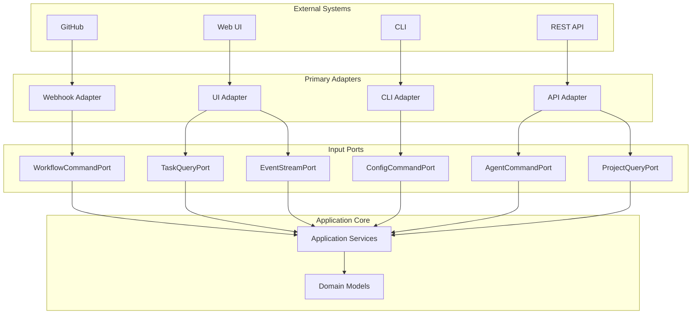

# Input Ports Overview

## Introduction

Input ports define the contracts for all incoming operations to the Codetroeum system. They represent the primary interfaces through which external systems and users interact with the core domain logic.

## Architecture Position



## Port Categories

### 1. Command Ports
Handle operations that modify system state.

| Port | Purpose | Documentation |
|------|---------|---------------|
| [WorkflowCommandPort](workflow-command-port.md) | Workflow lifecycle management | Start, stop, pause workflows |
| [AgentCommandPort](agent-command-port.md) | Agent execution control | Execute, cancel, retry agents |
| [ConfigCommandPort](config-command-port.md) | Configuration management | Update configs, manage templates |
| [ProjectCommandPort](project-command-port.md) | Project operations | Create, update, delete projects |

### 2. Query Ports
Handle read operations without side effects.

| Port | Purpose | Documentation |
|------|---------|---------------|
| [TaskQueryPort](task-query-port.md) | Task status queries | Get task status, history, metrics |
| [ProjectQueryPort](project-query-port.md) | Project information | List projects, get details |
| [MetricsQueryPort](metrics-query-port.md) | System metrics | Performance, throughput, errors |
| [EventQueryPort](event-query-port.md) | Event history | Query events, audit trail |

### 3. Stream Ports
Handle real-time data streams.

| Port | Purpose | Documentation |
|------|---------|---------------|
| [EventStreamPort](event-stream-port.md) | Real-time events | Subscribe to event streams |
| [LogStreamPort](log-stream-port.md) | Log streaming | Real-time log access |
| [MetricsStreamPort](metrics-stream-port.md) | Live metrics | Real-time metrics dashboard |

## Design Principles

### 1. Interface Segregation
Each port focuses on a specific concern:

```python
# ✅ GOOD: Focused interface
class WorkflowCommandPort(ABC):
    @abstractmethod
    async def start_workflow(self, command: StartWorkflowCommand) -> WorkflowId:
        pass
    
    @abstractmethod
    async def cancel_workflow(self, workflow_id: WorkflowId) -> None:
        pass

# ❌ BAD: Mixed concerns
class SystemPort(ABC):
    async def start_workflow(self, ...): pass
    async def get_metrics(self, ...): pass
    async def update_config(self, ...): pass
```

### 2. Command-Query Separation
Commands and queries are in separate ports:

```python
# Commands modify state
class ProjectCommandPort(ABC):
    async def create_project(self, command: CreateProjectCommand) -> ProjectId:
        pass

# Queries read state
class ProjectQueryPort(ABC):
    async def get_project(self, project_id: ProjectId) -> ProjectView:
        pass
```

### 3. Dependency Inversion
Ports depend on domain types, not external types:

```python
# ✅ GOOD: Uses domain types
from codetroeum.domain.types import WorkflowId, WorkItemId

class WorkflowCommandPort(ABC):
    async def start_workflow(self, work_item_id: WorkItemId) -> WorkflowId:
        pass

# ❌ BAD: Uses external types
from github import Issue  # External dependency

class WorkflowCommandPort(ABC):
    async def start_workflow(self, issue: Issue) -> str:  # ❌
        pass
```

## Common Patterns

### 1. Command Pattern

All commands follow a consistent structure:

```python
@dataclass
class Command:
    """Base command class."""
    command_id: UUID = field(default_factory=uuid4)
    timestamp: datetime = field(default_factory=datetime.utcnow)
    user_id: Optional[str] = None
    correlation_id: UUID = field(default_factory=uuid4)

@dataclass
class StartWorkflowCommand(Command):
    """Command to start a workflow."""
    work_item_id: str
    template_id: str
    parameters: Dict[str, Any] = field(default_factory=dict)
```

### 2. Query Result Pattern

Queries return view models optimized for the client:

```python
@dataclass
class QueryResult:
    """Base query result."""
    query_id: UUID
    timestamp: datetime
    
@dataclass
class WorkflowStatusResult(QueryResult):
    """Workflow status query result."""
    workflow_id: str
    status: str
    current_stage: str
    progress_percentage: int
    estimated_completion: Optional[datetime]
    stages: List[StageStatus]
```

### 3. Validation Pattern

Input validation happens at the port level:

```python
class WorkflowCommandPort(ABC):
    async def start_workflow(self, command: StartWorkflowCommand) -> WorkflowId:
        # Validate command
        self._validate_command(command)
        
        # Delegate to implementation
        return await self._execute_start_workflow(command)
    
    def _validate_command(self, command: StartWorkflowCommand) -> None:
        if not command.work_item_id:
            raise ValidationError("work_item_id is required")
        if not command.template_id:
            raise ValidationError("template_id is required")
```

## Error Handling

### Standard Error Types

```python
class PortError(Exception):
    """Base exception for port errors."""
    pass

class ValidationError(PortError):
    """Invalid input data."""
    pass

class AuthorizationError(PortError):
    """User not authorized for operation."""
    pass

class ResourceNotFoundError(PortError):
    """Requested resource doesn't exist."""
    pass

class ConcurrencyError(PortError):
    """Concurrent modification conflict."""
    pass
```

### Error Response Pattern

```python
@dataclass
class ErrorResponse:
    """Standard error response."""
    error_id: UUID
    error_type: str
    message: str
    details: Optional[Dict[str, Any]] = None
    timestamp: datetime = field(default_factory=datetime.utcnow)
```

## Authentication & Authorization

### Authentication Context

```python
@dataclass
class AuthContext:
    """Authentication context for requests."""
    user_id: str
    roles: List[str]
    permissions: List[str]
    tenant_id: Optional[str] = None
    session_id: Optional[str] = None
```

### Authorization Decorator

```python
def requires_permission(permission: str):
    """Decorator to check permissions."""
    def decorator(func):
        @wraps(func)
        async def wrapper(self, command: Command, auth: AuthContext, *args, **kwargs):
            if permission not in auth.permissions:
                raise AuthorizationError(f"Missing permission: {permission}")
            return await func(self, command, auth, *args, **kwargs)
        return wrapper
    return decorator

class WorkflowCommandPort(ABC):
    @requires_permission("workflow:start")
    async def start_workflow(self, command: StartWorkflowCommand, auth: AuthContext) -> WorkflowId:
        pass
```

## Testing Input Ports

### Contract Testing

```python
class InputPortContract(ABC):
    """Base contract test for input ports."""
    
    @abstractmethod
    def create_port(self) -> Any:
        """Create port instance."""
        pass
    
    async def test_validates_required_fields(self):
        """Test that port validates required fields."""
        port = self.create_port()
        
        # Missing required field
        with pytest.raises(ValidationError):
            await port.start_workflow(StartWorkflowCommand(
                work_item_id="",  # Empty required field
                template_id="template-1"
            ))
    
    async def test_handles_authorization(self):
        """Test authorization handling."""
        port = self.create_port()
        
        # Insufficient permissions
        auth = AuthContext(user_id="user-1", roles=[], permissions=[])
        
        with pytest.raises(AuthorizationError):
            await port.start_workflow(
                StartWorkflowCommand("item-1", "template-1"),
                auth
            )
```

### Mock Implementation

```python
class MockWorkflowCommandPort(WorkflowCommandPort):
    """Mock implementation for testing."""
    
    def __init__(self):
        self.started_workflows: List[StartWorkflowCommand] = []
        self.cancelled_workflows: List[WorkflowId] = []
    
    async def start_workflow(self, command: StartWorkflowCommand) -> WorkflowId:
        self.started_workflows.append(command)
        return WorkflowId(str(uuid4()))
    
    async def cancel_workflow(self, workflow_id: WorkflowId) -> None:
        self.cancelled_workflows.append(workflow_id)
```

## Implementation Guidelines

### 1. Keep Ports Thin
Ports should only define contracts, not implement logic:

```python
# ✅ GOOD: Thin interface
class WorkflowCommandPort(ABC):
    @abstractmethod
    async def start_workflow(self, command: StartWorkflowCommand) -> WorkflowId:
        pass

# ❌ BAD: Logic in interface
class WorkflowCommandPort(ABC):
    async def start_workflow(self, command: StartWorkflowCommand) -> WorkflowId:
        # Don't put logic here!
        if command.template_id == "special":
            # This belongs in the implementation
            pass
```

### 2. Use Type Hints
Always use type hints for clarity:

```python
from typing import List, Optional
from codetroeum.domain.types import WorkflowId, ProjectId

class ProjectQueryPort(ABC):
    @abstractmethod
    async def list_projects(self, 
                           user_id: str,
                           limit: int = 50,
                           offset: int = 0) -> List[ProjectView]:
        pass
    
    @abstractmethod
    async def get_project(self, 
                         project_id: ProjectId) -> Optional[ProjectView]:
        pass
```

### 3. Document Contracts
Use docstrings to document expected behavior:

```python
class WorkflowCommandPort(ABC):
    @abstractmethod
    async def start_workflow(self, command: StartWorkflowCommand) -> WorkflowId:
        """
        Start a new workflow execution.
        
        Args:
            command: Command containing work item ID and template ID
            
        Returns:
            WorkflowId: Unique identifier for the started workflow
            
        Raises:
            ValidationError: If command data is invalid
            ResourceNotFoundError: If work item or template not found
            WorkflowAlreadyExistsError: If workflow already running for work item
        """
        pass
```

## Port Registry

All ports are registered for dependency injection:

```python
# ports/__init__.py
from .workflow_command_port import WorkflowCommandPort
from .task_query_port import TaskQueryPort
from .event_stream_port import EventStreamPort

INPUT_PORTS = {
    'workflow_command': WorkflowCommandPort,
    'task_query': TaskQueryPort,
    'event_stream': EventStreamPort,
    # ... other ports
}

def get_port(port_name: str) -> Type:
    """Get port class by name."""
    return INPUT_PORTS[port_name]
```

## Next Steps

- Review individual port specifications:
  - [WorkflowCommandPort](workflow-command-port.md)
  - [TaskQueryPort](task-query-port.md)
  - [EventStreamPort](event-stream-port.md)
- Explore [Domain Models](../domain/00-overview.md)
- See [Application Services](../services/00-overview.md)
