# Output Ports Overview

## Introduction

Output ports define the interfaces through which the core domain interacts with external systems and infrastructure. They represent the dependencies that the application needs to fulfill its business logic, following the Dependency Inversion Principle.

## Architecture Position

```mermaid
graph TB
    subgraph "Application Core"
        AS[Application Services]
        DS[Domain Services]
        DM[Domain Models]
    end
    
    subgraph "Output Ports"
        TSP[ITicketSystem]
        LLP[ILLMProvider]
        RRP[IRepository]
        CTP[IContainer]
        EVP[IEventStore]
        MTP[IMetrics]
        NTP[INotifier]
        STP[IStorage]
    end
    
    subgraph "Secondary Adapters - Production"
        GHA[GitHub Adapter]
        CCA[Claude Code Adapter]
        GRA[Git Repository Adapter]
        DCA[Docker Container Adapter]
        REA[Redis Event Adapter]
        ESA[Elasticsearch Metrics]
        SNA[Slack Notifier]
        S3A[S3 Storage Adapter]
    end
    
    subgraph "Secondary Adapters - Testing"
        MTA[Mock Ticket Adapter]
        MLA[Mock LLM Adapter]
        MRA[Mock Repo Adapter]
        FCA[Fake Container Adapter]
        MEA[Memory Event Adapter]
        MMA[Memory Metrics]
        MNA[Mock Notifier]
        MSA[Memory Storage]
    end
    
    AS --> TSP
    AS --> LLP
    DS --> RRP
    AS --> CTP
    DM --> EVP
    AS --> MTP
    DS --> NTP
    AS --> STP
    
    TSP --> GHA
    TSP --> MTA
    LLP --> CCA
    LLP --> MLA
    RRP --> GRA
    RRP --> MRA
    CTP --> DCA
    CTP --> FCA
    EVP --> REA
    EVP --> MEA
    MTP --> ESA
    MTP --> MMA
    NTP --> SNA
    NTP --> MNA
    STP --> S3A
    STP --> MSA
```



## Port Categories

### 1. External System Ports
Interfaces for external service integration.

| Port | Purpose | Documentation |
|------|---------|---------------|
| [ITicketSystem](ticket-system-port.md) | Issue/ticket management | GitHub, Jira, etc. |
| [ILLMProvider](llm-provider-port.md) | LLM integration | Claude, GPT, etc. |
| [INotifier](notifier-port.md) | Notifications | Slack, email, webhooks |
| [IContainer](container-port.md) | Container orchestration | Docker, Kubernetes |

### 2. Persistence Ports
Interfaces for data persistence.

| Port | Purpose | Documentation |
|------|---------|---------------|
| [IRepository](repository-port.md) | Source code management | Git operations |
| [IEventStore](event-store-port.md) | Event persistence | Event sourcing |
| [IStorage](storage-port.md) | File/object storage | S3, filesystem |
| [IConfigStore](config-store-port.md) | Configuration storage | Database, files |

### 3. Observability Ports
Interfaces for monitoring and observability.

| Port | Purpose | Documentation |
|------|---------|---------------|
| [IMetrics](metrics-port.md) | Metrics collection | Prometheus, CloudWatch |
| [ILogger](logger-port.md) | Structured logging | Application logs |
| [ITracer](tracer-port.md) | Distributed tracing | OpenTelemetry |
| [IAuditor](auditor-port.md) | Audit logging | Compliance tracking |

## Design Principles

### 1. Dependency Inversion
The core depends on abstractions, not implementations:

```python
# ✅ GOOD: Depends on abstraction
class WorkflowService:
    def __init__(self, ticket_system: ITicketSystem):
        self.ticket_system = ticket_system
    
    async def process_work_item(self, item_id: str):
        work_item = await self.ticket_system.get_work_item(item_id)
        # Process work item

# ❌ BAD: Depends on concrete implementation
class WorkflowService:
    def __init__(self, github_client: GitHubClient):  # ❌
        self.github_client = github_client
```

### 2. Interface Segregation
Focused interfaces for specific capabilities:

```python
# ✅ GOOD: Segregated interfaces
class ITicketReader(ABC):
    @abstractmethod
    async def get_work_item(self, item_id: str) -> WorkItem:
        pass

class ITicketWriter(ABC):
    @abstractmethod
    async def update_work_item(self, item: WorkItem) -> None:
        pass

# ❌ BAD: Fat interface
class ITicketSystem(ABC):
    async def get_work_item(self, ...): pass
    async def update_work_item(self, ...): pass
    async def search_work_items(self, ...): pass
    async def create_webhook(self, ...): pass  # Too many responsibilities
    async def manage_users(self, ...): pass    # Not cohesive
```

### 3. Technology Agnostic
Ports don't expose technology-specific details:

```python
# ✅ GOOD: Technology agnostic
class IEventStore(ABC):
    @abstractmethod
    async def append(self, event: DomainEvent) -> None:
        pass
    
    @abstractmethod
    async def get_events(self, aggregate_id: str) -> List[DomainEvent]:
        pass

# ❌ BAD: Exposes technology details
class IEventStore(ABC):
    @abstractmethod
    async def redis_xadd(self, key: str, data: dict) -> None:  # ❌ Redis specific
        pass
```

## Common Patterns

### 1. Repository Pattern

```python
from typing import Generic, TypeVar, Optional, List
from abc import ABC, abstractmethod

T = TypeVar('T')
ID = TypeVar('ID')

class IRepository(Generic[T, ID], ABC):
    """Generic repository interface."""
    
    @abstractmethod
    async def get(self, id: ID) -> Optional[T]:
        """Get entity by ID."""
        pass
    
    @abstractmethod
    async def save(self, entity: T) -> None:
        """Save entity."""
        pass
    
    @abstractmethod
    async def delete(self, id: ID) -> None:
        """Delete entity by ID."""
        pass
    
    @abstractmethod
    async def exists(self, id: ID) -> bool:
        """Check if entity exists."""
        pass

class IWorkItemRepository(IRepository[WorkItem, str]):
    """Work item specific repository."""
    
    @abstractmethod
    async def find_by_status(self, status: WorkItemStatus) -> List[WorkItem]:
        """Find work items by status."""
        pass
    
    @abstractmethod
    async def find_by_project(self, project_id: str) -> List[WorkItem]:
        """Find work items by project."""
        pass
```

### 2. Unit of Work Pattern

```python
class IUnitOfWork(ABC):
    """Unit of work for transactional operations."""
    
    @abstractmethod
    async def __aenter__(self) -> 'IUnitOfWork':
        """Begin transaction."""
        pass
    
    @abstractmethod
    async def __aexit__(self, exc_type, exc_val, exc_tb) -> None:
        """End transaction."""
        pass
    
    @abstractmethod
    async def commit(self) -> None:
        """Commit transaction."""
        pass
    
    @abstractmethod
    async def rollback(self) -> None:
        """Rollback transaction."""
        pass
    
    @abstractmethod
    @property
    def work_items(self) -> IWorkItemRepository:
        """Access work item repository."""
        pass
    
    @abstractmethod
    @property
    def workflows(self) -> IWorkflowRepository:
        """Access workflow repository."""
        pass

# Usage
async def transfer_work_item(uow: IUnitOfWork, 
                            item_id: str, 
                            new_project_id: str):
    async with uow:
        work_item = await uow.work_items.get(item_id)
        work_item.transfer_to_project(new_project_id)
        await uow.work_items.save(work_item)
        await uow.commit()
```

### 3. Specification Pattern

```python
class ISpecification(Generic[T], ABC):
    """Specification pattern for queries."""
    
    @abstractmethod
    def is_satisfied_by(self, entity: T) -> bool:
        """Check if entity satisfies specification."""
        pass
    
    def and_(self, other: 'ISpecification[T]') -> 'ISpecification[T]':
        """Combine with AND."""
        return AndSpecification(self, other)
    
    def or_(self, other: 'ISpecification[T]') -> 'ISpecification[T]':
        """Combine with OR."""
        return OrSpecification(self, other)

class ActiveWorkItemSpec(ISpecification[WorkItem]):
    """Specification for active work items."""
    
    def is_satisfied_by(self, entity: WorkItem) -> bool:
        return entity.status in [
            WorkItemStatus.NEW,
            WorkItemStatus.IN_PROGRESS,
            WorkItemStatus.REVIEW
        ]

# Repository with specification
class IWorkItemRepository(ABC):
    @abstractmethod
    async def find_by_specification(self, 
                                   spec: ISpecification[WorkItem]) -> List[WorkItem]:
        """Find items matching specification."""
        pass
```

## Error Handling

### Standard Error Types

```python
class PortError(Exception):
    """Base exception for port operations."""
    pass

class ResourceNotFoundError(PortError):
    """Resource doesn't exist."""
    def __init__(self, resource_type: str, resource_id: str):
        super().__init__(f"{resource_type} not found: {resource_id}")
        self.resource_type = resource_type
        self.resource_id = resource_id

class ConcurrencyConflictError(PortError):
    """Concurrent modification detected."""
    pass

class ExternalServiceError(PortError):
    """External service failure."""
    def __init__(self, service: str, message: str):
        super().__init__(f"{service} error: {message}")
        self.service = service

class RateLimitError(PortError):
    """Rate limit exceeded."""
    def __init__(self, retry_after: Optional[int] = None):
        super().__init__(f"Rate limit exceeded, retry after {retry_after}s")
        self.retry_after = retry_after
```

### Error Handling Pattern

```python
class GitHubTicketAdapter(ITicketSystem):
    """GitHub implementation with error handling."""
    
    async def get_work_item(self, item_id: str) -> WorkItem:
        try:
            issue = await self.github_client.get_issue(item_id)
            return self._map_to_domain(issue)
        except GitHubNotFoundError:
            raise ResourceNotFoundError("WorkItem", item_id)
        except GitHubRateLimitError as e:
            raise RateLimitError(retry_after=e.reset_time)
        except GitHubServerError as e:
            raise ExternalServiceError("GitHub", str(e))
```

## Testing Output Ports

### Contract Testing

```python
class OutputPortContract(ABC):
    """Base contract test for output ports."""
    
    @abstractmethod
    def create_port(self) -> Any:
        """Create port instance to test."""
        pass
    
    @abstractmethod
    async def setup_test_data(self) -> None:
        """Setup test data."""
        pass
    
    @abstractmethod
    async def cleanup_test_data(self) -> None:
        """Cleanup test data."""
        pass

class TicketSystemContract(OutputPortContract):
    """Contract test for ITicketSystem."""
    
    async def test_get_nonexistent_item(self):
        """Test getting item that doesn't exist."""
        port = self.create_port()
        
        with pytest.raises(ResourceNotFoundError) as exc:
            await port.get_work_item("nonexistent")
        
        assert exc.value.resource_id == "nonexistent"
    
    async def test_create_and_retrieve(self):
        """Test create and retrieve cycle."""
        port = self.create_port()
        
        # Create
        work_item = WorkItem("test-1", "Test Item", "Test Project")
        await port.create_work_item(work_item)
        
        # Retrieve
        retrieved = await port.get_work_item("test-1")
        
        assert retrieved.id == "test-1"
        assert retrieved.title == "Test Item"
```

### Mock Implementations

```python
class MockTicketSystem(ITicketSystem):
    """Mock ticket system for testing."""
    
    def __init__(self):
        self.work_items: Dict[str, WorkItem] = {}
        self.call_count = 0
        self.delay = 0.0
        self.should_fail = False
    
    async def get_work_item(self, item_id: str) -> WorkItem:
        self.call_count += 1
        
        if self.should_fail:
            raise ExternalServiceError("Mock", "Simulated failure")
        
        if self.delay:
            await asyncio.sleep(self.delay)
        
        if item_id not in self.work_items:
            raise ResourceNotFoundError("WorkItem", item_id)
        
        return self.work_items[item_id]
    
    async def create_work_item(self, item: WorkItem) -> None:
        self.work_items[item.id] = item
    
    def add_test_item(self, item: WorkItem) -> None:
        """Helper for test setup."""
        self.work_items[item.id] = item
```

## Performance Considerations

### 1. Connection Pooling

```python
class DatabaseAdapter:
    """Database adapter with connection pooling."""
    
    def __init__(self, connection_string: str, pool_size: int = 10):
        self.pool = await asyncpg.create_pool(
            connection_string,
            min_size=2,
            max_size=pool_size,
            command_timeout=60
        )
    
    async def execute(self, query: str, *args) -> None:
        async with self.pool.acquire() as conn:
            await conn.execute(query, *args)
```

### 2. Caching

```python
class CachedTicketSystem(ITicketSystem):
    """Ticket system with caching."""
    
    def __init__(self, 
                 delegate: ITicketSystem,
                 cache: ICache,
                 ttl_seconds: int = 300):
        self.delegate = delegate
        self.cache = cache
        self.ttl = ttl_seconds
    
    async def get_work_item(self, item_id: str) -> WorkItem:
        # Try cache first
        cache_key = f"work_item:{item_id}"
        cached = await self.cache.get(cache_key)
        
        if cached:
            return WorkItem.from_dict(cached)
        
        # Fetch from delegate
        work_item = await self.delegate.get_work_item(item_id)
        
        # Cache result
        await self.cache.set(
            cache_key,
            work_item.to_dict(),
            ttl=self.ttl
        )
        
        return work_item
```

### 3. Batch Operations

```python
class IBatchOperations(ABC):
    """Interface for batch operations."""
    
    @abstractmethod
    async def get_many(self, ids: List[str]) -> Dict[str, WorkItem]:
        """Get multiple items in one operation."""
        pass
    
    @abstractmethod
    async def save_many(self, items: List[WorkItem]) -> None:
        """Save multiple items in one operation."""
        pass
```

## Adapter Registration

```python
# adapters/registry.py
from typing import Dict, Type, Any

class AdapterRegistry:
    """Registry for output port adapters."""
    
    def __init__(self):
        self._adapters: Dict[str, Dict[str, Type]] = {}
    
    def register(self, 
                port_name: str,
                implementation_name: str,
                adapter_class: Type) -> None:
        """Register an adapter implementation."""
        if port_name not in self._adapters:
            self._adapters[port_name] = {}
        
        self._adapters[port_name][implementation_name] = adapter_class
    
    def create(self,
              port_name: str,
              implementation_name: str,
              **kwargs) -> Any:
        """Create adapter instance."""
        adapter_class = self._adapters[port_name][implementation_name]
        return adapter_class(**kwargs)

# Register adapters
registry = AdapterRegistry()
registry.register("ticket_system", "github", GitHubTicketAdapter)
registry.register("ticket_system", "jira", JiraTicketAdapter)
registry.register("ticket_system", "mock", MockTicketSystem)
```

## Next Steps

- Review individual port specifications:
  - [ITicketSystem](ticket-system-port.md)
  - [ILLMProvider](llm-provider-port.md)
  - [IEventStore](event-store-port.md)
- Explore [Application Services](../services/00-overview.md)
- See [Secondary Adapters](../adapters/secondary/00-overview.md)
