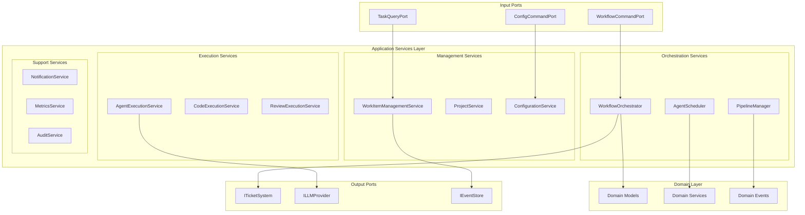

# Application Services Overview

## Introduction

Application Services orchestrate the core business operations of Codetroeum by coordinating domain models, implementing use cases, and managing workflows. They form the bridge between the input ports and the domain layer, encapsulating complex business processes.

## Service Architecture



## Service Categories

### 1. Orchestration Services

Services that coordinate complex multi-step processes.

| Service | Purpose | Documentation |
|---------|---------|---------------|
| [WorkflowOrchestrator](workflow-orchestrator.md) | Manages workflow lifecycle and execution | Core orchestration |
| [AgentScheduler](agent-scheduler.md) | Schedules and coordinates agent execution | Agent management |
| [PipelineManager](pipeline-manager.md) | Manages pipeline stages and transitions | Pipeline control |
| [ReviewCycleOrchestrator](review-cycle-orchestrator.md) | Handles iterative review processes | Quality assurance |

### 2. Execution Services

Services that handle actual work execution.

| Service | Purpose | Documentation |
|---------|---------|---------------|
| [AgentExecutionService](agent-execution-service.md) | Executes AI agents with LLMs | Agent runtime |
| [CodeExecutionService](code-execution-service.md) | Manages code generation and execution | Code operations |
| [ReviewExecutionService](review-execution-service.md) | Executes review and validation | Quality checks |
| [TestExecutionService](test-execution-service.md) | Runs tests and validations | Testing |

### 3. Management Services

Services that manage system resources and configuration.

| Service | Purpose | Documentation |
|---------|---------|---------------|
| [WorkItemManagementService](work-item-management.md) | CRUD operations for work items | Work tracking |
| [ProjectService](project-service.md) | Project configuration and management | Project ops |
| [ConfigurationService](configuration-service.md) | System configuration management | Settings |
| [TemplateService](template-service.md) | Workflow template management | Templates |

### 4. Support Services

Cross-cutting services that support other services.

| Service | Purpose | Documentation |
|---------|---------|---------------|
| [NotificationService](notification-service.md) | Sends notifications and alerts | Communications |
| [MetricsService](metrics-service.md) | Collects and reports metrics | Monitoring |
| [AuditService](audit-service.md) | Audit logging and compliance | Compliance |
| [CacheService](cache-service.md) | Caching for performance | Performance |

## Core Service Patterns

### 1. Service Base Class

```python
from abc import ABC
from typing import Optional, Dict, Any
import logging

class ApplicationService(ABC):
    """Base class for all application services."""
    
    def __init__(self, 
                 event_bus: IEventBus,
                 logger: Optional[logging.Logger] = None):
        self.event_bus = event_bus
        self.logger = logger or logging.getLogger(self.__class__.__name__)
        
    async def execute_with_events(self, 
                                  operation: Callable,
                                  event_type: Type[DomainEvent],
                                  **kwargs) -> Any:
        """Execute operation and emit events."""
        try:
            # Execute operation
            result = await operation(**kwargs)
            
            # Emit success event
            await self.event_bus.publish(
                event_type.success(result, **kwargs)
            )
            
            return result
        except Exception as e:
            # Emit failure event
            await self.event_bus.publish(
                event_type.failure(e, **kwargs)
            )
            raise
    
    async def with_transaction(self, 
                              operation: Callable,
                              uow: IUnitOfWork) -> Any:
        """Execute operation within transaction."""
        async with uow:
            result = await operation(uow)
            await uow.commit()
            return result
```

### 2. Use Case Pattern

```python
class UseCase(ABC):
    """Base class for use cases."""
    
    @abstractmethod
    async def execute(self, request: Any) -> Any:
        """Execute the use case."""
        pass
    
    async def validate(self, request: Any) -> None:
        """Validate request."""
        pass

class StartWorkflowUseCase(UseCase):
    """Use case for starting a workflow."""
    
    def __init__(self,
                 workflow_repo: IWorkflowRepository,
                 work_item_repo: IWorkItemRepository,
                 template_repo: ITemplateRepository,
                 event_bus: IEventBus):
        self.workflow_repo = workflow_repo
        self.work_item_repo = work_item_repo
        self.template_repo = template_repo
        self.event_bus = event_bus
    
    async def execute(self, request: StartWorkflowRequest) -> WorkflowId:
        # Validate request
        await self.validate(request)
        
        # Load entities
        work_item = await self.work_item_repo.get(request.work_item_id)
        template = await self.template_repo.get(request.template_id)
        
        # Create workflow
        workflow = Workflow.create(work_item, template)
        
        # Save workflow
        await self.workflow_repo.save(workflow)
        
        # Emit event
        await self.event_bus.publish(
            WorkflowStarted(
                workflow_id=workflow.id,
                work_item_id=work_item.id,
                template_id=template.id
            )
        )
        
        return workflow.id
```

### 3. Saga Pattern

```python
class Saga(ABC):
    """Base class for sagas (long-running transactions)."""
    
    def __init__(self, saga_id: str):
        self.saga_id = saga_id
        self.steps: List[SagaStep] = []
        self.completed_steps: List[str] = []
        
    @abstractmethod
    async def define_steps(self) -> List[SagaStep]:
        """Define saga steps."""
        pass
    
    async def execute(self) -> Any:
        """Execute saga with compensation."""
        self.steps = await self.define_steps()
        
        try:
            for step in self.steps:
                result = await step.execute()
                self.completed_steps.append(step.name)
                
                if not result.success:
                    await self.compensate()
                    raise SagaFailedError(step.name, result.error)
            
            return SagaResult(success=True)
        except Exception as e:
            await self.compensate()
            raise
    
    async def compensate(self) -> None:
        """Compensate completed steps in reverse order."""
        for step_name in reversed(self.completed_steps):
            step = self.get_step(step_name)
            await step.compensate()

class DeploymentSaga(Saga):
    """Saga for deploying code."""
    
    async def define_steps(self) -> List[SagaStep]:
        return [
            BuildCodeStep(),
            RunTestsStep(),
            CreateDeploymentStep(),
            UpdateDatabaseStep(),
            SwitchTrafficStep(),
            VerifyHealthStep()
        ]
```

## Service Implementation Examples

### WorkflowOrchestrator

```python
class WorkflowOrchestrator(ApplicationService):
    """Orchestrates workflow execution."""
    
    def __init__(self,
                 workflow_repo: IWorkflowRepository,
                 work_item_repo: IWorkItemRepository,
                 agent_scheduler: AgentScheduler,
                 pipeline_manager: PipelineManager,
                 event_bus: IEventBus):
        super().__init__(event_bus)
        self.workflow_repo = workflow_repo
        self.work_item_repo = work_item_repo
        self.agent_scheduler = agent_scheduler
        self.pipeline_manager = pipeline_manager
    
    async def start_workflow(self, 
                           command: StartWorkflowCommand) -> WorkflowId:
        """Start a new workflow."""
        # Load work item
        work_item = await self.work_item_repo.get(command.work_item_id)
        
        # Check for existing workflow
        existing = await self.workflow_repo.find_by_work_item(
            command.work_item_id
        )
        if existing and existing.is_active():
            raise WorkflowAlreadyExistsError(command.work_item_id)
        
        # Create workflow
        workflow = Workflow(
            id=WorkflowId.generate(),
            work_item=work_item,
            template_id=command.template_id,
            parameters=command.parameters
        )
        
        # Build pipeline
        pipeline = await self.pipeline_manager.build_pipeline(
            command.template_id,
            command.parameters
        )
        workflow.set_pipeline(pipeline)
        
        # Save workflow
        await self.workflow_repo.save(workflow)
        
        # Schedule first agent
        first_stage = pipeline.get_first_stage()
        await self.agent_scheduler.schedule(
            workflow_id=workflow.id,
            stage=first_stage
        )
        
        # Emit event
        await self.event_bus.publish(
            WorkflowStartedEvent(
                workflow_id=workflow.id,
                work_item_id=work_item.id,
                template_id=command.template_id,
                user_id=command.user_id
            )
        )
        
        return workflow.id
    
    async def handle_stage_completed(self, 
                                   event: StageCompletedEvent) -> None:
        """Handle stage completion."""
        # Load workflow
        workflow = await self.workflow_repo.get(event.workflow_id)
        
        # Update workflow state
        workflow.complete_stage(event.stage_id, event.result)
        
        # Determine next steps
        next_stages = workflow.get_next_stages(event.stage_id)
        
        if next_stages:
            # Schedule next stages
            for stage in next_stages:
                await self.agent_scheduler.schedule(
                    workflow_id=workflow.id,
                    stage=stage
                )
        else:
            # Workflow complete
            workflow.complete()
            
            # Update work item
            work_item = await self.work_item_repo.get(
                workflow.work_item_id
            )
            work_item.complete()
            await self.work_item_repo.save(work_item)
            
            # Emit completion event
            await self.event_bus.publish(
                WorkflowCompletedEvent(
                    workflow_id=workflow.id,
                    work_item_id=workflow.work_item_id,
                    duration_ms=workflow.duration_ms
                )
            )
        
        # Save workflow
        await self.workflow_repo.save(workflow)
```

### AgentExecutionService

```python
class AgentExecutionService(ApplicationService):
    """Executes agents with LLM providers."""
    
    def __init__(self,
                 llm_provider: ILLMProvider,
                 code_executor: ICodeExecutor,
                 workspace_manager: WorkspaceManager,
                 event_bus: IEventBus):
        super().__init__(event_bus)
        self.llm_provider = llm_provider
        self.code_executor = code_executor
        self.workspace_manager = workspace_manager
    
    async def execute_agent(self,
                          agent: Agent,
                          context: ExecutionContext) -> ExecutionResult:
        """Execute an agent."""
        # Prepare workspace
        workspace = await self.workspace_manager.prepare_workspace(
            context.work_item_id,
            context.project_id
        )
        
        # Build prompt
        prompt = agent.build_prompt(context, workspace)
        
        # Create streaming callback
        stream_handler = StreamHandler(context.execution_id)
        
        # Execute with LLM
        try:
            result = await self.llm_provider.execute(
                prompt=prompt,
                context=ExecutionContext(
                    model=agent.model,
                    temperature=agent.temperature,
                    max_tokens=agent.max_tokens,
                    working_directory=workspace.path,
                    system_prompt=agent.system_prompt
                ),
                stream_callback=stream_handler.handle_chunk
            )
            
            # Process result
            processed_result = await self.process_result(
                agent,
                result,
                workspace
            )
            
            # Emit success event
            await self.event_bus.publish(
                AgentExecutionCompletedEvent(
                    execution_id=context.execution_id,
                    agent_id=agent.id,
                    result=processed_result
                )
            )
            
            return processed_result
            
        except Exception as e:
            # Emit failure event
            await self.event_bus.publish(
                AgentExecutionFailedEvent(
                    execution_id=context.execution_id,
                    agent_id=agent.id,
                    error=str(e)
                )
            )
            raise
        finally:
            # Clean up workspace
            await self.workspace_manager.cleanup_workspace(workspace)
    
    async def process_result(self,
                           agent: Agent,
                           result: ExecutionResult,
                           workspace: Workspace) -> ProcessedResult:
        """Process agent execution result."""
        processed = ProcessedResult(
            raw_output=result.content,
            execution_id=result.conversation_id
        )
        
        # Extract code if agent generates code
        if agent.generates_code:
            code_blocks = self.extract_code_blocks(result.content)
            for block in code_blocks:
                # Save code files
                file_path = workspace.path / block.filename
                file_path.write_text(block.content)
                processed.generated_files.append(str(file_path))
        
        # Execute code if needed
        if agent.executes_code and processed.generated_files:
            execution_result = await self.code_executor.execute(
                files=processed.generated_files,
                workspace=workspace
            )
            processed.execution_output = execution_result.output
        
        return processed
```

## Service Communication

### Event-Driven Communication

```python
class ServiceEventBus:
    """Event bus for service communication."""
    
    def __init__(self):
        self.handlers: Dict[Type[DomainEvent], List[Callable]] = {}
    
    def register(self, 
                event_type: Type[DomainEvent],
                handler: Callable) -> None:
        """Register event handler."""
        if event_type not in self.handlers:
            self.handlers[event_type] = []
        self.handlers[event_type].append(handler)
    
    async def publish(self, event: DomainEvent) -> None:
        """Publish event to handlers."""
        handlers = self.handlers.get(type(event), [])
        
        for handler in handlers:
            try:
                await handler(event)
            except Exception as e:
                logger.error(f"Handler error: {e}")
                # Don't stop other handlers
```

### Service Registry

```python
class ServiceRegistry:
    """Registry for application services."""
    
    def __init__(self):
        self.services: Dict[str, ApplicationService] = {}
    
    def register(self, 
                name: str,
                service: ApplicationService) -> None:
        """Register a service."""
        self.services[name] = service
    
    def get(self, name: str) -> ApplicationService:
        """Get service by name."""
        if name not in self.services:
            raise ServiceNotFoundError(name)
        return self.services[name]
    
    async def start_all(self) -> None:
        """Start all services."""
        for name, service in self.services.items():
            if hasattr(service, 'start'):
                await service.start()
    
    async def stop_all(self) -> None:
        """Stop all services."""
        for name, service in self.services.items():
            if hasattr(service, 'stop'):
                await service.stop()
```

## Testing Application Services

### Service Testing Base

```python
class ServiceTestBase:
    """Base class for service tests."""
    
    @pytest.fixture
    def mock_repos(self):
        """Create mock repositories."""
        return {
            'workflow_repo': Mock(spec=IWorkflowRepository),
            'work_item_repo': Mock(spec=IWorkItemRepository),
            'agent_repo': Mock(spec=IAgentRepository)
        }
    
    @pytest.fixture
    def mock_event_bus(self):
        """Create mock event bus."""
        return Mock(spec=IEventBus)
    
    @pytest.fixture
    def mock_llm(self):
        """Create mock LLM provider."""
        return MockLLMProvider()
```

### Testing Orchestration

```python
class TestWorkflowOrchestrator(ServiceTestBase):
    """Test workflow orchestrator."""
    
    @pytest.fixture
    def orchestrator(self, mock_repos, mock_event_bus):
        return WorkflowOrchestrator(
            workflow_repo=mock_repos['workflow_repo'],
            work_item_repo=mock_repos['work_item_repo'],
            agent_scheduler=Mock(),
            pipeline_manager=Mock(),
            event_bus=mock_event_bus
        )
    
    async def test_start_workflow_success(self, orchestrator):
        """Test successful workflow start."""
        # Arrange
        command = StartWorkflowCommand(
            work_item_id="item-1",
            template_id="template-1",
            parameters={"auto_review": True}
        )
        
        work_item = WorkItem("item-1", "Test", "Test Project")
        orchestrator.work_item_repo.get.return_value = work_item
        orchestrator.workflow_repo.find_by_work_item.return_value = None
        
        # Act
        workflow_id = await orchestrator.start_workflow(command)
        
        # Assert
        assert workflow_id is not None
        orchestrator.workflow_repo.save.assert_called_once()
        orchestrator.agent_scheduler.schedule.assert_called_once()
        orchestrator.event_bus.publish.assert_called_once()
```

## Performance Considerations

### Service Caching

```python
class CachedService(ApplicationService):
    """Service with caching support."""
    
    def __init__(self, cache: ICache, **kwargs):
        super().__init__(**kwargs)
        self.cache = cache
    
    async def with_cache(self,
                        key: str,
                        operation: Callable,
                        ttl: int = 300) -> Any:
        """Execute with caching."""
        # Check cache
        cached = await self.cache.get(key)
        if cached:
            return cached
        
        # Execute operation
        result = await operation()
        
        # Cache result
        await self.cache.set(key, result, ttl=ttl)
        
        return result
```

### Batch Processing

```python
class BatchProcessingService(ApplicationService):
    """Service with batch processing support."""
    
    async def process_batch(self,
                          items: List[Any],
                          processor: Callable,
                          batch_size: int = 10) -> List[Any]:
        """Process items in batches."""
        results = []
        
        for i in range(0, len(items), batch_size):
            batch = items[i:i + batch_size]
            
            # Process batch concurrently
            batch_results = await asyncio.gather(
                *[processor(item) for item in batch]
            )
            
            results.extend(batch_results)
        
        return results
```

## Next Steps

- Review specific service implementations:
  - [WorkflowOrchestrator](workflow-orchestrator.md)
  - [AgentScheduler](agent-scheduler.md)
  - [AgentExecutionService](agent-execution-service.md)
- Explore [Secondary Adapters](../adapters/secondary/00-overview.md)
- See [Configuration Management](../../configuration/00-configuration-management.md)
