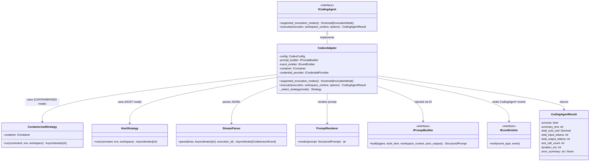

# CodexAdapter (Planned)

> **Status**: **Design only.** This adapter is the third target of the coding-agent port redesign (DEF-015). Implementation is targeted at 6–8 weeks post-Claude-Code-adapter landing per proposal §Q6. Shape mirrors `ClaudeCodeAdapter` closely; surfaces are subprocess-shaped with a JSONL event stream — see [`coding-agent-port-validation.md`](./coding-agent-port-validation.md) for the cross-adapter analysis.
>
> **Verified**: The Codex CLI surface used here is publicly documented at https://developers.openai.com/codex/noninteractive — specifically `codex exec --json` emits a JSONL event stream covering messages, reasoning, command executions, file changes, MCP tool calls, web searches, and plan updates, plus a final completion record with token counts. The unverified portions are flagged "[VERIFY]" inline.

## Purpose

**CodexAdapter** implements the `ICodingAgent` port by launching OpenAI's Codex CLI in its non-interactive mode (`codex exec --json`). The CLI is a Rust-based coding agent that operates against a local checkout, edits files, runs shell commands inside a sandbox, and emits a structured JSONL event stream documenting every step.

Architecturally, this adapter is the closest mirror of `ClaudeCodeAdapter`: same invocation pattern (subprocess, optionally containerised), same stream-parsing approach, same event family populated end-to-end. The validation it provides is that the strategy split (`CONTAINERIZED` + `HOST`) and the parser/renderer boundary are **cleanly reusable** across subprocess-shaped coding agents from different vendors — not Claude-Code-specific.

The adapter translates between:
- `WorkspaceContext` + `StructuredPrompt` ↔ `codex exec --json --cd <workspace_path> --sandbox workspace-write "<prompt>"` invocation
- Codex's JSONL event stream ↔ the full `CodingAgent*` event family (10 of 11 events — see §Event Mapping for the one gap)
- Subprocess lifecycle (start, exit, signals) ↔ `CodingAgentInvokedEvent`, `CodingAgentReadyEvent`, `CodingAgentCompletedEvent`

## Port Implementation

```python
class CodexAdapter(ICodingAgent):
    def supported_invocation_modes(self) -> frozenset[InvocationMode]:
        return frozenset({InvocationMode.CONTAINERIZED, InvocationMode.HOST})

    async def execute(
        self,
        execution: AgentExecution,
        workspace_context: WorkspaceContext,
        options: CodingAgentInvocationOptions,
    ) -> CodingAgentResult: ...
```

**Dependencies (constructor-injected)**:
- `prompt_builder: IPromptBuilder` — same shared component all `ICodingAgent` adapters consume.
- `event_emitter: IEventEmitter` — for `CodingAgent*` event publication.
- `container: IContainer | None` — required when `InvocationMode.CONTAINERIZED` is in `supported_invocation_modes()`; the containerized strategy uses it to run a Codex-equipped image.
- `credential_provider: ICredentialProvider` — yields the OpenAI API key (or ChatGPT auth token, see §Credentials).

**Credentials**:
- **`OPENAI_API_KEY`** for API-key-based auth, **or**
- **`CODEX_CHATGPT_AUTH_TOKEN`** [VERIFY — actual env var name] for ChatGPT-plan-based auth (Codex CLI supports "Sign in with ChatGPT" using Plus/Pro/Business/Edu/Enterprise plans).
- Resolved at `execute()` time; never embedded.

**Modes**: `CONTAINERIZED` + `HOST` — symmetrical with `ClaudeCodeAdapter`. The Codex CLI runs in its own sandbox (Linux Landlock/Seccomp on host, Apple Seatbelt on macOS); the containerized mode adds an additional Docker boundary on top of Codex's own sandbox for defence-in-depth and reproducible base images.

## Invocation Modes

| Mode | Supported | Internal class |
|---|---|---|
| `CONTAINERIZED` | Yes | `strategies/containerized.py` (uses `IContainer`) |
| `HOST` | Yes | `strategies/host.py` (uses `subprocess` directly) |
| `API` | No | Codex CLI is a binary, not an HTTP API. The OpenAI Responses API is a separate surface and is not what `CodexAdapter` wraps. |

If config selects `API`, the bootstrap loader fails fast (per INV-17).

## Internal Structure

```
src/codetoreum/adapters/secondary/codex/
├── __init__.py
├── adapter.py              (CodexAdapter implementing ICodingAgent)
├── strategies/
│   ├── __init__.py
│   ├── containerized.py    (uses IContainer)
│   └── host.py             (subprocess.exec)
├── stream_parser.py        (JSONL events from `codex exec --json` → CodingAgent* events)
└── prompt_renderer.py      (StructuredPrompt → Codex prompt text)
```

This is a one-for-one structural match to `claude_code/`. Intentional — the strategy split is being validated as a **template** for subprocess-shaped agents, not as a Claude-specific accident.

### Flow

1. `adapter.execute(execution, workspace_context, options)` is called.
2. Adapter validates `options.invocation_mode` is in `supported_invocation_modes()`.
3. `prompt_builder.build(...)` returns a `StructuredPrompt`; `prompt_renderer.render(prompt)` returns a text string suitable for Codex.
4. Strategy is selected (`containerized.py` or `host.py`).
5. Strategy invokes Codex:
   - **Host**: `subprocess.exec(["codex", "exec", "--json", "--cd", str(workspace_path), "--sandbox", sandbox_mode, prompt_text], env={"OPENAI_API_KEY": ...})`
   - **Containerized**: launches a `codetoreum-codex-agent:latest` image with the workspace path mounted, runs the same `codex exec --json` inside the container; Codex's own sandbox is configured to `workspace-write`.
6. `CodingAgentInvokedEvent` is emitted on subprocess start; `CodingAgentReadyEvent` when Codex's first JSONL line arrives.
7. The strategy streams Codex's stdout (JSONL) line-by-line to `stream_parser.parse(...)`, which emits `CodingAgent*` events to the bus.
8. On subprocess exit, the parser emits the final `CodingAgentCompletedEvent` (carrying token counts from Codex's terminal record) and the adapter returns `CodingAgentResult`.

### Key Design Decisions

**1. Strategy split mirrors Claude Code exactly.** Containerized vs host is the same internal-only switch; the application layer never sees it. This is what the proposal §3d called out as the template's reusability test, and Codex passes it: the only differences are the binary name, the argv layout, and the JSONL schema. The strategy classes themselves are nearly substitutable.

**2. The stream parser handles JSONL line-by-line.** Codex emits one JSON object per line on stdout; progress messages and prompts go to stderr. The parser is essentially the same shape as Claude Code's stream-json parser but with a different event-type dictionary. The parser is the vendor boundary — nothing above the adapter knows about Codex's specific event types.

**3. Sandbox configuration is mode-config, not hard-coded.** Codex supports three sandbox modes (`read-only`, `workspace-write`, `danger-full-access`); the adapter exposes the choice via `mode_config["sandbox"]` with default `workspace-write` (matches Claude Code's permission model and the workflow's expectation of write access). `read-only` is reserved for review-style agents; `danger-full-access` requires explicit project config flagging.

**4. Prompt rendering is text (same as Claude Code).** `prompt_renderer.py` converts `StructuredPrompt` to a single text prompt for `codex exec`. The rendering style differs in *formatting conventions* (Codex prefers explicit markdown headings, Claude Code is more permissive about freeform structure) but the **business logic** of what to include is identical — both consume the same `StructuredPrompt` from the shared `IPromptBuilder`.

**5. No filesystem extraction.** Per INV-16, agent output flows exclusively through events. Codex's file edits are reflected in `CodingAgentToolCallEvent` / `CodingAgentToolResultEvent` for `file_edit` operations; the workspace itself is committed by `ExecutionService._commit_workspace` after the adapter returns. No `/output` extraction.

**6. Output-schema mode (`--output-schema`) is not used.** Codex supports a `--output-schema` flag that enforces a JSON-Schema-conforming final response. This would simplify result parsing, but it constrains agent freedom and is not aligned with the autonomous-agent-loop model the proposal describes. Reserved for future use if narrow-scope agents are added.

## Event Mapping

**Emittable from `codex exec --json`** (10 of 11):

| `CodingAgent*` Event | Codex JSONL Source | Notes |
|---|---|---|
| `CodingAgentInvokedEvent` | Subprocess start | Bookend; fired pre-CLI. |
| `CodingAgentReadyEvent` | First JSONL line emitted | Bookend; signals Codex has initialised. |
| `CodingAgentToolCallEvent` | JSONL events of type `command_execution` (start), `file_change` (start), `mcp_tool_call` (start), `web_search` (start) | Codex categorises tool calls more granularly than Claude Code; the parser collapses them all into `CodingAgentToolCallEvent` with `tool_name` populated from the JSONL event type. |
| `CodingAgentToolResultEvent` | JSONL events of type `command_execution` (result), `file_change` (result), `mcp_tool_call` (result), `web_search` (result) | Same collapse pattern. The 64KB truncation policy (per O4 Lean) applies identically. |
| `CodingAgentTextOutputEvent` | JSONL events of type `message` (assistant role) | Codex's narrative output. |
| `CodingAgentThinkingEvent` | JSONL events of type `reasoning` | Codex exposes reasoning blocks for reasoning-capable models (o-series and successor models). |
| `CodingAgentRateLimitEvent` | Stderr / JSONL error of type `rate_limit` | [VERIFY exact stderr surfacing; the Codex CLI prints progress to stderr, and rate-limit notices may appear there or in a JSONL `error` event] |
| `CodingAgentApiRetryEvent` | JSONL `api_retry` / equivalent | [VERIFY] |
| `CodingAgentTokensUsedEvent` | Terminal JSONL record with token counts | Confirmed from documented terminal payload: `{"input_tokens", "cached_input_tokens", "output_tokens", "reasoning_output_tokens"}`. The parser maps `input_tokens`+`cached_input_tokens` → `CodingAgentTokensUsedEvent.input_tokens` (and `cache_read` separately); `output_tokens` directly; `reasoning_output_tokens` as a sub-field. |
| `CodingAgentCompletedEvent` | Subprocess exit (or terminal JSONL record) | Bookend; combines the terminal token record with subprocess exit status. |

**NOT emittable from Codex** (1 of 11):

| `CodingAgent*` Event | Reason | Impact |
|---|---|---|
| `CodingAgentOtlpSpanEvent` | Codex CLI does not currently export OpenTelemetry spans through any output channel. [VERIFY: there is no `--otel` flag documented at time of writing.] | OTel-based cross-adapter performance comparison is blocked for Codex. **Same gap that exists for Claude Code today (O3 in the proposal); the Codex situation parallels Claude Code's — both subprocess-shaped agents would need either a sidecar OTel collector or a CLI flag to emit spans we can capture.** |

The adapter does not synthesise OTel spans. The gap is documented and tracked as the same open issue as O3.

## Configuration

### Adapter-level Configuration

```python
@dataclass(frozen=True)
class CodexConfig:
    # Authentication
    api_key_credential_name: str = "OPENAI_API_KEY"
    chatgpt_token_credential_name: str = "CODEX_CHATGPT_AUTH_TOKEN"  # [VERIFY name]
    credential_provider: ICredentialProvider | None = None

    # CLI configuration
    codex_cli_path: str = "codex"            # Path to the codex executable
    default_sandbox_mode: str = "workspace-write"

    # Container image (used when CONTAINERIZED mode is selected)
    container_image: str = "codetoreum-codex-agent:latest"
```

### Per-Execution Configuration (via `CodingAgentInvocationOptions.mode_config`)

```json
{
  "name": "senior_software_engineer_codex",
  "coding_agent": "codex",
  "invocation": {
    "mode": "containerized",
    "model": "gpt-5.5",
    "timeout_seconds": 3600,
    "mode_config": {
      "image": "codetoreum-codex-agent:latest",
      "cpu_limit": "2",
      "memory_limit": "4g",
      "sandbox": "workspace-write",
      "skip_git_repo_check": false
    }
  }
}
```

| Key | Meaning | Modes |
|---|---|---|
| `image` | Container image to run Codex inside. | `CONTAINERIZED` only. |
| `cpu_limit` / `memory_limit` | Container resource limits. | `CONTAINERIZED` only. |
| `sandbox` | Codex sandbox mode: `read-only`, `workspace-write`, `danger-full-access`. | Both modes (passed via `--sandbox`). |
| `skip_git_repo_check` | Pass `--skip-git-repo-check` to allow Codex to run outside a git working tree (used for non-VCS workspaces; not the default). | Both modes. |

### Environment Variables

- `OPENAI_API_KEY` — required if using API-key auth
- `CODEX_CHATGPT_AUTH_TOKEN` — [VERIFY name] required if using ChatGPT-plan auth

### Model Selection

`options.model` is passed to Codex via its model-selection flag [VERIFY exact flag; likely `-m <model>` or `--model <model>`]. Supported models follow the Codex CLI's supported list (OpenAI's latest reasoning-capable model at the time of execution). The adapter does not validate the model name against a hard-coded list — Codex itself does that at startup, and a bad model name causes Codex to exit non-zero with a `CodingAgentCompletedEvent(success=False)` carrying the error.

## Resilience

`ResilientCodingAgentDecorator` (INV-11) wraps this adapter the same way it wraps `ClaudeCodeAdapter`. Behaviours:

| Behaviour | Applies | Notes |
|---|---|---|
| **Circuit breaker (shared per adapter)** | Yes | Per O6 Lean — one breaker per `coding_agent_id` covering both modes. A series of failures in `HOST` mode trips the breaker for `CONTAINERIZED` mode too, since both consume the same upstream OpenAI API. |
| **Per-execution timeout** | Yes | Hard timeout sends SIGTERM then SIGKILL to the subprocess (host mode) or kills the container (containerized mode). |
| **Retry on transient errors** | Yes, at the Codex CLI level | Codex emits `CodingAgentApiRetryEvent` for its internal retries; the adapter does not double-retry. Cross-execution circuit breaking is the adapter-level concern. |
| **Rate limiting** | Yes | Codex emits `CodingAgentRateLimitEvent` when the OpenAI backend rate-limits; the decorator can throttle subsequent execution requests adapter-wide. |
| **Cost limit** | Yes | Token counts are emitted via `CodingAgentTokensUsedEvent`; the decorator (or a future cost-monitor handler) can subscribe and SIGKILL the subprocess when `options.cost_limit_usd` is breached. Same enforcement model as Claude Code. |

## Open Risks

1. **JSONL schema drift.** Codex is a fast-moving CLI; OpenAI may rev the JSONL event names or schema. The parser must be tested against captured fixtures pinned to a specific Codex CLI version (analogous to how the Claude Code parser is pinned). A version mismatch should fail loudly, not silently drop events. Mitigation: include the Codex CLI version in `CodingAgentInvokedEvent.init_metadata` and reject parsing when versions diverge from tested set.

2. **ChatGPT-plan authentication is browser-flow-based.** `codex login` prompts an interactive sign-in. For non-interactive Codetoreum use, only the API-key path or a pre-cached ChatGPT auth token is viable. The pre-cached path requires capturing a long-lived auth artefact, which raises a separate credential-rotation concern. **Lean: support API-key auth only at first; defer ChatGPT-plan auth to a later cycle.**

3. **Codex sandbox interaction with workspace mounts.** Containerized mode means: Codex inside a Codetoreum-managed Docker container, with the workspace mounted at a known path. Codex's own sandbox (Linux Landlock) wants to constrain writes to a specific directory. Misalignment between the mount point and Codex's sandbox config can cause Codex to refuse edits. Needs validation in containerized-strategy tests.

4. **Tool-result truncation interaction with Codex's chunking.** Codex may emit a single tool result as multiple JSONL events for long outputs. The 64KB truncation policy (per O4) needs to handle the chunked-emission case — either by accumulating then truncating, or by truncating each chunk and tracking total size separately. Decided in the parser design before code lands.

5. **Cancel semantics.** Codex CLI handles SIGINT to gracefully shut down; SIGKILL is hard-kill. The adapter's cancel path should send SIGINT first with a grace period (~2s), then SIGKILL. Same semantics as `ClaudeCodeAdapter`'s subprocess cancellation; no new design risk.

6. **MCP tool calls have variable schemas.** Codex supports MCP, so `CodingAgentToolCallEvent.tool_input` for MCP calls carries vendor-defined structures the adapter cannot validate. The 64KB truncation policy applies; the event field is `dict`, opaque to Codetoreum.

## Port-Shape Critique

This adapter is the **second test** of the proposal's port shape; primary purpose is validating that the strategy split + parser + renderer architecture is genuinely a template, not a Claude-Code-specific accident.

**Fits cleanly**:
- `supported_invocation_modes()` returning `{CONTAINERIZED, HOST}` — identical to Claude Code; no strain.
- `execute(execution, workspace_context, options)` — the single-method contract maps as directly as for Claude Code.
- Internal strategy split — one-for-one mirror of `claude_code/strategies/`. The pattern reuses cleanly; the strategies are similar enough that **a future refactor could extract a shared `SubprocessAgentStrategy` base class** for `host.py` variants across subprocess-shaped agents. **Recommendation: not now — extract-on-third-implementation rule. Re-evaluate if a fourth subprocess agent appears.**
- `IPromptBuilder` / `StructuredPrompt` injection — the same `StructuredPrompt` renders cleanly to Codex's expected prompt text; the same prompt-business-logic separation that worked for Claude Code works here.
- `WorkspaceContext.workspace_path` — used as the `--cd` arg; mount-and-go.
- Almost all `CodingAgent*` events map naturally to Codex's JSONL stream.

**Fits with strain**:
- **Codex's tool-call granularity is finer than Claude Code's.** Codex distinguishes `command_execution`, `file_change`, `mcp_tool_call`, `web_search` at the event-type level; Claude Code uses a single `tool_use` block with `tool_name` set. The current `CodingAgentToolCallEvent.tool_name: str` field is sufficient (the parser fills it with the Codex event type), but cross-adapter analysis that wants to compare *categories* of tool calls now has to maintain a per-adapter taxonomy. **Lean: add an optional `tool_category` field on `CodingAgentToolCallEvent` populated by the parser** so cross-adapter queries like "agents that did web searches" don't need to know each vendor's exact tool name set. Discussed in the validation summary.

- **`CodingAgentTokensUsedEvent.cache_read` / `cache_write` fields are Claude-Code-shaped.** Codex reports `cached_input_tokens` but no equivalent of `cache_write`. The parser will fill `cache_read = cached_input_tokens` and leave `cache_write = 0`. This is a low-impact field semantics drift; **lean: document, do not change**. The validation summary tracks it.

- **`CodingAgentThinkingEvent` is reasoning-model-dependent.** Codex emits reasoning blocks only for reasoning-capable models (o-series and successors). For a non-reasoning model, `CodingAgentThinkingEvent` is never emitted. This is the same behavioural tier as Claude Code's thinking blocks (extended thinking is opt-in / model-dependent). Aligned across adapters.

**Doesn't fit**:
- **None.** Unlike `GitHubCopilotAdapter`, Codex maps to every `CodingAgent*` event except `OtlpSpan` (the same gap Claude Code has today, tracked as O3). The port shape holds cleanly for subprocess-shaped agents.

## Diagram



## Testing

### Unit Tests
- **`supported_invocation_modes()` contract**: `frozenset({CONTAINERIZED, HOST})`.
- **Stream parser fixtures**: captured JSONL payloads from real Codex CLI runs against representative workspaces. The fixtures pin the Codex CLI version (`init_metadata` reflects it). Each fixture asserts the full `CodingAgent*` event ledger.
- **Strategy tests**: host with mocked `subprocess`; containerized with mocked `IContainer`.
- **Prompt renderer**: golden-file outputs verifying the rendered prompt text is stable across runs.
- **Sandbox mode passthrough**: verify `mode_config["sandbox"]` reaches the Codex argv unchanged.
- **Configuration validation**: `UnsupportedInvocationModeError` raised on `InvocationMode.API`.

**Location**: `tests/unit/adapters/secondary/codex/`

### Integration Tests
- **Real Codex CLI** (with API key): host strategy end-to-end against a small toy workspace; verify the `CodingAgent*` event ledger matches expectations.
- **Real Docker** (with API key): containerized strategy against `codetoreum-codex-agent:latest`.
- **Sandbox modes**: verify `read-only` prevents writes; `workspace-write` allows them; `danger-full-access` requires explicit project flag.
- **Cancellation**: verify SIGINT-then-SIGKILL graceful shutdown.

**Location**: `tests/integration/adapters/secondary/codex/`

### Contract Tests
- Shared contract suite runs against `CodexAdapter` and `MockCodexAdapter`.

**Location**: `tests/contracts/adapters/test_coding_agent_contract.py`

### Simulation Tests
- `MockCodexAdapter` ships canned JSONL event sequences for deterministic scenarios.

**Location**: `tests/simulation/scenarios/`

## Source (planned layout)

**Directory**: `src/codetoreum/adapters/secondary/codex/`

**Class**: `class CodexAdapter(ICodingAgent):`

**Layout**:

```
src/codetoreum/adapters/secondary/codex/
├── __init__.py
├── adapter.py              (CodexAdapter implementing ICodingAgent)
├── strategies/
│   ├── __init__.py
│   ├── containerized.py    (uses IContainer)
│   └── host.py             (subprocess.exec)
├── stream_parser.py        (JSONL events → CodingAgent* events)
└── prompt_renderer.py      (StructuredPrompt → Codex prompt text)
```

**Related Files**:
- Port interface: `src/codetoreum/ports/output/coding_agent.py`
- Prompt builder port: `src/codetoreum/ports/output/prompt_builder.py`
- Events: `src/codetoreum/domain/events/coding_agent_events.py`
- Credential provider: shared with `ClaudeCodeAdapter`
- Reference implementation: `documentation/architecture/adapters/production/claude-code-adapter.md`

## Cross-References

- **Port Interface**: [ICodingAgent](../../ports/output/core-system.md#icodingagent)
- **Prompt Builder Port**: [IPromptBuilder](../../ports/output/domain-services.md#ipromptbuilder)
- **Event Catalog**: [Coding Agent Context](../../domain/events.md#coding-agent-context)
- **Infrastructure**: [Resilience Patterns](../../infrastructure/resilience.md)
- **Observability**: [Distributed Tracing](../../infrastructure/observability.md#distributed-tracing) — OTel routing via event bus (shared open issue with Claude Code, see O3)
- **Validation summary**: [coding-agent-port-validation.md](./coding-agent-port-validation.md)
- **Sibling planned adapter**: [github-copilot-adapter.md](./github-copilot-adapter.md)
- **Reference adapter**: [claude-code-adapter.md](../production/claude-code-adapter.md)
- **Codex CLI docs**: https://developers.openai.com/codex/noninteractive
- **Design**: `~/.claude/plans/coding-agent-port-redesign.md`
- **Deficiency log**: `bootstrap/ARCHITECTURE.md` §9, DEF-015
