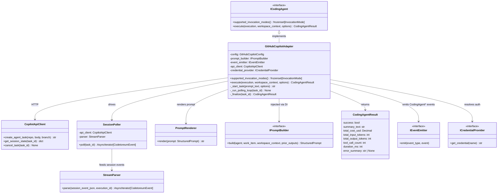

# GitHubCopilotAdapter (Planned)

> **Status**: **Design only.** This adapter is the second target of the coding-agent port redesign (DEF-015). Implementation is targeted at 6–8 weeks post-Claude-Code-adapter landing per proposal §Q6. The shape below validates that `ICodingAgent` is genuinely vendor-agnostic — see [`coding-agent-port-validation.md`](./coding-agent-port-validation.md) for the cross-adapter analysis.
>
> **Speculative notice**: GitHub's public documentation for the Copilot Cloud Agent (formerly "Copilot Workspace") evolves frequently and some session-data surfaces are private to the GitHub UI. Claims flagged "[VERIFY]" must be confirmed against the live REST + GraphQL + webhook surfaces before D1 of the Copilot adapter cycle begins.

## Purpose

**GitHubCopilotAdapter** implements the `ICodingAgent` port by delegating coding work to GitHub's hosted **Copilot Cloud Agent** (the "swe-agent" that operates against a repository, opens a branch, edits files, and produces a pull request). Unlike `ClaudeCodeAdapter`, this adapter shells out to nothing — it is a pure HTTP client wrapping the GitHub REST + GraphQL + webhook surface that controls the cloud agent.

The adapter exists to give Codetoreum a second concrete coding agent so projects can choose Copilot for work items they want executed in GitHub's hosted environment (no local container, no API-key forwarding to a third-party LLM, all activity reflected in GitHub-native artefacts) while still flowing through Codetoreum's workflow orchestration, event store, and review pipeline.

The adapter translates between:
- `WorkspaceContext` + `StructuredPrompt` ↔ a GitHub issue body / `@copilot` assignment / `gh copilot agent-task create` invocation [VERIFY exact surface]
- GitHub Copilot **session events** (polled via REST or pushed via webhook) ↔ a *subset* of the `CodingAgent*` event family — see §Event Mapping for which events are emittable and which are not
- The agent's final pull request + workflow logs ↔ `CodingAgentCompletedEvent` + the result summary returned to `ExecutionService`

## Port Implementation

```python
class GitHubCopilotAdapter(ICodingAgent):
    def supported_invocation_modes(self) -> frozenset[InvocationMode]:
        return frozenset({InvocationMode.API})

    async def execute(
        self,
        execution: AgentExecution,
        workspace_context: WorkspaceContext,
        options: CodingAgentInvocationOptions,
    ) -> CodingAgentResult: ...
```

**Dependencies (constructor-injected)**:
- `prompt_builder: IPromptBuilder` — assembles the `StructuredPrompt`, same shared component all adapters consume.
- `event_emitter: IEventEmitter` — for `CodingAgent*` event publication.
- `github_client: GitHubGraphQLClient` — reused from `GitHubBoardAdapter` / `GitHubTicketAdapter` (shared resilience decorator, shared rate-limit accounting).
- `copilot_api_client: CopilotApiClient` — new HTTP client wrapping the Copilot cloud-agent REST surface.
- `credential_provider: ICredentialProvider` — yields the GitHub App installation token or fine-grained PAT used to authenticate.

**Credentials**:
- Either a **GitHub App installation token** (preferred — scoped to the target repository, no user identity) **or** a **fine-grained personal access token** with `Copilot Coding Agent` permissions on the target repos. The agent runs as the authenticated identity ("Copilot" appears as the PR author either way).
- Resolved at `execute()` time via `ICredentialProvider`; never embedded in code or env.

**Mode**: `API` only. The Copilot agent runs in GitHub's hosted infrastructure; Codetoreum does not host a container, fork a subprocess, or shell out. The adapter's job is wholly to **drive** the hosted agent, **poll its progress**, and **translate** its session state into `CodingAgent*` events.

## Invocation Modes

| Mode | Supported | Notes |
|---|---|---|
| `CONTAINERIZED` | No | The agent's execution environment is GitHub's, not ours. We cannot containerize what GitHub already containerizes. |
| `HOST` | No | Same reasoning — no local process. |
| `API` | **Yes** | The sole mode. HTTP-driven, no subprocess, no container. |

If config selects an unsupported mode, the bootstrap loader fails fast (per INV-17) — no runtime surprises.

## Internal Structure

No `strategies/` subpackage (single mode). Simpler than `claude_code/`:

```
src/codetoreum/adapters/secondary/github_copilot/
├── __init__.py
├── adapter.py            (GitHubCopilotAdapter implementing ICodingAgent)
├── api_client.py         (HTTP client; thin wrapper over the cloud-agent REST endpoints)
├── session_poller.py     (long-poll loop pulling session updates while the agent runs)
├── stream_parser.py      (session-event JSON → CodingAgent* events)
└── prompt_renderer.py    (StructuredPrompt → issue body + agent prompt block)
```

### Flow

1. `adapter.execute(execution, workspace_context, options)` is called.
2. `prompt_builder.build(...)` returns a `StructuredPrompt`; `prompt_renderer.render(prompt)` returns a Markdown-formatted issue body / task description.
3. `api_client.create_agent_task(repo=workspace_context.repo, body=rendered_text, branch=workspace_context.branch_name)` invokes the Copilot cloud agent. [VERIFY: the public surface today is `POST /repos/{owner}/{repo}/issues` with `assignees: ["Copilot"]` plus configuration; the `gh copilot agent-task` CLI may wrap a different unofficial endpoint. Confirm before code lands.]
4. `CodingAgentInvokedEvent` is emitted as soon as the task ID is returned.
5. `session_poller.poll(task_id)` long-polls the Copilot session endpoint at a bounded cadence (start at 5s, exponential backoff up to 30s on no-change). On each delta, it hands new session-event JSON to `stream_parser`.
6. `stream_parser.parse(...)` emits each session event as the appropriate `CodingAgent*` event onto the bus. The full list of which events are emittable is in §Event Mapping; importantly, **some `CodingAgent*` events are not emittable from Copilot** (the cloud agent does not surface them) — those gaps are documented as expected, not as parser failures.
7. On terminal session state (`completed` / `failed` / `cancelled`), the poller exits. The adapter fetches the final pull-request URL (or failure reason), emits `CodingAgentCompletedEvent`, and returns `CodingAgentResult`.

### Key Design Decisions

**1. Polling instead of streaming.** The Copilot cloud agent does not expose a server-sent-events endpoint for individual sessions [VERIFY — webhooks fire on PR creation but not on incremental session state changes today]. The adapter polls. This adds latency between agent action and `CodingAgent*` event emission (5–30s) but is unavoidable until a streaming surface ships.

**2. The api_client is the vendor boundary.** Only `api_client.py` and `stream_parser.py` know about Copilot's wire format. Above the adapter boundary, consumers see `CodingAgent*` events identical in shape to those emitted by `ClaudeCodeAdapter`.

**3. No prompt rendering to "messages array".** Earlier design discussions assumed the adapter would render `StructuredPrompt` to a `[{role, content}, ...]` message array for the Copilot Chat API. That was wrong: the **cloud agent** consumes an issue body / task description, not a chat history. The renderer outputs a single Markdown blob. (The Copilot **Chat** API consumes message arrays, but Copilot Chat is conversational and is not a coding agent — the redesign explicitly chose cloud-agent over chat per §Q6.)

**4. Branch handling deviates from `ClaudeCodeAdapter`.** Claude Code edits the workspace path Codetoreum hands it; the cloud agent creates its own branch *for us*, named per its own convention. The adapter normalises this: the resulting branch name is captured in the `CodingAgentCompletedEvent.summary_text` and made available to downstream stages via `WorkspaceContext` updates so the PR creation stage can target the right ref.

**5. Workspace mounts are not used.** `workspace_context.workspace_path` is **not consulted** — the cloud agent operates against the GitHub remote directly. Only `workspace_context.project_id`, `workspace_context.work_item_id`, and `workspace_context.branch_name` are read. This is a clean test of the port: `WorkspaceContext` carries logical workspace information that the API mode adapter happens not to need; nothing forces it to mount the path.

## Event Mapping

**Emittable from Copilot session data** (8 of 11):

| `CodingAgent*` Event | Copilot Source | Notes |
|---|---|---|
| `CodingAgentInvokedEvent` | Task-creation API response | Bookend; fired immediately after `create_agent_task` returns. |
| `CodingAgentReadyEvent` | First session-event indicating "agent assigned" | Polled; ~5–10s after invocation. |
| `CodingAgentToolCallEvent` | Session events of type `tool_call` (file_read, file_edit, terminal, browser, mcp) | [VERIFY: the public session-data surface exposes tool calls in the GitHub UI — confirm they are present in the REST/webhook payload not just the web rendering] |
| `CodingAgentToolResultEvent` | Session events of type `tool_result` | Same verification needed as above. |
| `CodingAgentTextOutputEvent` | Session events of type `message` (assistant role) | The agent's narrative summaries. |
| `CodingAgentRateLimitEvent` | HTTP 429 from polling | Synthesised by the adapter from the response, not from the session. |
| `CodingAgentApiRetryEvent` | HTTP transient errors (5xx) from polling | Synthesised. |
| `CodingAgentCompletedEvent` | Terminal session state + final PR URL / failure reason | Bookend; carries the PR URL in `summary_text`. |

**NOT emittable from Copilot** (3 of 11 — design gap):

| `CodingAgent*` Event | Reason | Impact |
|---|---|---|
| `CodingAgentThinkingEvent` | The cloud agent does not surface reasoning traces. Internal model thinking is invisible to external consumers. | Behavioural analysis comparing thinking-heavy tasks across adapters cannot include Copilot. |
| `CodingAgentOtlpSpanEvent` | The cloud agent does not export OpenTelemetry data to clients. | OTel-based cross-adapter performance comparisons are blocked for Copilot. |
| `CodingAgentTokensUsedEvent` | Copilot's pricing model is **request-based**, not token-based; the API does not surface per-execution token counts. | Cross-adapter cost-per-execution analysis cannot use the same field. **The validation summary discusses whether `CodingAgentResult.total_input_tokens` / `total_output_tokens` should become `Optional[int]` or whether a separate `CodingAgentRequestsUsedEvent` is needed.** |

The adapter **does not synthesise placeholder events** to fill these gaps. Analysis pipelines querying by `event_type` see Copilot streams as legitimately shorter; this is preferable to fake telemetry. The trade-off is documented in `coding-agent-port-validation.md`.

## Configuration

### Adapter-level Configuration

```python
@dataclass(frozen=True)
class GitHubCopilotConfig:
    # Authentication
    installation_token_credential_name: str = "GITHUB_APP_INSTALLATION_TOKEN"
    pat_credential_name: str = "GITHUB_FINE_GRAINED_PAT"  # fallback
    credential_provider: ICredentialProvider | None = None

    # Polling
    poll_initial_interval_seconds: int = 5
    poll_max_interval_seconds: int = 30
    poll_total_timeout_seconds: int = 3_600  # 1 hour ceiling on a single execution

    # API endpoints (overridable for GHES)
    github_api_base: str = "https://api.github.com"
    copilot_api_base: str = "https://api.githubcopilot.com"  # [VERIFY: actual base URL]
```

### Per-Execution Configuration (via `CodingAgentInvocationOptions.mode_config`)

```json
{
  "name": "senior_software_engineer_copilot",
  "coding_agent": "github-copilot",
  "invocation": {
    "mode": "api",
    "model": "default",
    "timeout_seconds": 3600,
    "mode_config": {
      "repo": "tinkermonkey/rounds",
      "base_branch": "main",
      "auto_open_pr": true,
      "include_workflow_logs_in_completion": true
    }
  }
}
```

| Key | Meaning |
|---|---|
| `repo` | `owner/name` of the GitHub repo against which the cloud agent runs. |
| `base_branch` | Base branch from which the agent's working branch is cut. |
| `auto_open_pr` | Whether to ask the cloud agent to open a draft PR on completion (vs. just commit a branch). |
| `include_workflow_logs_in_completion` | If true, the final `CodingAgentCompletedEvent.summary_text` includes a truncated tail of the agent's GitHub Actions workflow log for at-a-glance debugging. |

**Note**: `model` is currently locked to whatever Copilot Cloud Agent serves (no caller-selectable model variant exposed today). Reserved for future use if GitHub exposes model selection.

### Environment Variables

- `GITHUB_APP_INSTALLATION_TOKEN` — preferred auth
- `GITHUB_FINE_GRAINED_PAT` — fallback auth (requires the `Copilot coding agent` permission on the target repos)

## Resilience

`ResilientCodingAgentDecorator` (INV-11) wraps this adapter the same way it wraps `ClaudeCodeAdapter`. Behaviours and their applicability:

| Behaviour | Applies | Notes |
|---|---|---|
| **Circuit breaker (shared per adapter)** | Yes | Per O6 Lean in the proposal — one breaker per `coding_agent_id`, not per-mode. Copilot has only one mode, so this is moot in practice. |
| **Per-execution timeout** | Yes | Enforced by `poll_total_timeout_seconds`; ends the polling loop cleanly. |
| **Retry on transient errors** | Yes, scoped to the polling loop | 429 / 5xx from the polling endpoint trigger backoff + `CodingAgentApiRetryEvent`. **Not** retried at the execution level — a failed agent run is not retried by re-invoking the cloud agent (that would create a second PR). |
| **Rate limiting** | Yes | The polling cadence itself contributes to GitHub API rate-limit consumption; the shared `GitHubGraphQLClient` rate-limit governor is reused. |
| **Cost limit** | Partial | `options.cost_limit_usd` is **not enforceable** by the adapter — Copilot pricing is per-request and assessed by GitHub at billing time, not per-execution by the API. The adapter logs a warning if `cost_limit_usd` is set and emits no events to enforce it. **Cross-adapter implication**: see port-shape critique below. |

## Open Risks

1. **The session-event REST/webhook payload may not match the GitHub web UI's session view.** [VERIFY] If session events as currently rendered in the GitHub UI are computed server-side from internal telemetry that is not exposed through the public API, the adapter will see far less than this design assumes — possibly only `invoked` / `completed` lifecycle events. If this happens, the `CodingAgentToolCallEvent` / `CodingAgentToolResultEvent` / `CodingAgentTextOutputEvent` mappings are not implementable. The fallback design is documented in the validation summary as "the worst-case Copilot adapter" — it would emit only bookend events and the agent's final summary, no granular behaviour.

2. **Branch and PR identity reconciliation.** The cloud agent creates branches and PRs under its own conventions. Downstream Codetoreum stages (review service, PR-update flow) assume Codetoreum-controlled branch names. The adapter must reconcile or the downstream wiring must learn Copilot's convention. Resolved either way before D1.

3. **GHES support is uncertain.** Copilot Cloud Agent is currently a GitHub.com Enterprise feature; the GHES (self-hosted GitHub Enterprise Server) availability and API surface lags. The adapter's `copilot_api_base` knob anticipates this, but multi-region / GHES deployments need validation before claiming support.

4. **Cancel semantics may differ from Claude Code.** If `ExecutionService.cancel_execution` fires mid-run, the adapter must call a Copilot cancel endpoint (if one exists) and abandon the polling loop. [VERIFY: cancel API surface.] If no cancel endpoint exists, the adapter can only orphan the polling loop; the cloud agent continues running until it finishes naturally, and the eventual PR is orphaned. This is a behaviour gap relative to `ClaudeCodeAdapter`'s `SIGKILL`-able subprocess.

5. **Determinism for simulation.** A `MockGitHubCopilotAdapter` is straightforward (canned session-event sequences), but **contract tests against the real cloud agent are non-trivial** — every contract test creates a real PR. Integration tests need a dedicated throwaway repository and budget guards.

## Port-Shape Critique

This adapter is **the central test** of the proposal's claim that `ICodingAgent` is genuinely vendor-agnostic. Findings:

**Fits cleanly**:
- `supported_invocation_modes()` — the `API` mode was added precisely for this adapter and fits without strain.
- `execute(execution, workspace_context, options) -> CodingAgentResult` — the single-method contract maps naturally to "kick off the cloud agent, poll until done, return summary".
- The strategy-pattern internal layout is not needed for a single-mode adapter; the proposal's expectation that strategies are an **internal** detail (not part of the port surface) is validated — `GitHubCopilotAdapter` lives without them just fine.
- `IPromptBuilder` / `StructuredPrompt` injection — the structured prompt renders cleanly to a Markdown issue body. The separation between prompt **business logic** (what to include) and prompt **presentation** (how to format) is the same separation `ClaudeCodeAdapter` consumes.

**Fits with strain**:
- `WorkspaceContext.workspace_path` is unused by this adapter. The path exists for adapters that mount it (Claude Code containerized + host strategies, Codex similarly). The contract is fine — adapters consume what they need and ignore the rest — but if more `API`-mode adapters arrive that don't touch the filesystem, this raises whether `workspace_path` should be `Optional[Path]` on the dataclass. **Lean: leave it as `Path` for now; downgrading to optional adds friction for the majority of adapters that need it.**
- `CodingAgentInvocationOptions.cost_limit_usd` cannot be enforced by this adapter. Other adapters (Claude Code) enforce it by tracking per-event token cost and short-circuiting. The contract is honoured (a `None` value means no limit) but if the caller passes a non-`None` value expecting enforcement, the adapter silently ignores it. **Recommendation**: the validation summary should propose either (a) document `cost_limit_usd` as best-effort, or (b) add a `cost_limit_enforceable: bool` field on `CodingAgentResult` so callers can detect ignored limits.

**Doesn't fit**:
- **`CodingAgentTokensUsedEvent.total_input_tokens` / `total_output_tokens`** are required (non-Optional `int`) by the current `CodingAgentResult` dataclass. Copilot has no token concept — it has *requests*. Three options:
  - **(a)** Return `0` for token fields when invoking through Copilot (lies, blocks cross-adapter cost analysis).
  - **(b)** Make the token fields `Optional[int]` (truthful but breaks any downstream code that assumes tokens are present).
  - **(c)** Introduce a `CodingAgentResourceUsage` discriminated-union value object covering tokens-vs-requests, with `CodingAgentResult.resource_usage: CodingAgentResourceUsage`.
  - **Lean: (c)** — the cleanest separation; aligns with the proposal's principle that the port expresses the role, not vendor-specific accounting units. **Discussed in the validation summary.**
- **`CodingAgentThinkingEvent` / `CodingAgentOtlpSpanEvent`** are events the port catalog says coding agents emit, but Copilot does not surface either. The current event family is *optional* per event type (no invariant says every adapter must emit every event), so this is not strictly a contract violation. But it raises whether the catalog should be tiered:
  - **Tier 1 (always emitted)**: lifecycle bookends (`Invoked`, `Ready`, `Completed`), `RateLimit`, `ApiRetry`.
  - **Tier 2 (emitted if vendor surfaces it)**: `ToolCall`, `ToolResult`, `TextOutput`.
  - **Tier 3 (vendor-dependent)**: `Thinking`, `OtlpSpan`, `TokensUsed`.
  - **Lean: document the tiering in the event catalog, do not enforce via code.** The validation summary recommends this.

## Diagram



## Testing

### Unit Tests
- **`supported_invocation_modes()` contract**: returns `frozenset({InvocationMode.API})`.
- **Stream parser fixtures**: captured session-event payloads (recorded from real Copilot Cloud Agent runs in a throwaway test repo) feed the parser; assert the expected `CodingAgent*` event ledger emerges.
- **Polling cadence**: tests that backoff progresses from 5s through 30s; that 429 responses extend the interval; that total timeout aborts the loop with a `CodingAgentCompletedEvent(success=False)`.
- **Prompt renderer**: golden-file outputs verifying the Markdown rendering is stable across runs.
- **Credential resolution**: mocked `ICredentialProvider` tests for installation-token-preferred-over-PAT fallback.
- **Error mapping**: HTTP error → `CodingAgentApiRetryEvent` / `CodingAgentRateLimitEvent` / `CodingAgentCompletedEvent(success=False)`.

**Location**: `tests/unit/adapters/secondary/github_copilot/`

### Integration Tests
- **Real Copilot Cloud Agent** against a dedicated throwaway repo. Each run creates a real PR; tests assert event ledger shape, not PR contents. Budget guards (max concurrent runs, max runs per day) protect against runaway cost.
- **Cancellation**: verify cancel-mid-run cleans up cleanly (or, if no cancel endpoint exists, verify the polling loop exits and the orphaned PR is logged).

**Location**: `tests/integration/adapters/secondary/github_copilot/` (gated behind an env var; not run in CI without explicit opt-in).

### Contract Tests
- Shared contract suite (`tests/contracts/adapters/test_coding_agent_contract.py`) runs against `GitHubCopilotAdapter` and `MockGitHubCopilotAdapter`.
  > ⚠ Not yet built — prerequisite for the `ICodingAgent` pluggability track; tracked separately.
- Confirms `supported_invocation_modes()`, `execute()` signature, exception types.

### Simulation Tests
- `MockGitHubCopilotAdapter` ships with canned session-event sequences for deterministic scenario testing. Scenario tests can swap the production adapter for the mock without other changes.

**Location**: `tests/simulation/scenarios/`

## Source (planned layout)

**Directory**: `src/codetoreum/adapters/secondary/github_copilot/`

**Class**: `class GitHubCopilotAdapter(ICodingAgent):`

**Layout**:

```
src/codetoreum/adapters/secondary/github_copilot/
├── __init__.py
├── adapter.py            (GitHubCopilotAdapter implementing ICodingAgent)
├── api_client.py         (HTTP client; thin wrapper over the cloud-agent REST endpoints)
├── session_poller.py     (long-poll loop pulling session updates while the agent runs)
├── stream_parser.py      (session-event JSON → CodingAgent* events)
└── prompt_renderer.py    (StructuredPrompt → issue body + agent prompt block)
```

**Related Files**:
- Port interface: `src/codetoreum/ports/output/coding_agent.py` (`ICodingAgent`, `InvocationMode`, `CodingAgentInvocationOptions`, `CodingAgentResult`)
- Prompt builder port: `src/codetoreum/ports/output/prompt_builder.py` (`IPromptBuilder`, `StructuredPrompt`)
- Events: `src/codetoreum/domain/events/coding_agent_events.py`
- Shared GitHub client (resilience + rate limits): `src/codetoreum/infrastructure/http/github_graphql_client.py`
- Credential provider: shared with `ClaudeCodeAdapter`
- Reference implementation: `documentation/architecture/adapters/production/claude-code-adapter.md`

## Cross-References

- **Port Interface**: [ICodingAgent](../../ports/output/core-system.md#icodingagent)
- **Prompt Builder Port**: [IPromptBuilder](../../ports/output/domain-services.md#ipromptbuilder)
- **Event Catalog**: [Coding Agent Context](../../domain/events.md#coding-agent-context)
- **Infrastructure**: [Resilience Patterns](../../infrastructure/resilience.md)
- **Validation summary**: [coding-agent-port-validation.md](./coding-agent-port-validation.md)
- **Sibling planned adapter**: [codex-adapter.md](./codex-adapter.md)
- **Reference adapter**: [claude-code-adapter.md](../production/claude-code-adapter.md)
- **Design**: `~/.claude/plans/coding-agent-port-redesign.md`
- **Deficiency log**: `bootstrap/ARCHITECTURE.md` §9, DEF-015
