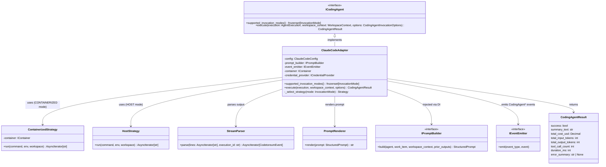

# ClaudeCodeAdapter

> **Status**: This document describes the **post-redesign** shape of `ClaudeCodeAdapter` as specified by `~/.claude/plans/coding-agent-port-redesign.md`. The current source code still reflects the prior `ILLMProvider` shape; the rewrite lands in Phase D3.

## Purpose

**ClaudeCodeAdapter** implements the `ICodingAgent` interface by launching the Claude Code CLI in autonomous-agent mode. It is the first concrete implementation of the new coding-agent port and serves as the template for `GitHubCopilotAdapter` and `CodexAdapter`.

The adapter:
- Declares `supported_invocation_modes() == frozenset({InvocationMode.CONTAINERIZED, InvocationMode.HOST})`.
- Receives a `StructuredPrompt` from an injected `IPromptBuilder`; renders it to text suitable for `claude --print PROMPT_TEXT` via an internal `prompt_renderer` module.
- Picks an invocation strategy (containerized via `IContainer`, or host via subprocess) based on `options.invocation_mode`.
- Streams the agent's `stream-json` output through a `stream_parser` that emits the full `CodingAgent*` event family on the event bus.
- Returns a `CodingAgentResult` summary on completion.

The adapter translates between:
- `WorkspaceContext` + `StructuredPrompt` ↔ Claude CLI args, environment, and the rendered prompt text
- Claude Code `stream-json` output ↔ `CodingAgentToolCallEvent` / `CodingAgentToolResultEvent` / `CodingAgentTextOutputEvent` / `CodingAgentThinkingEvent` / `CodingAgentRateLimitEvent` / `CodingAgentApiRetryEvent` / `CodingAgentOtlpSpanEvent` / `CodingAgentTokensUsedEvent` / `CodingAgentCompletedEvent`
- Subprocess lifecycle (start, init complete, exit) ↔ `CodingAgentInvokedEvent`, `CodingAgentReadyEvent`, `CodingAgentCompletedEvent`

## Implementation Strategy

### Internal Structure (post-redesign)

```
src/codetoreum/adapters/secondary/claude_code/
├── __init__.py
├── adapter.py              (ClaudeCodeAdapter implementing ICodingAgent)
├── strategies/
│   ├── __init__.py
│   ├── containerized.py    (uses IContainer)
│   └── host.py             (subprocess.run, working_directory = workspace_context.workspace_path)
├── stream_parser.py        (stream-json → CodingAgent* events)
└── prompt_renderer.py      (StructuredPrompt → claude --print prompt text)
```

`adapter.execute()` picks a strategy from `options.invocation_mode`, calls `prompt_builder.build(...)` to get a `StructuredPrompt`, renders it to text via `prompt_renderer`, and the strategy runs the agent. Output flows through `stream_parser`, which emits domain events to the bus as it parses.

### Key Design Decisions

**1. Strategy split (containerized vs host) is internal**

The choice of strategy is the adapter's, not the application layer's. `ExecutionService` calls `ICodingAgent.execute()` once with `options.invocation_mode`; the adapter dispatches to the right strategy. Each strategy carries its own runtime concerns:

- `strategies/containerized.py`: builds the container, mounts the workspace read-only (per Q7 — no `/output` extraction), runs `codetoreum-agent:latest`, streams the subprocess output, and removes the container after exit. Uses `IContainer`.
- `strategies/host.py`: runs `claude --print` directly via `subprocess.run`, with `workspace_context.workspace_path` as the working directory. No container.

A future fourth strategy is **not** added if Copilot needs API mode — `GitHubCopilotAdapter` is a separate `ICodingAgent` adapter that supports only `{InvocationMode.API}`.

**2. Stream parser is the vendor boundary**

`stream_parser.py` is the only place that knows about Claude Code's `stream-json` schema. It consumes JSON events from stdout and emits domain events. Above this boundary, nothing else in Codetoreum knows what shape Claude Code's output takes; everything else consumes `CodingAgent*` events.

The parser handles:
- Non-JSON output lines (progress, stderr leakage) — skip and continue.
- Truncation of large tool inputs / results — see open question O4 in the design proposal.
- OTel span lines — emit as `CodingAgentOtlpSpanEvent` rather than forwarding directly to a collector (resolves DEF-014).

**3. Prompt renderer is the presentation boundary**

`prompt_renderer.py` takes a `StructuredPrompt` and produces a text string suitable for `claude --print`. It owns the *presentation* of the prompt (header, sections, fenced code, instructions list formatting). It does **not** decide *what* to include — that's the `IPromptBuilder` injected via DI. The split is enforced by an architectural invariant.

**4. Credentials are injected, not embedded**

Credentials (`ANTHROPIC_API_KEY` or `CLAUDE_CODE_OAUTH_TOKEN`) are passed via the existing `ICredentialProvider` mechanism. The adapter resolves them at `execute()` time and forwards them to the chosen strategy:
- Containerized strategy injects them into the container env.
- Host strategy passes them to the subprocess env.

**5. No filesystem-based output extraction**

`/output` directory extraction is **forbidden** (Q7 in the design proposal). Agent execution output flows exclusively through `CodingAgent*` events. The filesystem passes context *in* (read-only source mounts) but never carries context *out*. A crashed agent + lost filesystem must not equal lost execution data.

### Error Handling Philosophy

**Non-recoverable errors** (fail fast):
- Authentication failure (invalid API key)
- Invalid request format
- Permission errors

**Recoverable errors** (retry with backoff):
- Transient API errors (500, 503)
- Rate limit exceeded
- Timeout

**Degraded service** (fallback):
- Streaming unavailable → fall back to buffering
- Tool execution fails → return error message to Claude Code

## Configuration

### Adapter-level Configuration

```python
@dataclass
class ClaudeCodeConfig:
    # Authentication (secure references)
    api_key_credential_name: str = "ANTHROPIC_API_KEY"
    oauth_token_credential_name: str = "CLAUDE_CODE_OAUTH_TOKEN"
    credential_provider: ICredentialProvider | None = None

    # CLI configuration
    claude_cli_path: str = "claude"              # Path to CLI executable
    permission_mode: str = "bypassPermissions"   # or "askForPermissions"
```

### Per-Execution Configuration (via `CodingAgentInvocationOptions`)

Per-execution settings come from `AgentConfig.invocation` in `bootstrap/rounds.json` and are passed into `execute()` as `CodingAgentInvocationOptions`:

```json
{
  "name": "senior_software_engineer",
  "coding_agent": "claude-code",
  "invocation": {
    "mode": "containerized",
    "model": "claude-sonnet-4-6",
    "timeout_seconds": 3600,
    "mode_config": {
      "image": "codetoreum-agent:latest",
      "cpu_limit": "2",
      "memory_limit": "4g"
    }
  }
}
```

The bootstrap loader validates `coding_agent` resolves to a registered adapter, then validates `invocation.mode` is in `coding_agent.supported_invocation_modes()`. Errors at load, not at first execution.

The `requires_docker` flag is **gone**. Mode lives in the invocation block.

### Environment Variables
- `ANTHROPIC_API_KEY`: Anthropic API key (required if using API key auth)
- `CLAUDE_CODE_OAUTH_TOKEN`: Claude Code OAuth token (required if using OAuth)

Note: The CLI path is configured via `ClaudeCodeConfig.claude_cli_path`, not an environment variable.

### Credential Handling

Credentials are retrieved via pluggable credential provider:
```python
credential_provider = EnvironmentCredentialProvider()  # Dev
# OR
credential_provider = SecureStoreCredentialProvider()  # Production

api_key = await credential_provider.get_credential("ANTHROPIC_API_KEY")
oauth_token = await credential_provider.get_credential("CLAUDE_CODE_OAUTH_TOKEN")
```

The adapter requires either API key or OAuth token. In production, use secure store integration (e.g., AWS Secrets Manager, HashiCorp Vault).

### Model Selection

Available Claude models via CLI:
- **claude-sonnet-4-6**: Latest Sonnet model (default)
- **claude-sonnet-3-5-20241022**: Previous Sonnet version
- **claude-opus-4-20250514**: Most capable, slower, more expensive
- Other models as available in Claude Code CLI

Model can be overridden per execution via ExecutionContext.

## Error Handling

### Authentication & Authorization Errors
```
Claude CLI execution with invalid or missing credentials
    ↓
Exit code non-zero, stderr: "authentication" error
    ↓
raise AuthenticationError("Invalid API key or OAuth token")
```
**Recovery**: Verify credentials via credential provider. Update environment variables or secure store.

### CLI Not Found
```
Claude CLI executable not found at configured path
    ↓
FileNotFoundError during subprocess execution
    ↓
raise CodingAgentError("Claude CLI not found at: {path}")
```
**Recovery**: Install Claude CLI. Update `claude_cli_path` configuration.

### Validation Errors
```
Invalid input (prompt too long, empty prompt)
    ↓
raise ValidationError("Prompt cannot be empty")
    OR
raise PromptTooLongError("Prompt exceeds maximum length of 1MB")
```
**Recovery**: Validate prompt before execution. Reduce context size.

### Execution Timeout
```
Claude CLI process exceeds timeout (default 5 minutes)
    ↓
Process killed via SIGKILL
    ↓
raise ExternalServiceError("Execution timeout")
```
**Recovery**: Increase timeout in configuration. Reduce prompt complexity.

### Process Termination Errors
```
CLI process fails to terminate gracefully after SIGKILL
    ↓
Log warning (likely D-state/kernel I/O)
    ↓
Adapter continues (process cleanup may lag)
```
**Recovery**: Monitor system resources. Investigate kernel state.

### Stream Processing Errors
```
Invalid JSON in stream output or non-JSON lines
    ↓
Skip line and continue (logged at debug level)
    ↓
Progress output or stderr leakage expected from CLI
```
**Recovery**: None needed. Adapter handles mixed JSON/text output gracefully.

### Rate Limiting
```
Claude Code backend returns rate limit error in stderr
    ↓
Exit code non-zero, stderr: "rate limit"
    ↓
raise RateLimitError()
```
**Recovery**: Implement request queue with rate limiting. Retry after cooldown.

### Rate Limit & API Retry Events

When the parser detects a rate-limit notice or an internal API retry in the `stream-json` output, it emits `CodingAgentRateLimitEvent` or `CodingAgentApiRetryEvent` rather than failing the execution. Adapter-level resilience (circuit breaking, cross-execution throttling) remains an infrastructure concern via `ResilientCodingAgentDecorator` (INV-11). The events provide visibility into the agent's per-execution recovery behaviour for analysis.

## Testing

### Unit Tests
- **`supported_invocation_modes()` contract**: Returns `frozenset({CONTAINERIZED, HOST})`.
- **Stream parser fixtures**: Captured `stream-json` payloads from real Claude Code runs (we have plenty from prior bootstrap cycles) verify that the parser emits the expected sequence of `CodingAgent*` events. Each fixture asserts the full event ledger.
- **Strategy tests**: Containerized strategy with a mocked `IContainer`; host strategy with `subprocess.run` mocked. Verify each strategy translates `WorkspaceContext` + rendered prompt + credentials correctly.
- **Prompt renderer tests**: Golden-file outputs for representative `StructuredPrompt` inputs. Verify the rendered text is stable across runs.
- **Configuration validation**: Valid/invalid configs; `UnsupportedInvocationModeError` raised when `options.invocation_mode` is outside `supported_invocation_modes()`.
- **Credential provider mocking**: Test with mocked `EnvironmentCredentialProvider` and `SecureStoreCredentialProvider`.
- **Error mapping**: CLI exit codes / stderr / parser errors → `CodingAgentError` and friends; verify `error_summary` flows into `CodingAgentCompletedEvent`.

**Location**: `tests/unit/adapters/secondary/claude_code/`

### Integration Tests
- **Real Claude Code CLI** (with test key): Run host strategy end-to-end against a small toy workspace; verify the `CodingAgent*` event ledger matches the expected shape.
- **Real Docker** (with test key): Run containerized strategy against `codetoreum-agent:latest`; verify container starts, agent runs, container cleans up.
- **Authentication**: Valid key, invalid key, expired token; verify error events are emitted rather than silent failures.
- **Different models**: Verify model selection per `CodingAgentInvocationOptions.model`.
- **Rate limiting**: Trigger a rate-limit response and verify `CodingAgentRateLimitEvent` is emitted; resilience decorator's behaviour is tested separately.

**Location**: `tests/integration/adapters/secondary/claude_code/`

### Contract Tests
- Verify `ClaudeCodeAdapter` implements `ICodingAgent` fully (`supported_invocation_modes`, `execute`).
- Shared test suite runs against `ClaudeCodeAdapter` and `MockClaudeCodeAdapter` (simulation double).
- Method signatures, exception types, return value shapes (`CodingAgentResult`).

**Location**: `tests/contracts/adapters/test_coding_agent_contract.py`

### Simulation Tests
- Use `MockClaudeCodeAdapter` (replaces `MockLLMAdapter`). Deterministic event emission for scenario tests.
- Scenarios verify the executor → coding-agent → event-bus → completion flow.

**Location**: `tests/simulation/scenarios/`

### Mocking Strategy
```python
@pytest.fixture
def claude_code_adapter(mocker, event_emitter, prompt_builder):
    # Mock subprocess.run() to feed a canned stream-json payload
    fixture = load_stream_json_fixture("simple_implementation.jsonl")
    mock_run = mocker.patch("subprocess.run")
    mock_run.return_value = subprocess.CompletedProcess(
        args=["claude", "--print", "..."],
        returncode=0,
        stdout=fixture,
        stderr=""
    )

    config = ClaudeCodeConfig(
        claude_cli_path="claude",
        credential_provider=EnvironmentCredentialProvider(),
    )
    return ClaudeCodeAdapter(
        config=config,
        prompt_builder=prompt_builder,
        event_emitter=event_emitter,
        container=None,                  # host strategy only in this fixture
    )
```

## Source (post-redesign layout)

**Directory**: `src/codetoreum/adapters/secondary/claude_code/`

**Class**: `class ClaudeCodeAdapter(ICodingAgent):`

**Layout**:

```
src/codetoreum/adapters/secondary/claude_code/
├── __init__.py
├── adapter.py              (ClaudeCodeAdapter implementing ICodingAgent)
├── strategies/
│   ├── __init__.py
│   ├── containerized.py    (uses IContainer)
│   └── host.py             (subprocess.run)
├── stream_parser.py        (stream-json → CodingAgent* events)
└── prompt_renderer.py      (StructuredPrompt → claude --print text)
```

**Related Files**:
- Port interface: `src/codetoreum/ports/output/coding_agent.py` (`ICodingAgent`, `InvocationMode`, `CodingAgentInvocationOptions`, `CodingAgentResult`)
- Prompt builder port: `src/codetoreum/ports/output/prompt_builder.py` (`IPromptBuilder`, `StructuredPrompt`)
- Events: `src/codetoreum/domain/events/coding_agent_events.py`
- Configuration: `src/codetoreum/config/claude_config.py`
- Credential providers: `src/codetoreum/adapters/secondary/claude_code/credentials.py` (`ICredentialProvider`)
- Bootstrap wiring: `src/codetoreum/infrastructure/simulation/bootstrap.py` (Simulation), `documentation/implementations/production-bootstrap.md` (Production)
- Tests: `tests/unit/adapters/secondary/claude_code/`

## Diagram



## Production vs. Mock Comparison

| Aspect | Production (`ClaudeCodeAdapter`) | Mock (`MockClaudeCodeAdapter`) |
|---|---|---|
| **External System** | Claude Code CLI subprocess (containerized or host) | In-memory event emission |
| **Latency** | 1-30 minutes (autonomous agent loop) | <1ms |
| **Determinism** | No (depends on agent decisions) | Yes (deterministic event ledger) |
| **Capabilities** | Full Claude Code CLI (file edits, bash, tool use, multi-step) | Configurable canned `CodingAgent*` event sequence |
| **Dependencies** | Claude CLI binary, API credentials, optional Docker daemon | None |
| **Token Usage** | Real (parsed from `stream-json` and emitted as `CodingAgentTokensUsedEvent`) | Simulated/configurable |
| **Error Handling** | Real CLI/API errors + exit codes + resilience decorator | Configurable mock errors |
| **Use Case** | Production, staging | Testing, development, CI/CD |
| **Cost** | Per-token pricing (via Anthropic) | Free (simulated) |

## Cross-References

- **Port Interface**: [ICodingAgent](../ports/output/core-system.md#icodingagent) — Complete interface specification
- **Prompt Builder Port**: [IPromptBuilder](../ports/output/domain-services.md#ipromptbuilder) — Structured prompt assembly
- **Event Catalog**: [Coding Agent Context](../domain/events.md#coding-agent-context) — Full `CodingAgent*` event family
- **Infrastructure**: [Resilience Patterns](../infrastructure/resilience.md) — Rate limiting, retry, circuit breaker via `ResilientCodingAgentDecorator`
- **Observability**: [Distributed Tracing](../infrastructure/observability.md#distributed-tracing) — OTel routing via event bus
- **Simulation**: [MockClaudeCodeAdapter](../../../implementations/simulation/adapters.md#output-port-adapters) — Test alternative
- **Design**: `~/.claude/plans/coding-agent-port-redesign.md` — Full redesign proposal
