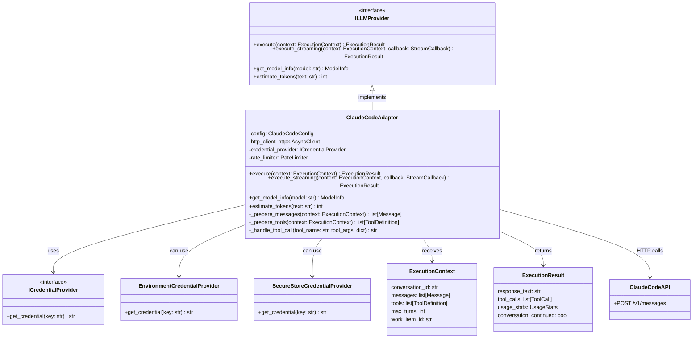

# ClaudeCodeAdapter

## Purpose

**ClaudeCodeAdapter** implements the `ILLMProvider` interface by connecting to the Claude Code API, providing LLM operations including single-turn prompting, multi-turn conversations, tool execution, and streaming responses.

This adapter is used in production to execute agent logic via Claude Code. When the orchestrator needs an AI agent to analyze a work item, the adapter sends the item's context to Claude Code, receives a response, and returns the result to the orchestrator. The adapter handles multi-turn conversations, tool definitions, streaming output, and error recovery.

The adapter translates between:
- Codetoreum domain models ↔ Claude Code API format
- ExecutionContext (work item, code, history) ↔ Claude Code messages and tools
- ExecutionResult ↔ Claude Code completion response

## Implementation Strategy

### Claude Code API Integration

ClaudeCodeAdapter uses the **Claude Code API** (HTTP-based):
- Streaming support for real-time output
- Multi-turn conversation management
- Tool definitions and execution
- Token usage tracking
- Model selection and configuration

### Key Design Decisions

**1. Credential Provider Pattern**
```python
class ICredentialProvider:
    """Interface for secure credential providers."""
    async def get_credential(self, key: str) -> str | None:
        ...

class EnvironmentCredentialProvider(ICredentialProvider):
    """Retrieves credentials from environment variables."""
    
class SecureStoreCredentialProvider(ICredentialProvider):
    """Retrieves credentials from secure key store."""
```

Credentials are provided via pluggable credential providers:
- **EnvironmentCredentialProvider**: Reads from environment variables (dev/test)
- **SecureStoreCredentialProvider**: Reads from system keychain (production)
- Allows swapping credential sources without changing adapter code

**2. Configuration Management**
```python
@dataclass
class ClaudeCodeConfig:
    # Model configuration
    model: str = "claude-3-5-sonnet-20241022"  # Default model
    max_tokens: int = 4096                      # Response length limit
    temperature: float = 0.7                    # Randomness (0-1)
    
    # API configuration
    api_url: str = "https://api.anthropic.com"
    timeout_seconds: int = 30
    
    # Streaming
    streaming_enabled: bool = True
    
    # Rate limiting
    requests_per_minute: int = 60
    tokens_per_minute: int = 40000
```

Configuration controls model selection, rate limits, and streaming behavior.

**3. Multi-turn Conversation Tracking**
```python
@dataclass
class ExecutionContext:
    """Context for LLM execution."""
    conversation_id: str                # Unique conversation identifier
    messages: list[Message]             # Conversation history
    tools: list[ToolDefinition]        # Available tools for this execution
    max_turns: int = 10                # Limit conversation length
    work_item_id: str | None = None    # Associated work item
    project_id: str | None = None      # Associated project
```

Conversations are tracked via `conversation_id`:
- Multiple turns supported (agent can ask follow-up questions)
- Message history preserved for context
- Tool definitions specify what agent can do

**4. Tool Execution**
```python
@dataclass
class ToolDefinition:
    """Definition of a tool available to the LLM."""
    name: str                           # Tool name (e.g., "create_issue")
    description: str                    # What this tool does
    parameters: dict                    # JSON schema for parameters
    
class Tool:
    """Actual tool execution handler."""
    async def execute(self, name: str, args: dict) -> str:
        """Execute a tool and return result."""
```

When Claude Code calls a tool:
1. Adapter receives tool call with name and arguments
2. Looks up tool handler in application layer
3. Executes tool and returns result to Claude Code
4. Claude Code continues conversation with tool result

**5. Streaming Support**
```python
async def execute_streaming(
    self,
    context: ExecutionContext,
    stream_callback: StreamCallback
) -> ExecutionResult:
    """Execute with streaming output."""
    async for chunk in self._stream_response():
        await stream_callback(chunk)  # Real-time updates
    return result
```

Streaming allows:
- Real-time feedback to user (no waiting for full response)
- Reduced latency perception
- Efficient handling of long responses

### Error Handling Philosophy

**Non-recoverable errors** (fail fast):
- Authentication failure (invalid API key)
- Invalid request format
- Permission errors

**Recoverable errors** (retry with backoff):
- Transient API errors (500, 503)
- Rate limit exceeded
- Timeout

**Degraded service** (fallback):
- Streaming unavailable → fall back to buffering
- Tool execution fails → return error message to Claude Code

## Configuration

### Required Parameters
```python
@dataclass
class ClaudeCodeConfig:
    # API credentials
    api_key: str                        # Claude Code API key (required)
    
    # Model configuration
    model: str = "claude-3-5-sonnet-20241022"
    max_tokens: int = 4096
    temperature: float = 0.7
    
    # API configuration
    api_url: str = "https://api.anthropic.com"
    timeout_seconds: int = 30
    
    # Streaming
    streaming_enabled: bool = True
    
    # Rate limiting
    requests_per_minute: int = 60
    tokens_per_minute: int = 40000
```

### Environment Variables
- `CLAUDE_API_KEY`: Claude Code API key (required)
- `CLAUDE_MODEL`: Model name (default: claude-3-5-sonnet-20241022)
- `CLAUDE_MAX_TOKENS`: Max response tokens (default: 4096)
- `CLAUDE_TEMPERATURE`: Temperature 0-1 (default: 0.7)
- `CLAUDE_TIMEOUT_SECONDS`: API timeout (default: 30)
- `CLAUDE_STREAMING_ENABLED`: Enable streaming (default: true)

### Credential Handling

API key is retrieved via credential provider:
```python
credential_provider = EnvironmentCredentialProvider()  # Dev
# OR
credential_provider = SecureStoreCredentialProvider()  # Production

api_key = await credential_provider.get_credential("CLAUDE_API_KEY")
```

In production, use secure store integration (e.g., AWS Secrets Manager, HashiCorp Vault).

### Model Selection

Different models for different use cases:
- **claude-3-5-sonnet-20241022**: Balanced cost/performance (default)
- **claude-3-opus-20250219**: Most capable, slower, more expensive
- **claude-3-haiku-20250307**: Fastest, cheaper, less capable

Model can be overridden per execution via ExecutionContext.

## Error Handling

### Authentication & Authorization Errors
```
Claude Code API 401 Unauthorized (invalid or expired API key)
    ↓
raise AuthenticationError("Invalid Claude Code API key")
```
**Recovery**: Refresh API key in secure store. Restart adapter with new key.

```
Claude Code API 403 Forbidden (rate limit, quota exceeded)
    ↓
raise AuthorizationError("Rate limit exceeded or quota insufficient")
```
**Recovery**: Wait for rate limit window. Upgrade Claude Code API plan.

### Model Not Available
```
Claude Code API 404 Not Found (model doesn't exist)
    ↓
raise UnsupportedFeatureError(f"Model {model} not available")
```
**Recovery**: Use supported model. Check available models via API.

### Validation Errors
```
Invalid input (prompt too long, invalid tool definition)
    ↓
raise ValidationError("Prompt exceeds max length {limit}")
    OR
raise PromptTooLongError(f"Total tokens {tokens} exceeds max {max_tokens}")
```
**Recovery**: Shorten prompt. Reduce context. Use summarization.

### Transient Errors
```
Claude Code API 500/503 error
    ↓
Automatic retry (exponential backoff: 1s, 2s, 4s)
    ↓
After 3 retries: raise ExternalServiceError("Claude Code API unavailable")
```
**Recovery**: Retry with longer backoff. Alert on-call team.

### Rate Limiting
```
Claude Code API 429 Too Many Requests
    ↓
Extract retry-after header from response
    ↓
Pause requests for retry-after duration
    ↓
Automatic retry after backoff
    ↓
raise RateLimitError if rate limit exceeded during execution
```
**Recovery**: Implement request queue with rate limiting. Retry after cooldown.

### Streaming Errors
```
Connection lost during streaming response
    ↓
Capture data streamed so far
    ↓
Attempt reconnect and resume (if stream_callback supports it)
    ↓
If reconnect fails: raise StreamingError("Stream interrupted")
```
**Recovery**: Retry execution. Fall back to non-streaming mode.

### Tool Execution Errors
```
Tool called by Claude Code doesn't exist or fails
    ↓
Log error with tool name and arguments
    ↓
Send error message back to Claude Code in conversation
    ↓
Claude Code can retry or use alternative approach
```
**Recovery**: Claude Code decides. Adapter returns error message.

### Conversation Management Errors
```
Conversation exceeds max_turns limit
    ↓
raise ExternalServiceError("Conversation max turns exceeded")
```
**Recovery**: Start new conversation. Summarize previous conversation for context.

### Token Usage Errors
```
Total tokens exceed account limits
    ↓
Track token usage from API responses
    ↓
Proactively prevent requests exceeding limits
    ↓
raise PromptTooLongError if prompt would exceed limit
```
**Recovery**: Optimize prompts. Summarize context. Increase token limit.

## Testing

### Unit Tests
- **HTTP client mocking**: Fixture returns canned Claude Code API responses
- **Configuration validation**: Valid/invalid configs, required parameters
- **Credential provider mocking**: Test with mocked credential sources
- **Error mapping**: Claude Code API errors → port-standard exceptions
- **Tool definition handling**: Valid/invalid tool schemas
- **Token usage tracking**: Verify token counts extracted from responses
- **Conversation state**: Message history, turn tracking
- **Streaming support**: Verify stream callback invoked correctly

**Location**: `tests/unit/adapters/secondary/test_claude_code_adapter.py`

### Integration Tests
- **Real Claude Code API** (with test key): Execute actual prompts, verify responses
- **Authentication**: Valid key, invalid key, expired key
- **Different models**: Test with different available models
- **Streaming**: Verify streaming output received correctly
- **Tool execution**: Define and execute tools via Claude Code
- **Rate limiting**: Verify backoff behavior
- **Long conversations**: Multi-turn dialogue

**Location**: `tests/integration/adapters/secondary/test_claude_code_adapter_integration.py`

### Contract Tests
- Verify ClaudeCodeAdapter implements ILLMProvider fully
- Shared test suite runs against ClaudeCodeAdapter and MockLLMAdapter
- Method signatures, exception types, return values

**Location**: `tests/contracts/adapters/test_llm_provider_contract.py`

### Simulation Tests
- Wrapped in MockLLMAdapter for deterministic testing
- Scenarios: Prompting, conversations, tool execution, error recovery
- Verify AgentExecutor uses LLM adapter correctly

**Location**: `tests/simulation/scenarios/`

### Mocking Strategy
```python
# Test fixture
@pytest.fixture
def llm_adapter(mock_http_client):
    config = ClaudeCodeConfig(
        api_key="test-key",
        model="claude-3-5-sonnet-20241022",
        max_tokens=1024
    )
    adapter = ClaudeCodeAdapter(config)
    adapter._http_client = mock_http_client  # Inject mock
    return adapter
```

## Source

**File Path**: `src/codetoreum/adapters/secondary/claude_code_adapter.py`

**Class**: `class ClaudeCodeAdapter(ILLMProvider):`

**Related Files**:
- Port interface: `src/codetoreum/ports/output/llm_provider.py` (ILLMProvider)
- Configuration: `src/codetoreum/config/claude_config.py`
- Credential providers: `src/codetoreum/adapters/secondary/claude_code_adapter.py` (ICredentialProvider)
- Domain types: `src/codetoreum/domain/types.py`
- Bootstrap wiring: `src/codetoreum/infrastructure/simulation/bootstrap.py` (Simulation), `documentation/implementations/production-bootstrap.md` (Production)
- Tests: `tests/unit/adapters/secondary/test_claude_code_adapter.py`

## Diagram



## Production vs. Mock Comparison

| Aspect | Production (ClaudeCodeAdapter) | Mock (MockLLMAdapter) |
|---|---|---|
| **External System** | Real Claude Code API | In-memory responses |
| **Latency** | 500ms-30s | <1ms |
| **Determinism** | No (depends on model output) | Yes (deterministic) |
| **Capabilities** | Full Claude Code capabilities | Configurable mock responses |
| **Dependencies** | Claude Code API key, network | None |
| **Token Usage** | Real (tracked from API) | Simulated/configurable |
| **Error Handling** | Real API errors + resilience patterns | Configurable mock errors |
| **Use Case** | Production, staging | Testing, development, CI/CD |
| **Cost** | Per-token pricing | Free (simulated) |

## Cross-References

- **Port Interface**: [ILLMProvider](../ports/output/core-system.md#illmprovider) - Complete interface specification
- **Related Adapters**: [Systemic Analysis Adapter](./infrastructure-adapters.md#llmsystemicanalysisadapter-isystemicanalysisservice) - LLM-based analysis
- **Infrastructure**: [Resilience Patterns](../infrastructure/resilience.md) - Rate limiting, retry, circuit breaker
- **Simulation**: [MockLLMAdapter](../../implementations/simulation/adapters.md#output-port-adapters) - Test alternative
- **Domain Models**: [ExecutionResult](../domain/models.md) - Execution result structure
