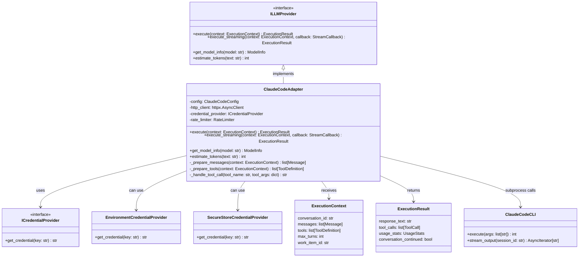

# ClaudeCodeAdapter

## Purpose

**ClaudeCodeAdapter** implements the `ILLMProvider` interface by executing the Claude Code CLI, providing LLM operations including single-turn prompting, multi-turn conversations, tool execution (via MCP), and streaming responses.

This adapter is used in production to execute agent logic via Claude Code. When the orchestrator needs an AI agent to analyze a work item, the adapter builds a CLI command, executes it as a subprocess, parses the JSON stream output, and returns the result to the orchestrator. The adapter handles multi-turn conversations via session IDs, MCP-based tool definitions, streaming output, and error recovery.

The adapter translates between:
- Codetoreum domain models ↔ CLI command-line arguments
- ExecutionContext (work item, code, history) ↔ Claude CLI args and environment
- JSON stream output ↔ ExecutionResult with parsed token counts and responses

## Implementation Strategy

### Claude Code CLI Integration

ClaudeCodeAdapter uses the **Claude Code CLI** (subprocess-based):
- Executes the `claude` command-line interface
- Streaming support via JSON event stream output (`stream-json` format)
- Session management for multi-turn conversations via `--session-id`
- MCP (Model Context Protocol) integration for tool availability
- Containerized execution with configurable working directory

### Key Design Decisions

**1. Credential Provider Pattern**
```python
class ICredentialProvider:
    """Interface for secure credential providers."""
    async def get_credential(self, key: str) -> str | None:
        ...

class EnvironmentCredentialProvider(ICredentialProvider):
    """Retrieves credentials from environment variables."""
    
class SecureStoreCredentialProvider(ICredentialProvider):
    """Retrieves credentials from secure key store."""
```

Credentials are provided via pluggable credential providers:
- **EnvironmentCredentialProvider**: Reads from environment variables (dev/test)
- **SecureStoreCredentialProvider**: Reads from system keychain (production)
- Allows swapping credential sources without changing adapter code

**2. Configuration Management**
```python
@dataclass
class ClaudeCodeConfig:
    # Authentication (secure references)
    api_key_credential_name: str = "ANTHROPIC_API_KEY"
    oauth_token_credential_name: str = "CLAUDE_CODE_OAUTH_TOKEN"
    credential_provider: ICredentialProvider | None = None
    
    # CLI configuration
    claude_cli_path: str = "claude"              # Path to Claude CLI executable
    default_model: str = "claude-sonnet-4-5-20250929"
    permission_mode: str = "bypassPermissions"   # or "askForPermissions"
    
    # Output configuration
    output_format: str = "stream-json"           # or "text"
    verbose: bool = False
    
    # Execution limits
    default_timeout_seconds: int = 300           # 5 minutes
    max_context_tokens: int = 200000
    
    # Features
    enable_mcp: bool = True
    enable_tools: bool = True
```

Configuration controls CLI path, authentication, model selection, and feature flags.

**3. Multi-turn Conversation Tracking**
```python
@dataclass
class ExecutionContext:
    """Context for LLM execution."""
    conversation_id: str                # Unique conversation identifier
    messages: list[Message]             # Conversation history
    tools: list[ToolDefinition]        # Available tools for this execution
    max_turns: int = 10                # Limit conversation length
    work_item_id: str | None = None    # Associated work item
    project_id: str | None = None      # Associated project
```

Conversations are tracked via `conversation_id`:
- Multiple turns supported (agent can ask follow-up questions)
- Message history preserved for context
- Tool definitions specify what agent can do

**4. Tool Execution**
```python
@dataclass
class ToolDefinition:
    """Definition of a tool available to the LLM."""
    name: str                           # Tool name (e.g., "create_issue")
    description: str                    # What this tool does
    parameters: dict                    # JSON schema for parameters
    
class Tool:
    """Actual tool execution handler."""
    async def execute(self, name: str, args: dict) -> str:
        """Execute a tool and return result."""
```

When Claude Code calls a tool:
1. Adapter receives tool call with name and arguments
2. Looks up tool handler in application layer
3. Executes tool and returns result to Claude Code
4. Claude Code continues conversation with tool result

**5. Streaming Support**
```python
async def execute_streaming(
    self,
    context: ExecutionContext,
    stream_callback: StreamCallback
) -> ExecutionResult:
    """Execute with streaming output."""
    async for chunk in self._stream_response():
        await stream_callback(chunk)  # Real-time updates
    return result
```

Streaming allows:
- Real-time feedback to user (no waiting for full response)
- Reduced latency perception
- Efficient handling of long responses

### Error Handling Philosophy

**Non-recoverable errors** (fail fast):
- Authentication failure (invalid API key)
- Invalid request format
- Permission errors

**Recoverable errors** (retry with backoff):
- Transient API errors (500, 503)
- Rate limit exceeded
- Timeout

**Degraded service** (fallback):
- Streaming unavailable → fall back to buffering
- Tool execution fails → return error message to Claude Code

## Configuration

### Required Parameters
```python
@dataclass
class ClaudeCodeConfig:
    # Authentication (secure references)
    api_key_credential_name: str = "ANTHROPIC_API_KEY"  # Required
    oauth_token_credential_name: str = "CLAUDE_CODE_OAUTH_TOKEN"  # Alternative
    credential_provider: ICredentialProvider | None = None
    
    # CLI configuration
    claude_cli_path: str = "claude"              # Path to CLI executable (required)
    default_model: str = "claude-sonnet-4-5-20250929"
    permission_mode: str = "bypassPermissions"
    
    # Features
    enable_mcp: bool = True
    enable_tools: bool = True
```

### Environment Variables
- `ANTHROPIC_API_KEY`: Anthropic API key (required if using API key auth)
- `CLAUDE_CODE_OAUTH_TOKEN`: Claude Code OAuth token (required if using OAuth)
- `CLAUDE`: Path to Claude CLI executable (default: "claude" in PATH)

### Credential Handling

Credentials are retrieved via pluggable credential provider:
```python
credential_provider = EnvironmentCredentialProvider()  # Dev
# OR
credential_provider = SecureStoreCredentialProvider()  # Production

api_key = await credential_provider.get_credential("ANTHROPIC_API_KEY")
oauth_token = await credential_provider.get_credential("CLAUDE_CODE_OAUTH_TOKEN")
```

The adapter requires either API key or OAuth token. In production, use secure store integration (e.g., AWS Secrets Manager, HashiCorp Vault).

### Model Selection

Available Claude models via CLI:
- **claude-sonnet-4-5-20250929**: Latest Sonnet model (default)
- **claude-sonnet-3-5-20241022**: Previous Sonnet version
- **claude-opus-4-20250514**: Most capable, slower, more expensive
- Other models as available in Claude Code CLI

Model can be overridden per execution via ExecutionContext.

## Error Handling

### Authentication & Authorization Errors
```
Claude CLI execution with invalid or missing credentials
    ↓
Exit code non-zero, stderr: "authentication" error
    ↓
raise AuthenticationError("Invalid API key or OAuth token")
```
**Recovery**: Verify credentials via credential provider. Update environment variables or secure store.

### CLI Not Found
```
Claude CLI executable not found at configured path
    ↓
FileNotFoundError during subprocess execution
    ↓
raise LLMProviderError("Claude CLI not found at: {path}")
```
**Recovery**: Install Claude CLI. Update `claude_cli_path` configuration.

### Validation Errors
```
Invalid input (prompt too long, empty prompt)
    ↓
raise ValidationError("Prompt cannot be empty")
    OR
raise PromptTooLongError("Prompt exceeds maximum length of 1MB")
```
**Recovery**: Validate prompt before execution. Reduce context size.

### Execution Timeout
```
Claude CLI process exceeds timeout (default 5 minutes)
    ↓
Process killed via SIGKILL
    ↓
raise ExternalServiceError("Execution timeout")
```
**Recovery**: Increase timeout in configuration. Reduce prompt complexity.

### Process Termination Errors
```
CLI process fails to terminate gracefully after SIGKILL
    ↓
Log warning (likely D-state/kernel I/O)
    ↓
Adapter continues (process cleanup may lag)
```
**Recovery**: Monitor system resources. Investigate kernel state.

### Stream Processing Errors
```
Invalid JSON in stream output or non-JSON lines
    ↓
Skip line and continue (logged at debug level)
    ↓
Progress output or stderr leakage expected from CLI
```
**Recovery**: None needed. Adapter handles mixed JSON/text output gracefully.

### Rate Limiting
```
Claude Code backend returns rate limit error in stderr
    ↓
Exit code non-zero, stderr: "rate limit"
    ↓
raise RateLimitError()
```
**Recovery**: Implement request queue with rate limiting. Retry after cooldown.

### Conversation Management
```
Conversation ID tracked locally, CLI manages session via --session-id
    ↓
Session ID persisted in execution metadata
    ↓
Subsequent calls with same conversation_id use --session-id
```
**Recovery**: Create new conversation (new UUID) if session lost.

## Testing

### Unit Tests
- **HTTP client mocking**: Fixture returns canned Claude Code API responses
- **Configuration validation**: Valid/invalid configs, required parameters
- **Credential provider mocking**: Test with mocked credential sources
- **Error mapping**: Claude Code API errors → port-standard exceptions
- **Tool definition handling**: Valid/invalid tool schemas
- **Token usage tracking**: Verify token counts extracted from responses
- **Conversation state**: Message history, turn tracking
- **Streaming support**: Verify stream callback invoked correctly

**Location**: `tests/unit/adapters/secondary/test_claude_code_adapter.py`

### Integration Tests
- **Real Claude Code API** (with test key): Execute actual prompts, verify responses
- **Authentication**: Valid key, invalid key, expired key
- **Different models**: Test with different available models
- **Streaming**: Verify streaming output received correctly
- **Tool execution**: Define and execute tools via Claude Code
- **Rate limiting**: Verify backoff behavior
- **Long conversations**: Multi-turn dialogue

**Location**: `tests/integration/adapters/secondary/test_claude_code_adapter_integration.py`

### Contract Tests
- Verify ClaudeCodeAdapter implements ILLMProvider fully
- Shared test suite runs against ClaudeCodeAdapter and MockLLMAdapter
- Method signatures, exception types, return values

**Location**: `tests/contracts/adapters/test_llm_provider_contract.py`

### Simulation Tests
- Wrapped in MockLLMAdapter for deterministic testing
- Scenarios: Prompting, conversations, tool execution, error recovery
- Verify AgentExecutor uses LLM adapter correctly

**Location**: `tests/simulation/scenarios/`

### Mocking Strategy
```python
# Test fixture
@pytest.fixture
def llm_adapter(mock_http_client):
    config = ClaudeCodeConfig(
        api_key="test-key",
        model="claude-3-5-sonnet-20241022",
        max_tokens=1024
    )
    adapter = ClaudeCodeAdapter(config)
    adapter._http_client = mock_http_client  # Inject mock
    return adapter
```

## Source

**File Path**: `src/codetoreum/adapters/secondary/claude_code_adapter.py`

**Class**: `class ClaudeCodeAdapter(ILLMProvider):`

**Related Files**:
- Port interface: `src/codetoreum/ports/output/llm_provider.py` (ILLMProvider)
- Configuration: `src/codetoreum/config/claude_config.py`
- Credential providers: `src/codetoreum/adapters/secondary/claude_code_adapter.py` (ICredentialProvider)
- Domain types: `src/codetoreum/domain/types.py`
- Bootstrap wiring: `src/codetoreum/infrastructure/simulation/bootstrap.py` (Simulation), `documentation/implementations/production-bootstrap.md` (Production)
- Tests: `tests/unit/adapters/secondary/test_claude_code_adapter.py`

## Diagram



## Production vs. Mock Comparison

| Aspect | Production (ClaudeCodeAdapter) | Mock (MockLLMAdapter) |
|---|---|---|
| **External System** | Claude Code CLI subprocess | In-memory responses |
| **Latency** | 1-30 seconds (depends on prompt/model) | <1ms |
| **Determinism** | No (depends on model output) | Yes (deterministic) |
| **Capabilities** | Full Claude Code CLI capabilities (MCP, tools, streaming) | Configurable mock responses |
| **Dependencies** | Claude Code CLI installed, API credentials, network | None |
| **Token Usage** | Real (parsed from JSON output stream) | Simulated/configurable |
| **Error Handling** | Real CLI/API errors + exit codes + resilience patterns | Configurable mock errors |
| **Use Case** | Production, staging | Testing, development, CI/CD |
| **Cost** | Per-token pricing (via Anthropic) | Free (simulated) |

## Cross-References

- **Port Interface**: [ILLMProvider](../ports/output/core-system.md#illmprovider) - Complete interface specification
- **Related Adapters**: [Systemic Analysis Adapter](./infrastructure-adapters.md#llmsystemicanalysisadapter-isystemicanalysisservice) - LLM-based analysis
- **Infrastructure**: [Resilience Patterns](../infrastructure/resilience.md) - Rate limiting, retry, circuit breaker
- **Simulation**: [MockLLMAdapter](../../implementations/simulation/adapters.md#output-port-adapters) - Test alternative
- **Domain Models**: [ExecutionResult](../domain/models.md) - Execution result structure
