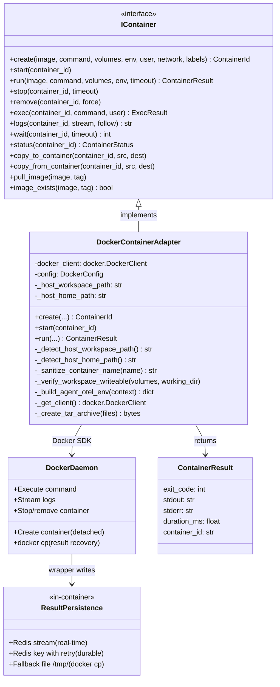

# DockerContainerAdapter

## Purpose

**DockerContainerAdapter** implements the `IContainer` interface by managing Docker containers, providing container lifecycle management, command execution, file mounting, environment variables, and resource constraints.

This adapter is used in production to execute AI agents in isolated, containerized environments. When the orchestrator needs to run an agent on a work item, it creates a container with mounted context files, runs the agent's commands, captures output, and cleans up resources. The adapter ensures isolation, resource limits, and secure execution boundaries for agent workloads.

The adapter handles:
- Container creation with custom images
- File mounting (context, code, artifacts)
- Command execution with output capture
- Resource constraints (memory, CPU)
- Container cleanup and resource management
- Host path translation when the orchestrator is itself containerized

---

## Implementation Strategy

### Docker SDK Integration

DockerContainerAdapter uses the **Docker SDK for Python** (`docker` library):
- Direct connection to Docker daemon via socket or network
- Full lifecycle management (create, start, execute, stop, remove)
- File I/O via tar archives (efficient bulk file transfer)
- Stream output for real-time log capture
- All Docker operations executed in a thread pool via `asyncio.run_in_executor()` to avoid blocking the event loop

### Key Design Decisions

**1. Client Lifecycle Management**
```python
def _get_client(self):
    """Get or create Docker client."""
    if self._docker_client is None:
        if self.config.docker_host:
            self._docker_client = docker.DockerClient(
                base_url=self.config.docker_host,
                tls=self.config.tls_verify,
            )
        else:
            self._docker_client = docker.from_env()
```

Docker client is lazily initialized on first use:
- Avoids unnecessary daemon connections during startup
- Single client reused for all containers
- Client lifecycle tied to adapter instance

**2. Non-Root Docker Access via Docker Group Membership**

The orchestrator runs as user `orchestrator` (UID 1000). Docker socket access is granted by adding this user to the `docker` group — not by running as root and not by granting container capabilities.

```dockerfile
# Dockerfile for orchestrator image
ARG DOCKER_GID=984           # Host docker group GID — override in docker-compose.yml

RUN if [ "${DOCKER_GID}" = "0" ]; then \
        # macOS: Docker group GID is 0 (root), use root group
        useradd -m -u 1000 -G root orchestrator; \
    else \
        # Linux: create docker group matching host GID, add orchestrator to it
        groupadd -g ${DOCKER_GID} docker || true && \
        useradd -m -u 1000 -G docker orchestrator; \
    fi
```

```yaml
# docker-compose.yml
services:
  orchestrator:
    build:
      args:
        DOCKER_GID: "${DOCKER_GID:-984}"     # From .env: run `getent group docker | cut -d: -f3`
    volumes:
      - /var/run/docker.sock:/var/run/docker.sock
```

```env
# .env
DOCKER_GID=984   # Linux: `getent group docker | cut -d: -f3`; macOS: 0
```

**Why this matters**: UID 1000 inside the container equals UID 1000 on the host (rootful Docker, no user namespace remapping). This means:
- Agent containers writing to mounted workspaces produce files the orchestrator can read without chown
- Claude Code's `bypassPermissions` works because UID 1000 is not root
- No `sudo`, no password prompts, no capabilities escalation

**3. Host Path Translation**

When the orchestrator runs inside a container (the standard deployment), volume mounts passed to Docker must use **host paths**, not container-internal paths. Without translation, `docker run -v /workspace/foo:/workspace` mounts the orchestrator container's `/workspace/foo` — Docker silently accepts it but the agent container sees the wrong filesystem.

```python
@staticmethod
def _detect_host_workspace_path() -> str:
    """
    Read /proc/self/mountinfo to find the host path that maps to /workspace.
    Required when orchestrator runs inside a container.
    """
    try:
        with open('/proc/self/mountinfo', 'r') as f:
            for line in f:
                parts = line.split()
                mount_point = parts[4]
                if mount_point == '/workspace':
                    host_path = parts[3]
                    logger.info(f"Auto-detected host workspace path: {host_path}")
                    return host_path
    except Exception as e:
        logger.warning(f"Failed to auto-detect host workspace from mountinfo: {e}")
    # Explicit override takes precedence as fallback
    fallback = os.environ.get('HOST_WORKSPACE_PATH', '/workspace')
    logger.warning(
        "Could not auto-detect host workspace path; using HOST_WORKSPACE_PATH=%s. "
        "If agent containers receive empty workspaces, set HOST_WORKSPACE_PATH explicitly in .env.",
        fallback,
    )
    return fallback

@staticmethod
def _detect_host_home_path() -> str:
    """
    HOST_HOME must be set explicitly in .env to the real host home directory.
    Required for SSH key mounts when Docker is installed via Snap (Snap changes
    $HOME to a versioned snap path, which breaks volume mounts for ~/.ssh).
    """
    host_home = os.environ.get('HOST_HOME')
    if host_home:
        return host_home
    logger.warning(
        "HOST_HOME is not set. SSH key and .gitconfig mounts in agent containers will "
        "use the container $HOME, which may fail if Docker is installed via Snap. "
        "Set HOST_HOME=/home/<username> in .env to fix this."
    )
    return os.environ.get('HOME', '/root')
```

**Snap Docker note**: On Linux systems where Docker is installed via Snap, `$HOME` resolves to a versioned snap path (e.g., `/home/user/snap/docker/2857`). SSH known_hosts and git config are absent at this path. The explicit `HOST_HOME` variable bypasses this by pointing to the real home directory. See `.env.example` for setup instructions.

**4. Container Name Sanitization**

Docker container names must match `[a-zA-Z0-9][a-zA-Z0-9_.-]*`. Execution IDs and work item IDs containing other characters must be sanitized before use:

```python
@staticmethod
def _sanitize_container_name(name: str) -> str:
    sanitized = re.sub(r'[^a-zA-Z0-9_.-]', '-', name)
    sanitized = re.sub(r'^[^a-zA-Z0-9]+', '', sanitized)
    sanitized = re.sub(r'-+', '-', sanitized)
    return sanitized
```

Container names follow the pattern `codetoreum-agent-{project}-{task_id}`.

**5. Pre-Launch Write Access Verification**

Before launching an agent container (which incurs LLM API cost), verify that the workspace volume mount is actually writable. A transient permission issue or misconfigured volume would otherwise fail silently after API tokens have been spent.

```python
async def _verify_workspace_writeable(self, volume_spec: dict, working_dir: str) -> None:
    """
    Run a throwaway container with identical volume config to verify write access.
    Retries 3x with 2s delay to handle transient daemon hiccups.
    """
    test_filename = f".codetoreum_write_test_{uuid.uuid4().hex}"
    test_cmd = ["sh", "-c", f"touch {working_dir}/{test_filename} && rm {working_dir}/{test_filename}"]
    for attempt in range(3):
        try:
            result = await self.run(
                image="alpine:latest",
                command=test_cmd,
                volumes=volume_spec,
                working_dir=working_dir,
                timeout=10,
                remove=True,
            )
            if result.exit_code == 0:
                return
        except Exception as e:
            if attempt == 2:
                raise ContainerError(
                    f"Workspace is not writable after 3 attempts — check volume mount permissions. "
                    f"Volume spec: {volume_spec}. Last error: {e}"
                )
            await asyncio.sleep(2)
    raise ContainerError(f"Workspace write check failed: {working_dir} is not writable in container")
```

This must be called from `ExecutionService.execute_with_container()` before `container.create()`.

**6. Detached Execution with Result Persistence**

Agent containers run detached (`-d` / `detach=True`) so the orchestrator can restart without killing running agents. A `docker-claude-wrapper` script inside the container persists results before exiting, enabling recovery after orchestrator restart.

**Three-tier persistence strategy** (implemented in the in-container wrapper):
1. **Redis stream** — real-time log forwarding to `orchestrator:claude_logs_stream`
2. **Redis key with retry** — final result at `agent_result:{project}:{execution_id}` with 2-hour TTL; 3 attempts with exponential backoff (1s, 2s, 4s)
3. **Fallback file** — `agent_result_{execution_id}.json` written to `/tmp/`, recoverable via `docker cp`

**Critical invariant**: if all three persistence methods fail, the wrapper exits non-zero even if the agent succeeded. This prevents silent data loss at the cost of a false failure (which is recoverable via retry; data loss is not).

**7. Container Isolation Model**
```python
# Security: containers run as non-root
default_user: str = "1000:1000"       # UID:GID — matches orchestrator user

# Resource isolation
memory_limit: str | None = None       # e.g., "512m"
cpu_limit: float | None = None        # e.g., 1.0 for 1 CPU

# Network isolation
default_network: str = "bridge"       # Isolated from host network
```

Containers have:
- ❌ No Docker socket access (agents cannot spawn sibling containers)
- ❌ No git credentials or SSH keys
- ❌ No GitHub API tokens
- ❌ No `CLAUDE_CODE_OAUTH_TOKEN` or `ANTHROPIC_API_KEY` (Claude Code is invoked by the orchestrator, not the agent container)
- ✅ Internet access (for package downloads, API calls)
- ✅ Mounted project files (read-only or read-write per policy)
- ✅ Environment variables (project-level only)
- ✅ MCP servers for artifacts and logging

**8. OTEL Propagation into Agent Containers**

Pass OpenTelemetry environment variables into every agent container so Claude Code emits per-agent traces, metrics, and logs directly to the collector:

```python
AGENT_OTEL_ENV_VARS = {
    "CLAUDE_CODE_ENABLE_TELEMETRY": "1",
    "OTEL_METRICS_EXPORTER": "otlp",
    "OTEL_LOGS_EXPORTER": "otlp",
    "OTEL_EXPORTER_OTLP_ENDPOINT": "http://otel-collector:4317",
    "OTEL_METRIC_EXPORT_INTERVAL": "10000",
    "OTEL_LOGS_EXPORT_INTERVAL": "5000",
}
# OTEL_RESOURCE_ATTRIBUTES built per-execution:
# "agent={agent_name},project={project_id},execution_id={execution_id},work_item_id={work_item_id}"
```

**9. File Transfer via Tar Archives**
```python
# Mount context files efficiently using tar
import tarfile
tar_data = io.BytesIO()
with tarfile.open(fileobj=tar_data, mode='w') as tar:
    tar.add(local_path, arcname=container_path)

container.put_archive(path='/context', data=tar_data.getvalue())
```

Bulk file operations use tar archives:
- More efficient than `put_file()` for multiple files
- Works with large file trees
- Proper handling of symlinks and permissions

**10. Output Capture**
```python
# Stream stdout/stderr in real-time
result = container.exec_run(
    cmd=command,
    stream=True,
    demux=True
)

for stdout_data in result.output:
    log_handler.write(stdout_data)
```

Output is streamed and captured simultaneously:
- Avoids buffering large outputs in memory
- Real-time log streaming to artifact store
- Proper demultiplexing of stdout vs. stderr

---

### Execution Model

**Container Lifecycle for Agent Execution**:
1. Translate host paths for all volume mounts (`_detect_host_workspace_path()`)
2. Verify workspace is writable (`_verify_workspace_writeable()`)
3. Sanitize container name (`_sanitize_container_name()`)
4. Create container from image (e.g., `codetoreum-agent:latest`) with OTEL env vars
5. Start container in detached mode
6. Mount context files (issue, code snippets, previous outputs) at `/context/`
7. Stream logs while agent executes (non-blocking, via Redis stream)
8. Wait for container exit (with hard timeout)
9. Retrieve result from Redis or fallback file
10. Stop and remove container (cleanup)

**Error Handling During Execution**:
```
Container execution fails (non-zero exit code)
    ↓
Retrieve captured output from Redis / fallback file
    ↓
Emit ExecutionFailedEvent with output for debugging
    ↓
Container is still cleaned up (no resource leaks)
```

---

## Configuration

### Required Parameters
```python
@dataclass
class DockerConfig:
    # Docker connection
    docker_host: str | None = None      # Defaults to local socket (/var/run/docker.sock)
    tls_verify: bool = False
    cert_path: str | None = None

    # Container defaults
    default_timeout: int = 300          # 5 minutes execution timeout
    remove_on_completion: bool = True   # Auto-cleanup containers
    default_user: str = "1000:1000"     # UID:GID — must match agent image user
    default_network: str = "bridge"     # Network mode

    # Resource limits
    memory_limit: str | None = None     # e.g., "512m", "1g"
    cpu_limit: float | None = None      # e.g., 1.0, 0.5

    # Logging
    log_driver: str = "json-file"
```

### Environment Variables

| Variable | Purpose | Example |
|---|---|---|
| `DOCKER_HOST` | Docker daemon address | `unix:///var/run/docker.sock` |
| `DOCKER_GID` | Host docker group GID for image build | `984` (Linux), `0` (macOS) |
| `HOST_WORKSPACE_PATH` | Real host path for /workspace mount | `/home/user/workspace` |
| `HOST_HOME` | Real host home (required for Snap Docker) | `/home/user` |
| `CONTAINER_DEFAULT_TIMEOUT` | Execution timeout in seconds | `300` |
| `CONTAINER_MEMORY_LIMIT` | Memory limit | `"512m"` |
| `CONTAINER_CPU_LIMIT` | CPU limit | `1.0` |

### `.env.example` additions required:
```env
# Docker non-root access
# Linux: run `getent group docker | cut -d: -f3`; macOS: use 0
DOCKER_GID=984

# Host paths (required when orchestrator runs in a container)
# Set to your actual home directory — critical if using Snap-installed Docker
HOST_HOME=/home/youruser
# Usually auto-detected from /proc/self/mountinfo; override if auto-detection fails
HOST_WORKSPACE_PATH=
```

### Container Image Requirements
Images must include:
- Python 3.11+ (or language runtime for agent)
- Required dependencies (pip packages, system libs)
- Claude Code CLI (`claude`) — if agent invokes it directly
- Non-root user `orchestrator` at UID 1000 (must match `default_user`)
- **No Docker socket mounted** (cannot spawn sibling containers)

```dockerfile
FROM python:3.11-slim

# Build arg for host docker group GID
ARG DOCKER_GID=984

# Create docker group matching host GID; create non-root user
RUN if [ "${DOCKER_GID}" = "0" ]; then \
        useradd -m -u 1000 -G root orchestrator; \
    else \
        groupadd -g ${DOCKER_GID} docker || true && \
        useradd -m -u 1000 -G docker orchestrator; \
    fi

WORKDIR /workspace

# Install dependencies before switching user (cache layer)
COPY requirements.txt .
RUN pip install -r requirements.txt

USER orchestrator

# SSH config at runtime via entrypoint (not baked in)
COPY docker-entrypoint.sh /docker-entrypoint.sh
ENTRYPOINT ["/docker-entrypoint.sh"]
CMD ["python", "/agent/run.py"]
```

### Runtime Entrypoint (SSH Config)

SSH config must be written at container start, not baked into the image, because `.ssh/` is a runtime volume mount. The entrypoint handles both writable and read-only `.ssh/` mounts gracefully:

```bash
#!/bin/sh
set -e

# Create SSH config only if .ssh/ is writable (may be read-only mount)
mkdir -p /home/orchestrator/.ssh 2>/dev/null || true
chmod 700 /home/orchestrator/.ssh 2>/dev/null || true

if [ ! -f /home/orchestrator/.ssh/config ]; then
    if touch /home/orchestrator/.ssh/.write_test 2>/dev/null; then
        rm -f /home/orchestrator/.ssh/.write_test
        cat > /home/orchestrator/.ssh/config <<EOF
Host github.com
  StrictHostKeyChecking accept-new
  UserKnownHostsFile /home/orchestrator/.ssh/known_hosts
  IdentityFile /home/orchestrator/.ssh/id_github
EOF
    fi
fi

# Authenticate GitHub CLI if token provided
if [ -n "$GITHUB_TOKEN" ]; then
    mkdir -p /home/orchestrator/.config
    echo "$GITHUB_TOKEN" | gh auth login --with-token >/dev/null 2>&1 || true
fi

exec "$@"
```

**Why runtime**: SSH config references the `id_github` key file whose path is only known at runtime. Baking it into the image would embed a path assumption that breaks when the volume mount changes.

---

## Error Handling

### Docker Daemon Connection Errors
```
Cannot connect to Docker daemon
    ↓
raise ContainerError("Failed to connect to Docker: {error}")
```
**Recovery**: Verify Docker daemon is running. Check `DOCKER_HOST` and `DOCKER_GID` settings.

### Image Not Found
```
Docker image doesn't exist locally or in registry
    ↓
Attempt to pull image from registry
    ↓
If pull fails: raise ImageNotFoundError("Image not found in registry")
```
**Recovery**: Build/push image to registry. Update container config.

### Container Creation Errors
```
Insufficient resources (memory, disk, CPU)
    ↓
raise ContainerError("Insufficient resources: {error}")
```
**Recovery**: Free resources on Docker host. Reduce memory/CPU limits.

### Workspace Not Writable (Pre-Launch Check)
```
Pre-launch write verification fails after 3 attempts
    ↓
raise ContainerError("Workspace is not writable — check volume mount permissions")
```
**Recovery**: Verify host path translation is correct. Check `HOST_WORKSPACE_PATH`. Confirm `AGENT_WORKSPACE_BASE` has correct ownership (UID 1000).

### Execution Timeout
```
Container execution exceeds timeout_seconds
    ↓
Kill container process
    ↓
raise ContainerTimeoutError(f"Execution timeout after {timeout_seconds}s")
```
**Recovery**: Increase timeout. Optimize agent code. Profile slow operations.

### Command Execution Failures
```
Container command exits with non-zero code
    ↓
Retrieve output from Redis / fallback file
    ↓
raise ContainerExecutionError(f"Command failed with exit code {exit_code}")
```
**Recovery**: Review container output logs. Fix agent code or dependencies.

### Host Path Translation Failures
```
/proc/self/mountinfo parse fails or HOST_WORKSPACE_PATH not set
    ↓
Warn and fall back to container-internal path
    ↓
Agent containers may receive empty/wrong workspace
```
**Recovery**: Set `HOST_WORKSPACE_PATH` explicitly in `.env`. Check Docker daemon version for mountinfo format changes.

### File Mount Errors
```
Cannot mount files into container
    ↓
Check path exists and permissions correct
    ↓
raise ContainerError("Failed to mount files: {error}")
```
**Recovery**: Verify file paths. Check file permissions. Ensure Docker has access.

### Result Persistence Failures
```
All three persistence tiers fail (Redis + fallback file)
    ↓
In-container wrapper exits non-zero (forces container failure)
    ↓
ExecutionService treats as failed execution
```
**Recovery**: Check Redis connectivity. Check `/tmp/` is writable in container. `docker cp` can retrieve the fallback file if Redis is unavailable.

### Snap Docker / Wrong Home Path
```
SSH key mount fails; git operations fail with "known_hosts" errors
    ↓
$HOME inside container resolves to snap versioned path
    ↓
.ssh/ at that path is missing known_hosts and id_github
```
**Recovery**: Set `HOST_HOME=/home/<actual_username>` in `.env`. Do not use `~` expansion in `.env`.

---

## Testing

### Unit Tests
- **Mock Docker client**: Fixture returns canned responses for container operations
- **Configuration validation**: Valid/invalid configs, required parameters
- **Host path translation**: Verify `_detect_host_workspace_path()` correctly parses mountinfo format
- **Container name sanitization**: Valid and invalid characters, leading non-alphanumeric, runs of dashes
- **Resource limits**: Memory, CPU constraints are set correctly
- **File operations**: Tar archive creation, mounting verification
- **Environment handling**: Valid/invalid environment variables, OTEL vars are present
- **Timeout handling**: Verify timeout triggers correctly

**Location**: `tests/unit/adapters/secondary/test_docker_container_adapter.py`

### Integration Tests
- **Real Docker daemon**: Create actual containers, execute commands, verify output
- **Host path translation**: Verify volume mounts reach the correct host directory
- **Pre-launch write check**: Verify throwaway container correctly catches bad mounts
- **Image pulling**: Pull image from registry, execute, cleanup
- **File mounting**: Mount files, verify inside container, execute code
- **Resource limits**: Verify memory/CPU limits enforced by Docker
- **Timeout behavior**: Long-running command, verify timeout triggers
- **Output streaming**: Large output, verify all captured
- **Container cleanup**: Verify containers removed after execution, no leaked containers after failure
- **OTEL env vars**: Verify OTEL variables are present in launched containers

**Location**: `tests/integration/adapters/secondary/test_docker_container_adapter_integration.py`

### Contract Tests
- Verify DockerContainerAdapter implements IContainer fully
- Shared test suite runs against DockerContainerAdapter and FakeContainerAdapter
- Method signatures, exception types, return values

**Location**: `tests/contracts/adapters/test_container_contract.py`

### Smoke Test (CLI)
A dedicated smoke test (`python -m codetoreum.cli.smoke_test_docker`) validates the full container lifecycle:
1. Launches a real container via `DockerContainerAdapter`
2. Executes `echo hello` and verifies stdout
3. Runs the pre-launch write check explicitly
4. Verifies container cleanup (no leaked containers)
5. Reports pass/fail with timing and step-by-step output
6. Exits non-zero on failure with the failed step identified

**Location**: `src/codetoreum/cli/smoke_test_docker.py`

### Simulation Tests
- Wrapped in FakeContainerAdapter for deterministic testing
- Scenarios: Simple execution, parallel containers, failure recovery
- Verify ExecutionService uses container adapter correctly

**Location**: `tests/simulation/scenarios/`

### Mocking Strategy
```python
@pytest.fixture
def container_adapter(mock_docker_client):
    config = DockerConfig(
        docker_host="unix:///var/run/docker.sock",
        default_timeout=10,
        memory_limit="512m"
    )
    adapter = DockerContainerAdapter(config)
    adapter._docker_client = mock_docker_client  # Inject mock
    return adapter
```

---

## Source

**File Path**: `src/codetoreum/adapters/secondary/docker_container_adapter.py`

**Class**: `class DockerContainerAdapter(IContainer):`

**Related Files**:
- Port interface: `src/codetoreum/ports/output/container.py` (IContainer)
- Configuration: `src/codetoreum/config/docker_config.py`
- Domain types: `src/codetoreum/domain/types.py` (ContainerId)
- Recovery adapter: `src/codetoreum/adapters/secondary/docker_container_recovery_adapter.py`
- Smoke test CLI: `src/codetoreum/cli/smoke_test_docker.py`
- Bootstrap wiring: `src/codetoreum/infrastructure/simulation/bootstrap.py` (Simulation), `documentation/implementations/production-bootstrap.md` (Production)
- Tests: `tests/unit/adapters/secondary/test_docker_container_adapter.py`

---

## Diagram



---

## Production vs. Mock Comparison

| Aspect | Production (DockerContainerAdapter) | Mock (FakeContainerAdapter) |
|---|---|---|
| **External System** | Real Docker daemon | In-memory simulation |
| **Latency** | 500ms-30s per execution | <10ms |
| **Determinism** | No (depends on container image) | Yes (fully deterministic) |
| **Resource Usage** | Real containers consume memory/CPU | No resource usage |
| **Dependencies** | Docker daemon, container images, Redis | None |
| **Isolation** | Process-level isolation via containers | No isolation (simulated) |
| **Error Handling** | Real Docker errors + resilience patterns | Configurable mock responses |
| **Host Path Translation** | Required (auto-detected + env override) | Not applicable |
| **Result Persistence** | 3-tier (Redis stream + key + file) | In-memory state |
| **Use Case** | Production, staging | Testing, development, CI/CD |

---

## Security Considerations

### Container Isolation
- Containers run in separate process namespaces
- Network isolated from host by default (bridge mode)
- Filesystem isolated (mounted volumes are explicit)
- Agents cannot spawn sibling containers (no Docker socket mounted)

### Credential Handling
- Git credentials NOT mounted into agent containers — orchestrator owns all git operations
- `CLAUDE_CODE_OAUTH_TOKEN` and `ANTHROPIC_API_KEY` MUST NOT be passed into agent containers
- GitHub API tokens provided only when explicitly required by the orchestrator
- SSH keys NOT accessible to agents
- Environment variables are project-level only (no secrets)

### Non-Root Execution
- Agent containers run as UID 1000 (`orchestrator` user)
- Orchestrator accesses Docker socket via group membership, not root
- UID 1:1 mapping between container and host (rootful Docker, no user namespace remapping)
- `bypassPermissions` in Claude Code works because UID 1000 is not root

### Resource Limits
- Memory limit prevents DoS via memory exhaustion
- CPU limit prevents runaway computation
- Hard timeout prevents infinite loops

### Docker Socket Access Policy
- Docker socket is **never mounted into agent containers**
- The orchestrator process has socket access via docker group membership
- Per the CLAUDE.md agent security model: agents cannot spawn their own containers

---

## Cross-References

- **Port Interface**: [IContainer](../ports/output/core-system.md#icontainer) — Complete interface specification
- **Related Adapters**: [Docker Container Recovery](./infrastructure-adapters.md#dockercontainerrecoveryadapter) — Failure recovery after orchestrator restart
- **Infrastructure**: [Resilience Patterns](../infrastructure/resilience.md) — Timeout, retry, circuit breaker wrappers
- **Simulation**: [FakeContainerAdapter](../../../implementations/simulation/adapters.md#output-port-adapters) — Deterministic test alternative
- **Security**: [Agent Execution Security Model](../../../CLAUDE.md#agent-security-model)
- **Bootstrap**: [ProductionApplicationBootstrap](../../../implementations/production-bootstrap.md) — How adapter is wired
