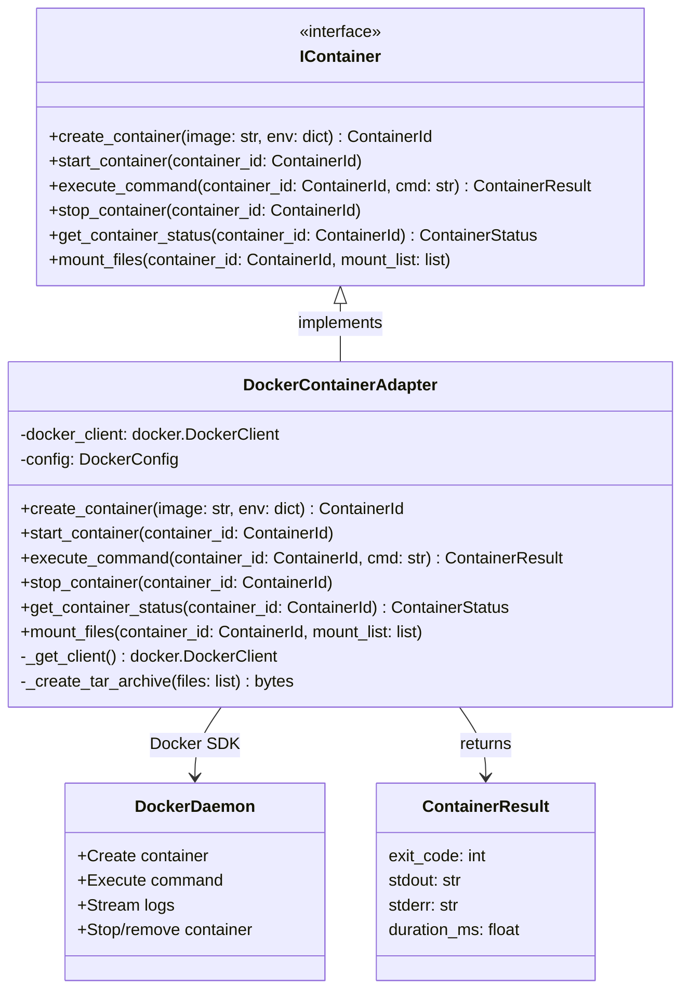

# DockerContainerAdapter

## Purpose

**DockerContainerAdapter** implements the `IContainer` interface by managing Docker containers, providing container lifecycle management, command execution, file mounting, environment variables, and resource constraints.

This adapter is used in production to execute AI agents in isolated, containerized environments. When the orchestrator needs to run an agent on a work item, it creates a new container with mounted context files, runs the agent's commands, captures output, and cleans up resources. The adapter ensures isolation, resource limits, and secure execution boundaries for agent workloads.

The adapter handles:
- Container creation with custom images
- File mounting (context, code, artifacts)
- Command execution with output capture
- Resource constraints (memory, CPU)
- Container cleanup and resource management

## Implementation Strategy

### Docker SDK Integration

DockerContainerAdapter uses the **Docker SDK for Python** (`docker` library):
- Direct connection to Docker daemon via socket or network
- Full lifecycle management (create, start, execute, stop, remove)
- File I/O via tar archives (efficient bulk file transfer)
- Stream output for real-time log capture

### Key Design Decisions

**1. Client Lifecycle Management**
```python
def _get_client(self):
    """Get or create Docker client."""
    if self._docker_client is None:
        if self.config.docker_host:
            self._docker_client = docker.DockerClient(
                base_url=self.config.docker_host,
                tls=self.config.tls_verify,
            )
        else:
            self._docker_client = docker.from_env()
```

Docker client is lazily initialized on first use:
- Avoids unnecessary daemon connections
- Single client reused for all containers
- Client lifecycle tied to adapter instance

**2. Container Isolation Model**
```python
# Security: containers run as non-root
default_user: str | None = None      # Use image default (usually root)

# Resource isolation
memory_limit: str | None = None      # e.g., "512m"
cpu_limit: float | None = None       # e.g., 1.0 for 1 CPU

# Network isolation
default_network: str = "bridge"      # Isolate from host network
```

Containers have:
- ❌ No git credentials or SSH keys (passed separately, mounted read-only)
- ❌ No GitHub API tokens (provided only when needed)
- ❌ No Docker socket access (can't spawn sibling containers)
- ✅ Internet access (for package downloads)
- ✅ Mounted project files (read-only or read-write per policy)
- ✅ Environment variables (project-level only)

**3. File Transfer via Tar Archives**
```python
# Mount files efficiently using tar
import tarfile
tar_data = io.BytesIO()
with tarfile.open(fileobj=tar_data, mode='w') as tar:
    tar.add(local_path, arcname=container_path)

container.put_archive(path='/context', data=tar_data.getvalue())
```

Bulk file operations use tar archives instead of individual file operations:
- More efficient than `put_file()` for multiple files
- Matches common Docker usage patterns
- Works with large file trees

**4. Output Capture**
```python
# Stream stdout/stderr in real-time
result = container.exec_run(
    cmd=command,
    stream=True,
    demux=True
)

for stdout_data in result.output:
    # Process streaming output
    log_handler.write(stdout_data)
```

Output is streamed and captured simultaneously:
- Avoids buffering large outputs in memory
- Real-time log streaming to artifact store
- Proper handling of stdout vs. stderr

### Execution Model

**Container Lifecycle for Agent Execution**:
1. Create container from image (e.g., `codetoreum-agent:latest`)
2. Mount context files (issue, code snippets, previous outputs)
3. Set environment variables (project config, agent config)
4. Execute agent command (e.g., `python /agent/run.py`)
5. Stream and capture output to artifact store
6. Get exit code and final status
7. Stop and remove container (cleanup)

**Error Handling During Execution**:
```
Container execution fails (non-zero exit code)
    ↓
Capture exit code and all output
    ↓
Emit ExecutionFailedEvent with output for debugging
    ↓
Container is still cleaned up (no resource leaks)
```

## Configuration

### Required Parameters
```python
@dataclass
class DockerConfig:
    # Docker connection
    docker_host: str | None = None      # Defaults to local socket (/var/run/docker.sock)
    tls_verify: bool = False            # Skip TLS verification (default)
    cert_path: str | None = None        # TLS certificate path (if tls_verify=True)

    # Container defaults
    default_timeout: int = 300          # 5 minutes execution timeout
    remove_on_completion: bool = True   # Auto-cleanup containers
    default_user: str | None = None     # Run as specific user (default: image default)
    default_network: str = "bridge"     # Network mode (bridge, host, none)

    # Resource limits
    memory_limit: str | None = None     # e.g., "512m", "1g"
    cpu_limit: float | None = None      # e.g., 1.0, 0.5

    # Logging
    log_driver: str = "json-file"       # JSON file logging
```

### Environment Variables
- `DOCKER_HOST`: Docker daemon address (default: `/var/run/docker.sock`)
- `DOCKER_TLS_VERIFY`: Enable TLS verification (default: false)
- `DOCKER_CERT_PATH`: Path to TLS certificates
- `CONTAINER_DEFAULT_TIMEOUT`: Execution timeout in seconds (default: 300)
- `CONTAINER_MEMORY_LIMIT`: Memory limit for containers (e.g., "512m")
- `CONTAINER_CPU_LIMIT`: CPU limit (e.g., 1.0)

### Container Image Requirements
Images must include:
- Python 3.11+ (or language runtime for agent)
- Required dependencies (pip packages, system libs)
- Agent execution script (e.g., `/agent/run.py`)
- Non-root user (recommended: `agent:agent`)

Example `Dockerfile`:
```dockerfile
FROM python:3.11-slim

# Create non-root user
RUN useradd -m -u 1000 agent

# Install dependencies
COPY requirements.txt .
RUN pip install -r requirements.txt

# Copy agent code
COPY agent/ /agent/
WORKDIR /agent

# Run as non-root
USER agent

# Default command
CMD ["python", "run.py"]
```

## Error Handling

### Docker Daemon Connection Errors
```
Cannot connect to Docker daemon
    ↓
raise ContainerError("Failed to connect to Docker: {error}")
```
**Recovery**: Verify Docker daemon is running. Check DOCKER_HOST setting.

### Image Not Found
```
Docker image doesn't exist locally or in registry
    ↓
Attempt to pull image from registry
    ↓
If pull fails: raise ImageNotFoundError("Image not found in registry")
```
**Recovery**: Build/push image to registry. Update container config.

### Container Creation Errors
```
Insufficient resources (memory, disk, CPU)
    ↓
raise ContainerError("Insufficient resources: {error}")
```
**Recovery**: Free resources on Docker host. Reduce memory/CPU limits.

### Execution Timeout
```
Container execution exceeds timeout_seconds
    ↓
Kill container process
    ↓
raise ContainerTimeoutError(f"Execution timeout after {timeout_seconds}s")
```
**Recovery**: Increase timeout. Optimize agent code. Profile slow operations.

### Command Execution Failures
```
Container command exits with non-zero code
    ↓
Capture full exit code and output
    ↓
raise ContainerExecutionError(f"Command failed with exit code {exit_code}")
```
**Recovery**: Review container output logs. Fix agent code or dependencies.

### File Mount Errors
```
Cannot mount files into container
    ↓
Check path exists and permissions correct
    ↓
raise ContainerError("Failed to mount files: {error}")
```
**Recovery**: Verify file paths. Check file permissions. Ensure Docker has access.

### Environment Variable Errors
```
Invalid environment variable value (non-string, contains newlines)
    ↓
raise ValidationError("Invalid environment variable: {name}")
```
**Recovery**: Validate environment before passing to container. Sanitize values.

### Container Not Running
```
Attempt to execute command in stopped/removed container
    ↓
raise ContainerNotRunningError("Container not running or removed")
```
**Recovery**: Create new container. Don't reuse removed containers.

### Output Capture Errors
```
Failure streaming output (connection drop, disk full)
    ↓
Capture partial output up to failure point
    ↓
Log warning with partial result
    ↓
Continue and complete container cleanup
```
**Recovery**: Graceful degradation. Return partial output. Don't lose exit code.

## Testing

### Unit Tests
- **Mock Docker client**: Fixture returns canned responses for container operations
- **Configuration validation**: Valid/invalid configs, required parameters
- **Resource limits**: Memory, CPU constraints are set correctly
- **File operations**: Tar archive creation, mounting verification
- **Environment handling**: Valid/invalid environment variables
- **Timeout handling**: Verify timeout triggers correctly

**Location**: `tests/unit/adapters/secondary/test_docker_container_adapter.py`

### Integration Tests
- **Real Docker daemon**: Create actual containers, execute commands, verify output
- **Image pulling**: Pull image from registry, execute, cleanup
- **File mounting**: Mount files, verify inside container, execute code
- **Resource limits**: Verify memory/CPU limits enforced by Docker
- **Timeout behavior**: Long-running command, verify timeout triggers
- **Output streaming**: Large output, verify all captured
- **Container cleanup**: Verify containers removed after execution

**Location**: `tests/integration/adapters/secondary/test_docker_container_adapter_integration.py`

### Contract Tests
- Verify DockerContainerAdapter implements IContainer fully
- Shared test suite runs against DockerContainerAdapter and FakeContainerAdapter
- Method signatures, exception types, return values

**Location**: `tests/contracts/adapters/test_container_contract.py`

### Simulation Tests
- Wrapped in FakeContainerAdapter for deterministic testing
- Scenarios: Simple execution, parallel containers, failure recovery
- Verify ExecutionService uses container adapter correctly

**Location**: `tests/simulation/scenarios/`

### Mocking Strategy
```python
# Test fixture
@pytest.fixture
def container_adapter(mock_docker_client):
    config = DockerConfig(
        docker_host="unix:///var/run/docker.sock",
        default_timeout=10,
        memory_limit="512m"
    )
    adapter = DockerContainerAdapter(config)
    adapter._docker_client = mock_docker_client  # Inject mock
    return adapter
```

## Source

**File Path**: `src/codetoreum/adapters/secondary/docker_container_adapter.py`

**Class**: `class DockerContainerAdapter(IContainer):`

**Related Files**:
- Port interface: `src/codetoreum/ports/output/container.py` (IContainer)
- Configuration: `src/codetoreum/config/docker_config.py`
- Domain types: `src/codetoreum/domain/types.py` (ContainerId)
- Recovery adapter: `src/codetoreum/adapters/secondary/docker_container_recovery_adapter.py` (failure recovery)
- Bootstrap wiring: `src/codetoreum/infrastructure/simulation/bootstrap.py` (Simulation), `documentation/implementations/production-bootstrap.md` (Production)
- Tests: `tests/unit/adapters/secondary/test_docker_container_adapter.py`

## Diagram



## Production vs. Mock Comparison

| Aspect | Production (DockerContainerAdapter) | Mock (FakeContainerAdapter) |
|---|---|---|
| **External System** | Real Docker daemon | In-memory simulation |
| **Latency** | 500ms-30s per execution | <10ms |
| **Determinism** | No (depends on container image) | Yes (fully deterministic) |
| **Resource Usage** | Real containers consume memory/CPU | No resource usage |
| **Dependencies** | Docker daemon running, container images | None |
| **Isolation** | Process-level isolation via containers | No isolation (simulated) |
| **Error Handling** | Real Docker errors + resilience patterns | Configurable mock responses |
| **Use Case** | Production, staging | Testing, development, CI/CD |

## Security Considerations

### Container Isolation
- Containers run in separate process namespaces
- Network isolated from host by default
- Filesystem isolated (mounted volumes are explicit)

### Credential Handling
- Git credentials NOT mounted into containers
- GitHub API tokens provided only when needed
- SSH keys NOT accessible to agents
- Environment variables are project-level only (no secrets)

### Resource Limits
- Memory limit prevents DoS via memory exhaustion
- CPU limit prevents runaway computation
- Timeout prevents infinite loops

## Cross-References

- **Port Interface**: [IContainer](../ports/output/core-system.md#icontainer) - Complete interface specification
- **Related Adapters**: [Docker Container Recovery](./infrastructure-adapters.md#dockercontainerrecoveryadapter-iagentcontainerrecoveryservice) - Failure recovery
- **Infrastructure**: [Resilience Patterns](../infrastructure/resilience.md) - Timeout, retry, circuit breaker
- **Simulation**: [FakeContainerAdapter](../../../implementations/simulation/adapters.md#output-port-adapters) - Test alternative
- **Security**: [Agent Execution Security Model](../../../CLAUDE.md#agent-security-model)
