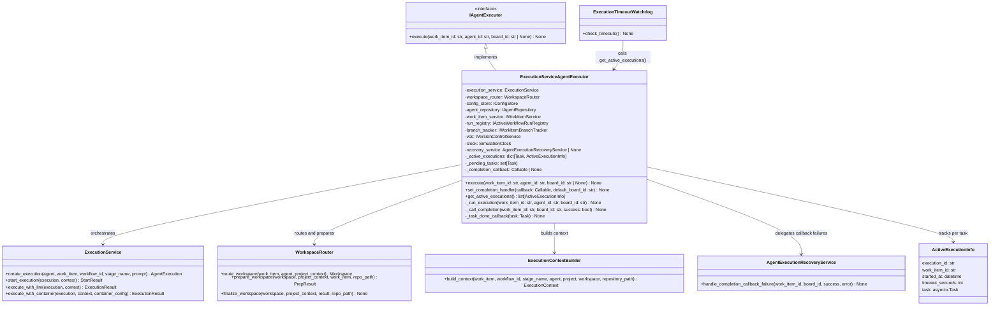

# ExecutionServiceAgentExecutor

## Purpose

**ExecutionServiceAgentExecutor** implements the `IAgentExecutor` interface by orchestrating the full LLM → Container → VCS execution chain. Rather than delegating to a mock or a single external service, it coordinates six port-level dependencies — `ExecutionService`, `WorkspaceRouter`, `IVersionControlService`, `IAgentRepository`, `IWorkItemService`, and `IActiveWorkflowRunRegistry` — to carry a work item through every stage of agent execution: repository cloning, workspace routing, context building, execution lifecycle management, and post-execution cleanup.

This adapter is used in both simulation and production environments as the sole concrete implementation of `IAgentExecutor`. It replaced `MockAgentExecutor` for end-to-end testing once the simulation framework required real execution semantics. All agent executions initiated by `BoardColumnEventHandler` pass through this adapter. The adapter exposes one non-port method, `set_completion_handler()`, to wire a completion callback after construction, avoiding circular constructor dependencies. It also exposes `get_active_executions()` for use by `ExecutionTimeoutWatchdog` to detect and cancel timed-out tasks.

## Implementation Strategy

### Fire-and-Forget Execution Model

`execute()` is non-blocking. It records execution metadata and schedules the full chain on a background `asyncio.Task`, then returns immediately so the caller (the board event handler) is not blocked.

```python
async def execute(self, work_item_id: str, agent_id: str, board_id: str | None = None) -> None:
    task = asyncio.create_task(self._run_execution(work_item_id, agent_id, resolved_board_id))
    self._pending_tasks.add(task)
    self._active_executions[task] = ActiveExecutionInfo(
        execution_id=execution_id,
        work_item_id=work_item_id,
        started_at=now,
        timeout_seconds=timeout_seconds,
        task=task,
    )
    task.add_done_callback(self._task_done_callback)
```

The `_task_done_callback` surfaces any unhandled exception from `_run_execution` via `logger.error()` so that failures in the background task are never silently lost. It also removes the task from both `_pending_tasks` and `_active_executions` to prevent memory leaks.

### Eleven-Step Execution Chain

`_run_execution()` drives the chain sequentially. Each step fails fast: on any error it calls the completion callback with `success=False` and returns before proceeding to later steps.

| Step | Operation | Failure Error ID |
|---|---|---|
| 1 | Lookup active run via `IActiveWorkflowRunRegistry` | `ERR_EXEC_CHAIN_NO_ACTIVE_RUN` |
| 2 | Load `Agent`, `WorkItem`, `ProjectConfig`; build `ProjectContext` | `ERR_EXEC_CHAIN_AGENT_LOAD_FAILURE`, `ERR_EXEC_CHAIN_WORK_ITEM_LOAD_FAILURE`, `ERR_EXEC_CHAIN_PROJECT_CONFIG_LOAD_FAILURE` |
| 3 | Clone repository via `IVersionControlService` | `ERR_EXEC_CHAIN_VCS_CLONE_FAILURE` |
| 4 | Route workspace via `WorkspaceRouter` | `ERR_EXEC_CHAIN_WORKSPACE_ROUTE_FAILURE` |
| 5 | Track branch via `IWorkItemBranchTracker` | `ERR_EXEC_CHAIN_BRANCH_TRACKER_FAILURE` |
| 6 | Prepare workspace (write context files) via `WorkspaceRouter` | `ERR_EXEC_CHAIN_WORKSPACE_PREPARE_FAILURE` |
| 7 | Build `ExecutionContext` via `ExecutionContextBuilder` | N/A (pure domain, no I/O) |
| 8 | Create execution record via `ExecutionService.create_execution()` | `ERR_EXEC_CHAIN_CREATE_EXECUTION_FAILURE` |
| 9 | Start execution via `ExecutionService.start_execution()` | `ERR_EXEC_CHAIN_EXECUTION_START_FAILURE` |
| 10 | Execute via `ExecutionService.execute(execution, workspace_context, options)` | `ERR_EXEC_CHAIN_EXECUTION_FAILURE` |
| 11 | Finalize workspace via `WorkspaceRouter.finalize_workspace()` | `ERR_EXEC_CHAIN_FINALIZE_FAILURE` |

Step 11 always runs (even after execution failure) to avoid a stuck workspace state.

### Invocation Dispatch (post-redesign)

Step 10 **no longer branches on `agent.requires_docker`**. Invocation mode comes from `AgentConfig.invocation.mode` and is delegated to the coding agent adapter. `ExecutionService` calls `ExecutionService.execute(execution, workspace_context, options)` once; the adapter chooses its strategy (containerized / host / API) based on `options.invocation_mode`:

```python
options = CodingAgentInvocationOptions(
    invocation_mode=agent_config.invocation.mode,   # containerized / host / api
    model=agent_config.invocation.model,
    timeout_seconds=agent_config.invocation.timeout_seconds,
    cost_limit_usd=agent_config.invocation.cost_limit_usd,
    mode_config=agent_config.invocation.mode_config,
)
exec_result = await self._execution_service.execute(execution, workspace_context, options)
```

The orchestrator validates `options.invocation_mode in coding_agent.supported_invocation_modes()` at config-load time, not at first execution. The `requires_docker` flag is gone. See `~/.claude/plans/coding-agent-port-redesign.md` §3a/§3h for the full redesign.

### `ProjectContext` Construction

`ProjectContext` is built from `ProjectConfig` at runtime because the domain service expects a fully hydrated value object. The adapter derives `repository_url` from `ProjectConfig.github_org` and `ProjectConfig.github_repo`, uses `"main"` as the default branch, and reads `tech_stacks`, `testing`, and `environment_variables` from the stored project configuration.

### Timeout Watchdog Support

The adapter loads the agent's `timeout_seconds` during `execute()` and stores it alongside the running `asyncio.Task` in the `_active_executions` dict:

```python
@dataclass
class ActiveExecutionInfo:
    execution_id: str
    work_item_id: str
    started_at: datetime
    timeout_seconds: int
    task: asyncio.Task
```

`ExecutionTimeoutWatchdog` calls `get_active_executions()` to snapshot this dict without accessing internal state. When a task exceeds its timeout, the watchdog calls `task.cancel()`, which triggers the `asyncio.CancelledError` handler in `_run_execution` and invokes the completion callback with `success=False`.

### Completion Callback and Recovery

`set_completion_handler()` wires a `Callable[[str, str, bool], Coroutine]` callback that is invoked by `_call_completion()` at the end of every execution path (success, failure, or cancellation). If the callback itself raises, the adapter delegates to `AgentExecutionRecoveryService.handle_completion_callback_failure()` to queue the work item for manual recovery and fail the workflow run. If recovery also fails, the exception is logged with `error_id=ERR_REPAIR_CYCLE_ERROR` and swallowed to prevent propagation through the fire-and-forget task.

### Registry and Branch Tracker Cleanup

The `finally` block in `_run_execution` always calls `run_registry.clear_run(work_item_id)` and `branch_tracker.clear(work_item_id)`, even on exception paths, to avoid leaving the work item in a stuck state. Failures in this cleanup are logged with `ERR_EXEC_CHAIN_CLEANUP_FAILURE` but do not re-raise.

## Configuration

### Constructor Parameters

```python
ExecutionServiceAgentExecutor(
    execution_service: ExecutionService,        # Core execution engine (LLM + Container dispatch)
    workspace_router: WorkspaceRouter,          # Repository branch setup, context file prep, finalize
    config_store: IConfigStore,                 # Project and agent configuration
    agent_repository: IAgentRepository,         # Load Agent domain objects by ID
    work_item_service: IWorkItemService,        # Load WorkItem domain objects by ID
    run_registry: IActiveWorkflowRunRegistry,   # Active workflow run lookup and clear
    branch_tracker: IWorkItemBranchTracker,     # VCS branch tracking per work item
    vcs: IVersionControlService,                # Repository clone operations
    clock: SimulationClock,                     # Consistent time source (simulation + production)
    recovery_service: AgentExecutionRecoveryService | None = None,  # Optional; handles callback failures
    execution_delay: float = 0.0,               # Optional delay before execution (testing only)
)
```

### Post-Construction Wiring

```python
executor.set_completion_handler(
    callback=board_event_handler.on_execution_completed,  # async (work_item_id, board_id, success) -> None
    default_board_id="board-1",
)
```

`set_completion_handler()` must be called before any `execute()` invocations. If no callback is set, completion is logged as an error and auto-progression does not occur.

### Simulation Bootstrap Wiring

In the simulation bootstrap, the adapter is constructed in Phase 3b after `ExecutionService` and `WorkspaceRouter` become available:

```python
execution_service_executor = ExecutionServiceAgentExecutor(
    execution_service=execution_service,
    workspace_router=workspace_router,
    config_store=self.adapters.config_store,
    agent_repository=self.adapters.agent_repository,
    work_item_service=self.adapters.work_item_service,
    run_registry=self.adapters.run_registry,
    branch_tracker=self.adapters.branch_tracker,
    vcs=self.adapters.version_control,
    clock=self._engine.get_clock_for_testing(),
    recovery_service=recovery_service,
)
self.adapters.agent_executor = execution_service_executor
```

The completion callback is wired later in Phase 4 after `BoardColumnEventHandler` is created.

## Error Handling

### No Active Run
```
run_registry.get_active_run() returns None
    ↓
Log error with ERR_EXEC_CHAIN_NO_ACTIVE_RUN
    ↓
Call completion callback with success=False
    ↓
Return (no further steps executed)
```
**Recovery**: The workflow run was not registered before triggering execution. Verify that `BoardColumnEventHandler` registers the run before calling `execute()`.

### Domain Object Load Failures
```
agent_repository, work_item_service, or config_store raises exception
    ↓
Log error with step-specific error ID (e.g., ERR_EXEC_CHAIN_AGENT_LOAD_FAILURE)
    ↓
Call completion callback with success=False
    ↓
Return
```
**Recovery**: Check that the IDs passed to `execute()` exist in the respective stores. Transient storage errors will surface here.

### VCS Clone Failure
```
IVersionControlService.clone_repository() raises exception
    ↓
Log error with ERR_EXEC_CHAIN_VCS_CLONE_FAILURE
    ↓
Call completion callback with success=False
    ↓
Return (workspace finalization does not run)
```
**Recovery**: Verify repository URL is reachable and VCS credentials are valid.

### Workspace Routing or Preparation Failure
```
WorkspaceRouter.route_workspace() or prepare_workspace() fails
    ↓
Log error with ERR_EXEC_CHAIN_WORKSPACE_ROUTE_FAILURE or ERR_EXEC_CHAIN_WORKSPACE_PREPARE_FAILURE
    ↓
Call completion callback with success=False
    ↓
Return (finalize_workspace does not run for route failure; runs for prepare failure)
```
**Recovery**: Workspace may be in a partial state. Investigate WorkspaceRouter configuration and file system permissions.

### Execution Failure (LLM or Container)
```
execute_with_llm() or execute_with_container() raises exception
    ↓
Log error with ERR_EXEC_CHAIN_EXECUTION_FAILURE
    ↓
exec_result = None
    ↓
exec_succeeded = False
    ↓
finalize_workspace() runs with success=False (step 11 always runs)
```
**Recovery**: Execution failures are non-fatal at the chain level. The workspace is finalized and the completion callback is invoked with `success=False`, triggering downstream failure handling.

### Completion Callback Failure
```
_completion_callback() raises exception
    ↓
Log error with ERR_EXEC_CHAIN_COMPLETION_CALLBACK_FAILURE
    ↓
AgentExecutionRecoveryService.handle_completion_callback_failure() invoked
    ↓
If recovery also fails: log with ERR_REPAIR_CYCLE_ERROR and swallow
```
**Recovery**: Work item may be stuck in its current column. Review `AgentExecutionRecoveryService` logs and the dead letter queue for queued recovery items.

### Task Cancellation (Watchdog Timeout)
```
ExecutionTimeoutWatchdog calls task.cancel()
    ↓
asyncio.CancelledError raised in _run_execution
    ↓
Log info: "execution cancelled for '{work_item_id}'"
    ↓
Call completion callback with success=False
    ↓
Re-raise CancelledError (task completes cancelled)
    ↓
Finally block clears registry and branch tracker
```
**Recovery**: The work item is moved to a failure state via the completion callback. The timeout threshold is read from `agent.timeout_seconds` at `execute()` time.

## Testing

### Unit Tests
- **Execution chain steps**: Mock each dependency individually; verify correct method calls and argument passing for each of the 11 steps
- **Step failure isolation**: For each step, simulate failure and verify the chain halts, completion callback is called with `success=False`, and later steps are not invoked
- **Invocation dispatch**: Verify the executor passes `AgentConfig.invocation.mode` into `CodingAgentInvocationOptions` and that `ExecutionService.execute()` receives the expected `WorkspaceContext` and options for each supported invocation mode
- **Completion callback**: Verify callback invoked with correct `(work_item_id, board_id, success)` args after both success and failure paths
- **Recovery service delegation**: Simulate callback failure; verify `AgentExecutionRecoveryService.handle_completion_callback_failure()` is called
- **Watchdog integration**: Verify `get_active_executions()` returns `ActiveExecutionInfo` with correct `timeout_seconds` from agent
- **Task done callback**: Simulate exception in `_run_execution`; verify `_task_done_callback` logs error and cleans up `_active_executions`
- **Cleanup in finally**: Verify `run_registry.clear_run()` and `branch_tracker.clear()` always called, even on exception paths

**Location**: `tests/unit/adapters/secondary/test_execution_service_agent_executor.py`

### Integration Tests
- **Full chain with real services**: Wire with `InMemoryEventStore`, `MockClaudeCodeAdapter` (the simulation double for `ICodingAgent`; replaces the prior `MockLLMAdapter`), `FakeContainerAdapter`, `MockBoardAdapter` and run a complete execution
- **Board progression**: Verify completion callback triggers column transition
- **Timeout watchdog integration**: Start an execution with a short timeout; verify watchdog cancels it and completion callback fires
- **Concurrent executions**: Launch multiple executions concurrently; verify `_active_executions` tracks all and cleans up correctly

**Location**: `tests/integration/adapters/secondary/test_execution_service_agent_executor_integration.py`

### Contract Tests
- Verify `ExecutionServiceAgentExecutor` implements `IAgentExecutor` fully
- Shared test suite runs against both `ExecutionServiceAgentExecutor` and `MockAgentExecutor`
- Method signatures, exception types, return values

**Location**: `tests/contracts/adapters/test_agent_executor_contract.py`

### Simulation Tests
- Assigned to `adapters.agent_executor` in bootstrap Phase 3b for all simulation scenarios
- Scenarios 01–13 and Board Automation A/B/C all exercise this adapter
- Full SDLC pipeline scenarios (06, 06b) verify the complete 11-step chain with mock VCS, workspace, and LLM

**Location**: `tests/simulation/scenarios/`

## Source

**File Path**: `src/codetoreum/adapters/secondary/execution_service_agent_executor.py`

**Class**: `class ExecutionServiceAgentExecutor(IAgentExecutor):`

**Related Files**:
- Port interface: `src/codetoreum/ports/output/agent_executor.py` (`IAgentExecutor`)
- Core execution engine: `src/codetoreum/application/execution_service.py` (`ExecutionService`)
- Workspace management: `src/codetoreum/application/workspace_router.py` (`WorkspaceRouter`)
- Context construction: `src/codetoreum/domain/services/execution_context_builder.py` (`ExecutionContextBuilder`)
- Recovery service: `src/codetoreum/application/agent_execution_recovery_service.py` (`AgentExecutionRecoveryService`)
- Run registry port: `src/codetoreum/ports/output/active_workflow_run_registry.py` (`IActiveWorkflowRunRegistry`)
- Branch tracker port: `src/codetoreum/ports/output/work_item_branch_tracker.py` (`IWorkItemBranchTracker`)
- VCS port: `src/codetoreum/ports/output/version_control_service.py` (`IVersionControlService`)
- Domain value objects: `src/codetoreum/domain/value_objects.py` (`ContainerConfig`)
- Project context: `src/codetoreum/domain/project_context.py` (`ProjectContext`)
- Error registry: `src/codetoreum/infrastructure/error_ids.py` (`ErrorRegistry`)
- Bootstrap wiring: `src/codetoreum/infrastructure/simulation/bootstrap.py` (Phase 3b)
- Tests: `tests/unit/adapters/secondary/test_execution_service_agent_executor.py`

## Diagram



## Production vs. Mock Comparison

| Aspect | Production (`ExecutionServiceAgentExecutor`) | Mock (`MockAgentExecutor`) |
|---|---|---|
| **External Systems** | Real LLM, container runtime, VCS | None |
| **Execution Chain** | Full 11-step chain (clone → workspace → LLM/Container → finalize) | Single mock callback invocation |
| **Latency** | Seconds to minutes (LLM/container round-trip) | Configurable; sub-millisecond by default |
| **Determinism** | No (depends on LLM output, container state) | Yes (deterministic mock responses) |
| **Timeout Support** | Via `ExecutionTimeoutWatchdog` + `agent.timeout_seconds` | Configurable mock delays |
| **Recovery** | `AgentExecutionRecoveryService` for callback failures | N/A |
| **Dependencies** | 9 injected dependencies | None or minimal |
| **Use Case** | Production, simulation end-to-end testing | Unit tests, lightweight simulation scenarios |
| **Error Handling** | Real errors from VCS/LLM/Container + structured error IDs | Configurable mock errors |

## Cross-References

- **Port Interface**: [IAgentExecutor](../../ports/output/domain-services.md) - Complete interface specification
- **Related Adapters**:
  - [ClaudeCodeAdapter](./claude-code-adapter.md) - LLM execution (called via `ExecutionService`)
  - [DockerContainerAdapter](./docker-container-adapter.md) - Container execution (called via `ExecutionService`)
  - [GitRepositoryAdapter](./git-repository-adapter.md) - VCS operations (clone)
- **Application Services**: [ExecutionService](../../application-services/services.md) - Core execution engine
- **Infrastructure**: [Resilience Patterns](../../infrastructure/resilience.md) - Timeout watchdog pattern
- **Simulation**: [MockAgentExecutor](../../../implementations/simulation/adapters.md) - Test alternative
- **Bootstrap**: [Simulation Bootstrap Wiring](../../../implementations/simulation/bootstrap-wiring.md) - Phase 3b construction
