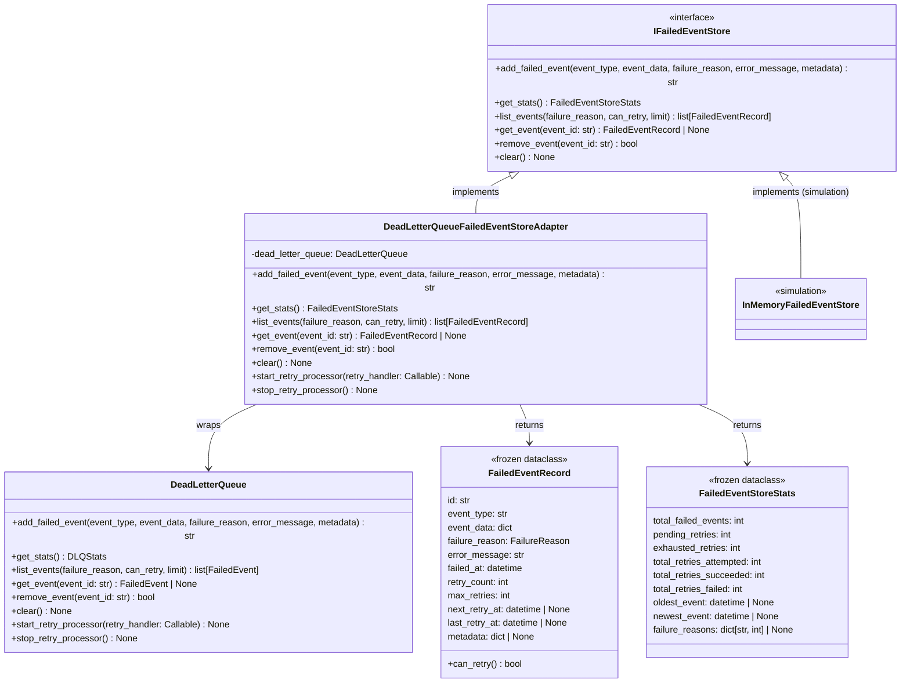

# DeadLetterQueueFailedEventStoreAdapter

## Purpose

**DeadLetterQueueFailedEventStoreAdapter** implements the `IFailedEventStore` interface by wrapping the `DeadLetterQueue` infrastructure class. Its sole responsibility is to translate between the port-level domain types (`FailureReason`, `FailedEventRecord`, `FailedEventStoreStats`) and the corresponding infrastructure types (`DLQFailureReason`, `FailedEvent`, `DLQStats`) maintained by `DeadLetterQueue`. No event storage logic lives in the adapter itself; all persistence, retry scheduling, and circuit breaker behavior belong to `DeadLetterQueue`.

This adapter is used in production wherever the application layer needs to record, query, or manage failed events without taking a direct dependency on `DeadLetterQueue`. By routing through the port boundary the application layer remains infrastructure-agnostic: a Redis-backed, database-backed, or in-memory implementation of `IFailedEventStore` can be substituted at bootstrap time. In simulation mode the adapter is replaced entirely by `InMemoryFailedEventStore`. The adapter additionally exposes two lifecycle methods — `start_retry_processor()` and `stop_retry_processor()` — that are not part of the `IFailedEventStore` contract but are required by the bootstrap to manage the `DeadLetterQueue` background retry loop.

## Implementation Strategy

### Thin Translation Layer

Every method on the adapter delegates directly to the corresponding method on `_dead_letter_queue` with only the minimum type conversion required to cross the port boundary:

```python
async def add_failed_event(
    self,
    event_type: str,
    event_data: dict[str, Any],
    failure_reason: FailureReason,
    error_message: str,
    metadata: dict[str, Any] | None = None,
) -> str:
    dlq_failure_reason = DLQFailureReason(failure_reason.value)
    return await self._dead_letter_queue.add_failed_event(
        event_type=event_type,
        event_data=event_data,
        failure_reason=dlq_failure_reason,
        error_message=error_message,
        metadata=metadata,
    )
```

Because both the port-level `FailureReason` and the infrastructure `FailureReason` use the same string values (`"transient_error"`, `"validation_error"`, etc.), conversion is a single `Enum(value)` call in each direction. No parsing, enrichment, or filtering logic exists in the adapter.

### `FailedEventRecord` Hydration

`list_events()` and `get_event()` convert infrastructure `FailedEvent` objects to port-level `FailedEventRecord` objects field-by-field:

```python
return FailedEventRecord(
    id=event.id,
    event_type=event.event_type,
    event_data=event.event_data,
    failure_reason=FailureReason(event.failure_reason.value),
    error_message=event.error_message,
    failed_at=event.failed_at,
    retry_count=event.retry_count,
    max_retries=event.max_retries,
    next_retry_at=event.next_retry_at,
    last_retry_at=event.last_retry_at,
    metadata=event.metadata,
)
```

`FailedEventRecord` is a frozen dataclass, enforcing immutability once it crosses the port boundary. This guarantees audit-trail integrity for any consumer that holds a reference to the record.

### `FailedEventStoreStats` Hydration

`get_stats()` wraps `DeadLetterQueue.get_stats()` with an identical field-by-field mapping into the port-level `FailedEventStoreStats` frozen dataclass. Neither the adapter nor the stats object performs any computation; the values are sourced entirely from `DeadLetterQueue`.

### Infrastructure Lifecycle Methods

`start_retry_processor()` and `stop_retry_processor()` are not declared on `IFailedEventStore`. They are additional methods on the concrete class, exposed for bootstrap use:

```python
async def start_retry_processor(self, retry_handler: Callable) -> None:
    await self._dead_letter_queue.start_retry_processor(retry_handler)

async def stop_retry_processor(self) -> None:
    await self._dead_letter_queue.stop_retry_processor()
```

The bootstrap calls these directly on the adapter instance (casting through the concrete type) rather than through the port interface. This keeps the port interface clean while allowing the bootstrap to manage the full infrastructure lifecycle.

### Constructor Guard

The constructor rejects a `None` `DeadLetterQueue` with a `ValueError` to fail fast at construction time rather than at first use:

```python
def __init__(self, dead_letter_queue: DeadLetterQueue) -> None:
    if dead_letter_queue is None:
        raise ValueError("dead_letter_queue cannot be None; the caller must instantiate DeadLetterQueue")
    self._dead_letter_queue = dead_letter_queue
```

## Configuration

### Constructor Parameters

```python
DeadLetterQueueFailedEventStoreAdapter(
    dead_letter_queue: DeadLetterQueue,  # Required; raises ValueError if None
)
```

The `DeadLetterQueue` instance is constructed by the bootstrap and injected. All retry policy, circuit breaker settings, and storage backend are configured on `DeadLetterQueue` directly; the adapter has no configuration surface of its own.

### Bootstrap Wiring (Production)

```python
dead_letter_queue = DeadLetterQueue(
    max_retries=5,
    retry_backoff_seconds=60,
)
failed_event_store = DeadLetterQueueFailedEventStoreAdapter(dead_letter_queue)

# Start the retry processor with the event bus dispatch function
await failed_event_store.start_retry_processor(
    retry_handler=event_bus.dispatch
)
```

### Simulation Bootstrap

Simulation does not use this adapter. The simulation bootstrap constructs `InMemoryFailedEventStore` directly instead:

```python
from codetoreum.adapters.testing.in_memory_failed_event_store import InMemoryFailedEventStore
failed_event_store = InMemoryFailedEventStore()
```

### Failure Reason Values

Both the port and infrastructure `FailureReason` enums share the same string values. Conversion is always safe as long as neither enum adds a value the other does not declare:

| Port `FailureReason` | Infrastructure `DLQFailureReason` |
|---|---|
| `TRANSIENT_ERROR` | `TRANSIENT_ERROR` |
| `VALIDATION_ERROR` | `VALIDATION_ERROR` |
| `PROCESSING_ERROR` | `PROCESSING_ERROR` |
| `TIMEOUT` | `TIMEOUT` |
| `CIRCUIT_BREAKER_OPEN` | `CIRCUIT_BREAKER_OPEN` |
| `RATE_LIMIT_EXCEEDED` | `RATE_LIMIT_EXCEEDED` |
| `UNKNOWN` | `UNKNOWN` |

## Error Handling

### Invalid `DeadLetterQueue` at Construction
```
None passed as dead_letter_queue
    ↓
raise ValueError("dead_letter_queue cannot be None; ...")
```
**Recovery**: The bootstrap must instantiate `DeadLetterQueue` before constructing this adapter.

### `add_failed_event()` Failure
```
DeadLetterQueue.add_failed_event() raises exception
    ↓
Exception propagates to caller (no wrapping)
```
**Recovery**: The adapter does not catch exceptions from the underlying `DeadLetterQueue`. Callers (typically the event bus or application services) are responsible for handling storage failures. The bootstrap's event bus wiring logs unhandled failures via `error_id` structured logging.

### `list_events()` / `get_event()` Failure
```
DeadLetterQueue raises on internal query
    ↓
Exception propagates to caller (no wrapping)
```
**Recovery**: Callers should treat these as read-only queries; failures indicate an internal `DeadLetterQueue` state error. No retry logic is applied at the adapter level.

### Retry Processor Errors
```
start_retry_processor() or stop_retry_processor() raises
    ↓
Exception propagates to bootstrap caller
```
**Recovery**: The bootstrap must handle lifecycle errors explicitly. A failed `start_retry_processor()` means failed events will not be automatically retried; the DLQ will continue to accept new events but the retry loop will not run.

### Enum Conversion Mismatch
```
FailureReason.value not present in DLQFailureReason
    ↓
ValueError from Enum(value) constructor
    ↓
Exception propagates to caller
```
**Recovery**: Add the missing value to the out-of-sync enum. This can only occur if one enum is extended without updating the other.

## Testing

### Unit Tests
- **`add_failed_event()`**: Verify `DLQFailureReason(failure_reason.value)` conversion and that `DeadLetterQueue.add_failed_event()` is called with correct args
- **`get_stats()`**: Verify field-by-field mapping from DLQ stats to `FailedEventStoreStats`
- **`list_events()`**: Verify filtering args forwarded, `FailedEventRecord` objects constructed with correct fields and `FailureReason` conversion
- **`get_event()`**: Verify `None` pass-through when DLQ returns `None`, and correct `FailedEventRecord` construction otherwise
- **`remove_event()` / `clear()`**: Verify delegation with no type conversion
- **Constructor guard**: Verify `ValueError` raised when `dead_letter_queue=None`
- **Lifecycle methods**: Verify `start_retry_processor()` and `stop_retry_processor()` delegate to `DeadLetterQueue`
- **Frozen records**: Verify returned `FailedEventRecord` and `FailedEventStoreStats` are frozen (attempt mutation, expect `FrozenInstanceError`)

**Location**: `tests/unit/adapters/secondary/test_failed_event_store_adapter.py`

### Integration Tests
- **Round-trip**: Add a failed event via adapter; retrieve via `list_events()` and `get_event()`; verify all fields survive the round-trip
- **Stats accuracy**: Add several events with different failure reasons; verify `get_stats()` returns correct counts
- **Retry processor lifecycle**: Start processor, advance simulation clock, verify retry callbacks are invoked
- **Remove and clear**: Add events, remove one by ID, verify count; clear all, verify empty

**Location**: `tests/integration/adapters/secondary/test_failed_event_store_adapter_integration.py`

### Contract Tests
- Verify `DeadLetterQueueFailedEventStoreAdapter` implements `IFailedEventStore` fully
- Shared test suite runs against both `DeadLetterQueueFailedEventStoreAdapter` and `InMemoryFailedEventStore`
- Method signatures, return types, exception types

**Location**: `tests/contracts/adapters/test_failed_event_store_contract.py`

### Simulation Tests
- Not directly exercised — simulation uses `InMemoryFailedEventStore` instead
- The `IFailedEventStore` port is exercised via `InMemoryFailedEventStore` in scenarios that test event failure handling (e.g., board automation error recovery)
- Contract tests ensure both implementations behave identically

**Location**: `tests/simulation/scenarios/`

## Source

**File Path**: `src/codetoreum/adapters/secondary/failed_event_store_adapter.py`

**Class**: `class DeadLetterQueueFailedEventStoreAdapter(IFailedEventStore):`

**Related Files**:
- Port interface: `src/codetoreum/ports/output/failed_event_store.py` (`IFailedEventStore`, `FailedEventRecord`, `FailedEventStoreStats`, `FailureReason`)
- Infrastructure implementation: `src/codetoreum/infrastructure/dead_letter_queue.py` (`DeadLetterQueue`, `FailedEvent`, `FailureReason as DLQFailureReason`)
- Simulation alternative: `src/codetoreum/adapters/testing/in_memory_failed_event_store.py` (`InMemoryFailedEventStore`)
- Bootstrap wiring: `src/codetoreum/infrastructure/simulation/bootstrap.py` (simulation uses `InMemoryFailedEventStore`; production bootstrap documented in `documentation/implementations/production-bootstrap.md`)
- Tests: `tests/unit/adapters/secondary/test_failed_event_store_adapter.py`

## Diagram



## Production vs. Mock Comparison

| Aspect | Production (`DeadLetterQueueFailedEventStoreAdapter`) | Mock (`InMemoryFailedEventStore`) |
|---|---|---|
| **Backend** | `DeadLetterQueue` (in-process, circuit breaker, retry scheduler) | Plain in-memory dict |
| **Retry Processor** | Background asyncio task via `start_retry_processor()` | Not applicable / no-op |
| **Circuit Breaker** | `DeadLetterQueue` applies circuit breaker on retry failures | N/A |
| **Persistence** | In-process (production deploy may add Redis persistence) | In-process only |
| **Latency** | Negligible (in-process delegation) | Negligible |
| **Determinism** | Yes (no external I/O in the adapter layer) | Yes |
| **Lifecycle Methods** | `start_retry_processor()` / `stop_retry_processor()` required by bootstrap | Not exposed |
| **Use Case** | Production, staging | Simulation, unit tests |

## Cross-References

- **Port Interface**: [IFailedEventStore](../../ports/output/infrastructure-services.md) - Complete interface specification
- **Infrastructure**: [DeadLetterQueue](../../infrastructure/event-bus.md) - Retry logic, circuit breaker, storage model
- **Simulation**: [InMemoryFailedEventStore](../../../implementations/simulation/adapters.md) - Test alternative
- **Related Adapters**: [Infrastructure Adapters](./infrastructure-adapters.md) - Other infrastructure-layer adapters
- **Bootstrap**: [Production Bootstrap](../../../implementations/production-bootstrap.md) - Lifecycle wiring (`start_retry_processor`)
