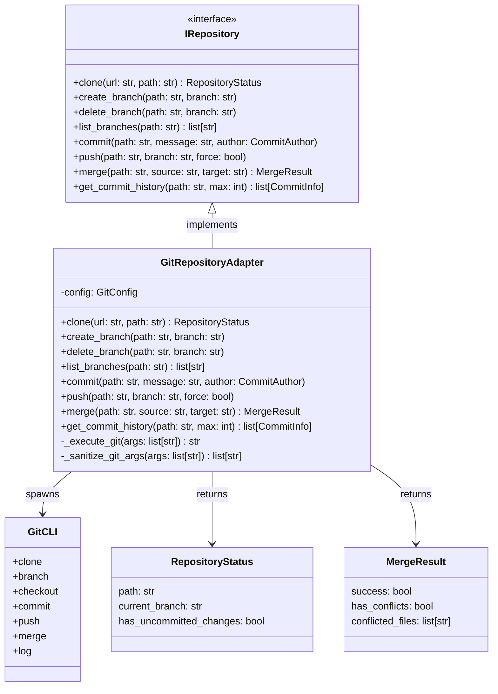

# GitRepositoryAdapter

## Purpose

**GitRepositoryAdapter** implements the `IRepository` interface by providing Git repository operations including cloning, branching, committing, merging, and pushing.

This adapter is used in production to manage version control operations. When agents need to make code changes, the orchestrator uses this adapter to clone the repository, create branches, commit changes, and push to GitHub. The adapter handles git command execution, credential management, and error handling.

## Implementation Strategy

### Git CLI Integration

GitRepositoryAdapter uses the **Git CLI** (`git` command-line tool):
- Spawns `git` process for all operations
- Handles credential passing via credential helpers or SSH
- Captures output and exit codes
- Implements proper error handling and cleanup

### Key Design Decisions

**1. Command Sanitization**
```python
def _sanitize_git_args(self, args: list[str]) -> list[str]:
    """Prevent command injection in git arguments."""
    # Validate arguments don't contain shell metacharacters
    # Prevent execution of arbitrary commands
```

All git commands are sanitized to prevent injection attacks.

**2. Credential Handling**
```python
# SSH-based authentication (recommended)
ssh_key_path: str | None = None     # Path to SSH private key

# Credential helper (system keychain/credential store)
credential_helper: str | None = None

# NO embedded passwords or tokens in code
```

Credentials are provided via:
- SSH keys (managed by SSH agent or config)
- Git credential helpers (system keychain)
- Environment variables (temporary, for CI/CD)

**3. Branch Operations**
```python
# Create and switch to new branch
await adapter.create_branch(repo_path, "feature/new-feature")

# List available branches
branches = await adapter.list_branches(repo_path)

# Delete branch (local or remote)
await adapter.delete_branch(repo_path, "feature/old-feature")
```

**4. Commit Management**
```python
# Create commit with author info
await adapter.commit(
    repo_path=repo_path,
    message="Fix bug in module X",
    author_name="Agent Bot",
    author_email="agent@codetoreum.local"
)

# Query commit history
commits = await adapter.get_commit_history(repo_path, max_commits=10)
```

**5. Merge Operations**
```python
# Merge with conflict detection
result = await adapter.merge(
    repo_path=repo_path,
    source_branch="feature/changes",
    target_branch="main"
)

if result.has_conflicts:
    # Return conflict list to application layer
    raise MergeConflictError(f"Conflicts in: {result.conflicted_files}")
```

## Configuration

### Required Parameters
```python
@dataclass
class GitConfig:
    # Git executable
    git_path: str = "git"               # Path to git binary
    
    # Default author (used if not specified per operation)
    default_author_name: str | None = None
    default_author_email: str | None = None
    
    # Authentication
    ssh_key_path: str | None = None     # Path to SSH private key
    credential_helper: str | None = None
    
    # Behavior
    default_branch: str = "main"        # Default branch name
    auto_create_remote_branch: bool = True  # Auto-create remote branches on push
    
    # Timeouts
    timeout_seconds: int = 300          # 5 minute default
```

### Environment Variables
- `GIT_SSH_KEY_PATH`: Path to SSH private key
- `GIT_CREDENTIAL_HELPER`: Git credential helper name
- `GIT_DEFAULT_BRANCH`: Default branch (default: main)
- `GIT_AUTHOR_NAME`: Default commit author name
- `GIT_AUTHOR_EMAIL`: Default commit author email

### Credential Setup

**SSH Authentication (Recommended for Production)**:
```bash
# Configure SSH key
export GIT_SSH_KEY_PATH="/home/agent/.ssh/github_key"
export GIT_SSH_COMMAND="ssh -i $GIT_SSH_KEY_PATH"

# Ensure SSH key permissions are correct
chmod 600 ~/.ssh/github_key
chmod 700 ~/.ssh
```

**Git Credential Helper**:
```bash
git config --global credential.helper osxkeychain    # macOS
git config --global credential.helper manager-core    # Windows
git config --global credential.helper cache          # Linux
```

**Environment Variables (CI/CD)**:
```bash
export GIT_AUTHOR_NAME="Codetoreum Agent"
export GIT_AUTHOR_EMAIL="agent@codetoreum.local"
```

## Error Handling

### Authentication Errors
```
SSH key not found or not accessible
    ↓
raise AuthenticationError("SSH key not found at path")
```
**Recovery**: Verify SSH key path and permissions. Ensure key is loaded in SSH agent.

### Repository Not Found
```
git clone fails (repository doesn't exist or not accessible)
    ↓
raise RepositoryError("Repository not found or not accessible")
```
**Recovery**: Verify repository URL. Check authentication.

### Merge Conflicts
```
git merge detects conflicts
    ↓
Parse conflicted files from git output
    ↓
raise MergeConflictError("Conflicts in files: {file_list}")
```
**Recovery**: Application layer decides how to resolve. May require manual intervention.

### Invalid References
```
git branch fails (branch doesn't exist)
    ↓
raise ResourceNotFoundError(f"Branch '{branch}' not found")
```
**Recovery**: Verify branch name. Create branch first if needed.

### Command Injection Attempts
```
Argument contains shell metacharacters or dangerous patterns
    ↓
raise ValidationError("Invalid argument: contains shell metacharacters")
```
**Recovery**: None - reject and fail fast. This is a security issue.

### Timeout
```
git command exceeds timeout_seconds
    ↓
Kill git process
    ↓
raise RepositoryError("Git command timeout after {timeout}s")
```
**Recovery**: Increase timeout. Check for hung git processes. Investigate network issues.

### Uncommitted Changes
```
Cannot perform operation (e.g., checkout) with uncommitted changes
    ↓
raise RepositoryError("Uncommitted changes in working directory")
```
**Recovery**: Stash, commit, or reset changes first.

## Testing

### Unit Tests
- **Command execution mocking**: Mock subprocess calls
- **Argument sanitization**: Verify injection prevention
- **Output parsing**: Extract branch lists, commit info from git output
- **Error mapping**: Git errors → port exceptions
- **Credential handling**: Verify no credentials in logs

**Location**: `tests/unit/adapters/secondary/test_git_repository_adapter.py`

### Integration Tests
- **Real Git repo**: Clone, branch, commit, push to test repository
- **SSH authentication**: Real SSH key authentication
- **Merge conflicts**: Trigger merge conflicts, verify detection
- **Timeout behavior**: Long-running operations, verify timeout
- **Cleanup**: Verify temporary directories cleaned up
- **Concurrent operations**: Parallel git operations on same repo

**Location**: `tests/integration/adapters/secondary/test_git_repository_adapter_integration.py`

### Contract Tests
- Verify GitRepositoryAdapter implements IRepository
- Shared test suite against InMemoryRepositoryAdapter

**Location**: `tests/contracts/adapters/test_repository_contract.py`

### Simulation Tests
- Wrapped in InMemoryRepositoryAdapter
- Scenarios: Clone, branch, commit, push, merge
- Verify WorkspaceRouter uses repository adapter correctly

**Location**: `tests/simulation/scenarios/`

### Mocking Strategy
```python
# Test fixture
@pytest.fixture
def git_adapter(mock_subprocess):
    config = GitConfig(
        git_path="/usr/bin/git",
        default_author_name="Test Agent",
        default_author_email="test@local"
    )
    adapter = GitRepositoryAdapter(config)
    adapter._subprocess = mock_subprocess  # Inject mock
    return adapter
```

### Security Testing
- Verify no credentials in captured output or logs
- Test argument sanitization against injection patterns
- Verify SSH key permissions validation
- Test for command injection via branch names, commit messages

## Source

**File Path**: `src/codetoreum/adapters/secondary/git_repository_adapter.py`

**Class**: `class GitRepositoryAdapter(IRepository):`

**Related Files**:
- Port interface: `src/codetoreum/ports/output/repository.py` (IRepository)
- Domain types: `src/codetoreum/domain/types.py` (BranchName, CommitHash)
- Bootstrap wiring: `src/codetoreum/infrastructure/simulation/bootstrap.py` (Simulation), `documentation/implementations/production-bootstrap.md` (Production)
- Tests: `tests/unit/adapters/secondary/test_git_repository_adapter.py`

## Diagram



## Production vs. Mock Comparison

| Aspect | Production (GitRepositoryAdapter) | Mock (InMemoryRepositoryAdapter) |
|---|---|---|
| **External System** | Real Git CLI | In-memory simulation |
| **Latency** | 100-5000ms per operation | <1ms |
| **Determinism** | No (real git state) | Yes (deterministic) |
| **Dependencies** | Git CLI installed, SSH credentials | None |
| **File Operations** | Real filesystem | In-memory state |
| **Use Case** | Production, staging | Testing, development |

## Security Considerations

### Credential Protection
- ❌ No passwords or tokens in code or logs
- ❌ No credentials in git config
- ✅ SSH keys stored on disk with restricted permissions
- ✅ Credentials passed via environment or credential helpers
- ✅ All arguments sanitized against injection

### Command Injection Prevention
- All git arguments validated before execution
- Shell metacharacters rejected
- Suspicious patterns detected (e.g., command separators)
- Arguments passed as list (not shell string)

### File Security
- Temporary directories cleaned up after use
- Permissions validated (SSH key 600, .ssh 700)
- No world-readable secrets in working directories

## Cross-References

- **Port Interface**: [IRepository](../ports/output/core-system.md#irepository) - Complete specification
- **Related Adapters**: [GitHub Board Adapter](./github-board-adapter.md) - Repository links
- **Infrastructure**: [Resilience Patterns](../infrastructure/resilience.md) - Retry, timeout
- **Simulation**: [InMemoryRepositoryAdapter](../../implementations/simulation/adapters.md)
- **Security**: [Credential Management](../../../CLAUDE.md#agent-security-model)
