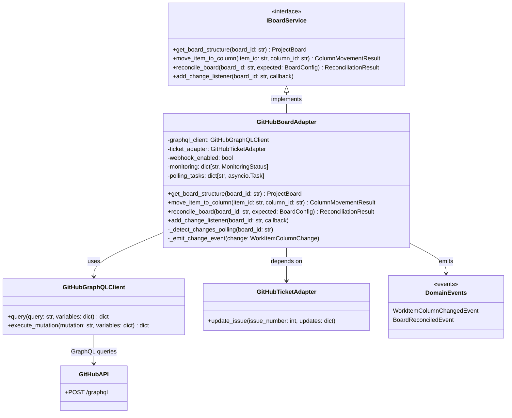

# GitHubBoardAdapter

## Purpose

**GitHubBoardAdapter** implements the `IBoardService` interface by connecting to GitHub Projects v2, providing board structure queries, work item movement between columns, board reconciliation, and change detection via webhooks or polling.

This adapter is used in production to synchronize Codetoreum's workflow state with GitHub Projects v2. When work items transition between workflow stages, the adapter moves corresponding GitHub issues between project columns, maintaining visual consistency in GitHub's native project management interface.

The adapter supports both:
- **Webhook-based detection** (real-time): Responds immediately to GitHub webhook events
- **Polling fallback** (eventual consistency): Periodically checks board state when webhooks are unavailable

## Implementation Strategy

### GitHub Projects v2 Integration

GitHubBoardAdapter uses the **GitHub GraphQL API** to interact with GitHub Projects v2 because:
- GraphQL provides atomic operations for complex board operations
- Projects v2 is primarily exposed via GraphQL (limited REST API support)
- Enables efficient queries for nested structures (projects → columns → items)

### Key Design Decisions

**1. Ticket Adapter Dependency**
```python
class GitHubBoardAdapter(IBoardService):
    def __init__(
        self,
        ticket_adapter: GitHubTicketAdapter,
        graphql_client: GitHubGraphQLClient,
        webhook_enabled: bool = True,
    ):
```

The adapter depends on `GitHubTicketAdapter` to map work items to GitHub issues, enabling bidirectional consistency:
- Create board items → Create GitHub issues (via ticket adapter)
- Move board items → Update issue assignments/labels (via ticket adapter)

**2. Change Detection Strategy**
- **Webhook mode**: Consumes `projects_v2_item_moved` webhooks (real-time)
- **Polling fallback**: Queries board state periodically if webhooks fail or are disabled
- **Monitoring state**: Tracks active monitoring per board with status (healthy, degraded, failed)

**3. Monitoring and State Tracking**
```python
_monitoring: dict[str, MonitoringStatus]  # Board ID → status
_polling_tasks: dict[str, asyncio.Task]   # Board ID → polling task
_event_handlers: dict[str, list[Callable]]  # Event subscription registry
```

### Data Translation

WorkItemPosition domain model → GitHub Projects v2:
- `column_id` → GitHub Projects v2 field value (option ID)
- `work_item_id` → GitHub issue number
- `sequence_number` → Card position in column (via GraphQL mutation)

### API Operations

| Domain Operation | GraphQL Query/Mutation |
|---|---|
| `get_board_structure()` | Query projects + fields + field_options + items |
| `move_item_to_column()` | Mutation updateProjectV2ItemFieldValue |
| `reconcile_board()` | Query all items vs. expected config, emit events for discrepancies |
| `add_change_listener()` | Register callback for webhook/polling events |

### Event Emission

The adapter emits domain events when state changes:
- `WorkItemColumnChangedEvent`: Item moved between columns
- `BoardReconciledEvent`: Board reconciliation completed with conflict detection

## Configuration

### Required Parameters
```python
@dataclass
class GitHubBoardConfig:
    # GitHub API credentials
    token: str                          # GitHub Personal Access Token or App token
    organization: str                   # GitHub organization name
    repository: str                     # Repository name

    # Projects v2 configuration
    project_number: int                 # GitHub Projects v2 project number

    # Polling fallback (if webhooks disabled)
    polling_interval_seconds: int = 300  # 5 minutes default
    webhook_enabled: bool = True          # Disable if webhooks unavailable

    # API defaults
    api_base_url: str = "https://api.github.com"
    graphql_url: str = "https://api.github.com/graphql"
    timeout_seconds: int = 30
```

### Environment Variables
- `GITHUB_TOKEN`: GitHub API authentication token (required)
- `GITHUB_ORG`: GitHub organization (required)
- `GITHUB_REPO`: Repository name (required)
- `GITHUB_PROJECT_NUMBER`: Projects v2 project number (required)
- `BOARD_POLLING_ENABLED`: Set to "false" to disable polling fallback
- `BOARD_POLLING_INTERVAL_SECONDS`: Override polling interval

### Credential Handling

Authentication uses **GitHub Personal Access Token** or **GitHub App token**:
- Tokens are provided via environment variables or secure config store
- Each API request includes token in Authorization header: `Authorization: Bearer {token}`
- Rate limits are GitHub's standard: 5,000 requests/hour (or 15,000 for GitHub Apps)

## Error Handling

### Authentication & Authorization Errors
```
GitHub 401 Unauthorized
    ↓
raise AuthenticationError("GitHub token invalid or expired")
```
**Recovery**: Token must be refreshed in secure store. No automatic retry.

```
GitHub 403 Forbidden
    ↓
raise AuthorizationError("Token lacks required permissions for Projects v2")
```
**Recovery**: Token must be granted `project:write` scope. No automatic retry.

### Resource Not Found Errors
```
GitHub 404 Not Found (project, column, item)
    ↓
raise ResourceNotFoundError("Project {project_number} not found")
```
**Recovery**: Verify project exists in GitHub. Retry if transient. Emit reconciliation event.

### Transient Errors
```
GitHub API timeout or 500/503 error
    ↓
Automatic retry (exponential backoff: 1s, 2s, 4s)
    ↓
After 3 retries: raise ExternalServiceError("GitHub API unavailable")
```
**Recovery**: Circuit breaker activates after 5 consecutive failures in 60 seconds. Fail fast for subsequent requests until cooldown expires.

### Webhook Failures
```
Webhook delivery fails or stops
    ↓
Adapter detects via timeout or explicit failure notification
    ↓
Fall back to polling (if polling_enabled=true)
    ↓
Log warning and emit MonitoringStatusChangedEvent
```
**Recovery**: Polling provides eventual consistency. Monitoring state degrades to "degraded". When webhooks recover, resume real-time mode.

### Rate Limiting
```
GitHub 429 Too Many Requests
    ↓
Extract retry-after header (e.g., 60 seconds)
    ↓
Pause requests for retry-after duration
    ↓
Automatic retry after backoff
```
**Recovery**: RateLimitError raised if rate limit exceeded during operation. Caller can retry after cooldown.

### Malformed Responses
```
GraphQL response missing expected fields
    ↓
Validation in response parser
    ↓
raise ExternalServiceError("Unexpected GitHub API response format")
```
**Recovery**: Likely indicates API schema change. Requires code update.

### Board Reconciliation Conflicts
```
Local board state ≠ GitHub Projects v2 state
    ↓
Emit BoardReconciledEvent with conflict list
    ↓
Application decides resolution (GitHub is source of truth)
```
**Recovery**: Application services use conflicts list to resolve discrepancies (e.g., accept GitHub state, retry failed operations).

## Testing

### Unit Tests
- **Mock GraphQL client**: Fixture returns canned responses for board queries/mutations
- **Configuration validation**: Valid/invalid configs, required parameters
- **Error mapping**: GitHub API errors → port-standard exceptions
- **Event emission**: Verify WorkItemColumnChangedEvent emitted on move operations
- **Pagination**: Large boards with many columns/items

**Location**: `tests/unit/adapters/secondary/github/test_board_adapter.py`

### Integration Tests
- **Real GitHub API** (staging repo): Create actual project, move items, verify state
- **Authentication**: Valid token, invalid token, expired token
- **Webhook integration**: Send mock webhook payloads, verify listener callback
- **Polling fallback**: Disable webhooks, verify polling detects changes
- **Rate limiting**: Verify backoff and retry behavior
- **Monitoring state transitions**: Healthy → degraded → failed → healthy

**Location**: `tests/integration/adapters/secondary/github/test_board_adapter_integration.py`

### Contract Tests
- Verify GitHubBoardAdapter implements IBoardService fully
- Shared test suite runs against both GitHubBoardAdapter and MockBoardAdapter
- Method signatures, exception types, return values

**Location**: `tests/contracts/adapters/test_board_service_contract.py`

### Simulation Tests
- Wrapped in MockBoardAdapter for deterministic testing
- Scenarios: Column transitions, parallel moves, board reconciliation, error recovery
- Verify WorkflowOrchestrator uses board adapter correctly

**Location**: `tests/simulation/scenarios/` (multiple scenario files)

### Mocking Strategy (for tests that don't need real GitHub API)
```python
# Test fixture
@pytest.fixture
def board_adapter(mock_graphql_client):
    config = GitHubConfig(
        token="test-token",
        organization="test-org",
        repository="test-repo",
        project_number=123
    )
    return GitHubBoardAdapter(
        ticket_adapter=MagicMock(spec=GitHubTicketAdapter),
        graphql_client=mock_graphql_client,
        webhook_enabled=False
    )
```

## Source

**File Path**: `src/codetoreum/adapters/secondary/github_board_adapter.py`

**Class**: `class GitHubBoardAdapter(IBoardService):`

**Related Files**:
- Port interface: `src/codetoreum/ports/output/board_service.py` (IBoardService)
- Ticket adapter: `src/codetoreum/adapters/secondary/github_ticket_adapter.py` (dependency)
- GraphQL client: `src/codetoreum/infrastructure/http/github_graphql_client.py`
- Domain events: `src/codetoreum/domain/events/board_events.py` (WorkItemColumnChangedEvent, BoardReconciledEvent)
- Bootstrap wiring: `src/codetoreum/infrastructure/simulation/bootstrap.py` (Simulation), `documentation/implementations/production-bootstrap.md` (Production)
- Tests: `tests/unit/adapters/secondary/github/test_board_adapter.py`

## Diagram



## Production vs. Mock Comparison

| Aspect | Production (GitHubBoardAdapter) | Mock (MockBoardAdapter) |
|---|---|---|
| **External System** | Real GitHub Projects v2 API | In-memory dictionary |
| **Latency** | 100-500ms per operation | <1ms |
| **Determinism** | No (depends on GitHub state) | Yes (fully deterministic) |
| **Change Detection** | Webhooks + polling | Immediate mock call |
| **Dependencies** | GitHub credentials, network, GraphQL client | None |
| **Use Case** | Production, staging | Testing, development, CI/CD |
| **Rate Limiting** | GitHub enforced (5000 req/hour) | N/A |
| **Error Handling** | Real API errors + resilience patterns | Configurable mock responses |

## Cross-References

- **Port Interface**: [IBoardService](../ports/output/board-management.md) - Complete interface specification
- **Related Adapters**:
  - [GitHubTicketAdapter](./github-ticket-adapter.md) - Work item CRUD
  - [GitHub Code Review Adapter](./github-code-review-adapter.md) - PR management
- **Domain Events**: [Board Events](../domain/events.md#board-context) - WorkItemColumnChangedEvent, BoardReconciledEvent
- **Infrastructure**: [Resilience Patterns](../infrastructure/resilience.md) - ResilientBoardServiceDecorator
- **Simulation**: [MockBoardAdapter](../../../implementations/simulation/adapters.md#mock-adapters) - Test alternative
