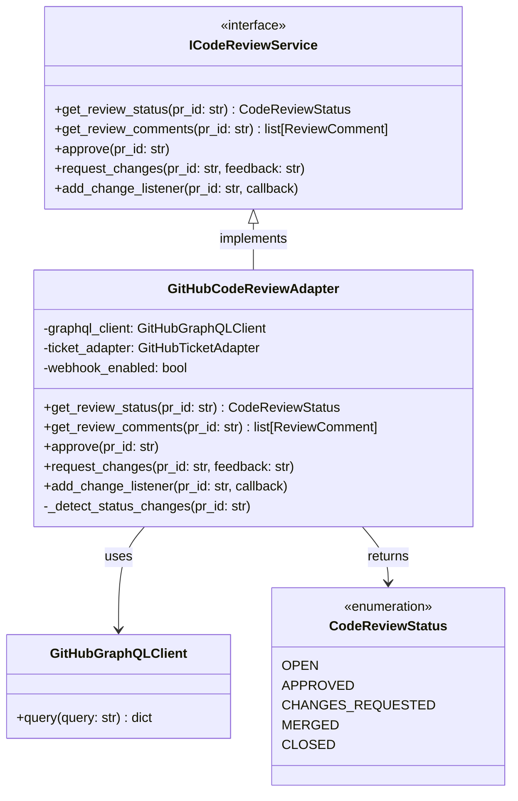

# GitHubCodeReviewAdapter

## Purpose

**GitHubCodeReviewAdapter** implements the `ICodeReviewService` interface by connecting to GitHub Pull Requests, providing code review status tracking, approval workflows, review feedback management, and change detection.

This adapter is used in production to manage code review workflows for pull requests. When an agent completes code changes, it creates a pull request and the adapter monitors its review status. The adapter tracks reviewer feedback, detects when reviews are approved or changes are requested, and emits events for orchestrator to respond to.

The adapter supports both:
- **Webhook-based detection** (real-time): Responds immediately to PR review webhooks
- **Polling fallback** (eventual consistency): Periodically checks PR status when webhooks unavailable

## Implementation Strategy

### GitHub Pull Request Integration

GitHubCodeReviewAdapter uses the **GitHub GraphQL API** and **REST API**:
- GraphQL for complex PR/review queries (efficient nested data)
- REST API for mutations (approve, request changes, comments)
- Webhooks for real-time change detection

### Key Design Decisions

**1. Review Status Determination**
```python
# Review status reflects PR state
CodeReviewStatus.OPEN          # PR open, no reviews yet
CodeReviewStatus.APPROVED      # PR approved (can merge)
CodeReviewStatus.CHANGES_REQUESTED  # Changes needed
CodeReviewStatus.MERGED        # PR merged
CodeReviewStatus.CLOSED        # PR closed without merge
```

Status is determined from:
- Number of approved reviews vs. required
- Any "changes requested" reviews (block approval)
- PR merge status
- PR closed status

**2. Change Detection Strategy**
- **Webhook mode**: Consumes `pull_request_review` and `pull_request` webhooks
- **Polling fallback**: Periodically queries PR status if webhooks fail
- **Adaptive intervals**: Back off during low activity, burst during high activity

**3. Monitoring per Pull Request**
```python
_monitoring: dict[str, MonitoringStatus]    # PR ID → status
_polling_tasks: dict[str, asyncio.Task]    # PR ID → polling task
```

**4. Comment Management**
```python
# Retrieve all review comments (not inline code comments)
comments = await adapter.get_review_comments(pr_id)
# Each comment includes:
# - Author (reviewer identity)
# - Text (feedback)
# - Timestamp
# - Associated commit
```

## Configuration

### Required Parameters
```python
@dataclass
class GitHubConfig:
    token: str                          # GitHub API token (required)
    organization: str                   # GitHub organization (required)
    repository: str                     # Repository name (required)
    
    # Polling configuration
    polling_interval_seconds: int = 60  # 60 second default
    webhook_enabled: bool = True        # Enable webhook detection
    
    # API defaults
    api_base_url: str = "https://api.github.com"
    graphql_url: str = "https://api.github.com/graphql"
    timeout_seconds: int = 30
```

### Environment Variables
- `GITHUB_TOKEN`: GitHub API token
- `GITHUB_ORG`: Organization name
- `GITHUB_REPO`: Repository name
- `PR_POLLING_ENABLED`: Enable polling fallback (default: true)
- `PR_POLLING_INTERVAL`: Polling interval in seconds (default: 60)

## Error Handling

### Authentication Errors
```
GitHub 401 Unauthorized
    ↓
raise AuthenticationError("GitHub token invalid or expired")
```
**Recovery**: Refresh token in secure store.

### Permission Errors
```
GitHub 403 Forbidden (insufficient scopes)
    ↓
raise AuthorizationError("Token lacks pull_request:read scope")
```
**Recovery**: Update token with required scopes.

### PR Not Found
```
GitHub 404 Not Found (PR doesn't exist)
    ↓
raise ResourceNotFoundError(f"PR #{pr_number} not found")
```
**Recovery**: Verify PR exists. Emit reconciliation event.

### Transient Errors
```
GitHub API timeout or 500/503
    ↓
Automatic retry (exponential backoff)
    ↓
After 3 retries: raise ExternalServiceError("GitHub API unavailable")
```
**Recovery**: Circuit breaker activates after 5 consecutive failures.

### Rate Limiting
```
GitHub 429 Too Many Requests
    ↓
Extract retry-after header
    ↓
Pause and retry after backoff
```
**Recovery**: Wait for rate limit window.

### Webhook Failures
```
Webhook delivery fails or stops
    ↓
Fall back to polling
    ↓
Emit MonitoringStatusChangedEvent
```
**Recovery**: Polling provides eventual consistency.

## Testing

### Unit Tests
- Mock GraphQL/REST responses for PR operations
- Configuration validation
- Error mapping (GitHub errors → port exceptions)
- Event emission (ReviewStatusChangedEvent, ReviewCommentAddedEvent)
- Status determination logic

**Location**: `tests/unit/adapters/secondary/github/test_code_review_adapter.py`

### Integration Tests
- Real GitHub API (staging repo): Create PR, request reviews, approve
- Webhook integration: Mock webhook payloads
- Polling fallback: Disable webhooks, verify polling detection
- Rate limiting: Verify backoff behavior
- Comment retrieval: Fetch and verify review comments

**Location**: `tests/integration/adapters/secondary/github/test_code_review_adapter_integration.py`

### Contract Tests
- Verify GitHubCodeReviewAdapter implements ICodeReviewService
- Shared test suite against MockCodeReviewAdapter

**Location**: `tests/contracts/adapters/test_code_review_service_contract.py`

### Simulation Tests
- Wrapped in MockCodeReviewAdapter
- Scenarios: PR review workflows, approval, changes requested
- Verify ReviewService uses code review adapter correctly

**Location**: `tests/simulation/scenarios/`

## Source

**File Path**: `src/codetoreum/adapters/secondary/github_code_review_adapter.py`

**Class**: `class GitHubCodeReviewAdapter(ICodeReviewService):`

**Related Files**:
- Port interface: `src/codetoreum/ports/output/code_review_service.py` (ICodeReviewService)
- Domain events: `src/codetoreum/domain/events/review_events.py`
- Tests: `tests/unit/adapters/secondary/github/test_code_review_adapter.py`

## Diagram



## Production vs. Mock Comparison

| Aspect | Production (GitHubCodeReviewAdapter) | Mock (MockCodeReviewAdapter) |
|---|---|---|
| **External System** | Real GitHub PR API | In-memory dictionary |
| **Latency** | 100-500ms | <1ms |
| **Determinism** | No (depends on reviewers) | Yes (deterministic) |
| **Dependencies** | GitHub credentials, network | None |
| **Use Case** | Production, staging | Testing, development |

## Cross-References

- **Port Interface**: [ICodeReviewService](../ports/output/code-review.md) - Complete specification
- **Related Adapters**: 
  - [GitHubTicketAdapter](./github-ticket-adapter.md) - Issue management
  - [GitHub Discussion Adapter](./github-discussion-adapter.md) - Comment management
- **Domain Events**: [Review Events](../domain/events.md#review-context)
- **Simulation**: [MockCodeReviewAdapter](../../../implementations/simulation/adapters.md)
