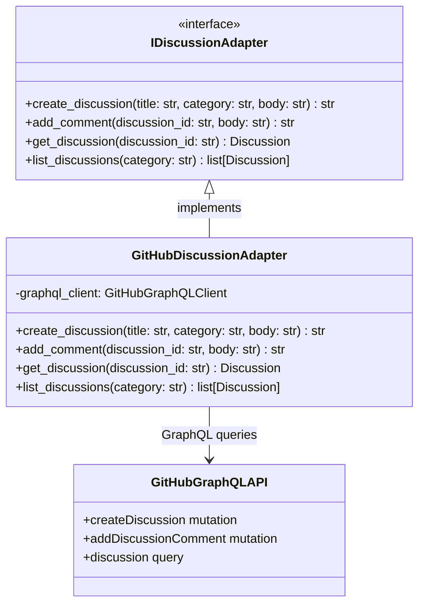

# GitHubDiscussionAdapter

## Purpose

**GitHubDiscussionAdapter** implements the `IDiscussionAdapter` interface by connecting to GitHub Discussions, providing discussion creation, comment management, and discussion threading.

This adapter is used in production to manage detailed problem discussions and knowledge sharing. While issues are used for work items, discussions provide a separate space for in-depth conversations, architectural decisions, and documentation. The adapter enables the system to create discussions linked to work items, add comments, and organize discussions by category.

## Implementation Strategy

### GitHub Discussions API Integration

GitHubDiscussionAdapter uses the **GitHub GraphQL API** (Discussions are primarily GraphQL-based):
- Creates discussions in specified categories
- Adds comments to discussions
- Manages discussion status and title
- Retrieves discussion threads with comments
- Supports efficient nested queries via GraphQL

### Key Design Decisions

**1. Category Mapping**
```python
# Discussions are organized by category
DiscussionCategory.ANNOUNCEMENTS  # Important announcements
DiscussionCategory.GENERAL        # General discussion
DiscussionCategory.ARCHITECTURE   # Architecture decisions
DiscussionCategory.TROUBLESHOOTING # Problem diagnosis
```

Categories are configured per repository and mapped to appropriate discussion topics.

**2. Link to Work Items**
Discussions can be linked to issues/work items:
- Discussion created when issue needs extended discussion
- Bidirectional references maintained
- Single issue can have multiple discussions

**3. Comment Threading**
```python
# Discussions support threaded comments
discussion.add_reply(parent_comment_id, reply_text)
comments = discussion.get_threaded_comments()
```

Comments are organized in threads for better organization.

## Configuration

### Required Parameters
```python
@dataclass
class GitHubConfig:
    token: str                          # GitHub API token (required)
    organization: str                   # Organization name (required)
    repository: str                     # Repository name (required)
    
    # API defaults
    api_base_url: str = "https://api.github.com"
    graphql_url: str = "https://api.github.com/graphql"
    timeout_seconds: int = 30
```

### Environment Variables
- `GITHUB_TOKEN`: GitHub API token
- `GITHUB_ORG`: Organization name
- `GITHUB_REPO`: Repository name

## Error Handling

### Category Not Found
```
GitHub discussion category doesn't exist
    ↓
raise ResourceNotFoundError("Discussion category not found")
```
**Recovery**: Use default category or create category first.

### Discussion Not Found
```
Discussion with given ID doesn't exist
    ↓
raise ResourceNotFoundError(f"Discussion {discussion_id} not found")
```
**Recovery**: Verify discussion exists. Check permissions.

### Authentication Errors
```
Invalid GitHub token
    ↓
raise AuthenticationError("GitHub token invalid")
```
**Recovery**: Refresh token in secure store.

### Permission Errors
```
Token lacks discussions:write scope
    ↓
raise AuthorizationError("Token lacks discussions:write scope")
```
**Recovery**: Update token with required scopes.

### Transient Errors
```
GitHub API timeout or 500/503
    ↓
Automatic retry (exponential backoff)
```
**Recovery**: Circuit breaker activates after failures.

### Rate Limiting
```
GitHub 429 Too Many Requests
    ↓
Extract retry-after from response
    ↓
Pause and retry after backoff
```
**Recovery**: Wait for rate limit window.

## Testing

### Unit Tests
- Mock GraphQL responses for discussion operations
- Configuration validation
- Error mapping (GitHub errors → port exceptions)
- Event emission (discussion created, comment added)

**Location**: `tests/unit/adapters/secondary/github/test_discussion_adapter.py`

### Integration Tests
- Real GitHub API: Create discussions, add comments, retrieve
- Webhook integration: Discussion events
- Thread management: Reply organization
- Category handling: Correct category assignment

**Location**: `tests/integration/adapters/secondary/github/test_discussion_adapter_integration.py`

### Contract Tests
- Verify GitHubDiscussionAdapter implements IDiscussionAdapter
- Shared test suite against MockDiscussionAdapter

**Location**: `tests/contracts/adapters/test_discussion_adapter_contract.py`

## Source

**File Path**: `src/codetoreum/adapters/secondary/github_discussion_adapter.py`

**Class**: `class GitHubDiscussionAdapter(IDiscussionAdapter):`

**Related Files**:
- Port interface: `src/codetoreum/ports/output/discussion.py` (IDiscussionAdapter)
- Bootstrap wiring: `src/codetoreum/infrastructure/bootstrap.py`
- Tests: `tests/unit/adapters/secondary/github/test_discussion_adapter.py`

## Diagram



## Production vs. Mock Comparison

| Aspect | Production (GitHubDiscussionAdapter) | Mock (MockDiscussionAdapter) |
|---|---|---|
| **External System** | Real GitHub Discussions API | In-memory dictionary |
| **Latency** | 100-500ms | <1ms |
| **Determinism** | No | Yes |
| **Dependencies** | GitHub credentials, network | None |
| **Use Case** | Production, staging | Testing, development |

## Cross-References

- **Port Interface**: [IDiscussionAdapter](../ports/output/work-coordination.md) - Specification
- **Related Adapters**: 
  - [GitHubTicketAdapter](./github-ticket-adapter.md) - Issue management
  - [GitHub Code Review Adapter](./github-code-review-adapter.md) - PR comments
- **Simulation**: [MockDiscussionAdapter](../../implementations/simulation/adapters.md)
