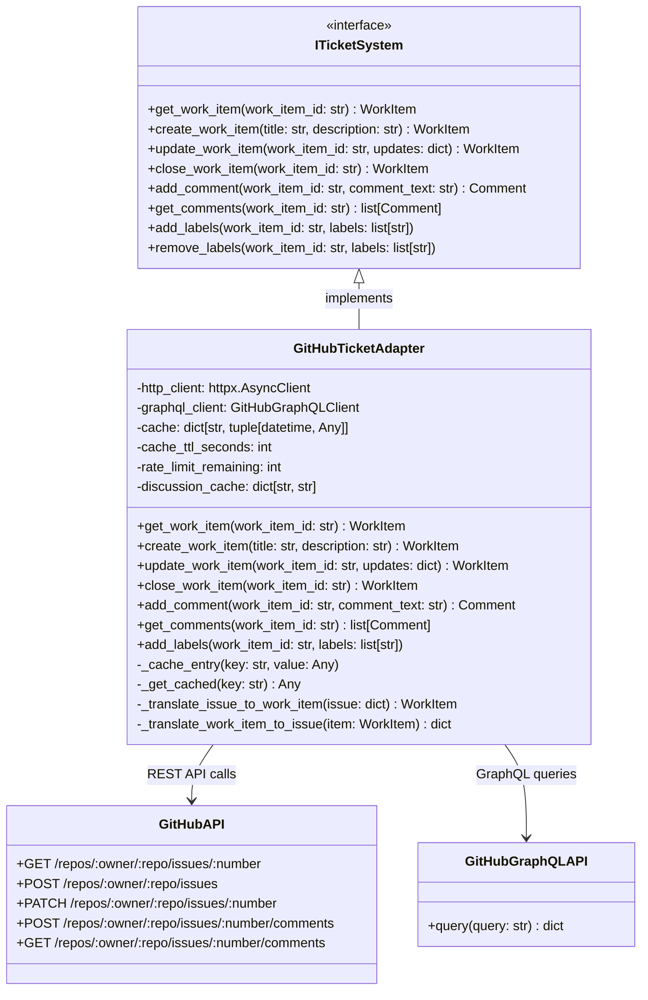

# GitHubTicketAdapter

## Purpose

**GitHubTicketAdapter** implements the `ITicketSystem` interface by connecting to GitHub Issues, providing work item CRUD operations, comment management, label operations, and metadata tracking.

This adapter is used in production to represent Codetoreum work items as GitHub Issues. When the orchestrator creates, updates, or closes work items, the adapter synchronizes these changes with GitHub, maintaining a bidirectional mapping between domain work items and GitHub issues. Comments and discussions on issues are also synced back to the system.

The adapter translates between:
- Codetoreum domain model (WorkItem, Comment) ↔ GitHub Issues API format
- Custom priority levels and status enums ↔ GitHub labels and issue states

## Implementation Strategy

### GitHub Issues Integration

GitHubTicketAdapter uses both **REST API** and **GraphQL API**:
- **REST API** (primary): CRUD operations on issues, comments, labels
- **GraphQL API** (supplementary): Discussion queries to populate discussion IDs, efficient batch operations

### Key Design Decisions

**1. Caching Strategy**
```python
# In-memory cache with LRU eviction
_cache: dict[str, tuple[datetime, Any]] = {}           # Cache entries
_cache_access_times: dict[str, datetime] = {}          # LRU timestamps
_cache_ttl_seconds: int = 300                          # 5 minute TTL
_cache_max_entries: int = 1000                         # Max before eviction
```

Caching reduces GitHub API calls for frequently accessed issues:
- Issue metadata (priority, status, assignee)
- Comment lists
- Label lists

Cache entries auto-expire after TTL or when cache size exceeds limit (LRU eviction).

**2. Discussion ID Resolution**
```python
_discussion_cache: dict[str, str | None] = {}          # issue_number → discussion_id
_discussions_fetched: bool = False
_discussions_fetch_error_id: str | None = None         # Sentry tracking
_discussions_retry_count: int = 0                      # Max 3 retries
```

Discussion IDs are fetched via GraphQL once per adapter lifetime:
- Enables mapping issues to GitHub Discussions
- Cached to avoid repeated queries
- Retry up to 3 times on failure, then skip

**3. Rate Limit Tracking**
```python
_rate_limit_remaining: int | None = None
_rate_limit_reset: datetime | None = None
```

Tracks GitHub API rate limits (5,000 requests/hour for personal tokens):
- Read from response headers after each API call
- Used by resilience layer to trigger backoff before hitting limit

**4. Custom Types Mapping**

| Domain Type | GitHub Representation |
|---|---|
| WorkItemStatus.NEW | Open issue with label `status-new` |
| WorkItemStatus.ASSIGNED | Open issue with label `status-assigned` and assignee set |
| WorkItemStatus.IN_PROGRESS | Open issue with label `status-in-progress` |
| WorkItemStatus.UNDER_REVIEW | Open issue with label `status-under-review` |
| WorkItemStatus.COMPLETED | Closed issue with label `status-completed` |
| WorkItemStatus.FAILED | Closed issue with label `status-failed` |
| WorkItemStatus.BLOCKED | Open issue with label `status-blocked` |
| WorkItemPriority.CRITICAL | Label `priority-critical` |
| WorkItemPriority.HIGH | Label `priority-high` |
| WorkItemPriority.MEDIUM | Label `priority-medium` |
| WorkItemPriority.LOW | Label `priority-low` |

## Configuration

### Required Parameters
```python
@dataclass
class GitHubConfig:
    # Authentication
    token: str                          # Personal Access Token or GitHub App token

    # Repository
    organization: str                   # GitHub organization name
    repository: str                     # Repository name

    # API configuration
    api_base_url: str = "https://api.github.com"
    api_version: str = "2022-11-28"
    timeout_seconds: int = 30

    # GraphQL configuration
    graphql_url: str = "https://api.github.com/graphql"

    # Caching
    cache_ttl_seconds: int = 300       # 5 minutes
    cache_max_entries: int = 1000      # Max cache size before LRU eviction
```

### Environment Variables
- `GITHUB_TOKEN`: GitHub API authentication token (required)
- `GITHUB_ORG`: GitHub organization (required)
- `GITHUB_REPO`: Repository name (required)
- `GITHUB_API_TIMEOUT_SECONDS`: API timeout (default 30)
- `CACHE_TTL_SECONDS`: Cache expiration time in seconds (default 300)

### Required GitHub Permissions

Token must have these scopes/permissions:
- `repo:read` - Read issue/PR data
- `repo:write` - Create/update/close issues
- `gist:read` - Read discussions (if using GraphQL for discussions)

## Error Handling

### Authentication & Authorization Errors
```
GitHub 401 Unauthorized
    ↓
raise AuthenticationError("GitHub token invalid or expired")
```
**Recovery**: Token must be refreshed. No automatic retry.

```
GitHub 403 Forbidden (insufficient permissions)
    ↓
raise AuthorizationError("Token lacks required repo:write scope")
```
**Recovery**: Token must be granted additional scopes. No automatic retry.

### Work Item Not Found
```
GitHub 404 Not Found (issue doesn't exist)
    ↓
raise WorkItemNotFoundError(f"Issue #{issue_number} not found")
```
**Recovery**: Emit reconciliation event. Verify issue exists in GitHub.

### Validation Errors
```
Invalid issue data (malformed title, empty description)
    ↓
raise ValidationError("Issue title cannot be empty")
```
**Recovery**: Validate input before calling adapter. No retry.

### Transient Errors
```
GitHub API timeout or 500/503 error
    ↓
Automatic retry (exponential backoff: 1s, 2s, 4s)
    ↓
After 3 retries: raise ExternalServiceError("GitHub API unavailable")
```
**Recovery**: Circuit breaker activates after 5 consecutive failures in 60 seconds.

### Rate Limiting
```
GitHub 429 Too Many Requests
    ↓
Extract retry-after header from response
    ↓
Pause requests for retry-after duration
    ↓
Automatic retry after backoff
    ↓
raise RateLimitError if rate limit hit during critical operation
```
**Recovery**: Caller can retry after cooldown. Monitoring alerts if rate limit frequently hit.

### Cache Eviction
```
Cache exceeds _cache_max_entries (1000)
    ↓
LRU eviction: remove least-recently-used entries
    ↓
Continue operation with reduced cache size
```
**Recovery**: Automatic. Performance impact minimal due to new cache entries.

### Discussion ID Resolution Failure
```
GraphQL query for discussion IDs fails
    ↓
Log warning: "Failed to fetch discussion IDs from GitHub"
    ↓
Retry up to 3 times (exponential backoff)
    ↓
Set _discussions_fetched = true (skip future attempts)
    ↓
Continue without discussion IDs
```
**Recovery**: Non-critical. Adapter works without discussion IDs. Try again on next adapter instance.

## Testing

### Unit Tests
- **HTTP client mocking**: Fixture returns canned GitHub API responses
- **Configuration validation**: Valid/invalid configs, required parameters
- **Cache behavior**: TTL expiration, LRU eviction, cache hits/misses
- **Error mapping**: GitHub API errors → port-standard exceptions
- **Rate limit tracking**: Extract and track rate limit from response headers
- **Custom type translation**: WorkItem → GitHub issue format and vice versa
- **Comment operations**: Create, list, update comment handling
- **Label operations**: Add/remove labels, translate priority enums

**Location**: `tests/unit/adapters/secondary/github/test_ticket_adapter.py`

### Integration Tests
- **Real GitHub API** (staging repo): Create actual issues, add comments, update labels
- **Authentication**: Valid token, invalid token, expired token
- **Rate limiting**: Verify backoff and retry behavior
- **Large payloads**: Issues with many comments or labels
- **Unicode handling**: Comments with special characters, emoji
- **Concurrent operations**: Parallel issue creation and updates

**Location**: `tests/integration/adapters/secondary/github/test_ticket_adapter_integration.py`

### Contract Tests
- Verify GitHubTicketAdapter implements ITicketSystem fully
- Shared test suite runs against GitHubTicketAdapter and InMemoryTicketAdapter
- Method signatures, exception types, return values

**Location**: `tests/contracts/adapters/test_ticket_system_contract.py`

### Simulation Tests
- Wrapped in InMemoryTicketAdapter for deterministic testing
- Scenarios: Create, update, close issues; comment management; label operations
- Verify WorkflowOrchestrator uses ticket adapter correctly

**Location**: `tests/simulation/scenarios/`

### Mocking Strategy
```python
# Test fixture
@pytest.fixture
def ticket_adapter(mock_http_client):
    config = GitHubConfig(
        token="test-token",
        organization="test-org",
        repository="test-repo"
    )
    adapter = GitHubTicketAdapter(config)
    adapter._http_client = mock_http_client  # Inject mock
    return adapter
```

## Source

**File Path**: `src/codetoreum/adapters/secondary/github_ticket_adapter.py`

**Class**: `class GitHubTicketAdapter(ITicketSystem):`

**Related Files**:
- Port interface: `src/codetoreum/ports/output/ticket_system.py` (ITicketSystem)
- GraphQL client: `src/codetoreum/infrastructure/http/github_graphql_client.py`
- Domain models: `src/codetoreum/domain/work_item.py` (WorkItem)
- Domain types: `src/codetoreum/domain/types.py` (WorkItemId, CommentId)
- Bootstrap wiring: `src/codetoreum/infrastructure/simulation/bootstrap.py` (Simulation), `documentation/implementations/production-bootstrap.md` (Production)
- Tests: `tests/unit/adapters/secondary/github/test_ticket_adapter.py`

## Diagram



## Production vs. Mock Comparison

| Aspect | Production (GitHubTicketAdapter) | Mock (InMemoryTicketAdapter) |
|---|---|---|
| **External System** | Real GitHub Issues API | In-memory dictionary |
| **Latency** | 100-500ms per operation | <1ms |
| **Determinism** | No (depends on GitHub state) | Yes (fully deterministic) |
| **Dependencies** | GitHub credentials, network, HTTP client | None |
| **Caching** | 5-minute TTL cache with LRU eviction | N/A (fast anyway) |
| **Rate Limiting** | GitHub enforced (5000 req/hour) | Unlimited (simulated) |
| **Error Handling** | Real API errors + resilience patterns | Configurable mock responses |
| **Use Case** | Production, staging | Testing, development, CI/CD |

## Cross-References

- **Port Interface**: [ITicketSystem](../ports/output/core-system.md#iticketsystem) - Complete interface specification
- **Related Adapters**:
  - [GitHubBoardAdapter](./github-board-adapter.md) - Board management
  - [GitHub Code Review Adapter](./github-code-review-adapter.md) - PR management
  - [GitHub Discussion Adapter](./github-discussion-adapter.md) - Comments and discussions
- **Domain Models**: [WorkItem](../domain/models.md#workitem) - Work item specification
- **Infrastructure**: [Resilience Patterns](../infrastructure/resilience.md) - Retry, circuit breaker, rate limiting
- **Simulation**: [InMemoryTicketAdapter](../../../implementations/simulation/adapters.md#output-port-adapters) - Test alternative
