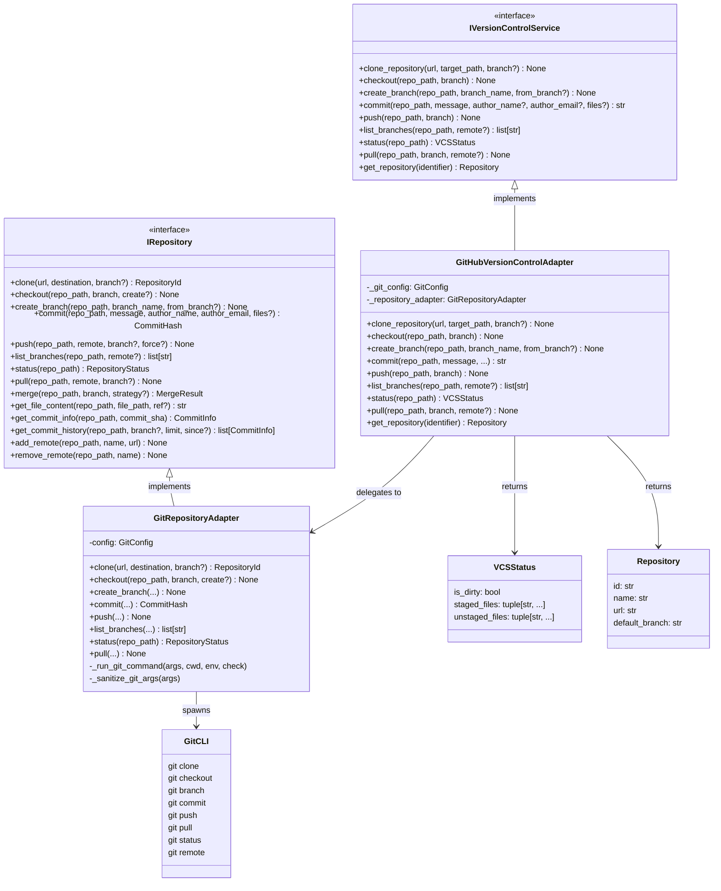

# GitHubVersionControlAdapter

## Purpose

**GitHubVersionControlAdapter** implements the `IVersionControlService` interface by wrapping `GitRepositoryAdapter` (which implements `IRepository`) to expose a higher-level contract suited to application services.

This adapter bridges two port layers that serve distinct consumers:

- **`IRepository`** (`GitRepositoryAdapter`) — low-level git operations with rich domain types (`BranchName`, `CommitHash`, `RepositoryStatus`, `CommitInfo`). Consumed directly by infrastructure and any caller that needs full git semantics including merge, diff, remote management, and commit history.
- **`IVersionControlService`** (`GitHubVersionControlAdapter`) — higher-level, string-typed orchestration contract. Consumed by application services (WorkflowOrchestrator, WorkspaceRouter) that need VCS operations without coupling to git-specific types.

The separation exists to keep the application layer vendor-agnostic: `IVersionControlService` uses plain strings and the `VCSStatus` / `Repository` value objects defined in the port itself. If a future VCS provider (e.g., Mercurial, Perforce) were substituted, the application services would require no changes.

## Implementation Strategy

### Delegation to GitRepositoryAdapter

`GitHubVersionControlAdapter` is a **pure delegation adapter**. It owns no subprocess logic. Every operation translates its string parameters to `Path` objects and delegates to `GitRepositoryAdapter._repository_adapter`. This keeps all subprocess execution, argument sanitization, timeout management, and error classification consolidated in one place (`GitRepositoryAdapter`).

```
IVersionControlService
        |
        | (string-typed port: repo_path: str, branch: str)
        v
GitHubVersionControlAdapter
        |
        | (Path-typed IRepository API: repo_path: Path, branch: BranchName)
        v
GitRepositoryAdapter
        |
        | (subprocess: git clone, git checkout, git commit, ...)
        v
    git CLI
```

### Parameter Translation

The adapter's primary mechanical work is type translation at the port boundary:

```python
# IVersionControlService contract (strings)
async def status(self, repo_path: str) -> VCSStatus

# IRepository contract (Path + domain types)
async def status(self, repo_path: Path) -> RepositoryStatus
```

The adapter converts `str` -> `Path` on every call and projects `RepositoryStatus`
(which includes `current_branch`, `untracked_files`, `ahead_count`, `behind_count`) down
to the simpler `VCSStatus` (only `is_dirty`, `staged_files`, `unstaged_files`).

### get_repository Implementation

`get_repository()` has no exact equivalent in `IRepository`. The implementation:
1. Calls `self._repository_adapter.status(path)` to validate the path exists (raises `ValidationError` if not).
2. Reads `{repo_path}/.git/config` as a plain file (not a subprocess) to extract the `origin` remote URL via `_parse_remote_url()`.
3. Uses `GitConfig.default_branch` as the `default_branch` for the returned `Repository`. The `current_branch` from `status()` reflects the checked-out branch, not the repository's default — using it here would return incorrect metadata after an agent checks out a feature branch.

No `subprocess.run()` calls appear in this adapter — all subprocess work flows through `GitRepositoryAdapter`.

### Error Handling

Each method wraps its delegation in a try/except that:
- Logs all errors with `exc_info=True` (no silent failures)
- Re-raises the original exception for all methods except `get_repository()`
- `get_repository()` additionally re-raises `ResourceNotFoundError` as-is (preserving the port contract) and wraps any other exception as `ResourceNotFoundError`

Port-standard exceptions propagate from `GitRepositoryAdapter` without re-wrapping:
- `ValidationError`: Invalid path or parameters
- `RepositoryError`: git command failure
- `AuthenticationError`: Credential failure
- `MergeConflictError`: Merge conflicts (via `GitRepositoryAdapter.merge()`, not exposed here)
- `ResourceNotFoundError`: Branch, ref, or repository not found

## Configuration

### Constructor Parameters

```python
class GitHubVersionControlAdapter(IVersionControlService):
    def __init__(
        self,
        git_config: GitConfig | None = None,
    ) -> None:
```

`GitConfig` is defined in `git_repository_adapter.py`:

```python
@dataclass
class GitConfig:
    git_path: str = "git"                       # Path to git binary
    default_author_name: str | None = None      # Default commit author name
    default_author_email: str | None = None     # Default commit author email
    ssh_key_path: str | None = None             # Path to SSH private key
    credential_helper: str | None = None        # Git credential helper
    default_branch: str = "main"               # Fallback default branch name
    auto_create_remote_branch: bool = True      # Auto --set-upstream on push
    timeout_seconds: int = 300                  # Git command timeout
```

If `git_config` is `None`, a default `GitConfig()` is used.

### Environment Variables

All credential and path configuration is passed through `GitConfig` at construction time. The following environment variables are conventional:
- `GIT_SSH_KEY_PATH`: Path to SSH private key
- `GIT_CREDENTIAL_HELPER`: Git credential helper name
- `GIT_DEFAULT_BRANCH`: Default branch (default: `main`)
- `GIT_AUTHOR_NAME`: Default commit author name
- `GIT_AUTHOR_EMAIL`: Default commit author email

## Methods

| Method | Port Signature | Delegation |
|--------|---------------|------------|
| `clone_repository` | `(url, target_path, branch?) -> None` | `GitRepositoryAdapter.clone()` |
| `checkout` | `(repo_path, branch) -> None` | `GitRepositoryAdapter.checkout()` |
| `create_branch` | `(repo_path, branch_name, from_branch?) -> None` | `GitRepositoryAdapter.create_branch()` |
| `commit` | `(repo_path, message, author_name?, author_email?, files?) -> str` | `GitRepositoryAdapter.commit()` |
| `push` | `(repo_path, branch) -> None` | `GitRepositoryAdapter.push()` |
| `list_branches` | `(repo_path, remote?) -> list[str]` | `GitRepositoryAdapter.list_branches()` |
| `status` | `(repo_path) -> VCSStatus` | `GitRepositoryAdapter.status()` + projection |
| `pull` | `(repo_path, branch, remote?) -> None` | `GitRepositoryAdapter.pull()` |
| `get_repository` | `(identifier) -> Repository` | `GitRepositoryAdapter.status()` + file read |

### commit() Return Value

`GitRepositoryAdapter.commit()` returns a `CommitHash` newtype (a `str` subclass).
`IVersionControlService.commit()` declares `-> str`. The adapter calls `str(commit_hash)`
to produce a plain `str` at the port boundary, maintaining type contract clarity.

### status() Projection

`RepositoryStatus` (from `IRepository`) includes six fields:
`current_branch`, `is_dirty`, `staged_files`, `unstaged_files`, `untracked_files`,
`ahead_count`, `behind_count`.

`VCSStatus` (from `IVersionControlService`) uses three:
`is_dirty`, `staged_files`, `unstaged_files`.

The adapter projects faithfully — `untracked_files`, `ahead_count`, and `behind_count`
are intentionally dropped because `IVersionControlService` callers do not need them.

## Event Emission

`IVersionControlService` explicitly has **no event emission**. The port docstring documents this design decision:

> Version control operations are orchestrator-controlled actions, not changes detected from external systems. Events related to code reviews are handled by `ICodeReviewService` instead.

This is architecturally correct. The orchestrator calls VCS operations as direct commands (clone, commit, push). There is no external system detecting these changes and emitting events — the orchestrator itself is the initiator. Domain events for code review state changes (PR created, review submitted) belong to `ICodeReviewService`.

## Testing

### Unit Tests

- **Delegation verification**: Confirm each method calls the correct `GitRepositoryAdapter` method with correctly-typed arguments
- **Parameter translation**: `str` paths correctly converted to `Path` objects
- **VCSStatus projection**: `RepositoryStatus` fields correctly mapped to `VCSStatus`
- **commit() return**: `CommitHash` newtype returned as plain `str`
- **get_repository() URL extraction**: `_parse_remote_url()` tested with real `.git/config` samples (with/without origin, multiple remotes)
- **get_repository() fallback**: `file://` URL when `.git/config` absent or no origin remote
- **Error logging**: All exceptions logged with `exc_info=True` before re-raise

**Location**: `tests/adapters/test_github_version_control_adapter.py`

### Contract Tests

- Verify `GitHubVersionControlAdapter` implements `IVersionControlService` (explicit ABC inheritance)
- All abstract methods implemented
- Return types match port declarations

### Integration Tests

- End-to-end with real git repository in temp directory
- Clone → branch → commit → push cycle against test remote
- Verify `get_repository()` against real git repository with configured remote

**Location**: `tests/integration/adapters/secondary/test_github_version_control_adapter_integration.py`

### Simulation Tests

There is currently no `MockVersionControlService` adapter for simulation. When workflows require
VCS operations in simulation scenarios, the simulation bootstrap wires `InMemoryRepositoryAdapter`
for the `IRepository` port. If simulation scenarios need to exercise `IVersionControlService`
directly, a `MockVersionControlAdapter` should be added to `src/codetoreum/adapters/testing/`.

### Mocking Strategy

```python
@pytest.fixture
def mock_git_repo_adapter():
    return AsyncMock(spec=GitRepositoryAdapter)

@pytest.fixture
def vcs_adapter(mock_git_repo_adapter):
    config = GitConfig(default_branch="main")
    adapter = GitHubVersionControlAdapter(git_config=config)
    adapter._repository_adapter = mock_git_repo_adapter
    return adapter
```

## Source

**File Path**: `src/codetoreum/adapters/secondary/github_version_control_adapter.py`

**Class**: `class GitHubVersionControlAdapter(IVersionControlService):`

**Module-level helper**: `_parse_remote_url(git_config_text: str) -> str | None`

**Related Files**:
- Port interface: `src/codetoreum/ports/output/version_control_service.py` (`IVersionControlService`, `VCSStatus`, `Repository`)
- Wrapped adapter: `src/codetoreum/adapters/secondary/git_repository_adapter.py` (`GitRepositoryAdapter`, `GitConfig`)
- Lower port: `src/codetoreum/ports/output/repository.py` (`IRepository`, `RepositoryStatus`)
- Port exceptions: `src/codetoreum/ports/exceptions.py`
- Tests: `tests/adapters/test_github_version_control_adapter.py`

## Diagram



## Production vs. Mock Comparison

| Aspect | Production (GitHubVersionControlAdapter) | Mock (none currently) |
|--------|------------------------------------------|----------------------|
| **External System** | Real git CLI via GitRepositoryAdapter | N/A — use InMemoryRepositoryAdapter for IRepository |
| **Latency** | 100-5000ms per git operation | <1ms |
| **Determinism** | No (real git state, filesystem) | Yes |
| **Dependencies** | git CLI, SSH credentials or credential helper | None |
| **Use Case** | Production, staging | Use InMemoryRepositoryAdapter directly |
| **Note** | Wraps GitRepositoryAdapter | A MockVersionControlAdapter is a known gap |

## Cross-References

- **Port Interface**: [IVersionControlService](../../ports/output/core-system.md#iversionscontrolservice) — Complete specification, VCSStatus and Repository value objects
- **Wrapped Adapter**: [GitRepositoryAdapter](./git-repository-adapter.md) — IRepository implementation, GitConfig reference, security considerations
- **Infrastructure**: [Resilience Patterns](../../infrastructure/resilience.md) — Retry and circuit breaker applied via decorator, not inside this adapter
- **Agent Security Model**: [CLAUDE.md](../../../../CLAUDE.md#agent-security-model) — Containers have no git credentials; orchestrator uses this adapter for all git operations
