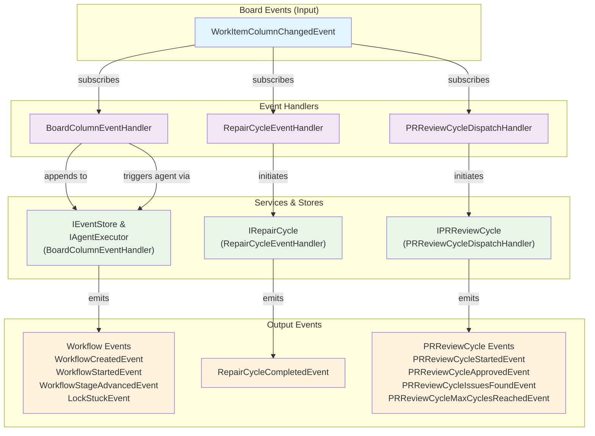
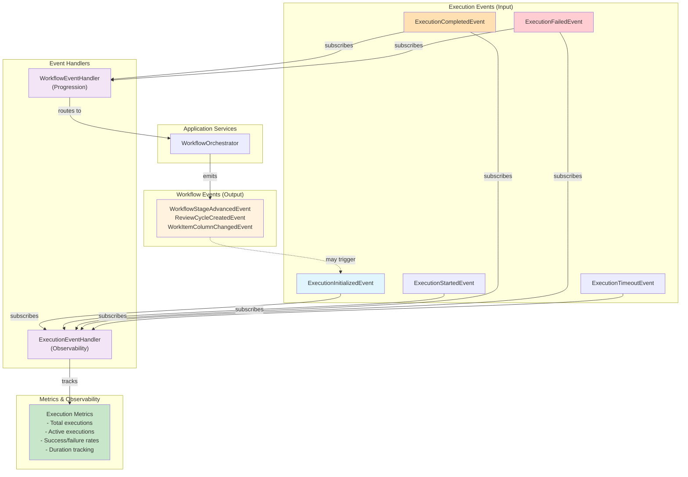
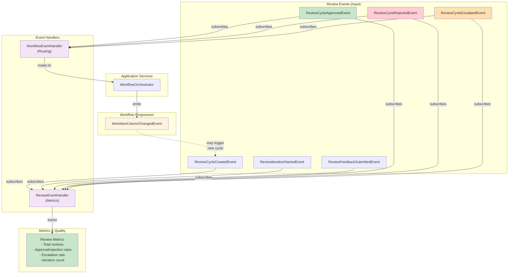
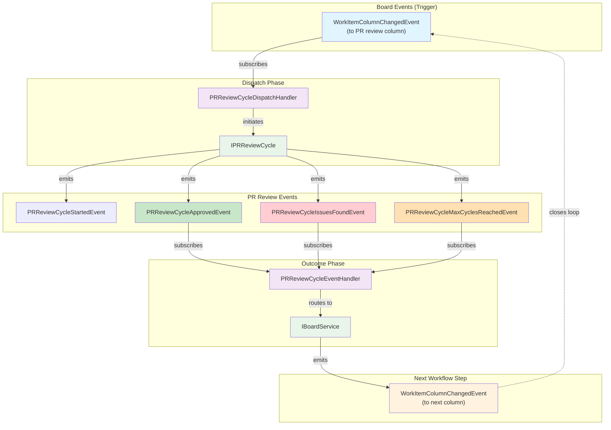
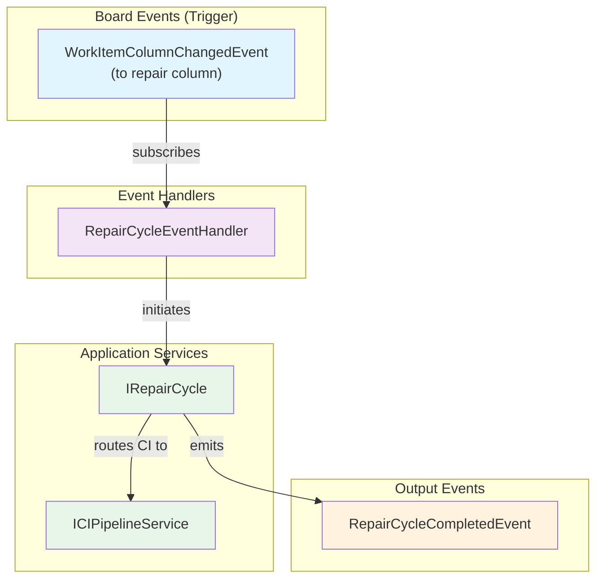
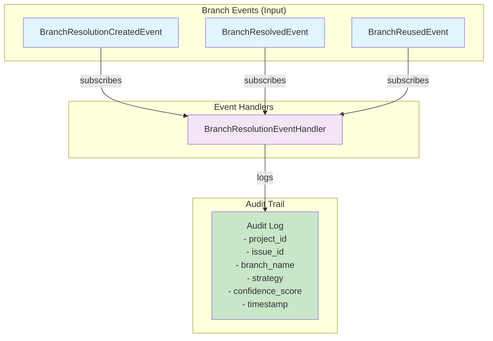
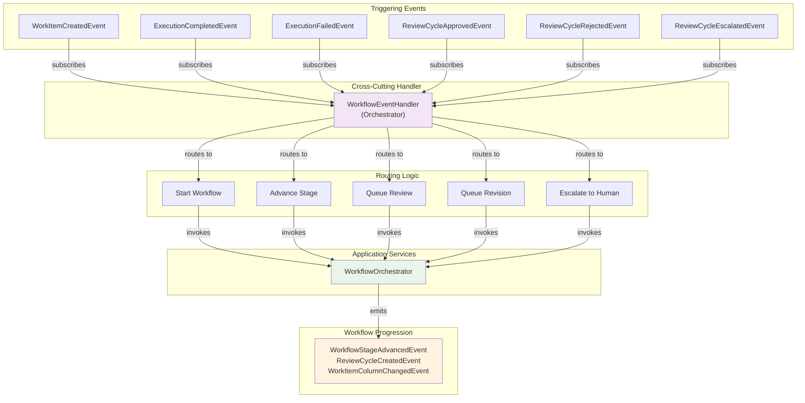

---
required_sections:
  - "## Overview"
  - "## Handler Catalog"
  - "## Event Bus Wiring Diagram"
  - "## Event Flow Patterns"
  - "## Handler Coordination"
applies_to: "documentation/architecture/application-services/event-handlers.md"
---

# Event Handlers Catalog

## Overview

The event handlers layer contains **8 event handlers** that implement reactive workflows. When domain events are published to the event bus, handlers subscribe and execute business logic in response, enabling loose coupling between services and maintaining event sourcing audit trails.

Event handlers follow these principles:

1. **Single Responsibility** — Each handler manages one domain concern
2. **Event-Driven** — Triggered by domain events, not direct method calls
3. **Idempotent** — Safe to re-execute if event bus retries
4. **Async-Safe** — All handlers use async/await for non-blocking execution
5. **No Business Logic** — Delegate to services, handlers orchestrate

All handlers implement the `EventHandler` interface and register with the event bus via `@event_handler` decorator specifying the event types they subscribe to.

## Handler Catalog

### 1. BoardColumnEventHandler

**File**: `src/codetoreum/application/event_handlers/board_event_handler.py`

**Class**: `BoardColumnEventHandler`

**Purpose**: Orchestrates board automation including lock acquisition/release and workflow lifecycle management in response to column changes.

**Subscribes To**:
- `WorkItemColumnChangedEvent` — Work item moved between columns

**Handler Responsibilities**:

```python
async def handle(self, event: WorkItemColumnChangedEvent) -> None:
    """Process column change events."""

async def _handle_pipeline_trigger(
    self,
    work_item_id: str,
    column_name: str,
) -> None:
    """Initiate pipeline execution for column."""

async def _handle_exit_column(
    self,
    work_item_id: str,
) -> None:
    """Release lock on exit from exclusive column."""

async def _trigger_agent(
    self,
    work_item_id: str,
    agent_id: str,
    context: ExecutionContext,
) -> str:
    """Dispatch agent execution with double-dispatch prevention."""

async def _start_workflow_run(
    self,
    work_item_id: str,
) -> WorkflowRun:
    """Create workflow run instance."""

async def _complete_workflow_run(
    self,
    work_item_id: str,
) -> None:
    """Finalize workflow run."""
```

**Events Emitted**:
- `WorkflowCreatedEvent` — Workflow initiated
- `WorkflowStartedEvent` — Workflow execution began
- `WorkflowStageAdvancedEvent` — Stage progressed
- `WorkflowCompletedEvent` — Workflow finished
- `WorkflowFailedEvent` — Workflow failed
- `LockStuckEvent` — Lock held beyond timeout

**Key Logic**:
1. Detects column changes via `WorkItemColumnChangedEvent`
2. Checks board configuration for trigger columns
3. Acquires pipeline lock for exclusive execution
4. Triggers agent execution for column
5. Auto-releases lock on exit from exclusive columns
6. Prevents double-dispatch of agent triggers
7. Emits workflow lifecycle events

**Error Handling**: If agent trigger fails, logs error but completes handler (relies on retry mechanism). If lock acquisition fails, continues without exclusive execution.

**Orchestration Role**: Primary entry point for board-driven automation. Bridges external board state (via webhook or polling) to internal workflow execution.

### 2. ExecutionEventHandler

**File**: `src/codetoreum/application/event_handlers/execution_event_handler.py`

**Class**: `ExecutionEventHandler`

**Purpose**: Tracks execution metrics and lifecycle, providing observability into agent execution.

**Subscribes To**:
- `ExecutionInitializedEvent` — Execution record created
- `ExecutionStartedEvent` — Execution began running
- `ExecutionCompletedEvent` — Execution finished successfully
- `ExecutionFailedEvent` — Execution encountered error
- `ExecutionTimeoutEvent` — Execution exceeded timeout

**Handler Responsibilities**:

```python
async def handle(self, event: CodetoreumEvent) -> None:
    """Dispatch to specific handler."""

async def _handle_execution_initialized(
    self,
    event: ExecutionInitialized,
) -> None:
    """Track execution creation."""

async def _handle_execution_started(
    self,
    event: ExecutionStarted,
) -> None:
    """Track execution start."""

async def _handle_execution_completed(
    self,
    event: ExecutionCompleted,
) -> None:
    """Track successful completion."""

async def _handle_execution_failed(
    self,
    event: ExecutionFailed,
) -> None:
    """Track failure."""

async def _handle_execution_timeout(
    self,
    event: ExecutionTimeout,
) -> None:
    """Track timeout."""

def get_metrics(self) -> ExecutionMetrics:
    """Return execution metrics."""

def get_active_executions(self) -> list[ExecutionInfo]:
    """Return active execution list."""
```

**Metrics Tracked**:
- Total executions created
- Active executions (in-progress)
- Completed executions
- Failed executions
- Timed out executions
- Average execution duration
- Success rate

**Key Logic**:
1. Tracks execution count per event type
2. Maintains list of active executions
3. Calculates performance metrics
4. Records failure reasons
5. Tracks timeout patterns

**Observability Role**: Central point for execution observability. Metrics aggregated by MetricsService for system-wide visibility.

### 3. ReviewEventHandler

**File**: `src/codetoreum/application/event_handlers/review_event_handler.py`

**Class**: `ReviewEventHandler`

**Purpose**: Orchestrates review cycle metrics and outcomes, tracking approval/rejection/escalation patterns.

**Subscribes To**:
- `ReviewCycleCreatedEvent` — New review cycle started
- `ReviewIterationStartedEvent` — Review iteration began
- `ReviewFeedbackSubmittedEvent` — Feedback submitted
- `ReviewCycleApprovedEvent` — Review approved
- `ReviewCycleRejectedEvent` — Review rejected
- `ReviewCycleEscalatedEvent` — Escalated to human

**Handler Responsibilities**:

```python
async def handle(self, event: CodetoreumEvent) -> None:
    """Dispatch to specific handler."""

async def _handle_review_cycle_created(
    self,
    event: ReviewCycleCreated,
) -> None:
    """Track review creation."""

async def _handle_review_iteration_started(
    self,
    event: ReviewIterationStarted,
) -> None:
    """Track iteration start."""

async def _handle_review_feedback_submitted(
    self,
    event: ReviewFeedbackSubmitted,
) -> None:
    """Process feedback submission."""

async def _handle_review_cycle_approved(
    self,
    event: ReviewCycleApproved,
) -> None:
    """Track approval."""

async def _handle_review_cycle_rejected(
    self,
    event: ReviewCycleRejected,
) -> None:
    """Track rejection."""

async def _handle_review_cycle_escalated(
    self,
    event: ReviewCycleEscalated,
) -> None:
    """Track escalation."""

def get_metrics(self) -> ReviewMetrics:
    """Return review metrics."""

def get_active_reviews(self) -> list[ReviewInfo]:
    """Return active reviews."""
```

**Metrics Tracked**:
- Total reviews created
- Active reviews
- Approved reviews
- Rejected reviews
- Escalated reviews
- Average iterations to approval
- Approval rate
- Escalation rate
- CI pipeline integration status

**Key Logic**:
1. Tracks review cycle count per event type
2. Maintains active reviews list
3. Calculates approval/rejection/escalation rates
4. Monitors average iteration count
5. Integrates CI pipeline results

**Quality Role**: Central point for review quality metrics. Enables feedback loops to improve review process effectiveness.

### 4. WorkflowEventHandler

**File**: `src/codetoreum/application/event_handlers/workflow_event_handler.py`

**Class**: `WorkflowEventHandler`

**Purpose**: Coordinates workflow progression by routing execution and review completion events to appropriate workflow actions.

**Subscribes To**:
- `WorkItemCreatedEvent` — New work item created
- `ExecutionCompletedEvent` — Execution finished successfully
- `ExecutionFailedEvent` — Execution failed
- `ReviewCycleApprovedEvent` — Review approved
- `ReviewCycleRejectedEvent` — Review rejected
- `ReviewCycleEscalatedEvent` — Escalated to human

**Handler Responsibilities**:

```python
async def handle(self, event: CodetoreumEvent) -> None:
    """Dispatch to specific handler."""

async def _handle_work_item_created(
    self,
    event: WorkItemCreated,
) -> None:
    """Start new workflow."""

async def _handle_execution_completed(
    self,
    event: ExecutionCompleted,
) -> None:
    """Advance workflow or queue review."""

async def _handle_execution_failed(
    self,
    event: ExecutionFailed,
) -> None:
    """Handle execution failure."""

async def _handle_review_approved(
    self,
    event: ReviewCycleApproved,
) -> None:
    """Advance workflow after approval."""

async def _handle_review_rejected(
    self,
    event: ReviewCycleRejected,
) -> None:
    """Queue maker revision."""

async def _handle_review_escalated(
    self,
    event: ReviewCycleEscalated,
) -> None:
    """Handle human escalation."""
```

**Orchestration Role**: Routes execution and review outcomes to WorkflowOrchestrator for progression decisions.

**Key Logic**:
1. Dispatches work item creation to workflow start
2. Routes execution completion to stage progression
3. Routes review approval to next stage
4. Routes review rejection to maker revision
5. Routes escalation to human review

**Note**: Phase 5.6 implementation demonstrates event pattern; full integration deferred to integration phase.

### 5. RepairCycleEventHandler

**File**: `src/codetoreum/application/event_handlers/repair_cycle_event_handler.py`

**Class**: `RepairCycleEventHandler`

**Purpose**: Dispatches repair cycles and routes CI test results to dedicated service.

**Subscribes To**:
- `WorkItemColumnChangedEvent` — Work item moved to repair column

**Handler Responsibilities**:

```python
async def handle(self, event: CodetoreumEvent) -> None:
    """Dispatch to specific handler."""

async def handle_column_change(
    self,
    work_item_id: str,
    column_name: str,
) -> None:
    """Initiate repair cycle for repair column."""
```

**Events Emitted**:
- `RepairCycleCompletedEvent` — Repair cycle finished

**Key Logic**:
1. Detects repair cycle columns via configuration
2. Initiates repair cycle execution
3. Routes CI checks to ICIPipelineService
4. Separates agent-executor tests from CI checks
5. Aggregates CI failures with repair test failures

**Separation of Concerns**: RepairCycleEventHandler initiates; RepairCycleService executes; ICIPipelineService handles CI tests.

### 6. BranchResolutionEventHandler

**File**: `src/codetoreum/application/event_handlers/branch_resolution_event_handler.py`

**Class**: `BranchResolutionEventHandler`

**Purpose**: Handles branch resolution events and maintains audit trail.

**Subscribes To**:
- `BranchResolvedEvent` — Branch resolution completed
- `BranchReusedEvent` — Existing branch reused
- `BranchResolutionCreatedEvent` — Resolution created

**Handler Responsibilities**:

```python
async def handle(self, event: CodetoreumEvent) -> None:
    """Dispatch to specific handler."""

async def _handle_branch_resolved(
    self,
    event: BranchResolvedEvent,
) -> None:
    """Track resolution."""

async def _handle_branch_reused(
    self,
    event: BranchReusedEvent,
) -> None:
    """Track reuse."""

async def _handle_branch_created(
    self,
    event: BranchResolutionCreatedEvent,
) -> None:
    """Track creation."""
```

**Audit Trail Logging**:
- project_id
- issue_id
- branch_name
- resolution_strategy
- confidence_score
- timestamp

**Key Logic**:
1. Logs branch resolution with project/issue context
2. Tracks branch reuse decisions
3. Records confidence scores
4. Maintains complete audit trail

**Audit Role**: Enables forensic analysis of branch resolution decisions for process improvement.

### 7. PRReviewCycleEventHandler

**File**: `src/codetoreum/application/event_handlers/pr_review_cycle_event_handler.py`

**Class**: `PRReviewCycleEventHandler`

**Purpose**: Routes PR review cycle outcomes to appropriate next columns.

**Subscribes To**:
- `PRReviewCycleApprovedEvent` — PR approved
- `PRReviewCycleIssuesFoundEvent` — Issues found
- `PRReviewCycleMaxCyclesReachedEvent` — Max cycles reached

**Handler Responsibilities**:

```python
async def handle(self, event: CodetoreumEvent) -> None:
    """Dispatch to specific handler."""

async def handle_cycle_outcome(
    self,
    work_item_id: str,
    outcome: ReviewOutcome,
) -> None:
    """Route outcome to next column."""
```

**Events Emitted**:
- `WorkItemColumnChangedEvent` — Move to next column

**Key Logic**:
1. Routes approved PRs to merge column
2. Routes issue findings to revision column
3. Routes max cycle reached to escalation column
4. Updates work item column via next_column from event data

**Dispatch Pattern**: Separate handler from dispatch (PR Review Cycle Dispatch Handler) for clarity and testability.

### 8. PRReviewCycleDispatchHandler

**File**: `src/codetoreum/application/event_handlers/pr_review_cycle_dispatch_handler.py`

**Class**: `PRReviewCycleDispatchHandler`

**Purpose**: Initiates PR review cycles when entering PR review columns.

**Subscribes To**:
- `WorkItemColumnChangedEvent` — Work item moved to PR review column

**Handler Responsibilities**:

```python
async def handle(self, event: CodetoreumEvent) -> None:
    """Dispatch to specific handler."""

async def handle_pr_review_column_change(
    self,
    work_item_id: str,
    column_name: str,
) -> None:
    """Initiate PR review cycle for review column."""
```

**Key Logic**:
1. Detects PR review columns via configuration
2. Derives cycle number from work item state
3. Validates max cycles not exceeded
4. Initiates new PR review cycle

**Dispatch Role**: Initiates review cycles; outcome handler routes results. Separation enables independent testing and clarity.

---

## Event Bus Wiring Diagram

The following diagrams show how domain events flow through the event bus to subscribers (handlers), and how handlers trigger application services to emit new events. Diagrams are partitioned by bounded context for clarity.

### Board Automation Context

Board events drive the primary automation flow, coordinating column changes with workflow execution and lock management.



### Execution Context

Execution events track agent work lifecycle, enabling metrics collection and workflow progression.



### Review Cycle Context

Review events orchestrate code review workflows with approval, rejection, and escalation paths.



### PR Review Cycle Context

PR review cycles manage pull request reviews with a dispatch/outcome separation pattern.



### Repair Cycle Context

Repair cycles handle test-fix-validate workflows triggered by repair columns.



### Branch Resolution Context

Branch resolution events maintain audit trail of branching decisions.



### Workflow Orchestration Context

The WorkflowEventHandler acts as a cross-cutting orchestrator, routing outcomes from execution, review, and work item events to progression logic.



---

## Event Flow Patterns

### Pattern 1: Immediate Reaction

**Trigger**: Single event → **Handlers**: One or more handlers subscribe and react immediately

**Example**: `WorkItemColumnChangedEvent` → `BoardEventHandler` + `RepairCycleEventHandler` + `PRReviewCycleDispatchHandler`

**Characteristics**:
- Parallel handler execution (all handlers notified simultaneously)
- Independent failure isolation (handler failure doesn't affect others)
- Async execution (event bus publishes and continues)

### Pattern 2: Cascading Events

**Trigger**: One event → **Handler**: Invokes service → **Service**: Emits new event → **New Handlers**: Subscribe to new event

**Example**: `WorkItemColumnChangedEvent` → `BoardEventHandler` → `WorkflowOrchestrator` → `ExecutionInitializedEvent` → `ExecutionEventHandler`

**Characteristics**:
- Sequential processing (new event only published after service completes)
- Creates event chains for complex workflows
- Enables audit trail of all state changes

### Pattern 3: Parallel Metrics Collection

**Trigger**: Single event → **Multiple Handlers**: Independently track metrics without interfering

**Example**: `ExecutionCompletedEvent` → `ExecutionEventHandler` (tracks execution metrics) + `WorkflowEventHandler` (routes progression)

**Characteristics**:
- Decoupled observability from orchestration
- Metrics collection independent of workflow logic
- Both handlers receive same event without knowing about each other

### Pattern 4: Dispatch & Outcome Separation

**Trigger**: Event → **Dispatch Handler**: Initiates process → **Service**: Executes → **Service**: Emits outcome → **Outcome Handler**: Routes result

**Example**: `WorkItemColumnChangedEvent` → `PRReviewCycleDispatchHandler` → `ReviewService` → `PRReviewCycleApprovedEvent` → `PRReviewCycleEventHandler`

**Characteristics**:
- Clear separation: initiate vs. outcome routing
- Enables testing each side independently
- Outcome handler doesn't care how cycle was initiated

---

## Handler Coordination

### Cross-Handler Communication

Handlers communicate through the event bus rather than direct method calls:

```
Handler A
  ↓ invokes service
Service A
  ↓ emits event
CodetoreumEvent
  ↓ published to bus
Handler B
  ↓ subscribes and reacts
Service B
```

This pattern ensures:
- **Decoupling**: Handlers don't know about each other
- **Testability**: Each handler testable independently
- **Auditability**: Event bus logs all state changes
- **Extensibility**: Add new handlers without modifying existing ones

### Handler Execution Order

The event bus publishes events to all registered handlers:

1. **Dispatch Phase** (milliseconds):
   - Event published to bus
   - Bus identifies all matching handlers
   - Handlers invoked concurrently (asyncio tasks)

2. **Handler Execution** (variable):
   - Each handler processes independently
   - Handler failures logged, don't affect other handlers
   - Retries on transient failures (configurable)

3. **Completion** (varies):
   - No guaranteed order for handler completion
   - Services may emit new events
   - New events trigger new handlers (cascading)

### Handler Error Handling

Each handler has independent error handling:

- **Handler Failure**: Logged with error_id, caught, doesn't propagate
- **Service Failure**: Handler catches, logs, completes (retry via event bus)
- **Event Bus Retry**: Configurable retry strategy (default: 3 retries with delay)
- **Dead Letter Queue**: Persistently failed events sent to DLQ for investigation

### Transaction Semantics

Events provide transaction safety:

1. **Service Executes**: Deterministic operation on domain model
2. **Event Emitted**: Immutable record of state change
3. **Event Persisted**: Stored to event store (transactional)
4. **Event Published**: All handlers notified (eventually consistent)
5. **Handler Completes**: May emit new events, continuing chain

If handler fails after event persisted, event bus retries until success.

---

## Related Documentation

- [Services Catalog](./services.md) — Application services invoked by handlers
- [Event Bus Infrastructure](../infrastructure/event-bus.md) — Event bus mechanics and persistence
- [Domain Events](../domain/events.md) — Event definitions and relationships
- [Infrastructure](../infrastructure/) — Event bus, resilience, observability layers
