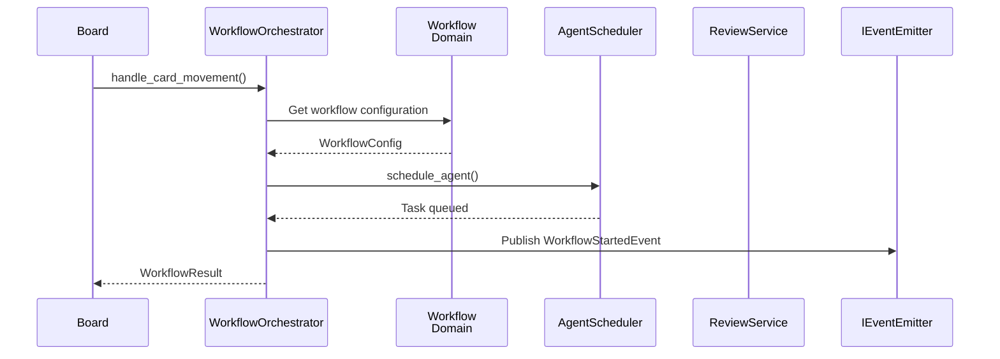
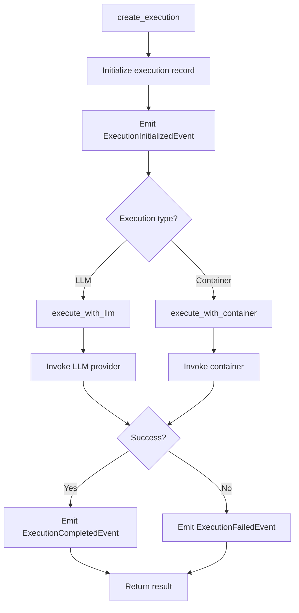

---
required_sections:
  - "## Overview"
  - "## Service Catalog"
  - "## Responsibility Matrix"
  - "## Port Dependencies"
  - "## Event Flows"
  - "## Orchestration Patterns"
applies_to: "documentation/architecture/application-services/services.md"
---

# Application Services Catalog

## Overview

The application services layer contains **22 services** that orchestrate domain logic and coordinate interactions with external systems through ports. Each service implements one or more high-level business capabilities by receiving commands from input ports, invoking domain logic, calling output ports, and emitting domain events.

Services are organized into six functional groups:

1. **Workflow Orchestration** — Coordinate workflow execution and stage progression
2. **Execution Management** — Manage agent execution lifecycle
3. **Review & Quality** — Handle code review cycles and quality checks
4. **Configuration & State** — Manage system configuration and persistence
5. **Infrastructure & Recovery** — Handle cross-cutting concerns and failure recovery
6. **Observability & Queries** — Provide visibility and query interfaces

All services are:
- **Async-first**: All public methods use `async`/`await`
- **Event-driven**: Emit domain events for all state changes
- **Port-dependent**: Use port interfaces, never direct external system calls
- **Transaction-safe**: Rely on event sourcing for consistency

## Service Catalog

### Workflow Orchestration Services (4 services)

#### 1. WorkflowOrchestrator

**File**: `src/codetoreum/application/workflow_orchestrator.py`

**Responsibility**: Manages the complete workflow lifecycle from card movement through agent completion and next-stage routing.

**Purpose**: Coordinates workflow execution by responding to board state changes, handling execution completion, processing review outcomes, and routing work items to appropriate next stages.

**Port Dependencies**:
- [`IBoardService`](../ports/output/board-management.md) — Read board state, move items to columns
- [`ITicketSystem`](../ports/output/core-system.md) — Fetch and update work item details
- [`IEventStore`](../ports/output/infrastructure-services.md) — Persist execution history
- `IConversationalLoopService` — Manage feedback loops (input port)
- `IWorkflowConfigService` — Retrieve workflow definitions
- [`IEventEmitter`](../ports/output/infrastructure-services.md) — Publish domain events

**Domain Dependencies**:
- `WorkItem` aggregate
- `Workflow` aggregate
- `WorkflowRun` aggregate
- Domain events: `WorkflowStartedEvent`, `WorkflowStageAdvancedEvent`, `WorkflowCompletedEvent`

**Service Dependencies**:
- `AgentScheduler` — Queue agent executions
- `ReviewService` — Manage code reviews
- `ExecutionService` — Track execution lifecycle

**Key Methods**:

```python
async def handle_card_movement(
    self,
    event: CardMovedEvent,
) -> WorkflowResult:
    """Handle column movement - start workflow or progress stage."""

async def handle_stage_completion(
    self,
    event: StageCompletedEvent,
) -> WorkflowResult:
    """Process stage completion - queue review or auto-advance."""

async def handle_review_cycle_completion(
    self,
    event: ReviewCycleCompletedEvent,
) -> WorkflowResult:
    """Route workflow after review approval/rejection."""

async def handle_feedback(
    self,
    event: FeedbackEvent,
) -> None:
    """Process human feedback on agent output."""
```

**Events Emitted**:
- `WorkflowStartedEvent` — New workflow execution began
- `WorkflowStageAdvancedEvent` — Advanced to next stage
- `WorkflowCompletedEvent` — Workflow finished (success/failure)
- `RoutingDecision` — Internal routing decision
- `ProgressionDecision` — Stage progression decision

**Error Handling**: Validates all inputs before execution. If stage transitions violate workflow rules, throws `WorkflowError`. If dependent services fail, emits `WorkflowFailedEvent` and leaves workflow in recoverable state.

**Workflow**:



#### 2. ConversationalLoopOrchestrator

**File**: `src/codetoreum/application/conversational_loop_orchestrator.py`

**Responsibility**: Orchestrates multi-turn dialogue between AI agents and human reviewers through comment threads.

**Purpose**: Manages feedback loops where agents engage in conversations with humans, maintaining session state and responding to comments.

**Port Dependencies**:
- [`IDiscussionAdapter`](../ports/output/code-review.md) — Read/write discussion comments
- [`IBoardService`](../ports/output/board-management.md) — Move items between columns
- [`ILLMProvider`](../ports/output/core-system.md) — Generate agent responses
- [`IEventEmitter`](../ports/output/infrastructure-services.md) — Publish events

**Domain Dependencies**:
- `ConversationalLoopSession` aggregate
- `ConversationTurn` value object
- Domain events: `ConversationalLoopStartedEvent`, `FeedbackListeningStartedEvent`, `AgentResponsePostedEvent`

**Key Methods**:

```python
async def initialize_loop(
    self,
    work_item_id: str,
    agent_id: str,
    context: ExecutionContext,
) -> ConversationalLoopSession:
    """Start conversational feedback loop."""

async def handle_comment_event(
    self,
    event: CommentNeedsResponseEvent,
) -> None:
    """Process comment requiring agent response."""

async def handle_column_change_event(
    self,
    event: WorkItemColumnChangedEvent,
) -> None:
    """Manage column transitions in conversational context."""

async def cleanup_loop(
    self,
    session_id: str,
) -> None:
    """Terminate feedback loop session."""
```

**Events Emitted**:
- `ConversationalLoopStartedEvent` — Dialogue initiated
- `FeedbackListeningStartedEvent` — Ready to receive comments
- `AgentResponsePostedEvent` — Agent posted response
- `FeedbackListeningStoppedEvent` — Dialogue terminated

#### 3. PipelineManager

**File**: `src/codetoreum/application/pipeline_manager.py`

**Responsibility**: Orchestrates pipeline execution with sequential stage progression and checkpoint-based recovery.

**Purpose**: Executes complete pipelines by sequencing stages, checking dependencies, and enabling crash recovery through state checkpointing.

**Port Dependencies**:
- `IPipelineConfig` — Retrieve pipeline definitions
- `IPipelineExecutor` — Execute individual stages
- `IEventEmitter` — Publish events

**Key Methods**:

```python
async def execute_pipeline(
    self,
    pipeline_id: str,
    work_item_id: str,
    context: ExecutionContext,
) -> PipelineResult:
    """Execute complete pipeline with stage sequencing."""

async def execute_stage(
    self,
    stage_id: str,
    context: ExecutionContext,
) -> StageResult:
    """Execute individual pipeline stage."""

async def checkpoint(
    self,
    stage_id: str,
    state: dict,
) -> None:
    """Save pipeline state at stage boundaries."""

async def recover(
    self,
    pipeline_id: str,
) -> PipelineResult:
    """Restore pipeline from checkpoint."""
```

**Events Emitted**:
- `PipelineStageStartedEvent` — Stage execution began
- `PipelineStageCompletedEvent` — Stage finished successfully
- `PipelineStageFailedEvent` — Stage execution failed
- `PipelineCompletedEvent` — Entire pipeline finished

#### 4. MultiProjectOrchestrator

**File**: `src/codetoreum/application/multi_project_orchestrator.py`

**Responsibility**: Coordinates workflow execution across multiple independent projects with per-project error isolation.

**Purpose**: Manages orchestration of multiple projects concurrently, isolating failures to prevent cascading issues.

**Port Dependencies**:
- `IProjectRegistry` — List enabled projects
- `IProjectConfiguration` — Per-project configuration

**Service Dependencies**:
- `WorkflowOrchestrator` — Per-project orchestration

**Key Methods**:

```python
async def start(self) -> None:
    """Begin orchestration of all projects."""

async def stop(self) -> None:
    """Gracefully terminate orchestration."""

async def run_orchestration_cycle(self) -> None:
    """Execute single cycle across all projects."""

async def get_project_status(self, project_id: str) -> ProjectStatus:
    """Retrieve project state."""

async def list_enabled_projects(self) -> list[str]:
    """List active projects."""
```

**Events Emitted**:
- `OrchestrationCycleCompletedEvent` — One cycle completed

---

### Execution Management Services (4 services)

#### 5. ExecutionService

**File**: `src/codetoreum/application/execution_service.py`

**Responsibility**: Manages complete agent execution lifecycle from initialization through completion or failure.

**Purpose**: Orchestrates agent execution by creating execution records, starting runs, invoking LLM or container execution, capturing output, and handling failures.

**Port Dependencies**:
- [`ILLMProvider`](../ports/output/core-system.md) — Execute LLM-based agents
- [`IContainer`](../ports/output/core-system.md) — Execute containerized agents
- [`IRepository`](../ports/output/core-system.md) — Access code repositories
- [`IStorage`](../ports/output/infrastructure-services.md) — Store execution artifacts
- [`IEventStore`](../ports/output/infrastructure-services.md) — Persist execution records
- [`IEventEmitter`](../ports/output/infrastructure-services.md) — Publish events

**Domain Dependencies**:
- `AgentExecution` aggregate
- `ExecutionOutput` value object
- Domain events: `ExecutionInitialized`, `ExecutionStarted`, `ExecutionCompleted`, `ExecutionFailed`, `ExecutionTimeout`

**Service Dependencies**:
- `ContextBuilder` — Prepare execution contexts
- `WorkspaceRouter` — Route to workspace

**Key Methods**:

```python
async def create_execution(
    self,
    agent_id: str,
    work_item_id: str,
    context: ExecutionContext,
) -> AgentExecution:
    """Initialize new execution record."""

async def start_execution(
    self,
    execution_id: str,
) -> AgentExecution:
    """Begin execution workflow."""

async def execute_with_llm(
    self,
    execution_id: str,
) -> ExecutionServiceResult:
    """Run execution with LLM inference."""

async def execute_with_container(
    self,
    execution_id: str,
) -> ExecutionServiceResult:
    """Run execution in container."""

async def cancel_execution(
    self,
    execution_id: str,
) -> AgentExecution:
    """Terminate active execution."""

async def get_execution_logs(
    self,
    execution_id: str,
) -> list[LogEntry]:
    """Retrieve execution output logs."""

async def stream_execution_logs(
    self,
    execution_id: str,
) -> AsyncIterator[LogEntry]:
    """Stream logs in real-time."""
```

**Events Emitted**:
- `ExecutionInitializedEvent` — Execution record created
- `ExecutionStartedEvent` — Execution began running
- `ExecutionCompletedEvent` — Execution finished successfully
- `ExecutionFailedEvent` — Execution encountered error
- `ExecutionTimeoutEvent` — Execution exceeded timeout

**Error Handling**: Validates all inputs. Retries transient errors with exponential backoff. If cleanup fails, logs error but completes execution. Captures all output before failure.

**Workflow**:



#### 6. AgentScheduler

**File**: `src/codetoreum/application/agent_scheduler.py`

**Responsibility**: Manages agent execution scheduling with priority-based queuing and resource availability checking.

**Purpose**: Queues agent executions considering priorities, available resources, and rate limits.

**Port Dependencies**:
- `ITaskQueue` — Persist task queue
- `IResourceMonitor` — Check resource availability
- `IRateLimiter` — Enforce rate limits
- `IProjectConfiguration` — Per-project config
- `IEventEmitter` — Publish events

**Domain Dependencies**:
- `Task` value object
- Domain events: `TaskQueued`, `TaskScheduled`

**Service Dependencies**:
- `ExecutionService` — Invoke execution

**Key Methods**:

```python
async def schedule(
    self,
    agent_id: str,
    work_item_id: str,
    priority: WorkItemPriority,
    context: ExecutionContext,
) -> Task:
    """Enqueue task with resource and rate limit checking."""

async def can_schedule(self) -> bool:
    """Determine if scheduling is possible based on resources."""

async def get_queue_depth(self) -> int:
    """Return current queue length."""

async def dequeue_next(self) -> Task | None:
    """Retrieve next task from queue."""
```

**Events Emitted**:
- `TaskQueued` — Task added to queue
- `TaskScheduled` — Task ready for execution

#### 7. ContextBuilder

**File**: `src/codetoreum/application/context_builder.py`

**Responsibility**: Building execution contexts with workspace preparation and code retrieval.

**Purpose**: Creates the contextual information (issue details, code snippets, previous output) that agents need for execution.

**Port Dependencies**:
- [`ITicketSystem`](../ports/output/core-system.md) — Fetch work item details
- [`IRepository`](../ports/output/core-system.md) — Retrieve code snippets
- [`IStorage`](../ports/output/infrastructure-services.md) — Store context files

**Domain Dependencies**:
- `ExecutionContext` aggregate
- `ContextFile` value object

**Key Methods**:

```python
async def build_execution_context(
    self,
    work_item_id: str,
    agent_id: str,
) -> ExecutionContext:
    """Create context for agent execution."""

async def fetch_work_item_details(
    self,
    work_item_id: str,
) -> WorkItemDetails:
    """Retrieve work item information."""

async def build_workspace_context(
    self,
    work_item_id: str,
    agent_id: str,
) -> WorkspaceContextResult:
    """Prepare workspace files and structure."""

async def write_context_files(
    self,
    workspace_id: str,
    files: list[ContextFile],
) -> None:
    """Write context files to workspace."""

async def cleanup_workspace(
    self,
    workspace_id: str,
) -> None:
    """Clean up execution workspace."""
```

#### 8. WorkspaceRouter

**File**: `src/codetoreum/application/workspace_router.py`

**Responsibility**: Routes execution requests to appropriate workspace handlers and manages file mounting.

**Purpose**: Dispatches executions to workspace implementations and manages container context preparation.

**Port Dependencies**:
- [`IContainer`](../ports/output/core-system.md) — Manage container workspaces
- [`IStorage`](../ports/output/infrastructure-services.md) — Store workspace state

**Service Dependencies**:
- `ContextBuilder` — Prepare contexts
- `ExecutionService` — Access execution details

**Key Methods**:

```python
async def prepare_workspace(
    self,
    execution_id: str,
    context: ExecutionContext,
) -> WorkspacePreparationResult:
    """Prepare container workspace."""

async def finalize_workspace(
    self,
    execution_id: str,
) -> WorkspaceFinalizationResult:
    """Clean up workspace after execution."""

async def mount_files(
    self,
    workspace_id: str,
    files: list[ContextFile],
) -> None:
    """Mount context files into container."""
```

---

### Review & Quality Services (3 services)

#### 9. ReviewService

**File**: `src/codetoreum/application/review_service.py`

**Responsibility**: Orchestrates maker-checker code review cycles with feedback collection and approval tracking.

**Purpose**: Manages complete review cycles including iteration management, feedback submission, and completion decisions.

**Port Dependencies**:
- [`ICodeReviewService`](../ports/output/code-review.md) — Create/manage code reviews
- [`IDiscussionAdapter`](../ports/output/code-review.md) — Manage review discussions
- [`IEventEmitter`](../ports/output/infrastructure-services.md) — Publish events

**Domain Dependencies**:
- `ReviewCycle` aggregate
- `ReviewFeedback` value object
- Domain events: `ReviewCycleCreated`, `ReviewIterationStarted`, `ReviewCycleFeedbackSubmitted`, `ReviewCycleApproved`, `ReviewCycleRejected`, `ReviewCycleEscalated`

**Key Methods**:

```python
async def create_review_cycle(
    self,
    work_item_id: str,
    maker_agent_id: str,
    reviewer_agent_id: str,
    config: ReviewConfig,
) -> ReviewCycle:
    """Initialize new review cycle."""

async def start_iteration(
    self,
    cycle_id: str,
) -> ReviewIteration:
    """Begin review iteration."""

async def submit_review(
    self,
    cycle_id: str,
    feedback: ReviewFeedback,
) -> ReviewCycle:
    """Process review feedback."""

async def should_escalate(
    self,
    cycle_id: str,
) -> bool:
    """Determine escalation necessity."""

async def complete_cycle(
    self,
    cycle_id: str,
    outcome: ReviewOutcome,
) -> ReviewCycle:
    """Finalize review cycle."""

async def get_review_status(
    self,
    cycle_id: str,
) -> ReviewStatus:
    """Return current review state."""
```

**Events Emitted**:
- `ReviewCycleCreatedEvent` — New review started
- `ReviewIterationStartedEvent` — Iteration began
- `ReviewCycleFeedbackSubmittedEvent` — Feedback received
- `ReviewCycleApprovedEvent` — Review approved
- `ReviewCycleRejectedEvent` — Review rejected
- `ReviewCycleEscalatedEvent` — Escalated to human

**Error Handling**: Validates max iterations and feedback format. If reviewer becomes unavailable, escalates to human.

#### 10. FeedbackProcessor

**File**: `src/codetoreum/application/feedback_processor.py`

**Responsibility**: Parses review feedback into structured data and extracts actionable items.

**Purpose**: Converts reviewer comments into structured feedback that maker agents can action.

**Port Dependencies**:
- [`IStorage`](../ports/output/infrastructure-services.md) — Store parsed feedback

**Key Methods**:

```python
async def parse_review_output(
    self,
    review_text: str,
    format: ReviewFormat = ReviewFormat.FREE_TEXT,
) -> StructuredFeedback:
    """Convert review text to structured feedback."""

async def extract_actionable_items(
    self,
    feedback: StructuredFeedback,
) -> list[ActionableItem]:
    """Identify issues, fixes, and escalations."""

async def format_feedback_for_maker(
    self,
    feedback: StructuredFeedback,
) -> str:
    """Prepare feedback for maker review."""
```

#### 11. AgentExecutionRecoveryService

**File**: `src/codetoreum/application/agent_execution_recovery_service.py`

**Responsibility**: Handles recovery from agent execution failures with dead letter queue tracking.

**Purpose**: Processes execution failures, tracks unrecoverable failures, and detects stuck locks.

**Port Dependencies**:
- [`IFailedEventStore`](../ports/output/infrastructure-services.md) — Persist failed events
- [`IPipelineLockService`](../ports/output/board-management.md) — Check lock status
- [`IEventEmitter`](../ports/output/infrastructure-services.md) — Publish events

**Domain Dependencies**:
- Domain events: `WorkItemDeadLetterQueuedEvent`, `LockStuckEvent`, `WorkflowFailedEvent`

**Key Methods**:

```python
async def handle_completion_callback_failure(
    self,
    execution_id: str,
    error: Exception,
) -> None:
    """Process callback failures and queue dead letter events."""

async def handle_agent_execution_failure(
    self,
    execution_id: str,
    error: Exception,
) -> None:
    """Manage agent execution failures with lock stuck detection."""

async def get_failed_event_store_stats(self) -> FailureStats:
    """Retrieve statistics on failed events."""
```

**Events Emitted**:
- `WorkItemDeadLetterQueuedEvent` — Unrecoverable failure recorded
- `LockStuckEvent` — Lock held too long
- `WorkflowFailedEvent` — Workflow failure

---

### Configuration & State Services (4 services)

#### 12. ConfigurationService

**File**: `src/codetoreum/application/configuration_service.py`

**Responsibility**: Manages project, agent, and pipeline configuration with validation and versioning.

**Purpose**: Provides configuration management with change tracking and event emission.

**Port Dependencies**:
- [`IConfigStore`](../ports/output/lifecycle-services.md) — Persist configuration
- `IValidator` — Validate configuration
- [`IEventEmitter`](../ports/output/infrastructure-services.md) — Publish events

**Key Methods**:

```python
async def update_project_config(
    self,
    project_id: str,
    config: ProjectConfig,
) -> ProjectConfig:
    """Update project-level configuration."""

async def update_agent_config(
    self,
    agent_id: str,
    config: AgentConfig,
) -> AgentConfig:
    """Update agent-level configuration."""

async def update_pipeline_config(
    self,
    pipeline_id: str,
    config: PipelineConfig,
) -> PipelineConfig:
    """Update pipeline configuration."""

async def add_environment_variable(
    self,
    project_id: str,
    key: str,
    value: str,
    sensitive: bool = False,
) -> EnvironmentVariable:
    """Manage environment variables."""

async def mount_command(
    self,
    command_name: str,
    definition: CommandDefinition,
) -> None:
    """Register custom commands."""

async def mount_subagent(
    self,
    subagent_name: str,
    definition: SubAgentDefinition,
) -> None:
    """Register sub-agents."""
```

**Events Emitted**:
- `ProjectConfigUpdated` — Project config changed
- `AgentConfigUpdated` — Agent config changed
- `PipelineConfigUpdated` — Pipeline config changed
- `EnvironmentVariableChanged` — Env var changed
- `CommandMounted` — Command registered
- `CommandUnmounted` — Command unregistered
- `SubAgentMounted` — Sub-agent registered
- `SubAgentUnmounted` — Sub-agent unregistered

#### 13. WorkItemService

**File**: `src/codetoreum/application/work_item_service.py`

**Responsibility**: Work item management using event sourcing for complete state reconstruction.

**Purpose**: Manages work item lifecycle with full audit trail through event sourcing.

**Port Dependencies**:
- [`IEventStore`](../ports/output/infrastructure-services.md) — Persist work item events
- [`ITicketSystem`](../ports/output/core-system.md) — Sync with external system
- [`IEventEmitter`](../ports/output/infrastructure-services.md) — Publish events

**Domain Dependencies**:
- `WorkItem` aggregate
- Domain events: `WorkItemCreated`, `WorkItemUpdated`, `WorkItemDeleted`, `WorkItemAssigned`, `WorkItemLabelsUpdated`, `WorkItemPriorityUpdated`, `WorkItemWorkflowAttached`, `WorkItemStageUpdated`

**Key Methods**:

```python
async def create_work_item(
    self,
    project_id: str,
    title: str,
    description: str,
) -> WorkItem:
    """Initialize new work item."""

async def update_work_item(
    self,
    work_item_id: str,
    **updates,
) -> WorkItem:
    """Modify work item properties."""

async def delete_work_item(self, work_item_id: str) -> None:
    """Remove work item."""

async def assign_agent(
    self,
    work_item_id: str,
    agent_id: str,
) -> WorkItem:
    """Assign agent to work item."""

async def update_labels(
    self,
    work_item_id: str,
    labels: list[str],
) -> WorkItem:
    """Manage work item labels."""

async def update_priority(
    self,
    work_item_id: str,
    priority: WorkItemPriority,
) -> WorkItem:
    """Set work item priority."""

async def attach_workflow(
    self,
    work_item_id: str,
    workflow_id: str,
) -> WorkItem:
    """Link workflow to work item."""

async def update_stage(
    self,
    work_item_id: str,
    stage_id: str,
) -> WorkItem:
    """Advance workflow stage."""

async def get_work_item(self, work_item_id: str) -> WorkItem:
    """Retrieve single work item."""

async def list_work_items(
    self,
    project_id: str,
    filters: QueryFilters = None,
) -> list[WorkItem]:
    """Query multiple work items."""

async def search_work_items(
    self,
    query: str,
    project_id: str = None,
) -> list[WorkItem]:
    """Search work items."""

async def get_work_item_history(
    self,
    work_item_id: str,
) -> list[DomainEvent]:
    """Retrieve event history."""

async def count_work_items(
    self,
    project_id: str,
) -> int:
    """Return work item count."""
```

**Events Emitted**: All WorkItem* events

**Error Handling**: Event sourcing provides automatic conflict detection. Optimistic concurrency control rejects concurrent updates.

#### 14. MetricsService

**File**: `src/codetoreum/application/metrics_service.py`

**Responsibility**: Provides observability into system health, performance, and metrics.

**Purpose**: Aggregates metrics from all components to provide system-wide visibility.

**Port Dependencies**:
- [`IMetrics`](../ports/output/infrastructure-services.md) — Query metrics backend
- `IHealthMonitor` — Check component health

**Key Methods**:

```python
async def get_system_health(self) -> SystemHealth:
    """Overall system status."""

async def get_component_health(
    self,
    component_name: str,
) -> ComponentHealth:
    """Individual component status."""

async def get_performance_metrics(self) -> PerformanceMetrics:
    """Execution performance data."""

async def get_resilience_metrics(self) -> ResilienceMetrics:
    """Failure and recovery statistics."""

async def get_integration_status(self) -> IntegrationStatus:
    """External service status."""

async def get_simulation_mode_info(self) -> SimulationModeInfo:
    """Test environment information."""

async def get_metric_time_series(
    self,
    metric_name: str,
    start_time: datetime,
    end_time: datetime,
) -> list[MetricPoint]:
    """Historical metric data."""

async def get_api_endpoint_metrics(self) -> dict:
    """API usage metrics."""

async def get_agent_execution_metrics(self) -> dict:
    """Agent-specific metrics."""

async def get_repair_cycle_metrics(self) -> dict:
    """Repair cycle analytics."""
```

#### 15. PipelineLockService / IQueuedPipelineLockService

**File**: `src/codetoreum/application/pipeline_lock_service.py`

**Responsibility**: Managing queued pipeline locks with position-based queue ordering.

**Purpose**: Prevents concurrent pipeline execution while maintaining fair FIFO queue ordering.

**Port Dependencies**:
- `ILockStore` — Persist lock state
- [`IEventEmitter`](../ports/output/infrastructure-services.md) — Publish lock events

**Domain Dependencies**:
- `LockToken` value object
- `QueueEntry` value object
- Domain events: `LockAcquiredEvent`, `LockReleasedEvent`

**Key Methods**:

```python
async def try_acquire_lock(
    self,
    project_id: str,
    resource_id: str,
    ttl_seconds: int = 300,
) -> LockAcquisitionResult:
    """Attempt to acquire or queue lock."""

async def release_lock(
    self,
    lock_token: LockToken,
) -> LockReleaseResult:
    """Release held lock and advance queue."""

async def get_queue_state(
    self,
    resource_id: str,
) -> PipelineQueueState:
    """Return current queue configuration."""

async def update_queue_positions(
    self,
    resource_id: str,
) -> None:
    """Update queue position tracking."""
```

**Events Emitted**:
- `LockAcquiredEvent` — Lock acquired
- `LockReleasedEvent` — Lock released

---

### Infrastructure & Recovery Services (3 services)

#### 16. ContainerRecoveryService

**File**: `src/codetoreum/application/container_recovery_service.py`

**Responsibility**: Orchestrates recovery/cleanup of containers at orchestrator startup.

**Purpose**: Assesses container state and recovers or cleans up containers with bounded parallelism.

**Port Dependencies**:
- [`IContainer`](../ports/output/core-system.md) — Query and manage containers
- [`IEventEmitter`](../ports/output/infrastructure-services.md) — Publish events

**Key Methods**:

```python
async def recover_or_cleanup_containers(
    self,
    max_concurrent: int = 5,
) -> ContainerRecoveryCompletedEvent:
    """Main recovery orchestration with semaphore-based concurrency."""
```

**Events Emitted**:
- `ContainerRecoveredEvent` — Container recovered
- `ContainerKilledEvent` — Container cleaned up
- `ContainerRecoveryCompletedEvent` — Recovery finished

**Features**: Uses asyncio.Semaphore for bounded parallelism, preventing resource exhaustion during recovery.

#### 17. AuthenticationService

**File**: `src/codetoreum/application/authentication_service.py`

**Responsibility**: Handles user authentication, JWT token generation, and API key management.

**Purpose**: Manages user credentials, token lifecycle, and API access.

**Port Dependencies**:
- `IUserStore` — Persist user records
- `ITokenStore` — Store tokens
- [`IEventEmitter`](../ports/output/infrastructure-services.md) — Publish auth events

**Key Methods**:

```python
async def create_user(
    self,
    username: str,
    password: str,
    email: str,
) -> User:
    """Create new user with hashed credentials."""

async def login(
    self,
    username: str,
    password: str,
) -> TokenPair:
    """Authenticate user and generate tokens."""

async def validate_token(self, token: str) -> TokenPayload:
    """Verify JWT tokens."""

async def refresh_token(self, refresh_token: str) -> str:
    """Generate new access tokens from refresh tokens."""

async def create_api_key(
    self,
    user_id: str,
    name: str,
    expires_in_days: int | None = None,
) -> APIKey:
    """Create API keys with optional expiration."""

async def validate_api_key(self, key: str) -> APIKeyPayload:
    """Verify API key validity."""

async def revoke_api_key(self, key_id: str) -> None:
    """Deactivate API keys."""
```

**Features**: Bcrypt password hashing, JWT token management, API key lifecycle management.

#### 18. BoardPollingService

**File**: `src/codetoreum/application/board_polling_service.py`

**Responsibility**: Fallback polling service for webhook-less environments.

**Purpose**: Detects board state changes via polling when webhooks are unavailable.

**Port Dependencies**:
- [`IBoardService`](../ports/output/board-management.md) — Query board state
- [`IEventEmitter`](../ports/output/infrastructure-services.md) — Publish change events

**Key Methods**:

```python
async def enable_board(self, board_id: str) -> None:
    """Start polling for specific board."""

async def disable_board(self, board_id: str) -> None:
    """Stop polling for board."""

async def start(self) -> None:
    """Begin polling cycle."""

async def stop(self) -> None:
    """Terminate polling."""
```

**Events Emitted**:
- `WorkItemColumnChangedEvent` — Column change detected

---

### Observability & Query Services (4 services)

#### 19. WorkflowRunQueryService

**File**: `src/codetoreum/application/workflow_run_query_service.py`

**Responsibility**: Query interface for workflow run information and history.

**Purpose**: Provides read-model access to workflow execution state without event sourcing overhead.

**Port Dependencies**:
- [`IEventStore`](../ports/output/infrastructure-services.md) — Query event history
- `IWorkflowRepository` — Query workflow runs

**Key Methods**:

```python
async def get_workflow_run(
    self,
    run_id: str,
) -> WorkflowRunDetails:
    """Retrieve single workflow run."""

async def list_workflow_runs(
    self,
    work_item_id: str,
    filters: QueryFilters = None,
) -> list[WorkflowRunSummary]:
    """Query workflow runs for work item."""

async def get_workflow_history(
    self,
    work_item_id: str,
) -> list[WorkflowEvent]:
    """Retrieve complete workflow history."""

async def search_workflow_runs(
    self,
    query: str,
    project_id: str = None,
) -> list[WorkflowRunSummary]:
    """Search workflow runs."""
```

#### 20. EventSequenceValidator

**File**: `src/codetoreum/application/event_sequence_validator.py`

**Responsibility**: Validates event sequences against expected patterns.

**Purpose**: Ensures event ordering follows business rules and supports testing and audit.

**Port Dependencies**: None (pure logic)

**Key Methods**:

```python
async def validate(
    self,
    events: list[DomainEvent],
    pattern: str,
) -> ValidationResult:
    """Check event sequence against pattern."""

def _parse_pattern(self, pattern: str) -> list[PatternElement]:
    """Parse pattern syntax (*, +, |, exact)."""

def _matches_pattern_element(
    self,
    event: DomainEvent,
    element: PatternElement,
) -> bool:
    """Validate element against pattern."""

async def create_audit_validation_result(
    self,
    events: list[DomainEvent],
    validation: ValidationResult,
) -> AuditRecord:
    """Generate audit trail of validation."""
```

**Pattern Operators**:
- `*` — Zero or more occurrences
- `+` — One or more occurrences
- `|` — Alternative (OR)
- Exact — Specific event type

#### 21. ExpectedSequenceRegistry

**File**: `src/codetoreum/application/expected_sequence_registry.py`

**Responsibility**: Defines canonical event sequences for workflow types.

**Purpose**: Provides reference patterns for event flow validation and testing.

**Key Methods**:

```python
def get_expected_sequence(self, workflow_type: str) -> str:
    """Retrieve sequence for type."""

def get_stage_execution_sequence(self) -> str:
    """Return stage pattern."""

def get_review_cycle_sequence(self) -> str:
    """Return review pattern."""

def get_repair_cycle_sequence(self) -> str:
    """Return repair pattern."""
```

**Canonical Sequences**:
- `WORKFLOW_LIFECYCLE` — Complete workflow progression
- `STAGE_EXECUTION` — Individual stage execution pattern
- `REVIEW_CYCLE` — Review cycle progression
- `REPAIR_CYCLE` — Repair iteration cycle

#### 22. RepairCycleCIIntegration

**File**: `src/codetoreum/application/repair_cycle_ci_integration.py`

**Responsibility**: Converts CI pipeline results to repair cycle format.

**Purpose**: Integrates CI pipeline checks with repair cycle aggregation.

**Port Dependencies**:
- [`ICIPipelineService`](../ports/output/domain-services.md) — Retrieve CI results
- [`IEventEmitter`](../ports/output/infrastructure-services.md) — Publish events

**Key Methods**:

```python
async def convert_ci_run_result_to_repair_test_result(
    self,
    ci_run: CIRun,
) -> RepairTestFailure:
    """Map CI failures to RepairTestFailure with file="ci" pattern."""
```

---

## Responsibility Matrix

| Service | Workflow | Config | State | Query | Exec | Review | Recovery |
|---------|----------|--------|-------|-------|------|--------|----------|
| WorkflowOrchestrator | ✓ | | | | | | |
| ConversationalLoopOrchestrator | ✓ | | | | | | |
| PipelineManager | ✓ | | | | | | |
| MultiProjectOrchestrator | ✓ | | | | | | |
| ExecutionService | | | | | ✓ | | |
| AgentScheduler | | | | | ✓ | | |
| ContextBuilder | | | | | ✓ | | |
| WorkspaceRouter | | | | | ✓ | | |
| ReviewService | | | | | | ✓ | |
| FeedbackProcessor | | | | | | ✓ | |
| AgentExecutionRecoveryService | | | | | | | ✓ |
| ConfigurationService | | ✓ | | | | | |
| WorkItemService | | | ✓ | | | | |
| MetricsService | | | | ✓ | | | |
| PipelineLockService | | | ✓ | | | | |
| ContainerRecoveryService | | | | | | | ✓ |
| AuthenticationService | | ✓ | | | | | |
| BoardPollingService | | | | | | | |
| WorkflowRunQueryService | | | | ✓ | | | |
| EventSequenceValidator | | | | ✓ | | | |
| ExpectedSequenceRegistry | | | | ✓ | | | |
| RepairCycleCIIntegration | | | | | | | ✓ |

## Port Dependencies

### Output Ports Used (Frequency)

- **IBoardService** — 4 services (WorkflowOrchestrator, ConversationalLoopOrchestrator, WorkItemService, BoardPollingService)
- **IEventStore** — 5 services (ExecutionService, WorkItemService, WorkflowRunQueryService, EventSequenceValidator, RepairCycleCIIntegration)
- **IEventEmitter** — All 22 services (publish domain events)
- **ITicketSystem** — 5 services (WorkflowOrchestrator, ContextBuilder, WorkItemService, ReviewService, FeedbackProcessor)
- **ILLMProvider** — 2 services (ExecutionService, ConversationalLoopOrchestrator)
- **IContainer** — 3 services (ExecutionService, WorkspaceRouter, ContainerRecoveryService)
- **IRepository** — 2 services (ContextBuilder, ExecutionService)
- **IStorage** — 5 services (ExecutionService, ContextBuilder, WorkspaceRouter, FeedbackProcessor, MetricsService)
- **ICodeReviewService** — 1 service (ReviewService)
- **IDiscussionAdapter** — 2 services (ConversationalLoopOrchestrator, ReviewService)
- **IConfigStore** — ConfigurationService
- **IMetrics** — MetricsService
- **ILockStore** — PipelineLockService

### Input Port Dependencies

- **IConversationalLoopService** (input port) — WorkflowOrchestrator
- **IWorkflowConfigService** (input port) — WorkflowOrchestrator

## Event Flows

### Primary Event Flows

**1. Board Automation** (Trigger to Completion)

```
WorkItemColumnChangedEvent 
  → BoardEventHandler 
    → WorkflowOrchestrator.handle_card_movement()
      → AgentScheduler.schedule()
        → ExecutionService.create_execution()
          → ExecutionInitializedEvent
            → ExecutionEventHandler
              → ExecutionService.execute_with_*()
                → ExecutionCompletedEvent
                  → WorkflowEventHandler
                    → WorkflowOrchestrator.handle_stage_completion()
                      → ReviewService.create_review_cycle()
                        → ReviewCycleCreatedEvent
```

**2. Review Cycle** (Feedback Processing)

```
ReviewFeedbackSubmittedEvent
  → ReviewEventHandler
    → ReviewService.submit_review()
      → ReviewCycleApprovedEvent
        → WorkflowEventHandler
          → WorkflowOrchestrator.handle_review_cycle_completion()
            → WorkItemColumnChangedEvent
```

**3. Execution Failure Recovery**

```
ExecutionFailedEvent
  → ExecutionEventHandler
    → AgentExecutionRecoveryService.handle_agent_execution_failure()
      → LockStuckEvent (if lock held too long)
      → WorkItemDeadLetterQueuedEvent (if unrecoverable)
```

**4. Conversational Loop** (Interactive Feedback)

```
CommentNeedsResponseEvent
  → ConversationalLoopOrchestrator.handle_comment_event()
    → ILLMProvider (generate response)
      → AgentResponsePostedEvent
        → WorkflowOrchestrator (advance if approved)
```

## Orchestration Patterns

### Pattern 1: Event-Driven Routing

Services react to domain events rather than being directly called, enabling loose coupling and asynchronous processing.

### Pattern 2: Service Composition

Higher-level services (WorkflowOrchestrator) compose lower-level services (AgentScheduler, ReviewService) to implement complex workflows.

### Pattern 3: Event Sourcing

WorkItemService reconstructs state from event history, providing complete audit trail and enabling time-travel debugging.

### Pattern 4: Dispatch Pattern

Separate handler for dispatch (pr_review_cycle_dispatch_handler) from outcome routing (pr_review_cycle_event_handler), enabling testability and clarity.

### Pattern 5: Bounded Parallelism

ContainerRecoveryService uses asyncio.Semaphore to limit concurrent operations, preventing resource exhaustion.

### Pattern 6: Checkpoint-Based Recovery

PipelineManager saves state at stage boundaries, enabling recovery after crash without re-executing completed stages.

### Pattern 7: Configuration Management

ConfigurationService centralizes all project/agent/pipeline configuration with change tracking and event emission.

---

## Related Documentation

- [Domain Models](../domain/models.md) — Domain aggregates and value objects
- [Domain Events](../domain/events.md) — Event catalog and dependencies
- [Output Ports](../ports/output/) — Port interfaces used by services
- [Event Handlers](./event-handlers.md) — Event handler documentation
- [Infrastructure](../infrastructure/) — Event bus, resilience, observability
