---
required_sections:
  - "## Overview"
  - "## Event Catalog by Bounded Context"
  - "## Event-Flow Diagrams"
  - "## Event Sourcing and Replay"
applies_to: "documentation/architecture/domain/events.md"
---

# Domain Events Catalog

## Overview

Domain events are immutable records of significant state changes in the system. The system defines **245 event classes** across **20 source files**, organized into **18 bounded contexts**. This includes:
- **167 modern event classes** (frozen dataclasses): Across 19 files in the `domain/events/` directory
- **74 legacy event classes** (older DomainEvent base class): In `legacy_domain_events.py`
- **4 project context event classes** (legacy style): In `project_context.py`

Events are frozen dataclasses (`@dataclass(frozen=True)`), making them immutable once created—a critical requirement for maintaining an audit trail and enabling event sourcing.

Every significant state change in a domain model emits one or more events:
1. Domain model method is called
2. State change is validated against invariants
3. Domain event is created (immutable)
4. Event is persisted to event store
5. Event is published to event bus
6. Subscribers (event handlers) react to the event

Events enable:
- **Complete Audit Trail**: Every change is recorded immutably
- **Event Replay**: Reconstruct past state by replaying events
- **Decoupled Layers**: Application logic communicates through events, not direct calls
- **Multiple Subscribers**: One event can trigger multiple handler reactions
- **Time Travel**: Query system state at any point in time

---

## Event Catalog by Bounded Context

### Work Item Context

**File**: `work_item_events.py` (2 events)

The Work Item context manages the lifecycle of issues, tasks, and features flowing through the system.

```python
@dataclass(frozen=True)
class WorkItemCreatedEvent(CodetoreumEvent):
    """Emitted when a work item is created.
    
    Fired by: IWorkItemService.create() → application service
    Subscribers:
      - BoardHandler: Add item to board
      - MetricsHandler: Initialize metrics
      - AuditHandler: Log creation
    
    Attributes:
        work_item_id: ID of newly created work item
        project_id: Project containing the work item
        title: Work item title
        initial_column: Board column (if on board initially)
    """
    work_item_id: str = ""
    project_id: str = ""
    title: str = ""
    initial_column: str | None = None

@dataclass(frozen=True)
class WorkItemUpdatedEvent(CodetoreumEvent):
    """Emitted when a work item is updated (title, description, labels, etc.)
    
    Fired by: IWorkItemService.update() → application service
    Subscribers:
      - BoardHandler: Update board display
      - NotificationHandler: Notify watchers
      - AuditHandler: Log change
    
    Attributes:
        work_item_id: Work item being updated
        project_id: Project containing the work item
        updated_fields: Dictionary of changed fields
    """
    work_item_id: str = ""
    project_id: str = ""
    updated_fields: dict[str, Any] = field(default_factory=dict)
```

**Invariants Enforced**:
- Work item must have valid ID and title (validated in __post_init__)
- Project ID must be non-empty
- Only significant changes emit events (not timestamp-only updates)

**Event-Flow Diagram**:

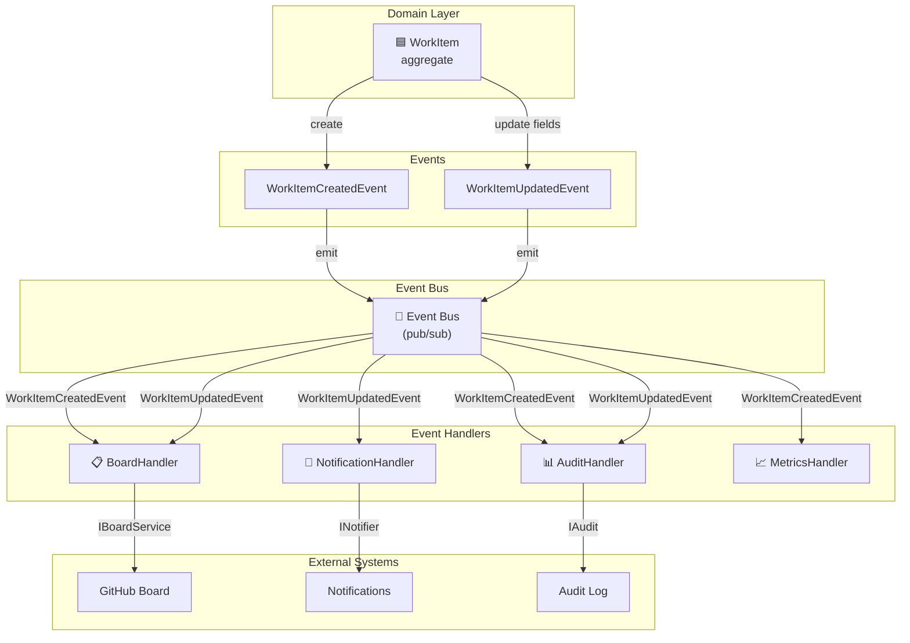
```mermaid
graph TB
    subgraph "Domain Layer"
        WI["🟦 WorkItem<br/>aggregate"]
    end
    
    subgraph "Events"
        WI -->|create| WI_CREATED["WorkItemCreatedEvent"]
        WI -->|update fields| WI_UPDATED["WorkItemUpdatedEvent"]
    end
    
    subgraph "Event Bus"
        BUS["📢 Event Bus<br/>(pub/sub)"]
        WI_CREATED -->|emit| BUS
        WI_UPDATED -->|emit| BUS
    end
    
    subgraph "Event Handlers"
        BH["📋 BoardHandler"]
        NH["📧 NotificationHandler"]
        AH["📊 AuditHandler"]
        MH["📈 MetricsHandler"]
    end
    
    subgraph "External Systems"
        BOARD["GitHub Board"]
        NOTIFY["Notifications"]
        AUDIT["Audit Log"]
    end
    
    BUS -->|WorkItemCreatedEvent| BH
    BUS -->|WorkItemCreatedEvent| MH
    BUS -->|WorkItemCreatedEvent| AH
    BUS -->|WorkItemUpdatedEvent| BH
    BUS -->|WorkItemUpdatedEvent| NH
    BUS -->|WorkItemUpdatedEvent| AH
    
    BH -->|IBoardService| BOARD
    NH -->|INotifier| NOTIFY
    AH -->|IAudit| AUDIT
```

---

### Board Context

**File**: `board_events.py` (4 events)

The Board context manages work item positioning on workflow boards (columns) and column SLA monitoring.

```python
@dataclass(frozen=True)
class WorkItemColumnChangedEvent(CodetoreumEvent):
    """Emitted when a work item moves between board columns.
    
    Fired by: IWorkflowService.transition_stage() → application → domain
    Subscribers:
      - BoardHandler: Update board position via IBoardService
      - SLAMonitor: Start/stop SLA timers
      - MetricsHandler: Record column entry time
      - NotificationHandler: Notify team of progression
    
    Attributes:
        work_item_id: Work item that moved
        project_id: Project containing the board
        from_column: Previous column name
        to_column: New column name
        timestamp: When move occurred
    """
    work_item_id: str = ""
    project_id: str = ""
    from_column: str = ""
    to_column: str = ""

@dataclass(frozen=True)
class WorkItemPositionChangedEvent(CodetoreumEvent):
    """Emitted when a work item's position changes within a column (ordering).
    
    Fired by: IBoardService.reorder_items() → external system adapter
    Subscribers:
      - BoardHandler: Update board display
      - QueueHandler: Update queue position tracking
    
    Attributes:
        work_item_id: Work item that moved
        project_id: Project containing the board
        column: Column where item is located
        old_position: Previous position index
        new_position: New position index
    """
    work_item_id: str = ""
    project_id: str = ""
    column: str = ""
    old_position: int = 0
    new_position: int = 0

@dataclass(frozen=True)
class BoardReconciledEvent(CodetoreumEvent):
    """Emitted when a board's structure is synchronized with workflow template.
    
    Fired by: IBoardService.reconcile() → application service
    Subscribers:
      - MetricsHandler: Record reconciliation
      - AuditHandler: Log board changes
    
    Attributes:
        project_id: Project containing the board
        board_id: Board being reconciled
        columns_added: List of new column names
        columns_removed: List of deleted column names
        columns_reordered: List of columns with new positions
    """
    project_id: str = ""
    board_id: str = ""
    columns_added: list[str] = field(default_factory=list)
    columns_removed: list[str] = field(default_factory=list)
    columns_reordered: list[str] = field(default_factory=list)

@dataclass(frozen=True)
class ColumnSLAExceededEvent(CodetoreumEvent):
    """Emitted when a work item exceeds SLA in a column.
    
    Fired by: SLAMonitor task (infrastructure)
    Subscribers:
      - NotificationHandler: Alert team
      - EscalationHandler: Move to escalation column if configured
      - MetricsHandler: Record SLA breach
    
    Attributes:
        work_item_id: Work item exceeding SLA
        project_id: Project containing the board
        column: Column where SLA was exceeded
        sla_seconds: SLA threshold that was exceeded
        time_in_column_seconds: Actual time spent in column
    """
    work_item_id: str = ""
    project_id: str = ""
    column: str = ""
    sla_seconds: int = 0
    time_in_column_seconds: int = 0
```

**Event-Flow Diagram**:

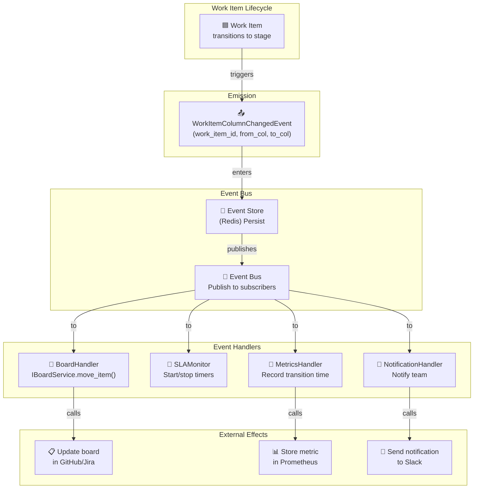
```mermaid
graph TB
    subgraph "Work Item Lifecycle"
        WI["🟦 Work Item<br/>transitions to stage"]
    end
    
    subgraph "Emission"
        EMIT["📤 WorkItemColumnChangedEvent<br/>(work_item_id, from_col, to_col)"]
    end
    
    subgraph "Event Bus"
        STORE["💾 Event Store<br/>(Redis) Persist"]
        PUB["📡 Event Bus<br/>Publish to subscribers"]
    end
    
    subgraph "Event Handlers"
        H1["🔷 BoardHandler<br/>IBoardService.move_item()"]
        H2["🔷 SLAMonitor<br/>Start/stop timers"]
        H3["🔷 MetricsHandler<br/>Record transition time"]
        H4["🔷 NotificationHandler<br/>Notify team"]
    end
    
    subgraph "External Effects"
        BOARD["📋 Update board<br/>in GitHub/Jira"]
        METRIC["📊 Store metric<br/>in Prometheus"]
        NOTIF["🔔 Send notification<br/>to Slack"]
    end
    
    WI -->|triggers| EMIT
    EMIT -->|enters| STORE
    STORE -->|publishes| PUB
    PUB -->|to| H1
    PUB -->|to| H2
    PUB -->|to| H3
    PUB -->|to| H4
    H1 -->|calls| BOARD
    H3 -->|calls| METRIC
    H4 -->|calls| NOTIF
```

---

### Execution Context

**File**: `execution_events.py` (1 event)

The Execution context tracks agent execution lifecycle events.

```python
@dataclass(frozen=True)
class ExecutionTimedOutEvent(CodetoreumEvent):
    """Emitted when an agent execution exceeds its timeout.
    
    Fired by: ExecutionService timeout monitor (infrastructure)
    Subscribers:
      - ExecutionHandler: Mark execution as TIMEOUT, release resources
      - NotificationHandler: Notify team of timeout
      - MetricsHandler: Record timeout metric
      - RepairCycleHandler: Possibly trigger repair cycle
    
    Attributes:
        execution_id: Execution that timed out
        agent_id: Agent that timed out
        work_item_id: Work item being executed
        timeout_seconds: Timeout threshold
    """
    execution_id: str = ""
    agent_id: str = ""
    work_item_id: str = ""
    timeout_seconds: int = 0
```

**Event-Flow Diagram**:

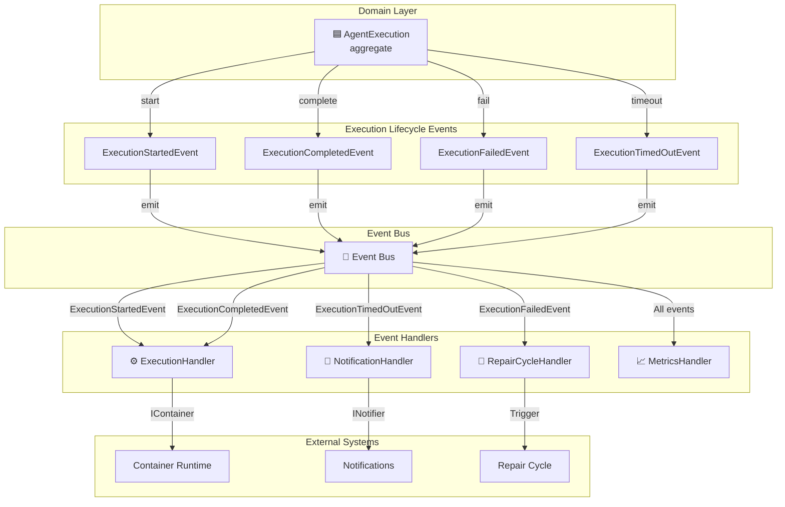
```mermaid
graph TB
    subgraph "Domain Layer"
        EXEC["🟦 AgentExecution<br/>aggregate"]
    end
    
    subgraph "Execution Lifecycle Events"
        EXEC -->|start| STARTED["ExecutionStartedEvent"]
        EXEC -->|complete| COMPLETED["ExecutionCompletedEvent"]
        EXEC -->|fail| FAILED["ExecutionFailedEvent"]
        EXEC -->|timeout| TIMEOUT["ExecutionTimedOutEvent"]
    end
    
    subgraph "Event Bus"
        BUS["📢 Event Bus"]
        STARTED -->|emit| BUS
        COMPLETED -->|emit| BUS
        FAILED -->|emit| BUS
        TIMEOUT -->|emit| BUS
    end
    
    subgraph "Event Handlers"
        EH["⚙️ ExecutionHandler"]
        NH["📧 NotificationHandler"]
        RCH["🔧 RepairCycleHandler"]
        MH["📈 MetricsHandler"]
    end
    
    subgraph "External Systems"
        CONTAINER["Container Runtime"]
        NOTIFY["Notifications"]
        REPAIR["Repair Cycle"]
    end
    
    BUS -->|ExecutionStartedEvent| EH
    BUS -->|ExecutionCompletedEvent| EH
    BUS -->|ExecutionFailedEvent| RCH
    BUS -->|ExecutionTimedOutEvent| NH
    BUS -->|All events| MH
    
    EH -->|IContainer| CONTAINER
    NH -->|INotifier| NOTIFY
    RCH -->|Trigger| REPAIR
```

---

### Review Context

**File**: `review_events.py` (2 events)

The Review context manages code review state and feedback.

```python
@dataclass(frozen=True)
class ReviewStatusChangedEvent(CodetoreumEvent):
    """Emitted when a code review's status changes.
    
    Fired by: ICodeReviewService.update_review() → adapter
    Subscribers:
      - ReviewHandler: Update review cycle state
      - NotificationHandler: Notify reviewers
      - MetricsHandler: Record review timing
    
    Attributes:
        review_id: Review being updated
        work_item_id: Work item under review
        old_status: Previous review status
        new_status: New review status
    """
    review_id: str = ""
    work_item_id: str = ""
    old_status: str = ""
    new_status: str = ""

@dataclass(frozen=True)
class ReviewCommentAddedEvent(CodetoreumEvent):
    """Emitted when a comment is added to a code review.
    
    Fired by: ICodeReviewService.add_comment() → adapter
    Subscribers:
      - ReviewHandler: Update review feedback
      - NotificationHandler: Notify other reviewers
    
    Attributes:
        review_id: Review being commented on
        comment_id: New comment ID
        author_id: Who left the comment
        body: Comment text
    """
    review_id: str = ""
    comment_id: str = ""
    author_id: str = ""
    body: str = ""
```

**Event-Flow Diagram**:

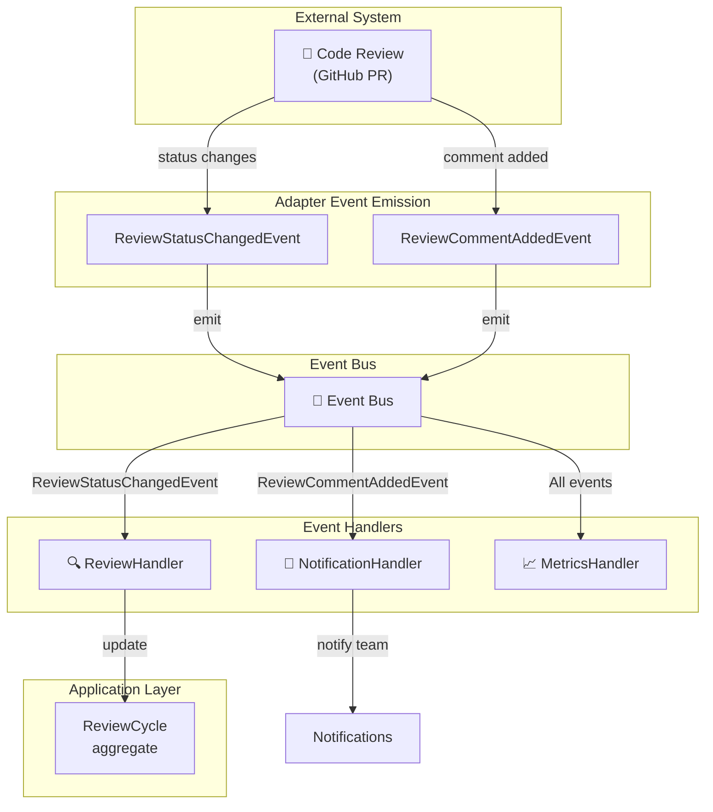
```mermaid
graph TB
    subgraph "External System"
        REVIEW["🔄 Code Review<br/>(GitHub PR)"]
    end
    
    subgraph "Adapter Event Emission"
        REVIEW -->|status changes| STATUS["ReviewStatusChangedEvent"]
        REVIEW -->|comment added| COMMENT["ReviewCommentAddedEvent"]
    end
    
    subgraph "Event Bus"
        BUS["📢 Event Bus"]
        STATUS -->|emit| BUS
        COMMENT -->|emit| BUS
    end
    
    subgraph "Event Handlers"
        RH["🔍 ReviewHandler"]
        NH["📧 NotificationHandler"]
        MH["📈 MetricsHandler"]
    end
    
    subgraph "Application Layer"
        RC["ReviewCycle<br/>aggregate"]
    end
    
    BUS -->|ReviewStatusChangedEvent| RH
    BUS -->|ReviewCommentAddedEvent| NH
    BUS -->|All events| MH
    
    RH -->|update| RC
    NH -->|notify team| NOTIFY["Notifications"]
```

---

### Review Cycle Context

**File**: `review_cycle_events.py` (7 events)

The Review Cycle context (domain layer) models maker-checker code review cycles with iteration and feedback.

```python
@dataclass(frozen=True)
class ReviewCycleStartedEvent(CodetoreumEvent):
    """Emitted when a new review cycle begins.
    
    Fired by: ReviewService.create_review_cycle() → domain
    Subscribers:
      - ReviewHandler: Initialize review state
      - NotificationHandler: Notify reviewers to start
      - MetricsHandler: Record review start time
    
    Attributes:
        review_cycle_id: New review cycle ID
        work_item_id: Item under review
        project_id: Project containing the item
        required_approvers: Number of approvals needed
    """
    review_cycle_id: str = ""
    work_item_id: str = ""
    project_id: str = ""
    required_approvers: int = 1

@dataclass(frozen=True)
class ReviewCycleIterationCompletedEvent(CodetoreumEvent):
    """Emitted when a review iteration completes (feedback collected).
    
    Fired by: ReviewCycle.complete_iteration() → domain
    Subscribers:
      - ReviewHandler: Check if approved/escalate if changes needed
      - NotificationHandler: Notify author of feedback
    
    Attributes:
        review_cycle_id: Review cycle
        iteration_number: Which iteration completed (1, 2, etc.)
        feedback_count: Number of reviewers who provided feedback
    """
    review_cycle_id: str = ""
    iteration_number: int = 0
    feedback_count: int = 0

@dataclass(frozen=True)
class ReviewCycleApprovedEvent(CodetoreumEvent):
    """Emitted when a review cycle is approved (sufficient positive feedback).
    
    Fired by: ReviewCycle.approve() → domain
    Subscribers:
      - WorkflowHandler: Advance work item to next stage
      - NotificationHandler: Notify team of approval
      - MetricsHandler: Record review completion time
    
    Attributes:
        review_cycle_id: Review cycle being approved
        work_item_id: Item that was approved
        project_id: Project
        approvers: List of reviewer IDs who approved
    """
    review_cycle_id: str = ""
    work_item_id: str = ""
    project_id: str = ""
    approvers: list[str] = field(default_factory=list)

@dataclass(frozen=True)
class ReviewCycleEscalatedToHumanEvent(CodetoreumEvent):
    """Emitted when review cycle is escalated to human for decision.
    
    Fired by: ReviewCycle.escalate() → domain
    Subscribers:
      - EscalationHandler: Notify human reviewer
      - MetricsHandler: Record escalation
    
    Attributes:
        review_cycle_id: Review cycle being escalated
        work_item_id: Item requiring escalation
        reason: Why escalation occurred
    """
    review_cycle_id: str = ""
    work_item_id: str = ""
    reason: str = ""

# ... 3 more events (HumanFeedbackReceivedEvent, MaxIterationsReachedEvent)
```

**Event-Flow Diagram**:

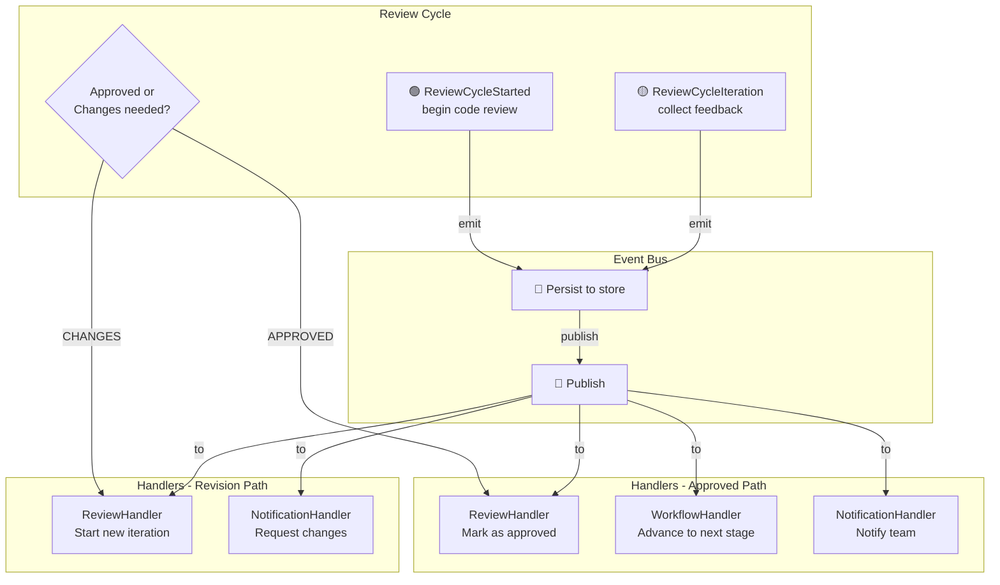
```mermaid
graph TB
    subgraph "Review Cycle"
        START["🟢 ReviewCycleStarted<br/>begin code review"]
        ITER["🟡 ReviewCycleIteration<br/>collect feedback"]
        DECISION{"Approved or<br/>Changes needed?"}
    end
    
    subgraph "Event Bus"
        STORE1["💾 Persist to store"]
        PUB1["📡 Publish"]
    end
    
    subgraph "Handlers - Approved Path"
        H_APP["ReviewHandler<br/>Mark as approved"]
        H_WF["WorkflowHandler<br/>Advance to next stage"]
        H_NOTIF["NotificationHandler<br/>Notify team"]
    end
    
    subgraph "Handlers - Revision Path"
        H_ITER["ReviewHandler<br/>Start new iteration"]
        H_NOTIF2["NotificationHandler<br/>Request changes"]
    end
    
    START -->|emit| STORE1
    STORE1 -->|publish| PUB1
    ITER -->|emit| STORE1
    DECISION -->|APPROVED| H_APP
    DECISION -->|CHANGES| H_ITER
    PUB1 -->|to| H_APP
    PUB1 -->|to| H_WF
    PUB1 -->|to| H_NOTIF
    PUB1 -->|to| H_ITER
    PUB1 -->|to| H_NOTIF2
```

---

### PR Review Cycle Context

**File**: `pr_review_cycle_events.py` (13 events)

PR Review Cycle handles the multi-phase code review process for pull requests.

```python
@dataclass(frozen=True)
class PRReviewCycleStartedEvent(CodetoreumEvent):
    """Emitted when a PR review cycle begins.
    
    Fired by: PRReviewService.start_review_cycle() → application
    Subscribers:
      - PRReviewHandler: Initialize PR review state
      - MetricsHandler: Record start time
    
    Attributes:
        pr_review_cycle_id: New review cycle ID
        work_item_id: Work item with PR
        pr_id: Pull request ID
        project_id: Project
    """
    pr_review_cycle_id: str = ""
    work_item_id: str = ""
    pr_id: str = ""
    project_id: str = ""

@dataclass(frozen=True)
class PRReviewCycleCodeReviewStartedEvent(CodetoreumEvent):
    """Emitted when code review phase starts (after auto-check phase).
    
    Attributes:
        pr_review_cycle_id: Review cycle
        pr_id: Pull request
    """
    pr_review_cycle_id: str = ""
    pr_id: str = ""

@dataclass(frozen=True)
class PRReviewCycleVerificationStartedEvent(CodetoreumEvent):
    """Emitted when verification phase starts (after code review).
    
    Attributes:
        pr_review_cycle_id: Review cycle
        pr_id: Pull request
    """
    pr_review_cycle_id: str = ""
    pr_id: str = ""

@dataclass(frozen=True)
class PRReviewCycleApprovedEvent(CodetoreumEvent):
    """Emitted when PR review cycle is approved and ready to merge.
    
    Fired by: PRReviewCycle.approve() → domain
    Subscribers:
      - MergeHandler: Merge PR if auto-merge enabled
      - NotificationHandler: Notify team
    
    Attributes:
        pr_review_cycle_id: Review cycle
        work_item_id: Work item
        pr_id: Pull request
        auto_merge: Whether to automatically merge
    """
    pr_review_cycle_id: str = ""
    work_item_id: str = ""
    pr_id: str = ""
    auto_merge: bool = False

```

**Event-Flow Diagram**:

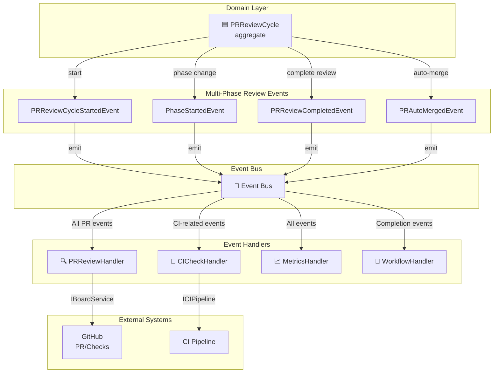
```mermaid
graph TB
    subgraph "Domain Layer"
        PRC["🟦 PRReviewCycle<br/>aggregate"]
    end
    
    subgraph "Multi-Phase Review Events"
        PRC -->|start| STARTED["PRReviewCycleStartedEvent"]
        PRC -->|phase change| PHASE["PhaseStartedEvent"]
        PRC -->|complete review| COMPLETED["PRReviewCompletedEvent"]
        PRC -->|auto-merge| MERGED["PRAutoMergedEvent"]
    end
    
    subgraph "Event Bus"
        BUS["📢 Event Bus"]
        STARTED -->|emit| BUS
        PHASE -->|emit| BUS
        COMPLETED -->|emit| BUS
        MERGED -->|emit| BUS
    end
    
    subgraph "Event Handlers"
        PRH["🔍 PRReviewHandler"]
        CIH["🔧 CICheckHandler"]
        MH["📈 MetricsHandler"]
        WFH["🔄 WorkflowHandler"]
    end
    
    subgraph "External Systems"
        GITHUB["GitHub<br/>PR/Checks"]
        CI["CI Pipeline"]
    end
    
    BUS -->|All PR events| PRH
    BUS -->|CI-related events| CIH
    BUS -->|All events| MH
    BUS -->|Completion events| WFH
    
    PRH -->|IBoardService| GITHUB
    CIH -->|ICIPipeline| CI
```

---

### Repair Cycle Context

**File**: `repair_cycle_events.py` (23 events)

Repair Cycle handles test-fix-verify cycles for failing tests.

```python
@dataclass(frozen=True)
class RepairCycleStartedEvent(CodetoreumEvent):
    """Emitted when a repair cycle begins (fixing failing tests).
    
    Fired by: RepairCycleService.start() → application
    Subscribers:
      - RepairHandler: Initialize repair state
      - MetricsHandler: Record start time
    
    Attributes:
        repair_cycle_id: New repair cycle ID
        work_item_id: Work item with failing tests
        test_failures: List of failing tests
    """
    repair_cycle_id: str = ""
    work_item_id: str = ""
    test_failures: list[str] = field(default_factory=list)

@dataclass(frozen=True)
class RepairCycleTestExecutionStartedEvent(CodetoreumEvent):
    """Emitted when repair cycle begins test execution.
    
    Attributes:
        repair_cycle_id: Repair cycle
        test_count: Number of tests to run
    """
    repair_cycle_id: str = ""
    test_count: int = 0

@dataclass(frozen=True)
class RepairCycleTestExecutionCompletedEvent(CodetoreumEvent):
    """Emitted when test execution phase completes.
    
    Attributes:
        repair_cycle_id: Repair cycle
        passed: Number of tests that passed
        failed: Number of tests that failed
    """
    repair_cycle_id: str = ""
    passed: int = 0
    failed: int = 0

@dataclass(frozen=True)
class RepairCycleFixCycleStartedEvent(CodetoreumEvent):
    """Emitted when fix phase starts (agent fixes failing tests).
    
    Attributes:
        repair_cycle_id: Repair cycle
        failing_tests: List of tests to fix
    """
    repair_cycle_id: str = ""
    failing_tests: list[str] = field(default_factory=list)

@dataclass(frozen=True)
class RepairCycleCompletedEvent(CodetoreumEvent):
    """Emitted when repair cycle completes (all tests passing or max retries).
    
    Fired by: RepairCycle.complete() → domain
    Subscribers:
      - WorkflowHandler: Advance work item
      - NotificationHandler: Notify team
      - MetricsHandler: Record cycle metrics
    
    Attributes:
        repair_cycle_id: Completed repair cycle
        work_item_id: Work item
        success: Whether all tests now pass
        iterations: Number of fix attempts
    """
    repair_cycle_id: str = ""
    work_item_id: str = ""
    success: bool = False
    iterations: int = 0

@dataclass(frozen=True)
class RepairCycleFixCycleStartedEvent(CodetoreumEvent):
    """Emitted when fix cycle starts within repair cycle."""
    test_type: RepairTestType = RepairTestType.UNIT
    iteration: int = 0
    workflow_run_id: str = ""

@dataclass(frozen=True)
class RepairCycleFileFixStartedEvent(CodetoreumEvent):
    """Emitted when agent starts fixing a specific file."""
    file_path: str = ""
    issue_count: int = 0
    workflow_run_id: str = ""

@dataclass(frozen=True)
class RepairCycleFileFixCompletedEvent(CodetoreumEvent):
    """Emitted when agent completes fixing a file."""
    file_path: str = ""
    fixes_applied: int = 0
    duration_seconds: float = 0.0
    workflow_run_id: str = ""

@dataclass(frozen=True)
class RepairCycleWarningReviewStartedEvent(CodetoreumEvent):
    """Emitted when warning review begins."""
    test_type: RepairTestType = RepairTestType.UNIT
    warning_count: int = 0
    workflow_run_id: str = ""

@dataclass(frozen=True)
class RepairCycleWarningReviewCompletedEvent(CodetoreumEvent):
    """Emitted when warning review completes."""
    test_type: RepairTestType = RepairTestType.UNIT
    warnings_reviewed: int = 0
    action_items: int = 0
    workflow_run_id: str = ""

@dataclass(frozen=True)
class RepairCycleTestCycleCompletedEvent(CodetoreumEvent):
    """Emitted when test cycle for a single test type completes."""
    test_type: RepairTestType = RepairTestType.UNIT
    result_passed: bool = False
    iterations_used: int = 0
    workflow_run_id: str = ""

@dataclass(frozen=True)
class RepairCycleFastFailEvent(CodetoreumEvent):
    """Emitted when repair cycle fails fast due to unrecoverable error."""
    error_message: str = ""
    error_type: str = ""
    test_type: RepairTestType = RepairTestType.UNIT
    iteration: int = 0
    workflow_run_id: str = ""

@dataclass(frozen=True)
class RepairCycleResumedEvent(CodetoreumEvent):
    """Emitted when repair cycle resumes after pause or interruption."""
    reason_resumed: str = ""
    from_iteration: int = 0
    workflow_run_id: str = ""

@dataclass(frozen=True)
class SystemicAnalysisStartedEvent(CodetoreumEvent):
    """Emitted when systemic failure analysis begins."""
    failure_category: str = ""
    affected_test_types: int = 0
    workflow_run_id: str = ""

@dataclass(frozen=True)
class SystemicAnalysisCompletedEvent(CodetoreumEvent):
    """Emitted when systemic failure analysis completes."""
    root_causes_identified: int = 0
    systemic_issue_found: bool = False
    workflow_run_id: str = ""

@dataclass(frozen=True)
class SystemicFixStartedEvent(CodetoreumEvent):
    """Emitted when systemic fix process starts."""
    systemic_issue: str = ""
    workflow_run_id: str = ""

@dataclass(frozen=True)
class SystemicFixCompletedEvent(CodetoreumEvent):
    """Emitted when systemic fix completes."""
    fix_applied: str = ""
    affected_files: int = 0
    workflow_run_id: str = ""

# Environment and Verification Events
@dataclass(frozen=True)
class EnvironmentRebuildStartedEvent(CodetoreumEvent):
    """Emitted when environment rebuild process starts."""
    rebuild_reason: str = ""
    workflow_run_id: str = ""

@dataclass(frozen=True)
class EnvironmentRebuildCompletedEvent(CodetoreumEvent):
    """Emitted when environment rebuild completes successfully."""
    dependencies_installed: int = 0
    duration_seconds: float = 0.0
    workflow_run_id: str = ""

@dataclass(frozen=True)
class EnvironmentVerificationStartedEvent(CodetoreumEvent):
    """Emitted when environment verification begins."""
    checks_planned: int = 0
    workflow_run_id: str = ""

@dataclass(frozen=True)
class EnvironmentVerificationCompletedEvent(CodetoreumEvent):
    """Emitted when environment verification completes."""
    checks_passed: int = 0
    checks_failed: int = 0
    duration_seconds: float = 0.0
    workflow_run_id: str = ""

@dataclass(frozen=True)
class EnvironmentRebuildExhaustedEvent(CodetoreumEvent):
    """Emitted when environment rebuild is exhausted (max attempts reached)."""
    max_attempts: int = 0
    last_error: str = ""
    workflow_run_id: str = ""
```

**Event-Flow Diagram**:

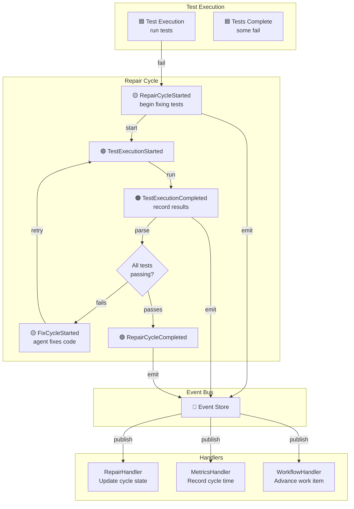
```mermaid
graph TB
    subgraph "Test Execution"
        TE["🟦 Test Execution<br/>run tests"]
        TEC["🟦 Tests Complete<br/>some fail"]
    end
    
    subgraph "Repair Cycle"
        RCS["🟡 RepairCycleStarted<br/>begin fixing tests"]
        TES["🟢 TestExecutionStarted"]
        TEC2["🟠 TestExecutionCompleted<br/>record results"]
        FIX["🟡 FixCycleStarted<br/>agent fixes code"]
        DECISION{"All tests<br/>passing?"}
        RCC["🟢 RepairCycleCompleted"]
    end
    
    subgraph "Event Bus"
        STORE2["💾 Event Store"]
    end
    
    subgraph "Handlers"
        REP_H["RepairHandler<br/>Update cycle state"]
        METRIC_H["MetricsHandler<br/>Record cycle time"]
        WF_H["WorkflowHandler<br/>Advance work item"]
    end
    
    TE -->|fail| RCS
    RCS -->|emit| STORE2
    RCS -->|start| TES
    TES -->|run| TEC2
    TEC2 -->|emit| STORE2
    TEC2 -->|parse| DECISION
    DECISION -->|fails| FIX
    DECISION -->|passes| RCC
    FIX -->|retry| TES
    RCC -->|emit| STORE2
    STORE2 -->|publish| REP_H
    STORE2 -->|publish| METRIC_H
    STORE2 -->|publish| WF_H
```

---

### Container Context

**File**: `container_events.py` (1 event)

The Container context tracks agent container execution.

```python
@dataclass(frozen=True)
class ContainerExecutionCompletedEvent(CodetoreumEvent):
    """Emitted when a container execution completes.
    
    Fired by: DockerContainerAdapter → adapter
    Subscribers:
      - ExecutionHandler: Mark execution as COMPLETED
      - WorkspaceHandler: Clean up workspace
    
    Attributes:
        execution_id: Execution that completed
        container_id: Container that ran
        exit_code: Process exit code (0 = success)
        output: Container stdout
        error: Container stderr
    """
    execution_id: str = ""
    container_id: str = ""
    exit_code: int = 0
    output: str = ""
    error: str = ""
```

**Event-Flow Diagram**:

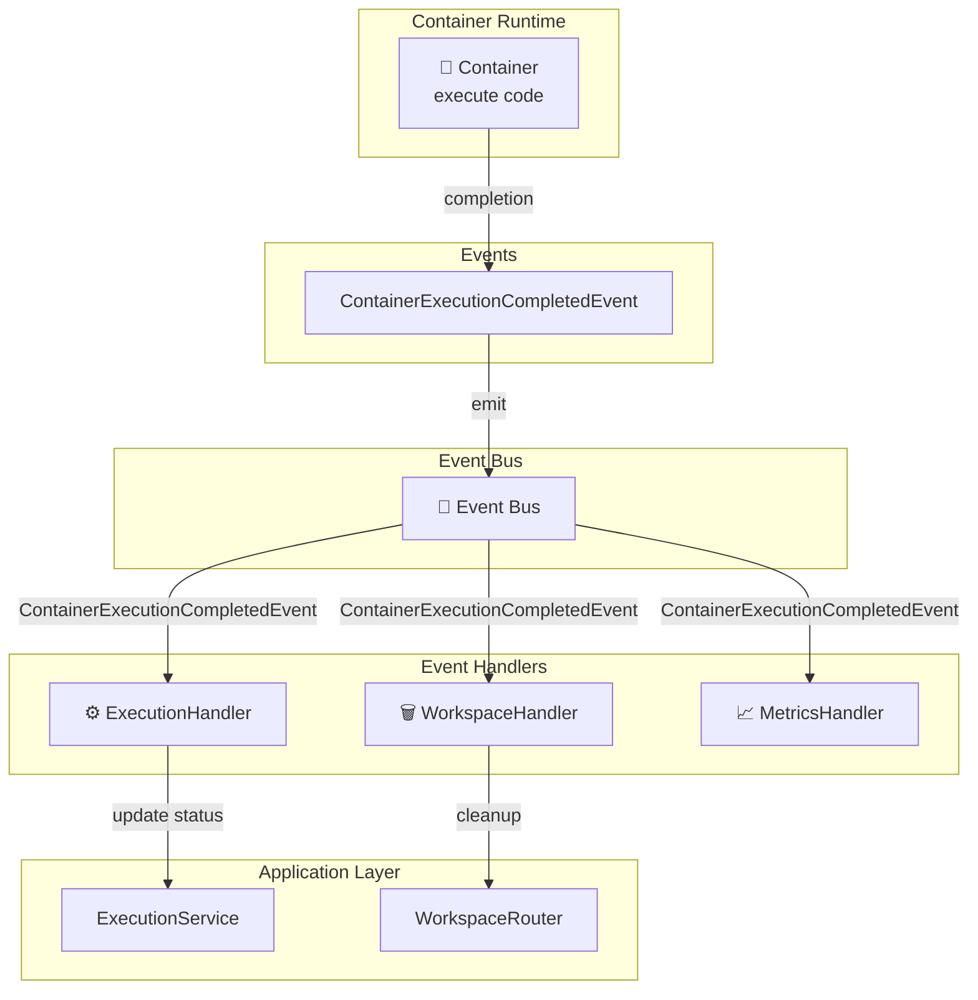
```mermaid
graph TB
    subgraph "Container Runtime"
        CONTAINER["🐳 Container<br/>execute code"]
    end
    
    subgraph "Events"
        CONTAINER -->|completion| COMPLETED["ContainerExecutionCompletedEvent"]
    end
    
    subgraph "Event Bus"
        BUS["📢 Event Bus"]
        COMPLETED -->|emit| BUS
    end
    
    subgraph "Event Handlers"
        EH["⚙️ ExecutionHandler"]
        WH["🗑️ WorkspaceHandler"]
        MH["📈 MetricsHandler"]
    end
    
    subgraph "Application Layer"
        EXEC["ExecutionService"]
        WS["WorkspaceRouter"]
    end
    
    BUS -->|ContainerExecutionCompletedEvent| EH
    BUS -->|ContainerExecutionCompletedEvent| WH
    BUS -->|ContainerExecutionCompletedEvent| MH
    
    EH -->|update status| EXEC
    WH -->|cleanup| WS
```

---

### Container Recovery Context

**File**: `container_recovery_events.py` (3 events)

Container Recovery handles container failure and recovery.

```python
@dataclass(frozen=True)
class ContainerRecoveredEvent(CodetoreumEvent):
    """Emitted when a failed container is successfully recovered.
    
    Attributes:
        execution_id: Execution being recovered
        recovery_method: How it was recovered ("restart", "rebuild", etc.)
    """
    execution_id: str = ""
    recovery_method: str = ""

@dataclass(frozen=True)
class ContainerKilledEvent(CodetoreumEvent):
    """Emitted when a container is forcibly killed (recovery failed).
    
    Attributes:
        execution_id: Execution that failed
        reason: Why container was killed
    """
    execution_id: str = ""
    reason: str = ""

# ... 1 more event (ContainerRecoveryCompletedEvent)
```

**Event-Flow Diagram**:

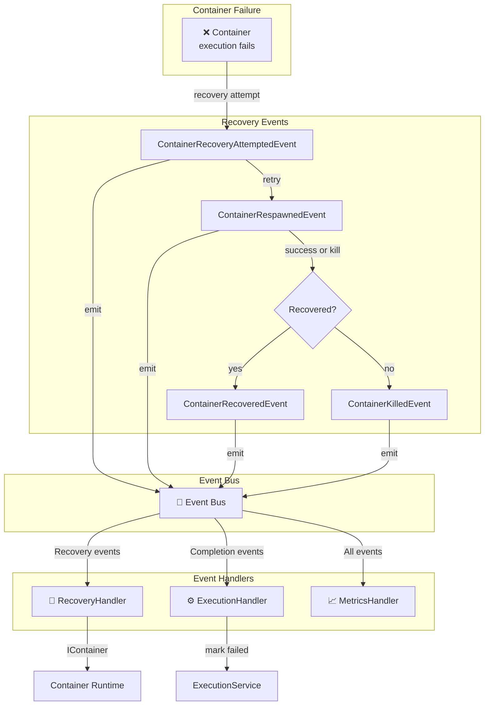
```mermaid
graph TB
    subgraph "Container Failure"
        FAIL["❌ Container<br/>execution fails"]
    end
    
    subgraph "Recovery Events"
        FAIL -->|recovery attempt| RECOVERY["ContainerRecoveryAttemptedEvent"]
        RECOVERY -->|retry| RETRY["ContainerRespawnedEvent"]
        RETRY -->|success or kill| RESULT{"Recovered?"}
        RESULT -->|yes| RECOVERED["ContainerRecoveredEvent"]
        RESULT -->|no| KILLED["ContainerKilledEvent"]
    end
    
    subgraph "Event Bus"
        BUS["📢 Event Bus"]
        RECOVERY -->|emit| BUS
        RETRY -->|emit| BUS
        RECOVERED -->|emit| BUS
        KILLED -->|emit| BUS
    end
    
    subgraph "Event Handlers"
        RCH["🔧 RecoveryHandler"]
        EH["⚙️ ExecutionHandler"]
        MH["📈 MetricsHandler"]
    end
    
    BUS -->|Recovery events| RCH
    BUS -->|Completion events| EH
    BUS -->|All events| MH
    
    RCH -->|IContainer| CONTAINER["Container Runtime"]
    EH -->|mark failed| EXEC["ExecutionService"]
```

---

### Lock Context

**File**: `lock_events.py` (7 events)

The Lock context manages pipeline locks for coordinating work item progression.

```python
@dataclass(frozen=True)
class LockAcquiredEvent(CodetoreumEvent):
    """Emitted when a pipeline lock is acquired.
    
    Fired by: IPipelineLockService.acquire() → adapter
    Subscribers:
      - LockHandler: Update lock state
      - MetricsHandler: Track lock acquisition time
    
    Attributes:
        lock_id: Lock that was acquired
        work_item_id: Work item holding lock
        acquired_by: Agent or user acquiring lock
    """
    lock_id: str = ""
    work_item_id: str = ""
    acquired_by: str = ""

@dataclass(frozen=True)
class LockReleasedEvent(CodetoreumEvent):
    """Emitted when a pipeline lock is released.
    
    Fired by: IPipelineLockService.release() → adapter
    Subscribers:
      - LockHandler: Free next work item to acquire lock
      - QueueHandler: Dequeue next work item
    
    Attributes:
        lock_id: Lock that was released
        released_by: Agent or user releasing lock
    """
    lock_id: str = ""
    released_by: str = ""

@dataclass(frozen=True)
class StaleLockDetectedEvent(CodetoreumEvent):
    """Emitted when a lock holder stops responding.
    
    Attributes:
        lock_id: Stale lock ID
        held_by: Who is holding the lock
        held_duration_seconds: How long lock has been held
    """
    lock_id: str = ""
    held_by: str = ""
    held_duration_seconds: int = 0

@dataclass(frozen=True)
class PipelineLockAcquiredEvent(CodetoreumEvent):
    """Emitted when pipeline-level lock is acquired for serializing work items."""
    project_id: str = ""
    board_id: str = ""
    work_item_id: str = ""
    timestamp (str): ISO 8601 timestamp when lock acquired

@dataclass(frozen=True)
class PipelineLockReleasedEvent(CodetoreumEvent):
    """Emitted when pipeline-level lock is released."""
    project_id: str = ""
    board_id: str = ""
    work_item_id: str = ""
    timestamp (str): ISO 8601 timestamp when lock released

@dataclass(frozen=True)
class LockStuckEvent(CodetoreumEvent):
    """Emitted when a lock is detected as stuck (holder not responding)."""
    project_id: str = ""
    board_id: str = ""
    work_item_id: str = ""
    lock_duration_seconds: int = 0
    held_by_agent: str = ""
    recovery_initiated: bool = False
    timestamp (str): ISO 8601 timestamp when stuck detected

@dataclass(frozen=True)
class WorkItemQueuedEvent(CodetoreumEvent):
    """Emitted when work item is queued waiting for lock."""
    project_id: str = ""
    board_id: str = ""
    work_item_id: str = ""
    queue_position: int = 0
    queue_depth: int = 0
    timestamp (str): ISO 8601 timestamp when queued
```

**Event-Flow Diagram**:

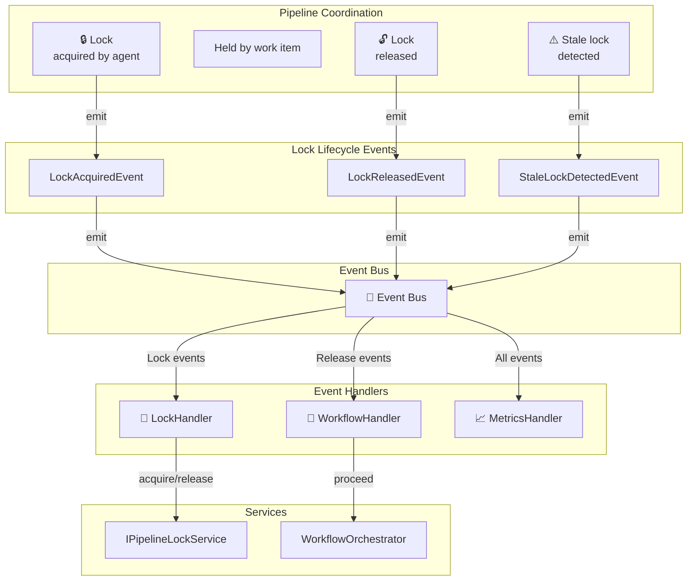
```mermaid
graph TB
    subgraph "Pipeline Coordination"
        ACQ["🔒 Lock<br/>acquired by agent"]
        HELD["Held by work item"]
        REL["🔓 Lock<br/>released"]
        STALE["⚠️ Stale lock<br/>detected"]
    end
    
    subgraph "Lock Lifecycle Events"
        ACQ -->|emit| ACQUIRED["LockAcquiredEvent"]
        REL -->|emit| RELEASED["LockReleasedEvent"]
        STALE -->|emit| STALEEV["StaleLockDetectedEvent"]
    end
    
    subgraph "Event Bus"
        BUS["📢 Event Bus"]
        ACQUIRED -->|emit| BUS
        RELEASED -->|emit| BUS
        STALEEV -->|emit| BUS
    end
    
    subgraph "Event Handlers"
        LH["🔐 LockHandler"]
        WFH["🔄 WorkflowHandler"]
        MH["📈 MetricsHandler"]
    end
    
    subgraph "Services"
        LOCK["IPipelineLockService"]
        WF["WorkflowOrchestrator"]
    end
    
    BUS -->|Lock events| LH
    BUS -->|Release events| WFH
    BUS -->|All events| MH
    
    LH -->|acquire/release| LOCK
    WFH -->|proceed| WF
```

---

### Repository Context

**File**: `repository_events.py` (4 events)

The Repository context tracks git operations.

```python
@dataclass(frozen=True)
class CommitCreatedEvent(CodetoreumEvent):
    """Emitted when a commit is created.
    
    Fired by: IRepositoryService.commit() → adapter
    Subscribers:
      - AuditHandler: Log commit
      - MetricsHandler: Track commits
    
    Attributes:
        work_item_id: Work item being modified
        commit_id: Git commit SHA
        message: Commit message
    """
    work_item_id: str = ""
    commit_id: str = ""
    message: str = ""

@dataclass(frozen=True)
class BranchCreatedEvent(CodetoreumEvent):
    """Emitted when a branch is created.
    
    Attributes:
        work_item_id: Work item with new branch
        branch_name: Name of created branch
    """
    work_item_id: str = ""
    branch_name: str = ""

# ... 2 more events (BranchPushed, FilesStagedEvent)
```

**Event-Flow Diagram**:

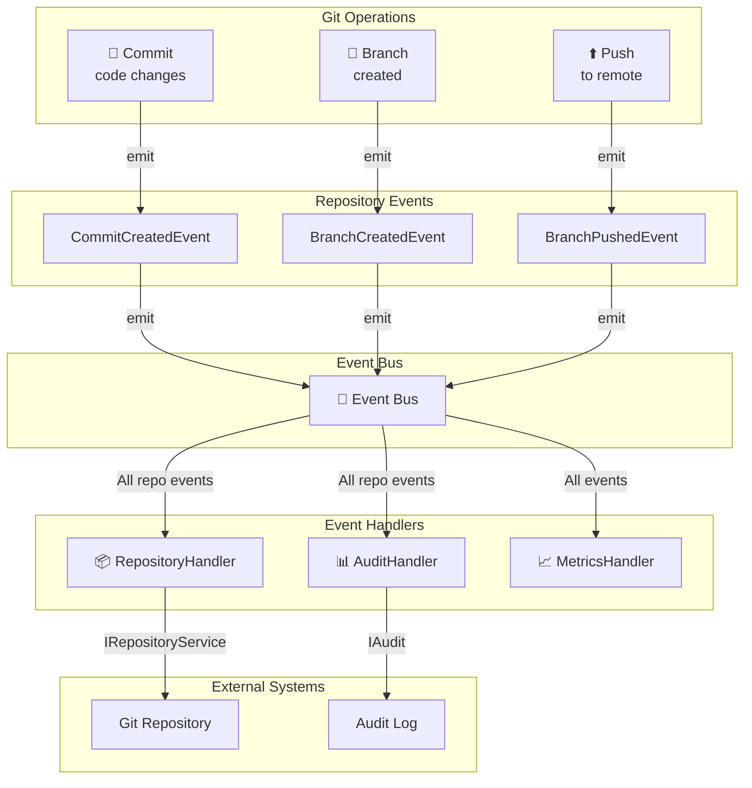
```mermaid
graph TB
    subgraph "Git Operations"
        COMMIT["💾 Commit<br/>code changes"]
        BRANCH["🌳 Branch<br/>created"]
        PUSH["⬆️ Push<br/>to remote"]
    end
    
    subgraph "Repository Events"
        COMMIT -->|emit| COMMITEV["CommitCreatedEvent"]
        BRANCH -->|emit| BRANCHEV["BranchCreatedEvent"]
        PUSH -->|emit| PUSHEV["BranchPushedEvent"]
    end
    
    subgraph "Event Bus"
        BUS["📢 Event Bus"]
        COMMITEV -->|emit| BUS
        BRANCHEV -->|emit| BUS
        PUSHEV -->|emit| BUS
    end
    
    subgraph "Event Handlers"
        RH["📦 RepositoryHandler"]
        AH["📊 AuditHandler"]
        MH["📈 MetricsHandler"]
    end
    
    subgraph "External Systems"
        GIT["Git Repository"]
        AUDIT["Audit Log"]
    end
    
    BUS -->|All repo events| RH
    BUS -->|All repo events| AH
    BUS -->|All events| MH
    
    RH -->|IRepositoryService| GIT
    AH -->|IAudit| AUDIT
```

---

### CI Pipeline Context

**File**: `ci_pipeline_events.py` (3 events)

CI Pipeline tracks continuous integration pipeline execution.

```python
@dataclass(frozen=True)
class CIPipelineStatusCheckedEvent(CodetoreumEvent):
    """Emitted when CI pipeline status is checked.
    
    Attributes:
        work_item_id: Work item with CI pipeline
        pipeline_id: CI pipeline ID
        status: Current status (pending, running, success, failure)
    """
    work_item_id: str = ""
    pipeline_id: str = ""
    status: str = ""

@dataclass(frozen=True)
class CIRunStartedEvent(CodetoreumEvent):
    """Emitted when a CI run starts.
    
    Attributes:
        work_item_id: Work item
        run_id: CI run ID
    """
    work_item_id: str = ""
    run_id: str = ""

@dataclass(frozen=True)
class CIRunCompletedEvent(CodetoreumEvent):
    """Emitted when a CI run completes.
    
    Attributes:
        work_item_id: Work item
        run_id: CI run ID
        success: Whether CI passed
    """
    work_item_id: str = ""
    run_id: str = ""
    success: bool = False
```

**Event-Flow Diagram**:

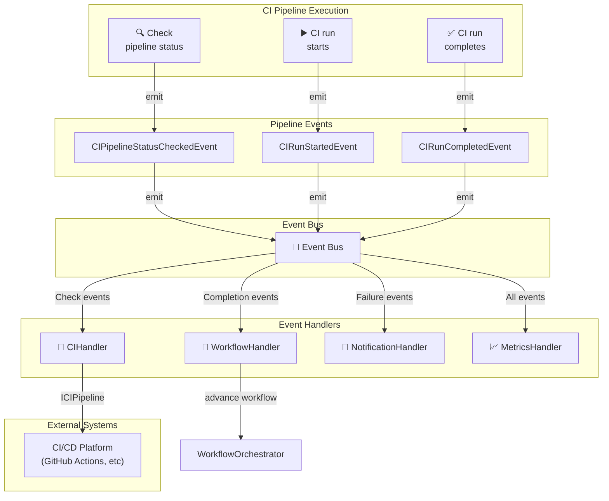
```mermaid
graph TB
    subgraph "CI Pipeline Execution"
        CHECK["🔍 Check<br/>pipeline status"]
        START["▶️ CI run<br/>starts"]
        COMPLETE["✅ CI run<br/>completes"]
    end
    
    subgraph "Pipeline Events"
        CHECK -->|emit| CHECKEV["CIPipelineStatusCheckedEvent"]
        START -->|emit| STARTEV["CIRunStartedEvent"]
        COMPLETE -->|emit| COMPLETEEV["CIRunCompletedEvent"]
    end
    
    subgraph "Event Bus"
        BUS["📢 Event Bus"]
        CHECKEV -->|emit| BUS
        STARTEV -->|emit| BUS
        COMPLETEEV -->|emit| BUS
    end
    
    subgraph "Event Handlers"
        CIH["🔧 CIHandler"]
        WFH["🔄 WorkflowHandler"]
        NH["📧 NotificationHandler"]
        MH["📈 MetricsHandler"]
    end
    
    subgraph "External Systems"
        CI["CI/CD Platform<br/>(GitHub Actions, etc)"]
    end
    
    BUS -->|Check events| CIH
    BUS -->|Completion events| WFH
    BUS -->|Failure events| NH
    BUS -->|All events| MH
    
    CIH -->|ICIPipeline| CI
    WFH -->|advance workflow| WORKFLOW["WorkflowOrchestrator"]
```

---

### Discussion Context

**File**: `discussion_events.py` (8 events)

Discussion tracks comments and conversational feedback loops on work items.

```python
@dataclass(frozen=True)
class CommentPostedEvent(CodetoreumEvent):
    """Emitted when a comment is posted on a work item.
    
    Fired by: IDiscussionAdapter.post_comment() → adapter
    Subscribers:
      - DiscussionHandler: Update discussion thread
      - NotificationHandler: Notify mentioned users
    
    Attributes:
        work_item_id: Work item receiving comment
        comment_id: New comment ID
        author_id: Who posted comment
        body: Comment text
    """
    work_item_id: str = ""
    comment_id: str = ""
    author_id: str = ""
    body: str = ""

@dataclass(frozen=True)
class CommentNeedsResponseEvent(CodetoreumEvent):
    """Emitted when a comment requires agent response.
    
    Fired by: DiscussionAdapter detects comment mentioning agent
    Subscribers:
      - DiscussionHandler: Queue response task
    
    Attributes:
        work_item_id: Work item with comment
        comment_id: Comment requiring response
        mentioned_agent_id: Agent that needs to respond
    """
    work_item_id: str = ""
    comment_id: str = ""
    mentioned_agent_id: str = ""

@dataclass(frozen=True)
class ConversationalLoopStartedEvent(CodetoreumEvent):
    """Emitted when a multi-turn conversational loop begins.
    
    Attributes:
        work_item_id: Work item
        session_id: Conversation session ID
    """
    work_item_id: str = ""
    session_id: str = ""

@dataclass(frozen=True)
class AgentResponsePostedEvent(CodetoreumEvent):
    """Emitted when agent posts a response to a comment.
    
    **Immutability**: This is an immutable event (frozen dataclass). All fields
    are read-only after construction to maintain event sourcing audit trail integrity.
    
    Attributes:
        type (str): Fixed to "discussion.agent_response_posted"
        work_item_id (str): Work item ID where response was posted
        comment_id (str): ID of the response comment
        responding_agent_id (str): ID of the agent that posted response
        parent_comment_id (str): ID of the comment being responded to
        response_body (str): Text content of the agent's response
        workflow_run_id (str): ID of the workflow run
        timestamp (str): ISO 8601 timestamp when response was posted
    """
    work_item_id: str = ""
    comment_id: str = ""
    responding_agent_id: str = ""
    parent_comment_id: str = ""
    response_body: str = ""
    workflow_run_id: str = ""

@dataclass(frozen=True)
class FeedbackListeningStartedEvent(CodetoreumEvent):
    """Emitted when feedback listening session starts on a work item.
    
    **Immutability**: This is an immutable event (frozen dataclass). All fields
    are read-only after construction to maintain event sourcing audit trail integrity.
    
    Attributes:
        type (str): Fixed to "discussion.feedback_listening_started"
        work_item_id (str): Work item ID listening for feedback
        listening_agent_id (str): ID of agent listening for feedback
        listening_duration_seconds (int): How long to listen for feedback
        workflow_run_id (str): ID of the workflow run
        timestamp (str): ISO 8601 timestamp when listening started
    """
    work_item_id: str = ""
    listening_agent_id: str = ""
    listening_duration_seconds: int = 0
    workflow_run_id: str = ""

@dataclass(frozen=True)
class FeedbackListeningStoppedEvent(CodetoreumEvent):
    """Emitted when feedback listening session stops.
    
    **Immutability**: This is an immutable event (frozen dataclass). All fields
    are read-only after construction to maintain event sourcing audit trail integrity.
    
    Attributes:
        type (str): Fixed to "discussion.feedback_listening_stopped"
        work_item_id (str): Work item ID that was listening
        listening_agent_id (str): ID of agent that was listening
        feedback_received_count (int): Number of feedback comments received
        reason (str): Reason listening stopped (timeout, max_feedback, manual)
        workflow_run_id (str): ID of the workflow run
        timestamp (str): ISO 8601 timestamp when listening stopped
    """
    work_item_id: str = ""
    listening_agent_id: str = ""
    feedback_received_count: int = 0
    reason: str = ""
    workflow_run_id: str = ""
```

**Event-Flow Diagram**:

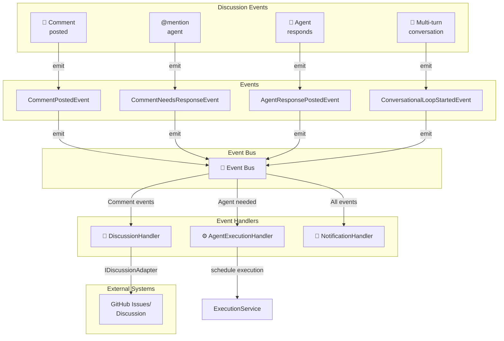
```mermaid
graph TB
    subgraph "Discussion Events"
        COMMENT["💬 Comment<br/>posted"]
        MENTION["@mention<br/>agent"]
        RESPONSE["💬 Agent<br/>responds"]
        LOOP["🔄 Multi-turn<br/>conversation"]
    end
    
    subgraph "Events"
        COMMENT -->|emit| COMMENTEV["CommentPostedEvent"]
        MENTION -->|emit| NEEDSEV["CommentNeedsResponseEvent"]
        RESPONSE -->|emit| RESPONSEEV["AgentResponsePostedEvent"]
        LOOP -->|emit| LOOPEV["ConversationalLoopStartedEvent"]
    end
    
    subgraph "Event Bus"
        BUS["📢 Event Bus"]
        COMMENTEV -->|emit| BUS
        NEEDSEV -->|emit| BUS
        RESPONSEEV -->|emit| BUS
        LOOPEV -->|emit| BUS
    end
    
    subgraph "Event Handlers"
        DH["💬 DiscussionHandler"]
        AEH["⚙️ AgentExecutionHandler"]
        NH["📧 NotificationHandler"]
    end
    
    subgraph "External Systems"
        GITHUB["GitHub Issues/<br/>Discussion"]
    end
    
    BUS -->|Comment events| DH
    BUS -->|Agent needed| AEH
    BUS -->|All events| NH
    
    DH -->|IDiscussionAdapter| GITHUB
    AEH -->|schedule execution| EXEC["ExecutionService"]
```

---

### Project Context

**File**: `project_events.py` (5 events)

Project context tracks project-level operations.

```python
@dataclass(frozen=True)
class ProjectClonedEvent(CodetoreumEvent):
    """Emitted when a project repository is successfully cloned.
    
    Attributes:
        project_id: Project being cloned
        repository_url: Cloned repo URL
    """
    project_id: str = ""
    repository_url: str = ""

@dataclass(frozen=True)
class ProjectEnabledEvent(CodetoreumEvent):
    """Emitted when a project is enabled for orchestration.
    
    Attributes:
        project_id: Project being enabled
    """
    project_id: str = ""

@dataclass(frozen=True)
class ProjectDisabledEvent(CodetoreumEvent):
    """Emitted when a project becomes disabled in configuration."""
    project_name: str = ""
    reason: str | None = None
    timestamp (str): ISO 8601 timestamp when disabled

@dataclass(frozen=True)
class ProjectCloneFailedEvent(CodetoreumEvent):
    """Emitted when project clone or update fails (transient error)."""
    project_name: str = ""
    error_message: str = ""
    will_retry: bool = True
    timestamp (str): ISO 8601 timestamp when failure occurred

@dataclass(frozen=True)
class OrchestrationCycleCompletedEvent(CodetoreumEvent):
    """Emitted at the end of each orchestration poll cycle."""
    projects_processed: int = 0
    boards_processed: int = 0
    total_actions: int = 0
    cycle_duration_ms: int = 0
    timestamp (str): ISO 8601 timestamp when cycle completed
```

**Event-Flow Diagram**:

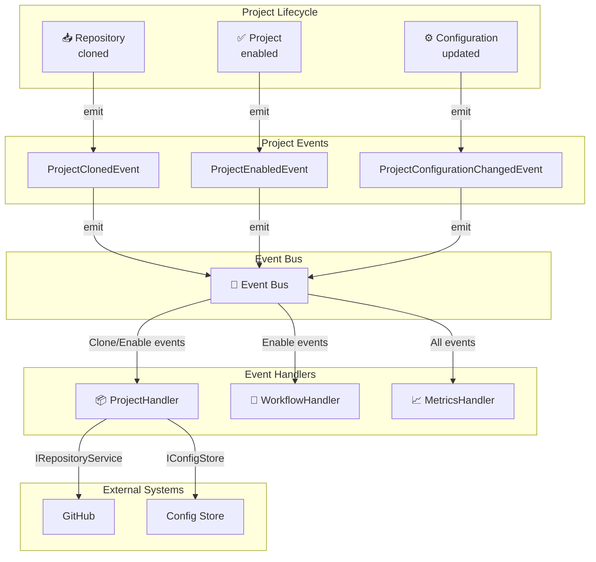
```mermaid
graph TB
    subgraph "Project Lifecycle"
        CLONE["📥 Repository<br/>cloned"]
        ENABLE["✅ Project<br/>enabled"]
        CONFIG["⚙️ Configuration<br/>updated"]
    end
    
    subgraph "Project Events"
        CLONE -->|emit| CLONEEV["ProjectClonedEvent"]
        ENABLE -->|emit| ENABLEEV["ProjectEnabledEvent"]
        CONFIG -->|emit| CONFIGEV["ProjectConfigurationChangedEvent"]
    end
    
    subgraph "Event Bus"
        BUS["📢 Event Bus"]
        CLONEEV -->|emit| BUS
        ENABLEEV -->|emit| BUS
        CONFIGEV -->|emit| BUS
    end
    
    subgraph "Event Handlers"
        PH["📦 ProjectHandler"]
        WFH["🔄 WorkflowHandler"]
        MH["📈 MetricsHandler"]
    end
    
    subgraph "External Systems"
        GITHUB["GitHub"]
        CONFIG_STORE["Config Store"]
    end
    
    BUS -->|Clone/Enable events| PH
    BUS -->|Enable events| WFH
    BUS -->|All events| MH
    
    PH -->|IRepositoryService| GITHUB
    PH -->|IConfigStore| CONFIG_STORE
```

---

### Queue Context

**File**: `queue_events.py` (4 events)

Queue context tracks work item queue management.

```python
@dataclass(frozen=True)
class QueueItemAddedEvent(CodetoreumEvent):
    """Emitted when a work item is added to execution queue.
    
    Attributes:
        work_item_id: Work item queued
        queue_position: Position in queue
    """
    work_item_id: str = ""
    queue_position: int = 0

@dataclass(frozen=True)
class QueuePositionChangedEvent(CodetoreumEvent):
    """Emitted when a work item's queue position changes.
    
    Attributes:
        work_item_id: Work item in queue
        old_position: Previous position
        new_position: New position
    """
    work_item_id: str = ""
    old_position: int = 0
    new_position: int = 0

# ... 2 more events (QueueItemRemoved, WorkItemDeadLetterQueued)
```

**Event-Flow Diagram**:

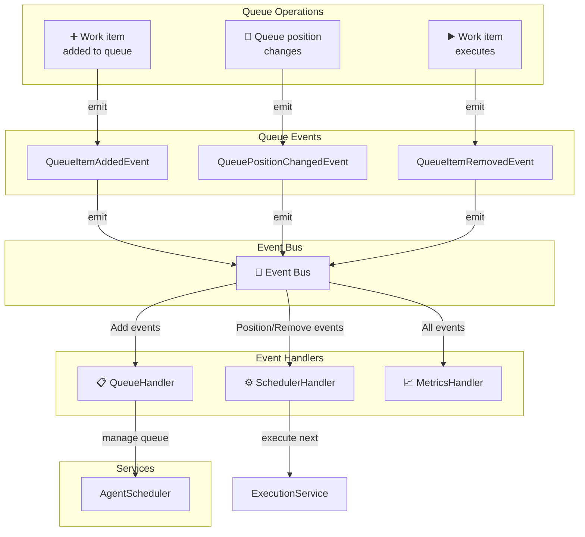
```mermaid
graph TB
    subgraph "Queue Operations"
        ADD["➕ Work item<br/>added to queue"]
        REORDER["🔄 Queue position<br/>changes"]
        EXECUTE["▶️ Work item<br/>executes"]
    end
    
    subgraph "Queue Events"
        ADD -->|emit| ADDEV["QueueItemAddedEvent"]
        REORDER -->|emit| POSEV["QueuePositionChangedEvent"]
        EXECUTE -->|emit| REMEV["QueueItemRemovedEvent"]
    end
    
    subgraph "Event Bus"
        BUS["📢 Event Bus"]
        ADDEV -->|emit| BUS
        POSEV -->|emit| BUS
        REMEV -->|emit| BUS
    end
    
    subgraph "Event Handlers"
        QH["📋 QueueHandler"]
        SCH["⚙️ SchedulerHandler"]
        MH["📈 MetricsHandler"]
    end
    
    subgraph "Services"
        QUEUE["AgentScheduler"]
    end
    
    BUS -->|Add events| QH
    BUS -->|Position/Remove events| SCH
    BUS -->|All events| MH
    
    QH -->|manage queue| QUEUE
    SCH -->|execute next| EXEC["ExecutionService"]
```

---

### Branch Context

**File**: `branch_events.py` (3 events)

Branch context tracks branch resolution and reuse.

```python
@dataclass(frozen=True)
class BranchResolutionCreatedEvent(CodetoreumEvent):
    """Emitted when a branch resolution is created.
    
    Attributes:
        work_item_id: Work item
        branch_name: Branch name
    """
    work_item_id: str = ""
    branch_name: str = ""

@dataclass(frozen=True)
class BranchReusedEvent(CodetoreumEvent):
    """Emitted when an existing branch is reused for a work item.
    
    Attributes:
        work_item_id: Work item
        branch_name: Reused branch name
    """
    work_item_id: str = ""
    branch_name: str = ""

@dataclass(frozen=True)
class BranchResolvedEvent(CodetoreumEvent):
    """Emitted when a branch is resolved and ready for use.
    
    Attributes:
        work_item_id: Work item
        branch_name: Branch name
    """
    work_item_id: str = ""
    branch_name: str = ""
```

**Event-Flow Diagram**:

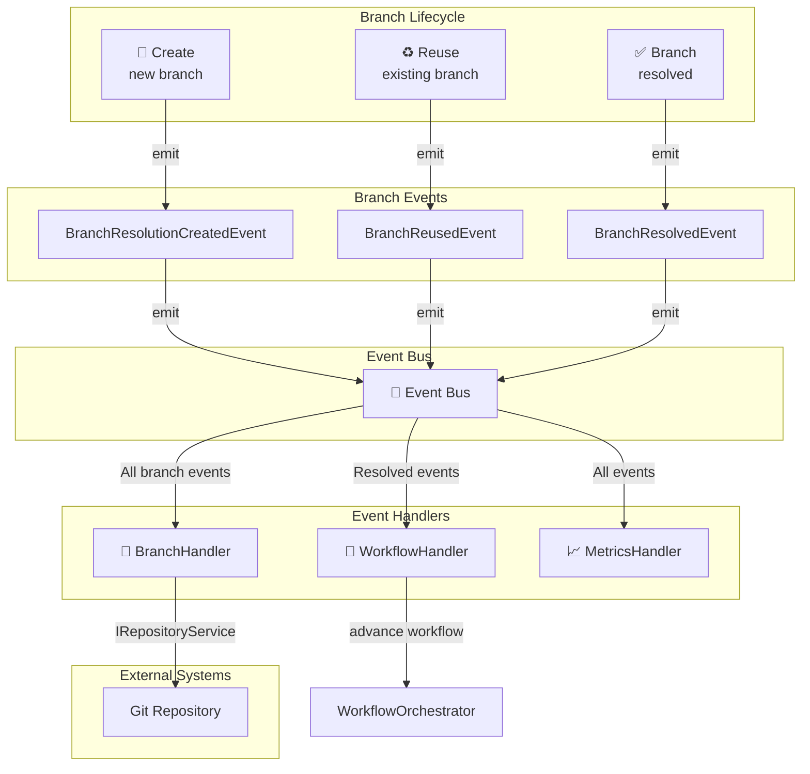
```mermaid
graph TB
    subgraph "Branch Lifecycle"
        CREATE["🌳 Create<br/>new branch"]
        REUSE["♻️ Reuse<br/>existing branch"]
        RESOLVE["✅ Branch<br/>resolved"]
    end
    
    subgraph "Branch Events"
        CREATE -->|emit| CREATEEV["BranchResolutionCreatedEvent"]
        REUSE -->|emit| REUSEEV["BranchReusedEvent"]
        RESOLVE -->|emit| RESOLVEEV["BranchResolvedEvent"]
    end
    
    subgraph "Event Bus"
        BUS["📢 Event Bus"]
        CREATEEV -->|emit| BUS
        REUSEEV -->|emit| BUS
        RESOLVEEV -->|emit| BUS
    end
    
    subgraph "Event Handlers"
        BH["🌳 BranchHandler"]
        WH["🔄 WorkflowHandler"]
        MH["📈 MetricsHandler"]
    end
    
    subgraph "External Systems"
        GIT["Git Repository"]
    end
    
    BUS -->|All branch events| BH
    BUS -->|Resolved events| WH
    BUS -->|All events| MH
    
    BH -->|IRepositoryService| GIT
    WH -->|advance workflow| WF["WorkflowOrchestrator"]
```

---

### Storage Context

**File**: `storage_events.py` (2 events)

Storage context tracks artifact uploads and deletions.

```python
@dataclass(frozen=True)
class ArtifactUploadedEvent(CodetoreumEvent):
    """Emitted when an artifact is uploaded to storage.
    
    Attributes:
        artifact_id: Artifact ID
        work_item_id: Associated work item
        filename: Uploaded filename
        size_bytes: File size
    """
    artifact_id: str = ""
    work_item_id: str = ""
    filename: str = ""
    size_bytes: int = 0

@dataclass(frozen=True)
class ArtifactDeletedEvent(CodetoreumEvent):
    """Emitted when an artifact is deleted.
    
    Attributes:
        artifact_id: Artifact being deleted
        work_item_id: Associated work item
    """
    artifact_id: str = ""
    work_item_id: str = ""
```

**Event-Flow Diagram**:

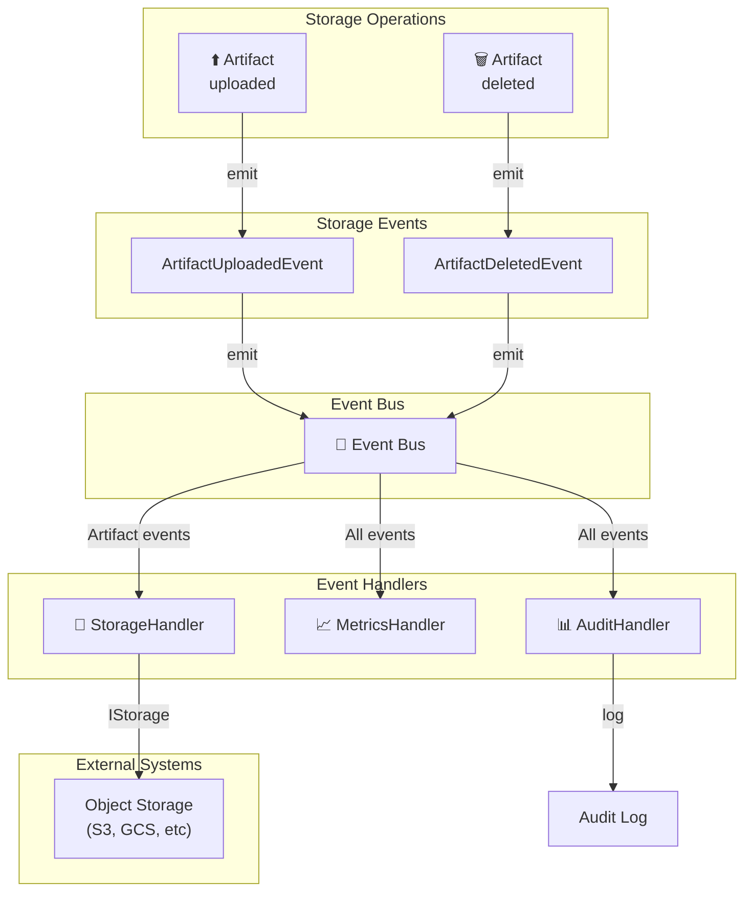
```mermaid
graph TB
    subgraph "Storage Operations"
        UPLOAD["⬆️ Artifact<br/>uploaded"]
        DELETE["🗑️ Artifact<br/>deleted"]
    end
    
    subgraph "Storage Events"
        UPLOAD -->|emit| UPLOADEV["ArtifactUploadedEvent"]
        DELETE -->|emit| DELETEEV["ArtifactDeletedEvent"]
    end
    
    subgraph "Event Bus"
        BUS["📢 Event Bus"]
        UPLOADEV -->|emit| BUS
        DELETEEV -->|emit| BUS
    end
    
    subgraph "Event Handlers"
        SH["💾 StorageHandler"]
        MH["📈 MetricsHandler"]
        AH["📊 AuditHandler"]
    end
    
    subgraph "External Systems"
        STORAGE["Object Storage<br/>(S3, GCS, etc)"]
    end
    
    BUS -->|Artifact events| SH
    BUS -->|All events| MH
    BUS -->|All events| AH
    
    SH -->|IStorage| STORAGE
    AH -->|log| AUDIT["Audit Log"]
```

---

### Adapter Context

**File**: `adapter_events.py` (1 event base class)

The Adapter context provides the base event class.

```python
@dataclass(frozen=True)
class CodetoreumEvent:
    """Base class for all domain events.
    
    Immutable event base providing:
    - Automatic timestamp (UTC)
    - Unique event ID
    - Source system identifier
    - Serialization support
    
    All domain events inherit from this class and are frozen
    to maintain immutability for event sourcing.
    """
    type: str = ""  # Event type identifier (e.g., "workitem.created")
    timestamp: str = field(default_factory=lambda: datetime.now(UTC).isoformat())
    event_id: str = field(default_factory=lambda: str(uuid4()))
    source: str = ""  # Source system (e.g., "github", "codetoreum")
    correlation_id: str | None = None  # Link related events
```

**Event-Flow Diagram**:

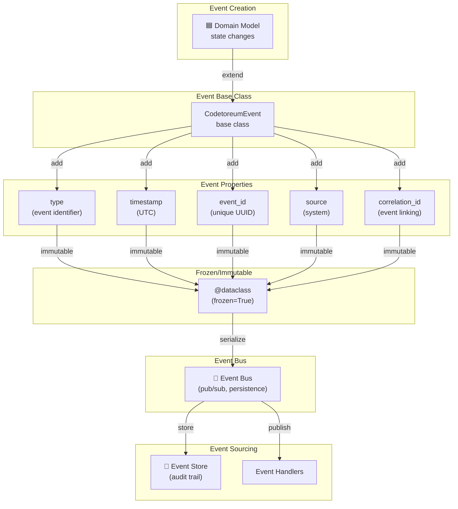
```mermaid
graph TB
    subgraph "Event Creation"
        ALL["🟦 Domain Model<br/>state changes"]
    end
    
    subgraph "Event Base Class"
        ALL -->|extend| BASE["CodetoreumEvent<br/>base class"]
    end
    
    subgraph "Event Properties"
        BASE -->|add| TYPE["type<br/>(event identifier)"]
        BASE -->|add| TIMESTAMP["timestamp<br/>(UTC)"]
        BASE -->|add| ID["event_id<br/>(unique UUID)"]
        BASE -->|add| SOURCE["source<br/>(system)"]
        BASE -->|add| CORR["correlation_id<br/>(event linking)"]
    end
    
    subgraph "Frozen/Immutable"
        TYPE -->|immutable| FROZEN["@dataclass<br/>(frozen=True)"]
        TIMESTAMP -->|immutable| FROZEN
        ID -->|immutable| FROZEN
        SOURCE -->|immutable| FROZEN
        CORR -->|immutable| FROZEN
    end
    
    subgraph "Event Bus"
        FROZEN -->|serialize| BUS["📢 Event Bus<br/>(pub/sub, persistence)"]
    end
    
    subgraph "Event Sourcing"
        BUS -->|store| STORE["💾 Event Store<br/>(audit trail)"]
        BUS -->|publish| HANDLERS["Event Handlers"]
    end
```

---

---

## Legacy Events (Deprecated)

**Status**: These events are deprecated and should not be used for new features. They exist for backward compatibility with older code paths.

### Legacy DomainEvent Base Class

The system contains **74 legacy event classes** using the older `DomainEvent` base class pattern (located in `legacy_domain_events.py`). These events follow a different design pattern than the modern frozen dataclass events:

```python
# Legacy pattern (deprecated - do NOT use for new events)
class DomainEvent:
    """Base class for legacy events (deprecated pattern)."""
    def __init__(self, aggregate_id: str, aggregate_type: str, payload: dict, **kwargs):
        self.aggregate_id = aggregate_id
        self.aggregate_type = aggregate_type
        self.payload = payload
        # ... additional initialization

# Example: WorkItemCreated (legacy - from legacy_domain_events.py)
class WorkItemCreated(DomainEvent):
    """Emitted when a work item is created (DEPRECATED)."""
    def __init__(self, aggregate_id: str, payload: dict, **kwargs):
        super().__init__(aggregate_id=aggregate_id, aggregate_type="WorkItem", payload=payload, **kwargs)
```

**Legacy Event Classes** (74 total):
- WorkItemCreated, AgentAssigned, ExecutionStarted, WorkflowAttached, etc.
- ExecutionFailed, ExecutionTimedOut, ReviewStarted, ReviewApproved, etc.
- And ~60 more legacy-style events

### Transition to Modern Events

New events **MUST** use the modern frozen dataclass pattern:

```python
# Modern pattern (use this for all new events)
@dataclass(frozen=True)
class WorkItemCreatedEvent(CodetoreumEvent):
    """Emitted when a work item is created (MODERN pattern)."""
    work_item_id: str = ""
    project_id: str = ""
    title: str = ""
```

**Differences**:
| Aspect | Legacy | Modern |
|--------|--------|---------|
| Base Class | `DomainEvent` | `CodetoreumEvent` |
| Immutability | Not enforced | `@dataclass(frozen=True)` |
| Fields | Dict-based payload | Typed dataclass fields |
| Serialization | Manual | Automatic via dataclass |
| Validation | __post_init__ not used | Full __post_init__ support |

### Project Context Legacy Events

Additionally, **4 events** in `project_context.py` use the legacy pattern:
- ProjectContextCreated
- ProjectTestConfigUpdated
- ProjectDockerConfigUpdated
- ProjectWorkflowMappingAdded

These should be migrated to modern pattern when ProjectContext is refactored.

### Migration Path

If you encounter legacy events in the codebase:
1. Identify events inheriting from `DomainEvent` (not `CodetoreumEvent`)
2. Convert to modern frozen dataclass pattern
3. Update event handlers to use typed fields
4. Add tests for the migrated events
5. Remove old legacy event class

For now, legacy events are supported for backward compatibility, but **all new code should use the modern frozen dataclass pattern**.

---

## Event-Flow Diagrams

### Work Item → Board → Execution Flow

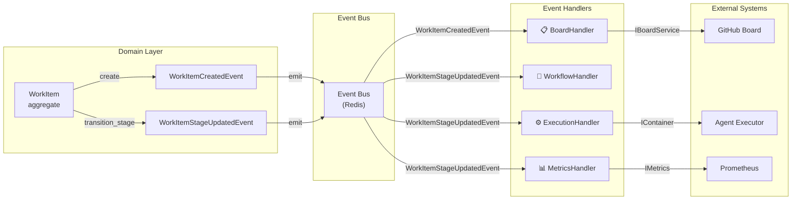
```mermaid
graph LR
    subgraph "Domain Layer"
        WI["WorkItem<br/>aggregate"]
        WI -->|create| WI_CREATED["WorkItemCreatedEvent"]
        WI -->|transition_stage| WI_STAGE["WorkItemStageUpdatedEvent"]
    end
    
    subgraph "Event Bus"
        BUS["Event Bus<br/>(Redis)"]
        WI_CREATED -->|emit| BUS
        WI_STAGE -->|emit| BUS
    end
    
    subgraph "Event Handlers"
        BH["📋 BoardHandler"]
        WH["🔄 WorkflowHandler"]
        EH["⚙️ ExecutionHandler"]
        MH["📊 MetricsHandler"]
    end
    
    subgraph "External Systems"
        BOARD["GitHub Board"]
        EXEC["Agent Executor"]
        METRICS["Prometheus"]
    end
    
    BUS -->|WorkItemCreatedEvent| BH
    BUS -->|WorkItemStageUpdatedEvent| WH
    BUS -->|WorkItemStageUpdatedEvent| EH
    BUS -->|WorkItemStageUpdatedEvent| MH
    
    BH -->|IBoardService| BOARD
    EH -->|IContainer| EXEC
    MH -->|IMetrics| METRICS
```

### Error → Repair Cycle → Resolution Flow

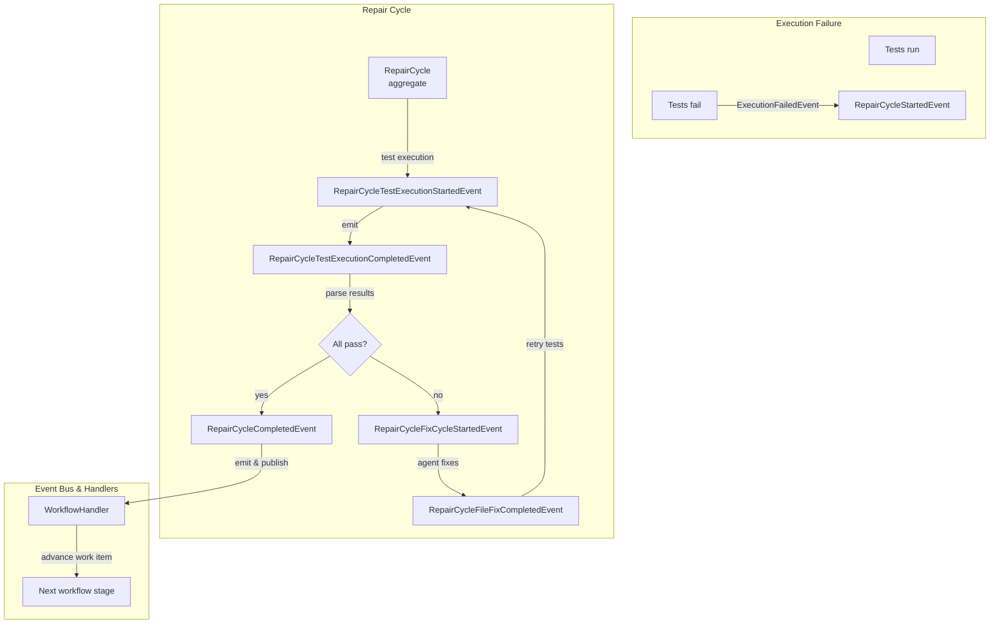
```mermaid
graph TB
    subgraph "Execution Failure"
        TEST["Tests run"]
        FAIL["Tests fail"]
        FAIL -->|ExecutionFailedEvent| REPAIR["RepairCycleStartedEvent"]
    end
    
    subgraph "Repair Cycle"
        RC["RepairCycle<br/>aggregate"]
        RC -->|test execution| TEST_START["RepairCycleTestExecutionStartedEvent"]
        TEST_START -->|emit| TEST_COMPLETE["RepairCycleTestExecutionCompletedEvent"]
        TEST_COMPLETE -->|parse results| DECISION{"All pass?"}
        DECISION -->|no| FIX_START["RepairCycleFixCycleStartedEvent"]
        FIX_START -->|agent fixes| FIX_COMPLETE["RepairCycleFileFixCompletedEvent"]
        FIX_COMPLETE -->|retry tests| TEST_START
        DECISION -->|yes| RC_COMPLETE["RepairCycleCompletedEvent"]
    end
    
    subgraph "Event Bus & Handlers"
        RC_COMPLETE -->|emit & publish| HANDLER["WorkflowHandler"]
        HANDLER -->|advance work item| NEXT_STAGE["Next workflow stage"]
    end
```

---

## Event Sourcing and Replay

Every event is persisted to the **Event Store** (Redis, optionally PostgreSQL). This enables:

### 1. Complete Audit Trail
- Every state change is recorded as an immutable fact
- Timestamps and correlation IDs enable tracing
- No information is lost

### 2. Event Replay
- Load a work item's initial state
- Replay all events up to a point in time
- Reconstruct exact state without explicit state storage
- Enables temporal queries: "what was the state at time X?"

### 3. Debugging
- Event stream provides complete history of actions
- Identify exactly when and why state changed
- Replay events in test environment to reproduce issues

### 4. Time-Travel Queries
- Query: "How many work items were in progress at 2pm yesterday?"
- Replay all events up to 2pm yesterday
- Count in-progress items at that point in time

**Example: Event Replay**

```
1. Load work item WI-123 (empty aggregate)
2. Replay events in order:
   - WorkItemCreatedEvent(id=WI-123, status=NEW)
     → WorkItem state: {status: NEW}
   - AgentAssignedEvent(agent_id=A1)
     → WorkItem state: {status: NEW, assigned_agent: A1}
   - WorkItemStartedEvent()
     → WorkItem state: {status: IN_PROGRESS, assigned_agent: A1}
   - WorkItemStageUpdatedEvent(new_stage=REVIEW)
     → WorkItem state: {status: UNDER_REVIEW, current_stage: REVIEW}
3. Reconstructed state is now current without loading from DB
```

---

## Event Immutability and Integrity

All domain events are **frozen dataclasses** (`@dataclass(frozen=True)`):

```python
@dataclass(frozen=True)
class WorkItemCreatedEvent(CodetoreumEvent):
    work_item_id: str = ""
    
# ✅ Create event
event = WorkItemCreatedEvent(work_item_id="WI-123")

# ❌ Attempting to modify raises FrozenInstanceError
event.work_item_id = "WI-456"  # Raises: FrozenInstanceError

# This immutability is essential because:
# - Events are facts that happened in the past
# - Facts cannot be changed retroactively
# - Event sourcing relies on immutable history
# - Audit trails must be tamper-proof
```

---

## Summary

The 167 domain events across 13 bounded contexts form a complete audit trail of system behavior. Each event represents an immutable fact about state changes. Event handlers subscribe to events and trigger reactions—calling output ports, updating read models, or emitting new events.

Events enable decoupled communication between layers, complete observability through event sourcing, and the ability to replay history for debugging or temporal queries.

See `documentation/architecture/domain/models.md` for the domain models that emit these events.
