---
required_sections:
  - "## Overview"
  - "## Event Catalog by Bounded Context"
  - "## Event-Flow Diagrams"
  - "## Event Sourcing and Replay"
applies_to: "documentation/architecture/domain/events.md"
---

# Domain Events Catalog

## Overview

Domain events are immutable records of significant state changes in the system. The system defines **151 CodetoreumEvent subclasses** (frozen dataclasses) across 22 files in the `domain/events/` directory.

Events are frozen dataclasses (`@dataclass(frozen=True)`), making them immutable once created—a critical requirement for maintaining an audit trail and enabling event sourcing.

Every significant state change in a domain model emits one or more events:
1. Domain model method is called
2. State change is validated against invariants
3. Domain event is created (immutable)
4. Event is persisted to event store
5. Event is published to event bus
6. Subscribers (event handlers) react to the event

Events enable:
- **Complete Audit Trail**: Every change is recorded immutably
- **Event Replay**: Reconstruct past state by replaying events
- **Decoupled Layers**: Application logic communicates through events, not direct calls
- **Multiple Subscribers**: One event can trigger multiple handler reactions
- **Time Travel**: Query system state at any point in time

---

## Event Catalog by Bounded Context

### Work Item Context

**File**: `work_item_events.py` (12 events)

The Work Item context manages the lifecycle of issues, tasks, and features flowing through the system. All 12 events: `WorkItemCreatedEvent`, `WorkItemUpdatedEvent`, `AgentAssignedEvent`, `WorkItemStartedEvent`, `WorkItemUnderReviewEvent`, `WorkItemCompletedEvent`, `WorkItemFailedEvent`, `WorkItemBlockedEvent`, `WorkItemUnblockedEvent`, `WorkItemStageUpdatedEvent`, `WorkItemLabelsUpdatedEvent`, `WorkItemPriorityUpdatedEvent`.

The following are representative examples:

```python
@dataclass(frozen=True)
class WorkItemCreatedEvent(CodetoreumEvent):
    """Emitted when a work item is created.

    Fired by: IWorkItemService.create() → application service
    Subscribers:
      - BoardHandler: Add item to board
      - MetricsHandler: Initialize metrics
      - AuditHandler: Log creation

    Attributes:
        work_item_id: ID of newly created work item
        project_id: Project containing the work item
        title: Work item title
        initial_column: Board column (if on board initially)
        parent_issue_id: ID of parent issue if this is a sub-issue, None otherwise
    """
    work_item_id: str = ""
    project_id: str = ""
    title: str = ""
    initial_column: str | None = None
    parent_issue_id: str | None = None

@dataclass(frozen=True)
class WorkItemUpdatedEvent(CodetoreumEvent):
    """Emitted when a work item is updated (title, description, labels, etc.)

    Fired by: IWorkItemService.update() → application service
    Subscribers:
      - BoardHandler: Update board display
      - NotificationHandler: Notify watchers
      - AuditHandler: Log change

    Attributes:
        work_item_id: Work item being updated
        project_id: Project containing the work item
        changes: Immutable mapping of field names to new values
    """
    work_item_id: str = ""
    project_id: str = ""
    changes: Mapping[str, Any] = field(default_factory=dict)

@dataclass(frozen=True)
class AgentAssignedEvent(CodetoreumEvent):
    """Emitted when an agent is assigned to a work item.

    Fired by: AgentScheduler.assign_agent() → application service
    Subscribers:
      - WorkflowHandler: Record agent assignment
      - MetricsHandler: Track assignment

    Type: ``workitem.agent_assigned``

    Attributes:
        work_item_id: Work item receiving the assignment
        agent_id: ID of the agent being assigned
        reason: Reason for the assignment (e.g., capability match)
        assigned_at: ISO 8601 timestamp when assignment occurred
    """
    work_item_id: str = ""
    agent_id: str = ""
    reason: str = ""
    assigned_at: str = ""

@dataclass(frozen=True)
class WorkItemStartedEvent(CodetoreumEvent):
    """Emitted when a work item enters active execution.

    Fired by: ExecutionService.start_execution() → application service
    Subscribers:
      - ExecutionHandler: Initialize execution state
      - MetricsHandler: Record start time

    Type: ``workitem.started``

    Attributes:
        work_item_id: Work item that started
        agent_id: Agent working on the item
        started_at: ISO 8601 timestamp when work started
    """
    work_item_id: str = ""
    agent_id: str = ""
    started_at: str = ""

@dataclass(frozen=True)
class WorkItemUnderReviewEvent(CodetoreumEvent):
    """Emitted when a work item enters review.

    Fired by: WorkflowOrchestrator when execution completes and review stage begins
    Subscribers:
      - ReviewHandler: Initialize review tracking
      - MetricsHandler: Record review entry time

    Type: ``workitem.under_review``

    Attributes:
        work_item_id: Work item entering review
    """
    work_item_id: str = ""

@dataclass(frozen=True)
class WorkItemCompletedEvent(CodetoreumEvent):
    """Emitted when a work item is successfully completed.

    Fired by: WorkflowOrchestrator.complete_work_item() → application service
    Subscribers:
      - BoardHandler: Move item to done column
      - MetricsHandler: Record completion time
      - NotificationHandler: Notify stakeholders

    Type: ``workitem.completed``

    Attributes:
        work_item_id: Work item that completed
        agent_id: Agent that completed the work
        completed_at: ISO 8601 timestamp when completion occurred
    """
    work_item_id: str = ""
    agent_id: str = ""
    completed_at: str = ""

@dataclass(frozen=True)
class WorkItemFailedEvent(CodetoreumEvent):
    """Emitted when a work item fails and cannot be automatically retried.

    Fired by: WorkflowOrchestrator.fail_work_item() → application service
    Subscribers:
      - BoardHandler: Move item to failed/blocked column
      - NotificationHandler: Alert team of failure
      - MetricsHandler: Record failure

    Type: ``workitem.failed``

    Attributes:
        work_item_id: Work item that failed
        agent_id: Agent that was working on the item
        reason: Human-readable description of the failure
        failed_at: ISO 8601 timestamp when failure occurred
        new_status: Status applied after failure
    """
    work_item_id: str = ""
    agent_id: str = ""
    reason: str = ""
    failed_at: str = ""
    new_status: str = ""

@dataclass(frozen=True)
class WorkItemBlockedEvent(CodetoreumEvent):
    """Emitted when a work item becomes blocked and cannot progress.

    Fired by: WorkflowOrchestrator.block_work_item() → application service
    Subscribers:
      - BoardHandler: Move item to blocked column
      - NotificationHandler: Alert team
      - MetricsHandler: Track blocked duration

    Type: ``workitem.blocked``

    Attributes:
        work_item_id: Work item that is blocked
        reason: Reason for the blockage
        blocking_issue_id: ID of the issue causing the blockage (if applicable)
    """
    work_item_id: str = ""
    reason: str = ""
    blocking_issue_id: str = ""

@dataclass(frozen=True)
class WorkItemUnblockedEvent(CodetoreumEvent):
    """Emitted when a previously blocked work item is unblocked.

    Fired by: WorkflowOrchestrator.unblock_work_item() → application service
    Subscribers:
      - BoardHandler: Move item out of blocked column
      - AgentScheduler: Re-queue for execution
      - MetricsHandler: Record unblock

    Type: ``workitem.unblocked``

    Attributes:
        work_item_id: Work item that was unblocked
        new_status: Status applied after unblocking
    """
    work_item_id: str = ""
    new_status: str = ""

@dataclass(frozen=True)
class WorkItemStageUpdatedEvent(CodetoreumEvent):
    """Emitted when a work item transitions to a new workflow stage.

    Fired by: WorkflowOrchestrator.advance_stage() → application service
    Subscribers:
      - WorkflowHandler: Apply stage entry actions
      - MetricsHandler: Record stage duration

    Type: ``workitem.stage_updated``

    Attributes:
        work_item_id: Work item changing stages
        old_stage: Previous workflow stage name
        new_stage: New workflow stage name
    """
    work_item_id: str = ""
    old_stage: str = ""
    new_stage: str = ""

@dataclass(frozen=True)
class WorkItemLabelsUpdatedEvent(CodetoreumEvent):
    """Emitted when a work item's labels are changed.

    Fired by: IWorkItemService.update_labels() → application service
    Subscribers:
      - BoardHandler: Update board label display
      - MetricsHandler: Track label changes

    Type: ``workitem.labels_updated``

    Attributes:
        work_item_id: Work item whose labels changed
        old_labels: Labels before the update
        new_labels: Labels after the update
    """
    work_item_id: str = ""
    old_labels: tuple = ()
    new_labels: tuple = ()

@dataclass(frozen=True)
class WorkItemPriorityUpdatedEvent(CodetoreumEvent):
    """Emitted when a work item's priority changes.

    Fired by: IWorkItemService.update_priority() → application service
    Subscribers:
      - AgentScheduler: Reorder queue by priority
      - BoardHandler: Update priority display
      - MetricsHandler: Track priority changes

    Type: ``workitem.priority_updated``

    Attributes:
        work_item_id: Work item whose priority changed
        old_priority: Previous priority value (int, 1=highest)
        new_priority: New priority value (int, 1=highest)
    """
    work_item_id: str = ""
    old_priority: int = 0
    new_priority: int = 0
```

**Invariants Enforced**:
- Work item must have valid ID and title (validated in __post_init__)
- Project ID must be non-empty
- Only significant changes emit events (not timestamp-only updates)

**Event-Flow Diagram**:

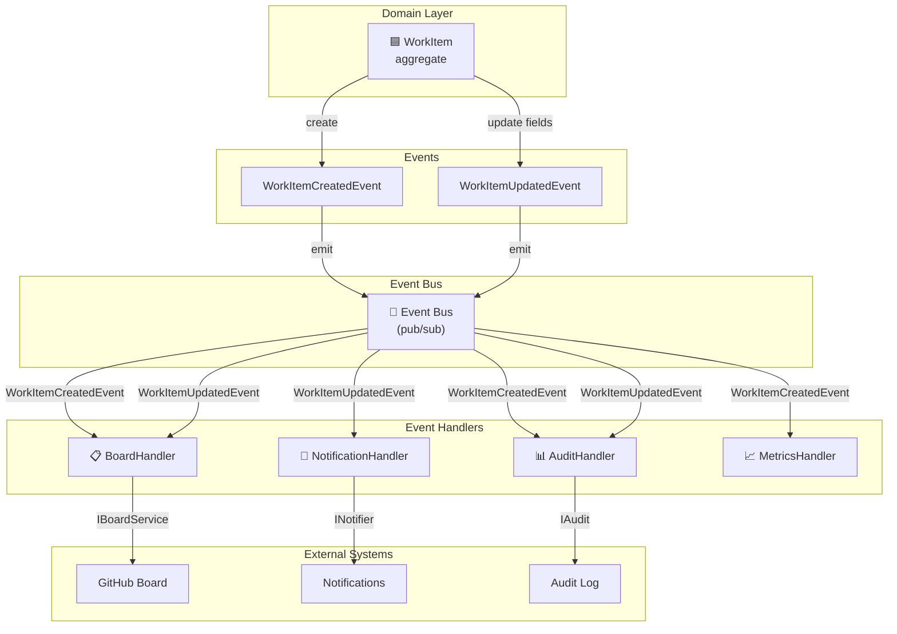
```mermaid
graph TB
    subgraph "Domain Layer"
        WI["🟦 WorkItem<br/>aggregate"]
    end

    subgraph "Events"
        WI -->|create| WI_CREATED["WorkItemCreatedEvent"]
        WI -->|update fields| WI_UPDATED["WorkItemUpdatedEvent"]
    end

    subgraph "Event Bus"
        BUS["📢 Event Bus<br/>(pub/sub)"]
        WI_CREATED -->|emit| BUS
        WI_UPDATED -->|emit| BUS
    end

    subgraph "Event Handlers"
        BH["📋 BoardHandler"]
        NH["📧 NotificationHandler"]
        AH["📊 AuditHandler"]
        MH["📈 MetricsHandler"]
    end

    subgraph "External Systems"
        BOARD["GitHub Board"]
        NOTIFY["Notifications"]
        AUDIT["Audit Log"]
    end

    BUS -->|WorkItemCreatedEvent| BH
    BUS -->|WorkItemCreatedEvent| MH
    BUS -->|WorkItemCreatedEvent| AH
    BUS -->|WorkItemUpdatedEvent| BH
    BUS -->|WorkItemUpdatedEvent| NH
    BUS -->|WorkItemUpdatedEvent| AH

    BH -->|IBoardService| BOARD
    NH -->|INotifier| NOTIFY
    AH -->|IAudit| AUDIT
```

---

### Board Context

**File**: `board_events.py` (4 events)

The Board context manages work item positioning on workflow boards (columns) and column SLA monitoring.

```python
@dataclass(frozen=True)
class WorkItemColumnChangedEvent(CodetoreumEvent):
    """Emitted when a work item moves between board columns.

    Fired by: IWorkflowService.transition_stage() → application → domain
    Subscribers:
      - BoardHandler: Update board position via IBoardService
      - SLAMonitor: Start/stop SLA timers
      - MetricsHandler: Record column entry time
      - NotificationHandler: Notify team of progression

    Attributes:
        work_item_id: Work item that moved
        project_id: Project containing the board
        from_column: Previous column name
        to_column: New column name
        timestamp: When move occurred
    """
    work_item_id: str = ""
    project_id: str = ""
    from_column: str = ""
    to_column: str = ""

@dataclass(frozen=True)
class WorkItemPositionChangedEvent(CodetoreumEvent):
    """Emitted when a work item's position changes within a column (ordering).

    Fired by: IBoardService.reorder_items() → external system adapter
    Subscribers:
      - BoardHandler: Update board display
      - QueueHandler: Update queue position tracking

    Attributes:
        work_item_id: Work item that moved
        project_id: Project containing the board
        column: Column where item is located
        old_position: Previous position index
        new_position: New position index
    """
    work_item_id: str = ""
    project_id: str = ""
    column: str = ""
    old_position: int = 0
    new_position: int = 0

@dataclass(frozen=True)
class BoardReconciledEvent(CodetoreumEvent):
    """Emitted when a board's structure is synchronized with workflow template.

    Fired by: IBoardService.reconcile() → application service
    Subscribers:
      - MetricsHandler: Record reconciliation
      - AuditHandler: Log board changes

    Attributes:
        project_id: Project containing the board
        board_id: Board being reconciled
        columns_added: List of new column names
        columns_removed: List of deleted column names
        columns_reordered: List of columns with new positions
    """
    project_id: str = ""
    board_id: str = ""
    columns_added: list[str] = field(default_factory=list)
    columns_removed: list[str] = field(default_factory=list)
    columns_reordered: list[str] = field(default_factory=list)

@dataclass(frozen=True)
class ColumnSLAExceededEvent(CodetoreumEvent):
    """Emitted when a work item exceeds SLA in a column.

    Fired by: SLAMonitor task (infrastructure)
    Subscribers:
      - NotificationHandler: Alert team
      - EscalationHandler: Move to escalation column if configured
      - MetricsHandler: Record SLA breach

    Attributes:
        work_item_id: Work item exceeding SLA
        project_id: Project containing the board
        column: Column where SLA was exceeded
        sla_seconds: SLA threshold that was exceeded
        time_in_column_seconds: Actual time spent in column
    """
    work_item_id: str = ""
    project_id: str = ""
    column: str = ""
    sla_seconds: int = 0
    time_in_column_seconds: int = 0
```

**Event-Flow Diagram**:

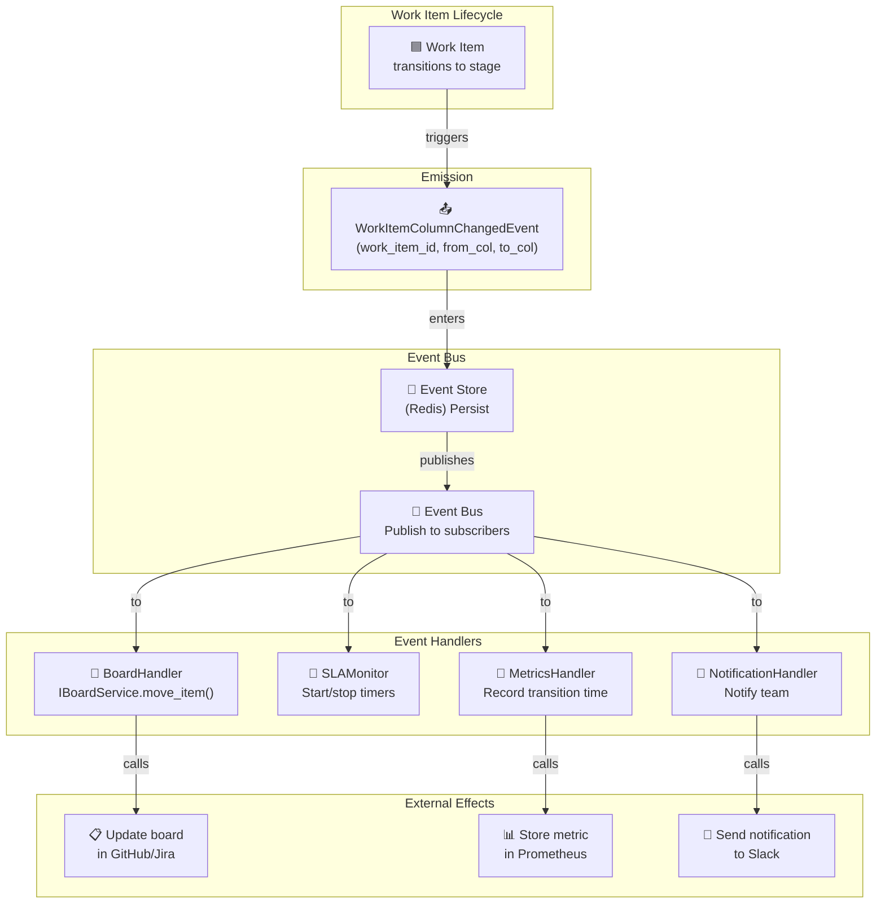
```mermaid
graph TB
    subgraph "Work Item Lifecycle"
        WI["🟦 Work Item<br/>transitions to stage"]
    end

    subgraph "Emission"
        EMIT["📤 WorkItemColumnChangedEvent<br/>(work_item_id, from_col, to_col)"]
    end

    subgraph "Event Bus"
        STORE["💾 Event Store<br/>(Redis) Persist"]
        PUB["📡 Event Bus<br/>Publish to subscribers"]
    end

    subgraph "Event Handlers"
        H1["🔷 BoardHandler<br/>IBoardService.move_item()"]
        H2["🔷 SLAMonitor<br/>Start/stop timers"]
        H3["🔷 MetricsHandler<br/>Record transition time"]
        H4["🔷 NotificationHandler<br/>Notify team"]
    end

    subgraph "External Effects"
        BOARD["📋 Update board<br/>in GitHub/Jira"]
        METRIC["📊 Store metric<br/>in Prometheus"]
        NOTIF["🔔 Send notification<br/>to Slack"]
    end

    WI -->|triggers| EMIT
    EMIT -->|enters| STORE
    STORE -->|publishes| PUB
    PUB -->|to| H1
    PUB -->|to| H2
    PUB -->|to| H3
    PUB -->|to| H4
    H1 -->|calls| BOARD
    H3 -->|calls| METRIC
    H4 -->|calls| NOTIF
```

---

### Execution Context

**File**: `execution_events.py` (9 events)

The Execution context tracks the complete agent execution lifecycle. All 9 events: `ExecutionInitializedEvent`, `ExecutionStartedEvent`, `ExecutionCompletedEvent`, `ExecutionFailedEvent`, `ExecutionTimedOutEvent`, `ExecutionCancelledEvent`, `ExecutionPausedEvent`, `ExecutionResumedEvent`, `ExecutionRetryScheduledEvent`.

```python
@dataclass(frozen=True)
class ExecutionInitializedEvent(CodetoreumEvent):
    """Emitted when an agent execution is registered but not yet running.

    Fired by: AgentExecutionService.initialize_execution() → application service
    Subscribers:
      - ExecutionHandler: Register execution in tracking state
      - MetricsHandler: Record initialization

    Type: ``execution.initialized``

    Attributes:
        execution_id: Unique identifier for this execution
        work_item_id: Work item being processed
        agent_id: Agent assigned to the execution
        stage_name: Workflow stage name for this execution
    """
    execution_id: str = ""
    work_item_id: str = ""
    agent_id: str = ""
    stage_name: str = ""

@dataclass(frozen=True)
class ExecutionStartedEvent(CodetoreumEvent):
    """Emitted when an agent execution begins running inside its container.

    Fired by: AgentExecutionService.start_execution() → application service
    Subscribers:
      - ExecutionHandler: Mark execution as RUNNING
      - MetricsHandler: Record start time

    Type: ``execution.started``

    Attributes:
        execution_id: Unique identifier for this execution
        work_item_id: Work item being processed
        agent_id: Agent assigned to the execution
        container_name: Name of the container where the agent runs (None if not yet allocated)
    """
    execution_id: str = ""
    work_item_id: str = ""
    agent_id: str = ""
    container_name: str | None = None

@dataclass(frozen=True)
class ExecutionCompletedEvent(CodetoreumEvent):
    """Emitted when an agent execution completes successfully.

    Fired by: AgentExecutionService.complete_execution() → application service
    Subscribers:
      - ExecutionHandler: Mark execution as COMPLETED, release container
      - WorkflowHandler: Advance work item to next stage
      - MetricsHandler: Record completion time and token usage

    Type: ``execution.completed``

    Attributes:
        execution_id: Unique identifier for this execution
        work_item_id: Work item that was processed
        agent_id: Agent that completed the execution
        output: Execution result text
        input_tokens: Number of input tokens consumed
        output_tokens: Number of output tokens produced
    """
    execution_id: str = ""
    work_item_id: str = ""
    agent_id: str = ""
    output: str = ""
    input_tokens: int = 0
    output_tokens: int = 0

@dataclass(frozen=True)
class ExecutionFailedEvent(CodetoreumEvent):
    """Emitted when an agent execution fails with an error.

    Fired by: AgentExecutionService.fail_execution() → application service
    Subscribers:
      - ExecutionHandler: Mark execution as FAILED, release container
      - RepairCycleHandler: Possibly trigger repair cycle
      - NotificationHandler: Notify team of failure
      - MetricsHandler: Record failure

    Type: ``execution.failed``

    Attributes:
        execution_id: Unique identifier for this execution
        work_item_id: Work item that was being processed
        agent_id: Agent that failed
        error: Short error identifier or category
        error_message: Detailed error description
        exit_code: Process exit code if available (None if not applicable)
    """
    execution_id: str = ""
    work_item_id: str = ""
    agent_id: str = ""
    error: str = ""
    error_message: str = ""
    exit_code: int | None = None

@dataclass(frozen=True)
class ExecutionTimedOutEvent(CodetoreumEvent):
    """Emitted when an agent execution exceeds its timeout threshold.

    Fired by: ExecutionTimeoutWatchdog (infrastructure)
    Subscribers:
      - ExecutionHandler: Mark execution as TIMEOUT, release resources
      - NotificationHandler: Notify team of timeout
      - MetricsHandler: Record timeout metric
      - RepairCycleHandler: Possibly trigger repair cycle

    Type: ``execution.timed_out``

    Attributes:
        execution_id: Execution that timed out
        work_item_id: Work item being executed
        timeout_seconds: Timeout threshold that was exceeded
        started_at: ISO 8601 timestamp when execution started
    """
    execution_id: str = ""
    work_item_id: str = ""
    timeout_seconds: int = 0
    started_at: str = ""

@dataclass(frozen=True)
class ExecutionCancelledEvent(CodetoreumEvent):
    """Emitted when an agent execution is cancelled before completion.

    Fired by: AgentExecutionService.cancel_execution() → application service
    Subscribers:
      - ExecutionHandler: Mark execution as CANCELLED, release container
      - MetricsHandler: Record cancellation

    Type: ``execution.cancelled``

    Attributes:
        execution_id: Unique identifier for this execution
        work_item_id: Work item that was being processed
        agent_id: Agent that was executing
        cancelled_at: ISO 8601 timestamp when cancellation occurred
    """
    execution_id: str = ""
    work_item_id: str = ""
    agent_id: str = ""
    cancelled_at: str = ""

@dataclass(frozen=True)
class ExecutionPausedEvent(CodetoreumEvent):
    """Emitted when an agent execution is paused.

    Fired by: AgentExecutionService.pause_execution() → application service
    Subscribers:
      - ExecutionHandler: Mark execution as PAUSED
      - MetricsHandler: Record pause time

    Type: ``execution.paused``

    Attributes:
        execution_id: Unique identifier for this execution
        work_item_id: Work item being processed
        agent_id: Agent that was executing
        paused_at: ISO 8601 timestamp when execution was paused
    """
    execution_id: str = ""
    work_item_id: str = ""
    agent_id: str = ""
    paused_at: str = ""

@dataclass(frozen=True)
class ExecutionResumedEvent(CodetoreumEvent):
    """Emitted when a paused agent execution is resumed.

    Fired by: AgentExecutionService.resume_execution() → application service
    Subscribers:
      - ExecutionHandler: Mark execution as RUNNING again
      - MetricsHandler: Record resume time

    Type: ``execution.resumed``

    Attributes:
        execution_id: Unique identifier for this execution
        work_item_id: Work item being processed
        agent_id: Agent that is resuming
        resumed_at: ISO 8601 timestamp when execution was resumed
    """
    execution_id: str = ""
    work_item_id: str = ""
    agent_id: str = ""
    resumed_at: str = ""

@dataclass(frozen=True)
class ExecutionRetryScheduledEvent(CodetoreumEvent):
    """Emitted when a failed execution is scheduled for retry.

    Fired by: AgentExecutionService.schedule_retry() → application service
    Subscribers:
      - ExecutionHandler: Prepare retry execution record
      - AgentScheduler: Re-queue the execution
      - MetricsHandler: Record retry count

    Type: ``execution.retry_scheduled``

    Attributes:
        execution_id: Unique identifier for the original execution
        work_item_id: Work item being retried
        agent_id: Agent that will retry
        retry_count: Current retry attempt number
        retry_at: ISO 8601 timestamp when retry is scheduled
    """
    execution_id: str = ""
    work_item_id: str = ""
    agent_id: str = ""
    retry_count: int = 0
    retry_at: str = ""
```

**Event-Flow Diagram**:

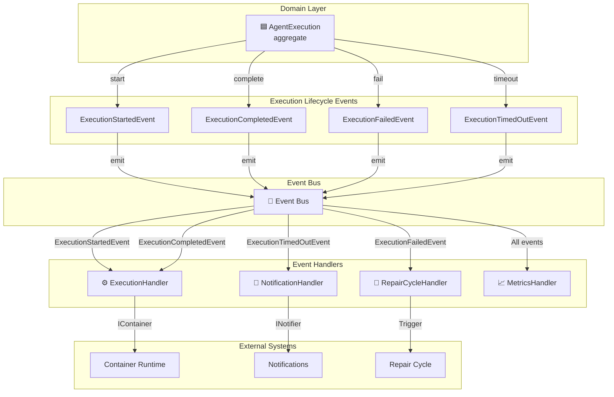
```mermaid
graph TB
    subgraph "Domain Layer"
        EXEC["🟦 AgentExecution<br/>aggregate"]
    end

    subgraph "Execution Lifecycle Events"
        EXEC -->|start| STARTED["ExecutionStartedEvent"]
        EXEC -->|complete| COMPLETED["ExecutionCompletedEvent"]
        EXEC -->|fail| FAILED["ExecutionFailedEvent"]
        EXEC -->|timeout| TIMEOUT["ExecutionTimedOutEvent"]
    end

    subgraph "Event Bus"
        BUS["📢 Event Bus"]
        STARTED -->|emit| BUS
        COMPLETED -->|emit| BUS
        FAILED -->|emit| BUS
        TIMEOUT -->|emit| BUS
    end

    subgraph "Event Handlers"
        EH["⚙️ ExecutionHandler"]
        NH["📧 NotificationHandler"]
        RCH["🔧 RepairCycleHandler"]
        MH["📈 MetricsHandler"]
    end

    subgraph "External Systems"
        CONTAINER["Container Runtime"]
        NOTIFY["Notifications"]
        REPAIR["Repair Cycle"]
    end

    BUS -->|ExecutionStartedEvent| EH
    BUS -->|ExecutionCompletedEvent| EH
    BUS -->|ExecutionFailedEvent| RCH
    BUS -->|ExecutionTimedOutEvent| NH
    BUS -->|All events| MH

    EH -->|IContainer| CONTAINER
    NH -->|INotifier| NOTIFY
    RCH -->|Trigger| REPAIR
```

---

### Review Context

**File**: `review_events.py` (2 events)

The Review context manages code review state and feedback.

```python
@dataclass(frozen=True)
class ReviewStatusChangedEvent(CodetoreumEvent):
    """Emitted when a code review's status changes.

    Fired by: ICodeReviewService.update_review() → adapter
    Subscribers:
      - ReviewHandler: Update review cycle state
      - NotificationHandler: Notify reviewers
      - MetricsHandler: Record review timing

    Attributes:
        review_id: Review being updated
        work_item_id: Work item under review
        old_status: Previous review status
        new_status: New review status
    """
    review_id: str = ""
    work_item_id: str = ""
    old_status: str = ""
    new_status: str = ""

@dataclass(frozen=True)
class ReviewCommentAddedEvent(CodetoreumEvent):
    """Emitted when a comment is added to a code review.

    Fired by: ICodeReviewService.add_comment() → adapter
    Subscribers:
      - ReviewHandler: Update review feedback
      - NotificationHandler: Notify other reviewers

    Attributes:
        review_id: Review being commented on
        comment_id: New comment ID
        author_id: Who left the comment
        body: Comment text
    """
    review_id: str = ""
    comment_id: str = ""
    author_id: str = ""
    body: str = ""
```

**Event-Flow Diagram**:

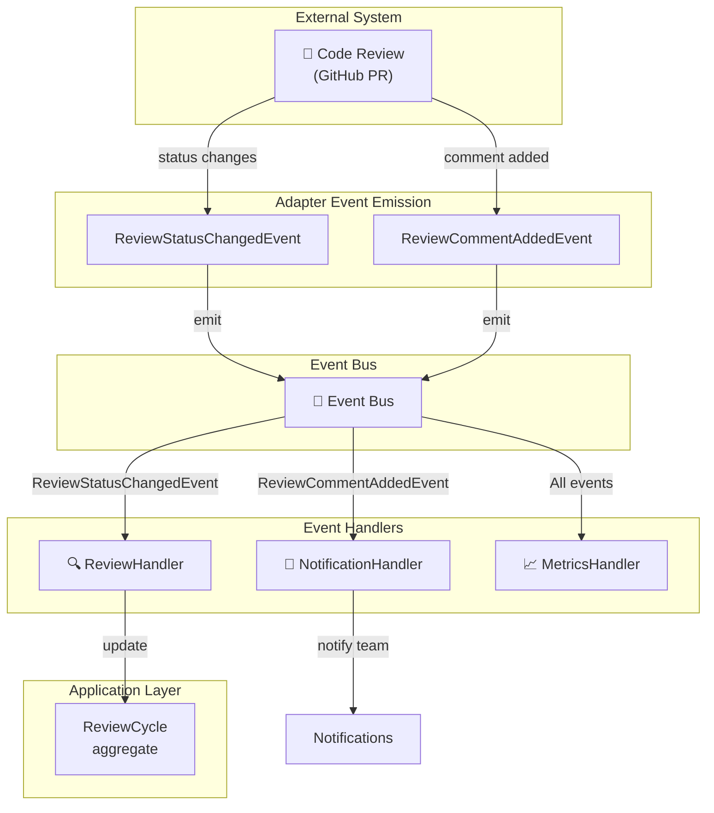
```mermaid
graph TB
    subgraph "External System"
        REVIEW["🔄 Code Review<br/>(GitHub PR)"]
    end

    subgraph "Adapter Event Emission"
        REVIEW -->|status changes| STATUS["ReviewStatusChangedEvent"]
        REVIEW -->|comment added| COMMENT["ReviewCommentAddedEvent"]
    end

    subgraph "Event Bus"
        BUS["📢 Event Bus"]
        STATUS -->|emit| BUS
        COMMENT -->|emit| BUS
    end

    subgraph "Event Handlers"
        RH["🔍 ReviewHandler"]
        NH["📧 NotificationHandler"]
        MH["📈 MetricsHandler"]
    end

    subgraph "Application Layer"
        RC["ReviewCycle<br/>aggregate"]
    end

    BUS -->|ReviewStatusChangedEvent| RH
    BUS -->|ReviewCommentAddedEvent| NH
    BUS -->|All events| MH

    RH -->|update| RC
    NH -->|notify team| NOTIFY["Notifications"]
```

---

### Review Cycle Context

**File**: `review_cycle_events.py` (11 events)

The Review Cycle context (domain layer) models maker-checker code review cycles with iteration and feedback. All 11 events: `ReviewCycleCreatedEvent`, `ReviewCycleStartedEvent`, `ReviewCycleIterationStartedEvent`, `ReviewCycleIterationCompletedEvent`, `ReviewCycleFeedbackSubmittedEvent`, `ReviewCycleMakerRevisionEvent`, `ReviewCycleEscalatedToHumanEvent`, `ReviewCycleHumanFeedbackReceivedEvent`, `ReviewCycleMaxIterationsReachedEvent`, `ReviewCycleApprovedEvent`, `ReviewCycleRejectedEvent`.

The following are representative examples:

```python
@dataclass(frozen=True)
class ReviewCycleStartedEvent(CodetoreumEvent):
    """Emitted when a new review cycle begins.

    Fired by: ReviewService.create_review_cycle() → domain
    Subscribers:
      - ReviewHandler: Initialize review state
      - NotificationHandler: Notify reviewers to start
      - MetricsHandler: Record review start time

    Attributes:
        review_cycle_id: New review cycle ID
        work_item_id: Item under review
        project_id: Project containing the item
        maker_agent: Name of the maker (development) agent
        reviewer_agent: Name of the reviewer (code review) agent
        max_iterations: Maximum iterations before escalation
    """
    review_cycle_id: str = ""
    work_item_id: str = ""
    project_id: str = ""
    maker_agent: str = ""
    reviewer_agent: str = ""
    max_iterations: int = 0

@dataclass(frozen=True)
class ReviewCycleIterationCompletedEvent(CodetoreumEvent):
    """Emitted when a review iteration completes (feedback collected).

    Fired by: ReviewCycle.complete_iteration() → domain
    Subscribers:
      - ReviewHandler: Check if approved/escalate if changes needed
      - NotificationHandler: Notify author of feedback

    Attributes:
        review_cycle_id: Review cycle
        iteration_number: Which iteration completed (1, 2, etc.)
        feedback_count: Number of reviewers who provided feedback
    """
    review_cycle_id: str = ""
    iteration_number: int = 0
    feedback_count: int = 0

@dataclass(frozen=True)
class ReviewCycleApprovedEvent(CodetoreumEvent):
    """Emitted when a review cycle is approved (sufficient positive feedback).

    Fired by: ReviewCycle.approve() → domain
    Subscribers:
      - WorkflowHandler: Advance work item to next stage
      - NotificationHandler: Notify team of approval
      - MetricsHandler: Record review completion time

    Attributes:
        review_cycle_id: Review cycle being approved
        work_item_id: Item that was approved
        project_id: Project
        approvers: List of reviewer IDs who approved
    """
    review_cycle_id: str = ""
    work_item_id: str = ""
    project_id: str = ""
    approvers: list[str] = field(default_factory=list)

@dataclass(frozen=True)
class ReviewCycleEscalatedToHumanEvent(CodetoreumEvent):
    """Emitted when review cycle is escalated to human for decision.

    Fired by: ReviewCycle.escalate() → domain
    Subscribers:
      - EscalationHandler: Notify human reviewer
      - MetricsHandler: Record escalation

    Attributes:
        review_cycle_id: Review cycle being escalated
        work_item_id: Item requiring escalation
        iteration: Iteration when escalation occurred
        blocking_count: Number of blocking findings
        escalation_reason: Reason for escalation (BLOCKED or MAX_ITERATIONS)
    """
    review_cycle_id: str = ""
    work_item_id: str = ""
    iteration: int = 0
    blocking_count: int = 0
    escalation_reason: str = ""

@dataclass(frozen=True)
class ReviewCycleMakerRevisionEvent(CodetoreumEvent):
    """Emitted when maker completes a revision.

    Fired by: ReviewCycle.apply_revision() → domain
    Subscribers:
      - ReviewHandler: Prepare for new review iteration
      - MetricsHandler: Record revision completion

    Attributes:
        review_cycle_id: Review cycle ID
        work_item_id: Item being revised
        iteration: Iteration number of this revision
    """
    review_cycle_id: str = ""
    work_item_id: str = ""
    iteration: int = 0

@dataclass(frozen=True)
class ReviewCycleHumanFeedbackReceivedEvent(CodetoreumEvent):
    """Emitted when human feedback is received on escalated cycle.

    Fired by: ReviewService.receive_human_feedback() → application
    Subscribers:
      - ReviewHandler: Process feedback and resume cycle
      - NotificationHandler: Notify team of feedback
      - MetricsHandler: Record feedback received

    Attributes:
        review_cycle_id: Review cycle ID
        work_item_id: Item receiving feedback
        feedback: The human feedback provided
    """
    review_cycle_id: str = ""
    work_item_id: str = ""
    feedback: str = ""

@dataclass(frozen=True)
class ReviewCycleMaxIterationsReachedEvent(CodetoreumEvent):
    """Emitted when max iterations reached without approval.

    Fired by: ReviewCycle.check_max_iterations() → domain
    Subscribers:
      - ReviewHandler: Escalate to human decision
      - NotificationHandler: Notify team of escalation
      - MetricsHandler: Record max iterations reached

    Attributes:
        review_cycle_id: Review cycle ID
        work_item_id: Item requiring decision
        max_iterations: Maximum iterations configured
    """
    review_cycle_id: str = ""
    work_item_id: str = ""
    max_iterations: int = 0

@dataclass(frozen=True)
class ReviewCycleCreatedEvent(CodetoreumEvent):
    """Emitted when a new review cycle object is created (before it starts).

    Fired by: ReviewService.create_review_cycle() → application service
    Subscribers:
      - ReviewHandler: Register review cycle in tracking state
      - MetricsHandler: Record creation

    Type: ``review_cycle.created``

    Attributes:
        review_cycle_id: Unique identifier for the review cycle
        workflow_id: ID of the workflow this cycle belongs to
        stage_name: Name of the workflow stage triggering the review
        maker_agent_id: ID of the maker (development) agent
        reviewer_agent_id: ID of the reviewer (code review) agent
        max_iterations: Maximum iterations before escalation
    """
    review_cycle_id: str = ""
    workflow_id: str = ""
    stage_name: str = ""
    maker_agent_id: str = ""
    reviewer_agent_id: str = ""
    max_iterations: int = 0

@dataclass(frozen=True)
class ReviewCycleIterationStartedEvent(CodetoreumEvent):
    """Emitted when a new maker-checker iteration begins within a review cycle.

    Fired by: ReviewService.start_iteration() → application service
    Subscribers:
      - ReviewHandler: Initialize iteration tracking
      - MetricsHandler: Record iteration start time

    Type: ``review_cycle.iteration_started``

    Attributes:
        review_cycle_id: ID of the review cycle
        iteration_number: The iteration number (1-indexed)
        maker_execution_id: Execution ID of the maker agent's run for this iteration
    """
    review_cycle_id: str = ""
    iteration_number: int = 0
    maker_execution_id: str = ""

@dataclass(frozen=True)
class ReviewCycleFeedbackSubmittedEvent(CodetoreumEvent):
    """Emitted when the reviewer agent submits feedback on an iteration.

    Fired by: ReviewService.submit_feedback() → application service
    Subscribers:
      - ReviewHandler: Apply feedback decision (approve, request changes, escalate)
      - NotificationHandler: Notify maker of feedback
      - MetricsHandler: Record review duration

    Type: ``review_cycle.feedback_submitted``

    Attributes:
        review_cycle_id: ID of the review cycle
        iteration_number: The iteration number receiving feedback (1-indexed)
        decision: Reviewer decision (``approve``, ``request_changes``, ``escalate``)
        reviewer_execution_id: Execution ID of the reviewer agent's run
        issues_count: Number of issues found by the reviewer
    """
    review_cycle_id: str = ""
    iteration_number: int = 0
    decision: str = ""
    reviewer_execution_id: str = ""
    issues_count: int = 0

@dataclass(frozen=True)
class ReviewCycleRejectedEvent(CodetoreumEvent):
    """Emitted when a review cycle ends with rejection after reaching the maximum iterations.

    Fired by: ReviewService.reject_cycle() → application service
    Subscribers:
      - WorkflowHandler: Move work item to a failure or escalation state
      - NotificationHandler: Notify team of rejection
      - MetricsHandler: Record rejection

    Type: ``review_cycle.rejected``

    Attributes:
        review_cycle_id: ID of the review cycle that was rejected
        final_iteration: The final iteration number reached
        rejection_reason: Human-readable reason for rejection
    """
    review_cycle_id: str = ""
    final_iteration: int = 0
    rejection_reason: str = ""
```

**Event-Flow Diagram**:

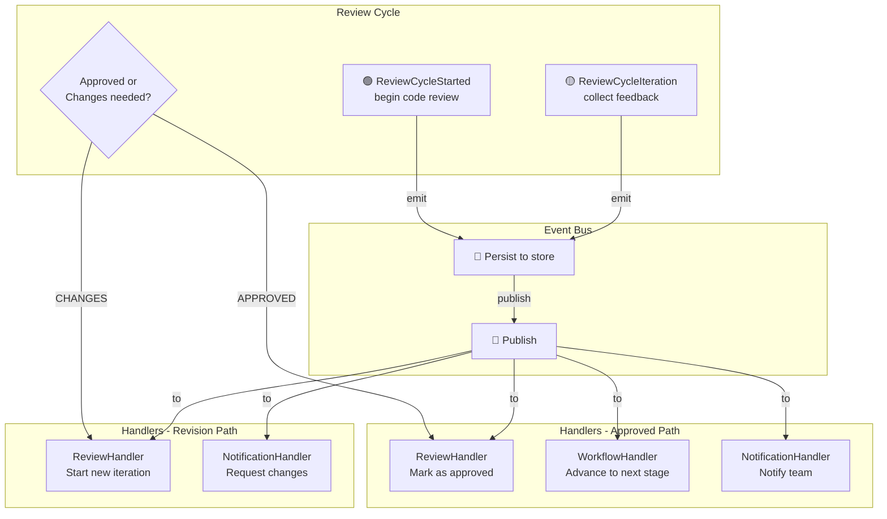
```mermaid
graph TB
    subgraph "Review Cycle"
        START["🟢 ReviewCycleStarted<br/>begin code review"]
        ITER["🟡 ReviewCycleIteration<br/>collect feedback"]
        DECISION{"Approved or<br/>Changes needed?"}
    end

    subgraph "Event Bus"
        STORE1["💾 Persist to store"]
        PUB1["📡 Publish"]
    end

    subgraph "Handlers - Approved Path"
        H_APP["ReviewHandler<br/>Mark as approved"]
        H_WF["WorkflowHandler<br/>Advance to next stage"]
        H_NOTIF["NotificationHandler<br/>Notify team"]
    end

    subgraph "Handlers - Revision Path"
        H_ITER["ReviewHandler<br/>Start new iteration"]
        H_NOTIF2["NotificationHandler<br/>Request changes"]
    end

    START -->|emit| STORE1
    STORE1 -->|publish| PUB1
    ITER -->|emit| STORE1
    DECISION -->|APPROVED| H_APP
    DECISION -->|CHANGES| H_ITER
    PUB1 -->|to| H_APP
    PUB1 -->|to| H_WF
    PUB1 -->|to| H_NOTIF
    PUB1 -->|to| H_ITER
    PUB1 -->|to| H_NOTIF2
```

---

### PR Review Cycle Context

**File**: `pr_review_cycle_events.py` (13 events)

PR Review Cycle handles the multi-phase code review process for pull requests.

```python
@dataclass(frozen=True)
class PRReviewCycleStartedEvent(CodetoreumEvent):
    """Emitted when a PR review cycle begins.

    Fired by: PRReviewService.start_review_cycle() → application
    Subscribers:
      - PRReviewHandler: Initialize PR review state
      - MetricsHandler: Record start time

    Attributes:
        pr_review_cycle_id: New review cycle ID
        work_item_id: Work item with PR
        pr_id: Pull request ID
        project_id: Project
    """
    pr_review_cycle_id: str = ""
    work_item_id: str = ""
    pr_id: str = ""
    project_id: str = ""

@dataclass(frozen=True)
class PRReviewCycleCodeReviewStartedEvent(CodetoreumEvent):
    """Emitted when code review phase starts (after auto-check phase).

    Attributes:
        pr_review_cycle_id: Review cycle
        pr_id: Pull request
    """
    pr_review_cycle_id: str = ""
    pr_id: str = ""

@dataclass(frozen=True)
class PRReviewCycleVerificationStartedEvent(CodetoreumEvent):
    """Emitted when verification phase starts (after code review).

    Attributes:
        pr_review_cycle_id: Review cycle
        pr_id: Pull request
    """
    pr_review_cycle_id: str = ""
    pr_id: str = ""

@dataclass(frozen=True)
class PRReviewCyclePhaseStartedEvent(CodetoreumEvent):
    """Emitted when any PR review cycle phase starts.

    Unified event for phase initiation across all phases (code review, verification, CI check, consolidation).

    Attributes:
        pr_id: GitHub PR identifier
        phase_name: Name of the phase starting (code_review, verification, ci_check, consolidation)
        phase_index: Position in phase sequence (1-based)
        agent_id: ID of the agent executing this phase
        context_source: Context source for this phase (e.g., pr_diff, parent_issue, ba_output, or empty string)
        workflow_run_id: ID of the workflow run
    """
    pr_id: str = ""
    phase_name: str = ""
    phase_index: int = 0
    agent_id: str = ""
    context_source: str = ""
    workflow_run_id: str = ""

@dataclass(frozen=True)
class PRReviewCycleCICheckCompletedEvent(CodetoreumEvent):
    """Emitted when Phase 3 CI check completes.

    Fired by: PRReviewService.complete_ci_check() → application
    Subscribers:
      - PRReviewHandler: Update review state
      - MetricsHandler: Record CI check results

    Attributes:
        pr_id: GitHub PR identifier
        passed: Whether CI check passed
        failures_count: Number of failing CI checks
        pending_count: Number of pending CI checks
        duration_seconds: Time taken for CI check
        workflow_run_id: ID of the workflow run
    """
    pr_id: str = ""
    passed: bool = False
    failures_count: int = 0
    pending_count: int = 0
    duration_seconds: float = 0.0
    workflow_run_id: str = ""

@dataclass(frozen=True)
class PRReviewCycleConsolidationStartedEvent(CodetoreumEvent):
    """Emitted when Phase 4 consolidation starts.

    Fired by: PRReviewService.start_consolidation() → application
    Subscribers:
      - PRReviewHandler: Initialize consolidation state
      - MetricsHandler: Record consolidation start time

    Attributes:
        pr_id: GitHub PR identifier
        finding_count: Number of findings to consolidate
        workflow_run_id: ID of the workflow run
    """
    pr_id: str = ""
    finding_count: int = 0
    workflow_run_id: str = ""

@dataclass(frozen=True)
class PRReviewCycleIssuesFoundEvent(CodetoreumEvent):
    """Emitted when issues are found in review (cycle has problems to fix).

    Fired by: PRReviewService.record_issues() → application
    Subscribers:
      - NotificationHandler: Notify team of issues
      - MetricsHandler: Record issue statistics
      - WorkflowHandler: Plan next cycle

    Attributes:
        pr_id: GitHub PR identifier
        work_item_id: Work item ID being reviewed
        cycle_number: Iteration number (1-based)
        total: Total number of findings
        critical: Number of critical severity findings
        high: Number of high severity findings
        medium: Number of medium severity findings
        low: Number of low severity findings
        sub_issue_count: Number of created sub-issues
        cycle_duration_seconds: Total time for this cycle
        next_column: Column to move item to
        workflow_run_id: ID of the workflow run
    """
    pr_id: str = ""
    work_item_id: str = ""
    cycle_number: int = 0
    total: int = 0
    critical: int = 0
    high: int = 0
    medium: int = 0
    low: int = 0
    sub_issue_count: int = 0
    cycle_duration_seconds: float = 0.0
    next_column: str = ""
    workflow_run_id: str = ""

@dataclass(frozen=True)
class PRReviewCycleMaxCyclesReachedEvent(CodetoreumEvent):
    """Emitted when maximum review cycles reached without resolution.

    Fired by: PRReviewService.check_max_cycles() → application
    Subscribers:
      - EscalationHandler: Escalate to human
      - NotificationHandler: Notify team
      - MetricsHandler: Record escalation

    Attributes:
        pr_id: GitHub PR identifier
        work_item_id: Work item ID being reviewed
        cycle_number: Iteration number that exceeded limit
        max_cycles: Maximum cycles configured
        next_column: Column to move item to (escalation column)
        workflow_run_id: ID of the workflow run
    """
    pr_id: str = ""
    work_item_id: str = ""
    cycle_number: int = 0
    max_cycles: int = 0
    next_column: str = ""
    workflow_run_id: str = ""

@dataclass(frozen=True)
class PRReviewCycleEscalatedEvent(CodetoreumEvent):
    """Emitted when cycle is escalated to human reviewer.

    Fired by: PRReviewService.escalate() → application
    Subscribers:
      - EscalationHandler: Route to human reviewer
      - NotificationHandler: Notify human reviewer
      - MetricsHandler: Record escalation

    Attributes:
        pr_id: GitHub PR identifier
        reason: Reason for escalation (e.g., max_cycles_reached)
        cycle_number: Iteration number when escalation occurred
        workflow_run_id: ID of the workflow run
    """
    pr_id: str = ""
    reason: str = ""
    cycle_number: int = 0
    workflow_run_id: str = ""

@dataclass(frozen=True)
class PRReviewCycleSubIssuesCreatedEvent(CodetoreumEvent):
    """Emitted when sub-issues are created during PR review cycle.

    Fired by: PRReviewService.create_sub_issues() → application
    Subscribers:
      - BoardHandler: Add sub-issues to board
      - NotificationHandler: Notify team of sub-issues
      - MetricsHandler: Record sub-issue creation

    Attributes:
        pr_id: GitHub PR identifier
        cycle_number: Iteration number (1-based)
        count: Number of sub-issues created
        work_item_ids: IDs of created work items (sub-issues)
        target_board: Board ID where sub-issues were created
        workflow_run_id: ID of the workflow run
    """
    pr_id: str = ""
    cycle_number: int = 0
    count: int = 0
    work_item_ids: list[str] = field(default_factory=list)
    target_board: str = ""
    workflow_run_id: str = ""

@dataclass(frozen=True)
class PRReviewCyclePhaseCompletedEvent(CodetoreumEvent):
    """Emitted when a PR review cycle phase completes.

    Fired by: PRReviewService.complete_phase() → application
    Subscribers:
      - PRReviewHandler: Advance to next phase
      - MetricsHandler: Record phase duration

    Attributes:
        pr_id: GitHub PR identifier
        phase_name: Name of the completed phase
        phase_index: Position in phase sequence (1-based)
        findings_count: Number of findings in this phase
        comment_id: ID of comment associated with phase (if any)
        workflow_run_id: ID of the workflow run
    """
    pr_id: str = ""
    phase_name: str = ""
    phase_index: int = 0
    findings_count: int = 0
    comment_id: str = ""
    workflow_run_id: str = ""

@dataclass(frozen=True)
class PRReviewCycleConsolidationCompletedEvent(CodetoreumEvent):
    """Emitted when PR review cycle consolidation phase completes.

    Fired by: PRReviewService.complete_consolidation() → application
    Subscribers:
      - WorkflowHandler: Advance work item or escalate
      - NotificationHandler: Notify team of outcome
      - MetricsHandler: Record cycle completion

    Attributes:
        pr_id: GitHub PR identifier
        total_findings: Total number of findings across all phases
        critical: Number of critical severity findings
        high: Number of high severity findings
        medium: Number of medium severity findings
        low: Number of low severity findings
        consolidation_duration_seconds: Time taken for consolidation
        workflow_run_id: ID of the workflow run
    """
    pr_id: str = ""
    total_findings: int = 0
    critical: int = 0
    high: int = 0
    medium: int = 0
    low: int = 0
    consolidation_duration_seconds: float = 0.0
    workflow_run_id: str = ""

@dataclass(frozen=True)
class PRReviewCycleApprovedEvent(CodetoreumEvent):
    """Emitted when PR review cycle is approved and ready to merge.

    Fired by: PRReviewCycle.approve() → domain
    Subscribers:
      - MergeHandler: Merge PR if auto-merge enabled
      - NotificationHandler: Notify team

    Attributes:
        pr_review_cycle_id: Review cycle
        work_item_id: Work item
        pr_id: Pull request
        auto_merge: Whether to automatically merge
    """
    pr_review_cycle_id: str = ""
    work_item_id: str = ""
    pr_id: str = ""
    auto_merge: bool = False

```

**Event-Flow Diagram**:

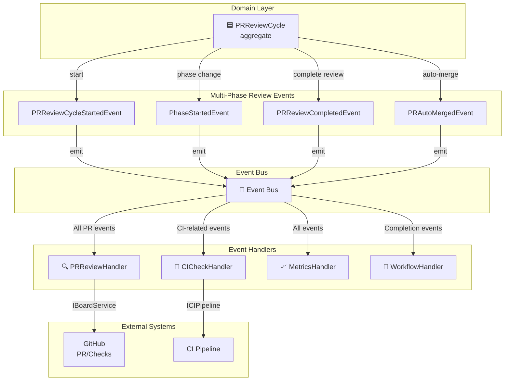
```mermaid
graph TB
    subgraph "Domain Layer"
        PRC["🟦 PRReviewCycle<br/>aggregate"]
    end

    subgraph "Multi-Phase Review Events"
        PRC -->|start| STARTED["PRReviewCycleStartedEvent"]
        PRC -->|phase change| PHASE["PhaseStartedEvent"]
        PRC -->|complete review| COMPLETED["PRReviewCompletedEvent"]
        PRC -->|auto-merge| MERGED["PRAutoMergedEvent"]
    end

    subgraph "Event Bus"
        BUS["📢 Event Bus"]
        STARTED -->|emit| BUS
        PHASE -->|emit| BUS
        COMPLETED -->|emit| BUS
        MERGED -->|emit| BUS
    end

    subgraph "Event Handlers"
        PRH["🔍 PRReviewHandler"]
        CIH["🔧 CICheckHandler"]
        MH["📈 MetricsHandler"]
        WFH["🔄 WorkflowHandler"]
    end

    subgraph "External Systems"
        GITHUB["GitHub<br/>PR/Checks"]
        CI["CI Pipeline"]
    end

    BUS -->|All PR events| PRH
    BUS -->|CI-related events| CIH
    BUS -->|All events| MH
    BUS -->|Completion events| WFH

    PRH -->|IBoardService| GITHUB
    CIH -->|ICIPipeline| CI
```

---

### Repair Cycle Context

**File**: `repair_cycle_events.py` (23 events)

Repair Cycle handles test-fix-verify cycles for failing tests.

```python
@dataclass(frozen=True)
class RepairCycleStartedEvent(CodetoreumEvent):
    """Emitted when a repair cycle begins (fixing failing tests).

    Fired by: RepairCycleService.start() → application
    Subscribers:
      - RepairHandler: Initialize repair state
      - MetricsHandler: Record start time

    Attributes:
        repair_cycle_id: New repair cycle ID
        work_item_id: Work item with failing tests
        test_failures: List of failing tests
    """
    repair_cycle_id: str = ""
    work_item_id: str = ""
    test_failures: list[str] = field(default_factory=list)

@dataclass(frozen=True)
class RepairCycleTestExecutionStartedEvent(CodetoreumEvent):
    """Emitted when repair cycle begins test execution.

    Attributes:
        repair_cycle_id: Repair cycle
        test_count: Number of tests to run
    """
    repair_cycle_id: str = ""
    test_count: int = 0

@dataclass(frozen=True)
class RepairCycleTestExecutionCompletedEvent(CodetoreumEvent):
    """Emitted when test execution phase completes.

    Attributes:
        repair_cycle_id: Repair cycle
        passed: Number of tests that passed
        failed: Number of tests that failed
    """
    repair_cycle_id: str = ""
    passed: int = 0
    failed: int = 0

@dataclass(frozen=True)
class RepairCycleCompletedEvent(CodetoreumEvent):
    """Emitted when repair cycle completes (all tests passing or max retries).

    Fired by: RepairCycle.complete() → domain
    Subscribers:
      - WorkflowHandler: Advance work item
      - NotificationHandler: Notify team
      - MetricsHandler: Record cycle metrics

    Attributes:
        repair_cycle_id: Completed repair cycle
        work_item_id: Work item
        success: Whether all tests now pass
        iterations: Number of fix attempts
    """
    repair_cycle_id: str = ""
    work_item_id: str = ""
    success: bool = False
    iterations: int = 0

@dataclass(frozen=True)
class RepairCycleFixCycleStartedEvent(CodetoreumEvent):
    """Emitted when fix cycle starts after test failures (FR-3.2).

    Fired by: RepairCycle.start_fix_cycle() → domain
    Subscribers:
      - RepairCycleHandler: Initialize fix cycle state
      - MetricsHandler: Record cycle start time

    Attributes:
        test_type: Type of test that failed (UNIT, INTEGRATION, etc.)
        test_type_index: Position in test type sequence (starts at 1)
        test_cycle_iteration: Current iteration number (starts at 1)
        file_count: Number of files with failures to fix
        total_failures: Total number of failures across all files
        workflow_run_id: ID of the workflow run
    """
    test_type: RepairTestType = RepairTestType.UNIT
    test_type_index: int = 0
    test_cycle_iteration: int = 0
    file_count: int = 0
    total_failures: int = 0
    workflow_run_id: str = ""

@dataclass(frozen=True)
class RepairCycleFileFixStartedEvent(CodetoreumEvent):
    """Emitted when agent starts fixing a specific file."""
    file_path: str = ""
    issue_count: int = 0
    workflow_run_id: str = ""

@dataclass(frozen=True)
class RepairCycleFileFixCompletedEvent(CodetoreumEvent):
    """Emitted when agent completes fixing a file."""
    file_path: str = ""
    fixes_applied: int = 0
    duration_seconds: float = 0.0
    workflow_run_id: str = ""

@dataclass(frozen=True)
class RepairCycleWarningReviewStartedEvent(CodetoreumEvent):
    """Emitted when warning review begins."""
    test_type: RepairTestType = RepairTestType.UNIT
    warning_count: int = 0
    workflow_run_id: str = ""

@dataclass(frozen=True)
class RepairCycleWarningReviewCompletedEvent(CodetoreumEvent):
    """Emitted when warning review completes."""
    test_type: RepairTestType = RepairTestType.UNIT
    warnings_reviewed: int = 0
    action_items: int = 0
    workflow_run_id: str = ""

@dataclass(frozen=True)
class RepairCycleTestCycleCompletedEvent(CodetoreumEvent):
    """Emitted when test cycle for a single test type completes."""
    test_type: RepairTestType = RepairTestType.UNIT
    result_passed: bool = False
    iterations_used: int = 0
    workflow_run_id: str = ""

@dataclass(frozen=True)
class RepairCycleFastFailEvent(CodetoreumEvent):
    """Emitted when repair cycle fails fast due to unrecoverable error."""
    error_message: str = ""
    error_type: str = ""
    test_type: RepairTestType = RepairTestType.UNIT
    iteration: int = 0
    workflow_run_id: str = ""

@dataclass(frozen=True)
class RepairCycleResumedEvent(CodetoreumEvent):
    """Emitted when repair cycle resumes after pause or interruption."""
    reason_resumed: str = ""
    from_iteration: int = 0
    workflow_run_id: str = ""

@dataclass(frozen=True)
class RepairCycleCheckpointFailedEvent(CodetoreumEvent):
    """Emitted when checkpoint save fails (recovery may not be possible).

    Fired by: CheckpointService.save() → infrastructure
    Subscribers:
      - RecoveryHandler: Mark cycle unrecoverable
      - MetricsHandler: Record checkpoint failure
      - AlertHandler: Notify operators

    Attributes:
        workflow_run_id: ID of the workflow run
        test_type: Type of test being executed (UNIT, INTEGRATION, E2E)
        iteration: Current iteration number (1-based)
        error_type: Type of error (e.g., ConnectionError)
        error_message: Error message details
        checkpoint_store_type: Type of checkpoint store (e.g., RedisCheckpointStore)
    """
    workflow_run_id: str = ""
    test_type: str = ""
    iteration: int = 0
    error_type: str = ""
    error_message: str = ""
    checkpoint_store_type: str = ""

@dataclass(frozen=True)
class RepairCycleMetricsBackendFailedEvent(CodetoreumEvent):
    """Emitted when metrics backend fails (critical observability degradation).

    Fired by: MetricsAdapter (resilience decorator) → infrastructure
    Subscribers:
      - MetricsHandler: Log metrics backend failure
      - AlertHandler: Page on-call for observability
      - CircuitBreakerHandler: Open circuit breaker

    Attributes:
        operation: Operation that failed (e.g., repair_cycle_started)
        error_type: Type of error (e.g., ConnectionError)
        error_message: Error message details
        consecutive_failures: Number of consecutive failures so far
        circuit_breaker_open: True if circuit breaker is now open
        workflow_run_id: ID of the workflow run (may be empty if unknown)
    """
    operation: str = ""
    error_type: str = ""
    error_message: str = ""
    consecutive_failures: int = 0
    circuit_breaker_open: bool = False
    workflow_run_id: str = ""

@dataclass(frozen=True)
class SystemicAnalysisStartedEvent(CodetoreumEvent):
    """Emitted when systemic failure analysis begins."""
    failure_category: str = ""
    affected_test_types: int = 0
    workflow_run_id: str = ""

@dataclass(frozen=True)
class SystemicAnalysisCompletedEvent(CodetoreumEvent):
    """Emitted when systemic failure analysis completes."""
    root_causes_identified: int = 0
    systemic_issue_found: bool = False
    workflow_run_id: str = ""

@dataclass(frozen=True)
class SystemicFixStartedEvent(CodetoreumEvent):
    """Emitted when systemic fix process starts."""
    systemic_issue: str = ""
    workflow_run_id: str = ""

@dataclass(frozen=True)
class SystemicFixCompletedEvent(CodetoreumEvent):
    """Emitted when systemic fix completes."""
    fix_applied: str = ""
    affected_files: int = 0
    workflow_run_id: str = ""

# Environment and Verification Events
@dataclass(frozen=True)
class EnvironmentRebuildStartedEvent(CodetoreumEvent):
    """Emitted when environment rebuild process starts."""
    rebuild_reason: str = ""
    workflow_run_id: str = ""

@dataclass(frozen=True)
class EnvironmentRebuildCompletedEvent(CodetoreumEvent):
    """Emitted when environment rebuild completes successfully."""
    dependencies_installed: int = 0
    duration_seconds: float = 0.0
    workflow_run_id: str = ""

@dataclass(frozen=True)
class EnvironmentVerificationStartedEvent(CodetoreumEvent):
    """Emitted when environment verification begins."""
    checks_planned: int = 0
    workflow_run_id: str = ""

@dataclass(frozen=True)
class EnvironmentVerificationCompletedEvent(CodetoreumEvent):
    """Emitted when environment verification completes."""
    checks_passed: int = 0
    checks_failed: int = 0
    duration_seconds: float = 0.0
    workflow_run_id: str = ""

@dataclass(frozen=True)
class EnvironmentRebuildExhaustedEvent(CodetoreumEvent):
    """Emitted when environment rebuild is exhausted (max attempts reached)."""
    max_attempts: int = 0
    last_error: str = ""
    workflow_run_id: str = ""
```

**Event-Flow Diagram**:

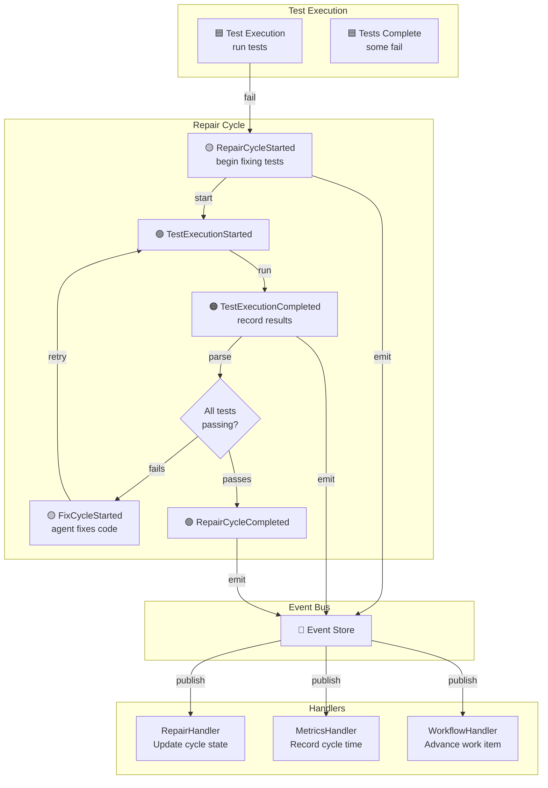
```mermaid
graph TB
    subgraph "Test Execution"
        TE["🟦 Test Execution<br/>run tests"]
        TEC["🟦 Tests Complete<br/>some fail"]
    end

    subgraph "Repair Cycle"
        RCS["🟡 RepairCycleStarted<br/>begin fixing tests"]
        TES["🟢 TestExecutionStarted"]
        TEC2["🟠 TestExecutionCompleted<br/>record results"]
        FIX["🟡 FixCycleStarted<br/>agent fixes code"]
        DECISION{"All tests<br/>passing?"}
        RCC["🟢 RepairCycleCompleted"]
    end

    subgraph "Event Bus"
        STORE2["💾 Event Store"]
    end

    subgraph "Handlers"
        REP_H["RepairHandler<br/>Update cycle state"]
        METRIC_H["MetricsHandler<br/>Record cycle time"]
        WF_H["WorkflowHandler<br/>Advance work item"]
    end

    TE -->|fail| RCS
    RCS -->|emit| STORE2
    RCS -->|start| TES
    TES -->|run| TEC2
    TEC2 -->|emit| STORE2
    TEC2 -->|parse| DECISION
    DECISION -->|fails| FIX
    DECISION -->|passes| RCC
    FIX -->|retry| TES
    RCC -->|emit| STORE2
    STORE2 -->|publish| REP_H
    STORE2 -->|publish| METRIC_H
    STORE2 -->|publish| WF_H
```

---

### Container Context

**File**: `container_events.py` (1 event)

The Container context tracks agent container execution.

```python
@dataclass(frozen=True)
class ContainerExecutionCompletedEvent(CodetoreumEvent):
    """Emitted when a container execution completes.

    Fired by: DockerContainerAdapter → adapter
    Subscribers:
      - ExecutionHandler: Mark execution as COMPLETED
      - WorkspaceHandler: Clean up workspace

    Attributes:
        execution_id: Execution that completed
        container_id: Container that ran
        exit_code: Process exit code (0 = success)
        output: Container stdout
        error: Container stderr
    """
    execution_id: str = ""
    container_id: str = ""
    exit_code: int = 0
    output: str = ""
    error: str = ""
```

**Event-Flow Diagram**:

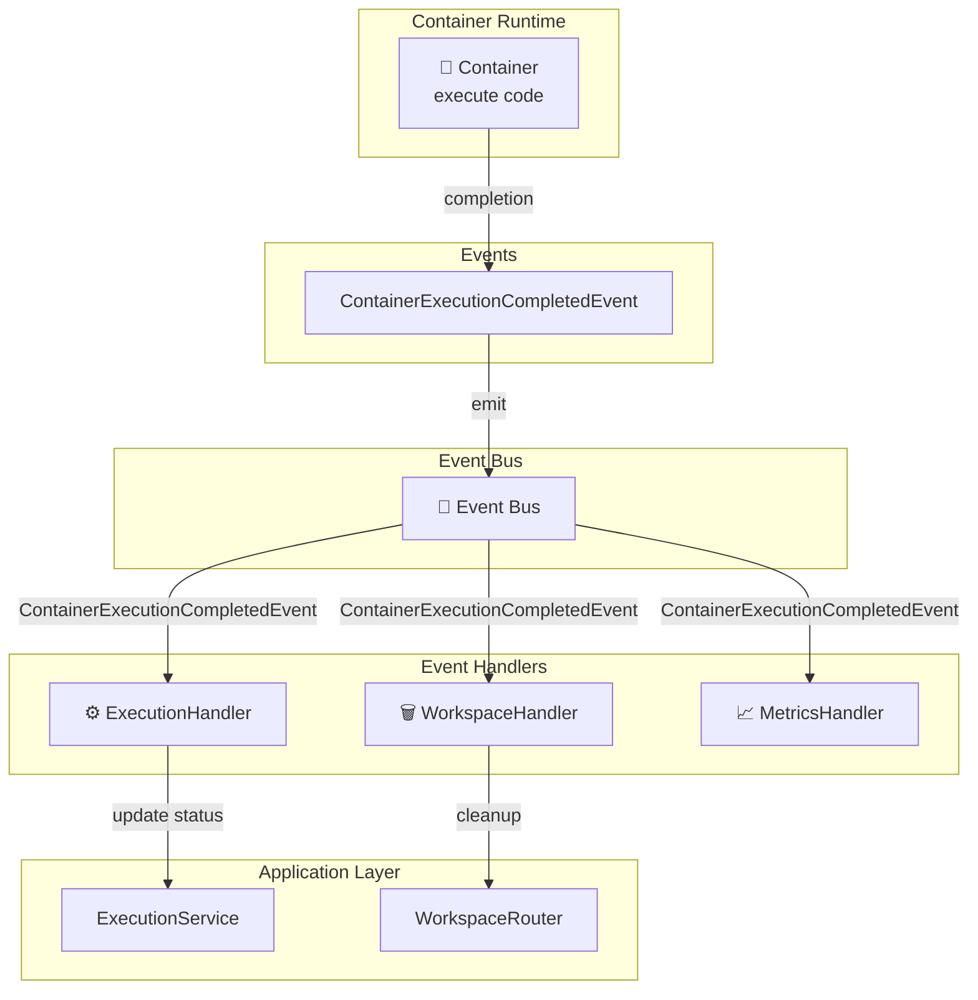
```mermaid
graph TB
    subgraph "Container Runtime"
        CONTAINER["🐳 Container<br/>execute code"]
    end

    subgraph "Events"
        CONTAINER -->|completion| COMPLETED["ContainerExecutionCompletedEvent"]
    end

    subgraph "Event Bus"
        BUS["📢 Event Bus"]
        COMPLETED -->|emit| BUS
    end

    subgraph "Event Handlers"
        EH["⚙️ ExecutionHandler"]
        WH["🗑️ WorkspaceHandler"]
        MH["📈 MetricsHandler"]
    end

    subgraph "Application Layer"
        EXEC["ExecutionService"]
        WS["WorkspaceRouter"]
    end

    BUS -->|ContainerExecutionCompletedEvent| EH
    BUS -->|ContainerExecutionCompletedEvent| WH
    BUS -->|ContainerExecutionCompletedEvent| MH

    EH -->|update status| EXEC
    WH -->|cleanup| WS
```

---

### Container Recovery Context

**File**: `container_recovery_events.py` (3 events)

Container Recovery handles container failure and recovery.

```python
@dataclass(frozen=True)
class ContainerRecoveredEvent(CodetoreumEvent):
    """Emitted when a failed container is successfully recovered.

    Attributes:
        execution_id: Execution being recovered
        recovery_method: How it was recovered ("restart", "rebuild", etc.)
    """
    execution_id: str = ""
    recovery_method: str = ""

@dataclass(frozen=True)
class ContainerKilledEvent(CodetoreumEvent):
    """Emitted when a container is forcibly killed (recovery failed).

    Attributes:
        execution_id: Execution that failed
        reason: Why container was killed
    """
    execution_id: str = ""
    reason: str = ""

@dataclass(frozen=True)
class ContainerRecoveryCompletedEvent(CodetoreumEvent):
    """Emitted when the full container recovery cycle completes.

    Fired by: ContainerRecoveryService.complete_recovery() → application
    Subscribers:
      - MetricsHandler: Record recovery statistics
      - NotificationHandler: Notify team of recovery completion

    Attributes:
        containers_recovered: Number of containers successfully recovered
        containers_killed: Number of containers killed during cleanup
        errors_encountered: Number of errors during recovery process
        repair_cycles_processed: Number of repair cycles completed
        started_at: ISO 8601 timestamp when recovery started
        completed_at: ISO 8601 timestamp when recovery completed
        duration_seconds: Total recovery duration in seconds
    """
    containers_recovered: int = 0
    containers_killed: int = 0
    errors_encountered: int = 0
    repair_cycles_processed: int = 0
    started_at: str = ""
    completed_at: str = ""
    duration_seconds: float = 0.0
```

**Event-Flow Diagram**:

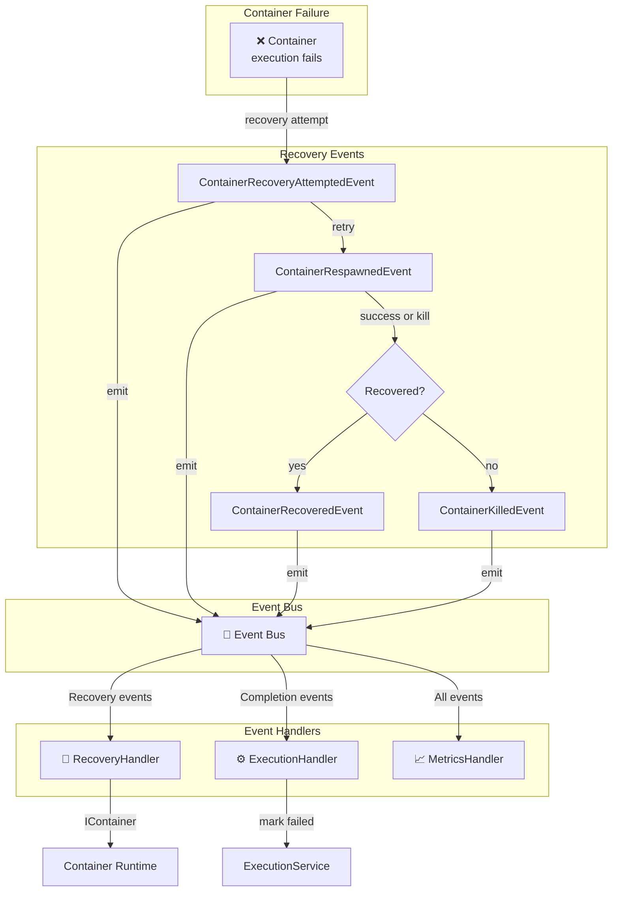
```mermaid
graph TB
    subgraph "Container Failure"
        FAIL["❌ Container<br/>execution fails"]
    end

    subgraph "Recovery Events"
        FAIL -->|recovery attempt| RECOVERY["ContainerRecoveryAttemptedEvent"]
        RECOVERY -->|retry| RETRY["ContainerRespawnedEvent"]
        RETRY -->|success or kill| RESULT{"Recovered?"}
        RESULT -->|yes| RECOVERED["ContainerRecoveredEvent"]
        RESULT -->|no| KILLED["ContainerKilledEvent"]
    end

    subgraph "Event Bus"
        BUS["📢 Event Bus"]
        RECOVERY -->|emit| BUS
        RETRY -->|emit| BUS
        RECOVERED -->|emit| BUS
        KILLED -->|emit| BUS
    end

    subgraph "Event Handlers"
        RCH["🔧 RecoveryHandler"]
        EH["⚙️ ExecutionHandler"]
        MH["📈 MetricsHandler"]
    end

    BUS -->|Recovery events| RCH
    BUS -->|Completion events| EH
    BUS -->|All events| MH

    RCH -->|IContainer| CONTAINER["Container Runtime"]
    EH -->|mark failed| EXEC["ExecutionService"]
```

---

### Lock Context

**File**: `lock_events.py` (7 events)

The Lock context manages pipeline locks for coordinating work item progression.

```python
@dataclass(frozen=True)
class LockAcquiredEvent(CodetoreumEvent):
    """Emitted when a pipeline lock is acquired.

    Fired by: IPipelineLockService.acquire() → adapter
    Subscribers:
      - LockHandler: Update lock state
      - MetricsHandler: Track lock acquisition time

    Attributes:
        lock_id: Lock that was acquired
        work_item_id: Work item holding lock
        acquired_by: Agent or user acquiring lock
    """
    lock_id: str = ""
    work_item_id: str = ""
    acquired_by: str = ""

@dataclass(frozen=True)
class LockReleasedEvent(CodetoreumEvent):
    """Emitted when a pipeline lock is released.

    Fired by: IPipelineLockService.release() → adapter
    Subscribers:
      - LockHandler: Free next work item to acquire lock
      - QueueHandler: Dequeue next work item

    Attributes:
        lock_id: Lock that was released
        released_by: Agent or user releasing lock
    """
    lock_id: str = ""
    released_by: str = ""

@dataclass(frozen=True)
class StaleLockDetectedEvent(CodetoreumEvent):
    """Emitted when a lock holder stops responding.

    Attributes:
        lock_id: Stale lock ID
        held_by: Who is holding the lock
        held_duration_seconds: How long lock has been held
    """
    lock_id: str = ""
    held_by: str = ""
    held_duration_seconds: int = 0

@dataclass(frozen=True)
class PipelineLockAcquiredEvent(CodetoreumEvent):
    """Emitted when pipeline-level lock is acquired for serializing work items."""
    project_id: str = ""
    board_id: str = ""
    work_item_id: str = ""
    timestamp (str): ISO 8601 timestamp when lock acquired

@dataclass(frozen=True)
class PipelineLockReleasedEvent(CodetoreumEvent):
    """Emitted when pipeline-level lock is released."""
    project_id: str = ""
    board_id: str = ""
    work_item_id: str = ""
    timestamp (str): ISO 8601 timestamp when lock released

@dataclass(frozen=True)
class LockStuckEvent(CodetoreumEvent):
    """Emitted when a lock is detected as stuck (holder not responding)."""
    project_id: str = ""
    board_id: str = ""
    work_item_id: str = ""
    lock_duration_seconds: int = 0
    held_by_agent: str = ""
    recovery_initiated: bool = False
    timestamp (str): ISO 8601 timestamp when stuck detected

@dataclass(frozen=True)
class WorkItemQueuedEvent(CodetoreumEvent):
    """Emitted when work item is queued waiting for lock."""
    project_id: str = ""
    board_id: str = ""
    work_item_id: str = ""
    queue_position: int = 0
    queue_depth: int = 0
    timestamp (str): ISO 8601 timestamp when queued
```

**Event-Flow Diagram**:

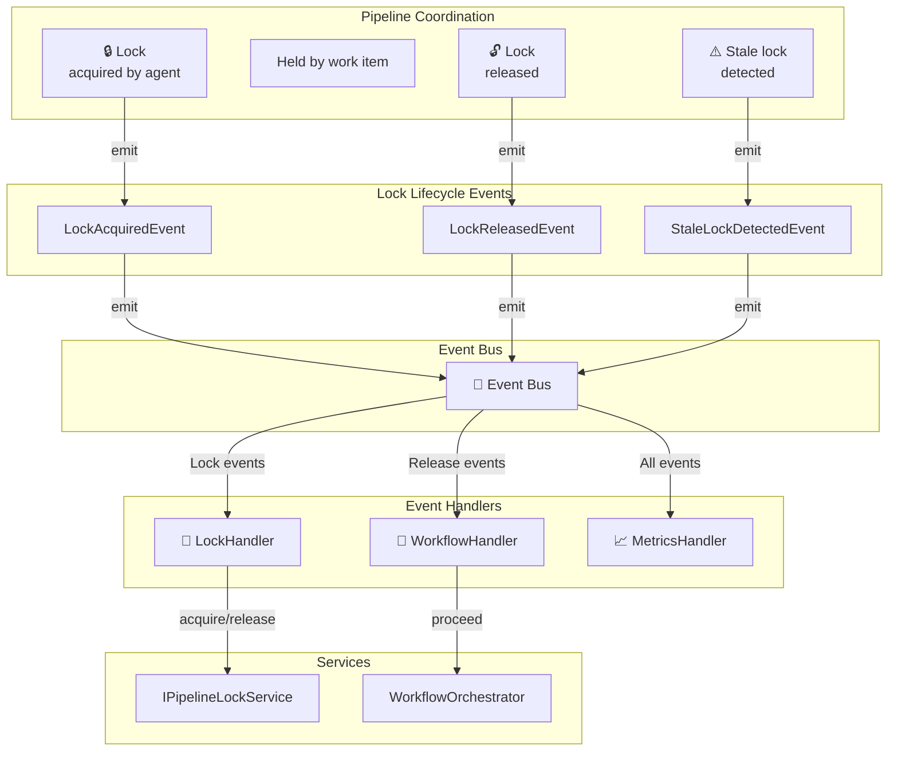
```mermaid
graph TB
    subgraph "Pipeline Coordination"
        ACQ["🔒 Lock<br/>acquired by agent"]
        HELD["Held by work item"]
        REL["🔓 Lock<br/>released"]
        STALE["⚠️ Stale lock<br/>detected"]
    end

    subgraph "Lock Lifecycle Events"
        ACQ -->|emit| ACQUIRED["LockAcquiredEvent"]
        REL -->|emit| RELEASED["LockReleasedEvent"]
        STALE -->|emit| STALEEV["StaleLockDetectedEvent"]
    end

    subgraph "Event Bus"
        BUS["📢 Event Bus"]
        ACQUIRED -->|emit| BUS
        RELEASED -->|emit| BUS
        STALEEV -->|emit| BUS
    end

    subgraph "Event Handlers"
        LH["🔐 LockHandler"]
        WFH["🔄 WorkflowHandler"]
        MH["📈 MetricsHandler"]
    end

    subgraph "Services"
        LOCK["IPipelineLockService"]
        WF["WorkflowOrchestrator"]
    end

    BUS -->|Lock events| LH
    BUS -->|Release events| WFH
    BUS -->|All events| MH

    LH -->|acquire/release| LOCK
    WFH -->|proceed| WF
```

---

### Repository Context

**File**: `repository_events.py` (4 events)

The Repository context tracks git operations.

```python
@dataclass(frozen=True)
class CommitCreatedEvent(CodetoreumEvent):
    """Emitted when a commit is created.

    Fired by: IRepositoryService.commit() → adapter
    Subscribers:
      - AuditHandler: Log commit
      - MetricsHandler: Track commits

    Attributes:
        work_item_id: Work item being modified
        commit_id: Git commit SHA
        message: Commit message
    """
    work_item_id: str = ""
    commit_id: str = ""
    message: str = ""

@dataclass(frozen=True)
class BranchCreatedEvent(CodetoreumEvent):
    """Emitted when a branch is created.

    Attributes:
        work_item_id: Work item with new branch
        branch_name: Name of created branch
    """
    work_item_id: str = ""
    branch_name: str = ""

@dataclass(frozen=True)
class BranchPushedEvent(CodetoreumEvent):
    """Emitted when a branch is pushed to remote.

    Fired by: IRepositoryService.push_branch() → adapter
    Subscribers:
      - AuditHandler: Log push operation
      - MetricsHandler: Track push events

    Attributes:
        repository_id: ID of the repository
        branch_name: Name of the pushed branch
        project_id: ID of the project containing the repository
    """
    repository_id: str = ""
    branch_name: str = ""
    project_id: str | None = None

@dataclass(frozen=True)
class FilesStagedEvent(CodetoreumEvent):
    """Emitted when files are staged in the repository.

    Fired by: IRepositoryService.stage_files() → adapter
    Subscribers:
      - AuditHandler: Log staging operation
      - MetricsHandler: Track staged file counts

    Attributes:
        repository_id: ID of the repository
        file_paths: Immutable tuple of staged file paths
        project_id: ID of the project containing the repository
    """
    repository_id: str = ""
    file_paths: tuple[str, ...] = ()
    project_id: str | None = None
```

**Event-Flow Diagram**:

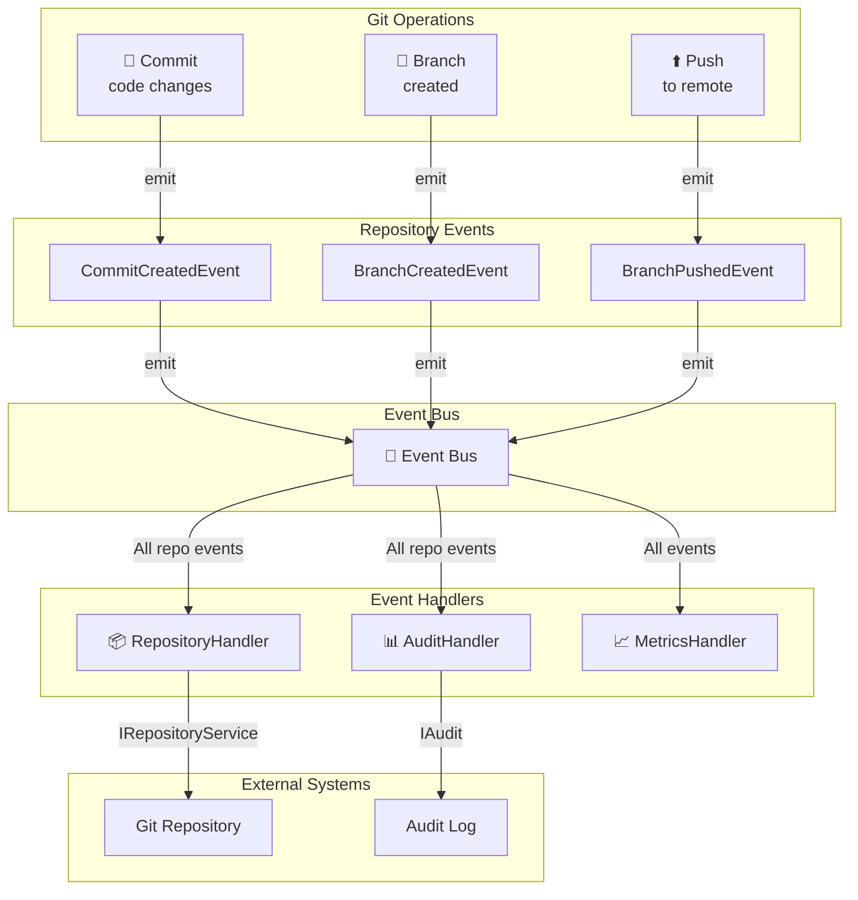
```mermaid
graph TB
    subgraph "Git Operations"
        COMMIT["💾 Commit<br/>code changes"]
        BRANCH["🌳 Branch<br/>created"]
        PUSH["⬆️ Push<br/>to remote"]
    end

    subgraph "Repository Events"
        COMMIT -->|emit| COMMITEV["CommitCreatedEvent"]
        BRANCH -->|emit| BRANCHEV["BranchCreatedEvent"]
        PUSH -->|emit| PUSHEV["BranchPushedEvent"]
    end

    subgraph "Event Bus"
        BUS["📢 Event Bus"]
        COMMITEV -->|emit| BUS
        BRANCHEV -->|emit| BUS
        PUSHEV -->|emit| BUS
    end

    subgraph "Event Handlers"
        RH["📦 RepositoryHandler"]
        AH["📊 AuditHandler"]
        MH["📈 MetricsHandler"]
    end

    subgraph "External Systems"
        GIT["Git Repository"]
        AUDIT["Audit Log"]
    end

    BUS -->|All repo events| RH
    BUS -->|All repo events| AH
    BUS -->|All events| MH

    RH -->|IRepositoryService| GIT
    AH -->|IAudit| AUDIT
```

---

### CI Pipeline Context

**File**: `ci_pipeline_events.py` (3 events)

CI Pipeline tracks continuous integration pipeline execution.

```python
@dataclass(frozen=True)
class CIPipelineStatusCheckedEvent(CodetoreumEvent):
    """Emitted when CI pipeline status is checked.

    Attributes:
        work_item_id: Work item with CI pipeline
        pipeline_id: CI pipeline ID
        status: Current status (pending, running, success, failure)
    """
    work_item_id: str = ""
    pipeline_id: str = ""
    status: str = ""

@dataclass(frozen=True)
class CIRunStartedEvent(CodetoreumEvent):
    """Emitted when a CI run starts.

    Attributes:
        work_item_id: Work item
        run_id: CI run ID
    """
    work_item_id: str = ""
    run_id: str = ""

@dataclass(frozen=True)
class CIRunCompletedEvent(CodetoreumEvent):
    """Emitted when a CI run completes.

    Attributes:
        work_item_id: Work item
        run_id: CI run ID
        success: Whether CI passed
    """
    work_item_id: str = ""
    run_id: str = ""
    success: bool = False
```

**Event-Flow Diagram**:

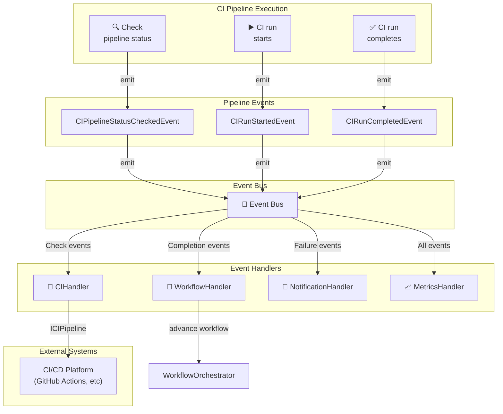
```mermaid
graph TB
    subgraph "CI Pipeline Execution"
        CHECK["🔍 Check<br/>pipeline status"]
        START["▶️ CI run<br/>starts"]
        COMPLETE["✅ CI run<br/>completes"]
    end

    subgraph "Pipeline Events"
        CHECK -->|emit| CHECKEV["CIPipelineStatusCheckedEvent"]
        START -->|emit| STARTEV["CIRunStartedEvent"]
        COMPLETE -->|emit| COMPLETEEV["CIRunCompletedEvent"]
    end

    subgraph "Event Bus"
        BUS["📢 Event Bus"]
        CHECKEV -->|emit| BUS
        STARTEV -->|emit| BUS
        COMPLETEEV -->|emit| BUS
    end

    subgraph "Event Handlers"
        CIH["🔧 CIHandler"]
        WFH["🔄 WorkflowHandler"]
        NH["📧 NotificationHandler"]
        MH["📈 MetricsHandler"]
    end

    subgraph "External Systems"
        CI["CI/CD Platform<br/>(GitHub Actions, etc)"]
    end

    BUS -->|Check events| CIH
    BUS -->|Completion events| WFH
    BUS -->|Failure events| NH
    BUS -->|All events| MH

    CIH -->|ICIPipeline| CI
    WFH -->|advance workflow| WORKFLOW["WorkflowOrchestrator"]
```

---

### Discussion Context

**File**: `discussion_events.py` (6 events)

Discussion tracks comments and conversational feedback loops on work items.

```python
@dataclass(frozen=True)
class CommentPostedEvent(CodetoreumEvent):
    """Emitted when a comment is posted on a work item.

    Fired by: IDiscussionAdapter.post_comment() → adapter
    Subscribers:
      - DiscussionHandler: Update discussion thread
      - NotificationHandler: Notify mentioned users

    Attributes:
        work_item_id: Work item receiving comment
        comment_id: New comment ID
        author_id: Who posted comment
        body: Comment text
    """
    work_item_id: str = ""
    comment_id: str = ""
    author_id: str = ""
    body: str = ""

@dataclass(frozen=True)
class CommentNeedsResponseEvent(CodetoreumEvent):
    """Emitted when a comment requires agent response.

    Fired by: DiscussionAdapter detects comment mentioning agent
    Subscribers:
      - DiscussionHandler: Queue response task

    Attributes:
        work_item_id: Work item with comment
        comment_id: Comment requiring response
        mentioned_agent_id: Agent that needs to respond
    """
    work_item_id: str = ""
    comment_id: str = ""
    mentioned_agent_id: str = ""

@dataclass(frozen=True)
class ConversationalLoopStartedEvent(CodetoreumEvent):
    """Emitted when a multi-turn conversational loop begins.

    Attributes:
        work_item_id: Work item
        session_id: Conversation session ID
    """
    work_item_id: str = ""
    session_id: str = ""

@dataclass(frozen=True)
class AgentResponsePostedEvent(CodetoreumEvent):
    """Emitted when agent posts a response to a comment.

    **Immutability**: This is an immutable event (frozen dataclass). All fields
    are read-only after construction to maintain event sourcing audit trail integrity.

    Attributes:
        type (str): Fixed to "discussion.agent_response_posted"
        work_item_id (str): Work item ID where response was posted
        comment_id (str): ID of the response comment
        responding_agent_id (str): ID of the agent that posted response
        parent_comment_id (str): ID of the comment being responded to
        response_body (str): Text content of the agent's response
        workflow_run_id (str): ID of the workflow run
        timestamp (str): ISO 8601 timestamp when response was posted
    """
    work_item_id: str = ""
    comment_id: str = ""
    responding_agent_id: str = ""
    parent_comment_id: str = ""
    response_body: str = ""
    workflow_run_id: str = ""

@dataclass(frozen=True)
class FeedbackListeningStartedEvent(CodetoreumEvent):
    """Emitted when feedback listening session starts on a work item.

    **Immutability**: This is an immutable event (frozen dataclass). All fields
    are read-only after construction to maintain event sourcing audit trail integrity.

    Attributes:
        type (str): Fixed to "discussion.feedback_listening_started"
        work_item_id (str): Work item ID listening for feedback
        listening_agent_id (str): ID of agent listening for feedback
        listening_duration_seconds (int): How long to listen for feedback
        workflow_run_id (str): ID of the workflow run
        timestamp (str): ISO 8601 timestamp when listening started
    """
    work_item_id: str = ""
    listening_agent_id: str = ""
    listening_duration_seconds: int = 0
    workflow_run_id: str = ""

@dataclass(frozen=True)
class FeedbackListeningStoppedEvent(CodetoreumEvent):
    """Emitted when feedback listening session stops.

    **Immutability**: This is an immutable event (frozen dataclass). All fields
    are read-only after construction to maintain event sourcing audit trail integrity.

    Attributes:
        type (str): Fixed to "discussion.feedback_listening_stopped"
        work_item_id (str): Work item ID that was listening
        listening_agent_id (str): ID of agent that was listening
        feedback_received_count (int): Number of feedback comments received
        reason (str): Reason listening stopped (timeout, max_feedback, manual)
        workflow_run_id (str): ID of the workflow run
        timestamp (str): ISO 8601 timestamp when listening stopped
    """
    work_item_id: str = ""
    listening_agent_id: str = ""
    feedback_received_count: int = 0
    reason: str = ""
    workflow_run_id: str = ""
```

**Event-Flow Diagram**:

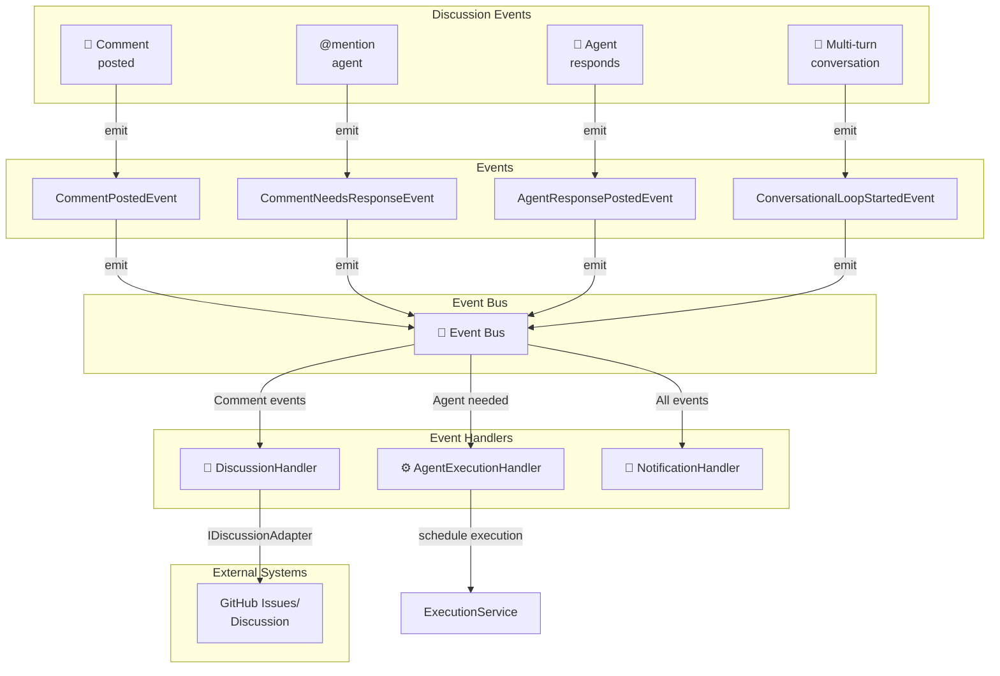
```mermaid
graph TB
    subgraph "Discussion Events"
        COMMENT["💬 Comment<br/>posted"]
        MENTION["@mention<br/>agent"]
        RESPONSE["💬 Agent<br/>responds"]
        LOOP["🔄 Multi-turn<br/>conversation"]
    end

    subgraph "Events"
        COMMENT -->|emit| COMMENTEV["CommentPostedEvent"]
        MENTION -->|emit| NEEDSEV["CommentNeedsResponseEvent"]
        RESPONSE -->|emit| RESPONSEEV["AgentResponsePostedEvent"]
        LOOP -->|emit| LOOPEV["ConversationalLoopStartedEvent"]
    end

    subgraph "Event Bus"
        BUS["📢 Event Bus"]
        COMMENTEV -->|emit| BUS
        NEEDSEV -->|emit| BUS
        RESPONSEEV -->|emit| BUS
        LOOPEV -->|emit| BUS
    end

    subgraph "Event Handlers"
        DH["💬 DiscussionHandler"]
        AEH["⚙️ AgentExecutionHandler"]
        NH["📧 NotificationHandler"]
    end

    subgraph "External Systems"
        GITHUB["GitHub Issues/<br/>Discussion"]
    end

    BUS -->|Comment events| DH
    BUS -->|Agent needed| AEH
    BUS -->|All events| NH

    DH -->|IDiscussionAdapter| GITHUB
    AEH -->|schedule execution| EXEC["ExecutionService"]
```

---

### Project Context

**File**: `project_events.py` (5 events)

Project context tracks project-level operations.

```python
@dataclass(frozen=True)
class ProjectClonedEvent(CodetoreumEvent):
    """Emitted when a project repository is successfully cloned.

    Attributes:
        project_id: Project being cloned
        repository_url: Cloned repo URL
    """
    project_id: str = ""
    repository_url: str = ""

@dataclass(frozen=True)
class ProjectEnabledEvent(CodetoreumEvent):
    """Emitted when a project is enabled for orchestration.

    Attributes:
        project_id: Project being enabled
    """
    project_id: str = ""

@dataclass(frozen=True)
class ProjectDisabledEvent(CodetoreumEvent):
    """Emitted when a project becomes disabled in configuration."""
    project_name: str = ""
    reason: str | None = None
    timestamp (str): ISO 8601 timestamp when disabled

@dataclass(frozen=True)
class ProjectCloneFailedEvent(CodetoreumEvent):
    """Emitted when project clone or update fails (transient error)."""
    project_name: str = ""
    error_message: str = ""
    will_retry: bool = True
    timestamp (str): ISO 8601 timestamp when failure occurred

@dataclass(frozen=True)
class OrchestrationCycleCompletedEvent(CodetoreumEvent):
    """Emitted at the end of each orchestration poll cycle."""
    projects_processed: int = 0
    boards_processed: int = 0
    total_actions: int = 0
    cycle_duration_ms: int = 0
    timestamp (str): ISO 8601 timestamp when cycle completed
```

**Event-Flow Diagram**:

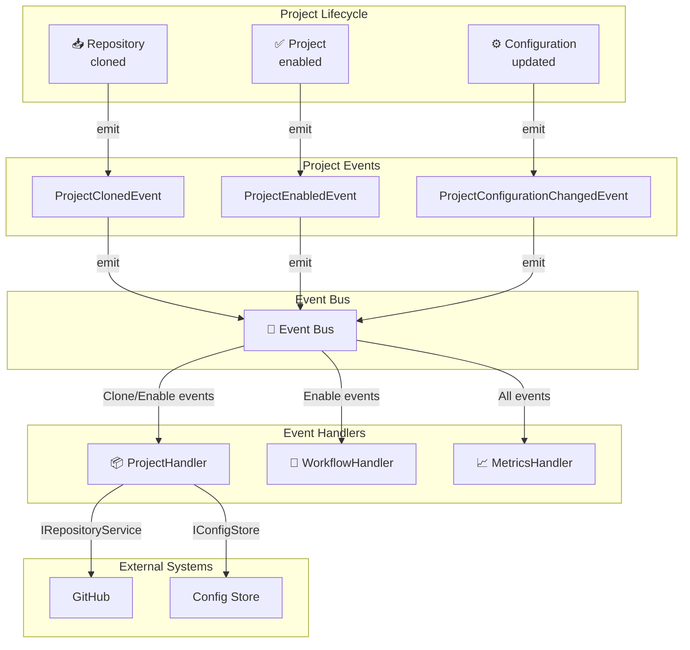
```mermaid
graph TB
    subgraph "Project Lifecycle"
        CLONE["📥 Repository<br/>cloned"]
        ENABLE["✅ Project<br/>enabled"]
        CONFIG["⚙️ Configuration<br/>updated"]
    end

    subgraph "Project Events"
        CLONE -->|emit| CLONEEV["ProjectClonedEvent"]
        ENABLE -->|emit| ENABLEEV["ProjectEnabledEvent"]
        CONFIG -->|emit| CONFIGEV["ProjectConfigurationChangedEvent"]
    end

    subgraph "Event Bus"
        BUS["📢 Event Bus"]
        CLONEEV -->|emit| BUS
        ENABLEEV -->|emit| BUS
        CONFIGEV -->|emit| BUS
    end

    subgraph "Event Handlers"
        PH["📦 ProjectHandler"]
        WFH["🔄 WorkflowHandler"]
        MH["📈 MetricsHandler"]
    end

    subgraph "External Systems"
        GITHUB["GitHub"]
        CONFIG_STORE["Config Store"]
    end

    BUS -->|Clone/Enable events| PH
    BUS -->|Enable events| WFH
    BUS -->|All events| MH

    PH -->|IRepositoryService| GITHUB
    PH -->|IConfigStore| CONFIG_STORE
```

---

### Queue Context

**File**: `queue_events.py` (5 events)

Queue context tracks work item queue management. All 5 events: `QueueItemAddedEvent`, `QueueItemRemovedEvent`, `QueuePositionChangedEvent`, `WorkItemDeadLetterQueuedEvent`, `TaskDispatchFailedEvent`.

```python
@dataclass(frozen=True)
class QueueItemAddedEvent(CodetoreumEvent):
    """Emitted when a work item is added to execution queue.

    Attributes:
        work_item_id: Work item queued
        queue_position: Position in queue
    """
    work_item_id: str = ""
    queue_position: int = 0

@dataclass(frozen=True)
class QueuePositionChangedEvent(CodetoreumEvent):
    """Emitted when a work item's queue position changes.

    Attributes:
        queue_name: Name of the queue (typically "project_id:board_id")
        item_id: ID of the work item in queue
        old_position: Previous position in queue
        new_position: New position in queue
        project_id: ID of the project containing the queue
    """
    queue_name: str = ""
    item_id: str = ""
    old_position: int = 0
    new_position: int = 0
    project_id: str | None = None

@dataclass(frozen=True)
class QueueItemRemovedEvent(CodetoreumEvent):
    """Emitted when a work item is removed from the queue.

    Fired by: AgentScheduler.remove_from_queue() → application
    Subscribers:
      - QueueHandler: Update queue state
      - MetricsHandler: Track removal

    Attributes:
        queue_name: Name of the queue (typically "project_id:board_id")
        item_id: ID of the work item removed from queue
        project_id: ID of the project containing the queue
    """
    queue_name: str = ""
    item_id: str = ""
    project_id: str | None = None

@dataclass(frozen=True)
class WorkItemDeadLetterQueuedEvent(CodetoreumEvent):
    """Emitted when a work item is queued to the dead letter queue.

    Fired by: QueueService.move_to_dlq() → application
    Subscribers:
      - DLQHandler: Log DLQ entry
      - NotificationHandler: Alert team
      - MetricsHandler: Track DLQ events

    The dead letter queue (DLQ) is where work items are placed when they cannot
    be automatically progressed through the workflow due to failures.

    Attributes:
        work_item_id: ID of the work item queued to DLQ
        board_id: ID of the board containing the work item
        from_column: Current column/state of the work item
        to_column: Intended next column/state (UNKNOWN if not determinable)
        reason: Reason for DLQ queueing (e.g., callback failure, timeout)
        failure_details: Additional error details
    """
    work_item_id: str = ""
    board_id: str = ""
    from_column: str = ""
    to_column: str = ""
    reason: str = ""
    failure_details: str = ""

@dataclass(frozen=True)
class TaskDispatchFailedEvent(CodetoreumEvent):
    """Emitted when a scheduled task fails to dispatch to the execution service.

    Fired by: AgentScheduler consumer loop when dispatch raises an exception
    Subscribers:
      - SchedulerHandler: Log dispatch failure, possibly re-queue or DLQ the task
      - NotificationHandler: Alert operations team
      - MetricsHandler: Record dispatch failure rate

    Type: ``scheduling.task_dispatch_failed``

    Note: Unlike ExecutionFailedEvent (agent execution failure), this event
    indicates the task never reached the execution service—the failure occurred
    in the dispatcher before any agent ran.

    Attributes:
        task_id: ID of the scheduled task that failed to dispatch
        work_item_id: Work item associated with the task
        agent_id: ID of the agent that should have executed
        error: Error description from the dispatch failure
    """
    task_id: str = ""
    work_item_id: str = ""
    agent_id: str = ""
    error: str = ""
```

**Event-Flow Diagram**:

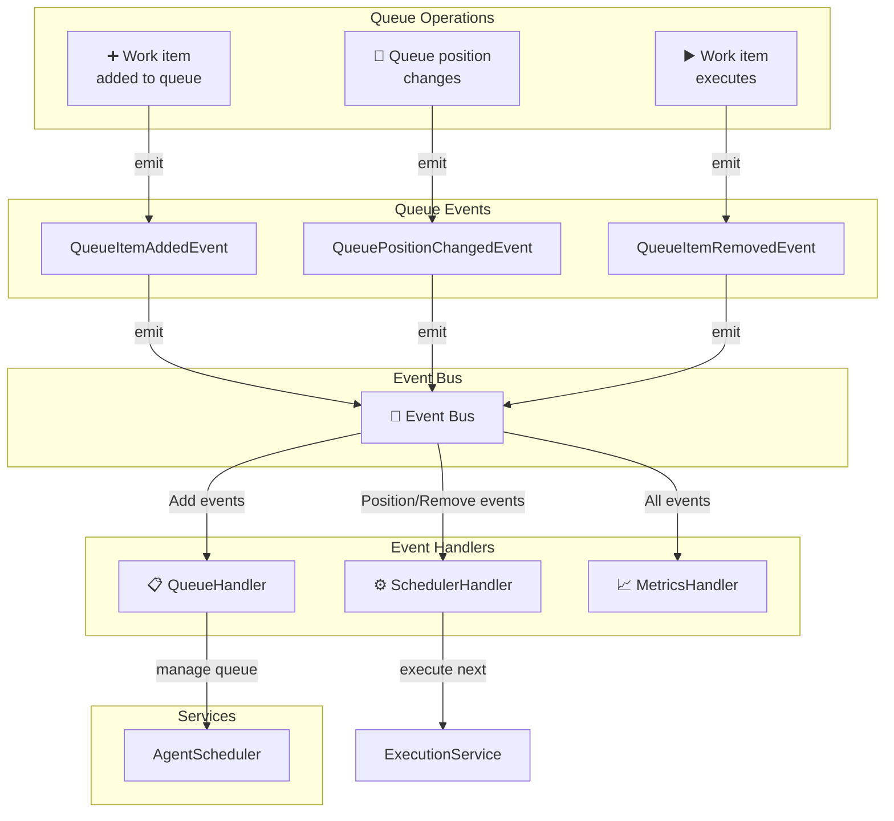
```mermaid
graph TB
    subgraph "Queue Operations"
        ADD["➕ Work item<br/>added to queue"]
        REORDER["🔄 Queue position<br/>changes"]
        EXECUTE["▶️ Work item<br/>executes"]
    end

    subgraph "Queue Events"
        ADD -->|emit| ADDEV["QueueItemAddedEvent"]
        REORDER -->|emit| POSEV["QueuePositionChangedEvent"]
        EXECUTE -->|emit| REMEV["QueueItemRemovedEvent"]
    end

    subgraph "Event Bus"
        BUS["📢 Event Bus"]
        ADDEV -->|emit| BUS
        POSEV -->|emit| BUS
        REMEV -->|emit| BUS
    end

    subgraph "Event Handlers"
        QH["📋 QueueHandler"]
        SCH["⚙️ SchedulerHandler"]
        MH["📈 MetricsHandler"]
    end

    subgraph "Services"
        QUEUE["AgentScheduler"]
    end

    BUS -->|Add events| QH
    BUS -->|Position/Remove events| SCH
    BUS -->|All events| MH

    QH -->|manage queue| QUEUE
    SCH -->|execute next| EXEC["ExecutionService"]
```

---

### Branch Context

**File**: `branch_events.py` (3 events)

Branch context tracks branch resolution and reuse.

```python
@dataclass(frozen=True)
class BranchResolutionCreatedEvent(CodetoreumEvent):
    """Emitted when a branch resolution is created.

    Attributes:
        work_item_id: Work item
        branch_name: Branch name
    """
    work_item_id: str = ""
    branch_name: str = ""

@dataclass(frozen=True)
class BranchReusedEvent(CodetoreumEvent):
    """Emitted when an existing branch is reused for a work item.

    Attributes:
        work_item_id: Work item
        branch_name: Reused branch name
    """
    work_item_id: str = ""
    branch_name: str = ""

@dataclass(frozen=True)
class BranchResolvedEvent(CodetoreumEvent):
    """Emitted when a branch is resolved and ready for use.

    Attributes:
        work_item_id: Work item
        branch_name: Branch name
    """
    work_item_id: str = ""
    branch_name: str = ""
```

**Event-Flow Diagram**:

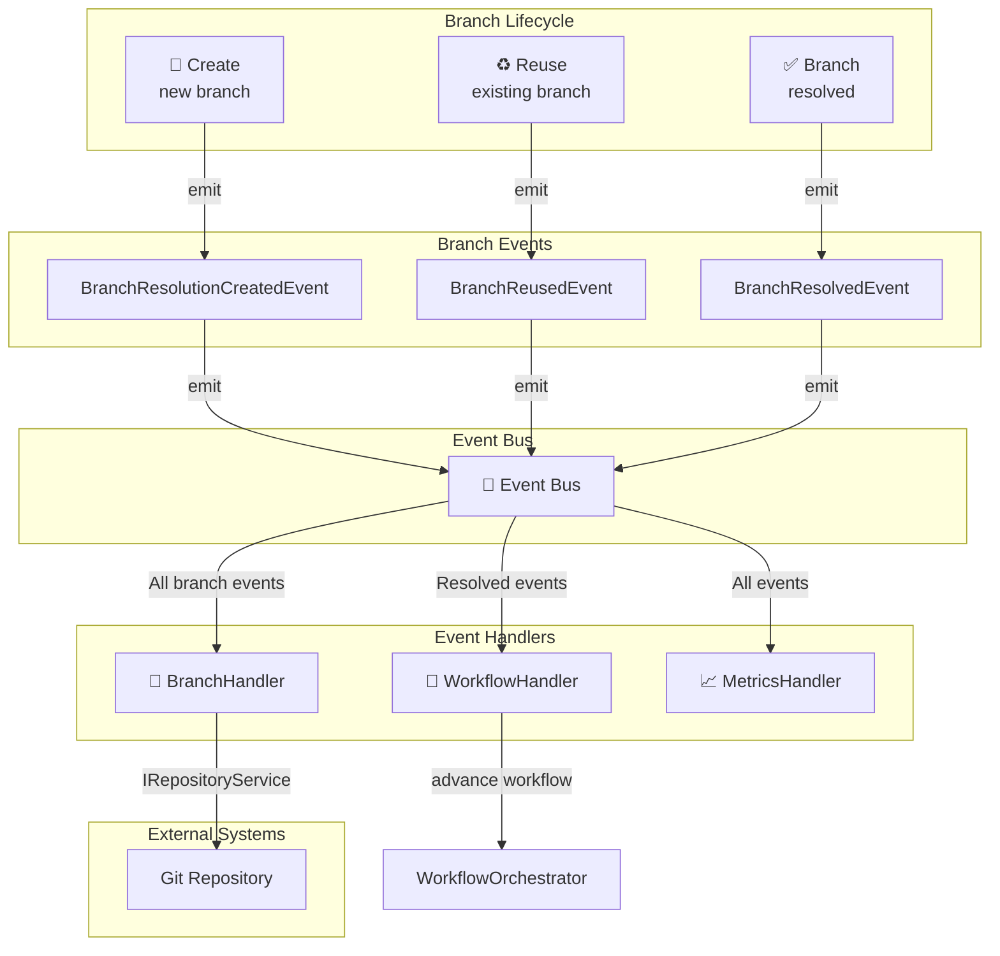
```mermaid
graph TB
    subgraph "Branch Lifecycle"
        CREATE["🌳 Create<br/>new branch"]
        REUSE["♻️ Reuse<br/>existing branch"]
        RESOLVE["✅ Branch<br/>resolved"]
    end

    subgraph "Branch Events"
        CREATE -->|emit| CREATEEV["BranchResolutionCreatedEvent"]
        REUSE -->|emit| REUSEEV["BranchReusedEvent"]
        RESOLVE -->|emit| RESOLVEEV["BranchResolvedEvent"]
    end

    subgraph "Event Bus"
        BUS["📢 Event Bus"]
        CREATEEV -->|emit| BUS
        REUSEEV -->|emit| BUS
        RESOLVEEV -->|emit| BUS
    end

    subgraph "Event Handlers"
        BH["🌳 BranchHandler"]
        WH["🔄 WorkflowHandler"]
        MH["📈 MetricsHandler"]
    end

    subgraph "External Systems"
        GIT["Git Repository"]
    end

    BUS -->|All branch events| BH
    BUS -->|Resolved events| WH
    BUS -->|All events| MH

    BH -->|IRepositoryService| GIT
    WH -->|advance workflow| WF["WorkflowOrchestrator"]
```

---

### Storage Context

**File**: `storage_events.py` (2 events)

Storage context tracks artifact uploads and deletions.

```python
@dataclass(frozen=True)
class ArtifactUploadedEvent(CodetoreumEvent):
    """Emitted when an artifact is uploaded to storage.

    Attributes:
        artifact_id: Artifact ID
        work_item_id: Associated work item
        filename: Uploaded filename
        size_bytes: File size
    """
    artifact_id: str = ""
    work_item_id: str = ""
    filename: str = ""
    size_bytes: int = 0

@dataclass(frozen=True)
class ArtifactDeletedEvent(CodetoreumEvent):
    """Emitted when an artifact is deleted.

    Attributes:
        artifact_id: Artifact being deleted
        work_item_id: Associated work item
    """
    artifact_id: str = ""
    work_item_id: str = ""
```

**Event-Flow Diagram**:

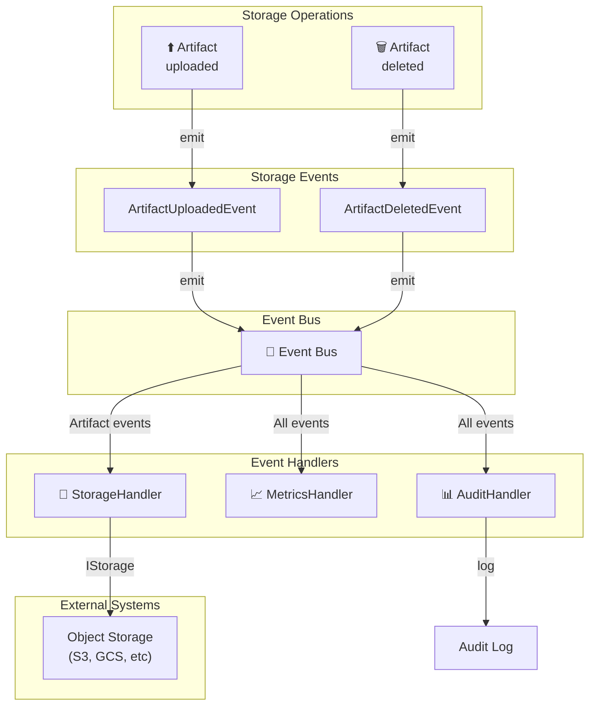
```mermaid
graph TB
    subgraph "Storage Operations"
        UPLOAD["⬆️ Artifact<br/>uploaded"]
        DELETE["🗑️ Artifact<br/>deleted"]
    end

    subgraph "Storage Events"
        UPLOAD -->|emit| UPLOADEV["ArtifactUploadedEvent"]
        DELETE -->|emit| DELETEEV["ArtifactDeletedEvent"]
    end

    subgraph "Event Bus"
        BUS["📢 Event Bus"]
        UPLOADEV -->|emit| BUS
        DELETEEV -->|emit| BUS
    end

    subgraph "Event Handlers"
        SH["💾 StorageHandler"]
        MH["📈 MetricsHandler"]
        AH["📊 AuditHandler"]
    end

    subgraph "External Systems"
        STORAGE["Object Storage<br/>(S3, GCS, etc)"]
    end

    BUS -->|Artifact events| SH
    BUS -->|All events| MH
    BUS -->|All events| AH

    SH -->|IStorage| STORAGE
    AH -->|log| AUDIT["Audit Log"]
```

---

### Adapter Context

**File**: `adapter_events.py` (1 event base class)

The Adapter context provides the base event class.

```python
@dataclass(frozen=True)
class CodetoreumEvent:
    """Base class for all domain events.

    Immutable event base providing:
    - Automatic timestamp (UTC)
    - Unique event ID
    - Source system identifier
    - Serialization support

    All domain events inherit from this class and are frozen
    to maintain immutability for event sourcing.
    """
    type: str = ""  # Event type identifier (e.g., "workitem.created")
    timestamp: str = field(default_factory=lambda: datetime.now(UTC).isoformat())
    event_id: str = field(default_factory=lambda: str(uuid4()))
    source: str = ""  # Source system (e.g., "github", "codetoreum")
    correlation_id: str | None = None  # Link related events
```

**Event-Flow Diagram**:

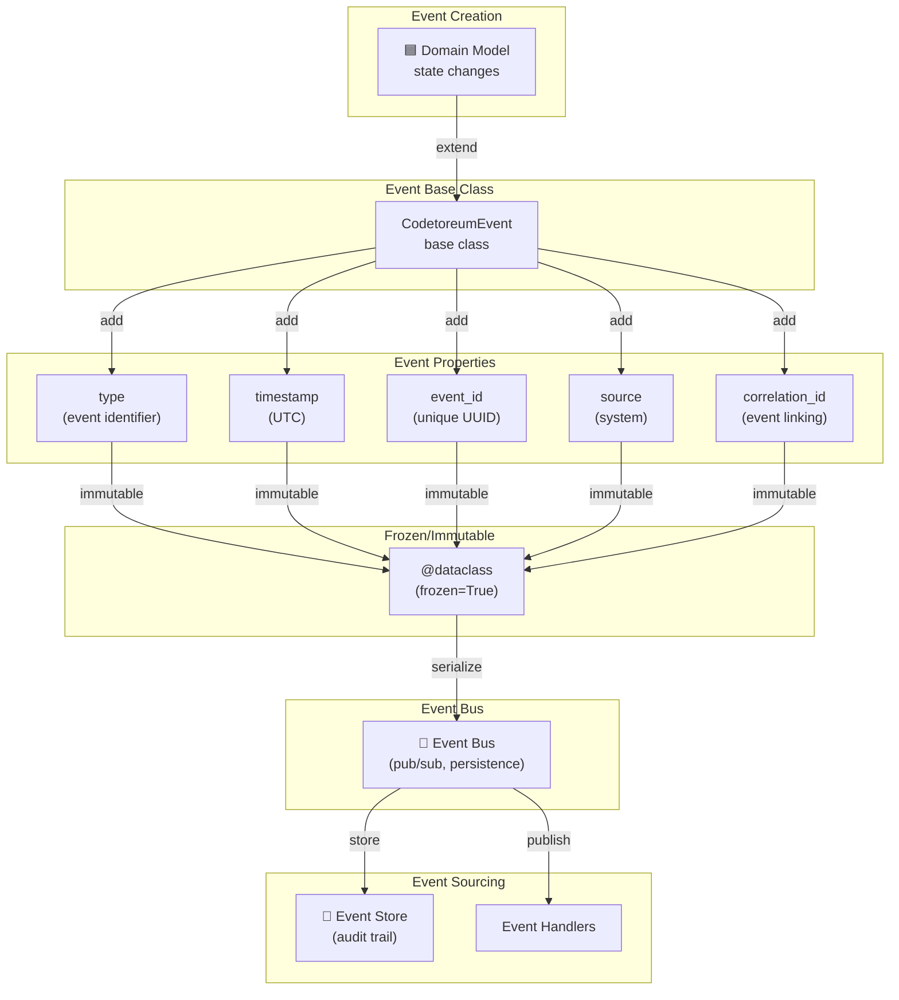
```mermaid
graph TB
    subgraph "Event Creation"
        ALL["🟦 Domain Model<br/>state changes"]
    end

    subgraph "Event Base Class"
        ALL -->|extend| BASE["CodetoreumEvent<br/>base class"]
    end

    subgraph "Event Properties"
        BASE -->|add| TYPE["type<br/>(event identifier)"]
        BASE -->|add| TIMESTAMP["timestamp<br/>(UTC)"]
        BASE -->|add| ID["event_id<br/>(unique UUID)"]
        BASE -->|add| SOURCE["source<br/>(system)"]
        BASE -->|add| CORR["correlation_id<br/>(event linking)"]
    end

    subgraph "Frozen/Immutable"
        TYPE -->|immutable| FROZEN["@dataclass<br/>(frozen=True)"]
        TIMESTAMP -->|immutable| FROZEN
        ID -->|immutable| FROZEN
        SOURCE -->|immutable| FROZEN
        CORR -->|immutable| FROZEN
    end

    subgraph "Event Bus"
        FROZEN -->|serialize| BUS["📢 Event Bus<br/>(pub/sub, persistence)"]
    end

    subgraph "Event Sourcing"
        BUS -->|store| STORE["💾 Event Store<br/>(audit trail)"]
        BUS -->|publish| HANDLERS["Event Handlers"]
    end
```

---

---

### Agent Context

**File**: `agent_events.py` (10 events)

The Agent context tracks agent configuration lifecycle changes. All events carry `agent_id` as the primary key. Type strings use `agent.*` prefix.

```python
@dataclass(frozen=True)
class AgentCreatedEvent(CodetoreumEvent):
    """Emitted when a new agent is created.

    Type string: "agent.created"
    Fired by: agent management command handler on agent registration.

    Attributes:
        agent_id: Unique agent identifier (required, non-empty)
        name: Agent programmatic name (required, non-empty)
        display_name: Human-readable label
        agent_type: Agent role category (e.g., "implementer", "reviewer")
        model: LLM model identifier (e.g., "claude-opus-4-5")
    """
    agent_id: str = ""
    name: str = ""
    display_name: str = ""
    agent_type: str = ""
    model: str = ""

@dataclass(frozen=True)
class AgentCapabilityAddedEvent(CodetoreumEvent):
    """Emitted when a capability (skill) is added to an agent.

    Type string: "agent.capability_added"
    Fired by: agent capability management on skill assignment.

    Attributes:
        agent_id: Agent receiving the capability (required, non-empty)
        skill: Skill name (e.g., "python", "testing", "code_review")
        proficiency: Proficiency score from 0.0 to 1.0
    """
    agent_id: str = ""
    skill: str = ""
    proficiency: float = 0.0

@dataclass(frozen=True)
class AgentCapabilityRemovedEvent(CodetoreumEvent):
    """Emitted when a capability is removed from an agent.

    Type string: "agent.capability_removed"
    Fired by: agent capability management on skill removal.

    Attributes:
        agent_id: Agent losing the capability (required, non-empty)
        skill: Skill name being removed
    """
    agent_id: str = ""
    skill: str = ""

@dataclass(frozen=True)
class AgentCapabilityUpdatedEvent(CodetoreumEvent):
    """Emitted when a capability's proficiency is updated on an agent.

    Type string: "agent.capability_updated"
    Fired by: agent capability management on proficiency change.

    Attributes:
        agent_id: Agent whose capability changed (required, non-empty)
        skill: Skill name being updated
        old_proficiency: Previous proficiency score (0.0–1.0)
        new_proficiency: New proficiency score (0.0–1.0)
    """
    agent_id: str = ""
    skill: str = ""
    old_proficiency: float = 0.0
    new_proficiency: float = 0.0

@dataclass(frozen=True)
class AgentModelUpdatedEvent(CodetoreumEvent):
    """Emitted when an agent's LLM model is changed.

    Type string: "agent.model_updated"
    Fired by: agent configuration management on model update.

    Attributes:
        agent_id: Agent being reconfigured (required, non-empty)
        old_model: Previous model identifier
        new_model: New model identifier
    """
    agent_id: str = ""
    old_model: str = ""
    new_model: str = ""

@dataclass(frozen=True)
class AgentTimeoutUpdatedEvent(CodetoreumEvent):
    """Emitted when an agent's execution timeout is changed.

    Type string: "agent.timeout_updated"
    Fired by: agent configuration management on timeout update.

    Attributes:
        agent_id: Agent being reconfigured (required, non-empty)
        old_timeout: Previous timeout in seconds
        new_timeout: New timeout in seconds
    """
    agent_id: str = ""
    old_timeout: int = 0
    new_timeout: int = 0

@dataclass(frozen=True)
class AgentMaxRetriesUpdatedEvent(CodetoreumEvent):
    """Emitted when an agent's maximum retry count is changed.

    Type string: "agent.max_retries_updated"
    Fired by: agent configuration management on retry policy update.

    Attributes:
        agent_id: Agent being reconfigured (required, non-empty)
        old_max_retries: Previous maximum retry count
        new_max_retries: New maximum retry count
    """
    agent_id: str = ""
    old_max_retries: int = 0
    new_max_retries: int = 0

@dataclass(frozen=True)
class AgentConstraintsUpdatedEvent(CodetoreumEvent):
    """Emitted when an agent's operational constraints are changed.

    Type string: "agent.constraints_updated"
    Fired by: agent configuration management on constraint update.

    Attributes:
        agent_id: Agent being reconfigured (required, non-empty)
        old_constraints: Tuple of previous constraint strings
        new_constraints: Tuple of new constraint strings
    """
    agent_id: str = ""
    old_constraints: tuple = ()
    new_constraints: tuple = ()

@dataclass(frozen=True)
class AgentMcpServerAddedEvent(CodetoreumEvent):
    """Emitted when an MCP server is added to an agent's configuration.

    Type string: "agent.mcp_server_added"
    Fired by: agent MCP configuration management.

    Attributes:
        agent_id: Agent receiving the MCP server (required, non-empty)
        server_name: MCP server name/identifier
    """
    agent_id: str = ""
    server_name: str = ""

@dataclass(frozen=True)
class AgentMcpServerRemovedEvent(CodetoreumEvent):
    """Emitted when an MCP server is removed from an agent's configuration.

    Type string: "agent.mcp_server_removed"
    Fired by: agent MCP configuration management.

    Attributes:
        agent_id: Agent losing the MCP server (required, non-empty)
        server_name: MCP server name/identifier being removed
    """
    agent_id: str = ""
    server_name: str = ""
```

---

### Configuration Context

**File**: `configuration_events.py` (8 events)

The Configuration context tracks changes to project, agent, and pipeline configuration, as well as command and sub-agent mounting lifecycle. Type strings use class name as-is (PascalCase) in `from_dict` defaults.

```python
@dataclass(frozen=True)
class ProjectConfigUpdatedEvent(CodetoreumEvent):
    """Emitted when a project-level configuration key is changed.

    Type string: "ProjectConfigUpdatedEvent"
    Fired by: project configuration command handler on key update.

    Attributes:
        project_id: Project whose config changed (required, non-empty)
        config_key: Configuration key that changed
        old_value: Previous value (empty string if previously unset)
        new_value: New value (empty string if key was deleted)
    """
    project_id: str = ""
    config_key: str = ""
    old_value: str = ""
    new_value: str = ""

@dataclass(frozen=True)
class AgentConfigUpdatedEvent(CodetoreumEvent):
    """Emitted when an agent-level configuration key is changed.

    Type string: "AgentConfigUpdatedEvent"
    Fired by: agent configuration command handler on key update.

    Attributes:
        agent_id: Agent whose config changed (required, non-empty)
        config_key: Configuration key that changed
        old_value: Previous value (empty string if previously unset)
        new_value: New value (empty string if key was deleted)
    """
    agent_id: str = ""
    config_key: str = ""
    old_value: str = ""
    new_value: str = ""

@dataclass(frozen=True)
class PipelineConfigUpdatedEvent(CodetoreumEvent):
    """Emitted when a pipeline-level configuration key is changed.

    Type string: "PipelineConfigUpdatedEvent"
    Fired by: pipeline configuration command handler on key update.

    Attributes:
        pipeline_id: Pipeline whose config changed
        config_key: Configuration key that changed
        old_value: Previous value (empty string if previously unset)
        new_value: New value (empty string if key was deleted)
    """
    pipeline_id: str = ""
    config_key: str = ""
    old_value: str = ""
    new_value: str = ""

@dataclass(frozen=True)
class EnvironmentVariableChangedEvent(CodetoreumEvent):
    """Emitted when a project environment variable is set, changed, or removed.

    Type string: "EnvironmentVariableChangedEvent"
    Fired by: project environment variable management on variable mutation.

    Attributes:
        project_id: Project whose environment changed
        variable_name: Environment variable name (e.g., "GITHUB_TOKEN")
        old_value: Previous value (empty string if newly set)
        new_value: New value (empty string if variable was deleted)
    """
    project_id: str = ""
    variable_name: str = ""
    old_value: str = ""
    new_value: str = ""

@dataclass(frozen=True)
class CommandMountedEvent(CodetoreumEvent):
    """Emitted when a Claude command (slash command) is mounted for a project.

    Type string: "CommandMountedEvent"
    Fired by: project command configuration when a command is enabled.

    Attributes:
        project_id: Project receiving the mounted command
        command_name: Slash command name (e.g., "arch-doc", "review")
    """
    project_id: str = ""
    command_name: str = ""

@dataclass(frozen=True)
class CommandUnmountedEvent(CodetoreumEvent):
    """Emitted when a Claude command is unmounted from a project.

    Type string: "CommandUnmountedEvent"
    Fired by: project command configuration when a command is disabled.

    Attributes:
        project_id: Project losing the unmounted command
        command_name: Slash command name being removed
    """
    project_id: str = ""
    command_name: str = ""

@dataclass(frozen=True)
class SubAgentMountedEvent(CodetoreumEvent):
    """Emitted when a sub-agent is mounted (enabled) for a project.

    Type string: "SubAgentMountedEvent"
    Fired by: project sub-agent configuration when a sub-agent is activated.

    Attributes:
        project_id: Project receiving the sub-agent
        agent_id: Sub-agent being mounted
    """
    project_id: str = ""
    agent_id: str = ""

@dataclass(frozen=True)
class SubAgentUnmountedEvent(CodetoreumEvent):
    """Emitted when a sub-agent is unmounted (disabled) from a project.

    Type string: "SubAgentUnmountedEvent"
    Fired by: project sub-agent configuration when a sub-agent is deactivated.

    Attributes:
        project_id: Project losing the sub-agent
        agent_id: Sub-agent being unmounted
    """
    project_id: str = ""
    agent_id: str = ""
```

---

### Project Context (Extended)

**File**: `project_context_events.py` (4 events)

The Project Context (Extended) tracks project-level configuration object lifecycle — specifically the structured `ProjectContext` aggregate (test config, docker config, workflow column mappings). This is distinct from `project_events.py` which tracks project enablement and board reconciliation. Type strings use class name as-is.

```python
@dataclass(frozen=True)
class ProjectContextCreatedEvent(CodetoreumEvent):
    """Emitted when a ProjectContext aggregate is created for a project.

    Type string: "ProjectContextCreatedEvent"
    Fired by: project context initialization when a new project context is bootstrapped.

    Attributes:
        project_id: Project for which context was created (required, non-empty)
        name: Human-readable project name
    """
    project_id: str = ""
    name: str = ""

@dataclass(frozen=True)
class ProjectTestConfigUpdatedEvent(CodetoreumEvent):
    """Emitted when a project's test execution configuration is updated.

    Type string: "ProjectTestConfigUpdatedEvent"
    Fired by: project context management when test command or timeout changes.

    Attributes:
        project_id: Project whose test config changed (required, non-empty)
        test_command: Shell command used to run tests (e.g., "poetry run pytest")
        test_timeout: Maximum test run duration in seconds
    """
    project_id: str = ""
    test_command: str = ""
    test_timeout: int = 0

@dataclass(frozen=True)
class ProjectDockerConfigUpdatedEvent(CodetoreumEvent):
    """Emitted when a project's Docker container image is updated.

    Type string: "ProjectDockerConfigUpdatedEvent"
    Fired by: project context management when the agent container image changes.

    Attributes:
        project_id: Project whose docker config changed (required, non-empty)
        image: Docker image identifier (e.g., "ghcr.io/org/dev-env:latest")
    """
    project_id: str = ""
    image: str = ""

@dataclass(frozen=True)
class ProjectWorkflowMappingAddedEvent(CodetoreumEvent):
    """Emitted when a board column is mapped to a workflow stage in a project context.

    Type string: "ProjectWorkflowMappingAddedEvent"
    Fired by: project context management when a column-to-stage mapping is configured.
    Used by: WorkflowOrchestrator to determine which pipeline stage to trigger
    when a work item enters a given board column.

    Attributes:
        project_id: Project receiving the mapping (required, non-empty)
        column_name: Board column name (e.g., "In Progress", "Review")
        workflow_stage: Pipeline stage mapped to this column (e.g., "implementation")
    """
    project_id: str = ""
    column_name: str = ""
    workflow_stage: str = ""
```

---

### Workflow Context

**File**: `workflow_events.py` (16 events)

The Workflow context tracks the complete workflow and pipeline execution lifecycle. Workflow-level events use `workflow.*` type strings; pipeline-level events use `pipeline.*` and `pipeline.stage.*` type strings. Both `workflow_id` and `work_item_id` are required fields on most events. All timestamps are ISO 8601 strings.

```python
@dataclass(frozen=True)
class WorkflowCreatedEvent(CodetoreumEvent):
    """Emitted when a workflow run is created for a work item.

    Type string: "workflow.created"
    Fired by: WorkflowOrchestrator when assigning a pipeline to a work item.

    Attributes:
        workflow_id: Unique workflow run identifier (required, non-empty)
        work_item_id: Work item this workflow processes (required, non-empty)
        pipeline_id: Pipeline template/config identifier
        stage_name: Initial stage name
        project_id: Project containing the work item
    """
    workflow_id: str = ""
    work_item_id: str = ""
    pipeline_id: str = ""
    stage_name: str = ""
    project_id: str = ""

@dataclass(frozen=True)
class WorkflowStartedEvent(CodetoreumEvent):
    """Emitted when a workflow run begins execution.

    Type string: "workflow.started"
    Fired by: WorkflowOrchestrator when execution of the first stage commences.

    Attributes:
        workflow_id: Unique workflow run identifier (required, non-empty)
        work_item_id: Work item being processed (required, non-empty)
        stage_name: Current (first) stage name
    """
    workflow_id: str = ""
    work_item_id: str = ""
    stage_name: str = ""

@dataclass(frozen=True)
class WorkflowStageAdvancedEvent(CodetoreumEvent):
    """Emitted when a workflow transitions from one stage to the next.

    Type string: "workflow.stage_advanced"
    Fired by: WorkflowOrchestrator on successful stage completion and advancement.

    Attributes:
        workflow_id: Unique workflow run identifier (required, non-empty)
        work_item_id: Work item being processed (required, non-empty)
        from_stage: Stage transitioned from
        to_stage: Stage transitioned to
    """
    workflow_id: str = ""
    work_item_id: str = ""
    from_stage: str = ""
    to_stage: str = ""

@dataclass(frozen=True)
class WorkflowStageStatusUpdatedEvent(CodetoreumEvent):
    """Emitted when a workflow stage's status changes (without advancing to next stage).

    Type string: "workflow.stage_status_updated"
    Fired by: WorkflowOrchestrator when a stage's status is updated in-place
    (e.g., from "pending" to "running", or "running" to "blocked").

    Attributes:
        workflow_id: Workflow run identifier (required, non-empty)
        work_item_id: Work item being processed (required, non-empty)
        stage_name: Name of the stage whose status changed
        old_status: Previous status value
        new_status: New status value
    """
    workflow_id: str = ""
    work_item_id: str = ""
    stage_name: str = ""
    old_status: str = ""
    new_status: str = ""

@dataclass(frozen=True)
class WorkflowCompletedEvent(CodetoreumEvent):
    """Emitted when a workflow run completes successfully (all stages passed).

    Type string: "workflow.completed"
    Fired by: WorkflowOrchestrator after the final stage completes.
    Subscribers:
      - WorkflowHandler: Move work item to completed column

    Attributes:
        workflow_id: Unique workflow run identifier (required, non-empty)
        work_item_id: Work item that was processed (required, non-empty)
        final_stage: Name of the last stage executed
        completed_at: ISO 8601 timestamp of completion
    """
    workflow_id: str = ""
    work_item_id: str = ""
    final_stage: str = ""
    completed_at: str = ""

@dataclass(frozen=True)
class WorkflowFailedEvent(CodetoreumEvent):
    """Emitted when a workflow run fails and cannot continue.

    Type string: "workflow.failed"
    Fired by: WorkflowOrchestrator when a stage fails and retry/repair is exhausted.
    Subscribers:
      - WorkflowHandler: Move work item to failed column or trigger repair

    Attributes:
        workflow_id: Unique workflow run identifier (required, non-empty)
        work_item_id: Work item that was being processed (required, non-empty)
        failed_stage: Stage at which failure occurred
        reason: Human-readable failure reason
        failed_at: ISO 8601 timestamp of failure
    """
    workflow_id: str = ""
    work_item_id: str = ""
    failed_stage: str = ""
    reason: str = ""
    failed_at: str = ""

@dataclass(frozen=True)
class WorkflowCancelledEvent(CodetoreumEvent):
    """Emitted when a workflow run is cancelled by external request.

    Type string: "workflow.cancelled"
    Fired by: WorkflowOrchestrator on explicit cancellation (user request or policy).

    Attributes:
        workflow_id: Unique workflow run identifier (required, non-empty)
        work_item_id: Work item that was being processed (required, non-empty)
        cancelled_stage: Stage at which cancellation occurred
        cancelled_at: ISO 8601 timestamp of cancellation
    """
    workflow_id: str = ""
    work_item_id: str = ""
    cancelled_stage: str = ""
    cancelled_at: str = ""

@dataclass(frozen=True)
class WorkflowPausedEvent(CodetoreumEvent):
    """Emitted when a workflow run is paused (awaiting external input or approval).

    Type string: "workflow.paused"
    Fired by: WorkflowOrchestrator when a stage requires human review or approval.

    Attributes:
        workflow_id: Unique workflow run identifier (required, non-empty)
        work_item_id: Work item that was being processed (required, non-empty)
        paused_stage: Stage at which pause occurred
        paused_at: ISO 8601 timestamp of pause
    """
    workflow_id: str = ""
    work_item_id: str = ""
    paused_stage: str = ""
    paused_at: str = ""

@dataclass(frozen=True)
class WorkflowResumedEvent(CodetoreumEvent):
    """Emitted when a paused workflow run is resumed.

    Type string: "workflow.resumed"
    Fired by: WorkflowOrchestrator when a paused workflow is explicitly unblocked.

    Attributes:
        workflow_id: Unique workflow run identifier (required, non-empty)
        work_item_id: Work item being processed (required, non-empty)
        resumed_stage: Stage at which resumption occurred (same stage as when paused)
        resumed_at: ISO 8601 timestamp of resumption
    """
    workflow_id: str = ""
    work_item_id: str = ""
    resumed_stage: str = ""
    resumed_at: str = ""

@dataclass(frozen=True)
class WorkflowAttachedEvent(CodetoreumEvent):
    """Emitted when a pipeline template is attached to a work item, creating a workflow run.

    Type string: "workflow.attached"
    Fired by: WorkflowOrchestrator before WorkflowCreatedEvent; signals the
    association between work item and pipeline before execution begins.

    Attributes:
        work_item_id: Work item receiving the workflow (required, non-empty)
        pipeline_id: Pipeline template being attached
        workflow_id: Generated workflow run identifier
    """
    work_item_id: str = ""
    pipeline_id: str = ""
    workflow_id: str = ""

@dataclass(frozen=True)
class WorkflowBranchSelectedEvent(CodetoreumEvent):
    """Emitted when a git branch is selected or created for a workflow run.

    Type string: "workflow.branch_selected"
    Fired by: WorkflowOrchestrator during workspace setup, after branch resolution.

    Attributes:
        workflow_id: Workflow run identifier (required, non-empty)
        work_item_id: Work item being processed (required, non-empty)
        branch_name: Name of the selected or created branch
        is_new_branch: True if this branch was freshly created; False if pre-existing
    """
    workflow_id: str = ""
    work_item_id: str = ""
    branch_name: str = ""
    is_new_branch: bool = False

@dataclass(frozen=True)
class PipelineStageStartedEvent(CodetoreumEvent):
    """Emitted when a pipeline stage begins execution.

    Type string: "pipeline.stage.started"
    Fired by: pipeline execution engine at stage start.

    Attributes:
        pipeline_id: Pipeline run identifier (required, non-empty)
        stage_id: Unique stage run identifier
        stage_name: Human-readable stage name
        started_at: ISO 8601 timestamp of stage start
    """
    pipeline_id: str = ""
    stage_id: str = ""
    stage_name: str = ""
    started_at: str = ""

@dataclass(frozen=True)
class PipelineStageCompletedEvent(CodetoreumEvent):
    """Emitted when a pipeline stage completes successfully.

    Type string: "pipeline.stage.completed"
    Fired by: pipeline execution engine at successful stage completion.

    Attributes:
        pipeline_id: Pipeline run identifier (required, non-empty)
        stage_id: Unique stage run identifier
        stage_name: Human-readable stage name
        completed_at: ISO 8601 timestamp of stage completion
    """
    pipeline_id: str = ""
    stage_id: str = ""
    stage_name: str = ""
    completed_at: str = ""

@dataclass(frozen=True)
class PipelineStageFailedEvent(CodetoreumEvent):
    """Emitted when a pipeline stage fails.

    Type string: "pipeline.stage.failed"
    Fired by: pipeline execution engine when a stage errors out.

    Attributes:
        pipeline_id: Pipeline run identifier (required, non-empty)
        stage_id: Unique stage run identifier
        stage_name: Human-readable stage name
        error: Error message or exception description
    """
    pipeline_id: str = ""
    stage_id: str = ""
    stage_name: str = ""
    error: str = ""

@dataclass(frozen=True)
class PipelineCompletedEvent(CodetoreumEvent):
    """Emitted when all pipeline stages complete successfully.

    Type string: "pipeline.completed"
    Fired by: pipeline execution engine after the final stage succeeds.
    Subscribers:
      - WorkflowHandler: Advance workflow to completed state

    Attributes:
        pipeline_id: Pipeline run identifier (required, non-empty)
        work_item_id: Work item processed by the pipeline
        completed_stages: Ordered tuple of stage names that completed
        completed_at: ISO 8601 timestamp of pipeline completion
    """
    pipeline_id: str = ""
    work_item_id: str = ""
    completed_stages: tuple = ()
    completed_at: str = ""

@dataclass(frozen=True)
class PipelineFailedEvent(CodetoreumEvent):
    """Emitted when a pipeline fails at a specific stage.

    Type string: "pipeline.failed"
    Fired by: pipeline execution engine when a stage fails and pipeline halts.
    Subscribers:
      - WorkflowHandler: Trigger repair cycle or mark workflow failed

    Attributes:
        pipeline_id: Pipeline run identifier (required, non-empty)
        work_item_id: Work item being processed
        failed_stage: Name of the stage that caused the failure
        error: Error message or exception description
        completed_stages: Ordered tuple of stage names that completed before failure
    """
    pipeline_id: str = ""
    work_item_id: str = ""
    failed_stage: str = ""
    error: str = ""
    completed_stages: tuple = ()
```

**Event-Flow Diagram**:

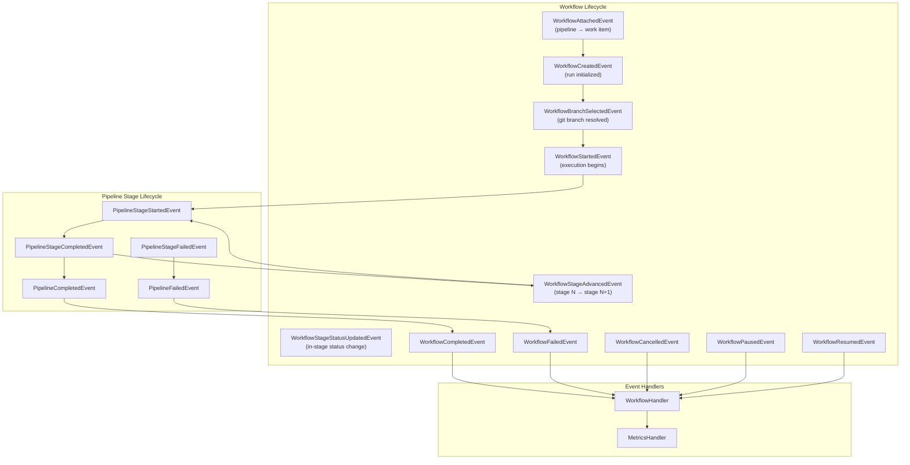
```mermaid
graph TB
    subgraph "Workflow Lifecycle"
        ATTACH["WorkflowAttachedEvent<br/>(pipeline → work item)"]
        CREATED["WorkflowCreatedEvent<br/>(run initialized)"]
        STARTED["WorkflowStartedEvent<br/>(execution begins)"]
        BRANCH["WorkflowBranchSelectedEvent<br/>(git branch resolved)"]
        ADVANCED["WorkflowStageAdvancedEvent<br/>(stage N → stage N+1)"]
        STATUS["WorkflowStageStatusUpdatedEvent<br/>(in-stage status change)"]
        COMPLETED["WorkflowCompletedEvent"]
        FAILED["WorkflowFailedEvent"]
        CANCELLED["WorkflowCancelledEvent"]
        PAUSED["WorkflowPausedEvent"]
        RESUMED["WorkflowResumedEvent"]
    end

    subgraph "Pipeline Stage Lifecycle"
        PS_STARTED["PipelineStageStartedEvent"]
        PS_COMPLETED["PipelineStageCompletedEvent"]
        PS_FAILED["PipelineStageFailedEvent"]
        P_COMPLETED["PipelineCompletedEvent"]
        P_FAILED["PipelineFailedEvent"]
    end

    subgraph "Event Handlers"
        WFH["WorkflowHandler"]
        MH["MetricsHandler"]
    end

    ATTACH --> CREATED --> BRANCH --> STARTED
    STARTED --> PS_STARTED
    PS_STARTED --> PS_COMPLETED
    PS_COMPLETED --> ADVANCED
    ADVANCED --> PS_STARTED
    PS_COMPLETED --> P_COMPLETED
    P_COMPLETED --> COMPLETED
    PS_FAILED --> P_FAILED
    P_FAILED --> FAILED

    COMPLETED --> WFH
    FAILED --> WFH
    CANCELLED --> WFH
    PAUSED --> WFH
    RESUMED --> WFH
    WFH --> MH
```


## Event-Flow Diagrams

### Work Item → Board → Execution Flow

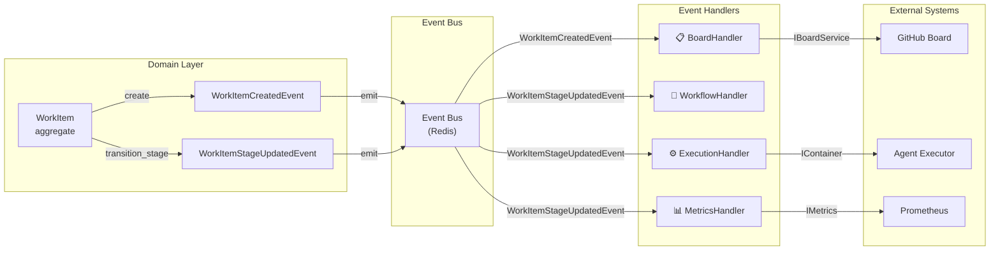
```mermaid
graph LR
    subgraph "Domain Layer"
        WI["WorkItem<br/>aggregate"]
        WI -->|create| WI_CREATED["WorkItemCreatedEvent"]
        WI -->|transition_stage| WI_STAGE["WorkItemStageUpdatedEvent"]
    end

    subgraph "Event Bus"
        BUS["Event Bus<br/>(Redis)"]
        WI_CREATED -->|emit| BUS
        WI_STAGE -->|emit| BUS
    end

    subgraph "Event Handlers"
        BH["📋 BoardHandler"]
        WH["🔄 WorkflowHandler"]
        EH["⚙️ ExecutionHandler"]
        MH["📊 MetricsHandler"]
    end

    subgraph "External Systems"
        BOARD["GitHub Board"]
        EXEC["Agent Executor"]
        METRICS["Prometheus"]
    end

    BUS -->|WorkItemCreatedEvent| BH
    BUS -->|WorkItemStageUpdatedEvent| WH
    BUS -->|WorkItemStageUpdatedEvent| EH
    BUS -->|WorkItemStageUpdatedEvent| MH

    BH -->|IBoardService| BOARD
    EH -->|IContainer| EXEC
    MH -->|IMetrics| METRICS
```

### Error → Repair Cycle → Resolution Flow

```mermaid
graph TB
    subgraph "Execution Failure"
        TEST["Tests run"]
        FAIL["Tests fail"]
        FAIL -->|ExecutionFailedEvent| REPAIR["RepairCycleStartedEvent"]
    end

    subgraph "Repair Cycle"
        RC["RepairCycle<br/>aggregate"]
        RC -->|test execution| TEST_START["RepairCycleTestExecutionStartedEvent"]
        TEST_START -->|emit| TEST_COMPLETE["RepairCycleTestExecutionCompletedEvent"]
        TEST_COMPLETE -->|parse results| DECISION{"All pass?"}
        DECISION -->|no| FIX_START["RepairCycleFixCycleStartedEvent"]
        FIX_START -->|agent fixes| FIX_COMPLETE["RepairCycleFileFixCompletedEvent"]
        FIX_COMPLETE -->|retry tests| TEST_START
        DECISION -->|yes| RC_COMPLETE["RepairCycleCompletedEvent"]
    end

    subgraph "Event Bus & Handlers"
        RC_COMPLETE -->|emit & publish| HANDLER["WorkflowHandler"]
        HANDLER -->|advance work item| NEXT_STAGE["Next workflow stage"]
    end
```

---

## Event Sourcing and Replay

Every event is persisted to the **Event Store** (Redis, optionally PostgreSQL). This enables:

### 1. Complete Audit Trail
- Every state change is recorded as an immutable fact
- Timestamps and correlation IDs enable tracing
- No information is lost

### 2. Event Replay
- Load a work item's initial state
- Replay all events up to a point in time
- Reconstruct exact state without explicit state storage
- Enables temporal queries: "what was the state at time X?"

### 3. Debugging
- Event stream provides complete history of actions
- Identify exactly when and why state changed
- Replay events in test environment to reproduce issues

### 4. Time-Travel Queries
- Query: "How many work items were in progress at 2pm yesterday?"
- Replay all events up to 2pm yesterday
- Count in-progress items at that point in time

**Example: Event Replay**

```
1. Load work item WI-123 (empty aggregate)
2. Replay events in order:
   - WorkItemCreatedEvent(id=WI-123, status=NEW)
     → WorkItem state: {status: NEW}
   - AgentAssignedEvent(agent_id=A1)
     → WorkItem state: {status: NEW, assigned_agent: A1}
   - WorkItemStartedEvent()
     → WorkItem state: {status: IN_PROGRESS, assigned_agent: A1}
   - WorkItemStageUpdatedEvent(new_stage=REVIEW)
     → WorkItem state: {status: UNDER_REVIEW, current_stage: REVIEW}
3. Reconstructed state is now current without loading from DB
```

---

## Event Immutability and Integrity

All domain events are **frozen dataclasses** (`@dataclass(frozen=True)`):

```python
@dataclass(frozen=True)
class WorkItemCreatedEvent(CodetoreumEvent):
    work_item_id: str = ""

# ✅ Create event
event = WorkItemCreatedEvent(work_item_id="WI-123")

# ❌ Attempting to modify raises FrozenInstanceError
event.work_item_id = "WI-456"  # Raises: FrozenInstanceError

# This immutability is essential because:
# - Events are facts that happened in the past
# - Facts cannot be changed retroactively
# - Event sourcing relies on immutable history
# - Audit trails must be tamper-proof
```

---

## Summary

The 151 CodetoreumEvent subclasses form a complete audit trail of system behavior. Each event represents an immutable fact about state changes. Event handlers subscribe to events and trigger reactions—calling output ports, updating read models, or emitting new events.

Events enable decoupled communication between layers, complete observability through event sourcing, and the ability to replay history for debugging or temporal queries.

See `documentation/architecture/domain/models.md` for the domain models that emit these events.
