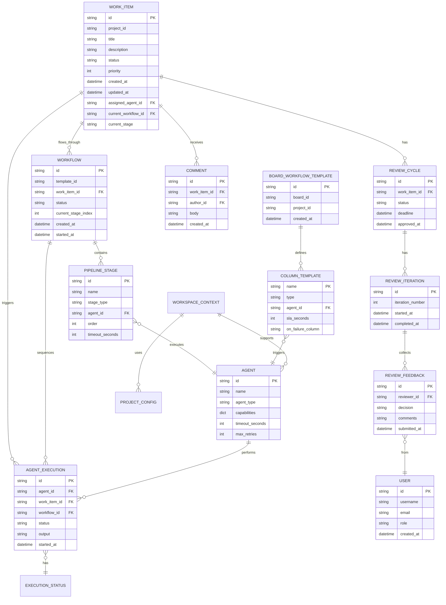
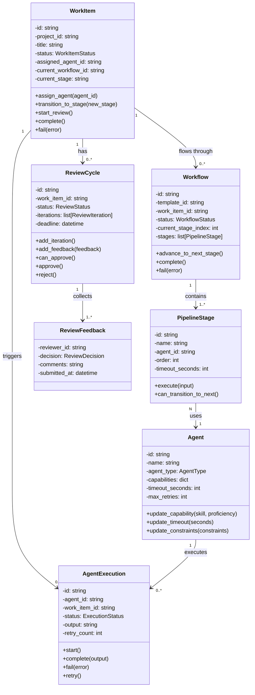

---
required_sections:
  - "## Overview"
  - "## Model Definitions"
  - "## Invariants"
  - "## Relationships"
  - "## Diagram"
applies_to: "documentation/architecture/domain/models.md"
---

# Domain Models Catalog

## Overview

The domain layer contains 90 pure business logic classes across 17 source files. These models form the core of Codetoreum, representing the system's fundamental concepts: work items, agents, workflows, executions, reviews, and supporting structures. All domain models are technology-agnostic—they contain no external dependencies, no I/O operations, and no framework coupling. They are organized into six primary bounded contexts:

1. **Work Item Context** — Lifecycle and state management of work items
2. **Agent Context** — AI agents and their capabilities
3. **Execution Context** — Agent execution instances and their lifecycle
4. **Workflow Context** — Workflow definitions and stage management
5. **Review Context** — Code review cycles and feedback
6. **Infrastructure Models** — Supporting structures for all other contexts

Domain models enforce business rules through **invariants**: conditions that must always be true. These invariants are expressed as methods on the models that validate state before allowing transitions.

## Model Definitions

### Work Item Context

**File**: `work_item.py`

Work items represent units of work (issues, tasks, features) flowing through the system.

```python
class WorkItemStatus(Enum):
    """Status enumeration for work items."""
    NEW = "new"
    ASSIGNED = "assigned"
    IN_PROGRESS = "in_progress"
    UNDER_REVIEW = "under_review"
    COMPLETED = "completed"
    FAILED = "failed"
    BLOCKED = "blocked"

class WorkItemPriority(Enum):
    """Priority levels for work items."""
    LOW = 1
    MEDIUM = 2
    HIGH = 3
    CRITICAL = 4

@dataclass
class WorkItem:
    """Work Item aggregate root.
    
    Represents a unit of work (issue, task, feature) that flows through
    the system. Maintains its own consistency boundary and emits events
    for all state changes.
    """
    # Identity
    id: str
    project_id: str
    
    # Core attributes
    title: str
    description: str
    
    # State
    status: WorkItemStatus
    priority: WorkItemPriority
    
    # Metadata
    labels: list[str]
    external_id: str | None  # ID in external system (GitHub issue #, etc.)
    external_url: str | None
    
    # Assignment
    assigned_agent_id: str | None
    assigned_at: datetime | None
    
    # Workflow tracking
    current_workflow_id: str | None
    current_stage: str | None
    
    # Board column tracking (for SLA monitoring)
    current_column: str | None
    entered_column_at: datetime | None
    
    # Timestamps
    created_at: datetime
    updated_at: datetime
    
    # PR and discussion tracking
    pr_id: str | None = None
    discussion_id: str | None = None
    completed_at: datetime | None = None
```

**Key Responsibilities**:
- Track work item state and lifecycle
- Emit events for state changes
- Enforce workflow transition rules
- Track time spent in board columns
- Support assignment to agents

---

### Agent Context

**File**: `agent.py`

Agents represent AI systems capable of performing work on work items.

```python
class AgentType(Enum):
    """Types of agents in the system."""
    MAKER = "maker"                          # Creates initial implementations
    REVIEWER = "reviewer"                    # Reviews agent-generated code
    SPECIALIZED = "specialized"              # Task-specific agents
    REQUIREMENTS_ANALYST = "requirements_analyst"
    ARCHITECT = "architect"
    REPAIR_CYCLE = "repair_cycle"
    TEST_RUNNER = "test_runner"
    TEST_FIXER = "test_fixer"

@dataclass
class AgentCapability:
    """Represents a skill/capability of an agent."""
    skill: str
    proficiency: float  # 0.0-1.0
    description: str | None

@dataclass
class Agent:
    """Agent aggregate root.
    
    Represents an AI agent with capabilities, configuration, and constraints.
    Agents are created once and used repeatedly to execute work items.
    """
    # Identity
    id: str
    
    # Basic attributes
    name: str
    display_name: str
    agent_type: AgentType
    
    # Capabilities
    capabilities: dict[str, AgentCapability]  # skill -> capability
    
    # Configuration
    model_id: str                # e.g., "claude-opus"
    timeout_seconds: int
    max_retries: int
    max_concurrent_executions: int
    
    # Execution context
    requires_project_files: bool
    mcp_servers: dict[str, dict[str, Any]]  # MCP server configs
    
    # Constraints
    constraints: dict[str, Any]
    
    # Metadata
    created_at: datetime
    updated_at: datetime
    last_used_at: datetime | None = None
```

**Key Responsibilities**:
- Define agent capabilities and constraints
- Store configuration (model, timeout, retries)
- Track agent usage and lifecycle
- Support MCP server integration

---

### Execution Context

**File**: `agent_execution.py`, `workspace_context.py`

Execution entities represent instances of agents working on work items.

```python
class ExecutionStatus(Enum):
    """Status enumeration for agent executions."""
    PENDING = "pending"
    INITIALIZED = "initialized"
    RUNNING = "running"
    PAUSED = "paused"
    COMPLETED = "completed"
    FAILED = "failed"
    TIMEOUT = "timeout"
    CANCELLED = "cancelled"

@dataclass
class AgentExecution:
    """Agent Execution entity.
    
    Represents a single execution instance of an agent.
    Part of the Workflow aggregate but has its own identity.
    """
    # Identity
    id: str
    agent_id: str
    work_item_id: str
    workflow_id: str
    stage_name: str
    
    # Execution state
    status: ExecutionStatus
    started_at: datetime | None
    completed_at: datetime | None
    
    # Results
    output: str | None
    error: str | None
    
    # Metadata
    created_at: datetime
    updated_at: datetime
    retry_count: int = 0
    execution_duration_seconds: float | None = None
```

**Key Responsibilities**:
- Track individual agent execution lifecycle
- Store execution output and errors
- Record timing information
- Support retry logic

```python
class WorkspaceType(Enum):
    """Type of workspace for agent execution."""
    TASK_EXECUTION = "task_execution"
    REVIEW_SESSION = "review_session"
    DEBUG = "debug"

@dataclass
class WorkspaceContext:
    """Context for agent execution workspace.
    
    Contains all information needed to set up a container
    for agent execution, including files, environment,
    and context about the work being performed.
    """
    # Identity
    id: str
    project_id: str
    work_item_id: str
    agent_id: str
    
    # Workspace setup
    type: WorkspaceType
    container_id: str | None
    mount_paths: dict[str, str]  # host_path -> container_path
    
    # Environment
    environment_vars: dict[str, str]
    
    # Lifecycle
    created_at: datetime
    destroyed_at: datetime | None
```

---

### Workflow Context

**File**: `workflow.py`, `workflow_template.py`, `pipeline_stage.py`, `board_workflow_template.py`

Workflows define multi-stage pipelines that work items progress through.

```python
class WorkflowStatus(Enum):
    """Status of a workflow instance."""
    CREATED = "created"
    IN_PROGRESS = "in_progress"
    COMPLETED = "completed"
    FAILED = "failed"
    PAUSED = "paused"

@dataclass
class Workflow:
    """Workflow instance aggregate root.
    
    Represents a specific workflow applied to a work item.
    Tracks progress through stages and stage status.
    """
    # Identity
    id: str
    workflow_template_id: str
    work_item_id: str
    project_id: str
    
    # State
    status: WorkflowStatus
    current_stage_index: int
    
    # Stage execution tracking
    stage_executions: list[AgentExecution]  # One per stage
    
    # Timestamps
    created_at: datetime
    started_at: datetime | None
    completed_at: datetime | None
```

```python
class StageType(Enum):
    """Type of pipeline stage."""
    AGENT_EXECUTION = "agent_execution"
    MANUAL_APPROVAL = "manual_approval"
    CONDITIONAL_BRANCH = "conditional_branch"

class StageStatus(Enum):
    """Status of a pipeline stage."""
    PENDING = "pending"
    IN_PROGRESS = "in_progress"
    COMPLETED = "completed"
    FAILED = "failed"
    SKIPPED = "skipped"

@dataclass
class PipelineStage:
    """A stage in a workflow pipeline.
    
    Represents a single step in a workflow where either:
    1. An agent executes and produces output
    2. Manual approval is required
    3. A conditional decision branches the workflow
    """
    # Identity
    id: str
    name: str
    stage_type: StageType
    
    # Configuration
    agent_id: str | None  # Required for AGENT_EXECUTION
    timeout_seconds: int | None
    on_failure: str | None  # Stage name to jump to on failure
    
    # Conditional branching
    condition_input: str | None  # Reference to prev stage output
    branches: dict[str, str] | None  # condition -> next stage
    
    # Ordering
    order: int
```

```python
class ColumnType(Enum):
    """Type of workflow column."""
    MANUAL = "manual"
    AUTOMATED = "automated"

@dataclass
class ColumnTemplate:
    """Template for a board column with workflow semantics.
    
    Defines a column in a board, with optional agent assignment,
    SLA thresholds, and failure/escalation handling.
    """
    name: str
    type: ColumnType
    agent_id: str | None  # Agent to trigger when item enters
    is_pipeline_trigger: bool  # Acquire lock when item enters?
    is_exit_column: bool  # Release lock when item enters?
    position: int
    auto_progress_on_completion: bool
    sla_seconds: int | None
    on_failure_column: str | None  # Move here on agent failure
    sla_escalation_column: str | None  # Move here on SLA expiry
    repair_cycle_agents: dict | None
    repair_cycle_test_types: tuple | None
    pr_review_cycle_config: dict | None
    execution_type: str  # "task_queue" or "conversational"

@dataclass
class BoardWorkflowTemplate:
    """Workflow template with column-based semantics.
    
    Defines a workflow where work items progress through board columns,
    with each column optionally triggering an agent or requiring manual action.
    """
    id: str
    name: str
    board_id: str
    project_id: str
    columns: tuple[ColumnTemplate, ...]  # Immutable ordered columns
    created_at: datetime | None
    updated_at: datetime | None
```

**Key Responsibilities**:
- Define multi-stage pipelines
- Manage workflow progression
- Track stage status and execution
- Support conditional branching and failure handling
- Provide SLA monitoring on board columns

---

### Review Context

**File**: `review_cycle.py`, `pr_review_cycle_types.py`

Review cycles model code review and approval processes.

```python
class ReviewStatus(Enum):
    """Status of a review cycle."""
    PENDING = "pending"
    IN_PROGRESS = "in_progress"
    APPROVED = "approved"
    CHANGES_REQUESTED = "changes_requested"
    ESCALATED = "escalated"

class ReviewDecision(Enum):
    """Final decision on a review."""
    APPROVED = "approved"
    REJECTED = "rejected"
    ESCALATED = "escalated"

@dataclass
class ReviewFeedback:
    """Feedback from a single reviewer."""
    reviewer_id: str
    decision: ReviewDecision
    comments: str
    submitted_at: datetime

@dataclass
class ReviewIteration:
    """A single iteration of a review cycle."""
    id: str
    iteration_number: int
    feedback: list[ReviewFeedback]
    started_at: datetime
    completed_at: datetime | None

@dataclass
class ReviewCycle:
    """Review Cycle aggregate root.
    
    Models a code review process where feedback is collected
    from reviewers, and a decision is made (approve/reject/escalate).
    """
    # Identity
    id: str
    work_item_id: str
    
    # Review state
    status: ReviewStatus
    iterations: list[ReviewIteration]
    
    # Deadline and SLAs
    deadline: datetime | None
    approved_at: datetime | None
```

```python
class PRReviewStatus(Enum):
    """Status of a PR review cycle."""
    STARTED = "started"
    CODE_REVIEW = "code_review"
    VERIFICATION = "verification"
    CI_CHECK = "ci_check"
    CONSOLIDATION = "consolidation"
    APPROVED = "approved"
    ISSUES_FOUND = "issues_found"
    ESCALATED = "escalated"

@dataclass
class PRReviewFinding:
    """A finding from code review."""
    category: str  # "security", "performance", "style", etc.
    severity: str  # "critical", "major", "minor"
    description: str
    suggested_fix: str | None

@dataclass
class PRReviewCycleConfig:
    """Configuration for a PR review cycle."""
    max_iterations: int
    require_ci_pass: bool
    code_review_timeout: int
    allow_auto_merge: bool
```

**Key Responsibilities**:
- Track review feedback from multiple reviewers
- Support iterative feedback and revisions
- Enforce approval criteria (unanimous, majority, etc.)
- Handle escalation of conflicting feedback
- Track PR review cycle phases and decisions

---

### Infrastructure Models

**File**: `value_objects.py`, `types.py`, `user.py`, `comment.py`, `conversational_session.py`

Supporting value objects and infrastructure models used across contexts.

```python
class TypeSafeId:
    """Type-safe identifier wrapper."""
    def __init__(self, value: str):
        self.value = value

@dataclass(frozen=True)
class WorkItemId(TypeSafeId):
    """Immutable work item identifier."""
    pass

@dataclass(frozen=True)
class WorkflowId(TypeSafeId):
    """Immutable workflow identifier."""
    pass

@dataclass(frozen=True)
class AgentId(TypeSafeId):
    """Immutable agent identifier."""
    pass

@dataclass(frozen=True)
class ExecutionId(TypeSafeId):
    """Immutable execution identifier."""
    pass

@dataclass(frozen=True)
class ExecutionResult:
    """Immutable result of an execution."""
    status: ExecutionStatus
    output: str
    error: str | None
    duration_seconds: float

@dataclass(frozen=True)
class ProjectConfig:
    """Immutable project configuration."""
    project_id: str
    docker_config: dict
    environment_vars: dict[str, str]
    test_config: dict

@dataclass(frozen=True)
class ContainerConfig:
    """Immutable container configuration."""
    image: str
    environment: dict[str, str]
    volumes: dict[str, str]  # host -> container
    entrypoint: list[str] | None
    working_dir: str
```

```python
class UserRole(Enum):
    """Role of a user in the system."""
    ADMIN = "admin"
    DEVELOPER = "developer"
    REVIEWER = "reviewer"
    BOT = "bot"

class Permission(Enum):
    """Permissions in the system."""
    CREATE_WORK_ITEM = "create_work_item"
    UPDATE_WORK_ITEM = "update_work_item"
    DELETE_WORK_ITEM = "delete_work_item"
    REVIEW = "review"
    APPROVE = "approve"
    ADMIN = "admin"

@dataclass
class User:
    """User in the system."""
    id: str
    username: str
    email: str
    role: UserRole
    permissions: set[Permission]
    created_at: datetime

@dataclass
class AuthContext:
    """Authentication context for a request."""
    user: User
    is_authenticated: bool
    token_issued_at: datetime
```

```python
@dataclass
class Comment:
    """Represents a comment on a work item."""
    id: str
    work_item_id: str
    author_id: str
    body: str
    created_at: datetime
    updated_at: datetime
    parent_id: str | None  # For threaded discussions
```

**Key Responsibilities**:
- Provide type-safe identifiers
- Store immutable value objects (ExecutionResult, ProjectConfig)
- Track user identity and permissions
- Support conversational session state

---

## Invariants

Domain models enforce business rules through invariants:

### Work Item Invariants

1. **WorkItem-1**: Work item must have a valid status from WorkItemStatus enum
   - Enforced by: `WorkItemStatus` enum
   - Prevents: Invalid state values

2. **WorkItem-2**: Work item can only transition to valid next stages
   - Enforced by: `can_transition_to(new_status)` method
   - Prevents: Invalid stage transitions (e.g., COMPLETED → IN_PROGRESS)

3. **WorkItem-3**: If assigned to agent, must have assigned_agent_id and assigned_at timestamp
   - Enforced by: `assign_agent()` method that sets both fields
   - Prevents: Partial assignment state

4. **WorkItem-4**: Work item cannot be COMPLETED without going through UNDER_REVIEW
   - Enforced by: Workflow transition validation
   - Prevents: Bypassing review stage

5. **WorkItem-5**: Current column must match workflow stage
   - Enforced by: `on_stage_changed()` handler syncs column with stage
   - Prevents: Desynchronization between workflow and board

### Agent Invariants

1. **Agent-1**: Agent must have at least one capability
   - Enforced by: Constructor validation
   - Prevents: Creating agents with no skills

2. **Agent-2**: Agent timeout must be positive
   - Enforced by: Field validation in `update_timeout()`
   - Prevents: Invalid timeout values (0, negative)

3. **Agent-3**: Capability proficiency must be 0.0-1.0
   - Enforced by: `AgentCapability` validation
   - Prevents: Invalid proficiency scores

4. **Agent-4**: Agent cannot be deleted while in active execution
   - Enforced by: Application service checks active executions before deletion
   - Prevents: Orphaning active work

### Execution Invariants

1. **Execution-1**: Execution cannot advance from COMPLETED or FAILED
   - Enforced by: `advance_status()` method checks current status
   - Prevents: Re-running completed executions

2. **Execution-2**: RUNNING execution must have started_at timestamp
   - Enforced by: `start()` method sets timestamp
   - Prevents: Missing timing information

3. **Execution-3**: Execution retry count cannot exceed agent's max_retries
   - Enforced by: Application service checks before retry
   - Prevents: Infinite retry loops

### Workflow Invariants

1. **Workflow-1**: Workflow must follow defined stage order
   - Enforced by: `advance_to_next_stage()` validates order
   - Prevents: Skipping or reversing stages

2. **Workflow-2**: Workflow cannot transition to COMPLETED until all stages are done
   - Enforced by: `complete()` method verifies all stages
   - Prevents: Premature completion

3. **Workflow-3**: Current stage index must be within bounds [0, stages.length)
   - Enforced by: Bounds checking in `advance_to_next_stage()`
   - Prevents: Index out of bounds

### Review Invariants

1. **Review-1**: Review cannot be approved without required minimum feedback
   - Enforced by: `can_approve()` checks feedback count
   - Prevents: Approving without sufficient review

2. **Review-2**: A reviewer can only submit feedback once per iteration
   - Enforced by: `add_feedback()` replaces previous feedback from same reviewer
   - Prevents: Duplicate feedback from single reviewer

3. **Review-3**: Review deadline cannot be in the past
   - Enforced by: `set_deadline()` validates deadline > now
   - Prevents: Expired deadlines

---

## Relationships

Domain models relate to each other as follows:

| Source | Relationship | Target | Cardinality | Notes |
|---|---|---|---|---|
| WorkItem | triggers | AgentExecution | 1:N | A work item may trigger multiple agent executions across workflow stages |
| WorkItem | flows through | Workflow | 1:N | A work item may have multiple workflows (initial + repair cycles) |
| WorkItem | has | ReviewCycle | 1:N | Multiple review cycles per work item (one per change set) |
| WorkItem | belongs to | Project | N:1 | Many work items in single project |
| WorkItem | tracks | Comment | 1:N | Comments are attached to work items |
| Workflow | contains | PipelineStage | 1:N | Workflow is ordered sequence of stages |
| PipelineStage | executes | Agent | N:1 | Each stage uses one agent (or manual/conditional) |
| Agent | performs | AgentExecution | 1:N | Agent has many execution instances |
| AgentExecution | belongs to | Workflow | N:1 | Execution is part of workflow |
| AgentExecution | updates | WorkItem | N:1 | Execution produces changes to work item |
| ReviewCycle | collects | ReviewFeedback | 1:N | Review aggregates feedback from reviewers |
| ReviewCycle | has | ReviewIteration | 1:N | Multiple iterations if changes requested |
| ReviewIteration | contains | ReviewFeedback | 1:N | Each iteration collects feedback |
| User | submits | ReviewFeedback | 1:N | User provides multiple feedback items |
| BoardWorkflowTemplate | defines | ColumnTemplate | 1:N | Board template contains ordered columns |
| ColumnTemplate | triggers | Agent | N:1 | Multiple columns may trigger same agent |
| WorkspaceContext | mounts | ProjectFiles | 1:N | Workspace includes read/write mounted files |
| ProjectContext | configures | Agent | 1:N | Project can configure multiple agents |

---

## Diagram

### Entity Relationship Diagram



### Class Diagram (Key Aggregates)



---

## Cross-References

Domain models are referenced by:
- **Application Services** (`src/codetoreum/application/`): Orchestrate models to implement workflows
- **Domain Events** (`src/codetoreum/domain/events/`): Emitted by models to signal state changes
- **Output Ports** (`src/codetoreum/ports/output/`): Adapters implement ports to persist/load models
- **Event Handlers** (`src/codetoreum/application/event_handlers/`): React to events and update models

Domain models are the foundation that all other layers build upon. See `documentation/architecture/domain/events.md` for domain events emitted by these models.
