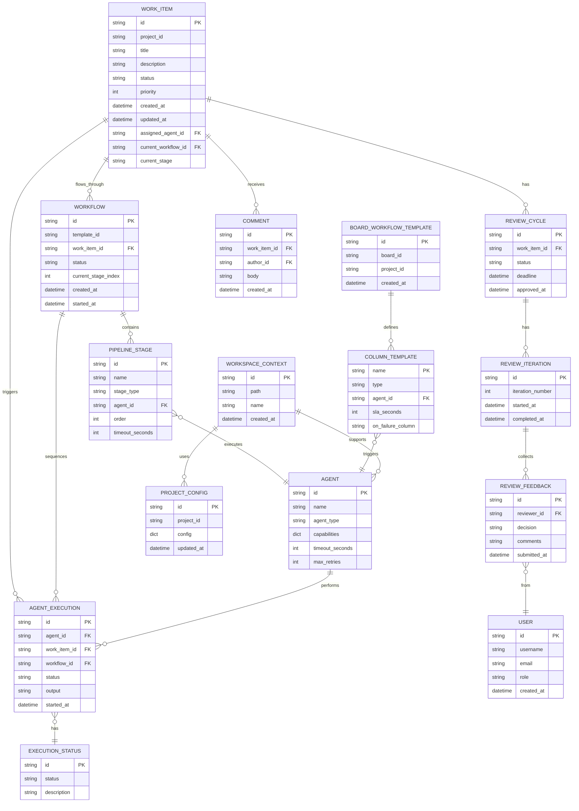
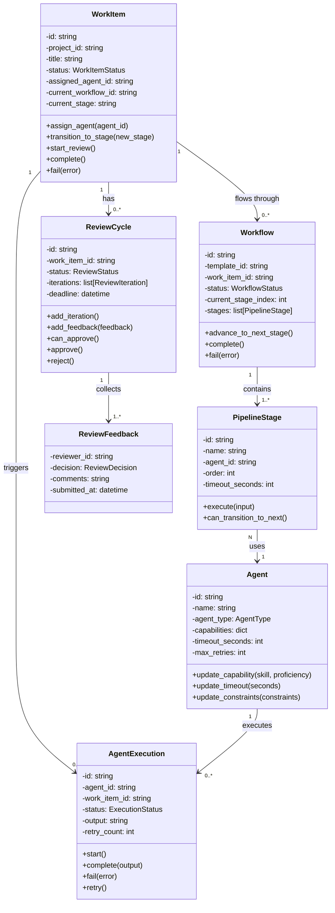

---
required_sections:
  - "## Overview"
  - "## Model Definitions"
  - "## Invariants"
  - "## Relationships"
  - "## Diagram"
  - "## Events"
  - "## Examples"
applies_to: "documentation/architecture/domain/models.md"
---

# Domain Models Catalog

## Overview

The domain layer contains **90 pure business logic classes** across **19 source files**. These models form the core of Codetoreum, representing the system's fundamental concepts: work items, agents, workflows, executions, reviews, repairs, exceptions, and project configuration. All domain models are technology-agnostic—they contain no external dependencies, no I/O operations, and no framework coupling. They are organized into nine primary bounded contexts:

1. **Work Item Context** — Lifecycle and state management of work items
2. **Agent Context** — AI agents and their capabilities
3. **Execution Context** — Agent execution instances and their lifecycle
4. **Workflow Context** — Workflow definitions and stage management
5. **Review Context** — Code review cycles and feedback
6. **Repair Cycle Context** — Automated test-fix-validate cycles
7. **Project Context** — Project-level configuration and test setup
8. **Exception Context** — Domain-level error types and business rule violations
9. **Infrastructure Models** — Supporting structures (values objects, enums) for all other contexts

Domain models enforce business rules through **invariants**: conditions that must always be true. These invariants are expressed as methods on the models that validate state before allowing transitions.

## Model Definitions

### Work Item Context

**File**: `work_item.py`

Work items represent units of work (issues, tasks, features) flowing through the system.

```python
class WorkItemStatus(Enum):
    """Status enumeration for work items."""
    NEW = "new"
    ASSIGNED = "assigned"
    IN_PROGRESS = "in_progress"
    UNDER_REVIEW = "under_review"
    COMPLETED = "completed"
    FAILED = "failed"
    BLOCKED = "blocked"

class WorkItemPriority(Enum):
    """Priority levels for work items."""
    LOW = 1
    MEDIUM = 2
    HIGH = 3
    CRITICAL = 4

@dataclass
class WorkItem:
    """Work Item aggregate root.
    
    Represents a unit of work (issue, task, feature) that flows through
    the system. Maintains its own consistency boundary and emits events
    for all state changes.
    """
    # Identity
    id: str
    project_id: str
    
    # Core attributes
    title: str
    description: str
    
    # State
    status: WorkItemStatus
    priority: WorkItemPriority
    
    # Metadata
    labels: list[str]
    external_id: str | None  # ID in external system (GitHub issue #, etc.)
    external_url: str | None
    
    # Assignment
    assigned_agent_id: str | None
    assigned_at: datetime | None
    
    # Workflow tracking
    current_workflow_id: str | None
    current_stage: str | None
    
    # Board column tracking (for SLA monitoring)
    current_column: str | None
    entered_column_at: datetime | None
    
    # Timestamps
    created_at: datetime
    updated_at: datetime
    
    # PR and discussion tracking
    pr_id: str | None = None
    discussion_id: str | None = None
    completed_at: datetime | None = None
```

**Key Responsibilities**:
- Track work item state and lifecycle
- Emit events for state changes
- Enforce workflow transition rules
- Track time spent in board columns
- Support assignment to agents

---

### Agent Context

**File**: `agent.py`

Agents represent AI systems capable of performing work on work items.

```python
class AgentType(Enum):
    """Types of agents in the system."""
    MAKER = "maker"                          # Creates/produces output
    REVIEWER = "reviewer"                    # Reviews output
    SPECIALIZED = "specialized"              # Task-specific agents
    REQUIREMENTS_ANALYST = "requirements_analyst"
    ARCHITECT = "architect"
    DEVELOPER = "developer"
    TESTER = "tester"
    DEVOPS = "devops"

@dataclass
class AgentCapability:
    """Represents a skill/capability of an agent."""
    skill: str
    proficiency: float  # 0.0-1.0
    description: str | None

@dataclass
class Agent:
    """Agent aggregate root.
    
    Represents an AI agent with capabilities, configuration, and constraints.
    """
    # Identity
    id: str
    
    # Basic attributes
    name: str
    display_name: str
    agent_type: AgentType
    
    # Capabilities and role
    capabilities: dict[str, AgentCapability]  # skill -> capability
    role_description: str
    
    # Configuration (required fields first)
    model: str                 # LLM model (e.g., "claude-sonnet-4-5")
    timeout_seconds: int
    max_retries: int
    
    # Constraints (environment requirements)
    requires_docker: bool
    requires_dev_container: bool
    makes_code_changes: bool
    filesystem_write_allowed: bool
    
    # MCP servers
    mcp_servers: list[str]
    
    # Metadata
    metadata: dict[str, Any]
    
    # Timestamps (NO DEFAULTS - Required fields)
    created_at: datetime
    updated_at: datetime
    
    # Configuration with defaults (must come after required fields)
    temperature: float = 0.7   # LLM temperature (0.0-2.0)
    max_tokens: int = 4096     # Maximum tokens for responses
    system_prompt: str = ""    # System prompt for the agent
    commit_policy: CommitPolicy = CommitPolicy.ON_SUCCESS  # When to commit file changes
```

**Key Responsibilities**:
- Define agent capabilities and constraints
- Store configuration (model, timeout, retries)
- Track agent usage and lifecycle
- Support MCP server integration

---

### Execution Context

**File**: `agent_execution.py`, `workspace_context.py`

Execution entities represent instances of agents working on work items.

```python
class ExecutionStatus(Enum):
    """Status enumeration for agent executions."""
    PENDING = "pending"              # Waiting to be started
    INITIALIZED = "initialized"      # Created but not yet running
    RUNNING = "running"
    PAUSED = "paused"                # Execution paused by user/system
    COMPLETED = "completed"
    FAILED = "failed"
    TIMEOUT = "timeout"
    CANCELLED = "cancelled"

@dataclass
class AgentExecution:
    """Agent Execution entity.
    
    Represents a single execution instance of an agent.
    Part of the Workflow aggregate but has its own identity.
    """
    # Identity
    id: str
    agent_id: str
    work_item_id: str
    workflow_id: str
    stage_name: str
    
    # Status
    status: ExecutionStatus
    
    # Execution context
    prompt: str
    model: str
    session_id: str | None
    
    # Container tracking
    container_name: str | None
    container_id: str | None
    
    # Results
    output: str | None
    error_message: str | None
    exit_code: int | None
    
    # Metrics
    input_tokens: int
    output_tokens: int
    duration_seconds: float | None
    
    # Timestamps
    initialized_at: datetime
    started_at: datetime | None
    completed_at: datetime | None
    
    # Metadata
    metadata: dict[str, Any]
```

**Key Responsibilities**:
- Track individual agent execution lifecycle
- Store execution output and errors
- Record timing information
- Support retry logic

```python
class WorkspaceType(Enum):
    """Type of workspace for agent execution."""
    TASK_EXECUTION = "task_execution"
    REVIEW_SESSION = "review_session"
    DEBUG = "debug"

@dataclass
class WorkspaceContext:
    """Context for agent execution workspace.
    
    Contains all information needed to set up a container
    for agent execution, including files, environment,
    and context about the work being performed.
    """
    # Identity
    id: str
    project_id: str
    work_item_id: str
    agent_id: str
    
    # Workspace setup
    type: WorkspaceType
    container_id: str | None
    mount_paths: dict[str, str]  # host_path -> container_path
    
    # Environment
    environment_vars: dict[str, str]
    
    # Lifecycle
    created_at: datetime
    destroyed_at: datetime | None
```

---

### Workflow Context

**File**: `workflow.py`, `workflow_template.py`, `pipeline_stage.py`, `board_workflow_template.py`

Workflows define multi-stage pipelines that work items progress through.

```python
class WorkflowStatus(Enum):
    """Status enumeration for workflows."""
    PENDING = "pending"
    RUNNING = "running"
    PAUSED = "paused"
    COMPLETED = "completed"
    FAILED = "failed"
    CANCELLED = "cancelled"

@dataclass
class Workflow:
    """Workflow aggregate root.
    
    Orchestrates execution of work items through pipeline stages.
    Maintains consistency boundary for workflow execution.
    """
    # Identity
    id: str
    work_item_id: str
    template_id: str
    project_id: str
    
    # Status
    status: WorkflowStatus
    
    # Stage tracking
    stages: list[PipelineStage]
    current_stage_index: int
    completed_stages: list[str]
    
    # Execution tracking
    started_at: datetime | None
    completed_at: datetime | None
    paused_at: datetime | None
    
    # Metadata
    metadata: dict[str, Any]
    
    # Timestamps
    created_at: datetime
    updated_at: datetime
```

```python
class StageType(Enum):
    """Type of pipeline stage."""
    SEQUENTIAL = "sequential"
    PARALLEL = "parallel"
    REVIEW = "review"

class StageStatus(Enum):
    """Status of a pipeline stage."""
    PENDING = "pending"
    READY = "ready"
    RUNNING = "running"
    COMPLETED = "completed"
    FAILED = "failed"
    SKIPPED = "skipped"

@dataclass
class PipelineStage:
    """Pipeline Stage entity.
    
    Represents a stage in a workflow pipeline with dependencies and execution tracking.
    """
    # Identity
    id: str
    name: str
    workflow_id: str
    
    # Configuration
    stage_type: StageType
    agent_config: dict[str, Any]
    description: str
    
    # Dependencies
    dependencies: list[str]
    is_parallel: bool
    
    # Review configuration (if stage_type == REVIEW)
    maker_agent_id: str | None
    reviewer_agent_id: str | None
    max_review_iterations: int
    
    # Status
    status: StageStatus
    
    # Execution tracking
    execution_id: str | None
    started_at: datetime | None
    completed_at: datetime | None
    
    # Results
    output: str | None
    error_message: str | None
    
    # Metadata
    metadata: dict[str, Any]
```

```python
class ColumnType(Enum):
    """Type of workflow column."""
    MANUAL = "manual"
    AUTOMATED = "automated"

@dataclass(frozen=True)
class ColumnTemplate:
    """Template for a board column with workflow semantics.
    
    Defines a column in a board, with optional agent assignment,
    SLA thresholds, and failure/escalation handling.
    """
    name: str
    type: ColumnType
    agent_id: str | None
    is_pipeline_trigger: bool
    is_exit_column: bool
    position: int
    auto_progress_on_completion: bool
    sla_seconds: int | None = None
    on_failure_column: str | None = None
    sla_escalation_column: str | None = None
    repair_cycle_agents: RepairCycleAgentConfig | None = None
    repair_cycle_test_types: tuple[RepairTestType, ...] | None = None
    pr_review_cycle_config: PRReviewCycleConfig | None = None
    execution_type: str = "task_queue"  # "task_queue" or "conversational"

@dataclass
class BoardWorkflowTemplate:
    """Workflow template with column-based semantics.
    
    Defines a workflow where work items progress through board columns,
    with each column optionally triggering an agent or requiring manual action.
    """
    id: str
    name: str
    board_id: str
    project_id: str
    columns: tuple[ColumnTemplate, ...]  # Immutable ordered columns
    created_at: datetime | None
    updated_at: datetime | None
```

**Key Responsibilities**:
- Define multi-stage pipelines
- Manage workflow progression
- Track stage status and execution
- Support conditional branching and failure handling
- Provide SLA monitoring on board columns

---

### Review Context

**File**: `review_cycle.py`, `pr_review_cycle_types.py`

Review cycles model code review and approval processes.

```python
class ReviewStatus(Enum):
    """Status of a review cycle."""
    PENDING = "pending"
    IN_PROGRESS = "in_progress"
    APPROVED = "approved"
    CHANGES_REQUESTED = "changes_requested"
    ESCALATED = "escalated"

class ReviewDecision(Enum):
    """Reviewer's decision."""
    APPROVE = "approve"
    REQUEST_CHANGES = "request_changes"
    ESCALATE = "escalate"

@dataclass
class ReviewFeedback:
    """Feedback from a single reviewer."""
    reviewer_id: str
    decision: ReviewDecision
    comments: str
    submitted_at: datetime

@dataclass
class ReviewIteration:
    """A single iteration of a review cycle."""
    id: str
    iteration_number: int
    feedback: list[ReviewFeedback]
    started_at: datetime
    completed_at: datetime | None

@dataclass
class ReviewCycle:
    """Review Cycle aggregate root.
    
    Models a code review process where feedback is collected
    from reviewers, and a decision is made (approve/reject/escalate).
    """
    # Identity
    id: str
    work_item_id: str
    
    # Review state
    status: ReviewStatus
    iterations: list[ReviewIteration]
    
    # Deadline and SLAs
    deadline: datetime | None
    approved_at: datetime | None
```

```python
class PRReviewOutcome(str, Enum):
    """Outcome of a PR review cycle."""
    ISSUES_FOUND = "issues_found"
    APPROVED = "approved"
    MAX_CYCLES_REACHED = "max_cycles"

class PRReviewStatus(str, Enum):
    """Status of a PR review cycle."""
    PENDING = "pending"
    PHASE_1_CODE_REVIEW = "phase_1_code_review"
    PHASE_2_VERIFICATION = "phase_2_verification"
    PHASE_3_CI_CHECK = "phase_3_ci_check"
    PHASE_4_CONSOLIDATION = "phase_4_consolidation"
    COMPLETED = "completed"
    ESCALATED = "escalated"

@dataclass(frozen=True)
class PRReviewFinding:
    """Represents a single finding from the PR review."""
    title: str
    description: str
    severity: str  # "critical", "high", "medium", "low"
    phase: str
    context_source: str | None = None

@dataclass(frozen=True)
class PRReviewPhaseOutput:
    """Output from a single phase in the PR review cycle."""
    phase_name: str
    phase_index: int
    success: bool
    findings: tuple[PRReviewFinding, ...]
    summary: str
    duration_seconds: float
    context_source: str | None = None
    comment_id: str | None = None
    error: str | None = None

@dataclass
class PRReviewCycleConfig:
    """Configuration for a PR review cycle."""
    max_iterations: int
    require_ci_pass: bool
    code_review_timeout: int
    allow_auto_merge: bool
```

**Key Responsibilities**:
- Track review feedback from multiple reviewers
- Support iterative feedback and revisions
- Enforce approval criteria (unanimous, majority, etc.)
- Handle escalation of conflicting feedback
- Track PR review cycle phases and decisions

---

### Infrastructure Models

**File**: `value_objects.py`, `types.py`, `user.py`, `comment.py`, `conversational_session.py`

Supporting value objects and infrastructure models used across contexts.

```python
class TypeSafeId:
    """Type-safe identifier wrapper."""
    def __init__(self, value: str):
        self.value = value

@dataclass(frozen=True)
class WorkItemId(TypeSafeId):
    """Immutable work item identifier."""
    pass

@dataclass(frozen=True)
class WorkflowId(TypeSafeId):
    """Immutable workflow identifier."""
    pass

@dataclass(frozen=True)
class AgentId(TypeSafeId):
    """Immutable agent identifier."""
    pass

@dataclass(frozen=True)
class ExecutionId(TypeSafeId):
    """Immutable execution identifier."""
    pass

@dataclass(frozen=True)
class ExecutionResult:
    """Immutable result of an execution."""
    status: ExecutionStatus
    output: str
    error: str | None
    duration_seconds: float

@dataclass(frozen=True)
class ProjectConfig:
    """Immutable project configuration."""
    project_id: str
    docker_config: dict
    environment_vars: dict[str, str]
    test_config: dict

@dataclass(frozen=True)
class ContainerConfig:
    """Immutable container configuration."""
    image: str
    environment: dict[str, str]
    volumes: dict[str, str]  # host -> container
    entrypoint: list[str] | None
    working_dir: str
```

```python
class UserRole(Enum):
    """Role of a user in the system."""
    ADMIN = "admin"
    DEVELOPER = "developer"
    REVIEWER = "reviewer"
    BOT = "bot"

class Permission(Enum):
    """Permissions in the system."""
    CREATE_WORK_ITEM = "create_work_item"
    UPDATE_WORK_ITEM = "update_work_item"
    DELETE_WORK_ITEM = "delete_work_item"
    REVIEW = "review"
    APPROVE = "approve"
    ADMIN = "admin"

@dataclass
class User:
    """User in the system."""
    id: str
    username: str
    email: str
    role: UserRole
    permissions: set[Permission]
    created_at: datetime

@dataclass
class AuthContext:
    """Authentication context for a request."""
    user: User
    is_authenticated: bool
    token_issued_at: datetime
```

```python
@dataclass
class Comment:
    """Represents a comment on a work item."""
    id: str
    work_item_id: str
    author_id: str
    body: str
    created_at: datetime
    updated_at: datetime
    parent_id: str | None  # For threaded discussions
```

**Key Responsibilities**:
- Provide type-safe identifiers
- Store immutable value objects (ExecutionResult, ProjectConfig)
- Track user identity and permissions
- Support conversational session state

---

### Repair Cycle Context

**File**: `repair_cycle_types.py` (17 classes)

The Repair Cycle context provides types and value objects for automated test-fix-validate cycles. It classifies failures, configures repair strategies, and tracks repair cycle results.

**Key Types**:
- **FailureClassification**: Enum categorizing root cause (CODE_DEFECT, ENVIRONMENT_ISSUE, TRANSIENT_FAILURE, DEPENDENCY_ISSUE, CONFIGURATION_ISSUE)
- **RepairTestType**: Enum for test execution order (COMPILATION, UNIT, INTEGRATION, CI, E2E)
- **RepairTestFailure**: Immutable record of a test failure with file, test name, and message
- **RepairTestWarning**: Immutable record of warnings found during testing
- **RepairTestResult**: Result from executing a test type in one iteration
- **CycleResult**: Result of a complete repair cycle iteration
- **RepairCycleResult**: Final aggregated result of entire repair cycle
- **RepairTestRunConfig**: Configuration for test runs (timeout, failure reporting, etc.)
- **RepairCycleAgentConfig**: Configuration for repair agent behavior
- **RepairCycleCheckpoint**: Checkpoint marking progress in repair cycle
- **EnvironmentRepairConfig**: Configuration for environment repair strategy
- **RepairCycleStageConfig**: Configuration for each test type stage
- **SystemicAnalysisResult**: Result of systemic analysis for environment/dependency issues
- **AnalysisContext**: Context for analysis operations
- **RebuildResult**: Result of rebuild operation
- **VerificationResult**: Result of verification operation
- **SystemicFixResult**: Result of systemic fix operation

**Invariants Enforced**:
- Test types must execute in strict order
- Failure/warning records must have all required fields
- Immutability of results (frozen dataclasses)

---

### Project Context

**File**: `project_context.py` (5 classes)

The Project Context provides project-level configuration and state management.

```python
class ProjectContextCreated(DomainEvent):
    """Emitted when project context is created."""
    def __init__(self, aggregate_id: str, payload: dict[str, Any], **kwargs: Any):
        super().__init__(aggregate_id=aggregate_id, aggregate_type="ProjectContext", payload=payload, **kwargs)

class ProjectTestConfigUpdated(DomainEvent):
    """Emitted when test configuration is updated."""
    def __init__(self, aggregate_id: str, payload: dict[str, Any], **kwargs: Any):
        super().__init__(aggregate_id=aggregate_id, aggregate_type="ProjectContext", payload=payload, **kwargs)

class ProjectDockerConfigUpdated(DomainEvent):
    """Emitted when Docker configuration is updated."""
    def __init__(self, aggregate_id: str, payload: dict[str, Any], **kwargs: Any):
        super().__init__(aggregate_id=aggregate_id, aggregate_type="ProjectContext", payload=payload, **kwargs)

class ProjectWorkflowMappingAdded(DomainEvent):
    """Emitted when workflow mapping is added."""
    def __init__(self, aggregate_id: str, payload: dict[str, Any], **kwargs: Any):
        super().__init__(aggregate_id=aggregate_id, aggregate_type="ProjectContext", payload=payload, **kwargs)

@dataclass
class ProjectContext:
    """Project aggregate root.
    
    Manages project-level configuration including test commands, Docker setup,
    and workflow mappings.
    """
    # Identity
    id: str
    
    # Project metadata
    name: str
    repository_url: str
    default_branch: str
    
    # Test configuration
    test_command: str | None
    test_framework: str | None
    
    # Docker configuration
    has_dockerfile: bool
    dockerfile_path: str | None
    requires_dev_container: bool
    
    # Timestamps
    created_at: datetime
    updated_at: datetime
```

**Key Responsibilities**:
- Store project-level configuration
- Manage test setup and Docker configuration
- Track workflow mappings to external systems
- Emit events for configuration changes

---

### Exception Context

**File**: `exceptions.py` (9 classes)

Domain-level exception types representing business rule violations and error conditions.

```python
class DomainError(Exception):
    """Base exception for domain layer errors."""
    def __init__(self, message: str):
        self.message = message
        super().__init__(self.message)

# Entity Not Found Exceptions
class AgentNotFoundError(DomainError):
    """Raised when an agent cannot be found."""

class ExecutionNotFoundError(DomainError):
    """Raised when an execution cannot be found."""

class WorkItemNotFoundError(DomainError):
    """Raised when a work item cannot be found."""

class WorkspaceNotFoundError(DomainError):
    """Raised when a workspace cannot be found."""

# Business Logic Exceptions
class TestOutputParseError(DomainError):
    """Raised when test output structure is invalid."""

class PipelineNotFoundError(DomainError):
    """Raised when a pipeline cannot be found."""

class ConfigNotFoundError(DomainError):
    """Raised when configuration is missing."""

class InvalidStateError(DomainError):
    """Raised when model state violates invariants."""
```

**Key Responsibilities**:
- Provide typed exceptions for domain layer errors
- Enable precise error handling in application services
- Support business rule validation
- Distinguish entity not found from invalid state errors

---

## Invariants

Domain models enforce business rules through invariants:

### Work Item Invariants

1. **WorkItem-1**: Work item must have a valid status from WorkItemStatus enum
   - Enforced by: `WorkItemStatus` enum
   - Prevents: Invalid state values

2. **WorkItem-2**: Work item can only transition to valid next stages
   - Enforced by: `can_transition_to(new_status)` method
   - Prevents: Invalid stage transitions (e.g., COMPLETED → IN_PROGRESS)

3. **WorkItem-3**: If assigned to agent, must have assigned_agent_id and assigned_at timestamp
   - Enforced by: `assign_agent()` method that sets both fields
   - Prevents: Partial assignment state

4. **WorkItem-4**: Work item cannot be COMPLETED without going through UNDER_REVIEW
   - Enforced by: Workflow transition validation
   - Prevents: Bypassing review stage

5. **WorkItem-5**: Current column must match workflow stage
   - Enforced by: `on_stage_changed()` handler syncs column with stage
   - Prevents: Desynchronization between workflow and board

### Agent Invariants

1. **Agent-1**: Agent must have at least one capability
   - Enforced by: Constructor validation
   - Prevents: Creating agents with no skills

2. **Agent-2**: Agent timeout must be positive
   - Enforced by: Field validation in `update_timeout()`
   - Prevents: Invalid timeout values (0, negative)

3. **Agent-3**: Capability proficiency must be 0.0-1.0
   - Enforced by: `AgentCapability` validation
   - Prevents: Invalid proficiency scores

4. **Agent-4**: Agent cannot be deleted while in active execution
   - Enforced by: Application service checks active executions before deletion
   - Prevents: Orphaning active work

### Execution Invariants

1. **Execution-1**: Execution cannot advance from COMPLETED or FAILED
   - Enforced by: `advance_status()` method checks current status
   - Prevents: Re-running completed executions

2. **Execution-2**: RUNNING execution must have started_at timestamp
   - Enforced by: `start()` method sets timestamp
   - Prevents: Missing timing information

3. **Execution-3**: Execution retry count cannot exceed agent's max_retries
   - Enforced by: Application service checks before retry
   - Prevents: Infinite retry loops

### Workflow Invariants

1. **Workflow-1**: Workflow must follow defined stage order
   - Enforced by: `advance_to_next_stage()` validates order
   - Prevents: Skipping or reversing stages

2. **Workflow-2**: Workflow cannot transition to COMPLETED until all stages are done
   - Enforced by: `complete()` method verifies all stages
   - Prevents: Premature completion

3. **Workflow-3**: Current stage index must be within bounds [0, stages.length)
   - Enforced by: Bounds checking in `advance_to_next_stage()`
   - Prevents: Index out of bounds

### Review Invariants

1. **Review-1**: Review cannot be approved without required minimum feedback
   - Enforced by: `can_approve()` checks feedback count
   - Prevents: Approving without sufficient review

2. **Review-2**: A reviewer can only submit feedback once per iteration
   - Enforced by: `add_feedback()` replaces previous feedback from same reviewer
   - Prevents: Duplicate feedback from single reviewer

3. **Review-3**: Review deadline cannot be in the past
   - Enforced by: `set_deadline()` validates deadline > now
   - Prevents: Expired deadlines

---

## Relationships

Domain models relate to each other as follows:

| Source | Relationship | Target | Cardinality | Notes |
|---|---|---|---|---|
| WorkItem | triggers | AgentExecution | 1:N | A work item may trigger multiple agent executions across workflow stages |
| WorkItem | flows through | Workflow | 1:N | A work item may have multiple workflows (initial + repair cycles) |
| WorkItem | has | ReviewCycle | 1:N | Multiple review cycles per work item (one per change set) |
| WorkItem | belongs to | Project | N:1 | Many work items in single project |
| WorkItem | tracks | Comment | 1:N | Comments are attached to work items |
| Workflow | contains | PipelineStage | 1:N | Workflow is ordered sequence of stages |
| PipelineStage | executes | Agent | N:1 | Each stage uses one agent (or manual/conditional) |
| Agent | performs | AgentExecution | 1:N | Agent has many execution instances |
| AgentExecution | belongs to | Workflow | N:1 | Execution is part of workflow |
| AgentExecution | updates | WorkItem | N:1 | Execution produces changes to work item |
| ReviewCycle | collects | ReviewFeedback | 1:N | Review aggregates feedback from reviewers |
| ReviewCycle | has | ReviewIteration | 1:N | Multiple iterations if changes requested |
| ReviewIteration | contains | ReviewFeedback | 1:N | Each iteration collects feedback |
| User | submits | ReviewFeedback | 1:N | User provides multiple feedback items |
| BoardWorkflowTemplate | defines | ColumnTemplate | 1:N | Board template contains ordered columns |
| ColumnTemplate | triggers | Agent | N:1 | Multiple columns may trigger same agent |
| WorkspaceContext | mounts | ProjectFiles | 1:N | Workspace includes read/write mounted files |
| ProjectContext | configures | Agent | 1:N | Project can configure multiple agents |

---

## Diagram

### Entity Relationship Diagram



### Class Diagram (Key Aggregates)



---

## Events

Every state change in domain models emits one or more domain events. These immutable events are the mechanism by which the domain layer communicates changes to the application layer and other subscribers.

### Event Emission Pattern

Domain models emit events through their methods:

1. **WorkItem.transition_to_stage(new_stage)** → Emits `WorkItemStageUpdatedEvent`
2. **Agent.update_capability(skill, proficiency)** → Emits `AgentCapabilityUpdatedEvent`
3. **ReviewCycle.add_feedback(feedback)** → Emits `ReviewFeedbackAddedEvent`
4. **ReviewCycle.approve()** → Emits `ReviewApprovedEvent`
5. **Workflow.advance_to_next_stage()** → Emits `WorkflowStageAdvancedEvent`

### Event Subscribers

Events are published to the event bus and handled by multiple subscribers:

- **BoardHandler**: Updates project board when work items transition
- **MetricsHandler**: Records metrics on state changes
- **NotificationHandler**: Sends notifications to interested parties
- **AuditHandler**: Logs all state changes for audit trail
- **WorkflowHandler**: Advances workflow on stage completions

### Key Event Categories

1. **State Change Events**: WorkItemUpdatedEvent, WorkflowStageAdvancedEvent, ReviewApprovedEvent
2. **Lifecycle Events**: WorkItemCreatedEvent, ExecutionStartedEvent, ReviewCompletedEvent
3. **Transition Events**: WorkItemColumnChangedEvent, ExecutionStatusChangedEvent
4. **Validation Events**: ReviewFailedEvent, ExecutionFailedEvent

For complete event catalog, see `documentation/architecture/domain/events.md`.

---

## Examples

### Example 1: Creating a Work Item

```python
# Domain layer: Create work item
work_item = WorkItem(
    id="WI-123",
    project_id="proj-1",
    title="Implement authentication",
    description="Add OAuth2 support",
    status=WorkItemStatus.NEW,
    priority=WorkItemPriority.HIGH,
    labels=["feature", "auth"],
    external_id="github-issue-456",
    external_url="https://github.com/org/repo/issues/456",
    assigned_agent_id=None,
    assigned_at=None,
    current_workflow_id=None,
    current_stage=None,
    current_column=None,
    entered_column_at=None,
    created_at=datetime.now(UTC),
    updated_at=datetime.now(UTC)
)

# Application layer: Persist and emit event
event = WorkItemCreatedEvent(
    work_item_id=work_item.id,
    project_id=work_item.project_id,
    title=work_item.title,
    initial_column="Backlog"
)
await event_bus.publish(event)

# Subscribers react to event
# - BoardHandler: adds item to GitHub board column
# - MetricsHandler: initializes metrics tracking
# - AuditHandler: logs creation
```

### Example 2: Assigning an Agent to a Work Item

```python
# Validate agent exists and has capabilities
if agent.has_capability("implementation"):
    # Domain layer: Update work item assignment
    work_item.assigned_agent_id = agent.id
    work_item.assigned_at = datetime.now(UTC)
    work_item.status = WorkItemStatus.ASSIGNED
    
    # Emit event
    event = WorkItemAssignedEvent(
        work_item_id=work_item.id,
        agent_id=agent.id,
        agent_name=agent.name
    )
    await event_bus.publish(event)
    
    # Subscribers react:
    # - ExecutionHandler: schedules agent execution
    # - NotificationHandler: notifies agent of assignment
    # - MetricsHandler: records assignment time

else:
    # Domain layer validation: agent lacks required capability
    raise InvalidStateError(
        f"Agent {agent.id} cannot handle {work_item.title}: "
        f"missing capability 'implementation'"
    )
```

### Example 3: Handling Execution Failure and Repair Cycle

```python
# Execution fails
execution = agent_execution  # AgentExecution aggregate
execution.status = ExecutionStatus.FAILED
execution.error = "Tests failed: 3 failures, 2 warnings"

# Emit event
event = ExecutionFailedEvent(
    execution_id=execution.id,
    work_item_id=execution.work_item_id,
    error=execution.error
)
await event_bus.publish(event)

# Application layer: Repair cycle handler receives event
repair_cycle = RepairCycle(
    id=generate_id(),
    work_item_id=execution.work_item_id,
    failed_execution_id=execution.id,
    status=RepairCycleStatus.IN_PROGRESS,
    failures=[
        RepairTestFailure(
            file="tests/auth_test.py",
            test="test_login_oauth",
            message="Token validation failed"
        )
    ],
    warnings=[
        RepairTestWarning(
            file="src/auth.py",
            message="DeprecationWarning: use new auth library"
        )
    ],
    config=RepairCycleConfig(
        max_iterations=3,
        timeout_minutes=30,
        review_warnings=True
    ),
    created_at=datetime.now(UTC),
    updated_at=datetime.now(UTC)
)

# Repair cycle agents attempt fixes via RepairTestType.UNIT → INTEGRATION → E2E
```

### Example 4: Invalid State Transition (Error Case)

```python
# Domain layer invariant enforcement
workflow = Workflow(
    id="wf-1",
    stages=[
        PipelineStage(name="Development", position=0),
        PipelineStage(name="Review", position=1),
        PipelineStage(name="Deploy", position=2),
    ],
    current_stage_index=1  # Currently at Review
)

# Attempt invalid transition (skipping to Deploy before completing Review)
try:
    workflow.current_stage_index = 2  # Would skip Review
    if not workflow.can_transition_to(2):
        raise InvalidStateError(
            "Cannot skip workflow stages: must complete Review before Deploy"
        )
except InvalidStateError as e:
    # Application layer catches and logs
    logger.error(f"Workflow invariant violated: {e.message}")
    # Event NOT emitted (no state change occurred)
    # Work item remains in Review stage
```

### Example 5: Review Cycle with Invariant Enforcement

```python
# Create review cycle
review = ReviewCycle(
    id="rc-1",
    work_item_id="WI-123",
    status=ReviewStatus.IN_PROGRESS,
    iterations=[ReviewIteration(number=1, started_at=datetime.now(UTC))],
    required_approvals=2,
    feedback=[],
    deadline=datetime.now(UTC) + timedelta(days=1),
    created_at=datetime.now(UTC),
    updated_at=datetime.now(UTC)
)

# Add feedback from reviewers
review.add_feedback(ReviewFeedback(
    reviewer_id="reviewer-1",
    decision=ReviewDecision.APPROVED,
    comments="Looks good",
    submitted_at=datetime.now(UTC)
))

review.add_feedback(ReviewFeedback(
    reviewer_id="reviewer-2",
    decision=ReviewDecision.REQUESTED_CHANGES,
    comments="Need refactoring in auth module",
    submitted_at=datetime.now(UTC)
))

# Check if can approve (must have required approvals with no rejections)
if not review.can_approve():
    raise InvalidStateError(
        "Cannot approve: requires 2 approvals, got 1 approval + 1 requested_changes"
    )

# Once all feedback addressed:
review.approve()  # Emits ReviewApprovedEvent
```

---

## Additional Domain Models

This section documents additional domain models and value objects that support specialized functionality in the system.

### Configuration Models

#### StageTemplate

**File**: `src/codetoreum/domain/workflow_template.py`

Represents the definition template for a pipeline stage in a workflow.

**Attributes**:
- `name` (str): Display name of the stage
- `agent_id` (str): Primary agent ID that executes in this stage
- `stage_type` (str): Type of stage execution ("sequential", "parallel", or "review")
- `dependencies` (list[str]): List of stage names that must complete before this stage
- `is_parallel` (bool): Whether this stage executes in parallel with other stages
- `maker_agent_id` (str | None): Agent ID for maker role (if review stage)
- `reviewer_agent_id` (str | None): Agent ID for reviewer role (if review stage)
- `max_review_iterations` (int): Maximum review iterations before escalation
- `metadata` (dict[str, Any]): Additional stage-specific configuration data

**Purpose**: Allows workflow architects to define reusable stage templates with clear roles and dependencies.

#### BoardReconciliationConfig

**File**: `src/codetoreum/domain/board_workflow_template.py`

Configuration for how boards should be reconciled with external systems (GitHub Projects, Jira boards, etc.).

**Attributes**:
- `reconciliation_type` (str): Type of reconciliation (e.g., "board_columns", "card_states")
- `sync_interval_seconds` (int): How often to sync with external system
- `conflict_resolution` (str): How to resolve conflicts ("external_wins", "local_wins", "merge")
- `external_id_mapping` (Dict[str, str]): Mapping of local IDs to external system IDs
- `ignore_patterns` (List[str]): Patterns for cards/columns to ignore during reconciliation
- `enabled` (bool): Whether reconciliation is currently enabled

**Purpose**: Controls how the system stays synchronized with external board systems.

### PR Review Cycle Models

#### PRReviewCycleState

**File**: `src/codetoreum/domain/pr_review_cycle_types.py`

Represents the current state of a PR review cycle at a point in time.

**Attributes**:
- `cycle_id` (str): Unique identifier for this review cycle
- `pr_id` (str): GitHub PR identifier
- `current_phase` (str): Current phase name (e.g., "code_review", "verification", "ci_check", "consolidation")
- `phase_index` (int): Position in phase sequence
- `cycle_number` (int): Which iteration of review (1, 2, 3, etc.)
- `findings` (List[Finding]): Issues/findings from current and prior phases
- `status` (str): Overall status ("in_progress", "approved", "changes_needed", "escalated")
- `started_at` (datetime): When cycle began
- `last_updated_at` (datetime): When state last changed

**Purpose**: Tracks the full state of a PR review cycle for resumption and debugging.

#### PRReviewCycleResult

**File**: `src/codetoreum/domain/pr_review_cycle_types.py`

Immutable record of a completed PR review cycle with all results and findings.

**Attributes**:
- `cycle_number` (int): Iteration count (1-based) for outer re-trigger tracking
- `workflow_run_id` (str): ID of the workflow run that executed this cycle
- `outcome` (PRReviewOutcome): Final outcome (ISSUES_FOUND, APPROVED, or MAX_CYCLES_REACHED)
- `phase_outputs` (tuple[PRReviewPhaseOutput, ...]): Results from each executed phase
- `all_findings` (tuple[PRReviewFinding, ...]): All findings from all phases
- `sub_issues_created` (tuple[str, ...]): IDs of created sub-issues (empty if approved/max_cycles)
- `ci_passed` (bool | None): CI check result (True/False if checked, None if skipped)
- `total_findings` (int): Total number of findings across all phases
- `critical_count`, `high_count`, `medium_count`, `low_count` (int): Counts by severity
- `total_duration_seconds` (float): Total time for entire review cycle
- `timestamp` (str): ISO 8601 timestamp when cycle started
- `next_column` (str): Name of column to move work item to (determined by outcome)

**Purpose**: Immutable record of complete PR review cycle for audit trail and decision-making.

#### PRReviewOutcome

**File**: `src/codetoreum/domain/pr_review_cycle_types.py`

An enumeration representing the final outcome of a completed PR review cycle.

**Enum Values**:
- `ISSUES_FOUND`: Review identified issues requiring fixes (creates sub-issues for each finding)
- `APPROVED`: PR approved without any issues (ready to progress to next workflow column)
- `MAX_CYCLES_REACHED`: Maximum review cycles exceeded (escalates to human reviewer)

**Purpose**: Represents the terminal outcome of a PR review cycle, determining next workflow action.

#### PRReviewPhaseOutput

**File**: `src/codetoreum/domain/pr_review_cycle_types.py`

Output produced by a single phase in the PR review cycle.

**Attributes**:
- `phase_name` (str): Name of the phase that produced this
- `phase_index` (int): Position in sequence
- `outcomes` (List[PRReviewOutcome]): Findings from this phase
- `agent_id` (str): ID of agent that executed this phase
- `duration_seconds` (float): Time spent in this phase
- `status` (str): Phase result ("success", "timeout", "error")
- `can_proceed_to_next` (bool): Whether next phase can proceed
- `execution_logs` (Optional[str]): Execution logs from phase

**Purpose**: Encapsulates output from a single review phase for composition into full cycle result.

### Session Management

#### ConversationalSessionState

**File**: `src/codetoreum/domain/conversational_session.py`

Represents the full state of a multi-turn conversational session between agent and user.

**Attributes**:
- `session_id` (str): Unique identifier for this session
- `work_item_id` (str): Work item this session is about
- `agent_id` (str): Agent engaged in conversation
- `messages` (List[Message]): All messages in conversation (user + agent)
- `current_turn` (int): Which turn of conversation (0-based)
- `context` (Dict[str, Any]): Contextual information for conversation
- `state` (str): Session state ("active", "paused", "completed", "error")
- `created_at` (datetime): When session started
- `last_message_at` (datetime): When last message occurred
- `timeout_seconds` (Optional[int]): How long before session times out
- `metadata` (Dict[str, Any]): Additional session metadata

**Purpose**: Maintains complete state for multi-turn agent conversations, enabling pause/resume and history replay.

### User and Security Models

#### APIKey

**File**: `src/codetoreum/domain/user.py`

Represents an API key for external authentication and integration.

**Attributes**:
- `id` (str): Unique identifier for this key
- `user_id` (str): Owner of the key
- `key_hash` (str): One-way hash of the actual key (actual key never stored)
- `key_prefix` (str): First few characters for identification (e.g., "ctm_abc123...")
- `name` (str): Human-readable name for this key
- `scopes` (List[str]): Permissions/scopes this key has access to
- `created_at` (datetime): When key was created
- `last_used_at` (Optional[datetime]): When key was last used
- `expires_at` (Optional[datetime]): When key expires (if applicable)
- `is_active` (bool): Whether key is currently active

**Purpose**: Enables external systems to authenticate with Codetoreum API securely.

**Invariants**:
- Actual key value never stored, only hash
- Keys must have at least one scope
- Expired keys are automatically deactivated
- Lost keys cannot be recovered; must be rotated

---

## Cross-References

Domain models are referenced by:
- **Application Services** (`src/codetoreum/application/`): Orchestrate models to implement workflows
- **Domain Events** (`src/codetoreum/domain/events/`): Emitted by models to signal state changes
- **Output Ports** (`src/codetoreum/ports/output/`): Adapters implement ports to persist/load models
- **Event Handlers** (`src/codetoreum/application/event_handlers/`): React to events and update models

Domain models are the foundation that all other layers build upon. See `documentation/architecture/domain/events.md` for domain events emitted by these models.
