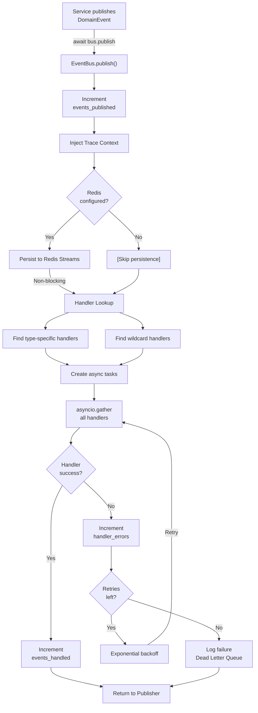

---
required_sections:
  - "## Responsibility"
  - "## Dependencies"
  - "## Key Methods"
  - "## Events Emitted"
  - "## Error Handling"
  - "## Workflow"
  - "## Source"
applies_to: "documentation/architecture/infrastructure/event-bus.md"
---

# Event Bus Infrastructure

## Responsibility

The event bus is the central nervous system of the event-driven architecture. It handles **event distribution, persistence, and replay**, enabling:

1. **Pub/Sub Event Distribution** — Events published by services are routed to all registered handlers
2. **Real-Time Handler Notification** — Handlers invoked immediately when subscribed events occur
3. **Event Persistence to Redis** — Complete audit trail stored for compliance and debugging
4. **Async Execution** — All handlers run concurrently without blocking publishers
5. **Retry Logic** — Failed handlers automatically retried with exponential backoff
6. **Distributed Tracing** — W3C Trace Context propagation across async handler boundaries
7. **Dead Letter Queue** — Persistently failed events tracked for investigation

The event bus serves as the single source of truth for all state changes in the system. Every business decision is captured as an immutable domain event, providing complete auditability and enabling event sourcing reconstruction.

## Dependencies

**Port Dependencies**:
- `IEventStore` — Persist events to Redis Streams for audit trail
- `IFailedEventStore` — Track persistently failed events in dead letter queue

**Domain Dependencies**:
- `DomainEvent` — All domain events (immutable, frozen dataclasses)
- `EventHandler` — Base class for all event subscribers

**Infrastructure Dependencies**:
- `Redis` (optional) — Event persistence backend (asyncio-compatible client)
- `OpenTelemetry` (optional) — W3C Trace Context propagation for distributed tracing
- `asyncio` — Async task coordination and event loop

**Service Dependencies** (consumers, not direct dependencies):
- All application services publish events
- All event handlers subscribe and react
- Observability system reads event stream

## Key Methods

### EventBus Class

```python
class EventBus:
    """In-process event bus for pub/sub event handling."""
    
    def __init__(
        self,
        max_retries: int = 3,
        retry_delay_seconds: float = 1.0,
        redis_client: Any | None = None,
        redis_stream_prefix: str = "events",
    ) -> None:
        """Initialize event bus with optional Redis persistence."""
    
    # Handler Registration
    def register_handler(self, handler: EventHandler) -> None:
        """Register an event handler for subscribed event types."""
    
    def unregister_handler(self, handler: EventHandler) -> None:
        """Unregister a handler from the bus."""
    
    # Callback Subscription
    def subscribe(
        self,
        event_type: str | None,
        callback: Callable[[DomainEvent], Any],
    ) -> None:
        """Subscribe to events with a callback function (async or sync)."""
    
    def unsubscribe(
        self,
        event_type: str | None,
        callback: Callable[[DomainEvent], Any],
    ) -> None:
        """Unsubscribe a callback."""
    
    # Event Publishing
    async def publish(self, event: DomainEvent) -> None:
        """Publish event to all handlers and callbacks."""
    
    async def publish_batch(self, events: list[DomainEvent]) -> None:
        """Publish multiple events sequentially."""
    
    # Statistics & Monitoring
    def get_statistics(self) -> dict[str, Any]:
        """Get bus statistics: events published, handled, persisted, errors."""
    
    def reset_statistics(self) -> None:
        """Reset statistics (for testing)."""
```

| Method | Input | Output | Purpose |
|---|---|---|---|
| `register_handler()` | `EventHandler` | `None` | Subscribe handler to event types |
| `unregister_handler()` | `EventHandler` | `None` | Unsubscribe handler |
| `subscribe()` | `event_type`, `callback` | `None` | Subscribe callback function |
| `unsubscribe()` | `event_type`, `callback` | `None` | Unsubscribe callback |
| `publish()` | `DomainEvent` | `None` (async) | Distribute event to handlers |
| `publish_batch()` | `list[DomainEvent]` | `None` (async) | Batch publish events |
| `get_statistics()` | `None` | `dict` with stats | Query bus metrics |
| `reset_statistics()` | `None` | `None` | Clear metrics |

### EventHandler Base Class

```python
class EventHandler:
    """Base class for all event handlers."""
    
    async def handle(self, event: DomainEvent) -> None:
        """
        Handle an event.
        
        Subclasses must implement this method.
        """
    
    def get_event_types(self) -> list[str]:
        """
        Return list of event types this handler subscribes to.
        
        Return empty list for wildcard (all events).
        """
```

### Handler Registration Decorator

```python
@event_handler("WorkItemCreated", "WorkItemDeleted")
class MyEventHandler(EventHandler):
    """Decorator automatically sets up get_event_types()."""
    
    async def handle(self, event: DomainEvent) -> None:
        """Handle the event."""
```

## Events Emitted

The event bus does **not** emit domain events itself. Instead, it:

1. **Receives** domain events from application services
2. **Persists** events to Redis Streams (if configured)
3. **Distributes** events to subscribed handlers
4. **Tracks** failed events to dead letter queue

Domain events are emitted by:
- Application services (WorkflowOrchestrator, ExecutionService, ReviewService, etc.)
- Domain models (during aggregate operations)
- Event handlers (when they invoke services that emit new events)

### Statistics Emitted

The event bus tracks and exposes:

- **events_published** — Total events published
- **events_handled** — Total handler invocations completed
- **handler_errors** — Handler failures
- **events_persisted** — Events stored to Redis
- **persistence_errors** — Redis write failures
- **handlers_by_type** — Per-event-type handler count
- **wildcard_handlers** — Count of catch-all handlers
- **redis_enabled** — Whether persistence is active

## Error Handling

### Publication Errors

**asyncio.CancelledError** — Always propagated immediately (system signal, never caught)

**ConnectionError / TimeoutError** (transient)
- Logged as warning with "ERR_EVENT_BUS_CONNECTION" error ID
- Indicates Redis or network issue
- Typically recovers with retry
- Wrapped in EventBusError with retry hint

**ValueError** (permanent)
- Logged as error with "ERR_EVENT_BUS_VALIDATION" error ID
- Invalid event data structure
- Won't recover; requires code fix
- Wrapped in EventBusError with validation hint

**Unexpected exceptions** (critical)
- Logged as critical with "ERR_EVENT_BUS_UNEXPECTED" error ID
- Unexpected error type
- Investigate immediately
- Wrapped in EventBusError

### Handler Errors

**Individual Handler Failure**:
1. Exception caught during `handler.handle(event)`
2. Logged with handler name, event type, attempt number
3. **Retry logic** applied: attempts `max_retries` (default 3) with exponential backoff
4. Delays: 1s, 2s, 3s (retry_delay_seconds * attempt)
5. If all retries fail, error recorded in statistics
6. Error **does not propagate** to publisher or other handlers
7. Failure recorded for later investigation via metrics

**Callback Failure**:
- Same retry logic as handlers
- Works with both async and sync callbacks
- Individual callback failures isolated from other handlers

**Redis Persistence Failure**:
- Logged but **does not block** event distribution
- Principle: Losing persistence is better than losing event handling
- Persistence error incremented in statistics
- ConnectionError and unexpected errors both handled non-blocking

### Failure Isolation

- **Handler 1 fails** → doesn't affect Handler 2, Handler 3, etc.
- **Persistence fails** → events still distributed normally
- **Publisher doesn't know** → continues processing
- **Metrics track all failures** → visible in statistics and observability

## Workflow

### 1. Event Publishing Flow

```
Application Service
  ├─ Executes domain operation (domain model state change)
  ├─ Emits domain event (immutable)
  └─ Publishes to event bus via await bus.publish(event)

Event Bus.publish()
  ├─ Increment events_published counter
  ├─ Inject W3C Trace Context into event.metadata['traceparent']
  ├─ Persist to Redis Streams [ASYNC, non-blocking if fails]
  │   └─ Stream key: "events:{EventType}"
  │   └─ Fields: event_id, aggregate_id, timestamp, payload
  ├─ Identify handlers: type-specific + wildcard
  ├─ Create async tasks for all handlers
  ├─ await asyncio.gather(all_tasks, return_exceptions=True)
  └─ Log and increment error counters for failures

Event Handler
  ├─ Extract and activate trace context from event
  ├─ Attempt handler.handle(event) [up to max_retries]
  │   ├─ Failure → log warning, exponential backoff sleep
  │   └─ Success → return immediately
  └─ If all retries exhausted → raise exception (caught by bus)
```

### 2. Event Distribution Architecture



### 3. Handler Execution Timeline

**Parallel Handler Execution**:

```
event1: WorkItemColumnChanged
  ├─ Handler A [task_0] → executes simultaneously
  ├─ Handler B [task_1] → executes simultaneously
  ├─ Handler C [task_2] → executes simultaneously
  └─ Handler D [task_3] → executes simultaneously

await asyncio.gather(task_0, task_1, task_2, task_3, return_exceptions=True)
  └─ Waits for ALL handlers to complete (even if some fail)

Handler Completion Order (unpredictable):
  Handler C completes at T+100ms
  Handler A completes at T+150ms
  Handler B fails at T+200ms, retries...
  Handler D completes at T+250ms
  Handler B succeeds at T+400ms
  
All handlers complete → publish() returns
```

### 4. Retry Strategy

**Per-Handler Retry Loop**:

```
Attempt 1: Try handler.handle(event)
  ├─ Success → Return (exit loop)
  └─ Failure → Log warning (attempt 1/4)
               ↓
Attempt 2: Sleep 1s * 1 = 1s
           Try handler.handle(event)
  ├─ Success → Return
  └─ Failure → Log warning (attempt 2/4)
               ↓
Attempt 3: Sleep 1s * 2 = 2s
           Try handler.handle(event)
  ├─ Success → Return
  └─ Failure → Log warning (attempt 3/4)
               ↓
Attempt 4: Sleep 1s * 3 = 3s
           Try handler.handle(event)
  ├─ Success → Return
  └─ Failure → Raise exception
               stats[handler_errors]++
               Dead Letter Queue recorded
```

### 5. Redis Persistence Stream Structure

**Redis Stream Design**:

```
Stream Key: events:WorkItemColumnChanged
Stream Key: events:ExecutionCompleted
Stream Key: events:ReviewCycleApproved

Each Stream Entry:
{
  "event_id": "evt_abc123...",
  "aggregate_id": "item_123",
  "aggregate_type": "WorkItem",
  "timestamp": "2025-04-29T17:30:45.123456+00:00",
  "payload": "{full json event data including metadata[traceparent]}"
}
```

**Replay Capability**:
- All events stored with global ordering via Redis Stream IDs
- Can replay from any point: `xread(count=1000, streams={'events:*': '0'})`
- Enables event sourcing reconstruction
- Supports debugging: "what happened between T1 and T2?"
- Audit trail for compliance: "show all WorkItem events for issue #42"

## Source

**File Path**: `src/codetoreum/infrastructure/event_bus.py`

**Class**: `class EventBus:`

**Related Files**:
- `src/codetoreum/infrastructure/event_bus_wiring.py` — Handler registration coordination
- `src/codetoreum/infrastructure/event_serialization.py` — Event serialization for Redis
- `src/codetoreum/infrastructure/observability/trace_context_propagation.py` — W3C Trace Context integration
- `src/codetoreum/domain/events/` — All domain event definitions

**Tests**:
- `tests/unit/infrastructure/test_event_bus.py` — Event bus unit tests
- `tests/integration/infrastructure/test_event_bus_integration.py` — Integration tests with Redis
- `tests/simulation/` — Event bus used throughout simulation framework

---

## Key Features

### 1. Pub/Sub Pattern

- **Publisher**: Any service can publish events
- **Subscribers**: Event handlers register for event types
- **Decoupling**: Publishers don't know about handlers
- **Extensibility**: Add new handlers without touching publishers

### 2. Event Serialization

```python
event = WorkItemColumnChanged(
    aggregate_id="item_123",
    aggregate_type="WorkItem",
    payload={
        "old_column": "backlog",
        "new_column": "in_progress",
    },
    metadata={
        "traceparent": "00-...",  # W3C format
        "correlation_id": "corr_123",
        "user_id": "user_456"
    }
)

# Serialized to JSON
event_dict = {
    "event_type": "WorkItemColumnChanged",
    "event_id": "evt_abc123",
    "aggregate_id": "item_123",
    "aggregate_type": "WorkItem",
    "occurred_at": "2025-04-29T17:30:45.123456+00:00",
    "payload": {...},
    "metadata": {...}
}
```

### 3. W3C Trace Context Propagation

Events carry trace context for distributed tracing:

```
Original Request (HTTP)
  └─ Span: handle_card_movement()
      ├─ Publishes WorkItemColumnChanged
      │   └─ Metadata['traceparent'] = "00-trace_id-span_id-01"
      └─ Event Bus
          ├─ Extracts traceparent from event
          ├─ Handler A [CONSUMER span]
          │   └─ Child of original span
          ├─ Handler B [CONSUMER span]
          │   └─ Child of original span
          └─ All spans correlate in Jaeger/distributed trace
```

### 4. Statistics & Monitoring

```python
stats = event_bus.get_statistics()

{
    "events_published": 1523,
    "events_handled": 4286,  # 3 handlers per event avg
    "handler_errors": 2,  # 2 handlers failed (after retries)
    "events_persisted": 1523,
    "persistence_errors": 0,
    "total_handlers": 8,
    "handlers_by_type": {
        "WorkItemColumnChanged": 3,
        "ExecutionCompleted": 2,
        "ReviewCycleApproved": 2,
        "WorkItemCreated": 1
    },
    "wildcard_handlers": 0,
    "redis_enabled": True
}
```

### 5. Dead Letter Queue

**Failed Events Tracking**:

When a handler fails after all retries:

1. Exception raised from handler
2. Caught by event bus
3. Recorded in statistics (`handler_errors` incremented)
4. Logged with full context:
   - Event ID
   - Handler name
   - Event type
   - Error message
   - Stack trace
   - Error ID from ErrorRegistry

5. Optionally stored in dead letter queue (via `IFailedEventStore` port)

**Dead Letter Queue Operations**:

```python
# Record failed event
await failed_event_store.record_failed_event(
    event=event,
    handler_name="WorkflowEventHandler",
    error=exception,
    attempt_count=3
)

# Query dead letter queue
dead_letters = await failed_event_store.get_failed_events(
    start_time=datetime.now() - timedelta(hours=1),
    limit=100
)

# Replay failed event
await event_bus.publish(dead_letter.original_event)
```

**Investigation**:
- Why did it fail? (Error message in DLQ)
- When? (Timestamp in DLQ)
- Which handler? (Handler name in DLQ)
- What was being processed? (Full event payload in DLQ)

---

## Configuration

### Default Configuration

```python
# Default: 3 retries with 1 second base delay
bus = EventBus(
    max_retries=3,              # Retry up to 3 times
    retry_delay_seconds=1.0,    # Start with 1s delay
    redis_client=None,          # No persistence (in-memory only)
)
```

### Production Configuration

```python
import redis.asyncio as redis

redis_client = await redis.from_url("redis://localhost:6379")

bus = EventBus(
    max_retries=3,
    retry_delay_seconds=1.0,
    redis_client=redis_client,
    redis_stream_prefix="events"
)
```

### Simulation Configuration

```python
# Fast testing: no persistence delays
bus = EventBus(
    max_retries=0,              # No retries in simulation
    retry_delay_seconds=0.0,    # Instant (no real delays)
    redis_client=None,          # In-memory only
)
```

---

## Performance Characteristics

- **Event Publishing**: O(h) where h = number of handlers (concurrent tasks)
- **Handler Dispatch**: O(1) per handler (async, non-blocking)
- **Redis Persistence**: Non-blocking (async, failures logged only)
- **Memory Usage**: Depends on pending event count (typically small)
- **Throughput**: Limited by slowest handler + retry delays

### Typical Performance

- Publish event: < 1ms (returns after handler tasks created)
- Handler execution: 10-1000ms (depends on service)
- Retry with 3 attempts: up to 6 seconds (1s + 2s + 3s delays)
- Redis persistence: < 10ms (async, non-blocking)

---

## Integration with Other Infrastructure

**Event Bus → Observability**:
- Published events counted in metrics
- Handler errors tracked per type
- Trace context propagated to OpenTelemetry

**Event Bus → Resilience**:
- Retry logic independent of adapter resilience
- Adapters (services) decorated with circuit breakers
- Event bus provides higher-level retry (handler level)

**Event Bus → Domain Events**:
- All domain events immutable (frozen dataclasses)
- Event bus guarantees immutability (no modification)
- Serialization preserves complete event structure

---

## Related Documentation

- [Event Handlers](../application-services/event-handlers.md) — Handler implementation and wiring
- [Application Services](../application-services/services.md) — Services that emit events
- [Domain Events](../domain/events.md) — Event definitions
- [Resilience Infrastructure](./resilience.md) — Adapter-level resilience
- [Observability](./observability.md) — Metrics, tracing, logging
