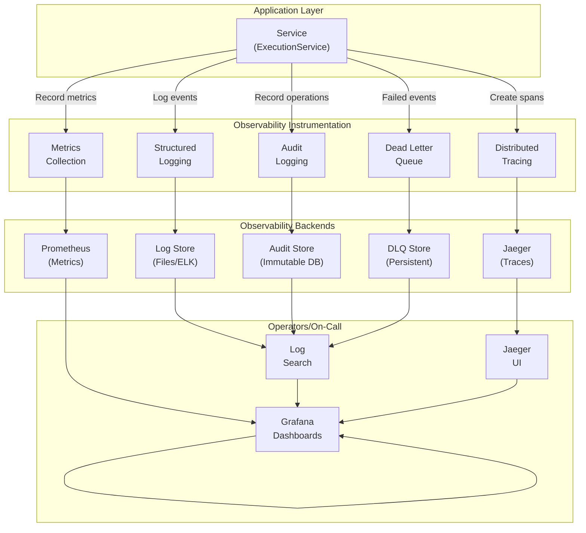

---
required_sections:
  - "## Responsibility"
  - "## Dependencies"
  - "## Key Methods"
  - "## Events Emitted"
  - "## Error Handling"
  - "## Workflow"
  - "## Source"
applies_to: "documentation/architecture/infrastructure/observability.md"
---

# Observability Infrastructure

## Responsibility

The observability layer provides complete visibility into system behavior for debugging, monitoring, and compliance. It enables operators to understand what the system is doing, detect anomalies, trace requests across service boundaries, and audit sensitive operations.

Observability components implemented:

1. **Structured Logging** — Context-aware logs with event_id, correlation_id, project_id
2. **Metrics** — Prometheus-compatible metrics collection (events emitted, handler errors, latency)
3. **Distributed Tracing** — OpenTelemetry/Jaeger trace correlation across async handlers
4. **Audit Logging** — Immutable record of sensitive operations (authentication, data changes, deletions)
5. **Dead Letter Queue** — Capture and track persistently failed events

All observability components are designed to:
- Provide complete visibility without impacting performance
- Support compliance and forensics requirements
- Enable root cause analysis of failures
- Track system health and performance

## Dependencies

**Port Dependencies** (none direct; observability is infrastructure):
- Observability components are infrastructure utilities, not port interfaces
- Services use logging and metrics via dependency injection

**Infrastructure Dependencies**:
- `OpenTelemetry SDK` — Distributed tracing
- `Jaeger` (optional) — Trace backend
- `Prometheus` (optional) — Metrics collection
- `Python logging` — Structured logging
- `Redis` (optional) — Event stream persistence

**Logging Infrastructure**:
- `structlog` or `logging` — Structured log emission
- `contextvars` — Thread-safe context (async context propagation)
- Error ID registry — Standardized error codes

**Tracing Infrastructure**:
- W3C Trace Context — Standards-based correlation
- OpenTelemetry API/SDK — Span creation and management
- Jaeger exporter — Send traces to Jaeger backend

**Metrics Infrastructure**:
- Prometheus client — Metric collection and export
- Gauge, Counter, Histogram — Metric types

**Audit Infrastructure**:
- Immutable log store (file or database)
- Timestamp and context preservation
- Tamper detection via checksums

## Key Methods

### Structured Logging

```python
# Context-aware logging
logger.info(
    "Workflow started",
    extra={
        "event_id": "evt_123",
        "correlation_id": "corr_456",
        "project_id": "proj_789",
        "work_item_id": "item_101",
        "agent_id": "agent_202"
    }
)

# Error logging with context
logger.error(
    "Execution failed",
    exc_info=True,  # Include stack trace
    extra={
        "error_id": "ERR_EXECUTION_TIMEOUT",
        "execution_id": "exec_123",
        "timeout_seconds": 30.0
    }
)
```

### Distributed Tracing

```python
from opentelemetry import trace

tracer = trace.get_tracer(__name__)

async def handle_card_movement(event):
    with tracer.start_as_current_span("handle_card_movement") as span:
        span.set_attribute("work_item_id", event.work_item_id)
        span.set_attribute("column", event.new_column)

        # Nested spans for sub-operations
        with tracer.start_as_current_span("check_permissions"):
            # ...
            pass

        with tracer.start_as_current_span("move_item"):
            # ...
            pass
```

### Metrics Collection

```python
from prometheus_client import Counter, Gauge, Histogram

# Counter: increment for each event
events_published = Counter(
    'events_published_total',
    'Total events published',
    ['event_type']
)
events_published.labels(event_type='WorkItemColumnChanged').inc()

# Gauge: current value (active executions)
active_executions = Gauge(
    'active_executions',
    'Currently active agent executions'
)
active_executions.set(5)

# Histogram: duration distribution
execution_duration = Histogram(
    'execution_duration_seconds',
    'Agent execution duration',
    ['agent_id', 'status']
)
with execution_duration.labels(agent_id='agent_1', status='success').time():
    # ... execute agent ...
    pass
```

### Audit Logging

```python
async def record_audit_event(
    operation: str,
    user_id: str,
    resource_id: str,
    resource_type: str,
    changes: dict[str, Any],
) -> None:
    """Record audit trail for sensitive operations."""

    audit_entry = {
        "timestamp": datetime.now(UTC).isoformat(),
        "operation": operation,  # create, update, delete
        "user_id": user_id,
        "resource_id": resource_id,
        "resource_type": resource_type,
        "changes": changes,
        "ip_address": get_client_ip(),
        "user_agent": get_user_agent()
    }

    # Store immutably
    await audit_store.record(audit_entry)
```

### Dead Letter Queue

```python
async def handle_failed_event(
    event: CodetoreumEvent,
    handler_name: str,
    error: Exception,
    attempt_count: int,
) -> None:
    """Record persistently failed event."""

    failed_event = FailedEvent(
        event_id=event.event_id,
        event_type=event.event_type,
        event_data=event.to_dict(),
        handler_name=handler_name,
        failure_reason=FailureReason.PROCESSING_ERROR,
        error_message=str(error),
        error_type=type(error).__name__,
        attempt_count=attempt_count,
        timestamp=datetime.now(UTC),
        original_timestamp=event.occurred_at
    )

    # Store for later investigation
    await dlq_store.record(failed_event)
```

## Events Emitted

The observability layer **does not** emit domain events. Instead, it:

1. **Records** observability signals (logs, traces, metrics)
2. **Exposes** signals via standard interfaces (Prometheus, Jaeger, log files)
3. **Stores** sensitive operations in audit log
4. **Captures** failed events in dead letter queue

### Observability Signals Emitted

**Logs**:
- INFO: Normal operations (workflow started, execution completed)
- WARNING: Transient issues (handler retry, rate limit)
- ERROR: Failures (execution failed, service down)
- CRITICAL: System-level issues (event bus error, disk full)

**Traces**:
- Span creation: Major operation boundaries (handle_card_movement, execute_agent)
- Span attributes: Operation context (work_item_id, agent_id, user_id)
- Span events: Important milestones (lock_acquired, review_started)
- Span relationships: Parent-child causality via W3C Trace Context

**Metrics**:
- Counters: events_published, handler_errors, api_requests
- Gauges: active_executions, queue_depth, memory_usage
- Histograms: execution_duration, api_latency, lock_wait_time

**Audit Log Entries**:
- User authentication (login, logout, token refresh)
- Data changes (create, update, delete work items)
- Permission changes (role assignment, group membership)
- Configuration changes (workflow updates, agent config)
- Sensitive operations (API key creation, environment variable set)

**Dead Letter Queue Entries**:
- Failed event with original payload
- Handler that failed
- Exception details
- Attempt count and timestamps

## Error Handling

### Logging Errors

**Configuration Issues**:
- Invalid log level → Fall back to INFO
- Missing log handler → Log to console
- File write failure → Log to stderr

**Error Logging Best Practices**:

```python
# ✅ Good: Include exc_info for stack trace
logger.error(
    "Execution failed",
    exc_info=True,
    extra={"execution_id": exec_id}
)

# ❌ Bad: No exc_info
logger.error(f"Execution failed: {str(e)}")

# ✅ Good: Structured error context
logger.error(
    "Authentication failed",
    extra={
        "error_id": "ERR_AUTH_INVALID_TOKEN",
        "user_id": user_id,
        "token_age_seconds": age
    }
)

# ❌ Bad: No error ID or context
logger.error(f"Auth error for {user_id}")
```

### Tracing Errors

**Span Error Recording**:

```python
try:
    with tracer.start_as_current_span("execute_agent") as span:
        # ... execution ...
        pass
except Exception as e:
    span.record_exception(e)  # Record in trace
    span.set_attribute("error", True)
    span.set_attribute("error.kind", type(e).__name__)
    raise
```

**Missing Trace Context**:
- If W3C Trace Context missing → Create new trace
- If extraction fails → Log warning, continue with new trace
- No trace context → Default to local tracing only

### Metrics Errors

**Metric Collection Failures**:
- Counter increment fails → Log warning, continue
- Histogram observation fails → Log warning, continue
- Prometheus export fails → Log error, retry next cycle

**Memory Limits**:
- Metric cardinality explosion → Bounded dimensions
- Old metrics cleanup → Automatic garbage collection

### Audit Log Errors

**Write Failures**:
- File I/O error → Log critical, try alternate storage
- Database connection → Retry with backoff
- Disk full → Alert operations team

**Integrity Checks**:
- Checksum mismatch → Alert security team
- Timestamp tampering → Flag for investigation
- Deletion attempts → Immutable (rejected)

### Dead Letter Queue Errors

**Storage Failures**:
- Write fails → Log error, retry later
- Query fails → Return empty list, continue
- Cleanup fails → Log warning, data retained for manual review

**Investigation Aids**:
- If can't deserialize event → Store raw JSON
- If error message too large → Truncate with indicator
- If timestamp invalid → Use server timestamp

## Workflow

### 1. Observability Flow Architecture



### 2. Request Tracing Journey

```
HTTP Request to /api/workflows/123/execute
  │
  ├─ Span: handle_workflow_request
  │   attribute: workflow_id=123
  │
  ├─ Span: validate_permissions
  │   attribute: user_id=user_456
  │   event: permission_check_passed
  │
  ├─ Span: get_workflow_definition
  │   attribute: source=database
  │
  ├─ Span: WorkflowOrchestrator.start_execution
  │   │
  │   ├─ Span: AgentScheduler.schedule
  │   │
  │   ├─ Span: ExecutionService.create_execution
  │   │   attribute: agent_id=agent_1
  │   │
  │   └─ Span: IEventEmitter.publish
  │       event: WorkflowStartedEvent emitted
  │
  └─ Response: HTTP 200
     X-Trace-Id: 4bf92f3577b34da6a3ce929d0e0e4736
```

**Benefits**:
- See which operation is slow
- Trace request through all services
- Correlate errors with traces
- Understand latency distribution

### 3. Error Investigation Flow

```
User reports: "Workflow didn't complete"

1. Query logs with correlation_id
   → Find WorkflowStartedEvent (T+0)
   → Find ExecutionInitializedEvent (T+1)
   → Find ExecutionFailedEvent (T+10)

2. Check trace for execution span
   → See which service failed
   → See exact error message

3. Check metrics
   → Was there a spike in failures?
   → Was rate limiter active?
   → Was circuit breaker open?

4. Check dead letter queue
   → Is event in DLQ?
   → What was the handler error?
   → How many retries attempted?

5. Check audit log
   → Was configuration changed around T+5?
   → Was there a permission change?

Root cause: Database credentials rotated at T+5,
           ExecutionService lost connection
```

### 4. Audit Trail Example

**Operation**: Create API Key

```
Audit Log Entry:
{
  "timestamp": "2025-04-29T17:30:45.123456Z",
  "operation": "create",
  "resource_type": "api_key",
  "resource_id": "key_abc123xyz",
  "user_id": "user_123",
  "changes": {
    "name": "production-deployer",
    "scopes": ["execute_workflows", "read_executions"],
    "expires_in_days": 365,
    "created_by": "user_123"
  },
  "context": {
    "ip_address": "192.168.1.100",
    "user_agent": "PostmanRuntime/7.26.3",
    "session_id": "sess_456"
  },
  "checksum": "sha256:abc123..."  # For tamper detection
}
```

**Retrieval**: Search audit log

```
Who created API keys in the last 7 days?
  → Find all entries with operation=create, resource_type=api_key

Which users accessed admin configuration?
  → Find entries with resource_type=configuration, user_id=admin_*

What changed in the workflow definition?
  → Find entries with operation=update, resource_type=workflow
  → Inspect "changes" field for specific modifications
```

## Source

**Directory Path**: `src/codetoreum/infrastructure/observability/`

**Core Files**:

1. **otel_setup.py** — OpenTelemetry initialization
   - `setup_tracing()` — Initialize Jaeger exporter
   - `setup_metrics()` — Initialize Prometheus metrics
   - Trace context injection/extraction

2. **instrumentation.py** — Application instrumentation
   - `instrument_async_function()` — Auto-instrument functions
   - `instrument_service()` — Auto-instrument service classes
   - Span creation and attribute setting

3. **event_bus_instrumentation.py** — Event bus tracing
   - Event bus span creation (PRODUCER/CONSUMER)
   - Trace context propagation through events
   - Handler span creation

4. **trace_context_propagation.py** — W3C Trace Context
   - `inject_current_trace_context_into_event()` — Add trace to event
   - `extract_and_activate_trace_context()` — Restore trace from event
   - Async context management

5. **logging_integration.py** — Structured logging setup
   - Correlation ID injection into logs
   - Error ID registry integration
   - Structured formatter configuration

6. **config.py** — Observability configuration
   - Jaeger exporter settings
   - Prometheus configuration
   - Log level and format settings
   - Feature flags (enable/disable tracing, metrics)

7. **auto_instrument.py** — Automatic instrumentation
   - Auto-instrument FastAPI routes
   - Auto-instrument database queries
   - Auto-instrument HTTP client calls

8. **websocket_instrumentation.py** — WebSocket tracing
   - Trace WebSocket connections
   - Track message flow

**Related Files**:

- `src/codetoreum/infrastructure/dead_letter_queue.py` — DLQ implementation
- `src/codetoreum/infrastructure/audit/` — Audit logging
- `src/codetoreum/infrastructure/error_ids.py` — Standardized error codes

**Tests**:
- `tests/unit/infrastructure/observability/` — Unit tests
- `tests/integration/infrastructure/observability/` — Integration tests with Jaeger/Prometheus

---

## Observability Stack

### Distributed Tracing

**Technology**: OpenTelemetry + Jaeger

**Capabilities**:
- Parent-child span relationships
- W3C Trace Context propagation
- Async context management
- Automatic instrumentation
- Custom span attributes

**Visualization**: Jaeger UI
- Timeline view: See span durations
- Trace search: Find by service, operation, tag
- Service map: See inter-service calls
- Latency analysis: P50, P95, P99

### Metrics

**Technology**: Prometheus

**Metric Types**:
- Counters (events_published_total, handler_errors_total)
- Gauges (active_executions, queue_depth)
- Histograms (execution_duration_seconds, api_latency_seconds)
- Summaries (percentile tracking)

**Scraping**: Prometheus scrapes `/metrics` endpoint every 15s

**Querying**: PromQL language
- `rate(events_published_total[5m])` — Events per second
- `topk(5, api_latency_seconds_bucket)` — Top 5 slowest operations
- `sum(active_executions)` — Total active executions

**Visualization**: Grafana Dashboards
- System health dashboard
- Workflow execution dashboard
- Agent performance dashboard
- Resource utilization dashboard

### Structured Logging

**Format**: JSON lines (one JSON object per line)

**Fields**:
- `timestamp` — ISO 8601 timestamp
- `level` — INFO, WARNING, ERROR, CRITICAL
- `logger_name` — Module name
- `message` — Log message
- `exception` — Stack trace (if error)
- `extra` — Additional context (event_id, user_id, etc.)

**Storage**:
- Local files (daily rotation)
- ELK Stack (Elasticsearch + Kibana) for production
- CloudWatch Logs for cloud deployments

**Querying**: Kibana or similar
- Find logs by event_id
- Find logs by user_id
- Find errors by error_id
- Search by time range

### Audit Logging

**Technology**: Immutable log store (file or database with checksums)

**What's Logged**:
- User authentication (login, logout, token refresh)
- API key lifecycle (create, revoke)
- Configuration changes (workflow, agent, environment)
- Permission changes (role assignment, group membership)
- Data mutations (create, update, delete work items)
- Sensitive operations (admin actions)

**Immutability**:
- Checksums prevent tampering
- Deletion not allowed (only mark as superseded)
- Timestamps cannot be modified
- Original log entries retained forever

### Dead Letter Queue

**Purpose**: Track events that failed after all retries

**Stored Per Failed Event**:
- Original event (full payload)
- Handler that failed
- Error message and stack trace
- Attempt count
- Timestamp of failure
- Reason for failure (transient, validation, timeout, etc.)

**Operations**:
- `record_failed_event()` — Add event to DLQ
- `get_failed_events()` — Query by time range
- `replay_event()` — Send event back to handlers
- `get_statistics()` — Count failures by reason

**Investigation**:
- Why did it fail? (Exception in DLQ)
- When did it fail? (Timestamp in DLQ)
- Which handler? (Handler name in DLQ)
- Permanent or transient? (Failure reason in DLQ)
- Can we retry? (If transient, yes; if validation, no)

---

## Configuration

### Minimal Configuration (Development)

```python
# Logging only
logging.basicConfig(level=logging.DEBUG)

# No tracing, metrics, audit
```

### Standard Configuration (Staging)

```python
# Structured logging to files
logging_config = {
    'version': 1,
    'formatters': {
        'json': {
            'class': 'pythonjsonlogger.jsonlogger.JsonFormatter'
        }
    },
    'handlers': {
        'file': {
            'class': 'logging.handlers.RotatingFileHandler',
            'filename': 'logs/app.log',
            'formatter': 'json'
        }
    },
    'root': {
        'handlers': ['file'],
        'level': 'INFO'
    }
}

# Jaeger tracing
setup_tracing(
    service_name="codetoreum",
    jaeger_agent_host="localhost",
    jaeger_agent_port=6831
)

# Prometheus metrics
from prometheus_client import start_http_server
start_http_server(8000)

# Dead letter queue
dlq = DeadLetterQueue()
await dlq.start()
```

### Production Configuration

```python
# Structured logging to ELK
# Metrics to Prometheus
# Traces to Jaeger with sampling
# Audit logging to immutable database
# Dead letter queue with Redis backend
```

---

## Performance Impact

**Logging**: < 1ms per log entry (async, non-blocking)

**Tracing**:
- Span creation: ~0.1ms
- Trace context propagation: ~0.01ms
- Jaeger export: Async, non-blocking

**Metrics**:
- Counter increment: ~0.01ms
- Histogram observation: ~0.1ms
- Prometheus scrape: ~1s (periodic, not on request path)

**Audit Logging**: ~1ms per audit entry (async, non-blocking)

**Dead Letter Queue**: ~10ms per failed event (async, non-blocking)

**Total Overhead**: ~2-3% for typical workload with full observability enabled

---

## Related Documentation

- [Event Bus](./event-bus.md) — Events and tracing integration
- [Resilience](./resilience.md) — Circuit breaker metrics
- [Application Services](../application-services/services.md) — Services being observed
