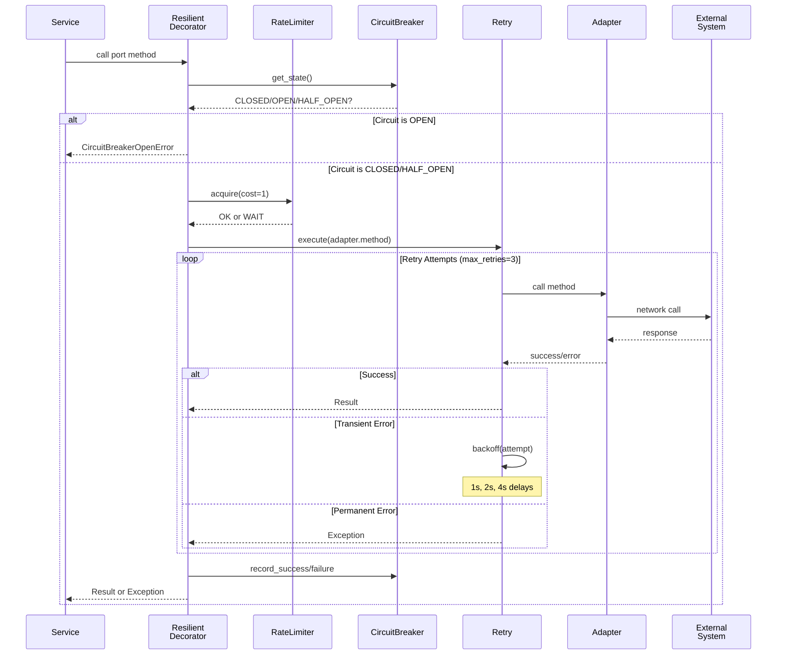

---
required_sections:
  - "## Responsibility"
  - "## Dependencies"
  - "## Key Methods"
  - "## Events Emitted"
  - "## Error Handling"
  - "## Workflow"
  - "## Source"
applies_to: "documentation/architecture/infrastructure/resilience.md"
---

# Resilience Infrastructure

## Responsibility

The resilience layer protects the system from cascading failures when external systems are unavailable, degraded, or rate-limited. It provides production-grade resilience patterns applied at the adapter level through **infrastructure-level decorators** rather than embedding resilience logic in adapters.

Resilience patterns implemented:

1. **Circuit Breakers** — Fail fast when external systems are down, preventing repeated attempts
2. **Rate Limiting** — Respect API rate limits (request-based and token-based)
3. **Retry Policies** — Automatic retry with exponential backoff for transient failures
4. **Timeouts** — Prevent operations from hanging indefinitely
5. **Bulkheads** — Isolate failure domains through separate resources

Key principle: **Adapters remain pure** (no resilience logic embedded); resilience is injected through decorators at composition time.

## Dependencies

**Port Dependencies** (none direct; resilience is infrastructure):
- Resilience decorators implement the same port interfaces as adapters
- Application services depend on port interfaces; don't know about resilience

**Infrastructure Dependencies**:
- `IRateLimiter` — Token bucket rate limiter (production + mock)
- `ICircuitBreaker` — State machine for circuit breaker pattern
- `IRetryPolicy` — Exponential backoff retry strategy
- `ITimeout` — Async timeout management
- `asyncio` — Async task execution and timing

**Resilience Configuration**:
- `ServiceResilienceConfig` — Per-service resilience configuration
- `RateLimitConfig` — Rate limiting parameters
- `CircuitBreakerConfig` — Circuit breaker thresholds
- `RetryConfig` — Retry strategy parameters
- `TimeoutConfig` — Timeout limits

**Adapter Dependencies** (wrapped by decorators):
- Any adapter implementing output port interface
- GitHubTicketAdapter, ClaudeCodeAdapter, DockerAdapter, etc.
- Mock adapters for simulation

## Key Methods

### Resilience Decorator Pattern

All resilient decorators follow this pattern:

```python
class ResilientXXXDecorator(IXXXPort):
    """Wraps port interface with resilience patterns."""
    
    def __init__(
        self,
        wrapped: IXXXPort,
        rate_limiter: IRateLimiter | None = None,
        circuit_breaker: ICircuitBreaker | None = None,
        retry_policy: IRetryPolicy | None = None,
        timeout: ITimeout | None = None,
        default_timeout_seconds: float = 30.0,
    ):
        """Initialize with wrapped adapter and resilience components."""
    
    async def port_method(self, ...args) -> ReturnType:
        """Any port method wrapped with resilience."""
        return await self._execute_resilient(
            operation=lambda: self._wrapped.port_method(...args),
            operation_name="port_method",
            rate_limit_cost=1,
        )
    
    async def _execute_resilient(
        self,
        operation: Callable[[], Awaitable[T]],
        operation_name: str,
        rate_limit_cost: int = 1,
    ) -> T:
        """Execute operation with all resilience patterns applied."""
        # 1. Check circuit breaker (fail fast if open)
        # 2. Check rate limiter (wait if needed)
        # 3. Execute with retry policy
        # 4. Apply timeout
        # 5. Track metrics
```

### Core Resilience Interfaces

```python
class IRateLimiter:
    """Rate limiting interface."""
    
    async def acquire(
        self,
        cost: int = 1,
        max_wait_seconds: float = float('inf'),
    ) -> bool:
        """
        Acquire capacity.
        
        Returns: True if acquired, False if timeout
        """

class ICircuitBreaker:
    """Circuit breaker interface."""
    
    async def call(self, func: Callable) -> Any:
        """Execute function with circuit breaker protection."""
    
    def get_state(self) -> str:
        """Return state: CLOSED, OPEN, or HALF_OPEN."""
    
    async def reset(self) -> None:
        """Reset circuit breaker to CLOSED state."""

class IRetryPolicy:
    """Retry policy interface."""
    
    async def execute(
        self,
        func: Callable,
        max_retries: int = 3,
    ) -> Any:
        """Execute with retry logic."""
    
    async def backoff(self, attempt: int) -> None:
        """Sleep between retries with exponential backoff."""

class ITimeout:
    """Timeout interface."""
    
    async def execute_with_timeout(
        self,
        coro: Awaitable[T],
        timeout_seconds: float,
    ) -> T:
        """Execute coroutine with timeout."""
```

### Resilience Factory

```python
class ResilienceFactory:
    """Factory for creating resilient decorators."""
    
    def __init__(
        self,
        mode: OperationMode = OperationMode.PRODUCTION,
        config: dict[str, Any] | None = None,
    ):
        """
        Initialize factory.
        
        Args:
            mode: PRODUCTION (real timeouts) or SIMULATION (fast tests)
            config: Configuration overrides
        """
    
    def create_resilient_ticket_system(
        self,
        adapter: ITicketSystem,
        service_config: ServiceResilienceConfig | None = None,
    ) -> ResilientTicketSystemDecorator:
        """Wrap ticket system with resilience."""
    
    def create_resilient_llm_provider(
        self,
        adapter: ILLMProvider,
        service_config: ServiceResilienceConfig | None = None,
    ) -> ResilientLLMProviderDecorator:
        """Wrap LLM provider with resilience."""
    
    def create_resilient_board_service(
        self,
        adapter: IBoardService,
        service_config: ServiceResilienceConfig | None = None,
    ) -> ResilientBoardServiceDecorator:
        """Wrap board service with resilience."""
```

## Events Emitted

The resilience layer **does not** emit domain events. Instead, it:

1. **Catches failures** from underlying adapters
2. **Applies retry logic** (exponential backoff)
3. **Opens circuit breaker** when failure threshold exceeded
4. **Propagates exceptions** after exhausting retries
5. **Tracks metrics** (successes, retries, failures, circuit breaker state)

Domain events are emitted by the service that called the resilient adapter, not by resilience itself.

**Resilience Metrics** (via infrastructure observability):
- Requests per rate limiter
- Circuit breaker state changes
- Retry attempts per operation
- Timeout occurrences
- Success/failure rates per service

## Error Handling

### Resilience Error Handling Strategy

**Goal**: Make transient errors transparent; permanent errors explicit

**Transient Errors** (retried automatically):
- Network timeouts
- Connection refused (downstream service starting)
- HTTP 503 Service Unavailable
- HTTP 429 Too Many Requests

**Permanent Errors** (fail fast after retries):
- HTTP 404 Not Found
- HTTP 401 Unauthorized
- HTTP 400 Bad Request
- Invalid API response format

**Circuit Breaker Opening**:
- Failure threshold reached (e.g., 5 consecutive failures)
- Circuit opens → subsequent calls fail fast without retry
- After timeout (e.g., 60s), enters HALF_OPEN state
- Next request tests if service recovered
- If test succeeds → circuit closes, traffic resumes
- If test fails → circuit opens again

### Rate Limiting Behavior

**Request-Based Rate Limiting**:
```
Max requests: 100
Window: 60 seconds

Request 1-100:   ALLOWED (capacity available)
Request 101:     WAIT (wait for window to advance)
                 After 1 second, 1 request completes
                 Request 101: NOW ALLOWED
```

**Token-Based Rate Limiting** (for LLMs):
```
Max tokens: 40,000 per minute
Max requests: 50 per minute

Request with 10,000 tokens:  ALLOWED (40,000 - 10,000 = 30,000 remaining)
Request with 35,000 tokens:  WAIT (need 35,000, only 30,000 available)
```

### Retry Backoff Strategy

**Exponential Backoff with Jitter**:

```
Attempt 1: Immediate (T+0s)
           Failure → wait base_delay * 2^0 = 1 * 1 = 1s

Attempt 2: T+1s
           Failure → wait base_delay * 2^1 = 1 * 2 = 2s

Attempt 3: T+3s
           Failure → wait base_delay * 2^2 = 1 * 4 = 4s

Attempt 4: T+7s (after 3 retries)
           Still failing → Raise exception

Total backoff: 1s + 2s + 4s = 7 seconds
```

**Jitter Addition** (prevents thundering herd):
```
Actual delay: base_delay * (2^attempt) * random(0.8, 1.2)

Example:
Attempt 2: 2s * 0.95 = 1.9s (jitter reduces by 5%)
Attempt 3: 4s * 1.08 = 4.32s (jitter increases by 8%)
```

## Workflow

### 1. Resilient Decorator Execution Flow



### 2. Circuit Breaker State Machine

```
┌─────────────────────────────────────────────────┐
│                  CLOSED                         │
│  Normal operation, requests pass through        │
│  Failure counter: 0                             │
└────────────────────┬────────────────────────────┘
                     │
        Failure threshold exceeded
        (e.g., 5 consecutive failures)
                     │
                     ▼
┌─────────────────────────────────────────────────┐
│                   OPEN                          │
│  Failing, reject all requests                   │
│  Time in state: counting up                     │
└────────────────────┬────────────────────────────┘
                     │
        Timeout reached (e.g., 60 seconds)
                     │
                     ▼
┌─────────────────────────────────────────────────┐
│                HALF_OPEN                        │
│  Test mode, allow single request                │
│  Failure counter: reset                         │
└────────────────────┬────────────────────────────┘
                     │
         Does test request succeed?
         │                            │
      YES                            NO
         │                            │
         ▼                            ▼
    ┌────────┐                  ┌────────┐
    │ CLOSED │                  │ OPEN   │
    └────────┘                  └────────┘
```

### 3. Composition Pattern in Bootstrap

```python
# Raw adapter (pure, no resilience)
github_adapter = GitHubTicketAdapter(
    owner="org",
    repo="repo",
    token=os.getenv("GITHUB_TOKEN")
)

# Wrap with resilience
factory = ResilienceFactory(mode=OperationMode.PRODUCTION)
resilient_github = factory.create_resilient_ticket_system(github_adapter)

# Use in application (service doesn't know about resilience)
workflow_orchestrator = WorkflowOrchestrator(
    ticket_system=resilient_github,  # Resilience applied transparently
    ...
)
```

The service only knows about the `ITicketSystem` interface, not that it's wrapped.

### 4. Error Propagation with Resilience

```
Service calls: await ticket_system.get_work_item(item_id)

ResilientTicketSystemDecorator._execute_resilient()
├─ Check circuit breaker
│  └─ If OPEN: raise CircuitBreakerOpenError
├─ Check rate limiter
│  └─ If would exceed: await and retry
├─ Check timeout
│  └─ If exceeded: raise TimeoutError
├─ Execute with retry
│  ├─ Attempt 1: GitHubAdapter.get_work_item()
│  │  └─ Failure: TimeoutError
│  ├─ Backoff: await asyncio.sleep(1)
│  ├─ Attempt 2: GitHubAdapter.get_work_item()
│  │  └─ Failure: ConnectionError
│  ├─ Backoff: await asyncio.sleep(2)
│  ├─ Attempt 3: GitHubAdapter.get_work_item()
│  │  └─ Success: Return WorkItem
│  └─ Record: 2 retries before success
└─ Update circuit breaker: record_success()

Service receives: WorkItem (retries transparent)
```

## Source

**Directory Path**: `src/codetoreum/infrastructure/resilience/`

**Core Files**:

1. **decorators.py** — Resilient decorator implementations
   - `ResilientTicketSystemDecorator` — Wraps ITicketSystem
   - `ResilientLLMProviderDecorator` — Wraps ILLMProvider
   - `ResilientBoardServiceDecorator` — Wraps IBoardService
   - `ResilientDiscussionAdapterDecorator` — Wraps IDiscussionAdapter

2. **circuit_breaker.py** — Circuit breaker state machine
   - `CircuitBreaker` — Production implementation
   - `MockCircuitBreaker` — Simulation mock

3. **rate_limiter.py** — Token bucket rate limiter
   - `TokenBucketRateLimiter` — Production implementation
   - `MockRateLimiter` — Simulation mock

4. **retry_policy.py** — Exponential backoff retry
   - `ExponentialBackoffRetry` — Production implementation
   - `MockRetryPolicy` — Simulation mock

5. **timeout.py** — Timeout handler
   - `AsyncTimeout` — Production implementation (asyncio.wait_for)
   - `MockTimeout` — Simulation mock

6. **factory.py** — Decorator factory
   - `ResilienceFactory` — Creates resilient decorators
   - `OperationMode` — PRODUCTION or SIMULATION

7. **config.py** — Configuration management
   - `ServiceResilienceConfig` — Per-service config
   - `RateLimitConfig` — Rate limit parameters
   - `CircuitBreakerConfig` — Circuit breaker thresholds
   - `RetryConfig` — Retry parameters
   - `TimeoutConfig` — Timeout limits
   - Predefined configs: `GITHUB_RESILIENCE_CONFIG`, `CLAUDE_RESILIENCE_CONFIG`

8. **interfaces.py** — Interface definitions
   - `IRateLimiter`, `ICircuitBreaker`, `IRetryPolicy`, `ITimeout`

9. **mocks.py** — Mock implementations for testing/simulation
   - All resilience components have mocks
   - Configurable behavior (e.g., fail every Nth call)

10. **README.md** — Comprehensive guide with examples

**Related Files**:
- Tests: `tests/unit/infrastructure/resilience/` (1000+ lines)
- Integration: `tests/integration/infrastructure/resilience/` (500+ lines)
- Design: `documentation/01_design/infrastructure/resilience_infrastructure_design.md`

---

## Resilience Patterns Summary

| Pattern | Purpose | Implementation | Configuration |
|---------|---------|-----------------|----------------|
| **Circuit Breaker** | Fail fast when downstream is unavailable | State machine (CLOSED→OPEN→HALF_OPEN) | Failure threshold, timeout |
| **Rate Limiting** | Respect API rate limits | Token bucket (request or token-based) | Max requests, window size |
| **Retry Policy** | Handle transient failures | Exponential backoff with jitter | Max retries, base delay |
| **Timeout** | Prevent hanging operations | asyncio.wait_for wrapper | Timeout seconds per operation |
| **Bulkhead** | Isolate failure domains | Separate decorators per adapter | Resource pools |

---

## Mode-Aware Behavior

### Production Mode

```python
factory = ResilienceFactory(mode=OperationMode.PRODUCTION)

# Real timeouts, real rate limiting, real retries
resilient = factory.create_resilient_ticket_system(github_adapter)

# Behavior:
# - Rate limiter enforces actual delays
# - Circuit breaker has configurable timeouts (60s default)
# - Retry backoff: 1s, 2s, 4s
# - Timeouts: 30s default per operation
```

### Simulation Mode

```python
factory = ResilienceFactory(mode=OperationMode.SIMULATION)

# No delays, mock behavior for testing
resilient = factory.create_resilient_ticket_system(mock_adapter)

# Behavior:
# - Rate limiter allows unlimited (no delays)
# - Circuit breaker never opens (or configurable)
# - No retry delays (fast testing)
# - No timeout enforcement (fast testing)
# - All operations complete instantly

# Typical: Tests run 10-100x faster
```

---

## Observability & Metrics

Each resilient decorator exposes metrics:

```python
# Get metrics from decorator
stats = resilient_adapter._get_resilience_stats()

{
    "rate_limiter": {
        "requests_made": 1523,
        "requests_queued": 12,
        "current_capacity": 45,
        "acquisitions": {
            "immediate": 1505,
            "waited": 18
        }
    },
    "circuit_breaker": {
        "state": "CLOSED",
        "failure_count": 0,
        "success_count": 1523,
        "last_failure_time": None,
        "state_changes": [
            {"from": "CLOSED", "to": "OPEN", "time": "2025-04-29T10:30:45Z"},
            {"from": "OPEN", "to": "HALF_OPEN", "time": "2025-04-29T10:31:45Z"},
            {"from": "HALF_OPEN", "to": "CLOSED", "time": "2025-04-29T10:31:46Z"}
        ]
    },
    "retry_policy": {
        "executions": 1523,
        "retries_total": 23,
        "retries_by_attempt": {
            "1": 15,
            "2": 7,
            "3": 1
        },
        "exhausted_retries": 0
    },
    "timeout": {
        "timeouts_total": 2,
        "operations": {
            "get_work_item": {"count": 1500, "timeouts": 1},
            "create_work_item": {"count": 23, "timeouts": 1}
        }
    }
}
```

---

## Related Documentation

- [Event Bus](./event-bus.md) — Higher-level event handler retry
- [Observability](./observability.md) — Metrics and tracing
- [Application Services](../application-services/services.md) — Services using resilient adapters
- [Output Ports](../ports/output/) — Adapter interfaces being wrapped
- [Resilience Design](../../01_design/infrastructure/resilience_infrastructure_design.md) — Detailed design specification
