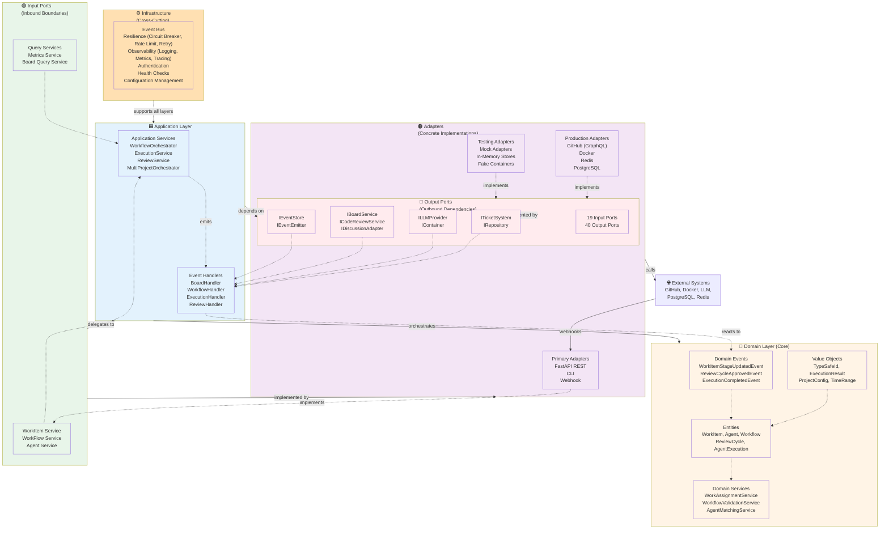

---
required_sections:
  - "## Overview"
  - "## Hexagonal Architecture Layers"
  - "## CQRS Pattern"
  - "## Event-Driven Communication"
  - "## Architecture Diagram"
applies_to: "documentation/architecture/overview.md"
---

# Architecture Overview

## Overview

Codetoreum is built on a **hexagonal architecture** (ports & adapters pattern) that cleanly separates business logic from external dependencies. The system is organized into five distinct layers (Domain, Application, Input Ports, Output Ports, Adapters) plus an Infrastructure layer providing cross-cutting concerns. This architecture enables the platform to remain vendor-agnostic, highly testable, and maintainable as requirements evolve.

The core insight of hexagonal architecture is inverting the traditional "layers" model: instead of application code depending on external systems, external systems depend on abstract ports defined by the application. This inversion of control allows the domain layer to remain pure—containing no framework coupling, no I/O operations, and no external dependencies.

## Hexagonal Architecture Layers

The system consists of five layers arranged from innermost (core) to outermost (infrastructure):

### 1. Domain Layer (Core)

**Purpose**: Pure business logic untainted by technology choices.

The domain layer contains the system's core concepts and business rules:
- **Entities**: WorkItem, Agent, AgentExecution, Workflow, ReviewCycle, etc.
- **Value Objects**: TypeSafeId, ExecutionResult, ProjectConfig, etc.
- **Enumerations**: WorkItemStatus, AgentType, ExecutionStatus, etc.
- **Domain Events**: Immutable records of significant state changes
- **Domain Services**: Pure business logic that doesn't belong to a single entity

**Key Constraint**: The domain layer has **zero external dependencies**. No I/O, no framework coupling, no external library imports. This purity enables:
- Easy testing without mocks or test infrastructure
- Reusability across different application contexts (CLI, REST API, webhooks)
- Clear expression of business rules as code

**Immutability Principle**: Domain events are frozen dataclasses (`@dataclass(frozen=True)`), making them immutable once created. This guarantees audit trail integrity and prevents accidental modifications.

### 2. Application Layer

**Purpose**: Orchestration and coordination of domain logic.

The application layer uses domain models to implement workflows and responds to external events:
- **Application Services**: WorkflowOrchestrator, ExecutionService, ReviewService, etc.
- **Event Handlers**: Respond to domain events by coordinating with external systems
- **Command Handlers**: Process inbound commands from input ports
- **Query Handlers**: Process inbound queries from input ports

**Responsibilities**:
- Coordinate domain models to implement business processes
- Emit domain events when domain state changes
- Subscribe to domain events and react by calling output ports
- Translate between domain models and external system formats
- Manage transactional boundaries

### 3. Input Ports (Inbound Boundaries)

**Purpose**: Abstract interfaces for commands and queries entering the system.

Input ports define how external systems (REST API, webhooks, CLI, etc.) interact with the application:
- **Command Ports**: Handle state-changing requests (Create, Update, Delete, Transition)
- **Query Ports**: Handle read-only requests without side effects
- **Service Ports**: Long-running operations or complex workflows

**Examples**:
- `IWorkItemService`: Create, update, transition work items
- `IWorkflowService`: Create and manage workflows
- `IAgentService`: Register and configure agents
- `IExecutionService`: Manage agent executions

Input ports are technology-agnostic interfaces. The system provides multiple adapter implementations:
- **FastAPI REST Adapter**: HTTP/REST API (production)
- **CLI Adapter**: Command-line interface (development/operations)
- **Mock Adapter**: In-memory implementation (simulation testing)

### 4. Output Ports (Outbound Boundaries)

**Purpose**: Abstract interfaces for external system dependencies.

Output ports define how the application interacts with external systems, hiding vendor-specific details:
- **Ticket System Port** (`ITicketSystem`): GitHub issues, Jira, Linear, etc.
- **LLM Provider Port** (`ILLMProvider`): Claude Code, GPT-4, etc.
- **Container Port** (`IContainer`): Docker, Kubernetes, etc.
- **Repository Port** (`IRepository`): Git operations
- **Event Store Port** (`IEventStore`): Event persistence
- **Board Port** (`IBoardService`): Project board management
- **Code Review Port** (`ICodeReviewService`): PR/code review lifecycle
- **Discussion Port** (`IDiscussionAdapter`): Comments and threads

**Key Principle**: All interactions with external systems go through output ports. Application code never directly imports or calls external libraries (e.g., GitHub API client, Docker SDK). This allows:
- Swapping implementations without changing application code
- Simulating external systems for testing
- Centralizing resilience patterns (retries, circuit breakers, rate limiting)
- Consistency across all external interactions

### 5. Adapters (Concrete Implementations)

**Purpose**: Technology-specific implementations of ports.

Adapters are organized by type:

**Primary Adapters** (implement input ports):
- **FastAPI REST Adapter** (`adapters/primary/`): HTTP REST API with routers for each domain
- **CLI Adapter**: Command-line interface for development
- **Webhook Adapter**: GitHub webhook ingestion

**Secondary Adapters** (implement output ports):
- **GitHub Adapter**: GitHub API client (GraphQL)
- **Docker Adapter**: Docker runtime interaction
- **Claude Code Adapter**: LLM provider integration
- **Redis Adapter**: Event store and caching
- **PostgreSQL Adapter**: Configuration storage

**Testing Adapters** (`adapters/testing/`):
- **Mock LLM Adapter**: Deterministic LLM responses for simulation
- **Mock Board Adapter**: In-memory project board
- **Mock Code Review Adapter**: In-memory review cycle management
- **In-Memory Event Store**: Event storage without persistence
- **Fake Container Adapter**: Container execution without Docker

The existence of testing adapters enables **simulation mode**: the entire system can run with mocked external dependencies, making tests fast, deterministic, and independent of external services.

### 6. Infrastructure Layer (Cross-Cutting)

**Purpose**: Foundational systems supporting all layers.

Infrastructure provides reusable concerns that cut across layers:
- **Event Bus** (`infrastructure/event_bus.py`): Pub/sub event distribution and persistence
- **Resilience Patterns**: Circuit breakers, rate limiting, retries, timeouts
- **Observability**: Structured logging, metrics, distributed tracing
- **Authentication**: Token validation, identity management
- **Health Checks**: Readiness and liveness probes
- **Configuration**: Database-backed settings management

**Key Design**: Resilience patterns are **centralized** in infrastructure, not scattered across adapters. Decorators like `ResilientBoardServiceDecorator` wrap adapters to add resilience without polluting adapter logic.

---

## CQRS Pattern

Codetoreum implements the **CQRS (Command Query Responsibility Segregation)** pattern at the input port layer. CQRS separates state-changing operations (Commands) from read-only operations (Queries) into distinct interfaces and handlers.

### Command Ports

Commands represent **requests to change state**. They trigger domain logic, emit events, and update persistent state:

**Example**: `IWorkItemService.transition_to_stage(work_item_id, new_stage)` is a command because it:
1. Changes the work item's state
2. May emit domain events (WorkItemStageUpdated)
3. Triggers side effects (agent scheduling, notifications)
4. Requires transactional consistency

**Characteristics**:
- Return nothing (void) or return minimal result (success/failure)
- Modify persistent state
- Emit domain events
- Require transactional boundaries
- May have side effects (external system calls)

### Query Ports

Queries represent **read-only requests**. They return data without changing state:

**Example**: `IWorkItemService.get_by_id(work_item_id)` is a query because it:
1. Returns data (the work item)
2. Does not modify state
3. Produces no side effects
4. Can be cached or replayed

**Characteristics**:
- Return data (possibly empty)
- Do not modify persistent state
- Produce no side effects
- Can be replayed safely
- Can be cached or optimized independently

### Benefits

**CQRS enables**:
- **Conceptual clarity**: Clear separation between intent (command) and introspection (query)
- **Independent scaling**: Read and write paths can scale differently
- **Resilience patterns**: Different retry strategies for commands vs. queries
- **Event sourcing**: Commands naturally map to events; queries can read from different stores
- **Testing**: Commands and queries can be tested independently
- **Optimization**: Queries can use specialized read models (caching, denormalization) without affecting command path

### Example Split

```
Command Ports:
  - IWorkItemService.create(title, description, project_id)
  - IWorkItemService.transition_to_stage(work_item_id, stage)
  - IWorkflowService.start_workflow(work_item_id, workflow_id)
  - IExecutionService.schedule_execution(agent_id, work_item_id)

Query Ports:
  - IWorkItemService.get_by_id(work_item_id)
  - IWorkItemService.list_by_project(project_id, status_filter)
  - IWorkflowService.get_by_id(workflow_id)
  - IMetricsService.get_execution_stats(agent_id)
```

---

## Event-Driven Communication

Codetoreum uses **event-driven architecture** for communication between layers. Instead of direct method calls across layer boundaries, layers communicate through immutable domain events.

### Why Events?

**Direct coupling problem**: If the application layer directly called external system adapters, changes to external systems would ripple through the application logic:

```
Bad: Application → ExternalSystem (tight coupling)
Good: Application → Event Bus → Handlers → ExternalSystem
```

**Events solve this** by:
- Decoupling layers (application doesn't know about specific handlers)
- Creating an audit trail (events are immutable facts)
- Enabling event replay (replay events to reconstruct state)
- Supporting multiple subscribers (one domain event, multiple reactions)

### Event Flow

1. **Domain State Change** occurs in application service
2. **Domain Event is emitted** (immutable fact recorded)
3. **Event is persisted** to event store (for audit trail and replay)
4. **Event bus publishes** the event asynchronously
5. **Handlers subscribe** and react:
   - Update external systems (through output ports)
   - Update read models (for queries)
   - Emit new events (triggering workflows)
   - Send notifications

### Example: Work Item Transition

```
User/API calls: IWorkItemService.transition_to_stage(WI-123, "In Progress")
    ↓
Application Service:
  1. Load work item aggregate
  2. Call: work_item.transition_to_stage("In Progress")
  3. Work item emits: WorkItemStageUpdatedEvent
    ↓
Event Bus:
  1. Persist event to event store
  2. Publish event to handlers
    ↓
Event Handlers subscribe:
  - BoardHandler: Update board adapter (IBoardService.move_item(...))
  - MetricsHandler: Record metric (execution_time, stage_duration)
  - WorkflowHandler: Check for next stage transition
  - NotificationHandler: Send notifications to stakeholders
  - AuditHandler: Record audit log entry
```

### Event Types

**Domain Events**: Significant state changes in domain models
- Emitted by domain models or domain services
- Immutable (frozen dataclasses)
- Include context (work_item_id, project_id, timestamp)
- Trigger handlers that update external systems

**Integration Events**: External system changes (GitHub issues, pull requests, etc.)
- Emitted by input/output adapters
- Represent facts about external systems
- Trigger application logic (creating work items, updating status)

### Event Sourcing

The system maintains a complete **event store**:
- **All events are persisted** (Redis-based, can be extended to PostgreSQL)
- **Complete audit trail**: Every state change is recorded
- **Event replay**: Reconstruct any past state by replaying events
- **Temporal queries**: Ask "what was the state at time X?"

---

## Architecture Diagram

### Level 1: Five-Layer Hexagonal Architecture



### Key Relationships

- **Domain Layer → Application Layer**: Application services orchestrate domain models
- **Application Layer → Input Ports**: Services expose capabilities through port interfaces
- **Input Ports → Adapters**: Adapters implement port interfaces
- **Application Layer → Output Ports**: Services depend on abstract output port interfaces
- **Output Ports → Adapters**: Adapters implement port interfaces to call external systems
- **Infrastructure ↔ All Layers**: Cross-cutting concerns applied via decorators and middleware

---

## Data Flow: From User Request to External System

1. **User/System** sends request to **Primary Adapter** (REST API, CLI, Webhook)
2. **Primary Adapter** translates request into **command** to input port
3. **Application Service** receives command and orchestrates domain logic:
   - Loads domain models (aggregates) from repositories
   - Executes domain methods (business logic)
   - Domain models emit domain events
4. **Event is persisted** to event store and published to event bus
5. **Event Handlers** subscribe to events and:
   - Call **Output Ports** to update external systems
   - Update read models or caches
   - Emit new domain events (triggering workflows)
6. **Secondary Adapters** implement output ports:
   - GitHub Adapter makes GraphQL API calls
   - Docker Adapter executes container commands
   - etc.
7. **External Systems** receive updates and may send webhooks back to system

---

## Testing Strategy: Simulation Mode

The hexagonal architecture enables **simulation mode** where all adapters are replaced with mocks/in-memory implementations:

```
Production Mode:
  User → FastAPI → Application Service → GitHub Adapter → GitHub API
                                       → Docker Adapter → Docker Daemon
                                       → Redis Adapter → Redis Server

Simulation Mode:
  Test → Mock Input Adapter → Application Service → Mock Board Adapter (in-memory)
                                                  → Mock LLM Adapter (deterministic)
                                                  → In-Memory Event Store
```

This enables:
- **Fast tests** (no external service latency)
- **Deterministic tests** (no flaky external service calls)
- **Complete tests** (all layers including event handlers)
- **100x faster** than real execution (time can be fast-forwarded)

---

## Summary

The hexagonal architecture separates **business logic** (domain layer) from **technology choices** (adapters), enabling:

1. **Testability**: Swap real adapters for mocks without changing application code
2. **Vendor Agnosticism**: Switch from GitHub to Jira, Docker to Kubernetes without changing domain logic
3. **Maintainability**: Changes to external systems don't cascade through the codebase
4. **Observability**: Event sourcing provides complete audit trail
5. **Scalability**: Independent scaling of read path (queries) and write path (commands)
6. **Event-Driven**: Decoupled, asynchronous communication between layers

CQRS clearly separates **state-changing commands** from **read-only queries**, while **event-driven communication** ensures layers communicate through immutable events rather than direct coupling.
